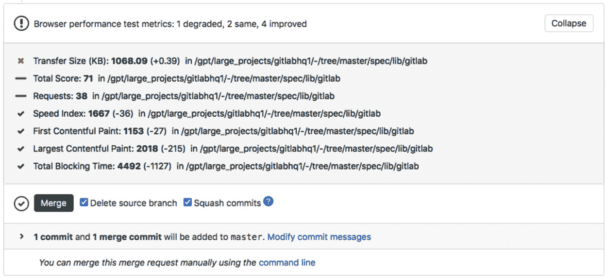
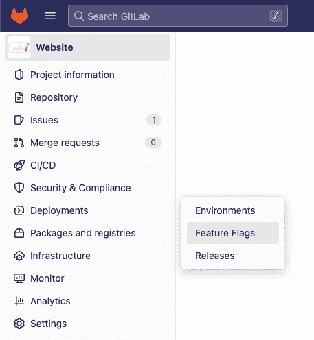
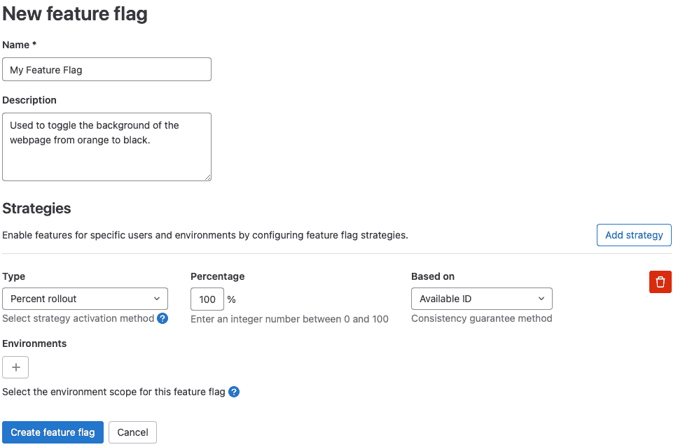

# 扩展 CI/CD 流水线的应用范围

本章旨在扩展 CI/CD 流水线在常见自动化用例中的应用。到本章结束时，你应该对 CI/CD 流水线的可能性有所了解。你会发现，它们不仅仅用于构建和部署任务，还能用于自动化任务，从而让工程师的工作更加轻松、可重复和可靠。CI/CD 流水线的目标始终是减轻工程师的工作负担，使他们能够专注于更具创新性和重要性的任务。

本章将涵盖以下主题：

+   使用 CI/CD 流水线发现性能问题

+   将第三方工具集成到 CI/CD 流水线中

+   使用 CI/CD 流水线开发移动应用

# 使用 CI/CD 流水线发现性能问题

没有比在自动化的 CI/CD 流水线中进行性能测试更合适的时机了。对于性能测试，测试应该是例行的，并且针对稳定、不变的环境或部署。如果你对一个不断变化的环境或部署进行性能测试，你将无法获得可靠的结果。没有可靠的结果，性能测试的整个意义就丧失了。你希望了解你的更改如何影响性能；没有稳定的结果，你就无法得出这种理解。

使用 GitLab，有多种方式可以运行性能测试。对于基于 Web 或 API 的部署，GitLab 包含一个原生的性能测试工具，本章将介绍该工具并讲解其集成方式。不过，作为最终用户，你可以更进一步，涵盖更多的指标，如 CPU/内存/存储使用情况，并将其融入 CI/CD 流水线中。我们本章不会讲解如何收集这些指标，因为这对每个用户的环境都是独特的。然而，我们强烈建议你将这些指标作为 CI/CD 流水线的一部分进行捕捉。

GitLab 针对 API 和基于 Web 的部署提供的原生集成性能测试工具，将检查活跃部署的众多指标。这些指标包括页面加载时间、首屏渲染时间和总阻塞时间。在合并请求中（见下图），你可以看到代码更改如何影响 Web/API 部署的性能：



图 10.1：合并请求中的性能指标视图

始终仔细检查你的测试标准

你的测试结果将直接依赖于你的测试标准、测试设置和环境。你应该始终质疑你的测试标准、设置和环境是否准确，绝不能假设它们是准确的。如果它们不准确，你的测试结果也永远不会准确。

## 如何集成浏览器性能测试

集成浏览器性能测试非常简单——只需将 GitLab 模板作为 CI/CD 管道的一部分，并指示 GitLab 如何访问您的 API 或 Web 部署。请参见以下示例。

```
include:
  - template: Verify/Browser-Performance.gitlab-ci.yml
browser_performance:
  variables:
    URL: https://myWebOrApiURL.local/
```

在前面的作业模板中，我们调用了 GitLab 中的 `browser_performance:` 模板。然后，我们重写了作业的 `URL` 变量。这个 URL 告诉性能测试套件去哪里访问并扫描我们的应用程序的性能。通过这个配置，GitLab 将检查我们的应用程序，并将结果报告到我们的合并请求中。

## 如何将负载性能测试与 k6 集成

GitLab CI/CD 默认使用的第二种测试类型是负载测试，使用的是由 Grafana 公司提供的名为 k6 的工具。GitLab 还提供了一个模板，可以将该工具作为 CI/CD 管道的一部分运行。然而，创建并指定一个 k6 配置文件来执行适当的 k6 负载测试是一个额外的步骤。

我们将在这里讲解这个过程。在此之前，请注意绝对不要在生产环境中运行这些负载测试。生产环境的负载测试应在一个与生产环境完全相同的非生产环境中运行。为了获得准确的负载测试结果，负载测试工具应该是与您的环境通信的唯一项目。事不宜迟，让我们开始集成负载测试。将以下代码添加到您的 `.gitlab-ci.yml` 文件中：

```
include:
  - template: Verify/Load-Performance-Testing.gitlab-ci.yml
load_performance:
  variables:
    K6_TEST_FILE: '<PATH TO FILE>' #.gitlab/tests/k6.js
```

上面的代码将作为我们管道的一部分执行 k6。不过，现在我们需要告知 k6 如何测试我们的应用程序，并为 GitLab 提供一个测试文件来运行。我们假设这个文件位于 `.gitlab/test/k6.js` 路径。接下来我们将一步步讲解如何构建这个文件。

以下代码将加载影响我们负载测试的库和函数。如果没有这些，负载测试文件的其余部分将会失败。接下来，我们将添加我们的设置：

```
import { check, group, sleep } from 'k6';
import http from 'k6/http';
```

以下代码将定义我们测试的选项。在 5 分钟内，我们将逐步增加到 100 个用户访问网站。然后，我们将保持 100 个用户访问 10 分钟。最后，在 5 分钟内，我们将逐步减少到 0 个用户。这意味着此测试将总共运行 20 分钟：

```
export const options = {
  stages: [
    { duration: '5m', target: 100 },
    { duration: '10m', target: 100 },
    { duration: '5m', target: 0 },
  ],
  thresholds: {
    'http_req_duration': ['p(99)<1500']
  },
};
```

然后，我们必须设置失败的阈值。我们希望看到 99% 的所有请求在 1500 毫秒内响应。任何超出此范围的请求都将失败。接下来，我们将执行实际的负载测试。

以下代码将使用 k6 执行我们的网站性能测试。现在这个文件已经成功构建，我们可以执行我们的管道并进行可重复的负载测试：

```
export default() => {
  const myResponse = http.get('<MY URL or ENV VAR>').json();
  check(myResponse, { 'retrieved url: (obj) => obj.length > 0 });
  sleep(1);
};
```

在设置好性能测试后，我们将把注意力转向如何利用功能标志在部署后启用和禁用应用程序的部分功能。

## 使用功能标志来支持以业务为驱动的发布决策

GitLab 提供了在 UI 中设置功能标志的功能。它基于*第三方* `unleash` 库。一旦在 GitLab UI 中设置了功能标志，您需要配置应用程序与 GitLab 通信以检查功能标志。我们将介绍这两个步骤的示例，但 GitLab 不会为您完成这项工作：这项工作需要由您的应用程序开发人员来做。

一旦在 UI 中配置了功能标志，就需要通过应用程序发出 API 调用来检查标志，并相应地更改应用程序的逻辑。让我们来看看如何在 UI 中设置功能标志：

1.  在项目中，打开左侧的导航窗格。点击**部署** | **功能标志**。这将带您进入主要的功能标志部分。在右上角，点击**新建功能标志**。这将带您进入一个新的视图：



图 10.2：GitLab 导航窗格中的功能标志

1.  您将看到一个表单。填写表单并根据需要规划策略。您可以根据环境、用户列表和用户 ID 设置多个策略，并为不同的组分配百分比。提交后，界面将如下所示：



图 10.3：主要功能标志视图

1.  功能标志在推出新功能时极其强大。通过将新功能放在功能标志后面，您可以通过切换标志来关闭应用程序的一部分。这有助于防止回滚发布或紧急支持工单：


图 10.4：功能标志详细视图

在*图 10.4*中，您可以看到我们新创建的功能标志。在左侧的**状态**下，您可以看到一个复选框，用于启用或禁用该标志。

## 如何为功能标志配置您的应用程序

本节将介绍一个检查应用程序中的功能标志的用例。以下是一个 Ruby 代码示例，它将检查功能标志并根据设置的标志切换代码路径。您的团队应用程序的开发人员需要根据他们的工具链和语言使用情况设置应用程序：

```
require 'unleash'
require 'unleash/context'
unleash = Unleash::Client.new({
  url: 'http://gitlab.com/api/v4/feature_flags/unleash/42',
  app_name: 'production',
  instance_id: '29QmjsW6KngPR5JNPMWx'
})
unleash_context = Unleash::Context.new
unleash_context.user_id = "123"
if unleash.is_enabled?("my_feature_name", unleash_context)
  puts "Feature enabled"
else
  puts "Feature disabled!"
end
```

在这个 Ruby 示例中，首先设置 GitLab 信息，包括 GitLab 实例的 URL、应用程序的名称（与 GitLab 中的环境对应）以及实例 ID（GitLab 项目的数字 ID）。

`user_id` 参数是向 GitLab 传递信息的示例。在这个例子中，我们传递了一个用户 ID，GitLab 会将其与配置好的功能标志策略进行匹配。下一步是调用 `unclear.is_enabled`，它接受功能名称作为变量，然后联系 GitLab 确定您是否属于已启用标志的组。接着，将执行启用的代码路径。

现在我们已经介绍了功能标志的使用和目的，我们将继续讲解如何将第三方工具集成到 CI/CD 管道中。

# 将第三方工具集成到 CI/CD 管道中

在本节中，我们将介绍如何将第三方工具集成到 CI/CD 管道中。将第三方工具集成到 CI/CD 管道中的首选方法是将其容器化，创建一个使用该容器的 CI/CD 作业，然后在该作业中调用我们的工具。在许多情况下，这是必需的，并且是设置集成的第一步。

工具格式要求

本节假设你想集成的工具已经编译好并准备好集成到你的管道中。如果它尚未准备好，你可以在此处提到的作业之前添加 CI 作业，以编译或组装该工具。然后，你可以调用本节中的 CI 作业和步骤。

## 创建我们的工具容器的 Dockerfile

在上一章中，我们讨论了如何构建专用容器。我们将在这里使用这种方法来集成你的工具。如果你还没有阅读上一章中的*使用专用容器保护和加速作业*部分，强烈建议你先阅读它，然后再回来。

这个过程的第一步是为你的工具和容器设置一个新的 GitLab 项目。一旦设置好后，将二进制文件、配置文件和你希望放入容器中的其他文件提交到该项目。下一步是构建容器并将这些内容放入其中。在你的仓库中创建一个 Dockerfile，并添加以下示例代码。`$mybinary`是你的二进制文件名的占位符；`myTool`将是你的工具的名称。

如以下代码所示，我们已经创建了一个从`alpine:3.13.0`派生的新容器。我们更新了容器，然后为我们的工具创建了一个目录。在创建该目录后，我们将仓库中的所有文件添加到该文件夹，并赋予它们宽泛的权限，同时将我们的二进制文件设置为可执行：

```
FROM alpine:3.13.0
RUN apk update && mkdir /opt/myTool
ADD . /opt/myTool
RUN chmod 777 -R /opt/myTool && chmod +x /opt/myTool/$mybinary
USER 1001
CMD ["echo", "This is a purpose-built container. It is meant to be used in a pipeline and not executed."]
```

这是一个简化的集成第三方工具的示例。你应该始终将权限值自定义为运行工具所需的最小权限。你还应该只将工具运行所需的文件放入容器中。在这个示例中，我们采取了宽泛的方式，包含了所有文件，并赋予了宽泛的权限。

## 自动化容器构建

现在我们有了一个 Dockerfile，我们需要构建容器。作为额外的操作，我们还将启用容器扫描。如果你还没有创建`.gitlab-ci.yml`文件，请在你的仓库中创建一个。接下来，我们将用以下代码填充该`.gitlab-ci.yml`文件：

```
Container_Build:
  stage: build
  image: docker:20.10:16
  services:
    - docker:20.10:16-dind
  variables:
    DOCKER_HOST: tcp://docker:2376
    DOCKER_TLS_VERIFY: 0
  script:
    - docker login -u $CI_REGISTRY_USER –p $CI_REGISTRY_PASSWORD $CI_REGISTRY
    - docker build -t $CI_REGISTRY_IMAGE:latest .
    - docker push $CI_REGISTRY_IMAGE:latest
```

避免每次提交时触发管道运行

在进行多次管道更改时，你可能不希望每次修改时都启动一个管道运行。如果你在提交信息开头添加`[CI SKIP]`，GitLab 将不会为该提交启动管道。

上述代码是 Docker-in-Docker 构建的最基本示例。首先，我们利用 `image: docker:20.10.16` 来定义我们希望构建的 Docker 版本。然后，我们定义要使用的 Docker 服务——即 `dind` 容器。接着，我们设置 `DOCKER_HOST` 和 `DOCKER_TLS_VERIFY` 变量，以便 Docker 和 `dind` 容器能够互相通信。最后，我们调用 `docker build` 命令来构建我们的容器，使用 `docker push` 命令将其上传到 GitLab 的容器注册表中。

GitLab Runner 对 Docker 的要求

构建一个 Docker 容器通常需要使用能够执行 Docker-in-Docker 容器构建的 GitLab Runner。GitLab.com 提供的共享 Runner 已预先配置了此功能。如果你使用的是自托管 Runner，可能需要重新配置它。请参考 GitLab 文档了解如何实现这一点。

## 容器扫描

GitLab 在容器构建过程中提供容器扫描功能。我们希望利用这一点来识别容器中的任何依赖关系或其他漏洞。启用此功能非常简单：你只需要在 `.gitlab-ci.yml` 文件中定义一个测试阶段。然后，只需将以下代码块添加到 `.gitlab-ci.yml` 文件的顶部：

```
include:
  - template: Jobs/Container-Scanning.gitlab-ci.yml
```

## 调用第三方工具

到这个步骤，我们应该已经有了一个构建好的第三方工具容器，经过扫描并存放在 GitLab 容器注册表中。现在剩下的就是调用我们的工具。我们可以通过创建一个指向我们容器并在容器内调用可执行文件的 CI/CD 任务来实现：

```
Test_Job:
  stage: test
  image: path/to/my/container
  script:
    - /opt/myTool/$myBinary
```

到目前为止，我们已经讲解了如何构建包含工具的容器，如何扫描容器以及如何通过 CI/CD 任务调用该工具。这是一个基本示例，向你展示了可能实现的艺术。通过这个过程，你可以克隆第三方工具、自定义脚本、自定义配置或任何其他你想在 CI/CD 管道中包含的内容。

这样做有很多重大好处。例如，任何作为 CI/CD 管道一部分运行的容器都可以访问 GitLab API 和 GitLab 仓库。这意味着你可以将 CI/CD 任务作为管道的一部分运行，用于度量收集或配置验证等。以这种方式构建的 CI/CD 任务几乎可以自动化任何操作。

如果你构建并容器化了一个自定义工具，务必与社区共享它。

在下一部分，我们将讨论如何使用 GitLab CI/CD 和 Fastlane 构建移动应用。

# 使用 CI/CD 管道开发移动应用

在本节中，我们将讨论如何在 GitLab 中为移动应用程序开发设置 CI/CD 管道。自动化移动开发过程的打包阶段有很多好处，最显著的是，打包移动应用程序涉及多个证书、授权和配置文件，在打包应用程序时需要花费大量时间来组装这些文件。除此之外，移动应用程序的测试过程可能是手动且繁琐的。通过自动化跨多个设备的截图等操作，我们可以大大减少开发人员的工作量。

本节假设您已经配置并使下列所有要求正常工作。我们不会讨论如何进行移动开发，而是如何使用 Fastlane 和 GitLab 自动化您的移动开发实践。

## 要求

对于本节，您将需要以下内容：

+   一台运行最新版本 OS X 的 macOS 设备或虚拟机，并已安装 Fastlane

+   在您的 macOS 设备上安装 GitLab Runner

+   一个 Apple 开发者账户

+   一个 Google 开发者账户

+   一款可以在您的 macOS 设备上成功构建的应用程序

在继续之前请阅读此内容

如果您无法满足这些要求，您应停止并等待能够满足这些要求后再继续。本指南假设您已经拥有一台可用且配置好的 macOS 设备，并且能够在设备上构建移动应用程序。

## Fastlane

在本章中，我们将使用 Fastlane CLI 工具来自动化我们的测试、构建和部署。Fastlane 是一款同时支持 Android 和 iOS 构建流程的工具。它是一个开源工具，可以在 macOS 和 Windows 平台上免费安装。您可以在 [`docs.fastlane.tools/getting-started/ios/setup/`](https://docs.fastlane.tools/getting-started/ios/setup/) 阅读更多关于它的文档。

我们假设您已经在机器上安装了 Fastlane。如果没有，请参考之前链接的 Fastlane 文档，选择适合您的平台进行安装。此过程的第一步是打开您的移动应用程序项目，并创建一个名为 `Fastfile` 的 Fastlane 配置文件。Fastfile 是 Fastlane 使用的主要配置文件。我们将使我们的 Fastfile 看起来像这样：

```
lane :beta do
  build_app(Scheme: "MyApp") # For iOS
  gradle( task: 'assemble', build_type: 'Release') # For Android
end
```

要为 iOS 和 Android 构建我们的移动应用程序，我们只需运行 `fastlane beta` 命令。假设您的 iOS 和 Android 应用程序已经可以在 macOS 设备上构建，那么此命令应自动化它们的构建。我们可以将其放入 GitLab CI 文件中，如下所示：

```
"Build Mobile Applications":
  stage: build
  tags:
    - my-osx-runner
  script:
    - fastlane beta
```

此 GitLab CI 作业将通过 GitLab 管道自动化 Fastlane 过程。我们利用 `tags:` 关键字确保此构建发生在特定的 macOS 设备上。如果没有这个关键字，构建可能会发生在任何 GitLab Runner 上。

## Fastlane – 部署

你可以将移动应用程序部署到 Android 和 Apple 商店。然而，在设置 Fastlane 之前，你需要先为生产环境配置所有移动证书。当这些证书过期时，必须有人在 macOS 设备上更新它们。不过，如果这些证书已经配置好，你可以像下面这样修改你的 `Fastfile`：

```
lane :appstore do
  sync_code_signing(type: "appstore")
  build_app(scheme: "MyApp")
  upload_to_app_store
end
lane :playstore do
  gradle(task: 'assemble', build_type: 'Release')
  upload_to_play_store
end
```

之前对 Fastfile 的修改将构建你的应用程序并发布到相应的应用商店。你只需运行 `Fastlane appstore` 和 `Fastlane playstore` 命令。相应的 GitLab CI/CD 配置文件如下所示：

```
"Deliver Mobile Applications":
  stage: release
  tags:
    - my-osx-runner
  script:
    - fastlane appstore
    - fastlane playstore
```

## Fastlane – 自动化测试

假设你已经为项目设置了单元测试，Fastlane 也可以自动化这些测试。它不会自动设置测试，但如果你已经将它们作为项目配置的一部分，Fastlane 就可以调用它们。这个过程与之前的每一步类似 – 我们从修改 Fastfile 开始，如下所示：

```
lane :iosTest do
  run_tests( devices: ["iPhone 6s", "iPad Air"], scheme: "MyAppTests")
end
lane :androidTests do
  gradle(task: "test")
end
```

就像之前一样，我们可以修改我们的 GitLab CI/CD 配置文件，加入自动化测试：

```
"Test Mobile Applications":
  stage: test
  tags:
    - my-osx-runner
  script:
    - fastlane iOSTests
    - fastlane androidTests
```

有时，使用 Fastlane 可能会让你感觉像是在作弊。一旦你在设备上建立了一个移动项目，Fastlane 就能接管剩下的工作。在 Fastlane 出现之前，移动开发是一个繁琐且手动的过程。CI/CD 管道充满了大量的代码和逻辑，用来生成构建并进行部署。

在本节中，我们讨论了如何构建 Fastfile 来配置 Fastlane，如何运行 Fastlane 命令，以及最重要的，如何将它们添加到 GitLab CI/CD 配置文件中。我们之前提到过这一点，但最后再次强调：Fastlane 和使用 GitLab CI/CD 管道自动化移动开发最适合已经配置并设置好以构建移动应用程序的 macOS 设备。从那里开始，然后使用 GitLab CI 和 Fastlane 处理其余部分。

# 总结

在本章中，我们讨论了在 CI/CD 管道中加入性能检查的好处。我们还讨论了如何包含 GitLab 的本地性能测试工具。接下来，我们介绍了功能标志的好处，以及它们如何保护你的部署并防止耗时的回滚。然后，我们介绍了如何将第三方工具集成到你的 CI/CD 管道中，并如何将它们容器化以供使用。最后，我们讲解了如何使用 Fastlane 自动化创建和部署移动应用程序。

在下一章，我们将介绍一个端到端的示例，涵盖本书中所学到的所有内容。
