# 11

# 端到端示例

到目前为止，你已经了解了 GitLab 的各个部分如何帮助你编写、审查、验证、保护、打包和部署软件。这些功能已经一一介绍过了，现在让我们把它们全部结合起来，展示一个完整的端到端示例，让你能一次性看到整个过程。在本章中不会有任何新的内容，所以这是一个复习之前章节内容的好机会，看看它们如何在一个扩展的工作流程中整合在一起。

本章分为多个子章节，每个章节展示如何使用 GitLab 来帮助软件开发生命周期中的不同部分：

+   设置你的开发环境

+   编写代码

+   建立流水线基础设施

+   验证你的代码

+   保护你的代码

+   改进你的流水线

+   将你的代码交付到正确的环境

# 技术要求

如果你想跟随我们一起开发一款使用 GitLab 的软件，你只需要拥有一个 GitLab 实例的账户，无论是软件即服务（SaaS）还是自托管实例。

# 设置你的开发环境

在你开始编写任何代码之前，需要整理一些初步事项。具体来说，你需要创建一个 GitLab 项目来存储你的代码并运行你的流水线，你需要创建一些 GitLab 问题来帮助规划和跟踪你的工作，此外你还需要将项目的代码仓库克隆到本地计算机，这样你就可以使用自己喜欢的 IDE 编写代码，而不是完全依赖 GitLab 的图形界面。

## 创建一个 GitLab 项目

让我们回到创建 Hats for Cats 网页应用的初衷。我们知道我们想为我们的在线猫咪配饰商店开发一个网页应用，所以让我们首先创建一个 GitLab 项目，既容纳网页应用的代码，也容纳我们在开发过程中将使用的其他 GitLab 组件。

关于图形用户界面的说明

在本章中，我们将继续展示代码片段，但通常不会展示使用 GitLab 图形界面的步骤。这样做是为了避免随着 GitLab 图形界面在未来版本中发生变化，截图内容会失去实用性。

我们本可以直接在 GitLab 账户的顶级命名空间中创建一个 Hats for Cats 项目，但考虑到我们未来可能会创建更多项目——也许是其他网页应用，也许是针对不同平台的同一网页应用的不同版本——因此，首先我们应该创建一个 GitLab 组来容纳所有项目。假设我们的公司名为 Acme Software，我们将从一个名为 Acme Software 的组开始：

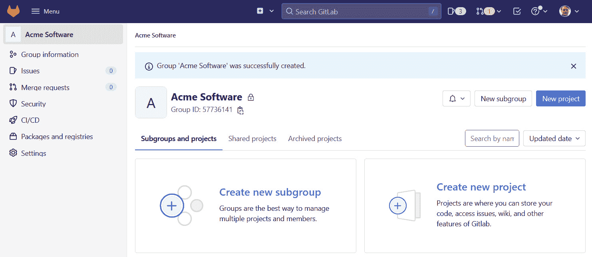

图 11.1 – Acme Software 组

在这个组内，我们可以添加一个新的项目来托管 Hats for Cats 网页应用。我们将其命名为 `Hats for Cats`，并选择其 Git 仓库中的 `README.md` 文件，但不选择其他文件。创建后的新项目如下所示：

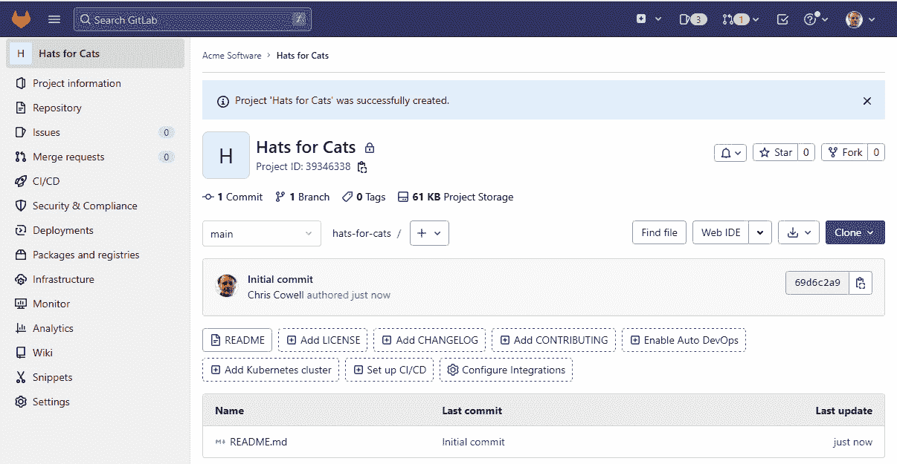

图 11.2 – **Hats for Cats** 项目

正如你已经知道的，这个项目不仅包含我们的网页应用程序的代码，还包括我们的 CI/CD 管道配置文件、与代码相关的分支和**合并请求**（**MRs**）、准备部署的代码包，以及帮助我们规划和跟踪工作的各类问题。这自然引出了我们工作流的下一步：创建 GitLab 问题。

将所有项目放置在一个小组中

出于技术原因，本章其余部分的截图显示的是**Hats for Cats**项目直接在用户账户下，而不是在**Acme Software**小组中。然而，最佳实践是将公司或组织的所有项目都创建在一个主小组下。

## 使用 GitLab 问题规划工作

使用 GitLab 问题来规划和跟踪工作是编写 GitLab 软件的一个可选但强烈推荐的步骤。当然，你可以使用其他工具，如 Jira 或 Trello 来规划工作，但许多开发人员发现，GitLab 问题可以为标准项目管理任务提供所需的所有功能。

GitLab 项目对于一些复杂的软件可能包含数十个、数百个，甚至在极端情况下，包含成千上万的问题——为了教学目的，让我们只为我们的项目创建四个问题。为了构建我们的网页应用程序的**最小可行产品**（**MVP**），我们将创建以下标题的问题：

+   `允许用户` `登录`

+   `允许用户` `搜索库存`

+   `允许用户购买` `一顶帽子`

+   `允许用户` `登出`

一旦这些准备好后，我们就可以考虑 GitLab 标签了。一些团队会在每个问题上使用多个标签，以指示归属、分配优先级或执行其他管理功能。让我们创建并分配一个无范围的**安全**标签，表示登录和登出的问题需要我们的安全团队额外关注。我们还将创建带有范围的**priority::high**和**priority::low**标签，指示哪些功能应优先处理，哪些可以稍后再做。目前，只需将**priority::high**分配给登录问题——我们稍后会作为团队决定其他问题的优先级标签。

接下来，让我们处理登录问题的元数据，这是我们希望首先开发的功能。我们打开该问题，将其分配给开发人员，将**Weight**字段设置为**5**（经过讨论，我们认为这是一个中等大小任务的合理权重），使用快速操作估算完成它需要 15 小时的工作时间，并设置一个截止日期。在创建问题的同时设置元数据是许多使用看板工作流的团队的常见做法；如果我们使用的是 Scrum 工作流，可能会等到下一次积压梳理会议时再分配截止日期、权重或估算工时。

在创建了这四个问题、为它们创建并分配了适当的标签，并填写了其中一个问题的元数据后，点击左侧导航栏中的**问题** | **列表**，应该会显示类似这样的内容。请注意，元数据直接显示在问题列表中，这非常方便：

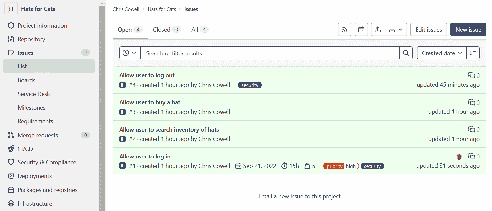

图 11.3 – Hats for Cats 问题和问题元数据

你已经完成了 GitLab 环境的设置：你创建了一个 GitLab 组，在其中创建了一个 GitLab 项目，并创建了一些需要解决的问题。现在，你已经准备好开始编写代码，并将其存储在该项目中。

## 设置本地 Git 版本库

尽管我们*可以*在 GitLab 实例内完成所有的开发工作，但那样会使得编写代码变得困难，测试也无法进行。相反，让我们将版本库克隆到本地计算机上，这样我们就可以使用我们最熟悉的桌面 IDE 或其他工具来进行开发。

首先，我们需要确保已经在工作站上生成了公钥/私钥对，并将公钥上传到 GitLab 帐户。这项工作对于任何我们正在使用的 GitLab 实例只需做一次，因此我们假设这部分已经完成。GitLab 文档中有关于此过程的更多信息。

接下来，我们需要获取用于克隆**Hats for Cats**项目版本库的地址。由于我们使用基于密钥的安全性，而不是在每个 Git 命令中手动输入认证凭据，因此我们通过图形界面复制项目的 SSH 地址，然后通过在本地机器上运行以下命令来克隆它（如果你在家里跟着操作，你会看到一个略有不同的地址，基于你的 GitLab 帐户名）：

```
git clone git@gitlab.com:acme-software/hats-for-cats.git
```

然后，我们可以进入克隆操作创建的目录并查看。如果一切正常，我们应该会看到与 GitLab 托管版本库中相同的文件的本地副本——此时的副本只有一个`README.md`文件：

```
~$ cd hats-for-cats
~/hats-for-cats$ ls
README.md
```

现在，我们已经准备好进行本地开发，将任何修改推送到 GitLab 上版本库的副本，并拉取同事们推送上来的修改。

# 编写代码

你已经接近可以开始编码的阶段。首先，你需要一个 Git 分支来提交代码。然后，你需要一个 MR，这样你就可以看到针对这段代码运行的管道任务的结果，并且最终将代码合并到`main`分支。让我们先了解这些步骤，然后进行第一次提交并推送。

## 创建一个用于开发的 Git 分支

现在我们已经准备好添加第一个分配问题所要求的登录功能，我们需要一个 Git 分支来提交代码。我们不妨将分支命名为我们正在处理的那个问题的标题：

```
git branch add-login-feature
```

切换到新的分支，这样任何新的提交都将进入该分支，而不是`main`分支：

```
git checkout add-login-feature
```

在这一点上，我们不妨将这个分支推送到 GitLab 托管的代码库副本中，这样它就能同时存在于两个地方。对于第一次推送，我们需要使用一个稍微长一些的命令：

```
git push --set-upstream origin add-login-feature
```

对于后续的推送，在我们添加了一些提交之后，我们可以依赖一个更简单的命令：

```
git push
```

如果我们查看 GitLab 中项目的代码库，可以看到它现在在项目的分支下拉菜单中列出了**add-login-feature**。

## 创建 MR

让我们遵循 GitLab 最佳实践，立即为我们刚创建的分支创建一个 MR。导航到左侧导航窗格中的**Ns**，点击**New merge request**。选择**add-login-feature**作为源分支，**main**作为目标分支，然后点击**Compare branches** **and continue**。

给 MR 起个标题 `Draft: add login feature`，并在描述字段中添加`Closes #X`，其中`X`替换为描述中的`#`对应的数字，图形界面会为你展示一个下拉菜单，显示你创建的所有问题，这样你就不需要手动查找问题编号了）。现在，我们已经创建了问题、分支和 MR 这“三个好朋友”，可以开始开发我们的功能了。

## 提交和推送代码

该是写代码的时候了！我们不打算写一个包含真实 GUI 元素和逻辑的实际登录页面，而是用我们本地的计算机在`print("Welcome to Hats for Cats!")`的根目录下创建一个名为`login.py`的文件。因为我们是在本地计算机上操作，而不是在 GitLab 上，所以我们需要使用 Git 终端命令或者 Git 的图形化工具（如**Sourcetree**、**Tower**，或内置于 IDE（如**IntelliJ IDEA**或**Visual Studio Code**）中的 Git 工具）将新文件添加到 Git 暂存区，然后提交一个适当的提交信息。可以通过命令行进行这些操作：

```
git add login.py
git commit -m "add initial version of log in page"
```

在这一点上必须重申，本地提交*不会*触发 CI/CD 流水线。GitLab 实例并不知道这个提交的存在，即使知道，它也无法查看该提交中包含的代码。然而，一旦我们将任何本地提交推送到 GitLab，它会在自己副本中的代码库中检测到这些提交，并针对我们推送的任何提交运行流水线。

现在让我们推送**add-login-feature**分支：

```
git push
```

经常推送非常重要！

我们本可以等到对这个分支做了多个本地提交后再推送，但由于 GitLab CI/CD 流水线的强大功能正是来自于它们频繁地对小的代码变化进行运行，通常在每次本地提交后推送是最明智的选择。

这只是一个如此简单的编辑——添加一个包含一行代码的文件——你可能会想，为什么我们不直接在 GitLab GUI 中进行编辑并提交更改，而要通过本地编辑、提交再推送到 GitLab 的麻烦。说实话，对于这样一个小更改，我们完全可以直接在 GitLab 上进行编辑。如果这是一个真实项目，那正是我们会建议你这么做，但由于大多数开发工作远比这里包含的占位符代码更为复杂，我们认为展示一下典型的*本地编辑并提交然后推送*工作流会对你有所帮助，这是你在大多数开发工作中会用到的流程。

# 建立管道基础设施

你已经将一些代码存储在仓库中，所以现在是时候设置一个管道，执行一系列任务来构建、验证和保护你的代码。在某些情况下，你可能还想设置一个 GitLab Runner 来执行这些管道任务，尽管这个任务通常由你的 GitLab 管理员或 GitLab SaaS 平台为你处理。

## 创建管道

向 GitLab 推送提交，以便它可以在我们的新代码上运行 CI/CD 管道，只有在我们定义了管道要执行的任务后，这一操作才会生效。我们将在本章接下来的部分中向**Hats for Cats**项目的管道中添加多个任务，但现在，让我们先设置一个基础的管道。

就像我们在最初的文件中所做的那样，我们可以在本地创建`.gitlab-ci.yml`管道配置文件，提交并推送到 GitLab，但由于 GitLab GUI 提供了一个专门用于编写和调试管道配置文件的方便编辑器，通常更有意义在 GitLab 上进行编辑。因为我们无法在本地机器上运行管道，所以`.gitlab-ci.yml`的本地副本并不重要。

在左侧导航面板中，选择`.gitlab-ci.yml`。此时，我们并不确定在管道中需要哪些阶段。可以合理地认为，在你真正需要阶段之前没必要定义它们，但我们相当确信我们将需要`build`、`test`和`deploy`这三项基本任务，因此为了完整展示这个例子，我们现在就添加这三项：

```
stages:
    - build
    - test
    - deploy
```

由于 Python 是一种解释型语言，而非编译型语言，我们在`build`阶段还没有任何需要定义的任务。我们也还没有编写任何自动化测试，因此没有必要添加执行测试的任务。我们希望运行一些安全扫描并进行其他验证任务，但这些任务将在稍后定义。我们还需要将代码部署到多个环境中，但这也将稍后处理。现在，让我们只添加一个虚拟任务，这样 GitLab 就不会因为管道中缺少任务定义而抱怨（如果我们不这样做，GitLab 实际上会认为管道配置文件格式不正确，并且位于专用编辑器顶部的代码检查器会给我们警告）。将这个内容粘贴到`stages:`部分下方：

```
# temporary job that we'll delete later
job1:
    stage: build
    script:
        - echo "in job1"
```

在提交此更改后，我们导航到`.gitlab-ci.yml`—并且它在共享运行器上成功执行了`job1`，没有任何问题。当然，如果你使用的是没有提供共享运行器的 GitLab 实例，你需要为该项目创建自己的运行器，才能使管道运行。幸运的是，这正是我们工作流中的下一个步骤。

## 创建一个运行器

如你所知，GitLab 的 SaaS 版本用户可以在 GitLab Runners 上运行他们的管道，这些 Runners 是软件订阅的一部分，但如果你使用的是自托管版本的 GitLab，或者如果你想在自己的硬件上运行一些管道，以避免耗尽订阅中的 GitLab Runner 分钟数，你需要设置一个或多个你自己的 GitLab Runners。让我们为我们的**Hats for** **Cats**项目创建一些专用的运行器。

我们决定在一台闲置的 Linux 机器上创建运行器。考虑到 GitLab Runner 二进制文件在主要 Linux 发行版的仓库中通常是几个版本之前的版本，我们查阅了 GitLab 文档，了解如何将官方 GitLab 仓库添加到我们的 Linux 机器的包管理系统中，下载最新的 GitLab Runner 二进制文件，将其作为服务安装，并确保它在运行。由于这个过程因操作系统和 Linux 发行版而异，我们在这里不会提供详细的操作步骤。

GitLab Runner 版本

尽管 GitLab Runners 通常在与 GitLab 实例的版本相差几个小版本时仍然能正常工作（例如 15.0 对 15.3），但如果你保持这两个版本同步，它们将最可靠地运行。

一旦`gitlab-runner`二进制文件安装在将托管运行器的计算机上，我们需要通过注册它们来创建运行器。在此之前，我们需要收集一些信息。我们已经决定运行器将专门用于`abc123`。

我们决定注册两个运行器。我们可以随意给它们命名，但我们最终选择了最明显的命名方案：**Hats for Cats 1**和**Hats for** **Cats 2**。

接下来，我们选择在两个运行器上都使用 Docker 执行器，因为这样可以为它们提供最大的灵活性：它们可以处理任何 CI/CD 流水线作业，因为它们可以在已经安装了所有必需工具的 Docker 镜像中执行作业。我们决定指定 `alpine:latest` 作为运行器将用于未指定镜像的作业的默认 Docker 镜像，因为这是最小的功能完备的 Linux 发行版，因此下载速度最快。最后，我们决定不向运行器添加任何标签，因为我们不打算使任何一个运行器成为特定用途。

当然，除非托管运行器的机器上安装并运行 Docker，否则我们无法使用 Docker 执行器注册运行器。Docker 的安装说明偶尔会有所变化，并且根据操作系统而异，因此官方 Docker 文档是您在此步骤中的最佳信息来源。

一旦 Docker 在与运行器相同的主机上启动并运行，我们可以通过 `gitlab-runner register` 以交互方式注册单个运行器，但在这种情况下，让我们通过将所有细节作为选项传递给单个终端命令来非交互式地注册运行器。我们使用这条命令在将托管运行器的 Linux 服务器上注册第一个运行器（根据需要更改 `--url` 和 `--registration-token` 值）：

```
sudo gitlab-runner register \
  --non-interactive \
  --url "https://gitlab.hats-for-cats.com/" \
  --registration-token "abc123" \
  --executor "docker" \
  --docker-image "alpine:latest" \
  --description "Hats for Cats 1"
```

我需要使用 sudo 吗？

检查 GitLab 文档，了解在您的操作系统上 `gitlab-runner` 二进制文件是否需要 `sudo` 或管理员权限；命令在不同平台上的行为有所不同。

我们可以运行相同的命令，更改 `--description` 选项的值，以创建第二个运行器。

现在两个运行器都已注册，请确保它们都已启动并运行：

```
~$ sudo gitlab-runner verify
Runtime platform         arch=amd64 os=linux pid=6365
revision=bbcb5aba version=15.3.0
Running in system-mode.
Verifying runner... is alive             runner=LuKAFv53
Verifying runner... is alive             runner=Rtq7yC5e
```

最后，请刷新我们通过 **设置** | **CI/CD** | **Runners** 进入的 GitLab 页面，并确保两个运行器能够连接到我们的 GitLab 实例并声明自己已准备好接受来自 **Hats for Cats** 项目的作业。这是该屏幕相关部分的内容：

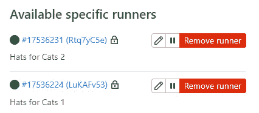

图 11.4 – Hats for Cats 项目的特定运行器

在继续之前，您可能希望查阅 GitLab 文档，以了解注册运行器的主配置文件中 `concurrent` 和 `check_interval` 选项的更多信息。有时，调整这两个选项的值可以帮助运行器更快地接收作业。这个配置文件在将 `gitlab-runner` 二进制文件作为 root 用户运行的 Linux 系统上是 `/etc/gitlab-runner/config.toml`，但当 `gitlab-runner` 不作为 root 运行或在其他操作系统上运行时，可能存在其他位置。运行 `gitlab-runner list`（根据您注册运行器的方式，可能需要或不需要 `sudo`）应该会显示该文件在您系统上的位置。

可选：禁用共享运行器

如果你正在自己的 GitLab 账户中操作，可能需要前往 **Settings** | **CI/CD** | **Runners** 并禁用所有 **Hats for Cats** 项目的共享 Runner。这样可以确保该项目的所有 CI/CD 流水线任务会被分配到我们刚刚注册的两个 Runner 之一。

在配置好基础的 CI/CD 流水线配置文件并注册了两个 Runner 后，我们已完成项目基本流水线基础设施的设置。现在，我们需要开始向流水线中添加任务，以便它可以运行所有的测试和扫描，从而让 GitLab 流水线成为一个强大的软件开发工具。

# 验证你的代码

让我们配置你的流水线，使其能够通过运行功能测试、代码质量扫描和模糊测试来验证你的代码。

## 向流水线添加功能测试

许多团队通过向流水线添加任务来运行自动化功能测试，确保他们的代码按预期的方式运行。在之前的章节中，你已经学到有许多不同种类的功能测试。在这个例子中，我们将添加一些使用 `pytest` 框架编写的基础自动化单元测试。我们的项目代码尚不复杂到需要真正的单元测试，但为了本示例，我们可以添加一些虚拟测试，以便 GitLab 可以运行它们并显示结果。

在添加任何测试之前，让我们先使登录代码变得 *稍微* 复杂一点，通过添加一个函数供测试调用，并在其中加入一个“待办”注释，不仅提醒我们稍后完善这个占位符函数，还给代码质量扫描器提供了检测的目标。无论是在本地（在这种情况下，你需要进行提交并推送）还是在 GitLab 图形界面中，都将以下简单代码添加到 `login.py` 文件中：

```
def log_user_in(username, password):
    return (username == "Dana") and (password == "p@ssw0rd")
# TODO: replace this placeholder code with real logic
```

我们还需要声明对 `pytest` 框架的依赖，这样 GitLab 才能在运行自动化测试之前安装它。由于这是一个 Python 项目，我们将在项目仓库的顶层（仍然在**add-login-feature**分支上）声明这个依赖，并创建一个新的 `requirements.txt` 文件，文件内容为一行：

```
pytest==7.1.3
```

有多种方法可以在文件和目录中对自动化单元测试进行分组，但为了简单起见，我们在仓库的根目录下添加一个名为`test_login.py`的文件，放在我们一直在使用的**add-login-feature**分支中。

我们将在这个文件中添加三个测试：一个用于检查使用正确凭据的登录功能，一个用于测试使用错误用户名登录，另一个用于测试使用错误密码登录。我们还需要导入被测试的函数，以便单元测试能够调用它。将以下代码添加到 `test_login.py`：

```
from login import log_user_in
def test_login_good_credentials():
    assert log_user_in("Dana", "p@ssw0rd")
def test_login_bad_username():
    assert not log_user_in("foo", "p@ssw0rd")
def test_login_bad_password():
    assert not log_user_in("Dana", "foo")
```

扩展你的自动化测试

这些单元测试示例比你在真实项目中通常使用的要简单。大多数单元测试框架——无论测试的是哪种语言——都提供了多种选项和附加功能，帮助你使测试更全面、更强大。我们建议你彻底了解你选择的测试框架，因为自动化测试是编写高质量代码的重要组成部分。

让我们在流水线的`test`阶段添加一个任务，安装`pytest`库（如`requirements.txt`中列出），并运行测试。该任务应要求执行器在一个包含最新版本 Python 的 Docker 容器中执行命令。`pytest`测试框架会自动识别包含测试的文件，因此我们不需要指定执行哪个测试文件。我们需要告诉`pytest`生成一个`junit`格式的输出文件，这是 GitLab 能够解析和显示的测试结果格式。将此任务定义添加到你当前在**add-login-feature**分支上的`.gitlab-ci.yml`文件中：

```
unit-tests:
    stage: test
    image: python:3.10
    script:
        - pip install -r requirements.txt
        - pytest --junit-xml=unit_test_results.xml
```

既然我们已经在 CI/CD 流水线中定义了一个真实的任务，如果你想简化流水线配置文件，可以删除临时`job1`任务的定义。

当由此提交触发的流水线完成后，你会注意到，即使`unit-tests`任务成功运行，流水线详情页面仍然没有显示任何测试结果。这是因为我们没有告诉 GitLab 将结果保留为构件。让我们通过将以下代码添加到`unit-tests`任务定义的末尾来修复这个问题，确保所有行都正确缩进，以便 GitLab 将此代码理解为现有任务定义的一部分：

```
    artifacts:
        reports:
            junit: unit_test_results.xml
        when: always
```

这样，我们应该能够使单元测试正常运行并通过，这是确保代码符合设计规范的一大步。如果你一直在跟进，应该可以在最新的流水线详情页面的**测试**选项卡中看到类似的输出，显示所有三个单元测试都在运行并通过：

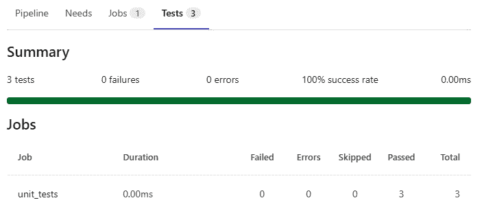

图 11.5 – 流水线详情页面上的测试结果

一旦自动化测试通过，你就可以确信你的代码做到了它应该做的事情。然而，仅仅正常运行还不够：你的代码还需要编写得很好。这有助于确保代码具有可读性和可维护性，并且在你将来为其扩展新功能时，不太可能出现 bug。因此，接下来，让我们来看看如何确保你的代码质量高。

## 将代码质量扫描添加到流水线

让我们在流水线中添加一个名为代码质量扫描的任务，这将帮助我们评估代码的质量。与 GitLab 的所有扫描器一样，代码质量扫描仅适用于某些计算机语言。不过——如 GitLab 文档中对该功能的描述——它支持所有常见的编程语言，包括 Python。

我们通过在项目的 CI/CD 配置文件末尾包含其模板来启用扫描器，使用的分支是**add-login-feature**，这是我们完成所有工作的分支：

```
include:
    - template: Code-Quality.gitlab-ci.yml
```

如果你检查由提交此更改到`.gitlab-ci.yml`触发的流水线，你会注意到代码质量扫描任务失败了。别慌！这个失败源于代码质量扫描在 GitLab 的扫描工具中有些特殊。它使用了一种名为`runner for code quality`的技术，通过在托管其他 runner 的同一台机器上输入此命令来实现。就像我们注册那些 runner 时一样，你需要将`--url`和`--registration-token`的值替换为你系统中适当的值：

```
sudo gitlab-runner register \
  --non-interactive \
  --url "https://gitlab.hats-for-cats.com/" \
  --registration-token "abc123" \
  --executor "docker" \
  --docker-image "docker:stable" \
  --description "runner for code quality" \
  --tag-list "code-quality-capable " \
  --builds-dir "/tmp/builds" \
  --docker-volumes "/cache"\
  --docker-volumes "/tmp/builds:/tmp/builds" \
  --docker-volumes "/var/run/docker.sock:/var/run/docker.sock"
```

我们用一个`code-quality-capable`标签配置了这个新 runner，表示它能够处理代码质量任务。为了确保我们的任务分配给这个特定的 runner，我们需要覆盖代码质量扫描器的任务定义，并给它分配相同的标签。在调整流水线配置文件时，让我们同时禁用一个由某些 runner 用于处理这个任务的服务，但我们的 runner 并不需要它。将这个任务定义覆盖添加到你的`.gitlab-ci.yml`文件末尾：

```
code_quality:
    tags:
        - code-quality-capable
    services: []    # disable all services
```

一旦我们提交最后一次更改，GitLab 会启动流水线并在流水线详细页面的一个新**代码质量**标签页中展示代码质量结果：

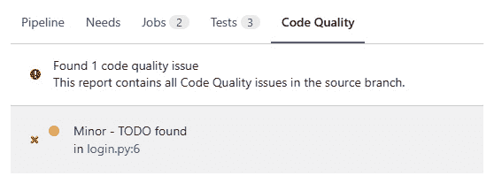

图 11.6 – 流水线详细页面上的代码质量结果

代码质量扫描器提醒我们处理早些时候在`login.py`中添加的“待办事项”注释。这个建议不错，但现在让我们忽略它，继续进行模糊测试。

## 向流水线添加模糊测试

让我们设置一个模糊测试，看看`log_user_in`函数是否有任何未被自动化单元测试捕获的 bug。*第六章*详细描述了模糊测试中涉及的架构元素，如果你需要回顾每个代码片段的角色，可以参考这一章。

提醒

模糊测试，和本书中讨论的其他一些功能一样，仅在 GitLab Ultimate 许可下可用。每个功能的 GitLab 文档都会告知你该功能需要哪个许可等级。本书没有提及哪些功能需要哪些许可，是因为 GitLab 在较高级别的许可测试过一段时间后，通常会将一些功能开放给较低级别的许可。

这次模糊测试将测试`login.py`文件中的`log_user_in`函数。如果你还记得*第六章*，这段代码被称为**待测代码**。按照现在的写法，这个函数足够简单，我们通过查看代码就能知道模糊测试不会发现任何问题。换句话说，对于如此简单的函数来说，模糊测试是“杀鸡用牛刀”，但我们可以想象这个函数未来可能会变得更加复杂，随着复杂度的增加，出现 bugs 的可能性也会增大。因此，现在就为这段简单的待测代码创建一个模糊测试是一个好主意，这样如果我们以后用更复杂、更容易出错的代码重写这个函数，它就可以发现新的 bugs。

我们将`log_in_user_fuzz_target.py`文件放在仓库的**add-login-feature**分支的根目录下。该文件应包含以下 Python 代码：

```
from login import log_user_in
from pythonfuzz.main import PythonFuzz
@PythonFuzz
def fuzz(bytes):
    try:
        string = str(bytes, 'UTF-8')
        divider = int(len(string) / 2)
        username = string[:divider]
        password = string[divider:]
        log_user_in(username, password)
    except UnicodeDecodeError:
        pass
if __name__ == '__main__':
    fuzz()
```

这些代码大部分是从 GitLab 文档中的示例模糊目标复制过来的。需要我们发挥编程创意的部分是`fuzz()`方法中的逻辑。这段代码将模糊引擎发送的随机字节转换成随机字符串，使用字符串的前半部分作为用户名，后半部分作为密码，并将用户名和密码传递给待测代码。

接下来，我们需要将 GitLab 模糊测试模板包含到`add-login-feature`分支中的`.gitlab-ci.yml`文件里。在我们已经添加的代码质量模板后，在现有的`include:`部分内添加`Coverage-Fuzzing.gitlab-ci.yml`模板。完整的`include:`部分应该如下所示：

```
include:
    - template: Code-Quality.gitlab-ci.yml
    - template: Coverage-Fuzzing.gitlab-ci.yml
```

因为这个模板声明了模糊测试任务将在它们自己的`fuzz`阶段运行，我们必须在`add-login-feature`分支的`.gitlab-ci.yml`文件顶部的`stages:`关键字下添加该阶段。完成后，完整的阶段定义部分应该如下所示：

```
stages:
    - build
    - test
    - deploy
    - fuzz
```

最后，让我们创建一个管道任务，用来触发对待测代码的模糊测试。将此任务定义添加到`.gitlab-ci.yml`文件的末尾，位于`add-login-feature`分支中：

```
fuzz-test-for-log-user-in:
    image: python:3.10
    extends: .fuzz_base
    script:
        - pip install --extra-index-url https://gitlab.com/api/v4/projects/19904939/packages/pypi/simple pythonfuzz
        - ./gitlab-cov-fuzz run --engine pythonfuzz -- log_user_in_fuzz_target.py
```

如果你查看由此提交触发的管道的管道详情页面，你应该会看到单元测试、代码质量和现在的模糊测试任务。如果你点击模糊测试任务查看其输出，你会注意到它正在不断地将随机数据集发送给待测代码，看似没有停止的迹象。然而，正如我们在*第六章*中知道的，它会在找到 bug 或者超时后停止。因为这个管道是在非默认分支上运行的，所以超时时间设置为 60 分钟（默认分支有 10 分钟的超时）。虽然这对于复杂代码中深层次 bug 的发现来说可能是合理的时间，但对于我们这段简单的登录代码来说，实在是有些过头了。

通过配置作业，加快管道速度，向正在测试的函数发送 1,000 组随机字节，并在没有发现任何错误时停止。当然，如果我们认为更复杂的登录代码会受益于更彻底的模糊测试，我们可以随时增加随机数据集的最大数量。

为了限制模糊测试执行的次数，请取消当前正在运行的管道（无需等待其在 60 分钟后超时），并确保这些行被正确缩进，以便定义一个作业范围的变量而不是全局变量：

```
    variables:
        COVFUZZ_ARGS: '--runs=1000'
```

同样在`fuzz-test-for-log-user-in`作业定义中，用以下内容替换`script:`部分的第二行（请注意，这是一行很长的代码）：

```
        - ./gitlab-cov-fuzz run --engine pythonfuzz --additional-args $COVFUZZ_ARGS -- log_user_in_fuzz_target.py
```

如果你查看这些更改后运行的模糊测试作业的输出，你会发现它在找到第一个 1,000 次失败尝试后停止。您还会注意到管道详细信息页面上没有显示**安全**选项卡，因为模糊测试没有发现任何问题（尽管其旨在查找错误而不是安全漏洞，但 GitLab 认为模糊测试是一种安全扫描器而不是代码质量扫描器）。

我们的管道真的很顺利！让我们通过添加一些安全扫描器来保持这种势头。

# 保护您的代码

对于此示例用例，您将向管道添加四个扫描器：**静态应用程序安全性测试**（**SAST**）、秘密检测、依赖关系扫描和许可合规性。您还将学习如何添加第三方扫描器。

## 将 SAST 添加到管道中

通常情况下，向管道添加由 GitLab 提供的安全扫描器是一个简单的过程。为了启用 SAST 并确保我们的“Hats for Cats”源代码不包含安全漏洞，我们只需要在`add-login-feature`分支的`.gitlab-ci.yml`中的现有`include:`部分包含一个新的模板。确保正确缩进，可以在现有的任何位置添加此行：

```
    - template: Security/SAST.gitlab-ci.yml
```

这样就启用了 SAST，但我们还希望配置它，以便它不扫描我们的自动化测试文件或我们的模糊目标文件。GitLab 文档告诉我们设置哪个变量以实现此目的。在`.gitlab-ci.yml`的末尾添加一个新的部分，以设置正确的全局变量：

```
variables:
    SAST_EXCLUDED_PATHS: "test_login.py,log_user_in_fuzz_target.py"
```

注意

此代码仅有两行：第二行足够长，可能会以令人困惑的方式换行。

等待管道完成并查看其详细信息页面。在`login.py`下。出于演示进行时的考虑，我们将忽略此漏洞，但看到 SAST 已经启动运行还是令人欣慰的：

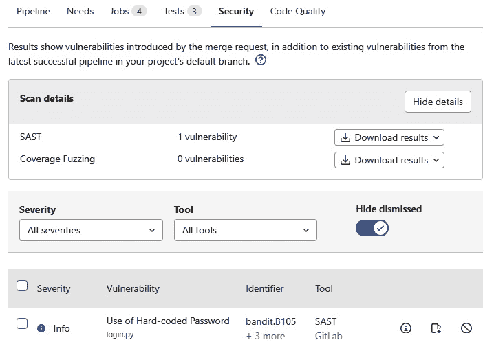

图 11.7 – 管道详细信息页面上的 SAST 结果

## 将秘密检测添加到管道中

让我们将 SAST 的“表亲”秘密检测添加到我们的 CI/CD 流水线中。在`add-login-feature`分支，包含一个新的模板到`.gitlab-ci.yml`的现有`include:`部分。仔细检查缩进，确保一切就绪：

```
    - template: Security/Secret-Detection.gitlab-ci.yml
```

我们应该考虑一些秘密检测的配置选项。由于我们的代码库只有少数几个提交，并且我们确信到目前为止没有添加任何秘密，因此不需要启用“历史”模式。然而，告诉秘密检测不要扫描我们的测试文件是有意义的，因为其中的任何秘密都是为了测试目的而虚构的秘密。将来，我们可能会把所有与测试相关的代码放入`tests/`目录，但由于我们目前还没有该目录，我们将明确排除单独的文件。通过覆盖适当的作业定义并设置作业范围的变量来做到这一点：

```
secret_detection:
    variables:
        SECRET_DETECTION_EXCLUDED_PATHS: "login_test.py,log_user_in_fuzz_target.py"
```

注意

这段代码的最后一行实际上是一行，因换行问题而看起来很尴尬，所以一定要作为一行粘贴进去。

最后，让我们给秘密检测提供一个秘密来检测。假设我们的实习生 Carl 不小心将一个 AWS 访问令牌粘贴到了`login.py`中。在`add-login-feature`分支的文件末尾添加以下一行：

```
AWS_access_token = 'AKIAABCDEFGH12345678'
```

当结果流水线完成时，检查其流水线详情页上的**安全**标签，查看是否报告了来自秘密检测的安全漏洞：

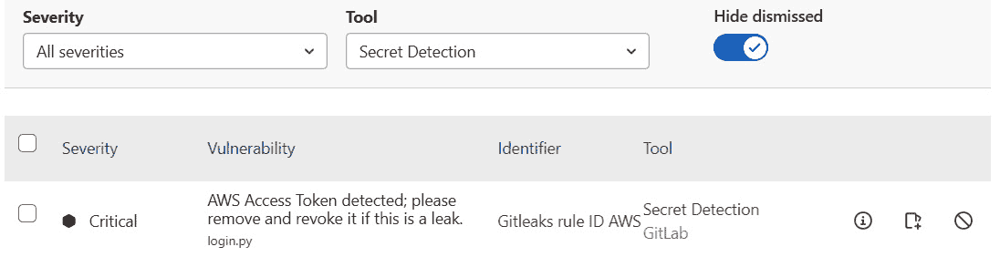

图 11.8 – 流水线详情页上的秘密检测结果

## 将依赖扫描添加到流水线

到目前为止，我们的项目声明的唯一依赖是`pytest`自动化测试框架。由于该依赖不会在生产中使用，我们可能不关心它是否有安全漏洞，但将依赖扫描添加到我们的流水线中是明智的，这样我们就可以在将来添加任何依赖时，及时收到安全问题的提醒。

在`include:`部分：

```
    - template: Security/Dependency-Scanning.gitlab-ci.yml
```

现在依赖扫描已经启用，让我们给它一些内容来检测。假设“Cats for Cats”网页应用将基于 Python 的 Django 网页框架构建，我们决定使用一个我们已经熟悉的旧版本 Django。在`add-login-feature`分支的现有`requirements.txt`文件末尾添加这一新行，并注意它应该是左对齐的，而不是缩进的：

```
django==3.2
```

由于此版本显著落后于当前的 4.1.1 版本，我们可能会发现依赖扫描中存在安全漏洞。果不其然，如果我们触发一个流水线并查看流水线详情页上的**安全**标签，我们会看到至少 15 个潜在的依赖问题！你可能会觉得使用**严重性**和**工具**过滤器来减少干扰，专注于最重要的漏洞会很有帮助：

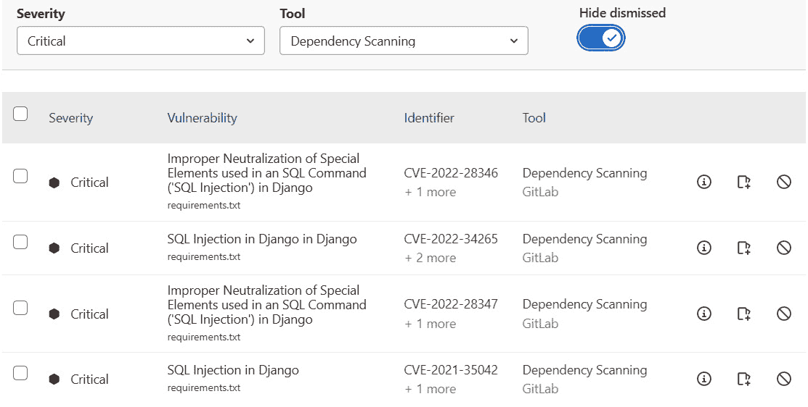

图 11.9 – 管道详情页上的严重性为“关键”的依赖扫描结果

## 将许可证合规性添加到管道中

由于我们为 `add-login-feature` 分支声明了一些软件依赖项，请在 `include:` 部分添加一个新模板，并仔细检查缩进：

```
    - template: Security/License-Scanning.gitlab-ci.yml
```

在由此次编辑触发的管道详情页上，点击新的 `pytest` 库及其依赖项。有趣的是，许可证合规性扫描器未能确定 Django 本身使用的许可证，因此它被列为**未知**。通常，你会与法务团队协商，决定是否明确允许或拒绝这些许可证，可以通过点击页面上的**管理许可证**按钮来进行处理，但为了保持演示的连贯性，我们将跳过这一步骤。

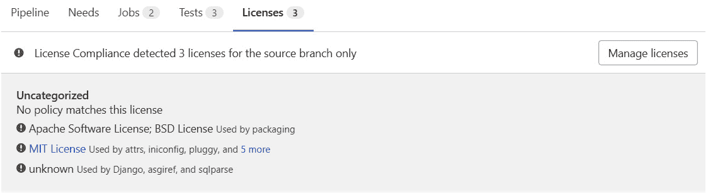

图 11.10 – 项目依赖项使用的许可证

一些扫描器被排除在本演示之外

你可能已经注意到，我们没有将 DAST、容器扫描或基础设施即代码扫描添加到我们的管道中。我们排除了这些扫描器，部分原因是 Hats for Cats 演示 Web 应用没有足够的功能代码来打包成 Docker 镜像并以普通用户的方式进行交互，另一个原因是我们不需要使用基础设施即代码工具来配置任何新的机器作为 **Hats for Cats** 项目的一部分。同样，我们还想展示并非所有扫描器都与所有项目相关。你应该只启用和配置那些对你特定项目有意义的扫描器；添加不必要的扫描器会让你的 CI/CD 管道配置文件变得复杂，并且拖慢管道速度，毫无益处。

## 将第三方安全扫描器集成到管道中

假设有一个我们过去使用过的第三方安全扫描器，现在我们希望将其添加到 `gui-proofreader` 中，它是一种 SAST 扫描形式，检查面向用户的文本中的拼写错误。假设它作为一个 Docker 镜像在 Docker Hub 上提供，你可以通过将仓库克隆到 `gui-proofreader` Docker 容器中，然后在该容器内运行 `proofread-my-gui.sh` 脚本来对仓库中的所有代码进行扫描。

让我们在 CI/CD 管道中添加一个任务，完成这个功能。在 `add-login-feature` 分支的 `.gitlab-ci.yml` 文件末尾添加以下任务定义：

```
proofread:
    stage: test
    image: gui-proofreader:latest
    script:
        - ./proofread-my-gui.sh
```

这已经足以触发第三方扫描器，但我们仍然需要将其输出集成到 GitLab 安全报告中。这个步骤很简单：将扫描器的输出声明为包含 SAST 报告的工件（我们可以将其分配给几种报告类型，但这个特定的扫描器类似于 SAST，所以我们选择使用 SAST）。将以下代码添加到 `proofread` 任务定义的底部：

```
    artifacts:
        reports:
            sast: gui-proofreader-report.json
```

当然，我们需要调整作业定义中指定的结果文件名，以匹配`gui-proofreader`扫描器实际生成的文件名。此外，GitLab 只有在文件符合 GitLab 的官方 SAST 扫描器 JSON 架构时，才能解析并显示这些结果（每种类型扫描器的安全扫描结果架构细节可以在 GitLab 文档中找到）。如果`gui-proofreader`扫描器无法使用该架构生成输出，我们需要编写一个小脚本，将扫描器的输出转换为符合适当架构的 JSON 文件，在后续管道阶段的独立作业中运行该脚本，并将工件声明从`proofread`作业移到新脚本的作业中。

由于这个作业按现有写法无法工作——因为 Docker Hub 上没有叫做`gui-proofeader`的 Docker 镜像——最好的做法是将这个作业定义从`.gitlab-ci.yml`文件中排除，或者注释掉它。然而，如果你将来确实想集成第三方扫描器，这是一个可以遵循的模型。

# 改进你的管道

你已经设置了一个管道，确保你的代码质量高且没有安全漏洞。在许多情况下，你可以到此为止。然而，对于这个示例用例，你将更进一步，探讨使用 DAG 来加速管道。你还将看到是否值得将管道的配置代码拆分成多个文件，以提高可读性和可维护性。

## 使用 DAG 加速管道

我们的管道还没有复杂到需要转换成 DAG，但如果我们继续添加更多作业，最终会因为性能原因希望对其中一些或所有作业使用 DAG。现在，让我们通过使用`needs`关键字来预览一下，给我们的管道添加一些 DAG 元素。

首先，假设我们希望`code_quality`作业仅在`unit-tests`作业通过之后运行。毕竟，我们可能认为我们的代码在关心美观和可维护性之前，应该先确保它能正确工作。我们可以通过将`code_quality`放在比`unit-tests`晚的阶段来实现这一点，但由于它们在概念上都属于`code_quality`作业定义：

```
    needs: ["unit-tests"]
```

现在已经设置好了一个迷你 DAG，让我们再创建一个。也许我们对在所有其他扫描器完成之后运行的模糊测试作业不满意。这是因为模糊测试作业在它自己的`fuzz-test-for-log-user-in`中：

```
    needs: []
```

当我们运行包含这些编辑的管道时，我们会看到我们所期望的行为：`fuzz-test-for-log-user-in`立即运行，`code_quality`在`unit-tests`完成之前暂停：

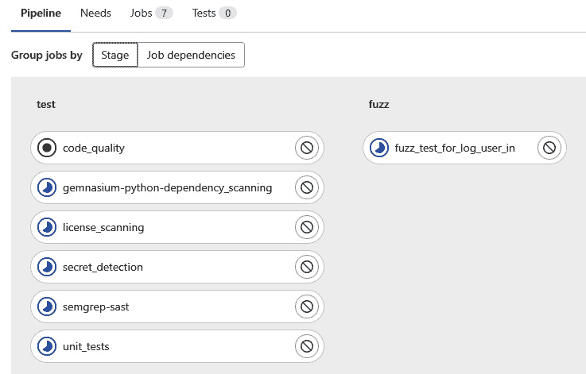

图 11.11 – DAG 导致作业没有按照阶段顺序运行

我们可以通过点击流水线详细页面中的**作业依赖关系**，并打开**显示依赖关系**来再次检查对流水线流程的理解。流水线运行结束后，我们可以看到哪些作业按什么顺序运行，得益于“需求”关系：

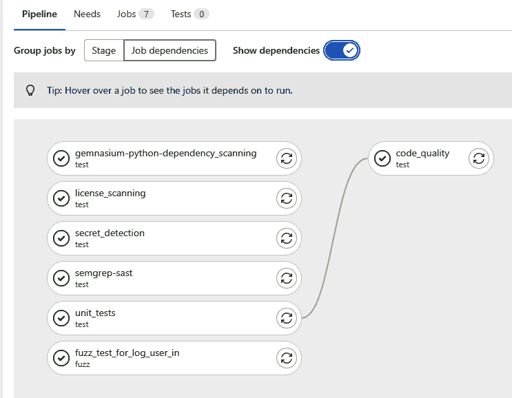

图 11.12 – 完成的流水线作业依赖关系视图

## 将流水线拆分为多个文件

既然我们已经设置好了项目的 CI/CD 流水线来验证和确保代码的安全性，那么让我们看看如何保持流水线配置的整洁和易读。当前的文件比现实项目中的 `.gitlab-ci.yml` 文件要简单得多，通常我们会建议当前的配置文件已经足够干净，不需要重构。然而，为了展示如何在配置变得更加复杂时进行维护，接下来我们还是将它分成两个文件。

假设我们决定在我们团队的所有项目中标准化安全扫描过程。实现这一目标的好方法是将所有与安全相关的作业定义分离到一个不同的 CI/CD 流水线配置文件中，然后将其包含到每个项目的 CI/CD 配置文件中。

在 `add-login-feature` 分支的根目录下创建一个名为 `security-jobs.yml` 的新文件。将以下行添加到新文件中：

```
include:
```

将这些行从 `.gitlab-ci.yml` 文件的 `include:` 部分剪切并粘贴到 `security-jobs.yml` 文件的 `include:` 部分：

```
    - template: Security/SAST.gitlab-ci.yml
    - template: Security/Secret-Detection.gitlab-ci.yml
    - template: Security/Dependency-Scanning.gitlab-ci.yml
    - template: Security/License-Scanning.gitlab-ci.yml
```

最后，通过在 `.gitlab-ci.yml` 的 `include:` 部分的任何位置添加此行，将新配置文件包含到原始配置文件中：

```
    - local: security-jobs.yml
```

当你在做出这些更改后重新运行流水线时，你会发现它的行为与我们重构配置文件之前完全相同。这展示了如何将一个长而复杂的 CI/CD 流水线配置文件拆分为两个或更多的子文件，每个文件如果需要，可以在多个项目中复用。

注意，由于 `security-jobs.yml` 与 `.gitlab-ci.yml` 在同一个项目中，我们使用了 `include:` 关键字和 `local:` 子关键字来指向它。如果我们要从其他项目中包含它，就需要使用 `include:` 和 `file:` 关键字。GitLab 文档中有更多关于如何在不同情况下使用不同形式的 `include:` 的信息，非常值得查阅。

# 将你的代码部署到正确的环境

你的代码已经编写、验证并确保安全。剩下的唯一步骤就是部署它。

## 部署代码

我们流水线的最后任务是使用 `rules:` 和 `if:` 关键字来控制应该运行的三个作业中的哪一个，具体取决于流水线运行所在的 Git 分支。

为了保持示例简单，我们仅讲解如何将其部署到生产环境。我们假设每当我们在**生产**分支上运行流水线时，都会发生此操作。

正如你在*第八章*中学到的那样，部署代码有无数种方法。选择哪种方法在很大程度上取决于你要部署的环境：AWS EC2 虚拟机、Kubernetes 集群、裸金属机器或其他什么东西。对于这个例子，我们假设我们正在将代码部署到一台 IP 地址为`192.168.0.1`的机器上，该机器运行着一个 Apache Web 服务器，托管着“Hats for Cats”网站。此外，假设要部署我们网页应用程序的新版本，我们只需要将文件复制到 Apache 主机上的正确目录，并发出命令重启 Apache。

这个部署过程非常简单。将这个任务定义添加到`add-login-feature`分支上的`.gitlab-ci.yml`文件中：

```
deploy-to-production:
    stage: deploy
    image: registry.hats-for-cats.com/ubuntu-with-deploy-key:latest
    rules:
        - if: $CI_COMMIT_REF_NAME == "production"
    script:
        - scp -r . root@192.168.0.1:/home/hats-for-cats/production
        - ssh root@192.168.0.1 service apache2 restart
```

你可能会对这个任务定义中指定的镜像感到疑惑。我们可以通过几种方式来设置`scp`命令所依赖的公/私钥对，其中一种方法是制作我们自己的 Docker 镜像，并将其存储在内部 Docker 容器注册表中。当然，我们也可以将这个镜像存储在这个项目或其他项目的容器注册表中，但现在假设我们已经设置了一个单独的、公司范围的 Docker 容器注册表。这个镜像包含一个带有 OpenSSH 库的 Linux 发行版（提供`scp`命令），并且已经生成了一个公/私钥对。然后，我们将 Apache 主机计算机配置为接受来自该 Docker 镜像的私钥。搭建好这个基础设施后，GitLab Runner 可以在特殊的 Docker 镜像内执行`scp`，并通过密钥对完成对 Apache 主机的身份验证。

这个任务定义中的`rules:`和`if:`关键字会防止任务运行，除非流水线在`deploy-to-review`和`deploy-to-staging`任务上运行，这两个任务会使用不同的逻辑来指定它们应该在哪些分支上运行。

由于我们的`deploy-to-production`任务不会在我们提交已编辑的`.gitlab-ci.yml`文件的`add-login-feature`分支上运行，因此在提交触发新的流水线时我们不会看到它运行。然而，我们确实希望确保它能正确部署代码，那么我们该如何测试这个任务呢？

首先，我们需要将`add-login-feature`分支合并到`Draft:`，从标题开头开始，使其可以合并，然后点击**Merge**按钮。由于我们将这个 MR 与**允许用户登录**问题关联，合并 MR 将自动关闭该问题。

这个合并将我们所有的流水线配置细节添加到了`deploy-to-production`任务运行中，因为流水线并没有在该任务上运行。当然，我们不应指望它实际通过测试，因为我们还没有创建任务定义中指定的 Docker 镜像，而且我们也没有在`192.168.0.1`上实际运行生产环境，但至少我们可以看到任务已运行，这也是我们此时能够现实测试的全部内容。宣布胜利，并打开一杯冰饮料，庆祝一下。这标志着**Hats for** **Cats**项目的示例工作流结束。

# 概述

在本章中，我们创建了一个组和项目来存放我们的代码及其他相关组件，并创建了任务来规划和跟踪我们的工作。接着，我们将项目的仓库克隆到本地工作站，这样我们就可以使用自己喜欢的桌面工具编写代码。然后，我们创建了一个分支来提交我们的工作，并为该分支创建了一个合并请求（MR），将其与相关任务关联，并提交并推送了新软件功能的代码。我们设置了一个简单的 CI/CD 流水线，可以在其中添加各种任务，并为该项目的流水线注册了特定的执行器。我们向流水线添加了自动化单元测试，以确保代码满足设计规范，同时进行了代码质量扫描，并为该扫描器注册了一个专用执行器。我们还向流水线添加了模糊测试，以便在关键功能中查找漏洞，并加入了 SAST（静态应用安全测试）以发现代码中的安全漏洞。我们还向流水线添加了秘密检测，以查找任何意外提交到仓库中的秘密信息，并加入了依赖扫描，以了解我们项目所依赖的第三方库中的任何安全问题。接着，我们将许可证合规性检查添加到流水线中，以排除使用与我们项目许可证不兼容的软件许可证的第三方库，并将一个第三方扫描器集成到流水线中，该扫描器会自动触发并将其结果整合到现有的 GitLab 仪表板和报告中。我们重写了流水线的一部分，将其改为 DAG（有向无环图）以提升性能，并将流水线配置代码拆分为多个文件，以提高其可读性和可维护性，并添加了逻辑，使得正确分支上的代码能自动部署到生产环境。

尽管我们覆盖了很多内容，但请记住，这只是一个示例工作流。我们只使用了 GitLab CI/CD 流水线提供的无数功能中的一部分，而且几乎没有探讨这些功能的不同配置选项。在流水线中，通常有多种方式完成相同的任务，而且你可以将这些任务以无限种方式组织成阶段和作业，所以不要觉得这个示例是使用 GitLab CI/CD 流水线的*唯一正确方法*。要有创意，进行实验，享受探索哪些流水线功能对你的项目最有用，并发现哪些功能的配置设置最适合你和你的团队。

在下一章，我们将学习 GitLab 的故障排除以及未来的发展。
