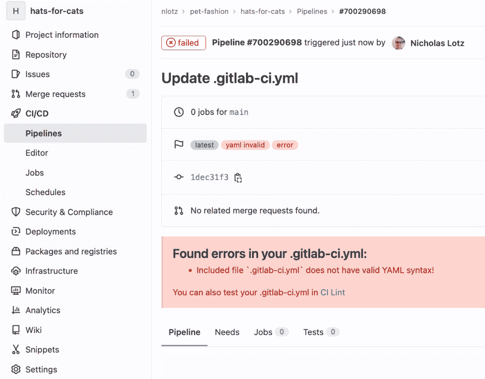

# 第十二章：GitLab 故障排除与未来展望

到目前为止，我们已经涵盖了 GitLab CI/CD 从规划、构建、测试到交付软件的端到端使用过程。你应该对 GitLab CI/CD 流水线和 Runner 基础设施的术语有所了解，并且有信心使用 GitLab 开发和部署基本应用程序。

CI/CD 在软件行业中占据着一个不断变化的空间。今天的最佳实践和工具在五年后可能已经过时，甚至更早。本书中我们有意识地努力保持在概念和工具之间的平衡。我们的目标是通过强调 CI/CD 和 DevOps 基础知识来保持内容的相关性，同时即便语法和一些工具在未来几年有所变化，依然为你提供实践和跟随的机会。

本章的目的是综合我们所学的内容，并引导你迈向 DevOps 旅程的下一步。我们将首先讨论一些常见的故障排除场景和可能遇到的“陷阱”，这些问题通常出现在使用 CI/CD 时。接下来，我们将讨论如何在运维领域使用 GitLab CI/CD，将软件开发工作流和版本控制应用于基础设施。最后，我们将讨论行业未来的变化趋势，并总结本书的关键要点。

本章将按照以下方式覆盖这些主题：

+   常见流水线问题的故障排除与最佳实践

+   使用 GitOps 管理你的运维基础设施

+   未来行业趋势

+   结论与下一步

# 技术要求

与前几章一样，建议在 GitLab 实例（SaaS 或自托管）上拥有一个帐户。本章中的一些内容更偏向于概念性讨论，而非基于实例的内容，但如果你希望实践 *使用 GitOps 管理运维基础设施* 部分讨论的概念，建议使用 **基础设施即代码**（**IaC**）工具，如 Terraform 和 Ansible。如果是这种情况，建议在云服务提供商（如 AWS 或 Microsoft Azure）中注册一个账户，以便使用你选择的 IaC 工具进行基础设施的配置与管理。

接下来，我们将识别并排除在使用 GitLab CI/CD 时常见的问题。

# 常见流水线问题的故障排除与最佳实践

在 GitLab CI/CD 流水线中遇到的问题大致可以分为两类。第一类是由 `.gitlab-ci.yml` 文件中的语法和逻辑引起的错误或意外行为，这是主要的 CI/CD 配置文件。第二类涉及用于运行 CI/CD 作业的 Runner 基础设施中的限制或配置错误。我们将依次解决这两类问题。

## 排查 CI/CD 语法和逻辑问题

当 GitLab CI/CD 的错误可以归结为 `.gitlab-ci.yml` 文件内容时，故障排除的第一步是确定问题是由于语法错误或不支持的语法，还是有效 YAML 文件的配置错误（或误解）。

### .gitlab-ci.yml 中的语法错误

最容易排查的情况之一（因此也是首先检查问题的好地方）是 `.gitlab-ci.yml` 中的语法或格式错误。一个典型的例子是由于遗漏必需的关键字而导致的错误。GitLab CI/CD 至少要求至少有一个阶段（使用 `stages` 关键字定义），每个作业必须分配到一个阶段，然后每个作业必须执行某些操作（通常使用 `script` 或 `trigger` 关键字定义）。以下示例展示了一个非常基础的配置，定义了两个阶段和两个作业。然而，`compile_assets` 作业缺少阶段分配。因此，`build` 阶段没有至少一个作业分配给它：

```
stages:
  - build
  - deploy
compile_assets:
  script:
    - echo "Run build scripts here"
publish_application:
  stage: deploy
  script:
    - echo "Run deployment scripts here"
```

*图 12**.1* 显示了我们如果导航到 **CI/CD** | **Pipelines** 时看到的管道错误：


图 12.1 – 显示在管道页面上的配置错误信息

请注意，当出现 YAML 语法错误时，GitLab 甚至不会尝试运行管道（即，不会将作业分配给执行者）。我们看到错误信息提到 `compile_assets` 作业的阶段不存在。

作业的默认阶段分配

*图 12**.1* 中显示的错误实际上有些微妙。严格来说，如果 CI/CD 作业没有在配置中显式分配到某个阶段，GitLab 会自动将其分配到 `test` 阶段。然而，在这个示例中，我们没有定义 `test` 阶段。因此，GitLab 报告“选择的”阶段（即 GitLab 本应将 `compile_assets` 作业分配到的阶段）不存在，因为我们只定义了 `build` 和 `deploy` 阶段。

如果配置不符合正确的 YAML 格式，GitLab 也会产生错误。我们尝试通过将 `compile_assets` 作业添加到 `build` 阶段来修复之前的错误：

```
stages:
  - build
  - deploy
compile_assets:
stage: build
  script:
    - echo "Run build scripts here"
publish_application:
  stage: deploy
  script:
    - echo "Run deployment scripts here"
```

当我们再次查看管道图时，我们看到另一个错误，这次是更通用的错误，指出配置没有有效的 YAML 语法（见 *图 12**.2*）。尽管错误信息比较模糊，但 GitLab 确实包含了一个 CI 语法检查工具的链接，可以帮助找出问题所在：



图 12.2 – CI/CD 管道的通用语法错误信息

跟随链接会带我们到一个叫做 `.gitlab-ci.yml` 文件的工具。在这种情况下，*图 12**.3* 显示了一个错误描述，提到一个未知的映射值。最终，问题出在 YAML 的缩进要求上。`stage` 关键字必须至少缩进两个空格，才能成为 `compile_assets` 作业定义中的有效元素。


图 12.3 – 显示无效 CI/CD 配置的 Pipeline 编辑器

在正确缩进后，*图 12.4* 现在显示了描述有效 CI/CD 语法的 Pipeline 编辑器。GitLab 现在将根据此配置创建一个可运行的管道：


图 12.4 – 显示有效 CI/CD 配置的 Pipeline 编辑器

因此，对于 CI/CD 语法问题的主要建议是利用 Pipeline 编辑器，这样您可以实时检查 CI/CD 配置中的逻辑和风格错误。编辑器对于识别拼写错误、遗漏的必需关键字和 YAML 格式问题非常有价值。

### CI/CD 配置逻辑和作业顺序

CI/CD 排错的另一个关键领域是理解作业定义和顺序的逻辑。随着管道的复杂化，您的 `.gitlab-ci.yml` 文件可能会开始充满 `rules` 关键字，用于管理作业的执行方式，且主配置可能会调用其他配置作为模板或下游管道。

请考虑以下 CI/CD 配置：

```
stages:
    - build
    - test
    - deploy
build_app:
  stage: build
  script:
    - echo "Run build on all branches"
static_tests:
  stage: test
  script:
    - echo "Run static tests only on feature branches"
  rules:
    - if: '$CI_COMMIT_REF_NAME == "main"'
      when: never
    - when: always
  needs: []
deploy_app:
  stage: deploy
  script:
    - echo "Run deploy only on main branch"
  only:
    - main
  needs:
    build_app
```

在这里，我们的配置中混合了逻辑关键字和作业顺序。`test_app` 作业使用 `rules` 关键字，以确保它在 `main` 分支上从不执行；否则，它会在所有其他分支上运行。与此同时，`deploy_app` 作业使用 `only` 关键字，指定它只在 `main` 分支上执行（而不是其他分支）。最后，`deploy_app` 作业需要 `build_app` 作业先通过，才会在 `main` 分支上运行，而 `static_tests` 作业则在功能分支上独立运行，无需等待其他作业（如 `build_app`）。

随着管道的增长，逻辑和不同 CI/CD 变量的混合可能会变得难以解析。在 GitLab 用户界面中有一些功能可以帮助您理清作业的逻辑和顺序。**作业依赖**（见 *图 12.5*）和 **Needs** 标签在 **CI/CD** | **Pipelines** | **Pipeline ID** 中，允许您显示哪些作业依赖于其他作业：


图 12.5 – 显示有效 CI/CD 配置的 Pipeline 编辑器

Pipeline 编辑器还具有 `main` 分支：


图 12.6 – 在 Pipeline 编辑器中进行管道验证

我们强烈建议您在开发和部署过程中使用这些功能，以组织和可视化您的管道。

## 排错管道操作和 Runner 分配

除了语法和逻辑错误，注意用于 CI/CD 执行的 Runner 也是很重要的，确保您的管道配置能够得到 Runner 基础设施的支持。可能出现的潜在问题包括 Runner 标签管理不当以及缺少或配置错误的容器支持。

### 正确管理运行器标签

`tags` CI/CD 关键字（不要与已标记的 Git 提交混淆）告诉 GitLab 只将任务分配给包含相同标签的运行器。为了确保 CI/CD 任务标签被正确理解和使用，需考虑以下几个方面。

当在 CI/CD 任务中指定多个标签时，这意味着 GitLab 只会将任务分配给同时拥有所有这些标签的运行器。例如，以下任务将仅分配给拥有 `ubuntu` 标签、`python3` 标签和 `amd64` 标签的运行器：

```
deploy_to_linux:
  stage: deploy
  script:
    - ./deploy_script.py
  tags:
    - ubuntu
    - python3
    - amd64
```

另一方面，接收任务的运行器也可以具有其他描述性标签，只要这些标签至少包括 `ubuntu`、`python3` 和 `amd64` 标签。如果任务没有被预期的运行器接收，请检查运行器的分配标签，在 **设置** | **CI/CD** | **运行器** 中查看。如果不同的运行器配置在 GitLab 的不同部分——即项目、组或实例级别，记住这一点。

### 管理容器化的 CI/CD 流水线

基于容器的环境，如 Docker 和 Kubernetes，越来越频繁地被软件团队用于开发、测试和部署。`image` 关键字是 CI/CD 任务中的关键字，用于指定任务必须运行的 Docker 容器类型。然而，容器化 CI/CD 任务的正确执行有许多依赖因素，除正确的配置语法外，还需要考虑其他问题。请看以下任务定义：

```
launch_web_services:
  stage: deploy
  image: node:19
  services:
    - postgres:latest
  script:
    - npm start
```

任务的指令是在从 Node.js Docker 镜像启动的容器内启动 Web 服务，同时运行一个支持的 Postgres 数据库。让我们思考任务成功执行所需的条件：

+   支持 Docker 容器的环境中的运行器。

+   非容器运行器不会无意间接收任务。

+   运行器可以连接到像 Docker Hub 这样的容器注册表，以拉取基础镜像。

这只是一个简单的例子，要求开发者思考他们的任务执行所使用的基础设施。解决第二个问题（非容器运行器接收任务）的一种方法是为基于容器的运行器专门定义一个 CI/CD 标签，并在任何使用 `image` 关键字的任务中包含该标签。

需要同时管理操作基础设施和应用程序逻辑可能会让开发者感到有些吃力。在接下来的部分，我们将介绍 GitOps 的概念，以帮助将开发与运维统一到最佳实践的工作流中。

# 使用 GitOps 管理你的操作基础设施

开发不能脱离执行代码的基础设施。我们已经清晰地看到，从将 GitLab 用作源代码管理工具，到定义 CI/CD 流水线来定义源代码如何构建和部署，再到运行器（基础设施）作为 CI/CD 的一个重要组成部分的过程中，基础设施的重要性。

正确理解的 DevOps 是一种将开发和运维统一起来的文化。那么，我们如何将配置和管理我们的操作基础设施纳入到开发人员已经使用并理解的 GitLab 流程中呢？答案在于实施 **GitOps**。GitOps 是一种属于 DevOps 的开发实践，鼓励使用与开发团队已经使用的相似的迭代变更管理模型。正如这个术语所暗示的那样，Git 是工作流的核心部分。基础设施应该像应用程序源代码一样，受到版本控制。对基础设施的更改是通过对代码库进行修改来实现的，这反过来会触发 CI/CD 管道，更新我们的环境以适应这些提交的更改。

GitOps 通常意味着将基础设施纳入软件版本控制之下

本章中描述的 GitOps 比我们之前讨论的 Kubernetes 集群的特定 GitOps 工作流要广泛。在这里，GitOps 仅仅意味着将 Git 开发工作流应用于任何形式的基础设施管理。本章使用 Terraform 和 Ansible 作为参考示例，这些示例可以跨多个不同的配置管理工具进行应用。

回想一下来自 *第三章*的 *图 3.10*（这里再次展示），当时我们介绍了 GitLab 流程作为一种迭代分支模型，让开发人员以结构化且高效的方式进行更改：


图 12.7 – GitLab 流程中的主要步骤

这一工作流的核心动机是消除开发过程中的摩擦。对 Git 版本化代码库中的文件进行文本更改，会触发自动化管道的构建、测试和部署到相应环境。审查和批准已经集成到合并请求功能中，确保我们的所有更改都是有意的，而版本控制确保我们可以在需要时回滚。

那么，如何将这个模型应用于基础设施管理呢？就像开发人员使用编程语言来开发应用程序一样，现今行业中有大量基于文本的工具，可以用于描述、提供和配置操作环境。这些工具被称为“基础设施即代码”，因为它们旨在将基础设施（如服务器、网络、存储、数据库、身份和访问控制）置于与传统软件应用程序相似的编程模型之下。

基础设施即代码（IaC）是一个快速发展的领域，新的工具不断取代旧的工具。由于快速的创新可能使当今常见的工具过时，决定在此类书籍中介绍哪种软件可能会很困难。然而，截止到本文写作时，我们已经看到一些 IaC 工具在 GitOps 和 GitLab 中被广泛使用。我们在这里展示它们，并理解在基础设施工具中，技术状态正在迅速变化。话虽如此，我们经常看到的工具是**Terraform**用于基础设施配置和**Ansible**用于配置管理。

## 使用 Terraform 部署和更新基础设施状态

Terraform 是一个 IaC 工具，用于描述你的基础设施应如何呈现。核心项目是开源的，企业版本由 HashiCorp 开发并销售。Terraform 包括一种语言和语法来描述基础设施状态，以及一套命令行工具，用于验证和更新该基础设施。使用的配置模型是*声明式的*。我们描述我们的计算、网络、存储等应如何呈现，软件则执行必要的最小更改，以使我们的基础设施反映该配置。

让我们看一个非常基础的示例，使用 Terraform 在 AWS 中配置一个对象存储资源。Terraform 要求你在以 `.tf` 结尾的状态文件中描述配置。Terraform 语法的细节超出了本书的范围，但以下语法展示了如何在 AWS 中配置一个 S3 桶。这个“代码”可能会被存储在名为 `bucket.tf` 的文件中：

```
resource "aws_s3_bucket" "coreSite" {
    bucket = "travelBlog"
    acl = "private"
}
```

这个简单的状态文件在 AWS 中指定了一个 S3 桶资源，包括名称和访问权限。接下来，由 Terraform 来“实现这一目标”。在 GitOps 和 GitLab 的背景下，"实现这一目标"是通过 CI/CD 管道完成的。该管道将运行必要的 Terraform 命令来初始化、验证并将配置应用到你的 AWS 账户中。

安装和配置 Terraform 可能需要一些工作。幸运的是，GitLab 将 Terraform 的工具封装在一个 Docker 镜像中，可以通过 `.gitlab-ci.yml` 中的 `image` 关键字来启动。GitLab 维护了一个公共示例项目，里面有一个示例 `.gitlab-ci.yml` 文件（[`gitlab.com/gitlab-org/configure/examples/gitlab-terraform-aws/-/blob/master/.gitlab-ci.yml`](https://gitlab.com/gitlab-org/configure/examples/gitlab-terraform-aws/-/blob/master/.gitlab-ci.yml)），该文件包含了应用或更新 AWS 中 Terraform 配置的相关作业和命令。我们建议你浏览这个页面，并在你自己的 AWS 账户中测试这些示例。注意，`prepare`、`validate`、`build` 和 `deploy` 阶段及其相关作业在概念上类似于典型应用开发中的 `build`、`test` 和 `deploy` 阶段。

Terraform 是一个主要用于部署或配置基础设施的工具。我们将讨论的第二个工具，主要用于配置已部署的资源。

## 使用 Ansible 管理资源配置

Ansible 也是一个开源的 IaC 工具，Red Hat 提供了付费版本。与 Terraform 类似，Ansible 通过在文件中声明资源配置来使用，文件内容随后通过运行命令转化为配置变更。这些 Ansible 资源配置文件称为 **playbooks**，并且采用 YAML 格式编写。一个极其基础的 playbook 内容，安装并启动 Apache，可能如下所示：

```
---
- hosts: web
  become: yes
  tasks:
   - name: ensure Apache is installed
     yum:
       name: apache2
       state: latest
   - name: ensure Apache is enabled and started
     service:
       name: apache2
       enabled: yes
       state: started
```

与 Terraform 一样，我们使用声明性语法来描述我们的环境应该是什么样的，并依赖工具（在本例中为 Ansible）来实现这一目标。在这里，我们指定一个名为 `web` 的主机集合应该安装 `apache2` 包，并且相应的服务应该被启用并启动。然后，Ansible 会连接到相关主机，并在连接后安装并启动 `apache2`。

同样像 Terraform 一样，我们会定义 CI/CD 作业，运行工具的命令以应用配置更改。在 Ansible 的情况下，GitLab 没有官方的带有 Ansible 工具的 Docker 镜像。因此，我们可能会告诉 GitLab 使用一个我们知道是 Ansible 主机的 runner 来运行我们的 playbook：

```
ansible-run:
    stage: run
    tags:
        - ansible
    script:
        - ansible-playbook apache-playbook.yml --key-file $REMOTE_HOST_CREDENTIALS
```

上述作业被分配给一个带有 `ansible` 标签的 runner（我们可以假设这是一个已安装并配置了 Ansible 的 runner）。作业脚本随后会运行 playbook，并可能通过 CI/CD 变量传递凭据，以便 Ansible 可以对它所配置的服务器进行身份验证。

有关将 Ansible 与 GitLab 一起使用的更多细节，包括在运行 Ansible 命令时如何解释和解析 CI/CD 作业输出，我们推荐您参考 GitLab 发布的这篇文章（[`about.gitlab.com/blog/2019/07/01/using-ansible-and-gitlab-as-infrastructure-for-code/`](https://about.gitlab.com/blog/2019/07/01/using-ansible-and-gitlab-as-infrastructure-for-code/)），作为更深入的参考。请同时参考官方的 Terraform 和 Ansible 文档站点，以获取有关设置和系统要求的更多详细信息。最终，本节的目标是向您介绍 GitOps 概念，作为将 IaC 工具整合到我们迄今为止学习的 CI/CD 工作流中的一种范式。

# 未来行业趋势

不言而喻，学习任何新事物时，都有一个期望，那就是知识将来仍然相关。展望未来，持续集成和持续交付在软件领域中有望作为关键实践持续存在，并将继续经历演变变化。我们可以识别出未来几年软件开发生命周期可能发生变化的三种趋势。它们是：自动化的增加、抽象化的增加和开发周期时间的缩短。我们还可以预期 GitLab 作为平台将继续发挥重要作用。前几章中展示的概念、示例和工具将为你现在成为更高效的开发者打下坚实的基础，同时也提供适应行业不可避免变化所需的信心。

## 自动化将以更大规模创造更多软件

现在，问任何一个组织什么是运营中最昂贵的部分，他们很可能会回答是人力。熟练的人工劳动力，包括技术人员，尤其昂贵。优秀的工程师难以找到，更难以替代，且留住他们非常昂贵。此外，这些工程师们已经设计了软件和工具，使得他们自己的工作更加轻松高效。组织们现在正在利用这些工具，以便用更少的人力创造和部署更多的软件。

想想 20 年前甚至 10 年前，公司所雇佣的手工质量保证测试团队。现在，考虑像 GitLab 这样的工具在允许单个开发人员自动化软件发布过程（从概念化到部署）中所起的作用。而且，现在云服务提供商几乎为任何拥有信用卡的开发人员提供无限量的基础设施——不再需要专门的团队来进行服务器的安装和管理。

然而，除了奇点的预测之外，人类在短期内不会去哪里。自动化的普及需要能够理解和维护这些工具的人。你能说懂自动化的语言，以及像 GitLab 这样推动这一趋势的平台，你就能更好地参与到自动化革命中。

## 抽象化将引领万物皆代码的商业模型

2011 年，Marc Andreessen 写下了他那篇如今广为人知的文章《*为何软件正在吞噬这个世界*》([`a16z.com/2011/08/20/why-software-is-eating-the-world/`](https://a16z.com/2011/08/20/why-software-is-eating-the-world/))。Andreessen 预测，下一代互联网公司正在引领一场广泛的经济变革，在这一变革中，软件将成为大多数，甚至所有行业的语言和引擎。十年后的 2021 年，Jon Eckhardt 写了一篇后续文章，标题为《*软件正在吞噬吞噬世界的软件*》([`eiexchange.com/content/software-is-eating-the-software-thats-eating-the-world`](https://eiexchange.com/content/software-is-eating-the-software-thats-eating-the-world))。Eckhardt 认识到，不仅传统行业被软件颠覆，而且一代新的工具也在颠覆现有的软件模型。这些工具可以被看作是强大且更易使用的程序，使得开发者能够在更高的抽象层次上工作。也就是说，开发者可以专注于业务逻辑，而工具则负责处理更细微的细节。

一个增加抽象层次的好例子是过去 30 年基础设施的变化。行业从大型主机转向了服务器模型。接着，又转向了虚拟机，因此我们可以开始将操作系统视为灵活的软件定义资源，运行在共享主机上。然后，配置管理帮助我们维护 IT 资源，从而使我们能够更多地关注“做什么”，而不必过多关注“怎么做”。之后，云服务迅速发展，以至于没人需要亲自踏入数据中心。现在，像容器和函数这样的额外工具，使开发者能够专注于他们的代码，而无需考虑它可能运行的计算机和网络。

我们预计这一抽象化趋势将会持续下去。像自动化一样，我们完全不认为人类会变得不再重要。相反，我们预期将会有更多的整合和专业化。代码总会在某人的计算机上运行，无论在哪个地方，我们都需要基础设施专家来构建和维护这些环境。但我们也预计像 GitLab 这样的工具将继续普及，提供自文档化的程序化模型，能够观察到业务的所有层次。

## 减少周期时间将帮助团队更快发布更好的软件

DevOps 哲学主要是文化层面的，但它也代表着一种受精益制造革命启发的工作系统。基于自动化和抽象趋势，并结合如敏捷和 Scrum 等项目管理方法论，团队现在以一种方式开发软件，即早期频繁发布，融入小的改进，并在需要时回滚。

像 Eric Ries 的*《精益创业》*这样的书籍引入了这一开发模型的语言，许多工具也应运而生，允许开发人员以非常快速但受控的方式构建、测试和发布软件。GitLab 就是这些核心平台之一。源代码管理和版本控制确保了与共享代码库的持续集成，管道则在每次小规模提交后，允许执行一套共同的构建、测试和部署任务。这使得快速、迭代式的开发成为可能，并能够不断适应业务需求。

自动化、抽象化以及更小的发布周期的结合将要求开发人员适应迭代式的项目管理和设计方法。不要害怕失败，因为快速的小变更不可避免地会导致一些代码出现问题或有缺陷。采用持续改进的思维方式，专注于开发更好的软件，而不是追求完美的软件。

# 结论与下一步

本书引导你通过使用 GitLab 作为平台来管理你的软件开发生命周期。在讨论了 DevOps 作为一种文化和方法论出现之前行业的现状后，你接着学习了 Git 版本控制和 GitLab 的项目管理组件的基础知识。然后，GitLab CI/CD 管道被介绍为组织、设计和自动化开发工作流的核心功能。

你了解到，GitLab CI/CD 包含三个组件：基于文本的管道配置文件、执行管道任务的 runner，以及协调配置与 runner 代理之间的 GitLab 主应用程序。接着，我们展示了如何利用管道来验证、加固、打包和部署代码。你了解到，你可以将 GitLab CI/CD 作为一个统一的工具，执行软件生命周期中这些通常是离散的步骤。

在讨论完支持的 CI/CD 特性和工作流后，我们转向了一些高级话题和最佳实践。你学到了如何提高管道的速度和可维护性，以及如何将 GitLab CI/CD 应用于其他可能并不立即显现的工作流中。

最后，*第十一章*向你介绍了一个端到端的示例，使用了之前讨论过的所有概念和功能。该章节的目标是展示一个基础但真实的 GitLab 使用案例，支持规划、构建和部署应用程序的整个工作流。我们随后以这一章作为总结，提供了一些最终的故障排除技巧、使用 GitLab 进行下一代基础设施管理的指南，并展望了未来几年行业可能的发展方向。

我们希望你与 GitLab、CI/CD 和 DevOps 的旅程不会随着本书的结束而告一段落。GitLab 本身是开源核心，而 GitLab 公司在软件的管理和演进方面也保持透明。我们鼓励你继续关注 GitLab 的演变和产品路线图，通过关注核心产品的 issue 跟踪系统，并参考产品的在线手册页面，这些页面记录了 GitLab 各项功能的类别发展方向。

最终，作为技术人员，我们知道学习永无止境。我们希望本书能帮助你了解 GitLab 作为一个软件平台，它所要解决的问题，以及你如何使用它来应对自己组织中的挑战。我们祝愿你在继续你的 DevOps 旅程时一切顺利。
