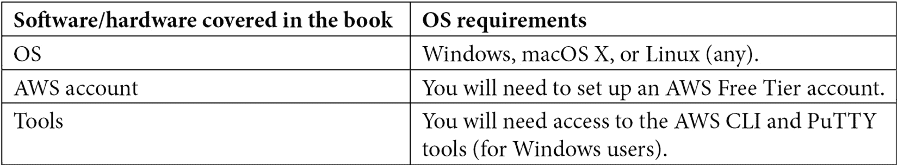

# 前言

**Amazon Web Services**（**AWS**）是云计算的领导者，并且成功地保持了这一地位已有多年。全球各地的公司，无论是公共部门还是私营部门，都在以日益增长的速度拥抱云技术，拥有 AWS 经验的 IT 专业人员的需求远远超过了供给。

*AWS 认证云实践考试指南*是帮助你准备最受欢迎的 AWS 认证考试之一的全方位资源。本学习指南将帮助你验证对 AWS 提供的核心云计算服务的理解，并学习如何为客户设计和构建云解决方案。

通过这个基础认证并不要求你了解如何构建和部署复杂的多层应用解决方案。然而，本书将提供必要的技能，帮助你理解 AWS 提供的各种服务如何用于为客户构建端到端的解决方案。此外，你还将学习云经济学、安全概念和最佳实践。

本学习指南设计为即使在通过 AWS 认证云实践考试后仍能使用，其中包含多个练习，可以作为参考，帮助你开始为客户构建实际的解决方案。每一章都在上一章的基础上进行扩展，每一个新的练习都会扩展之前配置的服务。这将帮助你了解 AWS 提供的各个服务如何用于设计端到端的解决方案。

每章后面都包含总结，并附有一组复习问题。全书最后提供了两套模拟测试，旨在测试你的知识，并帮助你进一步为正式的 AWS 认证云实践考试做准备。

# 本书适用人群

本学习指南专为那些希望快速提升云计算职业生涯的人设计。*AWS 认证云实践考试指南*适合希望学习云计算基础知识及 AWS 提供服务的 IT 和非 IT 专业人员。非 IT 专业人员不仅可以学习 AWS 提供的各种云服务的理论概念，还可以从技术角度获得配置这些服务的宝贵经验。主要在本地环境工作的 IT 专业人员将学习如何在云中配置和部署技术解决方案，并理解将本地工作负载迁移到 AWS 的策略。

# 本书内容

*第一章*，*什么是云计算？*，讨论了云计算的基本原理，并概述了云计算的六大优势。我们还将介绍不同的云计算模型和云部署模型。

*第二章*，*AWS 简介及全球基础设施*，介绍了 AWS 生态系统、其全球基础设施以及如何帮助您在全球范围内部署解决方案。我们讨论了 AWS 提供的优质支持服务，以及选择正确支持计划的重要性。

*第三章*，*探索 AWS 账户、多账户策略与 AWS 组织*，详细介绍了 AWS 账户的概念，AWS 账户使您能够安全地访问广泛的 AWS 服务。我们还讨论了设置多个 AWS 账户的使用案例以及使用 AWS Organizations 服务管理多个账户的最佳实践。

*第四章*，*身份与访问管理*，介绍了 AWS 的核心安全功能之一。AWS **身份与访问管理**（**IAM**）使您能够安全地管理对 AWS 服务和资源的访问。通过 AWS IAM，您可以设计策略和权限，确保根据最小权限原则对服务的访问和授权。

*第五章*，*亚马逊简单存储服务（S3）*，解释了 AWS 提供的各种存储选项，包括块存储、对象存储和文件存储服务。亚马逊 S3 是 AWS 的对象存储解决方案，在本章中，您将了解如何利用这个几乎无限且高度可扩展的存储服务。

*第六章*，*AWS 网络服务 – VPC、Route53 和 CloudFront*，涵盖了云中的网络服务。亚马逊**虚拟私有云**（**VPC**）使您能够在云中启动 AWS 资源，并将其置于逻辑隔离的虚拟网络中。我们还将讨论 AWS 的**域名系统**（**DNS**）服务，帮助您注册新的域名并为您的工作负载设计流量路由服务。最后，在本章中，我们将介绍 Amazon CloudFront，它帮助您为数字资产和应用程序设计内容分发网络服务。

*第七章*，*AWS 计算服务*，详细介绍了 AWS 提供的各种计算服务。这些服务包括**弹性计算云**（**EC2**）服务，您可以通过它在云中启动 Linux、Windows 和 macOS 虚拟服务器，以及像 Amazon Lambda 这样的容器和无服务器计算服务。本章中，您还将了解 AWS 上的块存储和文件存储服务。

*第八章*，*AWS 数据库服务*，探讨了 AWS 提供的各种数据库解决方案，能够支持几乎任何使用场景。从传统的关系型数据库服务如 Amazon RDS，到 NoSQL 数据库解决方案如 Amazon DynamoDB，我们将探讨它们的使用场景，并学习如何为您的应用程序配置这些数据库。本章还讨论了其他一些细分的数据库解决方案。

*第九章*，*AWS 上的高可用性与弹性*，涵盖了云计算，特别是 AWS 的一个基本优势。设计高度可用且能够抵御故障的解决方案对于任何组织都至关重要，在本章中，您将学习如何使用工具构建高度可用的解决方案。此外，我们还讨论了如何自动扩展应用程序，在需求增加时扩展资源，在需求下降时终止资源。这使得您能够更有效地管理成本，避免需要猜测容量。

*第十章*，*应用程序集成服务*，探讨了各种 AWS 服务，帮助您构建采用解耦架构设计的应用程序。这使您能够摆脱传统的单体设计，转而采用更现代的微服务架构。

*第十一章*，*AWS 上的分析*，探讨了 AWS 上众多工具和服务，帮助您分析组织收集的大量数据，其中大部分数据是实时收集的。

*第十二章*，*AWS 上的自动化与部署*，介绍了若干自动化工具和流程，帮助您部署基础设施和应用程序，这些工具和流程不仅加速了部署过程，还减少了配置错误。

*第十三章*，*AWS 上的管理与治理*，探讨了几种可以用来监控资源、集中管理并帮助您遵循最佳实践的 AWS 服务。

*第十四章*，*在 AWS 上实现安全性*，概述了 AWS 提供的各种安全工具、服务和流程，帮助您设计安全为首的应用程序解决方案，从而确保符合任何合规性和监管环境，并确保客户的数据始终得到保护。

*第十五章*，*计费与定价*，讨论了云经济学，并探讨了大量 AWS 工具，帮助您有效管理云计算成本。我们讨论了如何在不妥协性能、可靠性和安全性的情况下，最大程度地降低成本的策略。

*第十六章*，*模拟测试*，使你可以通过进行两次完整的模拟考试，测试在本学习指南中获得的知识。这些模拟测试将帮助你评估自己准备好参加官方 AWS 认证考试的程度，并提供答题解析，帮助你为 AWS 考试做好准备。

# 充分利用本书的内容

为了充分利用本书，你必须按照章节的顺序进行阅读。这是因为每一章的内容都建立在前一章的基础上。此外，强烈建议你通过完成本书中的所有练习，获得必要的实践经验。



**如果你正在使用本书的数字版，我们建议你自己输入代码，或通过 GitHub 仓库访问代码（链接将在下一节提供）。这样做将帮助你避免因复制和粘贴代码而产生的潜在错误。**

# 下载示例代码文件

你可以从 GitHub 下载本书的示例代码文件，网址是 https://github.com/PacktPublishing/AWS-Certified-Cloud-Practitioner-Exam-Guide。如果代码有更新，它将被更新到现有的 GitHub 仓库中。

我们还提供其他代码捆绑包，来自我们丰富的书籍和视频目录，访问链接：[`github.com/PacktPublishing/`](https://github.com/PacktPublishing/)。快去看看吧！

# 下载彩色图片

我们还提供了一个 PDF 文件，里面包含了本书中使用的截图/图表的彩色图片。你可以在这里下载：`static.packt-cdn.com/downloads/9781801075930_ColorImages.pdf`。

# 使用的约定

本书中使用了多种文本约定。

`文本中的代码`：表示文本中的代码词汇、数据库表名、文件夹名称、文件名、文件扩展名、路径名、虚拟网址、用户输入和 Twitter 账户。示例：“对于键，输入`Name`，对于值，输入`Windows-BastionSrv`。”

代码块设置如下：

```
{
  "Id": "Policy1613735718314",
  "Version": "2012-10-17",
```

**粗体**：表示新术语、重要词汇或在屏幕上看到的词汇。例如，菜单或对话框中的词汇在文本中以这种方式显示。示例：“在**实例**控制台中，选择屏幕右上角的**启动实例**按钮。”

提示或重要说明

以这种方式显示。

# 联系我们

我们始终欢迎读者的反馈。

**一般反馈**：如果你对本书的任何方面有疑问，请在邮件主题中注明书名，并通过 [customercare@packtpub.com](https://customercare@packtpub.com) 发送邮件给我们。

**勘误**：尽管我们已尽最大努力确保内容的准确性，但难免会出现错误。如果您在本书中发现了错误，欢迎向我们报告。请访问 [www.packtpub.com/support/errata](https://www.packtpub.com/support/errata)，选择您的书籍，点击“勘误提交表单”链接并填写相关详情。

**盗版**：如果您在互联网上发现我们的作品有任何非法复制，欢迎提供相关位置地址或网站名称。请通过 [copyright@packt.com](https://copyright@packt.com) 与我们联系，并附上相关材料的链接。

**如果您有兴趣成为作者**：如果您在某个领域拥有专长并且有意愿写作或参与书籍的编写，请访问 [authors.packtpub.com](https://authors.packtpub.com)。

# 评论

请留下您的评论。在您阅读并使用本书之后，为什么不在您购买书籍的网站上留下评论呢？潜在的读者可以看到并参考您的客观意见来做出购买决定，而我们 Packt 公司也能了解您对我们产品的看法，作者们也能看到您对其书籍的反馈。谢谢！

欲了解更多关于 Packt 的信息，请访问 [packt.com](https://packt.com)。

# 分享您的想法

一旦您阅读了*AWS 认证云从业者考试指南*，我们很想听听您的想法！[请点击这里直接进入 Amazon 的评论页面](https://packt.link/r/180107593X%0D)并分享您的反馈。

您的评论对我们和技术社区非常重要，能够帮助我们确保提供优质的内容。
