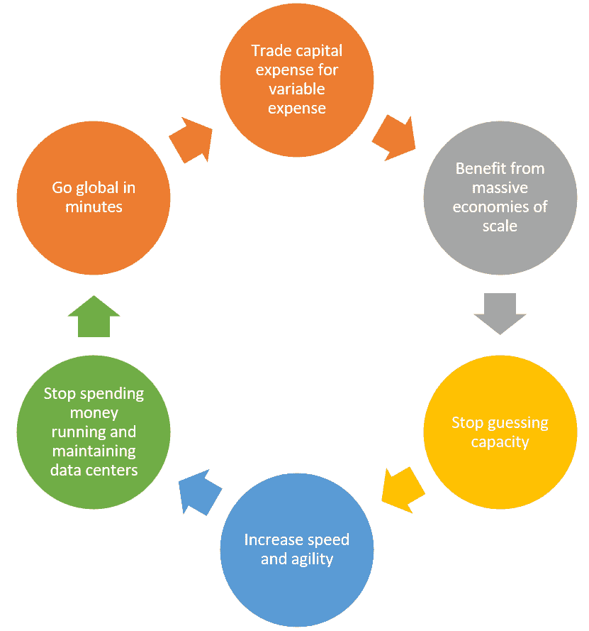
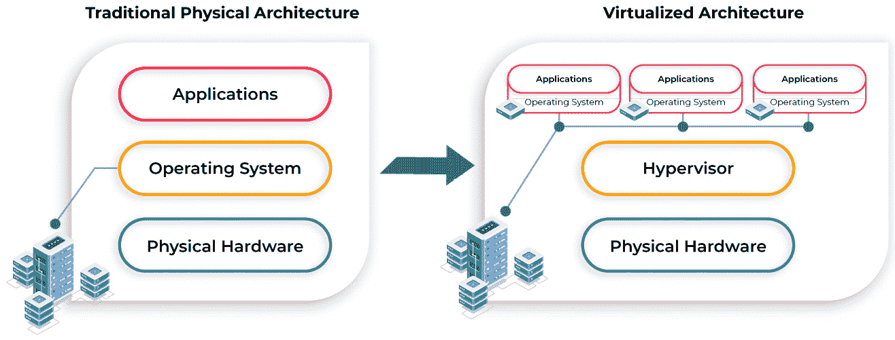
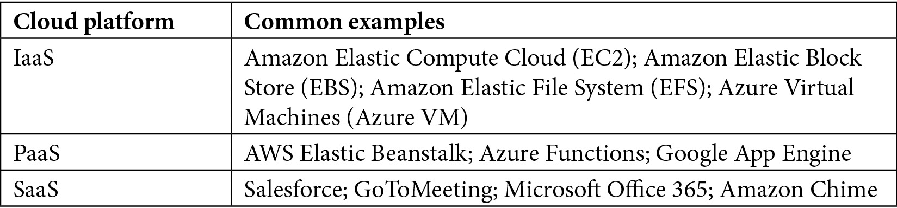
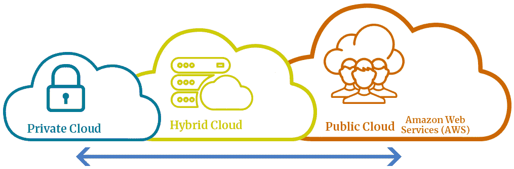

# *第一章*：什么是云计算？

云计算已经成为全球企业设计、构建和实施**信息技术**（**IT**）应用程序的默认选择。过去，你需要托管整个基础设施，雇佣一组开发人员，并设计构建应用程序所需的每个组件和流程。这种方式不仅消耗了大量的成本，而且往往未能遵循最佳实践，也缺乏灵活性和创新空间。

对全球 IT 专业人员来说，理解云计算已成为维持工作并在职业生涯中取得进展的关键。如果你仍然向客户提供老旧的解决方案，那在如今快速发展的 IT 领域中根本不具成本效益。

此外，构建云端解决方案也面临着一些挑战，例如安全性考虑和网络连接问题。因此，提升技能以深入理解如何构建可以托管在云端的弹性、可扩展和可靠的解决方案是至关重要的。

在本章中，我们将介绍云计算的概念、云计算所包含的内容，以及迁移到云端的关键优势。我们还将讨论各种云计算模型以及云的部署选项。了解这些模型和部署选项之间的关键差异及其应用场景和优势，对于制定有效的云采纳策略至关重要。

我们还将简要介绍虚拟化——这一关键技术使得云计算成为可能。

本章涵盖以下主题：

+   什么是云计算？

+   探索虚拟化基础

+   探索云计算模型

+   理解云部署模型

# 什么是云计算？

*云计算*是一个用来描述按需访问 IT 服务的术语，这些服务包括计算、网络、存储和软件服务，通常来自第三方供应商，通常通过公共互联网或某种形式的**广域网**（**WAN**）访问。公司可以为其组织提供所需的 IT 应用程序，而无需采购和管理自己的基础设施来托管这些应用程序。相反，他们从这些第三方供应商租赁/租用所需的 IT 基础设施。

云计算自互联网发明以来，已经以某种形式存在了很多年。在早期，Hotmail（1996 年首次推出，现在更名为 Microsoft Outlook）是云计算的典型代表。你可以在 Hotmail 上为自己和同事设置电子邮件账户，并用它们进行交流。另一种选择是托管你自己的电子邮件服务器（基础设施）网络连接以及电子邮件应用程序（电子邮件软件）。这最终意味着额外的成本和管理开销来维护你托管的电子邮件服务器。

如今，云计算已经成为主流，并且在许多公司和初创企业中，云计算是默认的选择。目前，**Amazon Web Services**（**AWS**）是最大的云计算服务提供商，提供多种形式的云 IT 服务，包括基础设施、平台和软件解决方案。你可以选择使用这些服务，而不是为你的业务应用程序创建自己的专用环境。AWS 的庞大规模使得它能够以更低的成本实际提供所需的组件来托管你的业务应用程序，同时提供**高可用性**（**HA**）、安全性和弹性。

## 云计算的六大优势

让我们来看一下 AWS 定义的云计算六大优势，参考 AWS 的资料（*AWS*，*云计算的六大优势*，[`docs.aws.amazon.com/whitepapers/latest/aws-overview/six-advantages-of-cloud-computing.html`](https://docs.aws.amazon.com/whitepapers/latest/aws-overview/six-advantages-of-cloud-computing.html)），如下面的截图所示：

图 1.1 – 云计算的六大优势

提示

*AWS 认证云从业者*考试假设你已经记住了这六个优势，在测试*定义 AWS 云及其价值主张*目标时会用到。

让我们详细看看以下这些优势：

+   **将资本支出转为可变支出**：转向云计算而不是托管自己的本地基础设施的主要好处之一就是支付基础设施费用的方式。传统上，你需要采购昂贵的硬件并投资宝贵的商业资本，以获得构建托管应用程序所需的基础设施组件。

    使用云计算时，你只需在实际使用基础设施组件时支付费用。这种按需付费的模式意味着在不使用资源时，你可以节省成本。

    从**资本支出**（**CAPEX**）转向**可变支出**，也称为**运营支出**（**OPEX**），意味着你可以将宝贵的商业资本用于更重要的投资领域，例如开发新产品或改善营销策略。

+   **受益于巨大的规模经济**：作为一个独立企业，你通常需要以零售价格购买必要的 IT 硬件，并构建一个能够托管你应用的环境。然而，像 AWS 这样的云服务提供商为成千上万的客户托管基础设施，甚至参与创新并根据其规格定制组件。这带来了更大的规模经济，并使他们能够为客户提供更低的按需付费价格。

+   **停止猜测容量**：传统上，在进行容量规划时，你会为未来的增长采购必要的硬件组件。预测未来增长非常困难，这通常意味着你会过度配置环境。结果就是大量闲置的资源浪费，且这些资源的采购通常需要大额资本支出（CAPEX），而随着折旧的快速发生，这会对财务报表产生不利影响。另一方面，一些公司可能会为了节省成本而低配容量。如果资源不足，可能会对公司形象产生负面影响，例如，由于资源配置不足，客户无法完成交易或遭遇性能问题。

借助云计算和先进的管理软件，你可以在最需要的时候配置必要的基础设施。此外，利用 AWS 等云服务提供商提供的监控和自动化工具，当需求增加时，你可以自动扩展基础设施，而当需求下降时，则可以缩减规模。这样，你只需为实际消费的部分付费，并且只在使用时付费。

+   **提高速度和敏捷性**：像 AWS 这样的云供应商使你能够通过几次点击快速启动和配置新的 IT 资源——例如，你可以在几分钟内为开发人员配置一组新的服务器，帮助你的组织在构建基础设施和发布应用程序时大幅提升敏捷性。如果你正在构建测试和开发环境，或进行实验性工作以研究新产品/服务，那么一旦这些任务完成，你可以同样迅速地终止这些环境。同样地，如果某个项目中途被放弃，你也无需担心有任何物理上的浪费——你只需要关闭或终止你不再需要的资源。相比之下，在虚拟化技术发明之前（后文会讨论），配置一台新的服务器来托管数据库通常需要数周时间。这包括向供应商下订单购买合适的硬件、等待交付、安装额外的组件如存储和内存，然后最终进行操作系统的手动安装并确保其安全。建立数据中心的这个过程也意味着你将资金从主业务中转移——这些宝贵的资本本可以用来创新现有产品或开发新产品。

+   **停止为运营和维护数据中心花费资金**：托管自己的本地基础设施会消耗许多隐性成本。除了花费宝贵的资金购买昂贵的硬件外，你还需要一支工程师团队来高效配置每个基础设施组件，并租赁必要的房地产来安装、堆叠和为你的服务器供电。你还需要使用适当的空调系统保持服务器冷却——这还不是全部。你还需要为昂贵的维护合同支付费用，以应对硬件的磨损。

    通过将你的应用托管在 AWS 的基础设施上，你将不再需要担心这些隐性成本。你的房地产成本和水电费可以大幅减少，使你的业务更具竞争力。

+   **几分钟内实现全球扩展**：AWS 在全球多个地区托管数据中心。尽管你可能在一个国家设有总部，但你将可以完全访问所有区域。这将帮助你提供更低的延迟和更优质的客户体验，无论你的客户身处何地。在其他区域托管资源的副本，还可以帮助你为**灾难恢复**（**DR**）和业务连续性要求进行设计。

相比之下，在其他国家建立物理数据中心的成本可能会非常高，并且可能会阻碍你快速实现全球扩展。访问多个区域还可以帮助你满足有关数据存储位置和管理方式的合规性或监管要求。

在本节中，我们了解了云计算的基础知识，并讨论了其六个关键优势。我们明白了，采用云技术帮助客户更好地管理成本，同时使他们能够更快地扩展应用程序，并变得更加灵活。在下一节中，我们将讨论云计算服务中最重要的基础组成部分之一——虚拟化。

# 探索虚拟化的基础知识

虚拟化是使云计算能够普及的核心技术之一，它催生了像 AWS、Microsoft Azure 和 **Google Cloud Platform** (**GCP**) 等云服务提供商，这些提供商提供大量的服务和应用程序，并具备**高可用性** (**HA**)、弹性等功能，能够为客户提供服务，通常只需几分钟时间。

在虚拟化技术普及之前，如果你想外包基础设施需求，IT 服务提供商必须为你的业务提供物理基础设施组件，比如物理服务器，并通过互联网授予访问权限。然而，配置物理服务器通常需要较长的时间，从采购和安装所有硬件组件（如**中央处理单元**（**CPU**）、内存和存储）到配置操作系统和必要的应用程序。这样一来，可能需要等待几天才能完成环境配置。

硬件技术的进步，如 CPU、内存和存储的提升，使得性能和能力大幅提升，以至于托管单一操作系统和少量应用程序的物理服务器通常会处于空闲状态。相反，软件工程和软件设计的改进确保了硬件资源得到了有效利用，以支持这些应用程序。最终结果是，单一操作系统和少量应用程序通常无法最大化利用物理硬件资源。

硬件与软件之间的这种关系促成了虚拟化的发明。虚拟化技术和**虚拟机监控程序**（**hypervisors**）使得将单个物理服务器的硬件组件模拟为多个虚拟组件成为可能。这些组件随后被部署为多个**虚拟机**（**VMs**），每个虚拟机运行其自己的操作系统和一套应用程序。

虚拟机管理程序（Hypervisor）本质上是一种介于实际物理硬件和虚拟机（VM）之间的软件。它负责使得运行在虚拟机上的操作系统和应用程序能够以一种受控的方式访问物理硬件资源，并且将这些资源相互隔离。虚拟机管理程序及其关联的管理软件用于*划分*物理硬件组件的虚拟化表示，将其分解为更小的虚拟组件，然后以虚拟机的形式呈现。每个虚拟机可以安装其自己的操作系统，并配备所需的应用程序。

虚拟化的最大优势之一是可以快速配置资源。通过使用软件来模拟*现有的*物理硬件（使得当客户发出请求时硬件可以立即提供），虚拟服务器、存储或网络环境的配置时间大大缩短。

在下图中，我们可以看到虚拟化如何使我们能够从连接到服务器的物理存储中分配虚拟存储设备给各个虚拟机：

图 1.2 – 传统物理架构与虚拟化架构对比

虚拟化的最大优势之一是资源配置的速度。由于软件被设计用来模拟*现有的*物理硬件（以便当客户发出请求时硬件能够提供），虚拟服务器、存储或网络环境的配置时间大大缩短。

### 虚拟化与云计算

虚拟化本身并不是云计算。然而，这项技术使得提供云计算服务成为可能。云计算服务提供商的一个主要特征是能够通过自助管理工具来配置虚拟化的基础设施资源。AWS 通过其管理控制台（通过网页浏览器访问）、**命令行界面**（**CLI**）和直接访问其软件**应用程序编程接口**（**APIs**）等工具，来帮助客户配置如服务器、网络、存储和数据库等资源。通过提供明确的 API 并支持自动化，云服务提供商使得客户可以通过*自助服务*模式来配置所需的资源。客户无需排队等待云工程师为其配置资源，而是可以直接通过 API 调用与云服务互动，并在几分钟内启动自己的资源。

最终，云计算提供商利用虚拟化技术、支持虚拟化的现代硬件技术以及软件，提供共享计算资源、基于**软件即服务**（**SaaS**）的产品和其他按需服务，通过互联网进行传输。此外，像 AWS 这样的提供商还提供解决方案，支持弹性、自动化、可扩展性和高可用性（HA），并采用按需计费模式，使其服务几乎可以被任何类型的客户在任何地点访问。

总结一下，虚拟化的好处如下：

+   通过设置多个虚拟机（VM）来高效使用强大的硬件，提供不同的应用程序

+   使服务器整合成为可能，从而降低成本

+   允许你以更快的速度管理大规模的安装和部署

+   通过基础设施隔离和高效管理底层硬件资源来提高安全性

+   使你能够在同一硬件上托管不同的操作系统以支持不同的应用程序

在这一节中，我们了解到虚拟化技术是云计算演进的主要驱动力。该技术使得资源（如服务器、网络组件和存储服务）的配置可以在几分钟内完成。此外，虚拟化管理应用程序使我们能够构建自助服务平台。客户只需登录管理控制台，并配置必要的资源来构建托管其应用程序的架构。

在下一节中，我们将探讨可用的云计算模型。不同的模型需要不同程度的管理，因此提供不同程度的灵活性。

# 探索云计算模型

云计算如今为企业提供了将托管和管理应用程序的成本与复杂性外包的能力——例如，许多供应商提供的主流应用程序作为一种完整的服务，不需要客户进行任何形式的基础设施管理。举例来说，**Microsoft Office 365** 是一套包括电子邮件、消息传递和协作服务的桌面生产力应用程序，且通过互联网提供。与此同时，许多组织也需要托管定制的**业务线**（**LOB**）应用程序，例如那些内部开发的应用程序。通常，这意味着他们需要访问并配置必要的基础设施，以最适合应用程序需求的方式进行配置。

为此，企业可以聘用云提供商的服务，例如 AWS，它提供不同的云模型，以满足业务的具体需求。以下是大多数云供应商（如 AWS）提供的三种主要云模型。

## 基础设施即服务

**基础设施即服务**（**IaaS**）模型在为客户提供访问和配置底层网络、存储和计算服务方面提供了最大的灵活性，从而支持其 LOB 应用程序。 这种模型非常类似于拥有和管理自己的物理基础设施。 但是，通过云计算，其明显区别在于您使用虚拟化的基础设施组件而不是访问底层物理组件。

如果您需要更多控制如何配置基础设施组件（通常是从操作系统层向上）以支持特定应用程序，则 IaaS 云计算模型非常理想。

## 平台即服务

**平台即服务**（**PaaS**）是另一种云计算模型，旨在消除配置和管理底层基础设施资源（如计算、存储和网络服务）的负担。 PaaS 旨在让您的组织专注于开发应用程序代码，并为您提供一个*平台*来部署和管理应用程序的发布、更新和升级。

当您的开发人员将其应用程序代码部署到 PaaS 环境时，提供商将为支持该应用程序所需的基础设施进行配置。 这将包括必要的网络架构、防火墙规则、存储、计算服务、操作系统管理和运行时环境。

根据您的供应商，PaaS 模型可能仍然在如何配置底层基础设施方面提供一定程度的灵活性。 例如，AWS 允许您对底层基础设施进行必要的修改，提供了额外的灵活性。 此类服务的示例包括 AWS Elastic Beanstalk、AWS OpsWorks、AWS Lambda 和 Amazon **关系数据库服务**（**RDS**）。 虽然 AWS 提供的 PaaS 模型消除了必须详细配置每个基础设施组件的需求（这是您必须在 IaaS 模型中执行的操作），但它仍然提供了决定部署哪些组件来支持您的应用程序的灵活性。

## SaaS

通过**SaaS**模型，应用程序完全由提供商托管和管理。 SaaS 服务消除了托管应用程序所需的任何物理基础设施的需求。 相反，您只需通过互联网连接到这些应用程序，并使用提供的服务。 今天，大多数 SaaS 应用程序都可以通过标准的 Web 浏览器完全运行。 这也意味着无需安装任何客户端软件。

尽管托管 SaaS 应用程序所需的任何基础设施的设置和配置完全由供应商负责和管理，但许多基于 SaaS 的应用程序仍然需要某种形式的配置，以满足您业务的特定需求。您仍然需要具备内部专业知识来根据您的要求配置应用程序，或者寻求供应商/第三方的支持。例如，Microsoft Office 365 是一套基于 SaaS 的在线生产力应用程序，集成了电子邮件、文件共享和协作服务。尽管您无需在现场拥有任何物理硬件来托管该应用程序，因为它可以作为完整的产品通过互联网访问，但您仍然需要配置软件元素以满足您的业务需求。这包括安全配置、将您的域名与所提供的电子邮件服务关联，或者启用加密服务。

让我们来看看 IaaS、PaaS 和 SaaS 模型的一些典型示例，如下所示：

表 1.1 – 云计算模型

在这一节中，我们探讨了云计算模型。我们了解了 IaaS、PaaS 和 SaaS 等核心模型之间的主要区别。每个模型都有其自身的管理负担，并且能够提供设计、构建和部署应用程序的灵活性。

在下一节中，我们将探讨云部署模型。在这里，我们评估自己托管本地云（或私有云）与使用公共云服务提供商服务之间的差异。我们还将讨论如何将您的私有云环境与可能托管的公共云提供商资源连接起来。

# 理解云部署模型

在为您的组织部署云服务时，您需要考虑哪种部署模型最适合您的业务。这个决策将基于多个因素，例如您所在的行业、合规性和监管问题，以及成本管理和配置灵活性。

部署云服务时有三种主要的部署模型，列举如下：

+   公共云

+   私有云

+   混合云

这些模型在下图中表示：

图 1.3 – 云部署模型

我们来详细了解每个模型。

## 公共云

公共云是一种云部署模型，企业通过互联网从第三方供应商（如 AWS）获取 IT 服务。这是最受欢迎的云计算模型，因其提供了各种各样的服务。像 AWS 这样的公共云供应商专注于向各行各业及各种规模的企业提供 IT 服务。

公有云服务通常采用按需付费的模式，可以帮助您的组织从 IT 的资本支出（CAPEX）模式转向运营支出（OPEX）模式。这将释放宝贵的资本，供您进行更重要的投资机会。公有云供应商提供的服务包括免费服务、基于订阅的服务，或按需付费的服务，费用根据您使用的量来收取。公有云服务提供商还能够提供更大的可扩展性和灵活性，这些通常是单靠自己无法实现的，且成本过高。

在公有云模式下，客户可以使用*自助服务*功能，访问管理控制台和命令行接口，并可以通过 API 配置和消费所提供的服务。

## 私有云

相比之下，私有云是一种云部署模型，您的企业负责采购、安装、配置和管理所有必要的基础设施和软件组件。这听起来与传统的*本地* IT 非常相似。然而，它的云元素来自于通常会部署额外的管理软件，允许企业的不同部门从可用服务目录中执行*自助服务*任务，如提供计算、存储、网络和软件服务。

虽然公有云提供商为全球所有企业提供服务，因此这些服务是公开可用的，但私有云则专为您的企业设计，您将不会与任何外部组织共享底层计算资源。

私有云具有高度可定制性，可以满足您组织的需求，使您在设计安全性和基础设施配置等关键领域拥有最大控制权。这并不一定意味着私有云提供商（例如，Red Hat OpenStack）比公有云提供商更安全。像 AWS 这样的公有云提供商会投入大量资金来设计其服务的安全特性——这些特性如果由组织自己实施，可能会因为成本过高而无法实现。

## 混合云

这是将 IT 服务结合部署在本地（仅由您的企业管理）并与一个或多个第三方云提供商集成的模式。

许多进入公有云的公司通常会从某种形式的混合模型开始。通常，企业会将服务迁移到公有云，以减少资本开支（CAPEX）投资，并选择基于*按需付费*的 IT 服务消费模式。例如，公司可能需要增加部署的服务器数量，而不是购买更昂贵的物理硬件，他们可以在本地基础设施与公有云提供商之间建立网络连接，根据需要启动额外的服务器。连接选项可以包括在公有互联网中建立一个安全的**互联网协议安全**（**IPsec**）**虚拟私人网络**（**VPN**）隧道，或甚至建立一个专用的光纤连接，完全绕过公有互联网，享受更大的带宽。

混合云通常也用于帮助启动**灾难恢复**（**DR**）项目，这些项目通常需要私有云基础设施与公有云提供商提供的服务之间进行网络通信，其中灾难恢复解决方案将被托管。这使得可以将本地数据和应用程序复制到灾难恢复站点，该站点由如 AWS 之类的供应商托管。

混合云部署还可以帮助企业开始测试新的前沿技术，或采用分阶段迁移方法，以确保在迁移过程中尽量减少对正常业务功能的干扰。此外，还可以实施高可用性（HA）解决方案。例如，如果本地基础设施出现停机，服务的消费者可以被重定向到托管在公有云提供商上的复制服务。

# 总结

在本章中，我们探讨了云计算的基础知识，以及它如何帮助企业使用必要的 IT 服务来托管他们的应用程序。我们讨论了云计算的六大关键优势，以及它为何能提供更大的灵活性和韧性，同时还为创新和降低成本提供了机会。

我们还考察了三种云计算模型，分析了它们的主要区别，并比较了每种模型提供的灵活性水平。我们还评估了三种云部署模型，并识别了企业如何通过构建混合云解决方案轻松启动其云之旅。

在下一章中，我们将介绍 AWS。我们将讨论它的历史，并提供其服务的简要概述。我们还将考察 AWS 全球基础设施，这使企业能够访问分布全球的数据中心设施，在这些设施中它们可以部署自己的应用程序。这将使企业能够在全球范围内扩大客户群体。然后，我们将介绍 AWS 提供的支持计划，这对于任何希望使用云服务的企业来说都是至关重要的。

# 问题

这里有一些问题可以帮助你测试自己的知识：

1.  以下六项优势中，哪项使小型初创公司能够立即开始使用来自 AWS 等公共云供应商的 IT 服务？

    1.  用变动费用替代资本性支出

    1.  几分钟内实现全球化

    1.  停止猜测容量

    1.  提高速度和敏捷性

1.  云计算的哪项功能使客户能够通过自助服务模型，在几分钟内部署其资源？

    1.  访问云供应商 API

    1.  访问云供应商工程师来进行服务器安装和配置

    1.  可扩展性特性

    1.  多种服务器选项

1.  什么是虚拟机监控程序？

    1.  使你能够在物理硬件上创建和管理虚拟资源的软件，如虚拟机（VM）

    1.  用于监控 Windows 服务器健康状况的软件

    1.  用于创建高可用性网站的软件

    1.  使你能够提高物理服务器性能的硬件

1.  以下哪项是服务器虚拟化的主要好处？（选择两个答案。）

    1.  高效利用物理硬件资源

    1.  能够在几分钟内配置虚拟服务器

    1.  增强加密服务

    1.  满足合规要求的能力

1.  以下哪个是 IaaS 的典型例子？

    1.  一项服务，允许你配置底层虚拟计算、存储和网络资源来托管你的应用程序

    1.  一项服务，抽象化底层基础设施，允许你专注于应用程序代码的部署过程

    1.  一项服务，通过公共网络托管并交付完整的应用程序，无需访问任何底层基础设施

    1.  一项服务，允许你在短期租赁期间使用硬件资源，并按计量方式付费

1.  以下哪个是 PaaS 的典型例子？

    1.  一个平台，通过公共网络托管并交付完整的应用程序，无需访问任何底层基础设施

    1.  一项服务，允许你配置底层虚拟计算、存储和网络资源来托管你的应用程序

    1.  一项服务，抽象化底层基础设施，允许你专注于应用程序代码的部署过程

    1.  一项服务，允许你使用代码构建基础设施，以便在不同环境中进行重复部署

1.  以下哪个是 SaaS 的典型例子？

    1.  一项服务，允许你配置底层虚拟计算、存储和网络资源来托管你的应用程序

    1.  一项服务，抽象化底层基础设施，允许你专注于应用程序代码的部署过程

    1.  一项服务，通过公共网络托管并交付完整的应用程序，无需访问任何底层基础设施

    1.  一项服务，允许开发者在软件开发生命周期中采用 DevOps 策略

1.  哪种云部署模型使你能够将本地工作负载与在 AWS 等公共云提供商处部署的资源连接？

    1.  私有云

    1.  公有云

    1.  混合云

    1.  超级云
