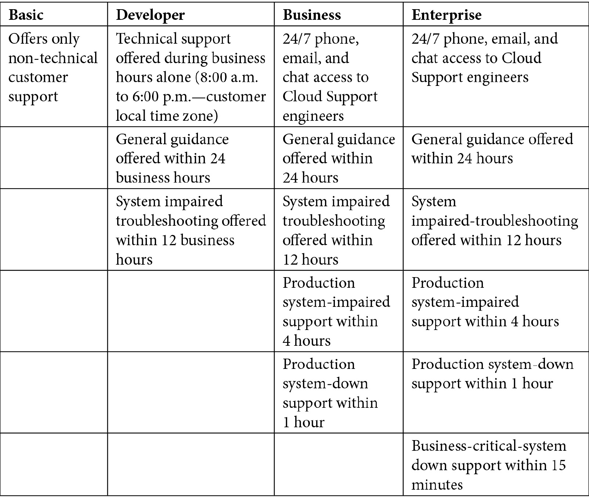

# *第二章*：AWS 和全球基础设施概述

本章中，我们将讨论 **亚马逊 Web 服务** (**AWS**) 是什么，回顾其简短历史，并尝试了解 AWS 全球基础设施。全球基础设施使您能够访问遍布不同大洲的 AWS 数据中心，从而为客户构建高可用性、容错性和可扩展的解决方案。此外，您还可以确保将工作负载放置在离客户位置更近的地方，并满足任何合规或监管要求。

AWS 的这一关键服务使您能够在不同区域之间访问和启动资源。深入理解这一点将帮助您满足客户的需求——遵守监管和合规要求、提供**灾难恢复**(**DR**)解决方案，甚至节省成本——所有这些最终都能提升客户体验。

我们还将讨论 AWS 提供给客户的支持计划。根据客户需要托管的应用程序数量和复杂度，他们可能需要不同级别的支持。选择合适的计划是确保您在有效管理成本的同时获得所需支持并满足任何特定要求的关键。

本章内容包括以下主题：

+   什么是 AWS？

+   探索 AWS 全球基础设施

+   为您的业务选择合适的 AWS 支持计划

+   AWS 服务健康仪表板概述

+   AWS **可接受使用政策** (**AuP**)

# 什么是 AWS？

**亚马逊 Web 服务** (**AWS**) 是亚马逊的全资子公司，是全球最大的公共云计算提供商。它通过遍布全球的数据中心，向客户提供超过 175 项独特服务。这些服务通过互联网访问（也提供部分本地部署选项），并采用按需计费模式。它的客户包括初创公司、企业客户，甚至像**美国**(**US**)海军这样的政府组织。

Gartner Research 每年发布一份报告，名为 *云基础设施与平台服务魔力象限*，在过去几年中，AWS 一直位居领导者象限的首位。

您可以在 [`aws.amazon.com/resources/analyst-reports`](https://aws.amazon.com/resources/analyst-reports) 上访问大量分析研究报告。在左侧菜单中，只需将搜索筛选为 `Magic Quadrants`，即可获得 Gartner 的一系列报告，其中包括前述的 *云基础设施与平台服务魔力象限* 报告。

## AWS 简史

AWS 于 2002 年开始了它的旅程，当时它开始向公众提供一些临时服务。以下截图展示了它的一些关键里程碑和迄今为止的历程：

图 2.1 – AWS 历史：时间线

本节中，我们简要回顾了 AWS 的历史及其如何成为云市场的领导者。在下一节中，我们将探讨 AWS 全球基础设施，它对其功能至关重要，并且使 AWS 能够向客户提供丰富的云服务。

# 探索 AWS 全球基础设施

AWS 全球基础设施包括多个数据中心，这些数据中心存放着全球不同地理**区域**的所有服务器、存储设备和网络设备。

随着 AWS 不断扩大其全球布局，它会建设更多的数据中心，这最终会增加其客户可以访问的区域数量。

在撰写本文档时，以下截图展示了当前全球的活跃区域，并包括即将到来的区域：

图 2.2 – AWS 全球基础设施。图片由 AWS 提供（[`aws.amazon.com/about-aws/global-infrastructure/`](https://aws.amazon.com/about-aws/global-infrastructure/))

**AWS 区域**是 AWS 托管一组**数据中心**的物理位置。在一个给定区域内，这些数据中心的构建方式是将较大集群的小组在逻辑和物理上分隔开，彼此之间的距离在 100 **公里**（**km**）（60 英里）以内。这些在逻辑和物理上分隔的小组构成了我们所称之为**可用区**（**AZ**）。

AWS 目前在全球 24 个地理区域内跨越 77 个可用区（AZ），并已宣布在澳大利亚、印度、印尼、日本、西班牙和瑞士计划新增 18 个可用区和 6 个 AWS 区域。

让我们更深入地了解什么是区域和可用区（AZ）。

## 区域

一个区域将包含至少两个可用区，许多区域甚至包含三个或更多。北弗吉尼亚区域（N. Virginia 或`us-east-1`）包含六个可用区。通常，当 AWS 推出新服务时，它会首先在北弗吉尼亚区域部署。

你可能会好奇，为什么需要这么多区域，这样做有什么用处。简单来说，全球多个区域将使 AWS 能够进一步吸引这些地区的客户注册其服务。然而，这也可能引发另一个问题。如果没有任何限制阻止你访问全球另一端的 AWS 区域的服务，为什么还需要这么多区域？继续阅读，了解其原因。

AWS 的多区域战略使您（客户）能够获得以下好处：

+   在接近终端用户的地方识别基础设施资源，在那里你可以托管应用程序并减少网络延迟，从而带来良好的**用户体验**（**UX**）

+   在政治和国家边界内识别基础设施，以遵守严格的数据主权和合规性法规。

+   将资源组相互隔离，以便在发生重大区域性故障时，能够满足任何故障转移或灾难恢复（DR）场景。

关于第二个好处，许多服务是基于区域的。这意味着在使用该服务部署资源之前，你需要选择要部署资源的区域。例如，如果你想启动一个新的基于 Windows 的虚拟服务器（我们称之为 AWS 上的**弹性计算云**（**EC2**）实例），你需要选择希望部署它的区域。事实上，对于 EC2 实例，你还需要指定在该区域内希望启动服务器的可用区。接下来，让我们了解可用区（AZs）。

## 可用区（AZs）

可用区（AZs）是给定区域内数据中心的逻辑和物理分组。每个区域会有两个或更多的可用区，如前所述。可用区是 AWS 在一个大都市区内部署一个或多个数据中心设施的逻辑表示。这些数据中心将容纳硬件组件，如服务器、存储和网络设备，所有这些设备都配备了冗余电力、连接性、冷却和安全控制。

拥有多个可用区（AZs）的主要目的是为客户提供构建高可用、容错和可扩展解决方案的机会。这是可能的，因为同一区域内的可用区通过高带宽、低延迟的私有光纤连接互联，从而提供区域间的高吞吐量连接。

这个配置的一个重要方面是，你可以在可用区之间实现同步复制。这意味着你可以在不同可用区的服务器上部署应用程序的多个副本/副本。如果某个可用区发生故障，你可以继续通过在其他可用区运行的副本工作负载为客户提供服务。

在*图 2.3*中，如果 AZ **A**发生故障，用户的流量将仅被引导到 AZ **B**中的服务器，这些服务器提供完全相同的服务。架构设计确保用户不会察觉到故障，从而显著改善用户体验（UX）。

这是一个可行的设计，因为我们可以将副本应用程序服务器分布在多个可用区中，并通过 Amazon **弹性负载均衡器**（**ELB**）将终端用户流量分配到这些服务器上。ELB 不仅将用户流量分配到应用服务器，还会监控这些服务器的健康状况，只有当这些服务器在线并且响应时，才会发送流量。稍后我们将在*第九章*中详细讨论 Amazon ELB，*AWS 上的高可用性和弹性*。你可以在这里看到上述设计的示意图：

图 2.3 – 用户流量暂时仅被引导到 AZ B 中的服务器，直到 AZ A 恢复上线。

所以，现在我们已经理解了区域和可用区（AZs）之间的差异，以及如何利用可用区来构建高可用性解决方案，我们可以继续了解 AWS 全球基础设施的另一个组件：边缘位置。

在接下来的部分中，我们将讨论如何利用边缘位置构建**内容分发网络**（**CDN**）并提供缓存服务。

## 边缘位置

除了区域和可用区（AZs）之外，AWS 还提供了另一种类型的托管服务，称为边缘位置。这些边缘位置同样托管着物理服务器基础设施、大量存储设备以及高带宽网络设备。此外，AWS 的边缘计算服务提供了基础设施和软件，使得数据可以更接近最终客户进行处理和分析。这包括将 AWS 管理的硬件和软件部署到 AWS 数据中心以外的位置，甚至直接部署到客户自有的设备上。

如前所述，你在 AWS 上部署的大多数资源将是基于区域的。例如，一个 EC2 实例可以部署在北弗吉尼亚区域的一个特定可用区（AZ）。假设这些服务器托管媒体文件，并且你希望将这些文件全球分发给最终用户。对于位于澳大利亚悉尼的用户来说，这意味着每次请求这些文件时，都会直接通过公共互联网从位于美国的服务器获取这些大型媒体文件。

通过边缘位置，你可以将频繁访问的文件缓存到靠近悉尼用户的服务器上。这意味着下载这些频繁访问的文件所需的时间大大缩短，从而显著提高用户体验。

边缘位置服务的一个重要组成部分是亚马逊的 CloudFront。这是一个 CDN 服务，旨在帮助你为你的内容创建分发点。分发点将在每个区域的这些边缘位置创建，具体取决于你的配置。然后，你的内容将被缓存到最靠近最终用户的边缘位置，当他们尝试访问你的内容时。

边缘位置不仅仅是缓存内容。例如，**Amazon Simple Storage Service**（**Amazon S3**）是一个对象存储解决方案，允许你在每个区域创建容器（在 AWS 中我们称之为**桶**）。你可以将任何类型的数据上传到桶中并进行存储。如果你需要将大文件上传到全球任何地方的桶中，你可能会遇到高延迟和较低吞吐量的问题，因为数据需要通过公共互联网传输。

Amazon S3 传输加速是 Amazon S3 的一项功能，允许你通过这些边缘位置将内容上传到 AWS 存储桶。一旦你的数据到达离你更近的边缘位置，它将通过 AWS 主干网络使用高速链接进行传输。这大大提高了数据上传到 Amazon S3 存储桶的速度。你实际上可以使用 AWS 提供的工具测试上传传输速率，该工具可通过 [`s3-accelerate-speedtest.s3-accelerate.amazonaws.com/en/accelerate-speed-comparsion.html`](https://s3-accelerate-speedtest.s3-accelerate.amazonaws.com/en/accelerate-speed-comparsion.html) 访问。该工具将尝试从你的浏览器（你的所在地）将一个示例文件传输到不同的 Amazon S3 区域，并显示 AWS S3 传输加速与不使用传输加速时的传输速率比较。

边缘位置通过 AWS 主干网络与 AWS 区域连接。这个网络包括完全冗余的多个 100 **千兆以太网** (**GbE**) 并行光纤连接，显著提高了吞吐量，并提供低延迟的连接。

以下截图展示了当前全球的边缘位置。AWS 根据消费者需求和业务要求，持续建设和部署更多边缘位置：

图 2.4 – 全球的边缘位置和区域边缘缓存。图像来自 AWS ([`aws.amazon.com/cloudfront/features/`](https://aws.amazon.com/cloudfront/features/))

边缘位置确实存在一些限制，因为它们的缓存大小会随着时间的推移而填满，为了容纳新内容，它们会驱逐最近未访问的内容。这意味着下次有人尝试访问该特定内容时，它将需要从原始源重新获取。为了减少这种情况发生的频率，AWS 还提供了 *区域边缘缓存*，我们将在接下来讨论。

## 区域边缘缓存

除了边缘位置，我们还有区域边缘缓存。区域边缘缓存具有更多存储空间，并提供更大的缓存容量。正如你想象的那样，边缘位置的存储设备将包含大量缓存内容——这些内容可能是图片、视频、文档等。它们的主要目的是存储频繁访问的内容。随着内容变得过时，它将从缓存中驱逐，以为更新的内容腾出空间。这意味着，当某些内容不常被访问时，最终用户将不得不再次从原始服务器中拉取这些文件才能访问它们。

在这种情况下，区域边缘缓存非常有用。全球部署的区域边缘缓存远少于边缘位置，但它们的部署是有战略意义的。它们提供额外的存储和缓存，可以比标准边缘位置更长时间地保留那些不常访问的数据。

最终，区域边缘缓存也会驱逐那些未被访问的数据，但在过渡期间，如果地球另一端的某个终端用户请求相同的数据，那么该过程会重复，此时该数据会被缓存到离该特定用户更近的边缘位置。

## 区域服务

我们之前讨论过，大多数 AWS 服务都是基于区域的，您需要首先选择一个区域，然后在该区域内创建该服务的资源。例如，如果您希望启动一个 **关系型数据库服务**（**RDS**）数据库，您必须先选择希望部署数据库的区域，然后在该区域内启动您选择的数据库引擎。

这是因为将承载该服务（服务器、存储或数据库）的基础物理基础设施将位于您所在的区域。这就是为什么 AWS 上的大多数服务都是基于区域的原因。

在以下截图中，您需要选择一个区域，才能启动一个新的 Windows 服务器。同样，如果您需要访问之前部署的某个服务器，您必须知道它所在的区域：

](img/B17124_02_05.jpg)

图 2.5 – 选择一个区域以访问在该区域部署的 EC2 实例（服务器）

现在我们已经理解了 AWS 全球基础设施的核心组件，我们可以继续讨论如何向客户提供各种类型的服务。一些服务需要您指定您希望使用它的区域，而其他服务则可以全球访问，无需指定具体的区域。让我们在接下来的部分中讨论这个问题。

## 全球服务

尽管大多数服务都是基于区域的，正如我们之前提到的，仍然有一些服务属于全球服务类别。尽管这似乎与之前提到的逻辑相矛盾，即某个服务显然需要在每个区域中具有物理基础设施，但 AWS 仍会将该服务作为全球产品提供。换句话说，无论您在哪个区域工作，您都可以直接从任何位置访问这些全球服务。

这些服务作为全球服务呈现的原因是，您希望在这些服务中创建的资源可以全球访问，并且在许多情况下，这些资源在您 AWS 账户中的所有区域内是唯一的。

以您在 AWS 账户中的单个用户账户（**身份与访问管理**（**IAM**）用户）为例。为您组织中需要使用 AWS 账户中的服务和资源的每个员工创建独特的账户是有意义的。想象一下，如果每个开发人员在每个区域都需要创建多个账户，那只会带来巨大的管理负担。

尽管以下列表并不详尽，但以下服务在 AWS 上呈现为全球服务：

+   **AWS IAM**——AWS 提供的一项服务，使你能够授予访问你 AWS 账户中的服务和资源的权限。AWS IAM 允许你为需要访问这些服务的员工创建 IAM 用户，定义权限，配置组，并设置角色。我们将在*第四章*《身份与访问管理》中讨论 AWS IAM。

+   **Amazon CloudFront**——一个 CDN 服务，允许你为特定源服务器创建内容分发点。Amazon CloudFront 服务将在靠近请求访问你内容的用户的边缘位置缓存内容。

+   **Amazon Route 53**——一个高度可用、可扩展且完全托管的云 **域名系统** (**DNS**)。你可以使用 Amazon Route 53 注册新的域名，配置域名记录，并为各种用例设计全球路由策略，例如为构建高可用解决方案而设计的主动/被动解决方案。

+   **Amazon S3**——尽管 Amazon S3 存储桶需要在每个区域中创建，因此这些存储桶是区域特定的，但该服务本身呈现为全球服务。当你访问 Amazon S3 控制台时，你无需选择特定区域，而是会看到你已创建的所有区域中的存储桶列表，如下图所示：

图 2.6 – 显示在特定 AWS 账户中跨所有已部署区域的 Amazon S3 存储桶

除了全球和区域服务，AWS 还提供某些旨在本地使用的服务。这些服务可以用于构建混合云模型或帮助将本地工作负载迁移到 AWS。我们将在下一节中探讨其中的一些服务。

## 本地服务

尽管 AWS 是一家公共云提供商，但它们也提供某些托管在客户本地数据中心的服务。这使得客户能够将 AWS 服务的管理能力带到他们的本地数据中心。

一些本地服务旨在促进混合云部署解决方案，而其他本地服务则可用于通过离线路线将数据从本地数据中心迁移到 AWS 云，特别是在带宽受限的情况下。提供这些本地服务的另一个原因是它们帮助满足某些客户对数据驻留的严格法律要求。

一些设计为在本地托管或使用的服务包括以下内容：

+   **Amazon Snow Family**——这些是包含 **固态硬盘**（**SSD**）、计算硬件和网络组件的物理封装单元，运送到客户站点。AWS Snow Family 包括 Snowball Edge 设备、Snowcone 和 Snowmobile。它们可用于将 **TB**（**千兆字节**）到 **PB**（**拍字节**）的数据复制到设备上，这些数据可以返回 AWS，以便将数据复制到 Amazon S3 中。它们还提供计算能力，以便在将数据复制到设备时，数据可以按需处理和分析。

+   **Amazon Storage Gateway**——该服务使用户能够将本地存储与 Amazon S3 连接，提供不同的网关选项，旨在将其存储数据卸载到 Amazon S3。用户将继续从本地服务器无缝访问这些数据。根据所选配置选项，Amazon Storage Gateway 可以在本地维护一小部分频繁访问的数据，并将大部分数据存储在 Amazon S3 中，从而减少本地所需的存储硬件，降低资本成本。或者，如果本地应用程序对网络延迟非常敏感，Amazon Storage Gateway 服务还可以提供数据备份功能，能够将本地存储的数据快照发送到 Amazon S3。

+   **Amazon Outposts**——这是一种 42U 的机架，能够从 1 个机架扩展到 96 个机架，以创建计算和存储容量池，托管在您本地的数据中心。U 代表机架单位或“U 空间”，等于 1.75 英寸的高度。标准高度为 48U（即 7 英尺机架）。Amazon Outposts 提供 AWS 的所有管理软件和功能，用于管理您的 EC2 实例，以及在本地数据中心托管的存储和 RDS 数据库服务。

    这使得低延迟连接、本地数据处理以及遵守本地数据驻留要求成为可能。可以在 Amazon Outposts 上本地运行的其他服务包括 **弹性容器服务**（**ECS**）、**弹性 Kubernetes 服务**（**EKS**）和 **弹性 MapReduce**（**EMR**）集群。您还可以在本地数据中心运行的另一项服务是使用 Amazon S3 在 Outposts 上的主机对象存储服务。这有助于您满足本地数据处理和数据驻留的需求。

在本节中，我们考察了 AWS 全球基础设施。这是一个底层核心基础设施组件，托管在遍布不同战略地理区域的 AWS 数据中心中。AWS 为您提供访问所有区域的权限，使您能够托管应用程序，满足各种使用案例——从确保您的应用程序尽可能靠近最终用户，到帮助您遵守任何合规性或数据主权法律。

我们还回顾了区域、可用区（AZ）和边缘位置之间的主要区别，并了解了如何使用这些资源构建具有高可用性、可扩展性和容错性的架构。我们还讨论了如何利用边缘位置提供低延迟的内容和数字资产访问。

接下来，我们讨论了基于区域的服务和全球服务之间的区别。我们还检查了某些可在客户数据中心本地运行的服务。

在下一节中，我们将回顾 AWS 支持计划。当你开始在 AWS 平台上构建解决方案时，选择合适的支持计划极为重要，这样可以确保为你的用例提供正确级别的支持，同时确保有效地管理成本。

# 为你的企业选择合适的 AWS 支持计划

AWS 非常注重提供卓越的客户支持。然而，不同的企业需要不同层次的支持，在 AWS，每个客户都会得到相应的照顾。除了标准的客户支持服务，如解决账户设置或账单问题外，AWS 还提供广泛的技术支持，帮助客户更快、更高效地采用云技术。

即使你在本地数据中心拥有丰富的技术经验，迁移到云端仍然需要学习一套新的技能，理解如何为云架构解决方案，同时还要做到成本效益。AWS 招聘并培养了一些最优秀的工程师，他们的支持团队在他们提供的技术方面非常熟练。

AWS 提供了*四种支持计划*，将在以下章节中讨论。

## 基础支持计划

无论你最终为你的企业选择哪种支持计划，每个账户都订阅了基础支持计划。在这点引起你兴趣之前，我应该指出，这个计划并不提供*任何真正的技术支持*。基础支持计划完全免费，提供与账户相关的客户支持服务，例如账单支付或登录账户时遇到的问题。你还可以访问公开的文档、白皮书和支持论坛。你可以通过电子邮件、聊天和电话全天候 24/7 使用基础支持服务，电话支持包括让亚马逊通过固定电话或手机回拨给你——所以，他们承担通话费用。

此外，您还可以访问受信任顾问工具中的七项基本检查，帮助您识别提升性能和改善安全性的最佳实践。我们将在*第十三章*中查看受信任顾问工具，内容为*AWS 上的管理与治理*。最后，您还可以通过**个人健康仪表板**（**PHD**）接收到有关可能影响您部署资源的 AWS 服务中断的警报。PHD 的详细讨论也在*第十三章*，*AWS 上的管理与治理*中。

## 开发者支持计划

AWS 推荐如果*您在 AWS 上进行实验或测试*，订阅开发者支持计划；更多信息请参考 [`aws.amazon.com/premiumsupport/plans/`](https://aws.amazon.com/premiumsupport/plans/)。开发者支持计划是一个具有成本效益的解决方案，适用于非生产工作负载的支持。这些是仍处于开发阶段且尚不支持任何关键业务需求的网站或应用程序。如果您能接受此类工作负载的长期停机时间，开发者支持计划的价格非常合理。

虽然开发者支持计划为您提供技术支持，但它仅限于针对 AWS 使用案例的通用支持，支持团队将无法讨论您可能遇到的特定应用层问题。支持仅通过电子邮件提供（不提供电话支持），并且仅在工作时间内提供 Cloud Support 专员的支持。尽管您可以提出无限数量的案件，但案件的严重性和响应时间为一般指导时*在 24 小时内*，系统受损问题时*在 12 小时内*。

与基础支持计划相同，开发者支持计划下您只能访问 AWS 受信任顾问工具中的七项核心检查。

## 商业支持计划

商业支持计划推荐用于生产环境，并使公司能够在其 AWS 工作负载上获得技术支持。支持的案例包括解决可能出现故障的 RDS 数据库问题，您可能需要从备份中恢复，或更复杂的故障排除问题和问题解决方案。

商业支持计划提供全面的 24/7 支持，包括电子邮件、聊天和电话支持。根据问题的严重程度，提供不同的响应时间。例如，如果您的生产系统出现故障，您可以在 1 小时内获得 Cloud Support 工程师的支持。与开发者支持计划不同，后者提供的是更通用的支持，主要涵盖典型的 AWS 使用案例，而商业支持计划则包括帮助您解决 AWS 资源与第三方软件之间的互操作性问题。因此，提供的支持是根据您的使用案例来定制的。

如果支付额外费用，你还可以访问 AWS 的**基础设施事件管理**（**IEM**）。该服务提供指导和操作支持，帮助你完成项目启动事件或迁移任务。这包括评估你的 AWS 环境的准备情况，识别任何潜在的风险并提出缓解措施，随后在实际启动期间提供持续支持，并进行事后回顾。

最后，企业支持计划还使你有资格获得一整套 AWS Trusted Advisor 检查，这些检查可以让你将工作负载与最佳实践进行对比，并在五个类别中获得推荐：**成本优化**、**安全性**、**容错性**、**性能**和**服务限制**。我们将在*第十三章*，*AWS 上的管理和治理*中讨论 AWS Trusted Advisor 工具的关键特性。

## 企业支持计划

企业支持计划是所有 AWS 支持计划中的*顶尖之选*。考虑到其每月起价为**美元**（**USD**）$15,000，这个计划提供的服务水平理应是最好的。企业支持计划自然适用于非常大的组织，如跨国公司或那些在全球范围内拥有大量工作负载的公司。

例如，Netflix、Amazon Prime 和 Dropbox 等公司。企业支持计划之所以突出，是因为它提供不同的 VIP 式服务，如专门的**技术账户经理**（**TAM**）。你的 TAM 将主动监控你的环境，并与你紧密合作，积极引导你的团队进行云项目的规划、设计和实施。

你的 TAM 将协助优化任务并建议各种最佳实践方法论，还将为你提供访问 AWS 内部最佳专家的机会。另一个重要服务是访问 Well-Architected 审查。这使你能够获得一位资深 AWS 解决方案架构师，他可以对你在 AWS 上部署的解决方案进行审计。AWS 将提供指导和最佳实践，帮助你设计可靠、可扩展、容错和具有成本效益的解决方案。

在**服务级别协议**（**SLA**）方面，你将获得全天候 24/7 的电子邮件、聊天和电话支持，并可访问高级云工程师，对于商业关键的技术问题，响应时间为 15 分钟。

下面是一个表格，突出显示了不同 AWS 支持计划的一些关键优势：

你可以在[`aws.amazon.com/premiumsupport/plans/`](https://aws.amazon.com/premiumsupport/plans/)找到每个计划的详细信息。

在本节中，我们回顾了四种 AWS 支持计划，从免费的基础支持计划到全包式的 VIP 风格企业支持计划。计划之间的一个关键区别是了解哪些计划提供 24/7 的电话和聊天技术支持，哪些不提供。此外，并非所有计划都能让您全面访问所有可信顾问报告，帮助您判断您的工作负载和解决方案是否符合最佳实践和安全指南。

确保您了解生产和关键业务问题的响应时间的关键区别，以及企业计划提供的附加功能，如访问指定的 TAM。

在下一节中，我们将查看 AWS 服务健康仪表盘，该仪表盘使您能够查看每个区域内每项服务的当前状态。任何给定服务的故障都会在服务仪表盘上突出显示。

# AWS 服务健康仪表盘概览

AWS 发布了其各个区域内所有数据中心的服务健康状态。如果某个服务似乎无响应，这是您首先应考虑调查的地方。AWS 为其各种服务提供了 SLA，您可以在 https://aws.amazon.com/legal/service-level-agreements/ 获取完整的服务级别协议列表。

您可以在这里查看 AWS 服务健康仪表盘的示例概览：

图 2.7 – AWS 服务健康仪表盘。图片来源于 AWS ([`status.aws.amazon.com/`](https://status.aws.amazon.com/))

在下一节中，我们将继续探讨 AWS PHD。与之前讨论的服务健康仪表盘类似，PHD 提供有关影响您资源和工作负载的服务的信息。登录到您的 AWS 账户的 AWS 管理控制台后，您可以访问 PHD。在 *第三章* 中，我们将讨论如何创建 AWS 账户，*探索 AWS 账户、多账户策略和 AWS 组织*，以及如何理解 AWS PHD。

虽然 AWS 服务健康仪表盘提供了所有 AWS 服务及其可用性的基本信息，但如果出现任何故障，PHD 会提供更为详细的信息，其中报告了可能影响您的应用程序和资源的问题，如下图所示：

图 2.8 – AWS PHD

PHD 的一些关键优势包括：

+   **个性化的服务健康视图**—这包括能让您快速识别任何可能影响您的资源或应用程序的 AWS 服务问题的信息。

+   **主动通知**——你还可以接收到一些通知，比如即将到来的可能会影响你的计划变更。这将帮助你根据这些计划变更做出相应的规划。你还可以通过名为 Amazon CloudWatch Events 的服务设置警报，以接收及时和相关的信息。

+   **详细的故障排除指导**——你收到的警报还将包括必要的修复细节以及你可能需要采取的任何行动。

+   **集成与自动化**——PHD 与 CloudWatch 事件集成，可用于触发自动化任务，如 Lambda 函数。

+   **跨 AWS 组织聚合健康事件**——AWS Organizations 是一个帮助你集中管理多个 AWS 账户的服务。你可以使用 PHD 聚合组织中每个账户的所有通知。这让你可以全面了解所有账户的实时事件、操作问题或任何计划的维护。

到目前为止，我们已经介绍了一些 AWS 全球基础设施的基本组件，比较了区域性服务与全球性服务，并检查了 AWS 服务健康仪表盘和 PHD。你应该注意，在使用 AWS 平台上的任何服务之前，你必须同意某些条款和条件。具体来说，你必须遵循 AWS AuP，我们接下来将详细介绍。

# AWS AuP

尽管这是显而易见的，但你需要记住，当你为个人或商业用途注册 AWS 账户时，必须遵守 AWS AuP。该政策提供了有关可接受使用 AWS 服务的信息，并描述了禁止的使用行为。你必须严格遵守该政策中的指南，否则你的账户可能会被暂停或终止，这可能会影响你为业务部署的工作负载。

你可以在 [`aws.amazon.com/aup/`](https://aws.amazon.com/aup/) 查看完整的政策。通过注册使用 AWS 提供的服务，你自动同意该政策的最新版本。

# 总结

在本章中，我们详细审视了 AWS 全球基础设施。我们了解了作为客户，你可以选择在 AWS 的哪个区域部署你的资源和应用程序，并且探讨了选择特定区域时需要考虑的关键因素。

我们还了解了 AZ（可用区）的概念，它使你能够构建具有高可用性、容错性和可扩展性的解决方案。了解哪些服务被归类为全球性服务或区域性服务，对于你的设计架构也至关重要。

然后我们了解了边缘位置及其在整体云应用解决方案设计中的重要性。边缘位置和区域边缘缓存使你能够通过低延迟和高速网络链接将你的 Web 应用内容和数字资产提供给全球客户。通过在离终端用户更近的边缘位置本地缓存频繁访问的内容，这实现了大幅提高用户体验（UX）来访问这些内容。

接下来，我们分析了四种不同的 AWS 支持计划，并讨论了它们之间的主要区别。选择正确的支持计划对于确保在最需要时获得技术支持至关重要，这取决于你的具体使用案例。此外，了解每个计划的内容将帮助你决定组织需要支付多少支持费用，从而帮助你做出预算。

最后，我们还研究了 PHD 服务的好处——这是一个关键工具，可以接收任何可能影响你工作负载和应用程序的 AWS 服务中断或计划性维护任务的通知和警报。这样，你可以在需要时做出主动决策。

在下一章中，我们将学习如何使用 AWS 账户访问广泛的 AWS 服务。为了安全和隔离地使用其各种服务，必须拥有 AWS 账户，并确保任何在 AWS 上部署的工作负载对其他客户或实体不可访问——除非你授予此类访问权限。

我们还讨论了多账户策略，以及为什么你可能需要拥有多个 AWS 账户，以及如何集中管理多个 AWS 账户。

最后，我们将带你一步一步创建你的第一个免费 AWS 账户的指南。

在下一部分中，我们将呈现一系列复习问题，帮助你测试迄今为止获得的知识。

# 问题

这里有几个问题可以测试你的知识：

1.  以下哪种 AWS 支持计划可让你访问所有 AWS 受信任顾问报告？（选择两个答案）

    1.  基础支持计划

    1.  开发者支持计划

    1.  商业支持计划

    1.  企业支持计划

    1.  全球支持计划

1.  你已经花了几个月的时间为你的客户开发一个新应用。现在你准备上线，并希望确保在应用服务器或后台数据库出现问题时，你可以访问 AWS 技术支持工程师。你的组织对生产系统停机问题 1 小时响应时间感到满意。对于你来说，哪种支持计划是最具成本效益的选择？

    1.  基础支持计划

    1.  开发者支持计划

    1.  商业支持计划

    1.  企业支持计划

1.  哪种 AWS 支持计划可以让你获得一位技术账户经理，他将监控你的环境并提供优化你在 AWS 平台上工作负载的指导？

    1.  基础支持计划

    1.  开发者支持计划

    1.  商业支持计划

    1.  企业支持计划

1.  您计划在 AWS 上构建一个测试和开发环境，作为最终将工作负载迁移到该平台的前提。在过渡期间，由于您的开发人员是云计算新手，他们需要一些基础的技术支持。哪个 AWS 支持计划提供在工作时间内以成本效益的方式访问云支持人员？

    1.  基础支持计划

    1.  开发者支持计划

    1.  商务支持计划

    1.  企业支持计划

1.  以下哪项服务在所有 AWS 支持计划中提供，并允许通过电话、聊天和电子邮件全天候 24/7 访问支持？

    1.  通过电话和聊天访问技术支持

    1.  访问客户支持服务以解决任何计费或账户登录问题

    1.  访问技术账户经理以帮助您管理账户

    1.  访问 AWS Trusted Advisor 的完整报告

1.  AWS 全球基础设施的哪个功能使您能够以符合监管要求的方式启动应用程序并存储数据？

    1.  区域（Regions）

    1.  可用区（AZs）

    1.  边缘位置（Edge location）

    1.  CloudFront

1.  AWS 全球基础设施的哪个组件使您能够将内容分发到全球用户，以便这些用户本地可以访问您数字资产的缓存版本？

    1.  区域（Regions）

    1.  可用区（AZs）

    1.  边缘位置（Edge locations）

    1.  AWS RDS

1.  AWS 全球基础设施的哪个组件使您能够在特定区域内架构应用解决方案，以提供高可用性能力？

    1.  区域（Regions）

    1.  可用区（AZs）

    1.  边缘位置（Edge locations）

    1.  区域边缘缓存

1.  以下哪些服务被认为是 AWS 平台上的全球服务？（请选择两个答案）

    1.  AWS IAM

    1.  Amazon **虚拟私有云**（**VPC**）

    1.  Amazon Snowball

    1.  AWS EC2

    1.  Amazon CloudFront

1.  以下哪些服务是设计用于在本地进行设置、配置和使用的？（请选择两个答案）

    1.  AWS Outposts

    1.  Amazon Storage Gateway

    1.  Amazon DynamoDB

    1.  AWS **简单通知服务**（**SNS**）

    1.  AWS PHD

1.  作为注册过程的一部分，您需要遵守描述禁止活动的政策指南。这属于哪个政策？

    1.  合规性政策

    1.  密码策略

    1.  AuP

    1.  漏洞测试指南

1.  哪项 AWS 服务发布关于 AWS 生态系统所有区域内任何服务的即时故障或问题信息？

    1.  PHD

    1.  故障和问题仪表板

    1.  服务健康仪表板

    1.  Amazon CloudWatch
