# *第三章*：探索 AWS 账户、多账户策略与 AWS Organizations

要访问 AWS 平台上的服务，您需要拥有一个 AWS 账户。AWS 提供了数百种不同的服务，您作为客户，可以使用这些服务为您的业务和客户构建云计算解决方案。

AWS 提供的公共云服务是任何互联网上的人都可以访问的。AWS 账户提供了一种方式，使您可以在一个与其他客户隔离的边界内访问这些公共 AWS 服务。这意味着，除非您授权，否则外部用户无法访问您的资源。因此，AWS 账户为您所消费的服务和部署的资源提供了安全性、访问隔离和计费边界。此外，任何 AWS 服务的消费费用将分配到您的 AWS 账户。

在本章中，我们将探讨拥有多个 AWS 账户的好处，并讨论如何使用名为 **AWS Organizations** 的服务来管理这些账户。我们还将演示如何设置您的第一个 AWS 账户，您将在本训练指南中的各个练习中使用该账户。

本章涵盖以下主题：

+   为什么要拥有一个多账户的 AWS 环境？

+   AWS Landing Zone 介绍

+   使用 AWS Control Tower 自动化创建 Landing Zone

+   探索 AWS Organizations

+   练习 3.1：设置您的第一个 AWS 免费套餐账户

+   练习 3.2：设置账单警报

# 为什么要拥有一个多账户的 AWS 环境？

尽管您可以将所有业务资源托管在一个 AWS 账户中，但这很快会变得过于复杂，难以管理。试想一下，您将多个开发中的非生产应用、**用户验收测试**（**UAT**）和生产工作负载都托管在同一个 AWS 账户中，这会迅速变成一个巨大的管理负担。复杂性进一步加剧，因为您还需要确保许多应用程序之间是相互隔离的，以满足合规性或安全性要求。这就需要您定义复杂的策略和权限，以确保不同工作负载类型的适当隔离，并有效管理资源。

最重要的是，拥有单一的 AWS 账户会限制您在重大灾难发生时无法降低其影响范围。通过使用合适的策略来分离工作负载，将有助于限制灾难性事件的影响范围。例如，您可以为所有实验性工作（如开发新应用程序，即我们所称的沙盒环境）创建一个独立的账户，并为实际的开发、测试和生产环境创建其他账户。如果沙盒环境中发生任何灾难（例如根账户凭证意外泄露或自动扩展组配置错误导致 EC2 实例部署重复循环），只要这些工作负载彼此隔离并分开，其他账户将不会受到影响。

在*图 3.1*所示的图示中，我们可以看到为给定公司创建了多个账户。在此示例中，我们有开发、UAT 测试和生产账户，以及一个用于实验工作的沙盒账户：

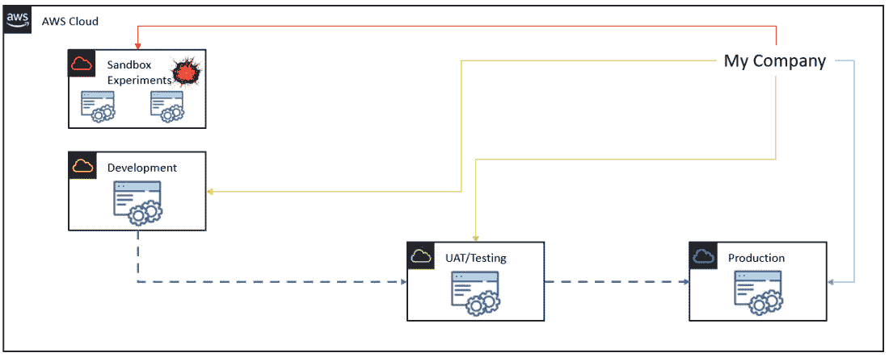

图 3.1 – 多个账户有助于限制工作负载的灾难影响范围

多账户架构的一些关键优势包括：

+   **工作负载之间的管理隔离**：通过多账户架构，您可以根据多个因素（包括开发生命周期）为不同的业务单元提供不同级别的管理控制。例如，您可能*不*希望授予开发人员对生产账户的完全访问权限，因为您会在该账户中部署公共发布的应用程序。

+   **工作负载的有限可见性和可发现性**：AWS 账户提供了一个天然的边界，可以将您的工作负载与任何外部身份隔离。部署在 AWS 账户中的应用程序和资源，除非明确授予权限，否则其他 AWS 账户中的身份（用户和应用程序）无法访问。

+   **安全性和身份管理的隔离**：与其在每个 AWS 账户中为团队成员（例如开发人员、服务器管理员、UAT 测试人员）创建多个用户身份账户，不如将所有用户托管在*独立的 AWS 身份管理账户*中。这样可以避免为员工创建重复账户，并减少管理开销。最终，您可以通过**跨账户访问**授予用户对其他 AWS 账户的访问权限，政策和权限会限制用户在遵循**最小权限原则**的前提下可以执行的任务。

+   **恢复或审计账户的隔离**：许多组织需要有灾难恢复和业务连续性策略，以便在发生故障时，企业可以轻松地继续使用重复的工作负载进行操作，并快速恢复任何重大损失。这类工作负载应当根据最佳实践放置在独立的账户中。

在这一节中，我们简要介绍了 AWS 账户的概念，以及它们如何为您提供隔离的 AWS 服务访问，确保没有其他客户能看到您的工作负载和应用，除非您明确授予他们相应的访问权限。

在下一节中，我们将探讨 AWS 提供的服务，帮助您快速设计和构建多账户战略。我们讨论了 AWS Landing Zone，这是 AWS 解决方案架构师为您的多账户部署创建定制基础架构的服务。我们还将了解 AWS Control Tower，这是一项根据行业最佳实践自动化构建 landing zone 的服务。

# AWS Landing Zone

构建多账户环境可能变得非常复杂且耗时。AWS 为其客户提供了一套最佳实践方法，以便在设计多账户生态系统时遵循。之前，AWS 提供了名为 *AWS Landing Zone* 的解决方案，但该方案现在已经被弃用，取而代之的是新的 AWS Control Tower。

之前的 AWS Landing Zone 服务为客户提供了一个基础蓝图，用于设计和构建多账户环境，提供了身份与访问管理、治理、数据安全和日志记录功能。

重要提示

尽管 AWS Landing Zone 目前处于长期支持阶段，不会再接收任何新增功能，但它仍然可能出现在考试中。

# AWS Control Tower

现在希望根据更新后的架构最佳实践设置 landing zone 的客户，应使用新的 AWS Control Tower。该服务通过使用最新的蓝图来自动化新 landing zone 的设置。作为此 landing zone 一部分创建的一些 AWS 账户包括以下内容：

+   创建 AWS Organizations 和多账户设置

+   使用 AWS **单点登录** (**SSO**) 默认目录服务进行身份与访问管理

+   使用 SSO 进行账户联合

+   使用 AWS CloudTrail 和 AWS Config 进行集中日志记录

AWS Control Tower 部署的 landing zone 已配置推荐的安全策略，称为 guardrails，客户可以选择如何配置其账户，以确保符合整体的组织政策。

在这一节中，我们讨论了两项可以轻松用于构建多账户架构的服务。如果要手动执行此操作，将非常耗时且复杂。我们还审视了 AWS Landing Zone 和新的 AWS Control Tower。

在下一节中，我们将讨论如何使用名为 AWS Organizations 的服务来集中管理您的多个 AWS 账户。作为一名云实践者，了解多个账户的需求以及哪些工具可用于管理它们，对于帮助您的客户构建一个强大且安全的云架构至关重要。

## 管理多个账户 – AWS Organizations

创建 *n* 个 AWS 账户来帮助您区分不同的工作负载或不同的应用生命周期是非常好的。但您还需要考虑如何有效地管理它们——谁有权限做什么，哪些服务可以在哪些 AWS 账户中启动和配置。

## 介绍 AWS Organizations

AWS Organizations 服务使您能够集中管理所有的 AWS 账户。该服务是**免费提供**的；然而，在其中启动的资源是需要收费的，就像您没有使用 AWS Organizations 服务时一样。AWS Organizations 允许您创建一个**管理账户**（以前称为**主账户**），然后邀请或创建额外的 AWS 账户，成为该组织的成员账户。AWS Organizations 与多个 AWS 服务紧密集成，并允许您限定哪些服务可以在各个成员账户中使用。

您在每个 AWS Organizations 实例中也可能有多个成员账户，其中一些账户共享相似类型的工作负载或功能。因此，您可以将共享的账户整理到称为**组织单位**（**OUs**）的组下。OU 是您在 AWS Organizations 中的一个或多个 AWS 账户的逻辑组，允许您将众多 AWS 账户组织成层次结构。这使得管理众多 AWS 账户变得更容易。

然后，您可以将**服务控制策略**（**SCPs**）应用于您的 OU（或直接应用于 AWS 账户，尽管这不是最佳实践），以对每个账户中可以部署和配置的服务施加限制。在下面的图示中，我们可以看到服务控制策略是如何应用于 OU 的，这些策略决定了属于这些 OU 的 AWS 账户的权限边界：

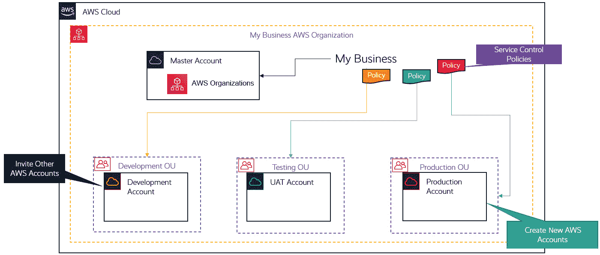

图 3.2 – 拥有多个账户的 AWS Organizations

## 合并账单

AWS Organizations 的另一个关键功能是**合并账单**。AWS Organizations 可以通过两种选项部署——**所有功能**或仅启用**合并账单功能**：

+   **所有功能**：此选项使您能够利用 AWS Organizations 提供的安全性和管理能力来管理成员账户，通过**服务控制策略**（**SCPs**）和标签策略。**所有功能**选项还包括合并账单功能，允许您为所有成员账户提供一个集中账单。**管理账户**最终负责其他成员账户产生的账单和费用。

+   **合并账单功能**：如果您仅启用合并账单功能，您将获得基本的管理工具，并能够为所有成员账户获取一个集中账单。

AWS 组织在多账户策略中的一个主要好处是合并账单功能。管理账户负责所有其成员账户产生的费用，并提供成员账户产生的总 AWS 费用的合并视图。你还可以查看每个单独成员账户产生的费用的详细明细。

一些关键的好处如下：

+   **单一账单**：你将收到一张单一账单，显示每个成员账户产生的费用。

+   **轻松跟踪**：你可以跟踪单个账户的费用。

+   **量大折扣**：在 AWS 组织中合并多个账户后，你可以通过合并各个账户的费用来享受折扣，当总费用超过某些量大折扣阈值时，即可获得折扣。

+   **免费服务**：你可以免费使用合并账单功能。

AWS 组织提供集中式管理所有 AWS 账户的功能，帮助你执行安全边界和确保成本管理。你需要多少个 AWS 账户，主要取决于你的业务需求以及是否符合最佳实践的基础设施要求。

## 你需要多少个 AWS 账户？

决定你需要多少个 AWS 账户时，需仔细考虑业务功能需求、工作负载复杂性、安全性和合规性要求（例如，HIPAA 合规性，要求医疗行业的企业遵循各种指南并实施技术保障以保护个人健康信息的完整性）。

通常，你希望主机上最少数量的账户，以便隔离不同的开发和生产生命周期，并提供故障容错和冗余。你还应该鼓励设计策略，以减少管理开销。

以下讨论展示了你可能需要的一组 AWS 账户的示例，但请记住，依据具体需求，架构可能会有所不同。尽可能根据功能需求和安全控制来创建账户，而不是仅仅根据某种公司层级结构来创建账户。

根据你的架构，你应首先定义在 AWS 组织中需要创建哪些组织单元（OU）。在配置 AWS 组织之前，你需要创建第一个 AWS 账户，或者至少创建一个新的 AWS 账户作为组织的管理账户。

在下一节中，我们将讨论配置 AWS 组织的最佳实践，特别是正确设计你的组织单元（OU）的重要性。

## 核心 AWS 组织单元（OU）

在基础层面，你应创建一个基础设施 OU 和一个安全性 OU，其中将包含一个共享基础设施服务账户和一个安全账户：

+   **基础设施服务账户**：这些账户将包含可跨所有账户共享的服务（例如，目录服务、共享的网络环境和其他常见的 IT 服务，如用于存储您的 **Amazon Machine Images**（**AMIs**）的中央存储库）。

+   **安全服务**：这些账户将包含一个集中式的身份与访问管理账户，用于托管个人用户账户、用户组和角色。然后，这些身份将通过跨账户策略授予对其他账户的访问权限，以及其他用于日志记录和审计的服务。

基础核心 OU 将包含非生产和生产 AWS 账户。将非生产与生产分开，可以确保开发中的工作负载与已发布供业务使用的工作负载隔离，并限制任何灾难的影响范围。

## 额外 OU

根据您的业务用例，您可以拥有任意数量的额外 OU，用于包含适当的账户。如以下示意图所示，您的 AWS 组织将包括核心 OU 以及任何数量的额外 OU，以满足您的个性化业务需求：

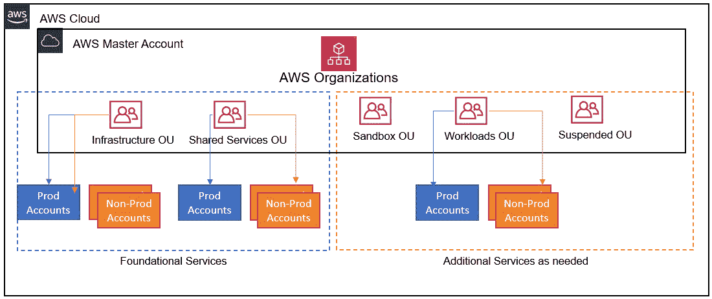

图 3.3 – 配置了核心基础设施以及安全性和 AWS 组织额外 OU 的 AWS

为了举例说明，您可能希望为您的组织配置以下额外的 OU：

+   **沙箱 OU**：随着您的业务开发新的应用程序或进行实验以改进现有的工作负载，您需要确保影响范围限制在一个您可以承受故障的环境中。沙箱环境应该是一个可以与内部网络断开的账户，并且您必须设定限制，以控制费用并防止过度使用。

+   **工作负载 OU**：该 OU 将包含 AWS 账户，在其中托管面向客户的应用程序。理想情况下，您将拥有多个非生产环境，例如开发、测试和预生产环境。您还应该考虑多个生产账户，例如 Prod 1 和 Prod 2，以增强弹性。

+   **挂起的 OU**：任何不再使用的账户仍可能需要保留用于审计和合规目的。应用必要的 SCP（服务控制策略），确保只有特定的管理员可以访问这些账户。

上述列表并非详尽无遗，您的 OU 架构将受到功能和技术需求的影响。有关您可以构建的 OU 结构类型的更多指导，请参阅以下网页中的推荐 OU：[`docs.aws.amazon.com/whitepapers/latest/organizing-your-aws-environment/recommended-ous.html`](https://docs.aws.amazon.com/whitepapers/latest/organizing-your-aws-environment/recommended-ous.html)。

在本节中，我们了解了 AWS Organizations 服务及其如何用于为你的企业设计和架构多账户策略。我们考察了 AWS Organizations 的核心功能，包括应用 **服务控制策略**（**SCPs**）的能力，并通过统一账单功能有效管理你的账单和成本。

在接下来的部分，我们将了解 AWS 免费套餐账户，并展示如何创建一个账户，你需要完成本培训指南中的各种动手实验。

# AWS 免费套餐账户

AWS 免费套餐账户是一个普通的标准账户，可以用于任何目的或工作负载类型。AWS 为开设任何新账户后的前 12 个月提供慷慨的免费套餐。免费套餐提供对 85 种以上的 AWS 技术和服务（在编写本培训指南时）的访问，如果你使用这些服务达到指定的阈值，你将不会被收费。例如，在免费套餐下，你可以执行以下操作：

+   免费使用最多 5 GB 的 Amazon S3 存储，最长可达 12 个月。

+   启动 `t.2micro` `t2.micro` 实例，每月运行几个小时，只要总时长不超过每月 750 个计算小时。如果你想进行一些概念验证工作或测试，这可能会非常有用。

+   每月运行轻量级的 Amazon Relational Database Service（RDS）实例，最多 750 小时。

在接下来的部分，我们将了解在 AWS 免费套餐账户下可用的一些额外功能。

## 免费工具

除了标准的 12 个月免费套餐外，某些服务是完全免费的，没有时间限制。这些服务可能包括用于部署某些资源的工具。工具本身是免费的，但部署的资源将根据其价格清单收费。以下是一些这些工具的示例：

+   **AWS CloudFormation**：这是 AWS 提供的一项服务，它允许你定义模板（使用代码）来启动各种基础设施组件。Amazon CloudFormation 使开发人员和架构师能够创建相关的 AWS 和第三方资源集合，并按有序和可预测的方式进行配置和管理。这些模板可以用于重复部署。虽然该服务本身是免费的，但部署的资源和基础设施组件将根据 Amazon 的价格清单收费，例如 EC2 实例、RDS 数据库和网络组件。

+   **Amazon Elastic Beanstalk**：这是一种编排服务，提供必要的基础设施组件来支持和运行你的应用程序。这些基础设施组件包括 S3 存储桶、EC2 实例和负载均衡器。Amazon Elastic Beanstalk 使开发人员能够轻松上传他们的代码以进行部署，而 AWS 会提供支持该应用程序所需的基础设施。该编排服务本身是免费的，但资源是收费的，如前所述。

除了前述的免费工具外，AWS 在你的 AWS 账户生命周期内，还提供某些服务的有限资源。在接下来的部分，我们将举例说明。

## 永久免费服务（有限提供）

一些 AWS 服务永久提供完全免费的使用。这些服务允许你在不产生任何费用的情况下创建资源，直到指定的阈值限制。以下是一些示例：

+   **Amazon CloudWatch**：用于监控你的云资源和应用程序。你可以免费使用 10 个自定义指标和最多 10 个警报，以及最多 1,000,000 次 API 请求。

+   **Amazon Lambda**：一种无服务器计算服务，可以响应事件运行代码，并帮助你构建无服务器架构。使用 AWS Lambda，你每月可获得最多 1,000,000 次免费请求和每月最多 320 万秒的计算时间。

+   **AWS Organizations**：集中管理和控制对你的 AWS 账户的访问，并通过合并账单和量化折扣获益。该服务永久完全免费提供。

AWS 还不时提供各种产品试用。在接下来的部分，我们将详细介绍这一点。

## 免费试用

一些服务提供免费试用，例如提供 30 天的试用期来测试某项服务。以下是一些示例：

+   **Amazon Workspaces**：这些是可以运行 Linux 或 Windows 操作系统的虚拟桌面。作为试用，你可以获得最多两个标准版工作空间，每个工作空间配有 80 GB 根磁盘和 50 GB 用户磁盘。在免费试用期间，你可以每月合计使用最多 40 小时，持续 2 个月。

+   **Amazon Detective**：该服务使你能够分析和可视化安全数据，并找出潜在安全问题的根本原因。你可以获得该服务的 30 天免费试用。

+   **Redshift**：这是一种企业级数据仓库解决方案，可以帮助你查询和结合超大量的结构化和半结构化数据，并进行数据分析与洞察。AWS 提供为期 2 个月的免费试用，每月提供 750 小时的 DC2.Large 节点使用时间。

在本节中，我们查看了 AWS 免费套餐账户的详细信息。亚马逊提供了一系列具有特定限制的服务，免费使用 12 个月。这使你能够尝试这些服务，创建沙箱环境，并开始设计解决方案。AWS 免费套餐对想要学习各种 AWS 服务的学生非常有帮助，为他们的考试做准备。然而，有时你可能需要超过免费套餐的阈值，才能真正学习到更复杂的配置选项。

在下一节中，我们将完成一个实验练习，提供一步一步的指南来创建你的第一个 AWS 账户。

# 练习 3.1 – 设置你的第一个 AWS 免费套餐账户

以下逐步过程将向你展示如何设置第一个 AWS 账户。你需要以下信息才能完成设置过程：

+   你的个人详细信息，包括姓名、住址和电子邮件地址。

+   一部手机。

+   一张信用卡。尽可能地，本训练指南中的实验将属于免费套餐范围，你部署的这些资源不会收费。然而，少数几个实验可能会超过免费套餐的阈值，如果你选择进行这些实验，可能会有少量的最低费用。我们稍后会更详细地讨论这一点。

现在我们已经了解了要求，下面开始创建账户：

1.  在你喜欢的浏览器中，搜索术语`AWS Free Tier`，你应该会找到指向亚马逊网络服务免费套餐的链接。点击第二个链接，如以下截图所示：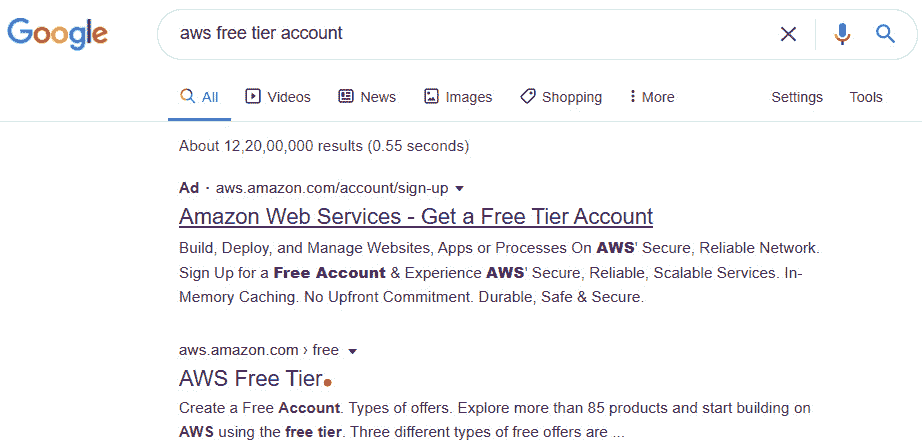

    图 3.4 – 通过谷歌搜索访问 AWS 免费套餐链接

1.  你将被带到 AWS 免费套餐主页。接下来，点击**创建免费账户**：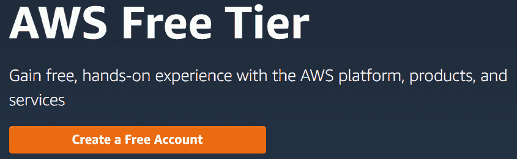

    图 3.5 – 免费账户设置

1.  在 AWS **登录**页面，点击**创建一个新的 AWS 账户**：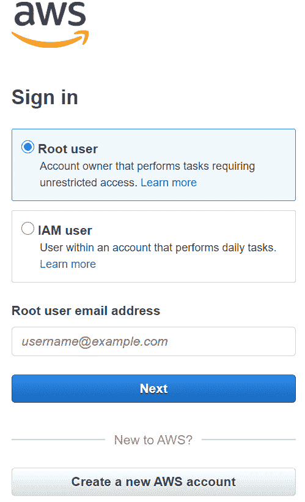

    图 3.6 – 免费账户设置 – 创建新的 AWS 账户

1.  接下来，提供电子邮件地址，选择密码，并选择账户名称。账户名称可以是你用来标识账户用途的任何名称，例如 Dev 或 Prod：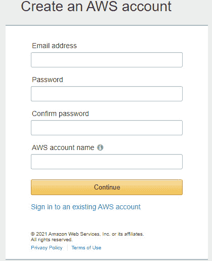

    图 3.7 – 免费账户设置 – 提供电子邮件地址和账户名称

1.  接下来，你可能需要填写一个验证码表单以确保安全。请输入图像中的字母和数字到提供的文本框中，并点击**继续**：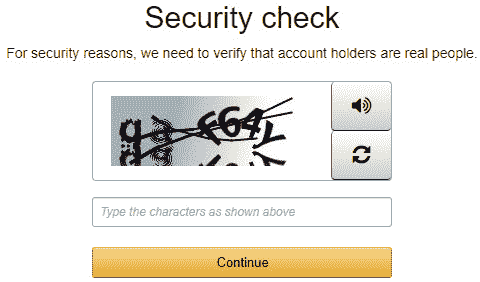

    图 3.8 – 免费账户设置 – 安全检查屏幕

1.  接下来，您需要提供完整的联系信息并选择您要创建的账户类型——个人账户或专业账户。专业账户允许您获得完整的税务发票，并且在某些国家/地区，您可以退还某些类型的税款，例如增值税或消费税。一旦完成表格，请点击**创建账户并继续**：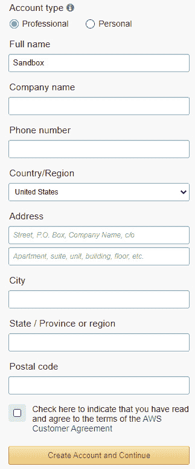

    图 3.9 – 免费账户设置 – 提供联系信息

1.  接下来，您需要提供您的借记卡或信用卡信息，确认您的地址，然后点击**验证并添加**：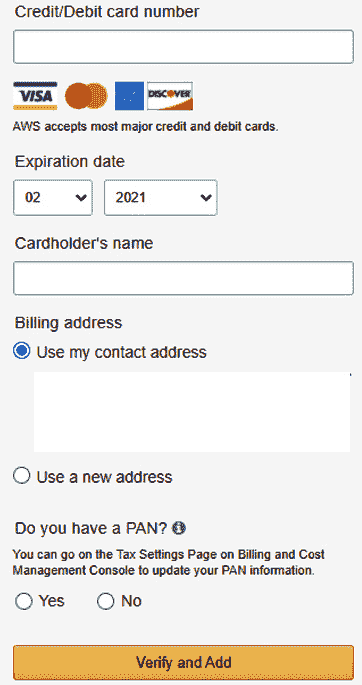

    图 3.10 – 免费账户设置 – 提供信用卡信息

1.  您可能需要提供一次性 PIN 码，该验证码将发送到您的手机，以验证卡片信息。在某些国家/地区，您可能需要支付一小笔费用，可能是几美分，用于验证卡片，但这笔费用会通过银行系统退还给您。

1.  之后，您将收到一个**确认您的身份**对话框，要求您提供一个电话号码，通过该号码将发送验证码，您可以选择通过短信或语音电话接收验证码。您还需要勾选安全复选框，然后点击例如**发送短信**选项，正如以下截图所示：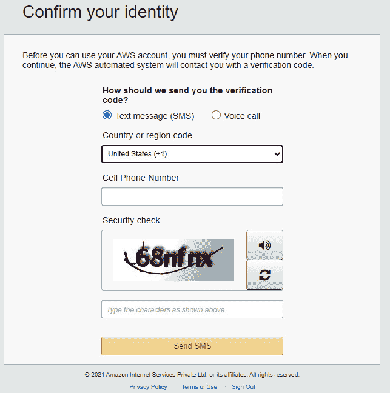

    图 3.11 – 免费账户设置 – 提供用于验证的电话号码

1.  然后，您将看到以下对话框，要求您提供已经发送到您手机上的验证码：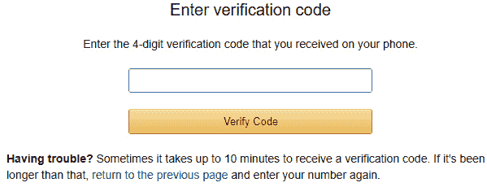

    图 3.12 – 免费账户设置 – 提供通过手机接收到的验证码

1.  输入验证码后，您的账户将被验证，您应该看到以下对话框。点击**继续**：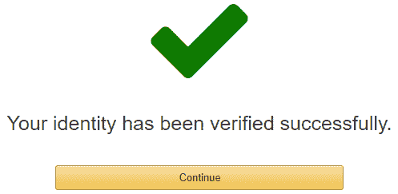

    图 3.13 – 免费账户设置 – 完成验证过程

1.  您将进入**选择支持计划**界面，您可以选择该账户的支持计划。为了该账户的设置，请选择**基础计划**：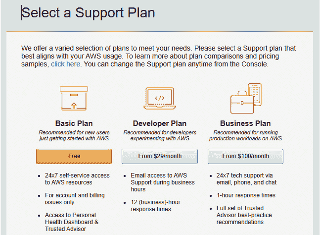

    图 3.14 – 免费账户设置 – 选择基础支持计划

1.  您现在将进入**欢迎使用 Amazon Web Services**界面。点击**登录控制台**按钮：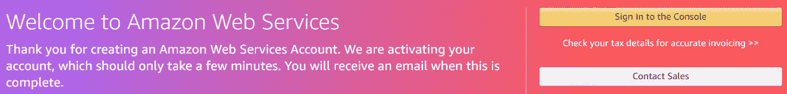

    图 3.15 – 登录控制台

    确保你选择**Root 用户**，并提供你用来创建新免费套餐账户的电子邮件地址和密码。这个电子邮件地址和密码组合也被称为 AWS 账户的**root 用户**，它对你的账户拥有完全的控制权限：

    

    图 3.16 – 免费账户设置 – 作为 root 用户登录以测试账户设置

1.  登录后，你将看到**AWS 管理控制台**页面：

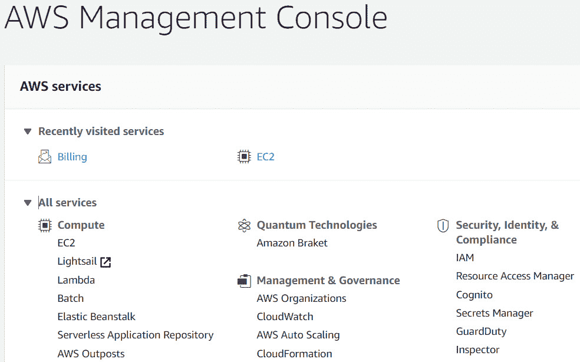

图 3.17 – 免费账户设置 – 访问 AWS 管理控制台

在本节中，你创建了第一个 AWS 账户，这将使你能够访问 AWS 的所有服务，跨越其全球基础设施。通过你的 AWS 账户，你现在可以设置和部署各种资源，以支持和托管任何应用程序负载。在下一个练习中，我们将讨论如何设置计费警报。

为了最大化从本次培训中获得的收益，建议你完成所有练习。这将帮助你获得必要的实践经验，并增强在 AWS 上构建实际解决方案的信心。虽然我们确保大部分练习都在免费套餐的阈值范围内，但也有少数练习可能会产生一些费用。你将在练习中收到相关通知，你可以选择是否继续完成这些练习。

此外，你可能会部署某些资源并忘记终止它们，从而导致超过免费套餐的某些阈值。通过设置计费警报，你可以为自己设定一个足够的小预算，以完成所有实验室。设置计费警报后，如果你的总费用超过预算阈值，你将会收到提醒。

我们将在下一节中讨论如何设置计费警报。

# 练习 3.2 – 设置计费警报

当你配置计费警报时，你需要定义一个金额作为阈值，作为你的最高预算。如果你的 AWS 账户的总费用超过该金额，你将收到提醒通知，并可以采取补救措施。

如前所述，本培训指南提供了多个实践实验室和练习，旨在帮助你获得配置各种服务以在云中托管工作负载的实际操作经验。大多数实验室都属于免费套餐范围，只有少数几个可能会产生极小的费用。我们会标明那些可能产生费用的实验室。确保你完成的实验室能够及时终止，以免忘记它们。

为了完成本培训指南中的所有练习，建议你设置一个 10 美元的计费警报，虽然你可以选择任何你觉得合适的金额。如果你超过了这个金额，你将通过电子邮件收到通知，提醒你立即采取行动。你可以随后终止任何不再需要的实验室。

现在，让我们继续配置你的 AWS 计费警报。我们从启用接收计费提醒的选项开始。这是一个先决步骤，必须在配置计费警报之前完成：

1.  使用你的根账户凭据登录 AWS 管理控制台。此凭据为你在注册账户时设置的电子邮件地址和密码。

1.  访问**计费和成本管理**仪表板：[`console.aws.amazon.com/billing/`](https://console.aws.amazon.com/billing/)。

1.  在左侧导航窗格中，点击**计费偏好**。

1.  点击**接收计费提醒**，然后点击**保存偏好**。

以下截图演示了启用计费提醒选项：

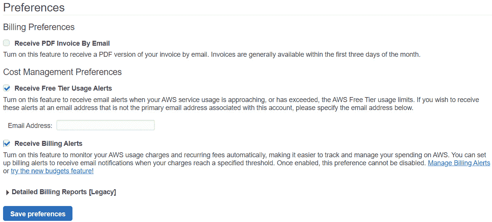

图 3.18 – 设置计费警报 – 启用接收计费提醒的选项

现在你已经启用了接收计费提醒的选项，可以继续设置计费警报。请注意，一旦启用了此设置，就无法禁用。

在以下的逐步过程里，当你的 AWS 账户的预计费用超过指定的阈值时，你将创建一个发送电子邮件的警报：

1.  访问 CloudWatch 控制台：[`console.aws.amazon.com/cloudwatch/`](https://console.aws.amazon.com/cloudwatch/)。请注意，计费指标数据存储在 US-East-1 区域。从右上角的菜单中，确保你处于北弗吉尼亚（us-east-1）区域，如以下截图所示：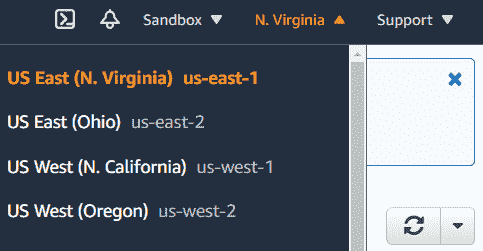

    图 3.19 – 设置计费警报 – 导航到北弗吉尼亚区域

1.  在左侧导航窗格中，选择**警报**，然后在屏幕的最右侧点击**创建警报**。你将看到四步的**创建警报**向导：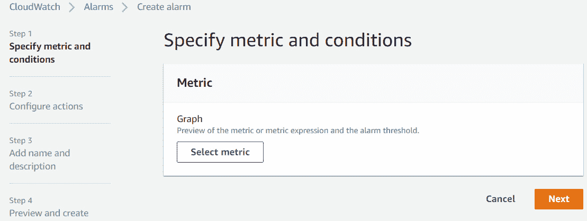

    图 3.20 – 设置计费警报 – 在 CloudWatch 中设置计费警报

1.  在**步骤 1**下，点击**选择指标**。

1.  在**所有指标**下，点击**计费**。

1.  接下来，点击**总预计费用**：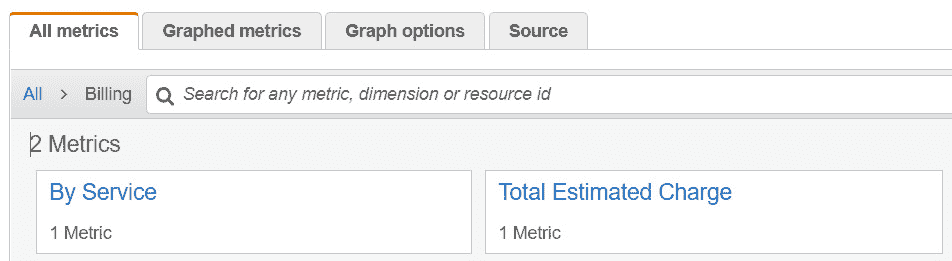

    图 3.21 – 设置计费警报 – 定义“总预计费用”指标

1.  点击**预计费用**的**USD**货币旁边的复选框。

1.  点击**选择指标**。

1.  在名为**指定指标和条件**的对话框中，向下滚动并在**条件**下选择**静态**作为阈值类型。

1.  选择**Greater > threshold**，在**Whenever EstimatedCharges is...**部分下。

1.  最后，在**定义阈值**子标题下，将美元金额设置为**10**（USD），然后点击**下一步**，如下截图所示：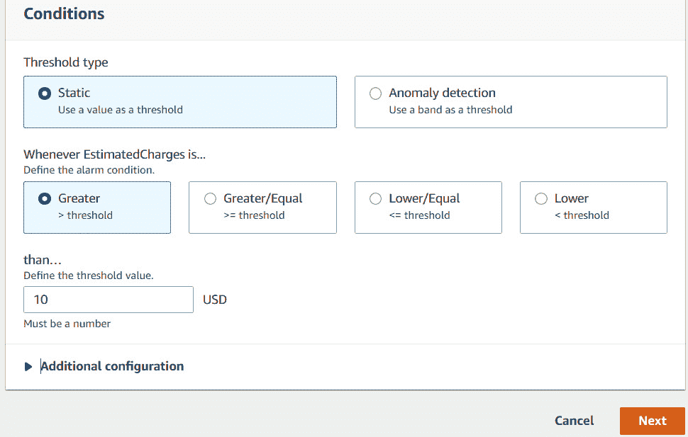

    图 3.22 – 设置计费警报 – 设置计费警报阈值

1.  在*步骤 2*中，你现在可以配置警报触发时的操作。为此，点击**添加通知**按钮：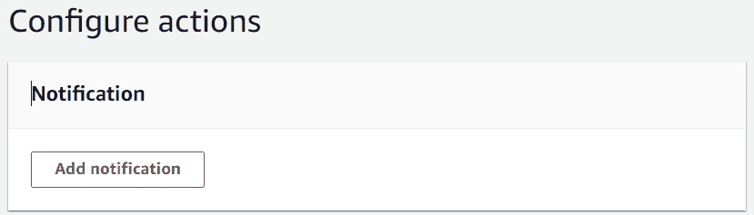

    图 3.23 – 设置计费警报 – 设置通知

1.  在警报状态触发器下，确保选中了**处于警报状态**。

1.  接下来，在**选择一个 SNS 主题**下，选择**创建新主题**选项。**SNS**代表**简单通知服务**，是一种基于推送的消息服务。你可以配置 SNS 主题，在警报处于**警报状态**时向你发送电子邮件提醒。我们在*第十章*中详细讨论了 Amazon SNS，*应用程序集成服务*。

1.  在标题`MyBillingAlerts`下。

1.  接下来，在**将接收通知的电子邮件终端...**下，提供一个你可以访问的电子邮件地址，通知将发送到这个地址。你可以使用你创建 AWS 账户时所用的电子邮件地址。

1.  接下来，点击**创建主题**：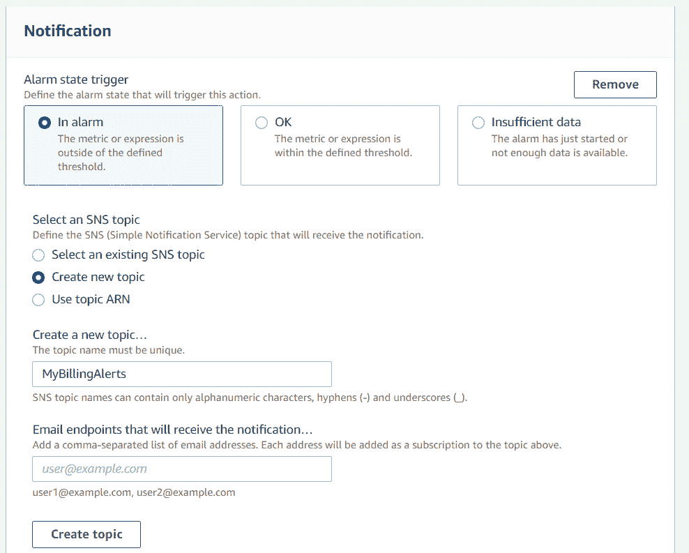

    图 3.24 – 设置计费警报 – 定义用于通知的 SNS 主题

1.  你创建的 SNS 主题将被生成，并且你会看到通知将发送到的电子邮件地址。

1.  向屏幕底部滚动，并点击**下一步**。

1.  在*步骤 3*中，为警报提供一个合适的名称和描述，然后点击**下一步**：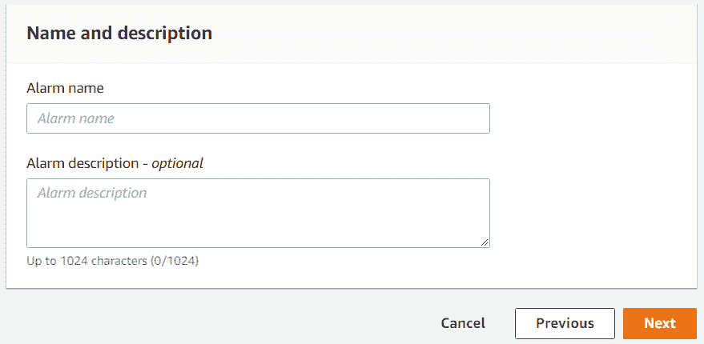

    图 3.25 – 设置计费警报 – 警报设置

1.  在*步骤 4*中，你可以审查你的设置并通过点击**创建警报**按钮来确认。

1.  然后，你会看到 Amazon CloudWatch 中的警报配置状态：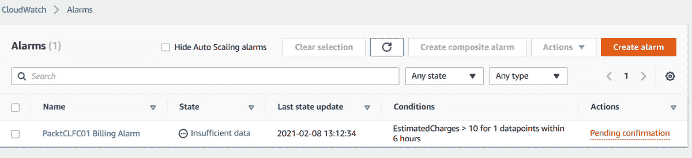

    图 3.26 – 设置计费警报 – 验证操作状态

1.  从前面的截图中你会注意到，你有一个**待确认**的链接，链接被红色突出显示。当你配置一个 SNS 通知以通过电子邮件发送警报时，你实际上是在订阅你之前创建的 SNS 主题。为了安全起见，并避免恶意消息，你需要登录到你的电子邮件账户并确认订阅。

1.  登录到你的电子邮件账户，你应该会收到来自 Amazon 的电子邮件，要求你确认订阅，如下截图所示：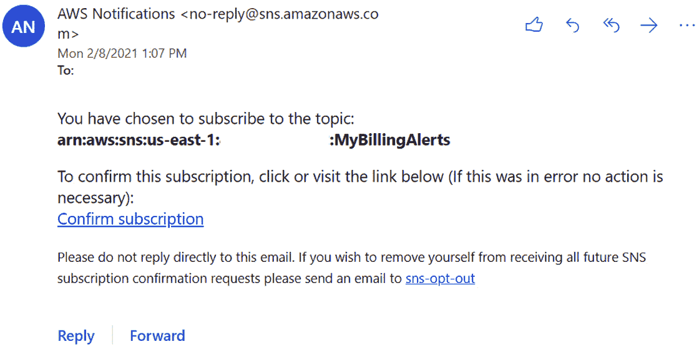

    图 3.27 – 设置计费警报 – 确认通知订阅

1.  点击 **确认订阅** 链接，以便激活您的订阅。如果您的月度费用超过 10 美元的阈值，您将收到电子邮件通知，您可以终止任何不需要或忘记的实验。

1.  如果您现在通过点击圆形箭头刷新警报，您将看到待确认的消息消失。此外，由于这是一个全新的账户，您尚未产生任何费用，您会注意到警报处于 **OK** 状态：

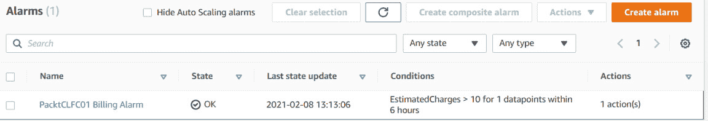

图 3.28 – 设置计费警报 – 验证警报状态

现在您已经设置并配置了 AWS 计费警报，您可以放心，如果超过之前选择的阈值，您将会收到提醒。可以为广泛的服务设置警报，使您能够有效地监控和维护 AWS 上的工作负载。警报是在 Amazon CloudWatch 中配置的，我们将在*第十三章*中详细讨论，内容为 *AWS 管理与治理*。

总结

在本章中，我们讨论了要访问任何 AWS 服务以部署和配置资源、工作负载和应用程序，您首先需要设置一个 AWS 账户。我们还讨论了拥有多个 AWS 账户的重要性，这将有助于更好地管理您的云生态系统，提供更高的安全性，实施必要的工作负载隔离，并在发生灾难性事件时限制您的影响范围。

通过理解构建多账户策略的思维过程，您已经开始学习与构建云解决方案相关的某些架构最佳实践。具体来说，您已经了解到，多账户设置使您能够提供更高的安全性和可扩展性。

我们还研究了 AWS 组织服务及其如何通过将公共账户放入组织单位（OUs）并使用服务控制策略（SCPs）应用适当的控制，帮助我们集中管理所有 AWS 账户。AWS 组织的另一个好处是集中计费功能，允许您通过将所有账户的费用合并来享受批量折扣。

我们讨论了 AWS 免费套餐及如何通过 12 个月免费的 AWS 账户开始实验。还提供了完整的逐步指南，帮助您轻松设置自己的 AWS 账户，您将在本培训指南中用于各种实验。最后，您学会了如何设置和配置自己的计费警报，如果超出为 AWS 总费用设定的预算阈值，警报会提醒您。

在下一章节中，我们将讨论 AWS **身份与访问管理** (**IAM**)。AWS IAM 是设计高度安全环境、进行认证与授权服务的核心部分。通过 IAM，你可以创建额外的身份以访问你的 AWS 账户。例如，如果你有一支开发团队将要在 AWS 上开发应用程序，你不希望与他们共享根账户凭证。每个开发者都应该有自己独立的 IAM 用户账户。这样可以更好地进行审计，并且当授予访问权限时，可以遵循最小权限原则。

# 问题

这里有几个问题来测试你的知识：

1.  在设置账单警报之前，需要先启用哪个偏好设置？

    1.  启用账单警报

    1.  启用警报

    1.  设置 AWS Organizations

    1.  配置 MFA

1.  哪个 AWS 服务可以让你通过 SCPs 集中管理多个 AWS 账户，并使用哪些服务来建立权限控制，以启用这些账户中的服务？

    1.  AWS Organizations

    1.  AWS IAM

    1.  AWS VPC

    1.  AWS GuardDuty

1.  以下哪些服务是 AWS 完全免费的？（选择两个答案。）

    1.  AWS **身份与访问管理** (**IAM**)

    1.  AWS Elastic Beanstalk

    1.  **亚马逊简单存储服务** (**Amazon S3**)

    1.  **亚马逊关系型数据库服务** (**Amazon RDS**)

    1.  AWS **简单通知服务** (**SNS**)

1.  AWS Organizations 的哪个功能可以让你将每个成员账户的费用合并，以便享受提供的任何批量折扣？

    1.  合并账单

    1.  AWS EC2 节省计划

    1.  AWS Control Tower

    1.  AWS IAM

1.  创建 AWS 免费套餐账户时，以下哪项是必需的？

    1.  信用卡

    1.  银行账单

    1.  护照或驾照

    1.  来自亚马逊的邀请函

1.  哪个 AWS 服务可以帮助你自动根据最佳实践设置新的登陆区？

    1.  AWS 登陆区

    1.  AWS Control Tower

    1.  AWS Organizations

    1.  AWS 免费套餐账户

1.  AWS Organizations 服务的哪个功能可以让你将 AWS 账户组合到一个包含公共工作负载的容器中，并对这些账户应用一套通用的策略？

    1.  AWS Control Tower

    1.  AWS 登陆区

    1.  **组织单元** (**OUs**)

    1.  **服务控制策略** (**SCPs**)
