# *第四章*：身份与访问管理

到目前为止，您已经了解了云计算的基本概念及其优势。您还了解了 AWS，并对其服务进行了快速概览。我们讨论了 AWS 全球基础设施及其支持计划，帮助那些希望使用所提供服务的客户。我们还强调了 AWS 账户的重要性，以及它们如何帮助您在 AWS 提供的广泛服务中获得隔离且安全的访问权限，从而构建您的云解决方案。我们还阐明了使用多个 AWS 账户并通过 AWS Organizations 集中管理所有账户的架构原因。

您还学会了如何设置您的第一个 AWS 免费套餐账户，这将使您能够开始在平台上配置资源。

本章将介绍 AWS **身份与访问管理**（**IAM**）服务。这是一个关键的基础服务，旨在确保安全访问您的 AWS 账户。AWS IAM 是一个身份验证和授权服务，它使您能够决定谁或什么可以访问您账户中的 AWS 服务（称为**身份验证**），以及这些实体在您的账户中被允许执行的操作（称为**授权**）。

本章涵盖以下主题：

+   AWS IAM 服务简介

+   根用户账户与实施 **多因素身份验证**（**MFA**）

+   定义 IAM 密码策略的重要性

+   IAM 用户与 IAM 用户组之间的主要区别

+   使用 IAM 策略定义权限

+   审查凭证报告

+   练习 4.1 – 创建 IAM 用户组

+   练习 4.2 – 创建一个 IAM 用户并将其添加到开发者组

+   练习 4.3 – 以 IAM 用户身份登录您的 AWS 账户

+   通过 CLI 访问 AWS

+   练习 4.4 – 在 Windows 计算机上使用 AWS CLI 访问 AWS 平台

# AWS IAM 服务简介

到目前为止，您应该已经拥有一个单一的 AWS 免费套餐账户，您可以通过所选的电子邮件地址和密码组合登录。您用来创建账户的电子邮件地址也称为**根用户**。根用户是创建账户的人，掌握着所有权限。这位特权用户必须得到妥善保护，其凭证（如密码等）不应交给任何未授权使用的人。根用户也不应被用于日常操作。您可以创建额外的用户账户（我们称之为 IAM 用户）来执行日常任务。我们将在本章稍后介绍 IAM 用户。

## AWS IAM 控制台

要访问任何 AWS 服务，包括 IAM 服务，您可以使用基于 Web 的管理控制台、**命令行界面**（**CLI**）或者如果您正在编写代码，则可以使用 AWS SDK。 我们将从 AWS 管理控制台开始。 使用根用户凭据登录到您的 AWS 帐户，您将看到以下闪屏屏幕：

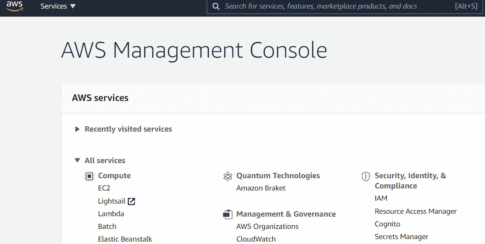

图 4.1 – AWS 管理控制台

正如您从屏幕截图中可以看到的那样，各种服务按照类别标题显示，具体取决于服务类型。 因此，例如，我们有**计算**、**网络**和**存储**等类别，并在这些类别下列出相关服务。

AWS IAM 属于**安全、身份和合规性**类别，但您也可以使用页面顶部的搜索栏搜索该服务。

## AWS IAM 服务

首次访问 IAM 控制台时，您将注意到一些安全警报和一些需要遵循的最佳实践。

您还会注意到 IAM 用户在此帐户中的*登录 URL*。 这是一个特殊的 URL，您的 IAM 用户可以浏览以访问您的帐户。 此 URL 可以自定义，并且您可以将 `https://` 部分后面显示的一系列数字替换为更易记的自定义名称。 您看到的一系列数字实际上是您的 AWS 帐户 ID。

只需点击 `PacktDevAccount`。 所选名称必须是唯一的，您可能需要将一个常用名称与您的公司名称关联，以创建一个独特的名称：

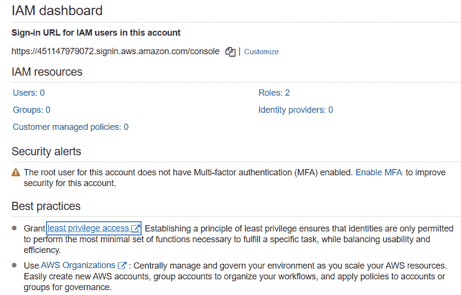

图 4.2 – IAM 仪表板

定制 IAM 登录 URL 后，您可以向其他 IAM 用户提供此链接，他们可以使用它登录到您的帐户。 只有在您的用户拥有 IAM 用户帐户以进行登录时，才能这样做。 我们将在本章后面讨论如何创建 IAM 用户。

在下一节中，我们将查看根用户帐户，并讨论使用**多因素身份验证**（**MFA**）实施额外的安全措施。

# 根用户帐户和实施多因素身份验证（MFA）

您要做的第一件事之一是为根用户帐户配置 MFA。 通常，当您登录到 AWS 帐户时，只需提供用户名和密码。 您可能已经意识到，您必须选择一个非常复杂的密码 – 一个包含小写字母、大写字母、数字和符号，并且必须是随机生成的密码，而不是可以轻易猜出的字典单词。

然而，在如今的恶意软件攻击、黑客入侵和暴力破解攻击的时代，仅凭用户名和密码的组合是不足够的。MFA（多因素认证）是一种机制，要求您使用多于一组凭证来验证身份。与其只有两个密码，MFA 使用两个独立的密钥来验证您的身份——*你知道的东西*和*你拥有的东西*。举例来说，您知道的东西可能是您的用户名和密码，而您拥有的东西可能是一个在您拥有的设备上生成的一次性密码。例如，这个设备可以是一个 RSA 令牌、**通用第二因素**（**U2F**）设备，或一个您可以在智能手机上安装并使用的身份验证应用。

我们强烈建议您为根用户账户设置 MFA。

## 设置 MFA

让我们快速为根用户账户设置多因素认证（MFA）。为了完成逐步指南，您需要访问智能手机，无论是 Android 还是 iOS 设备。AWS 支持多款基于智能手机的身份验证器，包括 Google Authenticator 和 Microsoft Authenticator。您可以在[`aws.amazon.com/iam/features/mfa/`](https://aws.amazon.com/iam/features/mfa/)查看支持的应用程序。在本次操作中，请安装**Google Authenticator 应用**，该应用可以通过 Google Play 或 iPhone App Store 免费下载。如果您尚未安装该应用，请先安装再继续操作。

确保您已进入 IAM 管理控制台，然后按照以下步骤操作：

1.  在 IAM 控制台中，点击**启用 MFA**，在**安全警报**下：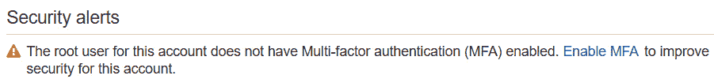

    图 4.3 – 安全警报

1.  接着，您将看到**安全凭证**页面。点击**启用 MFA**。

1.  弹出对话框后，您需要选择**虚拟 MFA 设备**：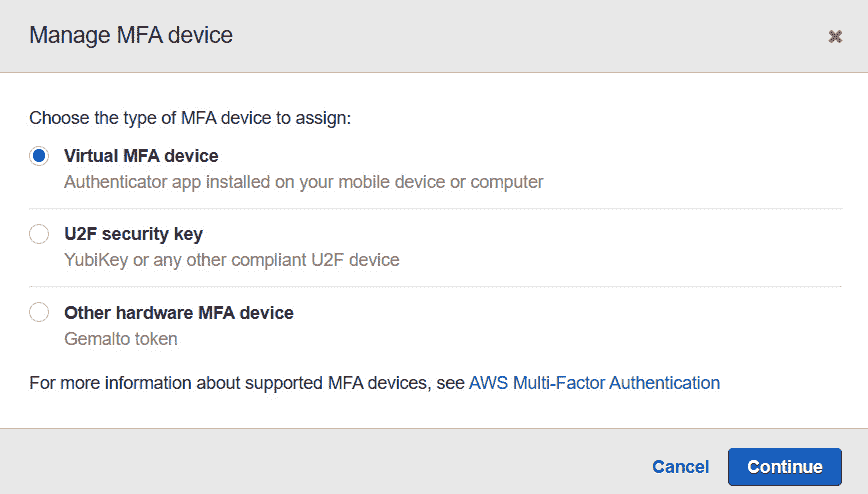

    图 4.4 – 设置虚拟 MFA 设备

1.  点击**继续**。

1.  接着，您将看到**设置虚拟 MFA 设备**对话框。您可以选择扫描二维码，将 Google Authenticator 应用与您的 AWS 账户绑定。首先，启动 Google Authenticator 应用，选择**扫描二维码**选项（您可能需要先点击加号符号（**+**））。这将激活您的手机相机。

1.  在 AWS 控制台的**设置虚拟 MFA 设备**对话框中，点击**显示二维码**，位于列表项**2**下：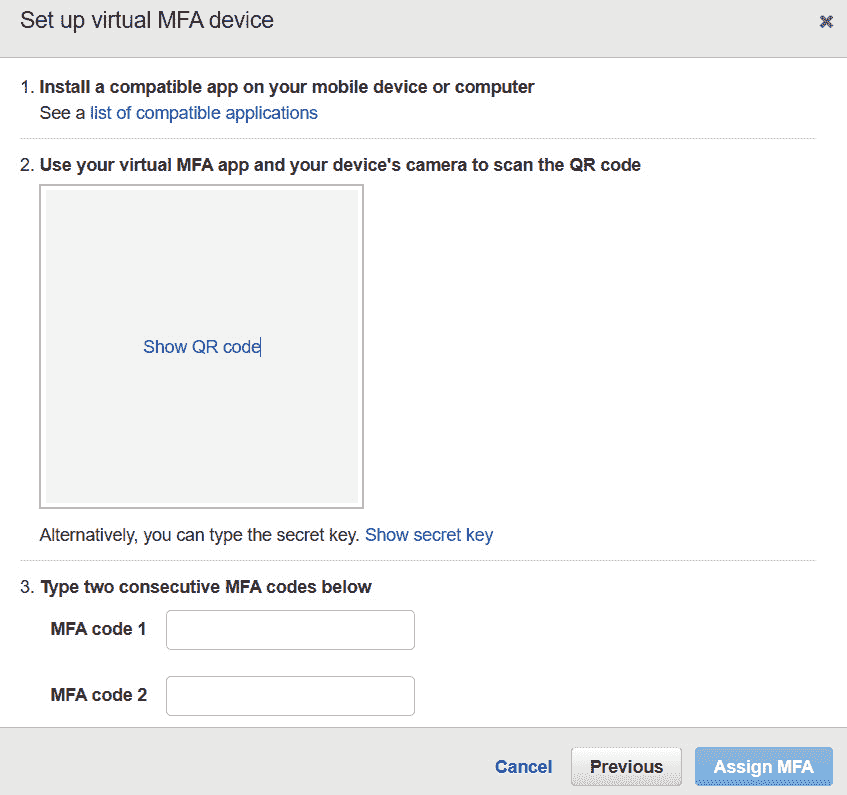

    图 4.5 – 设置虚拟 MFA 设备

1.  屏幕上将显示二维码。此时，您需要将手机相机对准二维码，以便在 Google Authenticator 应用中扫描。

1.  一旦扫描到二维码，您将看到一个 MFA 代码，持续几秒钟。然后，您需要将该代码输入到 **MFA 代码 1** 旁边的文本框中。等待下一个代码显示出来，然后将该代码输入到 **MFA 代码 2** 旁边的文本框中。

1.  最后，点击 **分配 MFA**。

您的根用户现在已配置 MFA 身份验证。下次您注销后重新登录时，系统将在您输入根用户的电子邮件地址和密码后提示您输入在 Google Authenticator 应用中显示的 MFA 代码。请记住，MFA 一次性密码在几秒钟后过期，因此您需要及时输入应用中显示的代码，或者等待下一个代码。

一旦您提供了 MFA 密码，您将被登录并重定向到 AWS 管理控制台。

在这一部分中，我们向您介绍了基本的 AWS 管理控制台和 AWS IAM。我们还介绍了如何为您的根用户账户配置 MFA。

在下一部分，我们将讨论密码策略，您可以通过它强制要求在您的 AWS 账户中创建的任何 IAM 用户使用强大且复杂的密码。

# 定义 IAM 密码策略的重要性

现在您已经保护了根用户账户，接下来应该开始为您组织中的其他用户创建账户。请记住，根用户是权限最高的账户，您不应该使用根用户账户进行日常操作。任何需要访问您 AWS 账户中的 AWS 服务的组织成员都必须拥有一个 IAM 用户账户。绝不与其他团队成员共享根用户凭证，即使是与其他管理员共享，因为他们应该使用他们自己拥有适当管理权限的 IAM 账户。

我们将在下一部分讨论 IAM 用户，但现在显而易见，一个 IAM 用户账户将配置密码。如果您有一百个不同的 IAM 用户账户，您需要强制实施某种密码策略，以确保这些账户不会使用容易破解的弱密码。

AWS 密码策略使您能够定义规则以强制实施密码复杂性。这意味着用户将被迫配置符合您复杂性规则的密码，从而确保所有 IAM 用户账户的密码都具有较强的安全性。

密码策略可以从 IAM 仪表板的 **账户设置** 部分进行配置。

在下一部分，我们将讨论创建额外 IAM 用户和 IAM 组的重要性。IAM 用户是您可以创建的额外身份，除了根用户账户外。一个 IAM 用户可以代表需要访问您 AWS 账户的某个实际人员，例如开发团队中的开发人员或共享 IT 服务团队中的服务器管理员。

# IAM 用户和 IAM 组之间的主要区别

在本节中，我们将讨论设置需要访问 AWS 账户的其他身份的重要性。我们还将探讨使用 IAM 组管理这些身份可以或不能在 AWS 账户中执行的最佳实践。

## IAM 用户

如前一节所述，除了**root 用户**外，你还可以创建其他用户，这些用户被称为**IAM 用户**。IAM 用户可以代表你组织中的实际人员，比如开发团队成员或服务器管理员。然后，这些用户可以使用他们的 IAM 用户账户登录到你的 AWS 账户，并执行你授予他们的权限所允许的任务。

IAM 用户账户也可以被需要对特定 AWS 服务进行身份验证的应用程序和其他服务使用。例如，如果一个应用程序需要更新后端的 Amazon RDS 数据库，你需要确保该应用程序被授权执行此操作。应用程序可以分配一个 IAM 用户账户，使用该账户对数据库进行身份验证，并根据你授予该 IAM 用户账户的权限，应用程序将能够按需修改数据库。尽管允许应用程序对 AWS 服务进行身份验证是可行的，但在大多数使用案例中，这并不是最佳实践。这部分是因为凭证通常以明文存储在某个配置文件中。此外，你还需要实施定期轮换凭证的过程，以提高安全性，但这可能带来管理上的额外负担。AWS 提供了另一种专门为此目的的身份类型，称为 IAM 角色，我们将在本章后续部分讨论。

如前所述，要访问任何 AWS 服务，你可以使用基于 Web 的管理控制台、CLI 或 AWS SDK。要以 IAM 用户身份使用 AWS 管理控制台访问你的 AWS 账户，你需要创建一个用户名和密码组合，使该用户能够对你的 AWS 账户进行身份验证。如果你希望通过 CLI 以编程方式访问你的 AWS 账户，你需要配置一组访问密钥。访问密钥类似于用户名和密码，由**访问密钥 ID**（如用户名）和**秘密访问密钥**（如密码）组成。访问密钥用于编程访问，而用户名和密码组合则用于基于 Web 的控制台访问。

在本节中，我们向你介绍了 IAM 用户，它们可以用来代表需要访问你 AWS 账户的实际人员，例如你的同事。也可以为特定应用程序设置 IAM 用户账户，以便它们对你的账户进行身份验证，这些被称为**服务账户**。

在下一节中，我们将讨论 IAM 组，IAM 组使你能够管理一组可能具有共同工作角色的 IAM 用户。

## IAM 组

当您为某个需要访问您的 AWS 账户的同事创建 IAM 用户时，您还需要为该用户配置一组权限，以确保他们能够执行其在组织中的角色所需的任务。这些权限通过 IAM 策略分配，我们稍后将详细讨论。

虽然您可以为账户中的每个用户创建单独的 IAM 策略集，但管理用户和分配权限的更好方式是将那些共享相同工作角色的用户组合成一个 AWS IAM 组。通过这样做，您可以通过在组级别应用策略来集中管理分配给该组的用户，这些策略将传递给组内的用户。

例如，如果您有一个由 10 名开发人员组成的团队，他们都需要创建和管理 Amazon S3 存储桶的权限，那么，您可以将相同的权限分配给开发人员组，而不是在 IAM 用户级别为每个用户单独分配权限。然后，您将这些开发人员作为组成员，他们将继承该权限以访问 Amazon S3。

在这一部分，我们探讨了设置 IAM 用户和 IAM 组的重要性。这可以确保您能够为组织中的不同身份授予不同级别的访问权限，并通过 IAM 组来管理这些身份。

在接下来的部分，我们将详细了解 IAM 策略。IAM 策略使我们能够为这些额外的身份定义权限，并控制它们在 AWS 账户中被允许执行的操作。

# 使用 IAM 策略定义权限

IAM 策略是附加到特定 IAM 身份的对象，例如 IAM 用户、IAM 用户组或 IAM 角色。这些策略定义了身份在 AWS 账户中可以做什么或不能做什么，并以 **JSON 文档**的形式编写。在下图中，用户 **Bob** 可以访问并读取 S3 存储桶的内容。该策略附加到 **Bob** 所在的组，因此他继承了该组的权限。

当主体（IAM 用户或 IAM 角色）尝试访问 AWS 服务时，AWS 会评估附加到该主体的策略文档，并确定该主体可以或不能执行的操作：

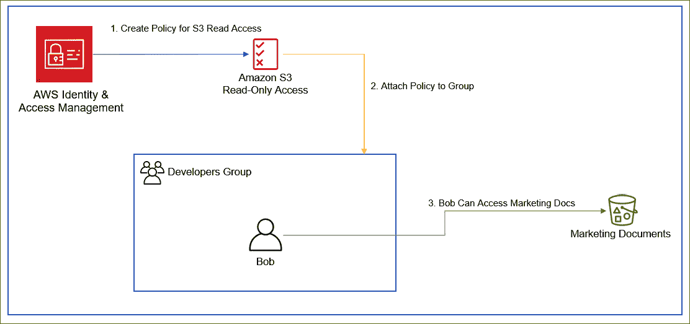

图 4.6 – 附加到开发人员组的策略文档，授予 Bob 读取 Marketing Documents 存储桶的权限

IAM 策略使您能够遵循最小权限原则，这意味着身份只能配置为访问执行其角色所需的服务和配置选项，而不能访问其他内容。这大大增强了您 AWS 账户的安全性，并遵循最佳实践。

AWS 提供了六种可以创建的策略类型：

+   **基于身份的策略**：这些是附加到 IAM 身份上的策略，指定这些身份在你的 AWS 账户内能做什么或不能做什么。IAM 身份包括你的 IAM 用户、IAM 用户组或 AWS 账户中的 IAM 角色。请注意，你不能将 IAM 身份策略附加到另一个 AWS 账户中的身份上。然而，其他账户中的身份可以配置为承担你 AWS 账户中的 IAM 角色，这样可以为外部身份提供访问你账户中特定服务和资源的权限。我们将在本章后续讨论 IAM 角色。

+   `*`)，这意味着你可以为某些资源授予匿名访问权限。显然，授予匿名访问权限时你需要非常小心。

+   **权限边界**：你可以将策略定义为 IAM 实体（用户或角色）的权限边界，这样可以定义身份基础策略可以授予的最大权限集。

+   **组织服务控制策略**（**SCPs**）：正如上一章所讨论的，组织 SCPs 使你能够为组织的账户成员定义最大权限。SCPs 使你能够限制在成员账户中定义身份或资源基础策略的权限。然而，它们本身不能授予权限。

+   **访问控制列表**（**ACLs**）：这些是你用来管理对某些资源（例如 Amazon S3 桶和对象）访问权限的权限。你可以使用 ACL 来授予其他 AWS 账户基本的读/写权限；你不能授予你账户中的用户权限。它们在 S3 桶策略不能使用的某些情况下使用，例如 S3 服务器访问日志记录。它们类似于基于资源的策略，但可以配置的权限集在粒度上是有限的。此外，它们不使用 JSON 结构来构建策略。

+   **会话策略**：这些策略允许你在通过程序化方式（例如 CLI）访问服务时传递会话策略，以承担角色或联合用户。会话策略允许你限制特定会话的权限。

接下来，让我们进一步详细学习基于身份的策略类型。

## 基于身份的策略类型

如前所述，基于身份的策略是以 JSON 格式编写的，并且这些策略会附加到 IAM 身份上，定义这些身份在你的 AWS 账户内能做什么或不能做什么。

基于身份的策略可以分类如下：

+   **托管 AWS 策略**：这些是 AWS 提供的预配置的标准策略，具有特定的权限。*托管*策略是独立于任何 IAM 身份创建的，并且可以附加到一个或多个身份。你可以使用这些典型策略来定义大多数所需的权限集，例如授予 Amazon S3 的*只读*访问权限。AWS 托管策略不能由客户编辑，只有 AWS 可以更新和管理这些策略。

+   **客户托管策略**：客户可以创建自己的托管策略，然后根据需要将其附加到任何 IAM 身份上。创建自己的托管策略可以生成更细粒度的权限集。此外，IAM 在每次更新托管策略时最多会创建五个版本，这允许你在必要时恢复到较旧的版本。

+   **内联策略**：这些策略是直接创建并附加到 IAM 身份上的，例如 IAM 用户。这也使你能够保持策略与身份之间的严格一对一关系。然而，过多的内联策略可能更难以管理，必须谨慎使用。最终，内联策略与其关联实体的生命周期密切相关。

让我们通过一个示例来理解 IAM 策略。

## IAM 策略示例

在*图 4.6*中，我们看到了一个示例，Bob 是开发者组的成员，由于附加到该组的 IAM 策略，他能够访问 Marketing Documents 存储桶。

以下是前面场景中 JSON 策略文档的示例：

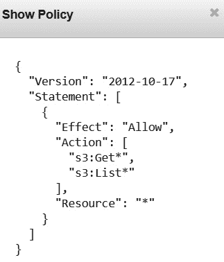

图 4.7 – AWS 托管策略：AmazonS3ReadOnlyAccess

上面的截图展示了一个托管的 AWS 策略，它授予附加的身份读取你 AWS 账户中任何 S3 存储桶内容的权限。

身份策略不需要在策略中指定主体，因为它本身会附加到需要指定访问级别的身份上。

我们来看看策略文档的一些组件：

+   `Version:` 这是当前 AWS 支持的 JSON 文档版本，应该列为`2012-10-17`。

+   `Statement`：这是策略声明的开始。你可以在一个策略中包含多个声明块，从而在不同的服务之间授予不同级别的访问权限。

+   `Effect`：该字段指定声明块是否允许某种级别的访问或拒绝访问。

+   `Action`：这是根据前述`Effect`语句实际允许或拒绝的权限。您 JSON 文档中的`Action`组件将指向相关的服务以及所授予的实际权限。因此，在前面的 JSON 语句中，我们允许了两种操作，即 Amazon S3 服务的`Get`操作和`List`操作。这意味着与此策略相关的身份将能够*列出*您的 Amazon S3 存储桶并执行各种其他列出操作，并能够读取存储桶的内容以及其他`Get`操作。这些操作语句实际上具有可以执行的更细粒度的操作。例如，`Get`操作包括许多操作，如`GetObject`（允许您访问对象）和`GetBucketVersion`（返回存储桶的版本状态）等。您会注意到在前面的截图中，`Get`和`List`操作后面有星号（`*`）。当您希望允许某个给定`Action`语句中的所有操作时，您使用星号（`*`）。因此，在前面的示例中，`Get*`将包括`GetObject`和`GetBucketVersion`操作。

+   `Resource`：此组件描述了此策略允许或拒绝访问的实际资源。通配符（`*`）表示该服务的所有资源。因此，在这种情况下，资源允许对您 AWS 账户中的所有 S3 存储桶执行`Get`操作和`List`操作。要将访问限制为特定资源，您需要指定实际的`arn:aws:s3:::packt-marketing-docs`。因此，我们的 JSON 策略需要进行如下修改：

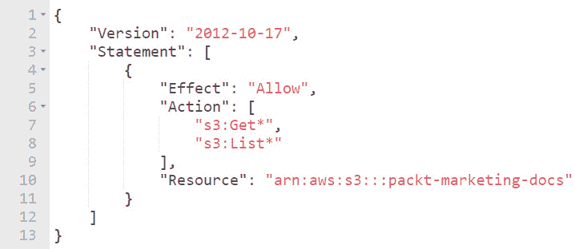

图 4.8 – 客户管理的策略限制对单个 Amazon S3 存储桶的访问

ARN 由多个部分组成，每一部分由冒号（`:`）分隔。以下是 ARN 可以构建的格式及其各个部分：

a) `arn:partition:service:region:account-id:resource-id`

b) `arn:partition:service:region:account-id:resource-type/resource-id`

c) `arn:partition:service:region:account-id:resource-type:resource-id`

让我们来看一下各个单独的部分：

a) `aws`。中国也有一个独立的分区，名为`aws-cn`，依此类推。

b) `s3`。

c) `:`）。

d) `:`）。例如，以下是我们营销文档存储桶的有效 ARN：`arn:aws:s3:::packt-marketing-docs`。

e) `user/John` 或 `instance/i-1234567890xydcdeg0.`

+   `Condition`：除了策略文档中定义的前述组件列表外，您还可以为声明创建条件元素，以便根据预定条件进一步限制策略的应用。例如，您可能希望仅在访问来源于您公司内部网络的 IP 地址范围时才允许访问。

在下一节中，我们将学习 IAM 策略模拟器。

### IAM 策略模拟器

如果您需要测试策略或排除访问问题，可以使用 IAM 策略模拟器。该工具位于[`policysim.aws.amazon.com/`](https://policysim.aws.amazon.com/)，可以帮助您排查基于身份的策略、IAM 权限边界、组织的 SCP 和基于资源的策略。请注意，模拟器仅模拟访问尝试及其是否会被授予或拒绝，并不会实际调用服务 API。

在接下来的截图中，您会注意到我们当前选择了 `CreateDBInstance` 操作，附加了 `AllowS3FullAccess` 策略。尽管这个示例相对简单，但您可以想象，一个 IAM 用户、组或角色可能附加了多个复杂的策略，通过运行模拟器，您可以测试不同级别的访问权限：

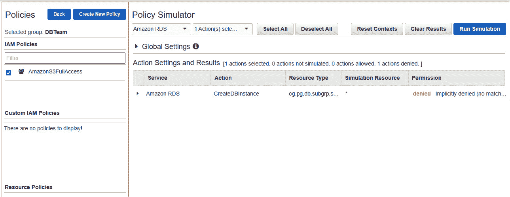

图 4.9 – 亚马逊策略模拟器

在本节中，我们探讨了如何基于最小权限原则使用 IAM 策略授予访问权限。我们查看了不同类型的策略以及 IAM 策略的不同类别。我们还检查了典型 IAM 策略的 JSON 结构。

在下一节中，我们将讨论 IAM 角色，IAM 角色是另一种可以用来授予访问您 AWS 账户中服务和资源的身份。

## 使用 IAM 角色分配临时凭证

虽然 IAM 用户账户通常表示一个物理人，或者可以作为一个需要身份验证的应用程序的“服务账户”使用，但 IAM 角色实际上是独立的身份，可以被其他实体假定以访问 AWS 服务和资源。换句话说，IAM 角色不是附加到特定用户上的。IAM 角色也会附加 IAM 策略文档，用于确定哪些服务和操作可以被授予或拒绝。

IAM 角色通常用于授予以下用例的访问权限：

+   需要访问您 AWS 账户中另一个服务的 AWS 服务，例如运行在 EC2 实例上的应用程序需要访问数据库来更新客户记录。

+   需要通过跨账户访问访问您账户中服务的另一个账户中的 IAM 用户。

+   需要访问您 AWS 账户中资源的来自其他 Web **身份提供商**（**Idp**）的联合用户，如 Google、Facebook 或 Amazon。可以使用 IAM 角色授予这些外部用户特定服务和资源的访问权限，而无需为他们创建新的 IAM 用户账户。

+   需要访问您 AWS 账户中某个服务的使用身份服务（如 Microsoft Active Directory）的联合企业用户。

如前所述，IAM 角色可用于授予联合身份的访问权限。身份联合是一个过程，其中您信任外部身份提供者（IdP）验证给定用户的身份，然后根据此基础授予用户访问权限。在验证用户身份后，IdP 会发送一个声明，声明中包含用户的登录名以及 AWS 用于与用户建立会话所需的任何属性。附加到 IAM 角色的策略随后用于确定可以授予用户的访问级别。

因此，身份联合使您能够授予外部身份访问您的 AWS 环境，无论是通过管理控制台还是 API。它还允许在无需为每个外部用户创建 IAM 用户账户的情况下访问资源。

## 临时凭证

使用 IAM 角色的一个主要好处是，它们利用了 AWS 定期轮换的临时凭证。例如，使用 IAM 角色时，您可以授予第三方移动应用程序访问您 AWS 账户中资源的权限，而无需将长期凭证存储在用户的手机上。这大大增强了安全性，并减少了管理开销。试想，如果需要为每个使用该应用程序的个人创建 IAM 用户账户，并找到一种安全的方法分发这些 IAM 用户凭证，这将是多么麻烦。IAM 角色能够解决这一问题，因为它们本身不包含任何凭证。

IAM 角色使用一个名为**安全令牌服务**（**STS**）的服务。**STS** 服务将临时凭证分配给承担角色的身份。这些临时凭证包括**访问密钥 ID**、**秘密访问密钥**和**安全令牌**。此安全令牌仅在短时间内有效，过期后将失效。如果身份仍然被允许访问，STS 服务将在凭证过期之前为该身份续订临时凭证，且此过程在后台由 AWS 管理。最终，临时凭证授予用户临时访问您的 AWS 账户中的资源，并且比使用长期访问凭证更安全。

创建 IAM 角色时，您还需要定义一个**信任策略**。在信任策略中，您指定将被信任来承担该角色的实体。这些实体可以是 AWS 服务，也可以是需要访问您 AWS 资源的外部身份。此外，这些实体本身需要具备权限，才能承担该角色。

如果可能，建议使用 IAM 角色而不是创建 IAM 用户账户，特别是对于组织外部的实体，并且使用临时凭证有很多好处。因此，以需要更新 AWS 账户中数据库的移动应用程序为例，使用 IAM 角色可以确保不会在手机上存储长期凭证，这也大大降低了使用被盗凭证进行恶意攻击的风险。

在这一部分，我们介绍了 IAM 角色，IAM 角色允许你使用临时安全凭证授予对 AWS 服务和资源的安全访问权限。

在接下来的部分，我们将介绍凭证报告，它允许你审计 IAM 身份。

# 审查凭证报告

AWS 使你能够下载一个**逗号分隔值**（**CSV**）文件，该文件每 4 小时更新一次，允许你审计 IAM 用户的安全状态并查看重要信息。信息可能包括你 AWS 账户中所有 IAM 用户的列表以及他们凭证的状态（例如是否已配置密码和访问密钥）。该报告还会突出显示你的用户账户是否已配置 MFA。

监控你的凭证报告还可以帮助你发现那些可能最近没有访问你 AWS 账户资源的身份。你可以进一步确定这些用户是否仍然需要访问权限，并从 AWS 账户中删除不需要的用户。

在这一部分，我们介绍了凭证报告，它允许你生成 IAM 用户及其当前访问状态的详细信息。在接下来的部分，我们提供了一些练习，帮助你通过使用 IAM 服务来安全地访问 AWS 账户，从而获得实践经验。

# 练习 4.1 – 创建一个 IAM 组

在这个练习中，你将为一个开发团队创建一个 IAM 组，该团队将需要对 Amazon S3 具有完全访问权限：

1.  登录到你的 AWS 账户。

1.  在你的**AWS 服务**主页中，点击**安全性、身份与合规性**类别下的**IAM**链接。

1.  从左侧菜单中点击**组**。

1.  接下来，点击**创建新组**按钮。

1.  接下来，你将看到一个逐步向导。为你的新组提供一个组名。对于这个练习，输入`Developers`。

1.  点击屏幕右下角的**下一步**按钮。

1.  现在，你需要附加一个策略。你可以创建自己的客户管理策略，但为了本练习的目的，在**策略类型**筛选框中输入`S3`。这将缩小与 Amazon S3 相关的可用策略。

1.  勾选**AmazonS3FullAccess**策略旁边的复选框。

1.  点击屏幕右下角的**下一步**按钮。

1.  最后，点击屏幕右下角的**创建组**按钮。

现在，您将看到您的组已创建并列在**组名称**下。现在，您已创建了一个组，您可以继续创建 IAM 用户并将其添加到组中。这使您可以更有效地管理多个用户。在下一个练习中，我们将创建一个 IAM 用户并将其添加到开发者组。

# 练习 4.2——创建 IAM 用户

现在您已创建了开发者组，您可以将开发者添加到此组中。为了解释这一点，我们将创建一个新用户，John。John 是我们 Packt 的高级开发人员之一，我们希望确保他是开发者组的成员，这将使他能完全访问 Amazon S3：

1.  在 IAM 仪表板中，从左侧菜单中点击**用户**。

1.  点击**添加用户**按钮。

1.  在`john`（全小写）中。

1.  接下来，您需要选择要授予 John 的访问类型。John 是开发者，需要同时具备控制台访问权限和编程访问权限。这意味着有时，John 将使用基于 Web 的控制台配置 Amazon S3 中的资源，而其他时候，他可能会使用 CLI。对于本练习，勾选两个框——**编程访问**和**AWS 管理控制台访问**。

1.  要通过控制台访问 AWS 账户，您需要为用户创建密码。对于`john`，您可以让 AWS 自动为您生成密码，或者您也可以自己创建一个自定义密码。选择**自定义密码**并选择一个复杂的密码。将该密码输入提供的文本框中。

1.  另一个设置，**要求重置密码**，使您能够强制要求 IAM 用户在下次登录时更改密码。这样，您在他们更改密码时将无法知道他们的密码，而且这也是最佳实践。出于本实验的目的，暂时取消选中此复选框。

1.  点击屏幕左下角的**下一步：权限**按钮。

1.  现在，您可以为用户设置权限。由于我们已经创建了一个权限集正确的组，我们只需将该用户添加为该组的成员。对于本练习，在**将用户添加到组**下，勾选**开发者**组旁边的框，并点击屏幕右下角的**下一步：标签**按钮。

1.  标签是您可以附加到任何资源的键值对。每个资源最多可以附加 50 个标签，这些标签帮助您更好地分类资源。然后，您可以使用标签来理解成本分配，并识别和管理您的资源。标签可以包含用户信息，例如电子邮件地址，或者可以是描述性信息，例如职位名称。对于本练习，设置一个标签，键设置为`Name`，值设置为`John`。

1.  点击屏幕右下角的**下一步：审查**按钮。

1.  现在，您可以查看所有用户设置，一旦满意，请点击屏幕右下角的**创建用户**按钮。

1.  现在，您将看到一个`.csv`文件。

1.  你还会注意到，你已经获得了一个特殊的链接，可以使用 IAM 用户账户登录到你的 AWS 免费层账户。IAM 用户的 AWS 账户登录页面与根用户的登录页面略有不同。这是因为当你作为 IAM 用户登录时，你需要指定你要登录的 AWS 账户 ID。在我们的示例中，我们有一个这样的链接：

    ```
    Users with AWS Management Console access can sign-in at: https://111222333444.signin.aws.amazon.com/console
    ```

    在 `.signin` 前的一串数字代表你的 AWS 账户 ID。

1.  点击屏幕右下角的**关闭**按钮以退出用户设置向导。

我们现在已经创建了一个代表我们组织中开发者的用户，并且我们已将该用户添加到开发者组。在下一个练习中，你将学习如何以你之前创建的 IAM 用户身份访问你的 AWS 账户。

# 练习 4.3 – 作为 IAM 用户登录你的 AWS 账户

在本练习中，我们以根用户身份退出 AWS 账户，然后重新以你刚刚创建的 IAM 用户身份登录。如果你没有记下那个特殊的登录链接，你需要知道你的 AWS 账户 ID。你可以通过点击你在基于 Web 的管理控制台右上角的账户名称来轻松发现它，并记下账户 ID：

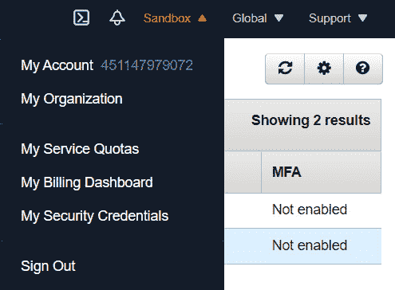

图 4.10 – 点击账户名称时出现的下拉框，用于发现账户 ID，该 ID 显示在“我的账户”后面

现在你已经有了账户 ID（或者你可以记下之前讨论过的登录 URL），我们可以继续以你之前创建的 IAM 用户身份登录：

1.  退出 AWS 账户（记住，你目前是以根用户身份登录的）。

1.  你将进入 AWS 控制台首页，在那里你可以点击**重新登录**按钮或**登录控制台**按钮。

1.  点击这两者中的任何一个都会带你到 AWS 登录页面。

1.  点击**IAM 用户**并在可用的文本框中提供账户 ID: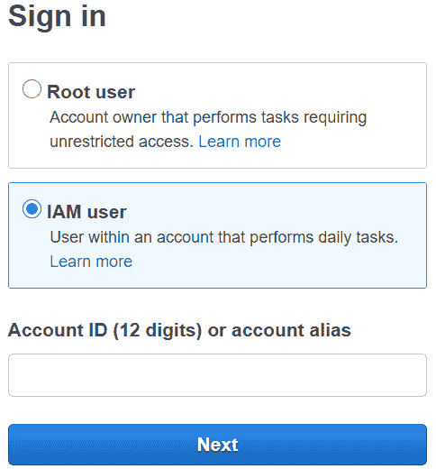

    图 4.11 – AWS 登录页面

1.  提供账户 ID 后，点击**下一步**。

1.  现在，提供你的用户名，在本例中是 `john`，以及你在创建用户时选择的密码。

1.  你现在将以我们的开发者 John 身份登录到 AWS 管理控制台。你会注意到你的用户名显示在屏幕的右上角：

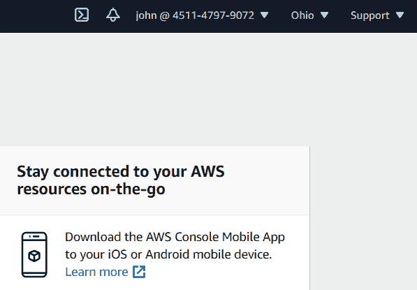

图 4.12 – IAM 用户 John 已成功登录到该 AWS 账户

在本节中，我们完成了一系列使用 AWS IAM 服务的练习。我们演示了如何创建 IAM 组和用户，以及如何以 IAM 用户身份登录 AWS 管理控制台。

在下一节中，我们将讨论如何使用 AWS CLI 访问你的 AWS 账户。

# 使用 CLI 访问 AWS 平台

如前所述，您可以通过基于 Web 的管理控制台或 CLI 访问广泛的 AWS 服务。AWS CLI 是一个统一的工具，用于以编程方式管理您的 AWS 服务。AWS CLI 为您提供每个 AWS 服务的 **应用程序编程接口** (**API**) 的访问权限。这使得您能够远程访问您的 AWS 账户，并在 Linux 和 Mac 计算机上的终端应用程序中运行命令，或者在 Windows 计算机上使用命令提示符。

因此，AWS CLI 非常适合运行简单命令以完成重复性任务，并且由于单个命令字符串可以包含请求所需的属性，您会发现它比在 Web 控制台中使用鼠标点击要快得多。CLI 是您需要习惯的工具——首先，您需要了解如何构建命令，但 AWS 提供了完整的参考文档来帮助您。

您可以逐行单独运行 CLI 命令，也可以创建脚本来运行一系列命令以完成一组任务。例如，您可以创建一个脚本来启动一个新的 EC2 实例，将其配置为 Web 服务器，并安装任何第三方应用程序。

## 通过 CLI 访问您的账户

本节将指导您完成在计算机上配置 CLI 并使用 John 的账户访问 AWS 平台的步骤。

重要提示

强烈建议除非有特定需求，否则避免为 root 用户账户创建和使用访问密钥。例如，为了在 Amazon S3 存储桶上启用 MFA 删除（我们将在 *第五章*中讨论，*Amazon Simple Storage Service (S3)*），您需要使用 CLI，届时您将需要一组访问密钥。问题在于，当您使用 AWS CLI 访问 AWS 账户时，您的凭证（访问密钥 ID 和密钥访问密钥）会存储在您使用的计算机上。这意味着您应该定期旋转您的密钥，并确保保护您的计算机，例如启用本地磁盘加密。作为最佳实践，如果您需要为 root 用户账户创建一组访问密钥，您应该按照以下流程：创建密钥、使用它们完成特定任务，然后在任务完成后禁用或删除密钥。

因此，使用 CLI 从本地计算机作为 root 用户访问您的 AWS 账户意味着 root 用户的凭证也会存储在本地机器上。这被认为是一个重大安全风险，因为您真的不应该将 root 用户账户用于日常操作。即使您需要完全的管理权限，理想情况下也应该创建一个 IAM 用户，并为其分配必要的管理员权限。然后，您可以使用 IAM 管理员用户账户凭证来配置您的 AWS CLI。

root 用户是你账户的最终所有者，甚至可以关闭你的账户。这就是为什么建议在管理 root 用户的凭证时要极其小心的原因。

## 下载 CLI 工具

要使用 AWS CLI，你首先需要将其下载并安装到本地计算机。你可以在这里访问 AWS CLI 工具：[`aws.amazon.com/cli/`](https://aws.amazon.com/cli/)。

根据你的操作系统，你需要下载并安装适当的工具。目前 AWS CLI 工具的版本是 2，带有新的和改进的安装程序、新的配置选项，例如 AWS **单点登录**（**SSO**）和各种互动功能。你可以下载适合你操作系统的安装程序，无论是 Windows、Mac 还是 Linux。之前，你需要安装 Python 才能使用 AWS CLI，但现在不再需要了。

从前面的链接下载并安装适合你操作系统的安装程序：

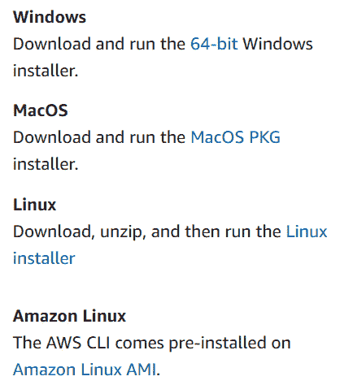

图 4.13 – 下载适合你操作系统的 AWS CLI 安装程序的链接

安装完 AWS CLI 后，下一步是配置它，使用一组访问密钥来以编程方式登录到你的 AWS 账户。如果你使用的是 Windows，可以从命令提示符访问 AWS CLI。如果你使用的是 Linux 或 Mac，可以使用终端应用程序。安装程序会自动设置任何环境变量，因此你可以在命令提示符的任何地方访问该工具。

在下一个练习中，你将学习如何在 Windows 计算机上使用 Amazon CLI 访问 AWS 平台。

# 练习 4.4 – 使用 AWS CLI 在 Windows 计算机上访问 AWS 平台

一旦你在 Windows 机器上安装了 AWS CLI 工具，下一步是配置它，以作为你之前创建的 IAM 用户来访问你的 AWS 账户：

1.  打开凭证文件，这个文件是你在创建 IAM 用户`john`时下载的。该文件包含你用户的访问密钥，包括**访问密钥 ID**和**秘密访问密钥**。

1.  在你的 Windows 桌面上，点击`CMD`：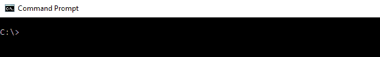

    图 4.14 – Windows 计算机上的命令提示符

1.  在提示符下，输入`AWS configure`以开始配置过程。

1.  然后你将被提示输入**AWS 访问密钥 ID**，接着输入**AWS 秘密访问密钥**。这些密钥在你之前下载的凭证文件中。

1.  对于`us-east-1`。

1.  对于**默认输出格式**，保持空白并按*Enter*：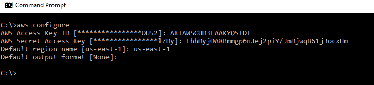

    图 4.15 – 配置 AWS CLI 的访问密钥 ID 和秘密访问密钥

1.  你的 AWS CLI 工具现在已配置为使用 John 的凭证。

1.  您可以尝试运行诸如`aws s3 ls`的命令。此命令列出您账户中的任何 Amazon S3 存储桶。如果您还没有创建任何存储桶，则只会返回提示符。在我的情况下，您可以在以下截图中看到，我已经在我的账户中有一个存储桶：

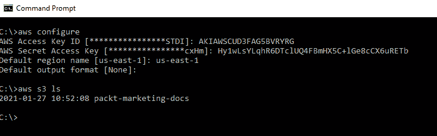

图 4.16 – 配置 AWS CLI 与访问密钥 ID 和秘密访问密钥

在本节中，我们讨论了配置 AWS CLI 工具所需的必要步骤，以便您可以在 Windows 机器上使用命令提示符作为 IAM 用户访问您的 AWS 账户。您也可以在 Mac 或 Linux 计算机上使用终端完成相同的任务。您需要为您的操作系统安装适当的工具。

使用 CLI 可以非常高效，特别是当你尝试执行重复任务时，你还可以创建脚本来自动化整个过程。

你应该尝试避免使用根账号执行 AWS 账户中的任何日常操作。相反，你必须使用仅具有执行当前任务所需权限的 IAM 用户账号登录。这被称为遵循最小权限原则。

在下一个练习中，你将创建另一个 IAM 用户账号，用于接下来章节中的所有练习。

# 练习 4.5 – 创建具有管理权限的 IAM 用户

在这个练习中，你将创建另一个 IAM 用户账号，用于登录到你的 AWS 账户。这个 IAM 用户将被赋予完整的管理访问权限，帮助你轻松完成即将进行的练习，尽管在实际环境中，你会希望限制权限仅限于相关用户的工作职能。习惯以 IAM 用户身份登录，将有助于你养成日常任务避免使用根用户凭证的习惯：

1.  确保您已经作为根用户（您用来创建 AWS 账户的电子邮件地址和密码组合）登录到您的 AWS 账户。

1.  导航至 IAM 仪表板。

1.  从左侧菜单中，点击**用户**。然后，从右侧窗格中，点击**添加用户**。

    你将被重定向到**添加用户**向导页面。

1.  对于用户名，输入`Alice`。在本指南的其余部分，您将以`Alice`身份登录，并完成所有即将进行的练习。

1.  在**选择 AWS 访问类型**下，选择**程序化访问**和**AWS 管理控制台访问**。

1.  对于**控制台密码**，选择**自定义密码**选项，并提供您选择的复杂密码。

1.  取消**要求密码重置**旁边的复选框，然后点击**下一步：权限**按钮。

1.  在第 2 步中，在**设置权限**下，选择**直接附加现有策略**选项。这将允许您仅向 Alice 的账户附加内联策略。

1.  从提供的策略列表中，选择**AdministratorAccess**旁边的复选框，如下图所示：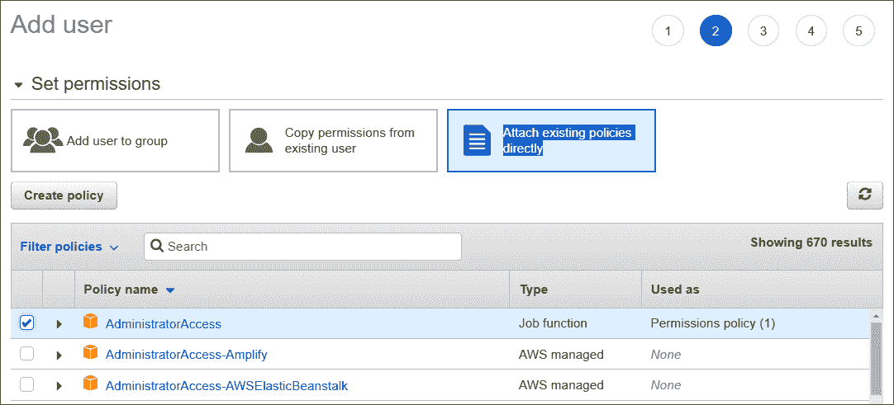

    图 4.17 – 拥有管理员访问权限的 IAM 用户（Alice）

1.  点击屏幕底部的**下一步：标签**按钮。

1.  在第 3 步中，`名称`的值设置为`Alice`。

1.  点击**下一步：审查**按钮。

1.  接下来，点击**创建用户**按钮。

1.  然后，系统会提示你下载包含 Alice 访问密钥和秘密访问密钥的`.csv`文件。下载该文件，并确保将其保存在你电脑上一个易于访问的文件夹中。下载后，点击**关闭**按钮。

1.  你的 IAM 用户 Alice 现在可以登录了。从现在开始，你需要以 IAM 用户 Alice 的身份登录进行所有后续练习。确保你记下 AWS 账户的特殊登录链接或 AWS 账户 ID，这些信息将在你作为 IAM 用户登录时需要使用。

在本次练习中，你创建了一个 IAM 用户账户，用于登录到你的 AWS 账户并执行所有后续练习。在下一部分，我们将回顾本章的总结。

# 总结

在本章中，我们讨论了 AWS IAM 服务以及它如何充当你 AWS 账户的守门人。我们讨论了账户的根用户，这是你 AWS 账户中最高级别的管理员账户。根用户具有完全的访问权限，使用 MFA 保护此账户是推荐的最佳实践。

使用 AWS IAM，你可以创建和管理身份，这些身份被授予或拒绝访问你账户中各种 AWS 服务的权限。这些身份可以包括 IAM 用户、IAM 用户组或 IAM 角色。你还可以通过为 IAM 用户配置 MFA，进一步增强 IAM 用户的安全性。

我们讨论了配置 IAM 用户和 IAM 组时的最佳实践。我们强调，作为最佳实践，你应该创建 IAM 组，并将所有需要的 IAM 用户放入共享任务的组中。例如，如果你有一个开发人员组，你可以将所有开发人员放入该组。此外，你还可以创建 IAM 策略，并将其附加到你的 IAM 身份上，以确定它们在 AWS 账户中可以或不能做的事情。因此，AWS IAM 为你的账户提供身份验证和授权服务。

我们还研究了 IAM 角色，IAM 角色允许你创建不专门附加到任何物理用户的身份。IAM 角色使你能够授予那些可能没有访问权限的实体访问权限。IAM 角色可用于在需要时向实体授予临时凭证，并且根据用例，它们比使用 IAM 用户账户更安全。

接下来，我们讨论了凭证报告，它允许你审计 AWS 账户中现有的用户基础并审计使用模式。最后，我们介绍了如何使用 AWS CLI 访问你的 AWS 账户。

到目前为止，您已经了解了创建 IAM 用户、组和角色的重要性，并理解了它们的应用。您已经了解到根用户帐户不能用于日常操作，必须为根用户帐户和 IAM 用户设置 MFA。您还学习了如何使用 IAM 角色授予跨帐户访问和联合访问，并使一个 AWS 服务能够访问另一个 AWS 服务。您还了解了如何使用 IAM 策略强制实施最小权限原则，从而提高 AWS 帐户的安全性。

在下一章中，我们将介绍另一个核心 AWS 服务，名为**Amazon 简单存储服务**（**Amazon S3**）。Amazon S3 是一个对象存储解决方案，允许您在云中存储无限量的数据。Amazon S3 可用于广泛的使用场景，包括存储 Web 应用程序的数字资产，如文档、图像和视频，以及归档存储。

# 问题

下面是一些测试您知识的问题：

1.  您希望在 AWS 上部署开发和测试环境，并希望确保您的开发人员可以通过高度安全的身份验证过程访问您的 AWS 帐户，并遵循最佳实践。以下哪两种配置选项将帮助确保增强的安全性？（选择两个答案）

    1.  配置 IAM 帐户以使用 MFA。

    1.  配置您的 IAM 密码策略并设置复杂性规则。

    1.  确保加密您的 EBS 卷。

    1.  使用 Multi-AZ 创建 RDS 数据库。

    1.  将根帐户凭证提供给您的开发人员。

1.  您的开发人员这周末在家工作，需要通过 CLI 访问您的 AWS 帐户，以从他们的本地计算机配置 RDS 数据库。为了在他们的机器上配置 AWS CLI 工具，他们需要哪种类型的 IAM 凭证？

    1.  IAM 用户名和密码

    1.  访问密钥 ID 和秘密访问密钥

    1.  访问密钥和秘密 ID

    1.  HTTPS

1.  哪个 AWS 服务可以帮助您排查 IAM 策略并识别可能拒绝访问特定 AWS 服务的权限集？

    1.  IAM 策略模拟器

    1.  CloudWatch

    1.  CloudTrail

    1.  IAM 策略管理器

1.  以下哪项 AWS 服务更适合安全地授予在 EC2 实例上运行的应用程序访问在 Amazon RDS 上运行的后端数据库的权限？

    1.  访问密钥

    1.  IAM 角色

    1.  IAM 组

    1.  安全组

1.  IAM 策略文档是以哪种格式编写的？

    1.  JSON

    1.  YAML

    1.  XML

    1.  JAVA

1.  在为 IAM 用户和组分配权限时，您应该遵循哪种最佳实践策略？

    1.  遵循最小权限原则。

    1.  遵循最大权限原则。

    1.  遵循 ITIL 原则。

    1.  遵循 GDPR 原则。

1.  哪个 IAM 服务允许您通过根据工作职能创建用户集合，并根据角色为整个集合分配权限，从而有效地管理用户？

    1.  IAM 组

    1.  IAM 策略

    1.  IAM 集合

    1.  IAM 角色集

1.  IAM 的哪个功能使您能够使用现有的公司 Active Directory 用户凭证登录 AWS 管理控制台，从而提供单点登录（SSO）服务？

    1.  身份联合

    1.  IAM 用户数据库

    1.  Active Directory 用户和计算机

    1.  多因素认证（MFA）

1.  哪个 AWS 服务使您能够生成并下载一个报告，列出您的 IAM 用户及其各种凭证的状态，包括密码、访问密钥和 MFA 设备？

    1.  AWS 策略

    1.  AWS 资源浏览器

    1.  凭证报告

    1.  用户报告

1.  哪个 AWS 服务负责为承担 IAM 角色的实体分配和管理临时凭证？

    1.  AWS 密码管理器

    1.  AWS 安全令牌服务

    1.  AWS 凭证管理器

    1.  AWS 凭证报告
