# *第五章*: Amazon 简单存储服务（S3）

本章将介绍 **Amazon Web Services**（**AWS**）的其中一项存储服务。许多刚开始云端之旅的客户，往往将云存储服务视为长期走向云原生的垫脚石。虽然存储选项这些年来变得更为便宜，但事实依然是，随着时间的推移，我们对存储的需求不断增加。话虽如此，组织在处理存储需求时，必须制定一个智能的生命周期政策。公司可能需要根据合规性和监管要求保留数据长达 7 到 10 年。然而，随着时间的推移，某些数据不再需要保存，从网络中清除这些数据不仅能简化管理，还能节省成本。

访问 AWS 存储服务非常简单，与其购买新的存储硬件来进行本地托管，不如使用 AWS 等云供应商提供的服务，既简单又具有成本效益。当然，某些类型的数据可能需要本地存储，主要是由于延迟问题，但从安全角度来看，AWS 提供了多种选项，确保您的数据仅对您可访问。

AWS 提供不同的存储选项，本章将介绍其旗舰产品之一：**Amazon 简单存储服务**（**Amazon S3**）。Amazon S3 是一种对象存储解决方案，提供非常高的可用性、耐久性和可扩展性。AWS 还提供其他类型的存储选项，我们将在后续章节中进行探讨。

在本章结束时，您将了解 AWS 对象存储的基础知识，以及 Amazon S3 如何帮助满足您企业在云端的核心存储需求。您还将学习如何使用各种功能来管理您的云存储、解决合规性和法规问题，并设计具有成本效益的解决方案。最后，您将学习如何从本地位置访问云存储，并如何将大型数据集迁移到云端。

本章的主题包括以下内容：

+   AWS 存储选项简介

+   Amazon S3 简介

+   了解 Amazon S3 Glacier 的归档解决方案

+   使用 Amazon Storage Gateway 将您的本地存储连接到 AWS

+   使用 Amazon Snow Family 将大型数据集迁移到 AWS

+   练习 5.1—设置一个 Amazon S3 存储桶

+   练习 5.2—配置 S3 存储桶的公共访问

+   练习 5.3—启用存储桶的版本控制

+   练习 5.4—设置静态网站托管

# 技术要求

为了完成本章中的练习，您需要通过 AWS 管理控制台拥有一个 AWS 账户。您需要使用上章创建的 IAM 用户 **Alice** 登录。

# AWS 存储选项简介

存储服务提供了必要的基础设施，帮助你存储和访问数据。然而，不同的使用场景需要不同的存储架构，以确保性能、可靠性、持久性和对数据的正确访问类型。AWS 提供了三种主要的存储选项，每一种都能满足不同的需求。

## 块存储

**块存储**是一种架构设计，它将数据存储在硬盘等介质上，分成固定大小的块。数据被拆分成小块，并按这些块放置在介质上，每个块分配一个唯一的地址，作为其元数据的一部分。块存储利用管理软件（通常是操作系统的一部分）来组织这些数据块。当用户尝试检索文件时，管理软件会识别要检索的块，重新组装数据，并将整个文件呈现给用户。

在 AWS 上，块存储选项包括**弹性块存储**（**EBS**）。这些可以配置为附加到你的**弹性计算云**（**EC2**）实例的卷，并提供高性能工作负载所需的超低延迟。EBS 卷的一个优点是，它们并不是直接附加到你部署的 EC2 实例，而是通过高速网络连接。这使得你可以将一个 EBS 卷从一个 EC2 实例上卸载，并将其附加到另一个实例上，例如，当第一个 EC2 实例发生故障时。

典型的使用场景包括运行和管理系统文件，例如操作系统使用的文件、大型数据库，或者像**企业资源规划**（**ERP**）解决方案这样的应用程序。这些类型的应用程序需要非常低延迟的数据访问，通常会使用**直接附加存储**（**DAS**）或**存储区域网络**（**SANs**）。

## 文件存储

另一种存储架构设计是**文件存储**。该架构为您的企业数据提供了一个集中的位置，文件存储在文件夹和子文件夹中。文件存储提供了一种层次结构来存储数据，这意味着你可以模仿现实生活中的文件柜来组织数据。

数据的检索需要你了解文件和文件夹结构并提供相关信息。例如，如果我需要查看去年八月的资产负债表 Excel 文件，我需要查找`2020`文件夹和`August`子文件夹，这样我就能检索到那个特定的数据。

由于文件存储的特性，元数据可能有限，需要注意的一个关键限制是，由于操作系统的限制，你不能无限制地创建文件夹和子文件夹。你的层次结构也可能导致一些性能问题，因此你需要仔细决定这一结构。

文件存储非常适合用于公司内部的文件共享。由于有文件夹/子文件夹结构，数据可以很容易地组织，以便与组织结构紧密契合。

亚马逊提供了三种不同的文件存储系统，具体如下：

+   **弹性文件系统**（**EFS**）——这是一个托管的弹性文件系统，旨在让你共享文件数据，而无需像使用 EBS 那样配置或管理存储。你的文件系统会随着你添加和删除数据而增长或缩小，且挂载点只能在 Linux EC2 实例上创建。

+   **FSx for Lustre**——这是一个高性能文件系统，设计用于需要快速存储的应用，并且能够扩展到数百 GB（**GB**）的吞吐量和数百万次的**输入/输出操作每秒**（**IOPS**）。FSx for Lustre 同样适用于广泛的基于 Linux 的 EC2 实例。

+   **FSx for Windows File Server**——专为 Microsoft Windows EC2 实例设计，提供一个完全托管的文件共享解决方案，原生支持 Windows 文件系统，如行业标准的**服务器消息块**（**SMB**）协议。典型的使用案例包括文件共享服务、当地归档、应用数据共享和数据保护。

## 对象存储

相比之下，**对象存储**涉及将完整的文件存储为独立的对象。对象存储呈现平面文件结构——你创建某种形式的容器，并将对象存放在这个容器中，而不使用任何文件夹或文件级别的层次结构。这也被称为非结构化数据。对象存储的元数据（有关对象的信息，例如其名称等），以及其他属性，然后用于创建一个独特的标识符，以便轻松定位存储池中的数据。由于对象存储的性质，元数据可以包含大量信息，使得你比使用基于文件的存储解决方案更容易利用对象存储进行数据分析。

另一个好处是，对象存储非常适合提供更高水平的性能、耐用性和可扩展性。在文件级存储解决方案中，文件夹和文件结构的深度通常会受到你使用的操作系统的限制。然而，使用对象存储时，你可以在理论上扩展到存储无限量的数据。

平面文件结构是另一个优势点，因为它通过扩展的分类功能，使得你能够比从文件存储服务中检索数据更快地获取数据。

在 AWS 上，亚马逊 S3 服务提供了对象存储选项。Amazon S3 允许你创建被称为**存储桶**的容器，在这些容器中你以平面文件结构（无结构方式）存放数据（对象）。你可以随时随地存储和检索任意数量的数据。

对象存储的典型使用案例包括为您的网站和应用程序存储数字资产（文档、图片、视频），对您的对象进行分析的能力，以及为像**物联网**（**IoT**）这样的前沿技术提供存储解决方案。

在本节中，我们探讨了可用的三种主要存储选项、它们的关键特性和典型使用案例。我们还重点介绍了一些提供存储解决方案的 AWS 服务示例。

在下一节中，我们将向您介绍 Amazon S3 服务，它是云端的对象存储解决方案。

# Amazon S3 简介

Amazon S3 是 Amazon 的旗舰产品之一，提供一个强大、可扩展、耐用且具有成本效益的**对象存储**解决方案。客户可以使用 Amazon S3 存储任何数量的数据，适用于各种使用案例，包括网站的数字媒体内容、数据湖、移动应用程序、物联网设备数据和大数据分析。

Amazon S3 提供高达 99.999999999% 的耐久性，满足大多数客户及其个别业务需求的存储要求。

“十一 9”耐久性是什么意思？根据 AWS 的说法，如果您在 Amazon S3 上存储 10,000,000 个对象，那么平均而言，您可以预期每 10,000 年丢失一个对象。您可以在此处查看所有**常见问题解答**（**FAQs**）：[`aws.amazon.com/s3/faqs/`](https://aws.amazon.com/s3/faqs/)。

## 桶和对象

在您可以将任何数据上传到 Amazon S3 之前，您需要创建一个名为桶（bucket）的容器。桶需要具有唯一的全局命名空间，因为它们的内容可以通过公共互联网访问。这意味着您的桶名称必须在 AWS 生态系统中是唯一的。例如，存储在名为 `just-desserts` 的桶中的名为 `blueberry-muffin.txt` 的文档，可以通过互联网以两种主要方式进行访问，具体如下：

+   `blueberry-muffin.txt` 对象可以通过 S3 的**统一资源定位符**（**URL**）访问，例如 [`just-desserts.s3.amazonaws.com/blueberry-muffin.txt`](https://just-desserts.s3.amazonaws.com/blueberry-muffin.txt)。

+   `s3-website` 横杠（`-`）地区—`http://bucket-name.s3-website-Region.amazonaws.com`。例如，我们的食谱可以在 [`just-desserts.s3-website-us-east-1.amazonaws.com/blueberry-muffin.txt`](http://just-desserts.s3-website-us-east-1.amazonaws.com/blueberry-muffin.txt) 上访问。

    b) `s3-website` 点（`.`）地区—`http://bucket-name.s3-website.Region.amazonaws.com`。例如，我们的食谱可以在 [`just-desserts.s3-website.us-east-1.amazonaws.com/blueberry-muffic.txt`](http://just-desserts.s3-website.us-east-1.amazonaws.com/blueberry-muffic.txt) 上访问。我们将在本章稍后讨论 Amazon S3 的静态网站托管。

创建存储桶时，您可能会发现常见的名称不可用。例如，如果您想创建名为`marketing`的存储桶，那么您很可能无法使用这个名称，因为它可能已经被使用了。您可以通过创建带有独特前缀或后缀的营销存储桶来获得合适的名称。大多数公司会尝试将存储桶名称与其组织名称或项目名称相关联——例如，您的营销存储桶名称可以是`my-company-marketing`。也就是说，您仍然不能仅依赖于您为存储桶定义的任何特定命名约定，因为另一个客户可能选择了您可能想要的相同名称，并且存储桶名称是按先到先得的原则定义的。

以下是 Amazon S3 存储桶的一些关键属性：

+   存储桶名称必须介于 3 到 63 个字符之间。

+   存储桶名称必须始终为小写字母。然而，它们只能包含数字、连字符（`-`）和点（`.`）。

+   存储桶名称必须以字母或数字开头和结尾，并且名称之间不能包含空格。

+   存储桶名称不能格式化为`192.168.1.1`）。

+   存储桶名称不能包含`。）`。我们将在本章后面讨论 Amazon S3TA。

+   您不能创建嵌套的存储桶——例如，在一个存储桶中再创建一个存储桶。

    重要提示

    除了网站风格的端点，您应避免在存储桶名称中使用点（`.`），因为它们无法与使用**安全套接字层**（**SSL**）和**安全超文本传输协议**（**HTTPS**）的虚拟托管风格端点一起使用。请注意，它们与网站风格的端点一起使用的唯一原因是静态网站托管仅通过 HTTP 提供。如果您需要通过 HTTPS 提供内容，可以通过结合使用 Amazon CloudFront 分发点来解决此问题。我们将在 *第六章* 中讨论 CloudFront，*AWS 网络服务 – VPC、Route53 和 CloudFront*。

存储在 Amazon S3 存储桶中的任何数据都表示为一个**对象**。对象是完整地存储在给定存储桶中，而不是像块存储那样，文件可能会被拆分成块并存储在硬盘等介质上。如前所述，对象是以**扁平文件系统**的方式存储的。这意味着访问一个对象需要知道它的唯一 ID，这通常是对象元数据的一部分。您可以在一个存储桶中存储无限数量的对象，且 Amazon S3 上单个对象的最大大小为 5 **TB**（**太字节**）。

对象的文件名被称为`!`、`-`、`_`、`.`、`*`和`()`。

## 管理存储桶中的对象

如前所述，对象存储在`/`）参数中，帮助您以层次化方式管理和浏览对象。

乍一看，前缀和分隔符（`/`）的使用看起来像是典型的文件夹层次结构，但前缀和分隔符本身也构成了对象的**键**，正如我们在以下截图中看到的那样：

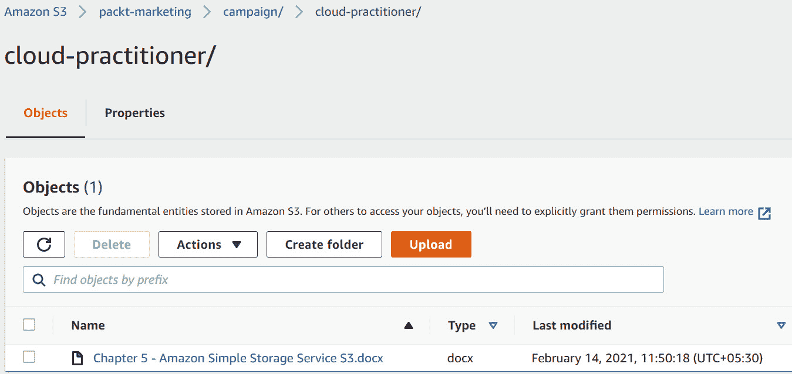

图 5.1 – 亚马逊 S3 前缀和分隔符示例

正如你在前面的截图中看到的，名为*第五章* `– Amazon Simple Storage Service S3.docx`的文件（对象）似乎存储在名为`cloud-practitioner`的子文件夹下，该子文件夹位于名为`campaign`的另一个子文件夹内，并存储在名为`packt-marketing`的存储桶中。

这种架构允许你更好地管理对象，但事实是，对象本身的键由这些前缀和分隔符组成。这意味着`development/sourcecodes.php`和`production/sourcecodes.php`键可以存在于同一个存储桶中，并因为前缀不同而被视为独特的对象。

前缀还用于帮助你将搜索结果限制为仅包含以特定前缀名称开头的键。此外，分隔符使你能够执行列出操作，从而将所有共享相同前缀的键作为单个汇总列表结果检索。

前缀在访问 Amazon S3 中的对象时进一步提高性能。例如，你可以每秒每个`GET`操作实现 3,500 次`PUT`/`COPY`/`POST`/`DELETE`或 5,500 次`GET`/`HEAD`操作。

## 区域托管 – 全球可用性

如果你定义了必要的权限，你的存储桶及其中的对象是全球可访问的。然而，重要的是要意识到，给定的存储桶及其包含的任何对象仅存储在一个特定的区域中。当你使用 Web 控制台、**命令行界面**（**CLI**）或通过**应用程序编程接口**（**API**）访问在 AWS 账户中创建 Amazon S3 存储桶时，必须指定你希望创建存储桶的**区域**。

你选择创建存储桶的区域将取决于多个因素，包括以下几个：

+   通过在需要访问的终端用户附近创建存储桶来优化延迟

+   降低成本

+   满足任何监管要求，例如数据主权法律

亚马逊**绝不会**在你创建数据的区域以外复制你的数据。这为你提供了确保可以满足并遵守作为企业可能需要遵循的任何数据驻留法律的保障。

然而，你可以将某个区域内一个存储桶的内容复制到另一个区域的存储桶，用于多个用例，包括**灾难恢复**(**DR**)或与同事共享内容，以便数据更接近他们，从而减少整体延迟。

## 访问权限

要创建和管理您的 Amazon S3 桶并上传和下载对象到桶中，您需要定义必要的权限。默认情况下，只有资源所有者，即创建资源的 AWS 账户，才能访问桶。

然而，您还可以授予您账户中其他用户的访问权限，并为特定的**身份和访问管理**（**IAM**）角色定义权限，以使其能够访问这些资源。此外，您还可以授予其他 AWS 账户的用户访问权限，甚至通过配置匿名访问来授予公众成员访问权限。当您希望为网站托管公开可访问的数字资产（如文档、图片和视频）时，匿名访问是理想的选择。

亚马逊 S3 提供两种主要方法来授予对资源（如桶和对象）的访问权限。您可以附加一个称为桶策略的基于资源的策略，或者您可以附加**访问控制列表**（**ACL**）。接下来，让我们研究这两种授予访问权限的方法。

### 桶策略

桶策略直接应用于整个桶，并可用于授予对桶本身及其中存储的对象的访问权限。桶策略可用于为同一策略文档中的不同类型对象指定不同级别的访问权限。桶策略文档也采用**JavaScript 对象表示法格式**（**JSON**），就像 IAM 策略一样。

使用桶策略，您还可以授予对桶中对象的匿名访问权限，例如网页、图片或视频，这意味着任何拥有 S3 对象 URL 的人都可以访问它。

桶策略非常灵活，允许您授予跨账户访问权限。这意味着，如果其他 AWS 账户的用户被允许访问，您可以通过指定其账户 ID 和 IAM 用户的**亚马逊资源名称**（**ARN**）来授予他们对您桶的访问权限。

这是一个典型的桶策略示例，授予匿名访问它所包含对象的权限：

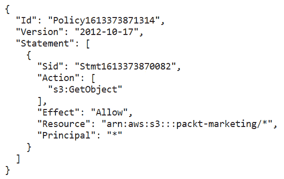

图 5.2 – 桶策略示例，授予对 'packt-marketing' S3 桶内容的匿名访问权限

如上图所示，策略通过将 `Principal` 属性指定为通配符（`*`）来允许匿名访问，这表示所有人。对 `packt-marketing` 桶的允许操作是 `s3:GetObject`，这限制了只能读取/下载对象。

桶策略中可以添加的另一个元素是策略的 `Effect` 属性，该属性设置为 `Deny`，除非满足特定条件。例如，您可以限制用户访问和下载 S3 桶中的内容，除非请求来自条件中指定的 IP 地址范围，如下图所示：

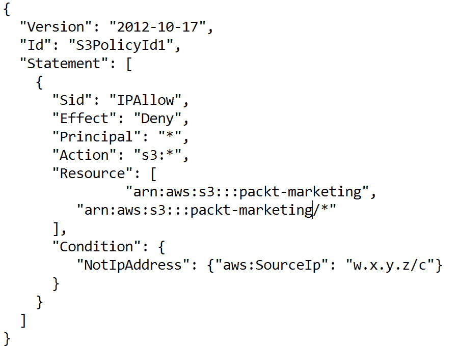

图 5.3 – 使用条件语句定义的桶策略

在前面的截图中，你会注意到策略的`Effect`属性是拒绝访问，除非满足`NotIPAddress`条件。你需要将示例中的虚拟 IP 地址范围（`w.x.y.z/c`）替换为适合你使用案例的真实 IP 地址范围。

### 桶和对象 ACL

ACL 现在被视为遗留的控制系统，因为桶策略通常更灵活，且提供更细粒度的访问控制。你通常可以使用 ACL 为对象和桶授予匿名访问权限，或授予其他 AWS 账户访问权限。由于 ACL 不允许你指定单个 IAM 用户作为这些权限的受益人，因此它们的使用案例有限，通常更倾向于使用桶策略。

然而，某些功能需要你配置 ACL 而非桶策略。例如，**服务器访问日志**是一项你可以启用的功能，用于提供对 Amazon S3 桶请求的详细记录。

### IAM 策略

如在*第四章*中所讨论的，*身份和访问管理*，你可以创建分配给 IAM 身份（如 IAM 用户、用户组或 IAM 角色）的 IAM 策略，并定义它们可以或不能对你的 AWS 账户中的任何特定服务和/或资源执行的操作。

因此，你可以授予 IAM 主体对 S3 桶及其中包含的对象的访问权限。然而，IAM 策略不能直接附加到资源上。此外，你不能将 IAM 策略直接附加到另一个 AWS 账户中的 IAM 用户。你需要首先创建一个拥有必要权限的 IAM 角色，然后为另一个 AWS 账户中的 IAM 用户启用信任策略，以便该用户能够承担此角色。

最后，IAM 策略不能用于授予匿名访问权限，因为有一个简单的原则：IAM 策略只能附加到 IAM 身份上。

注意

你可以结合使用桶策略、ACL 和 IAM 策略来授予访问权限。然而，你必须记住，任何冲突的`Deny`权限都会始终覆盖`Allow`权限。不过，这些策略选项并不是相互排斥的。

### 选择正确的 S3 存储类

亚马逊 S3 允许你在云中存储无限量的数据。然而，并非所有数据都需要相同的处理方式。例如，你可能有些数据需要即时访问，但也有其他类型的数据可能很少被访问，因为它们是为了合规目的存储的旧档案。

你可能还拥有一些可以丢失的数据，因为重新创建它们会很容易，而其他类型的数据可能是无法替代的。根据数据、数据的重要性以及访问模式，AWS 为不同的使用场景提供了不同的存储类。例如，如果你需要存储旧的档案数据，可以选择 Amazon Glacier 存储类；如果你需要即时快速访问数据，可以选择 Amazon S3 Standard 存储类。所有存储类都为你的数据提供 99.999999999% 的**耐久性**。耐久性指的是长期的数据保护，AWS 提供了必要的基础设施和流程来管理数据、复制副本、确保数据冗余，并防止降级或其他损坏。

根据你选择的存储类，AWS 还提供不同级别的**可用性**，这决定了一个对象在底层存储系统运行正常的情况下（或区域和**可用区**（**AZs**）处于在线和可访问状态时）可以检索的时间百分比。重要数据，如数字资产、医疗记录或财务报表，可能更适合选择那些提供较高可用性的存储类。而数据的次级副本可能不需要与主副本一样高的可用性。

Amazon S3 的收费基于六个费用组成部分。这些组成部分包括存储本身（包括存储的量、存储时长以及存储类）、请求和数据检索、数据传输、加速传输的使用、数据管理和分析，以及使用 Amazon S3 Object Lambda（即在返回应用程序时，使用 Lambda 函数修改和处理数据的能力）。注意——从互联网传输到 S3 存储桶的数据是免费的。减少成本的一种方式是识别出不需要实例访问或可以替代的数据，并将其存储在更便宜的存储类中。

重要说明

这里需要注意的一个关键点是，你可以在同一个存储桶内托管不同存储类的对象。你不需要为每个存储类创建单独的存储桶。

接下来我们来看一下不同的存储类。

### 高频访问

**Amazon S3 Standard**——这是你上传对象到存储桶时的默认存储类，除非另行指定。Amazon S3 Standard 提供全额的十一位数字（99.9999999%）的耐久性和四位数字（99.99%）的可用性。在 Amazon S3 Standard 中，你的对象始终会在你所选择的区域内的至少三个可用区（AZ）之间进行复制。

### 低频访问

Amazon S3 提供两种类型的低频访问存储类。这些存储类适用于存储不常访问的对象，但同时当你需要时，仍然可以即时访问数据。

AWS 提供这些存储类以较低的成本，前提是您不会像使用标准存储类那样频繁访问数据。为了确保这一条件，AWS 会收取额外的检索费用。此外，存储对象的最小大小为 128 **千字节**（**KB**）。您仍然可以存储小于此最小大小的对象，但这些对象会按 128 KB 的最小大小进行计费。

**Amazon S3 标准低频访问**（**S3 Standard-IA**）—S3 Standard-IA 适用于与标准存储类同样重要但访问频率较低的数据，因此非常适合长期存储，例如备份，或作为灾难恢复（DR）用途的数据存储。

**Amazon S3 单区低频访问**（**S3 One Zone-IA**）—此存储类别中的数据仅限于您上传数据的区域中的一个可用区（AZ）进行存储。这会将数据的整体可用性降至 99.5%，但比标准存储类或标准低频访问存储类便宜得多。这也意味着，如果存储数据的可用区发生故障，您必须等待该可用区恢复上线才能访问数据。在极少数情况下，如果可用区遭到破坏，您可能会丢失该数据。

亚马逊推荐将此类存储用于作为二级备份的数据或可以重新创建的数据。

### 归档存储

通常，数据需要为了归档目的而保存，以便在审计或参考时可用。更常见的是，监管和合规要求会规定某些类型的数据需要保存 *n* 年。例如，可能是财务信息或过去的医疗记录。

亚马逊通过其归档解决方案 **Amazon Glacier** 提供非常低成本的存储，以满足此类需求。

**Amazon Glacier**—此存储类旨在长期归档那些可能需要不频繁访问且在几小时内可访问的数据。

然而，从 Amazon Glacier 中检索数据的方式不同，因为它不能立即访问，您需要发起数据恢复请求。此恢复过程可能需要一些时间（从几分钟到 12 小时不等），具体时间取决于您选择的检索选项。

**Amazon Glacier 深度归档**—这是最低成本的存储类，客户可以将非常旧的历史数据存储在其中，以满足合规性和监管要求。此类数据可能需要保存 7 至 10 年。根据选择的检索选项，检索时间可能需要 12 小时或更长时间。

我们将在本章后面详细讨论 Amazon S3 Glacier 的检索选项。

### 不可预测的访问模式

通常，您的业务会对大多数数据有一个可预测的访问模式——例如，新创建的数据可能需要频繁访问，比如每天访问。随着数据的老化，访问频率会逐渐降低，有时甚至非常少。即使在这种情况下，您的访问模式也会随时间变化。AWS 提供了一项称为生命周期管理的功能，允许您根据访问模式的变化将数据从一个存储类别转移到另一个存储类别。我们将在本章后面讨论生命周期管理和生命周期规则。

然而，有时很难将数据分类为频繁访问或不频繁访问，主要是由于数据的性质。您可能在最初的几周内频繁访问一组对象，之后这些对象可能会变成不常访问。但是，几个月后，您可能需要再次访问这些对象进行分析或某种形式的调查。此时，这些数据可能再次需要在一段时间内频繁访问。

在这些情况下，AWS 提供了另一种存储类别，称为 Intelligent-Tiering 存储类别。为了享受此特权，您需要为每个对象支付少量的监控费用，以确保它根据访问模式自动过渡到正确的存储层。

**Intelligent-Tiering**—此存储类别根据您的访问模式提供自动分层存储。对象会自动在四个不同的层次之间过渡，其中两个是延迟访问层，旨在将对象在频繁访问和不频繁访问之间移动，另外两个是可选的归档访问层：

+   频繁和不频繁访问层—频繁访问的对象（30 天内访问）会自动放入频繁访问层（标准存储类别）。任何超过 30 天未被访问的对象将被移入不频繁访问层（标准-IA），从而产生更低的费用。请记住——标准-IA 的最小对象大小为 128 KB，小于此大小的对象将按最小 128 KB 处理和收费。任何在不频繁访问层的对象如果之后被访问，则会自动移动回频繁访问层并按相应收费。

+   可选的归档访问层—您可以选择启用归档访问层。一旦启用，当任何对象在 90 天内未被访问时，它将被移动到 Amazon Glacier **归档访问层**。如果对象在 180 天内未被访问，它将被移动到 Amazon **Deep Archive 访问层**。

Intelligent-Tiering 不会收取检索费用，但如果对象已归档，则根据所选择的检索选项，检索可能需要一些时间。下表展示了可用的检索选项：

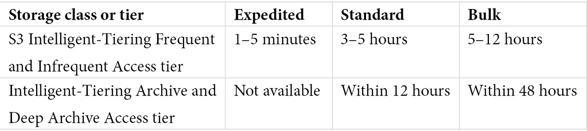

表 5.1 – S3 Glacier、Deep Archive 和 S3 Intelligent-Tiering 归档类的检索时间

如您所见，您有多种检索选项，时间将根据您选择的归档存储选项而有所不同。

### S3 on Outposts

Amazon Outposts 是一项完全托管的本地服务，配备有一个 42U 的机架，可以在您的数据中心托管与 AWS 相同的基础设施和服务。U 表示机架单元或“U 空间”，其高度为 1.75 英寸。标准高度为 48U（即 7 英尺的机架）。该服务允许您在本地创建计算、存储、网络和数据库服务池，特别适合需要低延迟访问的工作负载。如果您有计划将整个数据中心迁移到云端，Amazon Outposts 也可以作为一个前导步骤。

随着 Amazon Outposts 的广泛应用，AWS 又推出了一种名为**S3 Outpost**的存储类型。该服务通过将数据存储在您本地 Outposts 上托管的多个设备和服务器中，提供耐用性和冗余性，适用于低延迟访问，同时也能帮助您满足严格的数据驻留要求。Amazon S3 on Outpost 允许您将 48 TB 或 96 TB 作为 S3 存储容量的一部分，并提供在每个 Outpost 上最多创建 100 个 S3 存储桶的选项。请查看以下截图中展示的 Amazon S3 性能图表：

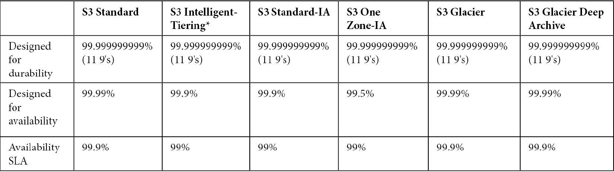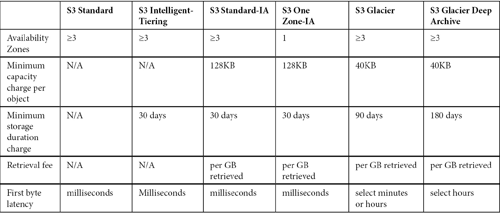

图 5.4 – S3 存储类性能和关键属性

如前面的截图所示，您可以根据使用案例选择存储对象的存储类。在做出这个决定时，您需要考虑耐用性和可用性，以及对象的最小大小，并确定是否需要即时访问这些对象。

## 版本控制

为了防止意外删除或覆盖，AWS 还提供了一项名为 S3 版本控制的功能。默认情况下，在创建存储桶时版本控制是禁用的，这意味着如果您上传一个与现有对象同名（在 AWS 中称为**键**）的对象，那么该存储桶中的原始对象将会被覆盖。有时候，这正是您想要的效果，但在大多数情况下，您可能希望保留原始版本。通常，对象被覆盖的原因是上传前未更改对象名称，导致了意外覆盖。

亚马逊 S3 提供了一个功能，您可以在存储桶上启用版本控制。该设置会应用于整个存储桶，因此会影响所有对象。一旦启用版本控制，任何上传的与现有对象同名的对象都会被标记为新版本 ID。访问该对象时将返回最新的当前版本，但控制台中的切换开关允许您查看所有先前版本，以防您需要访问对象的早期版本。

如果您尝试删除存储桶中一个已启用版本控制的对象（没有指定版本 ID），那么该对象不会被删除。AWS 会在该对象上添加删除标记，并将其从 S3 管理控制台视图中隐藏。如果之后您需要 *恢复* 该对象并使其在 S3 管理控制台中可见，您只需删除该删除标记即可。

您应该注意，存储桶可以处于三种状态之一，具体如下：

+   未启用版本控制（默认）

+   启用版本控制

+   版本控制已暂停

一旦在存储桶上启用版本控制，您将无法返回到未启用版本控制的状态，但如果您不想创建新版本的对象，您可以暂停版本控制。

## 跨区域和同区域复制

如前所述，为了帮助客户遵守合规性和数据驻留法律，AWS 永远不会将您的对象复制到您创建它们的区域之外。但是，如果没有监管要求阻止您这样做，您可以将数据复制到您上传数据的区域之外。

**亚马逊跨区域复制** **(CRR)** 用于异步地将对象复制到不同 AWS 区域的 AWS 存储桶之间。您可以使用 CRR 来完成以下任务：

+   **减少延迟**—通过将对象复制到离终端用户更近的地方，您可以最大限度地减少访问这些对象时的延迟。

+   **提高运营效率**—如果您跨多个区域运行应用程序并且需要访问相同的数据集，在这些区域中维护多个副本可以提高效率。

+   **满足合规性和监管要求**—贵组织的合规性和监管要求可能要求您将数据副本存储在数千公里外以用于灾难恢复（DR）。

除了 CRR，亚马逊 S3 还允许您配置同区域存储桶之间的复制服务。这被称为 **同区域复制** (**SRR**)，它可以帮助您实现以下目标：

+   **日志数据聚合**—您可能正在从多个源和应用程序收集日志数据。您可以通过复制将这些数据集汇总到单个日志管理存储桶中。

+   **在开发和生产账户之间进行复制**—如果您使用单独的开发和生产账户并且需要在每个账户中使用数据集，您可以使用复制功能将对象从开发账户移至生产账户。

+   **合规要求**——你可能需要保留多个副本的数据，以遵守数据存储法规。SRR 可以帮助你在多个桶之间复制数据，以确保你有多个副本用于合规目的。

需要注意的是，两个桶必须配置为启用版本控制，才能设置 CRR 或 SRR。你还可以跨地区或在同一地区复制对象，无论是在同一 AWS 账户内还是跨多个 AWS 账户。此外，你可以将对象从原始存储类别复制到不同的存储类别，这意味着你的复制对象可以存储在更便宜的存储类别中，例如，它们仅作为备份副本使用——例如，你的原始对象可以存储在标准存储类别中，而复制的对象可以放在标准-IA 存储类别中。这将降低你整体的存储成本。

复制服务的另一个特点是支持多个目标桶。你可以配置 S3 复制（多目标），它允许你将数据从一个源桶复制到多个目标桶，目标桶可以位于同一地区、跨地区，或两者的组合。

Amazon S3 生命周期管理 Amazon S3 提供无限量的存储空间。这意味着你可以轻松上传你创建的任何数量的数据，并可以完全不再关注它。同时，我们也不能忘记，Amazon S3 会根据你使用的存储量收费，费用还取决于你将对象放置在哪种存储类别中。

通常，数据的大部分在创建后的初期会很少被访问。这使得你必须有一种机制，将那些不再需要频繁访问的对象移动到更便宜的存储类别，以有效管理你的存储成本。此外，你可能还会存储大量存档数据，这些数据在一段时间后不再需要，甚至不再用于合规性和审计目的。例如，一些法规规定，某些类型的数据最多只需要保存 7 年。

手动管理大量数据可能是一项繁琐的工作，通常需要创建脚本和工具来审查存储在云中的数据。相反，你可以使用 Amazon S3 提供的可靠解决方案——Amazon S3 生命周期管理。

Amazon S3 生命周期管理操作可以应用于你的 Amazon S3 桶。这些操作可以应用于整个桶或通过定义前缀应用于部分数据。这些操作主要分为两大类，具体如下：

+   **过渡操作**—这允许你在一定时间后将对象从一种存储类移动到另一种存储类。例如，如果你知道在 60 天后你将不频繁访问某个特定数据集，你可以设置一个规则，将该数据从标准存储类移动到标准-IA 存储类，60 天后进行过渡。

+   **过期操作**—这些操作允许你在设置的天数后删除 S3 存储系统中的对象。例如，如果你在 365 天后不再需要旧的日志文件，你可以设置一个规则，使这些对象在 365 天后自动过期，从存储平台中删除它们。

你还可以使用过渡操作和过期操作的组合。例如，你可能有一些日志数据，在前 30 天会频繁访问。之后，你可能仍然需要在 180 天内重新访问这些数据，180 天后就不再需要了。你可以设置一个组合规则，在创建后 30 天将日志文件从标准类过渡到标准-IA 类，然后创建另一个过期操作，在 180 天后清除数据。

你还可以对版本化的数据应用不同的生命周期操作——例如，你可以为当前版本的对象设置一组规则和操作，为先前的版本设置另一组规则。这进一步允许你更有效地管理对象。

## S3 加密

上传到 Amazon S3 的所有数据在传输过程中都会使用 HTTPS 协议进行加密。然而，存储在 S3 上的数据不会被修改，这意味着如果你上传的是明文的敏感数据，默认情况下数据将以未加密的形式存储。

为了增加额外的安全层，你可以在将数据存储到 S3 之前对其进行加密。这被称为静态加密。AWS 提供了两种加密数据静态存储的选项，如下所述：

+   **服务器端加密**—当你上传（创建）对象时，Amazon S3 会在保存到磁盘之前对其进行加密，而当你下载/请求对象时，S3 服务会自动解密该对象。在决定使用服务器端加密加密对象时，你有三种互斥的选择，具体如下：

    a) 使用**Amazon S3 管理的密钥**（**SSE-S3**）的**服务器端加密**—Amazon 使用 256 位的**高级加密标准**（**AES-256**）对你的数据进行加密。每个对象都使用唯一的密钥进行加密，密钥本身会使用 AWS 为你旋转和管理的主密钥进一步加密。

    b) 使用**客户主密钥**（**CMK**）存储在 AWS **密钥管理服务**（**SSE-KMS**）中的**服务器端加密**—这类似于 SSE-S3，但具有更多附加功能，包括能够创建和管理自己的 CMK，以及一个审计功能，显示何时以及由谁使用了你的 CMK。

    c) **服务器端加密**与**客户提供的密钥**（**CPKs**）（**SSE-C**）—加密由 Amazon S3 执行，但使用 CPKs。如果您需要遵循管理和创建自己密钥的监管要求，这种方式是理想选择。

+   **客户端加密**—在这种情况下，数据在客户端加密，之后加密数据会上传到 Amazon S3。因此，整个加密过程由客户管理。

## 静态网站托管

除了存储数据外，Amazon S3 还提供为您的公司托管完整网站的服务。唯一的限制是，网站托管服务仅设计用于托管静态网站，而非动态网站。

主要区别在于，尽管存储在 Amazon S3 上以交付完整网站的内容可以更改和更新，但它始终保持不变且*静态*，并且所有访问该网站的用户都将看到相同的内容。

动态网站使用服务器端脚本根据不同参数在飞行中交付动态内容，并通常连接到后端数据库以获取内容。

然而，静态网站也可以提供完整的端到端解决方案，并以低成本支持多个使用场景。除了托管和交付数字资产，如**超文本标记语言**（**HTML**）文件、**层叠样式表**（**CSS**）、**便携文档格式**（**PDF**）文档、图像和视频外，您还可以托管在客户端浏览器中运行的客户端脚本，以提供额外的功能，包括互动元素——例如，您可以在 S3 静态网站上运行一个客户端脚本，以收集潜在客户的电子邮件地址并将其存储在第三方电子邮件营销服务提供商处。您还可以托管访问其他 AWS 服务的脚本。通过 Lambda 函数，并可能结合**弹性容器服务**（**ECS**）或**弹性 Kubernetes 服务**（**EKS**）作为后端，您可以从一个静态网站开始运行任何应用程序。最终，您可以在 Amazon S3 上托管静态网站，满足各种使用场景。由于其高度可用且可扩展的特点，能够处理大量流量，Amazon S3 相较于通过一组 EC2 实例托管静态网站，可能会是一个更好的解决方案，具体取决于您的使用场景。

以下是一些考虑使用 Amazon S3 静态网站托管服务的示例：

+   **开发产品预发布网站**—通常，当您需要宣传新产品系列的预发布活动时，可能无法准确预测会产生多少流量。将同一解决方案托管在一组 EC2 实例上可能更为昂贵，因为如果您的营销活动特别成功，您可能需要快速扩展并使用大量的服务器集群。相比之下，S3 的可扩展特性确保了随着大量流量的涌入，需求会自动得到满足。

+   **卸载**——通过 Amazon S3，你可以获得一个高度可扩展、可靠且低延迟的数据存储解决方案。即使你托管运行在昂贵 EC2 实例和 EBS 卷上的动态网站，你也可能有大量的静态内容（例如文档、图像和视频）。你可以将这些静态内容卸载到 S3 存储桶，并通过 API 调用在所有托管在 EC2 实例上的站点中引用它。其优点包括降低数字资产的存储成本，而且由于你的服务器保持精简，你还可以获得更好的性能。

+   **“精简版”网站或“维护中”横幅**——有时，在执行升级或发布重大更新时，你需要托管站点的替代版本。通过在 S3 存储桶中托管站点的*精简版*静态版本，你可以在维护或重大更新期间轻松将请求重定向到 S3 存储桶。

在本节中，我们学习了 AWS 上 Amazon S3 的基础知识，并了解了它的各种功能。在下一节中，我们将介绍一些附加服务，涵盖数据传输和归档。

## Amazon S3TA

如果你在某个特定区域托管了 S3 存储桶，但需要全球用户向其上传对象，用户可能会根据所在位置体验到更长时间的上传和下载速度波动。S3TA 减少了这种由于公共互联网架构而经常出现的速度波动。S3TA 通过 Amazon CloudFront 全球分布的边缘位置和 AWS 主干网络来路由你的上传数据，从而提供更快的速度和始终如一的低延迟。

这是一个 S3TA 速度测试工具的截图，它将一个示例文件从浏览器上传到不同的 S3 区域，并比较标准互联网上传速度与通过 S3TA 上传速度之间的差异。你可以在 [`s3-accelerate-speedtest.s3-accelerate.amazonaws.com/en/accelerate-speed-comparsion.html`](https://s3-accelerate-speedtest.s3-accelerate.amazonaws.com/en/accelerate-speed-comparsion.html) 上尝试这个速度测试：

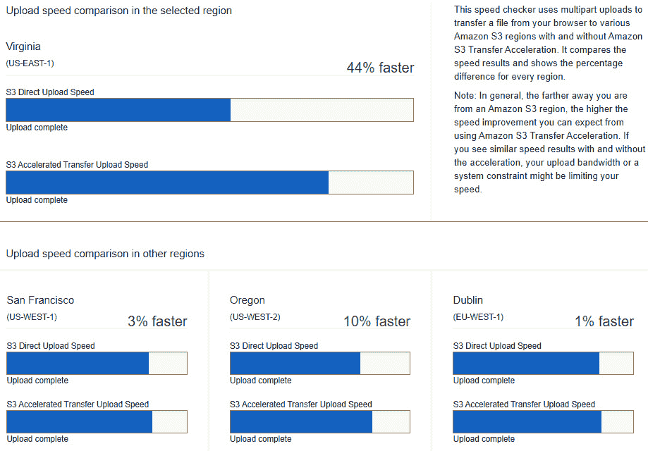

图 5.5 – Amazon S3TA 速度测试

在本节中，我们向你介绍了 Amazon S3 服务，并讨论了它的各种功能。Amazon S3 是一种对象存储解决方案，旨在帮助客户将任何数量的数据存储到云中。凭借版本控制、CRR/SRR、加密和静态网站托管等功能，你可以以负担得起的存储成本，将 Amazon S3 用于各种用例。

在下一节中，我们将介绍 Amazon Glacier 服务的其他功能，它们提供了归档存储解决方案。

# 学习使用 Amazon S3 Glacier 的归档解决方案

在本章早些时候，我们介绍了 Amazon S3 Glacier 和 Glacier Deep Archive 存储类。Amazon Glacier 提供非常低成本的长期存储，旨在用于归档存储。该架构提供相同的 99.999999999%（11 个 9）的耐久性，因此在发生重大灾难时，你可以放心，旧的归档文件将在需要时可用进行恢复。该技术与标准 S3 存储不同。归档文件需要先请求才能访问/下载，涉及一个两步过程：首先创建检索任务，然后在任务完成后下载你的数据。

这个检索过程可能需要一些时间，具体取决于你选择的检索选项，如前所述。然而，这种延迟访问数据的优点是，你可以获得 Amazon 平台上最便宜的存储选项。

### 归档和金库

与其他 Amazon S3 存储类一样，你可以将任何数量的数据存储在 Glacier 类中。然而，你的对象将作为归档存储，而归档可以包含单个文件或多个文件，文件可以以`.zip`或`.tar`格式打包在一起。归档的大小可以从 1 字节到 40TB 不等。在 Amazon S3 上，单个对象的最大大小为 5TB。

此外，归档文件可以被分组并存储在金库中。当你创建一个金库时，需要指定它将被创建的区域。金库还允许你定义访问和通知策略，每个区域最多可以拥有 1,000 个金库。金库策略使你能够定义谁可以访问金库以及可以对其执行哪些操作。你还可以定义金库锁定策略，如**只写多读**（**WORM**），或者用于合规性归档的基于时间的记录保留策略。

### 检索选项

如前所述，访问 Amazon Glacier 中的归档文件不是即时的。根据你选择的 Glacier 存储类（Glacier 与 Deep Archive），你有以下不同的检索选项：

a) **Amazon S3 Glacier 检索选项**

+   **标准**—这是默认的检索选项，通常需要 3 到 5 小时完成，之后你的数据将可以下载。

+   **加急**—如果你需要紧急访问你的部分归档文件，可以选择加急检索选项。显然，加急检索的费用比其他选项更高。此外，对于最多 250 **兆字节**（**MB**）的归档，加急检索将在 1 到 5 分钟内提供。除此之外，还提供两种加急检索选项：按需和预配。在按需选项中，你的检索请求通常会在 5 分钟内完成，尽管在高需求期间，这可能需要更长时间。你还可以选择购买预配容量，以确保在最需要时能获得可用的检索容量。

+   **批量** —此选项旨在帮助你以最低的检索成本检索大量数据，通常需要 5 到 12 小时才能完成。

b) **Amazon S3 Glacier 深度归档检索选项**

+   **标准**—深度归档的检索可以在 12 小时内完成。

+   **批量**—可以在 48 小时内检索 **PB**（**千兆字节**）级的数据，也是最具成本效益的选项。

在本节中，我们讨论了使用 Amazon S3 Glacier 服务的归档解决方案，以及如何存储数据多年以满足合规和监管要求。在下一节中，我们将探讨如何将你的本地存储服务连接到 Amazon S3。

# 将你的本地存储连接到 AWS，使用 Amazon Storage Gateway。

Amazon Storage Gateway 是一个本地解决方案，允许你将本地服务器和存储系统连接到 Amazon S3 云环境。该服务包括在本地安装 Storage Gateway **虚拟机**（**VMs**）并将你的服务器连接到这些虚拟机。然后，网关使用行业标准协议在你的服务器和 Amazon S3 平台之间传输数据。虚拟机可以部署在 VMware ESXi 或 Microsoft Hyper-V 虚拟化平台上。你还可以选择订购硬件设备，它是一台预安装并配置好 Storage Gateway 软件的物理服务器。这可以减少设置你自己虚拟机时所需的管理时间，并通过诸如 **网络文件系统**（**NFS**）、SMB 和 **互联网小型计算机系统接口**（**iSCSI**）等协议与现有存储系统集成。

Amazon Storage Gateway 使你的本地应用程序能够通过标准协议，如 NFS/SMB、**虚拟传输层**（**VTL**）和 iSCSI，*透明地*连接到 AWS 存储系统。Storage Gateway 虚拟机或硬件设备与 AWS 平台之间的连接可以通过互联网、通过安全的 IPsec **虚拟私人网络**（**VPN**）隧道，或通过 AWS Direct Connect 建立。

Amazon S3 Storage Gateway 支持不同的使用案例，提供以下部署选项：

+   **文件网关**—使你能够使用标准的 NFS、SMB 协议将数据存储在 Amazon S3 中。数据还会被本地缓存，从而实现低延迟访问。这里有两个可选项，如下所示：

    a) **Amazon S3 文件网关**—此服务使你能够为本地服务器提供文件服务器解决方案，并访问 Amazon S3，你可以使用行业标准的文件协议，如 NFS 和 SMB，在 Amazon S3 中存储和检索对象。此外，由于数据最终存储在 S3 中，你可以享受所有 S3 特性，如版本控制、存储桶策略、CRR 等。

    b) **Amazon FSx 文件网关**—此服务允许您将本地 Windows 服务器或基于 Windows 的应用程序（以及 Linux 和 macOS 系统）连接到云托管的 Amazon FSx for Windows File Server，实现低延迟，并能够在云中设置和访问几乎无限数量的 Windows 文件共享。Amazon FSx 文件网关完全支持 SMB 协议，并集成**活动目录**（**AD**），同时可以使用 ACL 配置访问控制。

+   **卷网关**—使您能够通过 iSCSI 协议将块存储卷呈现给本地服务器。卷网关可用于异步将您的数据备份到 Amazon S3，并有两种不同的模式，具体如下：

+   **缓存模式**—大部分数据存储在 Amazon S3 中，仅将最常访问的数据存储在本地缓存中，以实现低延迟连接。这意味着您不需要非常大的本地存储，从而有助于降低资本支出。

+   **存储模式**—您的数据本地存储，并可在本地环境中低延迟访问。如果您的应用程序对数据访问的延迟敏感，这尤其有用。数据随后会异步备份到 Amazon S3，并可用于灾难恢复（DR）目的。

+   **磁带网关**—许多组织使用备份软件解决方案来满足本地备份需求（例如，Veritas Backup Exec 和 NetBackup）。通常，这些应用程序将数据备份到物理磁带，而大多数公司将磁带存储在异地。然而，磁带驱动器、磁带和异地存储设施可能会变得非常昂贵。磁带网关解决方案通过使您能够通过 iSCSI 将虚拟磁带呈现给备份软件应用程序来拯救您。磁带网关将这些虚拟磁带存储在**虚拟磁带库**（**VTL**）中，并由 Amazon S3 备份。数据会写入这些虚拟磁带，导致磁带网关解决方案异步将数据上传到 Amazon S3。当您需要恢复数据时，它将被下载到本地缓存，备份应用程序可以将其恢复到您指定的本地位置。

为了管理旧数据的长期存储，您可以在 Amazon S3 和 Amazon S3 Glacier 或 Amazon S3 Glacier Deep Archive 之间转换虚拟磁带。如果以后需要访问**归档的虚拟磁带**上的数据，则需要检索该磁带并将其呈现给您的磁带网关解决方案。

请注意，从 Glacier 中检索归档的磁带将需要 3 到 5 小时，而从 Deep Archive 中检索则可能需要最长 12 小时。

在本节中，我们介绍了如何使用 Storage Gateway 解决方案将本地应用程序连接到 Amazon S3 存储服务。在下一节中，我们将讨论如何使用其他离线方法将大量数据迁移到云端，这在您拥有有限的互联网带宽时特别有用。

# 使用 AWS Snow 家族将大型数据集迁移到 AWS

许多寻求迁移到云的公司通常将大量数据托管在本地。尽管可以通过公共互联网将数据传输到 Amazon S3，但拥有大量数据的客户可能需要考虑离线传输方法，原因是带宽限制。

AWS 提供坚固耐用的设备，可以送到您的本地位置。这些设备包括 **Snowcone**、**Snowball** 和 **Snowmobile**。

## AWS Snowball

在最基本的应用中，您只需将大量数据复制到设备中，并将其寄回 AWS，以将数据导入到 Amazon S3。这些设备被称为 AWS Snowball 设备，是 Snow 家族设备的一部分。

这些边缘设备具有计算和存储功能，包含在高度坚固、防篡改的设备中。设备配备 **受信平台模块** (**TPM**) 芯片，能够检测硬件、软件或固件的未授权修改。这些设备可用于在本地位置进行存储和数据处理。通常，客户会使用 Snowball 边缘设备进行迁移、数据收集和处理，无论是否有互联网连接。

Amazon Snowball 有 *两种版本*，如下所示：

+   **Snowball Edge 计算优化版**—这些设备同时提供存储和计算资源，可用于 **机器学习** (**ML**)、分析以及任何本地计算任务。设备配备 52 个 **虚拟中央处理单元** (vCPUs)、208 GB 内存，并配备可选的 NVIDIA Tesla V100 **图形处理单元** (**GPU**)。在存储方面，设备提供 42 TB 的 **硬盘驱动器** (**HDD**) 容量和 7.68 TB 的 **固态硬盘** (**SSD**) 容量。

+   **Snowball Edge 存储优化版**—这些设备提供更大的存储容量，适用于数据迁移任务。配备 80 TB 的 HDD 和 1 TB 的 **串行高级技术附件** (**SATA**) SDD 卷，您可以开始将大量数据迁移到云端。该设备还配备了 40 个 vCPUs 和 80 GB 内存。

## Amazon Snowcone

作为 AWS Snow 家族中最小的成员，这些设备是有史以来最小的，重量仅为 4.5 **磅** (**lb**)（2.1 **千克** (**kg**))。Snowcone 设备提供 8 TB 可用存储，设计用于网络连接较差的户外环境。例如，物联网、车辆和无人机使用场景。

该设备还提供计算能力，配备两个 vCPUs 和 4 GB 内存，并通过 USB-C 电源连接线和可选电池提供电力。

## Amazon Snowmobile

如果您需要将 exabyte 级的数据迁移到云端，那么您将需要一个极其庞大的 45 英尺长的 *坚固* 运输集装箱。Amazon Snowmobile 可以将最多 100 PB 的数据迁移到云端，并协助您的所有数据中心迁移工作。

运输集装箱将被送到现场，AWS 团队成员将与您的团队合作，将 Snowmobile 的高速交换机连接到您的本地网络。

通过 24/7 视频监控、可选的护送安保服务以及 256 位加密，您可以使用最安全的方式将敏感数据传输到 Amazon S3。

在本节中，我们回顾了将大量数据离线传输到云端的方法，并帮助您进行数据迁移。Amazon Snow Family 不仅提供存储容器，这些设备还具备强大的计算能力，可以在将数据复制到它们时执行数据处理、分析和机器学习任务。

在下一部分，我们回顾本章中强调的一些关键点。

# 练习 5.1 – 设置 Amazon S3 存储桶

在本练习中，我们将创建一个 Amazon S3 存储桶，并上传一个对象到其中。更具体地，我们将上传一个单独的网页文档，并在上传后测试访问。由于我们计划稍后*使用*此存储桶来托管一个静态网站并使内容对互联网上的任何人可访问，您需要禁用**阻止公共访问**设置，正如本章之前在访问权限设置中讨论的那样。请按以下步骤进行：

1.  在您的计算机上，使用您选择的标准文本编辑器（Windows 上的记事本或 Mac 上的 TextEdit）创建一个新文件。

1.  将以下代码行添加到文档中：

    ```
    index.html file to your desktop as well.
    ```

1.  接下来，保存文件，文件名为`index`，并添加`.html`扩展名—因此，文件名和扩展名应为`index.html`。这将为您创建一个简单的网页对象。您可能需要将**另存为类型**选项设置为**所有文件**，如下图所示：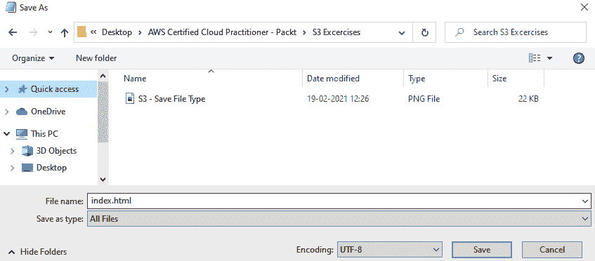

    图 5.6 – 通过.html 扩展名保存文件以创建网页

1.  接下来，以 IAM 用户**Alice**身份登录到您的 AWS 账户。

1.  进入 Amazon S3 控制台。

1.  单击**创建存储桶**，如下图所示：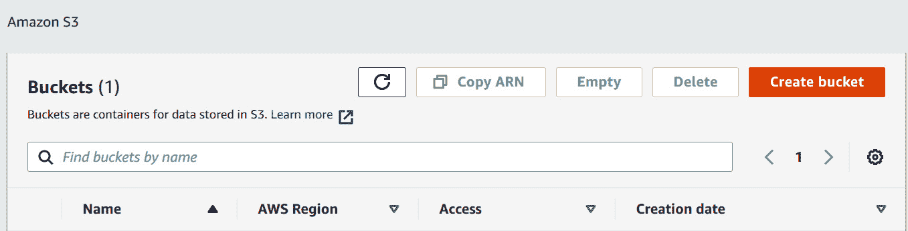

    图 5.7 – 存储桶列表

1.  对于存储桶的名称，请输入您的名字，后跟一个连字符（`-`）和单词`webpage`。确保名称中没有空格，并且使用全小写字母。假设您选择的名称尚未被 AWS 的其他客户占用，您应该能够使用这个存储桶名称。如果在创建存储桶时遇到错误，提示名称不可用，您只需要选择另一个名称。

1.  对于`us-east-1`。

1.  接下来，在**存储桶的公共访问阻止设置**子标题下，取消勾选**阻止所有公共访问**的框。请注意，对于一般用例，除非你的用例需要，否则你不应解除公共访问阻止，例如在配置静态网站托管时，我们将在*练习 5.4*中讨论此操作。如果你不需要像公共互联网中的最终用户那样的匿名访问，你必须始终正确配置权限，使用存储桶策略、ACL 或访问点策略，以确保你遵循**最小权限原则**（**PoLP**）。

1.  接下来，勾选该框，声明你已知悉前述设置可能会使存储桶及其对象变为公共可访问，如下图所示：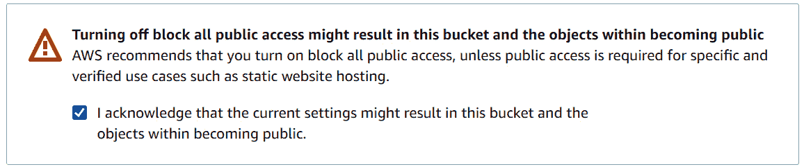

    图 5.8 – 关闭存储桶的所有公共访问阻止

1.  保持其他所有设置为默认，并点击屏幕底部的**创建存储桶**按钮。你的 Amazon S3 存储桶现在已经创建。

1.  接下来，在主 S3 控制台的存储桶列表中，选择你刚刚创建的存储桶。这将带你进入存储桶中当前的对象列表。你会注意到目前没有任何对象。

1.  你会注意到有一个**上传**按钮。点击该按钮后，你将可以添加文件和文件夹，如下图所示：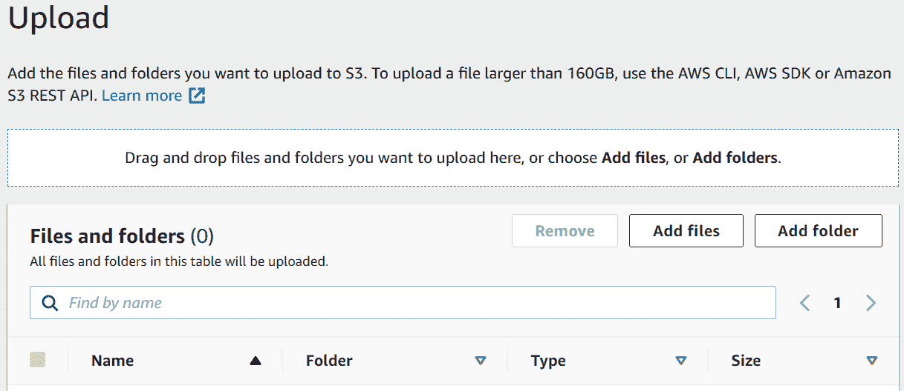

    图 5.9 – 将对象上传到你的存储桶

1.  添加你之前创建/下载的`index.html`文件。

1.  向屏幕底部滚动并点击**上传**按钮。

1.  你的文件将被上传。

1.  你会注意到屏幕顶部会有一个绿色横幅，显示上传已成功。现在，继续点击**退出**。

1.  然后，你将看到你刚刚创建的存储桶的内容。

1.  你现在可以点击**对象**列表中的`index.html`文件，这将带你进入该文件本身的 Amazon S3 属性页面。

1.  请注意，每个对象都有自己的 URL，可以通过互联网访问（只要权限设置正确），正如我们在以下截图中看到的：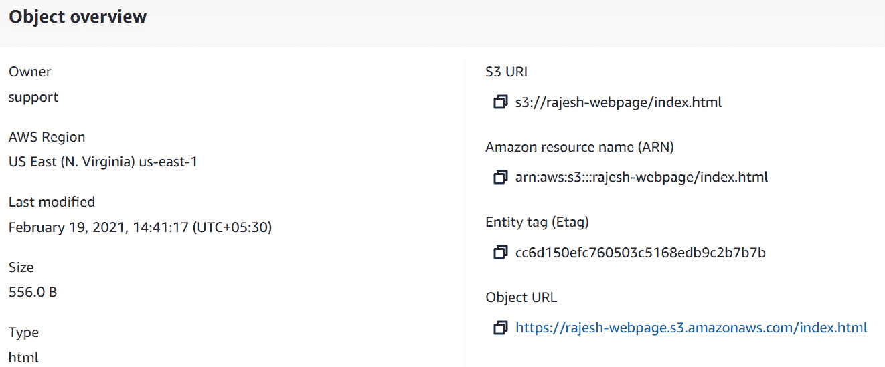

    图 5.10 – 将 index.html 对象上传到你的存储桶

1.  如果你尝试点击这个对象的 URL 在另一个浏览器窗口中打开，你会发现无法访问它。相反，你会看到一个**拒绝访问**的错误信息。这是因为通过 URL 访问对象的效果就像是尝试匿名地通过公共互联网读取该对象。

尽管我们禁用了`Allow`规则来授予访问权限，但你可以点击对象本身的**权限**标签，设置 ACL 以启用该对象的公共访问。然而，如前所述，使用存储桶策略是更好的选择，因为它们提供了更多的功能和更精细的控制。

在下一个练习中，我们将设置一个存储桶策略，看看如何允许公共访问此文件。

# 练习 5.2 – 配置 S3 存储桶的公共访问

在本练习中，我们将配置 Amazon S3 存储桶，使用你之前创建的`index.html`网页。

记住，你可以选择将访问权限限制为仅一组已知用户——例如，如果你只想让你的 AWS 账户中的 IAM 用户访问这些对象。你还可以配置跨账户访问，在这种情况下，你定义属于另一个 AWS 账户的主体，并授予他们特定的访问权限。

在本练习中，我们希望授予对`index.html`页面的匿名访问权限，因为最终，我们将在后续的练习中使用这个存储桶构建静态网站托管服务。请按以下步骤操作：

1.  返回 S3 控制台，点击你刚刚创建的存储桶，如下图所示：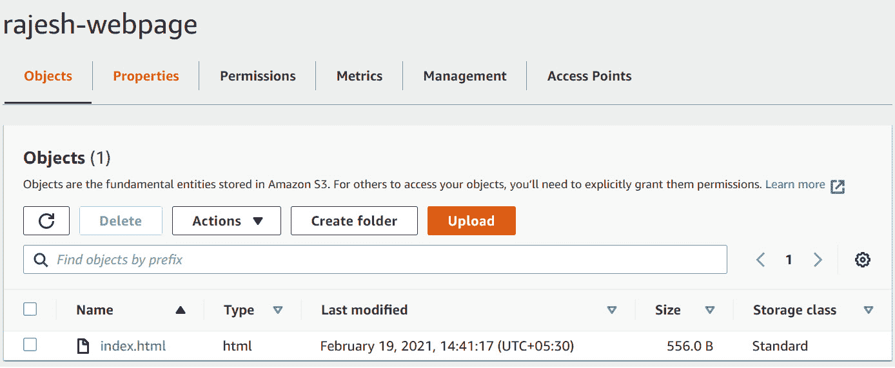

    图 5.11 – 上传成功

1.  点击**权限**标签。

1.  你会注意到**阻止公共访问**已经被禁用，且处于**关闭**状态。

1.  向下滚动，直到看到**存储桶策略**，然后点击**编辑**。

1.  添加以下策略，将占位符`Your-Bucket-Name`中的值替换为你的 S3 存储桶名称：

    ```
    {
      "Id": "Policy1613735718314",
      "Version": "2012-10-17",
      "Statement": [
        {
          "Sid": "Stmt1613735715412",
          "Action": [
            "s3:GetObject"
          ],
          "Effect": "Allow",
          "Resource": "arn:aws:s3:::Your-Bucket-Name/*",
          "Principal": "*"
        }
      ]
    }
    ```

1.  点击**保存更改**。如果你正确复制了策略，策略验证器不会抛出任何错误。

1.  然后你应该会收到确认消息，表明策略已经保存，更重要的是，你会注意到存储桶的内容现在可以公开访问，如下图所示：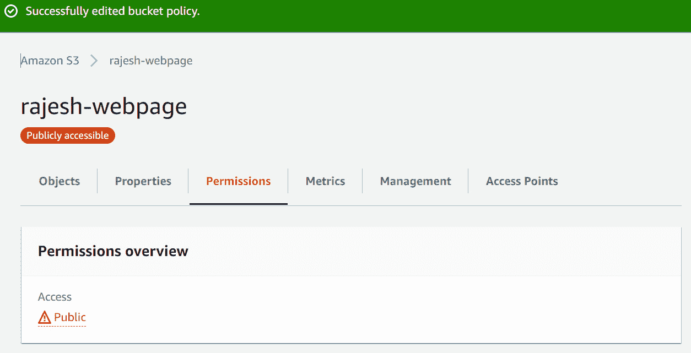

    图 5.12 – S3 存储桶权限标签

1.  接下来，再次点击**对象**标签。

1.  点击`index.html`文件，打开其**S3 属性**面板。

1.  右键点击对象的 URL，并在新浏览器标签页中打开它。

1.  你应该会发现该网页现在可以通过浏览器访问，如下图所示：


图 5.13 – 你的`index.html`页面在浏览器窗口中显示

到目前为止，我们已经禁用了该存储桶的公共访问阻止功能，因为我们最终会将其配置为静态网站托管。在本练习中，我们还上传了对象`index.html`，它是一个用 HTML 代码编写的食谱文档。

在下一个练习中，你将学习如何在存储桶上配置版本控制。版本控制将帮助你创建对象的历史副本，这样同一对象的新内容上传将作为该对象的新版本进行存储。这将使你能够防止意外更改对象，因为你可以恢复以前的版本，我们将在接下来的练习中看到这一点。

# 练习 5.3 – 启用存储桶的版本控制

在本练习中，我们将启用 Amazon S3 存储桶的版本控制。当您用更新版本替换现有对象时，您可以放心，如果需要恢复到旧版本，这些版本仍然会存在于您的存储桶中。显然，如果您尝试删除某个特定版本的对象，它将会从 S3 平台中被清除。然而，启用版本控制可以帮助防止意外删除和覆盖。请按照以下步骤操作：

1.  返回到 S3 控制台。

1.  点击*练习 5.1*中您之前创建的存储桶。

1.  点击**属性**标签。

1.  您将看到一个**编辑存储桶版本控制**选项来编辑状态。目前，版本控制将被设置为**禁用**。请注意，您可以暂停版本控制操作，但无法完全禁用它们。

1.  在**存储桶版本控制**部分点击**编辑**。

1.  选择**启用**。

1.  点击**保存更改**。

接下来，让我们测试版本控制功能，步骤如下：

1.  导航到您在计算机上保存的 `index.html` 网页的位置。使用记事本或 TextEdit（Mac 用户）打开该文件。

1.  将文档中现有的 `<H1>` 标签中的 `Blueberry` 替换为 `Chocolate`。

1.  保存文件时不要更改格式或扩展名。

1.  返回到您的 AWS 账户中的 Amazon S3 控制台，点击您之前创建的存储桶。

1.  点击**对象**，如以下截图所示：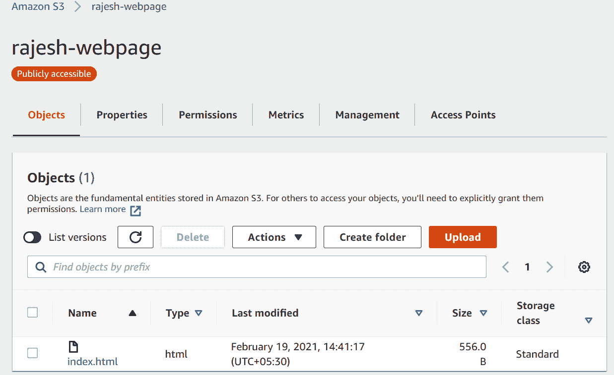

    图 5.14 – 您的 Amazon S3 存储桶中的对象列表

1.  点击**上传**。

1.  点击**添加文件**。

1.  选择刚才更新的相同`index.html` 文件并点击**上传**。

1.  点击**退出**。

1.  再次点击 `index.html` 文件，打开其**S3 属性**窗口。

1.  在**对象 URL**下，右键点击该 URL，并在新浏览器窗口中打开。

1.  您应该能看到网页已经更新，显示了**巧克力**这个词，如以下截图所示：

    图 5.15 – 展示食谱的 `index.html` 页面

1.  在 Amazon S3 管理控制台中，点击**版本**标签，如以下截图所示：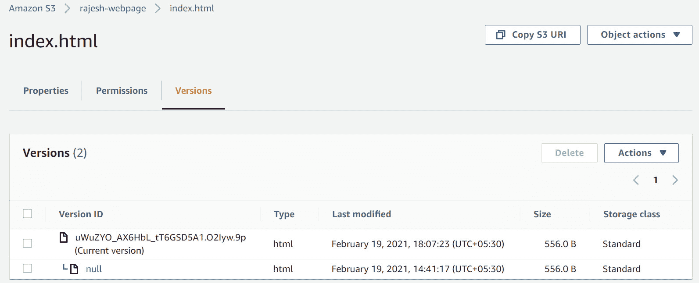

    图 5.16 – 存储桶版本标签

1.  请注意，有两个版本——原始版本，版本 ID 为`null`，以及一个较新的版本，`null`是因为它是在我们启用版本控制之前创建/上传到存储桶的。今后，所有对该文件的更新都将分配一个新的版本 ID，从而让您可以保留旧版本，以备日后需要时访问。

在本练习中，你学会了如何为桶配置版本控制。你能够上传并管理同一对象的多个版本，并发现未版本化的对象具有`null`版本 ID，而版本化的对象则具有由一系列独特字符组成的版本 ID。你还学会了如何在启用版本控制的桶中显示可用对象的版本列表。

# 练习 5.4 – 设置静态网站托管

在本练习中，我们将配置桶以托管静态网站。配置了静态网站托管服务后，桶将配置为网站端点，你可以将其分发给用户，用户随后可以使用标准的 HTML 协议访问所有页面（假设它们是有链接的）。

要配置你的桶以进行静态网站托管，至少需要两个文件——一个`index.html`文件和一个`error.html`文件。错误文件是一个 S3 静态网站托管服务在`index.html`文件出现问题时会重定向到的文件——例如，如果找不到`index.html`页面。你可以使用`error.html`文件来广播网站可能正在维护的信息。请按以下步骤操作：

1.  使用文本编辑器（如 Windows 上的记事本或 Mac 上的 TextEdit）创建一个新的 HTML 文件。然而，在此文件中，只需添加一行文本，例如`该站点正在维护`。

1.  将文件保存为`error.html`，如果你使用的是 Windows 机器，请确保将文件类型设置为**所有类型**。

1.  返回 S3 控制台并点击你的 S3 桶。

1.  点击**属性**，然后向下滚动页面，直到找到**静态网站托管**部分标题。

1.  点击**编辑**并选择**启用**选项。

1.  对于**托管类型**，选择**托管静态网站**。

1.  在`index.html`下。

1.  在`error.html`下。

1.  保持其他所有设置为默认值，并点击页面底部的**保存更改**。

1.  接下来，点击**对象**标签。

1.  点击**上传**并点击**添加文件**。

1.  选择`error.html`文件并点击**上传**。你应该会看到如下画面：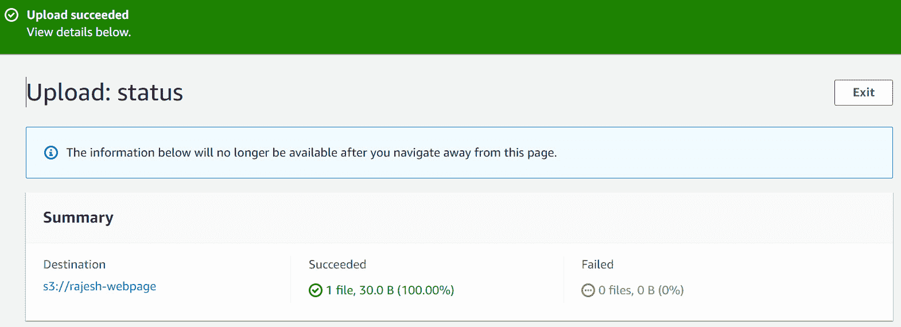

    图 5.17 – 将更新后的索引页面上传到你的桶

1.  点击**退出**。

1.  此时，你的桶已配置为静态网站托管。要进行测试，你需要通过 S3 网站 URL 端点访问你的网站。

1.  在 S3 控制台中，仍然查看桶的内容（在**对象**下），再次点击**属性**标签。

1.  向下滚动直到你找到**静态网站托管**部分，你会注意到网址已在**桶网站端点**标题下提供，如下截图所示：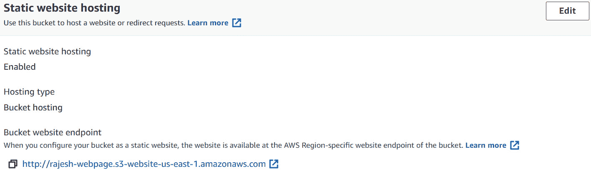

    图 5.18 – 在你的桶上启用静态网站托管

1.  在新浏览器窗口中导航到提供的 URL，你应该会看到该网站打开了带有配方网页的页面，如下图所示：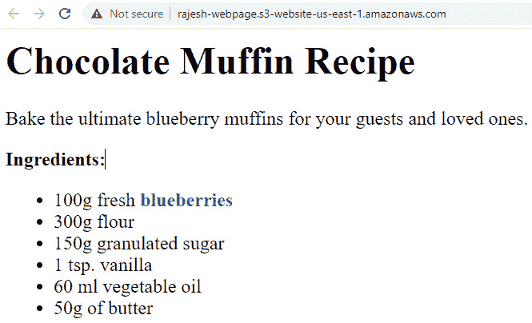

    图 5.19 – 更新的 index.html 页面，标题错误（巧克力）

1.  如你所见，这个配方是蓝莓松饼，但标题已更改为**巧克力**。假设这是更新中的错误，我们可以轻松地恢复到该网页的前一个版本，因为我们已经为存储桶启用了版本控制。

1.  返回到 Amazon S3 存储桶，查看存储桶中实际的内容，位于**对象**标签下，如下图所示：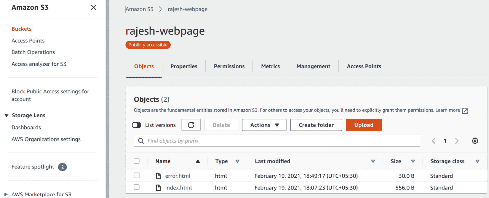

    图 5.20 – 存储桶中更新的对象列表

1.  请注意，**列表版本**切换按钮位于**对象**子标题下方。

1.  点击此切换开关，列出存储桶中所有对象的所有版本，如下图所示：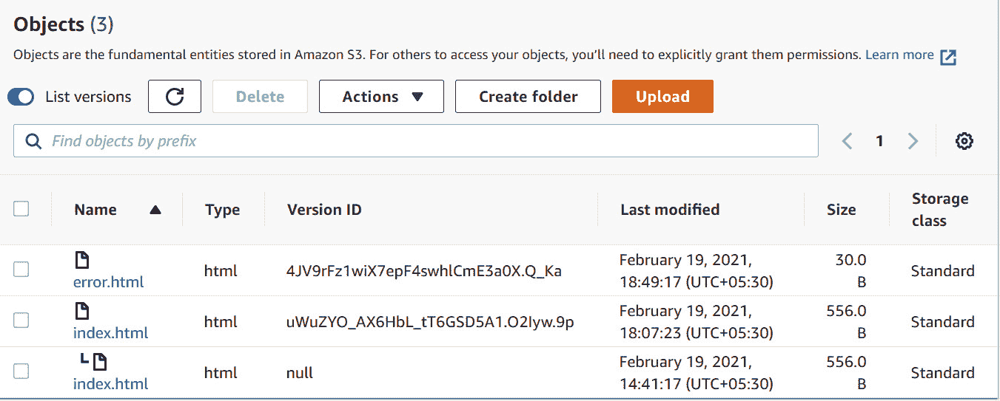

    图 5.21 – 对象及其各自版本的列表。

1.  如你所见，`index.html` 页面有两个版本。最新版本具有版本 ID，并包含错误的配方标题。

1.  点击复选框选择此版本，然后点击**删除**按钮。

1.  然后，你会被提示确认删除请求，需在提供的文本框中输入短语`permanently delete`，如下图所示：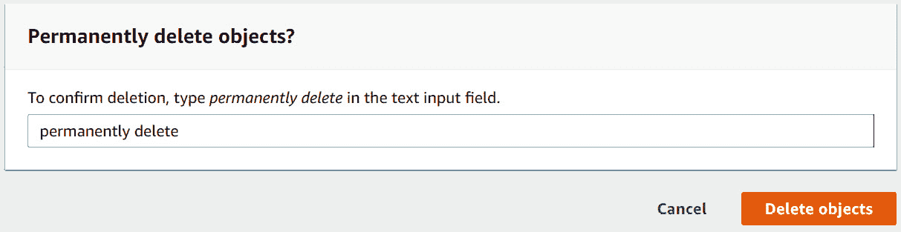

    图 5.22 – 删除错误版本的 index.html 页面

1.  接下来，点击**删除对象**。

1.  点击**退出**，你会注意到该版本现在已被删除。

1.  再次点击**属性**，然后向下滚动至**静态网站托管**部分。在新浏览器标签页中打开网站 URL，你应该会看到旧版正确的网页，如下图所示：

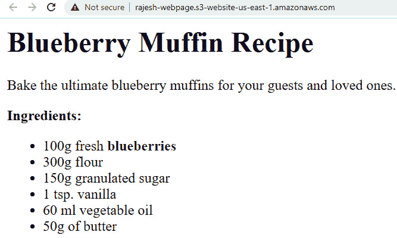

图 5.23 – 正确标题（蓝莓）的前一个配方页面

在本次练习中，你学习了如何为存储桶配置静态网站托管。你了解到，在本次实验中，我们在网页标题上犯了错误，但由于之前已启用版本控制，我们能够恢复到旧版本的同一文档。

# 总结

Amazon S3 是 AWS 的旗舰存储产品之一，提供无限存储容量，具有高度的可扩展性和耐用性。

在本章中，你学习了 Amazon S3 的核心功能，包括版本控制、生命周期管理和复制服务，以及 Amazon S3 如何满足广泛的使用场景。你还学习了如何在 Amazon S3 存储桶上构建并部署静态网站托管以及其在现实世界中的各种应用。

我们还讨论了 Amazon S3 提供的广泛安全工具，例如通过存储桶策略和 ACL 创建精细化访问权限的能力，以及数据传输中和静态数据的加密。你还学习了如何通过互联网、VPN 或 AWS Direct Connect 服务将本地工作负载连接到 Amazon S3 平台。

如果你打算将大量数据迁移到云端，可以使用 Amazon Snowball 服务帮助你传输大量数据，利用坚固且防篡改的设备，这些设备会送到你的本地位置。将数据复制完成后，你只需将设备送回 AWS，便可以将数据导入到 S3 环境中。

在下一章中，我们将讨论网络服务，重点介绍 **Amazon 虚拟私有云**（**VPC**）服务等。我们还将介绍 Amazon Direct Connect 服务以及如何使用 VPN 技术将本地网络与 AWS 云服务连接。

在下一部分，我们将查看一些复习问题，以测试你的知识。

# 问题

下面是一些问题来测试你的知识：

1.  以下哪项关于 Amazon S3 的说法是正确的？（选择 2 个答案）

    1.  Amazon S3 是基于对象的存储。

    1.  Amazon S3 是文件存储的一个例子。

    1.  Amazon S3 是块存储的一个例子。

    1.  Amazon S3 One Zone-IA 存储类别提供 99.5% 的可用性。Amazon S3 可配置为 Linux 基础的 EC2 实例的共享挂载卷。

1.  你希望在 S3 存储桶上强制执行一项策略，如果用户从公司和分支机构连接到数据，则允许匿名访问其内容，作为安全策略的一部分。哪项 S3 配置功能将使你能够定义允许访问数据的 IP 范围？

    1.  安全组

    1.  存储桶策略

    1.  NTFS 权限

    1.  **网络访问控制列表**（**NACLs**）

1.  如果你需要托管静态网站内容以迎接即将到来的产品发布，哪项 AWS 服务是最具成本效益的？

    1.  Amazon EC2

    1.  Amazon EFS

    1.  Amazon S3

    1.  Azure ExpressRoute

1.  哪个 Amazon S3 存储类别使你能够通过自动将数据移动到最具成本效益的访问层来优化成本，同时确保频繁访问的数据能立即可用？

    1.  Amazon S3 标准

    1.  Amazon S3 One-Zone IA

    1.  Amazon Snowball

    1.  Amazon S3 智能分层

1.  哪项 Amazon S3 服务可以配置为在设定的天数后自动将数据从一个存储类别迁移到另一个存储类别，以减少成本，尤其是在某些数据子集可能不需要频繁即时访问的情况下？

    1.  静态网站托管

    1.  生命周期管理

    1.  存储转换

    1.  S3 迁移

1.  从 Amazon Glacier 中检索数据时，标准检索选项使档案可供下载的典型时间是多久？

    1.  20 分钟

    1.  24 小时

    1.  3 到 5 小时

    1.  90 秒

1.  Amazon S3 平台的哪个功能允许您通过 Amazon 边缘位置从任何位置上传内容到一个集中式存储桶，确保更快的传输速度并避免公共互联网拥堵？

    1.  Amazon S3TA

    1.  AWS S3 存储网关

    1.  Amazon VPC

    1.  CloudFront

1.  您的本地应用程序需要访问集中管理的云存储服务。运行在您服务器上的应用程序需要能够通过标准的基于 NFS 的访问和本地缓存，将文件作为持久对象存储和检索到 Amazon S3。哪项 AWS 服务可以帮助您交付满足上述需求的解决方案？

    1.  AWS 存储网关 — Amazon S3 文件网关

    1.  AWS EFS

    1.  Amazon Redshift

    1.  EBS 卷

1.  您正在寻找将本地数据迁移到云端的方式。作为一次性数据迁移工作的一部分，您需要在几周内将超过 900 TB 的数据传输到 Amazon S3。哪种方式是将如此大量数据迁移到云端最具成本效益的策略？

    1.  使用 Amazon RDS 服务

    1.  使用 Amazon Snowball 服务

    1.  使用 Amazon VPN 连接您的本地网络与 AWS

    1.  使用 AWS Rain
