# *第六章*：AWS 网络服务 – VPC、Route53 和 CloudFront

网络是任何 IT 基础设施的核心组成部分，无论是在本地还是在云中。没有网络，我们今天所生活的复杂通信世界是不可能构建的。在没有网络的情况下，现代世界将没有互联网。

今天，几乎每个企业都需要某种形式的网络连接，以便与合作伙伴和最终客户进行协作。在本章中，我们将了解设计网络的一些核心构建模块。我们还将探讨 AWS 提供的网络服务，特别是 **虚拟私有云** (**VPC**) 如何帮助客户在其 AWS 账户内构建多个独立且安全的网络，从而使他们能够隔离工作负载和应用程序。

我们将探讨 AWS Route53，这是 Amazon 的 **域名系统** (**DNS**)，它使得跨 AWS 生态系统和更广泛互联网的网络流量路由成为可能。最后，我们将看看 Amazon CloudFront，它是一个 **内容分发网络** (**CDN**)，旨在帮助客户更有效且低延迟地将内容分发给他们的客户。

本章讨论的主要内容如下：

+   本地网络介绍

+   IP 地址、端口号、子网掩码和 CIDR 的基础知识

+   Amazon **VPC** 介绍

+   Amazon Route53 的 DNS 基础知识和全球路由

+   使用 Amazon CloudFront 实现强大的 CDN

+   API Gateway 介绍

# 技术要求

要完成本章内容，您需要访问您的 AWS 账户。您将需要在 AWS 账户中创建一个简单的 VPC，并且需要使用我们在*第四章*中创建的 IAM 用户账户 `Alice` 登录 AWS 账户，*身份与访问管理*。请记住，要使用 IAM 用户账户登录，您需要提供您的 AWS 账户 ID 或账户别名。

# 本地网络介绍

几乎每个企业都会有某种形式的本地网络。即使您是一个自雇的“独立工作者”，您也很可能有一个家庭办公室，且办公室也拥有一个私有网络环境。您的家庭办公室可能类似于以下图示：

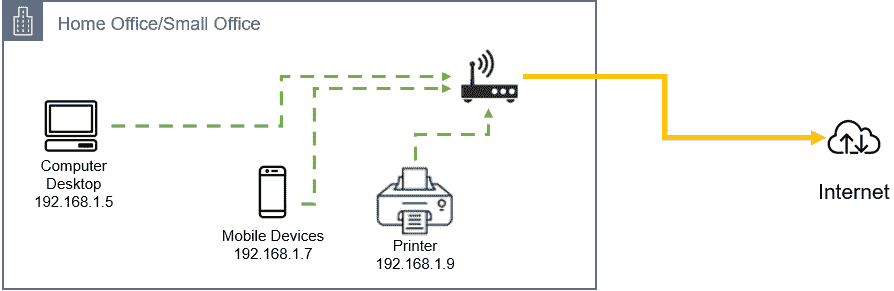

图 6.1 – 家庭网络组件

在前面的示意图中，家庭网络中的设备通过 Wi-Fi 连接相互通信。如果你从计算机桌面向打印机发送打印请求，那么你的文档将会被打印出来。这种通信得以实现，是通过在 Wi-Fi 网络上建立的连接。为了使设备能够相互通信，它们每个都需要一个唯一的 IP 地址。如果 IP 地址元素正确定义，网络中的每个设备将能够看到其他设备。Wi-Fi 服务还通过与互联网服务提供商建立连接的路由器/调制解调器设备，将设备连接到互联网。此连接通常通过某种形式的物理电缆或通过电信提供商的移动网络连接来实现。

## 基本企业网络

公司通常会拥有自己的企业网络，你可能曾在一个配备有 IT 网络基础设施的办公环境中工作过。企业网络需要更为谨慎的规划，因为许多网络也允许外部访问应用程序。例如，您的企业可能会在企业网络内部发布一个网站，以便通过互联网向潜在客户展示其产品和服务。使用防火墙路由器，只允许特定类型的流量从互联网进入网络并被引导到适当的服务器，是与外界连接的安全规划的一部分。

企业网络通常会被划分为多个较小的网络，每个网络都有特定的用途。在其最基本的层面上，企业网络通常包括两个子网络：一个用于内部后台目的，另一个用于放置可以通过互联网访问的服务。

在下图中，企业网络被划分为两个独立的网络：一个叫做内部网络，另一个叫做**非军事区**（**DMZ**）。DMZ 是一个可以在互联网上暴露服务的区域，例如，Web 服务器。访问部署在该区域的服务的流量受到严格的入站规则限制，以确保高安全性。

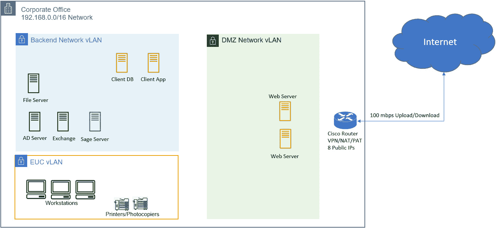

图 6.2 – 基本办公网络

如前面的图示所示，企业网络被划分为三个独立的子网。这确保我们能够配置规则，定义哪些类型的流量可以进入每个子网，以及来自哪些来源。例如，我们可以配置从互联网到我们的 Web 服务器的入站规则，允许 HTTP/HTTPS 流量。这将使公众能够访问我们的企业网站并查看我们的服务。另一方面，我们不会允许互联网直接进入**终端用户计算**（**EUC**）**虚拟局域网**（**VLAN**），因为没有此类入站连接的需求，并且这有助于保证我们的企业网络安全。然而，我们会允许工作站到互联网的流量，以便员工可以访问在线服务和工具。

同样，在 AWS 上构建解决方案时，我们需要配置云中的虚拟网络，以便以一种提供安全性、隔离性，并且仅在需要时才允许入站访问的方式托管我们的应用程序。然而，在深入研究如何构建云网络的细节之前，了解网络中设备如何互相通信，以及如何创建网络和子网是非常重要的。

在接下来的部分，我们将回顾一些 IP 地址的基础知识，这将帮助我们理解如何构建这样的网络。

# IP 地址和 CIDR 基础知识

为了让网络中的设备互相通信，必须有一个**互联网协议地址**（**IP 地址**）。每个网络设备，无论是计算机、笔记本、手机、打印机还是网络路由器，都需要分配一个在每个网络中可路由的 IP 地址。

此外，每个设备的 IP 地址必须是唯一的——不能有多个设备使用相同的 IP 地址。这就像电话一样。每部电话都有一个唯一的号码。要拨打某个电话，首先需要知道对方的电话号码，然后拨打这个号码，最终完成通话。在*图 6.1*中，你会注意到家用网络中的每个内部设备都有一个 IP 地址。

有两种类型的 IP 地址：IPv4 和 IPv6。我们将讨论它们之间的主要区别。

## IP 地址版本 4 – IPv4

IPv4 是第一种广泛部署的 IP 地址系统版本，最终构成了互联网的基础设施。

你熟悉的标准 IPv4 地址格式，如前面的图所示，遵循四个十进制数字以点分隔的结构。例如，`192.168.1.6`就是一个例子。IP 地址中的每个十进制表示称为`0`到`255`，基数为`10`（十进制）。正如你可能知道的，计算机使用的是二进制数字，而非十进制数字。每个十进制数字转换为二进制后，包含 8 个位，一和零。在无论是十进制还是二进制的情况下，IPv4 地址的长度为 32 位。

以`192.168.1.6`的 IP 地址为例。在二进制中，每个八位字节（octet）将由 8 个零和 8 个一组成（`00000000`到`11111111`）。IP 地址中的各个十进制数字可以转换为其等效的二进制表示，这些表示将由每个 8 位字节中的一和零的组合构成。在下图中，IP 地址`192.168.1.6`的十进制表示与其二进制表示`11000000.10101000.00000001.00000110`是相同的：

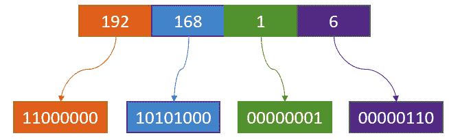

图 6.3 – IP 地址到二进制的转换

虽然理解这种转换过程并不是通过云计算基础认证考试的必要要求，但我想在这里简要概述一下，以进一步帮助你构建网络知识。

将十进制表示转换为二进制时，需要记住每个 8 位字节中各个位的位值。如果你不想单纯记住它们，也可以通过计算位值来得到它们。

以 IP 地址`192.168.1.6`中的最后一个八位字节为例，在这种情况下，它是十进制数字 6。

在二进制中，你有 8 个零和一位来表示这个十进制数字。在下表中，我们可以看到这些位及其位值：

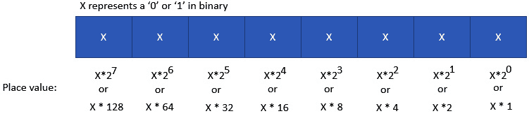

图 6.4 – IP 地址位值

对于每个八位字节，从右到左，以下内容适用：

+   第一个位的值总是等于`1`。它是`2`的 0 次方（*2⁰*），即`1`。

+   第二个位是第一个位的两倍，等于`2`（*2 的 1 次方*——即`2`）。

+   第三个个位是第二个位的两倍，等于`4`（*2 的 2 次方*——即`4`）。

+   第四个位是第三个位的两倍，等于`8`（*2 的 3 次方*——即`8`），依此类推。

计算二进制表示的十进制值的方法如下：

十进制 = *(X*128) + (X*64) + (X*32) + (X*16) + (X*8) + (X*4) + (X*2) + (X*1)*

接下来，将 IP 地址`192.168.1.6`中的十进制数字*6*转换为二进制时，需要确定哪些“X”应转换为零，哪些应转换为一。你需要将最少的位转换为一，以获得你的十进制表示，并且你应当继续转换那些值小于十进制数的位为一。例如，如*图 6.5 所示，我们有以下内容*：

+   你不会将最左边的位转换为 *1*，因为 128 大于我们 IP 地址中的最后一个八位字节 *6*。同样，你也不会将从最左边数的下一位转换为 *1*，因为 64 也大于最后一个八位字节，依此类推。

+   你需要将最右边的第三位转换为 *1*，因为它的占位符值等于 *4*，小于我们 IP 地址中的 *6*。

+   你还需要将最右边的第二位转换为 *1*，因为它的占位符值等于 *2*，同样小于我们 IP 地址中的 *6*。

+   请记住，你希望将尽可能少的位转换为 *1* 以获得十进制表示。所以，在这种情况下，*4* 加 *2* 等于我们的 IP 地址中的最后一个八位字节 *6*。因此，我们不应将最后一位转换为 *1*，因为这样总和会变成 *7*，超过了 *6*。

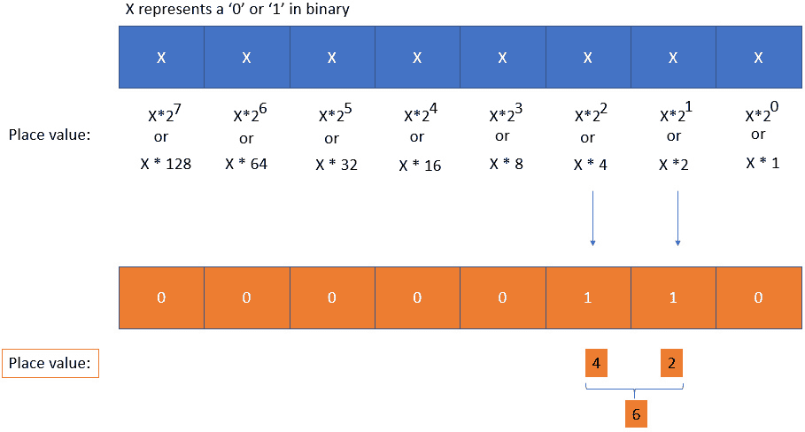

图 6.5 – 将 IP 地址转换为其等效的二进制表示

因此，*6* 的二进制表示为 `00000110`。类似地，将 IP 地址 `192.168.1.6` 转换为二进制会得到 `11000000.10101000.00000001.00000110`。

## IPv4 地址的局限性

IPv4 地址的主要局限之一是它只有 32 位长。这意味着你在 IPv4 地址方案中能够拥有的最大地址数量是 *2³²*，即 4,294,967,294 个地址。四十亿个地址看似一个大数字，但事实上，我们已经耗尽了这个范围，因为现在需要 IP 地址的设备数量巨大，足以让任何给定网络参与者都需要一个 IP 地址。

当前，地球上最大的网络是互联网。每个需要在互联网中通信的设备都需要一个 IP 地址。此外，给定网络中的每个设备必须具有唯一的 IP 地址。你不能在同一网络中有两个设备使用相同的 IP 地址，因为这将导致冲突。由于四十亿个地址不足以应对大量设备，**互联网分配号码管理局**（**IANA**）制定了一个聪明的计划，只为私人使用分配一段 IP 地址。这些地址范围在互联网中不可路由，这意味着企业（和家庭）可以使用这些地址配置他们的内部私有网络，而不会与其他企业的网络发生冲突，特别是当这些企业不打算将它们的网络连接起来时。

以下 IP 地址范围是专为私人使用设计的：

+   `10.0.0.0/8` IP 地址范围：`10.0.0.0 – 10.255.255.255`

+   `172.16.0.0/12` IP 地址范围：`172.16.0.0 – 172.31.255.255`

+   `192.168.0.0/16` IP 地址范围：`192.168.0.0 – 192.168.255.255`

    附加说明

    另一个私有 IP 地址范围是`169.254.0.0`到`169.254.255.255`，但这些地址仅供**自动私有 IP 地址分配**（**APIPA**）使用，专为内部 Microsoft 网络设计。

剩余的地址被视为公共地址，因此可以在全球互联网中路由。为了说明这一点，让我们看一下下一个图示：

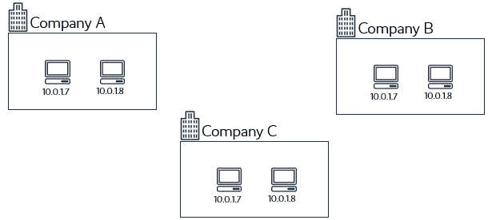

图 6.6 – 企业使用的私有 IP 地址范围

在前面的图示中，你会注意到这三家公司能够为其内部设备使用相同的 IP 地址。由于这些公司彼此之间并没有连接，因此不会出现 IP 地址冲突的可能性。像 IANA 指定的这些私有 IP 地址帮助企业在不需要采购任何公共地址的情况下，构建了内部网络。私有 IP 地址空间还增强了内部网络的安全性，因为这些地址在互联网中不可路由。我们还可以让更多的设备接入网络，因为这些地址范围可以在不需要彼此连接的公司之间重复使用。

## 企业需要互联网访问

在前面的插图中，我们可以看到，企业可以定义那些在互联网上不可路由的内部网络 IP 地址范围。这些企业仍然需要访问互联网，无论是为了从客户那里发送和接收电子邮件，还是托管他们的客户需要从互联网访问的电子商务应用程序。为了促进互联网连接，需要公共 IP 地址。然而，若每个设备都要分配一个公共 IP 地址，将会破坏私有 IP 地址范围的目的，并带来安全风险。相反，内部网络可以通过一种叫做**网络地址转换**（**NAT**）的服务来访问互联网。

在下面的图示中，我们可以看到，企业现在能够通过配置在其外部路由器上的 NAT 服务来访问互联网。NAT 服务至少需要一个公共 IP 地址，并将来自内部设备的请求转发到互联网，充当中间的代理。对这些请求的回复也由 NAT 服务处理，确保它们正确地重定向到发起原始请求的内部设备。

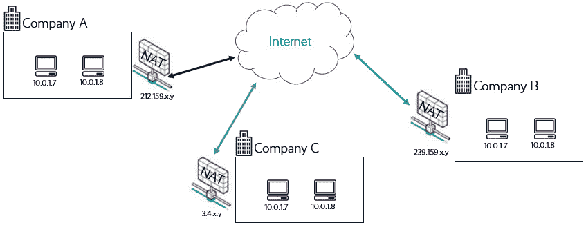

图 6.7 – 企业通过 NAT 服务使用的私有 IP 地址范围

鉴于 IPv4 的限制，IPv6 是由**互联网工程任务组**（**IETF**）在 1990 年代开发的。接下来我们将讨论 IPv6，并探讨它是如何克服 IPv4 的 32 位地址限制的。

## 那么 IPv6 呢？

为了克服 IPv4 的限制，IETF 开发了 IPv6。IPv6 使用 128 位地址，可以提供 *2¹²⁸* 个地址。IPv6 也使用十六进制格式表示，而非标准的十进制格式。在 IPv6 中，从技术上讲，每个设备都可以拥有自己的公共 IP 地址。事实上，**Amazon Web Services**（**AWS**）提供了 IPv6 作为设置云网络的选项。即使你需要保护设备不受公共互联网的访问，你仍然可以为云中的虚拟服务器分配一个 IPv6 地址，并通过出口仅限网关允许它通过互联网发送流量。

然而，许多公司仍然使用 IPv4，部分原因是 NAT 服务的能力，部分原因是为了确保与可能不支持 IPv6 的旧设备的兼容性。

## 网络大小和类别

最初，IETF 设计了不同类别的 IPv4 地址，以帮助定义不同的网络大小和使用场景。

A 类到 C 类代表了一般的单播 IP 地址（有少数例外），公众可以用来构建不同规模的网络。D 类包含组播地址，E 类则被保留用于实验用途。

这些类别帮助定义网络大小的方式是将 IP 地址分为网络部分和主机部分。我们按类别逐一来看：

+   `1`（二进制中的一）和主机位由 `0`（零）表示。此外，A 类地址的最左边位被设置为 `0`。

+   `10`。

+   `11`。

为了更好地说明这三种网络类别的实际样子，让我们来看下一个示意图：

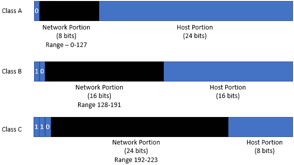

图 6.8 – IP 地址类别

在上面的示意图中，你可以识别出某个特定 IP 地址属于哪个类别，并能即时识别该 IP 块所能容纳的潜在主机 IP 地址数量。例如，如果我们取 IP 地址 `192.168.1.6`，我们可以确认它是一个 C 类地址。

这意味着该 IP 地址的网络部分是 `192.168.1.x`。在这个例子中，x 可以是 1 到 254 之间的任何数字。这为你提供了 IP 块中主机部分的 254 个 IP 地址。尽管你在任何一个八位字节中的总 IP 地址数量是 256（2⁸，等于 256），但需要记住的是，第一个和最后一个 IP 地址是不可用的。第一个 IP 地址总是被称为网络 ID，在本例中是 `192.168.1.00000000`。最后一个 IP 地址是 `192.168.1.11111111`。

计算一个 IP 块中可用 IP 地址数量的简单公式如下：

*可用 IP 地址数量 = 2^主机位数 - 2*

在之前的例子中，我们有一个 IP 地址 `192.168.1.6`，它属于一个只能包含 254 个可用 IP 地址的 IP 块。

到目前为止，你已经相信我们的说法，即 IP 地址`192.168.1.6`属于 C 类网络，并且在`192.168.1.x`这个 IP 地址块中共有 254 个 IP 地址。接下来我们将讨论子网掩码，看看它是如何工作的。

## 什么是子网掩码？

子网掩码允许你将 IP 地址块划分为网络部分和主机部分。同一网络部分的主机设备可以轻松相互通信，而要与其他网络中的主机通信，则需要某种形式的路由。

在前述的 C 类网络中，前三个八位字节属于网络部分，只有最后一个八位字节（最后 8 位）属于主机部分。

子网是一个 32 位数字，通过将主机位全部设置为零，并将网络位全部设置为一来创建。然后与相应的 IP 地址块进行逻辑`AND`运算，以定义每个块中可用的主机 IP 地址数量。

例如，我们可以检查 IP 地址`192.168.1.6`是否属于 C 类地址，因为 C 类网络掩码的前三个八位字节（前 24 位二进制数）作为网络部分，最后一个八位字节（最后 8 位）作为主机部分。

在二进制中，IP 地址`192.168.1.6`及其相关子网掩码表示如下：

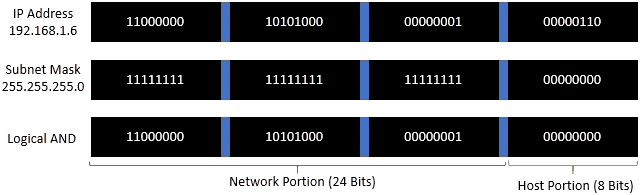

图 6.9 – 192.168.1.6 的 IP 地址和子网掩码转换

逻辑`AND`运算的计算过程如下：

+   `0`与`0`的结果是`0`。

+   `0`与`1`的结果是`0`。

+   `1`与`0`的结果是`0`。

+   `1`与`1`的结果是`1`。

基于前述逻辑`AND`运算的结果，你会注意到如果 IP 地址的前三个八位字节发生变化，例如，如果将`192`改为`193`，那么对应的逻辑`AND`运算结果也会不同。由于前三个八位字节代表 IP 地址的网络部分，因此这种变化实际上表示了不同的网络。

此外，由于子网掩码中的主机部分全部设为零，仅由最后一个八位字节（最后 8 位）表示，因此该八位字节的任何变化都将使 IP 地址保持在同一网络内。

例如，我们来看看 IP 地址`192.168.1.12`。在下图中，执行与子网掩码的逻辑`AND`运算后，结果如下：

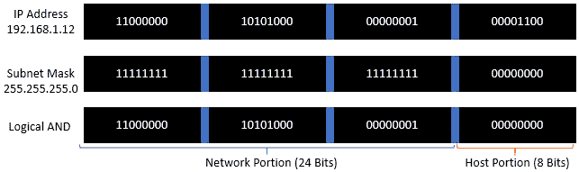

图 6.10 – 192.168.1.12 的 IP 地址和子网掩码转换

从前面的两个图中，你会注意到逻辑`AND`运算结果产生了相同的二进制数字模式，表示以下情况：

+   这两个 IP 地址属于同一网络。

+   在这两种情况下，网络部分相同，都是由子网掩码`255.255.255.0`（或`11111111 11111111 11111111 00000000`）得出的。

现在我们知道子网掩码是如何用于*掩蔽*IP 地址中的网络部分和主机部分的，接下来我们来探讨子网划分的概念。

## 什么是子网划分？

在前面关于子网掩码的讨论中，我们定义了三种网络类型。这些网络是通过使用具有固定长度的子网掩码来创建的。例如，在一个 A 类网络中，IP 块的第一个八位字节代表网络部分，其余三个八位字节代表主机部分。

这通过使用我们所称之为的子网掩码得以实现。具体来说，我们使用子网掩码 `255.0.0.0` 来将第一个八位字节划分为网络部分。任何更改使用子网掩码 `255.0.0.0` 的 IP 地址的第一个八位字节，都将得到一个不同的网络。例如，`10.0.0.0` 与 `31.0.0.0` 是两个不同的网络。

子网划分是你可以在一个较大的网络内创建子网络的过程。在每个网络中，你可能需要创建较小的、隔离的网络部分，比如一个部分用于托管所有后端服务器，另一个部分用于托管前端 Web 服务器。子网划分使我们能够将一个大网络分解成这些较小的子网。

创建子网的过程涉及从 IP 地址范围的主机部分*借用*额外的位。这些借用的位用于在一个较大的主网络中创建较小的子网络。

例如，如果我们有一个商业需求，需要八个子网，每个子网能够容纳 30 个设备的 30 个 IP 地址，那么使用标准的 C 类地址，我们可以使用以下 IP 块：

+   网络 1 – `192.168.1.0`（子网掩码：`255.255.255.0`）

+   网络 2 – `192.168.2.0`（子网掩码：`255.255.255.0`）

+   网络 3 – `192.168.3.0`（子网掩码：`255.255.255.0`）

+   网络 4 – `192.168.4.0`（子网掩码：`255.255.255.0`）

+   网络 5 – `192.168.5.0`（子网掩码：`255.255.255.0`）

+   网络 6 – `192.168.6.0`（子网掩码：`255.255.255.0`）

+   网络 7 – `192.168.7.0`（子网掩码：`255.255.255.0`）

+   网络 8 – `192.168.8.0`（子网掩码：`255.255.255.0`）

虽然这种网络设计工作得非常完美，但在可用 IP 地址数量与实际需求之间存在很多浪费。每个网络都有 254 个可用的 IP 地址，但根据需求，我们每个网络只需要 30 个地址。

当使用私有 IP 地址范围时，这可能不会太重要，但当我们考虑将相同的方法应用于有限的公共 IP 地址范围时，这就变得不可能实现了。此外，请注意，通常情况下，你需要为公共 IP 地址付费。

与此方法不同，我们可以使用子网划分和子网掩码将一个单一网络划分为多个较小的网络，从而节省并高效使用给定网络内可用的 IP 地址空间。

例如，我们可以取 `192.168.1.0` 的类 C 网络，并使用子网掩码 `255.255.255.0`，将其分割为更小的子网。为了做到这一点，我们从 IP 地址块的主机部分借用额外的位来表示我们的子网。

让我们看一下下一个图示来说明这个概念：

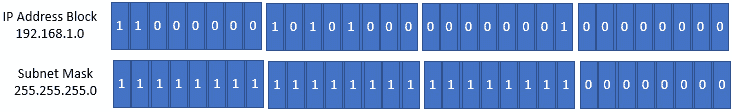

图 6.11 – IP 类 C 网络

在一个标准的类 C 网络中，前面的 IP 地址块 `192.168.1.0` 和子网掩码 `255.255.255.0` 将产生一个包含 254 个 IP 地址的单一网络。

这是因为我们已经使用了前三个八位字节（24 位）来表示网络部分，而最后一个八位字节（8 位）来表示主机部分。

因为我们有 8 个位来表示主机位，我们可以使用公式 2⁸，结果是 256。但请记住，首尾两个 IP 地址不可用，所以是 256-2，这给我们带来了 254 个可用的 IP 地址。

现在，如果我们从 IP 地址块的主机部分借用前 3 个位来构建子网，我们将得到以下表示：

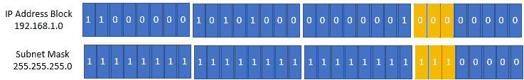

图 6.12 – 通过借用 IP 地址主机部分的位来创建子网

通过从第四个八位字节（主机部分）的最左边借用 3 位，我们可以有效地创建八个子网网络。这可以通过以下公式推导出来：

*子网数量 = 2^借用的主机位数*

在这种情况下，*2³ = 8*，因此，这为我们提供了 8 个子网。此外，由于我们现在只剩下 5 个位来表示主机部分，我们可以计算出每个子网中拥有的 IP 地址数量。公式是 *主机数量 = 2^剩余主机位数*。在这种情况下，它是 *2⁵*（因为剩下 5 个位）= 32 个 IP 地址。此外，正如之前讨论的，首尾两个 IP 地址不可用，因此我们从 IP 地址数中减去 2（32-2），得到所需的 30 个 IP 地址。

如果我们查看借用的 3 个位的子网掩码表示，我们将得到如下的新子网掩码：

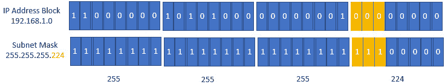

图 6.13 – 创建子网并得到新的子网掩码

使用子网掩码`255.255.255.224`，我们可以看到可以创建八个独立的子网。

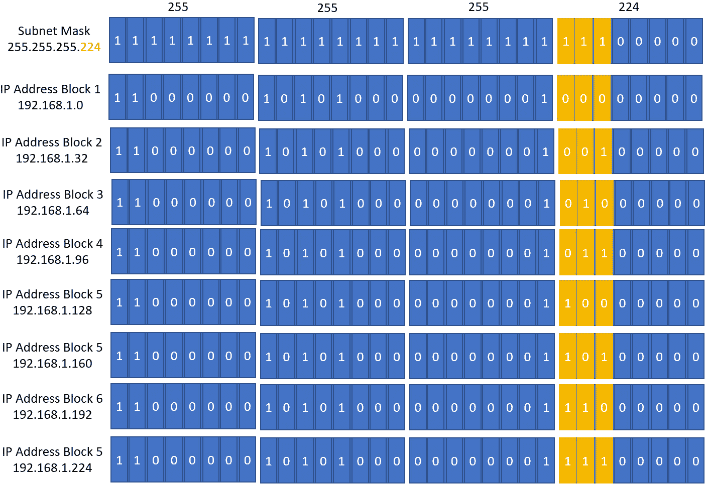

图 6.14 – 创建八个子网

你会注意到在以二进制显示的 IP 块中，模式有所不同。具体来说，借用位中的 *1* 和 *0* 的不同组合定义了八个不同的网络。以下 IP 地址块是通过从 IP 地址块 `192.168.1.0` 的主机部分借用 3 位所能创建的八个子网。每个子网有 30 个可用的 IP 地址。以下是这八个网络：

+   `192.168.1.0 (192.168.1.0 到 192.168.1.31)`

+   `192.168.1.32 (192.168.1.32 到 192.168.1.63)`

+   `192.168.1.64 (192.168.1.64 到 192.168.1.95)`

+   `192.168.1.96 (192.168.1.96 到 192.168.1.127)`

+   `192.168.1.128 (192.168.1.128 到 192.168.1.159)`

+   `192.168.1.160 (192.168.1.160 到 192.168.1.191)`

+   `192.168.1.192 (192.168.1.192 到 192.168.1.223)`

+   `192.168.1.224 (192.168.1.224 到 192.168.1.255)`

通过子网掩码，你可以识别出某个特定 IP 地址块属于哪个网络。例如，IP 地址 `192.168.1.130` 会属于 IP 块 `192.168.1.128`，其子网掩码为 `255.255.255.224`。当我们查看二进制表示并执行逻辑 `AND` 操作时，这一点更加清晰，如下图所示。你可以看到，逻辑 `AND` 操作的结果与 IP 地址块 5 匹配：

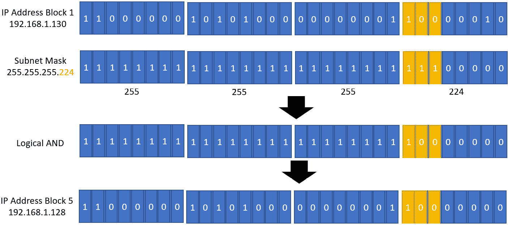

图 6.15 – 说明 IP 地址如何落在给定子网范围内

这种二进制表示和逻辑 `AND` 操作展示了 IP 地址块 5 如何与 IP 地址块 1 在同一网络中，如黄色单元格所示。

## 无类别域间路由（CIDR）

与之前讨论的子网掩码和复杂性不同，我们可以使用 CIDR。通过 CIDR，你可以像使用子网掩码一样创建不同大小的网络。CIDR 本质上是表示子网掩码的另一种方式，但它提供了更多的灵活性。网络的大小将决定你在该网络中能拥有多少个 IP 地址。你还可以通过使用 CIDR 块配置 IP 地址块的特定子集，将网络划分为多个较小的网络（子网）。

在定义网络时，CIDR 块作为 IP 地址块的一部分显示，后面跟一个斜杠（/）以及一个介于 `/8` 和 `/32` 之间的十进制数。例如，IP 地址 `192.168.1.6` 可能属于一个网络 `192.168.1.0/24`。我们来看一下这个是如何运作的。

在一个 CIDR 块为 `/24` 的网络中，我们可以计算出该网络可以容纳的 IP 地址数量，从而确定可以放置在该网络中的设备数量。由于 IPv4 范围中的总位数是 32 位，因此对于 `/24` 的 CIDR，只需从 32 中减去 24，得到 8 位。这 8 位代表了我们在该网络中可以拥有的 IP 地址总数。具体地，*2⁸* 等于 256。因此，`192.168.1.0/24` 网络中的 IP 地址总数是 256 个。请记住，在任何给定的网络中，第一个和最后一个 IP 地址是不可用的。因此，有效的 IP 地址总数是 256 - 2，即 254。

这里需要注意的一个重要点是，CIDR 块为 `192.168.1.0/24` 的 IP 网络是一个单一的网络，在该网络中，你可以最多容纳 254 个设备，每个设备都需要一个 IP 地址。IP 地址范围从 `192.168.1.1` 到 `192.168.1.254`（请记住，第一和最后的 IP 地址 `192.168.1.0` 和 `192.168.1.255` 是不可用的）。

让我们看一个其他的例子。我们将使用 `10.0.0.0` 到 `10.0.255.255` 的 IP 范围，这个范围是用于我们内部网络的私有范围。假设你选择了一个 CIDR 块为 `10.0.0.0/16` 的网络。在这个网络中，CIDR 块是 `/16`。在这个网络中，你可以拥有总共 65,536 个 IP 地址。记住，要计算 IP 地址的数量，你必须从 CIDR 块标记中减去 32 的值，在本例中是 16。这给你剩下 16 位可以供网络中的设备使用。*2¹⁶* 等于 65,536 个 IP 地址。记得再从总 IP 地址数中减去 2，得到的有效 IP 地址总数是 65,534。这个网络非常大，你可能希望将这个较大的网络划分为多个子网络（subnets），以便进行资源隔离和分离。使用相同的网络 IP 块，你可以通过增加 CIDR 块的值来创建子网络。例如，在 `10.0.0.0/16` 的主网络中，你可以使用 `/20` 的 CIDR 块创建多个子网络。这意味着你为 IP 地址块中的主机部分保留了 12 位（32 位 - 20 位用于网络）。

因此，在 `10.0.0.0/16` 网络中，你可以拥有 CIDR 块为 `10.0.0.0/20` 的子网络。每个子网络将有总共 4,096 个 IP 地址（剩余 *2¹²* 主机位），或者 4,094 个有效 IP 地址（减去不可用的 2 个 IP）。

到目前为止，我们已经讨论了 IP 地址的配置方式，以及它们如何以二进制和十进制表示。

我们还讨论了如何使用 CIDR 块创建一个大型网络，随后将其拆分为多个较小的网络。

在下一节中，我们将开始了解 VPC，它们是您可以在 AWS 上构建的虚拟网络，类似于您在本地定义网络的方式。许多服务需要在 VPC 内启动资源。VPC 还通过防火墙技术帮助保护您的资源，我们将在本章中讨论这些技术。

# 虚拟私有云（VPC）

VPC 是云中的虚拟网络。您可以选择创建 VPC 的区域，并定义其网络参数，如 IP 地址范围和其中的子网，以实现资源隔离。

部署在 VPC 中的资源可以访问互联网服务，或者可以授予来自互联网的入站访问权限，例如，如果您托管的是一个电子商务 Web 服务器。

AWS 已经为您在每个区域提供了一个默认的 VPC。这些默认的 VPC 旨在帮助您快速启动并能够部署 EC2 实例，使其能够访问互联网，并在必要时，配置为允许来自互联网的直接入站访问。

您还可以根据业务需求配置自定义 VPC。在配置新的 VPC 时，您需要从私有 IP 范围中定义一个 IP 地址块。您的 VPC 将覆盖您部署它的整个区域。这意味着您可以在 VPC 内的不同可用区放置工作负载，以设计高可用性。

## 关于子网的所有内容

根据您的需求，您可以配置非默认的 VPC，以支持多个子网（subnets）。

子网是 VPC 的一个子集，这在子网的 IP 地址块中定义。例如，如果您的 VPC 的 IP 地址块是 `10.0.0.0/16`，公共 `Subnet-1` 可以配置为 `10.0.1.0/24` 的网络 IP 地址 CIDR 块。您在每个 VPC 中定义的每个子网也需要配置为来自主 VPC IP 地址块的非重叠 IP 范围子集。例如，如果您再创建一个子网，假设是 `Subnet-2`，您可以使用 `10.0.2.0/24` 的 IP 地址 CIDR 块。

如 *图 6.8* 所示，`Subnet-1`（`10.0.1.0/24`）和 `Subnet-2`（`10.0.2.0/24`）的 IP 地址 CIDR 块不重叠。然而，`Subnet-1` 和 `Subnet-2` 都属于同一个 VPC 的 IP 地址 CIDR 块 `10.0.0.0/16`。这是因为这两个子网的 IP 地址 CIDR 块都是该 VPC 的 IP 地址 CIDR 块的直接子集。

子网也受限于单个可用区。这意味着您可以在多个可用区内重新创建多个子网，这些子网将托管复制资源以提供高可用性。如果某个可用区（因此，其中包含的子网）因可用区故障而下线，您可以将流量重定向到另一个可用区中的替代子网中的复制资源来继续提供服务。以下图示了两个子网，每个子网位于一个可用区中，属于该 VPC。如果 `Subnet-1` 由于可用区故障而下线，请求仍然可以通过位于 `Subnet-2` 中的数据库实例继续提供服务。

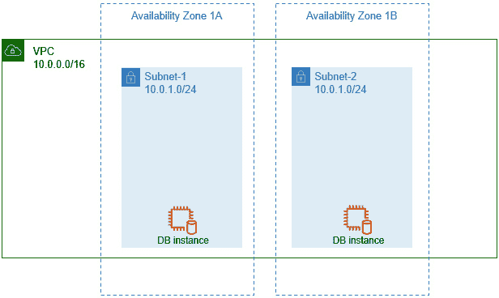

图 6.16 – VPC 和具有不重叠 IP 地址的子网

在上图中，我们已经在两个可用区内的两个子网中部署了两个数据库实例。

## 互联网访问

如果要使 VPC 中的 EC2 实例能够将流量发送到互联网，则需要为您的自定义 VPC 配置互联网访问。此外，如果部署需要从互联网直接入站访问的服务器，则需要将它们部署在具有直接路由到互联网的子网中。

如 *图 6.9* 所示，您可以定义哪些子网可以直接访问公共互联网，称为公共子网（例如 DMZ），以及哪些子网是私有的，称为私有子网（用于后端操作）。

要配置具有互联网访问权限的 VPC，您需要部署一个互联网网关。这是一个免费组件，可附加到您的 VPC，以授予 VPC 互联网访问权限。此外，您需要配置与公共子网相关联的路由表，以直接访问互联网网关。然后在公共子网中部署的 EC2 实例可以发送流量到互联网，并配置为接收来自互联网的直接入站流量。然而，额外的要求是，您的公共子网中的 EC2 实例也必须具有公共 IP 地址。这可以由 AWS 动态分配给 EC2 实例。请注意，公共 IP 地址是动态的，这意味着如果 EC2 实例停止然后重新启动，IP 地址很可能会更改。在大多数情况下，这是可以接受的，因为通常您会将 EC2 实例放置在负载均衡器后面（我们在后面的章节中讨论的一项服务）。但是，如果您需要静态的公共 IP 地址 – 即不会更改的 IP 地址 – 那么您可以配置您的 EC2 实例使用弹性 IP 地址。

弹性 IP 地址是静态的，并且会一直保留在你的账户中，直到你释放它们。它们非常适合那些必须始终保持相同公共 IP 地址的 EC2 实例。弹性 IP 地址也可以从一个 EC2 实例重新分配到另一个实例。如果，例如，某个 EC2 实例发生故障，需要启动新的服务器作为替代并保持相同的 IP 地址，弹性 IP 地址会非常有用。因此，弹性 IP 地址可以帮助你设计高可用性服务，在主 EC2 实例发生故障时，自动将 IP 地址重新分配到备用 EC2 实例。

在成本方面，重要的是要记住，弹性 IP 地址仅在它们与处于运行状态的 EC2 实例关联时免费。如果 EC2 实例处于停止（关机）状态，你将按照小时收取该弹性 IP 地址的费用。下图说明了来自互联网的流量如何路由到部署在 VPC 公有子网中的 Web 服务器。请注意，在这种情况下，Web 服务器还需要具有公共 IP 地址。

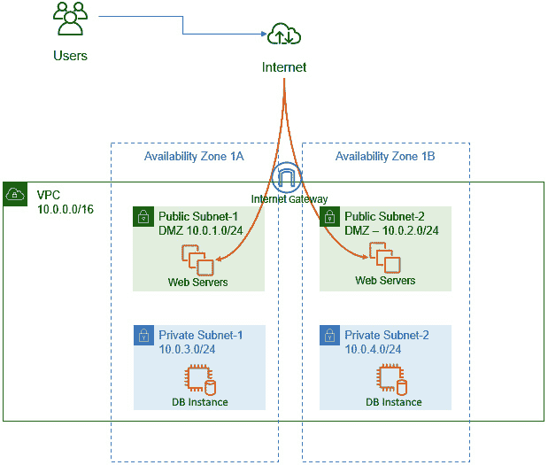

图 6.17 – VPC 和公有、私有子网

在上图中，如果可用区 1A 发生重大故障，用户可以被重定向到可用区 1B 中的公有 `子网-2` 上的 Web 服务器，并继续操作。

## VPC 安全性

在 AWS 上构建 VPC 的主要原因之一是实施防火墙安全性，以确保对 VPC 中部署的资源的访问得到严格管理。例如，一些资源，如 Web 服务器，需要允许来自互联网公共成员的进站访问。相反，如果运行在这些 Web 服务器上的应用需要更新后端数据库（例如，确认客户订单），则你需要确保只有 Web 服务器能够进行这些更新，而不能让公共成员直接访问后端数据库。

亚马逊提供两种安全服务，帮助你构建高度安全的环境，确保仅允许所需级别的访问和流量。

### 安全组

安全组是一种防火墙，旨在帮助你配置允许的流量类型，包括进站和出站流量，供 EC2 实例使用。当你启动一个 EC2 实例时，必须为其分配至少一个安全组，并且该安全组必须包含允许的任何进站和出站流量的必要规则。请注意，你可以将最多五个安全组与一个实例关联。安全组作用于实例级别，而非子网级别。

每个 VPC 都配有一个默认的安全组，该安全组允许所有流量入站，*但仅限于该流量的源是安全组本身*。这意味着，如果你有两个与同一个安全组关联的 EC2 实例，那么一个 EC2 实例将接受由另一个 EC2 实例发起的流量。此外，所有的出站流量都被允许。这意味着与默认安全组关联的 EC2 实例可以发起出站通信。这是基于你可以信任你的 EC2 实例进行任何必要的出站请求，例如下载操作系统更新。

然而，安全组在你创建必要规则之前，不允许来自其他来源（除自身之外）的任何流量入站。这是为了防止任何未经请求的流量到达你的实例。因此，如果你正在配置一个需要使用标准 HTTP 协议提供网页的 web 服务器，你就需要为 HTTP 配置一个合适的入站规则，并指定流量的来源，例如 IP 地址范围。除了默认的安全组之外，你还可以创建自己的安全组。

关于安全组，一个需要考虑的重要特性是，即使你没有配置任何入站规则，对于任何出站请求的响应流量，安全组也会允许其入站。相反，如果你配置了任何入站规则，那么由于这些规则允许的入站流量的响应，都会被允许出站，无论是否有显式的出站规则。这一特性使得安全组具有**状态性**。

其他一些关键特性包括：

+   你可以配置 *允许* 规则，但不能配置显式的 *拒绝* 规则。

+   你可以为入站和出站流量指定单独的规则。

+   你可以根据协议和端口号过滤流量。你还可以指定源和目标，这些源和目标可以是其他安全组，从而提供分层的安全方法。

因此，安全组保护你的 EC2 实例，并允许你定义允许哪些入站流量到达实例。

### 网络访问控制列表（NACL）

NACL 是另一种防火墙服务，旨在保护整个子网。与其在实例级别提供保护，它们可以配置为允许或拒绝流量到达子网，而这些子网中部署了你的 EC2 实例。

每个 VPC 都会配置一个默认的 NACL，该 NACL 被配置为允许所有的进出流量。这是可以接受的，因为流量必须通过安全组进行许可，而安全组默认会阻止所有的入站连接。

顺便提一下，你可以为你的子网配置自定义的 NACL，这些 NACL 默认会阻止所有的进出流量，且需要额外的配置才能创建必要的进出规则。

NACL 也是无状态的，这意味着你必须同时配置入站规则和相应的出站规则，以确保流量能够流动并得到响应。

## 网络地址转换（NAT）

在本章开始时，我们讨论了典型企业网络通常如何被划分为多个子网络。某些资源将被部署在 DMZ（在 AWS 上称为公共子网），而其他资源将部署在后端私有子网中。通过将资源部署在私有子网中，我们确保这些资源不会直接连接到公共互联网。这些资源包括数据库服务器或应用程序服务器，这些服务器应该仅通过前端 Web 服务或负载均衡器访问。这样可以确保所有流量都通过这些前端 Web 服务进行代理，而不会将这些资源暴露在公共互联网。

然而，应用服务器可能需要访问互联网，例如下载产品更新或补丁。由于这些服务器没有公共 IP 地址，并且将被放置在私有子网中，我们需要为它们提供访问互联网的机制，并允许它们接收来自互联网的响应。为满足这一需求，我们可以设置并配置一个 NAT 服务。如*图 6.10*所示，这个 NAT 服务需要放置在你的 VPC 的公共子网中，并附加一个弹性 IP 地址。然后，你的路由表需要配置规则，允许来自私有子网的 EC2 实例通过此 NAT 服务访问互联网。NAT 服务将来自私有子网的 EC2 实例请求转发到互联网，充当代理。

最终，如果你需要让 EC2 实例通过私有 IPv4 地址访问互联网，而不直接将它们暴露在互联网上（例如，通过公共 IP 地址），那么在 AWS 上，你可以配置一个 NAT 网关来代表这些设备转发互联网请求。

如果你正在使用 IPv6，如本章前面所讨论的那样，并且你希望确保拥有 IPv6 的 EC2 实例可以访问互联网而不会直接暴露在互联网上，你需要通过**仅出站互联网网关**来路由这些实例的流量。

## VPC 对等连接

VPC 对等连接是两个 VPC 之间的私有网络连接。该服务允许你连接多个 VPC，以便一个 VPC 中的实例可以访问另一个 VPC 中的资源。这意味着 VPC 之间通过对等连接的流量不会穿越公共互联网，并且提供更高的带宽和安全性。此外，节点之间的连接具有高可用性，并且没有单点故障。

你可以在同一个 AWS 账户中的 VPC 之间，或跨 AWS 账户之间创建 VPC 对等连接。对等连接也可以在同一区域的 VPC 之间，或跨不同区域的 VPC 之间配置。这意味着，如果你在不同区域拥有 VPC，例如为了将资源部署到更靠近全球分支机构的位置，这些资源可以跨区域互相访问。

## VPC 中转网关

前面，我们讨论了 VPC 对等连接如何帮助你将多个 VPC 连接在一起。然而，VPC 对等连接的问题在于，每个 VPC 必须与其对等体建立一对一的连接。一旦建立了连接，你还需要在每个对等连接的 VPC 中配置路由表，以便通过对等连接引导适当的流量。如果你有多个 VPC 需要相互连接，那么管理这些单独的连接和大量的路由表条目将变得非常困难。

在下图中，你将注意到连接每个 VPC 的各种对等连接的复杂性：

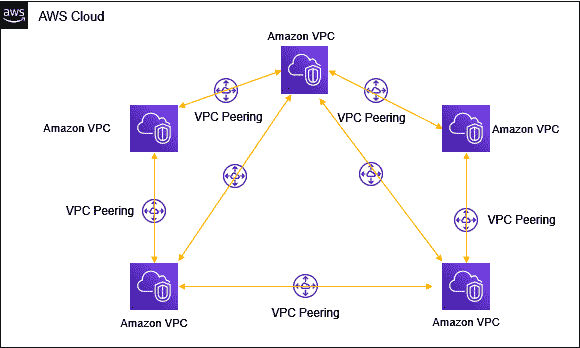

图 6.18 – 多个 VPC 对等连接

使用 AWS 中转网关，你可以通过网关将各个 VPC 连接在一起，采用中心辐射模型。这大大简化了你的网络架构，因为每个与网关对等的新 VPC 只需要一个连接，就可以将流量路由到其他 VPC，只要必要的路由表配置允许这样做。

以下图展示了这一简化模型：

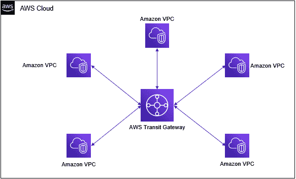

图 6.19 – AWS 中转网关

中转网关有助于减少在尝试将多个 VPC 连接在一起时的架构设计开销。中转网关通过使用中心辐射模型来实现这种设计。

## 虚拟专用网络（VPN）

你的 VPC 托管在 AWS 平台上。你可以在 VPC 中部署各种资源，并且如果你配置了互联网网关以及必要的安全组和 NACL，你可以通过公共互联网访问这些资源。然而，你还可以将你的 VPC 连接到你的公司网络（本地或共址数据中心）。这种类型的连接称为 VPN。VPN 是在两个端点之间通过公共互联网建立的安全加密站点到站点隧道。它提供 AES 128 或 256 位**互联网协议安全（IPsec）**加密，这意味着你可以在两个端点之间安全地传输数据。

要在你的本地网络和 VPC 之间建立 VPN 连接，你需要创建一个**虚拟专用网关**（**VPG**），并将其附加到你的 VPC。你还需要配置一个客户网关，这是一种位于本地网络中的物理或虚拟设备，通过互联网连接到 VPG。该设置如*图 6.12*所示。

AWS 支持多种客户网关设备，包括 Cisco、Juniper 和 Check Point 设备。一旦 VPN 连接建立，你仍然需要在内部网络和 VPC 上配置路由表，以便根据需要通过隧道传输适当的流量。

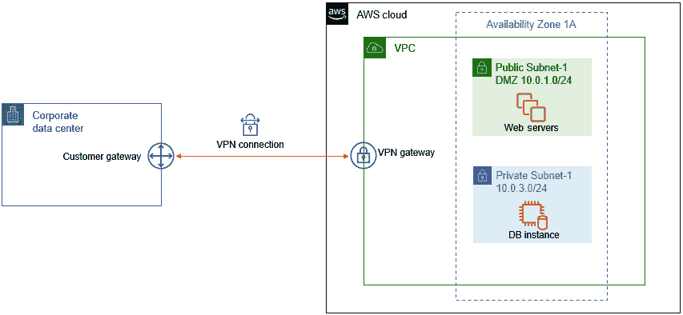

图 6.20 – Amazon VPN

虽然 VPN 连接可以加密本地网络与 VPC 之间的流量，如图所示，但带宽仅限于你的互联网服务提供商所提供的带宽。此外，在 AWS 上，VPN 的硬限制为 1.26 Gbps。通过 VPN 连接，你还需要依赖公共互联网的路由机制。如果你需要一条完全绕过公共互联网的更专用的连接，那么 Amazon 提供了一项名为 Direct Connect 的服务，我们将在接下来讨论。

## Direct Connect

**Direct Connect** 是一项服务，使你能够通过专用的私人连接将公司数据中心连接到你的 VPC 和 AWS 提供的公共服务，从而完全绕过互联网。

由于需要在你的公司办公室（或数据中心）与本地的 Amazon Direct Connect 合作伙伴之间铺设必要的光纤电缆，这种解决方案比标准的 VPN 设置要昂贵。不过，该服务可以提供 1 Gbps、10 Gbps 甚至 100 Gbps 的专用链接。因此，Direct Connect 为你提供了超高速的连接以及安全的私人连接。

在本节中，我们考察了 Amazon VPC 的核心特性和组件。VPC 使你能够在 AWS 云中构建安全、隔离的网络区域，并且可以配置为仅允许授权的连接进入这些区域。VPC 提供两种防火墙解决方案——安全组和 NACL。前者可以配置为仅允许特定类型的流量，并且在实例级别充当防火墙，而后者则保护整个子网。安全组是有状态的，而 NACL 是无状态的；然而，NACL 还提供了拒绝特定来源的特定类型流量的功能。例如，如果你托管了一个 Web 服务器，想允许来自互联网的公共访问，但也希望阻止来自某个 IP 范围的访问（可能是因为你发现该范围存在潜在攻击），NACL 可以帮助你配置必要的拒绝规则。

你可以使用 NACL 和安全组来构建一个分层的安全架构。NACL 将通过明确指定可以进入子网的流量类型，保护整个子网。接下来，你可以为可能驻留在子网中的不同 EC2 实例组定义安全组，确保只有必要的流量才能连接到运行在这些 EC2 实例上的应用程序。

然后我们研究了诸如 VPC 对等连接、AWS Transit Gateway、VPN 连接以及 Direct Connect 服务等功能。在接下来的部分，我们将学习 AWS 的全球 DNS 服务 Amazon Route53。AWS Route53 使你能够通过 DNS 名称解析将流量引导到 VPC 内和公共互联网中的资源，同时还帮助你调整流量以实现高可用性和容错。

# 了解 DNS 和全球路由与 Amazon Route53

AWS Route53 是 Amazon 的全球 DNS，它是一项帮助将人类可读的名称转换为 IP 地址的服务，因为最终，计算机是通过 IP 地址互相连接的。互联网上的 DNS 服务器托管着数十亿条这类名称到 IP 地址的记录，此外还有其他类型的记录。当你使用自己喜欢的浏览器访问特定网站（例如 `example.com`）时，你的浏览器会向本地 DNS 服务提供商发送请求，如果需要，DNS 服务提供商会将查询转发给该域名（`example.com`）的权威 DNS 服务器。这个权威 DNS 服务器会返回你试图访问的网站的 IP 地址，之后你的浏览器就能够与该网站建立连接（在此案例中是 `example.com`）。这个将域名转换为 IP 地址的过程叫做名称解析。

Amazon Route53 提供三项主要功能：

+   域名注册

+   DNS 路由

+   健康检查

接下来我们来看一下各个功能。

## 域名注册

在你可以使用域名为你的网站或 Web 应用程序提供公共访问之前，你需要通过域名注册商注册一个你选择的名称。Amazon Route53 提供完整的域名注册服务。当你选择一个名称进行注册时，你可以选择 `.com`、`.co.uk`、`.org` 或 `.net` 等后缀。如果你选择的名称在某个特定的 TLD 下不可用，你可以尝试不同的 TLD。例如，如果 `example.com` 已被他人注册，你可以尝试 `example.co.uk` 或 `example.net`。有数百种 TLD 可供选择。

作为注册的一部分，你需要为你的域名购买一个租赁期，租赁期可以是 1 年到 10 年之间的任何时间。你需要在租期到期之前续租，否则你可能会面临其他人注册该名称的风险，这将影响你继续使用该域名提供 Web 服务的能力。

一旦你注册了域名，就需要通过 DNS 托管服务提供商进行托管。通常，注册和托管服务由同一公司提供，在这种情况下是 Amazon Route53。托管服务使你能够为你的域名创建资源记录，例如，将域名配置为指向一个 Web 服务器的 IP 地址。当互联网上的用户在浏览器中输入域名时，他们会被引导到你的 Web 服务器，该服务器托管着你的网站。

你可以创建几种类型的资源记录。以下表格显示了一些类型的资源记录：

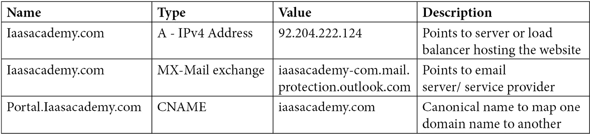

表 6.1 – iaasacademy.com 的示例资源记录

在配置你的域名时，你还需要定义一个区域文件，该文件将承载你域名的资源记录。在区域文件中，你将创建资源记录，例如 A 记录，这是标准的名称到 IP 地址的解析记录。接下来，我们将了解如何在 AWS Route53 上创建区域文件。

## 托管区域

要为你的域名创建必要的资源记录，你需要在 Route53 上设置一个托管区域。托管区域是一个容器，用于存储和管理你的资源记录，并允许你定义如何为你的域名（`example.com`）及任何子域（例如 `portal.example.com`）路由流量。

你可以在 Route53 上设置两种类型的托管区域：

+   `http://bucket-name.s3-website-Region.amazonaws.com`。你可以将这个 S3 网站端点 URL 提供给用户，供他们访问托管在 S3 存储桶上的网页。然而，更好的选择是创建一个别名记录，将你的公司域名（`example.com`）指向 S3 网站端点。你的用户会发现记住你的域名比记住原始的 S3 端点名称容易得多。

+   `devserver.example.com` 指向你 VPC 中的 EC2 实例，其他 VPC 中的资源可能需要连接到该实例。这比记住 EC2 实例的 IP 地址要好得多，意味着你不需要将这些 IP 地址硬编码到应用代码中，这样管理起来会变得更加困难。

### DNS 主机名

AWS 为你的 VPC 提供了一个 DNS 服务器（Amazon Route53 Resolver）。这使得 AWS 可以为你在 VPC 中部署的实例配置 DNS 主机名。DNS 主机名由主机名和域名组成，例如 `myserver.mycompany.com`。DNS 主机名允许你为 EC2 实例创建唯一的名称。此外，AWS 提供了两种类型的 DNS 主机名：

+   `private-ipv4-address` 是反向查找的 IP 地址。

+   **公共 DNS 主机名** – 这些将公共 DNS 主机名解析为实例外部的公共 IPv4 地址，以及从实例内部解析为实例的私有 IPv4 地址。根据区域的不同，DNS 主机名可以采用以下两种形式之一：

    ```
    ec2-public-ipv4-address.compute-1.amazonaws.com for the us-east-1
    ec2-public-ipv4-address.region.compute.amazonaws.com for other Regions.
    ```

虽然 Route53 提供了一个功能完整的 DNS 服务，但它还允许你设计如何在一个区域内以及跨区域地路由流量。接下来，我们将查看 Amazon Route53 提供的不同路由策略。

## 路由策略

除了标准的名称解析服务，例如将您的域名指向特定的 IP 地址，亚马逊 Route53 还提供了几种复杂的路由策略和配置。这些路由策略使您能够定义各种规则，从而构建高可用的解决方案，或者将用户重定向到距离其位置更近的资源，从而减少延迟。

让我们来看看 Amazon Route53 提供的各种路由策略：

+   **简单路由策略**：最基本的默认路由策略。此资源记录使您能够将域名映射到单个资源，例如 Web 服务器的 IP 地址或弹性负载均衡器的 DNS 终端。该策略引擎不会检查资源是否正常工作或可用。

+   **故障切换路由策略**：为了提供高可用性，您可以将两个资源副本分别部署在不同的区域。一个资源副本将被指定为主资源，另一个为次资源。Route53 会执行健康检查（稍后讨论），以确定主资源是否可用。如果无法连接到主资源，Route53 会将所有流量重定向到次资源。此故障切换路由策略使您能够设计具有主动-被动故障切换的解决方案。

+   **地理位置路由策略**：此路由策略使您能够根据用户的地理位置（如大洲、国家或美国的州）路由流量。用户的位置是通过 DNS 查询源确定的。这种路由策略特别有用，当您需要确保您的内容仅在您有分发权限的地点可访问时。例如，如果您的最终用户位于欧洲，您可能希望将他们引导到部署在法兰克福区域的资源副本。

+   **延迟路由策略**：当您在多个区域部署资源时，如果您希望将用户的流量路由到提供最低延迟的区域，这种路由策略尤其有用。

+   **加权路由策略**：这种路由策略使您能够将总流量的不同比例路由到与单个域名相关的不同资源。例如，您可以选择将四分之三的流量路由到一个资源副本，而将剩下的四分之一流量路由到另一个副本。当您希望将所有流量从一个资源逐步迁移到另一个资源时，这也特别有用，例如将网站的流量从旧版迁移到新版。您可以逐步调整加权值，在短时间内将流量从旧版本网站迁移到新版本。

在创建某些路由策略时，例如故障转移路由策略，你还需要定义健康检查，以便 Route53 可以确定是否需要切换到备用站点。接下来，我们将详细讨论健康检查。

## 健康检查

你可以使用 Route53 对你的资源执行健康检查，例如 Web 服务器、弹性负载均衡器和 S3 静态网站。根据检查结果，你可以采取适当的措施，并在必要时重定向流量，以确保服务的高可用性。你可以执行三种类型的健康检查：

+   **监控端点的健康检查**：此健康检查监控你指定的端点，例如 IP 地址或域名。

+   **监控其他健康检查的健康检查**：你可以选择监控多个资源，并根据某些最小健康资源数量来确定你的资源集合的整体健康状况。如果可用资源的数量低于指定的阈值，Route53 健康检查则可以采取适当的措施。

+   `ALARM` 状态也可以独立根据度量数据来确定健康状况。

除了路由策略和健康检查外，你还可以构建复杂的路由规则，接下来我们将讨论流量流和流量策略。

## 流量流和流量策略

你可能需要使用资源记录和 Route53 路由策略的组合来创建复杂的流量路由。例如，你可以创建一个配置，其中设置跨多个区域的延迟路由策略，然后在每个区域中引用加权记录。每个配置称为 **流量策略**，你可以使用可视化编辑器帮助你构建路由架构，Route53 会使用该架构来设计流量流向。通过可视化编辑器，你还可以创建多个版本的流量策略，以便快速适应变化。请注意，你只能使用流量流来在公共托管区域中创建记录：

+   **地理邻近路由策略**：除了标准的 Route53 路由策略外，你还可以配置地理邻近路由策略（仅在使用 Route53 Traffic Flow 时可用）。此路由策略使你能够根据资源的位置来路由流量。你还可以使用 *偏差* 值将流量从一个位置的资源转移到另一个位置的资源。

+   **Route53 解析器**：Route53 还使你能够通过配置转发规则在 Route53 解析器和你网络中的 DNS 解析器之间执行 DNS 解析。在这种情况下，*你的网络* 可以包括你的 VPC、其他对等的 VPC，甚至是通过 VPN 或 AWS Direct Connect 连接到 AWS 的本地企业数据中心。

在本节中，我们了解了由 Route53 提供的亚马逊 DNS 服务。Route53 使您能够注册域名、创建公共和私有托管区以管理资源记录、为不同的用例定义路由策略，并对资源进行健康检查。Route53 还使您能够使用多个资源记录以及流量流和流量策略构建复杂的路由规则。

在下一部分中，我们将了解 AWS CloudFront，这是亚马逊的**内容分发网络**（**CDN**）解决方案。CDN 通常用于从源位置全球分发内容，并借助缓存服务提供可靠的低延迟访问。

# 使用 Amazon CloudFront 实现一个强大的 CDN

Amazon CloudFront 是一个 CDN，帮助您通过低延迟连接将静态和动态数字内容全球分发。AWS CloudFront 使用 AWS 边缘位置和区域边缘缓存，将内容缓存到离最终用户更近的位置。这意味着您可以将内容托管在一个特定的区域，而用户如果从另一个区域访问该内容，将通过边缘位置通过 AWS 主干网络获取内容。此外，当内容被提取时，它会在离用户更近的本地边缘位置缓存一段时间（称为**生存时间**或 **TTL**），进一步提高后续请求相同内容的网络延迟。

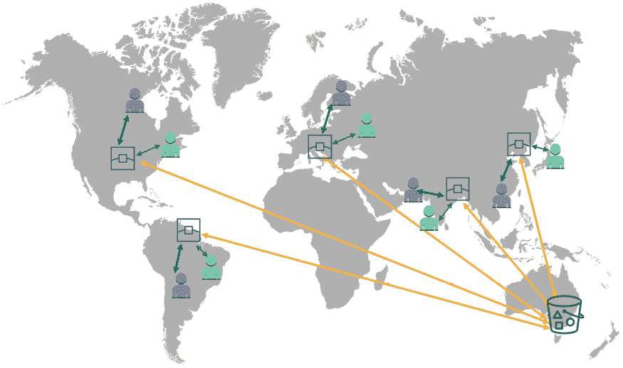

图 6.21 – 典型的 CloudFront 分发

要配置 Amazon CloudFront，您需要创建一个分发端点，该端点定义您希望提供的内容类型及其来源。源可以是 S3 存储桶、配置为静态网站的 S3 存储桶、Amazon EC2 实例或弹性负载均衡器等。在配置过程中，您将获得一个 CloudFront URL，您可以将其提供给用户，以通过 CloudFront 访问您的内容。您还可以使用自定义 URL，这允许您使用公司品牌域名来定义您的分发。

当您配置 CloudFront 分发时，您可以选择通过 HTTP 和 HTTPS 提供内容。一些可以提供的内容类型示例如下：

+   静态和动态内容，例如 HTML、CSS、JavaScript 和图片

+   按需视频的不同格式，例如 Apple **HTTP 实时流媒体**（**HLS**）和 Microsoft 平滑流媒体

+   现场活动和会议

CloudFront 最终使您能够为您的 web 应用程序架构一个 CDN。接下来，我们来看一下 CloudFront 的定价。

## 为您的 CloudFront 分发选择价格类

Amazon 会向您收取通过其边缘位置分发内容的费用。然而，Amazon 并不是按每个边缘位置收费，而是将跨区域的多个边缘位置归为三种特定的价格类别。最昂贵的价格类别是您的内容可以通过全球所有边缘位置访问。这也是创建分发时的默认价格类别，但最终提供最佳性能。如果您希望降低成本，并且知道您的内容消费者来自特定地区，您可以选择两种替代价格类别：

+   美国；加拿大；欧洲；香港、菲律宾、韩国、台湾、新加坡；日本；印度；南非；和中东地区——此类别排除了最昂贵的地区。

+   美国、加拿大和欧洲地区——这个类别是最便宜的。

在本节中，我们探讨了 AWS CloudFront 服务所提供的服务，以及它如何利用 AWS 骨干网络将您的内容全球分发，提供更低的延迟和更好的性能。

在下一节中，我们简要介绍了 Amazon API Gateway，它允许您通过创建、发布和管理 REST、HTTP 和 WebSocket API 来架构无服务器应用程序。

# Amazon API Gateway 介绍

Amazon API Gateway 帮助您设计应用程序解决方案，偏向微服务架构，而非单体设计。您的后端开发人员可以构建一系列相互协作的微服务。例如，在一个电子商务应用程序中，您可以拥有多个微服务，如购物车服务、目录服务、用户资料和用户会话服务、库存管理服务等。

如果没有 API 网关，您的前端开发人员（负责构建前端用户界面）将需要了解所有后端 API，并构建应用程序来调用多个微服务，以提供完整的功能。想象一下，如果您的后端开发人员之后需要重构其中一个微服务，例如将一个微服务拆分为两个独立的微服务，每个微服务都有自己的 API，这将导致前端用户界面的一些组件也需要重新编码。

通过 API 网关，您本质上创建了一个抽象层。这个 API 网关可以用来公开所有需要向外部客户端提供调用后端服务的 API。来自这些客户端的请求随后可以被路由到各种后端微服务。如以下图所示，Amazon API Gateway 充当您的应用程序访问后端数据、Lambda 函数、数据库等的“前门”。它处理所有进入的流量，并能够处理数千个并发的 API 调用。

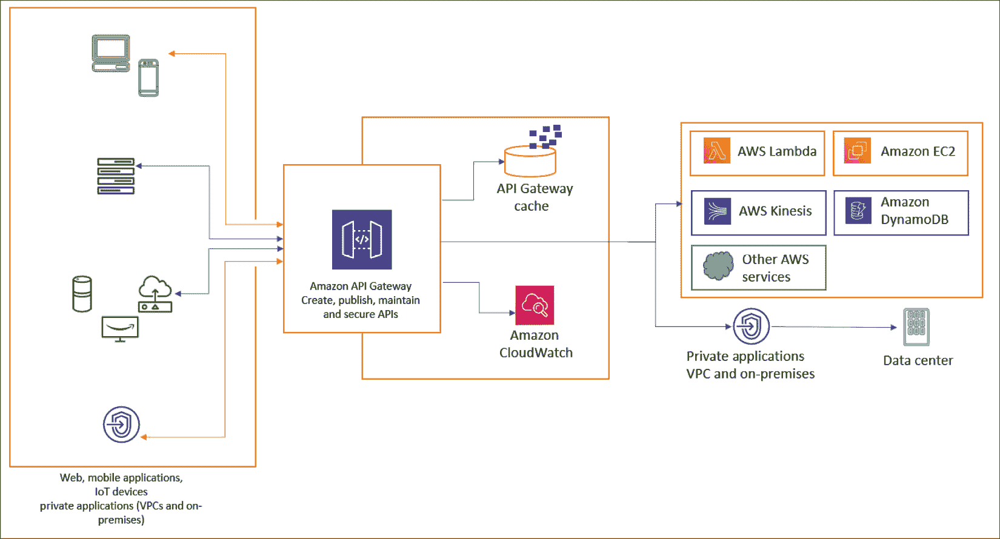

图 6.22 – Amazon API Gateway

Amazon API Gateway 还提供了帮助你保护后台服务的功能，如授权、访问控制和监控，帮助保护后台资源免受**分布式拒绝服务**（**DDoS**）攻击。

在设计你的软件架构时，添加这一抽象层会为客户访问后台资源创建额外的跳跃。为了提高应用响应能力，Amazon API Gateway 提供了优化你的 API 的功能，如响应缓存和有效载荷压缩。

在这一部分中，我们简要介绍了 Amazon API Gateway，它是一个完全托管的服务，允许你创建、发布、维护、监控和保护 API。

在下一部分，你将有机会在本章练习中构建自己的 Amazon VPC。

# 练习 6.1 – 设置公共子网 VPC

在本练习中，你将创建一个包含公共子网的自定义 VPC。在后续章节中，你将扩展这个 VPC，添加用于不同用例的私有子网：

1.  登录到你的 AWS 账户，作为你在*第四章*中创建的 IAM 用户`Alice`，*身份与访问管理*。

1.  在主 AWS 管理控制台中，在搜索框中搜索`VPC`。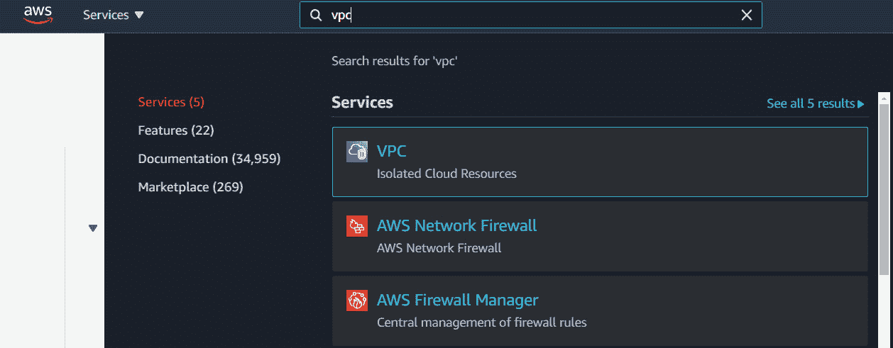

    图 6.23 – 配置一个新的 VPC

1.  从过滤后的列表中选择**VPC**。

1.  VPC 是区域特定的，所以请确保从屏幕右上角选择 US-East-1 区域。

1.  在主 VPC 控制台屏幕上，点击**启动 VPC 向导**按钮。这将启动 VPC 向导。

1.  接下来，选择第一个选项，**带有单个公共子网的 VPC**。

1.  在*步骤 2*中，为你的 VPC 提供以下详细信息。

    对于`10.0.0.0/16`，此 IP 块表示你的 VPC 网络。

    对于`ProductionVPC`。

    向导引导你创建一个单独的公共子网。稍后，你将扩展这个 VPC 以供未来使用，但现在，请设置`10.0.1.0/24`。

    对于**可用区**，从下拉列表中选择**us-east-1a**。请记住，尽管 VPC 跨越整个区域，但你创建的每个子网仅跨越一个可用区。在这种情况下，我们正在**us-east-1a**中创建一个单独的公共子网。

    接下来，将子网名称更改为**Public Subnet One**。

    接下来，点击屏幕右下角的**创建 VPC**按钮。查看以下截图以了解前面的步骤：

    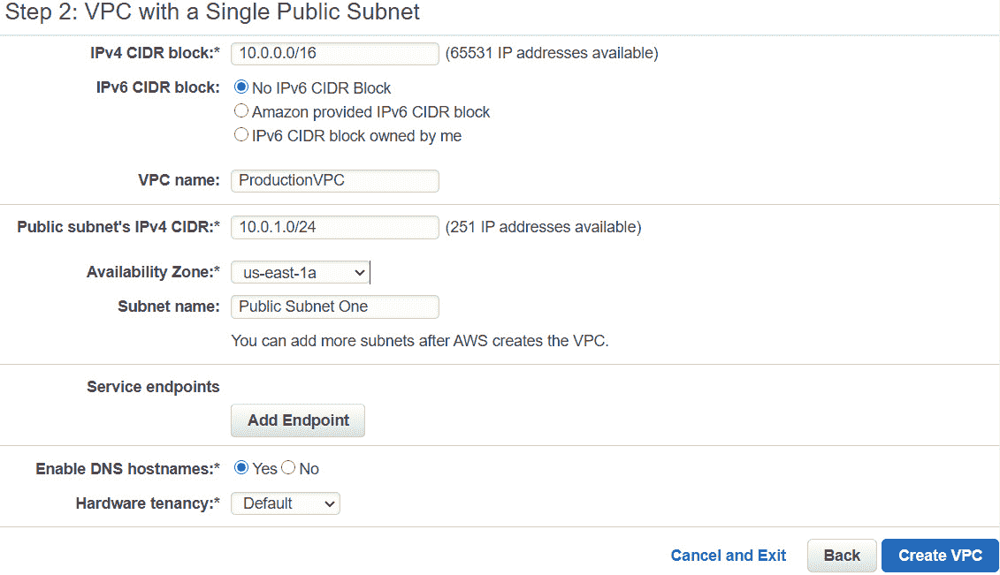

    图 6.24 – 带有公共子网的 VPC 配置页面

1.  向导会根据你指定的参数运行，并创建你的第一个 VPC。

1.  点击**OK**，进入**VPC 成功创建**状态页面。

1.  在 VPC 列表中，你会注意到你新创建的**ProductionVPC**已经成功创建：

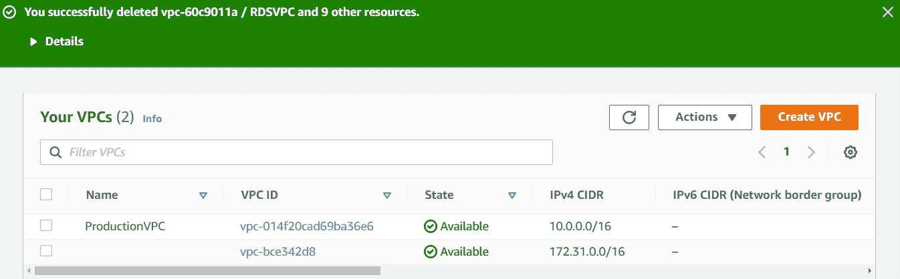

图 6.25 – 新创建的 ProductionVPC

在本节中，我们演示了如何使用 AWS VPC 向导创建第一个公共子网 VPC。之后，在培训指南中，你将扩展 VPC，包括私有子网，并在我们的 VPC 中部署服务器。

# 总结

本章介绍了 Amazon 的核心网络服务，包括 VPC、Amazon 的 DNS 服务（Route53）以及 Amazon 的 CDN 解决方案（Amazon CloudFront）。

在本章中，你学习了计算机如何通过 IP 地址进行互相通信。你还了解到，通过使用 IP 地址和 CIDR 块范围，你可以构建隔离的网络和子网。接着，我们讨论了如何在云中使用 Amazon VPC 服务构建相同的网络架构。在设置 VPC 的过程中，你检查了构建私有和公共子网的使用案例，并探索了定义安全规则和限制进出 VPC 的流量类型的工具。我们还看到了其他 VPC 服务，它们使你能够通过 VPC 对等连接互连多个 VPC，并通过 AWS Transit Gateway 更轻松地在 VPC 之间构建复杂连接。

接下来，我们学习了 AWS Route53 服务，它是一个 DNS 服务，提供域名注册、路由策略配置服务和健康检查。你了解到，通过使用路由策略，你可以根据广泛的使用案例定制解决方案。这些使用案例包括通过 Route53 延迟路由策略提供主动-被动故障转移服务，并且通过加权路由策略，你可以逐步将用户从一个资源迁移到另一个资源。

最后，你学习了 Amazon CloudFront 以及如何使用 AWS 的边缘位置，通过高速低延迟连接，从单一区域向全球分发数字资产和内容。

在下一章中，我们将学习 **弹性云计算**（**EC2**）服务，以及如何在云中部署计算服务，例如运行 Linux 或 Windows 操作系统的虚拟服务器。

# 问题

1.  哪个 VPC 组件可以让你为 VPC 中部署在公共子网中的服务器授予互联网访问权限？

    1.  NAT 网关

    1.  Internet 网关

    1.  VPC 对等连接

    1.  安全组

1.  以下哪个陈述是正确的？

    1.  NACLs 保护整个子网，而安全组保护单个实例。

    1.  NACLs 保护单个实例，而安全组保护整个子网。

    1.  NACLs 使私有子网中的实例能够访问互联网，并充当 NAT 设备，而安全组则用于将 IAM 策略分配给需要访问 S3 存储桶的服务器。

    1.  NACLs 使私有子网中的实例能够访问互联网，并充当 NAT 设备，而安全组则用于将 IAM 策略分配给需要访问 S3 存储桶的服务器。

1.  哪个 AWS 服务允许你购买并注册新域名，用于在互联网上发布你的站点？

    1.  Route53

    1.  VPC

    1.  RDS

    1.  Elastic Beanstalk

1.  哪个 AWS 服务可以让你分发你的数字资产，使其在尝试访问此内容的用户本地缓存，并具有生存时间，从而有助于减少网络延迟？

    1.  AWS CloudFront

    1.  AWS CloudTrail

    1.  AWS CloudWatch

    1.  AWS CloudScape

1.  你的组织拥有多个 AWS 账户和多个 VPC。你希望将这些 VPC 连接在一起，并集中管理连接策略。哪个 AWS 服务可以让你将多个 VPC 配置为一个中心节点，并控制所有连接网络之间的流量路由，这些网络就像辐射的轮辐？

    1.  AWS Transit Gateway

    1.  AWS Global Accelerator

    1.  AWS VPC Peering

    1.  AWS 虚拟私人网关

1.  哪个 AWS 服务可以让你为配置了 IPv4 的 EC2 实例提供互联网访问，这些实例位于 VPC 的私有子网中？

    1.  出口专用互联网网关

    1.  NAT 网关

    1.  VPC 端点

    1.  VPN 隧道

1.  你的公司在美国有一个主要的生产网站，在悉尼有一个灾备站点。你需要配置 DNS，使得如果主站点不可用时，可以将 DNS 故障转移到次要站点。你可以配置哪个 DNS 路由策略来实现这一点？

    1.  加权路由

    1.  地理位置路由

    1.  延迟路由

    1.  故障转移路由

1.  你计划使用 Amazon Route53 设置 DNS 故障转移。你可以使用 Route53 的哪个功能来测试你的 Web 应用的可用性和可达性？

    1.  私有 DNS

    1.  CloudWatch

    1.  健康检查

    1.  DNS ping

1.  哪个 VPC 防火墙解决方案可以让你拒绝来自特定 IP 地址的入站流量，用于防止恶意攻击？

    1.  AWS 防火墙

    1.  AWS 安全组

    1.  AWS **网络访问控制列表** (**NACLs**)

    1.  AWS CloudFront

1.  哪个 AWS 服务可以让你通过高达 100 Gbps 的网络连接，将私有数据中心连接到你的 Amazon VPC？

    1.  Snowball

    1.  Direct Connect

    1.  **虚拟私人网络** (**VPN**)

    1.  **虚拟卫星网络** (**VSN**)
