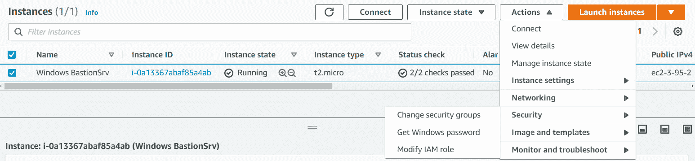

# 第七章: AWS 计算服务

在过去，传统的本地环境由各种 *服务器* 组成，这些服务器用于托管各种应用程序、网站和其他服务。这些 *服务器* 是物理硬件，如你的家用桌面计算机，但设计时采用了更强大的组件（如 CPU、内存和存储），以便托管终端用户的应用程序。

**服务器** 是指在计算机硬件上运行的应用程序，提供一组服务，无论是提供给其他应用程序还是终端用户。一个物理计算机可以托管多个 "服务器" 提供的服务——例如，一台计算机可能同时提供电子邮件服务和网络服务。

然而，传统上，你在配置物理计算机托管服务器时会受到限制。主要原因是内存、存储的有限，以及更重要的是，当应用程序访问底层资源时，容易发生冲突。这些资源可以是共享库和运行时环境，以及对物理硬件（如内存、存储等）的访问。

随着虚拟化技术的出现，现在可以在单一物理主机上配置 **虚拟机**（**VMs**）——每个虚拟机提供一个或多个服务，通常这些服务彼此相关，以避免冲突。例如，你可以有一个虚拟服务器提供电子邮件服务，另一个提供文件共享服务。

**Amazon Web Services**（**AWS**）在云中提供虚拟机（VMs），我们称之为 **弹性计算云** 或 **EC2**。本章将介绍 EC2 服务的核心功能，使我们能够在 AWS 上托管应用程序、网站和其他计算密集型处理服务。此章节还将涵盖其他形式的计算服务，包括 EC2 的轻量替代方案 Lightsail、容器和无服务器服务，如 Lambda。

本章将涵盖以下主题：

+   **弹性计算服务**（**Amazon EC2**）介绍

+   学习 Amazon **弹性块存储**（**EBS**）和实例背后的存储

+   学习 EC2 定价选项

+   使用 **Amazon 弹性文件系统**（**Amazon EFS**）实现共享文件存储

+   使用 Amazon Lightsail 介绍 **虚拟专用服务器**（**VPS**）

+   Amazon **弹性容器服务**（ECS）和 Kubernetes 介绍

+   AWS 中的额外存储选项概述

# Amazon EC2 介绍

**Amazon EC2** 是 AWS 的旗舰服务之一，允许你在云端启动和设置虚拟服务器。这与在本地环境中设置和配置 **虚拟机**（VMs）非常相似，你会在像 VMware 或 Hyper-V 这样的虚拟化管理程序上进行配置。

正如在*第一章*《什么是云计算？》中讨论的那样，虚拟机管理程序（Hypervisor）是一种软件，它允许您创建虚拟资源，例如虚拟服务器。根据底层硬件的容量，您可以在同一物理硬件上托管多个虚拟服务器。这些虚拟服务器通过虚拟机管理程序访问实际的物理硬件，虚拟机管理程序将物理硬件组件（如 CPU、内存、存储等）划分为较小的虚拟组件，并将其呈现给虚拟服务器。您可以使用 VMware 和 Hyper-V 等虚拟机管理程序软件来创建虚拟服务器，选择虚拟组件并根据需要进行配置。每个虚拟服务器，也叫做虚拟机（VM），可以安装并配置操作系统以及所需的应用程序。

然而，Amazon EC2 将底层虚拟机管理程序层抽象化，从而客户无法直接访问虚拟机管理程序本身。通过自助服务门户或 API 访问，您可以在 AWS 账户中启动虚拟服务器，我们称之为 **EC2 实例**，并且特别是在您的 **虚拟私有云**（**VPC**）中（在前一章中讨论过）。

传统上，在 VMware 或 Hyper-V 管理控制台上，您需要指定虚拟服务器所需的 CPU 和内存量，以启动虚拟服务器。

使用 AWS，您可以从可用的 EC2 实例类型和系列中选择。EC2 实例系列是指实例类型的通用用途场景。例如，*通用型*系列设计用于处理需要平衡计算、内存和网络资源的工作负载。在这个*通用型*系列中，您可以找到多种 EC2 实例类型，这些类型对应于托管实例的主机计算机的底层硬件。这些 EC2 实例类型提供了不同组合的计算、内存和存储能力。例如，在*通用型*系列中，您可以选择如 **M5** 和 **T2** 等实例类型。**T2** 实例类型使用英特尔至强处理器，提供可突增的 CPU，并设计为平衡计算、内存和网络资源。**M5** 实例类型使用英特尔至强® Platinum 8175M 处理器，提供最多 384 GiB 的内存，并通过增强型网络提供最多 25 Gbps 的网络带宽。

在每个 EC2 实例类型中，您还可以选择实例大小。当为您的应用程序选择 EC2 实例时，您需要识别实例的系列、类型并选择实例的大小。例如，在 `t2.micro` 和 `t2.xlarge` 之间。`t2.micro` 实例仅配备 1 GiB 的内存和 1 个虚拟 CPU，而 `t2.xlarge` 配备了 16 GiB 的内存和 4 个虚拟 CPU。

我们将在稍后更详细地讨论 EC2 实例家族、类型和大小。可以说，你可以访问非常丰富的 EC2 实例类型和大小，以满足应用程序的需求。

除了定义 CPU、内存和其他硬件相关组件的 EC2 实例类型外，你还需要附加一个块存储设备，如 EBS 卷或实例存储卷，正如本章 *了解亚马逊弹性块存储和实例支持存储* 部分所讨论的那样。至少，你需要一个 EBS 卷来托管操作系统并使服务器能够启动为一个完全功能的服务器。我们将在本章稍后讨论不同类型的 EC2 实例块存储。

除了指定实例类型和家族外，你还需要选择一个特定的 **亚马逊机器镜像** (**AMI**) 来配置你的 EC2 实例。AMI 是包含基本操作系统、实用程序以及你希望配置到 EC2 实例中的任何应用程序的快照。我们将稍后更详细地讨论 AMI。

这里需要注意的一个重要点是，EC2 实例是区域特定的。更准确地说，EC2 实例与启动它们的可用区相绑定。当你选择启动一个新的 EC2 实例时，必须指定一个 VPC 子网来启动该 EC2 实例。该子网将与给定的可用区相关联，正如上一章所讨论的那样。因此，最终，你决定了 EC2 实例启动的可用区。

以下图展示了支持亚马逊 EC2 服务的高层基础设施架构和关键特性：

图 7.1 – EC2 实例组件

上图中 EC2 实例的一些关键特性包括：

+   EC2 实例是从位于同一可用区的物理主机构建的虚拟机（VM）。

+   借助网络和存储虚拟化技术，每个 EC2 实例至少分配一个弹性网络接口（虚拟网卡或虚拟 **网络接口卡** (**NIC**)）用于数据传输。你可以有额外的虚拟 NIC 来配置多宿设备。

+   EC2 实例可以配置为拥有一部分实例存储卷（本地附加到其运行所在主机）或 EBS 卷，这些卷附加到同一可用区中的存储阵列。

如上图所示，部署在 **可用区 2A** 中的 EC2 实例有一个弹性网络接口和两个附加的 EBS 卷，一个作为根卷（Windows 服务器上的 C 盘），大小为 30 GB，另一个作为数据卷，大小为 60 GB。我们将在本章稍后讨论块存储卷。

在下一节中，我们将研究 AMI。AMI 是虚拟机镜像，*类似*于您本地的**虚拟硬盘**（**VHD**）镜像。这些 VHD 是磁盘镜像文件格式，包含硬盘的内容，包括操作系统文件以及您希望配置服务器的任何应用程序。然而，AMI 不仅仅是简单的 VHD，它们还包括快照、权限和映射，指定启动实例时要附加的卷。在 AWS 上，当您启动实例时，您需要选择一个 AMI 来配置该实例。例如，一个 AMI 可以包含 Linux 操作系统镜像和任何附加应用程序，将实例配置为 Web 服务器。

## 亚马逊机器镜像（AMIs）

传统上，当您在本地的 VMware 或 Hyper-V 主机上启动新的虚拟机时，您会指定一个特定的操作系统镜像（如`.iso`文件）。该文件包含安装虚拟机所需的操作系统文件。您可能还会修改机器镜像，添加额外的应用程序和/或工具。

AMI 是 AWS 中等同于虚拟机镜像（VM images）的概念，包含基础操作系统和任何附加应用程序。

AMI 是亚马逊 EBS 快照或根卷的模板（例如，存储支持的 AMI）。这些快照或模板包含操作系统和任何必要的应用程序。此外，AMI 还包含有关块设备映射的信息，指定在启动实例时要附加的卷。

亚马逊提供了几种预配置的 AMI，作为其**Quick Start AMIs**的一部分，其中包括标准操作系统，如各种 Linux 发行版的官方版本，包括**红帽企业 Linux**（**RHEL**）、Ubuntu、SUSE，甚至亚马逊自己的 Linux 版本。此外，您还可以访问微软的 Windows Server 操作系统的多个版本，甚至是运行在物理苹果 Mac Mini 上的 macOS：

](img/B17124_07_02.jpg)

图 7.2 – AMI

如前面的截图所示，对于每个 AMI，您还可以看到其发布号、根设备类型是**EBS**还是**实例**、虚拟化架构的类型、卷类型（例如 SSD）以及该 AMI 是否支持增强型网络。

作为 Quick Start AMI 的一部分提供的 AMI，已经将任何必要的授权包括在部署该 AMI 的 EC2 实例的成本中。虽然您无需单独签订许可合同来启动这些服务器，但您向亚马逊支付的按小时费用将包括授权费用。

需要注意的是，任何 AMI 附带的授权仅适用于已经作为镜像的一部分捆绑的内容。任何额外的配置或额外应用程序的安装可能会有进一步的授权要求，需要单独采购。

当你选择一个特定的 AMI 作为配置新 EC2 实例的一部分时，镜像会被提取到实例新附加的块存储卷中，并使其可启动。这样一来，EC2 实例就会被配置成一个完全运行的服务器。

关于 AMI 需要注意的一些额外事项包括以下几点：

+   AMI 是区域特定的。这意味着，如果你想在某个区域启动特定配置的实例，那么该区域必须有相应的 AMI。

+   如果你需要在某个区域启动特定配置的实例，而该区域没有所需的 AMI，你可以将 AMI 跨区域复制。有关如何创建和复制 AMI 的更多详情，请参考亚马逊文档：[`aws.amazon.com/premiumsupport/knowledge-center/copy-ami-region/`](https://aws.amazon.com/premiumsupport/knowledge-center/copy-ami-region/)。

除了快速启动 AMI，你还有其他来源可以获取这些机器镜像，包括以下几种：

+   **AWS 市场**：这是一个由 AWS 管理的软件商店，第三方供应商可以在这里销售他们的应用程序，通常以准备好使用的 AMI 打包。像 F5、Citrix、Oracle 和 McAfee 等公司，连同许多其他公司，销售他们的解决方案，这些解决方案可以通过 Amazon EC2 实例来启动。定价由 AMI 的拥有者决定，此外还包括你运行 AMI 的特定 EC2 实例类型的费用。你可以在 [`aws.amazon.com/marketplace`](https://aws.amazon.com/marketplace) 查看 AWS 市场的产品。

+   **社区 AMI**：你可以将你的 AMI 设为公开，这样其他人也能通过社区 AMI 链接访问。这里有成千上万种不同的 AMI，旨在解决某些专用软件和操作系统的打包问题，这些通常无法通过快速启动 AMI 或市场获得。你通常可以在这里找到更具体的 Linux 发行版，比如 CentOS，这是一个企业常用的 AMI，用于托管应用程序。社区 AMI 是免费的，但你需要支付 EC2 实例费用。此外，许多 AMI 是“按原样”提供的，没有额外的支持，因此在选择社区 AMI 时需要谨慎。

### 创建你自己的 AMI

除了从 AWS 或市场获取 AMI，你还可以创建自己的 AMI。这涉及到为你运行的 EC2 实例创建一个镜像，并生成该实例附加的 EBS 卷的快照。然后，你可以使用该镜像（AMI）来启动新的 EC2 实例。

您通常创建 AMI 是因为您希望存储特定配置的副本，这些配置需要在您账户中的多个 EC2 实例甚至全球范围内部署。与其每次都手动配置每个新实例以满足您的特定要求，不如只需配置一个 EC2 实例，按需进行设置（包括适当的操作系统补丁、应用程序、防病毒软件等），然后创建该实例的 AMI。接下来，当需要启动更多具有相同配置的 EC2 实例时，您只需使用该 AMI 启动新的实例。这也被称为**预先烘焙 AMI**，通常作为快速配置新实例并最小化手动错误或配置错误的策略。

在本节中，我们讨论了 AMI 以及如何使用它们来配置带有操作系统和所需应用程序的新 EC2 实例。我们还讨论了如何获取 AMI，并在必要时创建您自己的 AMI。在接下来的章节中，我们将讨论您可以部署的不同类型的 EC2 实例。

## 探索 EC2 实例类型

AWS 提供了多种不同虚拟硬件配置的 EC2 实例，称为**实例类型**。EC2 实例类型定义了 EC2 实例虚拟硬件组件的特定规格，如处理能力（以**虚拟 CPU**（**vCPU**）和内存为衡量标准）、存储类型和网络配置。根据您的应用需求，您可以从广泛的 EC2 实例类型中选择适合的类型。

正如我们之前提到的，EC2 实例按*系列*进行划分，在每个*系列*中，有不同的*实例类型*。这些实例类型进一步按**实例大小**划分，实例大小具有特定的虚拟化硬件配置。以下是核心的 EC2 实例系列：

+   **通用型**：旨在平衡计算、内存和网络资源，适用于各种工作负载类型。

+   **计算优化**：专为高性能处理设计。非常适合批处理工作负载、媒体转码、高性能 Web 服务器和**高性能计算**（**HPC**）。

+   **内存优化**：旨在为处理大数据集的工作负载提供快速性能。

+   **加速计算**：配备硬件加速器或协处理器，执行复杂的功能。非常适合浮点数计算、图形处理或数据模式匹配。

+   **存储优化**：专为需要对本地存储中非常大的数据集进行高顺序读写访问的计算任务设计。

在每个系列中，你都有多个 EC2 实例类型可供选择。例如，在*通用型*系列下，你有**T2**、**M5** 和 **A1** 等实例类型。你可以通过查看 [`aws.amazon.com/ec2/instance-types/`](https://aws.amazon.com/ec2/instance-types/) 了解各种实例类型的详细信息。

以**M5**实例类型为例，它采用了英特尔® Xeon Platinum 8175M 处理器，适用于需要平衡计算、内存和网络资源的应用程序。该类型的其他特点包括，使用增强网络功能提供最多 25 Gbps 的网络带宽，并由 AWS Nitro 系统提供支持，AWS Nitro 系统是亚马逊的架构设计，结合了专用硬件和轻量级虚拟化管理程序。

在**M5**实例类型中，有不同的实例规格可供选择，你可以根据特定的应用需求选择合适的规格。以下是一些属于 M5 实例类型的规格截图：

图 7.3 – M5 实例规格选择示例

当你查看实例规格列表时，可以推测，vCPU 和内存越高，实例规格提供的性能就越强。根据你的应用需求，选择最适合的规格。

### 专用类别

除了可以在 AWS 上部署的标准实例外，你还可以选择**专用实例**和**专用主机**。这些选项允许你满足某些合规或监管要求，例如规定你不能使用部署在共享主机上的 EC2 实例，而共享主机是默认的部署选项。请注意，即使你的 EC2 实例可能与其他客户的实例共享硬件，底层基础设施也会提供隔离，除非其他客户授予你必要的访问权限，否则你无法访问其他客户的 EC2 实例。

**专用实例** 是部署在你的 VPC 中的 EC2 实例，运行在专为你提供的物理硬件上，且不会与其他客户共享。

**专用主机** 是为你单独使用的物理主机，它可以让你对实例如何在物理服务器上部署进行额外的控制和管理。此外，专用主机可以帮助处理某些第三方许可条款，通常是基于每个 CPU 核心/插槽来计算的。

在下一节中，我们将探讨可用于 EC2 实例的块存储选项。块存储允许你像将硬盘附加到物理服务器一样，将块卷附加到 EC2 实例。根卷托管操作系统，用于从中启动虚拟服务器，附加卷则可用于托管服务器的数据和应用程序。

# 了解 Amazon EBS 和实例存储

就像本地环境中的虚拟服务器一样，EC2 实例需要可访问的块存储卷来托管实例操作系统、数据和需要在服务器上运行的应用程序。AWS 提供了两种类型的块存储选项：**弹性块存储（Elastic Block Store）**和**实例存储卷**。

## 亚马逊弹性块存储

亚马逊弹性块存储（Amazon Elastic Block Store）为你的 EC2 实例提供高性能的块存储服务。这些存储像虚拟硬盘一样，作为你部署在云中的虚拟服务器的存储设备。Amazon EBS 是一个网络存储服务，其本质类似于你在本地环境中，将**存储区域网络**（**SAN**）中的存储卷附加到部署在 VMware 上的虚拟机。

你需要预配置所需的 EBS 存储卷，例如 8 GB、30 GB、1,000 GB，或任何你需要的大小，并将其附加到你的 EC2 实例上。EC2 实例需要一个根卷（或者在 Windows 机器上是“C”驱动器），用于托管操作系统和某些应用程序。此外，你还可以附加多个 EBS 卷，用于其他用途，例如存储数据（例如数据卷）。

在配置 EC2 实例和 EBS 卷时，你需要选择卷的类型、你希望预配置的存储量，以及是否要为 EBS 卷配置加密。EBS 卷有不同的类型可以选择，主要分为以下几类：**固态硬盘（SSDs）**和**硬盘驱动器（HDDs）**。

SSD（固态硬盘）经过优化，适用于频繁进行读写操作并具有小 I/O 大小的事务性工作负载，并且可以用来启动你的 EC2 实例。这些类型的磁盘包括以下几种：

+   **gp2**：这是你可以附加到 EC2 实例的默认 EBS 卷。该卷运行在 SSD 上，适合一般工作负载，例如事务操作、低延迟交互操作，并且适合作为启动卷。卷的大小可以从 1 GB 到 16 TB，设计为提供 99.9%的耐久性，并且最大 IOPS 为 16,000。gp2 卷还提供 3 IOPS/GB 的基准性能（最小 100 IOPS），对于小于 1 TB 的卷，性能可以突增至 3,000 IOPS。

+   **gp3**：这是最新版本的基于 SSD 的一般用途 EBS 卷。与 gp2 相比，gp3 卷提供 3,000 IOPS 和 125 Mbps 的基准性能，无论卷的大小如何。你可以为额外费用预配置高达 16,000 IOPS 的性能。卷的大小可以从 1 GB 到 16 TB 不等。gp3 卷非常适合运行单实例数据库，例如 Microsoft SQL Server、Cassandra、MySQL 和 Oracle DB，也可以用作启动卷。

+   **io1**：这款预配置的 IOPS SSD 提供高性能的 EBS 存储，适用于关键性、I/O 密集型的数据库和应用工作负载。io1 提供 50 IOPS/GB 的基准性能，最大可达 64,000 IOPS，并提供每卷 1,000 MB/s 的吞吐量。但需要注意，为了实现最大 64,000 IOPS 和 1,000 MB/s 的吞吐量，卷必须连接到基于 AWS Nitro 系统构建的 EC2 实例上。io1 卷也可以用作启动卷，卷的大小范围从 4 GB 到 16 TB。

+   **io2**：最新一代的预配置 IOPS SSD，提供高性能，具备 99.999% 的 100 倍耐用性，并且存储的 IOPS 与容量的比率是每个预配置的 GB 提供 500 IOPS，性能比传统 IOPS 高 10 倍。io2 非常适合业务关键型、I/O 密集型数据库应用程序，包括 SAP HANA、Oracle、Microsoft SQL Server 和 IBM DB2。io2 卷也可以用作启动卷，卷的大小范围从 4 GB 到 16 TB。像 io1 一样，为了实现最大 64,000 IOPS 和 1,000 MB/s 的吞吐量，卷必须连接到基于 AWS Nitro 系统构建的 EC2 实例上。

+   **io2 Block Express**：目前处于预览阶段，这款高性能块存储提供比 io2 卷高 4 倍的吞吐量、IOPS 和容量。为最苛刻的应用设计，提供每卷 4,000 MB/s 的吞吐量，最多 256,000 IOPS 和每 GB 1,000 IOPS，同时具有 99.999% 的耐用性。卷的大小可以从 4 GB 到 16 TB。

HDD 被优化用于大规模流媒体工作负载，其中主导的性能特征是吞吐量。这些硬盘包括以下几种：

+   **st1**：这是一种低成本的 HDD 卷，适用于频繁访问、吞吐量密集型的工作负载，能够处理大数据集和大 I/O 尺寸。典型的工作负载包括 MapReduce、Kafka、日志处理、数据仓库和 ETL 作业。st1 可以在每 TB 250 MB/s 的高峰时段进行突发，具有每 TB 40 MB/s 的基准吞吐量，最大吞吐量为每卷 500 MB/s。卷的大小可以从 125 GB 到 16 TB，但不能用作启动卷。

+   **sc1**：这也称为冷 HDD，提供所有 EBS 卷类型中每 GB 最低的成本。它非常适合访问较少、数据集较大且较冷的工作负载。sc1 可以在每 TB 80 MB/s 的高峰时段进行突发，具有每 TB 12 MB/s 的基准吞吐量，并提供每卷 250 MB/s 的最大吞吐量。卷的大小可以从 125 GB 到 16 TB，但不能用作启动卷。

EBS 卷的其他一些功能包括以下内容：

+   EBS 卷可以从一个 EC2 实例分离并附加到另一个实例。因此，例如，如果你有一个带有单一根卷的 EC2 实例，且实例发生某种故障，你可以将根卷分离并附加到另一个 EC2 实例作为数据卷，以提取所需的信息。这使得 EBS 卷非常多功能且灵活。

+   存储在 EBS 卷上的数据是持久的，并且可以在 EC2 实例的生命周期之外存在。

+   您还可以对您的 EBS 卷进行*快照*，它是存储在该卷上的数据的时间点备份。*第一个快照总是完整备份，之后的快照是增量备份*。快照可以用来按需创建新的卷，并保持数据不变。此外，您还可以将快照复制到其他区域。这意味着，如果您需要与其他区域的同事共享某些数据，只需将快照复制到所需区域，它将在该区域内的 AWS 账户中可用。您还可以将快照复制到其他 AWS 账户。

在本节中，我们研究了由 HDD 和 SSD 技术支持的不同类型的 EBS 卷。我们还探讨了它们的使用场景。EBS 卷通过存储区域网络连接附加到您的 EC2 实例，通常使用 ISCSI 协议。在接下来的章节中，我们将介绍 EC2 实例存储卷。这些卷直接附加到您 EC2 实例所部署的物理主机上。

## AWS EC2 实例存储卷

Amazon EBS 卷是通过网络从存储阵列挂载到 EC2 实例上的存储卷，而实例存储卷则是从物理附加到 EC2 实例所在主机的本地存储驱动器中分配的。

将实例存储卷附加到 EC2 实例的主要好处是您获得的超高吞吐量，以及访问数据时降低的延迟。然而，实例存储卷也有一个缺点，即数据持久性问题。实例存储中的数据仅在其关联实例的运行状态期间存在。如果实例被停止、终止或进入休眠状态，则附加的实例存储上的数据将丢失。同样，如果底层磁盘发生故障，数据也会在这种情况下丢失。其原因是，当您的实例经历这些状态时，实例存储中的每个存储块都会被重置，因此任何数据都会丢失。

因此，实例存储卷上的数据被认为是临时的，并应按此方式使用。它非常适合那些频繁变化的信息，可以用作缓冲区、缓存，或存储临时内容。实例存储卷的成本也比 EBS 卷便宜。

重要提示

如果一个带有实例存储卷的 EC2 实例重新启动，数据不会丢失。这是因为重新启动与关闭并进行冷启动不同。

在这一节中，我们探讨了 EC2 实例的不同存储选项。我们讨论了 Amazon EBS 的关键特性和选项，并识别了使用哪种类型的 EBS 卷的典型使用场景。我们还总结了一些额外的功能，比如能够加密块存储，或定期拍摄快照作为备份和复制。

接着我们讨论了实例存储卷，并将其与 EBS 进行了比较，识别了实例存储卷的使用场景以及实例存储卷中的数据是临时性的。实例存储卷也称为临时存储。

在下一节中，我们将讨论启动 EC2 实例时可用的不同定价选项。根据你的使用场景，一种定价选项可能比另一种更具成本效益，本节将讨论一些需要了解的重要概念。

# 了解 EC2 定价选项

Amazon EC2 服务是一个云计算产品，允许你在云中部署虚拟服务器（EC2 实例）。传统上，在本地环境中，如果需要部署新的物理服务器，你需要进行几千美元的资本投资，采购必要的硬件和软件，然后配置服务器并安装必要的应用程序。

在 AWS 上，EC2 实例可以按小时购买，这意味着你只为服务器运行的小时数付费。如果你关闭服务器但仍保留它在账户中（而不是终止它并将其容量释放回 AWS），则在 EC2 实例处于停止状态时，你不会产生任何费用。这种定价方式就是我们所说的**按需定价选项**，它是购买 EC2 实例时的默认选项。

让我们详细看看这些不同的定价选项。

## 按需实例定价选项

如我们已经讨论过的，这是**默认选项**，用于采购/启动 EC2 实例。你根据实例类型、操作系统（以及任何预安装的应用程序）和你启动实例的区域支付按小时计费的费用。你按 EC2 实例处于**运行状态**的小时数计费。这意味着，如果 EC2 实例处于**停止状态**，你不会被收费。**按需定价选项**不要求任何长期承诺或预付款。你可以根据应用需求增加或减少计算能力，且只需为实际消耗的小时数付费。

**按需定价选项**：适用于那些需要灵活使用计算资源的用户，且不需要长期承诺。它们非常适合测试/开发环境，或者用于短期、波动性大或不可预测的工作负载。按需定价模型的一个重要优点是亚马逊不会以任何方式中断您的使用。因此，除非您终止（释放）实例，否则您的 EC2 实例将继续存在于您的账户中（即使是停止状态）。在定价方面，按需定价选项成本较低，但与其他定价选项相比，它可能会变得最为昂贵，特别是如果您计划全年 24/7 运行实例。在这种情况下，其他定价选项可能会更合适。

## 保留实例定价选项

该定价选项奖励那些承诺在特定区域内运行特定实例类型的客户，签订 1 年或 3 年的协议后可享受显著折扣（最高可达 72%），相较于按需定价选项。与按需定价相比，您可以以非常优惠的小时费率运行相同的实例。保留定价选项并不是您实际采购的 EC2 实例，而是定价协议，赋予您在指定区域、指定时长（1 年至 3 年）内以特定折扣率运行特定 EC2 配置的权利。只要在指定区域启动符合条件的 EC2 实例，便会应用保留定价模型，而非按需定价。保留定价选项有两种类型：

+   **标准保留定价选项**：此选项提供最高可达 72%的折扣，比按需实例定价更具优惠。可以选择 1 年或 3 年的期限进行购买，并且在实例的生命周期内可以更改某些配置，如其所在的可用区、实例大小以及网络类型。

+   **可转换保留定价选项**：此选项提供更大的灵活性，包括在保留期限内更改实例系列、操作系统甚至租赁类型的能力。可转换保留定价选项的缺点是，相比于按需实例定价，其最大折扣仅为 54%。

以下是写本培训指南时，N. Virginia 区域 t2.micro Linux EC2 实例的标准 1 年期保留实例定价示例：

图 7.4 – N. Virginia 区域 t.2micro 保留实例定价选项，标准 1 年期

接下来，我们将查看为已在保留定价模型下购买的 EC2 实例提供的不同支付选项。

### 保留实例的支付选项

你可以选择一次性支付预留实例的全部或部分费用，根据你支付的方式，你将获得不同级别的折扣率。具体如下：

+   **全额预付**：这是指你在合同开始时一次性支付预留实例的整个期限费用。你不会收到每月的小时账单，并且可以享受最大可用折扣。

+   **部分预付**：这是指你先支付部分费用，然后按照折扣后的小时费率支付剩余费用，并每月结算。

+   **无需预付**：这是指你无需提前支付任何费用，但相比按需费用仍然可以享受一定的折扣。选择**部分预付**或**全额预付**选项，你将获得更高的折扣。

这里需要注意的一个重要点是，尽管你可以通过预留实例获得大幅折扣，但你仍然需要为整个期限支付费用，无论你的 EC2 实例是否处于运行状态。这意味着，对于某些使用场景，例如你需要一个 EC2 实例用于不可预测的使用模式和短时间的需求，但不希望中断，那么按需定价选项可能会更具成本效益。你需要仔细比较购买预留实例与按需选项的总成本，以确定哪种方式更具成本效益。

### 预留实例市场

有时，你的业务需求会发生变化，或者你原本购买预留实例的项目比预期提前结束。无论是什么原因，如果你不再需要这些预留实例，你可以将它们转售给其他 AWS 客户。通过这种方式，你可以收回部分原始购买时的成本。

由于你正在转售你的预留实例，剩余的期限将会少于最初购买的期限。这也意味着，如果你需要一个短于标准合同期限的预留实例，你可以查看预留实例市场，看看是否可以找到符合你需求的实例。

请注意，只有标准预留实例可以在市场上列出。你不能在市场上列出可转换预留实例。此外，要将预留实例列出在市场上，你必须确保你已经支付了该实例的费用，并且拥有该预留实例超过 30 天。

## 临时实例定价选项

亚马逊几乎总是有备用计算能力。鼓励客户使用这部分备用容量的一种方式是提供让客户选择启动按需实例折扣高达 90%的 Spot 实例。然而，Spot 实例并不适合所有应用程序。它们非常适合无状态或可以中断的工作负载。例如，某些用例，如数据分析、批处理任务和后台处理，可以在有空闲计算能力时运行，且根据应用程序的设计架构，这些 EC2 实例可以被中断，然后在有空闲容量时继续恢复运行。换句话说，如果应用程序是无状态的且工作流对中断不敏感，那么在有任何中断时，应用程序的工作流只需等待可用的计算能力，再继续其操作。

你可能会想知道为什么会有中断。简单来说，亚马逊会根据他们能获得的最佳价格来尝试平衡计算能力的供需。当你购买 Spot 实例时，你会知道当前的 Spot 价格。然后，你会设置一个最大出价，该出价需要高于当前的 Spot 价格。如果需求增加，亚马逊可以提高 Spot 价格，如果你的出价低于这个价格，那么其他客户就可以在较高的 Spot 价格下获得这部分容量，而你的工作负载将会被中断。如果例如，由于客户对 Spot 实例的过度使用，计算能力的供应减少，Spot 实例也可能被中断。

以下是一些导致 Spot 实例中断的原因：

+   **价格**：当 Spot 价格超过你的最大出价时。

+   **容量**：如果没有足够的未使用 EC2 实例来满足对按需实例的需求。

+   **约束**：这包括启动组或可用区组，当无法满足这些约束时，Spot 实例将被终止。

当亚马逊试图中断你的 Spot 实例时，你会收到一个中断警告通知，该通知会在亚马逊 EC2 停止或终止 Spot 实例之前 2 分钟发出。这个中断通知可以通过 CloudWatch 事件以及作为 Spot 实例元数据中的项提供。

关于亚马逊 CloudWatch 事件（在*第十三章*，《AWS 上的管理与治理》中讨论），你可以创建目标，如 Lambda 函数或亚马逊**简单通知服务**（**SNS**）主题，当中断通知发生时，它们可以处理这些通知。我们将在*第十章*，《应用集成服务》中详细讨论 SNS，但本质上，你可以创建一个 SNS 主题的电子邮件订阅，这样当生成 2 分钟中断通知时，该消息就可以通过 SNS 主题以电子邮件的形式转发给你。

实例元数据包含有关 EC2 实例的数据，并按类别划分；例如，主机名、IP 地址信息、事件和安全组。可以从 EC2 实例内部访问，网址为`http://169.254.169.254/latest/meta-data/`。`169.254.169.254`是一个链路本地地址，仅在实例内部有效。

以前，Amazon 在中断后唯一的行为是终止您的现货实例。但是，这样做可能会导致数据丢失。最近，出现了其他行为选项，例如停止现货实例或将实例置于休眠状态。当实例被置于休眠状态时，EBS 卷会被保留，实例内存（RAM）会被保存在根卷上。此外，实例的私有 IP 地址也会被保留。这意味着当现货服务恢复您的实例时，如果例如容量变得可用或现货价格在您的最高报价价格之前下降，您的实例可以从停止时的状态继续运行。

### 现货集群

**现货集群**是一个由现货实例组成的集合，且可选地包括按需实例。如果有可用容量，并且您的最高报价价格高于现货价格，AWS 将启动现货实例作为集群的一部分。如果现货实例被终止，现货集群将尝试维持其目标容量。您还可以将一些按需实例作为现货集群的一部分。这意味着您始终会有一些容量来满足最小的应用需求。随着应用需求的增加，现货实例会按照折扣价格加入集群，前提是有容量，或者您的报价价格高于现货价格。

在本节中，我们讨论了不同的 EC2 实例定价选项。我们研究了默认的按需定价模型，并将其与预留定价模型和现货定价选项进行了比较。

在下一节中，我们将继续讨论另一种存储选项，称为**弹性文件系统**（**EFS**）。

# 使用 Amazon EFS 实现共享文件存储

在之前的讨论中，我们了解了 Amazon EBS。这些块存储卷直接附加到特定的 EC2 实例，并充当该实例的虚拟硬盘。一般来说，EBS 卷只能附加到一个特定的 EC2 实例。也就是说，如果您部署了 20 个 EC2 实例，每个实例将附加一个或多个 EBS 卷。如果这些卷之间的数据不需要在 EC2 实例之间共享，这完全是可以接受的。

共享数据在 EC2 实例之间有多种用途。这些包括文件共享或需要跨多个应用程序和 Web 服务器共享数据的情况。在这些情况下，使用 EBS 卷将导致必须在这些个别 EBS 卷之间某种方式地复制数据的混乱架构。

Amazon 提供了**EFS**解决方案，允许您在多个 EC2 实例之间创建和挂载文件共享。这些实例可以更新文件共享上的数据，只要设置了必要的权限，其他已挂载同一共享的 EC2 实例也能看到更新的数据。

EFS 的一些关键特性包括以下内容：

+   可以作为基于 Linux 的 EC2 实例的集中式文件存储解决方案使用。

+   也可以通过 VPN 或直接连接服务从本地服务器访问。

+   EFS 卷可以根据需求增长和收缩。这与 EBS 卷不同，后者需要在使用之前进行存储预配。

+   EFS 卷是区域性的，并可以跨多个可用区提供高可用性和耐用性。

+   请注意，EFS 卷不能用作 EC2 实例的引导/根卷，也不能与 Windows EC2 实例一起使用。

在这一节中，我们研究了一种针对您的基于 Linux 的 EC2 实例的备选存储解决方案，要求是在一组实例之间共享文件和数据。Amazon EFS 是一种文件级存储解决方案，可用于在每个区域中跨多个可用区挂载文件共享到多个 EC2 实例上。

在下一节中，我们将看看一种称为 Amazon Lightsail 的替代计算解决方案，它允许我们在云中轻松部署单独的 VPS。

# 了解使用 Amazon Lightsail 的 VPS

除了 Amazon EC2，AWS 还提供了一种更轻量级的解决方案，用于部署预配置了最常见应用程序堆栈的虚拟服务器，适用于各种用例。与选择 EC2 实例的各个组件（如实例类型和存储）然后安装所有必要的应用程序层不同，Amazon Lightsail 提供了蓝图，将自动配置您的服务器，包括各种常见用例的应用程序和必需的实用工具，让您快速上手。

一个常见的应用程序堆栈包括您选择的操作系统，以及诸如 WordPress、Drupal、Plesk、LAMP 等应用程序。部署 Amazon Lightsail 也相对简单，通过引导步骤来使您的部署快速上线。

Lightsail 最大的优点是您只需支付基于实例类型和相关操作系统及已部署应用程序的固定月费用。但是，对于更复杂的配置和企业级生产环境，您可能仍然需要设计和部署 EC2 实例。

Amazon Lightsail 的价格从每月仅 $3.50 起。这为你提供一台 Linux 虚拟服务器，配备 512 MB 内存、1 个 vCPU、20 GB SSD 硬盘，并支持最多 1 TB 的数据传输。额外配置包括选择静态 IP 地址、DNS 管理和对虚拟服务器的 SSH/RDS 访问权限。

随着需求的变化，你可以轻松升级到 EC2 实例，这涉及到对你的实例进行快照，并按照逐步指南的过程使用向导将其升级为 EC2。

在本节中，我们回顾了 Amazon 的 Lightsail 服务，它可以用于小规模的应用程序部署和可预测的定价结构。在下一节中，我们将了解 AWS 上其他可用的计算选项。

# Amazon ECS 和 Kubernetes 简介

到目前为止，我们一直在讨论硬件虚拟化，并使用虚拟机监控程序来构建像 EC2 实例这样的虚拟机，供我们运行各种应用程序。不同的应用程序通常有特定的需求，而且许多应用程序由于与底层库或运行时环境不兼容，无法在同一虚拟机中一起运行。

传统的虚拟化技术涉及使用裸金属硬件，并在其上配置一个虚拟机监控程序（hypervisor）。正如我们之前讨论的，这个虚拟机监控程序使你能够将物理硬件组件（CPU、内存、存储等）*切分*成更小的虚拟组件，从而部署虚拟机（VM），或者在 AWS 的情况下，EC2 实例。然而，每个 EC2 实例仍然需要托管一个客户操作系统（例如 Linux 或 Windows）、共享库和系统文件，以及你的应用程序。

如下图所示，虚拟机占用大量资源，因为它们需要运行客户操作系统，以及所有的系统文件、工具和库：

图 7.5 – 托管虚拟机的虚拟机监控程序架构

你会注意到，每个虚拟机都需要自己的客户操作系统，以及必要的库、系统文件和运行时环境。一个替代方案是考虑一种被称为 **Docker** 的技术。

Docker 基于容器化的概念，实际上就是 **操作系统虚拟化**。应用程序在隔离的用户空间中运行，这些用户空间被称为 **容器**，它们共享相同的底层操作系统。这得以实现的原因是容器会托管应用程序所需的所有依赖项，包括二进制文件、库、配置文件和运行时环境。容器与主机操作系统的容器是抽象的，且对操作系统的访问是有限的，这使得我们可以在同一裸金属硬件上运行多个容器。

容器化还提供了更少的启动开销，因为它们共享相同的底层操作系统，而不是每个容器都需要启动一个操作系统，这就是虚拟机的工作方式。下图说明了这一概念：

图 7.6 – Docker 概念

使用 Docker 的一些附加功能包括，您可以在相同的裸金属硬件上运行多个应用程序，所有这些应用程序通过 Docker 引擎共享相同的底层操作系统。与虚拟机（VM）相比，这使得应用程序的代码库要小得多，因为虚拟机还需要托管操作系统。

Amazon 提供了 **ECS**，这是一种完全托管的容器编排服务，允许您部署 Docker 风格的应用程序。Amazon ECS 可以帮助您在云中部署和管理多个 Docker 容器，而不需要手动启动 EC2 实例并在每个实例上部署 Docker 解决方案。

下图展示了 Amazon ECS 的核心组件：

图 7.7 – Amazon ECS 架构

Amazon ECS 架构包含以下核心组件和功能：

1.  **ECS 集群**：这是任务或服务的逻辑分组。

1.  **任务** – 这是一个称为“任务”的 Docker 容器，在 Amazon ECS 中。实际上，在 Amazon ECS 中，“任务”本质上就是一个容器。

1.  **任务定义**：每个 ECS 任务都是根据任务定义创建的。任务定义指定要使用的 Docker 镜像、每个任务或每个容器所使用的 CPU 和内存量、使用的启动类型（稍后讨论）以及任务应使用的 IAM 角色等。

1.  **弹性容器注册表** (**ECR**)：这是 AWS 上存储 Docker 镜像的地方。您也可以将镜像存储在 Docker Hub 或私有注册表中。Amazon ECR 以高度可用且高性能的架构托管您的镜像。当任务启动时，它会查看任务定义，并从注册表中拉取所需的 Docker 镜像。

1.  **ECS 服务**：这允许您在 Amazon ECS 集群中同时定义指定数量的任务定义实例。如果您的任务之一失败，ECS 服务将替换它，以保持服务中任务的预期数量。

1.  **ECS 容器实例**：您的任务运行在 EC2 实例上，您在其中运行 Docker 容器。

然而，ECS 有两种类型的部署方式，我们将在接下来的部分讨论。

## Amazon ECS 提供两种部署选项

让我们来看看这些部署选项：

+   **Amazon Fargate（Fargate 启动类型）**：这使你能够在无需启动 EC2 实例、配置和扩展集群或自己修补和更新虚拟服务器的情况下设置 ECS 环境。你只需打包应用程序并指定 CPU、内存和网络要求，AWS 会为你处理繁重的工作。AWS 会将 ECS 任务放置到集群上，根据需要进行扩展，并全面管理整个环境。

+   **EC2 启动类型**：在某些情况下，你可能需要直接访问运行容器服务的底层 EC2 实例。在这种情况下，你必须管理一组 EC2 实例（修补和更新它们），并安排将容器放置在这些服务器上。

在这一部分，我们了解了 Amazon ECS。在接下来的部分，我们将介绍一个名为 Amazon Elastic Service for Kubernetes 的编排服务。

# Amazon 弹性 Kubernetes 服务（Amazon EKS）

Kubernetes 是另一个开源容器编排解决方案。它将构成应用程序的容器分组为逻辑单元，以便于管理和发现。Kubernetes 负责扩展和管理你的容器，处理故障转移选项，以确保应用程序持续运行。

**Amazon EKS** 是 AWS 提供的服务，帮助你在 AWS 上使用 Kubernetes 部署、管理和扩展容器化应用程序。

在这一部分，我们学习了容器化的基础知识，以及如何有效地部署和管理你的应用程序堆栈。我们讨论了 **ECS** 及其两种不同的启动类型——Fargate 启动类型和 EC2 启动类型。我们还探讨了亚马逊对 Kubernetes 的应用，它作为一个使用 Kubernetes 的容器编排工具。

在接下来的部分，我们将介绍 AWS 提供的一些其他计算解决方案。

# 学习 AWS 上的其他计算服务

在这一部分，我们将介绍 AWS 上的一些其他计算服务及其应用场景。

## 无服务器选项 – AWS Lambda

到目前为止，我们仅查看了基于服务器的计算资源，除了 AWS ECS Fargate。我们所说的无服务器并不意味着计算资源不依赖任何服务器。最终，服务器将承载提供计算能力的 CPU。术语“无服务器”只是意味着客户不需要管理任何实际的服务器，因为这属于 AWS 的责任。

AWS Lambda 是 AWS 提供的一种无服务器服务，允许你运行代码并执行一些任务。AWS Lambda 被称为 **函数即服务**（**FaaS**）解决方案，可用于构建完全无服务器的架构，涵盖存储、数据库和网络功能，而你不需要管理任何底层服务器。

要使用 Lambda，您必须使用支持的编程语言（如 Python 或 Node.js）创建一个函数，并将该函数上传到 AWS Lambda。然后，您需要定义一个触发器来执行代码。例如，您可以创建一个 Lambda 函数，当您将图像上传到 S3 存储桶时触发。您的函数可以用来给图像副本加水印并将其放入另一个存储桶，然后用于提供一个 Web 应用程序，允许客户购买库存照片。这样，预览图像上就有水印，用户需要完成购买才能获得原始图像。

这里需要记住的重要一点是，Lambda 函数是在被另一个 AWS 服务触发时执行的，因此它们并不会独立运行。Lambda 函数也可以按计划触发。例如，如果您有一批开发服务器，您的开发团队需要在其上工作。由于这是一个短期项目，我们决定选择按需 EC2 实例。然而，您希望尽量节省成本，因此您创建了一个 Lambda 函数，在晚上 6 点停止 EC2 实例，并创建另一个 Lambda 函数，在早上 8 点重新启动 EC2 实例。通过计划 Lambda 函数实现的自动化序列可以帮助您节省成本。

需要记住的重要一点是，在 Lambda 中，您只需为 Lambda 函数消耗的计算时间付费，当您的代码不运行时，不会产生费用。

## AWS Batch

AWS Batch 可用于在 AWS 上运行数千个批量计算作业。AWS Batch 将设置并提供必要的计算资源以完成您的批量请求。无需部署服务器集群，因为 AWS 会为您处理这一部分。您可以在多种计算服务上调度和执行批处理作业，例如 EC2 和 ECS。使用 AWS Batch，您只需为 AWS 创建的资源（如 EC2 实例或 ECS 集群）付费。

## AWS Outposts

可以在本地运行多个 AWS 服务，如 EC2 实例、RDS 数据库和托管的 Amazon S3 存储桶。您可以在云端和本地同时使用相同的 AWS 工具和硬件，从而帮助构建一个完整的混合解决方案。当您希望以极低的延迟连接到本地应用程序或因合规性和监管要求需要本地数据处理时，AWS Outposts 是理想选择。

AWS Outposts 提供两种版本：

+   **VMware Cloud on AWS Outposts**：这使您能够利用相同的 VMware 工具来管理您本地资源所使用的基础设施。

+   **AWS 原生版 AWS Outposts**：这使您能够使用与 AWS 云托管服务相同的 AWS API。

您可以将 AWS Outposts 交付到您本地的现场位置，作为 42U 的机架，并可以从 1 个机架扩展到 96 个机架，以创建计算和存储容量池。您还可以获得 1U 和 2U 机架可安装服务器的小型机架，适用于空间或容量需求有限的地点。

在本节中，我们了解了 AWS 上的额外计算服务，包括非常流行的 AWS Lambda 服务，它提供以**FaaS**模式交付的计算能力。

我们还讨论了 AWS Outposts，它允许您在本地托管 AWS 基础设施，并解决如极低延迟连接或本地数据处理等用例需求。

在下一节中，我们将介绍 AWS 上提供的一些额外存储选项。

# 了解 AWS 中的额外存储选项

除了前面讨论的针对计算需求的存储选项外，您还有几个额外的存储解决方案，这些解决方案专为特定的用例设计。

## Amazon FSx for Lustre

Amazon FSx for Lustre 是一个完全托管的文件系统，专为计算密集型工作负载设计，适用于需要高性能和低延迟连接的应用程序，提供数百万的 IOPS 和每秒数百千兆比特的吞吐量。

Amazon FSx for Lustre 旨在与 Amazon S3 集成。您将数据存储在 S3 中，并在需要对数据执行计算密集型工作负载时检索它。之后，您将数据复制回 S3 进行长期存储。

## Amazon FSx for Windows File Server

可以配置 Microsoft Windows 服务器，提供类似于 EFS 的文件共享解决方案。运行 Microsoft Windows 的 Amazon EC2 实例可能需要一个公共文件系统，以便为最终用户或应用程序共享各种类型的数据。例如，如果您在云中托管虚拟桌面，您可能需要一个集中式文件共享解决方案，以便允许用户通过映射驱动器共享文件。

与其通过使用运行 Windows 操作系统的 EC2 实例和 EBS 卷手动构建文件共享解决方案，不如使用 AWS FSx for Windows File Server。这是一个完全托管的本地 Microsoft Windows 文件系统，支持 SMB 协议和 Windows NTFS，**Active Directory**（**AD**）集成，以及**分布式文件系统**（**DFS**）。选择 FSx for Windows File Server，您将受益于一个完全托管的文件共享解决方案，适用于所有 Windows 应用程序，并能够使用 DFS 配置高级文件共享解决方案。

在本节中，我们回顾了针对您的计算需求的两个额外存储选项；AWS FSx for Lustre，专为高性能计算需求设计，提供数百万的 IOPS，以及 AWS FSx for Windows File Server，它提供一个完全托管的 Microsoft Windows 文件共享解决方案。

在接下来的章节中，我们将探讨如何通过**堡垒主机**安全地访问我们在 VPC 中部署的 EC2 实例。堡垒主机是专为允许从外部网络（如互联网）进行安全连接而设计的服务器，您可以通过它们访问在 VPC 中部署的 Web 和应用服务器。

# 使用堡垒主机确保您的 VPC 安全

使用堡垒主机（或跳板机）可以为位于 **虚拟私有云**（**VPC**）的私有子网和公有子网中的 EC2 实例提供安全访问。这些堡垒主机（您可以部署一个或多个主机以实现冗余）可以用作管理服务器，并设计为允许您通过 SSH 或 RDP 协议远程连接。一旦您与堡垒主机建立连接，就可以登录到作为 Web 或应用服务器的后端 EC2 实例。

堡垒主机是 EC2 实例，它们不托管任何不必要的应用程序，除非是为了允许与后端 EC2 实例的连接。这些服务器经过加固和安全配置，以减少攻击面，从而最大限度地减少渗透的机会。然而，您仍然需要像管理其他应用或 Web 服务器一样管理这些实例。确保 EC2 实例的安全性、打补丁和定期更新是您的责任。亚马逊还提供了一个替代方案，称为 **Session Manager**，这是 **AWS Systems Manager** 服务的一项功能。**Session Manager** 使您能够通过交互式浏览器终端或 AWS CLI 工具管理 EC2 实例和本地实例，而无需打开入站端口或维护堡垒主机和 SSH 密钥。它还提供了一个完全可审计的实例管理服务，记录实例访问的详细信息。我们将在 *第十三章* 中讨论 AWS Systems Manager 和 Session Manager，*AWS 上的管理与治理*。

在下图中，我们可以看到管理员如何连接到公有子网中的堡垒主机，并从那里管理运行应用程序的后端 EC2 实例。

图 7.8 – 使用堡垒主机确保访问您的 VPC

在前面的图中，管理员从互联网连接到堡垒主机，然后通过该堡垒主机与后端 EC2 实例建立安全连接。通过限制远程流量的来源，可以提高该架构的安全性。例如，我们可以将该连接的源 IP 地址或 IP 范围限制为管理员所在公司办公网络的 IP 范围，而不是将远程访问开放给整个互联网。这样，管理员只有在从公司网络内部工作时，才能访问堡垒主机。

在本节中，我们简要介绍了堡垒主机及其如何用于安全访问 VPC 中的其他 EC2 实例。堡垒主机本身是标准的 EC2 实例，但您会将其配置为仅作为进入 VPC 的入口点以进行管理访问。此外，您还会通过安装必要的安全更新和工具，确保移除不必要的应用程序，从而加强堡垒主机的安全性。对堡垒主机的访问还可以限制为特定源 IP 地址，甚至仅通过 VPN 链接从您的公司数据中心访问。

# 练习 7.1 – 扩展 ProductionVPC，使其包括两个公共子网和两个私有子网

在本练习中，我们将扩展上一章节中构建的 **ProductionVPC** 架构，使其包括位于另一个可用区的额外公共子网和两个私有子网——每个可用区一个。这样可以设计出在单个可用区发生故障时仍能提供高可用性的架构。

我们将扩展 VPC 以满足我们的设计规格，如下图所示：

图 7.9 – 跨两个可用区的公共和私有子网的 VPC

使用根用户登录到您的 AWS 账户，在主 AWS 管理控制台的搜索框中搜索 `VPC`。点击 `VPC` 链接以打开 VPC 控制台。一旦进入控制台，确保您位于我们在上一章节中创建 **ProductionVPC** 的 us-east-1 区域。如有必要，通过从下拉列表中选择它，切换到 us-east-1 区域。

**查看您的当前 VPC**：

1.  在 **VPC 控制台** 的左侧菜单中，点击 **子网**。您将看到与上一章节中创建的 ProductionVPC 关联的一个 **公共子网一**。您还会看到其他子网，但这些子网与 us-east-1 区域中的默认 VPC 相关联，如下图所示：

    图 7.10 – 具有单一公共子网的 ProductionVPC

1.  接下来，点击左侧菜单中的 **路由表** 链接。使用 VPC 向导，您的 ProductionVPC 已配置了主路由表和公共路由表。从以下截图可以看到，关联到 ProductionVPC 的主路由表的路由表 ID 是 **rtb-0d6fb017c417d8e1b**。您可以通过 **主** 列中的 **是** 来辨认它是主路由表。此主路由表设计为与 VPC 中的所有私有子网关联。

    如果你在控制台中点击**主路由表 ID**链接，底部窗格将提供有关路由表的更多信息。此外，如果你点击底部窗格的**路由**选项卡，你会注意到目前只有一条路由：**本地路由**。该本地路由是为 VPC 内部流量设计的。主路由表目前没有提供直接访问互联网的功能。这是一种最佳实践，因为对于需要直接访问互联网的子网，理想情况下你应该创建一个单独的**公共路由表**并将任何*公共子网*附加到它上面：

    

    图 7.11 – 配置 ProductionVPC 主路由表

1.  接下来，在顶部窗格中，你会注意到向导已经创建了一个公共路由表（其**路由表 ID**为**rtb-0452c63c6d2aa3a88**）。我们知道这是公共路由表，因为在前面的截图中，你可以看到**主路由表**列中的**否**。它还关联了一个子网：**公共子网一**。

1.  如果你点击公共路由表的**路由表 ID**链接，底部窗格将提供额外的信息，正如以下截图所示。具体来说，如果你点击公共路由表的**路由**选项卡，你将看到两条路由：一条本地路由和一条通往互联网的路由。通往互联网的路由以**0.0.0.0/0**作为目标地址。在这种情况下，通往互联网的路由有一个目标，即**互联网网关**。该互联网网关允许子网直接访问互联网，发送流量到互联网并接收来自互联网的流量，前提是安全组和/或**网络访问控制列表**（**NACLs**）允许这些流量：

图 7.12 – 配置带有公共路由表的 ProductionVPC

你还会注意到，AWS 默认不会为你的路由表创建名称标签。这有时会使得识别你的资源变得困难。你可以轻松地添加名称标签，使资源更容易识别。使用鼠标，只需将鼠标悬停在`公共路由表`区域上。对主路由表执行相同的操作，确保为路由表打上**主路由表**的标签。这样就可以轻松识别你的路由表，正如以下截图所示：

图 7.13 – 为你的路由表打标签

当你创建新的子网时，它们会自动关联到主路由表。这从技术上讲使它们成为私有子网。如果你需要创建一个公共子网，你需要记得将该子网与主路由表解除关联，并将其附加到一个提供通过互联网网关访问互联网的路由表上。

虽然你可以在主路由表中配置直接到互联网的路由，通过互联网网关发送流量，但这并不建议。你希望确保某些子网仅提供内部私有访问，而不直接暴露于互联网。由于作为后台服务部署的 EC2 实例需要互联网访问来下载软件更新等，例如，你可以在公共子网中设置 NAT 网关来满足这个需求。然后，你需要在**主路由表**中配置通过该 NAT 网关到互联网的路由，NAT 网关充当任何来自后台 EC2 实例的互联网请求的代理。这些后台 EC2 实例不需要公共 IP 地址，仍然可以通过 NAT 网关与互联网通信。

## 设置附加子网

在本部分练习中，我们将扩展我们的 VPC 以包含多个公共和私有子网。我们希望在两个可用区中分别托管两个公共子网和两个私有子网。我们希望这样做是因为我们想要提供高可用性，以便当一个可用区出现故障或离线时，我们可以在另一个可用区中访问资源的副本。

你已经在 VPC 中拥有一个公共子网。它被配置为名为**公共子网一**，并根据下图被放置在**us-east-1a**可用区：

图 7.14 – us-east-1a 可用区中的公共子网一

作为本练习的一部分，我们将在**us-east-1b**可用区创建另一个公共子网：

1.  在你的 VPC 控制台的左侧菜单中，点击**子网**。

1.  点击右上角的**创建子网**按钮。

1.  在出现的**创建子网**向导中，从可用的 VPC 列表中选择**ProductionVPC**。

1.  在`公共子网二`下。

1.  接下来，在**可用区**下，确保选择**us-east-1b**。这是因为我们希望第二个公共子网被放置在与第一个公共子网不同的可用区。

1.  对于 IPv4 CIDR 块，提供`10.0.2.0/24`的地址块。此 CIDR 块与第一个公共子网的 CIDR 块位于不同的范围内，但仍然是 VPC CIDR 范围的子集。

1.  最后，如下图所示，点击**创建子网**：

图 7.15 – 创建公共子网二

向导将创建子网并显示创建成功的消息。

如果你点击新创建的子网旁边的复选框，下方窗格将显示该子网的信息。点击**路由表**标签。你会注意到，这个新创建的子网已经自动与**主路由表**关联，如下图所示：

图 7.16 – 新创建的子网已与主路由表关联

由于我们希望这个子网成为一个公共子网，因此我们需要将它的关联从主路由表更改为公共路由表，如下所示：

1.  点击**编辑路由表关联**按钮，如前面的截图所示。

1.  在弹出的**编辑路由表关联**对话框中，从**路由表 ID**下拉列表中选择**公共路由表**，如下图所示：

    图 7.17 – 编辑路由表关联

1.  点击**保存**。

此时，两个公共子网已正确配置。接下来，我们将创建两个私有子网，一个在**us-east-1a**，另一个在**us-east-1b**。

## 创建私有子网

按照以下步骤创建前述私有子网：

1.  在 VPC 控制台中，点击左侧菜单中的**子网**链接。

1.  在弹出的**创建子网**对话框中，从**VPC ID**下拉列表中选择**ProductionVPC**。

1.  接下来，在**子网名称**文本框中输入`Private Subnet One`。

1.  在**可用区**下，选择**us-east-1a**——这是我们放置**公共子网一**的相同可用区。这样，**公共子网一**中的任何前端 Web 资源都可以访问**私有子网一**中的任何后端资源，确保这些资源位于相同的可用区内。

1.  对于 IPv4 CIDR 块，提供`10.0.3.0/24`的 IP CIDR 范围——此 CIDR 块与其他子网不冲突，并且仍然是主 VPC IP 范围的子集。

1.  最后，点击页面底部的**创建子网**按钮，如下图所示：

图 7.18 – 私有子网一设置

你会收到成功消息。接下来，我们将执行与之前相同的步骤，但这次是在**us-east-1b**创建第二个私有子网：

1.  点击**创建子网**。

1.  从 VPC ID 下拉列表中选择**ProductionVPC**。

1.  在子网名称处，输入`Private Subnet Two`。

1.  在**可用区**下，选择**us-east-1b**。

1.  对于 IPv4 CIDR 块，输入`10.0.4.0/24`作为此子网的 CIDR 块范围。

1.  点击页面底部的**创建子网**按钮。

此时，你已经配置了一个具有两个公共子网和两个私有子网的 VPC。

注意

你不需要手动将两个私有子网与主路由表关联，因为这是默认自动完成的。

要检查这一点，请执行以下步骤：

1.  从左侧菜单中选择**路由表**。

1.  从顶部窗格中，点击主路由表旁边的复选框。

1.  在底部窗格中，你会注意到两个私有子网都与主路由表关联（不是显式关联，而是默认情况下关联），如下图所示：

图 7.19 – 私有子网路由表关联

在本练习中，我们扩展了我们的**ProductionVPC**，包括了两个公共子网和两个私有子网，分布在两个可用区内。这将使我们能够在每个可用区中部署重复的工作负载，以设计高可用性。

在下一步练习中，我们将部署我们的第一个自定义安全组到**ProductionVPC**。这个安全组将用于定义我们允许进入 EC2 实例的流量类型，该实例将在第三步练习中部署。

# 练习 7.2 – 创建堡垒主机安全组

在本练习中，我们将创建一个自定义安全组，将用于 EC2 实例。这个安全组将作为堡垒主机，如本章之前所讨论。我们开始吧：

1.  登录到你的 AWS 账户并进入 VPC 控制台。确保你在**us-east-1**区域。通过左侧菜单，确认**ProductionVPC**在该区域中可用。

1.  从左侧菜单中选择**安全组**链接，它位于**安全**类别下，如下图所示：

    图 7.20 – 从 VPC 控制台选择安全组

1.  点击屏幕右上角的**创建安全组**按钮。

1.  在`BastionHost-SG`下。

1.  接下来，提供一个适当的描述，例如`允许远程访问堡垒主机服务器`。

1.  在**VPC**下，确保从下拉列表中选择**ProductionVPC**。

1.  接下来，在**入站规则**部分，点击**添加规则**按钮。

1.  选择`3389`。

1.  在`0.0.0.0/0`下。这个 IP 块代表所有外部网络，包括互联网。

1.  接下来，点击页面右下角的**创建安全组**按钮。

你将收到成功创建的消息，以确认安全组已创建完成。我们将在下一步练习中使用该安全组，确保我们可以通过`3389`端口连接到我们的 EC2 实例。

# 练习 7.3 – 启动 EC2 实例

在本练习中，我们将在**ProductionVPC**的**公共子网一**中启动一个基于 Windows 的 EC2 实例。我们将使用这个 EC2 实例作为堡垒主机，使我们能够配置 VPC 中的其他 EC2 实例：

1.  登录到你的 AWS 账户，并在**服务**下拉菜单中选择**EC2**，位于**计算**类别下，如下图所示：

    图 7.21 – 访问 EC2 控制台

1.  从右上角的**区域**列表中，确保你选择了**美国东部北弗吉尼亚 (us-east-1)** 区域。

1.  在`0`实例处于运行状态。

1.  点击**实例（运行中）**链接，如下图所示。这将打开**实例**控制台：

    图 7.22 – EC2 仪表盘

1.  从 **实例** 控制台中，选择屏幕右上角的 **启动实例** 按钮。

1.  现在将显示 **第 1 步：选择 Amazon Machine Image (AMI)**。从可用 AMI 列表中，选择 **Microsoft Windows Server 2016 Base - ami-05ce3abcaf51f14b2**。

1.  在 **第 2 步：选择实例类型** 中，请确保选择 **t2.micro** 实例旁边的复选框。此实例类型作为您的免费套餐提供。

1.  接下来，单击屏幕右下角的 **下一步：配置实例详细信息** 按钮。

1.  在 **第 3 步：配置实例详细信息** 中，选择以下选项：

    +   对于 **网络**，选择 **ProductionVPC**。

    +   对于 **子网**，请选择 **公共子网一** 子网。

    +   对于 **自动分配公共 IP**，选择 **启用**。

    +   将所有剩余设置保留为它们的默认值，并单击屏幕右下角的 **下一步：添加存储** 按钮。

1.  在 **第 4 步：添加存储** 中，接受默认的根卷大小，并单击屏幕右下角的 **下一步：添加标签** 按钮。

1.  在 `名称` 中，以及 `Windows-BastionSrv`：

    图 7.23 – 第 5 步：添加标签

1.  接下来，单击屏幕右下角的 **下一步：配置安全组** 按钮。

1.  在 **第 6 步：配置安全组** 中，单击 **在“分配安全组”标题下选择一个现有安全组** 选项。

1.  接下来，在 **安全组 ID** 列中的列表中，选择与先前练习中设置的新 **BastionHost-SG** 相对应的安全组 ID。

1.  最后，单击屏幕右下角的 **审查并启动** 按钮。

1.  然后将显示 **第 7 步：审查实例启动**。审查您定义的设置，然后单击屏幕右下角的 **启动** 按钮。

1.  此时，您将看到另一个对话框，要求您选择现有的 EC2 密钥对或创建新的密钥对。

**密钥对** 是用于加密用于对抗 EC2 实例操作系统进行身份验证所需凭据的加密公钥/私钥。这样，您可以远程访问它们。

对于基于 Microsoft Windows 的 EC2 实例，密钥对的公钥用于加密 *管理员* 密码。然后，您可以使用私钥解密密码，以便远程访问 Windows 机器。对于基于 Linux 的 EC2 实例，私钥可用于建立 **安全套接字 Shell** (**SSH**) 连接。建立 SSH 连接到您的基于 Linux 的 EC2 实例，允许您使用 Linux shell 界面远程操作服务器。让我们来看看：

1.  在 **选择现有密钥对或创建新密钥对** 对话框中，从下拉列表中选择 **创建新密钥对** 选项。

1.  接下来，提供一个密钥对名称。例如，我将我的密钥命名为 `USEC2Keys`。

1.  点击 `.pem` 格式的文件并保存到你的 `Downloads` 文件夹中。确保将密钥复制并保存在安全的地方，或保存到桌面以便于访问。

1.  接下来，点击 **Launch Instances** 按钮启动你的 EC2 实例。

1.  在 **Launch Status** 页面上，点击页面右下角的 **View Instances** 按钮。

此时，你将被重定向到实例控制台，并可以看到你的 EC2 实例，如下图所示：

图 7.24 – 成功启动了 Windows BastionSRV EC2 实例

服务器完全启动并可访问需要几分钟的时间。根据之前的截图，查看 **Status Check** 列，确保 AWS 完成了所有检查；你会在 **Status check** 列看到 **2/2 checks passed** 信息。

现在，你可以使用 Microsoft 远程桌面客户端远程连接到 Windows 服务器。如果你在使用 Microsoft Windows 的笔记本电脑或台式机进行这些实验，那么就使用 `远程桌面连接` 应用程序。如果你在 macOS 计算机上进行这些实验，你需要从 Apple Play Store 下载 Microsoft 远程桌面客户端。

要连接到你的新 Windows Bastion Host 服务器，请按以下步骤操作：

1.  从 EC2 实例控制台中，点击刚刚启动的 EC2 实例旁边的复选框。

1.  在底部面板中，记下 EC2 实例的公网 IP 地址。

1.  接下来，在仍然选择 EC2 实例的情况下，点击屏幕右上角的 **Actions** 菜单，然后点击 **Security** 子菜单。在这里，选择 **Get Windows password** 链接，如下图所示：

    图 7.25 – 获取 EC2 实例的 Windows 密码选项

1.  你将看到 `Downloads` 文件夹。

1.  选择密钥后，你会注意到 **Browse** 按钮下方的文本框会自动填充加密的密钥，如下图所示：

    图 7.26 – 解密你的密钥对

1.  点击屏幕右下角的 **Decrypt Password** 按钮；你将获得 Windows 管理员密码。记下这个密码。

1.  接下来，启动你的 **远程桌面连接** 应用程序。

1.  在 **远程桌面连接** 应用程序中，在文本框内输入你 Windows Bastion 服务器的公网 IP 地址，位于 **Computer:** 字段旁边，如下图所示：

    图 7.27 – 远程桌面连接客户端

1.  点击 **Connect** 按钮。

1.  您将被提示在 Windows 安全对话框中提供您的安全凭证，如下图所示：

    图 7.28 – Windows 安全 – 输入您的凭证

1.  对于 `管理员`。

1.  在**密码**框中，输入您之前解密的密码，然后点击**确定**。

1.  如果密码正确输入，您将看到一个**远程桌面连接**安全提示，告知您由于其安全证书，无法验证与远程计算机的连接。此警告信息可以忽略，您可以继续登录服务器，如下图所示：

    图 7.29 – RDP 证书警告对话框

1.  点击**是**按钮以继续进行远程连接。

1.  远程桌面客户端现在应该能连接到远程 Windows 服务器，如下图所示：

图 7.30 – 远程堡垒主机服务器

在本练习中，您成功启动了一个新的 EC2 实例，作为我们的堡垒主机服务器。您可以使用 RDP 客户端远程连接到 Windows EC2 实例，并根据需要在该服务器上执行任何操作。

重要提示

作为本练习的结束步骤，您应终止您的 EC2 实例，以确保不会超过您在*第四章*中配置的计费警报阈值，*身份与访问管理*。要终止 EC2 实例，请在 EC2 仪表板中，从左侧菜单中点击**实例**。接着，选择您启动的**Windows BastionSrv** EC2 实例旁边的复选框。然后，在右上方的菜单中，点击**实例状态**下拉菜单并选择**终止实例**。系统将提示您确认是否终止 EC2 实例。请点击**终止**按钮以继续。

在下一个练习中，我们将演示亚马逊 ECS 服务，重点介绍使用简单示例的 Fargate 启动类型。

# 练习 7.4 – 在亚马逊 Fargate 上启动应用程序

在本练习中，您将启动 ECS 上的任务，这本质上是一个 Docker 容器：

1.  以 `ECS` 身份登录到您的 AWS 账户。

1.  从搜索结果中，选择**弹性容器服务**。

1.  系统将显示 ECS 欢迎屏幕，如下图所示：

    图 7.31 – 亚马逊 ECS

1.  从左侧菜单中，选择**集群**。

1.  在右侧面板中，点击**创建集群**按钮。

1.  系统将提示您选择集群模板。由于您将部署一个 Fargate 集群，因此请选择设计为与 AWS Fargate 或外部实例容量一起使用的**仅网络**选项。

1.  点击页面底部的**下一步**按钮。

1.  在下一个页面中，将您的集群命名为 `MyCluster`。

1.  接下来，点击页面底部的**创建**按钮。

1.  集群创建完成后，您将看到一条通知。点击**查看集群**按钮。

1.  接下来，从左侧菜单中点击**任务定义**。

1.  在右侧面板中，点击**创建新任务定义**按钮。

1.  然后，您将被提示选择启动类型的兼容性，如下图所示：

    图 7.32 – ECS 任务定义

1.  选择 Fargate 类型，并点击页面底部的**下一步**按钮。

1.  为您的任务定义提供一个名称，例如 `fargate-task`。

1.  向下滚动，并在**任务大小**下，将**任务内存（GB）**设置为**1GB**。

1.  接下来，将**任务 CPU（vCPU）**设置为**0.5 vCPU**。

1.  接下来，在**容器定义**下，点击**添加容器**按钮。

1.  您将在此选择一个现有的容器，因此选择`nginx`。

1.  类似地，对于 `nginx`，如以下截图所示：

    图 7.33 – Fargate 启动容器

1.  接下来，为**容器**端口设置`80`。

1.  向下滚动并点击**添加**按钮。这将带您返回到**创建新任务定义**页面。继续向下滚动并点击**创建**按钮。

1.  几秒钟后，您应该会看到您的任务定义已经创建。

1.  点击**查看任务定义**按钮。这将带您返回到 ECS 仪表板。

1.  接下来，点击左侧菜单中的**集群**链接。您将看到您的**MyCluster**集群现在可用。点击**MyCluster**链接。

1.  接下来，点击**任务**标签。

1.  点击**运行新任务**按钮。

1.  在**运行任务**页面中，确保将**启动类型**设置为**Fargate**。

1.  您会发现任务定义已自动填充您的任务。如果没有，请从下拉菜单中选择它。

1.  设置 `1`，因为我们将只运行一个任务。

1.  在**VPC 和安全组**下，选择**ProductionVPC**。

1.  对于**子网**，选择**公共子网一**。

1.  对于**安全组**，点击提供的安全组名称旁边的**编辑**按钮。

1.  您将被提示创建一个新的安全组，如下图所示：

    图 7.34 – Fargate 任务安全组

1.  接受默认设置以创建一个允许来自互联网的 `80` 端口的入站规则。点击页面底部的**保存**按钮。

1.  接下来，确保将**自动分配公共 IP**设置为**启用**。

1.  点击页面底部的**运行任务**按钮。

1.  您将被带回 ECS 仪表板。

1.  几秒钟后，您应该会发现任务的状态变为**正在运行**，如下图所示：

    图 7.35 – Fargate 运行中的任务

1.  接下来，在**任务**下，点击任务 ID 链接。这将打开任务的**详细信息**页面。

1.  记下**公共 IP** 地址，并将其复制粘贴到新的浏览器标签页中。

1.  你应该会发现，你可以连接到`nginx`网页，如下图所示：

    图 7.36 – 在 Fargate 上运行的 nginx 应用

1.  你刚刚部署了你的第一个 Fargate 任务！

1.  为了清理，返回到 ECS 仪表板。从左侧菜单中，点击**集群**链接。

1.  在右侧窗格中，点击**MyCluster**链接。

1.  接下来，在**任务**选项卡中，选择任务旁边的复选框。

1.  最后，点击**停止**按钮。系统会提示你确认操作。点击出现的对话框中的**停止**按钮。

1.  这将停止你的任务。你还会收到一个通知，说明任务已成功停止。你无需担心集群，因为你只需为 Fargate 上的任务付费。

在本练习中，我们展示了如何使用 Fargate 启动类型，在 ECS 上启动一个简单的 nginx Docker 容器。接下来，我们将总结本章内容。

# 总结

在本章中，我们研究了广泛的 AWS 计算解决方案，从他们的旗舰解决方案，Amazon **EC2** 开始。我们讨论了 AMI，它是包含基础操作系统、任何应用程序以及用于启动你的 EC2 实例的补丁和更新状态的机器映像，作为一个完整的服务器。AMI 通过快速启动 AMI、社区和市场提供，你也可以根据企业需求创建自己的 AMI。

我们探讨了不同的 EC2 实例类型和家族，以及如何通过实例类型有效描述你的 EC2 实例所提供的硬件和软件规格。我们还研究了 EC2 实例的存储选项，EBS、EFS 和 FSx 都是可能的解决方案。

然后，你学习了如何根据应用需求选择特定的 EC2 定价选项，并通过结合按需、预留和 Spot 实例选项，找到具有成本效益的部署机会。

在下一章中，我们将研究 AWS 上的数据库。几乎每个应用都需要某种形式的数据库来托管结构化数据。亚马逊提供了关系型和非关系型数据库，帮助设计现代的 web 和移动应用。亚马逊还为特定细分领域提供额外的数据库解决方案，如社交网络平台、数据仓库解决方案以及用于托管高度敏感数据的数据库。

# 问题

1.  哪种 AWS EC2 定价选项可以通过允许你使用现有的服务器绑定软件许可证来帮助你降低成本？

    1.  按需

    1.  预留

    1.  Spot

    1.  专用主机

1.  哪种 AWS EC2 定价选项使你能够利用 AWS 云中未使用的 EC2 容量，并可以提供比按需价格低至 90% 的折扣？

    1.  Spot 实例

    1.  预留实例

    1.  按需实例

    1.  专用主机

1.  以下哪项关于购买可转换 EC2 预留实例的好处是正确的？（选择 2 个答案）

    1.  你可以将一个可转换预留实例交换为不同区域的可转换预留实例。

    1.  你可以同时交换一个或多个可转换预留实例为可转换和标准预留实例。

    1.  为了获得更好的定价，你可以将一个无预付费的可转换预留实例交换为一个全预付费或部分预付费的可转换预留实例。

    1.  你可以将全预付费和部分预付费的可转换预留实例交换为无预付费的可转换预留实例。

    1.  你可以将一个或多个可转换预留实例交换为不同配置的另一个可转换预留实例，包括实例家族、操作系统和租用模式。

1.  AWS EC2 服务的哪个功能可以通过阻止用户从控制台或 CLI 发出终止命令来帮助防止意外终止 EC2 实例？

    1.  启用“终止保护”

    1.  启用“终止保护”

    1.  启用“防止终止”

    1.  启用“保护 EC2”

1.  哪种存储解决方案可以让你在多个基于 Linux 的 EC2 实例之间共享一个公共文件系统，用于支持那些需要低延迟连接访问数据的应用程序？

    1.  EFS

    1.  EBS

    1.  S3

    1.  NTFS

1.  以下哪种 AWS 提供的 IP 地址类型可以为你提供一个静态的、可公开路由的地址，即使你停止并重新启动与之关联的 EC2 实例，该地址也不会改变？

    1.  公共 IP 地址

    1.  私有 IP 地址

    1.  弹性 IP 地址

    1.  区域 IP 地址

1.  哪项 AWS 服务可以让你配置多个基于 Windows 的 EC2 实例，使用基于行业标准 SMB 协议的共享存储解决方案，并消除管理 Windows 文件服务器的行政开销？

    1.  亚马逊 FSx for Windows 文件服务器

    1.  亚马逊弹性文件系统

    1.  亚马逊弹性块存储

    1.  亚马逊 DFS 卷用于 Windows 文件服务器

1.  以下哪种类型的 EBS 卷可以用作 EC2 实例的启动卷？（选择 2 个答案）

    1.  通用型 SSD（gp2）

    1.  预配置 IOPS SSD（io1）

    1.  吞吐优化型 HDD（st1）

    1.  冷 HDD（sc1）

    1.  FSx for Windows

1.  以下哪项 AWS 服务可以让你快速启动一个预配置 WordPress 安装包的 Web 服务器，提供可预测的月度定价，集成证书管理，并提供免费的 SSL/TLS 证书？

    1.  AWS Lightsail

    1.  AWS EC2

    1.  AWS RDS

    1.  AWS Elastic Beanstalk

1.  哪项 AWS 服务可以用来运行一段代码，该代码可以创建上传到一个 Amazon S3 桶的图片的缩略图，并将它们复制到另一个 S3 桶？

    1.  AWS SNS

    1.  AWS Lambda

    1.  AWS RDS

    1.  AWS Snowball
