# *第八章*: AWS 数据库服务

大多数应用程序需要以某种方式存储、访问、组织和操作数据。通常，数据会存储在实际应用程序之外的*数据库*中，原因有很多，包括提高效率。然而，数据库的设计不仅仅是存储数据。根据数据库的类型，数据可以以结构化或半结构化的方式组织和存储，提供高效的访问速度，并允许你对数据执行查询和扫描操作。数据还可以从数据库中的不同*表*中组合，以帮助你创建复杂的分析和报告。你可能使用数据库的典型场景包括：存储电子商务网站的客户记录及其订单、存储产品目录以及存储家用物联网恒温器设备的温度信息。AWS 提供了三种主要的数据库解决方案，以及为特定应用类型提供的其他解决方案。

本章将涉及以下主题：

+   托管数据库与非托管数据库

+   数据库概念与模型简介

+   **Amazon 关系数据库服务**（**Amazon RDS**）简介

+   了解 Amazon DynamoDB（一个 NoSQL 数据库解决方案）

+   了解 Amazon Redshift 的使用案例及数据仓库

+   理解 Amazon Elasticache 的内存缓存选项的重要性

+   了解针对特定细分需求的额外数据库服务

+   **数据库迁移服务**（**DMS**）

在本章中，你将学习 AWS 提供的各种托管数据库解决方案，并启动你第一个运行 MySQL 引擎的 Amazon 关系数据库服务。稍后在本书中，我们将配置一个数据库，用于存储通过 Web 应用程序上传的数据。

# 技术要求

要完成本章的练习，你需要访问你的 AWS 账户，并以我们虚拟管理员**Alice**的身份登录，使用她的 IAM 用户凭证。

# 托管数据库与非托管数据库

传统上，在本地部署环境中，你需要配置一台服务器（物理服务器或虚拟服务器），并安装操作系统，然后在其上安装数据库软件。由于数据库的主要目的是存储数据，因此你还需要确保服务器上附加了足够的存储。由于数据存储的重要性，你还需要采取额外的安全措施来保护数据，并确保有足够的数据备份和副本（理想情况下，备份应存储在其他位置的异地）以应对灾难。

在 AWS 上，你可以设置 **弹性计算云**（**EC2**）实例，并以相同的方式安装你的数据库，例如 **Microsoft SQL Server** 或 **Oracle**，以便根据需要为前端 Web 和应用服务器提供服务。在这种情况下，你将完全负责管理数据库，配置所需的 **弹性块存储**（**EBS**）卷以供存储，并确保做好足够的备份。你还需要设计高可用性和性能。

另外，AWS 还提供 **托管数据库解决方案**。AWS 会负责配置你的数据库实例，你只需要指定某些参数以确保应用所需的容量。AWS 还会配置并管理你的数据库所需的存储，并执行所有必要的备份和复制操作。最终，你将获得一个完全托管的解决方案，AWS 会处理你选择的几乎所有配置选项，除了确保你的应用程序针对所选择的数据库解决方案进行了优化。

## 了解特定细分需求的额外数据库服务

在这一部分中，我们向你介绍了非托管数据库的概念，以及传统上我们如何在物理或虚拟服务器上安装数据库软件。然而，在服务器上托管数据库需要额外的管理工作。虽然在 AWS 上你可以在 EC2 实例上安装数据库，但考虑使用 AWS 的托管数据库服务（如 **Amazon RDS**）更为合适，因为这能减轻客户的管理负担。在下一部分中，我们将向你介绍数据库概念和模型。

# 数据库概念和模型介绍

目前，有几种类型的数据库模型，但最常见的模型是 *关系型* 和 *非关系型* 模型。关系型数据库已经存在多年，允许你高效地管理数据，并能够执行复杂的查询和分析。然而，它们也有一些限制，比如在你添加数据之前必须定义数据库模式（其结构），而且之后更改模式会比较困难。非关系型数据库提供了更多的灵活性，并且被广泛应用于现代的 Web 和移动应用中。我们来看看它们之间的主要区别。

## 关系型数据库

`表`。在每个表中，你会有行和列——列定义了你数据的 `属性`，行包含了数据库中的单个 `记录`。因此，例如，在客户的表中，你可以有像 `名` 和 `姓` 这样的列，然后你的行将包含与这些列相关的数据，包含你客户的名字和姓氏。

另一个需要考虑的重要因素是`First Name`和一个名为`Date of Birth`的第二列，在添加数据之前，必须先定义每一列允许的数据信息类型；对于`First Name`列，数据类型应为`string`，而对于`Date of Birth`列，数据类型应定义为`date`。

关系型数据库中必须存在一个重要的列（`属性`），即`主键`字段。每一条记录都必须有一个在整个表中唯一的主键。这确保了表中每条记录的唯一性，使得你可以方便地查询表中的特定记录。如下面的表格所示，客户记录表有一个名为`CustomerID`的主键：

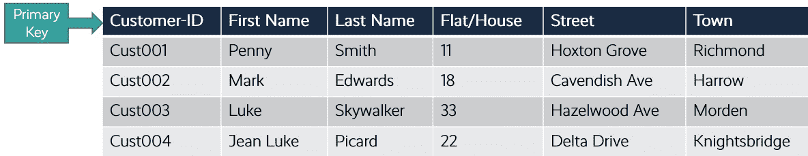

图 8.1 – 客户联系方式表

一个数据库也可以托管多个特定记录集的表格。与其将所有记录存储在一个表中，不如为相关数据创建单独的表。例如，你可以在一个表中存储*客户联系方式*，在另一个表中存储*客户订单*。在大多数情况下，这些表格之间会有某种关系。在这个例子中，表格与特定客户相关，一个表存储他们的联系方式，另一个表存储他们的订单。

将不同的数据集分离到不同的表中，目的是为了更好地管理、提高性能并避免数据重复。例如，如果你有一个单独的表来存储客户的联系方式以及他们的订单，那么每个订单记录都会重复列出客户的联系方式。通过将订单和联系方式分开到不同的表中，我们可以避免数据的重复并提高性能。以下是一个客户订单表的示例：

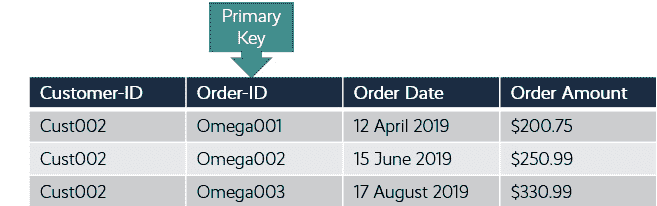

图 8.2 – 客户订单表

在前面的两个表格中，请注意通过将客户联系方式表与订单表分开，我们避免了数据的重复。如果将所有数据放在一个表中，那么我们将有多个包含相同信息的列重复出现，例如同一个客户每次下单时，名字和姓氏都会重复。

数据库中的表格可以相互关联，我们需要某种连接方式来有效地组织数据。在之前的示例中，除了在订单表中重复客户地址信息外，我们仅仅添加了`Customer-ID`列，用来标识该订单对应的客户。记住，`Customer-ID`列是**客户联系方式表**的主键，因此每个客户 ID 都唯一标识一个客户。

最终，我们现在可以通过使用客户 ID 作为参考点，结合两列数据来查询数据库。然后，我们可以通过查询生成一份报告，列出所有由客户`Customer-ID`为`Cust002`下的订单。在此报告中，我们可以列出从第一个表格提取的客户联系方式，以及从第二个表格中列出的订单信息，其中`Customer-ID`为`Cust002`。该报告可以发送给客户作为账户明细。

关系型数据库使你能够对大数据集进行复杂的查询、分析和报告。性能与需要执行的查询类型和托管的数据量直接相关。通常，这意味着你的基础设施可能需要不时升级，以应对需求较高的应用程序。

关系型数据库使用`SELECT`语句使你能够查询特定数据，而`WHERE`语句则可以限制`SELECT`查询以匹配特定条件。在*AWS 认证云从业者*考试中，你不需要掌握如何使用 SQL 语言。

关系型数据库也被称为**在线事务处理**（**OLTP**）**数据库**。**OLTP 数据库**旨在定期向数据库中添加、更新和删除少量数据。典型的例子包括电子商务网站的*客户订单*数据库或大学的学生数据库。

## 非关系型（NoSQL）数据库

使用关系型数据库，你将数据以表格形式存储在定义好的结构中。每个表格的列（称为属性）只会包含一种类型的数据，并且这种类型需要预先定义。你通常会查询多个相关的数据表，通过跨表查询来获取所需的信息。

然而，关系型数据库的问题在于缺乏灵活性，因为数据必须是结构化的。此外，数据库中的表格越多，查询就越复杂，运行和管理数据库所需的资源也越多。关系型数据库在执行每秒数千次读取和写入操作时，也表现得不够理想。

相比之下，非关系型数据库不遵循传统的关系型数据存储方法。非关系型数据库的数据存储使用不同的模型，具体取决于存储的数据类型。以下是这些模型：

+   **键值存储**：这是包含在对象中的键值对集合。

+   **文档数据存储**：这通常是**JavaScript 对象表示法**（**JSON**）格式的文档（尽管也可以使用其他格式），用于以结构化或半结构化的形式存储数据。数据可以包含键值对的嵌套属性。存储中的所有文档不要求保持相同的数据结构，这提供了更高的灵活性。

+   **列式数据存储**：数据按列而非行组织为单元格。此外，读写操作是通过列而不是通过行进行的。

数据库的模式无需预定义，这创造了很多灵活性，因为您可以自由地向文档中添加字段（属性），而无需先定义它们。因此，您的文档可以包含不同数量的字段。例如，一个列出客户详细信息的文档可能包括他们的姓名、地址信息、订单历史和信用卡信息，而另一个文档则可能包含他们最喜欢的产品列表。

非关系型数据库作为关系型数据库的替代品开发，主要解决了需要灵活模式的场景，同时也能处理需要每秒上千次读写的大型数据存储，这是关系型数据库传统上难以做到的。非关系型数据库能够应对这种负载，因为查询不需要查看多个相关的表来提取结果。此外，非关系型数据库可以处理数据的频繁变化。

然而，像关系型数据库一样，非关系型数据库仍然要求至少有一个主键字段（属性），这是唯一必需的属性。除此之外，您的数据库表实际上是无模式的。主键用于确保每条记录在数据库中是唯一的。

在本节中，我们回顾了关系型和非关系型数据库之间的主要区别。我们研究了这两种类型数据库解决方案的使用案例，并比较了它们之间的关键差异。在 AWS 上，提供了关系型和非关系型数据库服务。在接下来的部分中，我们将详细介绍提供的服务。

# 亚马逊 RDS 简介

**亚马逊 RDS**在 AWS 平台上提供传统的关系型数据库作为完全托管的服务。它非常适用于事务型数据库需求，也称为**OLTP**，AWS 提供以下六种不同的数据库引擎：

+   MySQL

+   PostgreSQL

+   MariaDB

+   Microsoft SQL 服务器

+   Oracle

+   亚马逊 Aurora

另一个你可能听说过的术语是**关系型数据库管理系统**（**RDBMS**）。RDBMS 执行创建、读取、更新和删除（**CRUD**）数据库数据的功能，通过一个底层的软件组件，也就是我们称之为数据库引擎。

这里需要理解的一个重要点是，当你选择设置 Amazon RDS 数据库时，你是在为选择的引擎设置一个 *数据库实例*，该引擎将在该实例上运行。你可以在数据库实例上创建一个或多个该引擎支持的数据库。这意味着你可以在单个数据库实例上运行多个数据库。

此外，在 Amazon RDS 上，当你设置数据库实例时，你需要指定硬件能力，形式为 CPU 和内存分配。实例的类型还将决定实例可以提供的最大存储带宽和网络性能。AWS 提供三种不同类型的实例类，具有不同的虚拟硬件规格，适用于各种使用场景。具体如下：

+   **标准类（包括 m 类）**：这些类提供计算、内存和网络资源的平衡，适用于大多数应用需求。标准类提供以下规格：

    +   介于 2 到 96 个 vCPU 之间

    +   最大支持 384 GB 内存

+   **内存优化类（包括 r 类和 x 类）**：这些类非常适合需要更高内存水平的高要求应用，并且针对内存密集型应用进行了优化。内存优化类提供以下规格：

    +   介于 4 到 128 个 vCPU 之间

    +   最大支持 3,904 GB 内存

+   **突发类（包括 t 类）**：这些类专为非生产数据库设计，提供基准性能水平，并能够突发到完全的 CPU 使用率。突发类适用于 CPU 使用量适中的数据库工作负载，这些工作负载偶尔会出现性能高峰。突发类提供以下规格：

    +   介于 1 到 8 个 vCPU 之间

    +   最大支持 32 GB 内存

以下截图展示了你可以选择的不同 **DB 实例类** 选项：

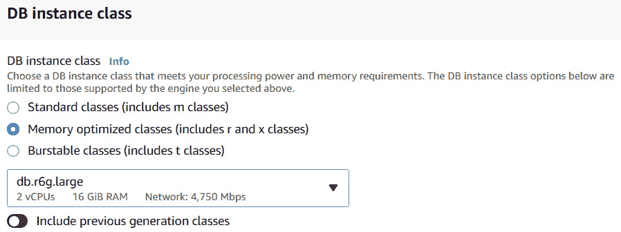

图 8.3 – 数据库实例类型选项

除了计算资源外，Amazon RDS 还需要存储能力来托管所有必需的数据。存储平台运行在 Amazon **EBS** 上，因此它与实际的数据库实例类型解耦。这使得你可以升级存储卷，而不必必然地升级实例类型，反之亦然，只要兼容性得到保证。存储卷的吞吐量由选择的实例类型以及 **每秒输入/输出操作次数** (**IOPS**) 决定。AWS 为你的数据库提供以下不同的存储选项：

+   **通用 SSD**：为标准工作负载设计，适用于大多数数据库，通用 SSD 卷为 MariaDB、MySQL、PostgreSQL 和 Oracle 数据库提供 20 GiB 至 64 TiB 的存储空间，为 Microsoft SQL Server 提供 20 GiB 至 16 TiB 的存储空间。

    达到的 IOPS 数量取决于存储卷的大小，基准 I/O 性能为每 GiB 3 IOPS（最少 100 IOPS）。卷的大小越大，性能越高；例如，一个 60 GiB 的卷将提供 180 IOPS。

    通用型 SSD 还为小于 1 TiB 的卷提供了延时性能提升。这意味着较小的卷在需要时将获得额外的性能提升，而无需为短期偶发的性能峰值分配不必要的存储。然而，对于大于 1 TiB 的卷，性能提升无关紧要。

+   **预配置 IOPS SSD**：AWS 建议对于需要快速且稳定 I/O 性能的生产应用，使用预配置 IOPS SSD。使用预配置 IOPS SSD 时，你可以指定 IOPS 速率和卷的大小。与通用型 SSD 类似，你可以根据使用的底层数据库引擎分配最多 64 TiB 的存储。然而，预配置 IOPS SSD 不提供任何性能提升。

+   **磁性存储**：AWS 还提供了磁性存储卷以支持向后兼容性。它们不建议用于任何生产环境，并且限制为 1,000 IOPS 和最多 3 TiB 的存储。

最终，如果需要，你可以升级存储，但这通常需要短时间的停机，通常为几分钟（对于磁性存储，可能需要更长时间），因此必须提前规划。

## 部署在 Amazon VPC 中

Amazon RDS 是一个区域性服务，这意味着你需要首先选择要部署数据库实例的区域。Amazon RDS 数据库实例只能部署在 VPC 中，并且与 EC2 实例一样，部署在指定的子网中。由于子网始终只与一个可用区关联，这也意味着如果发生可用区故障，你的数据库将无法访问。使用 Amazon RDS，你只能部署**单一主数据库实例**。这种类型的实例既能执行读取操作，也能执行写入操作。Amazon 确实提供了多种解决方案，以防主数据库实例发生故障，我们将在本章稍后讨论这些选项。

在 VPC 中部署 RDS 数据库可以精细控制数据库的访问方式，并允许你配置多种网络安全组件，如你将使用的私有 IP 地址范围、保护 RDS 实例的安全组，以及保护将托管数据库的子网中流量的**网络访问控制列表**（**NACLs**）。

在 VPC 中部署 RDS 数据库也意味着你可以配置多种访问该数据库的架构。以下是你可以配置的一些场景：

+   `3306`用于 MySQL RDS 实例。

+   **通过不同 VPC 中的 EC2 实例访问的 VPC 中的 DB 实例**：在*第六章*，*AWS 网络服务、VPC、Route53 和 CloudFront*中，我们讨论了如何使用 VPC 对等连接服务连接两个 VPC。然后，两个 VPC 中的实例可以通过该对等连接使用私有 IP 地址进行通信，就像它们在同一网络中一样。一旦建立了对等连接，您就需要配置安全组的必要规则，以使流量能够在 EC2 实例和 RDS 数据库之间流动。VPC 对等连接可以让您在同一区域内、跨区域，甚至跨 AWS 账户之间建立对等连接。

+   **通过互联网访问的 VPC 中的 DB 实例**：虽然没有什么可以阻止你将 RDS 数据库实例放置在 VPC 的公共子网中，但这并不被认为是生产环境中的最佳实践。数据库被视为包含关键信息且可能是敏感信息的后端服务。它们应该始终放置在 VPC 的私有子网中。将 RDS 数据库放置在公共子网中应仅限于测试目的或特定用例。

+   **通过私有网络访问的 VPC 中的 DB 实例**：有了 VPC 后，您可以在本地网络和 VPC 之间设置 VPN 隧道或 Direct Connect 服务。这使您可以将 RDS 数据库放置在 VPC 的私有子网中，并通过 VPN 隧道或 Direct Connect 服务从公司办公室访问它。

对于生产环境，始终将 RDS 数据库实例放置在 VPC 的私有子网中。以下图所示的架构展示了这种最佳实践方法。在这里，RDS 数据库部署了一个私有子网，称为**数据库子网**。为了通过标准 Web 应用程序访问数据库，来自互联网的流量通过**弹性负载均衡器**（**ELB**）进行路由（在*第九章*，*AWS 上的高可用性与弹性*中详细讨论），并分发到放置在 VPC 内另一组私有子网中的 Web 服务器。然后，您的 Web 服务器连接到 RDS 数据库，执行如添加、更新或删除记录等数据操作，以满足应用程序的需求。流量可以根据**网络访问控制列表**（**NACLs**）和安全组中定义的规则进行流动：

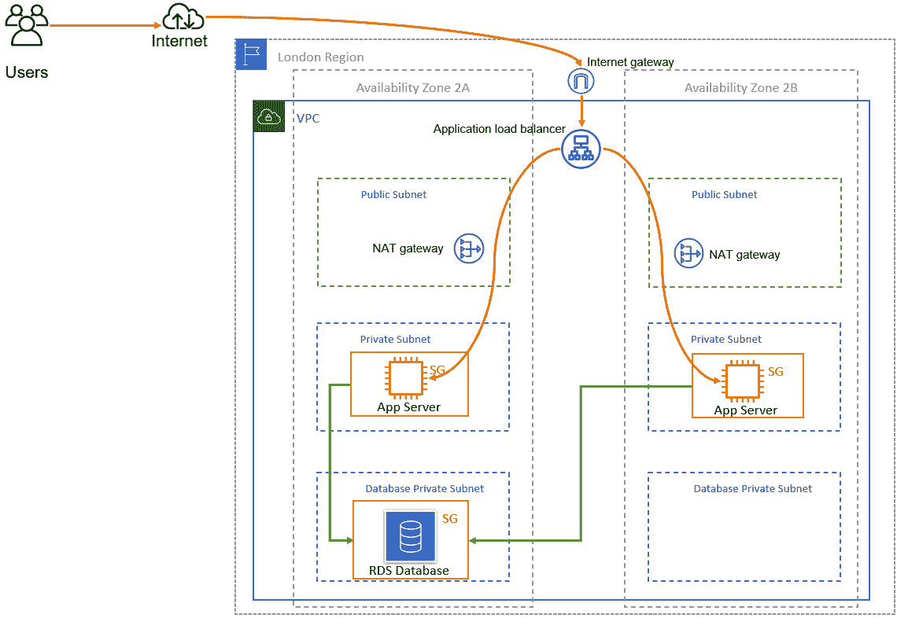

](img/B17124_08_04.jpg)

图 8.4 – 在 VPC 的私有子网中部署的 Amazon RDS

在前面的示意图中，互联网用户可以通过 web/app 服务器访问数据库，而不是直接访问数据库。用户将通过**应用负载均衡器**（**ALB**）连接到 web/app 服务器（该负载均衡器会在健康的 EC2 实例之间分配流量）。web/app 服务器将通过某种流程将数据库操作请求发送到后端私有子网中的 RDS 数据库。

请注意，RDS 数据库只接受来自附加到适当安全组的 EC2 实例的流量。这确保了如果 EC2 实例被替换或附加了新的 EC2 实例，且这些新实例被附加到相同的安全组，它们仍然能够与 RDS 数据库通信。

注意

您的应用程序通过 RDS DNS 端点名称连接到后端数据库，而不是连接到数据库实例的具体 IP 地址。这使得您在发生灾难时能够轻松管理故障切换，我们将在本章的后续内容中讨论这一点。

## 备份与恢复

您的数据库对您来说非常重要，确保您能够从故障、数据丢失甚至数据损坏中恢复将是设计架构时的一个重要因素。AWS 使您能够解决灾难恢复和业务连续性问题，而 Amazon RDS 提供了多个配置选项供您选择。

### 您的 RPO 和 RTO 要求是什么？

当决定在 AWS 上保护数据库免受意外故障或数据损坏时，您需要考虑哪些配置选项能够满足您组织对恢复的期望。如果您的业务托管着关键数据，且在发生故障时需要快速恢复，您需要设计一个能够支持此需求的架构。为了帮助您确定恢复的关键性，您需要确定**恢复点目标**（**RPO**）和**恢复时间目标**（**RTO**）。这两个参数将帮助您设计出符合业务要求的恢复策略：

+   **RTO**：表示从灾难恢复并返回到工作状态所需的时间（以小时为单位）。恢复所需的时间将包括新建数据库实例、执行恢复操作以及完成其他行政或技术任务。

+   **RPO**：表示在发生灾难时您会丢失多少数据（同样以时间为单位，通常是小时）。RPO 越短，发生故障时您丢失的数据就越少。

如果您的组织规定只能接受 2 小时的 RTO 和 4 小时的 RPO，这意味着您需要在 2 小时内从故障恢复到正常状态，而您能接受的最大数据丢失量（可能因为您可以重新生成这些数据）为 4 小时的数据量。

根据您的 RPO 和 RTO 水平，您可以选择符合要求的灾难恢复策略。例如，如果您的 RPO 设置为 4 小时，并且您的恢复策略基于恢复数据库的较旧备份，那么您应每 4 小时执行一次数据库备份。

## 高可用性与多可用区（Multi-AZ）

对于运行 MariaDB、MySQL、PostgreSQL、Oracle、Microsoft SQL 和 Amazon Aurora 的 Amazon RDS 数据库引擎，AWS 提供了使用 **RDS 多可用区** 解决方案的高可用性和故障切换支持。多可用区是一种架构设计模式，其中数据库的主副本部署在一个可用区，而数据库的备用副本则部署在另一个可用区。然后，数据会从主副本同步复制到备用副本，持续进行。通常，对于关系型数据库，只有一个数据库可以保持 *主* 状态，意味着数据可以同时对其进行写入和读取。在多可用区部署的情况下，这仍然适用，数据库的备用副本只是同步接收主副本所做的所有更改。然而，您无法直接从备用副本进行写入或读取。

如果数据库的主副本发生故障，AWS 将执行故障切换操作，将数据库切换到备用副本。备用副本将被提升为新的主副本，之前的主副本将被终止，并替换为另一个备用副本。随后，复制将会在相反方向启动。在故障切换过程中，您的应用可能会经历短暂的中断（大约 2 分钟），但之后能够重新连接到数据库（即已被提升为新主副本的备用副本）并继续运行：

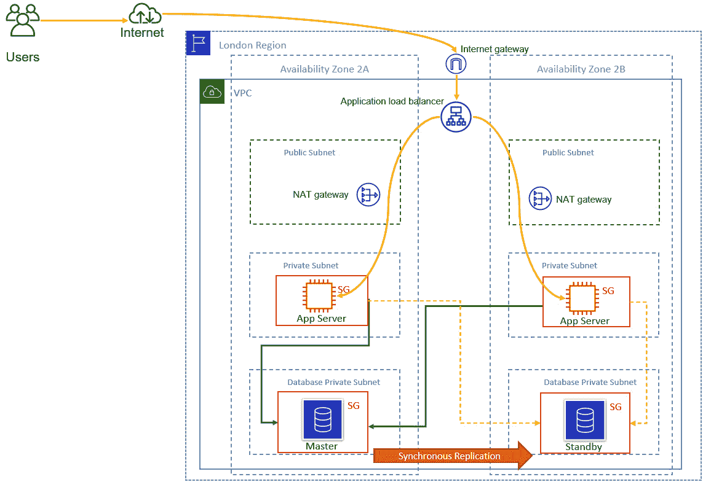

](img/B17124_08_05.jpg)

图 8.5 – 配置了多可用区的 Amazon RDS

故障切换可以因多种原因触发，除了可用区故障外，还包括对主数据库进行修补或实例的升级。您也可以执行故障切换测试，以确保配置正确，通过重启主数据库并在重启时请求故障切换操作来验证。

通过多可用区部署，您可以大幅降低 RTO 和 RPO 水平。因为现有数据已被同步复制到另一个可用区的备用副本，故障切换可以在几分钟内完成，且数据丢失被最小化。

然而，在某些情况下，仅仅依靠多可用区作为灾难恢复（DR）策略可能不足够。例如，如果数据库的主副本发生数据损坏怎么办？那损坏的数据将会同步到备用副本。

## 备份与恢复

AWS 还提供了定期备份数据库的选项，您可以使用这些备份来执行时间点恢复。AWS 提供了两种选项：*自动备份* 和 *手动快照*。

### 自动备份

AWS 提供完全托管的自动备份服务，免费提供至数据库总大小。在执行自动备份时，第一次创建的快照将是完全备份；后续快照将是增量备份，确保只备份数据的变化部分。自动备份的一些附加功能包括：

+   **备份窗口**：自动备份将在预定义的窗口内进行，客户可以进行配置。默认的备份时间为 30 分钟，但你也可以更改此时间。此外，如果备份需要的时间超过了分配的备份窗口时间，备份将在窗口结束后继续，直到完成为止。

+   `0` 天，这基本上意味着禁用备份操作。如果在启动 RDS 实例时禁用了自动备份，你可以通过将备份保留期设置为正的非零值来稍后启用备份。

+   `LatestRestorableTime`，通常是最后的 5 分钟。

### 手动快照

除了自动备份，你还可以创建数据库的手动快照，以提供额外的保护。然后，你可以使用手动快照将数据库实例恢复到已知的状态，按需要频繁进行恢复。

如果计划对数据库进行重大更改，并且希望在更改前再创建一个额外的快照，手动快照非常有用。

自动备份和手动备份在因数据损坏需要恢复时特别有用。请记住，即使启用了多可用区（Multi-AZ），主副本上的任何数据损坏也会复制到备用副本，而拥有较旧的备份可以使你将数据库恢复到数据损坏发生之前的时间点。

### 跨区域快照

你可以将快照复制到其他区域，以进一步提高备份的可用性，以防发生区域性故障或灾难。你还可以配置自动备份和事务日志的复制，将其复制到另一个区域。当 DB 实例上的快照和事务日志准备好时，Amazon RDS 会立即启动跨区域复制。

### I/O 挂起问题

需要注意的一个重要行为模式是，在备份过程初始化时，通常会经历短暂的 I/O 挂起（通常仅持续几秒钟）。在只有单个数据库实例部署的情况下，这会导致连接数据库时出现短暂的中断。这意味着，如果备份操作在工作时间内进行，则用户可能会在备份过程中经历一些中断。

为了解决这个问题，你可以选择确保备份过程发生在非工作时间，或者更好地，按照 Amazon 对数据库进行 Multi-AZ 部署的建议，特别是对于 MariaDB、MySQL、Oracle 和 PostgreSQL 引擎。这是因为在 Multi-AZ 配置中，备份是从数据库的备用副本中进行的，而不是主副本。请注意，对于 Microsoft SQL Server，即使在 Multi-AZ 部署中，备份期间 I/O 活动也会短暂暂停。

## 通过只读副本的横向扩展

传统上，由于架构的原因，关系型数据库在横向扩展方面表现不佳。关系型数据库通常只能有一个主副本（即可以写入数据的副本），这意味着如果主副本发生故障，你需要从备份中恢复数据。AWS 提供了 Multi-AZ 作为克服这一单点故障的方法，它允许你创建数据库的备用副本，并同步将数据复制到该副本。

然而，你不能使用备用副本来执行写操作或读取查询，因为备用副本仅在主副本发生故障时可用。如果你的数据库主副本发生故障，备用副本将被提升为新的主副本，你将开始对其进行读取和写入操作。

在横向扩展方面，AWS 提供了一个选项，允许通过名为**只读副本**的功能扩展数据库的读取副本。AWS RDS 可以利用其内置的复制功能，支持 Microsoft SQL、MySQL、Oracle 和 PostgreSQL，创建源数据库实例的附加只读副本。数据通过*异步*复制从源数据库复制到副本。这有助于减轻主副本的负载，将读取查询重定向到只读副本。仅需要读取数据库数据的应用程序组件可以被路由到读取副本，从而使主副本专注于那些需要写入数据库的应用程序。

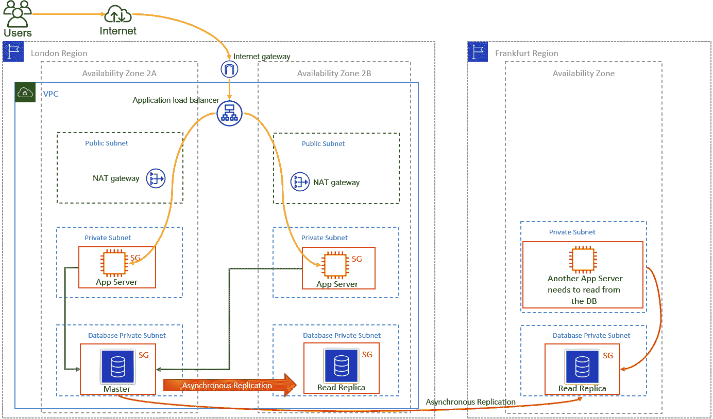

图 8.6 – 带有只读副本的 AWS RDS

只读副本还可以配置为跨区域复制，如前图所示。（唯一的例外是 Microsoft SQL Server 引擎，不支持多可用区只读副本或跨区域只读副本。）这意味着你可以在不同的区域保持数据库的只读副本，这些副本可以供其他仅需要读取数据的应用程序使用。跨区域存储只读副本还可以帮助你解决合规性或监管要求，规定你需要在较远的地方保留数据副本。

你还可以将读副本设置为多可用区（Multi-AZ），这将使你能够将读副本作为灾难恢复（DR）目标。如果你需要将读副本提升为独立的数据库，它将已经配置为多可用区。此功能适用于 MySQL、MariaDB、PostgreSQL 和 Oracle 引擎。最后，你可以为每个数据库实例添加最多五个读副本。

此外，在发生重大灾难时，读副本也可以被提升为主副本，此后它将独立于原始的主数据库副本。

本节中，我们探讨了亚马逊 RDS 及其管理型 RDS 的关键功能。我们回顾了提供的各种数据库引擎、与高可用性和可扩展性相关的概念，以及备份和恢复。

在下一节中，我们将简要介绍 AWS RDS 的一项服务，特别是亚马逊 Aurora。虽然亚马逊 Aurora 是 AWS 提供的 RDS 数据库解决方案，但它提供了几项增强的功能。

## 亚马逊 Aurora 简介

亚马逊 Aurora 是 AWS 的专有 MySQL 和 PostgreSQL 兼容数据库解决方案，旨在企业级生产环境中使用。亚马逊 Aurora 提供了丰富的功能，帮助你设计具有高可用性、可扩展性和成本效益的数据库解决方案，以满足各种业务需求。

亚马逊 Aurora 采用高韧性架构，数据库副本分布在至少三个可用区。它比标准 MySQL 数据库快五倍，比标准 PostgreSQL 数据库快三倍。

该服务提供 *容错* 和 *自愈存储能力*，可以将每个数据库实例的规模扩展到 128 TB。亚马逊 Aurora 还支持最多 15 个低延迟的读副本。让我们回顾一下亚马逊 Aurora 的一些关键特性。

### 亚马逊 Aurora 数据库集群

亚马逊 Aurora 被部署为由一个或多个 **数据库实例** 和 *集群存储卷* 组成的 **数据库集群**。该集群存储卷跨多个可用区，其中存储着集群数据的副本。

Aurora 数据库集群由两种类型的数据库实例组成，如下所示：

+   **主数据库实例**：该实例支持读写操作，并执行所有数据修改操作到集群存储卷。你只有 *一个* 主数据库实例。

+   **Aurora 副本**：除了主数据库实例外，你可以有最多 15 个 Aurora 副本。Aurora 副本连接到与主数据库实例相同的存储卷，但仅用于读操作。当主数据库实例发生故障时，你可以将 Aurora 副本用作故障转移选项。你也可以将主数据库实例的读取查询卸载到副本上。

在架构方面，数据库实例（计算能力）和集群存储卷（存储）是解耦的，如下图所示。

](img/B17124_08_07.jpg)

图 8.7 – Amazon Aurora DB 集群架构

计算能力和存储的解耦还意味着，即使是单个 DB 实例，由于存储卷分布在多个存储节点和多个可用区之间，它仍然是一个集群。

在配置 DB 实例时，你可以选择两种实例类别。这些类别分别是内存优化型（为内存密集型工作负载设计）和突发性能型（提供基准性能水平，并能在需要时提供完整 CPU 使用率的突发能力）。

虽然标准的 Amazon Aurora 部署看起来与部署 Amazon RDS 数据库类似，你需要选择计算能力和基础存储，AWS 也提供了一个无服务器的替代方案，接下来我们将简要介绍。

### Amazon Aurora Serverless

Amazon Aurora Serverless（版本 1）是 Amazon Aurora 的按需自动扩展配置。DB 集群根据需求自动扩展计算能力，并且在不使用时会自动关闭。无服务器的替代方案会根据应用程序的使用情况自动启动，扩展计算能力，并在不使用时关闭。此外，集群的存储卷始终加密。

在使用场景方面，Amazon Aurora Serverless 非常适合工作负载不可预测的应用程序。另一个使用场景是你有一个轻量级应用程序，它每天可能会经历 30 分钟到几小时的高峰，或者在一年中的规律性时间间隔内出现高峰。例子包括预算、会计和报告应用程序。

在本节中，我们简要介绍了 Amazon Aurora 服务。在下一节中，我们将研究 Amazon DynamoDB，这是 AWS 提供的非关系型（NoSQL）数据库服务。

# 了解 Amazon DynamoDB（NoSQL 数据库解决方案）

Amazon 提供了一种完全托管的非关系型数据库解决方案，称为 Amazon DynamoDB。与 AWS 提供的关系型数据库服务（不包括 Amazon Aurora，它也有无服务器选项，如前所述）不同，你不需要担心为应用程序配置合适的 DB 实例。DynamoDB 提供了一个无服务器的解决方案，因为你不需要定义任何数据库实例配置，例如 CPU 或内存配置。Amazon 管理着托管 DynamoDB 服务的基础设施。

DynamoDB 是一个区域性服务，类似于 Amazon RDS，但具有更高的可扩展性和高可用性。你不需要像配置单个 Amazon RDS 数据库实例那样，在一个可用区中配置单个 DB 实例。相反，当你配置 DynamoDB 表时，Amazon 会自动配置数据库，并将数据分布在多个服务器上，以满足你的吞吐量和存储需求。所有数据都存储在**固态硬盘**（**SSDs**）上，底层存储会在多个可用区之间进行复制。

DynamoDB 的架构意味着它可以用于类似于 Amazon RDS 的使用场景，尽管它们更适用于可以拥有数百万并发用户的应用程序，以及需要每秒执行数千次读写操作的场景。

## 表格、项和属性

让我们来看一下 DynamoDB 数据库的核心组件：

+   **表格**：像 Amazon RDS 数据库一样，你的数据存储在表格中。因此，你可以有一个客户表来存储客户和他们订单的信息。每个表也会有一个唯一的主键，这是唯一标识表中每个记录的关键。记录在 DynamoDB 表格中被称为项。

+   `400 KB`大小，可以包含称为属性的键值对。

+   `First-Name`或`Last-Name`等。

与 Amazon RDS 不同，你不需要预定义表的模式。这提供了更大的灵活性，因为你的表会随着时间的推移而发展。除了主键外，你可以添加新的属性并定义它们，以便根据需要扩展表格。

此外，项不必为所有属性都有值——例如，你可以有一个包含客户地址信息、订单和他们在餐厅最喜欢的甜点的表格。有些项可能会有关于最喜欢甜点的值，而有些可能没有，这完全没问题。

然而，属性需要定义数据类型。以下是这里可用的选项：

+   **标量**：只有一个值，可以是数字、字符串、二进制、布尔值或 null。

+   **集合**：表示多个标量值，可以是字符串集合、数字集合或二进制集合。

+   **文档**：这是一个复杂的结构，提供了嵌套属性的选项。你可以使用 JSON 格式的文档，并检索你需要的数据，而无需检索整个文档。文档数据类型有两个子类型：

    +   **列表**：一组有序的值

    +   **映射**：一组无序的名称-值对

在本节中，我们审视了 DynamoDB 数据库的不同组件。在下一节中，我们将学习如何为我们的数据库需求提供所需的容量。

## 为 DynamoDB 提供容量

在提供数据库容量时，你只需要提供定义**读取容量单位**（**RCUs**）和**写入容量单位**（**WCUs**）的参数。这些值使得 Amazon 能够确定为托管你的数据库和吞吐量级别而配置的底层基础设施。

根据你的 RCU 和 WCU，DynamoDB 将分配一个或多个分区来存储你的数据，并使用主键将你的项分布到多个分区。将数据分布到多个分区使得 DynamoDB 能够实现超低延迟的读写操作，无论你表中有多少项。

提供容量的两种选项如下：

+   **按需**：DynamoDB 会根据您的读写请求动态地分配容量。此选项适用于应用流量不可预测且工作负载未知的场景。

+   **预置**：您可以指定应用所需的每秒读写次数。如果您的应用访问模式是可预测的，这是理想的选择。您还可以始终启用 *自动扩展* 来自动调整流量变化。

在本节中，我们了解了 Amazon DynamoDB 和 AWS 的非关系型数据库解决方案。我们发现 DynamoDB 适用于现代 Web 应用，这些应用需要每秒进行数千次的读写操作，以及 DynamoDB 如何专门为此目的构建。

在下一节中，我们将了解 Amazon 的数据仓库解决方案——Amazon Redshift。

# 理解 Amazon Redshift 和数据仓库的应用场景

数据仓库解决方案是一种专门的数据库解决方案，旨在从其他关系型数据库中提取数据，并支持跨不同数据集执行复杂的查询和分析。例如，您可以结合客户订单、库存数据和财务信息，分析产品趋势、需求和投资回报率。

Amazon Redshift 的客户包括 **商业智能**（**BI**）应用、报告和分析工具集。

## 在线分析处理（OLAP）

Amazon Redshift 专为分析设计，并优化了大量数据行扫描的效率，适用于一列或多列数据的扫描。与传统的行存储方式不同，Redshift 以透明方式按列组织数据；它将数据转换为每列的列式存储。我们来看看这意味着什么。

在传统数据库中，每条记录的数据是按行存储的。列代表数据的属性，每行会包含相关列的字段值。

让我们回顾一下之前看到的表格，看看数据是如何存储在磁盘上的块中的：

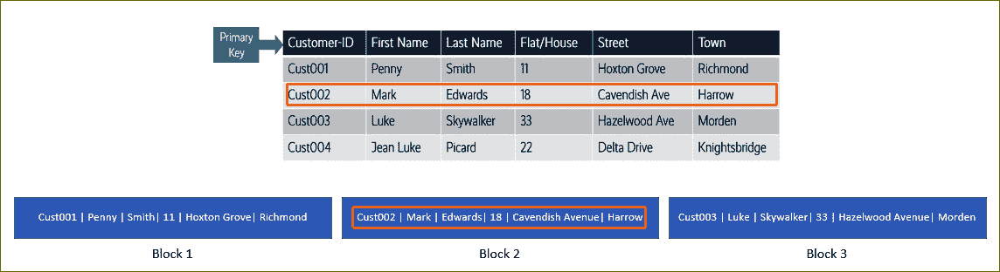

图 8.8 – 数据以块的形式存储在磁盘上

请注意，数据在磁盘上按顺序存储，每列的数据会在块中组成整个行（*块 1、2、3，依此类推*）。如果记录大小大于块大小，那么记录会跨越多个块存储。类似地，如果记录大小小于块大小，记录可能占用的空间小于一个块的大小。最终，这种存储数据的方式会导致存储利用效率低下。

话虽如此，在传统的关系型数据库中，大多数事务通常涉及对一小部分记录的频繁读写查询，在这种情况下，需要检索整个记录集。

现在，我们来看看 Redshift 如何存储数据。使用相同的客户数据表，每个数据块存储单一列在多个行中的值，具体如以下图所示：

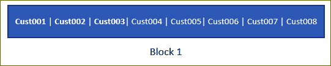

图 8.9 – 存储在 Amazon Redshift 上的数据

Amazon Redshift 在添加数据时会将其转换为列式存储。通过这种架构，Amazon Redshift 可以存储比传统的行式数据库存储更多的记录数，其列字段值最多可以存储三倍数量的记录。这意味着，在读取给定记录集的列字段值时，你仅消耗传统行式存储的三分之一 I/O 操作。此外，由于存储在块中的数据类型相同，你可以使用为列式数据类型设计的压缩方法来实现更好的 I/O 性能，并减少整体存储空间。该架构非常适合数据仓库解决方案，因为从其本质上讲，你的查询是为了从非常多的行中提取数据进行分析，只读取少数列。此外，查询所需的内存也仅为处理行式数据块所需内存的一个小部分。

最终，Redshift 被设计为承载 PB 级别的数据，并支持大规模并行数据处理，以便进行高性能查询。

## Redshift 架构

Redshift 架构基于一个集群模型，包含以下内容：

+   **领导节点**：一个单独的节点，负责管理客户端应用程序与*计算节点*之间的所有通信。领导节点执行所有操作，比如执行复杂查询所需的步骤——领导节点将编译代码并将其分发到计算节点。

+   `128` 个计算节点可以是一个 Redshift 集群的一部分。计算节点执行领导节点提供的已编译代码，并将中间结果返回进行最终汇总。每个计算节点都会有自己的专用 CPU、内存和磁盘类型，这决定了节点的类型：

    +   **高密度计算节点**：这些节点可以在磁盘上存储最多 326 TB 的数据。

    +   **高密度存储节点**：可以在**固态硬盘**（**SSD**）上存储最多 2 PB 的数据。

    +   **RA3 实例**：这一代由 Nitro 技术驱动的计算实例配备了*托管存储*（与其他先前的节点类型不同）。你可以根据性能需求选择一些节点，并且只为你实际使用的托管存储付费。这种架构将计算和存储组件解耦。此外，数据存储被拆分，本地 SSD 存储用于快速访问缓存数据，而 Amazon S3 则用于提供长期耐久存储，并自动扩展。如果你希望使用托管存储，你需要升级你的高密度计算节点和高密度存储节点。

在本节中，我们向你介绍了 Amazon Redshift 服务，它是一个为**OLAP**操作设计的云托管数据仓库解决方案。在下一节中，我们将查看 Amazon Redshift 的另一个功能，即 Redshift Spectrum 服务，它允许你直接查询存储在 Amazon S3 中的数据。

## 关于 Redshift Spectrum

Amazon Redshift 的另一个解决方案是**Redshift Spectrum**服务，它允许你对直接存储在 Amazon S3 存储桶中的数据执行 SQL 查询。如果你将频繁访问的数据存储在 Redshift 中，而一些不常用的数据存储在 Amazon S3 中，这特别有用。与其将不常用的数据导入 Redshift 并偶尔查询，不如将它们存储在 Amazon S3 中，并使用 Redshift Spectrum，这样会更加经济实惠。

还需要注意的是，S3 中的数据必须是结构化的，你必须定义结构才能使 Redshift 能够使用这些数据。

# 了解使用 Amazon Elasticache 进行内存缓存选项的重要性

你经常会发现自己定期访问一组数据，这就是我们所说的频繁访问的数据。每次你在数据库上运行查询时，你都在消耗资源来执行查询操作，然后检索数据。总体来说，这会增加数据库的负载，甚至可能影响性能，因为你不断向数据库写入新数据。

作为整体应用架构的一部分，你应该考虑使用 AWS 提供的内存缓存引擎，以减轻主数据库的负载。**Amazon Elasticache**是一个提供云中内存缓存的 Web 服务。通过在 Amazon Elasticache 上缓存频繁访问的数据，应用程序可以配置从中检索数据，而不是进行更昂贵的数据库调用。

AWS 提供了两种内存缓存引擎，如下所示：

+   **Amazon Elasticache for Redis**：这是作为集群构建的，集群包含一个或多个缓存节点，所有节点都运行 Redis 缓存引擎软件的实例。Redis 专为**复杂数据类型**设计，提供多可用区（Multi-AZ）功能、数据加密、符合 FedRAMP、HIPAA 和 PCI-DSS 标准，以及高可用性和自动故障转移选项。

+   **Amazon Elasticache for Memcached**：这是为**简单数据类型**设计的。在这里，你可以运行具有多个核心或线程的大型节点并进行横向扩展。它应该在需要对象缓存的地方使用。

在本节中，我们学习了各种 AWS Elasticache 服务，这些服务为我们的应用程序提供了内存缓存功能。内存缓存可以通过缓存频繁访问的数据，而不是反复运行昂贵的查询，来减轻主数据库的负担。在下一节中，我们将了解 AWS 提供的其他数据库，这些数据库解决了特定的细分市场需求。

# 学习针对特定细分需求的额外数据库服务

除了 Amazon RDS 和 DynamoDB 外，AWS 还提供满足特定应用需求的其他数据库。在本节中，我们将介绍其中的两个数据库：**Amazon Neptune** 和 **Amazon Quantum Ledger Database**（**QLDB**）。

## Amazon Neptune 介绍

Amazon Neptune 是一种完全托管的图数据库服务，是一种 NoSQL 数据库。图数据库旨在将数据存储为节点（如人、地点、位置等）和连接。每个节点都有某些属性，节点之间存在关系。例如，**Alice** 住在 **London**，而在 **London** 有一位名叫 **Alice** 的居民。这是一个简单的例子，但您可以开始想象节点及其关系的复杂性。这些节点之间复杂的关系与数据本身同样重要，非常适合图数据库解决方案。传统的关系型数据库需要您在表之间定义复杂的联接，即便如此，在尝试提取数据时仍会导致低效。

Amazon Neptune 支持广泛使用的图形模型，如属性图和 W3C 的 RDF 以及它们各自的查询语言，如 Apache TinkerPop、Gremlin 和 SPARQL。Amazon Neptune 是一种高可用的数据库解决方案，提供时间点恢复和连续备份到 Amazon S3，并且具有可用区复制功能。Amazon Neptune 的典型应用场景包括欺诈检测、知识图谱、药物发现和网络安全等应用。

## Amazon QLDB

某些类型的数据具有高度敏感性，维护数据完整性至关重要。此类数据的例子包括银行交易记录，您需要跟踪借贷历史，或者保险索赔申请，您需要保持可验证的索赔过程历史。另一个例子是必须追踪供应链网络中零部件的流动，并能够证明这些物品到达客户的过程。

虽然您可以使用关系型数据库来托管这些账本类型的数据，但您需要构建审计追踪功能，这可能非常繁琐并容易出错。此外，由于关系型数据库中的数据本身并不是不可变的，因此很难验证数据是否被更改或删除。

一种替代解决方案是构建一个**区块链**网络。像 Hyperledger Fabric 和 Ethereum 这样的区块链框架使您能够构建去中心化的数据库，其中存储的数据是不可变的，并且可以通过加密方式验证。然而，区块链网络非常复杂，并且设计为去中心化模型，其中包含多个节点，需要在记录提交到数据库之前验证每个记录。

Amazon **QLDB** 是一项完全托管的分类账数据库服务，允许你在集中式数据库模型中存储不可更改的记录，并且具备加密验证的事务日志功能。Amazon QLDB 可以保持所有数据变更的历史记录。以下是 Amazon QLDB 的主要优势：

+   **不可更改且透明**：它使你能够跟踪并维护每次数据变更的序列事务日志（日志）。使用 QLDB 时，事务日志是不可更改的，这意味着它无法被修改或删除。QLDB 跟踪每次应用数据的变更，并保持所有变更的完整且可验证的历史记录。

+   **加密可验证**：你可以使用 SHA 256 加密哈希函数生成安全的输出文件，记录数据变更历史。这也被称为 *摘要*，它作为任何数据变更的证据。它可以验证所有数据变更的完整性。

+   **易于使用**：它使用灵活的文档数据模型。你可以使用类似 SQL 的查询语言来查询数据，这种语言被称为 PartiQL。Amazon QLDB 事务符合 ACID 标准。

+   **无服务器**：Amazon QLDB 是一项完全托管的数据库服务，无需预配置数据库实例或担心容量限制。你可以通过创建分类账并定义表格来开始。在此过程中，QLDB 会根据应用的需求自动扩展。

在本节中，我们探讨了几个针对特定应用的额外数据库解决方案。在下一节中，我们将介绍 AWS 提供的数据库迁移服务，帮助你将本地数据库迁移到云端。

# 数据库迁移服务

亚马逊提供 **数据库迁移服务** (**DMS**)，可以用于将数据从一个数据库迁移到另一个数据库。通常，这作为从本地到云的迁移策略的一部分，帮助你将位于数据中心的数据库服务迁移到你的 AWS 云账户中。AWS DMS 支持同质迁移（如 MySQL 到 MySQL 或 Oracle 到 Oracle），以及异质迁移（如 Oracle 到 Microsoft SQL Server 或 Amazon Aurora）之间的迁移。

需要注意的一个重要点是，在迁移过程中，你可以继续使用源数据库，这样可以将业务操作的停机时间降到最低。此外，你还可以使用 DMS 执行从本地环境到云端的持续数据复制，以提供高可用性或灾难恢复能力。

# 练习 8.1 – 扩展你的 VPC 以托管数据库子网

在*第七章*中，*AWS 计算服务*，你扩展了你的 VPC，以包括私有子网和公共子网。通常，你只会在公共子网中托管需要直接暴露到互联网的服务。例如，之前在*第七章*中我们部署的堡垒主机服务器（我们将在下一章中讨论）。

大多数应用程序是跨层级部署的——例如，你可以有一个 Web 层，一个应用层和一个数据库层。这些不同的层级旨在将应用程序堆栈的不同组件分离开来，从而实现一定程度的隔离，并从分层安全模型中受益。在*第七章*中，*AWS 计算服务*，作为*练习 7.1 – 扩展 ProductionVPC，使其包括两个公共子网和两个私有子网*，你还在两个可用区配置了两个私有子网来托管你的应用服务器。在这个例子中，应用层和 Web 层是相同的。然而，在许多实际场景中，它们将是分开的。

在本练习中，你将扩展你的 VPC，以添加一个额外的层级，即数据库层，在该层内你将能够启动一个 Amazon RDS 数据库。像 EC2 实例一样，Amazon RDS 也需要在 VPC 中部署。

在下图中，你可以看到你的 VPC 现在有三个层级——一个公共（DMZ）层，用于托管堡垒主机服务器、NAT 网关和弹性负载均衡器，一个应用层，由**Private Subnet One – App**和**Private Subnet Two – App**子网组成，最后是一个数据库层，由**Private Subnet Three – Data**和**Private Subnet Four – Data**子网组成。请注意，这些子网分布在两个可用区，以便在发生可用区故障时为你提供高可用性服务。我们将在下一章中更详细地讨论高可用性：

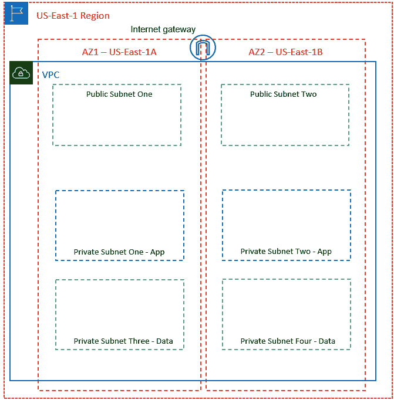

图 8.10 – 扩展 VPC 以包括数据库层

让我们开始扩展你的 VPC，使其包括我们的数据库层：

1.  重新登录到你的 AWS 账户，作为管理员**Alice**。

1.  导航到**VPC**仪表板，并确保你位于**US-East-1**区域。

1.  在左侧菜单中，点击**子网**。

1.  接下来，点击屏幕右上角的**创建子网**按钮。

1.  你将看到**创建子网**向导页面。

1.  在**VPC ID**下，从下拉菜单中选择**ProductionVPC**。

1.  在**子网设置**部分，在**子网 1 of 1**下，为你的第一个数据库子网提供一个名称。对于本练习，将你的子网命名为**Private Subnet Three – Data**。

1.  在**可用区**下，选择**us-east-1a**可用区。

1.  接下来，处理`10.0.5.0/24`。

1.  接下来，您无需创建此子网并重复向导来创建第二个数据库子网，只需点击**添加新子网**按钮，参考以下截图：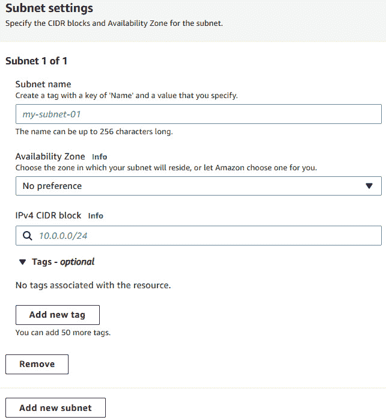

    图 8.11 – 创建多个子网

1.  一个新的子节**子网 2/2**将出现，允许您在同一向导中创建额外的子网。在**子网名称**下，输入**私有子网四 - 数据**。

1.  对于**可用区**，从下拉列表中选择**us-east-1b**可用区。

1.  对于`10.0.6.0/24`。

1.  点击页面底部的**创建子网**按钮。

AWS 将成功创建两个新子网，您将使用它们来托管 Amazon RDS 数据库。在右侧菜单中，点击**子网**以查看当前与您的**ProductionVPC**相关联的所有子网，如以下截图所示：

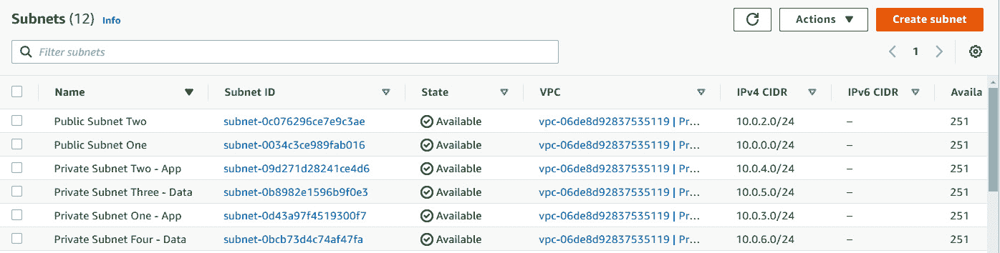

图 8.12 – 生产 VPC 中的子网

现在，您已经为您的**ProductionVPC**创建了另外两个子网，您可以继续本次练习的下一部分。与 EC2 实例一样，Amazon RDS 数据库也需要您配置必要的安全组，以允许流量进入数据库实例。

在我们的分层安全模型中，我们希望确保只有我们的应用服务器能够与后台的数据库进行通信。在此部分练习中，您将创建一个新的安全组，并配置该安全组以允许来自您稍后部署的任何应用服务器的数据库相关流量。为此，您必须在新的数据库安全组上配置入站规则，以接受来自应用服务器的安全组，特别是来自**AppServers-SG**安全组的 MySQL 流量（端口`3306`）。让我们开始：

1.  确保您当前在**VPC**仪表板中。然后，在左侧菜单中，点击**安全组**。

1.  点击屏幕右上角的**创建安全组**按钮。

1.  对于`Database-SG`，在描述中输入`允许来自 AppServer-SG 的 MySQL 流量`。

1.  在**VPC**下，确保从下拉列表中选择**ProductionVPC**。

1.  接下来，在**入站规则**部分，点击**添加规则**按钮。

1.  在**类型**下，选择**MySQL/Aurora**。

1.  确保`sg-`。您应该会看到所有安全组的列表。选择**AppServers-SG**安全组。

1.  如有需要，提供可选描述。

1.  点击屏幕右下角的**创建安全组**按钮。

AWS 现在会确认安全组已成功创建。

在本次练习中，您扩展了 VPC 以托管两个额外的私有子网，这些子网将用于托管我们的 Amazon RDS 数据库。您还创建了一个新的安全组，允许来自与**AppServer-SG**安全组关联的任何 EC2 实例的`3306`流量。

在下一个练习中，我们将配置一个 Amazon RDS 数据库子网组，该组将用于告知 Amazon RDS 可以将我们的数据库部署到哪些子网中。

# 练习 8.2 – 创建数据库子网组

在您的 VPC 中启动 RDS 数据库之前，您需要定义一个 DB 子网组。**DB 子网组**是 VPC 中的两个或更多子网的集合，您希望在其内部部署数据库实例。在创建 DB 子网组时，必须在 VPC 中选择至少两个与区域内两个不同可用区关联的子网。Amazon RDS 使用子网组的 IP 地址 CIDR 块为您的 RDS 数据库实例分配 IP 地址。

Amazon RDS 随后可以在您选择的子网中的一个部署数据库实例，该子网是子网组的一部分。在多可用区部署的情况下，主副本将部署在特定可用区内的一个子网中，而备用副本将部署在另一个可用区内的另一个子网中。

请注意，数据库子网组中的子网可以是公共的或私有的，但不能混合使用。理想情况下，您应将私有子网配置为您 VPC 中子网组的一部分，因为您希望在私有子网中部署任何后端数据库。您的数据库应仅可从 Web/应用服务器访问，而不直接从互联网访问。

设置数据库子网组，请按照以下步骤操作：

1.  确保您已登录为 IAM 用户**Alice**的**AWS 管理控制台**。

1.  从左上角菜单中，单击**服务**下拉箭头，选择**RDS**，位于**数据库**类别下。这将带您进入 Amazon RDS 仪表板。

1.  确保您位于**us-east-1**地区，并从左侧菜单中单击**子网组**。

1.  接下来，在屏幕的主窗格中，单击**创建 DB 子网组**按钮。

1.  在显示的页面上，您需要定义您的数据库子网组详细信息：

    +   为您的数据库子网组提供一个名称；例如，`ProductionVPC-DBSubnet`。

    +   对于描述，键入`DB Subnet Group to host RDS Database in Production VPC`。

    +   在**VPC**下拉菜单中，从中选择**ProductionVPC**。

    +   接下来，在**可用区域**下，选择包含您要添加的子网的可用区。在本练习中，选择**us-east-1a**和**us-east-1b**旁边的复选框。

1.  接下来，在`10.0.5.0/24`和`10.0.6.0/24`的 IPv4 CIDR 块下，如下截图所示：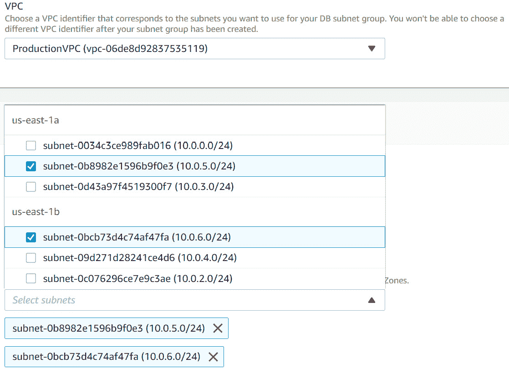

    图 8.13 – 创建数据库子网组

1.  接下来，在屏幕右下角点击**创建**按钮。

AWS 将使用您提供的详细信息创建您的数据库子网组，如下截图所示：

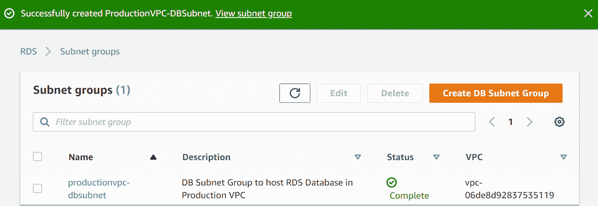

图 8.14 – 成功创建数据库子网组

在本练习中，你了解了 RDS 数据库子网组，它允许你定义至少两个子网，跨越两个可用区，当你选择启动数据库时，Amazon RDS 可以在这些子网中部署你的 RDS 数据库实例。

在下一个练习中，我们将启动我们的 RDS 数据库在**ProductionVPC**中。我们还将使用这个数据库来托管我们网页应用的后端数据，随后在下一章的第四个练习中部署该应用。

# 练习 8.3 – 在 ProductionVPC 中启动你的 Amazon RDS 数据库

在本练习中，你将启动一个 Amazon RDS MySQL 数据库，在**ProductionVPC**的数据库子网组中。我们开始吧：

1.  确保你已经以 IAM 用户**Alice**登录到 AWS 账户。

1.  转到 Amazon RDS 仪表板。

1.  从左侧菜单中，选择**数据库**。

1.  在面板的右侧，点击**创建数据库**按钮。

1.  接下来，你将看到运行 MySQL 引擎的`t2.micro`数据库实例，作为免费套餐的一部分，提供以下功能，适用于最多 12 个月：

    +   750 小时的 Amazon RDS 在单一可用区 db.t2.micro 实例中。

    +   20 GB 的一般用途存储（SSD）。

    +   20 GB 用于自动备份存储和任何用户启动的数据库快照。

1.  对于**选择数据库创建方式**，选择**标准创建**旁边的选项。

1.  接下来，在数据库引擎选项中，选择**MySQL**。

1.  保持**版本**和**版本设置**的默认值。

1.  在**模板**下，选择**免费套餐**选项。

1.  接下来，你需要提供一些设置：

    +   对于数据库实例标识符，输入`productiondb`。

    +   在**凭证设置**下，保持**主用户名**为**admin**，并提供你选择的密码。确保记下这个密码，否则你将无法连接到数据库。

1.  在**数据库实例类别**下，保持默认设置。

1.  在**存储**下，保持默认设置，除了**存储自动扩展**，你应该*禁用*启用**存储自动扩展**的选项。

1.  在**可用性与耐用性**下，你会注意到启用**多可用区（Multi-AZ）**的选项是灰色的。这是因为在免费套餐中，Multi-AZ 不可用。

1.  接下来，在`productionvpc-dbsubnet`下。

1.  在`3306`下。

1.  在**数据库认证选项**下，确保启用**密码认证**。

1.  在`productiondb`下。

1.  保持**DB 参数组**和**选项组**的默认设置。

1.  在**备份**下，确保启用**自动备份**，然后将**备份保留期**设置为**1 天**。

1.  在**备份窗口**下，选择**无偏好**选项。对于实际应用，你可能希望将备份窗口设置为非工作时间段。

1.  在**维护**小节下，保持默认设置。

1.  最后，点击屏幕右下角的**创建数据库**按钮。

你的 RDS 数据库将需要几分钟来启动。在启动过程中，还会执行初始备份。一旦数据库成功启动并准备好使用，你将看到它的**状态**设置为**可用**，如下截图所示：

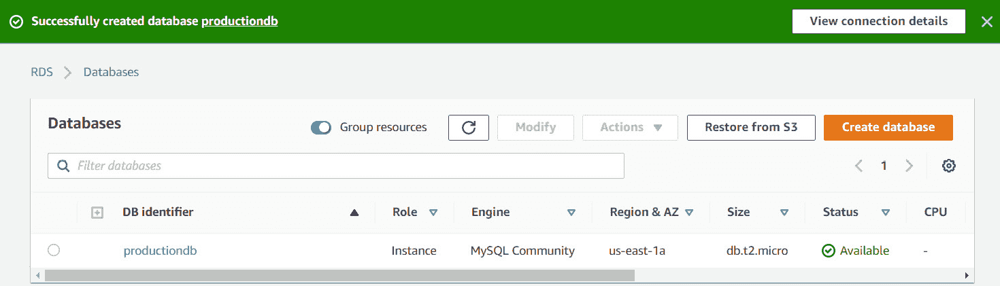

图 8.15 – RDS 数据库创建成功通知

在下一个练习中，你将学习如何部署 DynamoDB 表格。

# 练习 8.4 – 部署 Amazon DynamoDB 表格

在这个练习中，你将部署一个非常简单的 DynamoDB 表格。让我们开始吧：

1.  确保你已登录到 AWS 账户，且使用的是名为**Alice**的 IAM 用户。

1.  接下来，导航到 DynamoDB 仪表板。你可以在**AWS 管理控制台**的顶部搜索框中搜索`DynamoDB`。

1.  如果这是你第一次访问**DynamoDB 控制台**页面，你将看到一个启动画面。

1.  点击**创建表格**按钮。

1.  在`食谱`旁边的文本框中提供一个表格名称。

1.  在`RecipeName`中，确保类型设置为**字符串**。

1.  在**表格设置**下，取消勾选**使用默认设置**旁边的框。

1.  在**读/写容量模式**部分，选择**按需**选项。

1.  点击页面底部的**创建**按钮。DynamoDB 将在几秒钟内为你创建一个新表格，如下截图所示：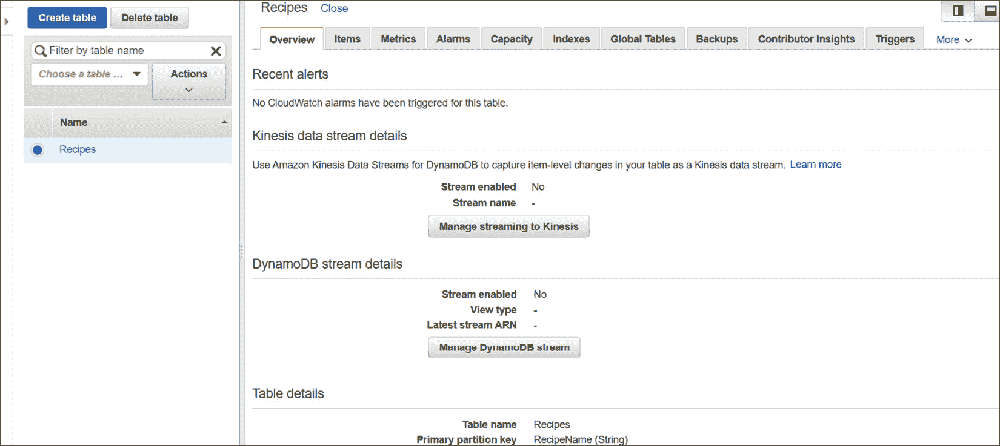

    图 8.16 – DynamoDB 表格 – 食谱

1.  点击**项目**标签。

1.  你可以在**项目**标签中开始添加项目。点击**创建项目**按钮。

1.  你将看到一个对话框，在其中可以向数据库添加新项（记录）。

1.  在`Vegan Sausage Rolls`旁边的文本框中。

1.  点击**保存**按钮。

1.  请注意，新的项已经添加，并且该项的主键值是食谱的名称`Vegan Sausage Rolls`。

1.  再次点击**创建项目**按钮。

1.  在`Vegan Peri Peri Burger`旁边的文本框中。

1.  点击*加号*并选择`配料`。你还会注意到，下面的**StringSet**中出现了一个额外的条目，这就是你输入刚刚创建的字段值的地方。点击*空数组*行旁边的*加号*并选择**附加**。

1.  在`生菜` `西红柿` `黄瓜`中。点击屏幕的其他部分以更新值，如下截图所示：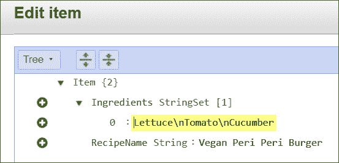

    图 8.17 – DynamoDB 项条目

1.  点击**保存**按钮。

1.  此时，你的表格已更新了新记录。你将看到表格中有两个项。**Vegan Sausage Roll**项只有一个字段并且有值，即主键。**Vegan Peri Peri Burger**项有两个字段与之相关，其中包括主键和一个名为**配料**的属性。请参考以下截图：

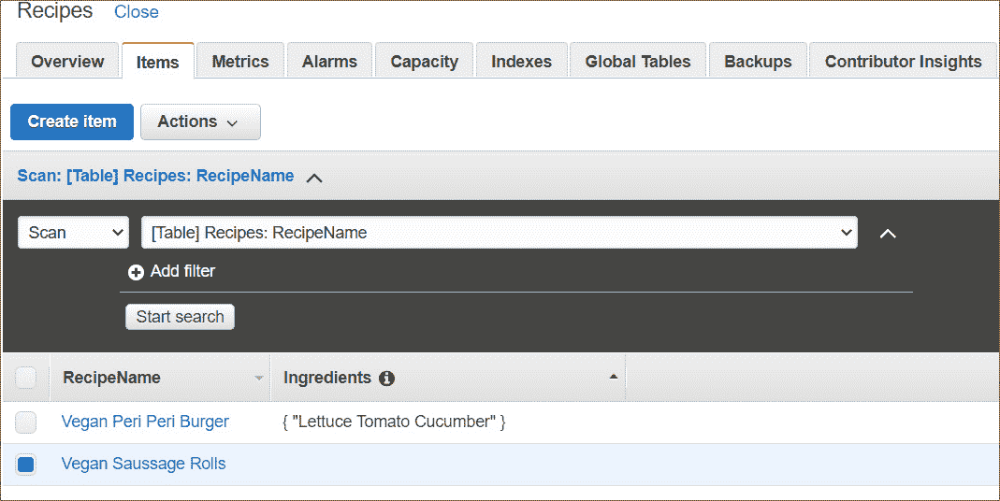

图 8.18 – DynamoDB 配方表

如您所见，DynamoDB 提供了很大的灵活性，不需要在输入数据之前定义严格的模式。

接下来，我们将通过总结本章内容来结束。

# 总结

在本章中，我们了解了 Amazon 提供的各种数据库服务，包括关系型和非关系型数据库服务。您了解了 AWS 如何使您能够快速部署新的 RDS 数据库，并提供数据库作为服务的完全管理，而不需要您自己配置 EC2 实例并在其上安装数据库软件。

Amazon RDS 提供六种引擎——MySQL、PostgreSQL、Microsoft SQL、Oracle、MariaDB 和 Amazon Aurora。Amazon RDS 是一项区域性服务，必须部署在您的 VPC 中。您可以使用诸如 Multi-AZ 和备份恢复策略等服务来配置高可用性。您还可以扩展 RDS 数据库的只读副本，以减轻主数据库的读取查询负担。

Amazon Aurora 带有更多的功能，并解决了传统 RDS 引擎的一些局限性，包括自我修复和高可用性等功能。

接着，我们了解了 Amazon DynamoDB，这是一种为现代 Web、移动应用和物联网应用设计的非关系型数据库，能够每秒处理成千上万的请求。Amazon DynamoDB 提供完全无服务器的解决方案——您无需自行配置数据库实例或存储。您只需指定**WCUs** 和 **RCUs**，AWS 会为您配置底层基础设施。

此外，我们还研究了 Amazon Elasticache 服务提供的两种内存缓存引擎——Redis 和 Memcached——并比较了在不同场景下应使用哪种引擎。

最后，我们考察了 AWS DMS3，它提供了同构迁移（例如 Oracle 到 Oracle 的迁移）和异构迁移（例如 Oracle 到 Microsoft SQL 类型的迁移）。AWS DMS 可以非常轻松地将本地数据库迁移到云端。

在下一章中，我们将讨论与高可用性和可扩展性相关的概念。此外，我们还将进行各种实验，帮助您学习如何结合我们迄今为止学习的各项核心服务。您将通过部署一个多层应用架构来实现这一点。

# 问题

1.  一家公司计划将其本地的 MySQL 数据库迁移到 Amazon RDS。他们应该使用哪个 AWS 服务来完成这项任务？

    1.  Amazon Snowball

    1.  AWS 数据库迁移服务 (AWS DMS)

    1.  AWS VM 导入/导出

    1.  AWS 服务器迁移服务

1.  以下哪项是使用 Amazon RDS 数据库而不是在 EC2 实例上安装 MySQL 兼容数据库的主要好处？

    1.  数据库的管理，包括补丁更新和备份，由 Amazon 负责。

    1.  数据库的管理，包括补丁更新和备份，由客户负责。

    1.  你可以完全访问 RDS 数据库运行的操作系统层。

    1.  你可以选择安装 RDS 数据库的驱动器和分区。

1.  AWS RDS 支持六种数据库引擎。以下是支持 Amazon RDS 的 *三种*引擎。

    1.  Microsoft SQL

    1.  Oracle

    1.  MySQL

    1.  FoxPro

    1.  Db2

1.  你正在为一个财富资产管理公司构建应用程序，用于存储股票、共同基金和外汇的投资组合数据和交易记录。因此，你需要一个后端数据库解决方案，以确保类似账本的功能，因为他们希望维护应用程序数据的准确历史记录，例如，跟踪客户的借贷历史。你会推荐哪种 AWS 数据库解决方案来满足这一业务需求？

    1.  Amazon RDS

    1.  Amazon DynamoDB

    1.  Amazon QLDB

    1.  Amazon Redshift

1.  哪种 AWS 数据库解决方案能够帮助你构建一个完整的数据仓库解决方案，能够处理复杂的分析查询，针对 PB 级别的结构化数据，使用标准 SQL 和行业认可的商业智能工具？

    1.  AWS DynamoDB

    1.  AWS Redshift

    1.  AWS Neptune

    1.  AWS Pluto

1.  你希望托管一个生产级的企业关系数据库解决方案，该方案提供高级功能，如自修复存储系统，能够扩展到每个数据库实例 128 TB。以下哪个 AWS 数据库解决方案满足这个需求？

    1.  Amazon DynamoDB

    1.  Amazon Aurora

    1.  Amazon Redshift

    1.  Amazon Neptune

1.  哪个 Amazon Redshift 的 AWS 特性可以让你直接对存储在 Amazon S3 存储桶中的数据执行 SQL 查询？

    1.  Redshift DaX

    1.  Athena

    1.  Redshift Spectrum

    1.  Redshift 缓存

1.  哪项 AWS 服务可以帮助你将本地的 MySQL 数据库迁移到运行 Oracle 引擎的 Amazon RDS 数据库？

    1.  AWS 跨区域复制

    1.  AWS SMS

    1.  AWS DMS

    1.  AWS EFS

1.  你正在运行一个单一的 RDS DB 实例。你会推荐哪种配置，以避免在执行备份时出现 I/O 暂停问题？

    1.  配置 RDS 只读副本。

    1.  配置 RDS 多可用区。

    1.  配置 RDS 跨区域备份。

    1.  配置 DynamoDB DaX。
