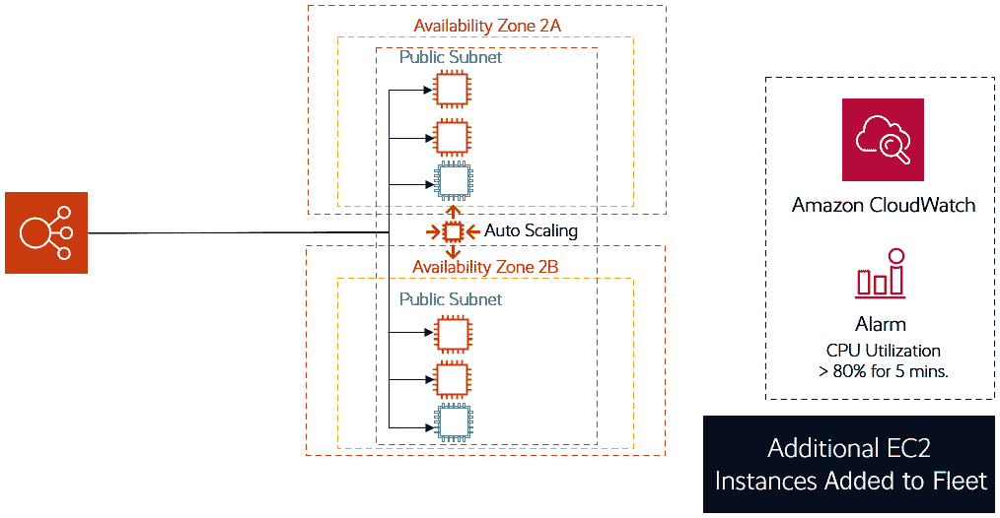
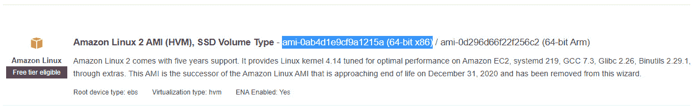

# 第九章：AWS 上的高可用性与弹性

大多数应用程序遵循一个设计模式，包含多个层次——例如网络层、计算层和存储与数据库层。我们称之为多层应用程序。例如，你可以拥有一个三层应用程序栈，其中包括提供前端 Web 接口访问的 Web 服务层、一个可能进行所有数据处理的应用层以及一个用于存储和管理数据的后端数据库层。

在本章中，我们将开始将迄今为止学习的各种核心**亚马逊网络服务**（**AWS**）整合在一起，设计和架构一个完整的**端到端**（**E2E**）解决方案。此外，在前几章中，我们只部署了各种 AWS 服务的单个资源实例——例如，单个 **弹性计算云**（**EC2**）实例提供计算能力，或者在上一章中，我们在**虚拟私有云**（**VPC**）的公有子网中部署了单个亚马逊 **关系数据库服务**（**RDS**）数据库实例。

在实际场景中，通常需要集成一些组件，以帮助实现**高可用性**（**HA**）和**可扩展性**。我们可以通过让多个 EC2 实例为同一应用程序或网站提供服务来提高应用程序的可用性。这样，如果某个 EC2 实例发生故障，用户仍然可以继续访问其他健康的 EC2 实例提供的服务，而不会受到故障或异常实例的影响。我们还可以确保将 EC2 实例分布在多个**可用区**（**AZs**）中，确保如果某个 AZ 发生故障或仅仅下线，用户可以被重定向到另一个 AZ 中健康的 EC2 实例。

同样，我们需要提供可扩展的解决方案。AWS 提供了可以在需要时自动扩展的服务；例如，当我们注意到流量增加时，可以添加更多 EC2 实例来应对负载。反过来，当需求下降时，相同的 AWS 服务也可以自动缩减规模，使我们能够节省因运行低负载服务器而产生的不必要费用。

最后，我们还需要考虑服务的全球可用性。许多公司有全球客户，尽管许多 AWS 服务是为区域性可用性和可扩展性选项设计的，但其他 AWS 服务可以帮助我们实现全球可用性，甚至提供针对区域性故障的韧性。

在本章中，我们将讨论以下关键概念：

+   垂直和水平扩展概念简介

+   **开放系统互联**（**OSI**）模型概述

+   使用亚马逊 **弹性负载均衡**（**ELB**）分配 Web 流量

+   使用 AWS 自动扩展实现弹性

+   设计多区域高可用性（HA）解决方案

# 技术要求

要完成本章及其中的练习，你需要访问你的 AWS 账户，并以**Alice**身份登录，这是我们在*第四章*中创建的**身份和访问管理**（**IAM**）用户（管理员）账号，*身份和访问管理*。

# 垂直扩展和水平扩展概念介绍

当你在 VPC 中部署某个 EC2 实例时，你需要选择一个实例类型和一个或多个特定大小的**弹性块存储**（**EBS**）（或实例存储）卷。根据应用需求，EC2 实例始终需要一个根卷和一个或多个数据卷。

然而，偶尔你可能需要升级原有配置——例如，你可能需要更多的内存或更多的**中央处理单元**（**CPU**），以应对服务器上的负载。你可能会遇到存储空间不足的情况，因此需要增加 EBS 卷的存储容量。将实例升级到更高规格时，我们称之为**垂直扩展**。要通过这种方式执行大多数升级，通常需要停止处理应用请求，并且大多数情况下，你可能需要先关闭 EC2 实例。

实际的升级可能需要几分钟到几个小时，具体取决于你正在升级的内容。例如，升级实例类型通常涉及关闭服务器、修改实例类型，然后重新启动，如下图所示：

](img/B17124_09_01.jpg)

图 9.1 – 更改 EC2 实例类型：垂直扩展

在前面的截图中，你将选择**实例类型**旁边的下拉箭头，以选择一个更高规格的 EC2 实例类型。选择后，只需点击**应用**，然后重新启动 EC2 实例。EC2 实例将以升级后的规格启动。

同样，你也可以升级附加到服务器的存储卷，或者附加额外的存储卷。你可以修改现有的存储卷来增加存储大小，或者将存储类型从**通用型固态硬盘（gp2）**更改为**预配置 IOPS（io1）**。在升级存储时，AWS 需要执行一些优化任务，这将根据卷的大小需要一些时间。

然而，**垂直扩展**确实存在一些局限性。它无法提供高可用性（HA）；因此，如果 EC2 实例出现问题并发生故障，你将需要提供一个新的 EC2 实例来替换它。

与其让单个 EC2 实例托管你的应用程序，不如考虑托管多个 EC2 实例并提供相同的应用程序服务。这样，如果一个 EC2 实例出现故障，客户可以被重定向到另一个健康状态的 EC2 实例。

通常，你需要多个 EC2 实例参与集群，以应对需求并在任一实例发生故障时提供高可用性（HA）。AWS 提供了一项名为 Auto Scaling 的服务（我们将在本章稍后详细介绍），它可以根据性能参数（例如跨多个服务器的平均 CPU 利用率）自动启动（或终止）EC2 实例，以应对负载。随后启动额外的 EC2 实例来提供相同应用程序的能力称为 **水平扩展**。

通过水平扩展，当需求增加时，你可以向你的 EC2 集群中添加更多实例，而当需求减少时，你可以终止不必要的实例。

这需要仔细的架构设计，因为应用程序需要知道它正在由多个 EC2 实例运行。例如，如果你有两个 EC2 实例运行两个副本的 WordPress 博客，内容数据通常存储在附加到单个 EC2 实例的本地存储中——在这种情况下，是 EBS 卷。如果你还记得 *第七章* 中的内容，*AWS 计算服务 – EC2、Lightsail*，EBS 卷一次只能附加到一个 EC2 实例。

重要提示

Amazon EBS Multi-Attach 是一项新功能，它允许你将单个预配置的 IOPS SSD（io1 或 io2）卷附加到位于同一可用区（AZ）中的多个实例。但它有一些限制，并不一定取代 **弹性文件系统**（**EFS**）卷的使用场景。有关更多信息，请参阅 [`docs.aws.amazon.com/AWSEC2/latest/UserGuide/ebs-volumes-multi.html`](https://docs.aws.amazon.com/AWSEC2/latest/UserGuide/ebs-volumes-multi.html)。

这意味着你写的任何博客文章将存储在一个 EC2 实例上，而运行 WordPress 的另一个 EC2 实例将无法访问这些内容，从而导致两个服务器之间的不一致。解决此问题的一种方法是提供一些在 EC2 实例之间共享数据的能力，例如将应用数据托管在 EFS 卷上，EFS 卷可以作为多个 EC2 实例的文件共享。WordPress 应用还需要配置为将所有博客内容和相关媒体存储在这个中央的 EFS 卷上，如下图所示：

图 9.2 – 在应用层启用水平扩展

在本节中，我们比较了 AWS 上的垂直扩展和水平扩展选项。垂直扩展是指在现有系统上进行升级，添加更多的 CPU、内存或存储。垂直扩展不提供任何高可用性（HA），因为如果 EC2 实例出现故障，无法切换到另一个实例。水平扩展旨在向你的计算集群中添加更多节点（计算或其他），有助于减少单个实例的整体负载。通过水平扩展，你还可以提供高可用性，这样如果某个节点出现故障，流量可以重新引导到其他健康的节点。

接下来，我们将介绍**OSI 模型**，它是一个关于应用程序如何通过网络通信，以及网络流量如何从物理层的网络电缆和 Wi-Fi 流动到应用程序本身的参考模型。对该参考模型有广泛的了解，将帮助你更好地理解和协助排查应用程序在网络间的通信问题。

# OSI 模型概述

网络流量在各种设备和应用程序之间的流动和分配是通过一个名为**OSI 模型**的概念来定义的。该模型于 1984 年发布，提供了网络流量如何在特定网络系统中流动的视觉描述。

OSI 模型有**七个**层级，流动从上至下，层级 7 位于最上层，层级 1 位于最下层。OSI 模型作为一个参考点，被各种供应商用于表明他们提供的产品在哪一层的网络通信上工作。这是因为不同的硬件和软件产品在不同的层级上运行。

OSI 模型还帮助识别网络问题。在分析任何网络问题的源头时，确定是只有单个用户受到影响，还是网络段或整个网络发生故障，有助于识别可能出现故障的设备或媒介。

以下图示展示了 OSI 模型的七个层级：

图 9.3 – OSI 模型

在下一节中，我们将讨论 ELB，它在高可用性（HA）和水平扩展的整体设计架构中起着至关重要的作用。

# 使用 Amazon ELB 分发 Web 流量

当您有多个 EC2 实例作为托管某个应用程序的一个实例池时，您需要一个机制来将流量分配到这些实例上，以便在实例池中分担负载。从最基本的层面来看，这正是亚马逊 ELB 的设计目标。亚马逊 ELB 将流量分配到多个目标，这些目标可以是 EC2 实例、容器、**互联网协议**（**IP**）地址，甚至是 Lambda 函数。它们可以处理应用程序的变化流量，将负载均匀地分配到这些注册的目标上，无论是在单个 AZ 还是跨多个 AZ 的给定区域内。这也意味着 ELB 可以帮助设计具有高可用性（HA）和容错性的架构，并与像自动扩展（Auto Scaling）这样的服务协同工作，为您的应用程序提供自动扩展功能。然而，请注意，ELB 仅限于区域级别，因此不能使用 ELB 跨区域分配流量。

## 负载均衡器与 VPC

亚马逊负载均衡器设计用于与您的 VPC 一起工作。AWS 推荐为负载均衡器启用多个 AZ。然后，亚马逊**弹性负载均衡**（**ELB**）会在您指定的 AZ 中创建**负载均衡器节点**。负载均衡器将流量分发到其节点，并通过 AZ 跨节点进行分配。节点随后会连接到相关 AZ 中的目标。

这里需要注意的一个重要点是，您的基于互联网的客户端只需连接到负载均衡器，负载均衡器会将流量分发到 VPC 中的目标。这意味着除非有特定的理由，您不再需要将任何目标（如 EC2 实例）放置在公有子网中。您可以将 web 服务器放置在私有子网中，并且由于它们已注册到负载均衡器，流量将被路由到它们。此外，这也意味着您的 web 服务器可以仅使用私有 IP 地址工作，减少了整体的攻击面，因为没有任何公有 IP 地址，正如下面的图所示：

图 9.4 – 亚马逊 ELB VPC 配置

如前图所示，web 服务器将从**应用程序负载均衡器**（**ALB**）接收流量（我们接下来会讨论负载均衡器的类型）。ALB 将根据为负载均衡器启用的可用区（AZ）的数量，使用默认的轮询方法分配流量。

此外，当您创建负载均衡器时，您需要指定是创建*面向互联网的*负载均衡器还是*内部*负载均衡器。这里会有更详细的说明：

+   **面向互联网的负载均衡器**—它具有一个可以公开解析的 **域名系统**（**DNS**）名称，使其能够路由来自基于互联网的客户端的请求。DNS 名称将客户端请求解析到负载均衡器节点的公共 IP 地址。在前面的图中，我们可以看到一个面向互联网的负载均衡器示例，它接受来自互联网客户端的流量。

+   **内部负载均衡器**—内部负载均衡器的节点只有私有 IP 地址，其 DNS 名称可解析为节点的私有 IP 地址。这意味着内部负载均衡器只能路由来自已访问 VPC 的客户端的请求。

内部负载均衡器在设计多层应用程序架构时特别有用—例如，当您有多个 Web 服务器接收来自互联网客户端的流量，然后需要通过另一个负载均衡器将流量发送给分布在多个 AZ 中的私有子网中的应用程序或数据库服务器进行处理时。在这种情况下，Web 服务器将注册到面向互联网的负载均衡器，而应用程序/数据库服务器将注册到内部负载均衡器，如下图所示：

图 9.5 – 内部与面向互联网的 ELBs

另一个需要注意的重要点是，为了让 ELB 接受流量，您需要配置安全组，指定负载均衡器可以接受的流量的端口、协议和源的入站规则。此外，目标关联的安全组也必须配置为允许来自负载均衡器的入站流量。通常，您可以通过将流量源指定为与负载均衡器本身关联的安全组来实现这一点。

Amazon 提供了四种类型的 ELB，如下所示：

+   ALB

+   **网络负载均衡器**（**NLB**）

+   **网关负载均衡器**（**GWLB**）

+   **经典负载均衡器**（**CLB**）

接下来，让我们分别详细了解这些。

## ALB

我们将从 Amazon **ALB** 开始，这是大多数应用程序常用的负载均衡器类型。ALB 设计用于作为客户端连接到运行在目标上的应用程序的单一入口点，例如一组 EC2 实例。建议您的 EC2 实例分布在多个可用区（AZ）中，以提高在单一 AZ 故障时应用程序的整体可用性。

ALB 设计用于在应用层分发流量（使用 **超文本传输协议**（**HTTP**）和 **安全超文本传输协议**（**HTTPS**））。应用层也被称为 OSI 模型的*第七层*。因此，ALB 非常适合确保在互联网上均匀分配流量到您的 Web 应用程序。

ALB 的一些关键优势包括以下几点：

+   支持基于路径的路由，允许你根据请求中的 **统一资源定位符**（**URL**）转发请求

+   支持基于主机的路由，允许你根据请求中的 URL 转发请求

+   支持将请求路由到单个 EC2 实例上的多个应用程序

+   支持将 Lambda 函数注册为目标，以及容器化应用程序等

ALB 有一个配置组件，称为**监听器**。该监听器服务允许你定义负载均衡器如何将来自客户端的请求路由到注册的目标。这些规则由优先级、动作以及任何满足条件后会执行动作的条件组成。你的监听器应该至少有一个默认规则，且你可以拥有更多的附加规则。这些规则还定义了连接到目标时应使用的协议和端口。

配置 ALB 时，你还需要配置一个或多个 `www.mycompany.com`）以及另一个目标组，该目标组包含托管你网站实际电子商务部分的目标（例如，`shop.mycompany.com`）。ALB 的另一个特性是，你还可以将一个目标注册到多个目标组中。

这种方法使你能够更好地管理网站流量，并使用不同的目标确保更好的性能和管理。例如，如果你的电子商务部分正在进行一次重大升级，导致该部分网站暂时无法使用，用户仍然可以访问你网站的公司部分，查看最新的信息或服务，如下图所示：

图 9.6 – AWS ALB 多个监听规则

在前面的图示中，你会注意到我们有三个目标组，其中一个目标属于两个组。**目标组 1** 可以是我们的主要公司网页，而 **目标组 3** 则可以是我们的电子商务网站。每个监听器还将包含一个默认规则，右侧的监听器包含一个附加规则，将请求路由到另一个组。

### 健康检查

除了定义监听器规则来将流量路由到目标组内的适当目标外，ALB 还会对你的目标进行健康检查，以判断它们是否处于健康状态。如果某个目标（例如 EC2 实例）在基于健康检查设置的预定义请求范围内没有响应，它将被标记为*不健康*，ALB 会停止向其发送流量，将流量重定向到那些处于*健康*状态的目标。

通过这种方式，最终用户始终会被引导到功能正常并响应 ALB 的 EC2 实例（或其他任何目标），从而减少他们遇到故障的机会。

### 流量路由

在将流量路由到目标组中的各个目标时，ALB 默认使用**轮询**方法，但你也可以配置基于**最少未完成请求**（**LOR**）的路由算法。

如前所述，我们在电商商店的示例中使用 ALB 将流量分配到两个目标组。第一个目标组将托管提供公司网站访问的 EC2 实例（`www.mycompany.com`），第二个目标组可能托管电商部分（`shop.mycompany.com`）。这也被称为`www`与`shop`。除了基于主机的路由，ALB 还可以用于以下用例：

+   `mycompany.com/store` 用于寻找购买产品的用户，另一部分流量则转发到 `mycompany.com/blog`，为寻找阅读最新市场趋势文章的用户提供服务。

+   **主机头条件**—这允许你根据请求 URL 中的字段来路由流量，例如查询模式或源 IP 地址。

+   **在单个 EC2 实例上运行多个应用**—这允许你在同一个 EC2 实例上注册多个应用，并使用不同的端口号。

+   **支持通过 IP 地址注册目标**—这允许你将 ALB 的流量重定向到使用私有 IP 地址的本地服务器，通过 **虚拟私人网络**（**VPN**）隧道或 Direct Connect 连接。

+   **支持将 Lambda 函数注册为目标**—这允许你将 Lambda 函数配置为目标。任何转发的流量都会调用 Lambda 函数，并传递任何 **JavaScript 对象表示法**（**JSON**）格式的内容。

+   **支持容器化应用**—包括 **弹性容器服务**（**ECS**），你可以在其中调度并将任务注册到目标组。

在本节中，我们讨论了如何使用 ALB 路由流量，并查看了不同的用例。接下来，我们将探讨 ALB 的一些安全功能。

## ALB 和 WAF

亚马逊还提供了多种安全工具，我们将在后续章节中详细讨论。其中一个工具是 **Web 应用防火墙**（**WAF**），它帮助防护常见的 Web 漏洞，如 SQL 注入和 **跨站脚本**（**XSS**）。亚马逊 ALB 提供了 WAF 集成功能，帮助你保护应用免受这些常见的 Web 攻击。

## NLB

**NLB** 旨在 OSI 模型的第四层操作，并能够处理每秒数百万个请求。NLB 设计用于负载均衡 **传输控制协议**（**TCP**）和 **用户数据报协议**（**UDP**）流量，并保持超低延迟。使用 NLB 时，你可以保留客户端的源 IP，允许你的后端服务看到客户端的 IP 地址，这可能是应用程序正常运行所需的。

NLBs 还提供对静态 IP 地址和弹性 IP 地址的支持，后者允许您为每个可用区（AZ）配置一个固定 IP。这可能是您的应用程序的需求，因此您需要使用 NLBs。

NLBs 不会检查应用层，因此无法识别内容类型、Cookie 数据或任何自定义头信息。

NLBs 的一些主要优势包括：

+   能够处理波动的工作负载并处理每秒数百万个请求。

+   支持为您的负载均衡器配置静态 IP 地址，并为每个子网配置一个弹性 IP 地址。

+   您可以通过 IP 地址注册目标——这使您可以注册 VPC 外的目标，例如您本地环境中的目标。

+   支持使用多个端口将请求路由到单个实例上的多个应用程序。

+   支持容器化应用程序，例如运行在 Amazon ECS 上的应用程序。

在本节中，我们讨论了 NLBs 并了解了它们的各种使用场景，特别是在需要支持每秒数百万个请求并且在 OSI 模型的第四层通过 TCP 和 UDP 协议进行操作时。在下一节中，我们将介绍 GWLBs，旨在让您能够在 AWS Marketplace 上分发流量到各种软件设备。

## GWLB

在允许流量进入您的 VPC 之前，您可能希望对该流量进行安全检查和分析，以阻止任何可疑活动。通常，您可以在 EC2 实例上部署自己的安全工具来检查流量，或者从 AWS Marketplace 采购第三方工具，例如防火墙、**入侵检测系统/入侵防御系统**（**IDSes/IPSes**）等。借助 Amazon **GWLBs**，管理通过这些第三方工具路由的流量变得更加容易。

Amazon GLWB 可以管理这些第三方虚拟设备的可用性，并充当所有流量进入和退出这些服务的单一入口和出口点。这使您能够扩展可用性，并在您的虚拟设备集群之间进行负载均衡流量。GWLB 在 OSI 模型的第三层（网络层）操作，并通过`6081`与虚拟设备交换应用流量。流量在两个方向上发送到设备，允许其执行有状态的流量处理。

## CLB

Amazon CLB 是上一代 ELB，设计用于在 OSI 模型的第 4 层和第 7 层操作，但不具备 ALB 所提供的扩展功能，也无法提供 NLB 所能期待的吞吐量。CLB 使您能够在单一可用区或跨多个可用区分发流量到 EC2 实例。它们非常适合测试和非生产环境，或者如果您现有的应用程序正在**EC2-Classic 网络模式**下运行。

在这一部分，我们讨论了 Amazon ELB，它使你能够将传入的流量集中分发到多个目标，例如提供 Web 应用访问的 EC2 实例集群。Amazon ELB 还可以对目标进行健康检查，并将流量从不健康的目标重定向到响应正常且健康的目标。这减少了最终用户因不小心连接到不健康的实例而导致的停机风险。

Amazon ELB 最终帮助你设计高可用性（HA）架构，并支持与 Amazon Auto Scaling 一起的可扩展性功能，我们将在下一部分中讨论这一点。

# 使用 Amazon Auto Scaling 实现弹性

AWS 上最令人惊叹的服务之一就是当需求增加时能够自动扩展工作负载，需求下降时则自动缩减。这项服务是作为各种核心技术的一部分提供的——例如，计算服务如 EC2 和数据库服务如 DynamoDB。

自动扩展响应特定条件，如需求增加（例如，当 EC2 实例集群的平均 CPU 利用率超过 70% 的阈值时），可以帮助在最需要时提供额外的容量。然而，你并不会被新集群的大小所束缚。你可以配置 Auto Scaling，使得如果需求下降至特定阈值以下，它会终止 EC2 实例，从而 *节省成本*。接下来我们将详细探讨 EC2 实例的自动扩展。

Auto Scaling 是一个区域服务，你可以跨 AZ 扩展，允许你在指定区域内跨 AZ 启动 EC2 实例，以实现 **高可用性（HA）** 和 **弹性**。

在下图中，我们可以看到两个额外的 EC2 实例被添加到跨 AZ 的集群中，分别是 **2A** 和 **2B**。这是由于平均 CPU 利用率上升至 80% 以上。一旦新实例加入集群，平均 CPU 利用率应该开始下降，因为现在负载被分配到六个实例，而不是原来的四个实例：

图 9.7 – Auto Scaling 服务示例

Amazon Auto Scaling 帮助你根据需求按需配置 EC2 实例，并在资源需求下降至或低于某个阈值时终止这些实例。使用 Amazon Auto Scaling，你无需进行复杂的容量规划。接下来，我们将介绍 Amazon Auto Scaling 服务的一些核心组件。

## 自动扩展组

当你配置 Auto Scaling 时，你会定义一个叫做自动扩展组的集合。这个自动扩展组将监控和管理你的 EC2 实例集群。作为配置的一部分，你需要定义以下内容：

+   **EC2 实例的最小数量**—这是组的最小规模，自动伸缩将确保你的 EC2 实例数量不会低于此值。如果某个实例出现故障，导致实例总数低于此值，自动伸缩服务将启动额外的 EC2 实例。

+   **期望的 EC2 实例数量**—如果你指定了期望的容量（通常是因为你知道在此值下，用户的体验是最优的），那么自动伸缩服务将始终确保你拥有与期望容量相等数量的 EC2 实例。请注意，期望数量可以与最小数量相同，这意味着自动伸缩服务会确保你始终拥有这个最小数量的 EC2 实例。

+   **EC2 实例的最大数量**—这是集群的最大规模。你需要指定希望扩展到的最大规模。这也意味着自动伸缩不会部署超过最大数量的实例，比如如果运行在这些实例上的应用出现错误导致不必要的扩展。

在下图中，我们可以看到 Amazon 自动伸缩如何根据你的自动伸缩组配置，提供期望数量的 EC2 实例，并根据需要扩展到 EC2 实例的最大数量：

图 9.8 – 自动伸缩组

自动伸缩服务将根据你定义的参数启动和/或终止 EC2 实例作为组的一部分，然后根据你设置的伸缩策略进行扩展或缩减。你还需要定义如何对组内的 EC2 实例进行健康检查—这可以是自动伸缩服务自行执行健康检查，或者使用与 EC2 实例注册的 ELB 健康检查服务。根据健康检查的结果，你的伸缩策略将相应触发。

## 配置模板

要设置 AWS 自动伸缩，你需要配置**启动模板**或**启动配置**。配置模板使你能够定义组内启动的 EC2 实例的规格。例如，模板将定义**亚马逊机器镜像**（**AMI**）**标识符**（**ID**）、实例类型、密钥对、安全组和块设备映射。

在配置模板中，你还可以定义启动时运行的脚本，称为**引导程序**，它将允许你在可能的情况下自动配置 EC2 实例，以便它能参与现有实例的集群。例如，在 EC2 实例启动时，你可以配置它使用 Apache Web 服务，使其充当 Web 服务器。这些脚本可以在模板的**用户数据**部分定义，可以使用**Bash**编写 Linux **操作系统**（**OS**）的脚本，或使用**PowerShell**编写 Windows 操作系统的脚本。它们在这里有更详细的描述：

+   **启动配置**—启动配置是一个基本模板，你可以在其中指定实例的信息，如 AMI ID、实例类型、密钥对和安全组。你可以将启动配置与多个 Auto Scaling 组关联，但每次只能为一个 Auto Scaling 组启动一个特定的启动配置。此外，一旦你定义了启动配置的参数，就无法更改它，如果需要修改，必须重新创建启动配置。

    启动配置是定义 Auto Scaling 组配置模板的原始方式，虽然仍然可用，但亚马逊现在不再推荐使用它。相反，建议使用启动模板，它提供了更多的功能和灵活性，我们接下来会详细介绍。

+   `gp3` 和 `io2`、**EBS 卷标签**、**弹性推理**和**专用主机**。不能使用启动配置来设置专用主机。

启动模板是配置用于启动 EC2 实例的模板的首选选项，因为它们提供了更多的灵活性。接下来，我们将探讨不同的扩展选项，以适应不同的使用场景。

## 扩展选项

Auto Scaling 服务的最后一个配置组件是确定你的扩展策略。扩展是指自动增加或终止计算能力，以满足最终用户的需求和应用程序的负载。扩展操作是由事件触发的——例如，服务器集群中的平均 CPU 使用率在过去 20 分钟内超过了 80%，用户将开始体验到性能下降。基于这个事件，Auto Scaling 可以配置为启动一个或多个 EC2 实例，将平均 CPU 使用率降低到 60% 以下。

根据你的业务使用场景，你可以选择多种扩展选项，如下所述：

+   **始终保持当前实例水平**—你的扩展选项可以配置为保持 EC2 实例的数量不变，在这种情况下，你不会进行扩展或收缩；而是 AWS Auto Scaling 会替换任何失败或不健康的 EC2 实例，以保持集群的规模。

+   **手动扩展**—你可以更改最小、最大和所需的实例数量，Auto Scaling 会根据你的更改做出必要的调整。

+   **基于计划的扩展**—你可以配置 Auto Scaling 在预定的时间表上自动启动新的 EC2 实例或终止现有实例，指定一个日期和时间来执行扩展操作。例如，一个大型工资公司可以在每月的第三周扩展运行工资应用程序的 EC2 实例数量，因为客户需要在特定的截止日期之前提交所有工资数据。在其他周，工资公司可以使用少量实例，并仍能提供最佳的客户体验。

+   **动态扩展（按需扩展）**—当无法预测需求时，这是理想的选择。动态扩展将在发生事件时触发，例如 CPU 利用率长时间超过预定义的阈值。类似地，如果需求下降，你可以自动缩减资源。动态扩展有三种不同的形式，具体如下：

    +   **目标跟踪扩展策略**—Auto Scaling 会根据特定指标的目标值来启动或终止 EC2 实例。例如，如果你知道平均 CPU 利用率 45% 对于最终用户体验是理想值，而任何高于该阈值的情况都会影响性能，那么你可以将 CPU 利用率的目标跟踪扩展策略设置为 45%。如果应用程序的需求增加，导致该指标上升，那么将启动额外的 EC2 实例。类似地，如果需求下降，导致该指标远低于 45%，Auto Scaling 可以终止 EC2 实例。你可以将目标跟踪扩展策略比作家庭温控器，它试图保持理想的室内温度。

    +   **步进扩展**—在这种情况下，容量的增加或减少基于一系列*步进调整*，其中阈值超出程度决定了扩展的量。

    +   **简单扩展**—在这种情况下，容量根据单一的扩展指标增加或减少。

+   **预测性扩展**—一种更高级的扩展形式，使用**负载预测**、**计划扩展操作**和**最大容量行为**。最大容量行为使你能够覆盖实例池中的最大实例数，如果预测的容量超过了该最大容量值。

在本节中，我们介绍了 AWS Auto Scaling 服务，它使你能够在指定区域内自动扩展计算资源（以及其他资源，如数据库），跨多个可用区（AZ）进行扩展。你可以根据需求扩展或缩减资源，确保始终拥有足够的资源提供最佳的最终用户体验。当需求较低时自动缩减资源，还能确保有效的成本管理。

在下一节中，我们将探讨如何提供全球高可用性和容错机制，以支持你应用程序所依赖的 AWS 资源。

# 设计多区域高可用性解决方案

在 *第六章*，*AWS 网络服务 – VPCs、Route53 和 CloudFront* 中，我们探讨了 Amazon Route 53，它提供 DNS 和流量路由策略，帮助设计具有高可用性和韧性的架构，包含提升性能和安全性最佳实践的配置。我们还探讨了 Amazon CloudFront 如何帮助在靠近最终用户的位置缓存内容，从而减少延迟并提高整体性能。

虽然 Amazon Auto Scaling 和 ELB 服务帮助你在给定区域内提供高可用性和可扩展的服务，但它们本身并不提供全球服务的可用性。如果你仅在单个区域托管应用程序，并且该区域发生故障，最终用户将无法访问你的应用程序，直到该区域恢复在线并提供资源。

然而，像 Route 53 和 CloudFront 这样的服务使你能够扩展应用程序的可用性，使其在全球范围内更加可靠。在本节中，我们将探讨一种在你的主要区域发生重大故障时提供全球可用性的选项，尤其是当你可能拥有全球客户群时。

具体来说，Amazon Route 53 提供了几种路由策略，其中一种被称为故障转移路由策略，它帮助你为应用程序的可用性设计一个主动/被动配置。

在下图中，我们将在两个可用区（AZ）中部署两个应用副本。然后，我们使用 **故障转移** 路由策略配置 Amazon Route 53，其中你的网站主版本部署在伦敦区域，副本部署在悉尼区域。以下图示和相关关键点展示了提议的架构：

图 9.9 – 配置了故障转移路由策略的 Route 53，启用应用架构的主动/被动解决方案

在前述图示中，我们有一个 **基于伦敦区域的主站点**，其部署如下：

+   EC2 实例作为 Auto Scaling 组的一部分进行部署。在伦敦区域（我们的主站点），我们有一个期望/最小容量为四个 EC2 实例，可以根据需求扩展至最多六个 EC2 实例，以支持需求。

+   流量通过 ALB 分发到伦敦区域内两个可用区（AZ）中的 EC2 实例。这些流量源自互联网的最终用户，通过 Route 53 路由。

+   Route 53 对主站点执行健康检查。健康检查通过 ALB 对每个 EC2 实例进行，如果主站点可访问，Route 53 会继续将流量仅指向主站点。

+   如果发生区域故障，或者如果 Auto Scaling 组未能保持负载均衡器后面的 EC2 实例健康，Route 53 会将该站点标记为不健康并执行故障转移。

+   在故障切换过程中，Route 53 会将所有流量重定向到悉尼的备用站点，如*图 9.9*中右侧的黄色虚线流量所示。

+   当流量被重定向到备用站点时，虽然最初可能只有最少数量的实例，但 Auto Scaling 可以根据需求扩展节点数量，直到达到指定的最大实例数。

上述示例和图表说明了我们如何将 Auto Scaling 和 ALB 等区域服务与 Route 53 等全球服务结合，设计一个高可用且具备弹性的应用程序架构。

在这一节中，我们学习了如何使用 ELB 和 Route 53 服务来设计提供多区域高可用性（HA）选项的应用程序解决方案。

在下一节中，我们将通过一系列实践练习，帮助你配置迄今为止学到的各种服务，包括 IAM、**简单存储服务**（**S3**）、VPC、EC2、RDS、ELB 和 Auto Scaling，以构建一个二层应用程序解决方案。这个二层应用程序解决方案将包括一个 Web/应用层和一个后端数据库层。

为了完成接下来的练习，确保你已经完成了所有之前章节中的所有练习非常重要。此外，要完成练习，你需要访问应用程序的源代码文件，这些文件可以在*Packt Publishing*的 GitHub 仓库中找到：[`github.com/PacktPublishing/AWS-Certified-Cloud-Practitioner-Exam-Guide`](https://github.com/PacktPublishing/AWS-Certified-Cloud-Practitioner-Exam-Guide)

最后，在执行每个练习时，你将提供一些背景信息，帮助你理解架构以及部署背后的原因。所有练习需要在`us-east-1`区域完成，这里是你已经构建了**生产 VPC**并托管**RDS 数据库**的地方。

对于所有练习，请确保你已登录到 AWS 账户，并以我们的 IAM 用户**Alice**身份进行操作。

# 扩展练习 – 场景设定

即将进行的练习基于以下场景。你为一个虚构公司**The Vegan Studio**工作，该公司属于酒店行业。具体来说，该公司在**美国**（**US**）经营着一系列咖啡馆和餐厅，专为那些想要享受无肉菜肴的顾客提供纯素食菜品。公司在全球拥有超过 4000 名员工，保持员工的参与感并让大家感觉像一个大家庭是公司引以为傲的一项成就。

每年，他们会为员工举办几场比赛。今年，他们正在举办一个*本月我的好事*比赛。一位开发人员设计了一个 Web 应用程序，您现在需要在 AWS 的`us-east-1`区域以高可用性和可扩展性的方式部署它。比赛将持续一个月，鼓励所有员工提交他们完成的任何好事的声明。将从参赛作品中选择五位获奖者，并授予特别礼品篮。参与者如果需要，必须备份他们的好事证据（只是为了确保没有人在耍花招）！

接下来，我们将引导您完成一系列练习，部署由您的开发人员设计的具有 HA 和可扩展性特性的应用程序。

重要提示

一些 AWS 服务，如 ELB 和**网络地址转换**（**NAT**）网关，会产生费用。我们建议您尽快完成所有练习，然后在最后执行清理练习。总体而言，成本不会超过 $5\. 为了确保成本最低，我们不会为您在前一章节部署的 RDS 数据库配置多可用区。

下面的练习将使用一个多层应用程序设计，将部署在您之前在前几章节中构建的**生产 VPC**中。请回想一下，该 VPC 包括公共子网和私有子网，跨越两个可用区。在前几章节中，您已经构建了以下基础架构如下图所示：

图 9.10 – 部署“每月好事”竞赛应用程序之前的生产 VPC 架构

根据之前的图表，您当前的架构包括以下主要 AWS 服务和资源：

+   在`us-east-1`区域创建了一个 VPC，跨越两个可用区的公共和私有子网。私有子网已被设计用于支持一个两层应用程序解决方案，包括 Web/应用程序层和数据库层。

+   公共子网通常用于部署遥控管理和 NAT 网关的堡垒主机。在即将到来的一系列练习中，我们不会部署任何堡垒主机，因为这在这些练习中是不需要的。但是，我们将修改堡垒主机安全组以允许入站`22`端口。

+   应用程序层的私有子网目前没有部署任何 EC2 实例。

+   数据库层的私有子网目前托管在`us-east-1a`可用区中的单个实例 MySQL RDS 数据库。

通过本章的即将到来的练习，我们将在架构上建立一个具有 HA 和可扩展性特性的全功能应用程序解决方案。

## 练习 9.1 – 设置 Amazon S3 存储桶以托管源文件

在本次练习中，您将首先创建一个 Amazon S3 存储桶，用于托管您的应用程序的源文件。您需要先下载源文件，该文件以 ZIP 文件夹格式提供，并将其内容解压到一个新文件夹中或直接解压到电脑桌面，方便访问。

第一步是准备您的源代码文件。您的源代码文件包含一个数据库连接文件，您需要修改该文件以连接到您在上一章中配置的特定 RDS 数据库。请按照以下步骤操作：

1.  一旦解压下载的文件夹，您可以看到 `vegan-php-files` 文件夹的内容，如下图所示：

    图 9.11 – vegan-php-files 源代码

1.  您会注意到，在 `v5` 目录中，有一个名为 `db` 的文件，它是 **PHP: 超文本预处理器** (**PHP**) 文件。此文件包含默认的数据库连接字符串，您需要在将源代码上传到 S3 存储桶之前先修改此文件。具体来说，您需要提供 RDS 数据库连接详细信息，包括 RDS 端点 DNS 名称、主用户名、密码和数据库名称。*回忆一下，您在上一章中已经记下了这些值*。

1.  在记事本或文本编辑工具中，打开 `v5` 文件夹中的 `db.php` 文件。

1.  在 PHP 文件中，您需要用适当的数据库连接值编辑占位符的值。在以下截图中，您将看到这些占位符：

    图 9.12 – db.php 文件

1.  您需要用数据库连接的详细信息替换占位符，并确保所有值都放在单引号内。不要对代码做其他任何更改。以下是您在创建数据库后可以获得这些值的截图。数据库端点在主**连接与安全**选项卡中可见，用户名和数据库名称则位于**配置**选项卡中。请注意，密码不可见，因为您在启动数据库实例时应该已经记下了它：

    图 9.13 – Amazon RDS 数据库设置

1.  将文件保存在原位置。

1.  登录到您的 AWS 管理控制台，并导航到 Amazon S3 仪表板。

1.  在左侧菜单中点击**存储桶**。

1.  在仪表板的右侧窗格中点击**创建存储桶**。

1.  对于 `vegan-good-deed`，请确保选择的区域是 `us-east-1` 区域。

1.  滚动到页面底部，保持所有设置为默认值，并点击**创建存储桶**按钮。您的 Amazon S3 存储桶将被创建，并且您将被重定向回可用存储桶的列表页面。

1.  点击刚刚创建的存储桶，您将被重定向到**对象**列表页面，您将注意到目前没有对象，如下面的截图所示：

    图 9.14 – 新建存储桶创建

1.  点击**上传**按钮。

1.  接下来，您需要尝试调整浏览器页面的大小，以便与 S3 存储桶`vegan-php-files`文件夹轻松拖放所有文件和文件夹到 S3 存储桶的**对象**区域，如下面的截图所示。您需要确保应用程序的文件夹层次结构得以保持：

    图 9.15 – 复制文件和文件夹到 S3 存储桶

1.  您的 Amazon S3 **上传**页面将提供要上传的文件和文件夹的摘要。然后，您需要点击页面底部的**上传**按钮。

1.  一旦所有文件和文件夹都上传完成，您将收到**上传成功**的消息。

现在您的应用程序的源代码和文件已上传完毕，我们将继续下一个练习。作为这一系列练习的一部分，您需要配置您的 EC2 实例以下载应用程序的源代码文件。在启动 EC2 实例时，使用 Bash 脚本从 Amazon S3 存储桶下载源代码，并将其放置在 EC2 实例中适当的文件夹中以提供应用程序服务。

因为您的 EC2 实例需要访问我们创建的前一个 S3 存储桶并下载源代码，所以我们需要配置一个 IAM 角色，您的 EC2 实例将使用该角色来进行 Amazon S3 的身份验证。

## 练习 9.2 – 创建 IAM 角色

在这个练习中，您将创建一个 IAM 角色，您的 EC2 实例将使用它来进行身份验证并访问您 Amazon S3 存储桶中的源代码文件。请按以下步骤进行：

1.  确保您已登录到您的 AWS 帐户并导航到 IAM 仪表板。

1.  从左侧菜单中点击**角色**。

1.  点击**创建角色**，如下面的截图所示：

    图 9.16 – 创建 IAM 角色

1.  在**选择信任实体类型**字段中，点击**AWS 服务**选项，并在**选择用例**下的**常见用例**中选择**EC2**。

1.  点击页面底部的**下一步：权限**按钮。

1.  在`S3`。接下来，选择`AmazonS3ReadOnlyAccess`策略，然后点击**下一步：标签**按钮，如下面的截图所示：

    图 9.17 – 创建 IAM 角色（续）

1.  设置一个键值对以使用`EC2-to-S3-Read-Access`作为键来标记您的角色。这使我们可以轻松识别这个角色。点击页面右下角的**下一步：审阅**按钮。

1.  在`EC2-to-S3-Read-Access`，以及一个描述。

1.  最后，点击**创建角色**按钮。

AWS 将创建您的 IAM 角色，您将在稍后的章节中启动 EC2 实例时引用此角色。

在此阶段，您已经配置了以下 AWS 服务：

+   一个包含公共和私有子网的 Amazon VPC，跨越两个可用区（AZ）。您有一个公共子网来托管堡垒主机和 NAT 网关，四个私有子网——两个用于您的**Web/应用层**的 Web/应用服务器，另外两个用于您的**数据库层**。

+   一个 RDS 数据库，将存储所有数据，例如 The Vegan Studio 员工提交的*本月好事*。

+   一个配置为指向 RDS 数据库的 Amazon S3 存储桶，存储源代码文件。

+   一个 IAM 角色，允许您的 EC2 实例从 S3 存储桶下载源代码文件。

当您部署应用程序时，您将安装 Apache Web 服务，并在 EC2 实例上托管您的应用文件。具体而言，您将部署两个 EC2 实例，这些实例将分布在两个可用区（AZ）中。为了在这些 EC2 实例之间分配流量，您需要配置一个 ALB，该 ALB 将配置为接受来自互联网的入站 HTTP（端口`80`）流量，并将它们分发到您的 EC2 实例。在下一个练习中，您需要配置您的 ALB。

## 练习 9.3 – 配置 ALB

在本练习中，您将配置一个 ALB，该 ALB 将用于接受来自互联网的用户的入站流量，并将其分配到您稍后在本章中部署的 EC2 实例。

如本章前面所述，ALB 可用于使用 HTTP 和 HTTPS 协议分配 Web 和应用流量。您将配置一个面向互联网的负载均衡器，以便能够接受来自互联网的入站请求。

CLB 和 ALB 需要您还配置一个安全组，在该安全组中您定义允许哪些流量入站到这些负载均衡器。因此，第一步是返回 VPC 仪表盘并为您的 ALB 创建一个新的安全组，如下所示：

1.  转到 VPC 仪表盘，并确保您仍在`us-east-1`区域。

1.  从左侧菜单中，点击**安全组**。

1.  点击屏幕右上角的**创建安全组**按钮。

1.  提供一个名称，如`ALB-SG`，以及描述，如`允许来自互联网的 HTTP 入站流量`。

1.  确保从 VPC 下拉列表中选择**ProductionVPC**。

1.  点击**添加规则**按钮，在**入站规则**下。

1.  对于`0.0.0.0/0`，该源表示公共互联网。

1.  提供一个可选的描述，然后点击屏幕右下角的**创建安全组**按钮。

AWS 将创建您的安全组，我们将用它来配置我们的 ALB。

重要提示

ELB 不包括在 AWS 的免费套餐中，您必须确保在完成所有实验后删除它们。

既然我们已经配置了安全组，就可以继续配置我们的负载均衡服务了。然而，你的 ALB 需要一个**目标组**来发送流量。目标组将用于注册那些将接受 ALB 流量的 EC2 实例。因此，第一步是创建目标组，如下所示：

1.  导航到 EC2 仪表板，并确保你处于`us-east-1`区域。

1.  从左侧菜单中，点击**目标组**，位于**负载均衡**菜单下。

1.  从右侧面板中，点击**创建目标组**。

1.  接下来，你将看到一个两步向导。在*步骤 1*中，选择`Production-TG`。

1.  在`80`下设置。

1.  接下来，在`Production-VPC`下设置。

1.  向下滚动，直到你到达**健康检查**部分。

1.  接下来，设置**健康检查协议**为**HTTP**。

1.  对于`/health.html`，如以下截图所示：

    图 9.18 – 负载均衡器目标组健康检查

1.  接下来，展开**高级健康检查设置**字段。

1.  设置**端口**值为**流量端口**。

1.  设置为`3`。

1.  设置为`2`。

1.  接下来，设置为`2`。

1.  最后，设置为`10`秒。

1.  点击页面底部的**下一步**按钮。

1.  这将引导你到*步骤 2*，在这里你通常会注册任何 EC2 实例。然而，由于我们还没有启动任何 EC2 实例，你可以忽略这一步，直接点击页面底部的**创建目标组**按钮。

    接下来，既然我们已经配置了**目标组**，我们可以启动我们的 ALB。ELB 可以通过 EC2 管理控制台或**命令行接口**（**CLI**）进行配置。

1.  从左侧菜单中，点击**负载均衡器**，位于**负载均衡**类别下。

1.  接下来，点击屏幕右侧面板顶部的**创建负载均衡器**按钮。

1.  在页面的**应用负载均衡器**部分，点击**创建**按钮，如下图所示：

    图 9.19 – 选择应用负载均衡器作为负载均衡器类型

1.  在`Production-ALB`下设置。

1.  确保`Production-VPC`位于`us-east-1a`和`us-east-1b` AZ 区域。

1.  在`us-east-1a` AZ 中，选择`us-east-1b` AZ，选择**公共子网二**子网。

AWS 会将 ALB *节点*部署在这些公共子网中，将来自互联网的流量路由到我们注册为负载均衡器目标的私有子网中的 EC2 实例。面向互联网的负载均衡器应创建在已配置有互联网网关的子网中，例如此情况下：你的 VPC 的公共子网。

+   接下来，从下拉列表中选择`ALB-SG`安全组。你还可以删除`ALB-SG`安全组。* 在`80`端口下。接下来，从下拉列表中选择你之前创建的`Production-TG`目标组。* 最后，向下滚动并点击**创建负载均衡器**按钮。* 你将收到一条确认消息，表示负载均衡器已成功创建。点击列表中的`Production-ALB`负载均衡器。片刻后，负载均衡器的状态应从**正在配置**变为**活动**。

此时，我们已经配置好了 ALB。接下来，让我们查看一下架构图，看看我们的配置进展如何：

图 9.20 – 配置 S3 桶、IAM 角色和 ALB 后的生产 VPC 架构

为了允许流量进入应用服务器，我们需要确保与这些服务器关联的安全组已正确配置。具体而言，`AppServers-SG`安全组必须允许来自我们在前面练习中部署的 ALB 的 HTTP 协议流量（端口`80`）。

此外，在*第七章*中，*AWS 计算服务*，你已将`AppServers-SG`安全组配置为接受来自`BastionHost-SG`安全组的流量。这是为了允许`3389`端口上的入站流量，从而使 Windows 远程桌面客户端能够执行远程访问操作。虽然在本章剩余的练习中我们将不会部署任何堡垒主机，但我们将修改`AppServers-SG`安全组中的入站规则，使其接受来自`BastionHost-SG`安全组的流量时，协议和端口设置为 SSH 协议的端口`22`。这是因为我们将部署 Linux EC2 实例来托管我们的应用程序，任何 Linux 服务器的远程管理都需要配置 SSH 访问。

## 练习 9.4 – 修改生产 VPC 安全组

在本练习中，我们将修改`AppServers-SG`安全组中的 RDP 入站规则，使其配置为接受来自`BastionHost-SG`安全组的 SSH 协议（端口`22`）流量。接下来，我们将添加一条新规则，接受来自 ALB 安全组`ALB-SG`的 HTTP 协议（端口`80`）流量。最后，我们将修改`BastionHost-SG`安全组，使其配置为接受来自互联网的 SSH 协议（端口`22`）流量。这对于稍后希望对 Linux 服务器进行任何远程管理时非常有用。

修改`BastionHost-SG`安全组，步骤如下：

1.  转到 VPC 仪表板，并确保你位于`us-east-1`区域。

1.  从左侧菜单中点击**安全组**。

1.  在中间面板中，勾选`BastionHost-SG`安全组旁边的复选框。

1.  在下方的窗格中，点击**入站规则**，然后点击**编辑入站规则**按钮。

1.  接下来，通过点击页面最右侧的**删除**按钮，删除现有的**RDP**规则。

1.  点击**添加规则**按钮。

1.  在类型字段中，选择`0.0.0.0/0`。

1.  最后，点击`AppServers-SG`安全组。

1.  再次点击左侧菜单中的**安全组**链接，以查看 VPC 中的所有安全组。

1.  在中间的窗格中，选中`AppServers-SG`安全组旁边的复选框。

1.  在下方的窗格中，点击**入站规则**，然后点击**编辑入站规则**按钮。

1.  接下来，通过点击页面最右侧的**删除**按钮，删除现有的**RDP**规则。

1.  点击**添加规则**按钮。

1.  在类型字段中，选择`sg-`。您将看到一个安全组列表会显示出来。请选择列表中的`BastionHost-SG`安全组。

1.  接下来，再次点击**添加规则**按钮。

1.  在类型字段中，选择`sg-`。您将看到一个安全组列表会显示出来。这次，从列表中选择`ALB-SG`安全组。

1.  最后，点击页面右下角的**保存规则**按钮。

我们不需要修改`Database-SG`安全组，因为该安全组已经配置为仅接受来自`AppServers-SG`安全组的流量，使用 MySQL 端口`3306`。

回顾*图 9.20*中的架构图，Web/应用 EC2 实例将被放置在私有子网中。我们的 The Vegan Studio 员工将能够通过 ALB 访问这些 EC2 实例上的*每月善行*比赛应用程序。然而，这些 EC2 实例将需要访问互联网，以下载更新和存储在 Amazon S3 桶中的源代码文件。

请记住，与公共子网不同，私有子网不提供直接的互联网访问权限。任何位于私有子网中的 EC2 实例需要通过 AWS NAT 网关来定向互联网-bound 流量，正如在*第六章*中讨论的那样，*AWS 网络服务 – VPC、Route53 和 CloudFront*。

在下一个练习中，我们将部署一个 NAT 网关。

## 练习 9.5 – 部署 NAT 网关

在本练习中，我们将在生产 VPC 的**公共子网一**中部署一个 NAT 网关。理想情况下，您希望在您拥有资源的各个可用区的每个公共子网中部署多个 NAT 网关，以避免**单点故障**（**SPOF**）。但是，出于本实验的目的，我们将使用单个 NAT 网关。

此外，您还需要配置您的**主路由表**，为其添加一条新路由，以允许通过此 NAT 网关的出站互联网流量。

我们将通过首先为我们的 AWS 账户分配一个弹性 IP 地址来开始这个练习，这是配置 NAT 网关的必要步骤。操作步骤如下：

1.  转到您的 VPC 仪表板，并确保您在 `us-east-1` 区域。

1.  NAT 网关需要弹性 IP 地址，因此您需要首先为您的 AWS 帐户分配一个。从左侧菜单中，点击**弹性 IP**。在右侧窗格中，点击**分配弹性 IP 地址**按钮。

1.  您将看到**分配弹性 IP 地址**页面。确保选择**亚马逊的 IPv4 地址池**，然后点击**分配**按钮。

AWS 将从其可用地址池为您的 AWS 帐户分配一个弹性 IP 地址。接下来，您需要设置您的 NAT 网关，步骤如下：

1.  从左侧菜单中，点击**NAT 网关**。

1.  在右侧窗格中，点击**创建 NAT 网关**按钮。

1.  在`Production-NAT`。

1.  接下来，从**子网**下拉列表中选择**公共子网 1**子网。

1.  接下来，在**弹性 IP 分配 ID**下拉列表中，选择您刚刚分配给您帐户的弹性 IP。

1.  最后，在页面底部点击**创建 NAT 网关**按钮。

NAT 网关将需要几分钟时间进行配置。一旦准备就绪，NAT 网关状态将设置为**可用**，如下屏幕截图所示：

图 9.21 – NAT 网关

现在您已部署了 NAT 网关，您需要配置主路由表以使用 NAT 网关访问互联网，步骤如下：

1.  在 VPC 仪表板的左侧菜单中，选择**路由表**。

1.  勾选**主路由表**旁边的复选框。

1.  在底部窗格中，点击**路由**选项卡。

1.  接下来，点击页面右侧的**编辑路由**按钮。

1.  将显示**编辑路由**页面。点击**添加路由**按钮。

1.  在`0.0.0.0/0`下。

1.  接下来，在列表中点击`Production-NAT` NAT 网关。继续选择此项。

1.  最后，点击**保存更改**按钮。

主路由表现在已配置为使用 NAT 网关访问互联网。

现在您已正确配置了 NAT 网关和主路由表，我们可以继续部署将在下一个练习中托管*每月善行*应用的 EC2 实例。

## 练习 9.6 – 使用 Amazon 自动扩展部署应用服务器

在此练习中，我们将配置 Amazon 自动扩展服务以为我们的部署定义**启动配置**，其中将包括一个脚本来配置我们的 EC2 实例使用 Apache web 服务并从 Amazon S3 存储桶下载应用源文件。作为练习的一部分，您还将创建一个 EC2 实例配置文件，该文件将用于包含您之前创建的 IAM 角色，并允许 EC2 实例承担该角色。

EC2 实例还将作为我们在 ALB 练习中创建的 `Production-TG` 目标组的目标进行配置。然后，`Production-ALB` ALB 将能够将来自我们 Vegan Studio 员工的互联网流量分发到这些 EC2 实例，使他们能够提交任何他们所执行的善举，供我们的评审小组审查。

此外，我们将配置自动扩展策略，以始终确保我们在两个可用区（`us-east-1a` 和 `us-east-1b`）的每个私有子网中都有两个正在运行的 EC2 实例。在健康检查方面，这些将分别在 EC2 层和通过 ALB 使用你在*练习 9.3*中定义的健康检查参数进行。

### 创建一个自动扩展启动配置

作为本练习的一部分，你需要访问我们在 GitHub 仓库中提供的一个 Bash 脚本，[`github.com/PacktPublishing/AWS-Certified-Cloud-Practitioner-Exam-Guide`](https://github.com/PacktPublishing/AWS-Certified-Cloud-Practitioner-Exam-Guide)。在你之前下载并解压的`vegan-php-files.zip`文件中，你将在顶层文件夹中找到一个名为`userdata-script`的文件。你需要修改此脚本以匹配你的配置。用记事本或文本编辑器打开脚本文件，并更改脚本的最后一行，将`[Source Bucket]`替换为你存储桶的实际名称。例如，如果你的存储桶名称是`vegan-good-deed`，那么最后一行应该从`aws s3 cp s3://[Source Bucket] /var/www/html –recursive`更改为`aws s3 cp s3://vegan-good-deed /var/www/html –recursive`。确保保存文件。

接下来，我们来看看设置 AWS 自动扩展启动配置所需的步骤，如下所示：

1.  转到 EC2 仪表板，并确保你处于`us-east-1`区域。

1.  从左侧菜单中选择**启动配置**，位于**自动扩展**类别下。

1.  在右侧窗格中，点击**创建启动配置**按钮。

1.  系统将向你展示**创建启动配置**页面。

1.  为你的启动配置提供一个名称——例如，`Production-LC`。

1.  接下来，你需要搜索亚马逊 Linux 2 AMI。在新`64 位 x86`架构下可能难以找到此 AMI，正如以下截图中我所标出的那样：

    图 9.22 – 亚马逊 Linux 2 实例的 AMI ID

1.  返回你正在配置自动扩展启动配置的浏览器窗口，点击**AMI**下拉箭头，并将你之前复制的 AMI ID 粘贴到搜索框中。然后你应该能找到相关的 AMI 供使用。确保选择该 AMI。

1.  接下来，在 `t2.micro` 下。你可以从过滤后的列表中选择 `t2.micro` 实例类型。然后点击**选择**按钮。

1.  接下来，在包含你之前创建的 IAM 角色的`EC2-to-S3-Read-Access`实例配置文件下。

1.  接下来，展开**高级详情**部分。

1.  在**用户数据**下，确保选择**作为文本**，并在提供的文本框中粘贴你刚才修改过的 Bash 脚本文件。

1.  接下来，在**IP 地址类型**下，确保选择**不为任何实例分配公共 IP 地址**。因为 EC2 实例将启动在私有子网中，不需要公共 IP 地址。

1.  将**存储（卷）**字段中的设置保持为默认值。

1.  接下来，在`AppServers-SG`安全组下。

1.  在**密钥对（登录）**部分，从**密钥对选项**下拉列表中选择**选择现有密钥对**。

1.  在`USEC2Keys`密钥对下拉列表中选择。

1.  接下来，勾选框以确认你有访问你之前在*第七章*中下载的私钥文件的权限，*AWS 计算服务*。

1.  最后，点击屏幕底部的**创建启动配置**按钮。

此时，你已经成功创建了第一个自动扩展启动配置，如以下截图所示：

图 9.23 – 亚马逊自动扩展启动配置

现在你已经创建了启动配置，可以继续配置你的自动扩展组。

### 配置自动扩展组

在创建自动扩展组时，你可以定义自动扩展策略。由于我们不会对应用服务器进行实际负载测试，所以我们将简单配置自动扩展策略，确保在两个可用区（AZ）中始终至少有两个 EC2 实例。操作步骤如下：

1.  从 EC2 仪表盘的左侧菜单中，点击**自动扩展组**链接，位于**自动扩展**下。

1.  点击屏幕右侧窗格中的**创建自动扩展组**按钮。

1.  在`Production-ASG`中。

1.  在屏幕的下一部分，你将看到一个下拉列表，可以选择一个启动模板。但是，我们配置的是启动配置，而不是启动模板。要访问你的启动配置，请点击屏幕右侧的**切换到启动配置**链接。

1.  接下来，在你之前创建的`Production-LC`启动配置下。

1.  点击**下一步**按钮继续到*步骤 2*。

1.  在`Production-VPC`中，从**VPC**下拉列表中选择。

1.  在**子网**下拉列表中，确保选择**私有子网一 - 应用**和**私有子网二 - 应用**，如以下截图所示：

    图 9.24 – 自动扩展组子网选择

1.  点击**下一步**按钮。

1.  在**步骤 3，负载均衡 - 可选**中，我们将使用您之前创建的 ALB。选择**附加到现有负载均衡器**选项。

1.  接下来，确保在**附加到现有负载均衡器**部分选择**从您的负载均衡器目标组中选择**。

1.  从下拉列表中，选择与`Production-ALB` ALB 关联的`Production-TG`目标组。

1.  接下来，在**健康检查 - 可选**部分中，勾选**ELB**复选框。这样可以启用 ELB 健康检查，除了 EC2 健康检查之外。

1.  点击屏幕底部的**下一步**按钮。

1.  在`2`每个。我们希望始终在我们的实例组中保持两个 EC2 实例。

1.  在**扩展策略 - 可选**下，确保选择**无**，然后点击**下一步**按钮。

1.  在**步骤 5，添加通知**中，不要添加任何通知，点击**下一步**按钮。

1.  在`名称`和`生产服务器`中。

1.  点击**下一步**按钮继续。

1.  然后，您将看到一个**审查**页面。请审查您定义的配置设置，确保按照前面的一系列步骤正确操作。当您满意时，请点击页面底部的**创建自动扩展组**按钮。

AWS 将开始配置您的自动扩展组，并根据组的参数启动两个 EC2 实例。这些 EC2 实例将根据您在之前的启动配置中定义的配置进行配置。

一旦自动扩展完成 EC2 实例的部署，您将能够查看部署的详细信息，如下图所示：

图 9.25 – 自动扩展组部署完成

此时，您的应用程序已经部署在两个 EC2 实例上。如果您点击**活动**标签，您将看到 AWS 自动扩展服务根据最小和期望容量未满足的情况启动了两个 EC2 实例。自动扩展服务将始终确保您拥有所需数量的 EC2 实例。接下来，我们将回顾部署情况并访问应用程序。

### 审查您的部署并访问应用程序

您可以检查自动扩展服务是否已正确部署您的应用程序。具体来说，您可以检查是否已部署两个 EC2 实例并将其注册到您的 ALB。此外，您还可以检查 ALB 是否已将这些 EC2 实例标记为健康，表示健康检查已通过。

以下是执行这些检查并访问应用程序的步骤：

1.  在 EC2 仪表板中，点击左侧菜单中的**目标组**链接，位于**负载均衡**下。

1.  在右侧面板中，点击您之前创建的`Production-TG`目标组。

1.  在`Production-TG`目标组的详细信息页面中，你会注意到已经启动了两个 EC2 实例，且它们都处于**健康**状态，具体如以下截图所示：

    图 9.26 – 健康的 EC2 实例已注册到负载均衡器目标组

1.  接下来，点击左侧菜单中的**实例**链接。

1.  你会注意到，已经启动了两个名为`Production-Servers`的实例，其中一个 EC2 实例位于`us-east-1a`可用区，另一个位于`us-east-1b`可用区，具体如以下截图所示：

    图 9.27 – 自动扩展组成功启动两个 EC2 实例

1.  接下来，我们可以访问我们的应用程序。从左侧菜单中，点击**负载均衡器**链接，在**负载均衡**下找到该项。

1.  在右侧面板中，你会看到你的 ALB 详细信息，如以下截图所示：

    图 9.28 – 生产环境 ALB 详细信息

1.  在底部面板中，你会找到你的 ALB 的**DNS 名称**链接。复制这个 URL 并将其粘贴到新浏览器窗口中。如果你成功完成了所有之前的练习，你将能够访问**本月好事比赛**网页应用程序，具体如以下截图所示：

    图 9.29 – 本月好事比赛网页应用程序

1.  你可以通过输入自己做过的好事的细节来测试应用程序。一旦你填写了网页中间的表单，点击**提交**按钮。

1.  你会注意到，当你点击**提交**按钮后，网页重新加载时，你的*本月好事*将从 MySQL RDS 数据库中读取并显示在页面上。如果你提交更多条目，这些内容也会被反馈。这展示了应用程序如何写入并从后端 RDS 数据库读取数据。

我们再看看应用程序架构图，了解你是如何构建这个多层解决方案的：

图 9.30 – 多层应用架构

你架构的关键组件包括以下内容：

+   一个位于`us-east-1`区域的 VPC，包含跨`us-east-1a`和`us-east-1b`可用区的公有和私有子网。该 VPC 总共有六个子网：两个公有子网用于托管 ALB 节点和 NAT 网关，两个私有子网用于托管应用层，另外两个私有子网用于托管数据库层。

+   你还有一个 Amazon S3 存储桶，用于托管所有应用程序源代码和文件。

+   一个 IAM 角色，将允许你的 EC2 实例获得授权，从 S3 存储桶中读取和下载应用程序源代码。

+   在`us-east-1a`可用区中部署了一个 RDS 数据库实例，作为单个数据库实例。理想情况下，你会希望为高可用性配置数据库为多可用区部署。

+   使用自动扩展组和启动配置部署的两个 EC2 实例。启动配置包含必要的**引导**脚本，用于将 EC2 实例设置为 Web 服务器并自动将应用程序提供给用户。此外，自动扩展组会自动将任何部署到 ALB 目标组中的 EC2 实例注册到该目标组。目标组会对 EC2 实例进行健康检查，根据定义的健康检查结果将其标记为健康或不健康。

+   最后，应用程序代码拥有必要的数据库连接，用于访问后端 RDS 数据库并存储任何应用数据。请注意，将数据库连接详情存储在应用程序中并不是最佳实践，AWS 提供了多个选项，如**AWS Systems Manager 参数存储**或**AWS Secrets Manager**来管理这类敏感数据。为了简化本实验，我们将数据库连接详情存储在了应用程序代码中。

接下来，我们将查看如何通过模拟 EC2 实例故障来测试 AWS 自动扩展服务。

### 测试自动扩展服务

在本部分练习中，你将停止一个 EC2 实例以模拟故障。当 EC2 实例处于停止状态时，它将无法响应负载均衡器的健康检查。负载均衡器会将该 EC2 实例标记为不可用。这会向自动扩展组发送通知，确认组内 EC2 实例少于两个，这少于预期的容量。自动扩展组随后会替换该实例和新服务器。让我们继续模拟该 EC2 实例的故障，步骤如下：

1.  在 EC2 仪表板中，点击左侧菜单中的**实例**链接。

1.  接下来，在屏幕的右侧窗格中，你将看到有两个 EC2 实例正在运行。选择位于`us-east-1b`可用区中的实例，如下截图所示：

    图 9.31 – 运行状态中的 EC2 实例

1.  从`us-east-1b`可用区选择。

1.  系统会弹出一个对话框，提示你确认是否要停止所选的实例。点击**停止**按钮继续。

1.  然后，AWS 将执行 EC2 实例的关机操作，这将需要几分钟时间。等待直到 EC2 实例处于**已停止**状态，然后继续点击左侧菜单中的**自动扩展组**链接，位于**自动扩展**类别下。

1.  接下来，在右侧窗格中，点击`Production-ASG`自动扩展组。

1.  接下来，点击**活动**标签。

1.  您将看到额外的活动，清楚地显示自动伸缩服务已终止了已停止的 EC2 实例。这是因为在停止状态下，实例无法响应健康检查。然后，系统会启动一个新的 EC2 实例来替换被终止的实例（见下图），以便根据自动伸缩组配置维持我们的期望容量为两个实例。您会注意到，自动伸缩服务不会尝试重新启动已停止的实例。自动伸缩组将使用相同的启动配置来配置服务器并将其注册到 ALB 的目标组，如下图所示：

    图 9.32 – 自动伸缩活动历史

1.  现在，自动伸缩服务已经替换了您的 EC2 实例，您可以通过 ALB 的 URL 访问您的应用程序，以确认应用程序仍然按预期运行。请注意，当一个 EC2 实例停止时，应用程序仍然可以通过 ALB 的 URL 访问，因为流量会被转发到仍在`us-east-1a`可用区运行的另一个 EC2 实例。

恭喜！恭喜您完成了一系列练习，达到了这一阶段。您现在已经学会了如何使用 AWS 服务的组合来设计和架构一个多层应用解决方案，以帮助您构建一个高可用且可扩展的应用程序。

在下一个练习中，您将执行清理操作，终止不需要的资源，以避免进一步的费用。

## 练习 9.7 – 清理

在本练习中，您将终止之前练习中部署的各种资源。第一步是删除自动伸缩组，这将终止您的 EC2 实例。如果您尝试手动终止 EC2 实例，自动伸缩组会自动启动新的实例。请按以下步骤操作：

1.  从 EC2 仪表板，点击左侧菜单中**自动伸缩**下的**自动伸缩组**。

1.  在右侧窗格中，选择`Production-ASG`自动伸缩组。在文本框中点击`delete`，然后点击**删除**按钮。

1.  接下来，点击左侧菜单中**自动伸缩**服务下的**启动配置**。

1.  接下来，选择`Production-LC`启动配置，并在**操作**菜单中点击**删除启动配置**。确认删除请求。

1.  接下来，点击**负载均衡器**，在**负载均衡**菜单下。

1.  在右侧窗格中，选择`Production-ALB`负载均衡器，并从**操作**下拉列表中点击**删除**。

1.  接下来，点击`Production-TG`目标组，并从**操作**下拉列表中点击**删除**，删除目标组。

您的负载均衡器和自动伸缩组已从您的账户中移除。接下来，导航到 Amazon RDS 控制台，如下所示：

1.  从左侧菜单中点击**数据库**。

1.  在右侧面板中，选择您之前在 *第八章* 中创建的数据库，*AWS 数据库服务*。

1.  从 **操作** 下拉列表中，点击 **删除**。

1.  在确认文本框中取消勾选 `delete me`，然后点击 **删除** 按钮。您的 Amazon RDS 数据库将被删除。

1.  接下来，我们还需要删除之前创建的数据库子网组。从左侧菜单中点击 **子网组**。

1.  在右侧面板中，选择您之前创建的数据库子网组并点击 **删除** 按钮。

    现在您的数据库已经被删除，我们可以删除 VPC。请导航到 VPC 控制台。

1.  在删除 VPC 之前，您需要删除 NAT 网关。从左侧菜单中点击 `Production-NAT` NAT 网关，然后在确认框中选择 `delete` 并点击 **删除** 按钮。

1.  接下来，您需要检查是否还有网络接口仍然附加在您的 VPC 上。通常，您会发现 Amazon RDS 网络接口（`RDSNetworkInterface`）可能仍然附加在 `Database-SG` 安全组上。如果是这样，您需要先删除此接口，然后才能删除 VPC，步骤如下：

    1.  导航到 EC2 控制台，选择 `Production-VPC` 安全组 ID。选择网络接口，然后从 **操作** 菜单中点击 **删除** 按钮。以下截图显示了附加的网络接口：

图 9.33 – 附加到您 VPC 的网络接口

1.  返回 VPC 控制台。接下来，从左侧菜单中点击 **您的 VPC**。

1.  在右侧面板中，选择 `Production-VPC` 安全组，然后从 **操作** 下拉列表中选择 **删除 VPC**。

1.  您将看到一个包含所有将被删除的 VPC 组件的列表。在确认您的删除请求时，请在确认文本框中输入 `delete`，然后点击 **删除** 按钮。

您的 VPC 现在应该已被删除。在 VPC 控制台中，您仍然需要删除一个组件，那就是您为 AWS 账户分配的弹性 IP 地址。因为只有当弹性 IP 地址与正在运行的实例（或在我们的案例中，NAT 网关）关联时，才是免费的。请按以下步骤操作：

1.  从左侧菜单中点击 **弹性 IP**。

1.  在右侧面板中，选择您分配给 AWS 账户的 IP 地址，然后从 **操作** 下拉列表中点击 **释放弹性 IP 地址** 链接。接着，在 **释放弹性 IP 地址** 对话框中，点击 **释放** 按钮。

此时，您的弹性 IP 地址已被释放回 AWS。您账户中未使用的弹性 IP 地址将不会产生任何费用。

这完成了本章的清理工作，您现在可以放心，您将不再因本实验室产生任何额外费用。

重要提示

尽管您在本章中部署的应用程序的所有源代码仍存储在 Amazon S3 存储桶中，虽然您可以删除这个资源，但我们建议您保留这个存储桶，因为我们将在下一章节的练习中继续使用它。

接下来，我们将总结本章内容以及考试中需要记住的关键概念。

# 总结

在本章中，您学习了垂直扩展和水平扩展之间的区别。我们讨论了增加 EC2 实例规格和容量的选项。然后，我们研究了 AWS ELB 服务及其如何用于均匀分发进入的应用程序流量到一组 EC2 实例上。您了解了不同类型的 ELB 及其使用案例——ALB、NLB、GWLB 和 CLB。我们讨论了如何使用 ELB，在多个可用区分布支持应用程序的 EC2 实例，从而在可用区故障或中断时提供服务的高可用性。

接下来，我们将研究如何使用 Amazon 自动伸缩服务自动扩展（向支持应用程序的服务器群增加更多 EC2 实例）。自动伸缩可以帮助我们在需求增加时扩展，而在需求减少时同样地收缩，确保您始终拥有正确数量的 EC2 实例，以提供最佳的**用户体验**（**UX**）。

然而，ELB 和自动伸缩服务仅限于区域服务。这意味着仅使用这两个服务无法提供全球的高可用性。为了在多个区域提供高可用性，我们讨论了如何使用 Route 53 和其他全球服务，如 CloudFront。Route 53 提供多种路由策略，使得可以将流量分发到分布在全球各地的应用服务器，并提供构建完整**灾难恢复**（**DR**）和业务连续性解决方案的选项。

在接下来的章节中，我们将讨论一些 AWS 服务，这些服务旨在帮助您在 AWS 上构建应用程序，摆脱传统的单块架构，转向现代的解耦架构和微服务架构。

# 问题

1.  您计划开发一个支持多语言的网站，为此，您将拥有一个用于提供网站英文版的 EC2 实例群和另一个用于提供网站西班牙语版的 EC2 实例群。对于每个语言版本，您将配置不同路径的 URL，因此网站的英文版路径将包含 `/en/`，而西班牙语版将包含 `/es/`。

    您将使用哪种类型的负载均衡器来路由流量，以确保用户连接到他们想要的语言版本的网站？

    1.  CLB

    1.  NLB

    1.  ALB

    1.  基于路径的负载均衡器

1.  你正在构建一个多层架构，Web 服务器部署在公有子网中，应用服务器部署在 VPC 的私有子网中。你需要部署 ELB 来将流量分配到 Web 服务器集群和应用服务器集群。你会选择哪种类型的负载均衡器来分配流量到应用服务器？

    1.  面向互联网

    1.  内部负载均衡器

    1.  动态负载均衡器

    1.  静态负载均衡器

1.  哪种 ELB 最适合处理波动的工作负载，并且能够扩展到每秒数百万个请求？

    1.  ALB

    1.  NLB

    1.  CLB

    1.  高级负载均衡器

1.  AWS 自动扩展服务的哪个配置功能可以让你定义可在你的实例集群中启动的 EC2 实例的最大数量？

    1.  自动扩展组

    1.  自动扩展启动配置

    1.  自动扩展最大实例数量

    1.  自动扩展策略

1.  当 ELB 检测到一个不健康的 EC2 实例时，它会执行什么操作来分配传入的流量？

    1.  它继续向故障实例发送流量。

    1.  它会终止故障的实例，确保其不再成为 ELB 目标组的一部分。

    1.  它只将流量发送到剩余的健康实例。

    1.  它会重启不健康的 EC2 实例。

1.  AWS ALB 集成了哪项服务来保护你的应用免受常见的网络攻击？

    1.  WAF

    1.  Shield

    1.  Inspector

    1.  **密钥管理服务**（**KMS**）
