# 第十章：应用集成服务

AWS 提供了一套服务，帮助您构建能够实现应用组件之间通信的架构，从而摆脱传统的单体架构设计。这些集成服务促进了分布式系统、无服务器应用程序和解耦应用程序的设计模式。

最终，将您的应用从传统的一体化单体架构中解耦，可以减少更改时的影响。同时，它也促进了更容易的升级和更快的推出新功能。

在本章中，我们将介绍几项提供集成功能的服务。这些包括使用队列服务在应用组件之间进行消息传递的解决方案、通知服务，可用于**应用对应用**（**A2A**）通知或**应用对人**（**A2P**）通知类型、事件驱动的工作流设计，以及将多个服务协调成无服务器工作负载。

在本章中，我们将涵盖以下主题：

+   了解像 Amazon **Simple Notification Service**（**SNS**）这样的通知服务

+   使用 Amazon **Simple Queue Service**（**SQS**）和 Amazon MQ 解耦您的应用架构

+   设计事件驱动的工作流，通过 EventBridge 将应用程序数据与各种 AWS 服务连接

+   使用 Amazon Step Functions 和 Amazon **Simple Workflow Service**（**SWF**）将多个 AWS 服务协调成无服务器工作负载

# 技术要求

要完成本章中的练习，您需要访问 AWS 免费套餐账户，并且需要有权限访问各个 AWS 服务。您还需要访问您在*第六章*中构建的 VPC，*AWS 网络服务 – VPC、Route53 和 CloudFront*。

# 了解像 Amazon SNS 这样的通知服务

Amazon SNS 是一个基于推送的消息和通知系统，可以用于让一个应用组件将消息发送到其他应用组件或直接发送给最终用户。

Amazon SNS 使用发布/订阅模型，其中一个应用组件将充当消息发布者，其他应用组件将作为订阅者消费这些消息。Amazon SNS 允许您设计高吞吐量的多对多消息传递，适用于分布式系统、微服务和事件驱动的应用程序。

让我们看一个例子。假设你希望在任何一个 IAM 用户上传对象到他们有权限访问的某个特定 Amazon S3 存储桶时收到通知。为此，你可以配置发生 `s3:ObjectCreated:*` 操作。这条通知可以发送到一个**SNS 主题**（稍后讨论），你可以通过电子邮件地址订阅该主题。这样，每当用户将新对象上传到 S3 存储桶时，Amazon SNS 就会通过电子邮件向你发送通知。这是一个使用 SNS 的 A2P 消息示例。

让我们看另一个例子。假设你托管一个 S3 存储桶，允许最终用户上传默认格式的图像，并且你有一个要求将这些图像转换成多种格式。为实现这一要求，你可以使用 Amazon Lambda，如我们在 *第七章*中讨论的那样，*AWS 计算服务*，它是一个无服务器计算解决方案，允许你响应事件或触发器运行代码。

对于这个特定的例子，你可以配置 S3 通知服务将消息发送到 Amazon SNS 主题，并让 Lambda 函数订阅该主题。消息可以包含已上传的新图像信息，并触发 Lambda 函数访问存储桶中的图像，创建不同格式的图像，并将其保存到另一个 S3 存储桶中。这个自动化过程是使用 SNS 的 A2A 消息示例。

接下来，我们将深入了解 Amazon SNS 服务的一个关键组件，特别是 SNS 端点。

## Amazon SNS 端点

如前所述，Amazon SNS 是一种基于推送的消息解决方案，使一个或多个发布者可以将消息推送给一个或多个订阅者。使用 Amazon SNS 时，你的订阅者需要使用支持的端点类型。这些端点在下图中有所描述：

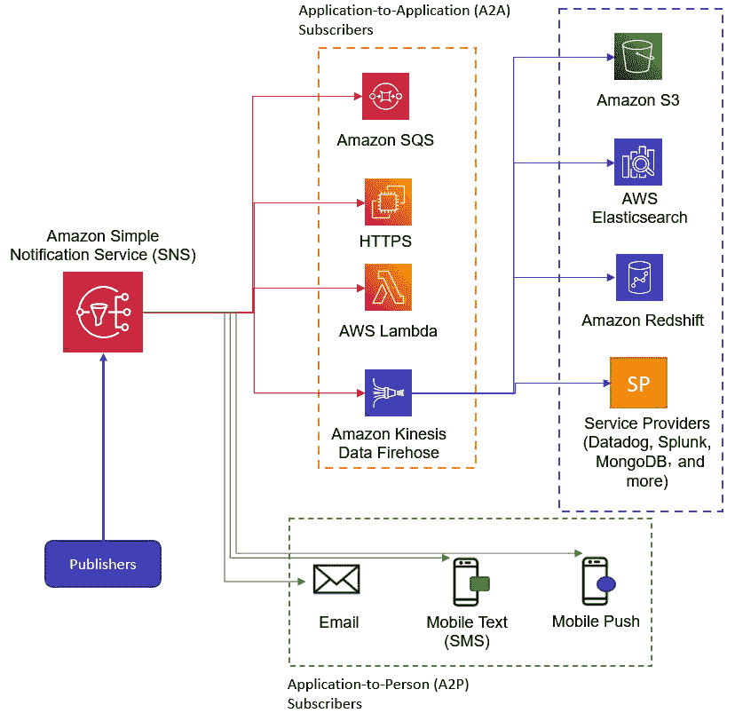

图 10.1 – Amazon SNS 订阅者端点

Amazon SNS A2A 端点包括 Amazon SQS、HTTP/S 端点、AWS Lambda 和 Amazon Kinesis Firehose。然后，来自 Amazon Kinesis Firehose 的数据可以卸载并存储在 Amazon S3 存储桶、AWS Elasticsearch 和 Amazon Redshift 中，以及其他第三方服务提供商。

Amazon SNS A2P 端点包括电子邮件、手机短信和手机推送端点。

Amazon SNS 还确保消息具有高度的持久性。消息会存储并复制到跨地理位置分布的多个设备、服务器和数据中心。

## Amazon SNS 主题

Amazon SNS 服务的核心是 SNS 主题功能，它是一个逻辑访问点，充当发布者和订阅者之间的通信通道。在你向订阅者发送消息之前，首先需要创建一个主题。你的发布者需要知道向哪个 SNS 主题发送消息，而你的最终客户端必须订阅该主题才能接收这些消息。

在下图中，我们可以看到一个应用组件允许我们将对象上传到 Amazon S3 存储桶 (**1**)。Amazon S3 可以设置事件通知服务，推送通知，声明上传操作已发生，并将此通知发送到 Amazon SNS 主题。在此图中，管理员已订阅该 SNS 主题。任何由于对象上传到 S3 存储桶而产生的通知将被发送到管理员：

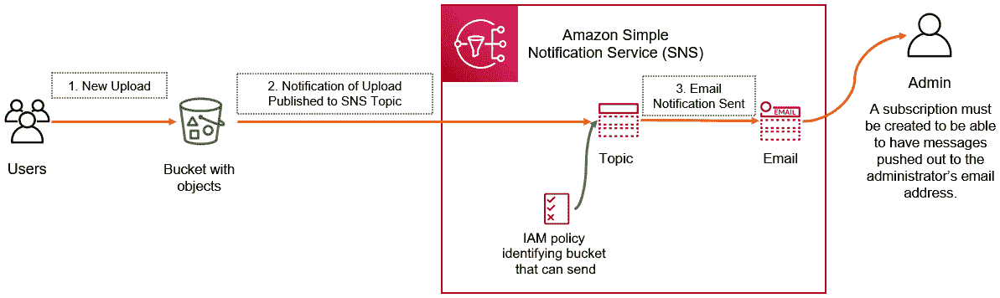

图 10.2 – 示例 – 配置 S3 事件通知的 SNS 通知

你的发布者还需要获得权限，才能向主题发布消息。在前面的示例中，我们希望在每次新的对象上传到 S3 存储桶时向管理员发送通知，你还需要创建权限，授予 S3 存储桶向 SNS 主题发送消息的能力。你可以通过配置 IAM 策略来实现，指定哪个存储桶可以向主题发送消息，并将其作为内联策略直接附加到 SNS 主题。

订阅者将在发布者发布新消息时接收到消息。在前面的示例中，发布者是 S3 通知服务，订阅者是管理员的电子邮件地址。

请注意，当你创建主题时，需要为其指定一个名称。名称最长可包含 256 个字符，可以包含连字符（-）和下划线（_）。Amazon SNS 将分配一个 `sns` —— 区域、AWS 账户 ID 和主题名称。例如，一个名为 `new-recipe-upload-alert` 的 SNS 主题，在伦敦区域创建，AWS 账户 ID 为 `123456789789`，则其 ARN 为 `arn:aws:sns:eu-west-2:1234567890123789:new-recipe-upload-alert`。

接下来，我们将看看你可以在 Amazon SNS 上创建的主题，这取决于应用程序的使用场景。

## 标准主题与 FIFO 主题

在配置 Amazon SNS 时，默认情况下会创建一个**标准主题**。标准主题用于消息的传递顺序不会影响应用程序的情况，并且重复消息不会在工作流中产生问题。所有支持的传递协议都支持标准主题。

此外，你还可以创建**FIFO 主题**。这些主题旨在确保严格的消息顺序并防止消息重复。请注意，只有 Amazon SQS 终端（特别是 Amazon SQS FIFO 队列）可以订阅 FIFO 主题。我们将在本章稍后讨论 Amazon SQS 服务。

## Amazon SNS 扩展场景

Amazon SNS 提供的一个关键特性是能够将推送到 SNS 主题的消息复制到多个终端。这个功能被称为**扩展场景**，它允许并行异步处理。

让我们看一个例子。假设你是一家剧院公司，销售各种演出的门票。你需要处理来自客户的在线支付并向他们发放票务。同时，你还需要将所有销售信息存储在 AWS 的数据仓库解决方案中，该解决方案由 Amazon Redshift 提供。设计这个架构的一种方式如下图所示：

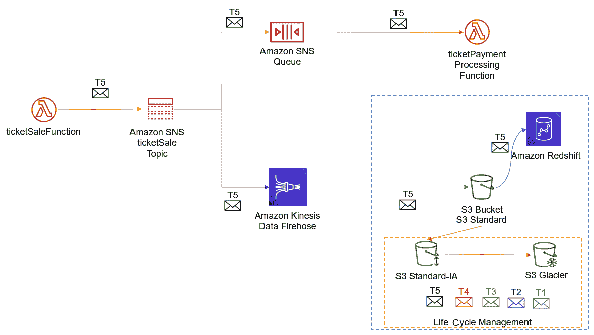

图 10.3 – Amazon SNS 扩展场景示例

在上面的图示中，传入的票务销售消息被发送到 SNS 主题，然后复制到 SQS 队列和 Amazon Kinesis Data Firehose 流。发送到 SQS 队列的任何消息都由支付功能处理，以完成销售交易。架构中还可以添加其他队列，用于订单履行和客户通知。

接下来，相同的消息将被 Amazon Kinesis Data Firehose 处理，数据被送入 Amazon Redshift 集群。请注意，要将数据从 Amazon Kinesis Firehose 流式传输到 Redshift，你需要先将数据交付到 S3 桶中，然后执行 Amazon Redshift `COPY` 命令将数据加载到 Amazon Redshift 集群中。我们将在下一章讨论 Amazon Kinesis。

同时，消息将继续保存在 S3 桶中，可以使用生命周期管理过程进行归档，正如我们在*第五章*中讨论的，*Amazon Simple Storage Service（Amazon S3）*。这有助于满足存储所有票务销售历史信息的合规性要求。

## Amazon SNS 定价

Amazon SNS 是一项托管服务，无需预付费用。你按使用量付费，费用基于使用的主题类型；即，标准主题或 FIFO 主题。标准主题的费用是根据每月发出的 API 请求数量以及向各个端点的交付次数来计算的。例如，移动推送通知的费用是每百万条通知 $0.50，在你耗尽免费层 1 百万条通知的额度后开始计费。

你的消息最大负载大小为 256 KB。除了短信消息外，按每 64 KB 为一个请求收费。所以，256 KB 的负载大小等于四个请求。此外，如果你需要发送大于 256 KB 的消息，你可以使用 Amazon Extended SNS 客户端库，它允许你通过 Amazon S3 服务发送负载数据。使用此方法时，会产生额外的 Amazon S3 存储费用。

对于 FIFO 主题，你的费用将基于发布的消息数量、订阅的消息数量及其各自的负载数据量。

在本节中，我们讨论了由 Amazon SNS 提供的基于推送的消息传递解决方案。Amazon SNS 基于发布/订阅模型，能够帮助您设计和架构 A2A 消息传递和 A2P 消息传递。Amazon SNS 能够帮助您构建不同应用组件之间的集成，从而设计分布式系统、微服务和无服务器架构。

您还了解了 Amazon SNS 的一些核心功能，包括标准主题和 FIFO 主题，以及 Fanout 场景概念。

在下一节中，我们将介绍另一种消息集成服务，称为 Amazon SQS。Amazon SQS 是一种基于拉取的消息传递解决方案，非常适合设计解耦架构，帮助您从单体应用架构迁移开来。

# 使用 Amazon SQS 和 Amazon MQ 解耦应用程序架构

Amazon SQS 是另一个完全托管的消息集成解决方案，它能够将应用组件解耦到分布式系统中，并促进微服务的设计和架构。使用像 Amazon SQS 这样的队列系统的主要优势之一是能够脱离单体应用设计。在单体设计中，您的应用所有组件彼此依赖，并且需要始终可用，通常会遭遇频繁的故障和停机。像 Amazon SQS 这样的队列系统可以帮助应用的不同组件独立工作，队列能够以请求/任务的形式存储消息，直到容量变得可用。通过异步处理以及不同组件独立扩展的能力，您可以享受更高的可用性，每个组件可以根据需要扩展，而不会影响整体工作流。

在下图中，我们可以看到 Amazon SQS 如何用于在应用程序的各个组件之间排队消息，从而实现解耦架构（也称为松耦合）：

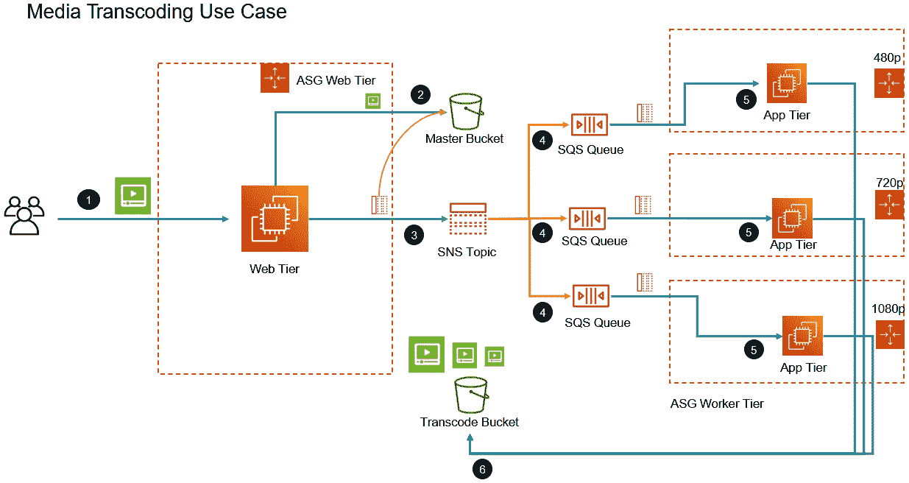

图 10.4 – Amazon SQS 用例示例

在前面的图示中，一个媒体转码的例子使用了 Amazon SNS 和 Amazon SQS 服务，将用户上传的原始视频转换为各种格式和分辨率。在这个架构中，我们有不同的自动扩展组，这些组负责配置一批服务器，每批服务器负责将视频转换为特定格式。为处理发送到不同服务器组的消息，创建了独立的队列。以下是工作流的简要说明：

1.  用户通过一个前端 Web 服务器集群上传视频，该集群属于一个自动扩展组，根据需求进行扩展和收缩。

1.  视频被上传到主存储桶。

1.  与此同时，一个 SNS 通知被以扇出配置发送到多个 Amazon SQS 队列（参见本章前面讨论的 SNS 扇出场景）。

1.  每个 SQS 队列存放消息，供适当的应用服务器在有空闲容量时拉取。

1.  相关的应用服务器从相应的 SQS 队列中检索消息，该队列标识出需要在主存储桶中处理的视频。然后，应用服务器从主存储桶中检索原始视频。

1.  应用服务器将视频的格式和分辨率转换，并将完成的视频以正确的格式上传到转码存储桶。

虽然 Amazon SNS 提供基于推送的消息通知解决方案，但 Amazon SQS 是一个完全托管的基于拉取的消息队列系统，它还会在短时间内保留消息（默认保留时间为 4 天，但可以配置最长为 14 天）。

这意味着，如果你有需要处理大量来自前端 Web 请求的队列消息的后端服务，你可以将这些消息保留，直到后端服务能够处理队列中的新消息。Amazon SQS 提高了应用解决方案的整体容错能力，使得解耦的应用组件能够独立运行。

## Amazon SQS 队列类型

Amazon SQS 提供了两种类型的队列，旨在帮助解决不同的使用场景。接下来将讨论这两种队列。

### Amazon SQS 标准队列

标准队列支持几乎无限数量的每秒 API 调用（`SendMessage`、`ReceiveMessage` 或 `DeleteMessage`），并且设计为至少发送一次消息。然而，这意味着在某些情况下，消息可能会重复发送。此外，消息可能不会按照它们进入队列的顺序发送。因此，你的应用程序必须能够处理未按照进入队列的顺序传递的消息，以及偶尔的重复消息：

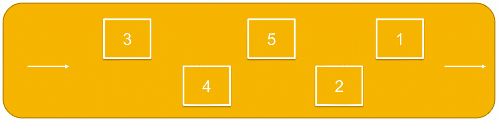

图 10.5 – Amazon SQS 标准队列

标准队列在需要每秒处理大量事务时特别有用。然而，请注意，标准队列的飞行消息数量配额为 120,000。例如，当需要处理大量电商应用中的信用卡验证请求时，你可能会使用标准队列。

### Amazon SQS FIFO 队列

**FIFO** 代表 **先进先出**。FIFO 队列旨在保持消息的顺序，并确保每条消息只被送达一次，没有重复。

FIFO 队列仅以每秒 300 次交易的速率提供吞吐量。这意味着它们无法提供无限的吞吐量；然而，通过使用称为批处理的过程，可以提供更高的消息吞吐量，每个 API 方法（`SendMessageBatch`，`ReceiveMessage` 或 `DeleteMessageBatch`）支持每秒 3,000 次交易。这 3,000 次交易代表了 300 次 API 调用，每次调用携带 10 条消息。

此外，正如下面的图示所示，消息按照它们进入队列的顺序进行传递，Amazon SQS 将保持此顺序：

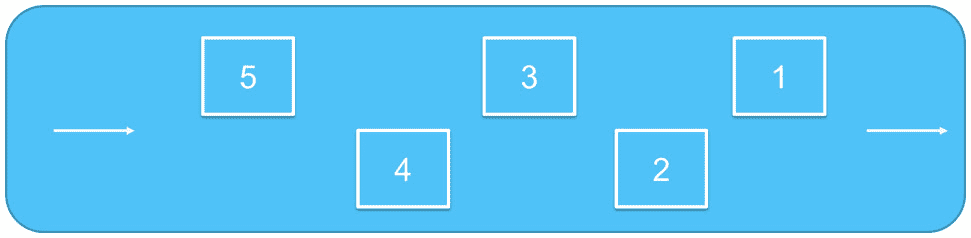

图 10.6 – Amazon SQS FIFO 队列

因此，FIFO 队列非常适合那些事件顺序很重要的应用程序，例如确保用户输入的命令按照正确的顺序运行。FIFO 队列还确保不会重复处理，例如支付交易。然而，当需要极高的扩展性或每秒需要处理超过 3,000 次交易（带批处理时）时，它们并不理想。

## Amazon SQS 定价和安全性

为了确保敏感数据的保护，您可以使用 Amazon **密钥管理服务**（**KMS**）对消息进行加密。在定价方面，Amazon MQ 不需要前期成本。您根据请求的数量和内容以及与 Amazon S3 和 AWS KMS 的交互支付费用。请注意，作为免费套餐的一部分，您每月还可以获得前 100 万次请求的免费额度。

在本节中，我们介绍了 Amazon SQS 提供的另一种托管消息解决方案。Amazon SQS 是一种基于拉取的消息队列解决方案，可以解耦您的应用程序组件，使它们能够独立工作。消息存储在标准队列或 FIFO 队列中，应用程序组件在有可用容量时按需检索这些消息。

在下一部分中，我们将介绍 Amazon MQ，这是一种为 Apache ActiveMQ 和其他消息中介设计的消息中介服务。

# Amazon MQ

消息中介是一种旨在帮助您促进应用程序组件之间信息交换的软件。消息中介允许不同的服务直接相互通信，即使这些服务是用不同的编程语言编写的或运行在不同的平台上。

许多组织在其本地环境中已经有现有的消息中介服务，以支持它们的本地应用程序。其中一项服务是**Apache ActiveMQ**，它可能是最流行的基于 Java 的消息中介之一。

当客户寻求迁移其本地应用程序时，您必须考虑这些第三方消息中介服务的使用位置。AWS 提供了一项名为 Amazon MQ 的服务，这是一项完全托管的消息中介服务，提供与流行消息中介的兼容性。

亚马逊建议使用 Amazon MQ 将应用程序从现有的消息代理迁移，这些消息代理需要与 **JMS** 等 API 或 **AMQP 0-9-1**、**AMQP 1.0、MQTT**、**OpenWire** 和 **STOMP** 等协议兼容。

如果作为迁移的一部分，您打算完全重新设计您的应用程序层，那么您可能希望考虑使用 Amazon SNS 和 Amazon SQS，因为您不再需要第三方消息代理。亚马逊推荐这些服务用于新应用程序，这些应用程序可以受益于几乎无限的可扩展性和简单的 API。

在本节中，我们探讨了 Amazon MQ，它使客户能够轻松迁移到云中的消息代理，并与现有的消息代理（如 Apache ActiveMQ 和 RabbitMQ）兼容。使用 Amazon MQ，您可以减少在提供、配置和维护依赖于与 JMS 等 API 或 AMQP 0-9-1、AMQP 1.0、MQTT、OpenWire 和 STOMP 等协议连接的消息代理时的整体操作开销。

在下一部分中，我们将探讨基于事件的工作流服务，以及亚马逊提供的服务，帮助您为应用程序架构事件驱动的解决方案。

# 使用 AWS EventBridge 设计事件驱动的应用程序工作流

Amazon EventBridge 是一个无服务器的 *事件总线服务*，允许您从应用程序、基于 SaaS 的服务和 AWS 服务流式传输实时事件到各种目标。这些目标可以包括 AWS Lambda、Kinesis、HTTP/S 端点，或另一个账户中的事件总线服务。Amazon EventBridge 帮助您创建需要响应并对生成的事件执行某些操作的应用程序架构。

当给定资源的状态发生变化时，可以生成事件，例如，当 EC2 实例从运行状态变为停止状态时。另一个事件示例是，当您的自动扩展组启动或终止一个 EC2 实例时。根据应用架构的需要，可以通过响应此类状态变化来创建额外的功能。

使用 EventBridge，您可以设置规则来定义匹配传入模式或事件的条件。当事件发生时，如规则所定义，它可以被发送到目标进行进一步处理。例如，当一个导致关键服务器停止（意外）的事件发生时，可以将其发送到 Lambda 函数进行自动重启。

EventBridge 还可以配置为在定义的计划下触发事件。例如，如果你有一大批 EC2 实例用于测试新应用程序，并且你通常在每周一至周五的正常工作时间内进行测试，那么在这些工作时间之外就没有必要让服务器持续运行。你可以设置一个定时事件，触发一个 Lambda 函数，在每周一至周五的下午 6 点停止服务器，并在每个工作日的早上 8 点重新启动服务器。这样可以确保在正常工作时间之外，服务器处于停止状态。如果这些是按需 EC2 实例，在服务器保持停止状态时，你不会产生费用。

Amazon EventBridge 是 Amazon CloudWatch Events 的更新版本。在 CloudWatch Events 中，你只能使用一个默认的事件总线来路由所有 AWS 事件以及自定义事件。然而，在新的 Amazon EventBridge 中，除了默认事件总线，你还可以引入自定义事件总线。自定义事件总线可以专门为你的工作负载创建，并使你能够控制对事件的访问，这些事件仅限于一组 AWS 账户或自定义应用程序。此外，你可以使用基于内容的过滤和高级规则来路由事件。EventBridge 可以处理更多的处理任务，减少下游事件的负载，并使用如 Zendesk、PagerDuty 和 Datadog 等合作伙伴事件源。

在下图中，我们可以看到 EventBridge 的高层工作方式。我们可以看到事件的来源、可以使用的事件总线类型以及这些事件可能的目标：

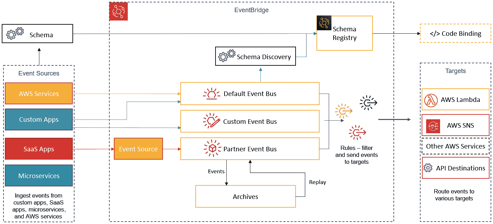

图 10.7 – EventBridge 的工作原理

以下是 Amazon EventBridge 的关键概念和组件：

+   **事件**：如前所述，事件表示给定环境或资源的状态变化。这可以是应用程序、AWS 资源，甚至是 SaaS 合作伙伴服务或应用程序的状态变化。

+   **规则**：规则使你能够将事件匹配到目标进行处理。你可以设置一个规则将事件路由到一个目标，或者设置并行处理将事件路由到多个目标。规则的处理顺序没有固定要求，但你可以自定义发送到目标的 JSON，确保只有感兴趣的数据被传递给目标。

+   **目标**：目标可以处理这些事件并执行某些操作。目标包括 Lambda 函数、SNS 主题、ECS 任务和 SQS 队列。事件以 JSON 格式传递给目标。

+   **事件总线**：事件总线可以接收事件。你的 AWS 账户中有一个默认的事件总线，用于接收来自 AWS 服务的事件，但你也可以为自定义应用程序创建自定义事件。合作伙伴事件总线可用于接收来自合作伙伴 SaaS 应用程序和服务的事件，然后将这些事件传递到你的 AWS 账户。

本节中，我们了解了 Amazon EventBridge，它允许你从应用程序、基于 SaaS 的服务和 AWS 服务流式传输实时事件到多种目标进行处理。目标可以包括 AWS Lambda 函数、Kinesis 流、ECS 任务、SQS 队列等。此外，你还可以配置 Amazon EventBridge 以处理在定义的时间表上触发的计划事件。与之前的 CloudWatch Events 服务相比，Amazon EventBridge 提供了更多的灵活性和高级功能。

在接下来的章节中，我们将介绍面向任务的集成服务，如 Amazon Step Functions 和 Amazon SWF。

# 使用 Amazon Step Functions 和 Amazon SWF 协调多个 AWS 服务，构建无服务器工作负载

本节中，我们将介绍两种不同的 AWS 服务，帮助你设计应用组件之间基于任务的工作流。我们将首先了解 AWS Step Functions，其次是 AWS SWF。

## AWS Step Functions

应用程序通常由多个组件组成，这些组件构成了单独的工作流和流程。每个工作流代表应用程序中的一个元素，然后依次进行，以提供完整的端到端解决方案。Amazon Step Functions 使你能够将这些工作流定义为一系列包含“状态”的状态机，这些“状态”构成了工作流。这些状态根据输入做出决策，执行某些操作，并向其他状态产生输出。

状态可以是以下任何一种类型：

+   **成功或失败状态**：执行停止时的成功或失败状态

+   **等待状态**：状态等待超时或计划时间

+   **并行状态**：状态执行并行的执行分支

+   **映射状态**：状态访问一个项列表，如订单列表

+   **选择状态**：状态在执行分支之间进行选择

+   **任务状态**：一个专注于执行特定任务的状态，可能调用其他 AWS 服务，如 Lambda 函数，来执行任务

状态机通过不同的状态协调工作，并使用任务状态执行实际的工作。Step Functions 帮助你将工作流可视化为一系列基于事件的步骤，以及每个步骤在工作流中的状态，以确保你的应用程序按定义的顺序运行。

Amazon Step Functions 使用**Amazon States Language**（**ASL**）。这是一种基于 JSON 格式的结构化语言，帮助你定义状态机，包括**任务**状态，执行特定的操作。ASL 用于定义状态如何从一个状态过渡到下一个状态，例如**选择**状态，或当需要通过错误停止执行时，如**失败**状态，等等。

使用 Step Functions，您还可以引入人工互动，特别是在需要人工干预的地方。让我们来看一个信用卡申请过程的例子。您可能会有几个步骤作为申请过程的一部分。在下图中，我们可以详细看到这些步骤：

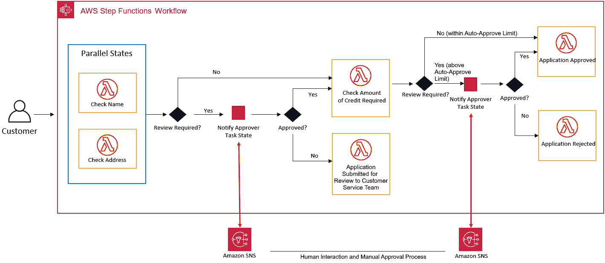

图 10.8 – 信用卡申请工作流示例

在前面的图示中，我们有一个 Step Functions 工作流过程，展示了潜在客户如何申请新信用卡。最初的工作流包括注册信用卡，这需要验证客户的详细信息。接下来的步骤可能涉及让客户选择所需的信用额度。这个工作流可能包括以下步骤：

1.  新客户注册信用卡。最初的过程包括检查用户的详细信息。可以调用多个并行的 Lambda 函数来执行所需的验证。例如，在英国，可以通过选民名单验证客户的姓名和地址。

1.  如果自动验证过程成功，那么就不需要复审，下一步将被调用。如果需要复审，则可能需要人工干预来执行额外的验证任务。如果人工验证成功，下一步可以继续；否则，申请将被拒绝。

1.  接下来，客户将获得一个自动批准的信用额度。客户还可以选择一个更高的信用额度，这将需要额外的复审。如果客户选择的信用额度在自动批准额度内，申请将自动被批准。如果客户选择的信用额度超过自动批准额度，则需要进行另一步人工干预。在此，信用卡公司可能会要求提供额外信息，如工资单，以检查客户的信用状况。

1.  如果人工干预成功，申请将被批准；如果不成功，申请将被拒绝。工作流中可能会有额外的步骤来对拒绝决策提出上诉。

Step Functions 使我们能够构建分布式应用程序解决方案并设计微服务交互，以提供完整的端到端解决方案。接下来，我们将了解您可以为 Step Functions 设置的不同类型的工作流。

## 工作流类型

使用 Amazon Step Functions，您可以配置两种类型的工作流，如下所示：

+   **标准工作流**：这些工作流的执行是精确一次的，可以运行最长达 1 年。如果您的工作流需要人类交互和审批流程，标准工作流非常适合。您按每次状态转换计费，也就是每次执行步骤完成时。标准工作流还提供执行历史记录和可视化调试功能。

+   **快速工作流**：这些工作流至少执行一次，但最多只能运行 5 分钟。快速工作流非常适合自动化任务和高事件频率的工作负载，如流数据处理和物联网数据摄取。您根据执行次数和持续时间计费。快速工作流还提供无限的状态转换速率。最后，所有执行历史都会发送到 Amazon CloudWatch。

下面是一个简单工作流的示例，用于创建任务计时器。在这个例子中，正在配置一个 Step Functions 状态机，它实现了一个**等待**状态，并在等待期结束后使用 Lambda 函数发送 Amazon SNS 通知。任务发送的消息是一个简单的*Hello World*消息。以下截图展示了工作流及其关联的 JSON：

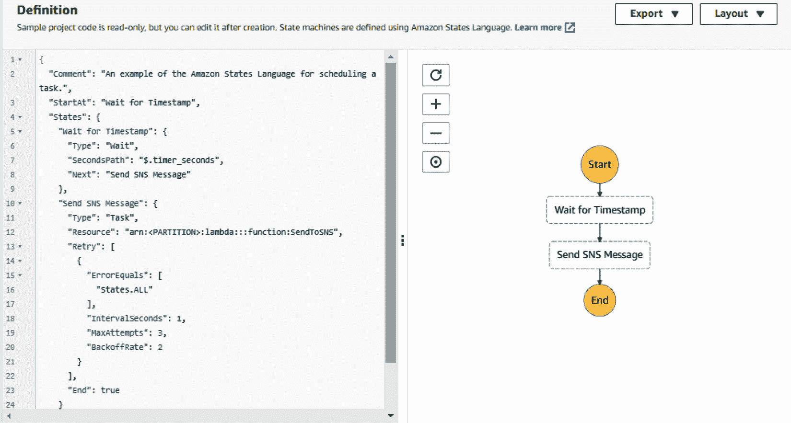

图 10.9 – AWS Step Functions 任务计时器示例

在本节中，我们讨论了两种类型的 Step Functions 执行方式，并确定了它们之间的核心区别。Step Functions 工作流最长可以运行 1 年（使用标准工作流类型时），因此对于需要长时间运行并可能需要人类交互的应用模型特别有用。一个例子是健康保险理赔申请过程，可能需要人工干预来验证医院账单和提供给索赔人的治疗服务。下一节中，我们将介绍另一种任务导向的应用集成服务，即 Amazon SWF。

## 亚马逊简单工作流服务（SWF）

Amazon SWF 是另一个任务导向的应用集成服务，允许您协调应用程序中分布式组件之间的工作。此类任务协调可能涉及管理依赖关系、调度任务以及处理任务的重试和超时，以完成应用程序的逻辑工作流。

Amazon SWF 有一个概念，即您可以实现“工作者”来完成任务。工作者可以在 AWS EC2 实例上运行，也可以在您本地环境中可用的计算服务上运行。作为逻辑工作流的一部分，Amazon SWF 还允许您在任务的逻辑分配中加入人类交互，就像前面一节中讨论的 Amazon Step Functions 一样。使用 Amazon SWF，您可以存储任务、分配任务给工作者、跟踪进度并维护状态。

尽管这一切听起来很像 Amazon Step Functions，但一个关键的区别是，在使用 Amazon SWF 时，您必须用任何语言编写决策程序，该程序从 Amazon SWF 获取每个任务的最新状态，并利用这些状态启动后续任务。

另一方面，Amazon Step Functions 提供了一项完全托管的服务，它通过视觉工作流协调应用程序组件，具有更具生产力和灵活性的方式。如果您正在 AWS 上构建新应用程序，您应该考虑使用 Amazon Step Functions。然而，如果您需要外部服务与您的流程交互，或者您需要启动嵌套流程，其中子进程需要将结果返回给父进程，您应该考虑使用 Amazon SWF。

本节简要介绍了 Amazon SWF。Amazon SWF 使您能够协调分布式应用程序组件之间的任务，同时提供诸如持久可靠地维护其执行状态等功能。

# 练习 10.1 – 使用 Amazon SNS 的 Amazon S3 事件通知

在上一章中，您使用多个 AWS 服务设计、架构并部署了一个完整的 web 应用程序。其中一个服务是 Amazon S3 服务，您创建了一个存储库来托管您的应用程序源代码。源代码包含多个文件，这些文件帮助您构建 web 应用程序。

维护此源代码至关重要，所有对代码的更改都需要进行监控。您可以采用几种最佳实践策略来管理源代码，包括使用 DevOps 原则。在本练习中，您的高级管理员 **Alice** 希望知道每当有新文件（对象）上传到存储在 Amazon S3 桶中的源代码存储库时。

Amazon S3 提供一个称为事件通知的功能。此功能使您能够在某些事件发生时接收通知，例如对象被创建或删除。该服务可以配置为将此类通知发送到 Amazon SNS 主题，管理员可以使用电子邮件作为终端订阅该主题。让我们配置一个 Amazon S3 通知，以便每当有新文件上传（即创建）到托管源代码存储库的 S3 桶时，发送电子邮件提醒给 **Alice**。

本练习分为四个主要步骤，如以下小节所述。

## 第一步 – 创建 SNS 主题并订阅该主题

第一步是创建一个 SNS 主题，这个主题将作为 Alice 订阅的逻辑访问点。发送到该主题的消息将通过电子邮件发送给 Alice：

1.  在 AWS 管理控制台中，在顶部搜索框中搜索 `SNS` 并选择该服务，以进入 Amazon SNS 控制台。

1.  如果您以前从未创建过 SNS 主题，您应该会看到 Amazon SNS 欢迎屏幕。

1.  点击最左侧的菜单图标（三条横线表示），以展开侧边栏。

1.  接下来，从菜单中点击**主题**链接。

1.  点击屏幕右侧面板中的**创建主题**按钮。

1.  在**创建主题**页面的**详细信息**部分，选择**类型**下的**标准**类型。

1.  输入主题名称，例如 `source-code-changes`。接下来，输入主题的显示名称，例如 `Source Code Changes Alert`。

1.  保留所有其他设置为默认值，然后点击**创建主题**按钮。

1.  一旦主题创建完成，你将被重定向到主题页面。请记下主题的 ARN，参考以下截图：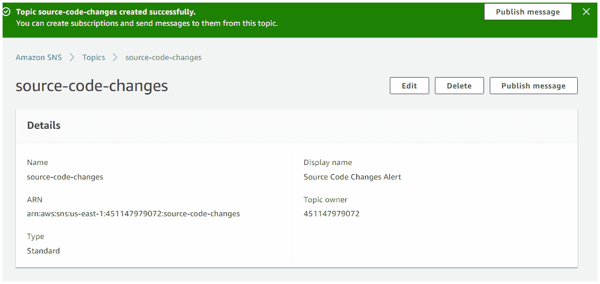

    图 10.10 – Amazon SNS 主题

1.  现在你已创建了一个主题，你可以为其创建一个订阅。我们将使用电子邮件作为通知的终端，你可以使用你的电子邮件地址来接收通知。

1.  在主题页面的底部面板中，参考之前的截图，你会看到一个创建订阅的部分。点击**创建订阅**按钮。

1.  在**创建订阅**页面，你会注意到主题 ARN 已被选中。如果没有，请确保粘贴你之前记下的主题 ARN。

1.  接下来，在**协议**下，从下拉列表中选择**电子邮件**。

1.  在**终端**下的文本框中，提供你的电子邮件地址。

1.  点击页面底部的**创建订阅**按钮。

1.  你将收到一个确认声明，表示你的订阅已创建。然而，它的状态将设置为**等待确认**。AWS 会向你的电子邮件账户发送确认请求。你需要登录你的电子邮件账户并确认订阅以激活它。我刚刚登录我的电子邮件账户进行相同的操作，以下是我的 Gmail 账户的截图：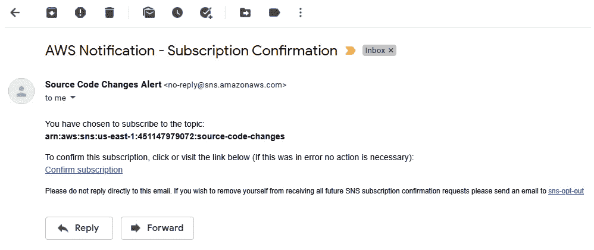

    图 10.11 – 主题订阅的电子邮件订阅请求

1.  一旦确认订阅，返回到 Amazon SNS 控制面板，并从左侧菜单中点击**主题**链接。

现在你已确认了对主题的订阅，你可以配置一个访问策略，授予 Amazon S3 服务将通知发送到主题的权限。

## 步骤 2 – 配置 SNS 主题策略

为了让 Amazon S3 将通知发送到你刚刚创建的 SNS 主题，你需要配置一个**访问策略**。访问策略定义了谁或什么可以访问你的主题并向其发布消息。我们在这个学习指南的 GitHub 仓库中提供了一个示例策略文档，你需要修改它：[`github.com/PacktPublishing/AWS-Certified-Cloud-Practitioner-Exam-Guide`](https://github.com/PacktPublishing/AWS-Certified-Cloud-Practitioner-Exam-Guide)。在编辑策略之前，你需要以下信息：

+   你之前记下的 SNS 主题的 ARN。

+   您在前一章节创建的 S3 存储桶的 Amazon ARN。您可以通过单击 Amazon S3 仪表板上存储桶详细信息页面上的**属性**选项卡找到存储桶 ARN。

+   AWS 账户 ID（您可以通过单击屏幕右上角的帐户名称，并记下**我的帐户**旁边的 12 位数字来获取）。

打开 Notepad 或您选择的文本编辑器中的示例访问策略文档，如以下截图所示：

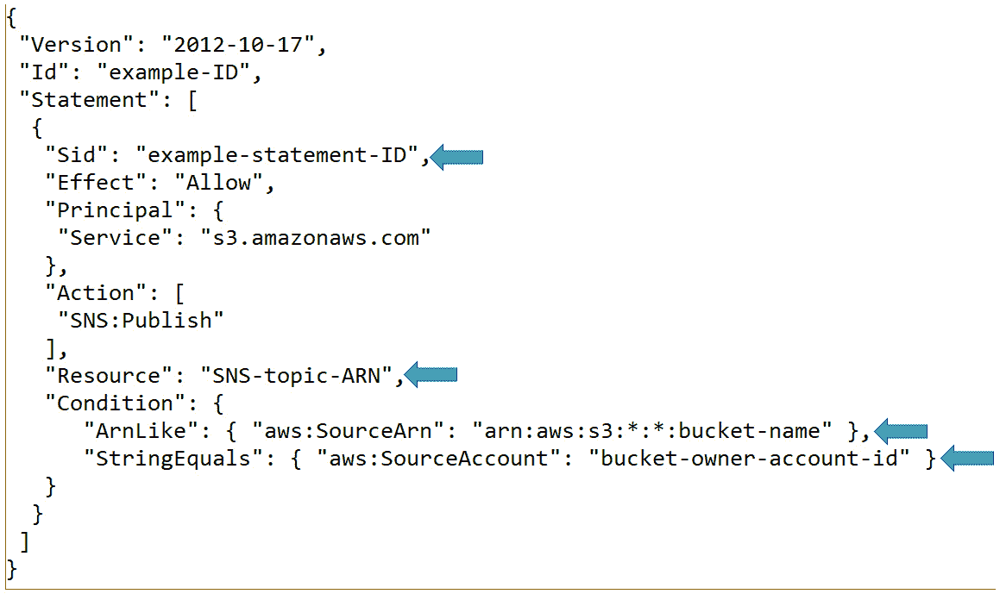

图 10.12 - 示例访问策略

替换策略中的值，如上述截图中的箭头所示，使用以下内容：

+   对于`Sid`，将`example-statement-ID`更改为您希望使用的任何相关信息；例如，`源代码更改策略`。

+   对于`Resource`，将`SNS-topic-ARN`更改为您主题的 ARN，确保将 ARN 放在双引号中。

+   对于`ArnLike`，将`arn:aws:s3:*:*:bucket-name`更改为您的存储桶名称的 ARN。

+   对于`StringEquals`，将`bucket-owner-account-id`更改为您的 AWS 账户 ID。

保存文件，并将其保存在下一步骤的过程中使用：

1.  导航回 Amazon SNS 仪表板，并从左侧菜单中单击**主题**。

1.  单击中间窗格中的您的 SNS 主题，这将重定向您到主题详细信息页面，如以下截图所示：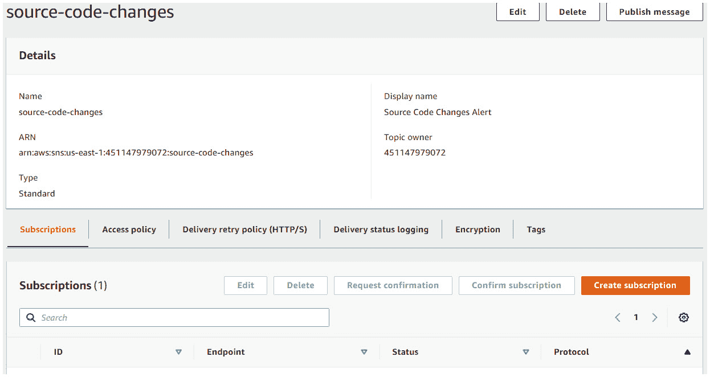

    图 10.13 - SNS 主题详细信息页面

1.  单击面板底部的**访问策略**选项卡。

1.  您将找到一个默认访问策略，只允许主题所有者发布主题。

1.  在窗格的上半部分，单击**编辑**按钮。

1.  接下来，展开**访问策略 - 可选**部分。

1.  接下来，突出显示并删除 JSON 编辑器中的现有策略，并粘贴您修订后的访问策略的副本。

1.  最后，在页面底部单击**保存更改**按钮。

现在您已经设置了 SNS 主题和适当的访问策略，现在是设置 Amazon S3 事件通知服务的时候了。

## 步骤 3 - 设置 Amazon S3 事件通知服务

在此步骤中，您将配置事件通知服务在您的 Amazon S3 源代码存储桶上，该存储桶托管您的应用程序仓库，每当上传新文件到存储桶时发送警报：

1.  导航到 Amazon S3 仪表板，并从左侧菜单中单击**存储桶**链接。

1.  从右侧窗格中，单击您在前一章节创建的 Amazon S3 存储桶，以托管您的源代码文件。

1.  接下来，单击**属性**选项卡，并向下滚动，直到到达**事件通知**部分。

1.  单击**创建事件通知**按钮。

1.  为您的事件输入一个名称，例如`新增文件添加提醒`。

1.  在**事件类型**部分，选中声明**所有对象创建事件**的复选框。

1.  继续向下滚动，直到到达**目的地**部分。

1.  从**目标**选项中选择**SNS 主题**。

1.  在**指定 SNS 主题**下，从**SNS 主题**下拉列表中选择您在*步骤 1*中创建的 SNS 主题。

1.  最后，点击**保存更改**按钮。

现在您已经配置了 S3 以将事件通知发送到您的 SNS 主题，是时候测试该配置了。

## 步骤 4 – 测试配置

在此步骤中，我们将测试 Amazon S3 事件通知服务的配置：

1.  在 Amazon S3 仪表盘中，从左侧菜单中选择**存储桶**。

1.  从右侧面板中选择您的 Amazon S3 存储桶，该存储桶将包含源代码文件。

1.  接下来，点击**上传**按钮。

1.  继续上传您可以访问的任何随机文件。或者，您可以创建一个文本文件，保存后上传该文本文件。您可以使用**添加文件**按钮浏览计算机上的文件，或者直接将文件从另一个文件资源管理器窗口拖放到上传区域。

1.  通过点击页面底部的**上传**按钮，将您的文件上传到 Amazon S3 存储桶。

1.  一旦上传成功，点击**关闭**按钮。您的对象应该在存储桶中的对象列表中可见。

1.  再次访问您的电子邮件账户，检查是否收到了来自 AWS 的通知，提醒您已上传新对象。参考以下截图作为示例：

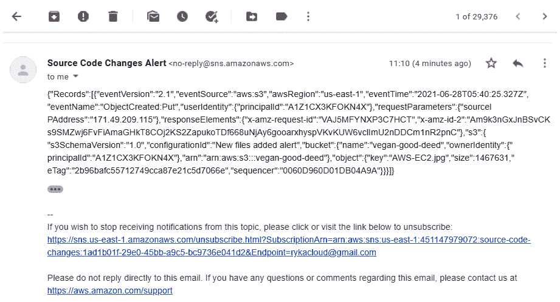

图 10.14 – Amazon S3 事件通知提醒邮件

如您所见，AWS 已发送邮件提醒我，在我的 Amazon S3 存储桶中上传（创建）了一个对象。该邮件包含大量信息，包括事件时间、警报名称、存储桶名称、上传的对象名称及其大小。如您所见，这对于审计目的非常有用。

Amazon S3 事件通知还可以使用其他目标，如 SQS 队列或 Lambda 函数。在本练习中，您了解了如何使用 Amazon SNS 将通知消息推送到电子邮件地址。

在下一个练习中，您将执行清理操作，移除我们 AWS 账户中不再需要的资源。

# 练习 10.2 – 清理工作

在本练习中，您将删除在上一个练习中创建的资源，作为清理过程的一部分：

1.  返回到 Amazon SNS 控制台。

1.  从左侧菜单中选择**主题**。

1.  接下来，从右侧面板中选择**source-code-changes**主题。点击**删除**按钮。

1.  系统将提示您通过对话框确认删除请求。在确认文本框中输入`delete me`，然后点击**删除**按钮。该主题将被删除。

现在您已删除了 Amazon SNS 主题，您也可以删除 Amazon S3 存储桶，因为我们不再需要它：

1.  导航到 Amazon S3 控制台。

1.  从左侧菜单中，点击**Buckets**。

1.  从右侧窗格中，选择您之前上传源代码的桶。

1.  只有当桶为空时，您才能删除它。这意味着您必须首先删除桶中的对象。选中桶后，点击**清空**按钮。

1.  接下来，系统将提示您确认是否希望通过在确认文本框中输入`permanently delete`来删除对象。然后，您可以点击**删除**按钮以清空桶。

1.  现在桶已经清空，您可以删除它。

1.  点击**退出**按钮返回到桶列表页面。保持桶被选中，点击**删除**按钮。接下来，在确认文本框中输入桶的名称以确认您希望删除它，并点击**删除桶**按钮。

您的 Amazon S3 桶将成功删除。

接下来，我们将总结本章以及您所学到的关键概念。

# 总结

在本章中，我们审视了允许您构建高可用和分布式应用解决方案的关键应用集成服务。AWS 提供的应用集成服务使得您可以在解耦的应用组件之间进行通信，让您可以从单体架构转向基于微服务构建的架构。AWS 提供的应用集成工具还帮助您更轻松地设计无服务器解决方案，让您进一步享受与基于服务器的解决方案相关的成本节约。

本章中，您学习了包括 Amazon SNS、Amazon SQS 和 Amazon MQ 在内的各种服务，它们是面向消息的应用集成服务。这些服务使得应用组件之间能够进行通信，从而让您构建松耦合的应用架构。

Amazon Step Functions 和 Amazon SWF 是面向任务的应用集成服务，提供最长可运行 1 年的工作流，并可以将人工干预作为工作流过程的一部分。Amazon Step Functions 还帮助您使用可视化工作流协调应用组件。

最后，我们看了 Amazon EventBridge，它是一个无服务器事件总线服务，使得构建事件驱动的应用程序变得更加容易。EventBridge 可以获取并处理由您的应用程序、合作伙伴**软件即服务**（**SaaS**）应用程序以及其他 AWS 服务生成的事件。

在下一章中，我们将介绍 AWS 提供的各种分析服务，这些服务可以让您从多种来源流式传输数据，对获取的数据执行复杂查询，构建数据湖，并构建可视化仪表板和报告。

# 问题

请回答以下问题，测试您对本章内容的理解：

1.  哪些 AWS 服务可用于当触发警报并进入`Alarm`状态时，向管理员发送电子邮件通知？

    1.  Amazon SNS

    1.  Amazon SES

    1.  亚马逊 CloudTrail

    1.  亚马逊电子邮件

1.  Amazon CloudWatch 哪个功能可以帮助您按资源类型和服务创建度量的可视化？

    1.  CloudWatch 事件

    1.  CloudWatch Logs

    1.  CloudWatch 警报

    1.  CloudWatch 仪表板

1.  哪个 AWS 应用集成服务可以配置为提供 A2P 通信，使用移动 SMS 发送文本警报？

    1.  亚马逊 SQS

    1.  亚马逊 SNS

    1.  亚马逊 Amplify

    1.  亚马逊 Workspaces

1.  您需要配置您的 Amazon SNS 主题，以便将新上传视频的消息推送到三个不同的 SQS 队列中的 Amazon S3 存储桶中。每个队列旨在将原始视频编码为不同的分辨率。Amazon SNS 的哪个功能使您能够并行推送这些通知？

    1.  亚马逊 SNS 标准主题

    1.  亚马逊 SNS FIFO 主题

    1.  扇出场景

    1.  亚马逊 EventBridge

1.  哪种 Amazon SQS 队列类型提供最大吞吐量、最佳努力排序，并确保至少一次交付？

    1.  SQS 标准队列

    1.  SQS 强大队列

    1.  SQS FIFO 队列

    1.  SQS LIFO 队列

1.  哪种 AWS 服务旨在帮助您构建一个解耦的应用架构，其中传入的 Web 请求可以保存在队列中，直到后端应用程序能够检索并处理该请求？

    1.  亚马逊 SQS

    1.  亚马逊 SWF

    1.  亚马逊 SNS

    1.  亚马逊 Step Functions

1.  您需要为您的应用程序配置一个 SQS 队列，其中消息的顺序需要保持不变，以便应用程序能够正常工作。您需要配置哪种类型的队列？

    1.  SQS 标准队列

    1.  SQS 强大队列

    1.  SQS FIFO 队列

    1.  SQS LIFO 队列

1.  为了降低成本，您被要求自动关闭一组 UAT 测试服务器，每个工作日的晚上 7 点关闭，然后在下一个工作日的早上 8 点重新启动这些服务器。服务器在周末应保持关闭状态。

    哪个 AWS 服务可以帮助您实现上述需求？

    1.  亚马逊 SQS

    1.  亚马逊 Athena

    1.  亚马逊 EventBridge

    1.  亚马逊 SNS

1.  哪种 AWS 服务使您能够通过将应用程序工作流拆分为多个步骤、添加流程逻辑，并跟踪步骤之间的输入和输出，将应用程序工作流管理为状态机？

    1.  亚马逊 Step Functions

    1.  亚马逊 SQS

    1.  亚马逊 SNS

    1.  亚马逊 SWF

1.  哪种 AWS 服务提供了一个协调服务，通过使用决策程序来确定每个任务的最新状态，并使用该状态来启动后续任务，以便跨应用程序组件协调工作？

    1.  亚马逊 SNS

    1.  亚马逊 EventBridge

    1.  亚马逊 SQS

    1.  亚马逊 SWF
