# *第十一章*：AWS 上的分析

在这个信息化时代，理解您的数据变得极为重要。借助当前的前沿技术，每秒生成大量的数据——这些数据需要被存储和分析。公司进行数据分析以解释、预测并最终获得商业竞争优势。传统的分析包括零售分析、供应链分析或库存轮换分析。随着**机器学习**（**ML**）和**人工智能**在经济中日益深入，新的分析演变逐渐发挥作用，比如认知分析、欺诈分析和语音分析。这个列表几乎无穷无尽，但可以说，理解您的原始数据已经需要大量的努力，并且需要一个专门的业务部门来负责**数据分析**。

AWS 提供了一系列广泛的分析工具，您可以使用这些工具来摄取、存储并有效地理解您的业务所生成的数据。在本章中，我们将详细介绍其中一些服务。

在本章中，我们将涵盖以下主题：

+   学习使用 Amazon Kinesis 进行数据流处理

+   学习如何使用 Amazon Athena 查询存储在 Amazon S3 中的数据

+   Amazon Elasticsearch 简介

+   Amazon Glue 和 QuickSight 概述

+   其他分析服务

# 技术要求

要完成本章的练习，您需要访问您的 AWS 账户并以 IAM 用户**Alice**身份登录。

# 学习使用 Amazon Kinesis 进行数据流处理

要分析您的业务数据，您需要将数据摄取到可以对其进行所需分析的服务中。企业从各种来源生成大量数据，包括应用程序生成的日志、视频、图片和文档等内容、网站的点击流数据、物联网数据等。摄取这些数据是理解数据的第一步。

然而，与其先摄取所有数据然后再弄清楚如何理解这些数据，**Amazon Kinesis**让您可以在数据到达时即时处理和分析它，并作出回应。Amazon Kinesis 是一项完全托管的服务，使您能够以高效且成本效益的方式处理任何规模的流数据。此外，它是**无服务器**的，这意味着您无需设置和管理昂贵的基础设施来处理数据。Amazon Kinesis 包含以下四项关键服务：

+   Amazon Kinesis 数据消防队

+   Amazon Kinesis 数据流

+   Amazon Kinesis 数据分析

+   Amazon Kinesis 视频流

让我们详细了解这些服务。

## Amazon Kinesis 数据消防队

现代商业方法和策略为了保持客户的忠诚度和参与度，导致了大量的数据需要收集、处理和分析。无论您是尝试分析客户在您网站上点击了哪些产品、根据他们的产品搜索进行推荐，还是向您的安全团队发出潜在欺诈交易的警报，您都需要在数据生成时收集和处理数据。传统上，您需要构建基础设施来提供这种类型的数据后端摄取和处理，这对许多企业来说可能是成本过高的——更不用说维护数百台服务器、存储和网络组件所带来的管理开销了。

**Amazon Kinesis Firehose** 是一项完全托管的服务，可以将流数据摄取并传输到 AWS 数据存储中，如 *Amazon S3*、*Redshift* 和 *Amazon Elasticsearch*，以便使用现有的 **商业智能**（**BI**）工具进行近实时分析。该服务的工作流程可以通过以下图示来展示：

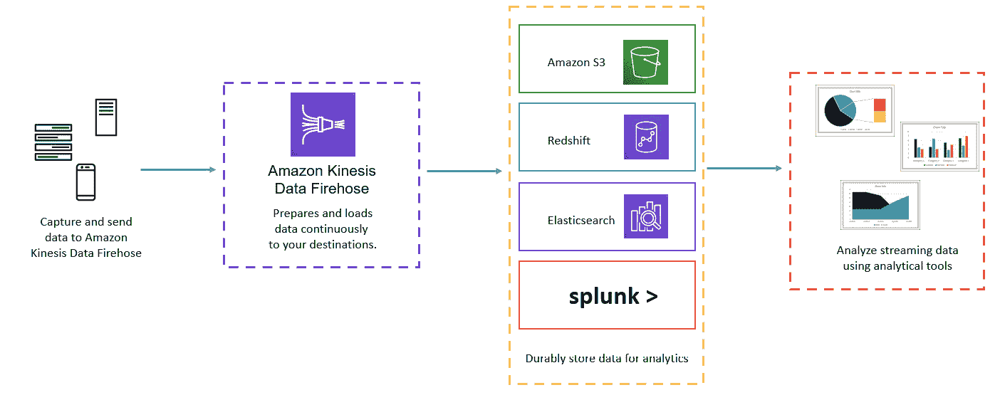

图 11.1 – Kinesis Firehose

Amazon Kinesis Firehose 还可以将数据传输到第三方服务，如 *Datadog*、*New Relic*、*MongoDB* 和 *Splunk*。Amazon Kinesis Firehose 还允许您在将数据加载到服务之前进行批处理、压缩、转换，甚至加密数据，这意味着您可以降低总体存储成本并增强安全性。

此外，传入的数据流可以自动转换为开放标准格式，如 **Apache Parquet** 和 **Apache ORC**。最后，使用 Amazon Kinesis Firehose，您无需担心基础设施设置成本。您只需为通过该服务传输的数据、任何数据转换成本、传输到 Amazon VPC 的数据以及数据转移费用付费。

接下来，我们将了解 Kinesis Data Streams 服务。

## Amazon Kinesis Data Streams

与 Kinesis Firehose 旨在将大量数据加载到 **数据存储**（如 Amazon S3 或 Redshift）以进行 *近实时* 处理不同，**Amazon Kinesis Data Streams** 是一项完全托管的 *实时* 持续数据流服务，它允许您每秒捕获数 GB 的数据，并将其流式传输到自定义应用程序进行处理和分析。

Amazon Kinesis Data Streams 可以使流数据在数据收集后的 70 毫秒内，提供给多个分析应用程序，如 Amazon S3 和 AWS Lambda。通过将流数据复制到三个可用区，它提供了高水平的持久性。

Kinesis Firehose 不提供任何数据存储功能。然而，Amazon Kinesis Data Streams 默认会存储并使您的数据在 24 小时内可访问，但通过启用扩展数据保留功能，这一时间可以延长至 7 天，甚至通过启用长期数据保留功能延长至 365 天。

你可以摄取和存储流数据以进行处理，构建实时应用服务，如**实时仪表盘**、**实时异常检测**、**动态定价**等。与 Kinesis Firehose 类似，你是按需付费，没有前期费用或最低费用。然而，存在一个根本的区别，即 Kinesis 数据流使用了*分片*的概念，唯一标识流中的数据记录。一个流可以由多个分片组成，这些分片决定了整体容量。具体而言，每个分片每秒最多可处理五次读取事务，最大数据读取速率为每秒 2 MB。对于写入，你每秒最多可以写入 1,000 条记录，数据写入速率为每秒 1 MB（包括分区键）。流的总容量是其分片容量的总和。这里需要注意的关键概念是，无论是否使用，你都将为每个预配的分片按小时收费。

在*第十章*《应用集成服务》中，我们讨论了一项名为**Amazon SQS**的服务。现在，可能看起来 Kinesis 和 SQS 做的事情相似，但它们其实非常不同。Amazon SQS 是一项消息排队服务，帮助在应用程序的不同组件之间传输时存储消息。Amazon SQS 帮助你解耦应用程序栈，从而使单个消息可以独立跟踪和管理，并且使应用程序的不同组件能够独立工作。

接下来，我们将看看 Kinesis 数据分析服务。

## Amazon Kinesis 数据分析

**Kinesis 数据分析**让你能够实时查询和分析流数据。数据可以从各种来源流入 Kinesis 数据分析应用程序，包括 Amazon **托管的 Kafka 流服务**（**MSK**）和**Amazon Kinesis 数据流**（前文有讨论）。使用 Kinesis 数据分析，你不需要与其他 AWS 服务一起构建复杂的流集成应用程序。相反，你可以使用标准的编程和数据库查询语言，如 Java、Python 和 SQL，来查询流数据或构建流应用程序。以下图表展示了这些关键功能：

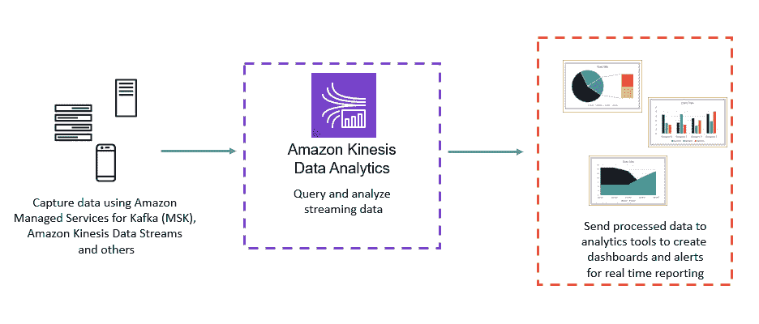

图 11.2 – Amazon Kinesis 数据分析

Amazon Kinesis 数据分析还使你能够实时分析流数据，并使用**Apache Flink**的开源库和连接器构建流应用程序。Apache Flink 是由**Apache 软件基金会**开发的完全开源的统一流处理和批处理框架。

最后，你可以访问**Kinesis 数据分析工作室**，它允许你使用 SQL、Java、Python 和 Scala 构建复杂的流处理应用程序。

在定价方面，您只需为运行流媒体应用程序所使用的资源付费，并且无需预先承诺。

接下来，我们将了解 Amazon Kinesis Video Streams 服务。

## Amazon Kinesis Video Streams

如果您希望将视频设备流式传输到 AWS 进行分析、机器学习、回放和其他处理服务，那么 Amazon Kinesis Video Streams 服务将是您使用的工具。Amazon Kinesis Video Streams 还可以从边缘设备、智能手机、安全摄像头等设备获取数据。

Amazon Kinesis Video Streams 使用 Amazon S3 作为流媒体视频的基础存储库，正如您所知道的，它提供了高水平的**数据耐久性**。此外，您还可以根据设备和时间戳搜索并检索视频片段。您的视频也可以加密和索引。

使用 Amazon Kinesis Video Streams，您可以播放视频进行实时或点播观看。此外，您还可以使用 Kinesis Video Streams 帮助您构建利用 AWS 上的计算机视觉视频分析技术的应用程序，例如 **Amazon Rekognition**。顺便提一下，Amazon Rekognition 是一项完全托管的图像和视频分析服务，可用于识别图像和视频中的物体、人物、文本、场景和活动。Amazon Rekognition 还可以用于检测不当内容。以下图表展示了 Amazon Kinesis Video Streams 服务：

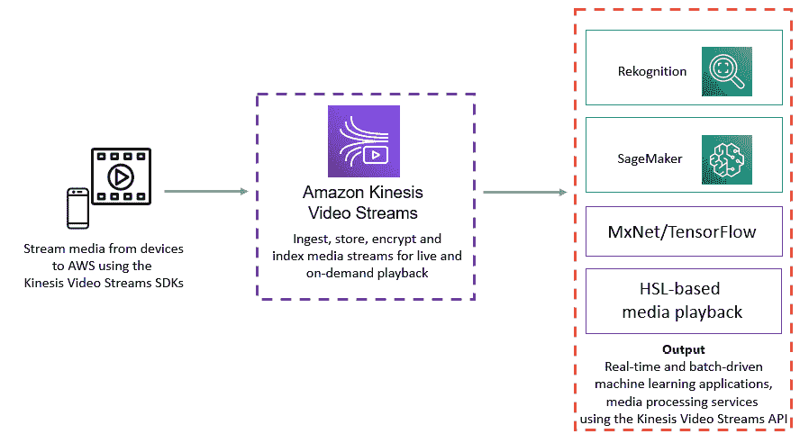

图 11.3 – Amazon Kinesis Video Streams

Amazon Kinesis Video Streams 使您能够为广泛的用例设计应用程序。一个用例包括能够为智能家居设备（如门铃）流式传输视频和音频。Amazon Kinesis Video Streams 将获取、索引并存储媒体流，您的应用程序可以使用 HTTP 实时流媒体将视频流传输到智能手机应用程序，允许您与*敲门*的人进行监控和沟通。

在这一部分，我们介绍了 Amazon Kinesis 并讨论了其四项关键功能。在下一部分，我们将向您介绍另一项 AWS 分析服务，即 Amazon Athena，这是一项完全托管的无服务器交互式查询服务，允许您使用标准 SQL 在 Amazon S3 中分析数据。

# 学习如何使用 Amazon Athena 查询存储在 Amazon S3 中的数据

企业将大量数据存储在 Amazon S3 等存储库中。许多数据不一定存储在常规的 Amazon RDS 或 NoSQL 数据库中。在许多情况下，这是因为数据集不需要定期更新和查询。以前，即使您想对部分数据进行临时查询或分析，您也需要将其导入到数据库中，然后对数据库进行查询。

**Amazon Athena**是一个完全托管的无服务器解决方案，允许您使用标准 SQL 直接在**Amazon S3**中交互式地查询和分析数据。无需配置基础设施，您只需为运行的查询付费。

Amazon Athena 使用**Presto**，这是一款开源 SQL 查询引擎，旨在让您执行临时分析。您可以使用标准的 ANSI SQL，它提供对大型连接、窗口函数和数组的完全支持。

数据可以以多种格式提供给 Amazon Athena，例如 CSV、JSON、ORC、Avro 或 Parquet。此外，您还可以使用 Athena 的 JDBC 驱动程序连接到各种商业智能工具。

Amazon Athena 允许您向其提供非结构化、半结构化和结构化数据，然后您可以使用这些数据运行查询进行分析。此过程涉及在 Athena 服务中创建一个数据库，并为每个特定的数据集创建一个或多个表，以便查询和分析。这些表允许您定义元数据，告诉 Athena 数据在 S3 中的存储位置以及数据的结构；例如，列名和数据类型。

为了执行查询并返回结果，表需要在 Athena 中注册。这些表可以自动或手动创建。注册表后，您可以使用`SQL SELECT`语句查询它们。查询结果也可以存储在您指定的 Amazon S3 位置。

在即将到来的练习中，*使用 Amazon Athena 和 AWS Glue 分析您的销售报告*，我们将把一些数据上传到 Amazon S3，并使用 Amazon Athena 进行查询。在这一部分中，我们向您介绍了 Amazon Athena 服务，并概述了如何使用 Athena 查询直接存储在 Amazon S3 中的数据。

在接下来的部分中，我们将介绍另一个 AWS 分析工具——Amazon Elasticsearch。

# Amazon Elasticsearch 简介

**Elasticsearch**是一个开源文本搜索和分析引擎，能够存储、分析并执行对大量数据的搜索功能，几乎实时地进行处理。您可以使用 Elasticsearch 分析各种类型的数据，如文本数据、数值数据、地理空间数据、结构化数据和非结构化数据。

亚马逊提供的 Elasticsearch 作为服务是一个完全托管的服务，无需设置和管理任何基础设施，让您可以专注于应用程序及其功能。遵循按需付费模式，它没有前期费用，尽管您可以预定 1 年或 3 年的实例，以享受比按需定价模型更显著的折扣。

Amazon Elasticsearch 旨在高度可扩展，可以索引所有类型的内容，帮助您为以下用例交付应用程序：

+   网站搜索

+   应用程序搜索

+   日志记录与日志分析

+   基础设施指标和监控

+   安全分析

原始数据如日志文件、消息、指标、文档和列表会被采集、规范化并在 Elasticsearch 中建立索引。然后，您可以针对这些数据运行复杂的查询，并使用聚合来查看数据摘要。

Amazon Elasticsearch 还提供与**Kibana**的集成，Kibana 是一种数据可视化工具，用于分析大型数据集，帮助您将数据呈现为图表、饼图、热力图等形式的可视化表现。

亚马逊 Elasticsearch 还与**Logstash**集成，Logstash 是一款开源的服务器端数据处理管道，它允许您从广泛的来源获取数据，进行转换并将其发送到如 Elasticsearch 的**stash**中。Elasticsearch、Kibana 和 Logstash 通常统称为**ELK**。

最后，Amazon Elasticsearch 支持使用标准 SQL 查询您的集群，使您的开发人员能够轻松开始使用该服务。您还可以通过 JDBC 驱动程序连接到现有的基于 SQL 的 BI 和 ETL 工具。

在本节中，我们向您介绍了亚马逊 Elasticsearch 服务，它允许您创建高可扩展、安全且高可用的 Elasticsearch 集群，并提供与 Kibana 和 Logstash 的完整集成，构建完整的托管 ELK 解决方案。

在下一节中，我们将介绍 Amazon Glue 和 QuickSight。

# Amazon Glue 和 QuickSight 概述

商业数据通常存储在各种服务中——数据库、存储桶、电子表格等。能够将所有相关数据汇集在一起进行分析，有时可能是一个庞大的项目。之后，您可能希望使用 BI 工具提取并以易于理解的方式呈现这些数据，或将这些数据的洞察无缝集成到您的应用程序、仪表板和报告中。AWS 提供的两个可以帮助满足这些需求的服务是**Amazon Glue**和**QuickSight**。接下来我们将简要介绍这两个服务。

## Amazon Glue 概述

Amazon Glue 是一项无服务器的**提取、转换和加载**（**ETL**）服务。通过 Amazon Glue，您可以发现、准备、丰富、清理并转换来自各种来源的数据。然后，您可以将数据加载到数据库、数据仓库和数据湖中。来自流式数据源的数据也可以加载进行定期报告和分析。此数据随后可以根据您的业务需求用于分析，并帮助决策。

Amazon Glue 配备了**数据目录**，这是一个中央元数据存储库，用于存储有关数据的信息，如表定义。你可以使用**爬虫**服务扫描不同的存储库，分类数据，并*推断*数据格式和数据类型等模式信息。然后，这些元数据会作为表格存储在数据目录中，并用于生成 ETL 脚本，以便转换、扁平化和丰富数据。接着，数据会被填充到你选择的数据仓储解决方案或数据湖中，例如。

Amazon Glue 还配备了**AWS Glue 控制台**服务，帮助你定义并编排 ETL 工作流。它让你可以做以下操作：

+   定义 Glue 对象，如作业、爬虫、表格等。

+   安排**爬虫**运行操作。

+   定义事件或计划以触发作业。

+   在 Glue 中搜索并筛选对象列表。

+   直接编辑转换脚本，或使用提供的可视化工具。

Amazon Glue 是一个完全托管的服务，根据需要扩展资源来运行你的作业。它自动处理错误并进行重试。使用 Amazon Glue 时，你按小时收费，费用按秒计费。此定价基于运行爬虫（用于发现数据）和执行 ETL 作业（用于处理和加载数据）。此外，你还需要支付月费以存储和访问 AWS Glue 数据目录中的元数据。

接下来，我们将了解 Amazon QuickSight 服务。

## Amazon QuickSight 概览

Amazon QuickSight 是一款无服务器、完全托管的云端商业智能（BI）服务，用于创建和发布交互式 BI 仪表盘，帮助企业数据分析。这让你能够获取企业有价值的信息，从而做出决策。

Amazon QuickSight 可以连接到你数据的存储位置——无论数据存储在**AWS 服务**、**本地数据库**、**电子表格**、**SaaS 数据**还是**B2B 数据**中。这些数据可以被转化为丰富的仪表盘和报告工具，帮助你的企业了解运营、销售额、利润、成功案例以及可能需要改进的地方。Amazon QuickSight 可以安全地发布仪表盘，支持通过移动电话、电子邮件或 Web 应用程序进行组织内部的协作。

Amazon QuickSight 还与机器学习服务（ML）集成，可以从数据中构建并提供更深入的洞察。通过**机器学习洞察**，你可以发现数据集中的隐藏洞察，比如异常和变化，从而使你能够迅速对变化作出反应。你还可以安排自动的异常检测作业。借助机器学习洞察，你可以进行更好的预测分析，这有助于进行准确的*假设分析*。最后，你可以将数据总结为易于理解的自然语言叙述，这有助于你在仪表盘和报告服务中提供更具上下文的信息。

Amazon QuickSight 的定价模型是按使用付费，费用由谁使用服务来决定；例如，管理员、作者和阅读者。因此，定价基于用户数量，类似于基于用户的许可证。服务如警报和异常检测也会产生额外费用。你可以在 [`aws.amazon.com/quicksight/pricing/`](https://aws.amazon.com/quicksight/pricing/) 查看定价概览。

在本节中，我们回顾了两个额外的 AWS 服务，这些服务属于分析类别。我们向你介绍了 Amazon Glue 服务，它是一个完全托管的无服务器 ETL 解决方案。我们还提供了云原生 BI 工具的概述，利用机器学习从数据中提供更深入的商业洞察。

在下一节中，我们将介绍一两个额外的工具，作为整体分析解决方案的一部分。

# 其他分析服务

在本节中，我们将快速浏览一些其他你需要了解的 AWS 分析服务。具体来说，我们将查看 **Elastic Map Reduce**（**EMR**）服务、**CloudSearch** 和 **Data Pipeline**：

+   **AWS EMR**：这提供了一个托管的 **Hadoop 框架**，使你能够处理大量的大数据。你可以使用开源工具，如 Apache Spark、Apache Hive、Apache HBase、Apache Flink、Apache Hudi 和 Presto。Amazon EMR 配备了一个名为 **EMR Studio** 的 **集成开发环境**（**IDE**），帮助你开发、可视化和调试用 R、Python、Scala 和 PySpark 编写的数据工程和数据科学应用。你可以在 EC2 实例、Amazon **弹性 Kubernetes 服务**（**EKS**）集群和使用 AWS Outpost 服务的本地环境中运行 EMR 工作负载。定价方面，按照每个实例的每秒使用计费，并且有 1 分钟的最低计费时间。

+   **AWS 数据管道**：这是一项 web 服务，允许你安排和自动化数据从各个来源（包括**本地服务器**）移动和转化到如 Amazon S3、RDS、DynamoDB 和 EMR 等服务。使用 AWS 数据管道，你可以创建在预定时间间隔传输和转化数据的工作流，确保与应用程序过程的对齐。例如，你可以将网页服务器日志每天归档到一个 Amazon S3 存储桶中，然后每周运行 Amazon EMR 作业来分析这些日志并生成应用程序可使用的流量报告。

+   **AWS CloudSearch**：这是一项完全托管的服务，使你能够为你的 web 应用程序部署、管理和扩展搜索解决方案。Amazon CloudSearch 支持 34 种语言，并为你的网站增加丰富的搜索功能，包括自由文本搜索、布尔搜索和分面搜索。它还提供自动建议、高亮显示等功能。

在这一节中，我们介绍了 AWS 提供的一些额外服务，这些服务属于分析类别。在接下来的章节中，我们将进入本章的练习。

# 练习 11.1 – 使用 Amazon Athena 和 AWS Glue 分析销售报告

在本次练习中，你需要下载一个示例 CSV 文件，该文件可以在本章的 Packt GitHub 仓库中找到：[`github.com/PacktPublishing/AWS-Certified-Cloud-Practitioner-Exam-Guide`](https://github.com/PacktPublishing/AWS-Certified-Cloud-Practitioner-Exam-Guide)。这是一个简单的 CSV 文件，包含了一些关于“Vegan Studio”的销售数据，这是一家虚构公司，你在前几章中已经完成了一系列练习。

你需要将这个 CSV 文件存储在 Amazon S3 存储桶中，然后使用 Amazon Athena 对数据进行查询。在开始本次练习之前，请确保你已经下载了 CSV 文件并将其存储在你的电脑上。

## 第 1 步 – Amazon S3

1.  使用我们高级管理员**Alice**的 IAM 用户 ID 登录到 AWS 账户。

1.  导航到 Amazon S3 仪表板。

1.  创建两个新的存储桶，并给予适当的名称。例如，我命名了我的存储桶为 `vegan-sales-report`（用于存储 CSV 文件）和 `vegan-query-results`（用于存储 Athena 查询结果）。由于我已经使用了这些名称，你将不能使用它们，因为存储桶名称在 AWS 生态系统中必须是唯一的。确保在 `us-east-1 (N.Virginia)` 区域创建存储桶。

1.  接下来，将你的 CSV 文件上传到将用于托管数据的存储桶中。回顾前几章中完成上传所需的步骤。（提示：尝试凭记忆操作，这有助于增强你的信心。）

    ## 第 2 步 – Amazon Athena 和 Amazon Glue

1.  导航到 Amazon Athena 仪表板。你可以从 AWS 管理控制台的顶部搜索栏中搜索 Athena 服务。

1.  如果这是你第一次访问 Amazon Athena，你应该会看到一个启动屏幕。点击 **开始使用**。如果你没有看到 **开始使用** 选项，那是因为你正在使用新的用户界面。AWS 以不断更改用户界面而著名。如果你看到了新的控制台界面，你需要点击 **探索查询编辑器** 按钮。对于这个实验室，我们建议你暂时使用旧版控制台。要访问旧版控制台，请点击控制台左上角的省略号（三个横线），然后切换切换开关以禁用 **新 Athena 体验** 选项。这将带你回到旧版控制台界面：

    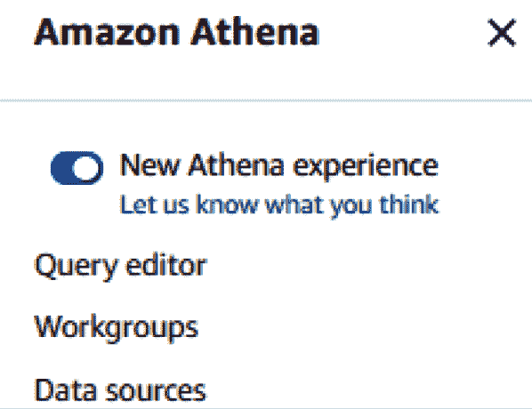

    图 11.4 – 禁用新 Athena 体验切换开关

1.  在右上角，点击 `s3://bucket-name`。你也可以将查询存储在子文件夹中，并选择加密查询结果：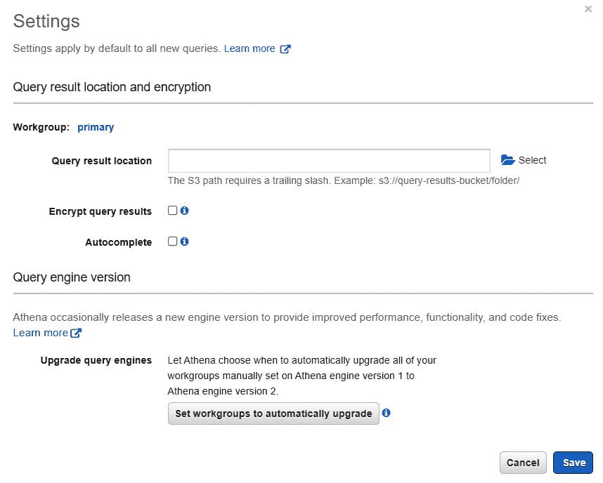

    图 11.5 – Amazon Athena – 设置

1.  接下来，点击 **保存** 按钮。

1.  接下来，从左侧菜单中点击**连接数据源**，如以下截图所示：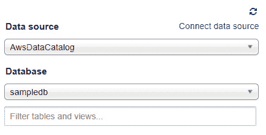

    图 11.6 – Amazon Athena – 连接数据源

1.  在**选择数据所在位置**下，确保选择了**查询 Amazon S3 中的数据**。

1.  在**选择元数据目录**下，确保选择了**AWS Glue 数据目录**。在这个练习中，您将使用 AWS Glue 来爬取数据并创建一个模式。这个操作会产生少量费用，但非常低，而且只需做一次。

1.  点击页面右侧窗格中的**下一步**按钮。

1.  在**连接详情**下，确保选择了**此账户中的 AWS Glue 数据目录**。然后，在**选择创建表的方式**下，选择**在 AWS Glue 中创建爬虫**。

1.  点击**连接到 AWS Glue**按钮。这将会在新的浏览器标签页中启动**AWS Glue**。切换到此标签页来配置 Amazon Glue。不要关闭 Amazon Athena 浏览器标签页，因为稍后我们还会返回到这个标签页。

1.  如果您看到启动画面，请点击**开始使用**按钮。

1.  从左侧菜单中，点击**爬虫**。

1.  在右侧窗格中，点击`s3://bucket-name`。请注意，在为您的 S3 存储桶定义的路径末尾，确保再添加一个斜杠（`/`）。`s3://vegan-sales-report/`。

1.  点击`VeganSalesRole`，它的含义一目了然。点击`vegansalesdb`。点击**创建**。

1.  您将被带回到**配置爬虫输出**页面，您新创建的数据库名称将显示在**数据库**文本框中。点击**下一步**。

1.  在**审查所有步骤**页面，点击**完成**。

+   您将被重定向到**爬虫**页面。在这里，您将能够看到已创建的爬虫。点击爬虫旁边的复选框，然后点击**运行爬虫**按钮，如以下截图所示：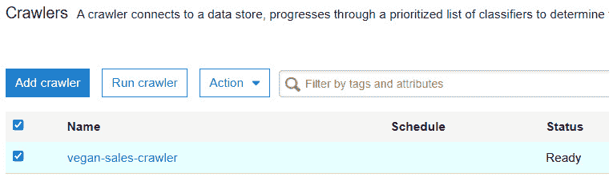

    图 11.7 – Amazon Glue – 运行爬虫

    +   一两分钟后，您应该会看到其**状态**设置为**就绪**，并且爬虫已成功运行。您会看到已经添加了一个表，如以下截图所示：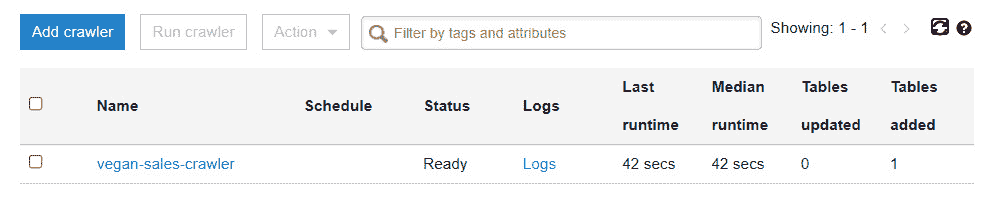

    图 11.8 – Amazon Glue – 爬虫完成

    +   爬虫完成后，我们可以返回到 Amazon Athena 浏览器标签页。

    ## 步骤 3 – Amazon Athena

    +   回到 Athena 浏览器标签页，点击页面右下角的**取消**按钮。这将带您回到主页面**Amazon Athena 数据源**，您会看到最近创建的 Glue 目录列在**数据源**下，如以下截图所示：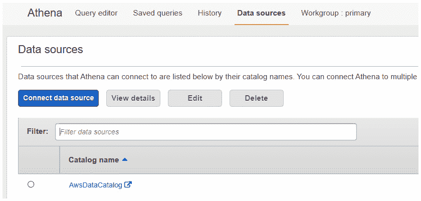

    图 11.9 – Amazon Athena – 数据源

    +   接下来，点击**Query editor**标签页。*在左侧菜单中，选择你在*步骤 2*中创建的数据库，这将显示你在数据库中创建的表格，具体如以下截图所示：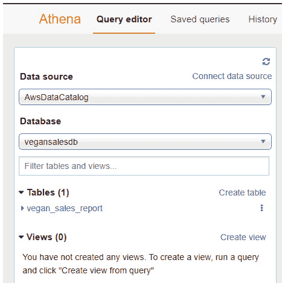

    图 11.10 – Amazon Athena – 查询编辑器

    +   现在，你可以通过点击省略号（三个点，位于你的表格名称旁边），然后在出现的上下文菜单中点击**Preview table**，轻松预览存储在 Amazon S3 中的数据。这将运行一个 SQL 查询，并根据以下截图从表格中检索示例数据：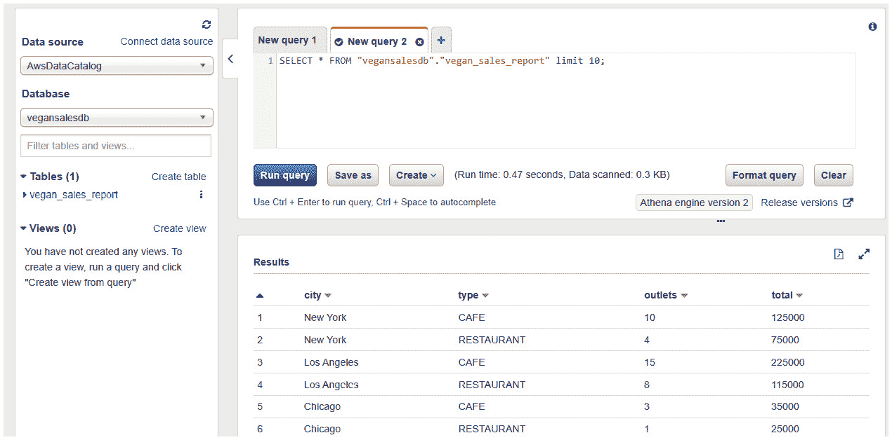

    图 11.11 – Amazon Athena – 示例查询

    +   你可以运行其他查询。例如，你可以用以下 SQL 语句替换窗格上半部分的 SQL 语句：

    ```
    SELECT * FROM "vegansalesdb"."vegan_sales_report" WHERE total >=100000; 
    ```

    上述语句将展示所有销售额达到或超过 $100,000 的城市，具体如以下截图所示：

    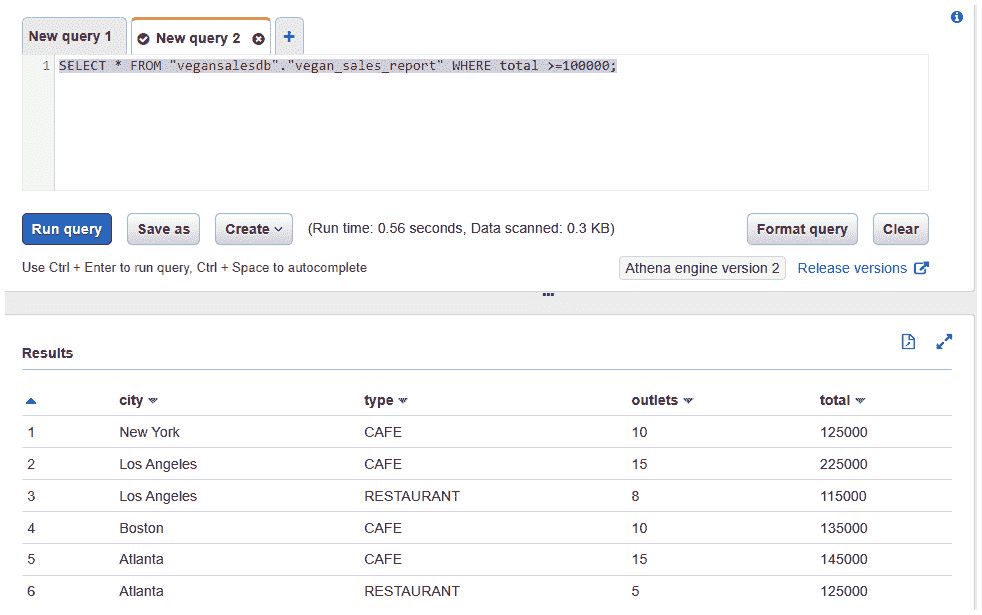

图 11.12 – Amazon Athena – 查询以识别那些销售额大于或等于 $100,000 的城市

如你所见，Amazon Athena 强大之处在于能够访问并查询你在 Amazon S3 中的原始数据。你无需为这种临时的数据分析设置和部署服务器，也不需要运行昂贵的数据库。

现在，我们将执行清理操作，删除 AWS 账户中不需要的资源。

# 练习 11.2 – 清理

在本练习中，你将删除在前一个练习中创建的资源，以确保没有不必要的费用：

1.  进入 Amazon Glue 控制台。

1.  在左侧菜单中，点击**Crawlers**链接。在右侧窗格中，选择**vegan-sales-crawler**。从**Actions**下拉列表中，点击**Delete Crawler**选项，然后确认删除操作。

1.  接下来，在左侧菜单中点击**Databases**。在右侧窗格中，选择**vegansalesdb**数据库。然后，从**Actions**下拉列表中，点击**Delete database**选项。

1.  在出现的**Delete Database**确认对话框中，点击**Delete**按钮。

接下来，你需要删除 Amazon S3 桶，因为它们不再需要：

1.  进入 Amazon S3 控制台。在左侧菜单中，点击**Buckets**。

1.  在右侧窗格中，在确认文本框中选择`permanently delete`。然后点击**Empty**按钮。你将收到一条确认信息，表示该桶已成功清空。点击**Exit**按钮。

1.  接下来，仍然选中**vegan-query-results**桶，点击**Delete**按钮。

1.  通过在确认文本框中输入桶的名称并点击**Delete bucket**按钮，确认删除操作。

1.  重复 *步骤 1* 到 *4* 来处理 **vegan-sales-report** 桶。

现在您已完成清理练习，我们将总结本章。

# 总结

在本章中，我们讨论了 AWS 中属于分析类别的几种服务。当今企业拥有大量数据，能够分析并理解这些数据非常重要。从这些数据中获取的信息可以帮助企业响应客户的需求和要求，解决潜在问题，甚至预测未来的增长。最终，企业可以获得竞争优势。

在本章中，您了解了亚马逊 Kinesis 等服务，允许客户实时或准实时地流式处理和响应数据。您还了解了可以快速查询数据的服务，如亚马逊 Athena，以及使用 BI 工具呈现数据的服务。这些分析服务大多数也以按需付费的完全托管服务形式提供，使几乎任何企业都能负担得起。

在下一章中，您将了解 AWS 上各种部署和编排工具，这些工具可以帮助您在云中配置和部署应用程序，无需大量手动配置。我们将介绍 **基础设施即代码**（**IaC**），它已经在 IT 界引起了轰动，因为您可以使用预定义模板设计和部署端到端基础设施解决方案，仅需几分钟。我们还将看看如何使用 AWS Lambda 等无服务器计算服务自动化常见的 IT 任务。

# 问题

回答以下问题，测试您对本章内容的了解：

1.  哪种 AWS 服务可以帮助您将大量流数据输入到 Amazon Redshift 进行准实时分析？

    1.  亚马逊 Athena

    1.  亚马逊 Kinesis Firehose

    1.  亚马逊 Kinesis 视频流

    1.  亚马逊 RDS

1.  哪种 AWS 服务可以帮助您使用标准 SQL 查询实时查询流数据？

    1.  亚马逊 Kinesis 数据流

    1.  亚马逊 Kinesis 数据分析

    1.  亚马逊 Glue

    1.  亚马逊 QuickSight

1.  您计划构建一个应用程序，从乡村道路上的速度摄像头捕获视频流以进行分析。您需要能够捕获所有超速的车辆，并通过车辆的牌照识别违规驾驶员。AWS 上哪两种服务可以帮助您实现这些要求？（选择 2 个答案。）

    1.  亚马逊 Athena

    1.  亚马逊 Kinesis 数据分析

    1.  亚马逊 Kinesis 视频流

    1.  亚马逊 Elasticsearch

    1.  亚马逊识别

1.  哪种 AWS 服务使您能够索引所有类型的内容，与**Kibana**集成，并帮助您构建数据可视化工具以分析大型数据集？

    1.  亚马逊 Elasticsearch

    1.  亚马逊 Glue

    1.  亚马逊 Athena

    1.  亚马逊 Kinesis Firehose

1.  你将多个网络日志文件（CSV 格式）存储在 Amazon S3 存储桶中。你被要求分析一个特定文件的内容，以便检查可能的恶意攻击。哪个 AWS 服务可以帮助你分析 Amazon S3 中的原始数据，并执行必要的临时分析？

    1.  Amazon Glue

    1.  Amazon QuickSight

    1.  Amazon Athena

    1.  Amazon 数据管道

1.  哪个 AWS 服务可以用于执行无服务器 ETL 功能，以发现、准备、丰富、清理并转换来自不同来源的数据进行分析？

    1.  AWS Glue

    1.  AWS Athena

    1.  AWS QuickSight

    1.  AWS Rekognition

1.  哪个 AWS 服务允许你为企业数据创建并发布交互式商业智能仪表盘，从而为你的企业提供有意义的信息，以便做出决策？

    1.  AWS Kinesis 数据分析

    1.  AWS Glue

    1.  AWS QuickSight

    1.  AWS Kinesis Firehose
