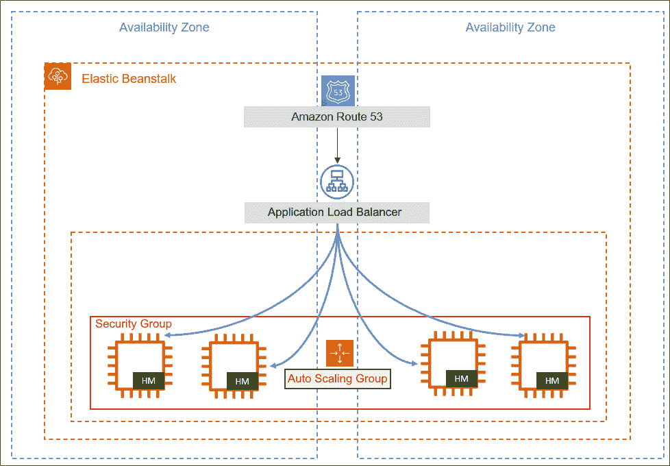
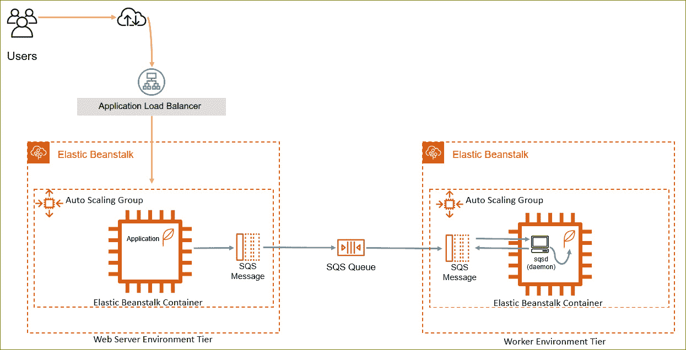
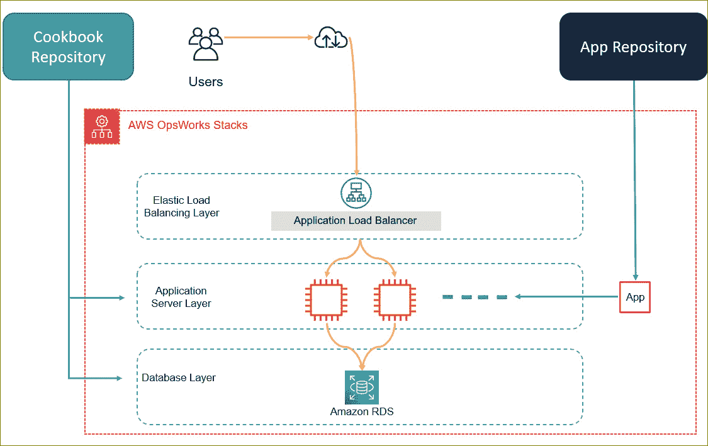
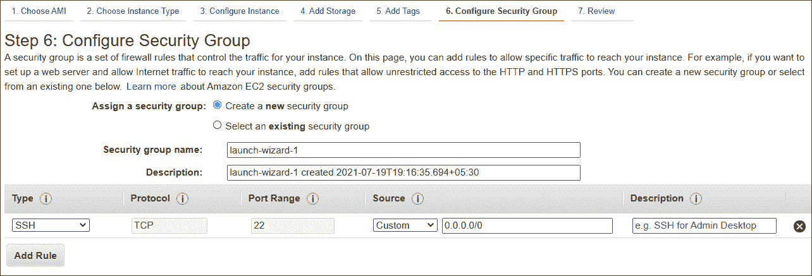
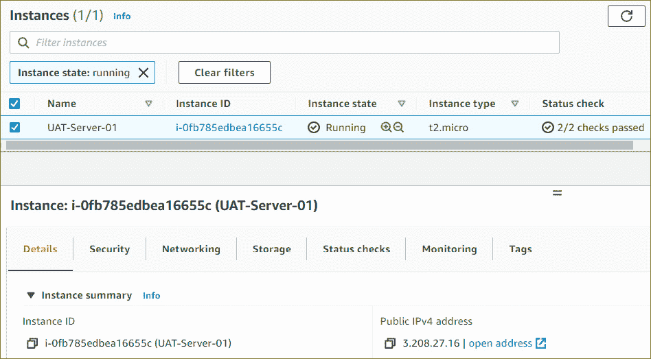
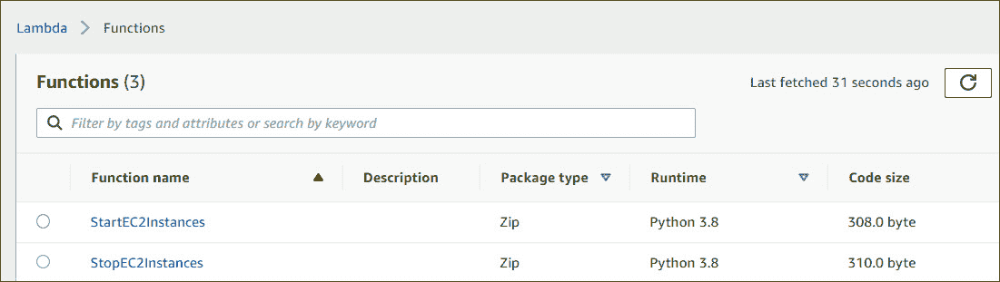
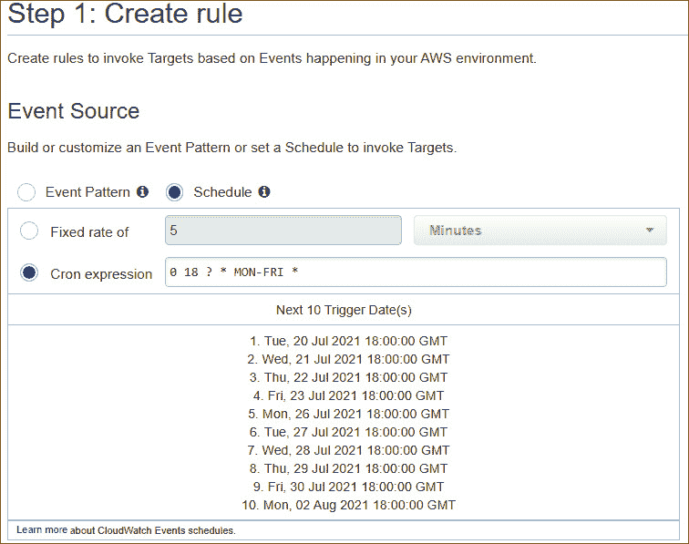
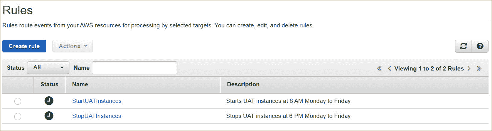
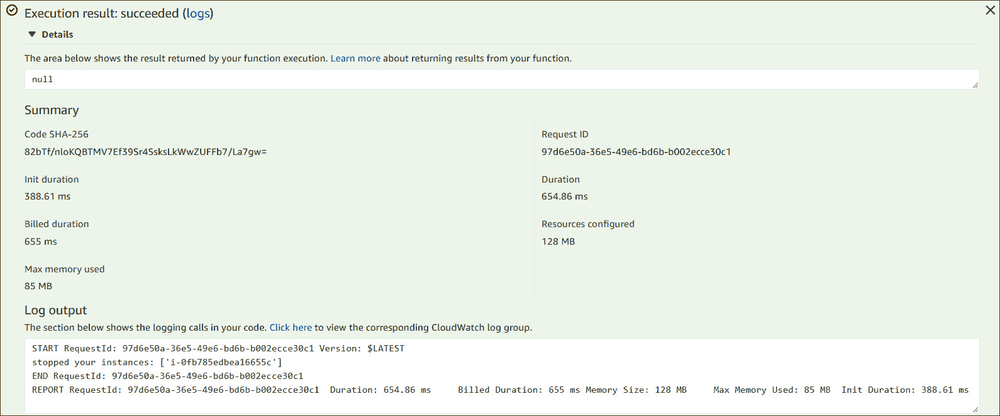

# 第十二章：AWS 上的自动化与部署

到目前为止，您已经学习了如何在 AWS 上配置和部署各种服务。然而，您的大部分配置都是手动完成的，自动化程度非常低。例如，在*第九章*，*AWS 上的高可用性与弹性*，您在多层架构中部署了一个应用程序。这包括配置在自动扩展组中的应用服务器、应用负载均衡器、用于存储应用数据的数据库，以及托管源代码的 S3 存储桶。所有这些都部署在 **Amazon VPC** 的私有网络中。

在构建应用程序堆栈时，您需要手动配置 AWS 上的各种服务及所需的资源，以部署应用程序。例如，使用 VPC 时，您需要配置子网、IP 地址范围、安全组、NAT 网关等许多内容。现在，想象一下，每次需要创建新环境来托管应用程序时，您都必须执行这些手动操作。这无疑会非常耗时。

AWS 提供了各种部署和自动化工具，帮助您构建、配置和搭建基础设施组件来托管应用程序。部分工具属于 PaaS 模式，您只需要关注应用程序的构建和部署策略，AWS 会自动提供支持该应用程序所需的基础设施。其他服务则使您能够定义基础设施模板，这些模板可以反复使用进行配置。通过使用 **基础设施即代码**（**IaC**），您可以起草一个模板，描述服务和资源如何配置。然后，AWS 会构建该基础设施及其所有组件，供您托管应用程序。自动化基础设施部署带来了多个好处，其中包括通过在整个组织内共享您的 *模板* 来实现全球规模扩展，进而强制执行公司标准和安全最佳实践。此外，通过避免手动配置，您还可以减少人为错误的可能性。

在本章中，我们将探讨一些核心的自动化和部署工具，帮助您更快地将解决方案推向市场。

本章将涵盖以下主题：

+   了解使用 Amazon Elastic Beanstalk 进行应用程序部署

+   了解使用 Amazon CloudFormation 的基础设施即代码（IaC）优势

+   介绍使用 AWS OpsWorks 协调 Chef 和 Puppet 解决方案

+   使用 Lambda 进行 IT 自动化

# 技术要求

为完成本章的练习，您需要以 IAM 用户 **Alice** 的身份登录 AWS 账户，该用户已在*第四章*，*身份与访问管理*中设置。

# 了解使用 Amazon Elastic Beanstalk 进行应用程序部署

**Amazon Elastic Beanstalk**是一项服务，它使你能够部署应用，而无需手动配置支撑应用的底层基础设施。Amazon Elastic Beanstalk 负责所有繁重的工作，包括为托管和管理你的应用提供必要的基础设施。这包括容量配置、扩展、负载均衡和健康监控。

如果你的应用是用支持的语言之一开发的，包括 Go、Java、.NET、Node.js、PHP、Python 等，Amazon Elastic Beanstalk 将使用一个或多个 AWS 资源（如 EC2 实例）来构建平台，以运行你的应用。你只需要遵循规定的过程来部署你的应用。

另一个可以考虑的选项是使用 Elastic Beanstalk 来部署 Docker 容器。这个方式给你更多的灵活性，因为使用 Docker 容器，你可以配置你的运行时环境，选择所需的编程语言、支持的平台以及任何依赖项。因此，你不受通常与其他平台相关的限制。

亚马逊 Elastic Beanstalk 并不限制你使用特定的底层基础设施设计。你可以修改底层基础设施组件的部署方式——例如，你可以指定部署的 EC2 实例类型和大小，或者强制要求在自动扩展组中部署一定数量的 EC2 实例。最终，你仍然掌控基础设施的配置方式，但无需进行复杂的手动配置，这些都由 Amazon Elastic Beanstalk 来处理。一旦你的应用部署完成，你可以管理环境并在稍后部署应用更新或版本。

现在，让我们来看一下 Amazon Elastic Beanstalk 服务的核心组件。

## Amazon Elastic Beanstalk 的核心组件

AWS Elastic Beanstalk 为托管你的应用创建的基础设施组件被称为*环境*。每个环境只能运行一个应用版本，但你可以同时为不同的应用版本创建多个环境。如果需要，你可以修改环境并在发布新更新时部署应用升级。

在启动 Elastic Beanstalk 环境时，你需要选择*环境层*。你选择的环境层由你部署的应用类型决定，并最终决定 Elastic Beanstalk 将配置哪些资源来支持你的应用。Elastic Beanstalk 可以配置两种环境层：**Web 服务器环境层**和**工作者环境层**。

### Web 服务器环境层

该环境是为您的应用堆栈的前端层设计的，例如您的电子商务应用的前端 **用户界面**（**UI**）。AWS Elastic Beanstalk 将提供一个旨在通过弹性负载均衡器接受您的 Web 应用程序的入站流量、提供自动扩展组配置形式的可扩展性并包含一个或多个 EC2 实例的环境。

下图展示了典型的架构部署：



图 12.1 – AWS Elastic Beanstalk – Web 服务器环境层

作为 *Web 服务器环境层* 的一部分，AWS Elastic Beanstalk 会在多个 AZ（可用区）中部署 EC2 实例。然后，您的应用程序会部署到这些实例上。此外，Amazon Auto Scaling 会作为环境的一部分配置，以便在应用需求增加时扩展，或在需求下降时缩减。您将完全控制用于扩展的策略及其参数。AWS Elastic Beanstalk 还将部署一个软件堆栈，具体取决于 *容器类型*，即用于该环境的基础设施拓扑和软件堆栈。例如，如果您在 Windows 上部署 .NET 应用程序，则 Elastic Beanstalk 配置的环境将包括 Microsoft Windows 操作系统、Windows EC2 实例和 **Internet Information Services+**（**IIS**）的一个版本。

AWS Elastic Beanstalk 还会配置一个指向负载均衡器的环境 URL，格式为 `app-name.region.elasticbeanstalk.com`。该 URL 被别名为弹性负载均衡器的 URL。您还可以使用 Amazon Route 53 将此 URL 与您选择的 CNAME 记录进行别名，例如您的公司域名。这样，您就可以使用更友好的名称，如 `myapp.mycompany.com`。

此外，每个 EC2 实例将配置一个名为 **主机管理器**（**HM**）的软件组件。HM 负责以下任务：

+   部署应用程序

+   聚合服务器的事件和指标

+   生成实例级事件

+   监控应用程序日志文件中的关键错误

+   监控应用程序服务器

+   为 EC2 实例打补丁

+   轮换应用程序的日志文件并将其发布到 Amazon S3

接下来，我们将查看工作者环境层。

### 工作者环境层

该环境用于后台操作。在多层应用架构中，这代表了应用程序堆栈中的中间件、应用程序和后端数据库层。AWS Elastic Beanstalk 提供了一个适合此类后台操作的环境，包括一个自动扩展组、一个或多个 Amazon EC2 实例和一个 IAM 角色。此外，如果您尚未配置自己的队列，AWS Elastic Beanstalk 还会为您配置一个 Amazon SQS 队列。

AWS Elastic Beanstalk 还将在每个 EC2 实例上安装一个*守护进程*。该守护进程将从 Amazon SQS 队列中读取消息，并将这些数据发送到在工作环境层中运行的应用程序服务器进行处理。这个过程如下图所示：



图 12.2 – AWS Elastic Beanstalk – 工作环境层

AWS Elastic Beanstalk 还将使用名为**Amazon CloudWatch**的服务监控你的 EC2 实例的健康状况。我们将在*第十三章*中查看 Amazon CloudWatch，*AWS 上的管理与治理*。

除此之外，AWS Elastic Beanstalk 还可以帮助你使用各种部署类型来部署和管理应用程序堆栈，包括*一次性全部部署*、*滚动部署*、*带附加批次的滚动部署*、*不可变部署*和*流量分割*。这些部署类型使你能够设计符合特定业务需求的应用程序部署和任何持续更新。

在本节中，我们学习了 AWS Elastic Beanstalk 服务，它是 AWS 上的一个应用程序部署和管理服务。AWS Elastic Beanstalk 允许开发人员专注于应用程序代码，而无需对基础设施组件进行详细配置以支持应用程序。AWS Elastic Beanstalk 将提供一个高可用且可扩展的基础设施架构，并让你控制如何配置这些基础设施组件，以支持你的特定需求。

在下一节中，我们将研究 Amazon CloudFormation 服务，它使你能够使用 JSON 或 YAML 代码编写的模板来架构你的底层基础设施资源。

# 了解使用 Amazon CloudFormation 的 IaC 的好处

使用代码描述并自动部署基础设施组件的方法被称为 IaC（基础设施即代码）。IaC 是一个基本组件，使你能够在云中自动化基础设施构建。

使用代码构建基础设施可以大大改善部署过程，因为代码是由机器执行的。这也意味着，任何通过代码部署的基础设施都不容易受到人为错误的影响，这些错误是手动部署所固有的。此外，你还可以为重复部署创建模板，并为这些模板启用版本控制。通常，你希望使测试环境和生产环境相互模拟，以确保一旦应用程序通过测试阶段，它可以轻松部署到生产环境。使用描述你基础设施的模板是避免这些环境之间差异的最佳方法。

**Amazon CloudFormation**是一个解决方案，可以帮助你使用代码设计、构建和部署基础设施。它帮助你定义要创建和配置的资源，以及这些资源如何相互作用。

## CloudFormation 模板

亚马逊 CloudFormation 使用*模板*，这些是以 JSON 或 YAML 格式编写的文本文件。代码描述了你希望部署的资源以及与这些资源相关的配置信息。例如，如果你需要将**安全组**作为 VPC 模板的一部分进行部署，你可以指定它的名称以及允许的入站和出站规则。

CloudFormation 模板的最佳之处在于，它们包含你希望 CloudFormation 部署的资源描述。这也可以作为你整个基础设施的技术文档。此外，模板可以重复使用，用于为不同环境部署基础设施。这确保了你在开发和测试环境中拥有相同的架构。虽然每个环境中的配置相同，但它们会是不同的环境，具有不同的资源标识符。

AWS CloudFormation 模板也可以用于接受输入参数值。这有助于加速构建不同环境以进行实验和测试的过程。例如，如果你正在测试一个新应用程序，并且想要根据托管该应用程序的 EC2 实例类型和大小来比较性能水平，你可以部署多个具有不同 EC2 实例类型和大小的测试环境。在部署模板时，输入参数会提示你指定每个环境使用的实例类型和大小。这也使得在不同情况下使用相同模板变得更加容易。

CloudFormation 模板用于部署 CloudFormation 堆栈，堆栈是一个容器，用来组织模板中描述的资源。接下来我们将讨论 CloudFormation 堆栈。

## CloudFormation 堆栈

使用 CloudFormation，你可以创建*堆栈*，这是一个容器，用于将所有相关资源作为一个单元进行集中管理。例如，一个堆栈可能包含 VPC、自动伸缩组、弹性负载均衡器和 Amazon RDS 数据库实例。你可以拥有多个堆栈，部署一组可能需要相互通信的资源。

当你不再需要堆栈中的资源时，你也可以删除堆栈。然后，AWS 会删除堆栈创建时通过模板部署的所有资源。这确保你不会留下任何资源，这通常发生在你手动删除环境中的资源时。这样做还确保你在不再需要测试或开发环境时，能够快速清理掉这些环境。

有时，你可能需要修改你的堆栈——例如，如果你需要升级 EC2 实例类型或更改数据库端点。接下来我们将讨论如何实现堆栈的修改。

## 变更集

如果你需要对已部署的堆栈资源进行更改，可以创建一个 **变更集**。AWS CloudFormation 根据你对模板所做更改的摘要创建此变更集，并向你提供提议更改的详细信息。然后，你可以决定是否发布这些更改，或先进行进一步修改。

变更集特别有助于突出可能产生灾难性结果的更改，确保你可以先执行所有预防性任务。例如，如果你仅仅在模板中更改了 Amazon RDS 数据库的名称，AWS CloudFormation 会创建一个新数据库并删除旧数据库。如果在执行此操作之前没有备份 RDS 数据库，你将丢失数据。变更集可以帮助你识别此类不可逆更改发生的地方，并确保你在发布更改之前先手动为 RDS 数据库创建快照。

## 漂移检测

在对 CloudFormation 堆栈进行任何更改时，推荐的方法是使用变更集。然而，也有可能在 CloudFormation 外部对堆栈资源进行更改。有时，这些更改可能是偶然发生的，但有时你可能会急于进行这些更改，尽管任何更改都应该遵循适当的变更管理流程。

另一个问题是，如果在 CloudFormation 外部进行了更改，那么任何堆栈更新或删除请求可能会失败。AWS 提供了一项名为 *漂移检测* 的 CloudFormation 服务功能。你可以使用漂移检测来识别在 CloudFormation 管理之外已进行配置更改的堆栈资源。

在本节中，你了解了 AWS CloudFormation 服务，它采用 IaC 方法构建和部署可以支持你应用程序的基础设施资源。CloudFormation 使你能够使用 JSON 和 YAML 格式的文本文件设计模板，这些文件描述了你的资源以及它们的配置方式。

然后，CloudFormation 会按照你想要的方式进行资源的配置工作。CloudFormation 模板用于构建 CloudFormation 堆栈，堆栈将所有相关资源作为一个单元进行管理。

在下一部分，我们将介绍另一项 AWS 服务，它可以帮助你编排和部署为 Chef 和 Puppet 自动化工具设计的应用程序。

# 使用 AWS OpsWorks 编排 Chef 和 Puppet 解决方案简介

在本节中，我们将简要介绍另一种配置管理和编排服务，称为 **AWS OpsWorks**。AWS 提供了三种不同的服务，这些服务属于 AWS OpsWorks 产品系列。包括 AWS OpsWorks 堆栈和 AWS OpsWorks for Chef Automate，它们允许你使用 Chef cookbook 进行配置管理。第三个服务是 OpsWorks for Puppet Enterprise，允许你在 AWS 中配置 Puppet Enterprise 主服务器。

**OpsWorks for Puppet Enterprise** 提供一个 *完全托管的 Puppet 主服务器*，用于与节点进行通信、配置、部署和管理节点——这些节点可以是 EC2 实例，甚至是本地服务器。该服务还负责处理诸如软件和操作系统配置、软件包安装、数据库设置等任务。

**AWS OpsWorks for Chef Automate** 让你创建 *AWS 管理的 Chef 服务器*，包括 Chef Automate 软件解决方案。AWS OpsWorks 创建一个 Chef 服务器，用于管理所有节点，并作为 Chef cookbook 的中央存储库。Chef cookbook 包含使用 Ruby 编程语言编写的配方，使你能够定义需要配置的资源及其属性集合。

AWS OpsWorks for Puppet Enterprise 和 OpsWorks for Chef Automate 要求你了解如何操作 Chef 和 Puppet 软件。如果你更喜欢通过基础设施即代码（IaC）方法部署应用程序，且不熟悉 Chef 或 Puppet，你也可以使用 AWS OpsWorks 堆栈。接下来，我们将看看 AWS OpsWorks 堆栈服务。

## AWS OpsWorks 堆栈

到目前为止，你已经知道，部署单个应用程序可能涉及多个在后台运行的资源，包括运行应用程序的主机 EC2 实例、用于存储应用程序数据的后端数据库，如 Amazon RDS、用于分配流量的负载均衡器等。这些相关的资源被称为堆栈。

一个堆栈是你 AWS 资源的容器，例如你的 EC2 实例、RDS 数据库及所有相关组件，这些资源在逻辑上一起管理。每个堆栈至少包含一层，但可以有更多层。

让我们考虑一个典型的例子，包含以下三个层次来支持应用程序：

+   一个后端数据库层，可以是自托管的数据库解决方案，也可以是如 Amazon RDS 这样的托管服务

+   一个应用程序层，由 EC2 实例或容器组成

+   一个负载均衡层，承载你的应用程序负载均衡器，将流量分配到应用层

以下图表展示了此配置：



](img/B17124_12_03.jpg)

图 12.3 – AWS OpsWorks 堆栈

Amazon OpsWorks 堆栈不仅有助于构建您的堆栈，还可以监控堆栈的性能和健康状态、安全权限等。使用 AWS OpsWorks 堆栈，您无需创建或管理 Chef 服务器，因为 OpsWorks 堆栈会为您执行部分工作。

AWS OpsWorks 堆栈使用两种类型的层，我们将在接下来讨论这两种层。

### AWS OpsWorks 层

OpsWorks 层代表您的整体应用程序堆栈中的特定服务或任务。例如，您的 EC2 实例可以代表应用程序层，用于托管应用程序。接下来，您的应用程序负载均衡器将代表负载均衡层，将流量分布到 EC2 实例之间。每个层都由一个模板组成，允许您指定正在部署的资源的组件。例如，对于应用程序层，这将包括您的 EC2 实例的安全组或 IP 地址详细信息。您可以部署任何支持的操作系统，甚至可以将本地服务器添加到堆栈中。

AWS OpsWorks 堆栈不会为您提供 Chef 服务器或 Puppet Enterprise 主服务器；相反，所有管理任务都由 AWS OpsWorks 通过安装在 Amazon EC2 实例上的嵌入式 Chef Solo 客户端执行。

### 服务层

AWS OpsWorks 还可以扩展您的堆栈，包括服务层，可用于构建完整的多层应用程序解决方案。这些服务层可以包括以下内容：

+   **亚马逊关系型数据库服务** (**RDS**): 此层将使您能够将您的应用程序集成到现有的 RDS 数据库部署中。

+   **弹性负载均衡**：此层将使您能够在多个可用区内分发流量到您的 EC2 实例群中，同时提供高可用性功能。

+   **亚马逊弹性容器服务** (**ECS**) **集群**：此层将使您能够创建一个 ECS 集群层，允许您将 OpsWorks 堆栈连接到运行基于 Docker 的应用程序的 ECS 集群。

在本节中，我们介绍了 AWS OpsWorks 套件的服务，它允许您使用 Chef 和 Puppet 编排应用程序部署解决方案。您还了解了 OpsWorks 堆栈服务，它允许您创建和管理堆栈和应用程序。

在接下来的部分中，我们将看看 AWS Lambda 服务以及如何在 AWS 上使用它来自动化管理任务。

# 使用 Lambda 进行 IT 自动化

在 *第七章*，*AWS 计算服务*，我们了解到**AWS Lambda**是一种无服务器计算服务，允许您在云中运行代码而无需预配或管理服务器。使用 AWS Lambda，您只需上传代码并根据特定触发器执行它。AWS Lambda 将提供运行代码所需的所有基础设施，无论是计算能力、内存还是临时存储。

你的代码可以从各种 AWS 服务和 SaaS 应用程序中自动触发，甚至可以直接从任何 Web 或移动应用程序中调用。你可以将 AWS Lambda 与其他无服务器产品（如 API Gateway、DynamoDB 和 Amazon S3 静态网站托管服务）结合使用，为你的业务或客户构建终极的无服务器应用程序。

除此之外，Lambda 还可以用来帮助自动化各种日常管理任务。这些任务可以是由特定事件触发的任何重复性任务，甚至可以是根据特定的时间表进行触发。例如，你可以自动化固件更新的安装，启动和停止 EC2 实例，安排安全组更新（如果你需要进行更改），等等。

在本章即将进行的练习中，我们将研究使用 AWS Lambda 的一个实际用例，帮助你完成定期停止和重新启动 EC2 实例的常见管理任务。

# 练习 12.1 —— 使用 AWS Lambda 定期停止和启动 EC2 实例

想象一种场景，你需要运行一组按需的 EC2 测试服务器，供你的**用户验收测试**（**UAT**）团队对即将开发的应用程序进行多个功能和技术测试。你的 UAT 团队仅在周一至周五的早上 9 点到下午 5 点之间工作。UAT 团队只需要在这段时间内访问测试服务器集群。与其让技术人员每天早上手动启动所有服务器，晚上再关闭它们，你可以使用 AWS Lambda 自动化这一过程。你不希望在不需要的情况下让按需 EC2 实例运行，因为每个小时都会产生费用。

在本练习中，我们将学习如何配置 AWS Lambda，以便在定义的时间表下自动停止和启动你的 EC2 实例。

要完成本章的练习，你需要从本书的 Packt GitHub 仓库下载示例 IAM 策略，下载地址：[`github.com/PacktPublishing/AWS-Certified-Cloud-Practitioner-Exam-Guide`](https://github.com/PacktPublishing/AWS-Certified-Cloud-Practitioner-Exam-Guide)

## 步骤 1 - 启动 EC2 实例

要完成此练习，你需要部署一个运行 Linux 2 AMI 的 EC2 实例：

1.  作为 IAM 用户**Alice**，登录到 AWS 管理控制台。

1.  导航到 EC2 控制台，确保你在**us-east-1（北弗吉尼亚）**区域。

1.  在左侧菜单中点击**实例**，然后点击**启动实例**按钮。

1.  对于**步骤 1：选择 Amazon 机器镜像 (AMI)**，选择**Amazon Linux 2** AMI。

1.  对于**步骤 2：选择实例类型**，选择**t2.micro**实例类型，然后点击**下一步：配置实例详情**按钮。

1.  对于**步骤 3：配置实例详情**，提供以下关键信息：

    +   对于**网络**，选择默认 VPC。

    +   对于 **子网**，选择表示 **us-east-1a** 默认子网的子网 ID。

    +   在 **自动分配公有 IP** 旁边的文本框中，确保选择了 **启用**。

    +   保持所有其他选项为默认值，并点击页面底部的 **下一步：添加存储** 按钮。

1.  对于 **步骤 4：添加存储**，将所有选项保持为默认值，然后点击页面底部的 **下一步：添加标签** 按钮。

1.  对于 `名称`，以及 `UAT-Server-01`。

1.  接下来，点击页面底部的 **下一步：配置安全组** 按钮。

1.  对于 **步骤 6：配置安全组**，确保选择了 **创建一个新的安全组** 选项，并将 **安全组名称** 设置为 **UAT-SG**。这将代表我们的 UAT 测试服务器组。

1.  接下来，您需要配置入站规则。您应该已经定义了一个预配置的入站规则，允许来自互联网的 SSH 流量，如下截图所示：

    图 12.4 – 配置安全组

1.  点击页面底部的 **审查并启动** 按钮。

1.  在下一页，检查您的配置，然后点击页面底部的 **启动** 按钮。

1.  系统将提示您选择一个现有的密钥对或创建一个新的密钥对。您可以使用之前练习中创建的现有密钥对。您需要勾选复选框以确认您有权访问该密钥对，然后点击 **启动实例** 按钮。

1.  最后，点击 **查看实例** 按钮，返回到 EC2 仪表板，在那里您可以看到刚刚启动的实例。

由于我们将使用 Lambda 函数来停止和启动这些 EC2 实例，您需要记录 EC2 实例 ID，如下截图所示。请注意，您的 EC2 实例 ID 将与此截图中的不同：



图 12.5 – EC2 实例 ID

一旦实例启动并运行，我们就可以开始创建必要的 IAM 策略和 IAM 角色，以便使我们的 Lambda 函数能够启动和停止我们的 EC2 实例。

## 步骤 2 - 为您的 Lambda 函数创建 IAM 策略和执行角色

为了使您的 Lambda 函数能够启动和停止 EC2 实例，您需要拥有必要的权限。在此步骤中，您将配置一个 IAM 策略和一个 IAM 角色，以使 Lambda 函数能够对 EC2 实例执行启动和停止操作：

1.  导航到 IAM 仪表板。

1.  从左侧菜单中，点击 **策略**。

1.  点击右侧窗格中的 **创建策略** 按钮。

1.  选择 **JSON** 标签页，并删除编辑工具中的默认 JSON 文本。

1.  接下来，将以下 JSON 策略文档复制并粘贴到策略编辑器中（您也可以从此书的 Packt GitHub 仓库下载此策略：[`github.com/PacktPublishing/AWS-Certified-Cloud-Practitioner-Exam-Guide`](https://github.com/PacktPublishing/AWS-Certified-Cloud-Practitioner-Exam-Guide)）：

    ```
    {
      "Version": "2012-10-17",
      "Statement": [
        {
          "Effect": "Allow",
          "Action": [
            "logs:CreateLogGroup",
            "logs:CreateLogStream",
            "logs:PutLogEvents"
          ],
          "Resource": "arn:aws:logs:*:*:*"
        },
        {
          "Effect": "Allow",
          "Action": [
            "ec2:Start*",
            "ec2:Stop*"
          ],
          "Resource": "*"
        }
      ]
    }
    ```

1.  点击页面底部的**下一步：标签**按钮。

1.  在`名称`，以及`Lambda-EC2-Access-Policy`。

1.  点击**下一步：审查**。

1.  在`Lambda-EC2-Access-Policy`。

1.  点击页面底部的**创建策略**按钮。您将收到通知，告知您的策略已创建。

1.  接下来，您需要为 Lambda 创建一个 IAM 角色。从左侧菜单中，点击**角色**。

1.  从右侧窗格中点击**创建角色**。

1.  在**创建角色**页面，确保在**选择受信实体类型**下选择了**AWS 服务**选项。

1.  接下来，在**选择用例**下，选择**Lambda**。

1.  点击页面底部的**下一步：权限**按钮。

1.  在`Lambda-EC2`上，应该会将列表过滤到您刚刚创建的策略。选择此策略并点击页面底部的**下一步：标签**按钮。

1.  在`名称`，以及`Lambda-EC2-Start-Stop-IAM-Role`。

1.  点击`Lambda-EC2-Start-Stop-IAM-Role`。

1.  点击页面底部的**创建角色**按钮。

1.  您将收到通知，说明 IAM 角色已创建。

现在您的角色已创建，您可以创建 Lambda 函数来停止和启动您的 EC2 实例。

## 第 3 步 - 创建停止和启动 EC2 实例的 Lambda 函数。

现在，让我们创建一个 Lambda 函数，以在预定的时间表上停止和启动您的 EC2 实例：

1.  从 AWS 管理控制台页面顶部的**服务**下拉列表中，选择**Lambda**，它位于**计算**类别下。

1.  从左侧菜单中点击**函数**。

1.  在右侧窗格中点击**创建函数**按钮。

1.  选择**从头开始创建**选项。

1.  在`StopEC2Instances`下。

1.  对于**运行时**，选择**Python 3.8**。

1.  接下来，在**权限**下，展开**更改默认执行角色**。

1.  在**执行角色**下，选择**使用现有角色**。接下来，从**现有角色**下拉列表中，选择您之前创建的 IAM 角色。

1.  点击**创建函数**按钮。

1.  您将被重定向到**StopEC2Instances**功能页面。

1.  接下来，在`StopEC2Instance`文件夹中双击`lambda_function.py`文件。在右侧窗格中，您将看到一些示例代码。

1.  删除示例代码，并将其替换为以下代码：

    ```
    us-west-1 Region with the Region your EC2 instance is in. In our example, the Region would be us-east-1. 
    ```

1.  接下来，您将注意到示例代码引用了两个 EC2 实例。将其替换为您在此练习中*步骤 1 - 启动 EC2 实例*中部署的服务器的实例 ID，确保实例 ID 放在单引号中。

1.  接下来，点击**配置**标签。

1.  从**常规配置**窗格中点击**编辑**按钮。

1.  接下来，将超时值设置为 10 秒。

1.  点击**保存**按钮。这将带您返回**函数**页面。点击**代码**选项卡。

1.  重新检查您的 Lambda 代码，并确保您已完成所有前面的更改。接下来，点击**部署**按钮。

1.  如果需要，点击左侧面板中的省略号图标，调出主菜单并点击**函数**链接。

1.  现在，您应该看到您的函数列表，其中包括刚刚创建的`StopEC2Instances`函数。

1.  重复*步骤 1* 到 *15*，创建另一个函数。这次，您将创建一个用于启动 EC2 实例的函数。对于*步骤 5*，输入与之前不同的函数名称；例如，**StartEC2Instances**。

1.  对于*步骤 9*，将以下代码复制并粘贴到编辑器面板中，记得删除已经存在的示例代码：

    ```
    import boto3
    region = 'us-west-1'
    instances = ['i-12345cb6de4f78g9h', 'i-08ce9b2d7eccf6d26']
    ec2 = boto3.client('ec2', region_name=region)
    def lambda_handler(event, context):
        ec2.start_instances(InstanceIds=instances)
        print('started your instances: ' + str(instances))
    ```

1.  记得还要将区域更改为`us-east-1`，并将实例 ID 修改为您 EC2 实例的 ID。

1.  部署完函数后，点击左侧菜单中的链接，返回函数列表（如果需要，首先点击省略号图标）。

如下截图所示，您现在应该有两个函数，将用于停止和启动您的 EC2 实例：



图 12.6 – 函数

接下来，您将创建 CloudWatch 事件规则，帮助您在预定时间执行 Lambda 函数。我们在*第十三章*《AWS 管理与治理》中简要讨论了 CloudWatch 事件。我们将在下一章详细介绍 CloudWatch。

## 步骤 4 - 创建 CloudWatch 事件规则以触发 Lambda 函数

在此步骤中，您将学习如何创建 CloudWatch 事件规则，以便在特定时间触发您的 Lambda 函数：

1.  导航到 CloudWatch 仪表板。您可以从 AWS 管理控制台页面顶部的搜索栏中搜索 CloudWatch，或者从服务列表中的**管理与治理**类别中点击**CloudWatch**链接。

1.  从左侧菜单中，点击**规则**，在**事件**下。

1.  点击**创建规则**按钮。

1.  对于**步骤 1: 创建规则**，在**事件模式**下选择**计划**。

1.  接下来，选择**Cron 表达式**。CRON 表达式是由六个字段组成的字符串，这些字段用空格分隔，表示一组时间。它们可以用作定期执行特定任务的计划。

1.  在**Cron 表达式**旁边的文本框中，您需要输入一个表达式，告诉 Lambda 何时停止您的实例。要了解如何定义您的表达式，请访问[`docs.aws.amazon.com/AmazonCloudWatch/latest/events/ScheduledEvents.html`](https://docs.aws.amazon.com/AmazonCloudWatch/latest/events/ScheduledEvents.html)。

1.  对于本练习，我们希望在晚上 6 点停止我们的 EC2 实例。我们的 UAT 测试人员通常在下午 5 点下班，但以防有人决定稍微加班，我们可以在下午 6 点执行 Lambda 停止函数。

1.  你可以使用的 cron 表达式来执行 Lambda 停止函数是**0 18 ? * MON-FRI ***。这还会显示下一个 10 次触发及其执行时间，如下图所示：

    ](img/B17124_12_07.jpg)

    图 12.7 – AWS CloudWatch 事件规则 cron 表达式

1.  接下来，在**目标**下点击**添加目标**按钮。

1.  从出现的下拉列表中选择**Lambda 函数**。

1.  在**函数**旁边的下拉列表中选择**StopEC2Instances**函数。如你所记，这个 Lambda 函数将停止你的 EC2 实例。

1.  接下来，点击**配置详情**按钮。

1.  对于`StopUATInstances`。

1.  在`Stops UAT instances at 6 PM Monday to Friday`中。

1.  接下来，点击**创建规则**按钮。

1.  重复*步骤 3*到*15*以启动你的 EC2 实例。对于此规则，确保在*步骤 6*中，对于`StartUATInstances`的名称和描述，填写`Starts UAT instances at 8 AM Monday to Friday`。

1.  到此为止，你已经确保了你的计划事件会自动触发相关的 Lambda 函数，如下图所示：



](img/B17124_12_08.jpg)

图 12.8 – CloudWatch 事件规则

你可以等到指定的时间，检查你的 EC2 实例是否已被停止并重新启动。或者，你可以直接测试你的 Lambda 函数，这正是我们接下来要做的。

## 第 5 步 - 测试你的 Lambda 函数

我们可以测试我们的 Lambda 函数，而不是等待计划的时间，以查看函数是否正常工作：

1.  返回 Lambda 仪表板。

1.  从左侧菜单中选择**函数**。然后，在右侧窗格中选择**StopEC2Instances**函数。

1.  接下来，从**操作**下拉列表中选择**测试**。

1.  对于**StopEC2Instances**，点击**测试**按钮，在**测试事件**窗格中。

1.  如果函数配置正确，你应该看到**执行结果：成功**的消息，并有一个展开**详情**窗格的选项。此窗格将提供执行的详细信息，如下图所示：

    ](img/B17124_12_09.jpg)

    图 12.9 – Lambda 函数执行详情

1.  在另一个浏览器窗口中，导航到你的 EC2 控制台。在这里，你应该会发现你的 EC2 实例已经停止。

1.  返回 AWS Lambda 浏览器标签页，从左侧菜单中点击**函数**。

1.  重复*步骤 2*到*5*，这次选择**StartEC2Instances**函数。

1.  几秒钟内，你应该能看到该函数成功执行，并且你可以与 EC2 控制台进行交叉验证。你应该会发现你的 EC2 实例已重新启动。

在本练习中，您学习了如何创建 Lambda 函数，这些函数可以用来为您的组织执行重复的 IT 任务，并帮助自动化各种流程。您还学习了如何使用 AWS CloudWatch 事件规则和 cron 表达式来调度这些重复的任务。

# 练习 12.2 – 清理工作

在本练习中，您将终止 EC2 实例并删除 Lambda 函数，以避免对您的 AWS 账户产生不必要的费用：

1.  导航到 EC2 控制台并确保您处于**us-east-1**（北弗吉尼亚）区域。

1.  从左侧菜单中点击**实例**。

1.  在右侧面板中，选择您之前启动的 EC2 实例。然后，从**实例状态**下拉菜单中，点击**终止实例**。确认您希望终止该实例；AWS 会终止它。

1.  接下来，导航到 Lambda 控制台。

1.  从左侧菜单中点击**函数**。在右侧面板中，对于每个函数，选择该函数。然后，从**操作**下拉列表中，点击**删除**。在弹出的对话框中点击**删除**按钮以删除该函数。

1.  接下来，导航到 CloudWatch 管理控制台。

1.  从左侧菜单中，点击**规则**，位于**事件**下。

1.  对于每个规则，选择该规则。然后，从**操作**下拉列表中，点击**删除**。在弹出的对话框中点击**删除**按钮以删除该规则。

您的资源现已从 AWS 账户中移除。在接下来的部分，我们将提供本章的总结。

# 总结

AWS 提供了众多服务和工具，帮助您构建高效的应用程序部署策略，专注于应用程序本身，而不是支持它的基础设施。Amazon Elastic Beanstalk 帮助您的开发人员专注于应用程序代码，而不是如何配置每个细节的基础设施组件来支持它。

AWS 还为您提供了使用 IaC（基础设施即代码）方法构建端到端基础设施组件的工具，这大大提高了速度和敏捷性，并减少了人工配置中容易出现的人为错误。AWS CloudFormation 是一款智能工具，可以接受声明式代码，帮助架构师完成基础设施部署。

您还学习了如何使用无服务器**函数即服务**（**FaaS**）工具，如 AWS Lambda，来自动化日常的管理任务。

在下一章中，我们将探讨各种管理和治理工具，这些工具将帮助您高效地管理 AWS 资源，并设计出更好的性能、安全性和操作性。

# 问题

回答以下问题以测试您对本章的理解：

1.  哪个 AWS 服务会自动配置所需的基础设施（例如，负载均衡、自动扩展和健康监控），并使开发人员能够自动部署应用程序的内置支持语言，如 Node.js、PHP 和 Python？

    1.  AWS CloudFormation

    1.  AWS Lambda

    1.  AWS Elastic Beanstalk

    1.  AWS Deployer

1.  您在一家 Web 应用程序开发公司工作，并被要求设计一个可以通过脚本化模板反复创建的基础架构解决方案。这将使您能够为开发人员创建独立的沙箱环境。一些基础设施组件将包括 VPC 的设置和配置、EC2 实例、S3 桶等。哪个 AWS 服务使您能够设计一个基础架构模板，并将其部署以创建可重复的基础架构供开发人员用作沙箱环境？

    1.  AWS 系统管理器

    1.  AWS CloudFormation

    1.  AWS Config

    1.  AWS FSx for Lustre

1.  创建 CloudFormation 模板时使用哪两种文件格式？（选择 2 种。）

    1.  JSON

    1.  YAML

    1.  XML

    1.  HTML

    1.  Java

1.  哪个 AWS 服务提供与 Chef 配方的集成，以启动新的应用程序实例、配置应用程序服务器软件并部署应用程序？

    1.  Amazon CloudFormation

    1.  Amazon Elastic Beanstalk

    1.  Amazon OpsWorks

    1.  Amazon Cookbook.

1.  要为 Elastic Beanstalk 部署配置哪种类型的环境，以承载后端应用程序层服务？

    1.  Web 服务器环境层

    1.  工作者环境层

    1.  后端环境层

    1.  混合环境

1.  Amazon CloudFormation 服务的哪个功能使您能够审查任何您希望对环境进行的提议更改，并确定这些更改将如何影响您的环境？

    1.  漂移检测

    1.  变更集

    1.  堆栈集

    1.  变更管理
