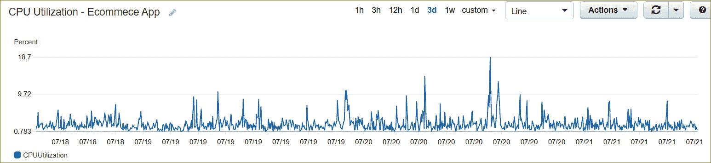
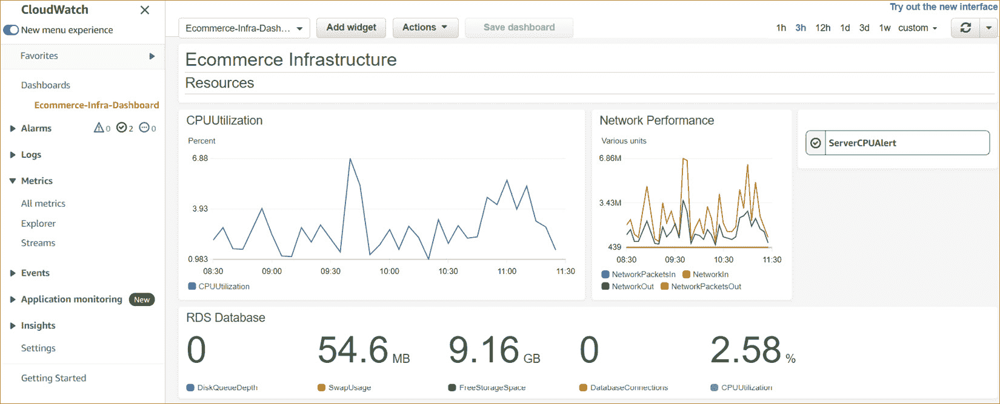
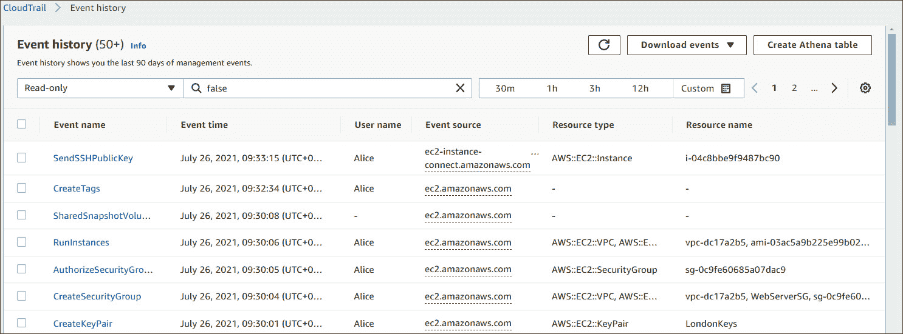
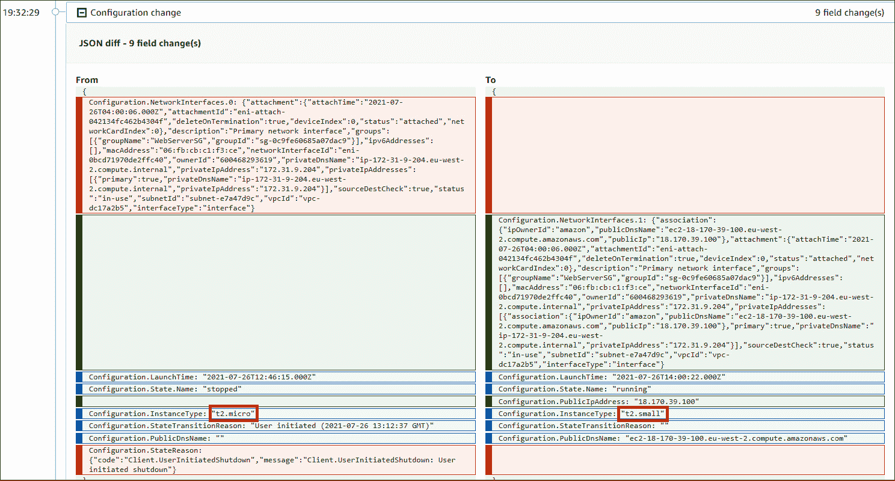
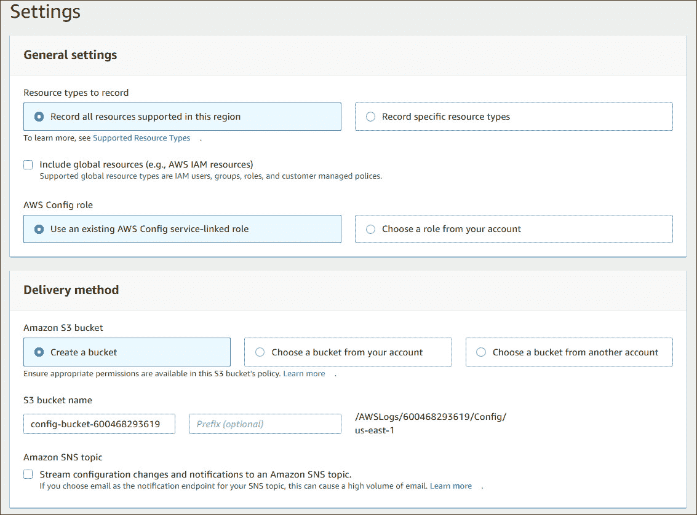
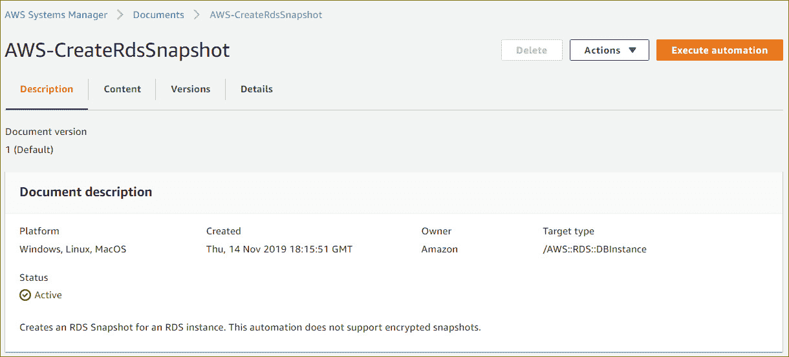
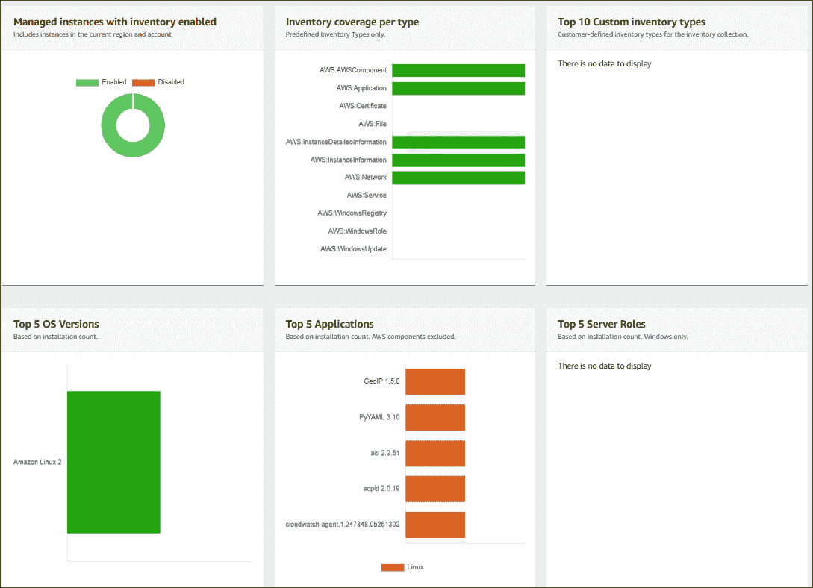
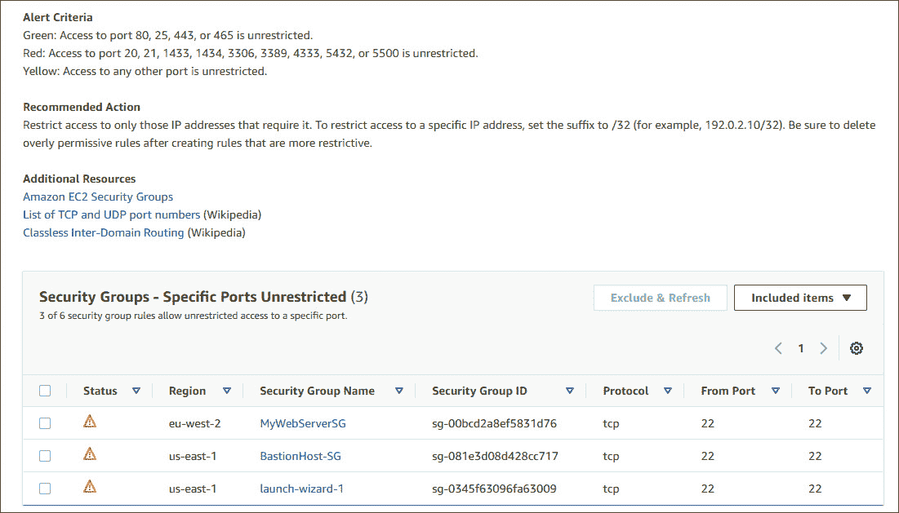

# *第十三章*：AWS 上的管理与治理

在 AWS 上管理和监控您的资源是确保应用程序按预期运行、具有高可用性和安全性并以最具成本效益的方式运行的关键部分。您希望能够监控您的应用程序如何被使用，识别任何可能影响性能和可用性的技术问题，并确保只有授权实体可以访问。此外，您需要能够审计您的环境，访问诸如访问模式等信息，并识别可能表明潜在性能或安全问题的异常情况。您还希望能够执行变更管理流程，确保对 AWS 资源所做的任何修改或更改都得到记录和批准。

最后，作为维护工作负载的日常管理任务的一部分，您希望能够有效地管理您的资源，如打补丁、执行更新，并尽可能自动化任务。

本章将介绍一系列 AWS 服务，这些服务使您能够有效地监控、报告和审计您的 AWS 资源，从而实现变更管理流程并执行日常任务的集中管理。我们还将介绍一些工具，这些工具可以为您提供有关如何提高资源的性能、容错能力、安全性和成本效益的建议。

本章涉及以下主题：

+   Amazon CloudWatch 的基础知识

+   使用 AWS CloudTrail 满足合规要求

+   学习如何使用 AWS Config 进行变更管理

+   使用 AWS Systems Manager 管理您的 AWS 资源

+   学习如何使用 AWS Trusted Advisor

+   理解 AWS Well-Architected Framework

# 技术要求

要完成本章的练习，您需要以 **身份与访问管理**（**IAM**）用户 **Alice** 登录到您的 AWS 账户。

# Amazon CloudWatch 的基础知识

Amazon CloudWatch 使您能够监控运行在 AWS 上以及本地的 AWS 资源和应用程序。通过 Amazon CloudWatch，您可以实时查看资源的表现。使用 CloudWatch，您可以收集资源和应用程序的度量、日志和事件，并将这些数据记录到 CloudWatch 中进行分析和识别趋势。度量是按时间顺序排列的数据点集，这些数据点会被发布到 CloudWatch 中。

Amazon CloudWatch 可用于配置警报，当这些指标在指定时间段内突破某些阈值时，您可以生成警报并采取相应的措施进行修复。

使用 Amazon CloudWatch，你可以跟踪并收集 Amazon EC2 实例、Amazon DynamoDB 表、Amazon **关系型数据库服务**（**RDS**）实例等的指标。每个 AWS 服务都会将指标发布到 Amazon CloudWatch。你可以获得基本的免费指标和详细的付费指标。

Amazon CloudWatch 的一些典型使用案例包括以下内容：

+   **基础设施监控与故障排除**：监控关键指标、日志并可视化趋势，帮助识别潜在问题和瓶颈，使你能够进行根本原因分析，帮助解决事件和问题。

+   **主动资源优化**：配置监控指标值的警报，如果发生超限，将触发警报。定义自动修复措施，例如配置自动扩展，以启动新实例并终止失败的实例。向管理员和系统操作员发送通知警报。

+   **日志分析**：分析来自各种来源的日志信息，以帮助解决操作问题、潜在的安全攻击或应用性能问题，并采取有效措施进行修复。

让我们更详细地了解一下指标。

## CloudWatch 指标

CloudWatch 指标表示可以作为按时间排序的数据点集合进行监控的变量。任何你使用的服务都会向 CloudWatch 报告指标。例如，你可以监控 EC2 实例的 CPU 利用率，帮助你跟踪该实例的性能。

每个数据点将包括时间戳。如果资源在将指标发布到 CloudWatch 时没有提供时间戳，则 CloudWatch 会基于接收数据点的时间创建时间戳。下图展示了过去三天内，基于 Linux 的 EC2 实例的 CPU 利用率指标：

图 13.1 – 运行电子商务应用程序的 EC2 实例的 CPU 利用率指标

Amazon CloudWatch 提供了广泛的内置指标，但你也可以根据需求创建自定义指标：

+   **内置指标**：Amazon CloudWatch 允许你从大量 AWS 服务（如 Amazon EC2、Amazon S3、Amazon RDS 等）中收集默认指标。一个例子包括 EC2 实例的 CPU 利用率、磁盘读/写和数据传输指标。

+   `PutMetricData` API 操作将其发布到 CloudWatch。

需要注意的重要一点是，指标存在于它们创建的区域中。但是，你可以配置 *跨账户跨区域的仪表板*，这样可以帮助你查看相关账户之间的 CloudWatch 指标、日志和警报，并了解跨区域应用的健康状况和性能。

CloudWatch 将存储你的指标数据最长 15 个月。超过 15 个月的数据点将过期，因为新的数据点会按滚动方式加入。

接下来，让我们来看一下如何使用 AWS CloudWatch 仪表板来集中查看你的资源。

## 仪表板

你可以在 Amazon CloudWatch 上创建一个或多个仪表板，允许你在一个视图窗格中可视化和监控资源及其重要的指标。除了通过各种图表和图形可视化你的指标外，你还可以在仪表板上发布你的 CloudWatch 警报（将在下文讨论），以便更高效地关注潜在问题。

CloudWatch 仪表板可以配置为提供跨 AWS 账户和区域的资源健康状况洞察，利用跨账户功能。此功能与 *AWS Organizations* 集成，使你能够高效地构建跨账户仪表板。以下是一个 CloudWatch 仪表板的快速截图：

图 13.2 – 一个 CloudWatch 仪表板

## 警报

你可以配置 CloudWatch 警报来监控特定资源的指标，例如 EC2 实例的平均 CPU 使用率。如果该指标超过特定阈值并持续一定时间，警报就会被触发以采取某些措施。警报只有在阈值被超出并持续一段指定时间后才会触发，这一点非常重要。你不希望警报因偶尔的瞬时波动而被触发。例如，你可能希望在 EC2 实例的平均 CPU 使用率超过 80% 并持续 15 分钟时触发警报。

警报可以处于以下三种状态之一：

+   **OK**：当指标处于定义为可接受的范围内时，表示“正常”。

+   **警报**：当指标超出阈值并持续一段时间时，触发警报。

+   **数据不足**：当做出决策所需的数据缺失或不完整时发生。这通常也发生在你首次配置警报时，因为它在等待接收和分析数据。

一旦警报被触发，就可以采取自动行动进行响应，这些行动可能包括以下内容：

+   **简单通知服务（SNS）通知**：你可以向管理员发送自动警报（**应用到个人**或**A2P**），或向应用程序推送通知以采取某些行动（**应用到应用**，或**A2A**）。

+   **自动扩展操作**：EC2 自动扩展服务可以根据警报状态触发，增加或删除 EC2 实例。如果服务器的平均负载超过给定阈值一段时间（例如，平均 CPU 使用率超过 80% 超过 10 分钟），则可以配置自动扩展组启动更多实例。

+   **EC2 操作**：你可以让警报触发一个 EC2 操作，例如停止一个 EC2 实例、终止它、重启它或恢复它。实例的恢复仅仅意味着这些实例被迁移到另一台主机上，这是当运行实例的主机硬件出现问题时需要做的事。恢复操作仅会在出现*系统状态检查*错误时启动。

最后，你还可以将你的警报发布到 CloudWatch 仪表板上，这样可以快速查看你的警报状态。

接下来，我们来看一下 Amazon CloudWatch Logs。

## CloudWatch Logs

亚马逊 CloudWatch 提供了一个功能，可以集中收集并存储来自 AWS 和非 AWS 源的日志。这些 AWS 源可能是 EC2 实例、CloudTrail 日志（本章后续会讨论）、Route 53 DNS 查询和 VPC 流量日志。你还可以从非 AWS 源导入日志，例如你的 web 应用访问日志、错误日志和操作系统事件日志。

CloudWatch 为你提供一个中央视图，查看所有日志，无论它们的来源如何——作为 CloudWatch 日志的一部分生成的日志事件，本质上是按时间排序的一系列事件，你可以对其进行查询、分析、搜索和过滤，查找特定的模式或错误代码等。你还可以使用仪表板可视化日志数据，并将这些日志导入到其他应用程序中进行更复杂的查询。

在日志保留方面，日志会被永久保存，永不过期。不过，你可以通过选择 1 天到 10 年之间的保留期来调整保留策略。你还可以使用 Glacier 类别之一将日志文件进一步归档到 Amazon S3，以便长期存储。

让我们接下来看看 CloudWatch Logs 的一些关键组件：

+   **日志事件**：这表示由被监控的应用程序或资源记录的某个事件或活动。日志事件将包括时间戳和日志消息。

+   **日志流**：它由一系列共享相同来源的日志事件组成。CloudWatch Logs 会将来自同一来源的日志事件分组到一个日志流中。例如，一个日志流可能与特定主机上的 web 服务器访问日志相关联。

+   **日志组**：CloudWatch 将这些日志流组织成一个*日志组*。日志组表示具有相同保留、监控和访问控制设置的日志流。例如，你可以创建一个日志组来收集和组织与多个主机的 web 服务器访问日志相关的所有日志流。

+   `504 Gateway Timeout` 错误消息，表示某些通信或网络问题。

在本节中，我们了解了亚马逊 CloudWatch Logs，它可以用于从 AWS 和非 AWS 源将日志信息导入到 CloudWatch。你可以使用 CloudWatch Logs 来分析访问模式、识别安全和技术问题，并协助排查瓶颈。

接下来，我们将了解 Amazon CloudWatch 事件，它是一个接近实时的系统事件流，涉及你的 Amazon 资源。

## Amazon CloudWatch 事件

使用 Amazon CloudWatch 事件，你可以创建*规则*，持续监控你的 AWS 资源，并在给定事件发生时响应某个动作。Amazon CloudWatch 提供了一个接近实时的系统事件流，你定义的规则可以在这些事件发生时触发某个操作。

一个事件的例子是，当某个 EC2 实例进入*停止状态*，因为有人对该实例执行了关机操作。另一个例子是当一个 IAM 用户登录 AWS 管理控制台时。每个*写 API 操作*都是发生的事件，你可以选择监控哪些事件，并在这些事件发生时采取必要的行动。

当你定义一个规则来监控某个事件时，你还需要通过选择合适的目标来指定一个动作。目标可以是一个*Lambda* 函数，一个*EC2 实例操作*，一个*SQS 队列*或*SNS 主题*以发布消息，*ECS 任务*，等等。例如，假设你希望在图像上传到 S3 存储桶后立即触发一个 Lambda 函数来处理该图像。你可以创建一个事件，当上传完成时，Lambda 函数将被调用来处理图像，例如生成多种格式的图像或在图像上添加水印。

你还可以配置 Amazon CloudWatch 事件规则，在给定的计划下触发某个动作，使用*标准速率*和*cron 表达式*。这在执行日常操作任务时特别有用。在*第十二章*《AWS 上的自动化与部署》中，你完成了一个练习，涉及每天早上 8 点自动启动一个 EC2 实例，然后在下午 6 点关闭它，周一至周五。

在本节中，我们了解了 Amazon CloudWatch 事件，它允许你使用简单的规则在特定资源发生特定事件时执行某些操作。CloudWatch 事件可以帮助你响应操作变更，以完成工作流和任务，或在需要时采取任何纠正措施。CloudWatch 事件还可以用于计划自动化操作，在某些时间触发，以帮助重复进行日常操作。

重要说明

在*第十章*《应用程序集成服务》中，你了解了 Amazon EventBridge。Amazon CloudWatch 事件和 EventBridge 使用相同的底层服务和 API，Amazon 推荐使用 EventBridge 作为管理事件的首选方式，因为它提供了更多功能。

接下来，你将了解 Amazon CloudTrail，这是一个用于执行治理、合规性、运营和风险审计的服务，适用于你的 AWS 账户。

# 满足 Amazon CloudTrail 合规性要求

AWS CloudTrail 是一项服务，可以让你记录在 AWS 账户中进行的每一项操作，从而跟踪用户活动和 API 使用情况。CloudTrail 在你创建 AWS 账户时默认启用。它存储事件历史，用户可以通过 CloudTrail 仪表板访问，记录了账户中每项活动的历史。以下截图展示了 CloudWatch 事件历史的示例：

图 13.3 – AWS CloudTrail

你可以使用 CloudTrail 强制执行和管理整体合规性与治理要求，因为它可以为你提供按时间排序的系列事件，记录你账户中发生的所有活动。你还可以通过将事件导入 Amazon CloudWatch，并根据需要配置警报或事件规则，以便在特定事件发生时作出响应。AWS CloudTrail 事件提供了 API 和非 API 活动的历史记录。API 活动包括启动新的 EC2 实例或创建新 IAM 用户等操作。非 API 活动指的是其他类型的操作，例如登录 AWS 管理控制台。

AWS CloudTrail 使你能够记录三种不同类型的事件，如下所示：

+   `RunInstances` API 操作，用于启动如前所示的 EC2 实例，此操作由我们的 IAM 用户执行，`DescribeInstances` API 操作，用于返回 EC2 实例列表，但不做任何更改。最后，管理事件也可以包括非 API 活动，例如当用户登录到 AWS 管理控制台时。

+   `PutObject` API 操作。数据事件也称为*数据平面操作*，通常具有高流量。数据事件的其他示例包括使用 `Invoke` API 执行的 Lambda 函数，以及对 DynamoDB 表进行的 `PutItem` API 操作，这会导致新项目被添加到表中。数据事件默认情况下不会被记录。要记录数据事件，你需要创建一个跟踪并明确添加你希望收集事件的受支持资源或资源类型。

+   每分钟 `deleteBucket` API 调用次数突然从平均每分钟几十次增加到每分钟 200 次。洞察事件包含与事件相关的信息，如 API、事件发生时间和统计数据，这些信息有助于你了解并应对异常活动。

CloudTrail 在你开启新的 AWS 账户时，会自动记录所有 API 管理事件。事件历史服务会存储 90 天的管理事件，这些事件可以查看并下载。事件历史不包含任何数据事件—为此，你需要创建一个跟踪。接下来，我们来看看跟踪。

## 跟踪

如果您希望配置 CloudTrail 来存储特定的管理事件或数据事件，并需要超过 90 天的事件历史记录，您可以配置一个*轨迹*。轨迹是一个配置项，它使 CloudTrail 能够记录特定类型的事件，并将它们交付到 Amazon S3 存储桶、CloudWatch Logs 和 CloudWatch Events。

轨迹可以配置为仅记录单一区域的事件或跨区域记录事件：

+   **单一区域轨迹**：CloudTrail 会记录特定于您指定区域的事件，这些日志文件将交付到您指定的 Amazon S3 存储桶。多个轨迹可以交付到同一个 S3 存储桶或不同的存储桶。单个轨迹仅在日志创建的 AWS 区域中可查看。

+   **全区域轨迹**：CloudWatch 会记录每个区域的事件，并将事件日志文件交付到您指定的 S3 存储桶。请注意，如果在您创建适用于*所有区域*的轨迹后，Amazon 添加了新的区域，则该新区域也会自动包含在内。

默认情况下，*全区域轨迹*是您在 CloudTrail 控制台创建轨迹时的默认选项。此外，CloudTrail 会将来自多个区域的日志文件交付到一个单独的 Amazon S3 存储桶和 CloudWatch Logs 日志组。

大多数 AWS 服务是区域特定的，因此事件会在发生操作的区域中记录。然而，对于像 `US East (N. Virginia)` 这样的全球服务区域，事件会跨区域记录。

您还可以创建一个 *AWS 组织轨迹*，它是一种配置选项，可以让您在管理账户和所有 AWS 组织中的成员账户中记录事件。使用组织轨迹将确保您记录所有 AWS 账户中的重要事件。

在这一节中，您了解了 AWS CloudTrail，它是一个可以帮助您审计 AWS 账户并启用合规性、监控和治理的服务。AWS CloudTrail 并非专为性能和系统健康监控而设计。其他监控服务，如 Amazon CloudWatch，旨在帮助您解决与性能或系统健康相关的问题。通常，您会将这些工具一起使用，作为 AWS 服务和资源整体管理的一部分。

在下一节中，我们将介绍 AWS Config 服务，它可以帮助您评估、审核和评估您的 AWS 资源的*配置变更*，并有助于您的整体变更管理过程。

# 学习使用 AWS Config 进行变更管理

AWS Config 是一种服务，可以帮助您了解 AWS 资源在 AWS 账户中的配置和部署情况。使用 AWS Config，您可以查看资源之间的关联，了解它们过去是如何配置的，以及这些资源随时间变化的历史记录。

当你开始运行多个环境时，这特别有用，比如开发和生产环境，在这些环境中托管着无数的资源，涵盖了 AWS 上各种服务。例如，你会想了解你的 VPC 是如何配置的，哪些子网和安全组附加到它们上，哪些路由已添加到路由表中，等等。AWS Config 可以帮助你维护所有这些信息的准确数据库，并跟踪它们在 AWS 账户中的更改。

你可以使用 AWS Config 确保你的资源已根据内部指南进行配置，从而满足合规性要求。该服务使你能够有效地实施安全分析、变更管理流程和故障排除操作。

让我们来看看 AWS Config 的一些核心组件。

## 配置项

一个 `JSON diff` 文件，突出显示已更改的字段，如下所示的截图所示：

图 13.4 – 显示 EC2 实例配置变更的 AWS Config JSON

如前面的截图所示，你可以看到 AWS Config 已记录对我们的 EC2 实例所做的各种更改，例如将实例类型从 `t2.micro` 升级到 `t2.small`。

## 配置历史

当你想要回顾资源随时间变化的情况时，这尤其有用。配置历史记录是给定资源在一段时间内的配置项记录。通过使用配置历史记录，你可以回答诸如资源何时首次创建、过去一周内做了哪些更改、以及两天前下午四点做了哪些配置更改等问题。每种资源类型的配置历史文件存储在你指定的 Amazon S3 存储桶中。

## 配置记录器

必须启用并启动配置记录器，才能使 AWS Config 开始记录对资源所做的更改并创建配置项（CIs）。可以配置配置记录器以记录所有资源，或仅记录每个区域中的特定资源，如下所示的截图所示：

图 13.5 – AWS Config 设置

你还会注意到，你也可以选择记录全局资源，例如 IAM 资源。

## 配置快照

这是你资源的配置项集合，以时间点的图像形式表示，位于你的 AWS 环境中。该快照可以用于验证配置，并识别任何配置错误的项。快照可以存储在预定义的 Amazon S3 存储桶中，并可以在 AWS Config 控制台中查看。

## 配置流

当你在 AWS 账户中创建、修改或删除资源时，会创建新的 CI，并将其添加到配置流中。配置流使用 Amazon SNS 主题来发送通知，每次资源发生更改时都会触发通知。这可以用来提醒管理员，例如，及时发现任何技术或安全问题。

在本节中，你了解了 AWS Config 服务，它是一项帮助你管理 AWS 账户中资源更改的服务。你可以使用 AWS Config 来监视资源之间的关系以及这些配置和关系随时间的变化。

在下一节中，我们将介绍 AWS Systems Manager，它使你能够跟踪和解决 AWS 账户中的操作问题，自动化日常操作任务来管理资源，并对应用程序实施安全措施。

## 使用 AWS Systems Manager 管理你的 AWS 资源

AWS Systems Manager 是一项使你能够集中管理 AWS 资源的服务。通过 AWS Systems Manager，你可以获得跨 AWS 服务的资源可见性，执行配置管理，并自动化日常操作任务。以前称为 **SSM**，AWS Systems Manager 可以帮助你强制执行所需的配置状态，并在必要时对任何政策违规采取纠正措施。

AWS Systems Manager 使用文档（以 JSON 或 YAML 编写）的概念，这些文档定义了 Systems Manager 在你的管理资源上执行的操作。这些文档被 AWS Systems Manager 用于实现其各种功能，如操作管理、变更管理、应用管理和节点管理。AWS Systems Manager 提供了大量预定义文档，你也可以创建自己的文档。例如，**AWS-CreateRdsSnapshot** 文档可以用于为 RDS 实例创建 RDS 快照，如以下屏幕截图所示：

图 13.6 – AWS Systems Manager 预定义文档

AWS Systems Manager 提供广泛的功能，包括以下内容：

+   **运行命令**：作为节点管理功能的一部分，运行命令功能使你能够在 EC2 实例集群中远程运行 Linux shell 脚本和 Windows PowerShell 命令。这可以用于执行配置更改，安装和更新应用程序。

+   **状态管理器**：它确保你的管理实例配置为预定义的状态，使你能够在一组实例中保持配置的一致性，例如防火墙配置、杀毒软件配置等。

+   **清单**：它使你能够收集关于 EC2 实例的软件配置资料。清单功能将提供有关应用程序、文件、组件和补丁的信息，涵盖你的管理实例。

+   **维护窗口**：作为变更管理功能的一部分，维护窗口服务使您能够安排执行管理任务的时间，例如安装补丁和更新，以避免在正常工作时间干扰您的团队。

+   **补丁管理器**：这使您能够自动化 EC2 实例的补丁操作，包括安全性和应用更新。请注意，Windows 服务器上的应用更新仅限于由 Microsoft 发布的更新。

+   **自动化**：这使您能够自动化各种维护任务，例如更新 AMI、创建**弹性块存储**（**EBS**）卷的快照、重置密码以及启动或终止 EC2 实例等。

+   **参数存储**：这为您提供了一种安全存储配置数据和机密信息的方法。例如，在*第九章*，*AWS 上的高可用性和弹性*中，您会回忆起配置“本月的善举”应用程序的数据库连接字符串。数据库连接字符串包含敏感的用户名和密码信息，这些信息以纯文本形式保存在 Amazon S3 存储桶中。此外，当从 S3 存储桶复制数据库连接文件并将其存储在服务器的 HTML 目录中时，存在安全风险。敏感信息应始终以更安全的方式进行存储和管理。AWS 系统管理器的参数存储使您能够将敏感信息（如密码和数据库字符串）作为参数值存储。这些值可以加密存储，您的应用程序可以配置为在需要时从参数存储中安全地检索这些值。

+   **分发器**：这使您能够创建并将应用程序包部署到您管理的实例上。您可以将软件包创建为操作系统识别的可执行文件，从而实现轻松部署。分发器还可以重新安装新版本的包，并执行就地更新。

+   **会话管理器**：*第七章*，*AWS 计算服务*中，我们讨论了堡垒主机的重要性，堡垒主机作为进入点，用于管理您在 VPC 中部署的其他 EC2 实例，跨越公共子网和私有子网。虽然堡垒主机由于其配置或访问方式被设计为高度安全，但您仍然需要管理和维护这些服务器，包括执行安全更新、确保性能水平等。AWS 系统管理器提供了**会话管理器**，允许您使用基于浏览器的 shell 或命令行界面（CLI）远程访问 EC2 实例。会话管理器提供了安全且可审计的实例管理，无需打开入站端口、维护堡垒主机或管理 SSH 密钥。

+   **事件管理器**：这是另一个 Systems Manager 提供的功能，帮助您管理和解决影响 AWS 托管应用程序的事件。事件管理器服务提供了一个管理控制台，能够跟踪所有事件，通知响应人员事件的影响，识别有助于故障排除的数据，并帮助您恢复服务。

这些只是 AWS Systems Manager 提供的一些功能。这里是清单控制台的快速截图，展示了我在 AWS 账户中部署的单个 EC2 实例的相关信息：

图 13.7 – AWS Systems Manager 清单

到目前为止，我们已经看过了 AWS Systems Manager 服务，它提供了一套功能，帮助您集中管理和自动化日常操作，以便管理您的 AWS 资源。

在下一节中，您将了解 AWS Trusted Advisor 服务，该服务使您能够检查您的 AWS 环境，并识别您的资源是否按照 AWS 最佳实践进行配置。

# 学习如何使用 AWS Trusted Advisor

AWS Trusted Advisor 服务分析您的资源及其配置方式。该服务帮助您将资源的配置与最佳实践进行对比，并识别节省成本、提高系统可用性和性能或解决安全问题的机会。

特别地，Trusted Advisor 服务将报告其针对以下核心类别的分析：

+   **成本优化**：对您的资源进行检查，识别哪些资源未充分利用。AWS Trusted Advisor 会根据这些信息提供减少成本的建议。例如，Elastic IP 地址只有在附加到正在运行的 EC2 实例时才是免费的。如果 Elastic IP 地址没有被使用（即没有附加到任何实例，或者附加到已停止的实例上），AWS 会按小时收费。

+   **性能**：提供关于如何改善应用程序响应性的建议。例如，如果您为一个似乎被大量使用的 EC2 实例使用的是 gp2 EBS 卷类型，系统会建议您升级为 io1 EBS 卷，从而提高性能。

+   **安全性**：报告任何未按照安全最佳实践配置的资源。例如，如果您没有在根账户上配置 MFA，AWS 会将其视为潜在的安全风险，并建议您配置 MFA。

+   **容错性**：识别增加 AWS 解决方案弹性的选项。例如，AWS 会将任何没有配置多可用区（multi-AZ）的 RDS 实例视为风险因素。

+   **服务限制**：检查您的 AWS 账户，识别是否接近任何服务限制或配额。例如，当使用 AWS Auto Scaling 服务时，您每个区域的默认限制是最多配置 200 个启动配置。如果您开始超过此限制的 80%，您将在 Trusted Advisor 中看到警告。

## AWS Trusted Advisor 和支持计划

AWS Trusted Advisor 服务根据您订阅的 AWS 支持计划提供不同级别的检查。如果您仅订阅了 *基础* 支持计划，您将只能访问安全类别中的六项检查和服务限制类别中的所有检查。

若要访问所有类别中的完整检查范围，您必须订阅 *企业* 或 *商业* 支持计划。订阅这两种计划中的任意一种后，您还可以使用 Amazon CloudWatch Events 来监控 Trusted Advisor 检查的状态。

在本节中，我们讨论了 AWS Trusted Advisor 服务，它是一个报告工具，可以帮助你识别资源是否按照最佳实践配置，并检查是否有节省成本的机会。

在下一节中，您将了解 AWS Well-Architected 框架，该框架提供一系列建议，帮助您构建安全、高性能、具备韧性和高效的应用程序基础设施。

# 了解 AWS Well-Architected 框架

AWS Well-Architected 框架由一系列设计原则和架构最佳实践组成，您可以在构建云解决方案时遵循这些原则。AWS 提供了 Well-Architected 工具，您可以使用它来审查您的应用程序和资源的状态，并将其与最新的 AWS 架构最佳实践进行比较。

Well-Architected 框架包括以下 *五大支柱*。

## 可靠性

部署在云中的应用程序必须具有抗故障能力。应用程序所依赖的资源（计算、存储、网络和数据库）必须是可用且可靠的。任何这些资源上的技术问题都会导致应用程序变得不可靠，甚至可能会失败。

可靠性支柱还关注你在架构设计中如何迅速从故障中恢复。这是因为故障是不可避免的，你的架构必须能够迅速从故障中恢复。你应该考虑的一个关键概念是，替换故障组件通常比试图找出故障原因并解决故障根本问题更好。这是因为当你花时间排查故障时，可能会导致**恢复时间目标**（**RTO**）的增加。例如，使用 EC2 时，你可以将应用程序部署在多个实例和多个可用区（AZ）中。然后，你可以配置弹性负载均衡器和自动伸缩服务，确保当某个 EC2 实例发生故障时，流量会被路由到其他健康实例，而故障实例会在后台自动被替换。

## 性能效率

在设计你的云解决方案时，你需要提供最佳性能的同时，确保优化成本。这意味着你应该根据性能需求选择资源的类型和大小，并持续监控资源，以确保在需求变化时能够维持这些性能水平。如果需求增加，性能不应该受到影响。同时，你应该仅在需要时提供资源，避免资源的低效利用。

你通常需要结合使用多个 AWS 服务中的资源，如计算、存储和网络，架构设计不仅需要仔细规划，还要配置每个资源。例如，如果你的应用托管在伦敦区域，伦敦的用户可能会体验到良好的性能。然而，如果你在南美有用户，可能会因为网络延迟问题导致性能不佳。你可以考虑使用 Amazon CloudFront 在离南美用户更近的边缘位置缓存你的应用内容，从而提升整体应用性能。

## 安全性

在设计云解决方案时，你应该始终考虑安全性。你需要确保只有授权用户能够安全地访问你的应用程序。你还需要确保数据的完整性、隐私和主权。分配权限给用户时，必须始终遵循最小权限原则，确保只有在执行工作职能时才授予访问权限，而不多于此。

您应该为您的应用程序解决方案制定备份和灾难恢复策略，这也包括确保支撑您应用程序的基础资源。例如，您必须确保数据库有备份，或者定期创建 EBS 快照。另一个例子是配置 Amazon S3 桶复制，并在可能的情况下使用跨区域复制配置。最后，您必须能够审计账户中的每一项活动，可以使用如 AWS CloudTrail 等工具来维护审计日志。

## 操作卓越

这一支柱专注于通过对工作负载进行频繁、可逆且持续的更改来实现操作卓越。您的目标应该是持续改进您的流程和程序。此外，自动化操作任务将加强其他支柱，使用**基础设施即代码** (**IaC**) 和像 CloudFormation 这样的工具可以帮助避免人为错误，并确保您对事件的响应一致。

操作卓越支柱还建议预见潜在故障并考虑进行故障测试和恢复演练，从中您可以学习如何消除潜在的故障源并降低风险。了解您的应用程序如何故障，还能帮助您设计自动恢复解决方案，提供一致性和快速恢复。

## 成本优化

这一支柱侧重于确保您以避免不必要成本的方式构建和设计解决方案。同时，您还希望确保您的应用程序具有高性能、可靠性、操作效率和安全性。为了实现成本优化，您应首先了解您的消费模式，并分析资金流向。使用像 Cost Explorer 和成本与使用报告等工具可以帮助您完成这项工作。

接下来，您必须始终尝试采用消费模式。如果您正在运行仅在周一到周五每天使用 8 小时的开发和测试服务器，那么考虑使用按需定价选项购买这些 EC2 实例是有意义的。然后，您应该确保这些服务器在正常工作时间之外停止，以便潜在地节省高达 75%的成本（每周 40 小时对比 168 小时）。请记住，您可以使用 Lambda 函数和 CloudWatch 事件自动化启动和关闭 EC2 实例，正如在*第十二章*中讨论的，*AWS 上的自动化与部署*。

你可以在其他设计中考虑成本优化领域，例如使用托管服务，而不是执行重型操作或数据中心风格的操作。例如，将数据库托管在 Amazon RDS 上并让 AWS 为你执行所有管理功能，比在 EC2 实例上安装数据库软件要更具成本效益。后者需要更多的管理工作来确保你的数据库服务器已打补丁、备份并保持安全。

在本节中，你了解了 AWS Well-Architected 框架，它是一套指导原则和最佳实践建议，旨在帮助你设计和运行云中的解决方案。在下一节中，我们将进行本章的一些练习。

# 练习 13.1 – 查看 AWS 账户中的 Trusted Advisor 报告

在本次练习中，你将登录到 AWS 账户并查看 Trusted Advisor 服务：

1.  以 IAM 用户**Alice**身份登录到你的 AWS 管理控制台。

1.  导航到**Trusted Advisor**控制台，它位于你的服务列表中的**管理与治理**类别下。

1.  你将被重定向到 Trusted Advisor 仪表盘。

1.  因为你可能只订阅了基础支持计划，你会注意到只有少数检查项是可见的。从主仪表盘中，注意到仪表盘主面板上的**检查摘要**部分。

1.  从右侧面板，点击**安全**类别。

1.  在右侧面板中，你会注意到各种检查项，例如检查根账户是否启用了 MFA。

1.  展开标记为`22`的检查项，该检查项允许从互联网无限制地启用`22`端口：

图 13.8 – AWS Trusted Advisor 仪表盘

通过本次练习，你应该已经学会了如何查看 AWS Trusted Advisor 仪表盘。你能够根据之前练习中配置的安全组识别一些不符合最佳实践的安全警报。然后，你可以使用此报告来识别需要修改的安全组，以提高安全性。

# 总结

在本章中，我们查看了 AWS 上的几项服务，这些服务可以帮助你在云中管理和治理应用程序。我们讨论了各种监控和日志工具，例如 Amazon CloudWatch、AWS CloudTrail 和 AWS Config，以及如何使用这些服务来确保性能、可靠性、安全性和有效的变更管理。你还了解了 AWS Systems Manager 服务，它提供了一套功能，可以集中跟踪和解决 AWS 资源中的操作问题。我们使用 AWS Systems Manager 来自动化日常管理任务，确保资源配置的合规性，提供事件和变更管理服务，并提高可见性和控制。

AWS Trusted Advisor 服务提供了广泛的报告，允许你将资源配置与各种最佳实践设计原则进行交叉参考。最后，我们讨论了在构建云解决方案时，必须遵循 AWS Well-Architected Framework 提供的设计原则和建议。

在下一章中，我们将介绍 AWS 安全概念，并探讨在架构和管理云应用时应该使用的各种安全工具。

# 问题

1.  哪项 AWS 服务可以让你追踪 AWS 账户中的所有 API 活动，无论这些活动是通过 AWS 管理控制台还是 CLI 执行的？

    1.  AWS CloudTrail

    1.  AWS Config

    1.  AWS Trusted Advisor

    1.  应用负载均衡器日志

1.  作为变更管理实施的一部分，哪项 AWS 服务可用于评估、审计和评估 AWS 资源的变更配置，从而帮助你识别是否某个变更导致了事件发生？

    1.  AWS Config

    1.  AWS CloudTrail

    1.  Amazon CloudWatch

    1.  AWS Outposts

1.  哪项 AWS 服务可用于监控公司 EC2 实例的集群，帮助识别与 CPU 使用率或内存消耗相关的性能问题？

    1.  Amazon CloudWatch

    1.  AWS 云监控

    1.  AWS EC2 监控

    1.  AWS CloudTrail

1.  哪项 AWS 服务帮助你识别潜在的未使用资源，例如未附加到运行中的实例的弹性 IP 地址，从而突出节省成本的机会？

    1.  AWS 成本探查器

    1.  AWS Trusted Advisor

    1.  AWS 资源管理器

    1.  AWS Budgets

1.  哪项 AWS Systems Manager 服务的功能使你能够远程连接到 Linux EC2 实例，而无需使用 VPC 中的堡垒主机？

    1.  会话管理器

    1.  参数存储

    1.  Run Command

    1.  事件管理器
