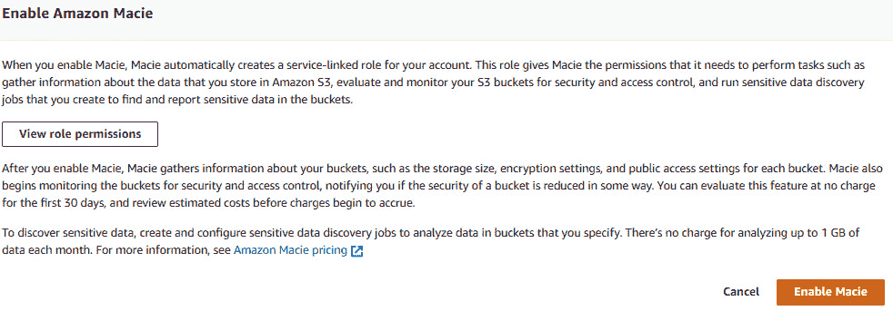

# *第十四章*: 在 AWS 中实现安全性

在云迁移过程中，设计和实施安全解决方案将至关重要，特别是当你希望说服企业将本地工作负载迁移到云端时。总会有一些企业认为将所有 IT 事务管理在自己的数据中心内最为安全。然而，事实并非如此，因为公司无法像云服务提供商（如 AWS）那样花费巨资提供高度安全的工作环境供客户使用。

AWS 使企业能够在云端设计和运行应用程序，并提供严格的安全服务和控制措施。企业应使用 AWS 提供的广泛安全工具，并在设计云应用程序时遵循安全指南和原则。设计和实施安全措施的责任由客户和 AWS 共同承担，这就是我们所说的**共享责任模型**，我们将在本章中讨论这一点。

AWS 提供了多个安全工具和服务，帮助客户保护数据、执行身份验证和授权协议、确保网络和应用程序访问的安全、监控和检测威胁，以及执行合规性和隐私措施。

本章内容将涵盖以下主题：

+   理解共享责任模型

+   AWS 合规性程序和 AWS Artifact 介绍

+   AWS 漏洞扫描

+   AWS 上的数据加密服务概述

+   使用 AWS WAF 和 AWS Shield 保护云资源和应用程序

+   使用 AWS Inspector 评估和保护您的 EC2 实例

+   其他 AWS 安全服务

让我们从了解共享责任模型的原理开始。

# 理解共享责任模型

AWS 提供公共云服务，允许客户在云平台中构建隔离的环境。AWS 管理并保护所有底层基础设施，如网络、存储和计算服务，以及主机虚拟化软件等。AWS 还负责物理安全，包括其数据中心的访问权限，您的工作负载就是在这些数据中心托管的。AWS 向客户提供这些基础设施组件的访问权限，以构建他们的云应用程序和解决方案。不同客户在设计应用程序架构时的方式不同，为了满足不同需求，AWS 会与客户共同分担安全性和合规性责任。

虽然客户可以放心，所有底层物理基础设施、数据中心建筑的访问权限以及主机虚拟化系统都由 AWS 安全严格管理，但客户仍然需要对他们的应用程序在 AWS 上的设计、构建和部署负责。

这就是所谓的 **AWS 共享责任模型**。您必须了解作为客户的责任，以确保您的应用程序高度安全并符合任何合规性或监管要求。共享责任模型基于 *云的安全性*（由 AWS 负责）和 *云中的安全性*（由客户负责）的概念。下图展示了 AWS 与客户之间责任划分的基本理解：

图 14.1 – AWS 共享责任模型

接下来，让我们更详细地了解 AWS 和客户的责任。

## 云的安全性

AWS 负责 *云* 本身。它将对底层全球基础设施（包括其位于区域内的可用区的数据中心和其边缘位置的基础设施）执行严格的安全协议和措施。AWS 还负责底层的计算、存储、网络和数据库服务等。这包括用于使客户启动其 EC2 实例的 **虚拟化程序** 软件。

## 云中的安全性

客户负责云中的安全性。从简单层面上讲，这指的是客户负责其应用程序的配置方式，以及如何管理和访问其数据。客户的责任会根据客户选择的服务类型而有所不同。因为不同的服务属于不同的云计算模型（IaaS、PaaS 和 SaaS），客户的责任水平也会不同。例如，Amazon EC2 属于 IaaS 计算模型。在这种模型中，客户负责 EC2 实例的每个安全方面，从客操作系统及以上。客户需要确保 EC2 实例得到补丁更新，安装了防病毒软件，并正确配置了安全组，以确保只有需要的网络流量能够进入实例。安装在 EC2 实例上的任何应用程序也需要由客户维护和保护。

这与像 Amazon RDS 这样的托管服务不同，在 RDS 中，底层数据库实例和附加存储对客户是抽象的。数据库软件的维护和补丁管理也是 AWS 的责任。客户只能配置特定的服务级组件，包括创建安全组以允许特定端口和来源的连接到数据库、启用多可用区以及定义备份保留期限。然而，客户无需在数据库实例本身上安装或更新防病毒软件，也不需要决定备份的存储位置。

下图展示了客户在执行安全措施方面的责任级别，这取决于所使用的云计算模型：

图 14.2 – 客户的责任因云计算模型类型的不同而有所不同

如果可能，AWS 始终建议考虑选择其产品和服务的托管版本，而不是采用数据中心思维管理方式。例如，如果你需要 MySQL 数据库解决方案，选择 Amazon RDS 比配置 EC2 实例并在这些实例上部署 MySQL 数据库软件更为合理。通过将数据库托管在 EC2 实例上，你将完全负责与数据库解决方案维护相关的所有管理和维护任务。

最终，你需要对存储在云中的应用程序和数据承担完全责任，以确保你的解决方案是安全可靠的。

在本节中，我们讨论了 AWS 共享责任模型的重要性，以及如何将安全责任与 AWS 共享，针对你在云中部署的应用程序和工作负载。在下一节中，我们将快速回顾一些 AWS 遵循的关键合规性程序，这些程序可以帮助你履行监管要求。

# AWS 合规性程序和 AWS Artifact 介绍

根据你的业务性质和计划在 AWS 上托管的应用程序，你需要确保满足任何合规性或监管要求。例如，如果你计划处理和存储信用卡信息，你必须确保你的应用程序符合**支付卡行业数据安全标准**（**PCI DSS**）。这使你能够存储、处理或传输**持卡人数据**（**CHD**）或**敏感认证数据**（**SAD**）。

类似地，如果你从事医疗行业并且位于美国，你需要遵守 1996 年的美国**健康保险流通与责任法案**（**HIPAA**）。这意味着，除了各种业务流程之外，任何托管在 AWS 上的应用程序也必须与 HIPAA 合规，特别是在处理和维护**个人健康信息**（**PHI**）方面。

在这个例子中，如果医疗保健客户希望将 AWS 服务用于其应用程序，AWS 需要确保其服务符合 HIPAA 合规性。以 Amazon Athena 为例，正如在 *第十一章* 中讨论的，*AWS 上的分析*，它是一个交互式查询服务，使您能够使用标准 SQL 分析直接保存在 Amazon S3 中的数据。AWS 确认 Amazon Athena 可以用来处理包含 PHI 的数据。诸如加密数据在 Amazon Athena 和 Amazon S3 之间传输等功能默认提供。此外，Amazon Athena 使用 AWS CloudTrail 记录所有 API 调用，以便维护审计日志。客户需要通过启用静态数据加密，确保在数据存储于 Amazon S3 时符合 HIPAA 合规性。客户还可以使用服务器端加密来加密来自 Amazon Athena 的查询结果。再次强调，这一功能由 AWS 提供，供客户配置。

最终，合规性是 AWS 和客户之间的共同责任。另一个例子是，AWS 管理并控制 Amazon EC2 的主机操作系统和虚拟化层的组件，直至物理基础设施。客户则负责客体操作系统（包括修补、执行安全更新等）以及安装的任何应用程序及其安全组配置。

接下来，让我们了解客户可以在哪里获得确认 AWS 满足各种合规要求的信息。

## 关于 AWS Artifact

客户可以访问各种合规报告，以确认 AWS 提供的服务是否符合其特定的法规要求。这些报告可以通过 AWS 上的一个门户，称为 **AWS Artifact** 来获取。这些报告包括 AWS **系统和组织控制**（**SOC**）报告、**支付卡行业**（**PCI**）报告，以及来自不同区域的认证机构的认证。

客户可以下载这些报告并向审计员提交安全和合规文件。这些文件可以用来证明各种 AWS 服务及其基础设施如何满足客户所需的安全和合规要求。

这些 **文档** 也可供客户用于评估其应用架构和云配置，并评估其企业内部控制的有效性。

最后，客户可以审核、接受并跟踪各种 AWS 协议的状态，例如商业合作伙伴附加协议，在该协议下，客户需遵循 HIPAA 指导方针，以确保 PHI 信息得到妥善保护。如果您有多个 AWS 账户，您可以代表这些账户接受协议，并通过 AWS 组织进行管理。

在本节中，我们讨论了 AWS 合规性和 Artifact 服务，它允许您从 AWS 获得他们如何满足合规要求的确认。AWS Artifact 是您的单一可信来源，并且为您提供对各种合规文档的访问，如 AWS ISO 认证、PCI 和 SOC 报告等。

在下一节中，我们将讨论 AWS 如何允许您主动测试您的云部署中的漏洞，并保护您在云中的应用程序。

# AWS 漏洞扫描

作为 AWS 客户，您将消费各种服务来构建和部署云应用程序。您需要确保您的云解决方案具有高度的安全性和保护性。为此，您将在云生态系统的不同层面实施安全控制和程序时，遵循关键的指导方针和行业最佳实践。

但你如何确认你实施的保护措施是否足够，以及你所采取的控制措施是否有效呢？

AWS 允许其客户对 AWS 云中的工作负载进行**渗透测试**。这也被称为*渗透测试*，是一种针对计算机系统的模拟网络攻击，用以检查漏洞。通常由公司内部或指定的安全团队执行。

作为客户，您需要遵循渗透测试的服务政策，其中包括允许的服务和禁止的活动。例如，禁止使用任何工具执行**拒绝服务**（**DoS**）攻击或模拟，即使是针对您的 AWS 资产。**分布式拒绝服务**（**DDoS**）模拟测试只能由经过 AWS 预先批准的**AWS 合作伙伴网络**（**APN**）合作伙伴执行。

以下表格为您快速展示了一些您可以进行测试的允许服务，以及其禁止的活动：

表格 14.1 – AWS 允许的服务和渗透测试的禁止活动

您还可以进行**网络压力测试**及其他模拟事件，您需要通过填写模拟事件表格来向 AWS 申请授权。

在本节中，我们简要介绍了客户如何对 AWS 上的工作负载进行渗透测试。下一节中，我们将简要介绍 AWS 上的加密服务。

# AWS 数据加密服务概述

加密数据是确保其完整性并防止数据被未经授权的第三方读取的关键步骤。AWS 使您能够对数据进行加密，无论是在传输过程中（数据从源传输到目的地时）还是在静止状态时（数据在磁盘上存储时）。

为了保护传输中的数据，您必须使用 **安全套接字层/传输层安全**（**SSL/TLS**）或某种形式的客户端加密来传输数据。SSL/TLS 要求您使用证书，证书用于加密和解密数据。

为了保护静态数据，您必须创建并使用加密密钥来加密和解密数据。加密密钥是包含一长串数字或字母的数据文件，供加密算法用于编码和解码数据。您可能听说过的算法示例包括 **三重 DES** 或 **高级加密标准**（**AES-256**）位加密。

加密密钥可以是 **对称的**（即使用相同的密钥来加密和解密数据），也可以是 **非对称的**，即公钥/私钥组合。在这种情况下，您使用公钥加密数据，只有拥有私钥的用户或应用程序才能解密数据。

AWS 通过其 **密钥管理服务**（**KMS**）减少了创建和管理加密密钥的许多负担。您可以使用 KMS 为您在各种 AWS 服务中存储的数据提供加密服务，包括 Amazon EBS 卷、Amazon RDS、Amazon S3 等。

使用 AWS KMS，您可以创建和管理 **客户主密钥**（**CMK**），这些密钥存储在 KMS 服务中，并用于加密和解密您的数据。AWS KMS 将创建用于生成这些 CMK 的 *材料*。密钥材料是用于加密算法的一个秘密比特串。通过 KMS，这些材料无法提取、导出或以任何方式查看。您还可以配置多区域 CMK，允许您在一个 AWS 区域加密数据，并在不同的 AWS 区域解密数据。

有两种类型的 CMK，如下所示：

+   **客户管理的 CMK**：这些是您创建、拥有和管理的 CMK。您可以旋转它们的加密材料、添加标签、指定密钥策略并创建别名。

+   **AWS 管理的 CMK**：这些是由集成了 AWS KMS 的 AWS 服务代表您创建、管理和使用的 CMK。您无法管理这些 CMK，不能旋转它们，也不能更改其密钥策略。

AWS KMS 还提供了额外的功能，包括内置的审计功能，因为它与 Amazon CloudTrail 集成。使用 AWS KMS，您可以记录和跟踪所有 API 请求，包括密钥管理操作和密钥的使用情况。

在 Amazon S3 中，提供了额外的加密选项。我们接下来将详细介绍。

## Amazon S3 加密

为了保护 Amazon S3 中静态存储的数据，您有以下几种加密方式：

+   **服务器端加密**：Amazon S3 会在保存数据到磁盘之前对数据进行加密，并在您尝试访问数据时解密数据。

+   **客户端加密**：您在客户端对数据进行加密，然后上传到 Amazon S3。在客户端加密中，您负责管理加密过程、密钥和工具。

关于服务器端加密，Amazon S3 将在将数据写入磁盘时按对象级别加密您的数据，然后在您访问这些对象时解密它。此过程对用户是透明的，因为 AWS 会为您完成所有繁重的工作。服务器端加密提供三种选项：

+   **使用 Amazon S3 管理的密钥进行服务器端加密** (**SSE-S3**)：Amazon S3 使用唯一的密钥加密每个对象，然后使用*主密钥*加密该密钥。它使用 AES-256 加密您的数据。密钥轮换由 AWS 作为后台过程管理。

+   **使用存储在 AWS KMS 中的 CMK 进行服务器端加密** (**SSE-KMS**)：这与 SSE-S3 类似，但具有额外的功能，如使用 CMK 的权限要求分离，以及提供审核跟踪功能，显示您的 CMK 何时被使用及其使用者。作为客户，您可以创建和管理这些 CMK，或使用 AWS 管理的 CMK，这些 CMK 对您的账户、服务和区域是唯一的。

+   **使用客户提供的密钥进行服务器端加密** (**SSE-C**)：您管理加密密钥，AWS 将使用您的密钥管理加密和解密对象的过程。

除了保护静态数据外，您还可以使用 SSL/TLS 保护传输中的数据，正如我们之前所讨论的那样。

AWS KMS 由 **联邦信息处理标准** (**FIPS**) 140-2 **硬件安全模块** (**HSM**) 提供支持，KMS 对其进行管理。FIPS 140-2 是一个用于验证加密模块的安全认证程序。AWS KMS 使用多租户的 HSM。如果您必须为额外的合规要求托管自己的隔离 HSM，则应考虑使用 **AWS CloudHSM**，我们将在接下来的部分简要讨论。

## AWS CloudHSM

AWS CloudHSM 是一个专用的 **硬件安全模块** (**HSM**)，允许您在云中生成和管理加密密钥。您将获得专用的 FIPS 140-2 三级认证 HSM 设备，这些设备被放置在您的 VPC 中，并由 AWS 完全管理。如果您需要管理自己的加密密钥，这特别有用。您负责生成、存储、导入、导出和管理您的加密密钥，因为 AWS 无法访问您的密钥。您可以使用 CloudHSM 来处理对称和非对称密钥对。

AWS CloudHSM 还允许您使用行业标准的 API 与您的应用程序集成，例如 PKCS#11、**Java 加密扩展** (**JCE**) 和 **Microsoft CryptoNG** (**CNG**) 库。

在本节中，您获得了 AWS 中加密服务的概述。我们讨论了 AWS KMS，它还允许您创建和管理 CMK 来加密和解密数据。AWS KMS 还提供审计功能，允许您执行合规性要求。

我们还看了 Amazon S3 的不同加密选项。为了在 Amazon S3 上实现数据静态加密，你需要选择 **服务器端加密** 或 **客户端加密**。使用 **服务器端加密** 时，你可以选择 **SS3-S3**（使用 Amazon S3 管理的密钥），SS3-KMS（允许你创建 CMK，并提供密钥使用的审计跟踪）或 SS3-C（由客户管理加密密钥）。

最后，你了解了 AWS CloudHSM 服务，该服务提供专用的 HSM 设备，使你能够生成和管理与其他 AWS 客户隔离的密钥。CloudHSM 设备符合 FIPS 140-2 Level 3 标准，适用于需要满足额外合规要求的场景。

在接下来的部分中，我们将介绍几种 AWS 安全防火墙解决方案，分别是 **AWS Web 应用防火墙**（**AWS WAF**）和 AWS Shield。

# 使用 AWS WAF 和 AWS Shield 保护云资源和应用程序

AWS 提供了多种安全工具和服务，帮助保护你的云工作负载免受攻击。在本节中，我们将介绍其中的两项服务——AWS WAF 和 AWS Shield。

## 使用 AWS WAF 保护应用程序

AWS WAF 是一种 Web 应用防火墙，旨在保护通过 Amazon CloudFront、Amazon API Gateway REST API、应用程序负载均衡器或 AWS AppSync GraphQL API 提供的任何应用程序。

AWS WAF 可以帮助保护位于 **开放系统互联**（**OSI**）模型第 7 层的应用程序，帮助你监控和保护 HTTP 和 HTTPS 流量。这使你能够保护内容免受常见的网络漏洞攻击，如 **SQL 注入** 和 **跨站脚本**。

你可以使用 AWS WAF 通过指定 **Web 访问控制列表**（**Web ACL**）来控制对内容的访问。你定义规则，指定检查标准，如果 Web 请求符合该标准，则采取相应的操作。

使用 AWS WAF 时，费用是根据你创建的 Web ACL 和规则组以及 AWS WAF 检查的 HTTP(S) 请求数量来收取的。

接下来，我们将了解 AWS Shield 服务。

## 使用 AWS Shield 保护网络攻击

**AWS Shield** 是一项完全托管的服务，提供对 **DDoS** 攻击的保护。这是一种攻击类型，攻击者通过大量的互联网流量试图淹没你的网络和服务器，导致授权用户无法访问你的服务。

AWS 提供了两种 Shield 服务，具体如下：

+   **AWS Shield Standard**：这项服务对 AWS 客户免费提供，能够保护你的网站和应用程序免受常见的网络和传输层 DDoS 攻击。AWS Shield Standard 可以与 Amazon CloudFront 和 Route 53 一起使用，提供分层保护，防御所有已知的基础设施攻击。

+   **AWS Shield Advanced**：为您的 EC2 实例、弹性负载均衡器、CloudFront、Global Accelerator 和 Route 53 资源提供额外的防护。该服务还提供对攻击的检测和实时可视化，使您能够抵御大规模和复杂的 DDoS 攻击。此外，AWS Shield Advanced 让您全天候 24/7 使用 **AWS Shield 响应团队** (**SRT**) 的服务，帮助您处理此类攻击。AWS Shield 是一项收费服务，按 **AWS 组织** 每年 $3,000 的费用收费，并根据所使用的服务（如弹性负载均衡器、CloudFront、Route 53、Global Accelerator 和弹性 IP）按每 GB 外发数据传输费收费。

    重要提示

    AWS Shield Advanced 的费用包括 AWS WAF 和一些其他服务的费用。

本节中，我们讨论了 AWS 提供的两种关键防火墙工具。AWS WAF 在 OSI 模型的第 7 层保护您的应用免受常见的 web 攻击，而 AWS Shield 则提供防护，抵御 DDoS 攻击。

在下一节中，我们将介绍 AWS Inspector 服务，它可以用来保护您的 EC2 实例。

## 使用 AWS Inspector 评估和保护您的 EC2 实例

**AWS Inspector** 是一个安全工具，用于评估 EC2 实例的网络可访问性和应用安全状态。您可以使用 AWS Inspector 检测开放的网络端口、启用的 root 登录以及 EC2 实例中存在的易受攻击的软件版本。然后，您可以根据最佳实践采取适当的措施。

AWS Inspector 服务使用 *规则包*，它是用于您 *评估运行* 中的一系列安全检查。规则包有两种类型，如下所示：

+   **网络可达性规则包**：旨在检查从互联网访问您的 EC2 实例并识别开放端口。

+   **主机评估规则包**：旨在检查软件漏洞和不安全的配置，包括 **常见漏洞和暴露** (**CVE**)、**互联网安全中心** (**CIS**) 以及其他安全最佳实践。

如果您需要执行主机评估以获取主机、应用程序配置和文件系统访问的详细分析，您需要安装 **AWS Inspector 代理**。AWS Inspector 代理将收集其对 EC2 实例评估的遥测数据，并以 JSON 格式存储在托管的 S3 存储桶中，最多保存 30 天。

这些发现可以在 AWS Inspector 仪表盘中查看，如以下截图所示：

图 14.3 – AWS Inspector 仪表盘

然后，您可以深入这些发现，并查看针对您的 EC2 实例的具体建议。以下截图显示了发现的内容，表示应该启用自动 Windows 更新：

图 14.4 – AWS Inspector – 结果

你可以通过**系统管理器运行命令**在多个实例上安装 Amazon Inspector 代理，手动在每个 EC2 实例上安装，或者配置一个已经预先安装了代理的 AMI。

重要提示

如果你只使用 AWS Inspector 来检查外部 VPC 可以访问的网络端口，那么你不需要安装 AWS Inspector 代理。

在本节中，你了解了 AWS Inspector 服务，它可以对你的 EC2 实例进行自动安全评估，识别暴露、漏洞以及与最佳实践的偏差。

在下一节中，我们将讨论 AWS 提供的其他安全服务。

# 其他 AWS 安全服务

在本节中，我们将研究一些 AWS 提供的额外安全工具和服务。我们将首先介绍 Amazon Macie，它能够识别如**个人身份信息**（**PII**）等敏感数据。

## 亚马逊 Macie

亚马逊 Macie 使用机器学习和模式匹配技术来检测和提醒你任何存储在 Amazon S3 中的敏感数据，如 PII。你还可以使用 Macie 来发送关于未加密、公开可访问且与其他 AWS 账户共享的 S3 存储桶的警报。

AWS Macie 会监控数据在 Amazon S3 中的访问方式，识别任何异常情况，并在检测到未经授权的访问时生成警报。AWS Macie 还提供了一个仪表盘，汇总了所有检测结果，如下图所示：

图 14.5 – 亚马逊 Macie – 概述

接下来，我们将介绍 AWS GuardDuty，该服务旨在检测针对你的 AWS 账户的恶意活动和未经授权的行为。

## AWS GuardDuty

**AWS GuardDuty** 是一项威胁检测服务，可以分析并检测针对你的 AWS 账户和应用程序工作负载的恶意活动。该服务使用各种情报来源来了解恶意 IP 地址和域名，还利用机器学习分析来自 CloudTrail 事件日志、Amazon VPC 流日志和 DNS 日志的数据，帮助检测异常情况。

AWS GuardDuty 可以检测暴露的凭证的使用、与恶意 IP 地址和域名的通信，以及在你的 AWS 账户中执行的不规则活动。这包括在你通常不工作的区域启动 EC2 实例。

AWS GuardDuty 能够检测到的一些威胁包括 EC2 实例的安全性问题，如与加密货币挖矿相关的安全事件，或 S3 存储桶的安全性问题，如来自远程主机的不寻常 S3 API 活动，或来自已知恶意 IP 地址的未经授权的访问。

亚马逊 GuardDuty 的定价基于要分析的 CloudTrail 事件的数量以及 VPC 流日志和 DNS 日志数据的数量。该服务提供免费的 30 天试用期。

接下来，我们将介绍另一个服务，Amazon Detective，它可以帮助识别潜在安全问题或可疑活动的根本原因。

## Amazon Detective

有多种不同的 AWS 服务可以用来识别潜在的安全问题，例如之前讨论过的 Amazon Macie 和 Amazon GuardDuty。然而，如果您试图确定这些安全发现的根本原因，通常需要处理大量日志，并使用 **提取、转换和加载**（**ETL**）解决方案来执行所需的深度分析。

**Amazon Detective** 可以提取基于时间的事件，如登录信息、来自 AWS CloudTrail 和 Amazon VPC Flow Logs 的网络流量，以及摄取您的 GuardDuty 发现。然后，Amazon Detective 通过利用已摄取的信息生成可视化图表，帮助您识别资源行为随时间的变化以及资源之间的交互，从而最终协助识别安全问题的根本原因。

此定价基于从 AWS CloudTrail 日志、Amazon VPC Flow Logs 和 Amazon GuardDuty 发现中摄取的数据量。Amazon Detective 提供 30 天的免费试用。

接下来，我们将介绍 **AWS Certificate Manager**（**ACM**）服务，它使您能够创建、存储和续订 SSL/TLS 证书。

## AWS Certificate Manager

为了通过安全加密保护您的 AWS 资源并验证互联网上网站的身份，您需要配置并管理 **SSL/TLS** 证书。证书由 **证书颁发机构**（**CA**）颁发，CA 是一个可信的第三方，它会验证交易双方的身份。

**ACM** 使您能够创建、管理和部署用于 AWS 资源的 SSL/TLS 证书，并与多个需要使用 SSL/TLS 连接进行安全通信的 AWS 服务集成。您可以使用 ACM 为弹性负载均衡器、Amazon CloudFront 分发和 API 网关上的 API 颁发和管理证书。AWS ACM 还可以管理所有证书续期。

对于集成 ACM 的服务，您无需为弹性负载均衡器和 API 网关配置证书支付费用。如果您需要私人证书，**ACM 私有 CA** 允许您按月支付所创建的服务和证书费用。

接下来，我们将介绍 AWS Secrets Manager 服务，它可以保护您访问应用程序、数据库和其他 AWS 服务所需的机密信息。

## AWS Secrets Manager

在 *第十三章*《AWS 上的管理与治理》中，我们研究了**AWS Systems Manager**（**ASM**）的参数存储服务。该服务可以用来安全地存储参数值，比如您的数据库用户名和密码，而不需要将这些信息硬编码到您的应用程序中。将此类敏感信息存储在应用程序代码中不是最佳实践，并且会带来额外的管理负担。通过 SSM 参数存储，您的应用程序可以检索必要的参数，以便访问数据库。

然而，该服务确实存在一些局限性，这时 AWS Secrets Manager 就能派上用场。除了允许您存储*机密信息*外，该服务还使得管理和轮换这些数据库凭证变得更加简单。AWS Secrets Manager 原生支持对托管在 Amazon RDS、Amazon DocumentDB 和 Amazon Redshift 上的集群的凭证进行轮换。这种轮换可以通过计划自动化，从而增加了安全性。此外，您还可以通过修改示例 Lambda 函数来使用 AWS Secrets Manager 轮换其他机密。例如，您可以用它来轮换用于授权应用程序的 OAuth 刷新令牌，或用于本地托管 MySQL 数据库的密码。然后，您的应用程序可以通过调用 Secrets Manager API 来替换硬编码的机密信息，从而获取机密。

AWS Secrets Manager 还使用您通过 Amazon KMS 创建和管理的加密密钥对*机密*进行加密。该服务还使您能够跨 AWS 区域复制机密，以支持多区域应用程序和灾难恢复。

就成本而言，您将根据在 Secrets Manager 中管理的机密数量和所进行的 Secrets Manager API 调用数量收费。

接下来，我们将研究另一个身份服务，它使您能够使用外部公共身份提供商授予访问 AWS 资源的权限，即 Amazon Cognito。

## Amazon Cognito

要对用户进行身份验证并授予他们访问 AWS 资源的权限，您需要创建和管理他们的身份，并提供身份验证和授权的机制。AWS IAM 是您已经熟悉的身份和访问管理解决方案，通常用于与 AWS 服务一起工作的用户，比如内部员工。如果您正在构建需要对后端资源进行身份验证的应用程序，可以使用 IAM 用户账户，但也有一些限制，包括每个 AWS 账户最多可以创建 5,000 个 IAM 用户账户。

**Amazon Cognito** 允许您为 Web 和移动应用程序设置身份和访问控制解决方案，支持 OAuth 2.0、SAML 2.0 和 OpenID Connect 等标准。使用 Amazon Cognito，您可以创建**用户池**和**身份池**：

+   **Amazon Cognito 用户池**：用于验证用户身份，您可以创建用户池来托管数百万用户，或者通过第三方**身份提供商**（**IdP**）如 Apple、Facebook、Google、Amazon 和 Microsoft Active Directory 来联合其访问。对于后者，用户池将管理由第三方 IdP 发放的令牌。您可以使用用户池为您的网页或应用设置*注册*和*登录*功能。您还可以使用用户池来追踪用户设备、位置和 IP 地址。

+   **Amazon Cognito 身份池**：这些池允许您通过为需要访问特定 AWS 服务（如 Amazon S3 桶或 DynamoDB 表）的用户创建身份来定义授权。您还可以使用身份池为未验证用户生成临时的 AWS 凭证。

接下来，我们将介绍 AWS 目录服务，特别适用于希望使用 Microsoft Active Directory IAM 服务的情况。

## AWS 目录服务

**AWS Microsoft Active Directory 目录服务**（也称为**AWS 托管 Microsoft AD**）是 AWS 平台上的一项完全托管的 Active Directory 服务。该服务使您可以使用标准工具，如 Active Directory 用户和计算机，并利用信任、**分布式文件系统**（**DFS**）、组策略和**单点登录**（**SSO**）等功能。

您可以在 EC2 实例上部署支持 Microsoft Active Directory 的应用程序，并将您的 Windows EC2 实例加入 Active Directory 域。您还可以将**Amazon RDS for SQL Server** 实例加入域，从而为在 Amazon RDS 上运行的 SQL 数据库提供无缝的身份验证服务。

此外，您还可以将**Amazon WorkSpaces**加入域。Amazon WorkSpaces 是一项终端用户计算服务，使您能够在云中部署虚拟的 Linux 和 Windows 桌面。AWS 管理虚拟桌面，包括安全修补和操作系统管理。通过 Amazon WorkSpaces，您可以考虑从本地桌面基础设施迁移到**虚拟桌面基础设施**（**VDI**）解决方案。这使您能够管理**总拥有成本**（**TCO**），并选择 IT 投资的运营支出模式（OPEX）。

另一个与 AWS 托管 Microsoft AD 集成的服务是**Amazon WorkDocs**。Amazon WorkDocs 是一项内容创作、存储和协作服务。Amazon WorkDocs 使您能够存储 Microsoft Word、PowerPoint、Excel 以及其他多种文档类型。您和您的同事可以使用 Amazon WorkDocs 进行协作和共享工作文档。与 Microsoft SharePoint 等其他协作工具类似，该服务还提供 API 访问，以便您可以开发丰富内容的应用程序。

在本节中，我们探讨了几种 AWS 安全工具和服务，帮助您设计和架构可以保护 AWS 上应用程序和工作负载的安全措施。您必须检查提供的广泛安全服务，并将它们的使用与您的特定业务目标对齐，同时考虑任何合规性或监管要求。

接下来，我们将进行一个练习，展示我们在本节中介绍的其中一个安全工具。具体来说，您将学习如何使用 Amazon Macie 进行一个简单的现实世界示例。

# 练习 14.1 – 使用 Amazon Macie 防止数据泄露

在此练习中，您将使用 Amazon Macie 监控一个 Amazon S3 存储桶，并识别存储在存储桶中的任何 PII 数据。假设有一个场景，您的组织中的某个用户不小心将敏感文件上传到错误的 Amazon S3 存储桶。在我们的例子中，我们有一个 *产品详情* 存储桶，其中包含可以由市场营销团队访问的产品信息。然而，由于访问策略配置不当，人力资源团队的成员将敏感的员工信息上传到了这个存储桶。

这可能导致数据泄露。虽然您希望确保用户只能访问特定的存储桶，但有时意外也会发生。Amazon Macie 可以检测上传到 S3 存储桶的内容，并识别特定类型的敏感数据。然后，您可以采取适当的措施。

## 第一步 – 创建一个新的 Amazon S3 存储桶

1.  进入 Amazon S3，点击左侧菜单中的 **存储桶** 链接。

1.  在右侧面板中，点击 **创建存储桶** 按钮。

1.  提供一个存储桶名称并选择 **us-east-1** 区域来创建您的存储桶。我将我的存储桶命名为 **justdessertsproducts**，因此您需要选择一个独特的名称来命名您的存储桶。我们假设有人不小心将敏感的 PII 上传到了这个存储桶。

1.  点击页面底部的 **创建存储桶** 按钮。

1.  接下来，使用 Excel 或 Google Sheets 创建一个简单的 CSV 文件并将其上传到 S3 存储桶。确保 CSV 文件包含一些可以归类为个人身份信息（PII）的数据。例如，在以下截图中，您会注意到我添加了一些虚拟数据，其中包含敏感的员工信息。在这个例子中，**EmployeeID** 可用于识别特定员工及其薪资信息：

图 14.6 – 员工的薪资信息

使用 Amazon Macie 来识别可能与个人身份信息（PII）相关的信息时，您需要能够识别数据的格式，以便 Amazon Macie 知道要查找什么。请注意，`EmployeeID` 数据的格式，如前面的截图所示，是 *两个字符*（*大写字母*），后跟一个 *连字符*（*-*），然后是 *四个数字*。

## 第二步 – 配置 Amazon Macie 以识别敏感的员工数据

1.  从 AWS 管理控制台中，在顶部搜索栏搜索 Amazon Macie，并点击过滤后的搜索结果中的该服务。

1.  如果这是你第一次访问 Amazon Macie 控制台，你将看到一个启动画面，如下图所示：

    图 14.7 – Amazon Macie

1.  点击**开始使用**按钮。

1.  Amazon Macie 需要访问你存储在 Amazon S3 中的数据的权限。你将获得启用 Amazon Macie 的选项，并提供必要的访问权限，这将创建一个 IAM 角色。

1.  继续点击**启用 Macie**按钮，如下图所示：

    图 14.8 – 启用 Macie

1.  启用后，Amazon Macie 将分析你的环境，并在短时间后提供仪表板，如下图所示：

    图 14.9 – Amazon Macie – 摘要

1.  尽管前述摘要中的多个项目需要检查，但对于本练习，我们主要关注的是确保不会将 PII 上传到我们之前配置的特定存储桶。因此，我们需要创建一个**Amazon Macie 作业**。

1.  从左侧菜单中，选择**作业**链接。

1.  从右侧窗格中，点击`csv`，然后点击**包含**按钮。

1.  点击**下一步**。

1.  对于**第 4 步，选择托管数据标识符**，选择**无**，然后点击**下一步**。

1.  对于**第 5 步，选择自定义数据标识符**，点击**管理自定义标识符**链接以在另一个浏览器标签页中打开**自定义数据标识符**网页，如下图所示：

图 14.10 – 创建自定义数据标识符

+   点击**创建**按钮。

+   为标识符命名，并可以选择性地添加描述。

+   接下来，你需要提供一个`EmployeeID`格式。正则表达式（Regex）是*正则表达式*的缩写，它是一个字符序列，用于指定搜索模式。通常，你可以使用正则表达式模式来搜索特定类型的数据或验证数据。对于本练习，你的正则表达式模式将是 *[A-Z]{2}-[0-9]{4}*。将此模式输入到**正则表达式**文本框中。

+   接下来，点击**提交**按钮，这将为本练习创建自定义数据标识符。

+   返回到**创建作业**向导，该向导应仍然在之前的浏览器标签页中可见。你应该仍然处于**第 5 步**。点击刷新图标以访问**EmployeeID**自定义数据标识符，如下图所示：

图 14.11 – 选择自定义数据标识符

+   选择**EmployeeID**自定义数据标识符并点击**下一步**按钮。

+   对于**第 6 步**，为作业提供一个名称，然后点击**下一步**按钮。

+   对于**步骤 7**，检查配置设置，然后点击页面底部的**提交**按钮。

1.  您的工作现在已创建，并将处于**活动（运行中）**状态，如下图所示：

    图 14.12 – 已创建的 Amazon Macie S3 工作

1.  该任务需要几分钟时间完成。任务完成后，点击**显示结果**下拉箭头，并选择**显示发现**。您将看到它找到了我们之前上传的 CSV 文件，如下图所示：

    图 14.13 – Macie 发现

1.  选择发现的内容。然后，从**操作**下拉列表中，选择**导出（JSON）**。

1.  您将能够查看 JSON 文件，该文件清楚地显示它识别了四次 PII 数据，如下图所示：

    图 14.14 – Amazon Macie 任务发现

1.  JSON 还将突出显示识别到 PII 数据的列和行。

正如您所看到的，Amazon Macie 是一个非常强大的工具，能够帮助您理解数据访问模式，并提醒您潜在的数据泄露。

在下一个练习中，您将清理您创建的资源。

# 练习 14.2 – 清理

在本练习中，您将清理在本章中创建的资源：

1.  导航到 Amazon Macie 控制台。

1.  从左侧菜单中选择**设置**。

1.  接下来，从右侧窗格中，点击**禁用 Macie**按钮。Amazon Macie 将永久删除您现有的所有发现、分类任务和其他 Macie 资源。

1.  在出现的对话框中，在文本框中输入**禁用**，然后点击**禁用**按钮。

1.  接下来，从 Amazon S3 控制台中，您需要清空您创建的 S3 存储桶，然后删除该存储桶，正如之前所做的那样。

接下来，我们将提供本章的总结。

# 总结

云中的安全是客户和 AWS 之间的共同责任。AWS 将负责**云的**安全，而客户则负责**云中的**安全。这个区别必须理解。您可以使用大量安全工具和服务，帮助您构建一个高度稳固和安全的环境，在其中托管您的应用程序工作负载。

本章还讨论了与合规性相关的概念，以及 AWS 服务如何与各种监管机构对接。作为客户，您有责任确保您的应用程序是在遵循必要协议的情况下构建的。例如，如果您处于医疗行业并位于美国，那么您的应用程序流程和工作流必须符合 HIPAA 合规性。

我们还讨论了加密以及如何在静态和传输过程中实现加密。AWS 提供 KMS 服务来帮助你管理加密需求。如果你有特定要求，需要使用专用的 FIPS 140-2 Level 3 硬件安全模块创建、管理和轮换加密密钥，你还可以选择 AWS CloudHSM 服务。

AWS 还提供了几种保护你的网络和应用程序的工具，如 AWS Shield 和 AWS WAF。AWS Shield 提供 DDoS 攻击保护，而 AWS WAF 是一种应用层防火墙设计，可以保护你免受常见的 Web 攻击，如 SQL 注入和跨站脚本攻击。

最后，我们检查了各种特定的 AWS 安全工具和服务，包括 AWS Inspector、Amazon Macie 和 AWS Secrets Manager。这些工具可以帮助你构建一个完整的端到端安全环境，以保护你的数据，授权用户访问，并防止攻击。

在下一章中，我们将讨论 AWS 的计费和定价原则。你将了解云经济学以及如何为你的业务设计具有成本效益的解决方案。我们将讨论成本管理策略，并查看一些可以帮助你监控成本并比较定价选项的工具。

# 问题

回答以下问题，以测试你对本章内容的理解：

1.  以下哪项是客户在共享安全模型中的责任之一？（选择 2 项。）

    1.  为 Windows EC2 实例打上最新的安全补丁。

    1.  配置 NACL 只允许来自互联网的 `80` 和 `443` 端口访问 Linux Web 服务器。

    1.  更新 `us-east-1` 数据中心的网络布线。

    1.  升级 Lambda 服务的底层基础设施支持。

    1.  升级伦敦区域的生物识别读取器。

1.  AWS 中的哪项服务保护你的虚拟网络和资源免受常见的 DDoS 攻击？

    1.  AWS WAF

    1.  AWS Shield

    1.  AWS Detective

    1.  Amazon Macie

1.  以下哪些 AWS 安全工具可以保护你的 Web 应用程序或 API，免受可能影响可用性、危及安全性或消耗过多资源的常见 Web 攻击？

    1.  AWS WAF

    1.  AWS GuardDuty

    1.  AWS Shield

    1.  AWS NACL

1.  哪项 AWS 服务使用机器学习对存储在你的 Amazon S3 存储桶中的敏感信息进行分类，并监控访问模式，以发现可能表明风险或可疑行为的异常情况，例如大量源代码被下载？

    1.  Amazon Macie

    1.  Amazon X-Ray

    1.  AWS Shield

    1.  AWS WAF

1.  哪项 AWS 服务使计划迁移到 AWS 云的公司能够获取各种合规性文档副本，例如 ISO 认证、**PCI 和 SOC** 报告？

    1.  AWS Artifact

    1.  AWS Config

    1.  AWS CloudWatch

    1.  AWS 安全报告

1.  为了满足严格的合规要求，你需要使用 FIPS 140-2 Level 3 认证的 HSM 设备来创建和管理加密密钥。你会推荐哪种类型的加密服务？

    1.  AWS KMS

    1.  AWS CloudHSM

    1.  证书管理器

    1.  BitLocker
