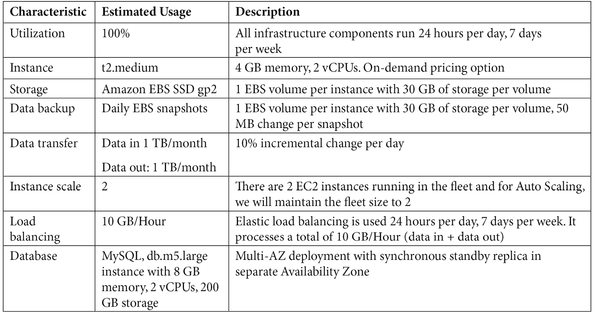

# 第十五章: 账单和定价

许多寻求转向云端的公司听说过从资本支出（CAPEX）模型转向运营支出（OPEX）模型带来的成本优势。CAPEX 指的是用于采购长期资产的资本支出，例如基础设施设备、车辆和建筑物。购买这些资产的公司将拥有这些资产，但这往往会占用原本可以用来投资其他直接有益于业务的资源的资金。考虑一下，公司如果有多余的资本可用于产品和服务的研发，而不是仅仅购买 IT 基础设施设备，将会有怎样的不同。

OPEX 指的是运营支出，是经营产品、业务或系统的持续费用。在云计算的背景下，OPEX 是从云服务提供商租赁资源的持续费用，例如运行一组 Web 服务器，企业按需付费。你无需将大量资金投入到迅速贬值的昂贵硬件设备，或者为本地基础设施支付昂贵的软件许可费用，这一理念对于公司财务至关重要。

然而，单纯转向云端并不一定能为你节省资金。你设计的用于托管应用程序的云端解决方案需要进行成本优化，并且需要架构设计确保你以最优的性价比获得服务。好消息是，像 AWS 这样的云服务提供商能够为你设计高度成本效益的解决方案。首先，你可以确保仅在消费服务时才付费。此外，每项服务都提供了多种选项来帮助你基于访问模式和核心业务需求配置，从而最大化成本节省。

有一点需要注意的是，不应将成本优化单独考虑。最小化成本对于业务非常重要，但确保应用程序的可用性、可靠性和可扩展性同样重要。

本章将介绍成本优化的基本原理以及 AWS 账单和定价的关键组件。我们讨论了关键原则，并介绍了帮助你深入了解和有效管理成本的各种工具。

本章涵盖的主题如下：

+   AWS 的账单和定价概览

+   理解 AWS 成本优化

+   了解 AWS 账单和成本管理工具

+   学习如何使用 AWS 定价和 TCO 计算器 – 定价计算器和迁移计算器

# 技术要求

要完成本章的练习，你需要以 IAM 用户**Alice**身份登录 AWS 账户。

# AWS 的账单和定价概览

AWS 会根据三个核心组成部分向你收费，这些组成部分包括你进行的*计算*、*存储*和*出站数据传输*的数量。虽然存在一些例外情况，但这些是主要的成本驱动因素。对于计算，这可能表示你**按需实例**运行的小时数或你执行的 Lambda 执行次数。对于存储，你按每 GB 收费。在这两种情况下，你都会为从区域或 AWS 外部传输的数据付费。数据传输出的费用取决于服务和数据来源的区域。

这里有几个关键点需要注意：

+   对于同一区域内的数据传输：

    +   如果使用**互联网网关**向同一区域的 AWS 公共服务（如 Amazon S3、DynamoDB 等）发送数据，则不会产生数据传输费用。

    +   如果使用**NAT 网关**访问同一区域的公共服务，则会产生数据处理费用，按每 GB 计费。

    +   在同一**可用区**内的工作负载之间的数据传输是免费的。对于某些服务，如 EC2，跨可用区的数据传输将产生数据传输费用。

+   跨区域的数据传输总是会产生数据传输费用。

从 AWS 接收数据（例如从本地数据中心）时，不会收取费用。

让我们来看看 AWS 定价的一些关键原则以及你在将工作负载迁移到云时应采取的策略。

# 了解 AWS 成本优化

根据你的工作负载和特定的业务需求，你可以访问广泛的服务选项和工具，帮助你优化成本，确保你能够监控和控制支出。选择正确的服务组合并部署正确的资源配置将有助于你高效运营。以下是在为云环境架构解决方案时需要记住的一些关键概念：

+   **选择正确的定价模型**：当你知道只在有限的时间内、用于特定短期项目时需要计算资源，可以使用按需实例。从可靠性角度看，你需要确保服务没有中断，但你并不会全天候、全年无休地使用这些资源。在这种情况下，按需定价模型效果很好。另一种选择是投资于**预留容量**，这可以在等效的按需容量价格上节省最多 72%的费用，但前提是你需要全天候使用这些资源，而且使用时间较长，例如一年。你还可以考虑使用**Spot EC2 实例**，适用于容错、可扩展或灵活的应用程序，并且应用程序能够容忍中断。Spot 实例可以让你节省最多 90%的按需价格，并且没有预付承诺。最后，考虑选择**计算节省计划**，以减少 EC2、Fargate 和 Lambda 成本。EC2 节省计划可以为你的 AWS 计算使用提供最多 72%的折扣。在这里，你需要承诺一定量的计算使用量，且会自动按折扣后的节省计划价格收费。

+   **将容量与需求匹配**：AWS 提供了多种工具来帮助你识别使用模式。AWS 成本探索器资源优化（将在本章后面讨论）可以帮助你识别空闲或低利用率的实例。你可以通过减少分配的容量，或者在资源未使用时停机，从而节省成本。你还可以使用**AWS 实例调度器**，这是 AWS 提供的一个 CloudFormation 模板，可以通过配置 Amazon EC2 和 Amazon RDS 实例的启动和停止计划来帮助降低成本。这就像你在*第十二章*《AWS 上的自动化和部署》中完成的练习，配置了 Amazon CloudWatch 事件和 Lambda 来自动启动和停止 EC2 实例。在不使用时，另一个可以停止的服务是 Amazon RDS。对于 Amazon Redshift，你可以暂停该服务。

+   `RequestCount` 在过去 7 天内的值低于 100，可能是终止的理想候选项。

    重要提示

    Amazon S3 分析不会提供关于迁移到 One Zone-IA 或 S3 Glacier 存储类别的建议。

在本节中，我们探讨了一些核心概念，以确保你在云中部署的工作负载是经过成本优化的。在下一节中，我们将介绍各种工具和服务，帮助你有效地监控、控制和管理成本。

# 学习 AWS 计费和成本管理工具

在本节中，我们将介绍几种 AWS 计费和成本管理工具，帮助您可视化在 AWS 账户上的使用情况和支出，并实施更好的成本控制策略。我们将从成本探索器服务开始。

## AWS 成本探索器

AWS 成本探索器使您能够通过仪表板和报告监控和可视化成本。您可以访问过去 12 个月的使用和支出数据，并预测未来 12 个月的费用。您需要启用成本探索器服务，一旦启用，当前月份的报告数据将在 24 小时后可用。过去几个月的额外数据将在几天后开始显示。

AWS 成本探索器主页显示了您的支出快照。在这里，您将看到**当前月份成本**以及**预测的月末成本**，如以下截图所示：

图 15.1 – 成本探索器主页

AWS 成本探索器提供了几种类型的报告。例如，在以下截图中，您将看到我某个 AWS 账户的*按服务分类的月度成本*报告：

图 15.2 – 成本探索器 – 按服务分类的月度成本报告

报告显示了过去 6 个月的支出，按服务进行分类，包括 EC2 实例、Amazon RDS 和存储档案（Amazon Glacier）。

成本探索器的其他功能包括通过按资源类型和按日、按小时的成本模式进行详细筛选。

AWS 成本探索器还提供各种节省费用的推荐。例如，在 AWS 成本探索器控制台的左侧菜单中，您可以选择**推荐**，在**预留实例**类别下，查看成本探索器建议为现有按需工作负载购买 EC2 **预留实例**（**RI**），如下截图所示：

图 15.3 – 成本探索器 RI 推荐

如您所见，购买 RI 用于我当前运行的两台按需实例，可能使我节省 33% 的最终成本。

AWS 成本探索器还可以用于向您发送 EC2 *资源优化推荐*，帮助您检查历史使用模式并识别被低效使用的资源。AWS 成本探索器将能够识别空闲实例，并允许您采取措施终止或调整大小以优化未充分利用的资源。

您还可以在成本探索器中查看**RI 使用情况报告**。RI 使用情况报告使您能够识别使用 RI 相比按需选项所节省的费用，适用于 Amazon EC2、Amazon Redshift、Amazon RDS 等服务。RI 报告还提供了有关您可能因未充分利用 RI 而超支的详细信息。

最后，AWS 成本探测器提供了一个安全功能，帮助您检测消费模式中的异常及其根本原因，并且可以配置使用 Amazon SNS 向您发送警报。

在本节中，您了解了 AWS 成本探测器工具，它能够帮助您可视化和管理您的成本，并允许您创建自定义报告以识别使用模式和趋势。

在下一节中，我们将讨论成本分配标签如何帮助您识别正在消费和支出的服务和资源。

## 成本分配标签

之前我们讨论了标记资源的重要性。它不仅允许您识别资源，还可以让您利用这些标签作为标识来自动化和执行资源管理任务。此外，您还可以使用标签来帮助您识别哪些资源在消耗您的资金，通过使用成本分配标签，您可以按不同的项目、部门、业务单元等跟踪使用情况。

标签由*键*和*值*组成，对于每个资源，您最多可以有 50 个键值对标签。此外，标签键必须唯一，每个键只能有一个值。您需要首先激活成本分配标签，AWS 随后将使用这些标签帮助您分析成本。这些标签有两种类型：

+   **AWS 生成的标签**：这些标签由 AWS 和 AWS 市场创建并定义。

+   **用户定义的标签**：这些标签可以根据您的业务成本管理和命名约定由您创建并定义。

激活标签可以通过计费管理控制台完成，每个*标签键*需要单独激活。一旦激活，AWS 将生成**逗号分隔值**（**CSV**）文件报告，报告中将按您的活动标签对使用情况和成本进行分组。

接下来，让我们来看一下成本和使用情况报告。

## 成本和使用情况报告

AWS 提供了一个成本和使用情况报告工具，它提供了您使用的资源及其相关成本的详细细分。报告包括使用量和消耗的单位、费率、成本和产品属性。报告发布到您选择的 Amazon S3 存储桶，且报告可以配置为按小时、天或月提供成本细分。这些报告以 CSV 格式提供，您可以将其导入 Microsoft Excel 或其他电子表格工具中。

此外，您还可以将报告集成用于 Amazon Athena、Redshift 和 QuickSight，并可以设置压缩类型为 GZIP、ZIP 或 Parquet。

接下来，让我们检查一下 AWS 预算服务。

## AWS 预算

AWS 预算使你能够了解在云中部署的工作负载上花费了多少钱。你可以使用 AWS 预算跟踪你的成本和使用情况，跨你组织可能正在运行的不同类型的项目。你可能有不同的部门需要不同的云服务，并根据他们的需求为他们的支出指定月度预算。

如果你的预算超过阈值（无论是实际的还是预测的），你可以定义在你的 AWS 账户上执行的特定操作。目前，你可以定义三种类型的操作：

+   一个**身份和访问管理**（**IAM**）策略

+   **服务控制策略**（**SCPs**）

+   目标运行实例（EC2 或 RDS）

例如，你可以指定一个 IAM 策略，如果超过了 EC2 的月度预算，则拒绝启动新的 EC2 实例的能力。然后，你可以将此策略应用于用于启动实例的 IAM 用户、组或角色。

当超过阈值时，AWS 预算操作可以自动执行，或者根据需要配置为手动批准。

使用 AWS 预算，你还可以使用 Amazon SNS 设置警报，以便在实际或预测的支出可能超过预算阈值时收到通知（或执行某些事件驱动的操作）。你还可以配置可变目标金额，以便预算金额根据一定百分比在一段时间内增加，因为消耗可能会增加。

AWS 预算还可用于确保你在特定的配额和限制内，包括保持在特定的 AWS 免费套餐提供之下。

你可以创建几种类型的预算，包括以下内容：

+   **成本预算**：定义你愿意支出的具体金额。

+   **使用预算**：定义你想使用特定服务的量。

+   **RI 利用率预算**：指定利用率阈值，并在使用低于阈值的情况下收到警报。这使你能够识别那些可能未充分利用的 RI 资源，并重新考虑是否需要这些预留。

+   **RI 覆盖预算**：确定你的实例使用中有多少被预留覆盖。

+   **节省计划利用率预算**：识别当你的节省计划使用低于利用率阈值时，使你能够识别未充分利用的节省计划。

+   **节省计划覆盖预算**：确定你的实例使用中有多少被节省计划覆盖。

在本节中，我们看了 AWS 预算，它可以用于确保你在 AWS 上部署的资源上不超支。

在下一节中，我们将继续看一些 AWS 定价和成本计算器。

# 学习如何使用 AWS 定价和 TCO 计算器

AWS 提供计算器来帮助你估算在 AWS 上设置和部署资源所涉及的成本。两个关键的计算器是**AWS 定价计算器**和**迁移评估器**（以前称为 TCO 计算器）。

## AWS 定价计算器

AWS 定价计算器是一种工具，用于计算部署和配置 AWS 服务和资源的预计月度费用。您可以使用 AWS 定价计算器来估算您希望在 AWS 上部署的项目和应用程序的月度费用。您可以按服务或服务组查看价格，以分析您提议架构的费用。

然后，您可以将估算结果的唯一链接发送给其他团队成员、财务人员和客户，以帮助分析项目的潜在成本。

为了展示 AWS 定价计算器的工作原理，让我们以一个简单的应用解决方案为例，该方案包含弹性负载均衡器、EC2 实例和 Amazon RDS 数据库。请参阅以下架构图，了解提议的设计：

](img/B17124_15_04.jpg)

图 15.4 – AWS 定价计算器示例 – 应用架构

在之前的架构中，部署的核心资源如下：

+   一个位于**US-East-1**区域的 VPC，拥有六个子网，分布在两个可用区。

+   一个互联网网关，用于允许流量进出 VPC。

+   一个**应用负载均衡器**（**ALB**），允许互联网上的用户访问运行在**应用服务器**上的 Web 应用程序。

+   两个 EC2 实例，分别位于每个可用区，部署在私有子网中。一个**自动伸缩组**，根据需要进行扩展或收缩。对于这个示例，我们将保持实例集群大小为两个 EC2 实例，如果需要，会替换任何失败的 EC2 实例。

+   一个运行 MySQL 引擎的 Amazon RDS 数据库，配置为**多可用区**以提供高可用性和弹性。

确定这些资源的预计费用还需要您了解进出流量的类型和数量。这些细节将通过设置测试环境并监控您的工作负载，或者通过以往的部署情况来推导出来。

为了简化这个示例，我们假设您的架构按照以下表格提供：

](img/Table_15.1.jpg)

表 15.1 – AWS 定价计算器示例架构

要确定上述表格中详细列出的资源组的预计月度费用，您可以使用位于[`calculator.aws/`](https://calculator.aws/)的 AWS 定价计算器。

在 AWS 定价计算器中，您需要选择不同的服务，并根据截图中的示例提供资源配置信息：

](img/B17124_15_05.jpg)

图 15.5 – AWS 定价计算器 – EC2 实例规格

一旦您提供了所有不同的配置项以及进出流量的预估数量，您将会收到一个估算表，如下所示：

表 15.2 – AWS 定价计算器 – 估算成本

请注意，上述成本仅为估算，为了简化示例，未涵盖资源的详细配置。例如，Amazon RDS 不包括备份存储，Route 53 没有定义路由策略。此外，价格不包括税费。

接下来，让我们简要了解一下迁移评估器。

## AWS 迁移评估器

许多希望迁移到云端的公司需要了解完成从本地环境迁移所需的迁移项目的成本影响。除了设计执行迁移所需的技术步骤外，公司还需要进行成本估算分析，并评估迁移到云端可能带来的潜在节省。

AWS 迁移评估器消除了规划任何 AWS 迁移项目的猜测。您的组织可以与迁移评估器团队合作，捕捉与您的 IT 环境相关的数百万个实时数据点，并审查有关 AWS 上工作负载的适当规模和成本的建议。通过迁移评估器服务，您可以使用**AWS 应用程序发现服务**、**TSO Logic 无代理收集器**或第三方工具来发现并深入了解当前的计算、存储和总拥有成本。无代理收集器工具可以分析您的本地资源，只需对 VMware、Hyper-V、Windows、Linux、Active Directory 和 SQL Server 基础设施提供只读访问权限。

迁移评估器随后提供广泛的分析，将您的现有工作负载与适当的 AWS 资源进行匹配，例如可以为您的应用工作负载在云中预配的正确 EC2 实例类型、存储平台和数据库服务等。该服务还可以帮助执行*假设*分析，例如通过选择不同的 EC2 实例购买选项来识别成本节省，并通过按需预配资源来利用弹性特性消除浪费。

最终，迁移评估器帮助公司编写业务案例报告，并展示迁移到云端的成本效益。

在本节中，我们研究了两种 AWS 计算器，以帮助识别与托管工作负载和应用程序相关的成本，并进行总拥有成本分析，旨在帮助客户做出正确的迁移决策。

在本章即将进行的练习中，我们将学习如何使用 AWS Budgets。

# 练习 15.1 – 在 AWS 上设置成本预算

在本练习中，您将为您的工作负载创建一个每月总成本预算。这将帮助您监控支出并避免不小心超出预算：

1.  使用 IAM 用户*Alice*的凭据登录到 AWS 管理控制台。

1.  从控制台屏幕顶部搜索栏搜索`AWS Budgets`，然后导航到 AWS Budgets 控制台页面。

1.  在右侧窗格中，点击**创建预算**按钮。

1.  接下来，从**预算类型**列表中选择**成本预算 – 推荐**。

1.  点击页面右下角的**下一步**按钮。

1.  在**设置预算金额**窗格中，配置以下内容：

    1.  将周期设置为**月度**。

    1.  选择**重复预算**。

    1.  设置您选择的起始月份。

    1.  在**选择预算方式**下选择**固定**选项。

    1.  接下来，输入您的预算金额。我已将我的设定为 20 美元，如以下截图所示：

        图 15.6 – AWS Budgets – 设置月度成本预算

    1.  向下滚动以查看您的**预算范围**窗格。在这里，您将看到基于历史成本您的月度成本预算是否合理。正如您将从以下截图中注意到的那样，对于我的 AWS 帐户，20 美元的预算是可以接受的，因为自 2021 年 2 月以来，我一直花费不到 15 美元，这在我的预算范围内：

        图 15.7 – AWS Budgets – 预算范围

    1.  最后，为您的预算提供一个名称，然后点击**下一步**。

    1.  接下来，您可以配置警报阈值，在您超过阈值时将收到通知。点击**添加警报阈值**按钮。

    1.  在**设置警报阈值**下，指定预算金额的 80% 作为阈值，并根据以下截图设置触发器为**实际**：

        图 15.8 – 设置警报阈值

    1.  接下来，在**电子邮件收件人**下，指定要发送警报的电子邮件地址。

    1.  您还可以设置 Amazon SNS 警报和 Amazon Chatbot 警报。

    1.  点击页面右下角的**下一步**按钮。

    1.  您还可以定义超出阈值时要执行的**操作**，为此您需要配置适当的 IAM 角色。现在，只需点击**下一步**按钮。

    1.  检查您的设置，并点击页面右下角的**创建预算**按钮。

    1.  您的成本预算将被创建，并且您将能够在**概述**控制台中查看它，如以下截图所示：

图 15.9 – AWS Budgets – 概述控制台

请注意，您可以为您的预算设置五个额外的警报，例如以下内容：

+   当当前月度成本超过预算金额时

+   当当前月度成本超过预算金额的 80% 时

+   当预测的月度成本超过预算金额时

在本节练习中，您学习了如何为您的 AWS 帐户创建月度成本预算。设置自定义预算可以在您跨越特定阈值或未来预测成本时提醒您。

接下来，我们提供了本章的总结。

# 摘要

全球各地的各种规模的企业都可以从将其应用程序和工作负载迁移到云中中受益，并从 AWS 提供的各种服务中获得竞争优势。AWS 使客户能够构建高度可用、容错、可扩展和弹性的云解决方案。AWS 提供了一些最先进的 cutting-edge 技术，帮助您设计和构建强大的应用解决方案。没有 AWS，单凭配置大量服务和资源的成本就会让许多公司，包括初创公司，无法进行创新。

云计算采纳的主要驱动力之一是公司可以节省资本支出，并选择为所有 IT 投资采用可变费用模型。这使得企业能够将更多的原有资本投入到改善其产品和服务中。然而，这需要精心的规划和监控。过于容易就会启动实例和其他资源，产生不必要的费用，特别是当你可能过度配置了支持应用程序所需的基础设施时。这显然会违背转向云计算的主要原因之一。

在本章中，您了解了成本优化的原则，以及您可以采取的措施，确保以正确的价格消费正确的服务。您学会了如何在最需要资源时进行配置，而不是让空闲资源无所事事地积灰尘。针对不同工作负载类型的定价选项使您能够就投资做出明智的决策。此外，AWS 提供了一些不同的管理和监控工具，帮助您保持对开支的充分了解。通过使用成本分析器、成本和使用报告以及 AWS Budgets，您可以在实施最佳实践并仔细规划解决方案的情况下，保持良好的管理。

最后，我们还回顾了几个成本计算器，帮助您估算在 AWS 上实施解决方案所需的投资，以及如何通过迁移评估工具来评估将工作负载迁移到云端能为您节省的费用。

在下一章中，我们提供了两个完整的考试风格练习题，帮助您评估对 AWS 认证云计算从业者考试大纲的理解，并为认证做准备。

通过 AWS 认证云计算从业者考试将有助于推动您在云计算领域的职业发展。本考试指南旨在帮助您不仅取得考试成功，还能在架构、构建和管理实际云解决方案方面获得宝贵的实战经验。通过本学习指南中的大量练习，我们希望您现在对解决实际商业用例更加自信。

我想借此机会感谢你花时间学习这些材料，希望你在设计云解决方案方面获得了宝贵的知识和一些实际经验。

# 问题

1.  哪个 AWS 服务允许你为 AWS 账户指定每月费用，并在实际或预测的支出可能超过预算阈值时发送警报？

    1.  AWS 预算

    1.  AWS 成本探索器

    1.  AWS 配置

    1.  AWS 定价计算器

1.  哪个 AWS 服务允许你访问过去 12 个月的使用和支出数据，并预测未来 12 个月的费用？

    1.  AWS 成本探索器

    1.  AWS 计费警报

    1.  AWS 配置

    1.  AWS 年度报告

1.  财务部门希望获得一份报告，详细列出按业务单元/项目名称划分的所有 AWS 资源的月度总支出。其目的是了解每个业务单元/项目的费用。AWS 计费和成本管理服务的哪个功能可以帮助你实现这一要求？

    1.  成本分配标签

    1.  成本与使用报告

    1.  AWS 预算

    1.  AWS CloudWatch

1.  哪个 AWS 服务可以分析你的月度计算使用情况，并提供关于购买 EC2 **RI** 以适应现有按需工作负载的建议？

    1.  AWS CloudTrail

    1.  AWS 预算

    1.  AWS 成本探索器

    1.  AWS 迁移评估器

1.  你计划设计并构建一个三层应用解决方案，包括 EC2 实例、负载均衡器、自动扩展服务和后端数据库。你可以使用哪个 AWS 服务来估算你的提案的月度成本？

    1.  AWS 成本探索器

    1.  AWS 定价计算器

    1.  AWS 成本优化分析器

    1.  AWS SNS
