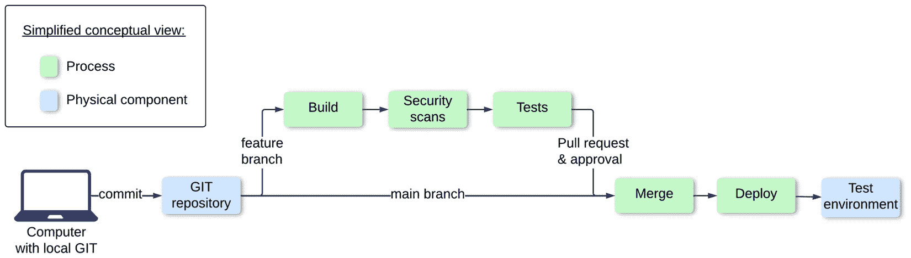
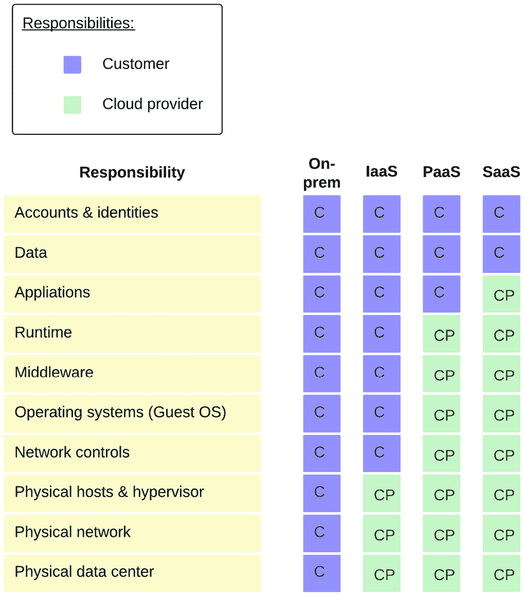

# 第一章：云原生的好处和常见误解

几千年前，家庭需要挖掘并建设水井，从河流中取水，或者搭建雨水收集桶来收集水源。他们需要管理水的过滤和净化，以确保水是安全的，适合饮用及其他用途，并且需要维护这些基础设施。通过集中式市政供水系统，水供应成为了一种商品。现在，用户只需通过水龙头即可获取干净的水，并按使用量付费。

同样，**云原生**使得我们过去需要管理的信息技术方面变得商品化。它可以简化解决方案架构和运营复杂性，也可以使得应用程序的安全更容易，帮助我们实现合规目标。这种商品化的特性可以让我们更轻松地管理和更新数据。在之前的句子中故意使用了*can*一词。所有四位作者都曾在专注于云技术的专业服务机构工作。云技术提供了重大的新机会，但我们必须理解其中的风险、反模式，以及如何降低这些风险。尽管云原生带来了巨大的潜力，但我们也看到了许多令人难以置信的问题。这包括整个环境的意外删除、秘密泄露等，书中的核心部分将聚焦于此。我们经常参与修复这些应用程序，或帮助客户解决安全漏洞和数据丢失问题。当然，也有时我们参与的是绿地解决方案的工作，能够帮助避免反模式。

本书的目标是帮助我们远离这些反模式，修复它们，并朝着最佳实践迈进。在本章中，我们将阐述基础内容，后续章节将在此基础上扩展。因此，理解本章中的信息至关重要，其中包括以下内容：

+   云原生的演变

+   云原生的好处

+   DevSecOps 文化、基础设施即代码（IaC）和持续集成/持续交付（CI/CD）

+   可观察性和弹性

+   常见的误解

# 云原生的演变

云原生并非一夜之间发生的。许多事件促成了这一范式的变化。让我们回顾一下历史，探讨一些关键概念，这将帮助我们理解云原生。为什么它在今天被认为是必需的？我们是如何走到今天的？我们从过去中学到了什么？以下是影响我们现在所知的云原生的关键历史事件的快速回顾。我们将按时间顺序来审视这些事件，因此，我们会穿梭于硬件、软件和设计范式之间。

## 机器学习、人工智能和跨职能团队的基础

**机器学习**（**ML**）和**人工智能**（**AI**）如今在讨论云原生时经常被提及，许多**云服务提供商**（**CSPs**）提供了许多预打包的 ML 和 AI 服务。这一历史可以追溯很久。

1950 年，英国数学家艾伦·图灵发表了论文*计算机器与智能*，提出了图灵测试作为衡量机器智能的标准。美国科学家和研究人员在 1956 年达特茅斯会议的提案中创造了*人工智能*（AI）这一术语。

许多人将虚拟化视为迈向云原生开发的一个重要基础性步骤。虚拟化始于 1960 年代，当时 IBM 发布了控制程序/剑桥监控系统。这一系统使硬件组件的划分成为可能。例如，多个**虚拟机**（**VMs**）可以在一台物理计算机上运行，共享相同的物理处理器和内存。虚拟机允许多个用户共享硬件资源。

1967 年，梅尔文·爱德华·康威提出了一种名为“康威定律”的理论。该理论描述了互相交互的软件组件的设计师们必须互相沟通的现象。康威用以下名言总结了这种行为：“*设计系统的组织（在此广义上所用）被约束于产生这些组织沟通结构的设计的复制品。*”这是一个重要的发现，影响了我们今天如何构建团队。我们使用诸如小组、敏捷团队和 DevOps 这样的术语。我们知道，必须建立跨职能团队，并在协作中表现出色，以交付适合云计算的解决方案。

## 虚拟化时代

IBM 在 1980 年继续开发进一步的增强功能。然而，当时市场还没有准备好广泛商用虚拟机。个人计算机在 1980 年代开始流行，减缓了虚拟机市场的发展。直到 1990 年代末，虚拟机才开始成为主流。VMware 是市场的领导者之一。

## 分布式应用的开始

一种新的设计范式——**面向服务架构**（**SOA**）应运而生。它引入了服务的概念并推动了可重用性。SOA 常被视为微服务的前身。与此同时，一家名为亚马逊的小书店意识到，他们需要改变架构，以一种具有未来保障的方式进行扩展。亚马逊的一群聪明工程师发布了内部出版的*分布式计算宣言*，解释了我们的应用架构需要能够扩展，以应对比当时规模大 10 倍的需求。该论文指出，应用程序不应紧密耦合。它解释了基于服务的模型，并提出了一种三层架构，分别用于表示层（也称为客户端或应用）、业务逻辑和数据。

它还描述了在需要立即响应时应使用同步操作。对于不要求立即结果的工作流，可以使用异步调用。工作流只需推进到下一阶段。异步 API 调用在亚马逊的订单处理流程中显得非常合理。**Amazon Web Services** (**AWS**) 在几年后以新品牌推出。第一个公共 web 服务发布，首次公开推出的是一个名为 **Simple Queue** **Service** (**SQS**) 的消息队列服务。

队列哲学与 *分布式计算宣言* 完美契合。**Elastic Cloud Compute** (**EC2**) 作为虚拟化服务，以及名为 **Simple Storage Service** (**S3**) 的 Blob 存储服务接踵而至。S3 成为云原生历史演进中的一个重要里程碑。2000 年，Roy Fielding 在其博士论文 *网络基础软件架构的架构风格与设计* 中定义了 REST 架构。REST 旨在支持可扩展的客户端-服务器应用程序。REST 提出，客户端与源服务器之间的耦合应尽可能松散。在 REST API 的上下文中，“无状态”意味着从客户端到服务器的每个请求都必须包含所有必要的信息，以便理解和处理该请求，而不依赖于服务器上存储的任何上下文。这确保了服务器在请求之间不会保留任何会话状态，从而实现可扩展性和可靠性。

## 敏捷、DevOps 和云的崛起

2001 年，17 名软件工程师在犹他州聚集，制定了敏捷软件开发的价值观和原则。这些工程师中的一些人成为了著名的敏捷开发倡导者，包括阿里斯泰尔·科克本、马丁·福勒和肯特·贝克。通过这次聚会，他们创建了 *敏捷软件开发宣言*，通常被称为 *敏捷宣言*。该宣言强调了在软件开发工程团队和客户之间，个人和协作的重要性，以更高效地交付更好的软件。协作方面解决了在康威定律中描述的一些问题。这种跨职能团队的方式至今仍然嵌入大多数敏捷交付框架中。

**Google Cloud Platform** (**GCP**) 和微软的 Azure 云平台于 2008 年推出。就在同一年，谷歌发布了 App Engine，这是最早的无服务器计算服务之一。它包括带有 60 秒超时的 HTTP 函数以及带有超时设置的 Blob 存储和数据存储。

在这一十年中，合作的需求变得愈加明显，软件行业的专家指出了将开发与运维分开所带来的问题。

*DevOps* 这个术语应运而生。第一届 DevOpsDays 大会于 2009 年在比利时举行。在最初的阶段，DevOps 关注的是 **持续集成/持续交付** (**CI/CD**) 和基础设施自动化。

## 边缘计算——微服务，以及解决安全问题

2010 年，**边缘计算**变得越来越重要，尤其是在**物联网**（**IoT**）领域。边缘计算是云计算的扩展，它将云基础设施的入口点更接近消费者。一些关键的好处包括延迟减少以及提高系统的韧性和可靠性。边缘计算的使用场景自那时以来发生了变化。例如，内容可以被缓存到离最终用户更近的地方。这种缓存方法被称为**内容分发网络**（**CDN**）。知名的 CDN 解决方案由 Cloudflare、Akamai 和三大云平台（AWS、GCP 和 Azure）提供。

2011 年，*微服务*一词在软件工程界流行起来。微服务通过强烈关注持续增量变更以及服务和端点之间的轻量级通信，增强了面向服务架构（SOA）。有时，人们将*微服务*与*云原生*这两个术语交替使用。我们将在探讨常见误解时深入讨论这一点。

Heroku 的工程师在那个时期还开发了 12-Factor App 方法论。12-Factor App 原则为构建可扩展和可维护的**软件即服务**（**SaaS**）应用程序提供了最佳实践指导。它们强调声明式配置、与底层操作系统的清晰契约，以及在执行环境之间的最大可移植性。一些关键原则包括将配置与代码分开管理，将后端服务视为附加资源，以及严格分离构建、发布和运行阶段。

在 2012 至 2013 年之间，*DevSecOps*一词被越来越多地提及。它被视为 DevOps 的扩展。DevSecOps 提倡在软件开发过程中尽早嵌入安全性，自动化安全测试，并在团队之间倡导共享安全责任的文化。

## 容器和功能即服务

2013 年，Docker 容器发布。虚拟机（VMs）和容器之间的主要区别在于，虚拟机提供了物理机器整个硬件的抽象版本，包括 CPU、内存和存储。另一方面，容器是软件的便携实例。容器无法感知主机操作系统上运行的其他进程。

Google 大约一年后发布了 Kubernetes，它是一个容器编排平台。Kubernetes 至今仍广泛用于容器的扩展、容器管理、可扩展性和自动化部署。

第一个**函数即服务**（**FaaS**）功能是在 2014 年发布的。AWS 发布了 Lambda 函数。后来，其他 CSP 也采纳了 FaaS，如 Microsoft 的 Azure Functions 和 GCP 的 Google Cloud Functions。FaaS 提供一个完全托管的运行时环境，我们只需要管理我们的代码。这是一个根本性的转变，使得 DevSecOps 从业人员能够专注于区分他们组织与其他组织的工作，包括应用程序代码和架构设计。我们只需在函数运行时付费，当函数未被调用时没有任何费用。

服务网格的概念也是在那时引入的，它是一个专门的基础设施层，用于监控、管理和保护云原生应用程序中微服务之间的网络通信。

## 云原生和最佳实践

**云原生计算基金会**（**CNCF**）是一个 Linux 基金会项目，始于 2015 年。两年后，在 2017 年，Google、IBM 和 Lyft 开源了流行的服务网格实现 Istio。

2018 年，**国家标准与技术研究院**（**NIST**）和**国家网络安全卓越中心**（**NCCoE**）的研究人员发布了**零信任架构**（**ZTA**）框架。它描述了一种“永不信任，总是验证”的方法。这要求对每个尝试访问资源的设备和人员进行严格的身份验证，无论其位于网络内部还是外部。ZTA 现在在云原生架构中变得越来越重要。它被视为减少数据泄露风险并执行最小特权访问方法的可靠方式。

OpenTelemetry 是一个开源的可观察性框架。它是在 2019 年 CNCF 合并了 OpenCensus 和 OpenTracing 两个项目时创建的。它的目的是收集追踪、指标和遥测数据。OpenTelemetry 通常用于监控微服务和其他分布式应用程序。

FinOps 基金会于 2019 年成立，并在 2020 年成为 Linux 基金会的一个项目。它致力于“*通过最佳实践、教育和标准，推动实践云财务管理学科的人群。*”

在 2020 到 2012 年间，GitOps 从 DevOps 演变而来。它是一种使用 Git（分布式版本控制系统）作为基础设施和应用配置的真实来源的 CD 实践。

2023 年，**Open Policy Agent**（**OPA**）作为一个安全框架出现在 Kubernetes 社区中。它解决了多个使用案例，包括 REST API 端点调用的授权、将自定义授权逻辑集成到应用程序中，以及为云基础设施管道提供基于代码的策略框架。它此前是一个 CNCF 孵化项目。

同样在 2023 年，ML 和 AI 集成的趋势开始出现。主要的 CSP 发布了他们的托管服务，包括 Google 的 AI 平台、Amazon SageMaker 和 Azure ML。

## 我们现在处于什么阶段，未来将带来什么？

许多描述的框架和最佳实践将在 2024 年继续流行。最大的趋势之一是嵌入式 AI 服务，涵盖生产力、运维和安全性。在讨论云原生的好处之前，让我们先来看一些例子。

**运维中的 AI**（**AIOps**）提供预测性洞察、异常检测和自动化响应。**云原生应用保护平台**（**CNAPP**）解决方案正席卷全球。它们在**软件开发生命周期**（**SDLC**）的各个阶段，从开发到运维，提供全面的保护和合规性验证。帮助开发人员并提高生产力的聊天机器人和其他生成式 AI 服务也在迅速流行。

AI 趋势包括 OpenAI 的 ChatGPT、微软的 GitHub Copilot、AWS Code Whisperer、Amazon Q 和谷歌的 Cloud AI 与 Vertex AI 等技术。关于生成式 AI 服务存在法律方面的顾虑。其中一个问题是我们的敏感数据可能会被用来训练 AI 模型。主要的顾虑是数据是否会暴露给第三方，以及数据是否会保留在我们的地区，这可能是合规性要求。另一个问题是知识产权归属。如果生成式 AI 服务生成了基础部分，而人类对该生成结果进行了增强，结果的归属应该归谁？不同的法域有不同的法律，而且由于这是一个相对较新的问题，常常存在灰色地带。这些问题的讨论可能会持续一段时间。

我们现在对促成云原生概念的重要事件有了较为清晰的认识。但云原生的实际好处是什么？为什么它对现代架构如此重要？我们将在下一部分进行探讨。

# 云原生的好处

什么是云原生？有很多不同的定义，针对本书的上下文，我们将采用 CNCF 的定义：

“*云原生技术，也称为云原生技术栈，是用来构建云原生应用的技术。这些技术使得组织能够在现代和动态的环境中，如公共云、私有云和混合云，构建和运行可扩展的应用，同时充分利用云计算的优势。它们从一开始就设计用来发挥云计算的能力，容器、服务网格、微服务和不可变基础设施体现了* *这一方法。*”

根据 Gartner 的说法，“云原生”这一术语指的是“旨在最佳利用或实现云特性的做法”。这里的关键短语是“*最佳利用或实现云特性*”。这一领域恰恰是我们看到许多大型组织出错的地方。很多时候，他们将云当作与他们数据中心相同的东西来处理。我们将在接下来的章节中深入探讨这一点，详细介绍反模式。

## 更快的市场时间

让我们从第一个关键好处开始：*更快的市场时间*。这是许多初创公司开始使用云原生服务的关键驱动因素之一。那些初创公司没有遗留系统，需要快速展示成果，以获得风险投资并创造增长收入流。开发者可以利用自助式资源供应，相比于传统机制需要请求基础设施部署的方式，这节省了大量时间。

采用云原生方法，他们可以快速创建新的环境或无服务器功能。根据资源类型，供应可能需要几秒钟或几分钟。数据库供应通常需要几分钟，而像 Amazon S3 桶或 FaaS 这样的 Blob 存储可以在几秒钟内部署。这有助于实现更快的市场时间目标，也有助于更快的创新周期。如果我们想进行概念验证，比较使用不同编程语言的生产力，使用 FaaS 可以节省大量时间，因为运行时已经由我们的 CSP 预先配置。尝试在 Golang 中运行一些函数，或在 Rust 或 Java 中运行其他函数非常简单。供应和退役的工作量很小，开发人员可以专注于应用程序开发，而不需要等待。

## 可扩展性和弹性

可扩展性和弹性基础设施是其他好处。应用程序可以根据需求轻松地扩展或缩减。云原生架构通常利用水平扩展而非垂直扩展。这对于流量有显著波动的应用程序，如购物网站或支付应用程序，是一个很大的优势。它们需要在白天的高峰时段或季节性高峰时段进行扩展。一旦流量激增减少，我们可以自动缩减底层基础设施。

这与传统的本地部署方式有很大的不同，在传统方式中，我们需要永久性地为最高的流量量预留资源以避免停机。而云基础设施是弹性的，定价模型在某种程度上也是如此。例如，如果我们在扩展事件后处置计算实例，我们将不再为其付费。然而，如果我们存储数据却没有删除它，我们仍然需要支付存储费用。

## 管理服务

托管服务由云服务提供商（CSP）管理，它们提高了客户的操作效率、可靠性和可用性。因此，它们是云原生架构中的一个重要优势。CSP 管理托管服务的基础设施。根据服务的不同，这可能包括应用程序本身，例如队列或通知应用程序。托管服务包括资源的配置、维护和网络结构。如果我们使用托管关系型数据库服务，如 Amazon **关系型数据库服务**（**RDS**）、微软 Azure 数据库或 Google Cloud 数据库，CSP 将负责底层基础设施的修补和升级，包括数据库引擎。托管数据库服务还会执行符合行业规定的安全性和合规性，直到数据库层级。客户则负责该层之上的安全性，例如数据加密。我们企业实现商业价值的方式并不会受到如何修补数据库或运行虚拟化管理程序的影响。托管服务抽象化了大量操作开销，这使得我们能够专注于业务区分点，如应用逻辑和数据提供。托管服务通常提供监控和报告功能，例如 FaaS 的调用方法。托管数据库或数据存储服务通常提供开箱即用的备份和恢复机制。托管服务可以自动扩展，并具备内置的成本管理和优化功能。

## 安全性与合规性

云原生架构的进一步安全性和合规性优势包括统一的访问控制。**基于角色的访问控制**（**RBAC**）、**基于属性的访问控制**（**ABAC**）和**身份与访问管理**（**IAM**）服务确保我们能够实施最小权限原则。默认启用的加密机制可确保数据在传输和静止状态下得到保护，从而确保客户数据始终可以加密，这是一种最佳实践，并且在许多受监管行业中也是强制要求的。

还内置了安全特性，例如**DDoS**（**分布式拒绝服务**）保护、防火墙、**网络访问控制列表**（**NACLs**）和**安全信息与事件管理**（**SIEM**）工具。大多数 CSP 还支持**多因素认证**（**MFA**）和**单点登录**（**SSO**）。实施这两个控制通常是内部安全要求。MFA 也是一些监管要求强制的，例如**支付卡行业数据安全标准**（**PCI-DSS**）。SSO 集成使得集中管理人类和机器的访问权限变得更加容易。这种集中化的方式减少了运营工作量，并有助于满足合规性要求。

云原生还提供了预防性和侦测性护栏，这对于保护我们的团队免受某些人为错误至关重要。预防性护栏确保某些特定操作，如删除备份库，永远无法执行。侦测性护栏仍允许某些操作，但如果发生特定事件，它们可以发送通知，并且可以在仪表板上可视化发现。例如，我们希望查看开发环境中是否有任何未加密的数据库。我们可以通过预防性护栏强制对测试或生产等更高环境进行加密。侦测性护栏还可以触发现有云资源的自动修复。如果某个 Blob 存储没有启用访问日志记录，自动修复可以执行该更改。自动化漏洞扫描是许多云服务提供商（CSP）提供的另一项功能。它们帮助扫描虚拟机、容器、FaaS 代码和网络。这些扫描工具通常提供带有发现和修复建议的报告。

## 可靠性与可用性

云原生应用程序还有其他的可靠性和可用性优势。异常检测服务帮助检测由于缺陷导致的可疑用户行为或异常系统行为。它们有助于在早期阶段识别事件。部署架构可以轻松利用一个地理区域内的多个独立位置。可用区（AZ）彼此物理隔离，具有独立的电源供应和连接性，但区域内有高速互联。一个区域可以是悉尼或新加坡。独立的位置称为**可用区**（**AZs**）。术语*AZ*在不同的云服务提供商（CSP）中有不同的含义，但目前这个定义对我们来说已经足够了。最佳实践是将我们的应用架构设计为利用多个可用区，理想情况下是我们所在区域内的所有可用区。多可用区部署有助于从一个可用区自动故障转移到另一个可用区。在一个可用区发生故障时，其他可用区可以分担负载并响应传入的请求，如 API 调用。这个故障转移是一个内置功能，但应用程序需要正确架构，以便利用这些优势。我们甚至可以将应用程序部署到多个区域。在极不可能发生的区域完全故障的情况下，第二个区域可以承载全部负载并响应传入请求。区域完全故障的可能性非常小。因此，这种用例比全球部署的其他用例要少见。

区域性故障是我们想要讨论的下一个优势的引入。

## 全球部署

通过全球部署，对于在多个国家甚至全球运营的组织来说，这使得在部署架构中处理这些问题变得更加容易。全球部署能够减少客户设备与应用程序之间的延迟。我们可以利用 CDN，这样可以将数据缓存更靠近客户，并且如果客户不在我们的地理区域内，这会非常有帮助。例如，假设我们的应用程序托管在澳大利亚东部的悉尼，而我们的客户位于距离 4,000 公里外的澳大利亚西海岸。在这种情况下，我们可以利用 CDN 将可缓存的信息存储在位于西海岸的珀斯。这些分布式位置称为**边缘位置**。我们甚至可以在边缘位置上运行某些形式的身份验证，以减少登录过程的延迟。这个额外的缓存层提高了内容的可用性。它还可以减少带宽成本，因为需要由源服务器提供的数据量减少，因此，我们的出站数据费用会较低。我们还可以有可能缩减我们提供的基础设施。CDN 可以处理大规模的流量峰值，因此，它们可以防止 DDoS 攻击。

另一个全球部署的驱动因素可能是合规性要求，例如数据主权法。对于受监管的行业，如金融服务或健康服务，客户数据必须存储在原始地区。例如，美国公民的数据必须存储在美国境内，欧洲客户的数据必须存储在欧盟境内。通过全球部署，部署应用程序到不同地区变得更加容易。应用程序将把数据存储在该地区并保持在那里。通过 CDN，我们还可以使用云原生的地理限制。我们可以将内容限制在特定的大陆或国家，通常可以定义允许和拒绝列表。这些地理限制就是为什么某些媒体内容在其他国家不可用。电子商务平台通常也会全球部署其应用程序。这样，他们可以为每个地区提供不同的产品目录，并享有所有的可靠性和可用性优势。全球部署的低延迟也是它们在游戏或大型物联网解决方案中普遍应用的原因。全球部署的另一个应用场景是**灾难恢复**（**DR**）。数据可以在不同的地区进行备份，以提高业务的弹性。

## CI/CD – 自动化一切

云原生通常提供 CI/CD 的自动化功能。它们能够实现应用程序的自动构建、测试和部署。

在使用 CI/CD 时，每次变更都经过一个受控的流程，其中应包括同行审查代码变更。由于一切都是基于代码的，临时创建新环境的工作量非常低。在其他地区创建环境或拆除临时环境也很容易。自动化有助于缩短上市时间、提升变更管理过程的鲁棒性、实现环境间的一致性、提高安全性和可靠性，并帮助降低成本。

## 成本效益与范式转变

将我们的应用托管在云端而不是本地部署，意味着成本模式从前期**资本支出**（**CapEx**）投资转变为按需付费模式。我们不再每五年进行大规模的基础设施投资，而是会在云端持续产生支出。

一些前面提到的功能，如自动扩展和自动化，有助于在云中进行成本优化。但还有更多本地功能。每个云资源都应该有标签。标签是描述资源的元数据。常见的标签包括环境、数据分类、成本中心和应用所有者。标签可以用于成本拆解或安全控制。本地成本仪表板提供成本洞察，并根据标签、地区或资源类型（如虚拟机或托管 API 网关）提供不同的视图。成本仪表板解决方案包括 AWS 成本资源管理器、Google Cloud Billing Reports 和 Azure 成本管理与账单。

我们还可以设置预算，确保如果预计支出超过预期支出时会收到通知。我们可以手动定义预算，或者使用内建的人工智能功能来设置预算值。人工智能组件通常需要几天时间来了解常见的支出高峰和低谷。大多数云服务提供商（CSP）也提供资源优化建议服务。该服务帮助减少因客户过度配置资源（如虚拟机或数据库）而产生的费用。CSP 还提供承诺支出计划，如果我们承诺在一年以上的时间内达到一定支出额，还能获得折扣。

## 可移植性

云原生还带来了一些可移植性好处。容器和编排工具如 Kubernetes 促进了标准化的配置和部署过程。一个容器托管的应用可以轻松迁移到不同的 CSP。云原生解决方案是混合云兼容的，并且可以与我们的数据中心集成。混合部署在大规模应用迁移中非常普遍，特别是在从本地部署到云端的迁移过程中，这一过程通常会持续很长时间。通常，应用的前端部分首先迁移到云端，从 CDN、API 和用户界面等组件开始。对于需要低延迟和减少抖动的场景，我们可以使用云原生连接服务。这些连接服务要求我们的数据中心位于 CSP 的一个共址位置，并且数据中心的基础设施需要发生变化，例如新的电缆连接等。例子包括 GCP Cloud Interconnect、AWS Direct Connect 和 Azure ExpressRoute。

云原生架构提供了许多好处。然而，我们仅仅触及了云自动化的皮毛，甚至还没有讨论文化层面的内容。现在让我们来探讨这个话题。

# DevSecOps 文化、基础设施即代码（IaC）和持续集成/持续交付（CI/CD）

在*云原生的演进*一节中，我们讨论了康威定律、敏捷宣言、敏捷软件开发的崛起以及 2009 年的第一次 DevOps 大会。那么，DevOps 到底是什么呢？

## 文化层面

**DevOps**是开发和运维的跨职能组合。其主要特点包括共享所有权、工作流自动化和快速反馈。DevOps 利用文化行为、实践和工具来自动化开发和运维，从而改善端到端的 SDLC。其目标是提高软件质量并缩短从提交变更到生产环境的时间。DevOps 主要关乎文化，因此它会影响软件工具链。DevOps 采纳中的文化变革往往被低估。让我们详细讨论这些影响，以便理解为何会出现这种情况。

DevOps 的采纳意味着不同学科的人员共同协作，我们称之为跨职能团队。*两块披萨团队*结构是亚马逊的杰夫·贝索斯在 2000 年代初提出的一种策略，旨在通过确保团队足够小到只需要两块披萨就能满足其需求，来保持团队的小巧和高效。这种方法促进了团队内部更好的沟通、敏捷性和生产力。*你构建它，你运维它*的理念促进了业务敏捷性，使团队能够更快反应并创新交付客户价值。这也带来了高质量的成果，因为人们被激励避免发生会让他们被召集处理的事件。这些应该已经听起来很熟悉了。现在让我们来看一看在加入安全性因素之后，会是什么样子。

### DevSecOps

成熟的 DevSecOps 文化采用**Shift-Left**方法。功能性和非功能性的质量控制在软件开发生命周期（SDLC）初期就开始执行。*Shift Left*意味着测试活动（如需求定义和设计）开始得早，因此测试人员能够提前参与。测试通常会高度自动化，包括单元测试、集成测试、非功能性测试、回归测试、合同测试等。静态代码分析工具有助于分析代码质量。

**DevSecOps**增强了 DevOps，并建议在软件交付过程中嵌入安全性。这使得开发团队能够生产满足安全和法规要求的高质量变更。DevSecOps 将安全工具集成到 CI/CD 工具链中。此集成包括**静态应用安全测试**（**SAST**）工具，用于分析源代码中的漏洞。**软件组成分析**（**SCA**）是对定制源代码的分析，用以检测嵌入的开源软件或库，并验证它们是否是最新的且没有安全漏洞。其他常见的安全扫描包括秘密扫描，以确保代码中没有嵌入安全密钥或密码。漏洞扫描检查机器镜像、容器镜像和源代码中的常见漏洞和暴露。这些扫描变得越来越重要，因为供应链攻击的激增。供应链攻击利用第三方工具或服务渗透系统或网络。

有许多新兴趋势与*Ops*相关。其中一个备受关注的是**AIOps**，它提倡利用 AI 技术并将其嵌入 DevSecOps 方法中，以便及早识别异常和可疑行为。因此，我们希望看到交付和运营的改进，接下来我们将探讨这一点。

### 衡量进展

**DevOps 研究与评估**（**DORA**）团队发布了 DORA 指标，其目的是衡量并提高软件开发过程的性能和效率。提供可操作的见解有助于识别瓶颈并改进过程。四个关键的 DORA 指标如下：

+   **变更的交付时间**（**LTFC**）是从第一次代码提交到部署的时间。较短的交付时间意味着可以更快地交付业务价值。

    例如，我们可以跟踪开发者从提交更改到发布到生产环境的时间。平均而言，这需要 24 小时，这使得公司能够迅速响应市场需求和用户反馈。

+   **部署频率**（**DF**）是指在给定时间段内的部署次数。高频率表示能够交付新功能和修复 bug，并响应客户需求。

    例如，我们每周发布两次移动应用更新。这种频繁的部署有助于快速将新功能和错误修复交付给用户，确保应用保持竞争力和用户友好。

+   **更改失败率** (**CFR**) 是所有更改中失败更改的百分比。较低的比例表示发布的质量和稳定性较高。

    例如，在一个月的 50 次部署中，5 次由于错误或问题导致回滚或需要热修复。这为我们的组织提供了 10% 的 **更改失败率** (**CFR**)，突出了他们的测试和审查过程中的改进空间。

+   **恢复时间中位数** (**MTTR**) 衡量从系统故障中恢复所需的平均时间。较短的 MTTR 表示能够从事件中快速恢复。

### 应对文化挑战

现在我们已经了解了 DevSecOps，我们可以看到其采纳并非易事。需要考虑的因素很多。从瀑布式软件开发方法入手将会是一个陡峭的学习曲线。相当一部分人对文化变革有一定的抵触。如果一个组织被划分为孤岛，它将需要一段时间才能打破这些障碍。DevSecOps 需要更多的协作和更广泛的技能。因此，提供足够的培训至关重要。培训将是获得云原生知识所必需的，包括用于构建、测试和部署代码的工具。

正如 DevSecOps 中的术语 *Ops* 所暗示，团队还负责应用程序的运行。因此，团队有动力发布高质量的代码，以确保他们不需要解决太多的故障。这种拥有感方法是与传统方法的一个重要区别，在传统方法中，开发和运维是分开的。这也意味着团队成员需要具备构建可观察性能力并响应事件的技能。学习这些内容将需要培训，这可以是课堂培训、在线培训课程和结对编程的结合。提供用于实验和创建概念验证的学习环境对于提升团队技能也非常有效。这些环境通常被称为 *沙坑* 或 *沙箱*。我们在这里使用 *开发者* 一词，因为他们可能会编写应用程序、测试、基础设施或配置代码。但这个术语可以与工程师、软件工程师、全栈开发者等互换使用。

组织可以通过不同的方式推动文化变革。自上而下意味着变革举措从领导层开始，而自下而上意味着它从交付团队开始，最终到达管理层和领导层。为了成功采用 DevSecOps，我们需要获得领导层的支持。否则，所需的文化变革将无法实现。当 DevSecOps 首先在已经采用敏捷交付方式的部分组织中进行时， adoption 过程通常会更为成功。这些团队会更容易体验到 DevSecOps，过一段时间后，他们可以开始进行集体合作。这意味着团队成员可以被扩展，并且可以作为其他团队的导师。如果我们刚开始转型旅程，寻求 DevSecOps 咨询公司提供外部帮助是非常有益的。外部顾问可以指导团队，贡献代码库，并确保最佳实践得以应用。为了确保 DevSecOps 旅程的成功，顾问们必须将知识转移给内部开发团队。

## IaC

源代码是每个云原生解决方案的真相来源。负责基础设施的人通过**基础设施即代码**（**IaC**）创建基础设施或模式。IaC 在代码中定义了诸如网络构件、服务器、策略、存储和 FaaS 等组件。

### 云原生 IaC 与云无关 IaC 的区别

CSP 提供了自己的 IaC 技术，也有一些第三方产品是平台无关的：

+   **云原生 IaC**：

    CSP（云服务提供商）为其平台提供了自己的 IaC 服务，包括 AWS CloudFormation、**Azure Resource Manager**（**ARM**）和 Google Cloud Deployment Manager。这些服务带有自己特定的 IaC 语言。与 Golang 或 Java 等高级编程语言相比，IaC 语言较为简单，可以快速学习。简洁性对有着强大基础设施背景的人非常有利，即使他们并不一定有太多的编码经验，除了 Bash 或 PowerShell 脚本之外。

+   **平台无关的 IaC**：

    也有一些 IaC 工具使用一种通用语言来部署到多个云平台和本地平台。Terraform 是一个流行的 IaC 工具，可以部署到所有主要的 CSP 以及数千个其他平台，包括协作平台、防火墙、网络工具和源代码管理工具。Terraform 曾是开源的，但当它在 2023 年转为商业源许可证时，社区迅速作出了反应。代码库被分叉，一个名为**OpenTofu**的新开源项目成立了。

听起来，IaC 有潜力带来显著的优势，接下来我们将讨论这些优势。

### IaC 的优势

通过 IaC 定义云资源有什么优势？每当我们重复部署某些东西时，例如临时或新的测试环境，架构和部署方式将始终保持一致，且这种方式易于重复。通常，我们会为不同的环境使用不同的参数，例如为不同的网络段使用不同的 IP 范围，或者为非生产环境使用更小的自动扩展组。其余的代码保持不变。因此，IaC 在实现可扩展性或实施全球部署方面也非常高效。配置和代码都在 Git 中进行版本控制。因此，回滚到以前的版本非常容易。

如果我们希望生产环境比开发环境滞后，**版本固定**（version pinning）也可以很容易地使用。基础设施即代码（IaC）还帮助实现良好的灾难恢复响应时间。我们可以通过 IaC 和 CI/CD 技术，完全自动化灾难恢复环境的构建，而不是手动或半手动地构建新的灾难恢复环境，这一点我们稍后会详细讨论。IaC 还帮助满足安全性和合规性要求。安全性要求嵌入在代码中。例如，如果我们只允许 HTTPS 流量，我们的代码将只开放端口`443`，然后我们将在源代码中明确这一点。作为最佳实践，代码会经过同行评审，以确保我们满足要求。在重新部署时，我们可以确信不会暴露我们的应用程序，因为部署将提供一个可重复的结果。所有更改都在 Git 中进行跟踪，有助于审计和合规性。一些监管框架要求采取可重复的方法，这正是 IaC 所建立的。此外，IaC 还有成本效益。由于创建和销毁资源非常简单，它有助于避免过度配置。如果测试环境不再需要，那么可以在不需要时轻松关闭资源。如果我们采用完全无服务器的方式，就不需要过多担心这个问题。我们稍后会在讨论策略时谈到这一点。

我们如何部署通过 IaC 定义的云资源？我们如何构建和部署我们的应用程序代码？我们如何以自动化的方式执行所有功能和非功能测试？答案就是 CI/CD，我们现在就来探讨它。

## CI/CD

CI/CD 是持续集成（Continuous Integration）和持续交付（Continuous Delivery）的结合，有时也称为持续部署（Continuous Deployment）。主要的区别在于，持续交付需要手动审批步骤，而持续部署在代码更改后会自动部署。CI/CD 弥合了开发和运维之间的差距。在构建过程、功能和非功能测试以及部署过程中，它强制执行自动化。

### 定义结构

CI/CD 过程有很多种结构方式，甚至有更多工具组合。微调将很大程度上取决于组织和监管需求。我们将采用一种标准结构，在这种结构中，我们希望采用“左移”方法。以下图表帮助我们逐步了解这一过程：

图 1.1 - 简化的概念性 CI/CD 过程

这个过程从开发者使用首选的**集成开发环境**（**IDE**）开始。有时候，开发者仅使用命令行工具。然而，IDE 通常被广泛使用，因为它们提供了实用的内置功能和插件架构。这种架构支持安装扩展或插件。Visual Studio Code 是由微软开发的流行开源 IDE。尽管该软件是开源的，但可用的扩展未必是开源的。IDE 通常具有内置的 Git 集成。然而，我们可以安装一个额外的扩展来可视化 Git 仓库和 Git 分支。

### Git 分支与左移

Git 分支是为新变更创建的代码仓库的独立版本。有不同的分支模型，比如基于主干的开发或功能分支。我们将在*第五章*中详细讨论这一点，作为我们的示例，我们将使用功能分支模型。当开发者想要将变更提交到仓库时，重要的是要基于仓库中的最新版本进行操作（仓库的简称为 repo）。因此，需要使用`git pull`命令来确保本地副本是最新版本。之后，开发者创建一个新的功能分支并更新代码。现在可以自动运行许多检查，以提供早期反馈。例如，一个安全扩展可以扫描代码并识别潜在的弱点。例如，如果代码是一个定义了公共 Amazon S3 桶的 Terraform 模板，那么插件可以提供反馈，提醒该桶应该是私有的。S3 桶是 AWS 中的二进制存储构造，配置错误的 S3 桶已成为许多数据泄露的原因。这种早期反馈就是“左移”的例子，开发者可以在代码通过 CI/CD 管道验证之前修复代码。代码格式化、代码检查和语法验证通常在客户端运行。一旦开发者对更改满意，代码就会提交到 Git 仓库。

可选地，一个提交可以触发预提交钩子，执行我们刚才描述的步骤。它还可以自动生成文档。

### 批准与部署

开发人员随后提交**拉取请求**（**PR**）。有人会进行同行评审。如果代码符合预期，PR 会被批准。然后，代码会被合并到主分支。合并将触发管道运行。最初，会有一些验证步骤，类似于开发人员已经运行过的步骤。但我们希望确保某些验证是强制性的，并且不依赖于个人。接下来，构建过程将启动，并运行一些静态代码分析、功能性和非功能性测试以及进一步的安全扫描。一旦管道运行成功，授权人员可以触发部署。这些步骤是 CI/CD 管道的一个简单示例。

我们可以看到自动化这些步骤的许多好处。为一个组织构建所需的管道需要一些时间，但一旦它们建立起来，开发过程变得更加迅速、可靠和安全。但我们如何验证它是否按预期运行呢？让我们来看看。

# 可观察性与弹性

我们已经涵盖了云原生解决方案的许多方面，包括文化影响、跨职能团队、DevSecOps 文化和工具复杂性。现在我们将研究可观察性和弹性，这两个在云原生解决方案的早期设计阶段需要更多关注的领域。

如果我们没有建立全面的可观察性，我们就无法知道是否达到了目标，例如响应时间。如果我们失败了，我们也无法知道瓶颈在哪里。因此，我们需要制定全面的日志记录、监控和可观察性策略。承受故障的能力也是如此。我们需要洞察力来验证我们的部署架构是否符合弹性预期。我们将探讨这两个方面，从可观察性开始，并在云原生环境中了解其含义。我们无法修复我们看不见的东西。可观察性帮助我们深入了解应用程序的内部状态，并通过评估输出进行度量。

## 日志记录 – 可观察性的推动者

**日志**是监控和可观察性的关键推动者。日志的范围非常广泛，可以包括操作系统日志、访问日志、应用程序日志、基础设施日志、网络流量日志、**域名服务**（**DNS**）日志等。日志使得监控、警报、调试、事件发现和性能优化成为可能。在本章前面，我们已经阐明，典型的 DevSecOps 团队（即产品小组）编写代码并管理他们的应用程序，也称为“产品”。因此，该团队将有动力建立良好的可观察性实践和工具。

当团队在开发和运维之间具备良好的技能和经验混合时，可以实现良好的成熟度水平。拥有运维经验的人员了解可观察性的重要性。具有软件工程背景的人也会看到可观察性的重要性，尤其是在应用层。

然而，有时候，其他层级，如网络层或操作系统层，需要更多的关注。获取涵盖所有层级的整体视图对于深入了解我们的系统至关重要。能够关联数据也至关重要。例如，如果我们有一个混合云应用，一个业务事务可能从 CDN 开始，经过 API 层，然后写入云托管的队列，在那里本地的业务逻辑从队列中拉取数据并将其写入本地托管的数据库。

此外，还有一个本地防火墙，它检查所有进来的流量。这个架构很复杂，但也很常见。如果我们有**服务级别协议**（**SLAs**），我们不仅需要衡量端到端的事务时间，还需要在可能无法满足这些 SLA 的情况下识别瓶颈。问题可能出现在整个流量路径的任何地方。良好的洞察力将帮助我们确定瓶颈。收集所有这些日志会带来另一个挑战。因为我们知道需要收集所有相关日志，很容易陷入过度收集的陷阱，从而导致告警疲劳。我们将在*第十章*中探讨典型的反模式，并讨论如何解决这些陷阱。

## 日志质量

一致性、标准化和良好的日志信息质量是有用的仪表板和有意义的告警的基础。

为了实现这一目标，需要考虑几个方面。我们需要就要记录的严重性级别达成一致。并非所有严重性级别都需要始终记录。例如，调试级别应该仅在我们调试时记录。如果我们不明智地决定在何时使用什么严重性级别，以及哪些级别需要记录，我们将会得到不一致的日志文件。而且，很可能我们会记录过多的内容。这意味着我们需要更大的日志文件索引器，从而增加运营开销。日志量的增加使得在发生事故时更难找到相关信息，尤其是在没有标准化日志结构的情况下。

因此，我们还需要定义日志文件中捕获的信息，以及其顺序和结构。像 JSON 这样的结构化数据格式有助于实现这一点，并且有助于包含键值对以提供上下文。日志条目可以包括一个 `userID` 或 `sessionID` 的键，以及实际的 ID 作为值。日志条目还应包含在故障排除过程中其他有用的上下文信息，例如时间戳、事务 ID 和关联 ID，以便跟踪和关联微服务之间的请求。我们不应在日志文件中存储敏感信息，如信用卡详细信息、客户姓名和地址。某些监管框架，如 PCI-DSS，规定了不能存储在日志文件中的数据类别。集中式日志记录还将有助于找到数据关联，因为来自 API、数据库和基础设施事件的日志将保存在相同的存储中。流行的开源日志工具包括 Logback、Graylog 和 Log4j。后者因 2021 年的 Log4 Shell 漏洞而广为人知，该漏洞使黑客能够控制运行未打补丁版本的 Log4j 的设备。因此，我们应该始终保护自己免受漏洞攻击，我们将在第六章中详细讨论这一点。一些服务网格解决方案，如 Istio 或 Linkerd，开箱即用地提供日志、指标和追踪。

那么我们还需要考虑日志的哪些方面？我们需要确保只有授权的个人和系统可以访问日志文件。如果它们包含敏感信息，则需要加密。然而，我们需要与适用的监管框架和内部安全政策进行核实，以查看是否允许这样做。如果我们的源代码包含递归，我们应确保相同的异常或错误不会被多次记录。我们还必须考虑日志文件的数据保留策略，以避免账单冲击。一个合理的日志记录方法将能够提供良好的监控和可观察性能力，接下来我们将讨论这一点。

## 监控与可观察性

需要一个监控解决方案来解析日志，并且我们需要设置警报，以便在发生任何关键事件时收到通知。

OpenTelemetry 是一个开源的可观察性框架。它旨在捕获和处理遥测数据，包括来自云原生应用程序的度量、日志和追踪数据。它提供了一套 API、库、代理和工具，用于帮助 DevSecOps 团队监控应用程序的行为。它促进了跨应用程序和环境的数据收集标准化和一致的可观察性。一个显著的好处是与各种后端系统的互操作性。因为通过 OpenTelemetry，我们可以为代码提供标准化的工具，这样就可以轻松地切换到不同的后端和工具。这减少了供应商的锁定。OpenTelemetry 拥有强大的社区支持，并得到了主要云服务提供商和可观察性供应商的支持，确保了持续的改进、广泛的兼容性以及共享的知识和最佳实践。在选择新的可观察性产品时，值得将 OpenTelemetry 支持作为评估标准。

支持 OpenTelemetry 的流行开源工具包括用于度量收集的 Prometheus、用于可视化的 Grafana、用于日志收集的 Fluentd 和用于分布式追踪的 Jaeger。

在设置警报时，考虑值班团队成员的排班时间也至关重要。这定义了某个特定的 DevSecOps 团队成员何时需要待命以解决事件。它还应提供一定的灵活性，并允许在个人因个人原因无法参与时临时调整排班。如果我们的团队跨越多个时区，工具必须能够解决这个问题。流行的商业产品有 PagerDuty 和 Atlassian Opsgenie。可观察性有助于实时获得应用程序的洞察，并能够迅速应对任何意外行为。我们的目标是构建强大、可扩展和弹性的解决方案。但我们也需要处理从事件中获得的洞察，以提高系统的韧性，这将在下一节中详细阐述。

## 韧性

在云原生架构中处理韧性问题对于理解应用程序如何承受故障至关重要。故障可能发生在架构中的任何层级和任何相关组件中。AWS 发布了 *AWS Well-Architected Framework* 的第一个版本，微软在 2020 年发布了 Azure 版本，谷歌则在 2021 年发布了 *Google Cloud Architecture Framework*。这三个框架中都有一个关于 *可靠性* 的支柱或章节。然而，这一领域通常被误解，特别是在云采纳的初期阶段。设计和实施能够应对可能故障的应用程序是架构师和工程师的责任。如果我们利用托管服务，云服务提供商将考虑到许多因素，我们可以减少需要管理的可靠性表面。我们将在 *第七章* 中详细讨论这一点。

### 人类可能会失败——云也会失败

尽管云服务提供商（CSP）负责云服务的弹性，停机事件仍然可能发生。亚马逊首席技术官沃纳·沃格尔（Werner Vogels）曾说过一句名言：“*一切都会失败，始终如此*”。

在 CSP 方面，有多种基础设施故障场景，例如服务中断、可用区中断、区域中断或全球服务中断，如 DNS 中断。这些只是一些例子，当然，我们也可能在实际应用中遇到故障。例子包括负载均衡或数据库连接池的配置错误、磁盘或存储空间用尽、未分配足够的计算能力（如内存或 CPU 大小）、意外的配置漂移或软件漏洞。在架构弹性时，我们需要考虑一些指导原则，接下来我们将逐一讨论这些原则。

### 自动化恢复

首先，应用程序应该能自动从故障中恢复。这种行为也被称为自愈。必须发现故障才能启动自动恢复过程。我们会设置健康检查，这些健康检查可以触发后续的操作。例如，我们可以在负载均衡器上配置健康检查，如果负载均衡器后面的容器实例发生故障，它将被自动替换为新的实例。在这种恢复场景中，快速启动时间至关重要。因此，像 Docker Alpine 这样的精简容器镜像被广泛使用。

另一个指导原则是所有变更必须通过代码和自动化进行管理。自动化能够确保可重复的结果，并允许所有变更被追踪和审查。当我们进入云原生世界时，CI/CD 成为我们最好的伙伴之一。写入访问权限应仅限于 CI/CD 流水线。除沙箱环境外，开发人员应仅限于对所有环境的只读访问权限。如果在发生事故时需要人工干预，则应该有一个破玻机制。这意味着提升的权限仅限于所需的时间框架，并且审计日志会捕获所有手动执行的更改。

### 弹性与可扩展性

必须测试恢复程序。一个有效的备份程序并不能保证备份的完整性或恢复程序能够按计划正常工作。我们的业务连续性计划需要涵盖恢复测试。我们必须在恢复测试期间验证文档，并在必要时更新恢复步骤文档。一个数据重要性框架将有助于定义适当的**恢复时间目标**（**RTOs**）和**恢复点目标**（**RPOs**）。RTO 定义了恢复失败应用程序的最大时间。RPO 定义了我们能容忍的数据丢失最大时间。例如，如果 RPO 是 1 分钟，那么我们接受可能会丢失 60 秒的数据风险。因此，我们需要配置每分钟一次的自动备份。RTO 越短，我们需要进行备份的频率就越高。我们需要考虑成本和性能的权衡，以做出明智的决策。我们还必须测试其他恢复场景，例如网络恢复。

另一个弹性指导原则是，应用程序应横向扩展以提高可用性。横向扩展意味着在流量激增时进行扩展。通常，额外的实例会在负载均衡器后面启动以分担负载。如果我们为自动扩展架构解决方案，容量预估就变得不那么重要了。我们仍然需要考虑云服务商发布的硬性服务限制。但通过动态配置和自动扩展，我们对容量估算的依赖减少了。自动扩展还有助于降低云服务提供商的成本，因为我们可以根据动态需求变化来调整资源，而不是为峰值时段静态配置。

### 测试恢复能力

游戏日是验证弹性并发现需要修复的弱点，以提升应用程序可靠性或安全性的一种绝佳方式。这些是结构化的事件，团队模拟不同的故障场景，以测试自动恢复、人工流程的效率和恢复文档的准确性。游戏日的目标需要在选择故障场景之前定义清楚。我们还需要一个可以模拟停机的环境。如果我们的应用程序，包括基础设施，是以代码定义并且可以通过 CI/CD 管道进行部署，那么为此目的创建一个临时环境将变得很容易。游戏日通常以团队简报开始，然后才进行事故模拟。典型的场景包括关闭服务器或容器、限制网络带宽或模拟云服务停机。

我们可以使用故障注入模拟器模拟停机。Netflix 为此开发了工具，并在 2011 年发布了 Chaos Monkey，它会随机终止实例。随后，出现了其他工具，包括 Latency Monkey，用于模拟网络延迟或不可靠的网络状况。如今，主要的云平台都提供了云原生故障模拟器：AWS 故障注入服务、Azure 混乱工作室和 Google Cloud 混乱工程。

一旦开始故障注入，团队成员需要通过使用可观察性工具和诊断结果来检测问题所在。数据恢复需要验证，验证包括数据完整性验证和性能测试。

获得的洞见将促使采取缓解措施，例如改善数据恢复或修复配置错误的自动扩展。一天的工作结束时，我们会分析什么做得好，什么做得不好。这些需要改进的地方将在后续阶段再次实施并测试。游戏日是将反馈循环嵌入我们的 DevSecOps 文化中的一个好方法。

现在我们已经探讨了云原生的整体优势，包括文化和技术方面，我们将在本章最后澄清一些常见的误解。这些知识将帮助我们避开接下来将要讨论的反模式。

# 常见的误解

到目前为止，我们已经对云原生有了很好的理解。但为什么还是会有这么多误解呢？这些概念复杂，需要不同的工作方式。技术变化迅速，且缺乏标准化，这导致了各种不同的解读。向云原生转型需要大量的培训和全新的思维方式。

误解可能导致以下不足：

+   市场进入时间缓慢

+   缺乏安全性

+   缺乏容错性

+   缺乏备份和恢复

+   无效的 DevOps 和 CI/CD 最佳实践

+   增加了操作工作量

+   增加了**总拥有成本**（**TCO**）

现在我们将探讨一些常见的云原生误解，每一个都会导致上述几种不足。

## 共享责任模型

不理解云服务提供商与客户之间的共享责任是一种误解，后果非常严重。共享责任模型明确了安全性和合规性所有权。云服务提供商（CSP）负责“云的安全性”。这意味着他们保护运行客户服务的底层基础设施。这些包括数据中心和提供云服务的基础设施。客户则负责“云中的安全性”，例如他们的数据，或确保启用了加密。

在**基础设施即服务**（**IaaS**）模型中，客户拥有最高的责任级别。云服务提供商（CSP）只负责管理基础设施，例如网络、数据存储和可以托管客户操作系统的虚拟机（VM）。

客户的责任是管理其网络构造，例如**网络地址转换**（**NAT**）网关。客户还必须管理应用级控制、身份和访问管理、终端以及数据。

在**平台即服务**（**PaaS**）模型中，CSP 管理基础设施和平台组件，如操作系统、库和运行时。客户负责其应用的数据管理和用户访问。

在 SaaS 模式下，SaaS 提供商管理大部分安全责任，包括软件、基础设施、网络和应用级安全。客户负责数据保护、账户管理和用户访问。

下图展示了当我们从本地部署迁移到 IaaS、PaaS 和 SaaS 时，责任如何变化。无论我们选择 IaaS、PaaS 还是 SaaS，以下几个领域始终是我们的责任：数据、终端、访问管理以及账户或订阅管理。

图 1.2 - 共享责任模型

当我们查看像 FaaS（AWS Lambda、Azure Functions 和 GCP Cloud Functions）这样的无服务器技术时，客户的责任介于 SaaS 和 PaaS 之间。客户用户对无服务器服务的部署代码和用户定义的安全或配置选项负责。许多组织有一个云平台团队，为产品团队建立一个平台。他们通常会使用云原生登陆区服务，提供一个预配置、安全且可扩展的环境，旨在简化云的采用、增强安全性和合规性，并提高操作效率。在大型组织中，云平台团队通常管理 AWS 账户、Azure 订阅和 Google 项目。云平台团队将利用云原生账户供应服务，例如 AWS 账户供应服务或 Azure 订阅供应服务来执行此任务。

云平台团队通常提供包含自助服务项目的服务目录，例如容器、路由的网络构造、护栏、可观察性工具等。一些项目将在自动化账户创建过程中提供，包括网络构造、日志和监控功能以及护栏。产品团队可能会将其他项目发布到服务目录或容器注册表中。在这种情况下，我们有一个三级共享责任模型：CSP、云平台团队和产品团队。这可能导致操作模型上的困惑，我们将在接下来讨论。

## 操作模型上的困惑

操作模型需要解决责任模型，明确的 RACI 矩阵将帮助每个人理解该做什么（**RACI**代表**负责、可问责、咨询和知情**）。RACI 矩阵应涵盖软件开发生命周期（SDLC）的所有阶段，从源代码到操作。一些应包含在 RACI 矩阵中的任务有证书管理、DNS 管理、密钥管理、备份和恢复。

当我为一家云计算和 DevOps 咨询公司工作时，我开始与一所教育机构合作。这是我第一天早上到现场时，一位管理员不小心删除了整个数据仓库环境。不幸的是，这个环境是唯一的非生产环境。数据仓库是一个非常关键的业务应用程序，因为它管理着所有大学申请者和学生的数据。我们随后尝试从备份中恢复。不幸的是，数据恢复从未经过测试。备份数据已损坏，因此无法使用。

另一位管理员随后问我们是否可以联系亚马逊并请求他们提供备份。这个问题表明共享责任模型并不总是被理解。管理员本不应有权限删除环境。访问和身份管理，包括最小权限原则的执行，是客户的责任。此外，数据管理，包括备份和恢复测试，也是客户的责任。在那次事件之后，我们为客户构建了一个自愈解决方案，并改善了权限模型。

## 忽视文化转型

另一个常见的误解是云原生仅仅是关于技术。我们之前讨论过 DevSecOps 文化。只有在我们改变文化时，云原生的全部潜力才能得到充分利用。否则，业务创新将受到限制。在云端进行实验，创建新的概念验证，拆除它们或改变它们是很容易的，但只有在建立了成熟的自动化实践，并且具备 DevSecOps 思维时，才能实现这一点。我们需要付出努力进行文化转型，并利用培训和团队扩展。否则，变革的抵抗将持续，快速变化和发布周期的机会将永远无法释放。

缺乏 DevSecOps 成熟度将导致治理差、敏捷性受限、对市场需求的响应缓慢。开发和运维分离的孤岛式做法将在应用程序结构中反映出来，正如康威定律所描述的那样。最终，最终用户的体验将无法达到最佳。另一个需要考虑的因素是成本管理和所有权与本地资本支出（CapEx）模型不同。我们正在转向**运营支出**（**OpEx**），而如果没有成本所有权和成本标签，我们无法实现有效的成本回显或费用分摊模型。

如果仅将云原生视为技术推动者，我们将无法实现高效的成本管理。同时也会面临安全挑战，这引出了我们以下的基本误解。

## 将云计算视为本地环境

认为云中的安全控制与本地环境相同，也可能导致许多反模式。这种错误观念带来了重大的安全风险和挑战，并可能显著降低效率，拖慢市场响应时间。

我们必须为本地环境管理数据加密、访问控制和备份。云服务提供商（CSP）提供加密和访问控制的本地安全控制。然而，这些控制需要由客户进行配置。理解责任划分至关重要，这也显示了理解共享责任模型的重要性。换句话说，我们在云端建立数据安全控制要容易得多，但我们仍需记住审视我们的安全和合规要求，并评估攻击面。

由于云计算的全球性特点，复制数据到不同区域也变得非常容易。跨区域支持是一个特性，但也可能成为一个严重的陷阱。由于区域之间的切换非常简单，因此建议建立一个代码化政策框架，防止这种情况的意外发生。

为了管理本地网络安全，我们使用防火墙、VPN 和入侵检测与防御系统，这些都需要我们自己管理。云原生提供虚拟网络分段和安全功能，如网络访问控制列表（NACLs）、安全防火墙和托管防火墙服务。这些控制需要由客户配置，但比在本地更容易实现。如果通过源代码管理这些控制，并通过 CI/CD 管道进行部署，我们可以确保环境之间的一致性安全控制。这种方法与应用安全类似。对于本地工作负载，我们需要建立所有控制措施，包括漏洞管理和应用防火墙。如果我们使用托管服务，比如托管数据库服务或函数即服务（FaaS），CSP 已经为我们处理了大部分工作。我们仍然需要安全编码实践并扫描代码，但不需要扫描托管的运行时环境。CSP 会为我们管理这一部分，他们有全面的合规覆盖。这些覆盖至少适用于 CSP 管理的层级，我们可以下载合规报告以供外部审计。客户仍然需要负责共享责任模型中描述的上层内容。然而，云原生提供了可以根据我们需求配置的合规性和审计功能。云原生服务包括 Azure 合规管理器、AWS Config 和 Google Cloud 合规资源中心。

### 升级与迁移将充分利用云计算的潜力

认为“提升和迁移”方法能够充分利用云的所有好处是另一种广泛传播的误解。*提升和迁移*意味着将应用程序从本地迁移到云端，而不进行重构和改造。提升和迁移无法利用任何云原生的好处。比如，数据库不会利用托管数据库服务，而是通过虚拟机（VM）搭建，这需要安装操作系统和数据库。这意味着我们必须对数据库服务器进行修补，扫描漏洞，并从头开始开发和管理整个安全性，而不是利用内置功能。如果我们能够将数据库迁移到托管数据库服务中，情况会简单得多。那样，我们就可以显著减少操作复杂性，简化安全管理。云原生服务还内置了可扩展性、韧性和可观察性等功能。这些功能简化了应用程序架构，并使得操作应用程序变得更加容易。提升和迁移方法成本很高，这种应用程序的运营成本可能高于本地部署。推动提升和迁移的一个原因可能是数据中心退出战略。整体的努力成本会更高，因为我们需要传统地构建所有的安全控制和构建块，然后将应用程序重构为云原生架构。重复的努力带来了许多挑战，并且预算超支的可能性很高。

## 容器解决一切

“将所有东西都迁移到容器中就能让我的应用程序成为云原生的”是另一个广泛存在的误解。容器化应用程序并不一定能利用我们已经探讨的所有云原生特性。这种误解有几种变体。另一个变体是云原生需要容器。尽管容器是这一领域的基础技术，但并非一定需要容器。如果 FaaS（功能即服务）是一个符合我们目标的架构方案，我们可能会使用它。在这种情况下，我们就不需要管理容器或集群。容器误解的进一步变体是需要使用 Kubernetes。Kubernetes 是最流行的容器编排平台，云服务提供商（CSP）也提供托管的 Kubernetes 服务。它有一些非常优秀的应用场景，比如微服务架构。然而，与 FaaS 相比，它的学习曲线较陡，常常被低估。此外，还值得检查团队所在的地理市场是否具备所需的技能。

## 安全性可能会被忽视

一个令人担忧的误解是，安全性可以事后加上去。安全性必须从一开始就考虑并集成进来。“*安全性是零号工作*”是 AWS 首席信息安全官在 2017 年首次提到的名言。这意味着安全性是每个人的责任，应该被视为所有云和 IT 操作中的基础性优先事项，甚至要比其他工作或任务更先考虑，因此被称为*零号工作*。在本章的 DevSecOps 部分，我们讨论了如何尽早解决安全问题，理想的做法是从 IDE 中的安全检查开始，在 CI/CD 流水线中嵌入扫描，并在我们的环境中继续进行扫描。如果安全性是事后补上的，很多端到端的覆盖将不存在。这意味着应用程序的攻击面增加，数据泄露的可能性增大，因为缺乏防护措施。可能会出现操作中断，可能是因为云原生防火墙没有从一开始就使用，导致无法防止 DDoS 攻击或 SQL 注入攻击。又或者证书过期，因为没有使用云原生证书管理器来进行证书的续期。还可能会面临合规性要求无法满足的风险。这些因素可能会导致声誉损害，负面影响我们的业务。因此，最好从一开始就解决安全性问题。

## 云原生与微服务

另一个误解是，云原生和微服务是同一个概念。人们有时将这两个术语交替使用，但它们在某些方面是不同的。云原生是一种宏观方法，包括了一系列的实践和工具，用于在云中开发和运行应用程序。它关注可扩展性、弹性、持续交付，并利用云基础设施。云原生包括容器化、编排、DevSecOps 文化，以及通过 CI/CD 流水线实现的自动化。它涵盖了整个 SDLC 和云中的操作。微服务概念则提供了关于如何将应用程序拆分为更小的、可独立部署的组件的架构指导。云原生应用程序利用云中的特性和基础设施，设计上是为了在云中运行的。微服务架构可以应用于任何应用程序，无论是托管在本地还是在云中。托管在云中的微服务可以是云原生策略的一部分。

其他误解

这些是主要的误解，我们再快速地梳理几个其他的误解。

云原生采纳将自动节省成本。这只有在解决方案正确架构的情况下才成立。当我们谈到提升与迁移以及容器时，我们已经讨论过这一点。另一个误解是，云原生不如本地部署安全。这也是完全错误的：云原生的安全控制与本地部署不同。如果我们利用托管服务，那么安全的复杂性将会降低。

采用云原生堆栈有许多驱动因素，例如业务敏捷性、运营效率、市场时间、开发者生产力等。我们的关键驱动因素将取决于我们的业务战略。云战略需要与业务战略对齐或嵌入其中，以确保云原生采纳能够带来最佳的结果。我们将在下一章探讨战略。

# 总结

本引言章节已经涵盖了很多内容。我们了解了云原生的演变和优势。我们讨论了文化是如何成为云原生的一部分，以及 DevOps 如何演变为 DevSecOps。考虑安全性贯穿整个软件开发生命周期（SDLC）至关重要。我们还探讨了 CI/CD、可观察性和韧性的基础。我们还澄清了常见的误解，这将对与利益相关者的对话以及本书的后续内容有帮助。现在我们已具备了良好的基础理解，准备开始探讨反模式。在下一章中，我们将从目标和战略开始，因为它们将在云原生采纳初期就被定义。

# 第二部分：为成功设立您的组织

第二部分专注于我们云采纳旅程中的战略领域。这些领域包括战略、治理、FinOps、DevSecOps 文化、持续集成和持续交付（CI/CD）以及安全性。在每个领域中，我们将探讨常见的反模式，然后讨论什么是正确的做法以及如何过渡到良好的习惯。

本部分包含以下章节：

+   *第二章**，不明确的目标和战略的成本*

+   *第三章**，在云原生范式中重新思考治理*

+   *第四章**，FinOps – 如何避免账单震惊*

+   *第五章**，快速持续交付而不妥协安全性*

+   *第六章**，如何实现您的安全性和合规性目标*
