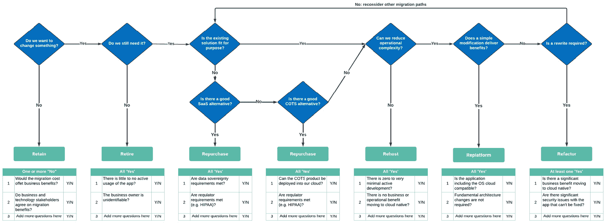

# 2

# 不明确的目标和策略的代价

每个运作良好的组织都有**商业策略**。我们从第一天起就需要它。如果我们经营的是一家初创公司，我们需要它来获得融资；如果我们经营的是一家成熟的公司，我们会知道它对于设定愿景和目标、并让员工能够遵循是必不可少的。战略是显而易见的常识。那么，为什么我们会有这么多围绕战略方面的**反模式**呢？公平地说，这是一个快速变化的世界：创新周期非常快。我们需要确保更新我们的架构，以便能够在其他技术之上构建，进而增加商业价值。

这意味着我们需要为持续变化和技术采用创建一种组织思维方式。消费市场竞争激烈。二十年前，我们的应用程序季度发布或月度发布就足够了。而现在，我们需要持续的增量变化。监管框架要求更加严格，网络安全漏洞的数量也在增加。由于外部因素的变化，我们需要准备好迎接持续的内部变化。

“*生活中唯一不变的就是变化*”是希腊哲学家赫拉克利特的名言。从某种程度上来说，这与人类的天性相违背。但我们需要准备好迎接持续的变化和持续的改进。因此，我们需要指导，了解哪些类型和规模的变化能使我们的组织受益。这就是为什么我们需要策略的原因。我们不仅需要策略，而且需要一个与时俱进、涵盖所有相关问题的策略。

在本章中，我们将讨论战略性挑战，以及如果我们不解决这些挑战，将会产生的重大后果。以下是本章中讨论的常见战略性挑战：

+   缺乏明确的目标和策略

+   缺乏迁移策略

+   外包云知识和治理

+   缺乏合作伙伴策略

+   我们的云采用框架中的差距

我们现在已经清楚地了解了本章的学习目标。让我们从本书中的第一个反模式开始，找出它们为什么会使组织面临风险，然后看看如何将这些反模式转变为最佳实践。

# 缺乏明确的目标和策略

“*我们需要做的是始终迎接未来；当世界在你周围变化时，当它对你不利时——曾经的顺风变成了逆风——你必须迎接这个挑战，并弄清楚该怎么做，因为抱怨不是一种策略*”是亚马逊首席执行官杰夫·贝索斯的名言。

一位能够将小书店发展成全球在线巨头、发布 Kindle 设备、将公司扩展为全球**云服务提供商**（**CSP**），并将焦点转向太空旅行的人，可能对战略及其重要性有着相当深刻的了解。不完整的战略将在我们云采用过程中拖我们后腿，我们将无法充分利用云计算的所有好处。因此，我们将涵盖以下内容：

+   常见的战略反模式

+   理解业务目标

+   确定技术目标和原则

+   确定我们的战略基础并利用护栏

接下来我们将开始讨论常见的战略反模式。

## 常见反模式

现在我们将通过两个常见的反模式，来探讨它们为什么会阻碍云采用的进程。

### 自下而上的战略陷阱

这种反模式的第一个变体始于**自下而上的云采用方法**，通常会带来一些快速的成功。数字化转型计划的利益相关者意识到，发布一个应用程序的交付时间应该更短。这些包括等待时间，例如，因为各种部门（包括法务、采购和税务）需要批准，或者供应商只能在几周后交付所需的硬件。然后，软件产品需要安装、配置、测试，并在资产登记簿中注册。接着，发起人请求一个**价值流图**，该图展示当前的流程和时间表，并与可行的方案进行对比。

事实证明，如果团队采用**云原生方法**，可以在一半的时间内交付产品。听起来不错，不是吗？特别是在看到快速成功并确信可以满足关键的上线截止日期时。但长期的运营考虑往往得不到足够的重视。组织内部的标准化几乎不会被考虑，因为实际的视角是该计划，可能是一个项目、产品或业务领域（多个项目的组合）的一部分。

缺乏标准化会影响文化方面，例如**DevSecOps**和技术。在这种情况下，我们可能会有与某个项目/产品或产品组合的业务对齐，但却没有全企业的对齐。这种不对齐会导致组织内部文化的不均衡，并且技术堆栈的不一致。只有在某个业务单元与其他业务单元没有协同作用时，这种情况才是可持续的。换句话说，该业务单元完全自给自足，无法利用其他业务单元的共同构建模块。然而，这种情况通常并不成立，它揭示了这种反模式的自下而上的变体。即使在这种情况下，**孤岛效应**仍然是一个真实的问题，因为它可能对协作、学习和生产力产生负面影响。

让我们来看看这个反模式的自上而下变体，它带来了不同的挑战。

### 自上而下的战略陷阱

技术领导团队研究后发现，像*poly-cloud*或*multi-cloud*这样的词听起来非常适合解锁云原生的所有好处，并减少**供应商锁定**。这两个词到底是什么意思呢？**Poly-cloud**旨在利用特定 CSP 的优势。例如，面向客户的 API 可能托管在**AWS**上，因为其可扩展性，**GCP**可能用于机器学习和人工智能，**Azure**可能用于身份验证和授权。

**多云**的主要驱动力是避免供应商锁定，云分割通常是由更广泛视角中的能力优势推动的。多云和混合云的采用会导致非常陡峭的学习曲线。常见的场景如下：

+   根据使用情况，可能意味着数据团队需要学习如何在多个云中管理数据。

+   如果数据在一个云中管理，而其他一切都在其他云中，那么网络团队需要具备所有相关云的技能，以便在云之间建立冗余连接。

我们可以想象，当涉及多个云服务提供商（CSP）时，操作模型变得多么复杂。一些基础性构造，例如**可用区**，在不同的 CSP 之间有所不同。即使是术语*Private Link*，AWS 和 Azure 使用的一个服务名称，也有很大不同。CSP 还会收取**数据出口费用**。如果我们在 Azure 上运行一个应用，而数据存储在 AWS 中，我们必须支付 AWS 的数据出口费用。这个场景的另一个常见副作用是，只实现**公共标准**以确保跨云平台的一致性，这会阻止我们充分利用 CSP 的特性。**自上而下的方法**虽然有好的初衷，但并没有充分考虑文化挑战、陡峭的学习曲线以及高程度的协作和变更管理要求。

在一次咨询服务中，我帮助一所大学建立其多云治理框架。他们希望采用 Azure 和 AWS 的多云方法。几天的现场工作后，我发现这是他们的第三次尝试。过去三年里，前两次尝试都失败了。而现在他们又尝试了同样的多云方法。一个月后，合作再次暂停。历史名言“*吃大象只有一种方法：一点一点地吃*”再次显示出它的相关性。在我们的情境中，这意味着，如果我们采取逐步推进的方式，朝着可以随着时间发展演变的目标架构迈进，成功的可能性更大。如果我们开始云原生的采用旅程，它需要一步一步地进行，这样我们才能积累势头，合理的云战略也应精确解决这一点。为了实现有影响力的云采用，我们需要清晰地了解我们的业务目标，并从那里继续前进。让我们讨论一下在此过程中需要考虑的事项。

## 理解业务目标和我们当前的状况。

我们如何从缺乏明确目标和战略，转变为拥有良好架构的云原生战略？我们将从讨论战略方面开始。

### 战略方面

我们需要一个强有力的业务战略，而云原生战略需要是这一战略的延伸。要实现良好的业务结果，理解这一点至关重要。我们常听说技术战略需要与业务战略保持一致，几乎所有企业都依赖技术。这就是为什么技术战略应该是业务战略的延伸。这种思维方式将自动确保一致性。这样，我们就能确保我们的技术决策能提供最佳的业务结果，无论这是否需要新的功能，或者改善我们的合规性。在我们启动战略改进计划时，首先需要了解我们今天所处的位置，以及我们想要达到的目标。就像我们的自上而下场景中一样，当我们仅仅知道我们想去的地方时，往往会设定不切实际的目标。我们怎么知道我们现在的位置，相对于周围的一切？在现实世界中，我们使用地图来找出我们的位置，并定位我们想去的地方，地图会引导我们到达那里。如今，这很可能是一个导航应用或系统，但结果是相同的。

### 知道我们现在的位置

**沃德利映射**，以西蒙·沃德利命名，是一种战略框架，能够通过视觉方式表示一个业务或系统的组成部分、其成熟度阶段以及其对用户的价值。它们有助于理解一个组织的环境，识别潜在的变化，并就资源投资做出明智的决策。在沃德利映射中，我们将价值链的各个组成部分进行定位。这些组成部分可能是一个数据存储库，也可能是与云无关的东西。

沃德利映射有两个维度：

+   垂直维度描述了**终端用户的可见性**，如客户或内部用户。

+   水平维度代表了**商品化的演化**，从*起源*到*定制构建*，再到*产品*和*商品*。

沃德利映射可能帮助我们识别出我们过度依赖定制构建的组件，而没有利用那些已经是产品或商品的功能，例如**FaaS**。现在我们知道了我们的业务战略是什么，以及我们当前的立场，我们更有能力理解我们的技术目标需要是什么，现在我们将讨论这个问题。

## 定义技术目标和原则

具备良好的云原生思维，我们希望在实现目标的同时，支持业务并提高效率。目标的典型驱动因素包括**业务敏捷性**、**市场上线时间**和**全球覆盖**。让我们来看看如何解决这些问题。

### 应对我们的目标

我们可以通过转向已有的商品化产品并集中精力在有特殊需求的定制构建上来实现这些目标。提高弹性是另一个常见的目标，这意味着我们必须为**容错**和**恢复**进行架构设计。增强安全性和合规性则需要将安全性和合规性融入我们的**向左移转方法**。在定义目标之后，我们需要获得利益相关者的支持，接下来我们将进一步探讨这个问题。

### 协作与认同

现在我们已经能够阐明目标，我们可以进行协作并记录它们。我们需要获得领导层的支持，以确保采取行动来实现我们的目标。与**首席信息官**（**CIO**）及其他领导团队成员建立紧密联系非常重要。我们必须建立信任，提供新方向的可见性，并确保领导团队理解我们的意图。战略必须支持我们的开发团队，同时也需要来自高层的支持。

### 利益相关者管理

组织层级越多，信息传递和消化的时间就越长。即使目标没有提供明确的指导，尽早沟通它们仍然很重要。这样，当人们接到关于下一阶段详细信息的指示时，就不会感到惊讶。如果我们陷入这种反模式，可能就无法建立一个有效的**实践社区**。在此期间，我们必须利用其他沟通与协作平台，如架构和工程立会。接下来，我们将定义原则，为利益相关者提供早期的可见性。

### 定义原则

定义整体战略需要时间，但在这个过程中我们不想让利益相关者感到茫然。否则，**技术债务**将继续积累。提供早期可见性的一个极好方式是阐明**云原生原则**。这些原则使组织能够建立具有弹性、可扩展、安全的架构，推动更快的创新，提高成本效益，并增强敏捷性。让我们来看几个主要的示例：

+   **CSP 选择**：这将阐明我们唯一的 CSP，或者在选择 A 还是 B 时提供明确的指导。一个例子是“*在这个业务领域管理的每个产品都使用 GCP，否则使用 AWS*。”稍后我们将讨论云平台选择框架。

+   **CI/CD 标准化阐述**：这样做是为了实例化云资源。对于通过 CSP API 创建的每个基础设施组件（如 API 网关），都使用 **Terraform**。

+   **GitHub Actions 使用**：将其用于所有与应用相关的操作，如部署新的无服务器函数（FaaS）。

+   **SaaS 使用**：优先使用 SaaS，其次是无服务器容器化服务，最后如果没有其他可行方案，则使用 **IaaS**。这可以包括内容管理系统或 CI/CD 平台。

一旦我们完成这一阶段，我们将确保继续进行利益相关者的参与，接下来我们将讨论这个话题。

### 继续进行利益相关者的参与

这份指南将帮助在不需要定制构建的情况下优先选择商品化产品，正如之前在沃德利映射（Wardley Mapping）中所述。在我们能够起草战略之前，继续推广指导原则并通过现有的治理论坛达成共识是有益的。论坛成员需要同意这些原则。接受这些原则将确保采取行动，并使后续的战略批准变得更加容易。现在，我们已经准备好定义我们的战略基础。

## 定义我们的战略基础

当我们着手定义或重新构建现有战略时，我们需要检查是否涵盖了与人员、流程和技术相关的各个方面。战略应从愿景开始，接下来我们将深入探讨：

+   **愿景**：需要明确谁是赞助人，我们将在战略中记录这一点。云平台负责人可以是云平台的赞助人，而产品负责人则负责产品开发。接下来，我们将已制定的指导原则添加到战略中。我们需要非常清楚我们的 CSP（云服务提供商）是谁。如果这不是一个指导原则，我们需要明确这一点。如果这一点没有清晰阐明，可能会引起混乱。我们希望避免针对单个工作负载做个别决策。那些细节对于扩展和提供一致的支持模型至关重要。

+   **人员**：一旦我们对当前的工具和目标状态有了清晰的认识，就可以确定团队需要哪些新技能，以便最大化工具的使用效果。由于 DevSecOps 也涉及文化的变革，我们需要确定哪些培训是必要的。团队成员是否已经精通**敏捷**方法，还是需要进一步的提升？课堂培训可能有帮助，但最好的实践经验来自于将敏捷教练嵌入到团队中。从跨职能团队的角度来看，DevSecOps 的采用也是一样。如果这是团队的新内容，增加 DevSecOps 顾问可以实现快速学习曲线。团队需要经历这种文化变革，才能理解它如何为团队提供最佳的效果。职位描述必须更新，并且需要咨询人力资源部门。这对组织来说是一次重大变革，变革管理人员将帮助推动组织转型。

+   **流程**：流程的重要性常常被低估。我见过很多案例，组织实施了工具，但由于流程不够成熟，未能将技术采纳转化为成功的案例。例如，如果我们部署了漏洞扫描工具，它将提供我们所需的可视性。然而，这并不意味着漏洞会被修复。需要有流程，例如自动化生成关键警报的工单以及升级程序。否则，其他事情将优先处理，而根本问题永远得不到解决。

+   **技术**：在这一阶段，我们还必须阐明核心技术栈，涉及**容器编排**、安全工具、CI/CD 和可观测性。工具必须与云原生愿景保持一致。传统的本地部署 CI/CD 工具在迁移到 DevSecOps 模型时可能成为负担，因为网络、操作、安全和合规管理的复杂性增加。例如，我们每次连接到新的构建代理时都需要更新本地防火墙规则，还需要修补实际的服务器和证书，此外，与 SaaS 解决方案相比，我们需要提供更多的合规证据。在探索新工具时，评估它是否能够开箱即用非常重要。如果我们迁移到新的工具，例如新的 CI/CD 工具链，我们还需要考虑**迁移策略**，这将在下一节中讨论。

为了减少破坏性变更的风险，我们需要防护措施，这是我们接下来要讨论的内容。

## 将防护措施添加到我们的战略中

我们需要考虑我们希望建立的**质量控制**。由于我们现在专注于战略，因此我们可以在*第五章*中详细讨论，*快速持续交付而不妥协安全性*，但全面覆盖是目前的重点，接下来我们将查看一些防护措施的例子。

### 在我们的软件开发生命周期（SDLC）中的防护措施示例

软件开发生命周期（SDLC）早期阶段的质量控制包括通过更新 CI/CD 平台代码库中的配置文件来创建代码库和流水线：

+   变更需要拉取请求的批准。

+   批准将触发一个**流水线运行**，验证新的代码库和流水线名称是否符合命名标准。

+   如果是这样，流水线将创建两个新资源：一个 Git 代码库和一个新的 CI/CD 流水线。

+   在开发阶段，其他的**防护措施**包括**代码扫描**、**代码格式检查**、**文档生成**和**最小权限**执行。

部署前防护措施的价值

防护措施可以在部署前验证**数据主权**、**加密**、**可靠性**以及各种治理、合规性和成本方面的要求。

一个流行的**政策即代码框架**是**开放策略代理（OPA）**。作为下一步，我们可以将所需的护栏映射到我们的 SDLC 中，以获得一个坚实的端到端视图。

### 跨 SDLC 的整体端到端视图

护栏可以在我们的 SDLC 各个阶段设置，以下图例展示了护栏映射可能的样子。

图 2.1 – 将护栏映射到我们的 SDLC

护栏还可以包括**成本优化控制**，例如预算警报、低利用率和资源调整警报，以及**异常检测**。

实施这些护栏可能需要数年时间，具体取决于可以分配的人力资源。因此，确定优先级和技术依赖关系至关重要。这将帮助我们明确路线图。为了可视化护栏领域的进展，我喜欢在每个框前加上一个小小的**Harvey ball**。Harvey ball 是一种圆形表意符号，表示成熟度水平，或者在我们的案例中，我们也可以用它们来展示进展。如果某个领域完成了 25%，它会从圆形的顶部到右边缘的 3 点钟方向进行着色。以下图示展示了不同进度阶段的例子：

图 2.2 – Harvey ball 示例

我们的战略中还有更多内容需要补充，接下来我们将进行探索。

## 增强我们的战略

“*没有战术的战略是通向胜利的最慢路线；没有战略的战术是失败前的噪音*，”《孙子兵法》作者**孙子**如是说。

这句话阐明了多维方法的需求。我们的战略必须包括对云原生计划的全面视图，涵盖 CI/CD，包括安全工具、可观察性和所有云原生能力。在我们为路线图定义时间线时，需要考虑我们组织的**成熟度水平**。如果我们已经完成了 Wardley Mapping 过程，我们将清楚地了解我们的现状，但我们还需要考虑我们的文化进程位置：

+   **更新频率**：由于路线图通常比战略更新得更频繁，因此路线图有时会单独维护在一个文档中。然而，它也可以是战略文档的一部分。云服务提供商（CSP）的功能和服务时刻在变化，我们的业务目标或监管要求也可能随时发生变化。因此，我们需要定期更新我们的战略。

+   **变更管理**：当我们继续推进我们的战略时，需要再次检查之前提到的变更管理和培训方面是否覆盖到位。对于技术方面，结合我们的 CSP 的*Well-Architected Framework*（良好架构框架）进行交叉检查将非常有帮助。我们还将在后续章节中讨论另一个框架——云采用框架。

+   **批准**：赞助人和管理机构必须批准战略。这可能是云部门负责人和架构社区。只有战略得到批准，才能追究责任，只有这样，人们才会遵循明确的指引。我见过许多组织只有草拟的战略。人们把草拟版更多看作是建议，而非指导方针。我们希望我们的云原生之旅能够支持业务，因此我们需要获得支持。

在经过一系列战略错误和最佳实践的探讨，明确我们的目标和战略后，我们已经准备好进入下一个战略环节：为成功的云迁移之旅做好准备。

# 缺乏迁移战略

我们在上一章讨论的一些常见误解导致了这一反模式，这些误解包括以下几点：

+   对云计算好处的困惑

+   低估技能差距

+   低估文化变革

+   缺乏标准化和服务目录

例如，缺乏**明确定义的云原生战略**也会促成这种反模式，特别是当我们认为迁移到云端自动减少运营成本时。在没有明确指导的情况下，我们无法知道迁移后的目标状态应该是什么。低估**技能差距**和**文化变革**也是常见的因素。另一个重要因素是缺乏**服务目录**。在探讨反模式后，我们将讨论一个适用于我们应用程序的迁移框架，如何启动业务案例，以及如何启动实施并取得进展。让我们从这个反模式的变体开始。

## 常见的反模式变体

让我们从三种常见的反模式变体开始，首先探讨云足迹自然增长的迷思。

### 自然增长云足迹

这一反模式开始于组织希望自然地扩展其云端存在。结果，没有迁移计划，这导致了**云端扩展缓慢**，通常仅限于新应用程序。一些现有的本地应用程序可能由于本地可扩展性问题而被扩展到混合云解决方案中。

一个典型的案例涉及到**内容分发网络**（**CDN**）、一个网络应用防火墙、一个 API 网关以及云中的队列。云原生组件可以处理峰值负载，而本地应用程序可以从队列中拉取数据。最初打算是临时的，但由于没有强烈的动力将其余部分迁移到云端，它很容易变成永久性解决方案。毕竟，团队成员从未积累过足够的迁移经验。这里的负担在于，**故障排除**变得更加复杂，因为错误可能出现在两边。对于**合规审计**的证据收集也是一样的。我们见过一些组织，虽然它们的云采用已经有 8 年历史，但只有 20%的工作负载在云端，剩下的依然在本地。绝大多数云应用是新应用。问题在于，单靠自然增长是不太可能获得势头的。

因此，我们将长期处理遗留应用程序，无法充分释放云原生堆栈的潜力。

### 缺乏迁移指导

这种反模式的另一个变体是没有迁移决策框架。如果没有一个指导我们选择迁移到哪个云平台的框架，我们就必须逐个案例做决策，这将耗时过长，而且决策也不一致。我们也不知道实际的迁移处理方案应当是什么样的。**处理方案**会描述我们需要采取哪些重构步骤，使应用程序更加适合云环境。没有这一框架的组织会逐个案例做决策，这会带来几个问题。由于**缺乏标准化**，决策将不一致，这将增加操作复杂性。决策过程将更长，因为它没有标准化。迁移过程将更长，因为每次迁移处理方式不同。这对应用团队来说是一个巨大的负担。由于所有的缺点，迁移将被认为是痛苦且消耗精力的。这将降低迁移更多应用的意愿。最终结果与这种反模式的前一种变体一样：我们无法充分利用云原生的所有优势，因为我们在本地遗留环境中停留的时间太长。这也意味着我们仍然需要继续进行数据中心更新计划。一旦硬件更新，我们就已经花费了本可以用于迁移的相当多的资金。

我们可以看到这变成了一段冗长的故事，似乎没有尽头。那么我们该如何解决这个问题呢？我们如何制定一个结构化的迁移策略，帮助我们标准化迁移，降低学习曲线，加快迁移进度，并交付支持业务敏捷性的强大云原生解决方案？我们已经看到，缓慢的有机方法并不能帮助我们获得动力。只有当我们获得了动力后，才能加速云迁移，提升迁移效率，改进应用程序的运营效率和业务敏捷性。现在是时候探索一个框架，帮助我们实现可重复的成果并获得动力了。

### 缺少服务目录

服务目录包含可以自助部署的蓝图。服务目录提供可重用的构建模块。没有服务目录，我们的迁移将是不一致且缓慢的。我们需要为我们的服务目录项设定优先级，确保高影响项优先实施。我们还需要确保我们正确地解决了需求，包括非功能性需求。否则，当我们开始加速迁移时，会遇到问题。

服务目录项的一个例子是**发布和订阅模式**。这个服务目录项可以在 CI/CD 管道中被引用。然后，它将创建一个队列和通知结构， optionally 还可以带有**死信队列**（**DLQ**）。可以通过输入参数来启用 DLQ。主要的 CSPs 提供了它们的本地服务目录产品。SaaS CI/CD 解决方案，如 Terraform Cloud，也提供这种服务。

服务目录的优势在于它们促进标准化，并且可以有可靠性和安全性的默认配置。在迁移过程中，它们显著加速迁移，并帮助我们标准化迁移方法，简化操作方面。

服务目录还提供以下几个优势：

+   它们可以显著加速本地到云的迁移，因为构建模块可以被重用。

+   它们促进标准化，并且可以内置可靠性和安全性默认配置。

+   它们通过标准化帮助减少操作复杂性，从而带来环境间的一致性。

为了避免迁移的反模式，我们需要一个框架来指导我们的迁移旅程，接下来我们将探讨这个框架。

## 一个框架来引导我们的迁移旅程

我们需要一个强大的框架，帮助我们做出决策并通过标准化的处理方式来获得进展。2010 年，Gartner 发布了使用*R 模型进行云迁移策略*的概念。该模型提供了一个框架，用于根据应用程序的迁移适应性对其进行分类。Gartner 的框架包含了 5 个 R。AWS 发布了一个包含 6 个 R 的框架，后来又发布了包含 7 个 R 的更新版本，这个模型被称为*云迁移的 7 个 R*。这现在已经成为云迁移的事实标准框架。微软随后在他们的云采用框架中采用了非常相似的框架，术语也非常相似。GCP 使用了不同的分组方式。在本书的剩余部分，我们将遵循 AWS 和 Azure 的术语。我们将按照常见的优先顺序逐步介绍这些变化，优先级最高的是第一个：

+   **重构**：意味着重新架构应用程序，以充分发挥其云原生潜力。这是改善弹性、可扩展性、性能和操作复杂性的最大潜力所在。重构需要更多的时间和精力，但可以带来长期的投资回报。

+   **重新平台化**：意味着在迁移过程中对应用程序进行轻微修改。也称为*提升、迁移并调整*。这些轻微的修改可能是操作系统升级，或者将数据库迁移到云原生的托管数据库服务中，如**AWS RDS**、**Azure SQL**或**GCP Cloud SQL**。CSP 提供了针对这一目的的数据库迁移服务。这减少了操作复杂性，有可能降低运行成本并提高弹性。

+   **重新采购**：也称为*购买并替换*，即将现有的本地应用程序替换为**现成的商业产品**（**COTS**）解决方案，通常是 SaaS 产品。值得比较供应商网站提供的解决方案与 CSP 市场中的产品。有时，许可模型会有所不同。

+   **重新托管**：指的是将应用程序从本地云原生虚拟机迁移到云平台，如**AWS EC2**、**Azure VMs**或**Google GCE**。在这种迁移路径中，使用的是 CSP 的虚拟化管理程序。该路径通常被称为*提升与迁移*，比*重新定位*策略更接近云原生解决方案。CSP 提供迁移服务，帮助完成这种类型的迁移，包括**AWS 服务器迁移服务**、**Azure 迁移**和**GCP 计算引擎迁移**。

+   **重新定位**：指的是将应用程序迁移到云端，但不进行架构变更，使用与本地相同的虚拟化管理程序。**VMWare**与主要 CSP 建立了合作关系，以简化这种类型的迁移。当目标是快速迁移时，例如因为数据中心退出策略，通常会使用*重新定位*策略。

+   **保留**：这意味着应用程序不会被迁移。这也被称为*不做任何操作*的决策。当现在进行迁移太困难，或者应用程序有既定的停用日期且不需要新功能时，通常会选择这种方式。一个例子是传统的抵押贷款系统，因为抵押贷款合同有很长的运行时间。任何新的抵押贷款申请将由更新的应用程序来管理。

+   **退役**：这指的是系统的停用。通常发生在执行小任务的小型定制遗留系统中。停用通常发生在迁移工作接近尾声时，因为功能可以被其他应用程序吸收。这是云迁移计划中使应用程序变得过时的目标状态。

以下图表概述了 7 个 R 策略：

图 2.3 – 7 个 R 策略

(来源: [`aws.amazon.com/blogs/enterprise-strategy/new-possibilities-seven-strategies-to-accelerate-your-application-migration-to-aws/`](https://aws.amazon.com/blogs/enterprise-strategy/new-possibilities-seven-strategies-to-accelerate-your-application-migration-to-aws/))

该图表总结了框架，并为迁移选项的导航提供了良好的指导。框架为我们的目标状态提供了可重复的指导。现在，我们需要对迁移候选者进行分类，开始制定业务案例，这将是我们的下一步。

## 转向业务案例

接下来，我们将探讨如何根据我们组织的需求创建一个 7R 决策树，但首先，我们需要开始构建一个**迁移初步方案**。这是迁移计划的初步简化草案，列出了应用程序清单、业务目标的时间表以及 7 个 R。

现在，我们将探讨一些初步方案的方面，首先从创建开始：

+   **创建初步方案**：初步方案的创建通常是在一天的工作坊中进行的。如果是现场工作坊，可以使用白板绘制一个时间表，表示业务目标，并用不同颜色的七个便签标记。我们可以通过应用程序清单，将应用程序名称写在便签上，并根据最适合的迁移路径将其贴在相应的彩色便签旁边。当然，这也可以通过虚拟白板工具，如**Miro**或**Mural**，来完成。

+   **目的**：初步方案的目的是建立一个可以后续审查和完善的基本结构。它还将帮助尽早识别挑战，并为详细且全面的迁移计划奠定基础。

+   **时间表和资源**：在这一阶段，我们可以定义高层次的时间表和迁移路径所需的资源。这些时间表和资源不会非常准确，但它们将帮助引导关于优先级的讨论，以及应该优先选择哪一个 7R 策略。

+   **成本效益**：我们还需要查看通过减少本地数据中心占用空间而节省的成本。这些数字通常已经在预算中，因此是已知的。

+   **其他好处**：示意图将成为我们迁移商业案例的重要输入。由于我们有了高层次的工作量估算，我们可以量化 **迁移成本**。我们还将量化商业利益，例如 **提高业务敏捷性**、**提升韧性** 和 **减少** **技术债务**。

+   **商业案例**：获得批准的商业案例对于获得动力至关重要。这是许多组织失败的关键点。因为迁移没有预算，他们就陷入了 *缺乏迁移* *策略* 的反模式。

我们将快速进入下一步骤，因为我们将在 *第十二章* 中逐步了解迁移细节。下一个目标是加速我们的迁移进程，接下来我们将讨论如何实现这一目标。

## 启动实施并获得动力

我们将启动 **迁移加速计划**，从资金请求开始：

+   **资金**：我们的 CSP 可以帮助我们确定一个咨询公司来实现这一目标。我们的 CSP 可以通过其倡议提供资金或信用点：AWS **迁移加速计划** (**MAP**)、**Azure 迁移与现代化计划** (**AAMP**)、以及 GCP **快速迁移与现代化计划** (**RaMP**)。

+   **准备性评估**：下一步是 **迁移准备评估**，它分析我们当前的云环境是否为迁移计划做好准备，并指出其中的差距。评估内容包括运营模型、着陆区的成熟度以及其他通常在 **云采纳框架** (**CAF**) 中定义的因素，我们将在后续部分进行讨论。

+   **迁移规划**：在实际迁移开始之前，必须进行迁移规划。我们看到的一个有效方法是通过选择四到五个我们首先要迁移的应用程序来实施概念验证。它们应该有不同的迁移路径；例如，一个 *重新托管*，两个 *重新平台*，以及一个 *重构* 候选。应用程序必须足够复杂，以验证我们的迁移方法和工具集。

+   **概念验证**：概念验证有助于阐明我们的处理计划，这是 7 Rs 的扩展部分。它还将为我们组织的背景提供支持。我们不应单独开始这一旅程。我们应该得到曾经做过此类工作的咨询公司的支持。咨询人员必须融入我们的团队中，以确保知识传递有效。

+   **治疗计划**：治疗计划将成为我们迁移战略的一个宝贵扩展，并作为一个反馈回路来验证战略是否与我们在这一过程中获得的更详细发现保持一致。如果我们的组织有多云或混合云战略，它还将阐明**云部署决策**。治疗计划中还能看到什么？通常我们会有指导性问题，涵盖所需的业务收益，例如提高业务敏捷性。

+   **简化治疗计划示例**：以下插图展示了一个非常简化的视图，但它向我们展示了**指导性建议**如何发挥作用。请注意，迁移路径类型的顺序并不反映我们的优先级，而是最适合于排除选项。我们也没有考虑*迁移*选项，因为该选项主要与数据中心退出策略相关。

图 2.4 – 治疗计划示例

上述图表展示了一个简化版本，可以根据我们的组织需求轻松调整。

+   **组织背景**：治疗计划会因组织的不同而有所差异，因为它涉及公司的背景、业务战略和云原生战略。一旦我们决定了迁移路径，我们必须识别出所需的变更领域：**数据存储与数据库**、**应用重构**以及**CI/CD 变更**。

+   **量化变更**：下一步，我们可以量化变更。通过回顾治疗计划并结合所获得的洞见，我们可以重新测试决策。如果有认证的 CSP 合作伙伴协助我们，这一过程将更加顺畅，因为他们已经多次做过此类工作。

每个咨询公司会有不同版本的框架，并使用不同的工具来捕捉所有的发现。这并不重要。关键成功因素是拥有指导性建议和可重复的迁移路径决策方法。这将有助于制定出有效的迁移战略。我们将在*第十二章*中讨论迁移工厂和工具。我们已经足够准备开始迁移战略，并利用治疗计划建立反馈回路。

如果我们为迁移加速或其他云原生举措寻求外部帮助，我们需要在组织内部具备足够的知识，以便能够治理这些举措，我们将在下一节探讨这一点。

# 云知识与治理外包

组织可能需要几年时间才能意识到自己陷入这种反模式，因为在我们讨论云原生时，很多内容都属于知识的范畴。在我们深入讨论这种反模式如何开始以及它的影响之前，先详细阐述一下我们对云知识的理解。

## 治理云原生举措需要什么？

云原生项目可能非常复杂，并且对企业的成功至关重要。因此，我们需要一个完善的治理方法，现在我们将探讨这个问题。

### 人员和组织方面

从文化和软技能的角度来看，我们需要理解 DevSecOps 实践，正如我们在*第一章*中讨论的那样。我们需要了解我们组织中的变更管理流程。我们需要知道使用哪些沟通渠道来进行**有效沟通**和**协作**，以及如何使用我们的协作工具进行文档编制和团队合作。

我们需要理解**业务驱动因素**及如何支持它们，并阐明我们的云原生战略。这包括**业务敏捷性**或**韧性**等方面的要求。我们必须了解我们的利益相关者，如何与他们互动，以及如何管理关系和期望。这包括我们的业务伙伴，如 SaaS 供应商和 CSP。理解治理框架、如何平衡集中和分散的治理、所需的治理控制以及如何建立成熟的治理和合规自动化也至关重要。在这一部分，我们将按以下顺序逐一探讨这些方面：

+   管理云原生项目所需的条件

+   外包的驱动因素

+   常见的反模式

+   这些反模式的指示器

### 技术方面

从技术角度来看，我们需要了解我们的云服务提供商（CSP）提供的服务以及最佳实践，如何将它们结合并编排。还需要了解良好架构框架，并知道如何在战略上以及针对单个项目应用它。还至关重要的是，了解如何定义与**最佳实践**和**业务目标**对齐的**可重用架构构建块**，并将它们转化为我们服务目录中的**可重用工件**。

我们需要跟进新的云原生发展，确保不会被旧技术所困，正如我们之前在分析沃德利图（Wardley maps）时所讨论的那样。我们需要验证我们的**CI/CD 工具链**是否满足需求，并了解如何利用工具链建立一致的架构。理解网络概念以及如何将应用程序连接到业务伙伴、公共互联网、内部部署，甚至可能的其他云服务提供商（CSP）是至关重要的。我们还需要了解**部署最佳实践**，如蓝绿部署，以决定所需的部署架构。当然，我们还需要理解**数据最佳实践**、**微服务**、**容器技术**、**成本管理**等多个方面。我们还必须理清业务和技术的依赖关系，以制定发展路线图。

### 运维方面

我们需要操作知识，以理解**日志记录**、**监控**和**警报**的最佳实践，以及如何利用我们的可观察性工具并在需要的地方建立**集中式日志记录**，例如安全或审计日志。操作知识包括**管理可扩展性**、**优化高可用性性能**、**优化云资源利用**、**云成本管理**和**FinOps 最佳实践**。还需要了解安全和合规性，以实施正确的控制措施。这些措施包括数据和网络流量分段、加密、网络安全控制等。我们需要知道如何评估权衡，例如安全性与成本之间的关系。

这不是实现我们战略所需知识的详尽列表。然而，它为理解所需知识的内容和为什么云原生知识对组织至关重要提供了一个良好的起点。

## 外包驱动因素

永无止境的学习是一个大挑战。它是一些组织试图避免的挑战。外包一个问题听起来很诱人，而且这种决策有多个驱动因素。有时候，决策是在没有完全理解问题空间的情况下做出的。以下是一些典型情况：

+   技术不是我们的核心业务。为什么我们要处理所有这些复杂性呢？让我们把它外包出去。良好的合同和供应商管理实践将解决问题。

+   我们希望精简的团队能够根据需求随时扩展或缩减，以应对高峰季节或突发的市场反应。当我们拥有临时外部资源时，比如来自业务合作伙伴的顾问或自由职业者，我们可以更容易地做到这一点。自由职业者是独立承包商。

+   招募高技能的技术人才非常耗时。如果我们与一家大型咨询公司签订合同，他们会为我们提供市场上最优秀的人才。

+   我们希望减少行政管理负担。如果我们有更少的正式员工和更多的自由职业者或顾问，我们就不需要管理培训计划、绩效评审或假期批准。

两种外包场景（自由职业者和咨询公司）有很多相似之处。我们现在将探讨这种反模式如何在现实中展开。

## 常见反模式

本节将介绍一些常见的战略反模式，这些反模式正在制约组织的发展。

### 知识外包给自由职业者

我曾为一家政府机构做自由职业者，在信息和技术部门中，超过 75%的人都是自由职业者。每个独立承包商都带来了他们自己的经验、知识文档、偏爱的编程语言、编码风格、库、工具和设计模式。不知不觉中，他们甚至可能有自己喜爱的反模式，并一直在使用。

成为自由职业者的动力通常是独立性和更高的报酬，具体取决于就业市场。下一次选举对政府组织产生了间接影响。已经在那里的自由职业者合同超过三年的无法续签。新承包商被引入，他们面前有一大堆工具、框架和编码实践。问题是他们无法挑选和选择，必须全部消化。因此，学习曲线陡峭，存在许多未知因素。这增加了新团队成员变得富有生产力所需的时间，并且由于这些未知因素，也带来了额外的风险。只有通过分配时间和预算来进行修复计划，才能解决这一情况。

### 知识外包给咨询公司

另一次，我受雇于一家咨询公司，该公司与一家银行有云计算/DevOps 相关的项目。客户有许多不同的咨询公司参与其中。业务部门可以决定选择哪家咨询公司。专注于软件工程和 API 的第三方被分配给一个业务单元，另一个则被分配给另一个，另外还有专门从事 AWS 和 Azure 的咨询公司。有些咨询公司已经在那里多年，他们的技术框架在长期合作中发生了变化。许多咨询公司参与其中，再加上不断变化的技术栈和模式，显而易见，这个系统包含了许多动态因素。显然，缺乏统一的治理结构。CI/CD 工具链和应用程序变得无法管理。当然，咨询公司也需要轮换员工，因为顾问的一个个人驱动力是频繁接受新的挑战，而不是陷入一成不变的环境中。这一点需要在项目计划中考虑，因为需要为交接工作分配额外的时间。一家全球大型咨询公司也引入了许多初级顾问，以最大化其利润，而资深顾问并未挑战质量问题。

如果我们最终遇到这些类型的反模式，不仅框架和技术会不一致，质量、自动化水平、可观察性粒度、日志语句、部署架构、恢复程序等也会存在不一致。因此，组织将会陷入瘫痪，无法迅速应对市场变化。理解这一点至关重要：顾问和自由职业者应该被视为加速器，而非内部知识的替代品。那么，我们如何识别这些反模式，确保采取正确的措施呢？接下来我们将通过研究指示器来找出答案。

## 反模式指示器

### 文化指示器

这些是表明知识外包存在问题的文化观察例子：

+   **上手时间**：新加入的员工需要花费不合理的时间才能变得高效并理解工作环境。如果即使是资深开发者或工程师也需要超过三个月才能跟上进度，这通常是一个强烈的信号，表明 CI/CD 环境可能是碎片化的或已经过时，或者工作流程和工作方式没有达到应有的敏捷性。在这种情况下，询问新员工他们遇到的挑战并收集结构化反馈是一个好主意。我们还可以聘请第三方评估当前的 CI/CD 和云环境，并提出建议和优先级。

+   **资源瓶颈**：如果最了解情况的人缺席，项目将受到影响。这通常表明知识没有在组织内得到共享，这是一个重大风险，尤其是在那个人离开组织或需要临时请假的时候。配对编程、影子学习和反向影子学习可以弥补知识差距。我们还需要有一个明确的准备定义，这意味着需求已经准备好开始设计，或者设计已经准备好实施。这将取决于团队内部的定义。

+   **外包所有工作**：越来越明显的是，大多数云项目需要外包。这可能是由于内部资源的限制，或缺乏内部的技能和经验。让我们更详细地探讨这个问题：

    +   **内部资源不足**：如果我们没有足够的资源，就必须验证是否为团队成员与外部合作伙伴合作分配了足够的时间。我们必须理解并影响决策，使之与我们的愿景、最佳实践和运营需求保持一致。否则，我们会遇到技术和框架泛滥的问题，团队也不会了解由咨询公司交付和部署到生产环境中的应用或产品。即使团队已经接受了云平台和 CI/CD 所需的培训，他们也无法深入了解已经交付和部署到生产环境中的内容。

    +   **技能缺乏**：如果内部团队因缺乏技能和经验而无法实施新的云项目，那显然需要更多的培训。我们不仅需要标准化的云和 CI/CD 学习，还需要结合实际情况的学习，了解如何在我们组织中应用这些知识。这可以通过团队扩展和与外部方合作来实现。知识转移必须在**工作声明**（**SoW**）中说明，并且需要在咨询过程中定期验证。

+   **DevSecOps 文化**：知识差距的另一个明显信号是缺乏 DevSecOps 文化或 CI/CD 流程中的手动步骤。我们之前提到过 DevSecOps 文化，我们可以通过团队扩充来改进或建立这种文化。CI/CD 流程中缺乏自动化并依赖手动步骤的主要原因是知识不足，或者是由于紧迫的截止日期而忽视了质量。两者都是组织面临的风险，需要通过分配足够的时间来解决问题，并确保团队拥有所需的知识，或者能够通过之前提到的学习方法获得这些知识。

如我们所见，这类问题的根本原因通常是缺乏培训和经验，无法建立有效的治理程序。但还有其他领域也表明存在问题，我们现在来看看这些领域。

### 我们文档和系统中的指标

以下指标可以在现有的文档中找到，包括合同和我们使用的系统中：

+   **外包合同缺乏基本信息**：在合作开始之前，双方通常会签署一份合同，通常称为 SoW（工作范围声明）。如果 SoW 中没有提到内部的 CI/CD 实践，如代码扫描、分支模型、CI/CD 工作流、编码风格指南和可观察性标准，那么这应该引起警觉。如果这些标准和框架已经到位，必须在 SoW 中有所提及。否则，结果将无法达到我们的预期，我们将面临技术债务、治理挑战、维护复杂性和可避免的操作复杂性。如果我们没有这些标准，是时候立即采取行动了。如果内部团队成员无法清晰阐述这些标准，那么与我们可信赖的云咨询公司下一次的合作应当是建立或完善这些标准。这一合作需要技术和业务团队的全力支持。这是一个很强的信号，表明我们缺乏治理云原生项目的知识。这意味着治理发生在组织外部。这注定会导致失败，因为这种方式无法满足我们组织的需求和战略方向。我们需要将这项标准化工作作为优先事项。更重要的是，我们需要有一个能够与咨询公司紧密合作、学习最佳实践的人，同时还需要进行一些理论教育，如课堂或在线课程。

+   **分析培训预算和技能认证**：数字不会撒谎。如果没有专门的培训预算来支持持续学习，我们的团队成员无法报销培训或会议费用，除非我们使用一些创意会计技巧。有些团队成员可能愿意自己承担这些费用。从公司角度来看，为此预算并支付这些费用是公平的。否则，我们的公司如何期望跟上技术领域创新的快速步伐，而不支持员工保持与时俱进的知识呢？最终，我们将实现更好的公司成果。我们需要制定一个与团队结构的经验水平相一致的培训计划。

+   **云原生技能未体现在职位描述中**：如果职位描述中没有明确要求的经验水平，或者无法量化，那么我们需要为每个经验水平制定一个技能矩阵。然后，我们可以进行差距分析，看看哪些领域需要改进。这将有助于查找我们需要的培训内容以及其费用。培训计划中需要涵盖以下几个领域：DevSecOps 和敏捷、信息安全、CI/CD、治理和技术，包括开发、运维和可观察性。将这些数字纳入下一个预算非常重要。如果当前财政年度的预算可以重新分配，那我们已经处于一个更有利的位置，因为我们已经制定了培训计划，分析了差距，并评估了收益。

+   **过度授权的用户权限**：另一个表明我们正在走向这一反模式的方式是验证我们身份和访问管理角色中的人工权限。如果没有人具备验证这些权限的技能，那应该引起警觉。如果我们发现人工拥有一些在成熟的 DevSecOps 文化中不应该需要的权限，那这就是迫切需要培训的强烈信号。如果人工需要写权限来修改数据库模式或将数据导入数据库，可能有两种原因：要么这些权限不必要，要么我们没有遵循最小权限最佳实践。更可能的情况是，我们的团队没有遵循 DevSecOps 最佳实践。在这种情况下，我们必须分配时间来建立这些能力。以我们的示例为例，我们将需要阐明数据导入模式，说明工具如何帮助导入数据。如果团队在这一领域没有经验，这将突出显示另一个培训需求。到现在为止，我们知道学习包括课程中提供的普遍知识，并与那些之前做过的人进行配对学习。

与文化指标类别类似，我们可以看到缺乏培训和经验正在导致问题，稍后我们将解释这如何影响操作和交付。现在我们已经很好地理解了如何在文档和系统中识别指标，我们将继续探讨运营和交付指标。

### 运营和交付指标

在我们运营应用程序或希望实施更改或新特性时，以下指标变得非常明显：

+   **每一个小的变化都需要不合理的时间**：这表明由于治理缺口导致了技术和框架的蔓延。这些缺口可能是因为缺乏足够的知识来治理技术和流程决策。我们必须提升团队的技能，以便有效治理项目、评审结果并提出建议。

+   **没有长期解决方案来应对故障**：虽然出现了故障，团队能够迅速修复，但却不知道如何从战略上改善这种情况。这表明缺乏可观察性，并可能是技术更新滞后的表现。这些问题可能是由于时间压力、缺乏可观察性经验或工具造成的。这需要进行根本原因分析，以确定需要采取的措施。

+   **建议工具中的重大问题**：一个建议扫描工具，如**云原生应用保护平台**（**CNAPP**），发现了许多问题。这些问题包括未加密存储、未连接的磁盘卷、低利用率实例、缺失的访问日志、可靠性差距和超过一年的未旋转密钥。这表明我们可能是由于时间限制而被动操作，或者我们没有采用最佳实践。第一种情况可能意味着我们没有成熟的风险管理流程和责任定义，例如缺少操作模型和 RACI（负责、账户、咨询、告知）矩阵，以明确职责、责任和需要咨询或告知的人。第二种可能的原因是缺乏最佳实践的采用，这也是培训需求的另一个迹象，团队需要有时间来实施这些最佳实践。通常，这两种原因往往是共同存在的。

我们已经探讨了内部指标、它们引发的问题以及如何解决这些问题。根据公司规模、蔓延程度和复杂性，恢复这些问题可能需要很长时间。持续关注这些指标非常重要。但也有一些外部指标可以揭示这种反模式，接下来我们将讨论这些外部指标。

### 外部指标

以下信号可能由第三方提供：

+   **审计中发现重大问题**：审计发现了许多需要修复的问题，包括最小权限方法漏洞和容器及虚拟机中的漏洞。根本原因与建议工具（例如 CNAPP 解决方案）发现的问题类似。

+   **过度依赖渗透测试**：渗透测试包括一些本可以通过成熟的 DevSecOps 文化避免的问题，比如过时的镜像、缺乏网络安全控制或已安装的恶意软件，因为我们暴露于供应链攻击中。这表明我们在 DevSecOps 文化和 CI/CD 工具链中没有解决诸如漏洞扫描等实践。通常这不是技术问题，因为大多数 CSP 都提供该服务。这很可能表明需要更多的 DevSecOps 技能提升。

+   **合作伙伴反馈**：CSP 或软件供应商提供的反馈是，我们没有充分或正确地使用工具。我们需要与第三方建立功能性关系，以便他们能诚实地提供反馈。CSP 的反馈可能是，如果我们有无服务器策略，我们的虚拟机使用量需要减少。这可能表明我们的无服务器策略没有得到充分传达，或者我们的团队不知道如何编写无服务器应用程序，更愿意按照传统方式在虚拟机上运行应用程序。如果我们有承诺支出并且工具严重低使用率，供应商可能会提供反馈。我之前的一位客户有一个针对安全和合规性的 SaaS 产品的承诺支出，但他们只利用了 10% 的许可量。原因是只有那些发起购买的人知道如何使用工具，但他们在购买后不久就离开了。幸运的是，供应商主动联系了我们，我们能够举办一些培训课程。这有助于工具的快速上手，并为合规和安全的当前成熟度水平创造了可见性。

### 学到的教训

从 CSP 或软件供应商的反馈中学到的教训是什么？他们通常会提供培训，而我们需要确保充分利用这些培训。只有这样，我们才能保证从购买中获得良好的价值。如果该产品是我们的战略选择，我们需要确保建立良好的关系。这将确保我们获得诚实的反馈，并且能够得到我们可能有的问题的答案。在下一部分中，我们将更详细地讨论这个问题，探索合作伙伴战略。

# 缺乏合作伙伴战略

“*伙伴关系不是两个平等个体之间的法律契约，而是两个致力于彼此成功的人的情感联盟*”是沃伦·巴菲特的名言。我们在日常生活中依赖伙伴关系，例如与工作同事、朋友、配偶和其他人。组织层面上，伙伴关系同样具有重要意义。我们希望避免凭直觉做出伙伴选择，而是依靠逻辑和战略思维来决策。无论我们在哪个市场运营，都必然会面临竞争，我们希望走在行业前沿。我们无法独自实现所有目标。让我们来看看一些反模式，这些反模式可能会降低伙伴关系的价值，给我们的组织带来负担，并阻碍我们的进步。

我们将探讨两种反模式，一种是针对专业服务，另一种是针对技术合作伙伴。我们将识别出一些指标、合作伙伴选择的考虑因素，以及如何改善与我们的 CSP（云服务提供商）之间的合作关系。让我们从反模式开始。

## 常见的反模式

### 由于恐慌驱动的合作伙伴选择

在我之前的一个职位中，我为一个云平台团队规模非常小的组织工作，考虑到他们对云原生的雄心。为了区分咨询公司与客户，我们将其称为“客户”。客户非常依赖一家云咨询公司。这家本地咨询公司员工不到 500 人，只在亚太地区的小范围内运营。它们的顾问技术水平高，拥有丰富的云原生知识，并通过 Meetup 讲座、会议演讲和博客文章向社区做出贡献。他们获得了多个 AWS 合作伙伴奖项，展现出了真正的奉献精神。该公司能够在几乎无需指导的情况下运作，工作效率高，实施最佳实践，始终愿意进行知识转移或以团队增强的方式开展工作。这家小型云咨询公司文化契合度极高，能够理解客户的商业目标，同时拥有所有所需的技术专长。

后来，客户在一年内发生了两次本地服务中断。由于违反服务水平协议，他们不得不为这些中断支付罚款。此外，这些中断还引起了媒体的关注，进一步加大了压力。

只有 25%的应用程序在云端运行，其余的大多数都托管在本地。领导团队引入了一家全球知名的咨询公司，调查整个组织的韧性问题。该国际公司以其在流程设计和管理咨询方面的专业知识而闻名。国际咨询公司首先进行了本地分析并提出了设计建议。不幸的是，一旦这家全球咨询公司开始进行云端发现工作坊，本地云咨询的预算就被重新分配了。这家大型咨询公司尝试重复使用之前为客户规模比当前大 20 到 50 倍的企业所用的幻灯片。这些幻灯片过于通用，并没有针对客户的具体情况。在与新合作伙伴进行的第一次云端工作坊中，显然他们的云端经验无法满足预期。这些经验差距非常大。他们的大多数顾问都专注于本地环境。那些有些云端经验的人只是一些刚毕业的员工，他们几乎没有时间从错误和反模式中学习。

发现阶段后产生的建议幻灯片并没有反映现实。所选语言含糊不清。咨询公司没有理解当前的自动化和合规性差距，这在回顾会议中变得十分明显。当我们（客户）试图澄清误解时，我们意识到咨询公司根本不了解云原生的基本概念。我们一致认为，云端团队需要更早地参与审查过程，以提高质量。咨询公司随后引入了更多顾问来收集详细需求，并进入了后续的工作阶段。

我们进行了一些审查会议，会议中有 2 名来自云端团队的成员和 12 名来自咨询公司的成员。咨询公司提供的设计文档缺少大多数合规性和安全性要求。过了一段时间，客户云端团队的一些成员花费了 50%的时间进行审查和反馈。与之前的战略云咨询公司相比，咨询公司的心态有很大不同。他们的行为较为被动，主要的驱动力是将 Jira 板上的任务从“进行中”移动到“完成”状态。质量低到无法提供价值，云端团队花了更多时间协助顾问，帮助他们将质量提升到可接受的水平。6 个月后，只有 25%的预定范围得以交付。这是一次令人疲惫的经历，且对团队成员的士气产生了负面影响。如果我们选择了合适的供应商来解决适当的问题领域，这种反模式是可以避免的。选择合适的合作伙伴需要一些规划和数据点的收集，以查看如何随着时间的推移提高工作速度。但如果我们做出反应式的决策，这些事情就无法发生。

### 一失足成千古恨

另一个常见的*缺乏合作伙伴关系*反模式是处于被动模式，而非主动模式。这通常发生在我们没有云迁移策略并且希望通过自然增长来扩展云服务时。因此，我们无法获得足够的动力。迁移进程将会很慢，就像我们在*缺乏迁移策略*反模式中所讨论的那样。因此，我们不会在战略关系上投入足够的时间和预算。当这种情况发生时，我们可能已完成所有必要的许可证协议，但我们不一定正确使用这些工具和平台。我们可能也没有专注于在组织内建立足够的云原生知识。我们没有与合作伙伴定期进行协作。我们会错失团队能够获得的培训机会。同时，我们也不会得到有价值的反馈，或者利用合作伙伴进行审查。这些都将限制我们的进步。让我们总结一下战略合作伙伴关系的好处，以确保我们能够充分利用它们。

## 战略合作伙伴关系的价值

合作伙伴关系是互惠的关系。合作伙伴希望帮助我们，因为他们也希望有一个成功的客户故事。如果我们没有建立强大的战略合作伙伴关系，我们会错失什么？

+   合作伙伴可以帮助我们制定培训计划、开展培训课程和搭建实验环境，使我们的团队成员能够跟随讲师进行更多的实践体验。通过一个良好的合作伙伴关系，我们可以充分利用这些好处。

+   如果我们与合作伙伴的关系不够紧密，他们将不会提供有价值的反馈来改进我们的工作方法并提高效率。合作伙伴已经看到过许多客户案例，亲眼见证了哪些做法失败，哪些有效。他们希望帮助我们，因为客户的成功也意味着他们有一个好的客户故事。

+   我们不会获得路线图的洞察，这对于避免积累技术债务并避免定制解决方案很有帮助，特别是当我们知道很快会有现成的功能推出时。

+   我们还将无法获得所需的支持。我们提问的响应时间将比理想的要慢，或者质量较低，因为更强的关系会得到更多的关注。

+   我们的创新进程不会像拥有一个能加速转型并确保我们使用最佳实践的合作伙伴那样快速。后者还可能影响安全性和可靠性。

+   其他改进的领域可能包括：合作伙伴的 SME（领域专家）能发现的成本效率问题，或者由于我们没有签订高级合作协议，支持响应时间较慢。AWS、Azure 和 GCP 的响应时间根据我们选择的支持级别有所不同。更高的支持级别也意味着更高的费用；我们必须评估其收益。

什么指标表明我们正在走向这种反模式，或者已经受其影响？我们接下来会讨论这些。

## 这个反模式的一般指标

### 无文档化的供应商入职

一种潜在的弱关系迹象是，如果供应商的入职从未被文档化，也没有经过正式的认可过程。这表明合作伙伴从未经过评估，以确保他们符合我们的法律和合规要求。我们可能对除购买的 SaaS 解决方案外，合作伙伴的整个服务提供内容一无所知。在这种情况下，我们可能会错过能够为团队提供的免费培训。如果我们从未做过尽职调查，供应商可能并不符合我们的目标。我们必须评估是否愿意投入更多的时间和预算到这个合作关系中。如果我们认为产品符合我们的需求，但从供应商那里得到的支持不多，我们需要与他们进行对话，讨论他们还能为我们提供什么。只有在与供应商签署了**保密协议**（**NDA**）的情况下，我们才能获得产品路线图的见解。如果没有保密协议，这表明我们可能没有进行有意义的讨论以达成我们的业务目标，或者存在法律问题。

### 被动行为

如果我们认为我们的业务合作伙伴是被动的，这也是弱关系的一个信号。其症状可能以多种方式表现出来。比如，当我们提问时，他们的响应速度可能会更快；他们可能不参加会议，或者经常迟到；我们可能会从公司内部的利益相关者那里收到负面反馈。合作伙伴可能从不提供关于我们如何使用他们工具的反馈，或者他们不提供任何路线图的见解。可以看出，如果我们没有与合作伙伴建立强大的关系，很多方面可能会制约我们的进展。

### 缺乏节奏感

另一个表明我们没有建立强大关系的指标是，如果与供应商没有定期的合作节奏。对于一个小型 SaaS 解决方案，我们可能不需要强有力的合作关系，但对于与我们的 CSP 以及核心 CI/CD 工具链或安全和可观察性产品的供应商的合作关系，这是至关重要的。弱合作关系会严重影响我们的生产力、可靠性、安全性和工作方式。那么，这种合作节奏应该是什么样的呢？让我们从我们的 CSP 开始。

让我们来探讨在建立新合作关系或重新评估现有合作关系时需要关注的关键领域，以及强大合作关系的关键益处。

## 选择合作伙伴的考虑因素

### 选择 CSP 的考虑因素

我们希望利用合作伙伴的专业知识，这些合作伙伴可能是 CSP、咨询公司或技术供应商：

+   **主题专家**（**SMEs**）：他们拥有专业知识和一支主题专家团队。首先，我们需要清楚了解我们的目标。CSP 拥有安全、无服务器、网络可靠性等领域的技术主题专家。他们也有非技术领域的主题专家，如合规性、变更管理、培训与教育或特定行业领域。他们可能会提供课堂培训或通过支持协议订阅他们的在线培训平台。我们在评估这种反模式的指示时，与 CSP 的客户经理和解决方案架构师讨论了定期会议。这些定期的主动会议将帮助我们改进架构，并有效、高效地利用云原生功能。

+   **合作伙伴生态系统**：CSP（云服务提供商）周围也有一个生态系统，专业服务组织是其中的一部分。这里还有一个重要的社区层面。CSP 拥有社区项目，如**Google Cloud Innovators**、**AWS Heroes 和 Community Builders**、以及**Microsoft Most Valuable Professionals**。个人通过贡献内容，如聚会演讲、博客文章、视频等，来参与其中。如果我们的团队成员对他们的云平台充满热情，他们将利用这些信息渠道并继续他们的学习旅程。或者，更好的是，他们可能会贡献自己的内容。当我们的员工为社区做出贡献时，我们的品牌名称将在云计算社区中广为人知。这将帮助公司吸引技术人才，并被认为是我们行业中的技术专家。

### 选择咨询合作伙伴的考虑因素

寻找新咨询合作伙伴时，我们需要评估他们当前的专业领域和战略增长领域：

+   **战略对齐**：如果我们正在寻找一个**专业服务合作伙伴**，我们必须确保他们的战略目标与我们的目标一致。如果咨询公司希望扩展其 AI 和 ML 实践，而我们想要专注于物联网，那么就存在战略不一致的问题。我们需要验证我们需要指导的技术领域，包括 CSP 服务、CI/CD、数据能力、可观察性等。我们将检查他们是否拥有足够的 CSP 认证和客户成功案例。咨询公司需要覆盖我们的时区，并在需要举办工作坊时能够到现场。如果我们希望他们帮助我们进行文化 DevSecOps 转型，我们必须验证并比较他们的文化价值观与我们的价值观是否一致。我们可能需要帮助进行培训、利益相关者参与或变更管理，因此需要验证这些能力。

+   **当前重点领域**：咨询公司通常按实践划分结构。实践中的个人可以在某个特定领域深入研究，并帮助我们获得我们内部没有的深入知识。我们还可以通过团队增能来提升团队成员的技能，提升我们的成熟度，并帮助我们避免反模式。我们的合作伙伴的专业知识可以帮助我们建立势头，提高速度，并实现敏捷性。合作伙伴有工具和框架来帮助我们加速云原生的采用。如果我们能够提高效率，我们就能更多地关注创新以及那些使我们与竞争对手区分开来的方面。

### 选择软件供应商时的考虑因素

如果我们正在寻找**软件供应商合作伙伴关系**，我们还必须进行尽职调查评估。如果创新处于我们的最前沿，我们必须选择一个在创新上投入足够多并且能够快速交付创新周期的供应商：

+   **公开信息**：如**Forrester**、**G2**和**Gartner**等网站发布市场研究，表明供应商在特定问题领域的创新情况。我们不希望依赖单一的意见，获得多个视角是有益的。供应商通常会提供现有客户的参考，并与现有客户建立联系。这样，我们就可以了解其他组织如何采用某个产品或服务，他们面临的挑战以及该产品或服务如何帮助他们。

+   **架构契合度**：我们还需要验证架构的契合度。该产品或产品套件是否符合我们的集成需求？**与**源代码库的集成至关重要。例如，如果我们有一个最小权限扫描解决方案，可以识别需要更新的机器角色策略。在这种情况下，指引我们到相应的代码并建议修改代码会非常有帮助。如果我们有数百或数千个 Git 仓库，这将节省大量时间，避免我们在寻找宝藏。

+   **合规性与安全性**：如果合规性和安全性至关重要，我们必须验证是否能够满足这些要求。一切数据是否都在静态和传输中加密？存储了什么数据？这些数据是否存储在我的地区？你们是否符合**SOC2**或**PCI**标准？他们是否满足我们的法律要求，且管辖权是否位于我们运营的国家？他们是否符合我们的安全要求？例如，他们是否只使用强加密套件进行加密？他们能否提供培训，并且是否有集成合作伙伴？这些只是我们需要评估的一些方面。

技术供应商会了解其工具的最佳实践以及如何使用它们而不会积累技术债务。他们还可以提供关于其发展路线图的见解，这对于我们在做战略设计决策时非常有帮助。例如，如果某个特性即将发布，我们可以避免使用自定义代码，或者我们也许能加入预览计划。

## 改善我们的 CSP 合作伙伴关系

有几个方面需要考虑，以改善 CSP 合作伙伴关系：

+   **不同角色**：根据我们的支持计划，可能会有不止一个联系人，关注的领域将会分配给他们。如果我们不确定某个具体领域应该联系谁，我们需要向我们的云服务提供商（CSP）询问清楚。这对于确保我们能够及时获得帮助，并能够与合适的人安排周期性会议至关重要。例如，**客户经理**可能负责商业协议、法律审批或培训计划。这将是我们在需要帮助时与支持计划相关、确保获得最佳折扣或寻找专业服务组织时的联系人。

+   **针对问题领域的合适联系人**：当我们与客户经理设置周期性会议时，我们需要确保来自我们团队的合适人员参加这些会议。他们是负责商业事务的经理，并且可以联系法律或采购团队处理任何问题或正式事务。他们还可以帮助规划更大的项目，比如迁移计划。有时，**业务客户经理**和技术或交付经理之间会有所分工。**技术客户经理**将是处理更多技术问题和高级架构问题的联系人。另一个可能的联系人是具有丰富经验的解决方案架构师，他们可以帮助我们解答架构或工程方面的问题。此外，他们还与各领域专家（SMEs）及行业专家有广泛的内部联系。我们可以安排各种周期性会议和研讨会。

+   **周期**：如果我们快速构建新的架构模式或采用新服务，我们需要与我们的**解决方案架构师**（**SA**）频繁开会，可能是每周一次或每周两次。与客户经理的会议可能只需要每两周一次。与解决方案架构师讨论我们的思路总是很有价值，因为他们可能有不同的思路来处理问题。

    *架构周期示例*：我们发现与解决方案架构师（SA）讨论新模式对挑战我们的思维并获得反馈非常有帮助。有时，某些模式由于监管要求而变得非常特定于问题空间或复杂，以至于解决方案架构师必须邀请领域专家（SMEs）加入我们的研讨会。只有在建立了强有力的合作伙伴关系后，我们才能获得这一好处。当我们有关于云服务路线图的问题时，解决方案架构师是我们的第一个联系人。在这些会议中，我们的组织通常由首席云架构师和首席云平台工程师代表。为了确保这些会议和研讨会富有成效，必须确保代表合适领域且参与人数不宜过多。

## 结论

这些是合作伙伴评估的一些常见方面和评估领域。大型组织通常已经有了第三方评估框架，而小型组织则不一定有。不管怎样，**全面的尽职调查**是做出明智决策所必需的。一个商业伙伴也可能识别我们尚未发现的风险，并帮助我们减轻这些风险。我们的组织可以从良好的战略伙伴关系中受益的原因有很多。我们知道它们对云原生转型至关重要，现在我们可以继续讨论本章中的最后一个反模式，即缺乏 CAF。

# 云采纳失控列车

*“生存下来的物种不是最强的，也不是最聪明的，而是最能适应变化的。”*

*–* *查尔斯·达尔文*

我们周围的一切都在不断变化。因此，我们需要适应并采纳。尽管这两个词的意思截然不同，但它们往往是相辅相成的。**适应**意味着我们调整或适应。**采纳**意味着我们将某些东西作为自己的，例如已被证明成功的方法论。CAF 帮助我们进行云之旅。没有官方的 CAF 定义，每个 CSP 都有自己的定义。因此，我们将采用一个准确且符合主要 CSP 定义中立场的定义：*CAF 提供最佳实践、工具和指导，帮助有效的云采纳。它涵盖不同的生命周期阶段，确保组织通过利用云原生技术实现其业务目标。*

各大 CSP 的不同 CAF 有着相同的目标，旨在帮助组织规划和实施云采纳之旅。然而，所有框架都有不同的结构、方法、术语和针对 CSP 服务的具体指导。本节将讨论它们以及常见的反模式。然后，我们将以总结和本章的关键学习内容作为结尾。现在让我们深入了解 CAF。

## CAFs

### AWS CAF

AWS 将 CAF 组织为六个视角：业务、人员、治理、平台、安全和操作。它还概述了**云转型价值链**，由转型领域表示。**技术转型**促进了**流程转型**，进而推动了**组织转型**，最终实现了**产品转型**。这最终带来了**业务成果**，如以下图所示。

图 2.5 – AWS CAF（来源：https://d1.awsstatic.com/whitepapers/aws-caf-ebook.pdf）

前面的图表提供了 AWS CAF 的简洁总结，强调了运营卓越和安全性，并包括资源参考，如**AWS Well-Architected Framework**、**AIOps**和**AWS** **Prescriptive Guidance**。

### Azure CAF

**Azure CAF** 由以下几个阶段组成：定义、规划、准备、采纳、安全、管理和治理。下图概述了这些阶段以及框架如何使用方法论来克服障碍。

图 2.6 – Azure CAF（来源：https://learn.microsoft.com/en-us/azure/cloud-adoption-framework/_images/caf-overview-graphic.png）

CAF 提供了详细的治理和管理指导，具有强烈的企业聚焦。它参考了**Azure 蓝图**和**Azure 政策**用于治理和合规性。它还参考了**Well-Architected 框架**和**Microsoft Learn**培训平台。它还参考了架构模板，包括最佳实践和对可扩展性、可用性、安全性、韧性以及设计其他方面的考虑。

### GCP CAF

**GCP CAF** 被组织为四个领域：领导、学习、扩展和安全。领导领域指出，我们需要来自上层的赞助授权和来自团队跨职能合作的*自下而上的推动力*。GCP CAF 强调持续学习和创新，并且高度关注数据、机器学习和人工智能能力的利用。

我们可以在以下图表中看到所有领域：

图 2.7 – GCP CAF（来源：https://services.google.com/fh/files/misc/google_cloud_adoption_framework_whitepaper.pdf）

### CAF 之间的共性

三个 CAF 都有相似的覆盖范围，并针对各个 CSP 的优势进行阐述。

通过比较不同的 CAF，两个方面变得显而易见：

+   首先，云采纳是复杂的，需要考虑的方面很多。这就是为什么 CAF 的某些方面经常被遗忘，导致我们对云采纳过程的认识不完全。因此，我们可能会忘记或不足够关注诸如培训、文化影响或变更管理等方面。这些是云采纳计划失败并需要重新启动的常见原因。这不仅是一项代价高昂的工作，还可能导致员工因为无法控制的挫折而离开组织。

+   其次，本章已经考察了 CAF 范畴内的各个领域，包括战略、学习以及缺乏云知识的后果，包括治理缺口。在*第一章*中，我们还考察了一些文化方面的内容。因此，我们现在将重点讨论我们尚未讨论的两个战略反模式。

## 常见的反模式

### 忽视蓝图和 CI/CD 最佳实践

这种反模式的第一个变体是忽视蓝图。这是我们多次看到的一个非常常见的场景。我们通过一个场景来说明这种反模式，并探讨其中的各个步骤：

1.  云采用是自下而上的。领导团队意识到它带来了巨大的机遇，但并没有参与治理。然而，足够的严格措施确保了使用统一的框架、CI/CD 工具和编程语言。

1.  产品团队开始开发第一个服务目录项目，以确保代码可以被其他团队复用。CSPs（云服务提供商）在这方面使用了不同的术语。它们可能会使用像*产品*、*蓝图*、*解决方案*或*模块*等术语，而不是服务目录项目。为清晰起见，我们将使用*产品目录项*和*模块*这两个术语。这样可以清楚地表明这些是由我们的组织实现的，而不是 CSP 提供的。服务目录项可以包括 API 网关、数据库服务等。

1.  团队非常兴奋，因为他们在云采用方面远远领先于公司其他部门。过了一段时间，团队遇到了一个部署问题。部署成功了，但部署工件存在问题，部分 API 功能出现错误。发布的 Golang 代码版本比之前在 UAT（用户验收测试）中测试过的版本要新。

1.  一名团队成员通过发布最新的测试版本修复了问题，应用程序恢复了稳定性。幸运的是，这个问题在几分钟内就能解决。在根本原因分析中，团队发现来自开发环境的构建工件不知何故被发布到了生产环境。

1.  每个人都认为他们在实践良好的环境推广，这意味着构建工件只有在测试过后才能部署到下一个更高的环境中。我们只能将开发环境中的构建工件部署到测试环境，而不能部署到 UAT 或生产环境。结果发现，没有设置防护措施来强制执行使用预定义的工作流程来验证环境推广。一名新加入的团队成员并不知道这一最佳实践，因此为部署设置了一个自定义的 CI/CD 管道。我们不能责怪新加入的成员。

如果我们能够利用防护措施来保护他和我们的组织，或许这次初步事件就不会发生。这一防护措施在第一次事件中被忽视了。CAFs 解释了 CI/CD 最佳实践，包括环境推广。

CAFs 的价值

CAFs 提供了关于实施 CI/CD 管道的全面指导，强调自动化测试、集成和部署策略，以确保无缝的环境推广和可靠的软件交付。

AWS CAF 从平台和运营两个角度初步描述了 CI/CD 和环境推广。Azure CAF 涵盖了*准备*、*采用*和*管理*阶段下的环境推广。GCP CAF 则在*规模*领域描述了 CI/CD。接下来，我们将探讨如果我们不遵循操作最佳实践会发生什么。

### 忽视操作最佳实践

这种反模式的第二种变体是忽视运营最佳实践。我们将研究我多次见到的场景：

+   合作伙伴门户团队正在为合作伙伴集成构建一个面向公众的网站。该解决方案利用服务目录项目，包括一个用于**传输层安全**（**TLS**）证书管理的项目。

+   我们快进跳过接下来的 13 个月。合作伙伴解决方案的产品负责人接到一个电话。TLS 证书已过期，第三方想要知道网站发生了什么事情。产品负责人正在与团队核实。

+   他们可以确认证书已过期，但不确定是如何发生的。第三方证书提供商发放的证书默认有 13 个月的有效期限。TLS 模块不支持自动化第三方证书轮换。

+   不幸的是，这在模块文档中没有记录。花了几天时间重新发放和导入了新的证书。目前，这是手动完成以摆脱困境。希望在下次到期之前会有更好的机制。我多次观察到这种反模式。

+   当安全或网络团队要求使用第三方证书时，这种情况主要发生。与使用 AWS 的 Amazon 证书管理器生成的云原生证书相比，这带来了额外的复杂性。

+   然而，即使 CSP 不提供该功能，他们仍会在他们的 CAF 中描述有关证书管理和更新的最佳实践。

我们需要确保全面了解整体情况，并采取必要的严谨和自动化措施。我们还希望确保在遵循架构良好框架的同时阅读并理解 CAF 指南。

### 忽视编码最佳实践

我们正接近本章的最后一种反模式变体。我们将经历一个事件，这个事件在某种程度上是具有挑战性的，同时也让我为那个比他们期望得到更多关注的人感到抱歉。

+   多年前，我曾与一个政府部门进行咨询。政府部门正在急于进入云端。一些时间表已经被媒体宣布，事情必须迅速发生。

+   几乎没有治理。项目团队约 80%是自由职业者，包括临时首席信息官，其余是顾问。当然，没有提供培训，正如我们在知识外包反模式中所描述的那样。没有规定的模式或最佳实践。

+   预期所有团队成员都需要在现场进行生产发布。总体沟通很差，有时计划的发布未通知所有人。因此，关键团队成员错过了，周日接到电话询问为何没有参与上线，他们甚至不知道有这个活动。

+   换句话说，这是一个无政府状态。负责任的人对全局图景没有兴趣，更不用说定义 CAF 了。每个人都只想求生存。当组织陷入这种被动模式时，它变得非常脆弱。

+   当自由职业者不满意并在一周的通知期内辞职时，情况变得更糟了。新人经常出现。有一天，代理 CIO 非常紧张地走进来。他在半夜收到了来自 CSP 的电子邮件，通知他云凭据已经泄露到公共 GitHub 存储库中。

+   联邦警察的电话叫醒了他，他们对政府的安全感到担忧。因此，每个项目团队成员都必须签署协议，承诺不泄露机密信息，并完成警方审查报告的文件工作。他还解释了发生了什么。

+   两个月前开始的 JavaScript 自由职业者希望在他的个人公共 GitHub 存储库上展示他的技能。不幸的是，开发人员忘记从代码中删除访问密钥。这些密钥本来就不应该首先出现在代码中。那天早上，联邦警察突袭了开发者的家并没收了所有设备。没有恶意意图。

这仅仅是因为缺乏 CI/CD 和安全的防护栏、培训和最佳实践。所有这些领域都在 CAF 中有所描述。

开发安全最佳实践在安全支柱中描述，同时也在 Azure CAF 的*ready*、*adopt*和*manage*阶段中描述。AWS CAF 从安全的角度描述了这一点，而 GCP CAF 则包括在*security*领域中。

这是一个卓越展示，陷入了被动模式，没有按照 CAF 和 Well-Architected Framework 提供的指导步骤进行步骤，并且在没有足够考虑的情况下开始了云之旅。这一事件不应使我们放弃采用云原生方式。它应激励我们看到更大的图景：机遇、风险、做出明智的决策，但最重要的是利用规定的指导，包括 CAF 和云架构框架，以及我们的 CSP 所提供的 Well-Architected Frameworks。

这些框架非常重要，因为它们提供了结构化的指导，确保顺利高效地过渡到云端。它们帮助将我们的业务目标与云策略对齐，确保您的投资产生最大价值。CAF 为管理安全性、合规性和运营卓越提供了最佳实践，这些对于维护强大安全的云环境至关重要。

# 摘要

在本章中，我们讨论了云采纳旅程的战略方面。我们从目标和战略开始，指出云原生战略应视为业务战略的延伸。我们探讨了自下而上和自上而下的反模式。我们讨论了如何启动迁移战略，包括构建初步方案、启动商业案例以及获得动能。我们探讨了知识外包的风险，以及缺乏知识如何导致质量平庸，进而带来可靠性、安全性、合规性和操作复杂性方面的问题。我们讨论了合作伙伴关系的价值，最后，我们研究了 CAF 的价值。通过遵循 CAF，我们可以避免常见的陷阱，比如由于蓝图忽视导致的架构差距、部署问题和泄露的机密。所获得的知识为我们探索下一个问题空间——重新思考治理打下了基础，我们将在下一章中继续探讨。
