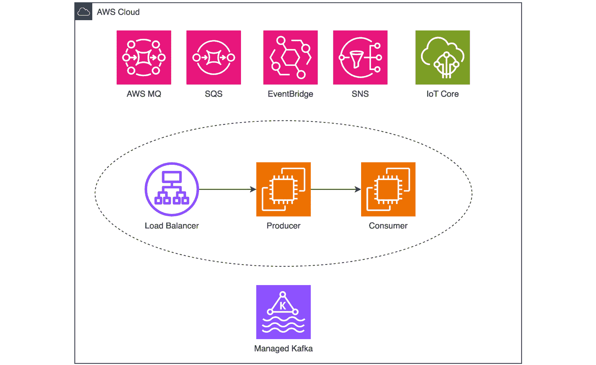
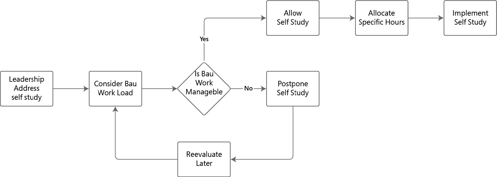
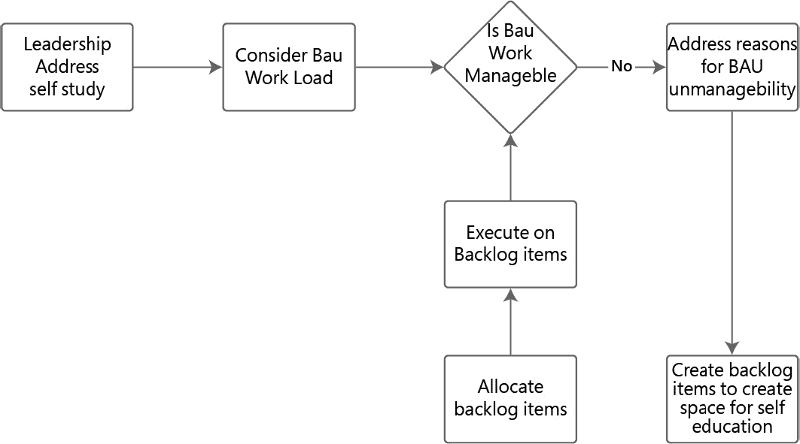
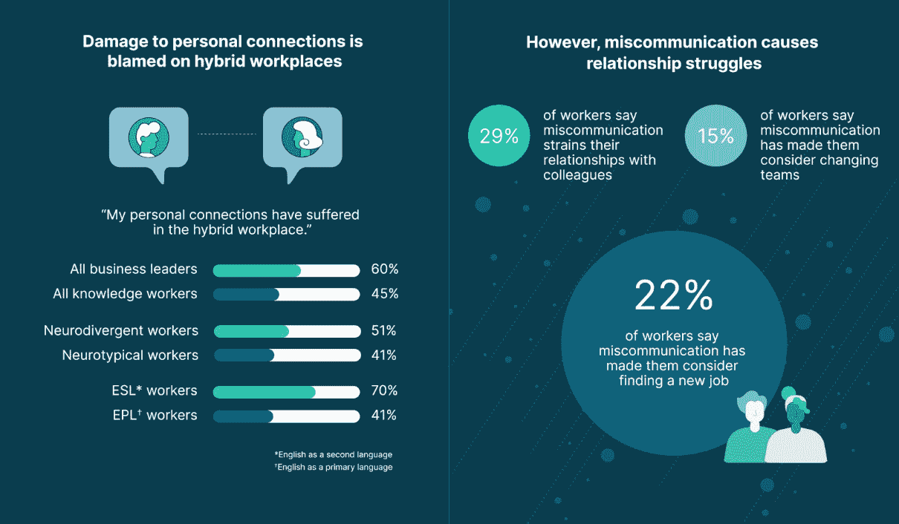
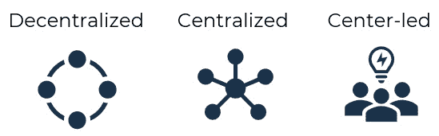
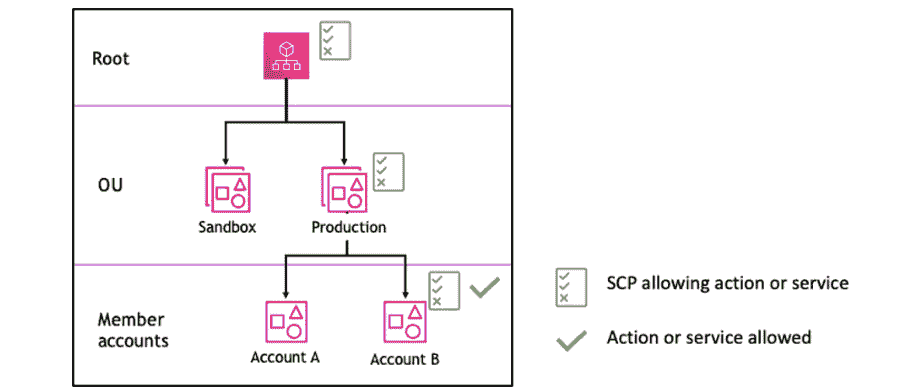
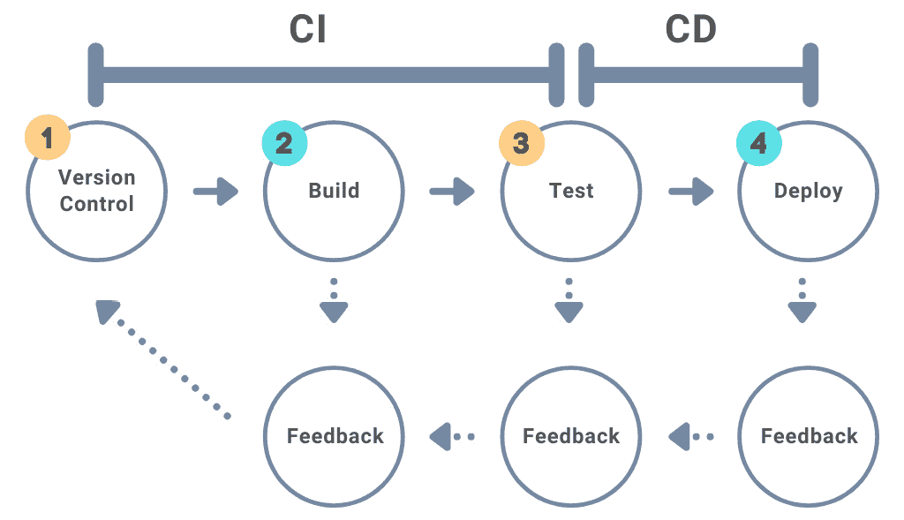

# 第三章：在云原生范式下重新思考治理

在快速发展的云原生架构中，传统的治理方法常常难以跟上敏捷性、可扩展性和快速创新的需求。随着组织采用云原生实践，他们往往会无意中陷入反模式，这些反模式是低效或误导的行为，会减缓进展、增加风险并抑制创新。这些反模式源于未能调整治理模型以适应云环境的流动性和去中心化特征。本章探讨了组织如何发展其治理策略，以避免这些陷阱并构建韧性强、可适应的系统。本章将涵盖以下反模式：

+   学习会奇迹般发生

+   文化不需要改变

+   集中式治理将会扩展

+   我们的业务太特殊，不适合有保护性框架或标准

+   缺失反馈循环

# 学习会奇迹般发生

在传统的 IT 世界中，治理专注于集中的控制结构。而云原生环境则有所不同。云原生环境需要敏捷性、可扩展性和去中心化的决策。有效的云治理确保合规性、安全性和高效运营，从而加速创新。组织可以利用自动化政策、持续监控以及采用新服务，而不牺牲安全性，从而将云战略与业务目标对齐。

组织往往将*治理*视为一个涵盖技术与非技术控制机制的总称，用于管理基础设施并定义应用运行框架。虽然这一总称通常偏向于最佳实践的应用（试想一下，使用操作手册/运行手册），但往往忽视了治理中的非技术性方面，而这些方面一旦管理不当，就会导致反模式和结构的崩溃。造成这一现象的主要因素之一，就是本节所涵盖的模式，称之为*学习会奇迹般发生*。

## 忽视学习的代价

传统组织中的技能提升和当前技术栈知识往往受到*在自己的时间里学习*或*我们没有时间培训你*心态的限制。在这种情况下，工程师有两种选择。要么工程师会在一个公司工作几十年，专注于一个系统，要么他们会寻找其他职位，从而导致人才流动率高。

高人才流动率是工程团队面临的主要挑战。每一位新员工都需要入职培训，而在此过程中，资深工程师必须花费时间进行培训，这会影响整体生产力。在正常的 2-3 年流动率下，这是可以预期的，但一旦流动率变为 6 到 12 个月，就会成为时间的浪费和整体损失。2021 年的“大辞职潮”是这一点的一个很好的参考。每位新工程师都有一个初始的入职阶段；如果没有必要的学习材料，例如文档，那么这将变成一种负担。

花费时间手把手指导，而不是提供合适的文档，导致许多工程师离开，寻找更好的机会，因为*文档致死*在技术负债严重的组织中是很常见的现象。

这是一个你应该避免陷入的位置，因为这样不仅浪费了时间和金钱，还会错失创新机会。这已经导致许多组织的基础设施和软件团队解散。

在 IT 的产品和咨询方面工作过，并且曾在托管服务提供商工作过，我们遇到过这种情况。我们能理解为什么传统组织会这样做。对他们来说，最重要的是**日常业务**（**BAU**）；从短期的角度来看，这样做是有道理的。从基本层面来看，组织关注的焦点是确保他们的产品创造价值，无论是金钱上的还是其他方面的。当面临提升技能或创建文档等任务时，很容易让工程师“在自己的时间里学习”，因为在他们看来，工作日的八小时确实应该花在产品上。我想在这里指出，工作时间以外的学习对于职业成长至关重要；即使每天只有一个小时，未来也会有所回报。然而，这不应该是唯一的学习来源。

从长期来看，这种做法是失败的；工程人才最终被锁定在他们产品的局限性中，除此之外没有任何其他发展机会。如果你被放置在一个没有任何收获的环境中，如何能在你的典型知识体系之外进行创新或创造价值呢？对于咨询公司来说，这是非常有利的；这正是他们介入并提供价值的地方，执行那些本应由内部工程人才完成的任务。对于云服务公司来说，这是一个需要解决的平衡问题。如果没有在工作时间内学习的自由，就会产生障碍，从而在服务或产品改进时，传统上需要外部帮助。

以以下图示为例：

图 3.1 - 消费者和生产者

从技术上讲，生产者到消费者的绑定上下文是一个功能模型；然而，这种方式在 BAU（*做中学*）工作方式中并没有改进的空间。这个模型中的服务可能是已知的，但并不深入到可以提出建议以改进设计的程度。

## 解决反模式

当面对一个充满 Word 文档或无数 Confluence 页面共享驱动器时，边工作边学习系统、构建或支持的概念似乎是更好的选择。但组织往往会把这一概念推得太远。工程师刚开始理解他们所从事的产品时，所有的时间都集中在产品上，结果没有时间提升他们的技能。

提供持续教育和职业发展的资源与支持至关重要。组织的目标是平衡工作负荷，确保员工有时间学习并应用新技能，同时避免过度的上下文切换。在传统组织中，我们在学习/自我教育的决策过程中所看到的情况如下：

图 3.2 - 传统自学决策树

大多数人陷入了一个永无止境的循环：推迟自学 -> 稍后评估，承诺自学但始终未兑现。更进一步，云原生组织致力于解决问题的根源。*学习将奇迹般发生*这一心态之所以持续存在，其中一个主要原因是无法管理的日常任务带来的沉重负担。这一挑战通常根源于积累的技术债务，而这并不是新现象。通过识别并积极解决这个问题，组织可以逐步释放时间用于自我导向的学习和职业发展。此项倡议必须由领导层牵头并得到支持，领导层必须保持警惕，防止积压工作量不断增加。此类积压应视为需要立即并持续关注的关键问题。

图 3.3 - 评估“REDRAW PLEASE”原因

这种方法基于这样一种信念：知识和经验是创造持久影响的基础。当员工在工作时间内被鼓励学习和成长时，他们更能有效探索新技术、实现创新功能，并推动组织发展。如果没有这种对持续学习的承诺，公司就会面临停滞风险，限制了创造独特解决方案的能力。通过将教育融入到日常工作环境中，组织不仅能赋能员工，还能确保员工在不断变化的环境中长期发展和适应。这种支持可以通过提供培训资料、工作坊和在工作时间内安排学习时间的方式来实现。可以通过在日程中预留时间来轻松实现。如果需要重新安排该时间（例如用于处理事件），则将该时间块移到日程中。要严格拒绝在该时间段内安排会议。

以下表格提供了一系列全面的选项，包括一些内部选项和外部选项。*表 3.1* 展示了相当多的选项，其中一些比其他的更难实现，但在这些选项中，认证和培训是最好的起点。

| **类别** | **描述** | **频率** | **参与者** | **方式** |
| --- | --- | --- | --- | --- |
| 入职培训营 | 集中式的课程，帮助新员工专注于云原生工具和实践。 | 入职后的第一个月 | 新员工 | 实践实验，工作坊，辅导 |
| 持续学习时间 | 每周指定时间进行自我驱动的学习和探索。 | 每周 | 所有工程师 | 在线课程，阅读，实验 |
| 认证与培训 | 支持获得行业认可的认证（例如，AWS 或 Kubernetes 等云服务商）。 | 持续进行 | 有兴趣的工程师 | 在线课程，外部培训提供商 |
| 技术讲座和午餐交流会 | 工程师就特定主题分享知识的非正式会议。 | 每两周一次 | 所有工程师 | 演示、现场演示、问答环节 |
| 技术债务日 | 专门的时间来处理技术债务，同时了解遗留系统。 | 每季度一次 | 所有工程师 | 配对编程，重构会议，Confluence/文档奖励 |
| 导师计划 | 将经验较少的工程师与资深工程师配对，进行引导性学习。 | 持续进行 | 初级和资深工程师 | 一对一辅导，代码审查 |
| 技术写作 | 集中的文档存储库，记录最佳实践和经验教训，展示工程卓越。 | 持续进行 | 所有工程师 | 博客/白皮书，内部文档 |

表 3.1 - 内部学习选项

云原生厂商通常有自己的认证路径。对于 AWS，我们可以通过 AWS Skill Builder、Tutorial Dojo 或 Learn.Cantrill 等平台进行认证培训；对于 Azure，使用 Pluralsight 和 Microsoft Learn；对于 GCP，则使用 Google Cloud Training 和 Whizlabs。你获得的学习成果可以并且应该得到充分利用。比如，我们学习了如何通过 AWS 开发者认证使用 S3 存储桶来托管静态网站，一个简单的博客可以通过这一方式搭建，或者教育结果可以促使内部产品的推荐，特别是像 S3 静态托管这样的方法。

为了防止在云原生环境中产生反模式，创新的学习活动发挥着至关重要的作用。定期安排的活动，如黑客马拉松、游戏日、学习社区和外部会议，确保工程师的持续教育参与和操作准备。这些活动促进了创新、协作和安全意识的积极文化，这对于应对云原生技术的复杂性至关重要。这样的社区方法还将提供外部见解，否则这些见解是无法获得的。*表 3.2* 详细列出了这些变革性活动的频率、参与者和方法：

| **类别** | **描述** | **频率** | **参与者** | **方法** |
| --- | --- | --- | --- | --- |
| 黑客马拉松 | 聚焦于构建原型和实验新技术的活动 | 每季度 | 跨职能团队 | 协作编程、问题解决 |
| 游戏日 | 模拟关键事件、安全事件等，以评估反应的活动 | 每年一次 | 工程师 | 全天灾难恢复测试、通过渗透测试或其他测试进行安全模拟 |
| 学习社区 | 专注于特定技术（例如 DevOps、安全）的专门小组 | 每月聚会 | 具有共同兴趣的工程师 | 讨论、合作项目 |
| 外部会议 | 参加行业会议，以保持对最新趋势的了解 | 每年一次 | 精选工程师 | 主旨演讲、工作坊、网络交流 |

表 3.2 - 外部学习选项

在云原生环境中，必须打破“学习会奇迹般发生”的迷思，组织才能成功。治理不仅仅是技术控制，还包括促进持续学习的文化。传统的集中控制向敏捷创新的转变，需要解决人的因素，确保工程师有足够的时间和资源来发展他们的技能。

学习不能被边缘化或期望在工作之外发生。为了将学习融入组织的文化中，公司必须提供结构化的开发机会，并将学习整合到日常工作流程中。这使得工程师在贡献业务目标的同时，能够不断精进自己的技能，从而带来更多的创新和更强的团队。云原生世界中的持续成功取决于将学习作为工作的一个不可或缺的部分。当组织将学习作为核心战略时，它们能够赋能团队推动技术变革，确保长期成功。在下一部分中，我们将探讨没有文化转变，这种转型是如何无法发生的。

# 文化不需要改变

推动成功组织文化发展的驱动力是变革。Salesforce CEO Marc Benioff 曾说过：“*科技行业中唯一不变的就是变化*。”我们可能会认为 Marc 只是指我们在这里构建和使用的技术。然而，隐含的意思是，文化和支撑行业的技术都在变化。采纳云原生方法不仅仅是实施新技术；它更是拥抱组织文化的根本性转变。许多组织误认为，只需将云技术覆盖到现有的做法中，而无需做出重大的文化改变。

本节旨在帮助读者掌握理解云原生采纳文化影响的技能。同时，它还将讨论低估文化变革、忽视关键利益相关者以及忽视变革管理的危险，这些问题可能导致员工的反感和抵制。

## 云原生采纳的文化影响

当一个组织采纳云原生范式时，必须超越技术，着眼于如何影响团队的工作方式、沟通方式以及解决问题的方式。云原生的采纳鼓励持续集成、持续交付/部署以及各种工程文化，如 DevOps/SecOps 或平台工程等做法。这些做法需要一种协作性、灵活性和主动性强的文化，能够适应快速变化，这与传统 IT 组织的文化截然不同。

### Spotify – 文化变革的影响

Spotify 提供了一个优秀的案例，展示了如何通过拥抱云原生文化实现变革性成功。当 Spotify 决定迁移到云端时，它意识到这一转变不仅仅需要技术上的变化，还需要对组织文化进行根本性的重新思考。为了实现这一目标，Spotify 采用了一个以自主性、协作和持续改进为核心的独特模式。云原生的做法最好通过他们创建的“squads”（小队）来体现：这些小队是小型的跨职能团队，具有高度的自主性。

每个小队负责 Spotify 服务的一个特定方面，并且有自由决定如何实现他们的目标。这种结构使得团队能够快速地进行实验、迭代和创新，而不会被官僚主义流程所拖慢。小队模式还促进了责任文化的形成，团队对自己的工作从头到尾负责，培养了对成果的归属感和自豪感。除了小队，Spotify 还引入了**tribes**（部落）、**chapters**（章节）和**guilds**（公会）的概念，以保持组织内部的协调，同时保持自主性。下表详细介绍了每个概念。

| **概念** | **描述** | **影响** |
| --- | --- | --- |
| 小组 | 负责 Spotify 服务特定方面的小型、自治的跨职能团队 | 促进快速实验、创新和自主权 |
| 部落 | 在 Spotify 服务的更广泛领域内工作的相关小组 | 确保各小组之间的对齐与合作 |
| 章节 | 在部落内部的学科特定小组，确保实践的一致性（例如，前端开发人员） | 维持最佳实践和技术标准 |
| 行会 | 跨组织的非正式兴趣社区，促进知识共享与合作 | 鼓励跨职能的学习与创新 |

表 3.3 - Spotify 团队模型解析

注意这种方法；所呈现的概念不会制造孤岛，而是创造重叠的群组，鼓励并支持团队之间的沟通。

Spotify 的成功故事展示了将文化变革与技术变革对齐的力量。他们的云原生转型不仅仅是采用新技术，更是培养了一种重视自主性、合作、持续改进和从失败中学习的文化。这一文化转变在 Spotify 能够大规模创新、保持高服务可靠性并在竞争激烈的音乐流媒体行业中保持领先地位方面发挥了关键作用。

要真正理解文化变革成功的原因，我们的学习需要集中在不改变的风险上。

## 忽视文化变革的隐藏成本

组织往往过度关注技术方面，忽视了人性化因素，这可能导致一系列问题。这些问题是由领导决策、对未知的恐惧以及领导层缺乏认同感的结合所造成的。让我们更仔细地看看这些问题的影响。

### 对变革的抵抗

习惯于传统工作流程的员工可能会抵制采用新的云端实践，拖延进展并导致低效。例如，在与一家金融科技组织的多云咨询中，尽管遗留流程效率低下，如需要两天时间才能配置一个新的 AWS 账户并依赖定制脚本，但工程团队依然不愿采纳云原生解决方案来简化工作流程。该组织也抗拒第三方云管理，因此我们为各个云团队使用了每个云供应商的本地工具。

很明显，工程师的犹豫不决通常源于多个因素，其中学习曲线是最重要的因素之一。每次变革都会带来一个不可避免的问题：“我们如何适应？”这种恐惧是完全合理的。

请考虑一下来自*学习将奇迹般地发生*部分的一个例子，来自于传统组织中的一位资深工程师。尽管企业可能非常看重他们的深厚经验和忠诚，但他们对变革的抗拒可能成为整个组织文化的重大障碍。这种抗拒不仅仅是因为不愿意改变；它源于多年积累下来的固有做法，已经成为他们的第二天性。他们的深厚专业知识虽然宝贵，但通常将他们与遗留系统和过时的流程绑定在一起，这些流程虽然舒适，但已不再适应现代需求。这种犹豫源于对未知的恐惧，对熟悉日常工作的强烈偏好，以及对变革的普遍抗拒。让我们来看看如何克服这种对变革的抵触情绪。

#### 克服对变革的抵触情绪

克服这种抵触情绪需要持续而深思熟虑的努力：

+   **提供项目后支持**：直面解决问题，向工程师们保证他们的专业知识仍然受到重视，新工具是为了增强而不是替代他们的工作。

+   **提供全面的培训和支持**：这不仅包括表面上的介绍，还深入探讨新系统，通过动手实践的研讨会、Confluence 中的详细文档以及 GitHub 中的 Markdown 文件，为工程师们提供量身定制的内容，帮助他们弥合旧工作方式与新工作方式之间的差距。

+   **培养重视持续改进的环境**：创造一种将学习和适应视为持续过程而非一次性事件的文化。这有助于逐步引导工程师们适应新方法，确保他们不会感到不知所措或被边缘化。

为了使变革成功，必须采取明确的行动，而不仅仅是空谈，以克服经验丰富的工程师们的抵制。这需要建立坚实的基础，基础包括清晰的沟通、强大的支持系统以及对持续改进的承诺。这一基础是克服阻力的必要“破冰者”，使组织能够顺利过渡，并确保即使是最有经验的团队成员，在转型过程中也能感到安全和值得重视。

现在让我们来讨论缺乏支持的情况。

### 缺乏支持

在克服了实施初期的抵制后，推动文化变革的下一个关键障碍是获得员工和关键利益相关者的支持。如果没有对云原生采用能带来好处的深入理解，抵抗几乎是不可避免的。这种缺乏支持往往表现为敷衍的实施努力，其中推动项目前进所需的热情显著缺乏，从而导致项目失败的高风险。

在我们与一家金融科技公司的合作过程中，我们遇到了这种典型的情况。他们的本地基础设施存在诸多低效问题，包括以下几方面：

+   部署时间过长

+   可扩展性有限

+   累积技术债务

+   缺乏韧性

尽管现有的系统存在缺陷，但它们是熟悉且舒适的，这创造了一种虚假的安全感，使得云原生解决方案看似威胁到了这种安全感。抵抗并不仅仅是关于技术的，它涉及到挑战现状，摆脱那些长期固守的惯例，尽管它们效率低下，却已深深植根于公司的运营结构中。  

我们清晰地概述了转向云服务的众多优势，例如以下几点：  

+   提升的敏捷性  

+   运营模式的成本节约  

+   增强的安全性  

+   快速扩展性  

我们解释了向云原生转型是精心设计的，旨在简化操作、减少风险并确保合规。然而，依然存在抵抗的声音。缺乏热情不仅仅是一个小障碍；它是一个重大障碍，导致了执行的冷淡。团队对完全采用新工具和新流程持犹豫态度，将变革视为表面变化，而不是组织运营方式的根本转变。  

#### 克服缺乏认同感  

为了克服这个挑战，建立一个关于云文化变革的有力论据至关重要，重点包括以下几点：  

| **策略** | **描述** |   |
| --- | --- | --- |
| --- | --- |   |
| 将技术优势与更广泛的组织目标联系起来 | 确保云采用的优势与公司整体目标清晰相关，帮助员工看到更大的图景 |   |
| 广泛的培训与支持 | 提供深入的培训课程，解开新工具和流程的神秘面纱，旨在改变思维模式并减少恐惧感 |
| 创建持续改进的文化 | 培养一种重视学习和适应的环境，鼓励团队将变革视为成长的机会，而非威胁 |   |
| 强化长期利益 | 持续强调云采用的长期收益，帮助组织将视角从短期的不适转变为未来的优势 |   |

表 3.4 - 变革策略  

最终，克服缺乏认同感不仅需要技术解决方案，还需要一种全面的方法，涉及到文化和心理层面的变化。通过将云原生战略与组织的核心价值观对齐，并确保每个团队成员都感到被纳入其中并受到重视，我们能够将怀疑转化为支持，并将最初看似无法克服的抵抗转变为共同推动成功实现云原生的动力。  

下一部分讨论了沟通不畅，并提供了来自 Grammarly 的案例研究。  

### 沟通不畅 – 案例研究  

没有明确沟通变革的原因和其好处，可能会导致工程师之间的困惑和焦虑。这在我们领导的一个项目中表现得尤为明显，该项目旨在 AWS 上建立云基础设施，并在短时间内交付**最小可行产品**（**MVP**）。项目赞助商——架构负责人对结果感到非常高兴。尽管领导层对此感到欣喜，但在一次全体会议中，很明显，广泛的团队对于项目的目的和原理并不清楚。

观众提出的问题暴露了一个明显的沟通鸿沟。项目赞助商未能充分向更广泛的组织传达云原生转型的信息，导致了不必要的焦虑和担忧。这一经验强调了在云原生采纳过程中，清晰和一致的沟通至关重要。领导者必须确保组织内的每个人不仅理解变革的原因，还要明白它带来的好处以及如何影响他们的角色。这种一致性对任何转型举措的成功至关重要，并通过培养共同的目标感和对新方向的承诺，帮助减少抗拒。例如，Grammarly 就公开发布了他们的相关发现。

Grammarly 在 2022 年 10 月的两周时间里发现了以下问题：

+   15%的员工表示，沟通不畅让他们考虑更换团队。

+   25%的员工表示，沟通不畅加剧了他们与当前团队的关系紧张。

+   22%的员工表示，沟通不畅使他们考虑找新工作。

这些因素都最终回归为云原生文化变革的阻碍因素。

图 3.4 - Grammarly 案例研究摘录 ([`www.grammarly.com/blog/poor-communication-work-stress/`](https://www.grammarly.com/blog/poor-communication-work-stress/))

#### 克服沟通不畅

领导力在推动云原生采纳的支持方面发挥着至关重要的作用。它不仅仅是关于强制变革；更是关于传达一个能够在整个组织中引起共鸣的愿景。

领导者必须清晰且有说服力地阐述云原生采纳的好处，将这些优势与组织的整体目标以及团队成员的个人愿景相联系。通过这样做，他们可以将怀疑转化为热情，将障碍转化为成长的机会。一位鼓舞人心的领导者通过自身示范来引领变革，并以实际方式展示其价值。

耐心和毅力同样重要，因为获得认同不是一蹴而就的；这需要持续的参与、不断的教育，并庆祝每一个小小的胜利，这些胜利共同为更广泛的转型积累动力。针对我们目前阅读的内容，下一节将为我们提供可以采纳的策略和框架。

## 云原生转型中文化变革的有效策略

成功采用云原生方法的有效策略包括以下几点：

+   **促进跨职能合作**：通过鼓励跨职能团队协作，打破孤岛。采用敏捷、DevOps/DevSecOps/现代工程文化，促进创新，并确保在决策过程中考虑多样化的观点。

+   **鼓励实验和学习**：为员工创造一个安全的环境，让他们可以进行实验并从失败中学习。倡导成长型思维，并提供持续学习和发展的机会。

+   **赋予团队自主权**：给予团队自主决策的权力，并让他们对项目负责。这种授权可以带来更多的创新、更快的解决问题的能力和更高的工作满意度。

+   **促进开放沟通**：保持开放、透明和一致的沟通。定期更新员工有关云计划的进展，并提供反馈和讨论的论坛。

+   **变革管理框架**：利用结构化方法，如 Prosci 的 ADKAR 模型和 Kotter 的 8 步变革模型，有效管理变革。

向云原生转型的旅程强调了文化演变与技术进步并行的必要性。正如 Spotify 等公司所展示的，成功的云原生转型不仅仅是技术上的，它还需要培养一种自主性、协作性和持续改进的文化。

克服源于恐惧、固守的惯例或误解的抵触情绪至关重要。通过教育倡议、领导力支持和文化再造，组织可以将新工具与核心目标对齐，帮助每个利益相关者拥抱这一转型。

下一节将讨论*集中式治理将扩展*这一反模式。从这些文化转变中汲取的教训，突显了支持复杂云环境的可扩展治理结构的重要性。

# 集中式治理将扩展

回顾 IT 行业的历史，可以发现集中式治理一直是常态。传统上，组织内的每个组件都被视为关键，导致了一个所有决策、改进和监督都从一个单一权威点发出的治理结构。最初，这一模型运行得很有效，由一个由资深工程师或项目经理领导的小团队进行管理。

然而，随着组织的发展，这种集中式方法往往变得繁琐且缓慢。随着组织更广泛地接受云原生技术，强大的治理框架的重要性变得愈加明显。有效的治理对维护安全、确保合规性以及优化运营效率至关重要。该领域的一个普遍观点是，集中治理可以在多样化的组织结构中有效地扩展。

本节将深入探讨这种方法的细微差别、不足的去中心化治理指南带来的危险，以及根深蒂固的官僚主义和缺乏专门的**云卓越中心**（**CCoE**）或**实践社区**（**COP**）所带来的挑战。

在本节中，我们将深入了解如何在云中建立 CCoE 的最佳实践，以及组织应努力避免的关键反模式。本节将探讨组织如何成功地从僵化的集中式系统过渡到更具动态性、去中心化的治理框架，以更好地支持其不断发展的需求。

## 集中治理 – 应对挑战并制定解决方案

虽然治理实施至关重要，但缺乏去中心化治理指南可能会将锚固变成枷锁，剥夺灵活性，消除短期和长期创新的潜力。拥抱标准化是至关重要的，无论是在技术还是实践中，赋能工程团队去应对这些既定框架。去中心化治理的一个好处是，它能够加快决策过程，增强自主性，并迅速应对不断变化的市场环境。以下小节提供了关于缺乏去中心化治理的一些见解。

### 缺乏去中心化治理所带来的挑战

缺乏去中心化治理可能会带来多个挑战：

+   **创新受限**：过度的集中监管，缺乏灵活性，可能会阻碍团队主动改进现有流程。这种僵化的控制抑制了对技术进步至关重要的探索性思维。

+   **操作瓶颈**：集中决策通常会带来延迟，妨碍在快速响应至关重要时的灵活性，尤其是在像无服务器计算和 AI 开发等动态领域。

+   **团队参与度下降**：没有推动有意义变革的自主权，团队可能会感到动力和参与度下降，从而导致生产力和创新力的降低。

以下图表展示了集中治理和去中心化治理的对比：

图 3.5 - 集中治理与去中心化治理（请重新绘制）

中心化的模型，类似于传统的 IT 框架，通常将权力和决策集中在组织的核心。这种中心化依赖关系形成了瓶颈，每个决策，不论多么微小，都必须通过层级上报，通常导致延迟和响应能力降低。相比之下，去中心化的云原生模型将权力分散到信息和行动的源头附近。这种接近性使团队能够根据对问题的直接理解迅速做出决策，从而促进了更敏捷和更具响应力的环境。

当决策权从日常运营的参与者中剥离出来时，可能会导致团队成员产生失能感，他们可能觉得自己的专业知识和见解被低估。这会降低工作满意度并增加员工流失，从而进一步破坏组织的稳定性。中心化的模型在动态环境中往往难以有效扩展。随着组织的发展和运营的复杂化，中央决策机构会因为决策请求的增加而不堪重负，导致响应时间变慢，并且可能错失快速发展的行业中的机会。例如，我们曾与大型关键基础设施组织合作，如大型电信公司，工程师们可能会发现优化网络流量的创新方法，但由于没有经过繁琐审批流程，他们无法实施这些变更，从而导致挫败感，并且觉得自己的技术专业性得不到重视。这种脱节不仅阻碍了创新，还可能导致工作满意度下降和员工流失，进一步动摇了组织的稳定性。

在大规模应用中，去中心化治理取得了很大的成功。以下是 AWS 的一个例子。

#### 两比萨团队 – 去中心化治理

**去中心化治理**的典型例子就是 AWS 的*两比萨团队*框架。该模型提倡小而灵活的团队，赋予团队自主决策的权力，从而创造出一种创新与敏捷的文化，同时确保与更广泛的组织目标保持一致。

例如，AWS 的无服务器计算服务 Lambda 背后的团队就是一个典型案例。该团队能够快速将客户反馈整合进新功能的开发中，充分体现了去中心化治理所带来的竞争优势，进一步巩固了 AWS 在无服务器计算领域的领先地位。

每个两比萨团队，专注于特定的服务或功能，凭借创新和推动其议程的自主权蓬勃发展，能够快速调整以更好地满足客户需求并保持市场领先地位。以下表格突出了两比萨团队的优势：

| **优势** | **成功指标** |
| --- | --- |
| 增强的敏捷性 | 更小的团队能够更快行动，并且在没有繁琐流程的情况下迅速适应。 |
| 增强的自主性 | 团队成员较少减少了误解，并增强了在快速发展的项目中的协调性。 |
| 改善沟通 | 因为团队成员减少，误解减少，并且在快速推进的项目中增强了一致性。 |
| 更大的问责性 | 小团队内明确的责任划分提升了对行动和结果的问责。 |
| 更快的决策制定 | 由于减少了官僚层级和必要的审批，决策流程更加高效。 |
| 提高专注力 | 小团队能更加集中的专注于具体目标，而不受更广泛的组织干扰。 |

表 3.5 - 两比萨模型的详细优势

### 集中治理解决方案

在详细探讨了集中治理所带来的挑战后，必须解决其中一个最具破坏性的因素：**僵化的** **官僚主义**。这一现象代表着那些变得如此僵化和过时的流程，以至于严重妨碍了组织创新和适应能力的发挥，而这些能力在快速发展的云技术领域中至关重要。

#### **僵化的官僚主义**的症状

**僵化的官僚主义**最明显的迹象之一就是决策迟缓。在许多传统组织中，决策流程因为管理层级和不再具有价值的程序步骤的累积而变得拖沓。这些层级是过去结构的遗留物，它们不是出于必要而存在，而是由于惯性维持着，导致了不仅令人沮丧而且成本高昂的延误，特别是在错失机会的情况下。这种症状在较大和较老的组织中尤为明显；我们多次听到在政府部门工作或与之合作的人提到，单凭官僚主义，变革被扼杀。

另一个症状是对变革的抵制。虽然我们在之前的章节中已经深入探讨了这一部分，但它同样与集中治理有关。传统组织常常表现出对采纳新技术或新方法的深刻抗拒，这种抗拒源于对变革的恐惧。这种恐惧并非没有根据，因为新技术可能会扰乱既定的角色和流程。但这种抵制也源于对现状的舒适感和对未知的回避。这种抵制会阻碍组织在技术适应性对于生存至关重要的行业中保持竞争力。

#### 破除**僵化的官僚主义**的策略

为了应对**僵化的官僚主义**的惯性，特别是在需要云技术提供的高敏捷性的环境中，组织可以采取若干有效策略：

+   **简化流程**：定期审查所有流程以简化它们是至关重要的。这意味着要去除冗余步骤，简化程序，以提高运营效率和响应能力。

+   **赋能团队**：将决策权直接下放给一线团队，可以显著提高敏捷性。这种赋能使得最了解当前问题的团队成员能够迅速且有效地实施解决方案，而无需经历层级上升下降的延误。

+   **促进持续改进的文化**：培养一个重视持续评估和改进过程的组织心态，确保这些过程始终保持相关性和有效性。这种文化鼓励创新和实验精神，这对于充分发挥云计算技术的潜力至关重要。

通过解决僵化官僚体制的症状和根本原因，组织不仅能增强适应性和效率，还能营造一个有利于创新和快速技术采纳的环境。

从僵化的官僚体制到动态响应的官僚体制的转变，不仅仅是过程上的变化，更是组织文化的转型，使其与云时代的需求保持一致。

在接下来的部分中，我们将深入探讨 CCoE 在应对云治理复杂性方面的关键作用，并确保组织在避免官僚停滞的陷阱的同时保持敏捷性。这些框架对于明确角色、简化决策过程以及在云原生环境中培养持续改进的文化至关重要。

#### 缺乏 CCoE

CCoE 的目的是建立一个集中化的团队或职能部门，在推动整个组织的云计算采用、治理和最佳实践方面发挥关键作用。在这里，我们可能会问：“*如果我们转向云原生的组织结构，为什么还需要一个集中化团队？*” 简而言之，通过建立 CCoE，组织能够有效管理其云环境，优化业务运营，并为客户和社区提供更大的价值。

通过将云计算计划与组织的更广泛业务目标紧密关联，CCoE 确保云的采用不仅仅是技术上的转变，更是与长期目标相一致的战略举措。CCoE 的一个关键职能是制定和执行云使用的最佳实践和标准。这些标准对于保持组织内部的一致性和效率至关重要。

CCoE 为资源配置、成本优化和安全控制建立了指导方针，确保所有云活动都与组织的运营和战略需求相一致。AWS 发布了一篇关于如何构建 CCoE 的白皮书，接下来让我们深入探讨其关键建议。

#### CCoE 结构

AWS 发布了一篇关于建立 CCoE 的白皮书，以帮助组织进行转型。根据这篇白皮书，CCoE 通常分为两个团队：

+   **云业务办公室（CBO）**：CBO 将 CCoE 提供的产品和服务与企业客户和领导层的需求对接。它充当技术团队与业务利益相关者之间的桥梁，确保云项目与组织的目标和优先事项保持一致。

+   **云工程**：该团队将标准云服务配置与组织的企业标准之间的差异进行编码。他们将这些编码后的模式打包，并持续改进，使其成为可供客户自助部署的产品。

让我们探讨构建有效 CCoE 的策略。

#### 创建 CCoE 的推荐策略

以下是一些创建 CCoE 的推荐策略：

+   **定义明确的目标和长期愿景**：CCoE 应当具备明确的、可衡量的目标，并且这些目标要与组织的整体业务目标保持一致。通过制定包含雄心勃勃项目的长期路线图，可以推动云计算的采纳和创新。

+   **发展深入的云计算专业知识**：CCoE 需要对目标云平台有深入的了解，包括其服务、性能、监控、成本优化和安全最佳实践。这种专业知识对于引导组织顺利实施云计算至关重要。

+   **建立云治理和政策**：CCoE 负责制定和执行云治理政策，以确保成本效益、安全性和合规性。这包括定义云架构原则、部署标准和自动化实践。

+   **衡量成功并进行迭代**：CCoE 应当收集与云项目相关的指标和关键绩效指标（KPI），并将其与既定目标进行比较。这些数据有助于判断 CCoE 是否提供了预期的价值，并识别需要改进的领域。随着条件的发展，CCoE 战略应做出相应的调整。

总结来说，一个建立良好的 CCoE 对于有效管理云环境至关重要。它确保组织能够优化运营、快速创新，并为客户提供显著价值，同时保持合规性和安全性。没有这样一个集中式的职能，组织可能会面临碎片化的努力、错失机会以及增加的摩擦和低效，尤其是在全球项目中。

在我们总结集中治理和明确角色与责任的重要性时，必须认识到，并非所有组织都相同。虽然一个结构良好的治理框架对于保持云环境中的安全性、合规性和运营效率至关重要，但一些组织可能会抵制标准化，认为其独特的业务需求过于专业化，无法采用此类做法。

在下一节中，我们将详细探讨这种思维方式，讨论拒绝标准化治理框架所带来的风险和挑战，以及这如何导致低效、增加风险和错失云操作中的机会。

# 我们的业务太特殊，不能采用保护措施或标准

这是一个常见的误解。在我们的经验中，几乎每个组织都认为其 IT 环境过于独特或复杂，无法实施标准化的保护措施或治理做法。然而，当审计时间临近时，这些相同的组织往往发现自己不得不匆忙建立他们最初抵制的控制措施。感知到的复杂性掩盖了对实施必要控制措施的深层次犹豫。无论业务看起来多么专业化，在遵守政府、金融或行业特定标准时，这些要求都必须得到满足。

真实的挑战不在于业务的独特性，而在于其是否愿意克服这种抵触情绪，建立必要的治理结构。

在本节中，我们将探讨数据洞察的重要性、**治理、风险和合规性**（**GRC**）政策的关键作用，以及清晰的**责任、问责、咨询和告知**（**RACI**）模型的必要性。

## 了解保护措施的概念和优势

云治理中的**保护措施**是关键工具和预定义的政策与实践，它们引导团队朝着合规和安全使用云资源的方向发展，营造一个在不妥协安全的情况下促进创新的环境。

作为集中治理的基础元素，这些保护措施提供了一种平衡的方式，既允许在操作中灵活性，又确保基本控制措施牢固到位。它们既是指导方针也是边界，赋能团队在执行强有力的保障措施的框架下，有效地利用云资源，以确保遵守法规、标准和组织政策。

通过在整个组织中促进一致性、可扩展性和问责制，保护措施确保了管理云资源的统一方法。接下来将概述保护措施的优势以及为何使用它们的原因。

## 保护措施的关键优势

以下是保护措施所提供的一系列优势：

+   **增强的安全性**：保护措施在组织中强制执行安全协议，确保遵循保护敏感信息和关键系统的做法。这些协议可能包括对传输和静态数据的强制加密、基于最小权限原则的访问限制以及自动化的安全更新。通过标准化安全措施，保护措施减少了风险并增强了云环境的安全性。

+   **合规性保障**：自动化合规性以满足监管要求，降低违规和罚款的风险。保护性控制通过限制数据存储在特定区域或确保遵循如 HIPAA 或 PCI-DSS 等法规来执行数据主权法。这种自动化减少了人工监督的需求，帮助组织轻松保持合规。

+   **一致性与标准化**：在所有团队中强制执行标准化的政策和流程，确保云资源的一致部署与管理。这可以减少配置错误、提高云服务之间的互操作性，并简化新团队成员的入职与培训。

+   **审计与报告**：保护性控制通过提供审计轨迹和云使用与合规性详细报告来改善治理。这些功能帮助组织识别低效、管理风险，并为内部审计或外部审查提供问责制，支持云战略的持续改进。

保护性控制通过将合规性直接集成到部署过程中，简化了云原生环境中的生产路径。AWS Config 合规性规则、AWS SCP 和 Azure Policy 合规规则等工具使开发人员和工程师在发布更新或新功能时可以更加专注。这种专注不会造成信息孤岛，而是建立了明确的可执行边界。请看下面的图示，它展示了 AWS 组织中的一组 AWS 账户。

图 3.6 - 带成员账户的 AWS 组织 OU（请重新绘制）

在这个示例中，应用账户级别的规则，指定只能部署明确的资源，如 Lambda 函数或 Fargate 任务。这种设置形成了一种一致的保护性控制，确保只有在明确批准的情况下才会发生偏差，从而在部署过程中保持合规性和控制力。为了优化保护性控制的使用，必须区分不同类型的保护性控制。下一节将提供详细的概述。

## 理解应使用哪些保护性控制

随着我们对保护性控制的理解不断深入，为了更好地利用它们，我们应当将其划分为两个部分：主动式和侦测式。

**主动式保护性控制**对于云治理至关重要，因为它们可以在问题发生之前防止问题，而侦测式保护性控制则是在问题发生后识别并处理问题。主动式保护性控制在确保云环境安全和合规方面发挥着重要作用，减少了对反应性措施的依赖。事实上，预防性和主动式保护性控制的设计目的是防止在环境中创建不合规的资源。为了简便起见，我们将它们统称为主动式保护性控制。

主动式保护性控制的好处包括以下几点：

+   **最小化安全漏洞**：从一开始就实施主动措施和最佳实践可以显著减少安全事件。例如，强制执行仅授予必要权限的身份和访问管理（IAM）策略可以防止过度权限。

+   **确保持续合规**：部署过程中的自动化检查验证是否遵守法规，保持持续合规。例如，护栏可以通过标记个人数据并限制部署到批准的地区，强制执行 GDPR 合规性。

+   **减少运营开销**：主动型护栏在问题发生之前就加以防范，从而减少了人工干预的需求，节省了资源。例如，强制资源标记可以确保从一开始就准确分配成本，简化成本分析。

+   **标准化部署**：护栏确保云中配置的一致性，减少复杂性并提高可管理性。例如，带有护栏的基础设施即代码（IaC）模板为所有 Web 服务器标准化安全组、补丁计划和监控。

+   **加速安全开发**：将安全性和合规性检查嵌入部署过程中，加速了安全应用程序的交付。例如，CI/CD 管道中的护栏在部署前自动扫描代码中的漏洞和合规性。

**侦测型护栏**通过在资源部署后检测违反安全政策的资源来工作。当与自动修复结合使用时，它们被称为**修复控制**。

侦测型护栏的好处包括：

+   **识别问题**：这些护栏持续监控云环境，以检测和标记已发生的不合规资源或行为，为潜在的安全漏洞、配置错误或可能已通过预防措施的政策违规提供洞察。

+   **事后处理**：侦测型护栏允许在部署后识别和修复问题。虽然它们不适用于严重的安全问题，但它们对于识别和解决轻微的合规性偏差或被忽略的设置非常有用。

+   **监控和报告违规行为**：侦测型护栏提供持续监控和详细的违规报告，帮助组织保持对其云环境的可见性。例如，AWS Config 规则可以监控和报告违反组织政策的资源配置，而 AWS CloudTrail 可以记录未经授权的 API 调用或对关键资源的更改。

通过理解和实施侦测型与主动型护栏，组织可以建立一个安全、合规且高效的云环境，不仅能保护免受潜在威胁，还能优化运营和成本。

下一部分将详细介绍 RACI 模型，进一步解释如何划分角色和责任，以增强组织效率并澄清云治理中的职责。

## RACI 模型

明确组织内的角色和责任至关重要。只有做到这一点，才能避免模糊责任和低效等陷阱，这些问题可能会破坏云计划的顺利推进。**RACI 模型**是一种责任分配矩阵，作为一种有效的工具，帮助定义这些角色和责任，确保云运营模型中的每项任务都能精准和负责任地执行。

在本节中，我们将探讨云治理中的 RACI 模型，说明其组成部分，并详细阐述一个实施不当的 RACI 模型如何导致更多云原生反模式的出现。

RACI 模型有助于澄清在云治理框架内，谁对各种任务负责、问责、咨询和知情。以下是一个表格，概述了如何将 RACI 模型应用于云治理中的关键任务：

| **任务** | **负责人 (R)** | **问责人 (A)** | **咨询人 (C)** | **知情人 (I)** |
| --- | --- | --- | --- | --- |
| 定义云治理框架 | 平台工程团队 | CIO/CTO | 安全团队、合规团队 | 所有利益相关者 |
| 建立治理政策 | 平台工程团队 | CIO/CTO | 法务团队、安全团队 | 全体员工 |
| 实施安全控制 | 安全团队 | CISO | 平台工程团队 | 所有利益相关者 |
| 监控合规性 | 安全与合规团队 | 合规官 | 安全与平台工程团队 | 所有利益相关者 |
| 云资源配置 | 平台工程团队、运营团队 | 平台工程经理 | 应用负责人、安全团队 | 所有利益相关者 |

表 3.6 - RACI 细分示例

理解和解决云治理 RACI 模型中的以下反模式至关重要，因为这些陷阱可能会显著削弱云操作的有效性，导致操作效率低下、责任不明确以及风险增加。通过识别这些常见错误，组织可以更好地调整其治理结构，以与战略目标保持一致，从而确保更顺畅的执行、更强的协作以及在云环境中的更可靠合规性。下表突出显示了 RACI 模型的典型挑战以及应采取的解决方案：

| **挑战** | **解决方案** |
| --- | --- |
| 角色过载与模糊不清 | 通过确保每个角色都有明确的范围来澄清和限制角色。避免将过多任务分配给单一角色，并定期审查角色，防止瓶颈问题。 |
| 将 RACI 作为万能工具 | 通过聚焦于关键治理领域，选择性地使用 RACI。避免过度细化，确保其能有效解决具体问题。 |
| 缺乏协作 | 通过让所有相关团队（包括 CCoE）参与 RACI 的制定，促进跨团队协作。鼓励开放对话，确保覆盖所有责任。 |
| 未更新 RACI | 定期审查和更新 RACI，以与不断发展的治理实践保持一致。确保其反映云策略和责任的变化。 |

表 3.7 - 使用 RACI 模型解决挑战

这引出了一个强大云端 GRC 框架的重要性。尽管 RACI 模型有助于明确角色和责任，但云原生 GRC 政策为解决现代云操作的复杂性提供了必要的结构，尤其是对于那些认为自己过于独特以至于无法采用标准化守则和实践的组织。

在下一部分，我们将深入探讨云原生 GRC 框架如何解决这些问题，提供一种综合治理方法，平衡灵活性需求与合规性和安全性的要求。

## 得到认可的 GRC 政策的必要性

没有任何企业过于特殊或独特到可以绕过强有力的 GRC 政策的需求。这些框架对于有效管理风险、确保合规性以及在任何组织内部建立一个坚实的治理结构至关重要。没有得到认可并且持续执行的 GRC 政策，企业很可能会遇到实施不一致、增加操作成本和容易缓解的脆弱性等问题。

### GRC 政策的关键要素

以下是 GRC 政策的关键要素及其描述：

| **关键要素** | **描述** |
| --- | --- |
| 治理 | 建立组织内决策、问责和监督的框架。这包括定义角色和责任、设定战略目标，并创建监控和报告的流程。有效的治理确保云项目与整体业务目标保持一致，并且对于云相关的决策有明确的责任追究。 |
| 风险管理 | 包括识别、评估和缓解可能影响组织的风险。在云原生治理中，风险管理涵盖了数据安全、供应商锁定和与云采用相关的合规风险等问题。 |
| 合规性 | 确保遵守监管要求、行业标准和内部政策。在云环境中，合规性可能涉及确保数据驻留要求得到满足、维持适当的访问控制以及实施必要的加密标准。 |

表 3.8 - GRC 政策要素

### 执行 GRC 政策的重要性

即使是最精心制定的 GRC 政策，如果没有适当的执行，也会变得无效。当这些政策没有被一致应用或责任不明确时，它们就会退化为仅仅是指导方针，缺乏推动真正治理或有效减少风险的力量。这种执行不足会导致显著的治理漏洞，增加操作成本、带来脆弱性，并削弱组织处理突发事件和维持合规性的信任。

请注意以下执行 GRRC 政策的挑战。

### 执行 GRC 政策的挑战

以下是执行 GRC 政策的挑战：

+   **应用不一致**：当 GRC 政策在不同团队、部门或项目之间应用不一致时，会造成治理执行中的差异。这些不一致可能导致某些领域的治理不足，造成可以被利用的漏洞。这种不一致性还使得衡量政策有效性变得困难，因为不同的团队可能以不同的方式解读和执行政策。

+   **缺乏问责制**：如果角色和责任没有明确界定，执行 GRC 政策就会成为一项挑战。当没有建立问责制时，合规性就没有明确的责任人，容易导致合规问题未被发现或未得到解决。这种缺乏问责制的情况可能导致一种文化，其中政策被视为可选，从而进一步削弱治理框架。

+   **增加运营负担**：GRC 政策执行不一致需要额外的资源来管理和修正偏离既定标准的情况。这种反应式方法不仅消耗资源，而且效率低下，因为它通常是在问题已经造成干扰后才进行处理。持续的纠正需求增加了运营成本，并使资源从更具战略性的工作中转移。

+   **跨层复杂性**：在组织的各个层面执行 GRC 政策，如网络、基础设施、操作系统、应用程序、数据、边缘计算和**Web 应用防火墙**（**WAFs**），会增加显著的复杂性。每一层可能都有其独特的需求和挑战，这使得确保一致的政策执行变得困难。此外，管理跨层控制，如凭证扫描和确保一致的政策应用，需要精密的协调和监控。在不同层由不同团队管理的环境中，这种复杂性更加严重，可能导致执行上的漏洞，并增加风险。

如果没有严格执行，即使是最有意图的 GRC 政策也无法提供组织在云端安全、高效运营所需的安全性、合规性和风险缓解。持续的执行确保 GRC 政策不仅仅是理论性的指导方针；它们成为组织运营架构的不可或缺的一部分，推动合规性，降低风险，并增强组织在应对现代云环境复杂性方面的信心。考虑到这一点，我们进入最后一部分，关于缺失的反馈回路。

# 缺失的反馈回路

在动态的云计算领域，由于该领域的快速发展性质，反馈循环至关重要。**反馈循环**促进持续改进，使组织能够随时间调整和完善其云治理实践。

在本节中，我们深入探讨了缺失反馈循环的重要后果，强调了强大的变更管理流程的重要性，以及左移以培养积极文化的必要性。我们将探讨这些概念如何无缝集成到操作模型中，通过现实世界的例子和讨论云反模式来说明这些关键点。

## 反馈循环是什么？

将反馈循环视为云治理的雷达系统。就像雷达扫描环境以检测变化和潜在威胁一样，反馈循环实时监控我们的云战略的有效性。它们为我们提供持续的洞察力，展示我们的治理框架表现如何，突出成功和改进的领域。

在快节奏的云计算世界中，新技术和威胁经常出现，这些循环对于确保我们的政策和实践保持相关、有效并与我们的整体业务目标一致至关重要。反馈循环通过收集来自我们云基础设施的每个层面的数据，从网络配置到应用性能，再到安全事件和合规检查。然后分析这些数据以识别模式、趋势和异常，为我们提供可操作的见解。通过将这些见解整合回我们的治理策略，我们可以做出明智的调整，增强我们的云环境的安全性、合规性和效率。

## 为什么我们不能忽视反馈循环

无论您是开发/DevOps/DevSecOps/平台工程师，在整个云原生组织中反馈循环都是至关重要的，不仅提高效率，还增强响应能力。在警报的情况下，当 CPU/内存或存储达到临界点时，它们是即时反馈提供者，可能导致我们整个应用程序崩溃。

现在，对于传统的 IT 组织来说，反馈循环并不新鲜；通过诸如 Nagios 和 Zabbix 等监控工具，它们已经存在一段时间了。然而，它们只解决了整个反馈系统的一部分。对于云原生，我们希望它从端到端 - 部署工具、操作系统、容器、无服务器函数调用，所有这些都要涵盖。要问的问题是，如果忽视它会对我们的组织产生多大影响，这是需要思考的。为了更好地理解这一点，让我们看看为什么我们不能忽视反馈循环：

+   **持续改进**：反馈循环对于在问题升级成更大难题之前识别治理框架中的弱点至关重要。无论是加强安全控制、优化资源分配，还是完善合规实践，反馈循环都使我们能够进行持续的、数据驱动的改进，从而保持云环境的安全、合规和高效。

+   **提高响应能力**：反馈循环使我们能够迅速应对新的挑战，无论是合规要求的突然变化、新的安全威胁，还是业务战略的调整。通过定期的反馈评审，我们可以实时调整治理实践，确保云端操作保持敏捷并与组织目标保持一致。在这里，我们需要的是一个主动设置和反应机制。

+   **增强决策能力**：不再是依赖直觉或不完整信息做决策的时代。反馈循环为我们提供了做出明智决策所需的硬数据。通过监控关键指标，如合规率、安全事件和成本趋势，我们能够清晰地了解哪些措施有效，哪些需要调整。这种数据驱动的方法使我们能够做出既有效又符合长期战略目标的决策。

在实施这些反馈循环时，我们不仅仅是在创建一个反应性的云治理框架；我们是在构建一个有能力应对挑战的主动型组织。

## 时间和精力的成本

在云原生开发的快节奏世界中，缺失反馈循环可能会严重阻碍开发过程的效率和效果。缺乏及时的反馈不仅会拖慢开发周期，还会增加开发人员的压力，导致挫败感、错误和错过截止日期。

假设一个开发团队使用 GitHub Actions 自动化将其应用程序部署到 AWS。虽然 GitHub Actions 提供了一种简化的方式来构建、测试和部署代码，但这一过程中缺乏强有力的反馈循环可能会带来重大挑战。

如果没有即时反馈，团队可能会将变更推送到主分支并启动部署过程，但直到很久之后才发现，由于基础设施配置错误或代码中的漏洞，部署失败。这种延迟发现问题意味着开发人员长时间处于未知状态，不知道他们的变更已经引入了问题。因此，他们继续在错误的假设下工作，认为一切正常，从而加剧了问题。

## 开发周期放缓，压力增加

在这种部署过程中缺乏反馈循环会减慢整个开发周期。开发人员不是在部署失败或性能问题发生后立即收到通知，而是在这些问题有机会显现并可能影响生产环境之后才得知。这种延迟的反馈迫使团队进入被动模式，在问题被引入很久之后，他们必须匆忙诊断和修复问题。缺乏主动警报意味着问题通常在最糟糕的时候被发现，即在关键的生产时间或重大发布之前。

这种被动的方法不仅减缓了开发过程，还给开发人员增加了压力。没有早期警告系统，开发人员不得不承担额外的烦恼，解决问题，这些问题本可以在管道的早期阶段被预防或捕获。不断应对问题的压力可能导致疲劳，生产力下降，并且开发人员匆忙应对以满足截止日期，代码质量也会下降。为避免这些陷阱，至关重要的是在开发和部署过程中实施健壮的反馈循环。

这种确切的情况曾发生在我们的一个客户身上。我们从头到尾构建了他们的流水线作为 MVP，展示了 GitHub Actions 和 Kubernetes 良好配合的效果。为了确保一致性，在容器构建后我们提供了测试以确保应用程序能够运行。考虑到它是一个 Docker 容器，可移植性至关重要，因此我们在流水线中进行了测试，而不是在另一个集群中进行测试。在 MVP 后，构建了更多的流水线，但没有包括我们之前为其创建模式的测试，并将容器部署到 Kubernetes 集群中。没有进行适当的测试，混乱随之而来。

假设非生产环境和测试环境并非完全关乎业务关键性，但在这种情况下，新的容器使集群崩溃，因为它们导致了其他依赖的 API 失效，从而影响了其他团队。在 GitHub Actions 的情况下，集成自动化测试、基础设施检查和实时监控等反馈机制可以为开发人员提供所需的信息，使其能够迅速做出明智的决策。例如，如果由于配置错误导致部署失败，应立即向开发团队发送通知，详细说明失败的原因并建议可能的修复方法。

通过纳入这些反馈循环，开发过程变得更加灵活和响应迅速。开发人员可以在问题出现时立即解决，从而减少问题升级为重大事件的风险。这种主动的方式不仅加速了开发周期，还减轻了开发人员的压力，使他们能够专注于编写高质量代码并进行创新，而不必时时担心不可预见的问题会扰乱他们的进度。以下图表提供了有关在开发管道中何处应用反馈的见解：

图 3.7 - 带反馈循环的 CI/CD 管道（请重新绘制）

反馈循环赋予我们适应变化的能力，无论是好是坏。这自然引出了我们的下一个话题——变革管理。基于我们对云治理中反馈循环的讨论，必须理解，采用“左移”方法如何通过提前解决开发过程中的潜在问题，进一步增强这些实践。

## 变革管理在云治理中的作用

就像在传统 IT 组织中一样，在云原生组织中，变革管理依然至关重要；不同的是，它们的调用和运行方式有所不同。通过一个合适的反馈循环系统，我们可以依赖于每次变更时，成功与失败的影响都能被提前了解，在达到目标之前，变革管理将会按其流程进行。

在传统 IT 组织中，对于大多数环境，从开发到生产，变更需要通过某种形式的**IT 服务管理系统**（**ITSM**）提交变更请求。然后，变更请求需要提交给**变更咨询委员会**（**CAB**），在那之后，变更才可以进行。

云原生组织不能完全摆脱变革管理，因为没有变革管理会导致以下后果：

+   **不一致的实施**：我们一再看到，变化在各团队和环境中实施不一致，导致治理和安全方面存在显著差距。这就像没有蓝图建房子：表面看起来稳固，但随着这些不一致的存在，它崩塌只是时间问题。

+   **抗拒变革**：工程师们对新流程产生抗拒，因为他们感到信息不足或没有参与其中。这就像试图将方形的钉子塞进圆孔里：根本不合适。结果是采用率低，且可能引发冲突，甚至会打乱最周密的计划。

+   **运营中断**：这可能会导致停机、效率低下以及更高的错误风险。这就像在没有指南针的情况下航行在风暴海上：没有明确的方向，我们可能会迷失方向，且难以保持航向。

通过理解这些困难，我们可以制定一个有条理的变更管理程序，直接应对这些问题。

GitOps 模型是云原生组织正在采用或已采用的现代管理流程。在 GitOps 模型中，变更管理深度集成到版本控制系统中，利用 Git 作为所有基础设施和应用配置的唯一真实来源。这种变更管理方法确保了对系统的每一次修改，无论是代码更新、配置调整，还是基础设施变更，都能被追踪、审计且可回滚。该过程本质上是协作性的，通过**拉取请求**（**PRs**）提出、审查和批准变更，确保所有利益相关方在实施任何变更之前都能有可见性并提供意见。

当通过 PR 提出变更时，它会触发一系列自动化流程，包括测试、验证和部署。这不仅加快了变更过程，还降低了错误的风险，因为每次变更在合并到主分支并应用到生产环境之前都会经过充分的审查和测试。

以下表格进一步详细说明：

| **阶段** | **描述** |
| --- | --- |
| 拉取请求 | 开发人员或工程师通过在 Git 仓库中创建 PR 来提出变更。PR 包括对代码、配置或**基础设施即代码**（**IaC**）文件的具体更改。 |
| 自动化测试 | PR 触发自动化测试流水线，运行单元测试、集成测试和安全扫描，确保变更不会引入任何问题。 |
| 代码审查 | 团队成员对 PR 进行审查，提供反馈并建议改进。审查过程确保在变更合并之前，多个利益相关方达成一致。 |
| 审批流程 | 一旦审查完成并且任何要求的更改已进行，PR 将由授权人员（如高级开发人员或团队负责人）批准。 |
| 自动化部署 | 经批准后，变更将自动合并到主分支中。此合并触发部署流水线，将变更应用到相关环境中（例如，预发布、生产环境）。 |
| 监控与回滚/前进 | 部署后监控确保变更按预期行为运行。如果出现问题，变更可以通过回滚 PR 快速恢复系统到先前的状态。 |

表 3.9 - GitOps 变更请求详情

### 将变更管理集成到操作模型中

为了将变更管理有效地整合进云治理操作模型，组织将采纳以下实践：

+   **明确目标**：任何成功变革计划的第一步是定义明确的目标。我们希望通过这次变革实现什么？明确我们的目标将简化后续的步骤。

+   **让利益相关者参与进来**：这包括高层管理人员、IT 团队和最终用户——任何将受变革影响的人。通过从一开始就让他们参与并持续保持沟通，我们将确保他们的支持和全面的准备。

+   **提供培训和支持**：既然我们已经组建了团队，现在是时候为他们提供成功所需的培训和资源了。这可以包括研讨会、网络研讨会，甚至是个人辅导课程。通过投资团队的发展，我们将减少对变革的抵触情绪，并提高实施成功率。

+   **监控和回顾**：最后，持续监控变化的影响并收集利益相关者的反馈至关重要。这将帮助我们识别进一步改进的领域，并做出数据驱动的决策。

## 左移原则

这种方法的核心在于将质量和安全性实践尽早集成到开发生命周期中，而不是等到最后才解决这些关键问题。通过将这些过程左移，靠近开发周期的开始，我们能够预见问题并在问题出现之前加以防范。

### 左移的好处

左移的好处包括以下几点：

+   **及早发现问题**：想象一下，在设计阶段发现错误，而不是在生产部署后。左移方法使我们能够及早识别并解决问题，从而节省大量时间、精力，避免后续麻烦。

+   **提高质量和安全性**：通过从一开始就将质量和安全性实践嵌入其中，我们确保这些元素成为开发过程的核心。这就像有一个超级英雄团队的质量和安全专家，日夜不懈地工作，确保我们的应用程序从第一天起就安全无忧。

+   **更快的市场响应时间**：后期缺陷通常会延迟发布。通过左移，我们可以告别这些临时出现的问题。通过尽早解决问题，我们能够比以往更快地将应用程序推向市场。

在之前的一次咨询合作中，我们为一家准备在澳大利亚开展业务的跨国金融集团优化了开发流程。此方法确保了完全遵守澳大利亚的网络安全控制和 PCI-DSS 要求，同时防止 **个人身份信息**（**PII**）在公共云基础设施上的存储。为此，我们将安全性和合规性检查直接集成到 CI/CD 管道中。

使用了 Bitbucket 管道来自动化构建和部署流程，并且结合使用了 AWS Config 和 Security Hub，持续监控资源是否存在任何偏离既定政策的情况。

对于那些不熟悉 AWS Config 的人来说，它是一项服务，提供关于您账户中 AWS 资源配置的详细视图。其他云平台也提供类似的服务：

+   在微软 Azure 中，相应的服务是 Azure 策略，它允许你创建、分配和管理策略，以便在你的资源配置中执行规则。

+   在谷歌云平台中，Cloud Asset Inventory 提供了一种方式，可以查看、监控和分析所有 Google Cloud 和 Anthos 资产，跨项目和服务进行管理。

这些服务对于确保遵守组织指南和监管标准至关重要。例如，AWS Config 利用**功能即服务**（**FaaS**）来修复检测到的问题。Azure 和 Google 也可以通过 Azure Functions 和 Cloud Run 实现相同的功能。

通过向左移动并实施自动化治理检查，我们可以在开发过程的早期发现并解决安全漏洞和合规性违规问题。

云治理的卓越不仅仅是执行最佳实践；它还需要培养一种主动参与和创新的文化，在这种文化中，团队能够预见挑战并推动持续改进，且具备相应的能力和授权。

## 创建主动的文化

在云治理中培养主动文化始于领导力。作为领导者，我们必须通过参与技术细节、强调质量和安全的重要性，并积极支持团队，来展示我们希望团队看到的行为。这为主动行为设定了明确的标准，而这种行为对于保持强大的云治理至关重要。

然而，以身作则仅仅是第一步。为了赋能我们的团队，我们必须为他们提供实施最佳实践所需的知识和工具。这包括投资于全面的培训项目，提供对最新云治理技术的访问权限，以及整理一套技术资源库。更为重要的是，识别和奖励主动行为，比如早期发现安全漏洞或提出改进建议，有助于加强这些行为的价值，并帮助在组织中深入根植主动思维。

这里将详细讨论一些策略：

+   **以身作则**：有效的云治理始于领导力。作为领导者，展示我们期望团队展现的主动行为至关重要。这包括直接参与技术细节，展示质量和安全的重要性，并积极支持我们的团队。通过这样做，我们设定了一个鼓励他人效仿的标准。

+   **提供培训和资源**：仅仅有领导力还不够；我们还必须赋能团队，提供他们所需的知识和工具。这包括投资于全面的培训项目、整理一套最新的技术资源库，并确保能够访问最新的云治理工具和技术。团队得到充分装备后，更能从一开始就实施最佳实践。

+   **识别并奖励积极主动的行为**：最后，至关重要的是要承认并奖励那些表现出积极主动行为的人。无论是早期识别潜在的安全漏洞，还是建议改进云治理框架，庆祝这些贡献能够强化其价值，并鼓励整个组织内持续改进的文化。

一个积极主动的文化需要一个可以在其上进行操作/构建的环境。这里的沙盒环境对于实现积极主动的文化至关重要，并帮助避免早期的反模式，即*学习会* *神奇地发生*。

## 激励和提升

通过将沙盒环境融入我们的开发流程，并促进积极主动的文化，我们显著降低了生产环境中出现意外问题的可能性。这种方法确保变更经过彻底测试和验证，从而导致更可靠和更有信心的生产发布。我们通过以下方式实现这一目标：

+   **自动化测试**：在沙盒环境中实施自动化测试，确保变更符合我们的质量和安全标准。通过尽早发现潜在问题，可以减少将变更推向生产环境时的意外风险。

+   **持续集成与持续交付（CI/CD）**：利用 CI/CD 流水线自动化地将变更从沙盒环境部署到生产环境，确保一致性和可靠性。这一简化的流程最小化了人为错误的风险，并提高了我们开发周期的效率。

+   **定期反馈与审查**：持续收集沙盒测试的反馈，使我们能够优化和改进开发流程。通过使用这些数据做出明智、数据驱动的决策，我们可以优化云治理框架，并确保持续改进。

在云计算中，缺乏反馈循环和有效的变更管理会阻碍效率，导致实施不一致、抵制变革和运营问题。基于 GitOps 的方法，通过 PR 跟踪和审查每一个变更，确保了透明性、问责制和与业务目标的一致性。

反馈循环对持续改进和快速决策至关重要，而“左移”原则则能在开发早期发现问题。强有力的领导力、适当的培训和用于测试的沙盒环境，共同构建了一个具有韧性的治理框架，能够减少风险、加速创新并增强生产信心。

# 摘要

在云原生环境中，治理必须随着这些架构所要求的敏捷性和创新而发展。传统的治理模型通常是集中的、僵化的，这些模型不适用于云技术去中心化、快速发展的特性。正如本章所述，组织必须从过时、控制过重的方法转向更具适应性和灵活性的治理策略。

这包括解决一些关键的反模式，例如假设学习是自然而然发生的，或者认为集中式的方法能有效地扩展。通过培养持续学习的文化，鼓励反馈循环，并建立清晰的去中心化治理实践，组织可以避免这些陷阱。最终，云原生治理的核心是赋能团队创新的自主权，同时保持安全性、合规性和运营效率。
