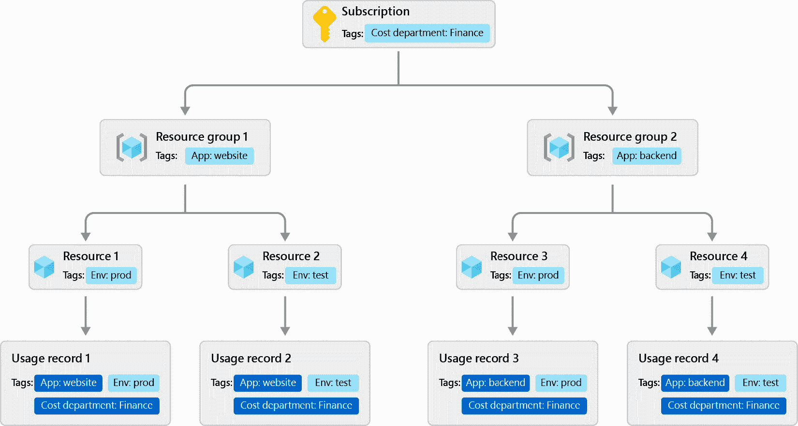
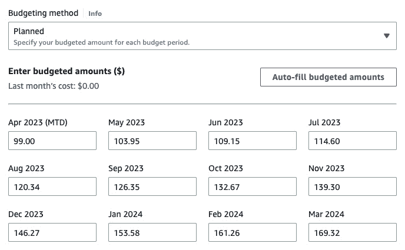
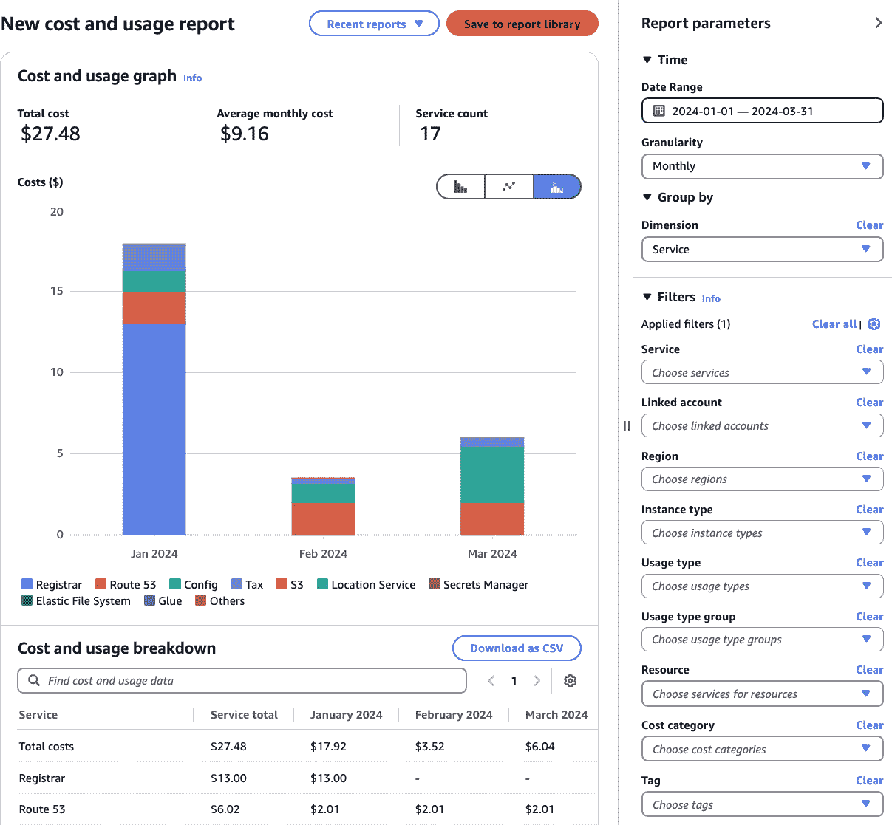
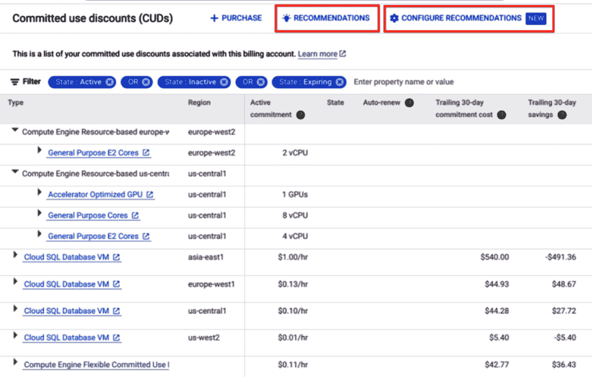
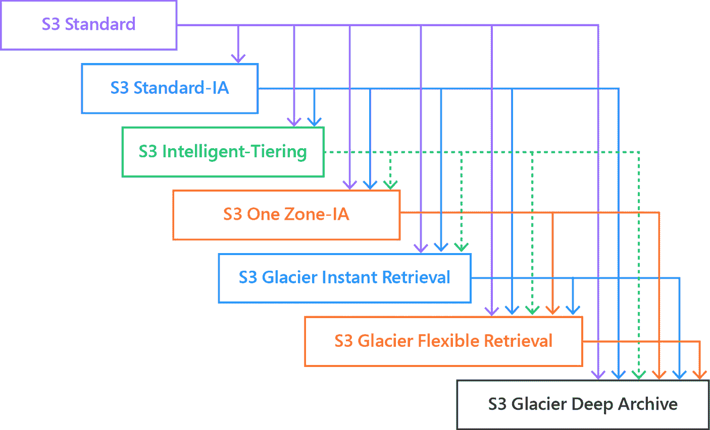
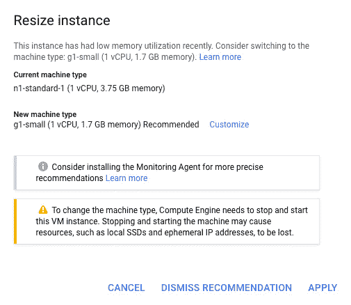

# 第四章：FinOps – 如何避免账单震惊

*“FinOps 是将财务责任引入云的可变支出模型的实践，使分布式团队能够在速度、成本和质量之间做出商业取舍。”*

*– J.R. Storment，FinOps 基金会执行董事*

我们如何知道我们投入的资金应该带来什么回报呢？为了进一步探讨这个问题，我们可以将其与建造房屋并需要设定预算的情况进行比较。我们知道需要多少个房间，需要多大的车库空间，依据气候区域的不同，我们还需要多少隔热层、空调或供暖能力。这些是立即的建造费用。然而，我们还需要考虑长期的因素。我们是否想要更好的隔热和太阳能系统以减少持续的电力费用？这意味着更高的前期成本，但也有长期的持续成本降低效益。

同样，我们需要考虑 FinOps 的短期和长期收益。这变得更加复杂，因为我们的云环境比静态建筑施工更具动态性。FinOps 需要成为一种持续的纪律。那么，我们如何在支付合理价格、实施合适解决方案、满足时间要求并获得最佳价值之间找到正确的平衡呢？

“*价格是你支付的；价值是你得到的*”——这是沃伦·巴菲特的名言。换句话说，我们需要关注投资带来的价值，而不仅仅是看价格。在我们的案例中，投资指的是我们在构建企业云平台和在其上运行的应用程序时所付出的所有努力。我们需要评估获得的价值，如业务灵活性和增强的韧性，而不是单纯关注成本降低。

本章的目标是理解我们如何在云原生环境中获得良好的价值。我们将重点关注以下几个方面：

+   错失良好的标签实践的潜力

+   未充分利用云原生工具

+   忽略不明显的**云服务提供商**（**CSP**）费用

+   过于专注于节省成本，而忽略驱动价值

这其中有很多内容，我们将逐步进行分析。在我们能够衡量价值、提升成本治理、并处理成本所有权之前，我们将先探讨如何在云中启用成本分配。一切都从元数据开始，也叫做标签或在云资源管理范围内的标记。让我们深入了解一下。

# 错失良好的标签实践的潜力

**标签**是作为云资源元数据的键值对。**标签**是一种将标签分配给云资源以描述它们的做法。标签有助于高效地组织、管理和追踪资源。

标签不仅有助于提供成本细分，还能帮助管理、识别、组织、搜索和筛选资源。标签的好处如下：

+   **资源管理**：标签有助于按产品或项目、环境、成本中心、业务单元等类别组织资源。这使得搜索特定资源变得更加容易。

+   **安全性和合规性**：标签可用于强制执行身份和访问策略，并控制对资源的访问。例如，如果某个资源标签描述了一个存储信用卡信息的数据库，我们可以实施一项策略，确保人类无法读取该数据。

+   **自动化**：标签可以用于驱动部署和自动扩展行为，或自动关闭资源。

+   **操作效率**：标签在发生事件时有助于故障排除，因为它们提供了额外的上下文。它们还可用于精细化监控，并驱动警报行为。

+   **成本管理**：标签有助于分配和跟踪成本。我们可以使用它们来细分成本并组织我们的资源。在本节的其余部分，我们将重点关注这一方面。

即使标签简单到只是描述键值对，许多问题仍然可能出现，我们将讨论两种反模式。

## 常见的反模式

与标签相关的反模式通常始于我们在标签标准或标签强制执行方面的不足，接下来我们将深入探讨这些领域。

### 缺乏标签标准

第一个反模式是缺乏标签标准，我已经见过很多次。这种反模式发生的原因有很多。可能是由于云原生采用没有得到足够关注，因为一个组织试图有机地扩大云足迹，并且云迁移始终没有取得进展。也可能是因为公司陷入了被动模式，无法进行战略性操作，或者是因为优先事项冲突。

事情通常是这样发展的：一个组织正在采用云技术。然而，云采用模型存在一些漏洞，特别是在治理、自动化、标准化和服务目录提供方面。因此，分散的产品团队在配置云资源时管理方式各异。应用标签是可选的。尽管团队最终会决定应用标签，但不同团队之间的标签不会一致。

这意味着我们将会有一些资源根本没有标签，或者只有部分标签，而且这些标签本身很可能不一致，无论是键、值，还是两者都不一致。因此，我们将错过许多 FinOps 的守护措施，我们将在分析第二种反模式后进一步探讨这一点。

### 缺乏标签强制执行

第二种变体是有强制的标签标准，但未进行强制执行。因此，我们的标签覆盖率可能会比第一种变体更好。然而，我们仍然依赖于人工的完美执行。

每个工程师都必须确保为每个云资源分配了所有标签。这意味着键和值必须完美匹配。

在一次咨询项目中，我分析了不同云环境中的标签。随着时间的推移，成本中心的标签已经多次更改。客户使用了以下几种组合作为关键字：“cost-centre”（英国拼写）、“cost-center”（美国拼写）、“costcentre”（全小写）、“CostCentre”（Pascal 命名法）、“costcentre”和“costcenter”。

由于标签在 AWS 中是区分大小写的，这导致了六种不同的标签类别。因此，计费报告也以六种不同的变体进行了可视化，要求手动修正才能实现成本分解。另一个常见的错误是使用产品所有者的姓名作为标签值。然后，个人离开组织并且他们的账户被停用。这样我们就会有一个无效标签，甚至不知道之前的应用程序所有者属于哪个部门。如果没有所有权空缺，这会让追踪新的应用程序所有者变得困难。

正如我们所能想象的那样，这并不是一个令人兴奋的活动，每个月都必须执行，并且增加了人为错误的风险。

## 不良标签实践的后果

如果没有足够的标签，我们将面临多个影响：

+   **成本分配变得具有挑战性**：我们无法将成本分配到成本中心、利润中心或部门。这使得追踪和管理预算变得困难。成本分配不清晰的常见结果是缺乏所有权和问责制。

+   **成本优化变得具有挑战性**：没有足够的标签，我们将很难识别未充分利用或未使用资源的所有者。因此，没人会采取行动来调整资源规模或关闭不必要的资源。

+   **财务报告不准确**：财务报告依赖于准确的标签。这意味着我们需要手动分配成本，或者接受不准确的报告。在后一种情况下，意味着我们无法公平地分配成本。

+   **标签不完整也会导致预算不精确**：这可能导致预算超支和预测不足。如果没有正确反映当前的支出，我们将难以预测未来的费用。

+   **缺乏显示回溯或分摊回收费流程**：“分摊回收费后果”模型，即将费用计回发生费用的部门或产品团队，极度依赖于准确的标签。没有准确的标签，实施一个公平和透明的回收费系统变得困难，并且需要大量人工处理数据。使用显示回溯模型时，部门会看到其云支出，但不会实际计费。标签不足可能减少透明度，导致争议、混乱，甚至可能产生不信任。

+   **缺乏所有权**：如果没有有效的回收费流程，就无法明确所有权，而明确所有权对于实现良好的价值至关重要。因此，我们将错失良好的 FinOps 实践，包括超支，因为我们未充分利用云资源。

+   **缺乏策略执行**：云治理政策通常依赖标签来强制执行规则和最佳实践。不足的标签化可能削弱治理，导致成本失控。标签提供了对组织内资源使用情况的可见性。没有标签，很难确保资源的使用符合政策要求，并且效率得以保障。

## 发现未打标签资源

不足的标签化的常见根本原因包括部署方法不一致、未利用策略即代码框架、缺乏标签标准以及缺少自动化，导致标签强制执行的遗漏。验证标签键和值将为我们带来确定性。根据云服务提供商（CSP）的不同，有不同的方法来实现这一点。我们现在从 AWS 开始研究。

### AWS 中的未打标签资源

如果我们有访问控制台或云 Shell 的权限，可以自己进行验证。如果我们想在 AWS 账户中查找未打标签的资源，可以使用 AWS 资源浏览器中的资源搜索功能，并使用`tag:none`过滤查询。如我们所见，这个方法相当直接，接下来我们将探讨如何在 Azure 中解决这个问题。

### Azure 中的未打标签资源

在 Azure 中，我们可以使用 PowerShell 命令，如下所示：

```
$resources = Get-AzResource
$untaggedResources = $resources | Where-Object { -not $_.Tags }
$untaggedResources | Format-Table Name, ResourceType, ResourceGroupName, Location
```

在前面的代码片段中，发生了以下操作：

+   第一个命令获取所有资源

+   第二个命令过滤所有未打标签的资源

+   第三个命令以表格格式显示所有未打标签的资源，表格展示了资源名称、资源类型、资源组名称以及位置（区域）。

现在我们将研究在 GCP 中所需的步骤。

### GCP 中的未打标签资源

在 GCP 中，我们也可以使用云 Shell 搜索未标记的资源，如下所示：

```
gcloud asset search-all-resources \
--scope='projects/<project_name>' \
--asset-types='container.googleapis.com/NodePool' \
--filter=-labels:*
```

如果我们还没有启用云资产 API，可以通过第一个命令来启用。第二个命令列出了所有没有标签的 Google Kubernetes Engine 节点池。在此范围内，我们需要将`project_name`替换为我们的项目名称。`labels:*`过滤器会将搜索结果限制为无标签的资源。

如果我们没有控制台或云 Shell 的访问权限，可以请有权限的人运行前面的命令，验证标签的覆盖范围和准确性。否则，我们还可以联系管理 CSP 账单的人员，验证当前的成本拆分是否准确。验证这两个选项是个好主意，因为组织内部可能会有不同的看法。在这种情况下，组织一个研讨会，通读证据，包括最后的账单、CSP 的成本仪表板，并运行一些命令验证标签，将非常有帮助。

一旦了解了我们当前的状态和不足之处，我们必须确定我们的目标状态。对于本章内容，我们将只专注于与 FinOps 相关的标签，而不是可能对安全、合规性、可观察性或其他操作方面有帮助的标签。*良好的实践是什么，* *我们从哪里开始？*

## 采用标签分类法

我们将从定义标签分类法开始，并为标签键、值和语法建立标准。

### 标签键

我们需要知道我们希望从标签中提取什么信息，并指定有效且必需的标签值和键。通常，这些信息包括以下内容：

+   **成本中心和/或业务领域/单位或产品组合名称**：如果成本中心与业务单位之间没有 1:1 映射，且两者对费用回溯或费用分摊方法都相关，我们将需要同时使用这两个标签。

+   `dev`、`test`、`uat`、`preprod` 和 `prod` 也应该在我们的标签策略中得到考虑。这为我们提供了良好的视角来验证我们在每个环境中的花费。

+   **业务负责人**：这应该是职位名称或角色，而不是个人的名字。它帮助我们识别业务负责人，尤其是在我们采用费用回溯模型并需要提供成本细目时。如果我们使用费用分摊模型，我们就知道该将账单信息发送给谁，并提供成本建议和预测见解。

+   **技术负责人**：这也需要是一个职位名称或负责人，这些信息与业务负责人一样有用。有时这可能是组织内的相同职位职能，在这种情况下，我们可以将这两个标签值合并。

+   **应用程序和/或服务标识符**：这些信息对于将数据与我们的应用程序清单关联非常有用。通过这种方式，我们可以回答有关应用程序清单的成本相关问题。添加应用程序功能标签也是有帮助的。

    *应用程序功能* 有时也称为 *应用程序角色*，它描述一个组件是否代表数据库、展示层、业务逻辑层或数据层。它对于准确的费用回溯或费用分摊模型并非必需，但它为我们提供了关于花费的良好洞察。它能告诉我们 CSP 成本是发生在展示层、业务逻辑层、集成层还是数据层。当我们考虑重构应用程序时，这为我们提供了额外的数据点。

### 标签值

我们还需要标准化我们的标签值。我们必须达成一致，决定是使用单一值还是可以在键中使用列表。值需要清晰定义。例如，成本中心的正确格式是由两位数字和四个字符组合而成，或者有效的应用程序功能，如`db`代表数据库，`api`代表 API 层，`int`代表集成层，等等。理想情况下，这些标签应该作为 CI/CD 管道的一部分进行分配。在这种情况下，我们可以通过我们的政策即代码框架验证键和值。

### 语法

标记语法对键和值也很重要。语法示例包括全部小写 (`costcenter`)，驼峰式 (`costCenter`)，帕斯卡式 (`CostCenter`)，蛇形式 (`cost_center`) 和连字符形式 (`cost-center`)。无论使用哪种语法，它都需要保持一致，并且我们需要检查该语法是否被我们的 CSP 支持。这适用于标记键和值。

## 持续改进

一旦我们建立了我们的分类法，我们需要继续建立其他标记最佳实践，以实现良好的成本控制治理模型。

### 标记自动化和强制执行

我们希望确保每个支持标记的资源都有一个有效的标记。我们可以使用工具如 AWS 标签策略和 AWS Config，Azure 策略或 Google Cloud 资源管理器。这将确保合规性并防止未标记的资源。如果我们有服务目录，标记应该是强制的输入参数。

对于应用功能，我们可以在服务目录项中包含默认标记，例如数据库或 API 网关。我们有多种方式可以确保良好的标记实施：

+   我们可以使用**OPA**或我们 CSP 的策略框架来实施政策，以确保未标记的资源除了沙盒环境外永远不能被部署。

+   当我们使用 CSP 的开发框架时，我们也可以通过类似单元测试的方法验证标签和标签。AWS **云开发工具包** (**CDK**) 支持断言，我们可以用它来验证标签。Azure 资源管理器 (**ARM**) 模板测试工具包可以用来验证 Bicep 或 ARM 模板的结构和属性。在 GCP 中，我们可以使用 Google Cloud SDK 编写单元测试来验证标签。

+   一些**基础设施即代码** (**IaC**) 工具，如 Terraform，支持在部署级别上声明标记。这样，我们可以在部署级别上定义通用标记，如*成本中心*，并且只需要定义在部署或服务目录级别未定义的细粒度标记。

如果我们拥有一个政策即代码框架，我们可以强制执行标记，并拒绝创建未标记或标记不足的云资源。这样的政策可能会在我们自动定期清除资源的沙盒环境中跳过。如果我们已经建立了成熟的 DevSecOps 文化，我们希望只能通过我们的 CI/CD 管道修改标记。在这种情况下，我们可以使用防护栏来确保标记不能通过人员访问修改。

### 使用云原生工具进行定期审计

我们应定期审计标记，以确保其正确应用和更新。CSP 提供工具，如 AWS 标签编辑器，Azure 成本管理和 Google Cloud 资源管理器。一旦生成合规性报告，我们可以识别缺失或不正确的标记并采取纠正措施。

### 持续改进

我们工具或审计中的任何发现需要得到解决，确保它们能够永久修复，避免成为长期负担。一旦我们建立了标签系统，就能获得有价值的洞察。以下 Azure 图示说明了如何使用标签继承功能。启用后，标签继承会将计费、资源组和订阅标签应用于子资源使用记录。在这种情况下，我们就不需要为每个资源打标签了。这是一个非常强大的功能。



图 4.1 – Azure 示例，展示标签继承（来源：[`learn.microsoft.com/en-us/azure/cost-management-billing/costs/enable-tag-inheritance`](https://learn.microsoft.com/en-us/azure/cost-management-billing/costs/enable-tag-inheritance))

现在，我们知道如何为我们的组织设置一个稳固的标签实施。一旦我们建立了一个完善的标签框架和流程，许多其他与 FinOps 相关的服务都可以利用它，并提供良好的可视化效果。这包括成本异常检测、预算和成本警报、资源优化建议，以及制定承诺支出折扣计划的规划。

我们已经讨论了标签反模式以及如何利用云原生服务将其修复并转化为最佳实践。我们尚未讨论第三方工具，现在我们将探讨它们是否有存在的空间。

# 未充分利用 CSP FinOps 服务

主要的 CSP 提供商提供各种 FinOps 服务，包括成本分析工具、成本报告、预算管理、资源优化建议、节省计划、成本趋势分析、预测和警报。这些服务已经很成熟，但并不总是被使用。如果成本节约没有成为优先事项，尤其是在安全性、韧性和合规性等其他挑战需要优先解决的情况下，这种情况尤其明显。在我们探讨反模式之前，我们要明确一点，商业第三方成本管理工具是有其用武之地的。

有两个主要驱动因素可能促使我们考虑使用第三方工具进行成本管理和 FinOps 实践。第一个是如果我们有多云或多云策略。在这种情况下，我们可能需要跨多个云平台获得统一的视图。这将取决于我们的操作模型。如果我们准备在每个云平台使用不同的 FinOps 服务（例如，GCP 和 Azure），那么我们就不需要走这条路。如果团队使用多个云平台，这会增加成本管理的复杂性。也许这是一个集中式的云平台团队，负责创建成本仪表盘。

第二个驱动因素是我们是否希望在我们的 FinOps 方法中包含 CSP 平台以外的内容——例如，包含 CI/CD 工具或 SaaS 监控解决方案。在这种情况下，我们必须定义我们的需求并评估第三方工具的好处。一些 CI/CD 工具具有原生的成本控制功能，比如 GitHub 的计划和使用功能。如果我们能接受查看多个仪表盘，可能就不需要投资其他的 FinOps 第三方工具。我们需要考虑成本的权衡。我们在流程上花费的额外时间与商业产品的许可证费用相比是多少？现在，是时候探索我们如何陷入不利用云原生 FinOps 服务的反模式了。

## 常见反模式

我们的云服务提供商（CSP）所提供的 FinOps 服务的力量和范围常常被忽视，接下来我们将探讨两个相关的反模式。

### 账单会自行解决

在云采用初期或组织试图通过自然增长的方式扩大云端存在而未实施费用分摊模式时，不使用任何成本控制服务是很常见的。

我在生产规模上第一次的云端经验是在一个政府组织。我的经理知道我有 AWS 经验，他给了我他的信用卡，好让我为一个项目团队创建 AWS 账户。这种情况后来发生了好几次。几个月后，在十二月，我们举办了年终庆祝活动，费用是通过同一张信用卡支付的。因此，信用卡额度用完了，AWS 的月度付款在一月被拒付。

在二月，AWS 试图收取一月和二月的费用，导致了另一笔未付款项的情况，三月也发生了同样的事情。到那时，我们已经收到了几封自动警告邮件，警告如果未付款，AWS 账户将被关闭。

如果我们将成本管理置于更高优先级，我们本可以设置警报并主动反应。相反，我们只能对 AWS 发来的邮件作出反应，并且涉及了采购部门。由于政府组织有严格的流程，他们未能迅速作出反应。最终，支付方式从信用卡支付转为持续采购订单。然而，成本控制直到一年后才使用云原生功能实现。

几个月后，一位项目经理要求我将账单货币从**美元**（**USD**）更改为澳大利亚元，我照做了。不幸的是，采购部门未能准备好支付下一张发票，因为货币与采购订单中的货币不匹配。如果我们熟悉内部成本管理流程，这种问题是可以避免的。部门之间的协作有助于跨越这些组织边界。我们看到一个行之有效的方法是组建一个跨职能团队，定期与扩展团队代表召开会议。这些代表包括采购、财务和招聘部门。这样可以帮助我们提前发现任何潜在问题并迅速解决。这个故事应该清楚地表明：*工具只是成功采用 FinOps 的一部分*。在我们的运营模式中，清晰的流程和责任的定义至关重要。现在是时候研究这个反模式的另一种变体了。

### 匆忙使用第三方产品

我们已经探讨了为什么商业第三方产品可能有意义的原因。现在我们将讨论一个不需要使用第三方产品的场景。这两种情况有一个共同点：低水平的云采用成熟度。在这种变体中，我们希望快速取得成功。

可能的原因是，由于其他紧迫问题，如安全性、合规性和可靠性（特别是在故障后），价值实现从未成为优先事项。另一个原因可能是我们正在将财务策略从成本中心转变为利润中心。因为需要加快进度，我们没有充分考虑长期的成本影响。

在之前的公司中，我曾遇到过这样的情况：我们已经在一个开发组织中实施了基础的成本管理能力，包括成本拆分、预测、预算提醒、异常检测和承诺节省计划。不幸的是，云平台团队完全被其他团队的帮助工作压得喘不过气来，没有足够的时间来细化和严格测试这些功能，最终无法将其发布到生产组织供所有业务单元使用。

与此同时，新财年开始了，公司也从成本中心转变为利润中心。这意味着成本需要精确分配。然而，遗留应用的标签实施存在缺口。因此，一位团队经理不得不每月花费超过一天的时间来正确分配云账单。**领导团队**（**LT**）注意到了这一点，但他们只了解了一半的情况。他们低估了已经在生产组织中部署的现有成本管理服务目录项目所带来的业务利益。

一位 LT 成员参加了一个会议，并看到了一款具有漂亮用户界面的 FinOps 工具的演示。他感到好奇，在演示后提出了一些问题。仅此就足以让销售团队将公司标记为一个重要机会。供应商随后通过午餐邀请进行了跟进。根据产品的好评程度来看，那顿午餐一定非常棒。接下来的步骤是非常强烈地希望实施价值验证。由于公司运营在一个高度监管的环境中，这导致了一个全面的供应商选择过程。

这种模式导致我们将自己锁定在持续的支出中。第三方 FinOps 许可费用通常基于我们的云支出。云支出越高，我们为商业工具支付的费用就越多。

## 影响

通过反模式，我们已经看到了它的一些后果，现在我们想简要总结一下：

+   **缺乏价值优化**：如果我们没有使用 FinOps 工具，就无法优化我们的云原生堆栈的价值。我们将无法优化资源并做出正确的财务权衡决策，例如是否选择节省计划。

+   **缺乏成本可见性**：我们将无法提供高效且正确的费用分摊方法。因此，我们无法将责任指向业务利益相关者，这意味着缺乏优化价值实现的动机。

+   **增加的供应商管理工作量**：如果我们使用第三方产品，我们将需要管理一个额外的供应商。我们之前讨论过合作伙伴关系。这是一个战略合作伙伴关系吗？

+   **增加的持续成本**：如果我们使用第三方工具，我们将支付许可费用，这通常基于我们的云支出。我们花得越多，许可费用就越高。供应商没有激励去减少我们的云成本，因为那样也会减少他们的收入。

+   **手动负担和财务报告延迟**：我们将需要更多的人工工作来管理财务报告，这也会延长报告时间。因此，将很难实时了解费用或相应调整预算和预测。

即使我们具备了正确的工具，我们仍然需要建立与我们的运营模型对齐的成熟流程和责任。否则，我们将无法发挥工具的潜力。接下来我们将探讨流程和云原生服务。

## 从 SDLC 视角看成本管理

我们现在正在逐步了解 FinOps 的能力，并将其与 **软件开发生命周期**（**SDLC**）的简化概述对齐。下表提供了 SDLC 阶段的概览以及该阶段的 FinOps 服务的逻辑名称。我们将逐一讨论每个阶段，并探讨在为我们的应用堆栈建立良好的商业价值时需要考虑的事项。

我们已经讨论了标签管理，它需要在*实施与测试*阶段建立，这一阶段是该阶段的主要内容。因此，在 SDLC 流程中，我们将在讨论时将这一阶段与*部署*阶段合并。我们可以看到，*维护与改进*阶段需要考虑的事项最多。我们需要吸收这些洞察，以便在我们的迭代交付中规划和设计改进。

| **计划与设计** | **实施与测试** | **部署** | **维护与改进** |
| --- | --- | --- | --- |
| 设计原则 | 标签策略 | 预防性警戒 | 侦测性警戒 |
| 成本计算器 | 标签管理 | 组织设置 | 成本探索器 |
| 预算和警报 | 标签执行 | 自动化成本估算 | 顾问工具 |
| 成本效率架构设计 | 数据生命周期 |  | 成本异常检测 |
|  |  |  | 资源优化建议 |
|  |  |  | 承诺支出 |

表 4.1 – SDLC 阶段及支持的 FinOps 服务

接下来，我们将查看支持第一阶段的 FinOps 服务：*计划和设计*。

### 计划与设计

FinOps 在*计划和设计*阶段的考虑事项和工具如下：

+   **设计原则**：内部的指导原则和 SLA（如 RTO 和 RPO）将推动我们的成本模型。各个 CSP 提供的 Well-Architected 框架也将提供指导。如果一个解决方案需要具备弹性，它将有一个故障转移数据库，这会增加成本。熟悉我们的需求后，我们可以开始使用绘图工具设计解决方案。现有很多可供选择的工具，Diagrams.net 是一个免费的绘图工具，而 Lucid Chart 是一个流行的商业化产品，具备企业级协作功能。该图表将帮助我们全面可视化我们希望使用的服务。

+   **成本计算器**：我们可以使用 CSP（云服务提供商）的定价计算器。AWS 定价计算器、Azure 定价计算器和 Google Cloud 定价计算器都提供了用户友好的界面，并支持大部分云服务。它们都支持承诺支出节省计划，提供可共享的计算 URL，并支持报告导出。使用所有成本计算器时，我们需要特别注意选择正确的区域，因为价格会有所不同。我们还需要估算使用量。对于 API 服务，我们通常需要估算 API 调用次数；对于数据服务，我们需要知道数据量、增长情况以及是否需要故障转移数据库或额外的只读数据库。对于任何出站数据，例如从一个云平台到另一个云平台，我们还需要知道数据量。如果我们实现了一个新解决方案，这些数据中的一部分将包含在业务案例和设计中。对于其他指标，我们需要做粗略估算，并可以在*设计*阶段进行调整，或者在解决方案部署并投入使用后建立反馈循环。

+   **预算和警报**：所有主要的云服务提供商（CSP）都提供预算和警报服务。预算可以通过不同方式定义——可以是静态方式，即定义一个月度预算或月度百分比增长，也可以创建动态预算。通过机器学习（ML）增强的服务可以从之前的开支中学习，并预测未来几个月的成本趋势。这是一种减少人工操作的方法，同时仍能利用成本防护措施。以下 AWS 截图显示了一个为期 12 个月的预算定义。**自动填充预算金额**功能会基于初始预算数额和月度百分比增长预填充过去 11 个月的数据。



图 4.2 – AWS 示例 – 预算定义（来源：AWS 控制台）

然后，预算可以用于配置触发警报，如果我们达到某个阈值，或趋势表明我们将在定义的周期结束时超出预期金额。这些警报有助于在我们收到下一个账单之前发现意外成本。

+   **面向成本效益的架构设计**：当我们使用成本管理和预测工具时，可以实现成本透明度。这使得我们能够将财务因素纳入架构决策中。例如，我们可能会转向无服务器架构，并为容器选择更小的实例，因为水平扩展具有更高的成本节省潜力。能够做出明智的决策，也有助于我们规划在软件开发生命周期（SDLC）后期可以使用的适当防护措施。

### 实施、测试和部署

这些是我们在*部署*阶段可以采取的措施。第一个是*实施和测试*阶段的一部分，其他则属于部署阶段：

+   **数据生命周期**：我们可以在应用代码中建立数据生命周期。例如，不同的存储层次将是数据在其生命周期中的存储位置。对于操作数据，我们可以定义数据在热存储层保存 3 个月，然后转移到低频访问存储层，再保存 6 个月后转移到归档存储层。对于受监管的工作负载，如与 PCI 相关的应用程序，我们可以确保数据仅在 7 个月后删除。通过建立预定义的生命周期，我们可以降低成本并在组织中建立标准化。

+   **预防性防护措施**：此组中的第一个与部署相关的度量标准是预防性或主动防护措施。我们可以限制在开发环境中允许的实例大小。防护措施将确保超过某一大小的实例无法部署。重要的是要传达这些限制，使其被理解并且不会在开发团队中引发挫败感。

    另一个与成本相关的部署控制措施是拒绝在工作负载账户中创建高成本服务，因为这些服务已经在共享账户中建立，并且可以从那里消费。可以通过 AWS 服务控制策略、Azure 策略、GCP 组织策略服务或 **Open Policy Agent**（**OPA**）策略建立预防性控制措施。我们还需要审查访问控制，以确保只有授权人员能够部署到生产环境中。这有助于防止意外或未经授权的支出。我们还在 *第三章* 中探讨了控制措施和非成本相关控制措施的好处。

+   **组织设置**：为你的云环境设置一个组织结构也有助于成本控制和拆分。不同的 CSP 提供此功能的方式不同。在 AWS 中，这被称为 AWS Organizations，微软称其为 Azure Management Groups，而在 GCP 中，它被称为 Google Cloud Resource Manager。

    我们可以在 **组织单元**（**OU**）级别应用预防性控制措施。在这种情况下，我们“开发”组织单元下的任何账户都无法部署超大实例。我们还可以使用组织单元结构进行成本拆分，例如，如果我们将所有共享服务（如应用日志或数据湖）放在一个共享服务的 OU 下。

+   **自动化成本估算**：一些部署工具提供即将部署的栈的成本估算。HCP Terraform 提供了这一功能，此外，还有一些开源工具可以嵌入到我们的 CI/CD 管道中。开发者可以在继续部署之前查看估算的成本。这有助于发现一些小错误，比如选择了错误的实例类型，而这些错误可能会带来巨大的成本影响。

### 维护和改进

我们现在将探讨在 *维护和改进* 阶段需要采取的措施。最重要的是，我们需要建立正确的流程、责任归属和问责机制，以便有效利用这些工具。如果没有人查看仪表板或没有采取任何行动，那么即便有很好的仪表板和自动化推荐也毫无意义。通过这一阶段获得的见解和经验，我们可以建立一个反馈循环，帮助我们未来改进 FinOps 实践：

+   **侦测性控制**：侦测性控制允许部署，但不符合规定的规则会在仪表板上标记出来，并触发通知。我们可以在我们的开发 OU 中对超大实例应用此策略。这样，我们就不会阻止团队的部署，但仍然可以提供对这一问题的可视化。通常的做法是先在侦测模式下测试控制措施，然后再将其转化为预防性控制。

+   **成本探查器和使用报告**：AWS 成本探查器、Azure 成本管理和 GCP 成本管理有许多相似的功能，帮助我们获得成本见解。这三种服务都提供按服务、云资源、项目、账户或资源组的成本细分。可定制的成本报告和仪表盘有助于可视化支出模式并识别成本驱动因素。以下来自 AWS 控制台的屏幕截图展示了成本和使用报告。我们可以看到按服务细分的成本，并可以修改时间范围的粒度。



图 4.3 – AWS 示例 – 成本和使用报告（来源：AWS 控制台）

+   **建议工具**：这些工具提供了减少支出的见解。AWS 可信顾问提供关于各个改进领域的见解，例如，未充分利用的实例。Azure 顾问采取类似的方法，并提供成本建议，例如购买 Azure 预留实例。GCP 也有类似的服务——Google Cloud 推荐器，其中包括删除未使用的磁盘等成本相关建议。这些见解有助于我们初步了解哪些地方可以改进。

+   **资源调整建议**：资源调整建议帮助我们调整工作负载的大小。这有助于降低成本，并将节省下来的资金用于其他地方。AWS 提供资源调整建议和计算优化器服务来协助此项工作。此功能部分包含在 GCP 云推荐器和 Azure 顾问中，正如我们之前讨论的那样。GCP 和 Azure 还将资源调整建议作为 Azure 成本管理与计费服务和 Google Cloud Active Assist 的一部分。重要的是要先在低环境中测试资源调整，避免直接进入生产环境以防止出现大小问题。

+   **成本异常检测**：这些服务帮助我们识别异常的流量激增和异常的支出模式。我们可以触发警报，立即接收通知并进行调查。异常模式的原因可能是部署中的错误。AWS 的服务叫做 AWS 成本异常检测，Azure 和 GCP 也在各自的 Azure 成本管理与计费服务和 Google Cloud 成本管理服务中提供此功能。

+   **承诺支出**：承诺支出计划是减少我们云账单的另一种方式。承诺支出可以应用于各种资源类型，如实例（虚拟机）、容器或 FaaS。计划可以有一年、两年或三年的时长。推荐选择一年期计划，因为计算技术总是在发展。一年后，我们可以选择更新的、更强大的实例代际计划，以应对更高的负载。我们可能想要应用于节省计划的几种策略：

    +   首先，如果我们有一个去中心化的治理模型，那么各业务单元或产品组合将负责制定他们的计划。他们最了解自己的应用程序，同时也清楚业务目标和预期增长。

    +   第二个战略方面是，我们可能想要有多个储蓄计划。这样，我们可以错开它们并更频繁地调整。一个储蓄计划可以从 1 月开始，另一个从 7 月开始。这给了我们每年更新两次的灵活性。

    以下 GCP 截图显示了**承诺使用折扣**（**CUDs**）。它向我们展示了当我们选择通用内存实例和 Cloud SQL 数据库虚拟机时，潜在的成本节省。



图 4.4 – GCP 示例 – 承诺使用折扣（来源：[`cloud.google.com/static/billing/docs/images/cud-dashboard.png?dcb_=0.5258774275081315`](https://cloud.google.com/static/billing/docs/images/cud-dashboard.png?dcb_=0.5258774275081315)）

正如我们所看到的，如果我们想要充分利用 CSP 提供的所有工具，就有很多内容需要消化。在进入下一部分之前，我们想要再次强调几点：

+   我们总是在低环境中测试与大小相关的更改，然后才进行生产环境的更改。

+   工具很棒，但我们需要责任感和可追溯性，以确保行动得到执行。

+   我们需要了解我们的应用程序在做什么，以便做出明智的权衡决策。

现在，我们进入云成本部分，这部分并不直观，可能在定义我们的云策略或设计时被忽视。

# 忽略不明显的 CSP 成本

“*每天四美元的咖啡习惯，20 年后的实际成本是 51,833.79 美元。那就是复利效应的力量*，”《复利效应》一书的作者达伦·哈迪（Darren Hardy）说道。

那四美元可能不包括服务税，那么复合效应就更大了。我们到底想表达什么呢？云中的成本模型比一杯咖啡要复杂得多。我们过去可能遇到过咖啡费用的惊讶，但几乎可以肯定，我们在云中遇到过某些成本上的“惊醒”，要么是因为在演示后留下了一个实例，要么是因为我们没有考虑到某些成本方面。

不同的抽象层级，如 IaaS、PaaS 或完全托管服务，具有不同的价格组件。数据库和存储解决方案、API 服务、日志记录和监控解决方案也是如此。我们使用的云资源类型越多，成本的复杂性就越大。尤其是在我们拥有混合云架构时，这种复杂性更加突出，特别是当我们使用多个 CSP 时，这就形成了多云或混合云策略。这些复杂的场景增加了意外费用的可能性，尤其是在设计时没有创建成本估算，且没有将实际费用与计划费用进行对比验证时。问题在于，我们越是推迟发现意外费用，我们的架构就越会演变，但可能朝着我们看到成本影响时会后悔的方向发展。等待的时间越长，修复问题就越困难。因此，我们希望揭示一些常见的错误，这些错误会导致这种反模式。我们从第一个开始。

## 常见的反模式

一些持续的 CSP 费用并不显而易见，如果我们在架构中没有解决这些问题，可能会不必要地增加我们的账单。接下来我们将讨论两种常见的反模式。

### 忽视数据传输费用

将数据导入我们的云平台通常不会产生数据传输费用，因为 CSP 希望吸引客户将更多应用程序带入其云平台。然而，其他类型的传输费用则不同，其中一些费用有可能被低估，甚至被忽视。我们将讲解一些常见类别，它们可能导致意外费用。由于价格本身不断变化，我们将关注需要考虑的领域，而非具体价格：

+   **出口传输费用**：当我们将数据从 CSP 导出到互联网、另一个云平台或我们的数据中心时，会产生这些费用。在之前的一次项目中，一家云咨询公司帮助搭建一个大规模数据湖解决方案。该方案需要将数据持续导出到一个尚未迁移到云端的、仍在本地运行的数据分析平台。该咨询公司提供了一个成本预测。CSP 指出，他们在成本估算中没有看到出口数据传输费用。这个事实不知为何被忽视了。设计决策是基于出口数据费用没有被计入持续成本的假设。结果发现，出口费用每年可能会达到数十万美元。这导致了严重争议。咨询公司不得不自掏腰包解决问题，并且需要赔偿部分已经发生的出口数据费用。

    这个场景还突显出，采用多云灾难恢复（DR）策略是一项非常昂贵的操作。当我们希望在不同的云平台中恢复时，需要确保数据被持续复制。风险和业务连续性团队在想要最小化 CSP 破产风险时，往往会忽视这一点。一个可能的结果是出现多云成本灾难，且很难恢复过来。还值得注意的是，不同地区的价格不同。例如，将数据从美国地区导出到公共互联网，可能比将数据从亚洲或南美地区导出到互联网更便宜。

+   **区域之间的转移费用和跨区域架构影响**：区域之间的数据传输涉及转移费用。与前面的例子类似，价格取决于源区域和目标区域。跨区域复制在我们有雄心勃勃的灾难恢复（DR）目标时很常见。虽然完全的区域故障是可能发生的，但它的可能性非常小。跨区域的 DR 策略可以帮助我们防范这种风险。相比跨洲数据复制，同一洲内的数据传输费用通常较低。

+   **同一区域内的数据传输费用（跨可用区）**：一些云原生服务也会收取同一区域内的数据传输费用。与跨区域和外部传输费用相比，这些费用较低。如果多个 EC2 实例（虚拟机）部署在多个可用区（AZ）之间，并且需要相互传输数据，AWS 会收取区域内的数据传输费用。至少在本书写作时是这样的，随时可能会发生变化。Azure 已取消了虚拟机的区域内传输费用，而 GCP 通常不收取此费用。我们已经指出，这些变化可能会很快发生。因此，使用我们的云服务提供商（CSP）的成本计算器并尝试不同的数据传输量组合是很重要的。

### 没有考虑长期存储费用

当我们赶时间或没有预定义的服务目录项时，很容易忽视解决方案的成本方面。我们通常专注于技术细节，以解决启动或验证价值结果所需的迫切问题。接下来，我们将探讨一些常见的陷阱，这些陷阱会增加 CSP 账单的费用：

+   **数据生命周期**：一个常见的错误是忘记为 Blob 存储或共享驱动器配置数据生命周期。在这种情况下，累积的数据会不断增加。由于 Blob 存储相对便宜，因此可能需要一段时间才能意识到成本的持续增加。存储在数据库、完全托管的日志服务或磁盘卷中的数据价格较高，账单的冲击可能更为明显。下图展示了 AWS S3 可能的数据生命周期转换过程，AWS S3 是一种 Blob 存储服务。我们可以看到，*标准*存储层可以转换为更便宜的存储层。最便宜的存储层称为 *S3 Glacier Deep Archive*，需要一定的数据检索时间。



图 4.5 – AWS 示例 – Blob 存储的数据生命周期转换（来源：[`docs.aws.amazon.com/AmazonS3/latest/userguide/lifecycle-transition-general-considerations.html`](https://docs.aws.amazon.com/AmazonS3/latest/userguide/lifecycle-transition-general-considerations.html)）

+   **磁盘备份和未附加卷**：在一个以前的项目中，我们的任务是为**数据仓库**（**DWH**）解决方案建立一个自愈机制。数据仓库的一部分部署在虚拟实例上。

    这本身就是一种反模式，但它是一个老旧的第三方产品，供应商从未为云环境架构过该产品。我们当时正在处理一个自愈场景，旨在解决实例故障和磁盘卷故障的问题。为此，我们自动化了一个组合方案，包括每小时的快照（即增量备份）和测试环境中所有三个卷的全量备份。突然间，优先级发生了变化，我们不得不在不同的问题空间中帮助解决问题。由于我们希望实现快速的灾难恢复结果，因此在测试过程中没有实现备份数据生命周期。在我们重新专注于自愈解决方案时，已经有数百个备份文件被创建。

    下一张 CSP 账单显著增加。产品经理的第一反应是虚拟高容量磁盘太贵了，它们比较慢的磁盘更贵。但真正的问题在于没有配置数据生命周期。这个缺口很快就会影响到业务，而在那种情况下，确实发生了。

+   **待机数据库或只读副本数据库**：这两种是不同的使用案例。待机**数据库**（**DBs**），也叫做次级数据库，帮助提高可用性。如果主数据库发生故障，待机数据库可以在主数据库自动切换到次级数据库后接管数据负载。如果主数据库的数据量增加，次级数据库或只读副本数据库的大小也会增加。这意味着我们为多个数据库支付更多的存储费用，这一点需要纳入成本考虑。

+   **日志记录**：很少能看到一个清晰的日志记录策略被严格实施。有时我们会看到生产环境甚至记录“信息”日志级别。这会产生大量日志，并且我们需要为此付出代价。如果这个反模式与缺失的数据生命周期结合在一起，那么情况会更糟。我们需要清楚了解需要记录什么，日志文件需要发送到哪里，以及我们需要将日志文件存储在热存储与不常访问的冷存储中的时间。

现在我们已经讨论了与数据相关的成本问题，接下来我们将探讨其他几个成本因素。

## 其他不明显的成本因素

数据传输成本和长期存储成本是非常常见的陷阱，但也有其他因素，我们现在将进行分析。

### 空闲或过度配置的资源

空闲资源可能发生在我们创建概念验证后忘记清理的情况下。它们也可能是手动扩展操作的结果，例如用于产品发布、压力测试或类似黑色星期五的销售活动。然后，团队忘记在事件结束后进行缩减，接下来的月度账单将成为一个严峻的提醒，提醒我们需要再次缩减。主要的 CSP 提供资源优化建议。这些建议可以在控制台中看到，就像我们在下一个 GCP 截图中看到的那样。它们还提供 API 支持，如果检测到资源优化建议，我们可以实现自动化警报。我们还可以自动化实际的资源优化，但这需要在生产环境调整工作负载之前进行前期测试。



图 4.6 – GCP 示例 – 资源优化建议（来源：[`cloud.google.com/compute/docs/instances/apply-machine-type-recommendations-for-instances`](https://cloud.google.com/compute/docs/instances/apply-machine-type-recommendations-for-instances)）

### 合规工具

对于受监管行业，合规性是必需的，而且并不简单。任何支持合规性自动化的服务都会收取费用。如果并非所有工作负载都需要合规性，那么在选择何时和何地使用合规工具时区分开来是有意义的。

如果我们同时使用来自供应商和 CSP 的合规性工具，我们需要确保不重复使用过多。通常，我们无法避免某些程度的重叠，因为我们必须避免漏洞。

### 机器学习服务

**机器学习**（**ML**）服务需要大量的 CPU 功率来训练模型。资源优化和持续利用验证在这里非常重要。例如，我们需要在所需的训练数据量与学习模型中更高准确度的收益之间找到平衡。否则，成本超支几乎是必然的。

### 公共 IPv4 地址

IPv4 地址有限，因此主要的 CSP 开始对分配给虚拟机的公共 IPv4 地址收费。收费很少，但对于大规模部署，我们需要考虑这一点。

在深入分析最常被忽视的成本方面后，我们现在将探讨这些后果是什么。

## 忽略非显而易见的成本的影响

现在我们已经对需要考虑的成本因素有了清晰的理解，我们将探讨不解决这些问题的后果。这里有一个剧透警告：这些影响远不止是增加的 CSP 账单。

### 跨区域不一致的费用标签

一个经常被忽视的方面是，不同区域之间不一定具备相同的功能。某项服务在次要区域可能不存在，或者该服务存在，但只有部分功能。

我在之前的一次顾问合作中遇到过这种情况，当时无服务器数据库服务在两个区域都存在，但其中一个区域缺少几个功能，包括开箱即用的时间点恢复功能。因此，第二个区域需要不同的设计、不同的基础设施即代码（IaC）和不同的灾难恢复测试场景。这些额外的设计、构建和运营工作不会在云账单上体现出来。然而，我们的团队将需要投入更多时间并特别注意细节，操作风险也会增加。

### 架构多区域灾难恢复（DR）策略的影响

如果我们没有考虑到多区域数据传输费用，我们将意识到我们的多区域灾难恢复策略的成本显著超出预算。这将取决于我们需要做出的风险/成本权衡决策。如果我们决定修正方案并转向单区域灾难恢复解决方案，那么我们需要调整我们的架构和实施，并将现有备份迁移到主区域。

### 架构多云策略的影响

如果我们采用多云策略，并且需要在 CSP 之间持续传输数据，数据传输费用将令人震惊。如果我们在选择 CSP 过程中没有考虑到这一点，那么我们已经做出了一个很难回撤的架构决策，尤其是当我们在云端采用过程中已经投入了大量时间。

在这种情况下，我们需要在长期的成本节省、减少运营复杂性和增加的迁移与测试工作之间做出权衡决策。另一个关键点是需要考虑我们可以获得的架构优势。

多云采用的常见后果是，跨云平台只使用共同的基础功能，以确保我们有一致的做法。例如，所有的服务都必须运行在虚拟机或容器中。因此，我们无法充分利用云原生的全部潜力，如托管的 API 网关或数据库。这增加了运营复杂度。通过解开多云策略，我们可以利用这些优势。

### 增加的云端运行时成本

这是最显而易见的影响。成本将高于我们的预算。如果我们不调整架构，这将产生长期影响，特别是当我们将更多的应用迁移到云端，或者应用变得更受欢迎并创造更多流量时，这个问题只会变得更严重。

### 其他影响

如果我们有很多闲置资源，比如未附加到虚拟机的磁盘卷，在发生故障时很难识别出合适的资源。闲置资源仍然会对外部审计产生影响，并增加额外的管理工作。如果我们有闲置的虚拟机在运行，这也会不必要地增加碳足迹，从而影响潜在的可持续发展目标。

这些是关键的影响因素，如果业务收益无法匹配或超过额外的费用，我们肯定要避免这些情况。某些迹象应该促使我们进一步调查，接下来我们将探讨这些迹象。

## 指标

有几个指标可以识别这种反模式。我们现在将逐一查看它们，并从最明显的一个开始：

+   **账单震惊**：我们收到了 CSP 的账单，并且可以看到费用趋势比预期更陡峭，或者有一个大幅波动，无法与之前几个月的费用趋势相匹配。

+   **缺乏洞察力**：在本章前面，我们讨论了 FinOps 工具。如果我们缺乏预算、警报和资源优化建议等机制，那么可能存在一些我们没有意识到的隐性成本。启用这些功能将有助于我们获得更清晰的视图。

+   **缺乏所有权和责任感**：如果产品团队没有动力去优化价值生成，他们就不会有动力去识别意外费用，并将其考虑到架构决策中。

+   **没有承诺的支出计划或抢占实例**：如果我们没有承诺的支出计划，比如 AWS 节省计划、Azure 预留或 GCP 承诺使用合同，那么我们将为计算资源支付全价，例如实例、容器和 FaaS。如果我们有可能出现中断的工作负载，比如批处理作业或低环境中的实例，那么我们需要考虑利用 AWS 抢占实例、Azure Spot 虚拟机或 GCP Preemptible 虚拟机。这些措施应当结合使用，如果其中任何一项没有实施，我们就会出现过度支出的情况，即使在云账单中看不出来。

+   **缺乏战略评估**：如果我们有多云或多区域策略，而且业务价值从未重新评估过，那么很可能缺乏当前的洞察力。

+   **未跟踪的试用服务**：CSP 和 SaaS 提供商提供免费试用。如果我们没有跟踪使用时间或免费配额，当达到限制后，我们将不得不支付额外费用。

+   **没有部署成本预估**：一些部署工具在部署之前提供成本预估。虽然这些预估可能不是 100% 准确，因为数据传输和流量会有所变化，但它们能在我们做错什么的时候提供有价值的洞察。如果我们不小心部署了一个过大的实例，我们可以看到意外的额外费用。

## 纠正措施

现在让我们看看如何才能达到一个良好的目标状态：

+   **前期成本计算**：当我们需要设计一个新方案时，我们会创建一个展示所有触发成本的组件的方案图。此概览将展示我们需要考虑哪些云服务。我们还需要非功能性需求，如数据量指标、请求数量、数据增长、RTO（恢复时间目标）和 RPO（恢复点目标）来制定准确的估算。

    数据流图还可以帮助识别数据传输费用。增强现有架构时也是如此。如果当前状态已经部署并上线，那么我们可以从 CSP 账单中计算出实际费用。然后，我们可以将其与目标状态进行比较，找出我们的费用如何变化。

+   **建立 FinOps 工具**：我们在前一节中讨论了这个问题，*没有利用 CSP 的 FinOps 服务*，所以这里简短提及。FinOps 工具帮助我们建立良好的成本洞察力，并发现不明显的费用。现在，我们了解了数据传输、存储和其他成本陷阱，知道需要注意什么。

+   **架构审查**：一旦方案设计成熟，我们可以进行架构审查。CSP 提供的架构框架将指导我们提出正确的问题并验证设计。我们也可以请咨询公司提供独立意见。对于已经部署的工作负载，我们也可以进行类似的操作。在这种情况下，我们还可以使用前面提到的咨询工具来帮助我们验证当前状态。

+   **服务目录**：服务目录有助于我们实现良好的自助服务体验，且结果可重复。这也有助于我们在成本方面的处理。存储服务目录项可以具有内置的数据生命周期。用户只需要选择所需的标准化生命周期。这样，我们可以确保始终有一个生命周期在使用中。

+   **缺乏防护措施**：预防性防护措施可以防止某些成本影响，包括将非常大的实例部署到开发环境中。另一种预防性防护措施可以是用户只能部署产品目录项或批准的云服务。侦测性防护措施可以在防护措施不符合要求时通知我们。

+   **加密密钥**：客户管理的密钥会产生额外的成本，包括实际密钥存储或版本控制的费用，以及每次操作的费用，包括密钥创建、加密和解密。一些监管框架要求使用客户管理的密钥，甚至有些要求使用专门的密钥存储解决方案。这意味着物理存储是专门为一个云客户提供的。专用服务会有额外的费用，其中包括 AWS CloudHSM（**HSM** 代表 **硬件安全模块**）、Azure Dedicated HSM 和 Google Cloud HSM。

+   **其他架构考虑因素**：如果我们使用**内容分发网络**（**CDN**），我们需要支付额外费用。然而，它会在边缘提供额外的保护。由于数据被缓存于边缘，不是每个请求都需要从我们的后端系统获取数据。因此，根据我们的架构，它可以减少后端组件的数据传输费用，但与不使用 CDN 相比，整体成本仍然较高。

在深入了解意外成本以及如何发现和修正它们之后，我们将探讨如何专注于推动业务价值。

# 专注于节省成本而非创造价值

“*重要的不是你是否对或错，而是当你对时能赚多少钱，错时能亏多少钱*” 这是全球最成功的投资者之一乔治·索罗斯的名言。

做出战略性云决策与做交易不同。然而，我们必须做出正确的决策，以优化我们的云价值。我们需要的不是买卖，而是建立合适的能力，并在时机成熟时逐步移除这些能力。这将帮助我们提高投资回报率。为了做好准备，我们必须发展我们的架构、工作方式和文化方法，同时确保我们的团队在这段持续的转型旅程中获得培训。这些是推动我们云原生技术栈价值时需要考虑的关键内部和外部因素：

+   **变化的业务需求和竞争优势**：需求可能会发生变化，因为我们的业务在发展，我们所处的市场在进步，或者我们尝试进入新的市场细分领域。无论哪种情况，我们都希望能够迅速发布新功能。因此，我们必须加速创新、进行实验，并最大化产出。

+   **技术进步**：我们之前讨论过沃德利映射。云服务，如 FaaS，已经成为商品化服务。为了支持业务的敏捷性，我们必须避免没有差异化的繁重工作，并更新我们的技术栈。如果我们可以使用像 FaaS 这样的完全托管服务，而不是容器或实例，那么我们就不需要管理操作系统和应用程序的补丁、自动扩展和安全性。

+   **合规性和安全要求的变化**：我们必须保护客户数据，实施更多控制，并确保在客户请求时能够删除其数据。因此，我们不能依赖低成本的手动解决方案，因为它们无法扩展。我们需要推动自动化。

+   **供应商和合作伙伴生态系统**：减少软件供应商或咨询费用可能会导致长期成本增加。我们需要了解第三方产品路线图与我们组织的 SaaS 解决方案的契合度。对于咨询公司，我们需要了解他们的战略方法是否与我们的愿景一致。我们在*第二章*中详细讨论了这一点。

+   **人才与技能可得性**：当我们决定使用何种技术或框架时，我们必须考虑是否已有足够的内部技能，或者在我们的人力资源市场上是否有足够的技术人才。节省 5%的许可费用或云运营成本，可能会被找不到合适资源，或者需要支付更高的顾问费或薪水所抵消。具备云原生技术理解的专业人才的可得性，可能会影响我们构建和维护架构的效率。

+   **培训与协作**：我们必须确保团队在架构设计和实施云原生技术栈方面接受充分的培训，以便以最佳的方式为我们的业务服务。节省培训和协作上的费用将导致技术债务，并带来可观的额外成本。

优化业务价值是一个重要的驱动力。然而，在云采纳的初期，企业往往过于关注成本削减。在本节中，我们将探讨过度关注成本可能如何在云采纳过程中制约我们。现在让我们来看一下常见的反模式。

## 常见的反模式

接下来，我们将探讨两个常见的反模式及其带来的后果。我们将从单纯关注成本削减而忽视整体视角的影响开始。

### 小气节约

有时，寻找便宜货很诱人；每个人都曾尝试过。对于我们来说，当以折扣价购买到相同产品和质量时，比较变得简单。但当涉及到云原生解决方案以及我们必须考虑的长期运营问题时，情况就变得复杂了。

几年前，我与一位工程师合作，他在业余时间经营一家云托管业务。他的目标群体是需要托管应用的小型企业。这位工程师管理着共享责任模型的上半部分，即云中的安全性。客户提供的服务包括一个标准的三层 Web 架构，具有公有和私有子网。由于某些原因，私有子网需要与互联网进行出站连接。这也是一个安全反模式，但我们现在的关注点是如何利用业务价值。

为了建立从私有子网到互联网的连接，**NAT 网关**（**NAT-GW**）解决方案是必需的。这位工程师比较了云服务提供商（CSP）完全托管的 NAT-GW 服务和从头开始手工打造 NAT-GW 解决方案的成本。完全托管的服务包含额外费用，用于持续的修补、高可用性、安全控制、现成的日志和监控集成等。然而，他决定采用手工制作的解决方案。这意味着他必须管理虚拟机的持续镜像更新、不断的修补过程、安全控制、日志记录和监控等。

这种解决方案也会导致监管解决方案需要大量额外的合规工作，因为他们需要提供诸如最小权限实施、日志完整性、高级用户访问日志记录等证明，尽管这只是一个小规模的托管业务，只有 100 个客户。

如果我们希望扩大客户基础和商业价值，这种方法是无法扩展的。我们可能需要一段时间才能意识到积累技术债务的后果。这也是云迁移中常见的结果，特别是在优先考虑“提升并迁移”（*lift and shift*）迁移计划，而非通过重构应用程序以利用所有云原生优势来获得战略价值的情况下。

### 不投资于持续改进

在一次之前的合作中，我曾为一家金融服务组织的客户工作，该客户需要满足多个监管要求。为了应对外部审计，收集所需的证据手动操作花费了 1 年 3.5 个月的时间。这一工作量是由负责审计的云团队成员全职完成的。这段时间涵盖了云技术栈，其他团队则参与了本地工作负载的处理。

需要提供所有处理信用卡信息的环境的截图、日志文件示例和流程描述。云团队主要依赖外部咨询资源，因此内部人员减少到最低限度。

我们已经知道，明年我们必须改进方法，转向自动化。我们评估了几种 SaaS 工具，这些工具可以帮助改善安全性和合规性姿态，并将审计工作量减少到最低限度。如果我们的组织状态良好，我们可以向外部审计员提供只读访问权限，查看合规自动化工具。这样，他们可以验证所需的控制措施是否到位。这意味着双方的整体工作量减少了，同时我们还可以获得持续的保障性见解，帮助我们不断改进。

不幸的是，公司决定不再投资于持续改进，并将预算分配给其他项目。随后的外部审计更加具有挑战性。我们不再使用先前版本的合规框架，而是必须遵守一个新的、更为严格的版本。这增加了整体工作量，我们不得不聘请一名承包商工作 3.5 个月，以满足审计时间表，并确保人手不足的云团队仍然能够运作并持续完善云平台。

关键点是，额外临时资源的整体支出，虽然可以解决一些短期问题，但如果将这些支出用于战略性改进，将会带来可持续的解决方案，并减少长期的努力。犯错并不罕见，但我们需要利用所学的教训进行改进。重复犯同样的错误令人痛心。事后看，感觉就像是在慢动作中看到车祸发生。幸运的是，没造成身体伤害，但痛苦却没有忘记。接下来，让我们总结并量化将焦点放在节省成本而非推动价值上的影响。

## 影响

将节省成本置于推动价值之上，会产生一些显著的长期负面影响，我们现在将一一探讨：

+   **错失商业机会**：如果我们不推动价值链的改进，我们将错失那些能够让我们与竞争对手区分开的客户体验改进。如果我们不持续改进我们的云原生技术栈，我们将增加技术债务，并且当前功能的市场推出时间将缩短。如果我们希望创新、应对市场变化或遵守监管要求，这将是一个劣势。

+   **运营复杂度增加**：如果没有持续改进，我们将错失充分利用云计算潜力的机会。托管服务的创新和改进速度远超我们自己能够实现的。如果我们不更新架构，架构很快就会过时。托管服务的运营优势包括内建的可观察性和弹性。那些可以避免的运营复杂度增加将给我们的团队带来负担，因为运营成本将不必要地增高。

+   **生产力下降**：过度节俭可能会对团队的士气产生负面影响。结果将导致参与度、动机和合作减少。因此，生产力将低于我们在追求价值创造时可以达到的水平。

+   **安全性和合规性受损**：单纯关注成本削减可能导致在安全工具、监控和合规服务上的投资不足。这增加了安全漏洞、数据丢失和不符合监管要求的风险，可能会产生重大影响。如果不启用如网络防火墙、入侵检测系统或漏洞扫描等服务，将使我们的应用程序暴露于漏洞中，并导致不符合如 PCI-DSS 等监管框架的要求。

+   **降低用户体验**：削减成本的措施可能会影响服务的可靠性和可用性，导致客户不满并可能引发流失。为了节省成本而减少冗余或备份频率，可能导致服务中断或数据丢失，从而影响可靠性和客户体验。

+   **收入和增长潜力的丧失**：减少云支出可能会影响我们的架构，并限制我们在需求高峰时快速扩展的能力。这可能限制我们利用临时市场机会的能力，例如因商业新闻引发的交易高峰或像黑色星期五这样的临时零售高峰。

专注于成本优化会带来显著影响，并可能在长期内损害我们的业务和声誉。但我们如何才能意识到自己走错了路并做出反应呢？我们接下来将探讨这个问题。

## 问题指标

我们并不总是容易意识到自己是否已经陷入这种反模式，因此我们将探讨一些早期迹象：

+   **服务降级和性能问题**：关于应用程序性能变慢、延迟增加或频繁服务中断的投诉增多，可能表明公司正在关注成本削减。由于资源不足而导致的性能下降，例如缺乏自动扩展或边缘计算，表明成本优先于业务成果。

+   **减少安全控制**：减少对云安全工具、服务或人员的投资，或者明显下降的安全监控和合规活动，都是成本反应的迹象。这些措施可能增加数据泄露和合规失败的风险，表现出在成本节省与必要的安全控制之间的危险权衡。

+   **缺乏标准化**：不成熟的标准化包括缺乏编码标准、标准化的 CI/CD 流水线、基于容器的镜像、服务目录等。这些问题的后果是增加了操作复杂性，延缓了市场推出时间，从而减少了价值创造。

+   **缺乏计费回退和问责**：如果没有计费回退模型，我们就没有明确的责任划分。因此，产品团队将不会推动投资回报率（ROI）。在这种情况下，我们很可能会采用以成本为中心的集权治理模式。一个不成熟的运营模式也属于这一类。

## 什么才是理想状态，我们如何才能达到这个目标？

我们需要解决以下问题领域，以实现有价值的成果。如果我们及时且充分地解决这些挑战，它们将成为推动发展的领域：

+   **责任和问责**：需要明确责任划分。云平台团队可能负责建立所有网络基础设施并管理服务目录。产品团队则负责应用程序、数据和持续优化工作。这包括合理配置计算实例，决定哪些备份和数据生命周期计划必须满足所有需求，并避免资源的低效利用。建立计费回退模型将有助于推动经济行为。这将引导我们进入下一个要点。

+   **承诺的开销与现货虚拟机**：拥有权和责任感也会激发产品团队节省成本的思维，因为节省的云成本可以用于创新。如果团队了解他们的责任，他们将会对利用成本承诺计划以获得折扣感兴趣。这也会促使使用现货实例来进行测试环境或可以接受中断的批处理任务。与按需实例相比，现货虚拟机的运行成本更低。

+   **采取长期交付视角**：项目通常具有短期视角，因为它们只规划项目的时间跨度。之后，项目会转移到业务运作（BAU）状态，由运营团队来管理。然而，解决方案未必会随着时间的推移而改善。这导致遗留架构无法充分利用最新的云原生功能。转向产品团队模式将使运营责任更加靠近产品团队。产品团队将非常关注减少运营复杂性，并持续改进应用。

+   **技术债务记录**：它将帮助我们跟踪我们所做的任何战术决策。这可能是我们正在使用的旧版 Java 运行时，或者是一个不是我们战略选择的数据库引擎。如果我们以后使用较新的运行时创建新的应用容器镜像，我们就能够消除技术债务，因为我们将拥有清晰的可视性。

+   **数据洞察**：与其仅仅关注总的云成本，我们通过数据点并建立关联性可以获得更清晰的全貌。这样，我们就可以发现因为我们在 CI/CD 管道成熟度上投入更多，我们能够更频繁地发布，从而在线销售数字增加了多少。

+   **合作伙伴生态系统**：建立合作伙伴战略是一个好的起点，但我们还需要确保建立良好的关系。像 CSP（云服务提供商）、SaaS 供应商或咨询公司这样的合作伙伴是该领域的专家，他们能够提供有价值的建议，帮助我们改进或共同创新，创造新的商业机会。

+   **投资长期收益**：短视的费用观念会导致错失战略机会。如果我们评估提供可重复、安全和可靠结果的成熟 CI/CD 管道的价值，我们可以缩短市场推出时间。举例来说，包括自动化的性能、可靠性或回归测试。

+   **临时环境和自动销毁**：建立沙盒环境，让开发者可以在其中尝试新的云服务或 CI/CD 工具链，将有助于教育培训。沙盒环境带来成本意外的风险，因为通常情况下，并非所有资源在不再需要时都会被销毁。我们可以实现自动销毁机制，确保在特定时间间隔（例如每个周末）删除不再需要的资源。我们可以通过云原生 CI/CD 工具、SaaS 解决方案，或像 AWS Nuke 这样的开源解决方案来实现。虽然实现这一机制需要前期投资，但最终会带来回报。同样的原则也适用于可以在非工作时间关闭的临时环境。

在本章中，我们探讨了许多内容，现在将总结我们学到的知识，以便快速消化信息。

# 摘要

我们从标签管理开始，这是我们日常工作中的基础，目的是实现准确的成本拆分。为了建立一个有效的费用返还模型，我们需要明确的标签标准和强制执行措施。我们还探讨了云原生的 FinOps 服务，如成本探测器、预算、警报和成本异常检测。这些都是获得早期洞察和成本警报的宝贵功能，而不是被动等待下一次的云账单震惊。我们讨论了数据传输费用，以及它们如何在我们的云平台内以及在混合云或多云流量中产生。接着，我们通过探索业务价值创造，强调了不仅仅是采取短期的成本最小化立场。只有从长远的角度出发，才能帮助我们最大化利用云原生技术栈所能创造的业务价值。

现在，我们准备迎接下一个挑战，即安全性和合规性目标。
