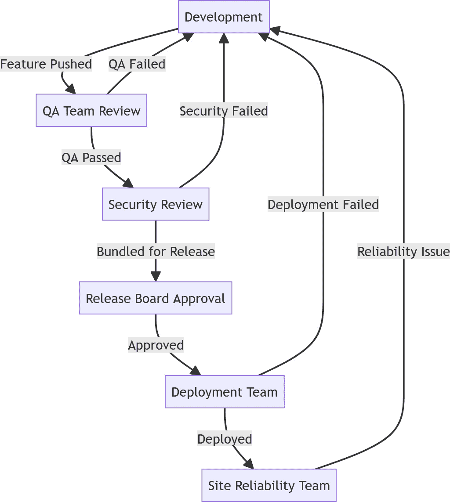
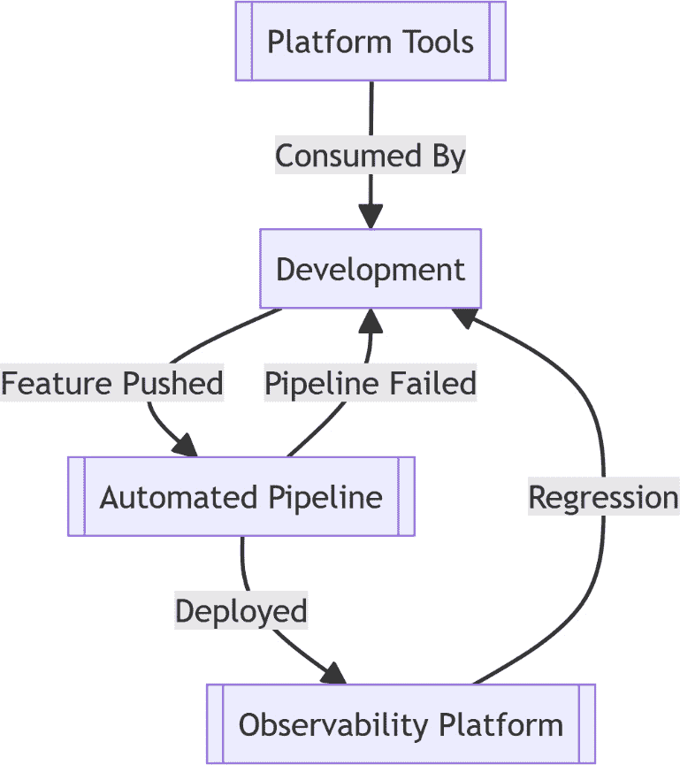
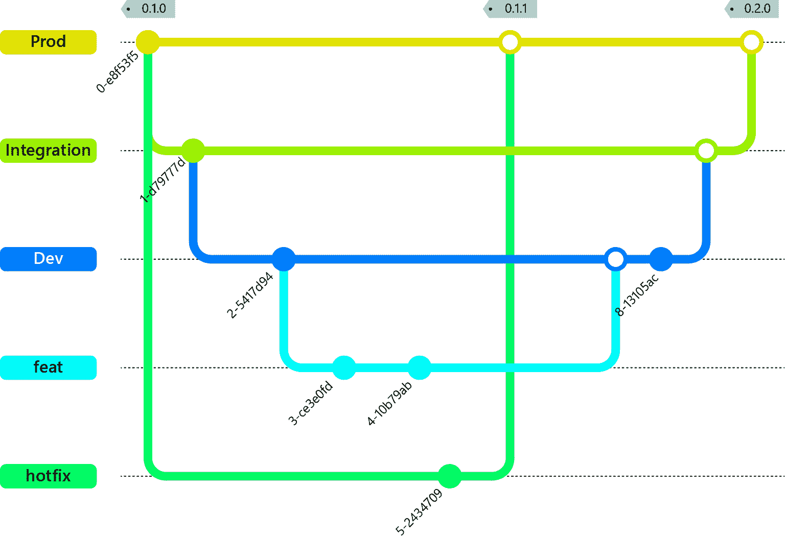
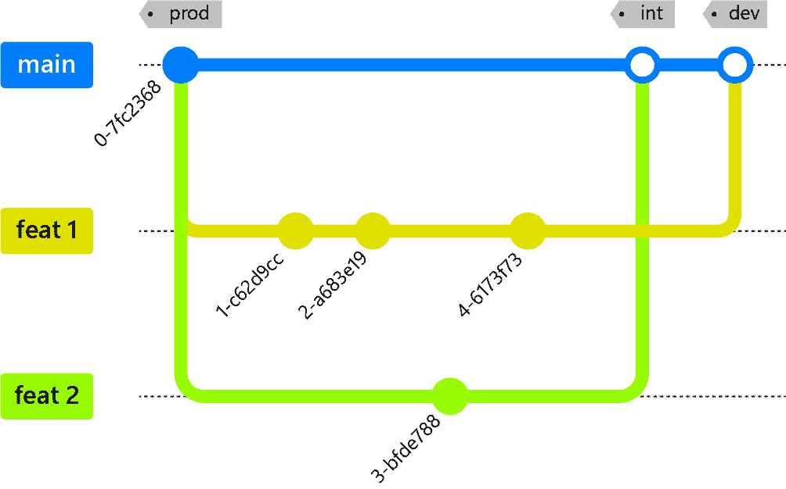

# 第五章：快速且持续地交付而不妥协安全性

到目前为止，我们已经看过了云原生开发所需的组织变革。在本章中，我们将开始探讨为了向云原生转型所需的文化和开发实践。在转向云原生软件开发时，我们常常被快速交付和安全系统的梦想所吸引。然而，只有在实现了相应的组织和文化变革后，这一目标才能在实践中实现。让我们探讨在软件交付生命周期中常见的反模式是如何干扰我们成为高绩效云原生组织的道路的。

在本章中，我们将涵盖以下主要内容：

+   低估文化影响

+   频繁变更以满足业务需求

+   防护栏

+   向左移动

+   自给自足的团队

# 低估文化影响

快速且安全地交付云原生项目主要是一种文化变革。为云原生交付所需的技术和业务流程变革，支持着文化变革。我们需要使团队的心态与结果的共同责任对齐，打破现有交付过程中可能存在的孤岛。产生变更或功能的团队应负责将其交付到生产环境中。这一转变是快速交付的最根本方面。在本节中，我们将从回顾一个常见的部署流程开始，这个流程通常出现在刚刚开始云原生之旅的客户中。

## 孤岛式模型 – 通向生产的漫长道路

让我们来看看一个良好意图却仍然是孤岛式的交付流程，通常这是将本地发布方法应用于云原生交付时产生的产物。

图 5.1 – 一个典型的孤岛式发布流程 – 有许多接触点，但缺乏端到端的责任

当发布过程庞大且繁琐，需要大量努力才能部署，并且推送不良变更的后果很难恢复时，这种模型是有效的。我们可能会在部署到具有不同容量和能力的本地客户服务器群时使用该模型。而在云环境中，这些限制并不存在。如果出现问题，我们可以迅速进行更改并快速修复；单一、统一、同质化的生产环境简化了部署和修复过程。

在这种模式下，我们会对所有代码进行严格审查，确保它在进入生产环境之前无误。然而，它的僵化性也是其缺点。当其中某个阶段不可避免地出错时，通常的做法是，开发者已经开始着手下一个功能时，必须放下手头的工作，去修复已经达到审查阶段的错误。这个临时的变更很可能不会经过审查流程，因为该流程无法承受从头开始的风险。

## DORA – 衡量道路

“*如果你不能衡量它，你就无法改进它*。”我们理解，当应用于云原生软件时，孤立的模型是有限制的，但当我们改变交付过程时，我们如何知道我们的变更正在把业务推向正确的方向？

在前面，*第一章*中，我们介绍了 DORA 指标来衡量团队的表现。如果你对这些指标背后的科学感兴趣，我们推荐阅读《DORA 报告》或《加速：精益软件和 DevOps 科学：构建与扩展高效能技术组织》。回顾一下，这些指标如下：

+   部署频率

+   变更的前置时间

+   变更失败率

+   恢复服务的时间

如果这些是最准确预测团队表现的指标，我们可以看到交付的责任不是可选的。

在孤立配置中，部署频率是次优的，因为我们被束缚在繁琐的发布过程中。这个发布过程还决定了我们变更的前置时间，因为所有变更必须与预估的时间表对齐。我们同时还在部署更大规模的代码包，这使得其中某个特性导致变更失败的几率大大增加，因为这个概率现在是每个子组件概率的总和。最后，恢复服务的时间也因为要回滚大量变更或从庞大的发布中筛选出问题并进行热修复（这也很可能不会经过发布过程）而大大增加。

摒弃高效团队的指标，我们还会遇到另一个关于责任的问题。谁负责这个变更并对其成功负责？是写代码的开发者吗？是批准变更的审批委员会吗？如果是安全问题，责任是否属于安全团队？将发布过程孤立也意味着孤立了责任；没有端到端的过程责任，问题就更难解决。

## 授权团队 – 提升你的速度

这将我们带回到赋能团队的概念。如果是你的团队编写的代码，你就负责它从开发到生产的整个过程。或者更简洁地说，“*你建造它，你运行它*。”我们不能把所有团队丢到深水区，然后指望他们游得起来；他们需要得到支持。这时之前那些孤立的团队就发挥作用了。它们从生产环境之旅的守门人转变为帮助开发团队自行承担这段旅程的推动者。

注意

赋能并支持团队拥有他们的输出是快速和安全交付的核心。

因此，为了在不妥协安全性的情况下快速交付，文化转变是最重要的方面之一，同时也是公司未能着重解决的方面。为了让团队拥有自己的输出，每个团队必须具备交付工作所需的技能和能力，或者通过组建跨职能团队在内部实现，或者通过赋能团队在外部实现。本章后面我们将探讨如何通过“左移”和“下压”的方法来解决这个问题。关键在于，不能将所有控制权交给交付团队，而是要确保他们获得传统孤立职能的赋能和支持，才能真正拥有自己的输出。

最简单的方法是同时给开发团队提供胡萝卜和大棒。赋能团队必须提供开发团队能够使用的平台和工件，以便他们按照公司标准完成工作。这可能以身份验证库、基础设施即代码模式、通用 UI 组件库等形式呈现。接着，赋能团队应当努力自动化“护栏”，以帮助开发人员确保他们所编写的代码符合之前手动执行的标准。这可以通过使用 QA 测试套件、**静态应用安全测试**（**SAST**）和在可观察性平台中为站点可靠性警报自动创建工单系统来实现。通过这种方式赋能开发人员，我们让他们能够拥有自己的输出，并将部署过程的责任向左移。

## DevSecOps – 通往生产的高速公路

现在让我们回顾一下我们的部署模型：

图 5.2 – 可部署工件所有权的目标状态

我们的其他团队依然留在组织中。相反，他们维护着三组工件：

+   **平台工具**：开发人员用于生产符合责任团队需求的软件工件的系统和工具，例如共享的身份验证库、结构化日志库或云基础设施模块。

+   **自动化流水线**：此流水线规范了每个团队的期望，而不是依赖于手动审查。如前所述，这可能包括自动化 QA 测试、SAST 或容器扫描工具。

+   **可观察性平台**：该平台规范了关于应用程序性能的期望，并在操作超出正常参数的情况下，提醒开发人员，同时存储关于这些事件的信息。

这里的关键区别在于，开发团队不再需要与五个不同的团队对接来将特性推送到生产环境，而是有能力拥有他们所编写的代码，并将符合基准标准的工件部署到生产环境。他们还可以通过可观察性平台查看他们生产的工件的性能。因此，我们已经将文化从守门转变为赋能。这正是 DevSecOps 的核心，赋能软件团队开发、保障和运营他们所编写的代码。

这种变化的规模在经历云原生转型的组织中通常被低估。人们可能会对被从关键路径上移除感到反感，因为这意味着他们放弃了之前拥有的一部分权力。需要在这些团队中树立的心态是，他们不再通过阻止开发团队部署到生产环境来与开发团队对立，而是成为开发团队的专业领域的管理者，提供文档并提供洞察，帮助引导开发团队朝着自己的安全、高质量、可观察的工件前进。

结果，开发团队变得更加跨职能，团队成员需要在这些支持团队的指导下，提升安全性、质量保证和站点可靠性工程的技能。

现在我们可以看到减少这些摩擦点的几个明显优势：

+   部署频率提高，因为我们不再按计划打包，而是尽快部署。这也导致了更短的变更交付时间，因为一旦变更准备好并通过了我们的流水线检查，它就可以轻松地部署到生产环境。

+   我们现在部署的是更小的代码单元，通常只包含几个特性，这减少了变更失败的可能性，并降低了变更失败率。

+   我们有一个平台来观察我们的应用程序，这意味着任何导致停机的变更都能迅速被识别，并且修复可以通过自动化流水线推送。这是一个关键的区别，因为通常情况下，热修复需要脱带应用，而我们无法将修复通过整个流水线运行。相反，自动化流水线仍然可以使用，因为开发人员无需与其他团队接触就能部署修复。因此，我们已经转向了**持续改进和持续交付**（**CI/CD**）的过程。

## 保持在正轨上

另一个公司可能很容易陷入的谬误是，认为使用 DevSecOps 和 CI/CD 原则交付特性将导致开发速度的大幅提升，这意味着更紧迫的截止日期。虽然确实，流程中基础的改进会转化为特性的更快交付，但仅仅专注于交付时间表，最终会因为文化转变而破坏效率提升。

如果你正在从一个有固定发布时间表、严格的截止日期和僵化的业务流程中迁移过来，可能会很诱人地将这种方式直接转化为新范式中的交付时间表。相反，通过将特性工作与发布过程解耦，我们让开发团队专注于输出质量，只有在从多方面角度准备好时才发布特性。这确保了我们在不妥协代码质量的前提下保持开发速度的提升，从而带来的是可持续的，而非暂时的，开发速度提升。

康威定律指出，“*设计系统的组织会被约束，以生产出这些组织通信结构的副本*。”当我们让团队之间形成孤岛时，我们不可避免地将他们的输出限制在开发/部署过程的某一特定部分及其职责上，并产生一个复制这些团队通信路径的部署过程。因此，合乎逻辑的结论是，为了保持我们在本章中所规定的所有文化变革，我们必须鼓励团队实现自给自足。这将使我们能够自动化并独立地进行变更生产，这是我们所期望的。

## 绘制一张新地图

最后，当我们完全转向云原生时，最难打破的反模式之一可能是服务与其运行的计算资源之间的耦合。新服务的创建、维护和运行成本低廉。因此，我们可以形成有限的服务上下文，封装一个业务领域。

*领域驱动设计* 是该领域的一本好书；它深入探讨了这一主题。这使我们能够根据业务领域的需求演进我们的架构，而不是因为我们安装了特定数量的服务器就将业务需求强加给架构。稍后本书将深入探讨如何将你的业务问题转化为应用代码，并介绍耦合和内聚的概念。本章的关键是打破架构必须适应预定义配置的思维方式。康威定律同样适用于你的架构，正如我们在部署过程中打破孤岛一样，我们还必须打破开发团队之间的孤岛，以使我们能够在正确的地方构建正确的解决方案。

正如我们所看到的，创建真正的云原生解决方案所需的文化转变可能会让一些组织感到措手不及，因此必须充分考虑其影响力。思维的核心转变在于赋能团队，使其自给自足，并拥有从功能构想到生产环境运行的交付全过程，通过从孤立所有权和交付模式转变为精益所有权模式，开发人员对自己所做的变更负责，并通过 DevSecOps 能力得到支持。赋能开发将使我们能够更快地交付变更，因此让我们深入探讨如何实现频繁的小型变更以达成我们的业务目标。

# 为了实现业务目标频繁地进行变更

在上一章中，我们介绍了“赋能开发团队”的概念。我们着重于减少发布过程中的孤岛现象，使得团队能够拥有端到端的发布过程。在这一过程中，我们能够更频繁地发布新版本。让我们深入探讨那些使我们能够在这种新范式下工作的开发变更。

## 修剪 Git 分支

大多数部署策略都会是多阶段的。例如，您可能会有名为 *开发*、*集成测试* 和 *生产* 的环境。基本理解是，较早的环境会先部署变更，这样我们就可以在将变更发布到生产环境之前进行测试。在多阶段部署模式下，我们推荐的一个模式是先在较低环境中测试功能，由开发团队或通过自动化测试对实时环境进行验证，然后再将变更部署到生产环境。采用这种策略时，可能会倾向于使用 Gitflow 模式，其中每个环境都是一个独立的分支。让我们来看一下典型的 Gitflow 实现。

图 5.3 – 典型 Gitflow 分支模型

这种反模式会产生一种错误的安全感，因为我们假设变更在推送到更高环境之前已经在较低环境中经过了充分的测试。然而，随着更多的人参与到代码库中，并且团队在应用热修复时，每个分支的内容随着时间的推移会逐渐发生偏差。在前面的图示中，我们可以看到我们对生产环境应用了热修复，而我们第一次测试我们的已部署功能时，它实际上是在生产环境中进行的。这种不确定性就是我们在维护特定环境代码库时面临的风险。它也会导致文化态度的倒退，因为在环境迁移之间引入手动检查的诱惑可能会带来不良后果。相反，采用单一代码库多次部署的原则能有效限制环境偏差。一个非常好的在线资源《12 因素应用》（*The 12 Factor App*），([12factor.net](http://12factor.net)) 将其作为第一项原则。

那么，我们如何有效地操作单一代码库呢？选择基于修订的分支策略，比如基于主干的开发，是确保我们从单一代码库中操作的最简单方法。我们不是让某个环境在环境分支中运行最新配置，而是为运行已知的最后正确配置在单一分支中制定规则，并在需要时将其推广到更高环境。让我们来看一下典型的基于主干的开发模型。

图 5.4 – 基于主干的开发分支模型

在这个例子中，每个环境都是从主分支部署的，较低环境会包含最新的更改以供测试，而较高环境则落后于主分支。通过持续集成和部署，我们减少了变更的交付时间，并增加了部署频率。

## 解耦集成和发布

现在，提升每个环境的复杂性已经得到解决，但我们遇到了一个在按环境分支或代码库系统中并不明显的问题。我们如何在一个环境中测试或更改功能，但又不让它们阻碍其他功能在更高环境中的部署呢？在之前的系统中，我们可以挑选提交来推广特定功能。解决这个问题的方法是双重的：我们需要一个简单的方式让开发人员在合并之前测试他们的功能，并且需要一个简单的方式来管理在不同环境中已合并的功能。

管理已合并功能的最简单方法是将功能在最终产品中的表现与其在代码库中的包含解耦。例如，一个功能可以已经完成并合并，但不出现在已部署的系统中。为了实现这一点，我们使用了一个被称为**功能标志**的概念。

功能标志允许我们在应用程序中保护特定的条款。一个简单的例子是 `if` 语句，如果功能标志关闭，那么我们就不会显示按钮。当开发团队在本地开发此功能时，可以打开功能标志进行测试。已部署的环境没有打开功能标志，因此我们可以将该功能合并到主代码库中，而不会影响已部署的应用程序。一旦功能完成，我们可以在较低环境中打开功能标志，以便在实际环境中测试该功能。通过将功能的开发与其在最终应用中的表现解耦，我们还将功能发布决策从技术驱动（即，功能已存在于代码库中，因此它将出现在已部署的应用程序中）解耦到业务决策层面；我们可以根据需求添加功能。

要真正将功能发布决策与技术实现解耦，将功能配置存储在应用环境中至关重要。在这种情况下，反模式是将名为`features.prod.yml`和`features.dev.yml`的文件提交到版本控制中，因为我们再次在代码库中创建了具体化的检入物。

特征标志的最佳方法是向版本控制中检入一个文件，该文件定义了可用的特征标志及其状态。在此文件中，我们更喜欢使用非布尔值来表示特征标志，因为这样后续扩展起来更加困难。通常，我们依赖枚举。例如，一个枚举可以包含名为`Baseline`、`Configurable`和`Off`的值。在这种情况下，`Baseline`确保在所有环境中都启用了一个特征，并且在我们部署新环境时默认启用。这些标志代表了成熟的功能，稳定到可以始终启用，并且可以安全地用作新功能的基础。`Configurable`标志是我们希望能够在各种环境中更改其表达方式的特性。这些可能表示尚未发布的特性、正在测试的特性或尚未完成但处于可用状态的特性。这些特性需要在部署环境中可以打开或关闭的方法。如果系统规模较小，我们可以通过应用配置来实现这一点；如果功能列表很长，我们可以通过数据库表来支持。最后，我们有配置为`Off`的特性；这些是不应在任何环境中可用的特性标志，但是它们用于正在进行中的功能，并且需要能够在本地表达。

为了解决开发者需要本地测试的问题，这正是构建云原生软件的优势所在。我们常见的一个反模式是试图在本地环境中复制云环境，许多服务都会这样做。然而，没有什么能替代在云中实际运行你的代码。使用云原生软件，利用**基础设施即代码**（**IaC**）和无服务器/托管服务等原则，开发者完全可以创建一个隔离的开发云环境。这个做法让开发者真正能够在云中开发。它还确保了你的 IaC 避免了反模式，比如硬编码引用，因为我们会定期创建和销毁新环境。开发团队现在也可以独立于已部署环境测试基础设施变更。这种解耦有助于强化“授权团队”这一概念；开发者现在可以控制运行的代码、其运行的基础设施以及它与之交互的服务。他们还熟悉部署过程，更接近“*你构建，你运维*”的理想状态。通过让开发者在云中进行测试，并将测试范围限制在他们正在测试的短暂环境中，我们可以进行更多具有破坏性的测试。我在短暂环境上的负载测试不会影响你在你自己的短暂环境中的测试。通过在管道中允许这种类型的全面测试，我们降低了变更失败率。

## 逆转不可避免的变更

没有系统是完美的，随着我们部署频率的提高，某个变更失败的可能性最终会变得必然。根据 DORA 报告，变更失败率是我们应该追踪的一个组织绩效指标。尽管我们力求将这个指标保持在尽可能低的水平，但如果发生失败，另一个 DORA 指标——**恢复时间中位数**（**MTTR**）就会发挥作用。三个关键的反模式会阻碍我们优化 MTTR，当原因是变更失败时：

+   可变工件

+   毁灭性变更

+   没有变更的反向定义

第一个反模式是使用**可变工件**，所有产生的工件必须是不可变的。当你的自动化构建管道生成一个工件作为部署候选项时，我们必须在随后的构建管道运行中保持该工件不变。这种不可变性可以像容器注册表中的容器版本控制一样简单，或者使所有以前版本的内部库在任何时候都可供安装。通过使用不可变工件，可以轻松将系统回滚到已知的正确配置。我们只需部署早期的工件，然后在较低环境中进行修复，直到我们准备好再次部署到生产环境中。

第二种反模式是**破坏性变更**。系统新版本的部署应该允许我们回滚到之前的应用程序实例。例如，破坏性变更可能是删除数据库表或删除数据存储。当我们部署这些变更时，我们永远无法将系统回滚到上一个已知的正确配置，因为在破坏性变更中我们丢失了系统的状态。如果需要进行破坏性变更，应该在最终应用破坏性变更之前经过弃用计划，以确保删除功能不会影响其他应用领域。

最后的反模式是**没有逆向定义的变更**。这个反模式主要适用于应用程序状态的存储，例如数据库或基础设施变更。它与第二点密切相关：如果变更是破坏性的，基本上就无法逆转。这个规则的扩展是，任何对系统状态、架构或数据的变更都必须是可恢复的。某些工具提供了这种功能，例如，Terraform 比较已部署的基础设施与状态文件，或通过 DACPAC 部署的 SQL Server 项目。在其他场景中，迁移必须显式定义正向和逆向操作，例如通过使用 Flyway 或 Entity Framework 迁移的数据库 SQL 迁移。我们在这里看到的常见反模式是，草稿中的变更包含了详细的向上迁移，但没有人构建或测试向下迁移。这种策略意味着当我们需要回滚变更时，通常需要进行大量工作，因为逆向迁移可能需要时间来创建，或者如果没有进行测试，可能会失效。这导致了高压、高风险的情况，我们必须在生产环境受到影响时制作变更，导致“只为让它重新运行”而偷工减料。

总结这一部分，复杂的发布流程由于开发与生产之间的高壁垒，允许出现不良实践。我们可以通过去除这些壁垒并支持良好实践来优化交付和提高服务的正常运行时间。关键在于频繁、标记清晰、经过充分测试的变更，这些变更是不可变的、无害的，并且在需要时易于恢复。这使得我们能够更快地开发，但我们仍然需要确保开发人员在做正确的事情，为此，我们通常会使用护栏措施。

# 护栏措施

我们已经讨论了如何赋予开发人员更多的权力，并让他们完全负责他们所做的变更。然而，开发人员并不是专家；我们在采纳“左移”思维时看到这种根本性的反模式。我们不应该期望开发人员成为安全性、**站点可靠性工程**（**SRE**）、DevSecOps 等方面的专家。开发人员需要对这些主题有一定的了解，但应该能够有信心地进行部署，而不必成为专家。

## 保持开发人员在正轨上

我们在这个领域经常看到的一个常见反模式是，由于我们正在将责任向左移交给开发团队，开发团队在云环境中需要更多权限来完成他们的工作。事实正好相反。开发人员应该有一组受限的权限来诊断、检查和支持云环境。相反，特权的升级应该发生在 CI/CD 管道中，这是通过提供具有提升权限的工具来启用我们的开发人员的方式。通过这样做，我们确保开发人员可以独立部署，但不会超出 CI/CD 环境的限制。这个过程通过手动配置限制了环境漂移的可能性，从而保留了灾难恢复功能。

使开发人员能够放心部署的主要方法是在部署过程中提供防护栏。这些防护栏定义了开发人员可以采取的一组可接受的操作。例如，基础设施防护栏可能防止在没有**Web 应用程序防火墙**（**WAF**）前端的情况下部署**内容传递网络**（**CDN**）。代码级防护栏可能避免使用不安全的哈希函数。在这两种情况下，我们防止变更在部署到生产环境时达到最低标准。

我们可能会部署防护栏，以满足法规合规要求。例如，可以采用云范围策略，防止在特定地区部署任何资源，以支持数据主权要求。这个例子非常适合来自**亚马逊网络服务**（**AWS**）的**服务控制策略**（**SCP**）。这些策略允许我们在不同粒度的层次上强制执行可接受使用的边界，从组织范围到个人账户。例如，我们将各种账户锁定到特定地区，全局上，我们防止所有账户在出口管制区域部署资源。

在安全领域中的一个反模式是将渗透测试误认为是关键部署路径上的防护栏。渗透测试是一个重要的安全步骤，但应该在部署路径之外进行。相反，它应该与部署过程并行进行。我们应该自动化部署路径中的所有步骤。如果你想动态测试应用程序安全性，考虑在预生产环境中使用**动态应用程序安全测试**（**DAST**）框架作为预提升检查。防护栏的关键因素是开发人员应能够按需访问防护栏评估。

## 防护栏的类型

我们通常看到两种主要类型的防护栏：预防性和检测性。

**预防性防护栏**是主动的防护栏，指定了开发人员可以做的外部边界；这些防护栏是惩罚性的，若防护栏被激活，管道就会停止部署。这种方法适用于应用容易定义的启发式规则（例如，我们的哈希算法不应该使用 MD5）。我们常见的错误是，预防性防护栏通常被实现后，开发人员被留给自己去应对。如果防护栏失败，他们必须返回并修复它。一个更好的工作流程是能够观察防护栏的激活情况。这些指标可以告诉你开发人员在哪些地方遇到最多的问题，从而通过提供培训、正确实现的库，或者更好的方法——一个可行的工具，来让开发人员的工作更轻松。

接下来，我们介绍**侦测性防护栏**。这些反应型防护栏会扫描你的环境以检查不合规的情况，然后会提出问题或采取纠正措施。例如，我们可以允许开发人员通过 CDN 部署具有公共访问权限的存储。然而，如果我们对包含个人身份信息（PII，Personally Identifiable Information）的特定存储进行标记，这一标记过程可能与存储本身的部署不一致。在这种情况下，我们可以添加一个侦测性防护栏，检查是否存在具有公共访问权限的存储，检查该存储账户是否有标记表示它包含 PII，然后激活防护栏。这种控制方式通常最不理想，因为它要求环境中先存在不安全的配置，才能检测到问题，而不是主动评估问题。

防护栏的一个典型驱动因素是安全性。现在有一些工具可以执行静态应用安全测试（SAST），以发现常见错误，并允许安全团队定义他们想要查找的自定义规则。这个领域有许多优秀的开源工具（如 Semgrep）以及许多专有的解决方案。虽然需要一些前期工作来编写想要捕捉的反模式，但每一条编写好的启发式规则都意味着安全团队不再需要手动审查。许多现有的工具不仅限于安全启发式，还能检查诸如深度嵌套的循环或认知复杂性等反模式。

## 防护栏可观察性的案例  

构建护栏是至关重要的，但同样重要的是监控它们。开发人员使用可观察性平台来更好地理解用户行为，并对他们构建的应用程序进行更改以支持这些行为。我们也应该为我们的开发团队做同样的事，他们实际上是我们的用户。通过监控护栏，我们可以看到开发人员常遇到的摩擦点，并主动修复常见问题。假设我们之前的预防性护栏要求开发人员在 CDN 前面部署 WAF。我们可能会注意到开发人员经常遇到这个护栏，因此，利用我们收集的护栏激活指标，我们构建了一个启用工件。这个工件使开发人员能够避免触发护栏，且在没有额外返工的情况下生产出更安全的工件。

启用工件的关键在于通过合理的默认设置来抽象化标准配置。继续以 WAF 和 CDN 为例，作为安全团队，如果开发人员忘记明确指定 WAF，我们可能会引入一个默认的 WAF，该 WAF 会被添加到每个 CDN 部署中。如果我们已经为这种情况设立了侦测性和预防性护栏，那么启用工件将减少我们遇到的激活次数。在跟踪这些单元的指标时，我们建议监控所有内容。关于启用工件的指标告诉我们默认 WAF 激活的频率。这些指标很有帮助，因为它们是衡量启用工件对开发团队影响的好方法。

如果启用工件是预防性护栏的对应物，那么侦测性护栏的等价物就是自动修复。对于我们的 PII 标签解决方案，我们可以监听护栏激活事件，并启动一个过程，撤销对存储桶的公共访问。这使我们的系统在不需要外部干预的情况下，在简单用例中保持安全。

因此，对于我们应用程序中的漏洞或配置错误，首选是通过启用的工件（如库或自动化管道工具）添加一个合理的默认设置，然后对于超出此范围的情况，通过预防性护栏进行捕获，最后，如果配置错误到达生产环境，则启动自动修复或手动过程进行修正。

这些工具可以始终存在于管道和环境中。该系统的最终安全层应该是渗透测试，但需要注意的是，这一过程必须与应用程序的部署和开发异步进行。理想情况下，渗透测试的结果将反馈到我们的护栏系统中，帮助我们开发新的启用工件和预防/侦测控制，以防止问题重新出现。

## 示例护栏

在云环境中，系统的交互方式常常不寻常，因为不仅可以让已部署的基础设施和服务相互交互，还可以让它们与这些资源的底层定义进行交互。接下来，我们将介绍一些容易应用的常见护栏。虽然这并非详尽无遗，但它会为你提供一个起步点。作为我们的示例，我们将使用 AWS。

我们将使用以下的护栏示例：

+   权限过多的 IAM 账户

+   公共 S3 存储桶

+   数据主权要求

+   公共可访问的远程管理工具

一个简单的起点是 IAM 权限策略。我在这里不打算详细讨论最小权限原则，我们会在后续章节中介绍，但通常会看到定义了过多权限的账户或角色。通常，这种情况发生是因为用户无法找到正确的权限来执行所需的操作，于是他们最终分配了一长串权限或通配符权限，试图让其工作。实际上，这对我们之前讨论的三种控制方法来说是一个很好的候选对象；我们可以构建包含预批准策略的常见权限策略，用于完成常见任务，例如将 Lambda 函数连接到特定的 DynamoDB 表。接着，我们还可以添加预防性控制，例如在账户或组织中使用 SCP，禁止访问不再使用的特定 API。最后，我们可以添加侦测性控制，监控我们所有的活动角色，检查是否有包含通配符权限的策略，并在发现时撤销所有相关的授权和信任策略。

另一个常见的配置错误，适合用护栏来管理的是 S3 存储桶的公共访问。任何使用公共访问的 S3 存储桶场景，通常更适合通过使用 CloudFront 分发和源访问身份来解决。我们可以通过创建 Terraform 模块来构建一个启用的构件，该模块为存储桶设置默认配置并禁用公共访问。我们还可以构建一个预防性护栏，检查我们的基础设施计划，以防止出现此配置。最后，我们可以建立一个侦测性护栏，扫描已部署的基础设施，确保没有公共存储桶存在，如果存在，则撤销公共访问。

许多企业也面临数据主权要求的约束；某地区的实体数据必须存储在该地区。通过将资源部署到符合数据主权要求的区域，我们可以做到合规。然而，我们无法证明已合规，因为这种方法需要不断执行流程。相反，我们可以使用预防性控制：可以构建 SCP（服务控制策略），将账户中的资源锁定，禁止其部署到我们未指定的区域。这种方法必须是前瞻性的，因为它仅适用于新的 AWS API 调用。

我们看到的最后一种常见配置错误是直接将远程管理工具暴露到互联网上。例如，你的 EC2 实例可能会暴露端口`22`以允许开发者通过 SSH 连接，但这就意味着这些实例的攻击面增加了，具体取决于它们运行的 SSH 版本。这个问题应该在网络层面进行强制执行，通常，最好在这种情况下同时设置侦测性护栏（除了预防性护栏）。开发者很容易将 SSH 端口设置为`22`并开放无限制访问，然后自动关闭它。

希望通过阅读本节，你已经理解了可以配置的护栏类型，以及如何让开发者在不影响其开发速度的情况下，最好地在你设置的边界内工作。我们还讨论了监控组织护栏的重要性，这些指标为我们提供了清晰的视角，既能看出我们的安全态势，也能了解开发者的体验。最后，我们还探讨了一些常见的配置错误，并分析了护栏和启用的工具如何降低对业务的风险。因此，既然我们已经拥有了使开发者能够安全且可靠地管理输出的工具，让我们来看一下如何将生产安全工件的责任左移到开发团队。

# 左移

我们已经提到过将功能性和安全性的变化责任交给开发团队的需求。到目前为止，焦点主要放在了开发团队的外部因素上。本节将讨论将责任左移对开发团队的影响，以及我们可以使用哪些技术来满足对他们施加的新期望。如果你是开发者，建议阅读这一章，因为你将学习到一些有价值的工具；如果你是外部职能的一部分，这一章也能帮助你更好地支持开发团队。

## 作为一个迭代过程的开发

一种常见的反模式是，在开发者认为一个功能已经完成后，再启用**质量保证**（**QA**）而不是在整个软件开发生命周期中进行迭代过程。我们之前提到过临时环境，这对于开发者在隔离的环境中开发功能并提供一个可以在功能不完整时进行测试的环境非常有帮助。不同的公司有不同的 QA 功能，可能来自专门的 QA 角色，或者是产品团队的一部分。这里的关键是，临时环境让你可以在过程的早期就将 QA 功能引入其中。

另一个反模式是使用长期存在的特性分支和短暂的环境。我们在多个小分支上开发特性，每个分支包含整个特性所需的一部分工作。短暂环境为我们提供了一个替代部署方式，允许未完成的特性启用。我们通过从第一次提交开始就让 QA 参与，建立开发者和 QA 流程之间的快速反馈循环。将 QA 并行或集成到开发中，有助于我们减轻一个重要特性在完成后可能未通过 QA 测试的风险，从而需要大量返工来修复。它还通过促进 QA 和开发功能之间的协作，使我们更接近无隔离的模型。

## 先测试，后编码

团队通常认可但未能正确实施的反模式之一是**测试驱动开发**（**TDD**），以及**行为驱动开发**（**BDD**）。当询问开发团队是否使用 TDD 或 BDD 时，他们通常会肯定回答，但当被问到何时编写测试时，他们会回答说是在编写代码之后才写测试。撇开认知失调不谈，真正的 BDD 包括在实际实现系统之前，定义系统的行为并编写可以检查该行为是否符合要求的测试。实现 BDD 时另一个常见的误区是采用瀑布式的编码测试方法，预先列出所有预见到的边缘情况并编写过多的测试。许多系统的行为和需求只有在实际实现系统过程中才会显现出来，而过早编写过多的测试只会妨碍这一发现过程。相反，在 BDD 中，一个很好的方法是使用红绿重构系统。你首先定义期望的行为，并编写简单的测试来确保系统能实现这个行为。这些测试会失败（红），然后我们会实现一个能够通过这些测试的系统（绿）。通过设计这个系统，我们再对实现和测试用例进行重构，以准确展现期望的行为，并测试系统的 emergent 行为。我们必须与产品负责人一起创建初步的期望行为，以确保期望行为测试能够准确反映最终产品所需的行为。这个过程将会将期望行为的描述“提前”，直到我们开始编写任何代码之前。

一旦我们创建了测试，它们应该进入部署管道的关键路径。这个实践可以确保系统的未来更改不会阻止其展现所需的行为。团队在这一阶段容易陷入的一个常见反模式是无法完全信任测试的输出。在极端情况下，这可能表现为接受一定比例的失败测试作为“正常现象”。这种对测试缺乏信心削弱了整个测试套件的价值，因为开发人员不再相信他们的更改不会导致现有行为的回归。

第二种更常见的模式是间歇性的测试失败。当测试未能正确隔离时，通常会发生间歇性失败，而一个测试的副作用可能会影响另一个测试的结果。在这种情况下，开发人员通常会重新运行管道，直到间歇性测试通过。这种行为是适得其反的，原因有两个：首先，我们增加了开发人员等待管道执行完成的时间；其次，我们忽略了一个失败的测试。在这种情况下，与其忍受多次管道运行的不便，不如充分地重新确定测试的边界，并创建一个新测试来检查间歇性行为的回归。通过严格执行这些测试套件，我们将检测和纠正回归的责任“左移”到负责回归的开发人员身上，让他们在开发过程中处理，而不是等到回归在最终产品中显现出来。

## 输出的共享责任

考虑弗雷德·布鲁克斯（Fred Brooks）的名言：“*一个程序员在一个月内能做到的事情，两个程序员可以在两个月内做到*。”虽然是半开玩笑的，但这种情绪在我们独立编程时仍然成立。增加的沟通渠道和知识分发可以使开发过程更加苛刻，这导致我们第三个常见的反模式，**孤立开发**。我们看到过软件团队，他们只在每日站会中与彼此交互。这种系统会回到我们旧的慢反馈周期的模式。如果我在每日站会后完成并需要另一名团队开发者的输出来推进我的特性，可能会在站会后 5 分钟完成，而我需要等到第二天才能听到相关情况。我见过高效开发团队在虚拟呼叫中整天工作，根据需要分拆出主要呼叫以进行配对编程和集体编程。关键的不同点在于，高效的团队将他们的交付视为共同的输出，而不是个人的输出。这种不同点也需要在我们如何跟踪生产力指标方面得到体现，这些指标应该反映团队的生产力，而不是个人的。个人的管理受到来自其他团队成员的反馈的指导，因为团队是我们希望优化的价值。

小而定期的变更，合并回代码库，从代码审查的角度来看也至关重要。向开发者展示一个 12 行的拉取请求，他们会有很多评论。向他们展示一个 1,200 行的拉取请求，你可能会得到零评论。也许你会得到一个“*看起来不错*。”的回复。这种方法的主要敌人是长期运行的功能分支。如果你不定期将代码合并到主分支中，那么审阅者就无法理解变更的范围。在这里，支持小而原子化变更的开发过程至关重要，比如前面在本章讨论过的基干开发和特性标志。在努力满足截止日期时，通常会倾向于批准拉取请求，以更宽松的标准整合变更。然而，这种方法是一种虚假的经济。通过批准宽松的变更，比如不符合编码标准的代码或具有高认知复杂性的代码，我们只是在削弱未来的速度，并积累技术债务。这个问题的另一面是，当我们在拉取请求阶段严格执行编码标准时，我们慢慢开始看到团队的提升，同一个团队成员未来的拉取请求不太可能出现同样的错误。不执行编码标准是我们虚假经济的关键。执行与不执行编码标准最终会让您达到等效或增加的开发速度。

## 早期实验和及早获得反馈

我们已经检查了典型软件开发业务功能中的反馈循环。然而，您还应该关注可能更具体于您业务的反馈循环。一个例子可能是来自金融系统的订单匹配引擎可能需要过去六个月的数据输入系统，以确保它达到与现有引擎相同的目标状态。为了将这一过程向左转型，我们可以使用较小的时间范围和虚拟数据，让开发人员在本地运行，以便获得即时反馈。向左转型的关键是识别这些反馈循环，并将其直接交给开发人员，或者在开发的早期阶段使开发人员能够与负责业务单元互动。这个业务过程的优化确保了我们减少了流程后期出现重大更改的机会。为了促进这一点，我们建议绘制出所有部署过程中，开发人员完成更改后发生的部分，并找到这一过程中发生最多故障（即需要开发人员返工）的区域。这些过程部分是您向左转型的最佳候选。需要注意的是，您仍然需要有关流程的度量数据，以识别这些阶段，因此，部署过程的可观察性在其有效性中是一个重要因素。

向左转型还要求开发团队在解决某个功能时成为真实信息的来源。开发团队必须被允许在承诺解决方案之前进行实验。一种很好的方法是通过限定时间的技术探针（timeboxed technical spikes），如果需要测试不同方法的有效性，可能会同时进行多个技术探针。这里的关键因素是允许开发人员进行实验，并通过他们的工作成果来验证一个想法或假设，而不是引入更改或新特性。这一过程是短暂环境（ephemeral environments）发挥作用的又一个领域。拥有一个没有后果的沙盒来测试概念验证（proof-of-concept）想法，使开发团队能够以马克·扎克伯格的话说，"*快速行动并打破事物*"。尽管这种方法并不旨在产生可见的成果，但通常情况下，如果这些技术探针成功，它们将成为新更改或新特性的基础。因此，尽管目标不是创建更改，但技术探针通常并不会导致生产力的浪费。

## 从一开始就将安全性构建进来

shift-left 方法的最终要求是确保安全性从变更开始时就融入到云原生解决方案中。开发人员必须意识到他们的决策对整体解决方案安全姿态的影响。开发人员不需要成为安全专家，而是需要将思维方式从“*它能达到预期目标吗？*”转变为考虑他们的变更可能带来的新攻击面。一个优秀的方法是将威胁建模作为开发过程的一部分，来引导刚刚采用 shift-left 方法论的开发团队。通过转变为攻击者的思维方式，我们可以迅速识别威胁并采取缓解措施加以防御。如果安全团队参与到前几次的尝试中，这个练习将更加有效。尽管团队的目标是实现自给自足（这是我们稍后会讨论的主题），但利用支持团队来确保跨团队的一致性质量仍然至关重要。

通过 shift-left 方法，我们使开发人员能够生产安全、完整且适合生产环境的变更。使用适当的工具和业务流程提高了开发速度，并赋予了开发人员控制权和适当的保障措施，使他们能够专注于寻找最佳解决方案。现在，随着团队开始负责自己的产出，接下来我们将探讨如何让这些团队真正实现自给自足。

# 自给自足的团队

通过在文化、流程、工具和交付方面做出的所有变更，我们期望我们的团队成为自给自足的变更工厂。但我们如何调整团队的内部结构，以确保团队能够组织和支持这些新的工作方式呢？

## 三位一体领导力

Spotify 推广了一种被称为 *Squad Model*（小队模型）的模式。虽然通常它也包含独立小队之外更大规模的结构，但我们将专注于小队本身的结构。对于更大模型的批评是有其有效性的，但这并不影响原子团队结构的有效性。团队的核心在于它是一个专注于特定产品的单位。它包含三位领导者，负责指导小队的发展工作。这三位领导者分别是工程经理，负责团队的技术方向；产品负责人，代表客户；以及 Scrum Master，组织团队的工作。通过将团队的责任封装在团队内部，并允许团队能够跨整个产品进行工作，我们可以横向扩展这些小队，而不会线性增加管理开销。现在，我们进入了可扩展的敏捷交付，这与云原生开发的要求非常契合。

成功实施这种格式的关键是理解，虽然领导层是三位一体的，但实际责任之间的重叠很小。这个领域中一个常见的反模式是所有开发者都向工程经理汇报。开发者是变更的实施者，产生系统变更比技术方向更为复杂。相反，开发者成为他们所做变更的管理者，理解背后的产品思维以及实施所需的技术方向。传达这一点的一个很好的方式是通过一个叫做*指挥官意图*的概念。它指的是领导指令的抽象，以涵盖目标，从而使我们的方法更加灵活。在最初的形式中，命令可能要求我们前往战场上的特定位置，但意图是与其他单位一起攻占某个特定的山丘。如果我们专注于*如何*（移动到位置），我们可能会错过完成*什么*（占领山丘）的机会。

同样地，如果我们强制开发者按照规定的步骤实现某个功能，那么那些只有实现者才能看到的新兴机会可能会被忽视。这种情况下，三位一体的领导和协作模式（Squads）非常有效。我们不仅能传达特定变更的指挥意图，而且开发者还拥有本地的权威来源，以便展示这些新机会和战略方向。

之前，我在一个组织工作，使用一种特定的框架，试图在保持对产品团队的完全控制的同时安全地扩展敏捷开发。这个框架的实施导致了战略方向的不一致。换句话说，这个过程没有使团队具备自给自足并抓住机会的能力，因为要求在我们采取行动之前，要在多个层级上展示这些机会。自给自足的团队正是这一范式的对立面。我们不再强调控制，而是寻求授权并提供战略方向，同时促进战略机会。

## 团队的拓扑结构

在他们的开创性著作《*团队拓扑*》中，Matthew Skelton 和 Manuel Pais 确定了在一个 DevSecOps 聚焦的组织中四种类型的团队，如下所示：

+   流程对齐团队

+   赋能团队

+   复杂子系统团队

+   平台团队

流程对齐团队是业务领域的专家，其输出与该业务领域的战略方向保持一致。这个团队是你组织的主要团队，直接专注于解决业务或客户问题的变化。请注意，这些团队的组织是按业务领域划分的，而康威定律假设这些领域会在我们的架构中自然形成有界上下文。我们不应将团队限制为只拥有和操作代码库中的某一部分。

启用团队通过提供技术指导和支持开发团队的工作成果，帮助其他类型的团队实现目标。例如，专门的安全团队可能协助那些在开发过程中面临独特安全问题的团队。需要注意的是，这些团队的存在并不意味着可以免除其他团队的责任。这些团队是增强者，而非取代自给自足的角色。

复杂子系统团队处理的是需要深入技术或工程能力的子系统。这种类型的团队通常是唯一会被分配到组织架构中特定部分的团队，通常，这个团队的角色是将复杂的子系统抽象出来，供业务的其他部分与之交互。一个典型的例子可能是某个仍在使用大型主机的银行；我们通过复杂子系统团队来管理该主机，并为其他团队提供接口以便交互。

平台团队是开发团队为开发人员所建设的团队；他们为其他团队提供内部产品，其他团队则是这些产品的使用者。平台可能包括标准化的构建流水线和护栏、启用的工件和工具，如 Git、票务管理软件等。正如我们之前讨论过的，你的度量标准和客户开发团队应该引导该团队的战略方向。该团队有三种主要的运作模式：

+   **协作**：这涉及到团队之间的长期合作。这些可能是进行相关变更的团队，或是流线型团队与平台团队合作开发新工具，亦或是团队与复杂子系统团队共同努力，以推动服务的演进。

+   **X 即服务**：这种模型通常指的是复杂的子系统团队将技术上复杂的功能抽象成服务，供其他团队使用。

+   **促进**：这涉及到团队合作以实现特定团队的目标。例如，安全启用团队可能促进对流线型团队所需的授权逻辑的变更。这种模式通常也包括赋能团队，以便在未来能够自给自足。

在识别这些运作模式时，出现了一些反模式。最常见的一个是认为组织中的许多部分都是复杂的子系统。关键的区别在于，复杂的子系统团队专注于某些技术复杂的内容。复杂的业务领域并不是一个复杂的子系统。这种思维方式将我们带回了一个陷阱：将团队与现有架构对齐，而不是与业务领域对齐，并且让架构从这些新兴领域的自然边界上下文中发展出来。

当支持团队需要促进与流对齐团队目标的实现时，他们常犯的一个错误是，假设作为该领域的专家，他们应该直接做出所需的改变。从根本上说，为了促进团队的自给自足，支持团队需要指导流对齐团队，提高团队的能力。

最后，对于那些整个组织负责的事务，使用 X-as-a-service 模式可能会很有诱惑力。一个关键的例子就是安全性。安全性不是我们可以独立开发并作为服务提供给开发者的系统。它是每个团队成员的责任。我们可以构建我们的平台工具，并使支持团队能够激励并培养良好的安全实践。X-as-a-service 交互模式的目的是将技术责任从服务消费者身上移除，而在安全性的情况下，这种做法是适得其反的。

## 冠军和 T 型工程师

随着我们从传统交付模型转向云原生交付模型，我们也在拓宽可以使用的服务范围。我们不再一次又一次地用相同的方式解决业务问题，而是有机会利用云原生服务。然而，随着我们视野的拓宽，我们必然需要教育我们的团队关于这些新型服务的最佳实践。在传统模型中，每个开发者都能够理解所需的架构和代码模式。指望我们的团队一夜之间成为专家是不现实的；然而，我们的每个开发者都需要获得关于云原生服务的广泛知识，以便在某些模式需要使用时能够识别出来。这种广泛的知识构成了 T 型工程师的顶端，它是通过自学获得的广泛但浅显的知识。当他们反复使用某些模式时，他们会深入理解所涉及服务的特定实现特点，形成深厚的知识。这构成了我们 T 型工程师的竖直部分，它是深度但范围有限的专业知识。这个理念是，当团队中有几个 T 型工程师时，我们就能够获得多样的技术意见来指导团队的技术方向。

对于公司范围内的零基础倡议，例如安全性、可访问性或代码质量，我们建议在团队内选举出冠军人物，以便为自给自足的团队提供满足目标的内部能力。然后，由支持这一倡议的管理团队（可能是支持团队）负责支持这些冠军人物在各自领域的发展。这可能包括通过认证路径支持自学，资助他们参加会议，以及提供内部知识共享机会。关键在于，公司必须投资于其员工，才能使倡议成功并取得成果。仅仅按部就班地继续开展业务是远远不够的。在云技术领域，技术和实践发展迅速；作为一家公司，为了最大化云投资的回报，必须对员工进行投资。

在团队中构建云原生能力需要时间；认识到需要为团队提供所有工具和机会，以使其具备自给自足的能力至关重要。为此，我们探讨了产品负责人、工程经理和敏捷教练的三重领导模式。同时，我们也研究了团队如何组织相互之间的互动。最后，我们考虑了如何在组织内推动倡议并通过鼓励 T 型工程师和冠军计划提供多样化的意见。

# 摘要

通过对成果的 ownership（所有权）和团队赋能，我们已将开发团队转变为真正自给自足的强大力量。我们通过自动化流程和保护措施来调节他们的产出，确保他们在我们业务所需的约束条件下工作。我们还考虑了如何减少任何一个负面变化对整个系统的影响。这些原子化的变化将成为我们未来发展模型的基础。接下来，我们将深入研究如何在云原生环境中保持安全性和合规性。
