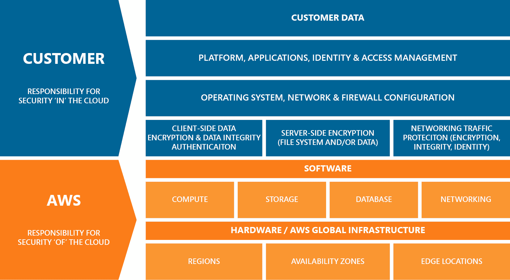
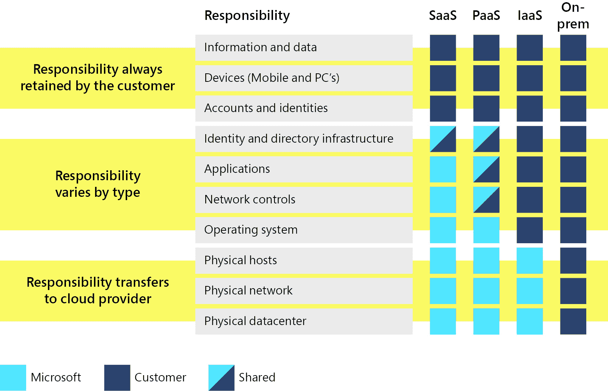
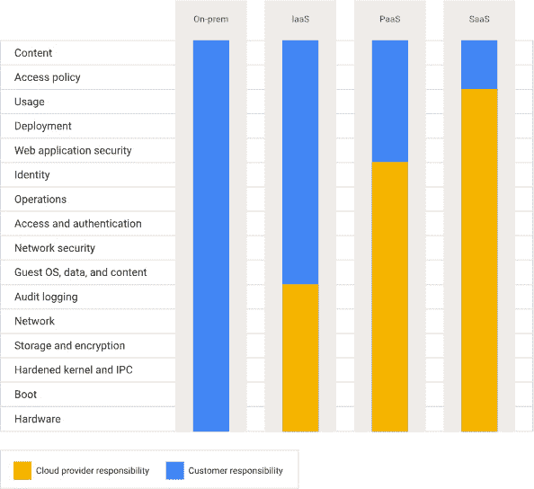

# 6

# 如何达成您的安全性和合规性目标

在今天的数字化世界中，保持组织安全是一个持续的过程——这绝不是一次性完成的任务。随着云环境的崛起，风险比以往任何时候都要大。本章将深入探讨我们面临的一些最大挑战，从过度授权访问的风险，到在发布前只进行一次渗透测试就认为足够的误区。我们还将拆解供应链安全问题，并澄清共享责任模型的任何困惑。无论你是 IT 领域的资深人士，还是刚刚开始接触云安全，你都会找到一些实用的建议，帮助保护你的组织。

本章将描述常见的安全和合规反模式。这些反模式暴露了您的组织，并使通过外部合规审计变得具有挑战性。

本章将涵盖以下主题：

+   如何管理权限而不造成过度授权

+   安全中的持续合规性的重要性

+   主动监控

+   共享责任模型

+   供应链安全隐患

# 如何管理权限而不造成过度授权

在本节中，我们将探讨在云架构中，作为人类为了完成日常工作所需的权限，无论是作为解决方案架构师、DevOps 工程师，还是作为财务角色中的账户管理者。每个人根据其在业务中的角色需要不同的权限。接着，我们将看看你需要应用于服务和设备的权限，以便个人在某个角色中能够访问所需的资源。同时，我们将确保我们以最低的必要权限来处理这些权限，遵循最小权限原则，以便在相关角色中发挥作用。

这些行为将帮助我们避免作为人类犯下大规模的错误，这些错误可能会损害您的商业声誉。

## 高权限账户的安全

从我们注册云服务提供商账户的那一刻起，我们创建了一套凭证来根据需要设置我们的云架构。每个云服务提供商可能会有不同的定义，但三大云提供商是这样定义的：

+   **Amazon Web Services (AWS)**：在 AWS 注册时使用的电子邮件地址被视为高权限账户（即根账户）

+   **Microsoft Azure (Azure)**：在这里，它被称为“全局管理员”

+   **Google Cloud Platform (GCP)**：这被称为“所有者”角色。

这种级别的访问既方便又高风险，原因如下：

+   **对所有资源和操作的无限制访问**：为某人提供对云环境的无限制访问可能会让事情变得更简单，但这是一个重大风险。拥有完全控制权限的用户可能会不小心删除关键资源、错误配置安全设置，或访问不该看到的敏感数据。如果他们的凭据被泄露，攻击者可能会造成严重损害——从摧毁基础设施到泄露机密信息。正因为如此，最小权限原则至关重要——它将访问权限限制在必要的范围内，减少了意外错误的可能性，并在出现问题时最小化影响。

+   **不可逆损害的潜力**：过多的访问权限意味着打开了不可恢复错误的大门。拥有完全控制权限的人可能会不小心删除数据库、损坏备份，甚至关闭生产环境。一旦损害发生，就无法保证能恢复——数据可能会永久丢失，停机时间也可能给您带来巨大的成本。因此，限制访问权限并设置保护措施至关重要，以防止任何人进行无法撤销的更改。关键在于避免出现单点故障，避免一切崩溃。

+   **攻击者的高价值目标**：具有无限制访问权限的账户对攻击者来说如同黄金。如果他们掌握了这些账户，就可以窃取敏感数据、禁用服务或完全接管您的系统。损害将是即时且深远的，直接影响到您的安全、声誉和底线。因此，这些账户需要通过强有力的控制手段加以保护，如多因素认证，并且权限需要保持有限。关键是确保您不会成为攻击者的容易目标。

可以遵循一些基本的最佳实践，以确保您的高权限账户尽可能安全。

+   设置强密码，并将其存储在安全的密码库中。

+   启用多因素认证。这样可以确保您在登录时需要通过物理方式证明自己是账户的拥有者，可以通过 6 位数验证码或生物识别信息来验证身份。关于这方面的更多内容，请参见后续“*实施多因素认证（MFA）*”一节。

重要提示

对于根账户或类似账户，如果它是唯一账户而非角色，尽量使用硬件令牌，并将其保存在安全的地方。

+   创建用户账户或实施单点登录提供商，并为用户分配相关权限。

+   不要允许高权限账户具有程序化访问权限

+   监控账户活动。如果在此账户级别检测到使用，请确保向相关领导或管理层发送警报。

+   限制此账户级别的使用。有时我们确实需要登录此账户级别，但这应该是例外情况，而非常规操作。

将高权限账户视为与您的建筑租约或交易许可证同等重要。这是你在云世界中作为企业的身份认证，如果有人破坏了这个账户，你将很难证明你是你所声称的那个人。

即使你没有使用类似 root 的访问账户，账户也应像上面所述一样确保安全。

## 过度特权用户和服务

你有多少次听过以下短语或类似的话？

*“给我访问所有东西，* *这样更简单！”*

*“只给他们一个临时管理员角色以* *节省时间”。*

在云环境中，过度特权访问意味着用户可能并不需要被分配给他们的所有权限。

想象一个繁忙的办公室，从实习生到 CEO，每个人都有每个门的主钥匙。虽然这看起来很方便，但它带来了显著的安全风险。任何人都可能访问敏感区域、机密文件，甚至 CEO 的办公室，无论他们是否需要进入。这个场景类似于云环境中过度特权用户的问题。

第一类过度特权用户是云服务提供商为你设置的默认账户，现在你应该已经确保了该访问控制的安全性。

无论你是刚起步的单个开发者，还是一家市值数百万美元的公司，你都需要确保只使用你所需要的权限。同样，如果你允许资源对服务执行操作，你需要确保为此部署的服务账户仅被授予访问特定资源/对象/文件/服务的权限。

### 人员权限

在云世界中，过度特权用户就像拥有主钥匙的员工。他们拥有比执行工作所需更多的访问权限。这种情况通常发生在授予广泛权限似乎比根据特定角色定制访问权限更容易的情况下。然而，这种便利性对安全性造成了很高的代价，在某些情况下，还可能影响合规性，例如：

+   增加的泄露风险

+   人为错误

+   责任问题

从本质上讲，管理云环境中的用户访问是关于在便利性和安全性之间找到合适的平衡。通过解决过度特权用户问题，并采用最小特权和基于角色的访问控制（RBAC）等最佳实践，组织可以保护其云资源并维持一个安全、高效的环境。记住，在安全性上，越少往往越多——尤其是当涉及到权限时。

就合规性而言，你需要查看你的具体标准以及过度特权用户可能带来的影响。例如，PCI DSS 要求遵循最小特权原则，否则你将未能通过审计，进而影响商业优先事项。

### 服务权限

在云计算中，服务帐户就像工厂中的机器。这些帐户由应用程序和自动化过程用于与云服务交互。权限过多的服务帐户拥有执行其功能所需的过多权限，就像一台能够访问工厂每个部分的机器。

那么，为什么这会成为一个问题呢？

+   **安全漏洞**：服务帐户可能成为攻击者的易攻击目标。如果被攻破，它们可以被用来访问敏感数据、破坏服务或在云环境中提升权限。

+   **无意的访问**：由于过度权限的服务帐户可能拥有额外的权限，这可能导致无意的操作，如删除数据或修改配置。

现在我们来学习如何管理人类用户和服务帐户的过度权限访问。

### 应用最小权限原则

管理过度权限的访问，对于人类用户和服务帐户来说，对维持安全性和运营效率至关重要。按照以下步骤实现最小权限原则：

#### 理解访问要求

设置访问要求时，尝试：

+   首先，确定每个用户和服务的特定访问要求。

+   确定执行其工作职能所需的最小权限集。

+   根据这些要求定义角色，确保角色与组织内的特定任务或职责相匹配。

#### 基于角色的访问控制（RBAC）

基于角色的访问控制可能更加安全，因此值得调查是否可以使用此方法。在创建角色时，请考虑以下事项：

+   开发具有特定权限的角色，使其与工作职能相匹配，并将用户分配到这些角色中。此方法仅限于为角色分配所需的访问权限。

+   按功能和责任划分角色，以防止重叠，并确保权限分配的清晰性。

#### 利用身份和访问管理工具

有许多不同的工具集可以帮助你管理云环境中的身份和访问控制。在使用这些工具时，考虑以下最佳实践：

+   使用云服务商提供的 IAM 工具来创建和管理角色及策略，执行最小权限原则。

+   将角色分配给用户和服务，而不是直接授予权限，以确保访问控制并可审计。

+   实施控制策略以设定权限边界，防止用户超出其预期访问权限。使用访问策略定义用户和服务可以执行的操作，并确保这些策略在所有资源上始终如一地应用。

+   开发定制角色，专门针对组织的具体需求，确保角色仅包含用户执行任务所需的权限。定制角色有助于防止使用带有预定义角色的过度权限。

+   利用集中式 IAM 解决方案管理所有云服务的用户身份和访问权限。这种方法可以实现一致的策略执行和简化的访问管理，减少处理权限时的复杂性。

#### 实施多因素认证（MFA）

在保护云环境时，**多因素认证（MFA）**是至关重要的一步，但它也有其挑战。

+   在你的云服务的身份与访问管理仪表板或控制面板中，确保强制要求使用 MFA 访问敏感资源，增加额外的安全层，即使凭证被泄露，也能减少未经授权的访问风险。

+   确保你使用的 MFA 机制不会成为单点故障。例如，你登录工作邮箱、社交媒体或云账户时，使用手机上的应用（如 Google Authenticator）设置虚拟 MFA 设备。然后你丢失了手机，现在你无法登录任何账户，直到你通过一个有时较长的过程来证明你的身份并重置 MFA。

+   有些人更喜欢使用硬件 MFA 解决方案，如 RSA 密钥，它会提供我们最熟悉的六位数字代码，或者更流行的 Yubikey 风格设备，它提供单次触摸的二次身份验证方法。这样，他们就不必依赖于几乎是一次性或容易更换的技术。然而，这些方法仍然可能像我们的钥匙或手机一样丢失。而且，由于它们体积小，也很容易被隐蔽，万一有人想偷走它们以访问不该访问的资源。

至少有两种妥协方案可以使用。

+   提供备份和多设备访问的虚拟化 MFA 软件平台（例如 1Password、Authy、LastPass 等）。

+   如果支持，可以对账户应用多重 MFA 方法。这样，你可以使用手机的身份验证器和硬件设备。这样，无论哪种设备都能让你保持访问权限。

提示：

如果可以使用生物识别（指纹、人脸识别等）认证，请这样做！生物识别认证通过将访问权限与个人的独特特征绑定，增加了安全性，使攻击者更难伪造或窃取。

#### 定期审查和审核权限

定期审计权限，确保它们与当前的工作职能和责任保持一致。删除或调整不再需要的权限。

使用自动化工具和脚本识别并报告权限过高的账户和不必要的权限。大三云服务提供商的工具有：

+   **AWS**

    +   **AWS 身份与访问管理（IAM）访问分析器**：发现外部共享的资源并标记过度权限，确保你的 IAM 策略安全且合规。

    +   **AWS 配置**：跟踪资源变更，确保您的 IAM 角色和权限保持合规，且没有配置错误。

    +   **AWS CloudTrail**：记录 API 活动，提供关于谁在做什么的可见性，并标记任何异常行为。

+   **Azure**

    +   **Azure AD 特权身份管理（PIM）**：监控和控制对关键资源的访问，帮助您识别并修正过度授权的账户。

    +   **Azure 策略**：强制执行合规性并审计资源，确保您的权限和访问控制符合安全标准。

    +   **Azure 安全中心**：提供全面的安全态势视图，自动检测和修正高风险权限。

+   **GCP**

    +   **Google Cloud IAM 策略分析器**：分析您的 GCP 设置中的访问情况，发现过度授权的账户并评估相关风险。

    +   **Google Cloud 资产库存**：提供清晰的资源和权限审计轨迹，突出潜在的安全漏洞。

    +   **Google Cloud 安全指挥中心**：集中管理安全视图，同时跟踪权限、角色和高风险配置。

#### 使用临时和细粒度访问

关于身份访问的其他考虑事项可能包括：

+   利用临时访问凭证，如 AWS **安全令牌服务**（**STS**）、Azure 管理身份，或 GCP 服务帐户密钥，配合时间限制访问，以减少长期凭证暴露的风险。

+   应用细粒度权限限制用户和服务可以执行的操作，如特定 API 调用或访问特定数据集。

#### 实施日志记录和监控

正如你在 *第十章* 中可能看到的那样，了解架构中发生的事情非常重要。这同样适用于您的身份管理，并且可以通过日志记录和监控来实现：

+   启用日志记录和监控，跟踪用户和服务执行的访问和操作。使用云原生工具，如 AWS CloudTrail、Azure Monitor 和 GCP Cloud Logging。

+   设置可疑活动或试图访问超出授权权限的资源的警报。

#### 教育和培训用户

最后，为了遵循最小权限原则，我们需要确保用户充分了解我们的安全目标：

+   定期向用户提供关于最小权限原则及维护安全环境最佳实践的培训。让他们了解过度授权访问的潜在风险和后果。

+   举办威胁建模研讨会，帮助用户理解潜在的安全威胁及其缓解方法。通过分析威胁，用户能更好地理解适当访问控制的重要性，以及它们在保护组织中的作用。

+   保持用户了解访问政策和程序的更新。确保他们理解这些变化的理由，以及这些变化如何与整体安全战略对齐。

## 不是所有的日志记录都是相同的

如前所述，日志记录非常重要。然而，必须注意应用日志和安全日志之间的区别。

**应用日志**是关于跟踪软件的性能和行为的。它是调试和性能优化的基础。当出现问题时，这些日志告诉你发生了什么，在哪里发生，为什么发生。它们专注于应用程序的内部工作——例如跟踪用户活动、错误和系统事件，帮助你改善用户体验。

另一方面，**安全日志**是你对抗威胁的防线。这些日志旨在捕捉任何可疑活动，从未经授权的访问尝试到异常的行为模式。它们不仅关注应用程序内部发生的事情，还关注周围发生的情况——例如，谁试图进入以及他们进入后在做什么。安全日志为你提供了在潜在泄露升级之前检测和应对的洞察。

简而言之，虽然应用日志帮助你保持系统平稳运行，但安全日志则是为了保护安全。这两者都是必不可少的，但它们服务于不同的目标。确保同时关注两者，因为忽视其中任何一个都可能让你暴露在风险中。

## 依赖长期静态凭证

在云管理和安全领域，常见的反模式是，一旦我们配置了用户，就往往忘记管理该用户。我们有时会犯错误，也有时会在错误的时间复制和粘贴错误的内容。

**静态凭证**是我们在管理控制台、笔记本电脑或个人电子邮件中设置的凭证类型。偶尔，它们会在 90 天（约 3 个月）以上的时间内长期有效，有时甚至超过 120 天（约 4 个月）。随着密码设置的时间延长，它被泄露的可能性也会增加。常见的泄露方式包括：

+   忠诚卡系统将其数据库复制到公共源中。

+   服务提供商不小心将开发 API 留公开

+   将凭证复制并粘贴到源代码库中

+   将数据备份到公交车或火车上的 USB 驱动器中

这也不是潜在泄露的限定列表，发挥创造力，如果你能想到，它可能已经发生过。

一旦恶意行为者获取了你的数据，这些数据已经在暗网出售或以恶意方式使用。这些数据可能包括你的姓名、电子邮件地址、用户名和密码。

小贴士：

长时间保存密码是不好的，将密码在不同系统之间重复使用同样不好！

作为人类，我们喜欢在生活中重复使用模式，因为这有助于让事物变得熟悉。所以，那些在暗网上被转售的密码很可能已经在工作中使用过，并且在我们的云环境中也被用过，这就意味着它容易通过猜测机制遭到攻击。一旦恶意行为者获得了一份电子邮件地址和密码的列表，他们会开始将这些密码应用到许多其他服务上，仅仅是为了猜测，以尝试破坏并获取他们以前无法访问的资源。

举个例子，如果我刚刚从暗网上收到了一份来自咖啡店忠诚度计划的用户表格，内容如下：

用户名：“user1@bigcorp.com”

密码：“Thi!Sh0uldHaveB33nMySuperStrongPassword”

从中，我们已经可以识别出这个人工作的公司，他们的企业 ID 用户名，以及他们的密码。此人设置密码时遵循了最佳实践。然而，像这样泄露的密码无论多强大都无济于事。

既然这个密码已经曝光，那么很有可能它也是他们公司电子邮件、VPN、单点登录等的密码。随着时间的推移，这个密码会在互联网上传播，并最终落入错误之手，进而被恶意使用。

一家云服务提供商，AWS，建议每 90 到 120 天更换一次密码，因为在这个时间点之后，密码被认为已经泄露并且被攻破。可以通过控制台中的 IAM 用户控制或其他云服务提供商的类似功能来实现密码轮换。

在轮换密码时，我们还需要记住，有时我们有其他静态凭证，比如开发人员使用 AWS CLI、AWS CDK 或 SDK，并向他们的应用程序提供了访问密钥和秘密密钥。这些也需要轮换，可以使用云服务提供商的原生功能或通过 Lambda 或其他功能使用自定义轮换策略来实现。

静态凭证也可以存在于数据库和 API 中，这些凭证通常可以持续多年，甚至在某些情况下能维持十年之久。云服务提供商提供了专用的秘密金库，可以让你安全地存储凭证并进行轮换，从而避免密码以明文形式或环境变量的方式使用，并且能够充分地进行轮换。

API 密钥更难更改，因为它们可能被客户使用，而不仅仅是你的应用程序。在这种情况下，你需要通过确保访问密钥、IAM 身份或 API 密钥无法访问除该客户数据以外的任何人的数据来减少影响范围，并确保你拥有精细的控制来隔离多租户系统中的客户数据。你可以在本章的最后一节“*供应链不安全性*”中阅读更多相关内容。

## 威胁建模

在向人员或系统授予任何计划的权限之前，了解在做出这些决策时所面临的威胁级别是非常重要的。

问问自己以下四个问题：

+   我们在做什么？

+   会出什么问题？

+   我们该怎么做？

+   我们做得够好吗？

一旦你回答了这 4 个问题，你应该能更清楚地了解当时的威胁等级。这就是基本的威胁建模。

**威胁建模**完全是为了在安全方面抢占先机。这是一个拆解系统以发现潜在漏洞并找出它们如何被利用的过程。通过像攻击者一样思考，你可以识别出弱点并采取措施在问题发生之前将其加固。这是主动出击，而非被动反应，给你一个方法来优先处理和应对风险，避免被突如其来的威胁所打乱。简而言之，威胁建模帮助你始终走在潜在威胁的前面。

威胁建模作为一项实践，可能会成为一本完整的书，内容非常广泛，但这里看到的一个主要反模式是对这项实践的无知或天真。

确保所有与代码或基础设施相关的员工都经过威胁建模的培训。不要让它成为一次性培训，这应该每年重新审视一次，并将其作为人力资源标准入职流程的一部分。

# 安全中持续合规性的重要性

在推出新的应用或系统时，通常会急于在大规模上线前完成最后一次渗透测试。但问题是：仅依赖一次测试就像是给你的车做一次检查，然后希望一切顺利，前提是你不会在路上遇到麻烦。安全和合规性需要持续关注和努力。在这一章中，我们将揭示合规性的真正含义，以及为什么它必须超越一次性测试，融入到你的安全策略中。

## 打破一次性测试的迷思

你一定听过这个迷思“*一次渗透测试就足够*”。

现在就打破这个迷思。一次发布前的渗透测试不足以保证你应用的安全性。它能给你提供一个当前状况的良好视图，那一瞬间的快照，可能足以让你做出红灯/绿灯，“是否继续”的决定。

那下周呢？下个月呢？

安全威胁随着时间的推移而演变，有时甚至是过夜的事。安全需要是一个持续的过程，是你始终在进行的工作，并且始终保持可见性。不是临时抱佛脚。将其融入到你的应用、架构和基础设施中。将其成为你工作文化的一部分。

## 一夜之间的变化

2021 年 11 月 23 日，成千上万的软件开发人员、CTO、CIO 和工程经理们在一片安宁中入睡，全然不知他们的应用栈可能存在问题。像电影情节一样，第二天早晨他们被突如其来的安全漏洞问题惊醒，这个漏洞被认为是史上最严重的安全漏洞之一。

“*Log4Shell*”（CVE-2021-44228）是一个在流行的 Java 日志框架 Log4J 中发现的漏洞。它在 CVE 指数上被评为 10 分，这是可以给予的最高评分，允许恶意行为者在使用 Log4J 的服务器上执行任意代码。这个漏洞自 2013 年起一直处于潜伏状态，直到 8 年后才被发现，并且修补这个漏洞又花费了近一个月的时间。

但一旦这个漏洞成为已知漏洞，这就是“零日”漏洞。恐慌的时刻。此时你最脆弱，因为漏洞已经为全世界所知，黑客可以利用这一武器对任何想造成恶意损害的人进行攻击。与此同时，当局，“我们的电影中的好人”，正在寻找解决办法，修补并防止这一漏洞的影响。

如果你是一个 Java 软件开发人员或拥有 Java 技术栈的 CTO，你会愿意对这种情况一无所知吗？还是宁愿被警报或电子邮件唤醒，及时获取正确的信息以减轻这一情况的影响？

## 持续安全和合规性的重要性

Log4Shell 的故事鲜明地提醒我们，安全永远不是一劳永逸的任务。即使你的系统今天通过了渗透测试，明天也可能会发现新的漏洞。应对这些威胁的唯一方式是通过持续的安全监控和合规性验证。

### 合规性不仅仅是一个检查清单

合规性不仅仅是为了填满一堆复选框或避免严厉的罚款。它关乎保护你的知识产权、组织和声誉，并与客户建立信任。当你将合规性整合到安全策略中时，你不仅仅是在遵循一些松散的指导方针，你还在保护自己和你的系统免受重大威胁。

想象合规性是将你的安全策略联系在一起的框架。如果没有它，即使是最先进的安全措施也可能在新的漏洞或法规要求面前崩溃。这就是为什么将合规性作为一个持续的过程而非每年一次的审计至关重要。

#### 合规框架

有许多合规框架和蓝图可以供你参考。值得注意的是，一旦你遵循了某个合规框架，这就像是一种荣誉徽章，一种信任印章，客户和供应商都可以看到并知道你遵循了某些标准。目前一些流行的框架包括：

+   **ISO/IEC 27001:2022 - 信息安全、网络安全与隐私保护**：主要关注信息安全管理系统（ISMS），它为持续保护敏感信息和实施及维护数据保护完整性提供了蓝图。ISO27001 要求定期审计以确保标准得到维护，并且是全球公认的标准。

+   **PCI-DSS - 支付卡行业数据安全标准**：PCI-DSS 专注于确保处理、存储或传输支付卡数据的任何组织都能够保护支付卡数据。该标准规定了严格的要求，从加密到访问控制，确保持卡人信息免受泄露。合规性不是可选的——如果你处理支付卡，遵守 PCI-DSS 是合法、安全运营的必要条件。

+   **SOC-2 - 系统与组织控制 2**：SOC 2 的核心在于确保你的组织在安全性、可用性和隐私控制方面达标，特别是当你是技术或云服务提供商时。它分为两种类型：

    +   Type I 检查你在特定时间点的控制，而

    +   Type II 查看它们随时间的表现如何。

    这个标准对于证明你能够安全、可靠地处理客户数据至关重要。

每一个这些标准都要求每年进行审计以证明合规性。

全球范围内还有许多其他框架，但这些可能是我们在实际中看到的最受欢迎的框架。

如本节中已多次提到的，长期保持这些标准非常重要，因此，每个框架都需要进行每年的重新审计和重新合规。

合规性持续成功和通过审计的关键不在于每年审计，这可能需要几个月的准备时间，同时将工程师或运营人员从可计费的岗位中抽出长时间。而是通过将这些框架融入到你的文化中来取得成功。每个人都应将这些框架作为日常工作的一部分，这样通过审计就会变成一种自然反应，而不是需要特别准备的事项。

这就是我们所说的“*持续合规性*”。

## 自动化在安全性和合规性中的作用

鉴于威胁演变的速度，手动安全检查显然不够。自动化在确保你的安全态势保持稳固以及持续维护合规性方面起着至关重要的作用。

自动化工具可以帮助你实时监控系统，检测潜在威胁，并确保你的安全控制始终与最新的合规标准保持一致。通过自动化这些过程，你不仅提高了效率，还减少了人为错误的风险。

每个三大云提供商都提供持续合规工具，帮助确保标准的维护：

+   **AWS**：AWS 安全中心为你提供一个集中平台，让你能够查看 AWS 中的安全状态。它从各种 AWS 服务和第三方工具中汇集数据，持续检查你的环境是否符合最佳实践，并帮助你优先处理需要修复的问题。

+   **Azure**：Azure 安全中心（现在的 Microsoft Defender for Cloud）为 Azure 提供了类似的功能。它会监控你的资源，提供安全评估、威胁防护，并提供一个仪表盘来跟踪你的合规情况。不过，它不仅限于 Azure——它还涵盖了混合云和多云设置，因此无论数据存储在哪儿，你都能得到保护。

+   **GCP**：Google Cloud **安全指挥中心** (**SCC**) 是 GCP 对集中安全管理的解决方案。它为你提供清晰的 Google Cloud 环境视图，跟踪配置错误、漏洞和威胁。SCC 还帮助你保持合规，并与 Google 的安全服务集成，快速发现并应对问题。

也有第三方解决方案可以在你的云环境外部实现这一目标。你通常会为其提供访问权限，通过角色或访问凭证来查看你的云账户，并让它定期扫描。可以考虑将其视为一双新眼睛审视你的架构，提供一些超出本地工具可能提供的能力。这些工具集有各自的费用，因此可能需要在安全性和成本优化之间做权衡。

## 构建积极主动的安全文化

参考 *第五章**，低估文化影响*，要真正保护你的组织，安全性和合规性需要融入公司文化。这意味着从开发人员到高层管理人员，每个人都应该理解安全性的重要性，并致力于维护它。

定期的培训课程、安全演习和意识提升项目有助于构建这种文化，确保每个团队成员都知道自己在维护组织安全中的角色。当安全成为每个人的责任时，你就不太可能被新的威胁措手不及。

顶级建议：

不要自己进行渗透测试——请引入独立评审者。你离自己的设置太近，这意味着容易忽略盲点。外部专家能带来新鲜的视角，发现你没看到的弱点，并为你提供一个真正公正的评估，帮助你满足合规要求。

## 总结合规性

所以，你已经通过了渗透测试并且发布了你的应用程序。接下来是什么？这才是实际工作的开始。持续的安全评估、定期的合规检查以及对持续改进的承诺，才是长期保持应用程序安全的关键。

记住，安全不仅仅是一个目标，它是一个过程。在这个过程中，没有任何松懈的空间。一旦你放松警惕，就会为潜在威胁敞开大门。但通过将安全性和合规性视为一个持续的过程，你可以保护组织免受未来可能出现的挑战。

Log4Shell 的故事不仅仅是一个警示故事，它更是一个行动的号召。它提醒我们，在安全领域，没有所谓的“*足够*”。上线前的一次渗透测试可能会给你带来暂时的安全感，但真正保护你的组织的，是持续的工作——持续监控、合规验证和积极的安全文化。

最终，安全不仅仅是保护你的系统；它关乎建立信任、维护声誉，并确保你组织的长期成功。所以，不要停留在上线的那一刻。继续前进，不断改进，并确保你的安全和合规工作始终贯穿于你所做的每一件事中。

# 积极监控：不要等到外部审计才发现问题

启动一个新的应用程序或系统是一个令人兴奋的里程碑，但也是确保你的安全措施到位的关键时刻。在上线前仅依赖一次漏洞扫描或渗透测试，就像在跨国公路旅行前对你的汽车进行一次检查，然后寄希望于最好的结果。安全不是一次性的事件；它是一个持续的过程，需要保持警惕。通过整合定期的安全评估并利用自动化，组织可以保持持续合规，并在漏洞变成大问题之前解决它们。

## 持续安全评估的重要性

一次性的安全评估只能给你当前状态的快照，但它们无法预测未来的变化或新兴威胁。为了保持领先，你需要一种专注于持续改进和主动防御的思维方式。请参考以下最佳实践：

### 漏洞扫描和渗透测试

定期的漏洞扫描和渗透测试对于发现和修复安全弱点至关重要。这些评估能够揭示攻击者可能利用的漏洞，让你在问题变得严重之前采取行动。

### 持续监控

设置定期扫描和测试的计划，以确保你的安全姿态始终保持最新。这种方法有助于及时发现并解决新漏洞，确保系统的安全。例如，许多组织会定期进行每季度一次的边界扫描，并且每年进行一次更深入的外部渗透测试。通过这种方式，他们可以获得有关网络或应用程序漏洞的见解。

### 主动防御与持续合规

通过定期评估，你可以预测威胁并增强针对不断变化的攻击向量的防御。保持对潜在攻击的领先地位是维持强大安全姿态的关键。这些评估不一定是精心策划的活动，它们可以是自动化系统，之后向相关方发送警报。

### 全面覆盖

确保你的漏洞扫描和渗透测试涵盖所有领域，从网络到应用程序再到基础设施。全面了解你的安全态势，确保没有遗漏任何细节。关键点可能包括：

+   **外部网络端口扫描**：哪些网络端口和协议是暴露的？

+   **应用渗透测试**：我们能利用任何暴露的漏洞吗？

+   **源代码扫描**：你可以扫描管道中的源代码或存储库中的源代码。

+   **内部配置检查**：检查资源是否已正确配置，确保即使意外（或故意）暴露也不会引发任何问题。

别忘了，有些暴露的端口是故意开放的，比如 HTTPS 或 SMTP 端口。因此，确保这些版本是安全的并且是最新的。

## 自动化安全流程

使持续的合规和安全评估成为可能需要自动化。通过自动化常规的安全检查，组织能够简化工作并确保持续的保护，同时释放资源用于更具战略性的活动。在实施时考虑以下内容：

+   自动化处理重复性任务，让你的团队能够专注于更关键的工作。从定期运行漏洞扫描到部署补丁，自动化流程确保安全措施的一致性和高效性。

+   使用自动化工具执行扫描、分析结果并生成报告。自动化使你能够在不压倒团队的情况下扩展安全工作，确保在大规模环境中也能覆盖到。

+   自动化工具能够比手动过程更快地检测到异常和潜在威胁，从而更迅速地做出响应并最小化潜在的损害。

+   自动化支持敏捷的合规方式，允许更频繁的检查点和基于实时洞察的调整。这种敏捷性确保你的安全措施始终符合最佳实践和规定。

## 持续合规验证

每年的合规检查已经成为过去式。如今，随着动态威胁环境的发展，持续的合规验证成为了未来的发展方向。这意味着要定期评估和更新安全控制措施，以保持与当前标准的对齐。以敏捷合规为例，**敏捷合规**意味着将合规检查整合到常规的开发和运营过程中，确保合规性始终关注，而不是在最后时刻匆忙完成。

+   在一年内建立多个合规检查点，持续验证你的安全措施，确保它们满足不断变化的要求。

+   利用持续评估的洞察力实时调整你的安全态势，使你的组织保持弹性，随时准备应对未来的挑战。

+   鼓励安全、合规和开发团队之间的合作，确保安全和合规性贯穿于开发生命周期的每一个阶段。

## 外部审计的作用

虽然内部评估和自动化在维持安全中起着重要作用，但外部审计提供了新的视角和额外的保证。这些由独立第三方进行的审计，可以识别盲点，并提供内部团队可能忽视的见解。

+   外部审计提供了对您安全状况的客观评估，突出了那些日常操作中可能被忽视的改进领域。

+   审计员根据行业标准和监管要求评估您的安全实践，确保您的组织符合或超越合规基准。

+   成功完成外部审计可以通过展示您维护强大安全姿态的承诺，增强客户、合作伙伴和利益相关者的信任。

+   外部审计员可以提供切实可行的建议，帮助改进您的安全策略并弥补已识别的漏洞。

## 构建主动安全文化

为了支持持续的合规和安全评估，培养主动的安全文化至关重要。这意味着将安全视为运营的一个不可或缺的部分，得到领导层的支持，并被每个人所接受。通过以下方式教育您的团队：

+   定期教育员工有关安全和合规的重要性，使他们能够识别和应对潜在的威胁。

+   赢得领导层的支持，优先考虑安全举措并分配必要的资源。领导支持推动文化变革，并使安全始终保持首要地位。

+   从安全事件和评估中汲取经验教训。利用这些反馈来完善安全政策和实践，推动持续改进。

总结来说，安全和合规不仅仅是在上线前要勾选的任务——它们是持续的承诺，需要不断关注和调整。通过拥抱持续的安全评估、利用自动化和采纳灵活的合规做法，您可以维持强大的安全姿态，领先于潜在的威胁。这种主动的做法不仅保护了您的资产，还建立了与利益相关者的信任，确保了在不断变化的数字环境中的长期成功。通过将安全融入您组织的结构，并利用外部审计提供额外的见解，您可以自信地应对当今复杂的威胁环境。

# 误解共享责任模型

在云计算的世界里，共享责任模型是一个基础概念，决定了云服务提供商和其客户之间如何分担安全和合规责任。尽管其重要性不言而喻，这一模型常常被误解，从而导致安全漏洞和增加风险。本章探讨了关于共享责任模型的常见误解，并提供了如何有效驾驭和利用这一模型的指导，以增强您组织的安全姿态。

最终，我们探索“*云的安全*”与“*云中的安全*”之间的区别

## 理解并解决共享责任模型中的误解

**共享责任模型**是一个框架，定义了云服务提供商与其客户在安全性和合规性方面的劳动分工。云服务提供商负责保护运行所有服务的基础设施，而客户则负责保护他们的数据、应用程序和配置。

### 云服务提供商的责任

云服务提供商，如 AWS、Azure 和 Google Cloud，负责云的安全性。这包括数据中心的物理安全、底层硬件、网络基础设施和基础服务的安全。

云服务提供商确保物理基础设施和网络组件的安全，防止未经授权的访问和篡改。他们还维护与各种行业标准和认证的合规性，为客户提供一个安全的平台来构建。

### 客户的责任

客户负责云中的安全。这意味着他们必须确保云环境中的应用程序、数据和配置的安全。

客户必须通过加密、访问控制和定期备份来保护他们的数据，同时确保运行在云中的应用程序免受漏洞和潜在攻击的威胁，这也是客户的责任。客户还必须实施强有力的身份和访问策略来控制对云资源和数据的访问。

## 三大云服务提供商的共享责任模型

尽管共享责任模型是所有云服务提供商的常见框架，但三大云厂商（AWS、Azure 和 GCP）在实施时存在细微差异，客户需要了解这些差异。

### AWS（亚马逊云服务）

AWS 通过使用两个不同的术语或短语来阐述其共享责任模型：“*云的安全*”与“*云中的安全*”

+   在前者的“*云的安全*”中，AWS 负责保护运行 AWS 云中所有服务的基础设施。这包括硬件、软件、网络和设施。

+   在后者的“*云中的安全*”中，客户负责确保其在 AWS 上运行的数据、操作系统和应用程序的安全。这也包括配置和访问控制。

下图详细说明了 AWS 共享责任模型的划分区域。

图 6.1 – AWS 共享责任模型（来源：[`aws.amazon.com/compliance/shared-responsibility-model/`](https://aws.amazon.com/compliance/shared-responsibility-model/)）

### 微软 Azure

Azure 遵循类似的共享责任模型，其中微软负责底层云基础设施的安全性，包括数据中心、物理主机和网络。客户则负责确保他们的工作负载、应用程序、数据和配置在 Azure 环境中的安全。Azure 还强调使用内置安全工具来有效地管理和监控客户的责任。

这张图展示了责任的划分：

图 6.2 – Azure 共享责任模型（来源：[`learn.microsoft.com/en-us/azure/security/fundamentals/shared-responsibility`](https://learn.microsoft.com/en-us/azure/security/fundamentals/shared-responsibility)）

微软的期望是你是数据的所有者，因此你要对其负责。你还需要对帐户和身份以及你可能配置和使用的任何设备或用户端点保持所有权和责任。

### GCP（谷歌云平台）

谷歌还遵循与其他提供商非常相似的模型，谷歌负责全球基础设施、网络和基础服务的所有权，因此也承担相应责任。同样，客户需管理他们的数据、应用程序和访问控制。

与其他服务提供商不同，值得注意的是，谷歌采用了一种稍作增强的共享责任模型，称为“共享责任与共享命运”。这将地理位置和行业也纳入了考虑范围。

地理位置意识从根据你部署工作负载和客户数据存储位置来审视你的责任开始。例如，如果你在欧盟部署，你可能需要遵守 GDPR（通用数据保护条例）的要求，并确保你的数据不会离开欧盟。

各个行业可能有不同的监管合规框架，这些框架可能规定了你如何处理数据。例如，支付卡行业数据安全标准规定了支付处理方如何保护其数据，并对某些数据类型进行隔离。

在这两种情况下，谷歌有一个独立的责任矩阵，以确保服务和架构在设计时就是安全的。

图 6.3 – GCP 共享责任共享命运（来源：[`cloud.google.com/architecture/framework/security/shared-responsibility-shared-fate`](https://cloud.google.com/architecture/framework/security/shared-responsibility-shared-fate)）

## 常见误解

尽管共享责任模型十分明确，但仍然存在一些误解，这可能导致安全上的疏忽和漏洞。

### 误解 1：服务提供商处理一切

有一个常见的误解是认为云服务提供商处理安全的所有方面。虽然提供商确保基础设施的安全性，但他们不管理客户特定的配置或数据安全。

现实检验

客户必须在云环境中积极参与保护其应用程序和数据的安全。忽视这一责任可能导致数据泄露和符合性失败。

### 误解 2：内置安全工具

一些组织认为使用云提供商自动包含全面的安全工具。虽然提供商提供各种安全服务，但客户需要有效配置和使用这些工具。

现实检验

客户必须选择、配置和管理适当的安全工具，以满足其特定的需求和合规性要求。

### 误解 3：合规性是有保证的

另一个误解是通过使用符合标准的云提供商可以保证符合行业标准。然而，符合性是共同的责任，客户必须确保他们特定的配置和数据处理实践符合法规要求。

现实检验

客户应定期进行合规性评估和审计，确保他们在云中的操作符合所有相关标准。

## 云提供商的合规性证明

关于后一种误解，值得注意的是，每个云服务提供商将为您提供他们在共同责任模型的一部分中的合规性声明。例如，云服务可能会变得符合 FedRAMP 或 HIPAA 标准。但我们如何证明这一点呢？

+   **AWS**: AWS Artifact 是您在使用 AWS 时抓取所有符合性文档所需的快速访问门户。无论是 SOC 报告、ISO 认证还是 PCI-DSS 承诺，Artifact 都能一网打尽，节省您在需要证明环境符合行业标准时的烦恼。

+   **Azure**: Azure 合规管理器不仅为您提供必要的合规报告访问权限，还通过清晰的仪表板和内置的工作流程帮助您管理合规姿态。一切都是为了简化合规性，为您提供洞察和工具，以应对法规要求，而不至于陷入困境。

+   **GCP**: Google Cloud 合规报告管理器简化了一切，为您提供了一个集中的位置来下载与您的 Google Cloud 服务相关的合规文档。从 SOC 报告到 ISO 认证，应有尽有，让您在展示合规凭据时从未感到手忙脚乱。

## 常见的配置错误

为了更具体地说明这些常见误解，由于误解或忽视共享责任模型而在实际中见到的最常见的配置错误列在此处：

+   不当的访问控制导致未经授权的访问敏感数据和系统，进一步导致数据泄露、账户被攻破以及内部威胁。

+   未对云中存储的敏感数据或系统之间传输的数据进行加密，导致数据暴露，特别是在发生数据泄露或传输过程中被截获的情况下，可能导致机密性丧失和不合规。

+   未及时修补操作系统或更新应用程序和软件，导致容易受到已知漏洞和攻击的威胁，从而可能导致系统被攻破、数据泄露以及遭受恶意行为者的利用。

+   使用过于宽泛或宽松的安全组设置或防火墙规则，允许不受限制的进出流量。这可能会增加未经授权的网络访问风险，使系统暴露于潜在攻击，如分布式拒绝服务攻击（DDoS）、端口扫描或未经授权的数据外泄。

+   错误配置云存储服务，如 Amazon S3、Azure Blob Storage 或 Google Cloud Storage，允许访问敏感数据，导致意外的数据暴露，从而引发重大声誉损害。

这并不是一个详尽的列表，然而，数据、声誉的损失以及由此导致的声誉严重损害最终会导致商业失败。

总之，理解共享责任模型对于有效保护云环境至关重要。通过认识到云服务提供商和客户的不同角色，组织可以确保其安全措施全面且强大。教育团队、实施强有力的安全控制措施，并利用服务提供商的工具是成功应对这一模型的关键步骤。通过承担起自己的责任，您可以保护组织的数据和应用，确保合规，并在当今动态的数字环境中建立与利益相关者的信任。

# 供应链不安全

安全中被忽视的一个关键领域是供应链。把您的业务看作是一系列互联的部分，而您是其中的中间环节。您有供应商、供应商和合作伙伴，他们彼此就像自行车链条一样相连。突然间，这些环节中的一个被破坏，您的链条就有了薄弱点。你们都可能处于风险之中。

在云环境中，您的数据和系统通常与第三方的系统交织在一起。如果您的合作伙伴没有采取强有力的安全措施，这种相互依赖性可能会使您的组织暴露于漏洞之中。供应链中的一处漏洞可能会引发连锁反应，导致数据泄露、服务中断以及声誉损害。

然而，我们不能在没有供应商与客户之间关系链的情况下开展日常业务。这些关系对我们开展业务至关重要。因此，我们必须考虑如何安全、可靠地交换信息和数据。

## 供应链安全的挑战

供应链安全中的常见挑战可能来自于：

+   **缺乏可见性**：通常，各种规模的组织对其供应商的安全实践了解有限。这种缺乏可见性使得有效评估和管理风险变得具有挑战性。

+   **安全标准差异**：不同的供应商可能具有不同的安全成熟度，从零信任到没有强制标准和临时控制措施。虽然一些供应商可能具有严格的安全措施，但其他供应商可能无法达到相同的标准，从而在你的安全态势中留下漏洞。

+   **复杂的关系**：管理与多个供应商的关系可能很复杂。确保所有合作伙伴之间的安全实践一致需要付出努力和协调。

+   **第三方访问**：供应商通常需要访问你的系统和数据以提供服务。如果没有适当的访问控制，这可能导致权限过度，从而增加未经授权操作的风险。

## 避免供应链风险

为了尽量降低不安全供应链的风险，可以尝试采纳以下最佳实践：

+   **基于供应商的风险管理**：在接纳新供应商之前，让他们完成安全审计或风险评估。检查他们是否遵循安全最佳实践。在此阶段，建立你对风险容忍度的基础非常关键，也许根据他们可能需要访问你环境的级别来对不同的风险进行分类。同样，在这些审计中，遵守如 GDPR、CCPA 和 HIPAA 等法规要求也非常重要。你还可以考虑将地理位置作为优先级评估的一个因素。

+   **风险的定期审查**：完成风险评估不应是一次性的活动。供应商通常不在你的监管范围内，情况可能迅速变化。如果我们的供应商更换了新的 CTO 或 CEO，并宣布采取成本削减措施或提高效率，他们可能会认为某些安全标准或做法需要改变，甚至被移除，如果他们认为这会带来过多的开销。这可能会改变你供应商的风险状况，但你可能对此并不知情。

    在这里，定期审查风险或每年的安全评估可能有助于识别任何变化的风险。

+   **需求的定期审查**：就像供应商的情况可能发生变化一样，你自己组织内部的情况也会发生变化。你可能会淘汰某些系统、添加新系统或更改数据位置。在这种情况下，你与供应商关系的访问要求也会发生变化。新增服务的访问权限很容易被授予，但我们常常忘记撤销旧的访问权限。这个审查应该尽可能识别过多的权限。

+   **供应链中的事件响应**：当你的供应链中的某个环节发生安全事件时会发生什么？我听到你问：“这是个好问题。”因为在这种关系中可能存在紧密的相互依赖关系和共享的风险，你将需要制定一个事件响应计划。这个计划需要简洁的行动和清晰的沟通。谁向谁报告什么？为什么？哪个团队的哪些成员需要执行什么？在这个时候，诚实是最好的政策，正如人们所说。确保政策排除任何责备的成分，以确保事件响应计划能够迅速有效地执行。

值得注意的是，每个云服务商也提供了一系列剧本/运行手册，以便在发生安全漏洞时提供帮助。

| **AWS** | AWS 事件响应剧本示例 | [`github.com/aws-samples/aws-incident-response-playbooks`](https://github.com/aws-samples/aws-incident-response-playbooks) |
| --- | --- | --- |
| **Azure** | 事件响应剧本 | [`learn.microsoft.com/en-us/security/operations/incident-response-playbooks`](https://learn.microsoft.com/en-us/security/operations/incident-response-playbooks) |
| **GCP** | 数据事件响应流程 | [`cloud.google.com/docs/security/incident-response`](https://cloud.google.com/docs/security/incident-response) |

表 6.1 - 云服务商事件响应剧本

这些剧本在大多数情况下是为了增强你自己的流程，而不是作为唯一的资源来依赖。

## 供应链安全隐患示例

很多时候，直到为时已晚，你才会意识到自己有供应链安全问题。这些现实世界中的供应链安全隐患示例可以帮助你通过他人的错误汲取教训：

### 示例 1

一个常见的例子是向供应商、供应商或客户提供第三方 API 密钥或访问密钥。这些密钥往往没有更新，因为第三方那边的系统复杂性和/或缺乏政策。第三方也可能没有以安全的方式存储凭证，导致密钥暴露。这意味着，由于他们缺乏强有力的安全措施，你的系统可能会受到攻击。

### 示例 2

2016 年，一个名为 left-pad 的小 npm 包在整个 JavaScript 世界引起了巨大的混乱。Left-pad 的功能很简单——在字符串的左侧添加填充——但它是数千个项目的依赖项，其中包括 React 等主要项目。突然，开发者因与其他事务的纠纷而决定从 npm 中移除 left-pad。瞬间，全球的项目都崩溃了，开发者们忙着修复这个突如其来的问题。

这个事件是一个关于供应链不安全的严峻教训。它展示了当我们依赖外部依赖而没有采取保障措施时，软件生态系统是多么脆弱。如果像 left-pad 这么小的东西都能导致这么多项目崩溃，显然我们需要更加警惕。这意味着验证包的完整性、制定备份计划，并认真思考我们在项目中包含的每个依赖项。即便是最小的组件，在失去时也可能带来巨大的麻烦。

# 总结

在当今的数字环境中，供应链安全不仅是一个“可有可无”的选项，它是一个必需品。通过主动管理供应链的安全性，您可以保护您的组织免受与第三方关系相关的风险，并保持客户和利益相关者的信任。

通过这些，您已经掌握了如何通过实践最小权限原则来加固云环境。这为您提供了减少过度授权用户相关风险的工具，并确保您对谁能访问关键资源有更严格的控制。

在本章中，我们回顾并理解了以下内容：

+   最小权限原则的应用

+   安全中的持续合规性

+   安全的积极监控

+   共享责任模型

+   供应链安全的重要性

在下一章，我们将继续讨论构成您应用程序的业务逻辑以及一些常见的软件开发反模式。

# 第三部分：将其转化为行动

最后一部分将接着前一部分，描述常见的反模式、如何避免它们以及如何过渡到良好的习惯。我们将探讨的领域包括应用程序、数据、网络、可观察性、操作、迁移和测试。本部分将总结如何为成功的云采纳之旅做好准备，如何识别反模式，以及如何定义最佳结果。最后，我们将讨论如何实现良好的利益相关者对齐、增强我们的路线图，并为组织建立持续改进的基础。

本部分包含以下章节：

+   *第七章**，在应用代码中表达您的业务目标*

+   *第八章**，不要迷失在数据丛林中*

+   *第九章**，将一切联系起来*

+   *第十章**，观察我们的架构*

+   *第十一章**，如何运行而不破坏它*

+   *第十二章**，从遗留系统迁移到云原生解决方案*

+   *第十三章**，你怎么知道一切都能正常工作？*

+   *第十四章**，如何开始您的云原生改进之旅*

+   *第十五章**，过渡到云原生的好习惯*
