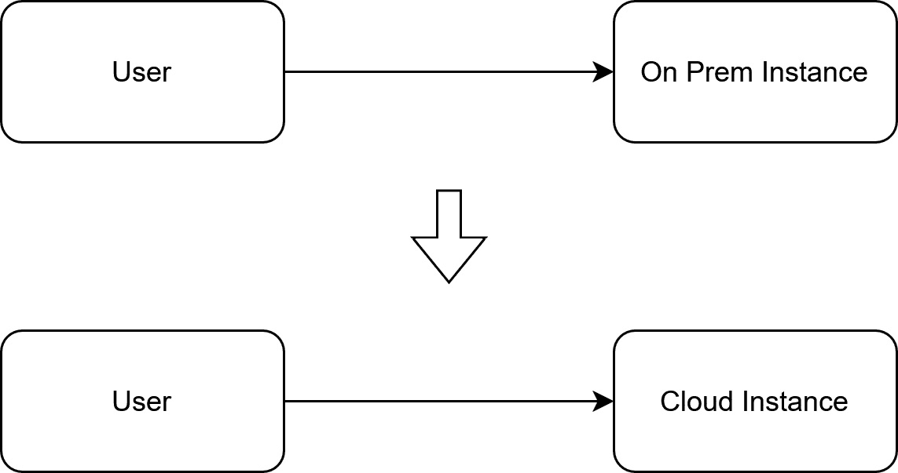
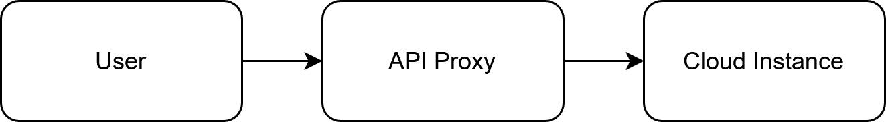
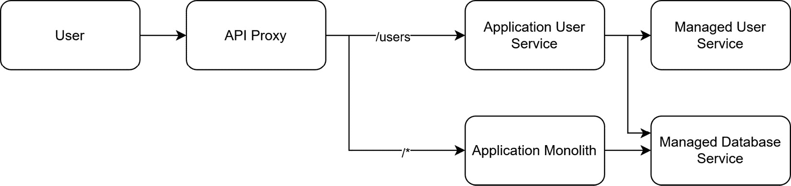
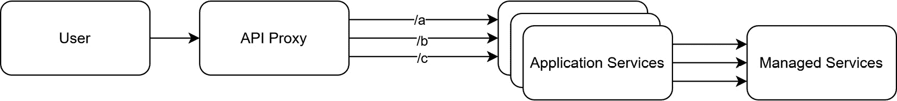
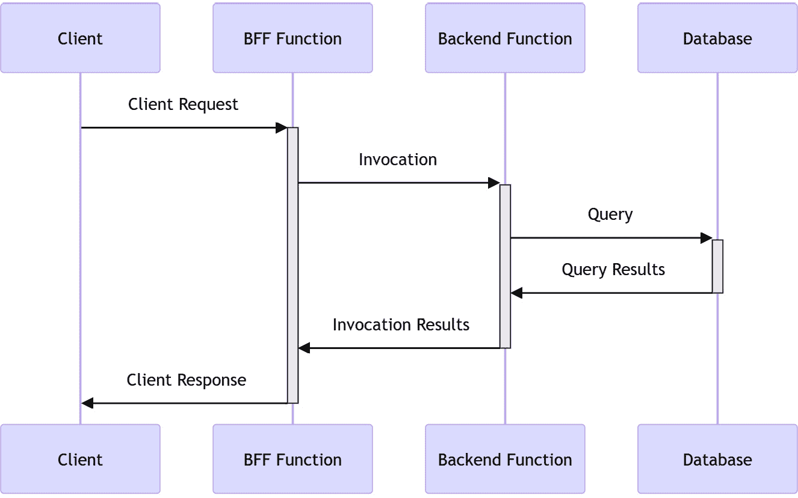

# 将业务目标表达为应用代码

使我们公司技术独特并提供竞争优势的**业务逻辑**通常是我们采用的业务逻辑。将我们的业务规则表现为**应用代码**可以推动自动化、减少周期时间并提高生产效率。然而，当我们将这些逻辑迁移到云端时，我们可能会被一些**反模式**所困扰，这些反模式在我们过去的单体化本地架构中通常能被忽略。

在本章中，我们将涵盖以下主要主题：

+   搬迁转移

+   有状态应用程序

+   紧密耦合，低内聚性

+   完整的“完成”定义

+   其他陷阱

# 搬迁转移

当我们将应用程序迁移到云端时，我们需要转变思维方式，从将应用程序作为独立单元部署转变为将应用程序视为各种服务交互的涌现行为。在本节中，我们将探讨将应用程序迁移到云端的典型过程、我们可以使用的策略，以及如何提高我们云原生解决方案的成熟度。

## 在云中构建与为云构建

当我们将应用程序迁移到云端时，最简单的方法是将现有的部署打包成一个虚拟机（VM），然后将其部署到云端，并称之为云原生。这种思维方式将云的实际使用局限于简单地反映我们在本地环境中已有的拓扑结构。但我们实现了什么呢？我们仍然面临着刚刚迁移过来的系统的相同限制，但却没有享受到云的任何优势。我们只不过是把代码从我们的服务器转移到别人的服务器。我们可能在可维护性、组织复杂性和入职时间上获得了一些效率。然而，这种做法并非云大规模服务商所特有的，我们也可以通过大多数其他虚拟机托管平台实现相同的结果。这个**搬迁转移**思维方式使我们进入了云，但未能充分利用云的潜力。这种思维方式的区别在于：在云中构建与为云构建。一旦通过这种搬迁转移方法将应用程序迁移到云端，我们不仅可以对应用程序本身进行改进和优化，还可以优化其周围的基础设施和架构。

我曾经在一家公司工作，该公司有一个现有的本地解决方案。这个本地解决方案通过远程部署分发给客户。客户提供一台机器，特定的入驻团队登录到该机器上，并运行一个脚本来设置应用程序。这样的迁移思维一直延续到了他们提供的*云原生*托管产品中。入驻团队在云中配置了一个新的实例和数据库，然后有人安装了应用程序，客户访问云实例。这一过程是该公司在云中提供服务的首次尝试。然而，手动流程一直存在，且难以改变。这些流程是经典的“在云中构建”与“为云构建”之间的区别。放弃对这些业务流程的控制，交给自动化，可能是一个挑战。然而，除非我们利用云所提供的优势，否则就无法真正认识到这一转变的实际效率。一个能够更快速地推进周期并降低新客户进入门槛的好方法是转向自助、按需入驻，采用云工厂方法，正如我们在本章稍后的部分会详细介绍的那样。在他们未来构建的云原生应用中，也采纳了类似的技术，且这些应用是从零开始构建的。然而，这也引出了一个新的反模式，即持有“这次我们要把它做对”的心态。

## “这次我们要把它做对”的迷思

我们经常看到的一个反模式是软件团队希望摧毁一切并从头开始，以便变得云原生。这种非黑即白的方法不仅将你的业务分割成**遗留系统**（你的原始应用）和**全新领域**（你全新的应用）开发，还意味着你忽视了客户正在使用的产品，而投入到一个可能在至少达到与本地解决方案相当的功能前，不会有用户的产品上。这些项目的时间表通常被严重低估，并且需要重新培训和重新配备资源，以获得你所需的云原生技能。这种非黑即白的方法通常意味着在你组织最缺乏云经验的时刻，围绕你的应用程序及其架构的关键决策会在前期做出！

在转向云时，AWS 提供了 7 种迁移策略，如我们在*第二章*中讨论的那样。为了帮助你回忆，这些策略包括：重构、重新平台、重新购买、重新托管、重新迁移、保留和退休。

你会注意到，*重建*并不是其中的一个选项。为了在现有应用中充分利用云原生服务，我们必须选择一个最终将我们引导到重构路径的选项。开始的最简单方法是为我们的现有应用构建一个云工厂。

## 云工厂

云迁移的搬迁和移位是不可避免的。在云中运行现有应用是将其迁移到云原生的第一步。在部署本地应用程序时，由于涉及客户提供的硬件，客户控制的访问以及手动步骤的部署，这会有显著的前置时间。正如我们之前的例子中所讨论的，这个领域中的一个常见反模式反映了云环境中的这一过程。客户在本地环境中使用不同的**防火墙**、**虚拟化程序**、**硬件**和**安全**。部署过程通常需要手动干预，以处理特定客户的独特性。

在云环境中部署时，我们可以自行指定这些选项。我们可以决定我们的虚拟机的大小、如何配置防火墙和网络，或者使用哪种操作系统。与多个独特的客户环境不同，我们多次部署相同的云环境，这意味着所有的怪癖对每个实施案例都是相同的。现在我们可以确信地自动化提供工作流程，从可能需要多个客户联系几周的过程，减少到可以在管道中运行并可能需要 30 分钟的过程。为您的应用程序创建一个云工厂是将本地应用程序迁移到云端的关键第一步，而无需重新设计为多租户模型。我们将在*第十二章*中深入探讨这一点。当我们开始将应用程序转移到云上时，一个问题仍然存在：我们如何在保留最终功能的同时重构它？答案是通过使用攀缘榕模式。

## 通过吸收枯死树上的养分，攀援榕树的云原生

攀缘榕是一种生长在宿主树上的植物。有时，宿主树会死去，只留下攀缘榕。由马丁·福勒提出的**攀缘榕模式**类似。它让我们逐步将现有的应用程序变成云原生，最终完全替代我们的传统解决方案。通过这种行动机制，我们还允许将系统范围的架构决策推迟到后续阶段，一旦我们组织的云成熟度得到改善。云迁移的第一阶段是将现有应用程序带入云端 - 也就是说，重新托管。您也可以在没有重新托管阶段的情况下技术上采取这种方法，而是将流量重定向到我们的本地实例，尽管这需要额外的网络设置和可靠的授权策略。这种简单的过渡在*图 7**.1*中有所体现。我们从一个本地实例开始，然后用云实例替换它。这个切换对最终用户是透明的。

图 7.1 – 从本地到云的初始应用迁移

通过完成这个阶段，我们已经实现了一些效率；通过消除对物理硬件的依赖并利用云工厂，部署速度变得更快，合租成本消失了，我们也减少了分散系统的操作负担。然而，我们并非云原生；操作系统补丁和数据库维护等负担仍然存在，我们仍在以一种将基础设施拓扑与客户群体匹配的方式进行操作。

我们迁移的下一个阶段是一个简单但关键的阶段，支持我们应用程序的未来版本。我们需要添加一个**API 代理层**。所有的大型云服务商都有提供这种功能的托管服务；在 AWS 中，它是**API Gateway**，Azure 有**API Management**，而 GCP 有**Apigee**和**API Gateway**。一些开源项目也为特定环境提供类似的功能，例如**Kubernetes**。这里的关键是，我们在终端用户和我们的应用程序之间引入了一个层，它可以执行 OSI 模型中定义的**第七层路由**。该模型将允许我们检查传入的流量，并根据 HTTP 请求属性决定操作。与*图 7.1*中的架构相比，我们现在增加了一个架构元素，即 API 代理，它对终端用户仍然是透明的。

图 7.2 – 向云实例添加 API 代理

从功能上讲，我们还没有充分利用 API 层的能力，但我们已经通过这次变更实现了一些操作效率。如果我们使用**传输层安全性**（**TLS**），我们可能会有一个预配的 TLS 证书。切换到完全托管的代理允许 TLS 终止在代理层进行，从而使我们摆脱了通过手动或半自动化过程管理 TLS 的操作负担。关键在于我们的应用程序不再与已部署的实例绑定。通常，我们使用单体架构构建本地应用程序，因为这些应用程序的部署与我们部署它们的硬件拓扑密切耦合。在云环境中，这些限制不再约束我们。这对开发团队在这种环境中的操作能力是有害的。使用单体架构通常会导致组件之间的高内聚，使得在不了解其在整个应用中的使用范围的情况下，很难预测某个变更的影响范围。

解决方案是使用 API 代理的第七层路由功能，将我们的应用解构为新的云原生实现。例如，许多应用都拥有一个用户管理系统，供用户登录应用。传统上，有人可能通过将密码存储在数据库中来实现这一点，理想情况下是经过哈希处理和加盐的。这种方法对大多数公司来说是一个明确的风险来源。**不安全的哈希算法**、**时序泄漏**和**密码数据库安全**，在这种模型下，都是贵公司直接负责的事项。通过将其迁移到托管服务，我们显著降低了运营风险。我们还可以在此阶段进行更改，通过将一些较为简单的迁移（例如数据库）重新平台化到兼容的托管数据库服务中，从而使我们的解决方案更加云原生。继续我们的架构演进，我们将单体应用拆解为下图所示的组件：

图 7.3 – 开始将单体应用解构为领域驱动的微服务

在这个新架构下，我们将用户管理和我们重新平台化的应用单体进行了分离。我们的用户服务通过 API 代理提供一个抽象层，用于执行如重置密码、更新电子邮件地址以及其他以用户为中心的功能。同时，我们原本的单体应用仍然包含所有用户外部的功能。我们已经成功地将应用的一个部分重构为真正的云原生，并使用了托管服务。最重要的是，我们不需要了解整个应用的架构设计就能实现这一点。我们只需要理解这个特定领域以及可用的服务来加速它的实现。我们还打破了用户服务和应用中不相关部分之间可能存在的耦合。在这种新模型下，对用户服务的变更只会影响服务本身，而不会对应用的其余部分产生意外副作用。

在一些简单的情况下，我们可能只有两个 API 代理目标：新的云原生服务和旧的遗留服务。然而，在执行这种替代或迁移功能的方法时，同样值得重新评估您的架构，看看您是否可以减少应用内的耦合，或通过拆分不同的服务来增加特定领域的内聚性。很少情况下，要求进行重构以成为云原生的完美解决方案是构建一个云原生的单体应用。

渐进地，我们可以继续将服务分解为其新兴领域。我们在应用程序内建立了有界上下文，代表了我们业务上高度内聚的部分。关于有界上下文和领域驱动设计的更多信息，我推荐阅读*《领域驱动设计》*，作者是埃里克·埃文斯。然后我们将我们的架构分解为这些领域，并尽可能利用云原生服务。作为这一转变的一部分，如果我们的应用程序支持多个客户，我们还可以将多租户性能构建到这些服务中。最终，我们将达到一个整合了整个应用程序的一系列云原生服务的阶段，这些服务由提供等效或改进功能的托管服务支持。作为我们架构演变的最后一步，我们已经移除了单体，并且只留下了新的应用程序服务。这在*图 7**.4*中有所体现。

图 7.4 – 原始的单体应用程序已被弃用，真正实现了云原生

通过使用 API 代理来缓慢而系统地分解单体，我们有效地实现了期望的结果：移除遗留的单体并采用云原生服务。在这一点上，可以移除 API 代理；然而，在大多数情况下，应用程序代理仍然通过作为应用程序的中心入口点提供好处。

我们已经审查了初始云迁移中的典型反模式，包括一次性迁移或退役重建等低效迁移策略。我们还探讨了榕树模式如何允许我们在现代化应用程序的同时继续为当前客户提供服务。现在，我们有了一条通往云原生的路径，不需要一次性广泛的解决方案，而是可以作为长期数字转型的一部分，重点放在客户结果上，而不是技术上的纯主义。

现在我们已经深入研究了现有应用程序的迁移，我们可以开始看看应用程序本身如何构建成为云原生。这个旅程的第一站是解决我们应用程序状态存储的位置。

# 有状态应用程序

大多数应用程序的核心是一系列**有状态进程**。这些状态可能是**短暂的** – 也就是说，它们可能不是具有长期上下文的数据，例如用户会话仅在用户访问网站时处于活动状态。在其他情况下，我们可能会将这些状态持久化以供长期存储。例如，网上商店可能需要维护购物车状态，收集付款并发货商品的状态。这些都是需要在我们的架构中某处持久化的状态。在单服务器模型中，混合系统的本地和外部状态是微不足道的。在本节中，我们将研究这些模式的可伸缩性和健壮性，以查看如何以云原生方式管理状态。

## 无状态服务器

构建云原生应用程序时，一个常见的反模式是将状态存储在服务器本地。大多数云服务提供选项，如**会话亲和性**，使您可以将应用程序迁移到云中，并在本地存储状态。然而，我们应该避免在新的或重构的云原生应用程序中使用这些模式。两种主要模式可以帮助我们在云中实现这一目标。

在**状态声明模式**中，客户端向后端服务器呈现**可验证的状态表示**。我们通常使用这种模式来处理短暂状态，其典型示例是替换用户会话令牌，我们可以将其与存储在机器上的短暂状态匹配，并使用用户会话声明，如**JSON Web Token**（**JWT**）或**安全声明标记语言**（**SAML**）响应。在这两种情况下，客户端存储他们的状态，并且我们可以通过加密安全的签名来验证客户端的状态未被篡改。此模式有一些注意事项，例如，除非加密，否则这些令牌对最终用户是透明的，因此我们绝不应在声明中包含我们不希望用户看到的秘密信息。它们也是令牌窃取的主要目标，因此在使用此模式时，**令牌生命周期**、TLS 和**令牌存储**在客户端设备上的良好实践至关重要。

第二种模式是使用**外部状态存储**。如果我们处理的数据不是短暂的，并且需要由多个方使用，那么我们必须将状态持久化到服务器外部的存储中。存储的数据类型决定了我们如何在后端存储它。关键在于将状态移出我们的应用程序，这在云计算世界中提供了诸多好处。

我们通常会遇到三种类型的状态数据。当然，总会有例外和边界情况，但作为一般规则，我们可以选择适合我们用例的外部状态存储。

**瞬态状态数据**是指在某一时刻表示系统子状态的数据，但如果数据被删除，它不会带来不良后果。这可能是因为数据本身是其他数据源的缓存，可以重新构建，或者因为数据本身的性质是短暂的，例如**短生命周期会话令牌**。通常，我们存储这些数据是因为我们需要它在短时间内可用。可以把它想象成你的短期记忆，它存储着你当前正在积极使用的值，但随时可能被替换。云服务提供了专门针对高性能工作负载的解决方案，可以用于更具成本效益的方案。对于高性能工作负载，我们可以使用 AWS 的 **ElastiCache**、GCP 的 **Memorystore** 或 Azure 的 **Azure Cache** 等服务；这些服务都体现了传统部署缓存服务的概念。该领域的其他新兴解决方案，如 **Momento**，提供了缓存即服务。如果延迟不是关键因素，其他专有解决方案可能在成本效益和可扩展性方面更具优势，仅对延迟造成最小影响，例如 DynamoDB（AWS 的 NoSQL 服务）表中的 TTL，甚至像 Momento 这样的完全 SaaS 解决方案。与自管理范式的关键区别在于，这些服务是受管的，并且都提供自动可扩展的选项，使我们可以专注于应用程序中带来价值的部分，即我们的领域逻辑。

**持久状态数据**是指系统需要在语义模型的上下文中持久化引用的数据。这些数据可能是我们希望记录的订单，或者是我们希望保持余额的银行账户。我们存储这些数据的方式可能有不同的模式，比如**关系型**与**非关系型**、**规范化**与**反规范化**，或者**结构化**与**非结构化**。通常，这些状态的表示可以看作是类似于我们长期记忆的记录。在写作本文时，这是一个令人兴奋的领域，因为关系数据库的无服务器服务，如 AWS 的 **Aurora Serverless** 或 GCP 的 **Cloud Spanner**，正在取得巨大进展。对于非关系型数据库，大多数云提供商都拥有真正的无服务器服务（在它们能够扩展到零的方式上）。AWS 提供了 **DynamoDB**，Azure 提供了 **Cosmos DB**，而 GCP 提供了 **Cloud Firestore**。

**支持数据**通常是指没有持久化数据上下文的情况下几乎没有意义的数据。这些可能是像照片、PDF 文档或其他类型的文件，我们希望存储它们，因为它们提供了附加的信息。持久化数据和支持数据的区别在于，支持数据可以被视为对象，而不是记录。这一区别也反映在服务命名的方式上，通常称为 Blob 或应用程序存储。AWS 有**S3**，GCP 有**Cloud Storage**，Azure 有**Azure Blob Storage**。再一次，这些都是托管服务，它们的吞吐量和容量会随着我们的需求进行扩展。

问题是，我们什么时候需要将状态提交到外部服务？一般的经验法则是，任何需要在一次事务之外持久化的状态都应该提交到外部状态管理系统。局部状态在事务处理过程中是可以接受的，但对于任何突破这一边界的情况，外部状态是必需的。我们可以举一个大家可能都曾遇到过的例子，那就是多页网页表单，每次提交一个错误的值时，它会忘记之前的页面并把你带回第一页。这就是我们在使用跨越转换边界的本地状态时所面临的风险。

这些数据类型在处理在线事务处理（OLTP）工作负载时最为常见。在处理分析型（OLAP）工作负载时，存储和消费模式有所不同。当需要分析功能时，通常建议将数据持久化到一个专为你的使用场景构建的分析存储中，例如数据仓库。每个超大规模云服务商在这一领域有稍微不同的方法：GCP 有完全托管的无服务器解决方案**BigQuery**，AWS 有**Redshift**，Azure 有**Azure Synapse**。在这些超大规模云服务商之外，也有一些重要的竞争者，如**Snowflake**和**Databricks**。

现在我们已经讨论了如何从本地服务器中移除状态，接下来让我们探索在云原生环境中，这种变化为我们带来的弹性和可扩展性的全新可能性。

## 无状态服务器范式中的弹性和可扩展性

AWS 的首席技术官**沃纳·福格尔斯**曾提到过“*一切都会失败，永远都会失败*。”如果我们将状态保存在本地服务器上，那么该状态的持久性就与单一服务器的可靠性一样。像超大规模公司这样的企业，雇佣了大量工程师来确保他们的应用程序具备持久性、可用性，并且没有漏洞。而大多数进行云原生转型的人无法获得这些大公司所拥有的资源。这就是**无状态云范式**发挥作用的地方，它使我们能够通过使用托管服务来存储状态，从而在边际上进行交易。这些托管服务背后有大量工程师。如果我们将状态持久化到应用程序外部，突然之间，应用程序的容错能力变得不那么重要了。

服务器崩溃了？启动另一个服务器并调查原因。我们的状态不在服务器上，所以服务器是否宕机不再重要。我们的新服务器会从上一个服务器停止的地方继续运行。更好的是，在自我修复组中运行多个无状态实例的服务器。云服务还允许我们自动化这部分系统。AWS 使用**自动扩展组**和**弹性负载均衡**。GCP 为虚拟机提供了托管实例组，或者为容器提供了**Cloud Run/Google Kubernetes Engine**，以及**负载均衡器**来分配流量。Azure 使用**虚拟机规模集**和**Azure 应用服务**来实现类似效果。所有这些服务都使我们能够减轻单点故障的风险，尤其是在我们负责的云端部分，这些部分通常包含最多的漏洞。需要注意的是，管理状态甚至不需要是我们自己代码中的一个过程；我们可以更进一步，使用完全托管的状态作为服务。

## 状态即服务

通常，我们构建状态机来复制业务流程。例如，我们可能会在分布式微服务架构系统中为新租户进行注册。过去，我曾见过一些人以复杂且通常脆弱的方式编写代码，且文档不足。例如，一个名为中央租户服务的服务调用每个微服务进行编排，但这个租户服务会被每个需要执行入驻操作的团队触及。结果是无穷无尽的状态和容易出错的入驻流程，导致出现大量边缘案例，没有人能够轻松掌握系统的全部复杂性。

我们希望有一个状态机，告诉我们请求的操作是否已完成。这里，托管服务也可以带来好处。像**AWS Step Functions**、**Google Workflows**或**Azure Logic Apps**这样的解决方案可以将状态的维护外包给云端自身。这是当需要集中式编排时的一个优秀解决方案。在我们之前的示例中，我们希望为一个租户进行入驻，因此我们创建一个状态机，在租户服务中创建一个新租户，在用户服务中为该租户创建一个新的管理员用户，并向该用户发送一封电子邮件，邀请其登录。一旦用户接受邀请，可能会有更多的阶段，例如为租户配置新的数据，提示管理员添加其他用户，或为用户文件设置保留策略。

我们可以通过事件和特定服务的状态以分布式方式进行管理，但通常这会导致没有适当监管的无边界、未记录的行为。将状态机作为服务的方法还可以让我们在一个单一的界面中查看状态机结构，以及各个状态实例如何在其中进展。当租户入驻系统出现故障时，我们可以通过查看定义良好的状态机立即看到错误发生的位置。

我们在这个系统中通常看到的反模式是人们将状态机用于那些不跨越边界上下文的系统（即它们不需要编排）。在这些情况下，我们应该依赖于边界上下文内部的状态表示，例如将订单项从“已订购”更新为“已打包”，然后到“已发货”。在这种情况下，状态转换简单、线性且位于边界上下文内。因此，不需要外部状态编排。状态谜题的最后一部分是配置我们的应用程序。

## 将应用配置视为状态

从根本上讲，我们的应用行为是应用状态通过业务逻辑过滤后的一个自发属性。这里的反模式是将应用配置定义在我们用来定义业务逻辑的相同代码中。应用配置只是另一种形式的状态，通常在不同的部署环境中有所不同。我们的代码应该对其部署的环境保持中立，相反，配置应通过部署本身进行管理。我们通常会将应用配置存储在两个地方：

+   在外部的键值存储或密钥管理器中。我们在*第五章*中提到了这种方法，用于特性标志。

+   在用于创建我们应用程序新实例的模板内部，如通过环境变量。这通常用于引导值，比如服务发现端点或数据库连接字符串。

配置域中的本地状态与事务域中的本地状态之间的区别在于，配置域中的状态必须满足两个标准才能生效：

+   它必须是不可变的；配置不能由于外部因素变化，除非是服务的重新部署。

+   它必须是通用的；所有应用的副本必须提供相同的本地状态副本。

这两种范式确保我们的事务与完成请求的实际后端服务无关。在外部情况下，我们有更多的灵活性，但需要小心轮换和缓存失效的影响。

状态允许我们的应用通过业务逻辑的视角提供意义。然而，不当处理的状态可能会导致弹性和可扩展性问题。幸运的是，在云环境中，有许多经过验证的工具可以帮助我们存储应用状态。我们甚至可以将我们的状态机完全迁移到云端，利用云原生服务，同时将运营复杂度降到最低。尽管状态是我们应用的命脉，但我们代码的健康性和可变性通常通过另外两个属性来衡量：耦合性和内聚性。

# 紧密耦合，低内聚

在软件设计中，两个常用的衡量相互关联性的指标常作为健全系统设计的试金石。这些是**耦合**和**内聚**。耦合指的是不同服务之间互相调用以完成任务。高耦合意味着服务之间高度依赖，且在没有担心依赖关系或副作用的情况下，单独操作这些服务会变得很困难。内聚正好相反。耦合衡量服务之间的关系，而内聚关注的是服务内部的关系。如果一个服务的内聚性差，它会试图同时做许多不同的事情。我们常常看到在云原生软件开发中，低内聚和高耦合作为一种反模式。在本节中，我们将探讨这些反模式如何在云环境中体现，并讨论如何避免它们。

## Lambdalith 与单一功能函数

在已部署的基础设施中，我们经常看到的一个反模式是低内聚度。通常，这种反模式是通过孤立的基础设施团队引入的；有关为什么这可能是一个糟糕的想法，请参阅*第五章*。让我们假设我们在 AWS 上有一个无服务器函数，一个**Lambda 函数**，每次我们想要一个新的函数时，我们都需要基础设施团队的批准来为我们创建一个新的函数，而不是让我们有权自己创建一个新的 Lambda 函数。然后，我们得到了一个本应只需要一天时间来实现的功能，但实际上应该是一个无服务器函数。与其等待基础设施团队处理他们的工单积压，并为我们提供我们的函数，我们看到了一个非常诱人的现有 Lambda 函数，只需添加一些额外的路由，也可以处理这个其他功能。将这种效果复合到许多功能中，突然间，我们得到了一个庞大的单体无服务器函数。因此有了“**Lambdalith**”这个别名。问题在于这些无服务器函数具有低内聚度。这意味着通过修改我们的函数，由于流程效率低下和独立所有权，我们可能会对完全不相关的功能产生很大的影响。

我之前曾与一个将架构团队与基础设施和开发团队分开的组织合作过。创建一个服务需要三个团队的互动，并且按照每月的节奏进行。这个特定的组织将团队与业务域对齐；每个业务域通常管理几个服务。虽然功能开发非常迅速，但支持这些功能的新服务的添加事件却非常罕见。这些容器在应用程序部分之间的内聚性低下中显著复杂化。**康威定律**依然活跃，架构紧密地遵循团队拓扑，甚至过度遵循。

在任何过程中，无论是在线销售还是供应新基础设施，这个过程越困难，完成的可能性就越小。通常，人们会问适当的摩擦力是多少，以确保我们仍然能够生成安全的、可部署的工件。几乎总是答案是尽可能少。我们应该通过为他们提供一个安全的平台来使团队能够负责其自己的输出。基础设施和架构资源应该在任何时候都可用以支持它们。然而，如果开发团队无法推动这个过程，你会发现这个过程将会被极大地浪费。

Lambdalith 的真正云原生对立面是单一功能的无服务器函数。在这种模式中，每个函数只做一件事，并且做到最好。例如，特定 API 端点上的 `POST` 方法。这并不意味着它不能与其他单一功能的函数共享代码。通常，将这些函数分组到具有高内部凝聚力的伪服务中是有意义的。然而，每个部署的函数应该对其伪服务组中的其他函数完全独立。这种分组可能是通过从同一代码库（如果使用单一仓库的话，甚至是同一个父文件夹）部署多个单一功能的函数来实现的。这种模式为我们提供了高凝聚力的部署单元。每个单元只关心满足单一请求类型的需求。我们应当注意，不要将这些单元拆解得过于细化。也就是说，它们不应该被拆解到需要多个函数链式调用的程度。

## 链式无服务器函数

另一个我们常见的反模式是无服务器函数在调用栈中的链式调用。这种形式的耦合会对解决方案的性能和成本效益产生极其负面的影响。例如，考虑一个无服务器函数，它使用典型的同步 **前端后端**（**BFF**）方法调用另一个查询数据库的无服务器函数中的业务逻辑。此情况在下图中有所展示。

图 7.5 – 无服务器函数的链式调用

如图所示，每个前置调用在等待后续调用完成的同时运行。在这种调用模式下，我们实际上是在加倍计算资源的消耗。在容器化或虚拟机环境中，这并不是问题，因为我们的计算资源可以在等待链式调用完成时处理其他请求。然而，在无服务器函数环境中，我们的函数一次只能处理一个调用。这意味着，在等待链中的第二个无服务器函数完成时，第一个 Lambda 函数无法处理其他请求。因此，我们实际上是在没有任何实质性好处的情况下，增加了计算成本和资源消耗。一些云服务提供商，如 GCP，正在构建允许更好利用这些未使用计算资源的平台。然而，大多数默认实现仍然限制为一次只能处理一个请求。链式函数是耦合的典型例子，它可以在单一函数内部转换为高凝聚力。我们更常见的需求是执行反操作，将耦合的服务解耦。

## 解耦耦合服务

当我们从另一个服务调用服务作为依赖项时，我们会增加对被依赖服务的更改爆炸范围，涵盖我们的依赖服务。这是一种紧耦合形式，可能对应用程序的性能造成很大影响。我们将服务链接在一起的数量越多，我们的服务就越不可靠，因为我们现在处理的是每个服务在链中的可靠性乘积。假设每个服务的可靠性为 95%。如果我们将 4 个服务组合在一次调用中，我们的可靠性将下降到 81.4%（0.95⁴）。通常，这个问题出现是因为它非常符合我们对服务的心理模型。作为程序员，当我们需要在应用程序内部执行某些工作时，我们调用一个函数并等待结果。将这个模型扩展到多服务架构时，我们调用另一个服务并等待结果。

幸运的是，云服务提供商有一种云原生方式来解决这种紧耦合问题。正确实现这一点需要两种思维方式的转变：

+   我们需要打破同步反馈的观念。发送一个 HTTP `202` 返回代码并异步执行工作，和同步响应 HTTP `200` 返回代码的单次调用一样有效，甚至可能更有效。

+   我们需要停止将每个需要运行的服务视为依赖项，而是开始将它们看作是需要完成的独立工作单元。

在云原生环境中实施这些解决方案的关键是通过在中间放置一个托管服务来解耦这些服务。AWS 提供了**简单队列服务**（Simple Queue Service）和**EventBridge**，GCP 提供了**Google Pub/Sub**，而 Azure 则有**Azure Event Grid**和**Azure Service Bus**。

这些托管服务提供了类似的功能。它们充当我们的服务之间的消息代理，这样我们的服务就不需要同步通信来传递信息。它们在操作方式上略有不同。有些是**简单消息队列**，而有些是带有发布和订阅功能的**完整事件总线实现**。

使用这些服务的结果是类似的。我们的可靠性不再是由一系列产品的结果，而是通过解耦服务来将服务的可靠性交由托管服务负责。我们来看看四个不可靠的服务并将它们连接到托管服务上，实现异步执行。假设我们的托管服务具有四个 9 的正常运行时间（99.99% 的正常运行时间），那么我们的结果是四个服务，每个服务具有 95.98% 的可靠性。如果其中任何一个服务出现故障，其他服务仍将继续运行。

实施**死信队列**（**DLQs**）可以进一步提高这些服务的可靠性。如果我们的某个服务无法处理消息，我们可以将消息积压发送到 DLQ 中等待处理。一旦我们修复了我们的服务并且一切正常运行，我们可以自动从 DLQ 中重放事件并完成未完成的工作。这意味着不是一个服务故障会影响所有系统，而是一个系统的影响范围仅限于该系统本身。系统最终会在重播所有未处理消息后保持一致。当我们需要最终通过我们的系统跟踪这些事件，也许是为了排查它们为什么会进入我们的 DLQ，我们需要关联它们的路径，这引出了分布式系统的一个重要部分：遥测和事件关联。

## 遥测和事件关联

你无法提高你无法测量的内容。准确理解已部署应用程序中的耦合度可能具有挑战性。通常情况下，我们会遇到一种反模式，即使用传统的日志系统与分布式系统。传统的日志系统无法提供所需的粒度（详细级别）和可追溯性（与其他消息的关联性），以便调试和改进分布式系统。通常情况下，当我们调试分布式系统时，我们试图拼凑出在多个部署单元中执行操作的结果。这就是健壮的**遥测**系统发挥作用的地方。我们可以在进入分布式系统时标记所有请求、消息和调用的**关联 ID**，然后使用此关联 ID 跟踪该操作的影响，跨所有部署单元和托管服务。我们将在*第十章*中更详细地介绍遥测系统。然而，我们可以利用现代遥测系统的关联方面来帮助我们解耦应用程序。通过跟踪我们的迹象，我们可以揭示系统之间的依赖关系，这些依赖关系以前可能需要查看源代码或环境配置来找到。一旦我们识别出应用程序内的依赖关系，我们可以逐步从紧密耦合的依赖关系（一个服务调用另一个服务）转向松散耦合的依赖关系（通过共享的托管消息总线或队列连接的两个或多个服务）。

**紧耦合**和**低内聚**是我们通常在本地环境中避开的一些反模式。在云环境中，这些模式变得不再有效，导致应用程序性能差和意外副作用。解决这些反模式的关键是，首先能够衡量耦合度和内聚度，其次是努力解耦紧耦合的服务，并提高内部的内聚性。通常，建模内聚性和耦合度应成为特性架构规划的一部分，并构成“完成”定义的一部分。让我们探讨一些常见的陷阱，并深入了解完整的“完成”定义。

# 完整的“完成”定义

在创建**隔离发布模型**的软件时，正如在*第五章*中讨论的那样，我们探讨了如何赋能团队从构思到部署，再到运维，完全拥有交付结果。然而，这要求开发团队也要承担（在其他团队的支持下）之前被隔离发布管道隐藏的功能和责任，直到产品上线。因此，我们需要重新审视软件团队的*完成*定义（在某些情况下，还需要重新审视*准备好*定义）。之前我们探讨过为实现这一目标所需的文化和业务转型，而在本节中，我们将讨论如何将这些要求内建于你的“完成”定义中。

## 忽视安全

**安全**是交付管道中的一个关键因素。忽视安全实践可能导致公司风险逐渐积累，通常在发生安全漏洞之前不会被注意到。这种遗漏可能导致相互指责并带来严重后果。为了开发安全的应用程序，将多种安全实践整合到**软件交付生命周期**（**SDLC**）中至关重要。这些实践应成为任何工作完成定义的一部分，其审查应该像部署前的代码审查一样严格。

忽视**开源**或**外部依赖**是一种反模式。在软件领域，许多开源包提供了基础功能，我们在其基础上构建业务逻辑。然而，每个我们从外部源拉取的包都代表着可能将恶意代码添加到应用程序中的潜在途径。维护并监控**软件物料清单**（**SBoM**）能帮助你了解项目的健康状况。许多工具可以帮助你管理所使用的软件包的版本。管理依赖关系的典型模式是在语言层面使用一个可读的私有工件库，并通过这个工件库填充内部包供使用，同时允许它拉取并缓存上游包。这个库将使你能够拥有一个包含所有依赖关系和版本的统一视图，GCP、AWS、Azure 以及许多小型平台都可以从各自的工件库服务中导出和监控 SBoM。拉取请求应进行工具化，确保它们添加的包不会引入任何新漏洞，且应该定期进行维护，依据 SBoM 来解决任何新发现的漏洞。

没有**威胁模型**或构建后忽视它是一种反模式。通常，当我们看到从专门的安全团队转向支持并赋能的开发团队时，开发团队会利用安全团队来生成威胁模型，但在整个软件开发生命周期（SDLC）中未能充分考虑它。初步的威胁模型应作为团队“准备好”定义的一部分。威胁模型在决定如何解决问题时应是基础，且必须经过验证，确保所构建的解决方案能有效缓解已识别的风险。因此，威胁模型应是一个动态文档，随着变更的实施，提供有关如何缓解风险的详细信息，以便可以自信地合并这些变更。应用程序投入生产后，应通过**云原生应用保护平台**（**CNAPP**）进行监控，以捕捉任何可能未被威胁模型解决的风险或配置错误。有效的威胁建模的关键是选择合适的粒度。如果你是一个股票市场，正在对结算引擎进行修改，那么合适的粒度可能是每次合并。而其他低风险环境可能只需要在较低粒度层面进行威胁建模。其核心理念是找到适当的摩擦度，在不妥协必要的安全级别的前提下，合理地降低风险。

最后一种*忽视*安全反模式是源自云计算所提供的更大灵活性，即未能解决深度防御问题。在本地环境中，网络内部与外部的划分是显而易见的。你有一根物理电缆连接到防火墙，防火墙作为所有流量的入口点。你的解决方案可能在下游有一些软件定义的网络，但依然有明显的隔离。在云环境中，突然间，不同的服务运行在**虚拟私有云**（**VPCs**）内部或外部。端点可以通过互联网或通过端点投影进入你的网络进行访问。一些服务存在于**云服务提供商管理的网络**中，并需要额外的网络配置。所有这些都意味着流量流动的路径变得不那么明确。虽然有工具可以帮助解决这个问题，但从根本上讲，云环境的高度可配置性意味着配置错误可能会导致更大的风险面。受管云服务已经具备强大的**身份与访问管理**（**IAM**）工具。你应该在代码中补充强大的**零信任认证与授权**工具，并在每个应用层面进行验证。许多组织在实施零信任架构的过程中仍处于早期阶段。因此，这应该被视为一种北极星原则，而不是绝对要求。关键在于问自己：“*如果我们不小心直接将此服务暴露到互联网，会发生什么？*” 这有助于限制云配置错误的影响范围，并确保即使一个内部服务意外暴露给公众，它仍能授权进入的流量。这个影响范围的考量也需要从 CI/CD 的角度来考虑。我曾与一个客户合作，他们的所有基础设施都在一个单一的代码库和项目中。这导致了权限非常高的 CI/CD 账户，且它们的影响范围跨越多个独立的系统。拥有强大的深度防御策略意味着，随着应用架构向更自助的模式转变，开发者构建的基础平台足够安全，能够容忍每个层级的失败。正如我们必须确保开发者构建安全的平台一样，我们也必须确保我们构建的是可观测的平台。

## 忽视可观测性

在单体应用中，将日志输出到控制台足以调试我们的应用程序。这之所以有效，是因为应用程序只是一个简单结构（基础设施）上的复杂对象（我们的代码）。在云原生世界中，我们将很多复杂性转移到基础设施中，构成了一个复杂的结构（基础设施）上的简单对象（我们的代码）。这需要比单纯将日志输出到控制台更加健壮的**日志记录**和**遥测实践**。我们将在*第十章*中更详细地探讨这个话题，但在本节中，我们将介绍一些内容，这些内容应该构成完成定义的基础。

第一个反模式是忽略跨度，只使用日志记录。日志记录为我们提供了关于应用程序状态的时间点信息，而跨度则不同。跨度为我们提供了应用程序执行期间的上下文信息。作为完成定义的一部分，我们应该增加能提供有关我们代码执行子部分有意义信息的跨度。在跨度执行的过程中，我们还应该确保我们添加足够丰富的数据，以便通过我们的可观察性平台更容易地诊断问题。对于任何超出单个实例范围的部署，我们还必须考虑关联性，以便将跨度组合在一起并追踪它们在分布式应用程序中的路径。从多个服务的日志条目中拼凑请求的执行上下文比阅读相关联的跨度火焰图要困难得多。

第二种反模式是收集没有功能输出的度量指标。我们经常看到某些公司收集了很多度量指标，但没有警报或偏差监控。我们有数据来检查我们的应用程序是否按预期运行。然而，我们缺少一个关键步骤，那就是在出现问题时能够及时告知我们。通过全面的监控、警报和整改流程，我们可以确保系统的非功能性要求，如延迟和错误百分比，保持在可接受的范围内。因此，作为完成定义的一部分，我们应该确保两件事：

+   首先，我们必须确保所做的更改已经设置了监控。这可以通过合成流量、**应用性能监控**（**APM**）、可观察性工具和传统日志记录来实现。

+   其次，我们必须确保在工具检测到问题时，能够通知到正确的人。这可以通过自动在您的工单系统中创建工单、在消息通道中通知用户或其他方式来实现。关键是要识别回归问题，并且确保相关人员知道需要进行整改。

通过将这两个要素纳入我们“完成定义”的范畴，我们可以确保在新增或修改功能时，不会违反系统的非功能性要求。这种可观察性水平还使我们能够深入了解哪些部分的应用程序是我们持续改进过程中优化的候选项。以前，对于那些用户抱怨应用程序速度慢的客户，我们过滤了指标，将请求按照两个因素进行排序：请求的频率和典型事务的耗时。我们发现有三个端点被频繁调用且响应较慢。通过一些查询优化，我们将响应时间减少了两个数量级。这项改动总共花了三天时间，最终用户的满意度大大提高。如果没有收集这些指标并利用它们的输出，我们将需要在生产环境中进行大量测试，才能获得相同程度的洞察力。可观察性在发现事件原因（即问题发生时）时非常有用，但那么如何从一开始就避免事件的发生呢？

## 忽视可靠性

本节的最后部分讨论了忽视**可靠性**。这是我们在云迁移中常见的反模式。团队往往只关心功能是否能正常工作，而忽视了其持续运行的能力。正是在这种情况下，*你构建它，你运维它*的心态就显得尤为重要。那些同时负责其输出运维的开发团队，更有可能考虑到可靠性，因为他们有投资在其中，且希望避免在夜间或周末接到紧急电话。云原生服务提供了强大的工具，确保可靠性和服务的连续性。然而，利用这些服务可能意味着一次几秒钟的中断和几天的中断之间的区别。任何希望符合内部或外部**服务水平目标**（**SLOs**）或拥有合同**服务水平协议**（**SLA**）的公司，必须确保将可靠性视为“完成定义”中的一个关键方面。

我们将要讨论的第一个反模式是部署过程的一个方面。正如我们在*第五章*中所讨论的那样，开发团队应该负责自己变更的部署和运营。我们在这一领域经常看到的反模式是，在我们的环境中使用相同的部署策略。在开发或测试环境中，通常我们会使用**全有或全无**的部署策略。当我们想要保证所调用的代码版本是最新的，并且保持部署与测试周期之间的快速反馈时，这种策略是合理的。将这一方法应用于生产环境意味着，如果我们的变更导致功能故障，那么变更要么会完全崩溃，要么什么都不发生。即便是成功的部署，也可能会出现可避免的停机时间，因为新的服务可能需要时间才能上线。对于生产系统，我们关心的两件事是：**早期反馈**和**快速修复**问题。许多云原生的部署方法允许我们进行增量更新或快速回滚变更，以确保系统的正常运行，尤其是在使用像 API 网关或函数即服务这样的高度托管服务时。这些策略通常会以部署时间的增加或额外的资源配置为代价。同时，它们通常需要外部的状态管理，因为任何内部状态都会在部署时丢失。我们可以使用的部分方法包括：

+   **滚动部署**：这些部署将一组运行相同应用程序的资源（比如一组三个容器，可能都在运行我们的用户服务）进行逐步更新，直到所有服务都运行新版本，并且在开始部署下一个服务之前，等待每个服务变得健康。这使我们能够缓解在全有或全无的方式中，等待服务准备好处理流量时出现的可避免的停机时间，但它没有为我们在发生仅在运行时出现的故障时提供可靠的选项来恢复应用程序的正常状态。

+   **蓝绿部署**：在这种策略中，您有两组独立的资源。一组资源使用应用程序的最新稳定生产版本（蓝色）来处理生产流量，而另一组资源正在进行部署（绿色）。在确保新部署的系统正常工作后，您可以切换到新系统，这可以通过**别名**或**内部 DNS**来实现。然后，您可以停用旧的蓝色目标资源。如果发生故障，可以轻松地将引用、DNS 或其他方式指向旧的应用程序部署。

+   **金丝雀发布**：在这种策略中，你采用与蓝绿发布策略相同的部署方法。关键的区别在于从蓝色资源切换到绿色资源的过程。我们不会立即切换，而是将部分流量慢慢重定向到新的实例。这成为我们在煤矿中的金丝雀；我们可以使用一部分生产数据来测试服务，如果发生问题，只有少量请求会受到影响，而不是所有请求。否则，如果一切顺利，我们就会将所有流量切换到新资源，旧资源可以被退役。

这些方法论不仅仅适用于你的应用程序代码；这种模式可以在任何需要昂贵发布过程的地方使用。我曾与一位客户合作，该客户的数据库每个月都需要更新。每个月，用于构建数据库的数据都会被修改或追加。新数据的摄取和验证其正确性需要 15 分钟，而客户无法容忍 15 分钟的停机时间。因此，我们创建了两个表：一个存储最新数据，另一个存储上个月的数据。每次需要摄取新数据时，我们会将包含最旧数据的表填充为最新数据。然后，我们会将该表与当前使用的表进行对比。如果一切正常，我们将更新最终用户使用的视图，指向包含新数据的表。这使得数据集之间可以无缝过渡，不需要将系统下线，并且如果出现问题，可以迅速回退到最后已知的良好配置。理解哪种部署策略适合你的需求至关重要，选择合适的部署策略应成为“完成定义”的一部分。

我们将要讨论的第二个可靠性反模式是未正确处理**灾难恢复**。云服务有合理的默认设置来防止数据丢失事件，例如将对象存储在多个区域或自动化数据库备份过程。此过程通常是可调的，以满足你的**恢复点目标**（**RPO**）——即我们能够容忍丢失多少数据。尽管云服务对于数据丢失事件提供了很好的保护，但对于服务丧失事件的保护通常在很大程度上依赖于你的架构。数据丢失预防所未能解决的关键指标是**恢复时间目标**（**RTO**）。从备份恢复数据库可能需要相当长的时间。同样，搭建新的基础设施实例可能不是一个快速的过程。如果你的应用程序发生灾难性故障，那么制定一个恢复服务的计划对于你的终端用户来说非常重要。团队在这一领域通常犯的第一个错误是只创建一个基础设施副本，完成后就不再关注，然后继续开发新功能。在这种情况下，灾难恢复完全被忽视了。如果发生灾难性故障，团队不仅会忙于重新创建他们的服务，而且没有明确的过程来执行此操作。我们常见的第二种情况是，人们拥有一个理论上的灾难恢复策略。他们列出了发生故障时需要采取的步骤，但如果策略是理论性的，那么它实际上能否有效就难以保证。未经测试的策略毫无意义。任何灾难恢复策略都需要定期模拟测试。第一次测试的时间（而且通常是团队中的大部分人第一次看到该策略的时间）不应该是在发生严重故障时。通常，灾难恢复有几种选择；关键是所有选项都必须经过测试。我们通常考虑的恢复可能性如下：

+   **冷恢复**：该策略适用于非关键服务。冷恢复假设你从零开始，重新配置应用程序的新实例，并从备份中恢复以恢复服务。需要注意的是，没有灾难恢复计划并不等同于拥有冷恢复计划。像所有计划一样，冷恢复必须被记录并定期测试，以确保过程满足你的 RPO（恢复点目标）和 RTO（恢复时间目标）。

+   **热备份**：该策略涉及在不同位置运行您应用程序的第二个（或更多）最小副本，若服务发生故障，可以快速扩展以接管服务。理想情况下，**故障转移**和**扩展**应自动化，但在自动化尚未完成时，手动故障转移是完全可以接受的。一种替代热备用架构，采用相同的原则，涉及保持您应用程序的支持结构运行，但仅在需要故障转移时才启动应用程序。这种策略的变体通常被称为**试点轻量策略**。

+   **热恢复**：该策略涉及在多活架构中运行您的应用程序。就像我们可以运行多个服务器以确保能够容忍任何单个服务器的故障一样，这种模式采用相同的方法，但应用于整个架构。任何一个活跃部署的故障意味着流量可以被重定向到健康的区域。

**混沌工程**的概念在这里非常重要。记住 Werner Vogels 的名言，“*一切都会失败，永远都会失败*。”混沌工程通过故意将故障引入系统来加强这一点，确保系统具有容错能力。另一种好的策略是使用“游戏日”的概念，尤其是对于手动过程。这些模拟事件与责任团队一起执行灾难恢复策略，确保每个人都熟悉该过程。因此，每当完成一个功能或服务时，灾难恢复策略必须更新，以包括新更改的需求，并作为“完成定义”的一部分。

安全性、可观察性和可靠性是我们系统变化的内在部分，通常被忽视。通过将这些内在部分作为我们“完成定义”的一部分进行解决，我们确保我们的开发团队不仅仅是在构建展示他们所创建功能的应用程序，还在提供一个我们的最终用户可以信任的平台。这些系统部分构成了云原生可操作性的基础基准，但我们可能会掉入许多其他陷阱。

# 其他陷阱

在云原生应用程序开发中，有几种常见的反模式。本节将解析这些反模式，它们从传统软件开发中衍生而来，如何识别它们，以及避免这些反模式所需的主动思维转变。在我们的场景中，云原生应用程序具有扩展到任何我们选择的规模的能力，激发了我们的软件与潜在问题解决方案之间的有趣互动。通过理解这些反模式并采用主动的思维方式，我们可以赋予自己做出明智决策的能力，避免潜在的陷阱。

## 没有云原生经验的情况下解决云原生问题

我正在与一个客户合作，尝试将他们现有的数据结构迁移到**OpenSearch**集群中。我们有明确的模式，数据必须按照这些模式进行整理。然而，问题在于，客户尝试直接将他们的关系型数据结构迁移到 OpenSearch 中，而没有进行任何反规范化处理。这意味着，为了整理数据，我们需要执行多个查找操作来获取相关的数据结构。这些查找操作导致了一个情况：对于一个模型的单一请求，可能会膨胀为成千上万的下游请求，用于获取所有关联的数据。尽管我们一再反对，认为数据结构需要进行反规范化，或迁移到高性能、只读的关系型数据库副本中，但客户坚持要通过保留原始关系型结构在非关系型数据存储中来保持系统的*灵活性*。我们实施了许多改进措施，尽可能推动模型的性能，包括批量请求和针对重复值的本地缓存。然而，一些请求太过深度嵌套，无法进行优化。客户最初提出的解决方案是扩展集群，于是客户扩展了集群，直到再次遇到性能瓶颈，然后客户再次扩展了集群。我们与云服务提供商进行了有趣的电话会议，他们告知客户，他们提供的基础设施已经超出了云服务商为某些子服务预留的资源。这是我们想要解决的第一个反模式。几乎无限的云资源的易得性伴随着用更多资源解决性能问题的诱惑，结果是，云账单也会同样迅速膨胀。我们应该更多地从应用程序内部入手，而不是仅仅从其运行的基础设施来解决性能问题。垂直扩展我们的基础设施来解决性能问题，只会让我们走得更远。这个问题表明，可能需要一种替代的专业解决方案，或者您的服务耦合度较低，或者您的应用程序优化不良。

这引出了第二种反模式，它也可能导致第一种反模式。这种模式通常从一个负责云原生服务的人开始，他在网上看到一个有很多漂亮图标和框的分阶段架构，然后试图将这种架构强行套用到自己的用例中。我们的架构应该由我们需要编写的应用程序代码的要求来指导，而不是由我们编写的代码来适应某种架构。造成这种情况的原因可能是多方面的。一个常见的驱动因素是我们通常所说的简历驱动开发（resume-driven development）。当一个人更关心通过某种技术获得经验，而不是该技术解决问题的潜力时，就会发生这种情况。分阶段架构可以成为潜在解决方案的良好起点，并且通常能展示最佳实践。然而，我们必须谨慎对待这些架构，考虑它们在各种因素下的适用性。通常，在照搬一个分阶段架构之前，我们应该问自己一些问题，比如：

+   我们是否在这个分阶段架构解决问题的规模下运行？

+   我们是否拥有实施和维护它所需的内部技能？

+   这个模型是否符合我们的标准架构实践，还是它会是一个独特的架构？

+   我们能做哪些改动来确保这个架构更准确地解决我们的难题？

我们要讨论的第三个反模式是手动更改部署的基础设施或代码库，绕过我们的 CI/CD 流程。一个典型的例子可能是，我们的应用在生产环境中运行一个查询，完成需要一些时间。于是，开发者登录生产环境，快速在查找列上添加一个索引，问题就解决了。尽管需要一系列错误发生，以允许开发者进行这种修改，但从根本上说，我们正在给应用引入不稳定性。这个概念被称为**环境漂移**。我们的代码和部署管道定义了一个与实际部署不一致的模型。在我们的例子中，我们看到开发者对生产环境进行修改，这意味着所有后续更改的第一次测试，实际上是在这些更改进入生产环境时才会遇到环境漂移的问题。当我们需要重建基础设施时，这也会成为一个问题；通过绕过我们的源模型，每当我们尝试创建新的基础设施实例时，就会再次遇到同样的问题。解决这个问题的方法相对简单：开发团队不应在不遵循 CI/CD 流程的情况下更改非临时环境。如果他们想要快速原型修复或进行技术性突破，而这些工作会因对环境有写权限而加速，那么可以创建一个可以在工作完成后销毁的沙箱环境。这样，你就能避免在任何环境中积累测试和快速修复，避免影响生产环境的稳定性。理想情况下，这些低环境应尽可能与生产环境保持一致。关于生产环境，我们必须小心如何根据现实世界事件来扩展我们的代码。

## 成功的痛苦——无限规模的负面影响

在使用本地基础设施时，我们的应用程序吞吐量有一个上限。最终，我们将耗尽系统资源来处理请求。在云环境中，我们常常看到相同的思维方式发挥作用——一种忽视速率限制和服务限制的反模式。忽视速率限制、服务限制或节流的后果在云环境中显著更为严重。与基础设施限制不同，云环境中我们几乎拥有无限的资源池来进行扩展。假设我们将这种缺乏物理限制与无状态的服务器结合起来，这些服务器可以互换地处理任何请求，而不考虑我们可能有的任何服务级别分区。在这种情况下，我们可以非常快速且几乎无限地扩展以满足客户的需求。在这种情形下，我们必须对使用我们的服务设定人工上限。这些限制如何分配（例如按用户、租户、客户等）由实施者决定。我们设定合理的限制，以控制理论上无限的服务使用，避免成本失控，并确保不影响其他客户的服务。许多云原生托管服务已经内建了我们可以使用的功能，用于执行速率限制、使用监控和许可应用程序。通常，这些功能应用于**API 聚合层**，例如在 AWS **API Gateway**、Azure **APIM** 或 GCP **API Gateway** 中。幸运的是，这些相同的 API 密钥可以作为我们认证策略的一部分使用，例如，将请求与客户端绑定，以启用深度防御检查，确保我们的 API 密钥与我们正在调用的租户匹配。随着应用程序复杂度的增加，我们可能需要在 API 上实现自定义授权和速率限制逻辑。例如，AWS 允许通过 Lambda 函数向 API Gateway 添加自定义授权。其他一些小众的 API 代理平台，如**Apigee**（现已被 Google 收购）和**Kong**，允许通过全面的策略语言实现复杂的逻辑。

在传统的本地单体架构中，系统故障往往是一起发生的。我们的服务器是否超载了？这是一个相对简单的问题。在云原生世界中，我们的服务由多个组件构成，故障通常是零散发生的。我们需要对这些故障保持容忍，但也需要意识到，云所能支持的规模可能会导致一些有趣的行为。接下来我们要讨论的反模式是使用不良的超时和重试实践，尤其是在并发执行的背景下。假设我们有一个需要将 CSV 文件加载到数据库中的过程，并且有一个服务负责处理这些文件桶中单个文件的上传。当我们的上游客户——那些将文件上传到 S3 桶供我们使用的客户——意识到他们的系统出现了错误，过去三天内没有上传文件时，这并不算问题；他们已经补充了所有文件。假设我们有一个简单的架构，它通过 S3 事件和 SNS 请求 HTTP 端点来拉取文件进行处理。如果我们忽视了并发执行的后果，我们可能会突然开始同时摄取大量数据。这会对我们加载文件的数据库造成巨大的负载。如果我们没有为这些进程配置超时，那么我们可能最终会完全超载数据库。因此，我们应用程序中的所有调用必须设置超时，并且必须优雅地处理这些超时的到期，清理它们所请求的任何正在进行的工作。

那么，如果超时失败，接下来该怎么办？一个天真的回答可能是我们只需要重试请求。如果失败是由于系统过载以外的因素造成的，而且这些错误很少发生，那么我们可能可以采取这种方法。然而，需要注意的是，重试实际上是在加剧问题；我们正在请求更多的服务器时间来解决问题。如果系统已经超载，那么这种做法就会加重影响，因为旧的请求在重试时将与新的请求竞争资源。一个常见的策略是使用指数退避算法，尽管建议对最大重试周期和重试次数进行限制。这样做是可行的；然而，一旦服务器过载，大量调用将会失败，如果所有这些调用都按照同样的算法重试，那么我们所做的只是将问题推迟，最终在下次重试时我们将再次让服务器过载。

重试行为的另一个重要方面是**抖动**的概念。我们在重试行为中引入**随机性**，以防止发生踩踏式的拥挤情况。我们还需要注意重试的乘法效应。假设我们的服务发起了三层深的调用，并且每个服务都重试了五次。在这种情况下，下游系统将收到 53 次重试或 125 个请求，这正是我们不希望看到的行为，尤其是在下游服务过载时。幸运的是，有三种简单的方法可以避免这种情况：

+   使用消息队列解耦突发性和高成本的流量，然后根据队列深度扩展下游服务

+   尽可能使用云服务提供商的 SDK，因为这些 SDK 已经内置了重试行为

+   使用托管服务，因为这些服务通常更易于扩展，并且内置了重试和速率限制功能，您无需自己构建这些功能

这带我们进入最后一个反模式，即使用短暂资源的隐式属性进行硬编码的依赖映射。

## 避免隐式的短暂资源规范

在编写代码时，特别是**基础设施即代码**（**IaC**），我们很容易陷入使用直接规范来处理部分短暂资源的反模式。例如，短暂资源规范可能是应用一个 IaC 配置，输出实例的 IP 地址，然后在另一个 IaC 配置中直接使用该 IP 地址引用第一个配置实例。如果我们更改第一个配置，IP 地址可能会发生变化，但我们的短暂资源规范已在它们之间创建了硬依赖关系。相反，我们应该使用那些不是短暂的资源，例如可以更新的 DNS 条目。这是最简单的服务发现形式。还有一些功能强大的服务发现平台，可以为各种云提供商和部署配置扩展这一功能。理想情况下，我们基础设施之间的任何依赖关系应该是显式的，而不是通过硬编码的值隐式存在，这样可以确保我们的部署真正与已部署环境的状态无关。

# 总结

我们现在已经探讨了一些常见的反模式，这些反模式出现在我们将应用逻辑迁移到云端时。我们的应用代码通常是我们业务中的价值区分因素或竞争优势，因此我们可以将其迁移到云端，从而提高其可用性、弹性和性能。现在我们已经了解了在云端运行应用代码的影响，接下来我们该如何存储所有数据呢？这就是我们将在下一章深入探讨的内容。
