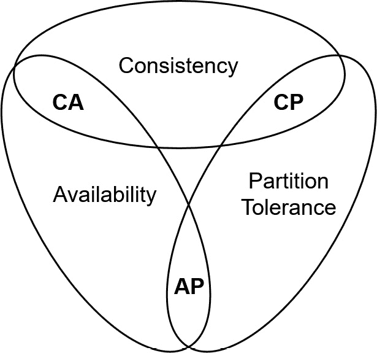

# 8

# 别迷失在数据丛林中

数据是我们所做一切的核心。云原生应用程序的大多数操作都涉及以各种形式生成、消费和修改数据。选择合适的地方存储数据，了解如何摄取数据，并保持数据的完整性至关重要。虽然我们生产的应用程序的许多价值存在于业务逻辑中，但从根本上来说，这些业务逻辑是在数据上运行的。因此，我们存储数据的方式对应用程序的操作至关重要。与传统的本地服务不同，云原生服务提供了新的、令人兴奋的机会，可以显著降低我们的运营和维护成本。然而，如果使用不当，这些服务也能通过一些阴险的反模式迅速妨碍我们的努力。

在本章中，我们将讨论以下在云中持久化数据时常见的反模式：

+   选择错误的数据库或存储

+   从生产到开发的数据复制

+   备份和恢复应该在理论上是可行的

+   手动数据摄取

+   数据传输错误没有可观察性

在本章结束时，你将对云原生数据存储选项有一个扎实的理解，特别是它们在操作目的中的应用以及它们之间的权衡。

# 选择错误的数据库或存储

“*当你只有一把锤子时，一切看起来都像钉子*”是一个常用的说法，用来描述过度依赖同一工具处理所有问题的现象。有偏好是可以接受的，但当团队选择数据库或存储解决方案时，我们经常看到相同的开发者一次又一次地选择相同的工具。虽然熟悉特定工具集可能有助于快速上手和开发，但这可能导致次优的解决方案和反模式。云原生应用程序有着丰富的数据库和存储方式，因此一个全面的云应用程序应该考虑所有可用选项。在我们深入了解这些选项之前，先来看看一些必要的背景知识，以便更好地框定我们的讨论。

## 框定讨论

在讨论数据库时，首先需要探索**一致性、可用性和分区容忍性**（**CAP**）定理、规范化形式和时间复杂度。这三个概念解释了为多种解决方案设计数据模型时的权衡和方法。

### CAP 定理

如前所述，CAP 定理代表一致性、可用性和分区容忍性，专门针对分布式数据存储。共识是，分布式数据库解决方案只能真正同时解决这三者中的两个能力：

+   **一致性**确保当数据库读取发生时，它将返回由所有在我们请求读取之前提交的操作所导致的数据库状态。强一致性的数据库维持这一范式，而最终一致性的数据库将返回一个可能没有传播所有已应用写入的状态；它表示数据库在某个过去时刻的状态。

+   **可用性**意味着每个有效数据库节点接收到的请求必须返回一个非错误响应。在分布式数据存储的上下文中，这可能与一致性保障发生冲突。我们如何确保系统已经接收到来自其他所有节点的所有事务，特别是在可能发生网络分区或延迟的情况下？这就引出了分区容忍性。

+   **分区容忍性**保证系统会继续运行，即使节点之间的消息传递不可靠或延迟。如果其中一个节点发生了灾难性的网络故障，我们的数据存储应继续运行。这在具有多主配置的分布式数据库中尤为突出，例如本章稍后讨论的一些高可用选项。

在理想的世界里，我们选择的数据存储会具备这三种属性，而且一些最近的技术进展推动了这种排他性的极限。然而，这种模式通常在现实中得到密切体现。

图 8.1 – CAP 定理元素的欧拉图

### 范式

**范式**是指我们在数据库系统中如何构建数据。从根本上说，范式是衡量我们数据库规范化程度的标准。我们将快速回顾范式，并通过一个共同的主题为每个范式提供示例。在这个过程中需要记住的一点是，尽管表面上看，范式越高，数据库设计越好，但在大多数情况下，我们还需要考虑数据的性能、查询以及访问模式。我们这里只讨论前三个范式，因为通常情况下，这也是云原生数据库之间差异的主要所在：

+   数据的第一范式（**1NF**）定义每个单元格为只包含一个单一值的单位，且数据存储中的列名应该是唯一的。许多支持嵌套或非结构化数据的存储解决方案已经不符合这一标准。下表展示了一个订单信息的第一范式数据集：

| **发票项** |
| --- |
| **发票 ID（键）** | **项目 ID（键）** | **数量** | **销售人员 ID** | **销售人员** |
| 123 | 312 | 10 | 10 | Aiden |
| 123 | 432 | 5 | 10 | Aiden |
| 456 | 321 | 20 | 8 | Gerald |
| 789 | 432 | 10 | 8 | Gerald |

表 8.1 – 发票、项目和销售人员存储在单个表中

+   第二范式（`Salesperson`列在第一个表中）。在这种情况下，我们的结果仅依赖于键的一部分，即发票 ID。

| **发票项** |
| --- |
| **InvoiceId (主键)** | **ItemId (主键)** | **Qty** |
| 123 | 312 | 10 |
| 123 | 432 | 5 |
| 456 | 321 | 20 |
| 789 | 432 | 10 |

表 8.2 – 发票和项目；请注意我们在此表中移除了两列

我们来添加一个新表，通过存储销售人员与发票 ID 的对应关系来满足第二范式：

| **InvoiceSalesperson** |
| --- |
| **InvoiceId (主键)** | **SalespersonID** | **销售人员** |
| 123 | 10 | Aiden |
| 456 | 8 | Gerald |
| 789 | 8 | Gerald |

表 8.3 – 发票及其与销售人员的关系；请注意，我们现在存储的数据较少，但仍能重建相同的细节

+   第三范式（`InvoiceSalesperson` 表基于 `InvoiceId` 主键。然而，销售人员的姓名依赖于 `SalespersonID`，这是一种传递依赖。为了解决这个问题，让我们添加一个 `销售人员` 表（*表 8.5*）：

| **InvoiceItems** |
| --- |
| **InvoiceId (主键)** | **ItemId (主键)** | **Qty** |
| 123 | 312 | 10 |
| 123 | 432 | 5 |
| 456 | 321 | 20 |
| 789 | 432 | 10 |

表 8.4 – 发票和项目；此场景与我们之前的示例没有变化

然后我们有相同的发票销售人员映射；不过，我们使用标识符而不是销售人员的姓名。

| **InvoiceSalesperson** |
| --- |
| **InvoiceId (主键)** | **SalespersonID** |
| 123 | 10 |
| 456 | 8 |
| 789 | 8 |

表 8.5 – 发票及其与销售人员的关系；然而，我们已经移除了传递依赖

最后，我们添加一个包含每个销售人员的表：

| **销售人员** |
| --- |
| **SalespersonID (主键)** | **销售人员** |
| 10 | Aiden |
| 8 | Gerald |

表 8.6 – 将销售人员 ID 映射到其姓名；这再次减少了我们存储的数据，但仍可以通过正确的访问模式重建

我们的解决方案现在已经发展到符合第三范式。如你所见，高级别的规范化要求越来越依赖于关系，但能提供更高的一致性。

### 时间复杂度

最后，我们需要讨论时间复杂度和大 O 表示法。大 O 表示法描述了系统执行时间相对于处理的数据集大小的上界。一个具有恒定查找时间的系统，不管数据集大小，都是 *O(1)*。一个随着数据集项目数量线性扩展查找时间的系统是 *O(n)*。

一个好的例子是一个天真的数据库实现，它检查数据库中的每一行，看看它是否符合我们的选择标准。在这种情况下，实施将是 *O(n)* 复杂度；随着记录数量的增加，我们需要对每一行查找进行线性检查。实际上，大多数数据库解决方案将位于这些值之间。复杂度可以以大于 *O(n)* 的速率扩展，但如果一个数据库提供这样的复杂度，你应该寻找另一种方案。

## 适合的数据库用于适合的目的

我们在云原生系统中看到四种关键类型的数据库用于大规模数据存储：关系型、NoSQL、键值型和图形型（还有许多其他解决方案，如分类账/区块链数据库、层次型数据库和向量数据库，但它们超出了本节的讨论范围）。每种数据库都有其优点，并且适用于不同的数据类型，但它们需要不同的处理方法。一个常见的反模式是开发人员为他们的应用程序选择了不合适的云数据库。

### 关系型数据库

**关系型数据库**是经过验证的传统数据库解决方案。它们允许您建立记录并建模它们之间的关系。在这种解决方案中，数据库通常符合严格的、预定义的一组关系和结构，这些关系和结构作为其模式的一部分进行定义。然而，越来越多的关系型数据库引擎提供了存储半结构化和非结构化数据的能力。由于其高度结构化的数据模型，关系型数据库使得维护数据的一致性和完整性变得非常容易。其内建的关系支持使得查询规范化数据变得简单。在云计算领域，这些数据库通常作为*服务*提供，甚至可能有“*无服务器*”的服务（稍后会详细解释为何要加上引号）；然而，当我们尝试扩展这些系统时，就会遇到问题。通常，扩展模型是通过垂直扩展向这些服务添加额外的容量。

一些较新的解决方案提供了自动化、透明的分片能力，并且价格较高。在大规模数据集的情况下，这可能会引发问题，导致更高的云账单。还必须注意，在这些系统中，我们通常只能使用某些类型的索引，如二叉树，二叉树的时间复杂度为 *O(log(n))*。当我们在关系型数据库中查询数据时，一个典型的模式是连接记录并进行聚合，以返回我们想要的结果。这种模式在您知道要存储的数据结构，但不确定如何查询这些数据的访问模式时非常有用。灵活的访问模式使您能够在不对底层数据库进行重大更改的情况下扩展您的服务。您可以通过新的查询提供新的洞察。

提供关系型数据库的超大规模服务商涵盖了所有常见的 SQL 类型，例如 MySQL、PostgreSQL 和 SQL Server。通常，这些解决方案专注于一致性和分区容忍性。然而，许多超大规模服务商的新服务也提供高可用性。

### NoSQL 数据库

**NoSQL 数据库**为传统的关系型数据库提供了一种替代方案。它们在一定程度上是非规范化的，并且它们依赖于内置于数据模型本身的访问模式，而不是允许灵活的访问模式。

所有的超大规模云服务商在这一领域都有产品：Azure 提供 Cosmos DB，GCP 提供 Firestore，AWS 提供 DynamoDB。与我们严格格式化的 SQL 表不同，NoSQL 数据库没有强制的模式。列可以混合数据类型，数据可以深度嵌套。有一些有力的论据支持你放弃单独的表，而将所有数据放入一个大表中。这些服务在低价格下提供极高的可扩展性和性能。然而，它们要求从传统关系数据库模型转变思维方式。

我们必须在前期设计好访问模式，以便从我们的 NoSQL 数据库解决方案中获得最佳价值。这个要求可能使开发稍微复杂一些，因为添加新的访问模式不仅仅是编写一个新查询的问题。我们可能需要对数据库设计进行重大修改。一些 NoSQL 领域的数据库解决方案（如 DynamoDB、Firestore 和 Cosmos DB）可以实现接近 *O(1)* 复杂度的正确结构化访问模式，但对于结构不当的访问模式，则会面临 *O(n)* 复杂度的惩罚。许多这些解决方案允许你优先考虑可用性和分区容忍性，或者一致性和分区容忍性。

### 键值存储

**键值存储**是一种简单的数据库类型。本质上，我们提供了一种方法来通过键（key）访问存储的数据（value）。NoSQL 数据库仍然允许复杂的访问模式。我们的键值存储只有一种访问模式：使用键获取存储在某个地址上的值。这些通常是高性能的内存数据库，可能会提供或不提供某种形式的持久化。此类数据存储的典型使用场景是复杂查询或来自其他系统的计算输出的缓存。当我们有低基数的复杂请求时，它们可以在云端武器库中提供帮助。

### 图形数据库

我们将讨论的最后一种数据库类型是 `OrderID` 字段，它在订单记录、运输清单和支付记录中都有引用。运输清单和支付记录包含指向订单记录的外键；然而，实际的关系存储在这些记录本身中。在图形数据库中，关系是一级对象。我们有对象（顶点）和关系（边），数据模型优化了关系的极快遍历，使我们能够高效地在数据集之间跟踪路径。当对象之间以任意方式进行交互时，这种特性尤其有优势，例如社交媒体网站上的用户与其他用户、帖子、社区等的互动。

### 其他数据库类型

探索其他支持服务或非标准数据库类型也可能是有利的。一个常被忽视的关键数据库类型是时间序列数据库。这些可以作为独立产品或之前数据库类型的扩展实现。这些数据库优化了按时间顺序访问模式和存储，而不是前面提到的结构。另一种常见的数据库或数据库扩展是空间数据库，专门研究查询中的几何和地理属性。关键在于不仅限制于前述数据库结构，还要探索适用于你边缘案例的选项。

我曾经处理过的一个例子中，客户使用 Postgres 数据库存储客户地址和标识列表。然而，该系统的访问模式不适合关系数据库。首先，数据不是关系型的；每条记录完全独立，其次，在数据库查询模式中显著使用 Postgres 关键字`LIKE`。客户的快速解决方案是在每一列上放置一个**广义倒排索引**（**GIN**）。这使得可以在任意字符串上进行搜索，但使得修改数据库变得笨拙。使用诸如 OpenSearch 之类的搜索服务来存储可查询文档可能更为简单，很可能会导致更低的云账单和更好的性能。

## 手动、托管、无服务器和真正无服务器数据库

在选择数据库时，我们必须确定之前讨论的数据库类型的需求以及我们将如何在云中使用数据库。

从传统思维方式出发的幼稚方法可能是我们只需提供一个云虚拟机，安装一个数据库，然后一切就搞定了。虽然这种手动方法可以行得通，但必须提供一个引人注目的价值主张。在这种情况下，你需要完全负责备份、更新数据库版本和操作系统，并且提供新的机器。如何安装、运行和维护数据库不太可能成为你业务的价值差异化因素。因此，通常认为这种手动选择是一种反模式，除非你需要特定功能或配置，而这些功能或配置在托管服务中不可用。相反，数据库的基线部署通常作为托管服务。

大多数公司在开始采用云数据库时采用了这种部署方法，因为这些托管服务为他们提供了一种使用熟悉工具（如 Postgres、MySQL 和 SQL Server）的方式，同时允许云提供商负责备份、更新和维护，采用经过实战检验和弹性的方法。许多公司从未找到离开这个层面的充分理由，这是完全可以接受的。我们还可以在这种开发模式下开始设置具有读取副本、自动故障转移和多主配置的弹性架构。

在管理型系统中，我们通常看到具有一致性和可预测模式的应用程序。然而，一些企业的流量和使用情况是不可预测的，因此你应该转向一个更具扩展性的解决方案。这种情况就是“无服务器”解决方案发挥作用的地方。我在这个场景中使用引号，因为它们是无服务器的（即它们会自动扩展）。不过，它们并不会扩展到零，许多人认为这才是真正的无服务器。我们在这一领域常见的反模式是，人们在迁移到这些“无服务器”解决方案时，未考虑非关系型数据模型。

最后，我们有了真正的无服务器数据库。这些通常是 NoSQL 或文档型数据库（例如在主要云提供商中的 DynamoDB、Firestore 和 Cosmos DB，属于**在线事务处理**（**OLTP**）领域），它们在极端可扩展性、成本效益和性能方面做出了使用便利性上的妥协。我们在这一领域常看到的反模式是，团队看到这一选项，并将其视为成就的巅峰，建立一个利用这种云原生独特选项的系统，而没有考虑其缺点。也就是说，你的数据更难以迁移，招聘也更困难，而且需要事先了解你的访问模式。这种组合可能导致初期糟糕的体验，促使团队回到熟悉的关系型数据库领域，而没有考虑这些数据库在一些适合的场景中的应用。

## 忽视存储需求

一个常见的反模式是，在云中使用传统的存储机制，而没有考虑其他选择。传统的文件系统是出于对设备内存储需求的演变而产生的，并提供了相当大的功能。网络文件系统，如 FTP 和 NFS，成为这些服务在多机器环境中的事实标准。这些系统的核心原则是，中央服务器负责协调对底层存储的访问。本书的一个常见主题是，集中化通常是一个反模式。

当我们开始设计一个利用云存储的系统时，我们应该首先问的第一个问题是，“*我们可以使用 Blob 存储吗？*” **Blob 存储**是去中心化的，能够水平扩展，且比传统的网络文件系统具有更高的弹性和持久性。在 Azure 中，这项服务是 Azure Blob 存储，GCP 提供 Cloud Storage，而 AWS 提供 S3。

你可以将 Blob 存储视为一个键值存储，它可以存储巨大的数据值。对于大多数云原生使用案例来说，这已经足够提供所需的能力。你还需要元数据吗？放到数据库里。需要锁吗？使用数据库。需要备份吗？使用版本历史记录。Blob 存储很可能是你存储需求的答案。有些情况下，专门的或传统的文件系统仍然能提供好处，例如在高性能计算、低延迟应用程序和传统文件系统迁移中。因此，记住没有一种工具可以解决所有问题。

## 忽略生命周期和归档策略

存储数据很容易。我们向选择的存储提供商发送请求，然后忘记它，直到需要使用它为止。问题就在这里：未能适当维护数据的生命周期可能会导致严重后果。

然而，我们可能希望节省一些费用，因为我们不一定需要访问这些数据；我们只需要将其保存档案。这时，存储层的概念就派上用场了。

让我们举个例子：我们在一家大型公司工作，负责内部税务功能。在一年中，人们会上传收据。在税务期间，我们需要反复访问这些收据，因为各种职能需要执行各自的职责。然后，在税务期过后，我们只需要保留一份副本，以防出现差异。在所有云服务提供商中，我们可以将他们的存储层分为三大类：

+   **热存储**是指需要定期访问并且能够随时获取的数据。通常，这个层级在存储成本和检索成本之间取得了很好的平衡。可以考虑将收据存储在此层级，以便在税务期间使用。

+   **冷存储**是指需要随时访问但不太可能经常访问的数据。我们在访问这个层级中的数据时需要付出更多费用，但通过较低的存储成本，享受不频繁访问的好处。这个层级可能是我们在一年中提交所有收据时存储的地方。

+   **归档**是指我们想要保留但没有特定访问速度要求的数据。这个层级提供最具成本效益的存储解决方案，但其访问成本最高，检索时间最慢（这可能是几个小时而不是毫秒级）。当我们完成一年的所有收据，并且只需要保留记录以备后用时，我们会将其移到这个层级。

一些数据可能需要保留，以符合监管要求，而其他数据可能只需要短期存储，因为其有效性会迅速降低。我们通过数据生命周期来实现这些使用案例。生命周期策略和管理工具使我们能够自动化这一过程。

通常，我们在生命周期策略中采取两种行动：要么改变数据的存储层，要么删除数据。一个生命周期策略可能会将这两种操作结合起来。例如，假设我们为一家公司工作，这家公司创建详细的财务报告。每个月，我们发布一份新报告，开始时频繁访问，然后逐渐不常访问，最后需要存档六年。我们的生命周期策略可能如下所示：

1.  在热存储层创建一个文件。

1.  等待 31 天（报告周期）。

1.  将文件移动到冷存储层。

1.  等待 334 天。

1.  将文件移动到归档存储层。

1.  等待六年。

1.  删除文件。

如果我们将文件保持在热存储层，我们将支付频繁访问的便利费用，但实际上并未真正访问文件。因此，我们的生命周期策略使我们能够优化云存储开支。

# 从生产环境到开发环境的数据复制

我们都需要数据来确保我们在开发环境中构建的系统能够匹配用户在生产环境中生成的各种奇怪和有趣的数据类型。

这一部分是为数不多的几个反模式之一，反模式的严重性足以让整个部分以此命名。在任何情况下，都不应将用户生成的数据从生产环境复制到开发环境。虽然从生产环境获取真实的用例数据可能看起来很容易，但低环境通常具有更宽松的安全控制，并且开发人员的访问权限更广。最近的几起数据泄露直接涉及这一反模式；真实的用户数据出现在测试系统上，而这些测试系统被攻破。相反，在本节中，我们将讨论一些替代方案，以避免在生产数据上进行测试，以及在为测试环境创建数据时常见的反模式。

## 但我们会对生产数据进行掩码处理

我们将讨论的第一个反模式是使用来自生产系统的掩码数据进行测试环境中的测试。这种做法仅比直接使用生产数据稍微好一些。这个场景中的谬误在于，我们从一个不安全的位置（未掩码的生产数据）开始，应用一个转换（我们的掩码过程），并假设输出是安全的（掩码数据）。为了说明这是一个问题，让我们看一个类比的例子，它基于 FaaS。我曾与一个客户合作，该客户为 Lambda 函数开发了一个身份验证和日志包装器。这个包装器应用了一些功能，这些功能可以通过 Lambda 函数代码中的标志启用。一个标志启用了身份验证。这个模式意味着，从根本上说，任何创建的 Lambda 函数都是不安全的函数，然后必须选择启用安全性。相反，我们颠倒了这种依赖关系。我们默认让所有函数都是安全的，然后可以使用标志来关闭身份验证，以便使某些函数不进行身份验证。这一变化使得不安全成为一种有意识的选择，而不是无意识的错误。当我们掩码数据时，我们有可能犯无意识的错误，因为我们从一个不安全的位置开始。解决方案是从一个安全的位置开始，并明确地对我们的数据选择做出任何不安全的添加。因此，我们必须从一个安全的位置开始，这意味着我们需要了解我们的模式，并生成测试其极限的数据。

## 开始使用合成数据

正如我们之前讨论的，确保你使用的数据在低环境中是安全的最简单方法是确保它不来自生产系统。因此，我们需要一种可靠的方法来为我们的系统生成虚假数据。幸运的是，我们不是第一个遇到这个问题的人！已经有许多开源库专门用于生成完全虚假的数据。通常，对于云项目，JavaScript 在开发周期的某个阶段会被使用，无论是用于前端应用程序，还是后端服务器使用像 Node.js、Bun 或 Deno 这样的运行时，因此它通常是一个很好的基础语言。在这种情况下，Faker.js（[fakerjs.dev](http://fakerjs.dev)）库提供了一整套生成器，用于为测试生成虚假数据。另一个常见的语言是 Python，它也有自己的 Faker 库（[`faker.readthedocs.io/en/master/`](https://faker.readthedocs.io/en/master/)）。

这些库构成了一个极好的基础，我们可以在此基础上进行建设。这些允许我们创建大量数据，以查看我们的系统在负载较重时的处理情况。我们可以使用生产系统的利用率指标来开发合成数据。合成数据保留了生产数据的模式和结构，但记录内容纯属虚构，非常适合功能测试。这种方法允许我们在较低的环境中加载与生产环境中相似数量的数据，确保我们在较低环境下测试的条件与在较高环境下的条件相似。我们在这里经常看到的一个反模式是试图在低环境中仅使用小数据集。这种反模式是一个问题，因为你首次在生产规模下部署系统时才测试系统。在这种范式下，仅在生产系统规模下才会出现的场景和边缘行为在测试期间仍然隐藏。这些问题可能是 SQL 查询优化不良或列上缺少索引。在这些场景中，小数据集不太可能暴露出这些问题。

## 完美的合成数据

在创建合成数据时，很容易陷入开发*完美合成数据*的反模式中。这种反模式只注入我们在生产系统中预期看到的数据、格式和使用模式。虽然这可能测试我们系统的顺畅路径，但不幸的是，用户往往会以我们从未预料到的方式来测试我们的系统。如果用户注册时使用一个地址，然后该地址被删除或分割成 A/B 区块或其他各种问题会发生什么呢？在这里，我们可以借鉴混沌工程的领域。与其创建完美数据，不如制造一定程度上有损坏的数据，通常表现为总合成数据的百分比。完美数据只适用于完全同质化用户的使用，而我们都知道我们的用户群体由大量不同的个体组成。

有一些简单的指导原则用于创建合成数据，我喜欢遵循这些原则。通常我将其分为两层：一层用于结构化数据（SQL 和 Parquet），另一层用于非结构化/半结构化数据（NoSQL、CSV、JSON 和 TXT）。非结构化数据损坏应视为结构化损坏的延伸。

结构化数据可以通过以下方式进行损坏：

+   **缺失记录**：如果我们在请求服务时收到了部分对象会发生什么？如果一个依赖项缺失会怎样？如果在创建记录时依赖项存在，但之后被手动删除了呢？

+   **不可达状态**：从代码的角度来看，我们可能有一些不可达的传递依赖关系，但从数据库的角度来看是允许的。如果我们达到了这种状态会发生什么呢？

+   **损坏的记录**：这是指在系统允许的情况下，数据本质上不合理的情况。如果用户不小心将信用卡号码输入到持卡人姓名字段中会怎样？如果我们的 CSV 文件中某一行的字符串中包含未转义的逗号，会发生什么？

+   **大记录**：当一个用户将无数只猴子和无尽数量的打字机连接到你的脏话过滤器时，会发生什么？

非结构化数据还可能以以下额外的方式受到损坏：

+   **重复记录**：当我们尝试插入重复记录或多个表示相同对象的记录时，会发生什么情况？

+   **多余字段**：当我们的系统收到来自客户端的额外数据时，会发生什么情况？

+   **缺失字段**：当我们的系统未收到来自客户端的预期数据时，会发生什么情况？

+   **语法错误的数据**：这是指与正在使用的数据媒介规则不一致的数据（例如，CSV 或 JSON 格式无效）。缺少列？忘记了大括号？

从这点来看，我们可以得出结论，完美的测试数据应当是设计上不完美的。这样可以帮助我们发现系统的边界行为。我们的测试数据应该在生产环境中遇到问题之前就能识别出可能遇到的问题。然而，对于我们在生产环境中可能遇到的数据问题，完全准确的预见是不可能的。最好的损坏数据类型是当我们在生产环境中发现某个问题时。在这种情况下，将损坏数据的方法（而非数据本身！）复制到你的合成数据生成工具中。这一过程可以帮助我们发现这种数据可能对生产产生的其他影响。例如，如果我们遇到一个无效的卡号输入问题，客户可以纠正卡号，一切恢复正常。如果我们将这一模式添加到合成数据中，我们就能看到如果该数据流入我们的账单系统或其他应用程序区域，如何影响我们的系统。

# 备份和恢复理论上应该能够正常工作

“*鼠和人的最佳计划常常会失败*，”这句名言出自罗伯特·彭斯的《致一只鼠》。其中的智慧是，无论我们如何小心地为每个可能的情况做好计划，直到我们执行它之前，我们都无法确信它会成功。我们在*第七章*中提到过忽视可靠性这个话题。接下来我们将更详细地讨论这个话题，并探索如何专门针对数据来解决这一反模式。如前所述，不测试数据的韧性将导致在你最不期待的时刻出现意外停机。让我们深入探讨一些缓解方法。

## 制定计划

拥有一个计划是构建弹性数据架构的第一步，而这个计划的关键在于理解共享责任模型。如果你按照本章第一部分的建议，在云中自托管自己的数据解决方案，那么你需要对一切负责。我们经常会遇到人们在转向托管服务时的断层。不可避免地，有人会在他们的托管云数据库实例中找到一个选项框，标记为**启用备份**，然后看到它已被勾选。接着，他们就会安然入睡，认为他们的数据是安全的，因为它被模糊地“由云处理”。如果这听起来很熟悉（即使不熟悉），你可能需要考虑制定一个恢复行动计划。

制定该计划时需要考虑的一些关键因素如下：

1.  定义你的**恢复时间目标**（**RTO**）和**恢复点目标**（**RPO**）。这两个指标分别是以下问题的答案：

    +   我能接受服务停机多长时间？

    +   服务停机时，我能承受丢失多少数据？

    一个常见的反模式是回答“没有”和“没有”。实际上，维持这样的策略的成本与现实不符。通常，这个问题的回答是按量级的，如秒、分钟、小时或天。

1.  一旦你概述了恢复计划的参数，你必须设计一个架构解决方案来实现这些目标。假设我们关注的尺度涉及秒级或分钟级粒度，那么你可能需要考虑使用实时只读副本，这样在发生故障时可以接管作为主数据库，或者甚至考虑为超低停机时间的应用部署多主数据库配置。如果我们考虑的是小时或天级别的粒度（在第一个场景下，我们仍然需要这种深度恢复能力），那么一个稳健的增量备份系统就足够了。我们可以通过详细列出系统可能遭遇的压力点来测试我们的弹性架构，比如数据库实例的故障或整个云区域的宕机。接着，我们制定在这些压力点发生时系统的响应，并根据需要对架构进行调整。这里有一个有趣的平行之处，在于我们选择模拟的压力点和我们系统实际的弹性之间。例如，在巴里·奥赖利（Barry O'Reilly）的研究及其随后的著作《Residues: Time, Change, and Uncertainty in Software Architecture》中，他指出，往往我们的压力点并非相互独立；比如，网络故障和海啸摧毁数据中心在架构响应上可能会有相似之处。因此，我们的压力点列表并不需要详尽无遗。我们只需要列出并模拟这些压力点，直到最终的架构不再需要任何变更来支持从这些压力点恢复。

1.  一旦我们设计了弹性架构，我们可以开始审查行动计划。行动计划是恢复服务的详细逐步手册；可以将其视为你的弹性架构的用户指南。识别完成操作所需的所有功能性和非功能性要求是至关重要的。以下是一些你可以问自己的好问题：

    +   谁将执行操作？

    +   他们将从哪里获取凭证？

    +   他们将操作的资源标识符是什么？

    +   这将对客户产生什么影响？

    +   他们需要执行哪些步骤？

1.  最后的步骤是执行你的行动计划。这个模拟操作可以在较低环境中进行，或者是在生产环境的副本上进行。不过，执行行动计划中的操作以识别文档中任何遗漏是至关重要的。理想情况下，你应该与没有参与设计行动计划的团队成员一起进行此操作。这个过程可以防止团队根据意图而非文档本身来执行操作。你可以根据需要多次进行此操作，以便完善行动计划，直到每个人都感到舒适为止。

## 演练日

当士兵训练备战时，他们不会仅仅在课堂上或者通过阅读大量可能已经过时的文档来进行。准备工作的核心部分来自模拟真实世界场景的训练活动。这个制度意味着，当他们响应情况时，他们不仅知道该做什么，理论上能知道如何应对；他们还具备了实际的知识。你的团队也应该类似地练习应对事件，使用接近真实世界场景的条件。

任何演练日的第一阶段都是规划。开始时，演练日应该有明确定义的范围和边界，以确保场景的安全性。你最不希望看到的就是假设的事件响应变成实际事件！规划应包括测试特定行动计划的场景。这些场景可以尽可能真实或虚拟，而你在设计架构时的压力测试列表可能是一个很好的起点。以下是我最喜欢的一些：

+   一位权限过多的高级工程师（这是不是让你想起了*第六章*？）有生产数据库的访问权限。他们不小心删除了我们的一个表。我们如何恢复数据？

+   你的数据库需要进行关键的安全更新，这需要重新启动数据库。你如何确保持续性？

+   有人计划删除 Blob 存储加密密钥。我们发现了吗？我们如何防止它？

即使这些场景可能是虚拟的，使用的工具和流程也应该与我们在实际事件中使用的相同。响应应该尽可能接近真实世界所需的响应。

记得我们在制定计划时定义的那些 RTO 和 RPO 目标吗？比赛日是检验这些目标的完美试金石。在活动开始之前，每个人都应该清楚这些目标，截止日期应该得到执行，理想情况下，达成目标应该有激励措施。

比赛日是促进团队间沟通并打破业务内部壁垒的好方法。要让所有受影响的团队参与，甚至是非技术团队。销售团队在缺少数据的情况下如何操作？市场营销团队需要发布声明吗？实际事件的影响往往超出了技术团队的范围，为什么不利用模拟事件来管理整个响应过程呢？你的技术团队可能需要更多仅限技术的比赛日，但全方位的比赛日对于测试整个业务的韧性非常有帮助。

执行比赛日是有趣的：设置你的模拟场景，告知运营团队当前的情况，然后观察他们执行恢复策略。在他们开始执行之前，确保团队了解比赛日的范围和边界，以避免我们之前提到的后果。在测试事件响应时，应该记录团队的行动。这个过程可以帮助你发现现有行动计划中的空白，并为未来的比赛日或实际事件进行优化。

这个过程之后应该进行一次健康且无责备的事后总结，既包括模拟事件（例如，这个理论事件最初是如何发生的？我们如何防止它在现实中发生？），也包括实际响应本身（例如，我们是否达到了 RTO 和 RPO 目标？我们的流程是否高效？）。

我们将在活动后使用执行阶段生成的文档进行赛后回顾。这次回顾可以按照标准的敏捷回顾格式进行：

+   什么地方做得好？

+   什么地方出了问题？

+   我们学到了什么？

+   下一次我们可以做出哪些改进？

我们通常可以将通过回顾提到的要点分为两类：

+   关于恢复计划执行的要点

+   关于比赛日执行本身的要点

两者都很重要，但使用第一组数据来改进你的恢复计划，第二组数据则帮助你在下次举办更好的比赛日！

## 真实的情况

如果你在实际事件发生时遵循前述建议，响应应该是一个运转良好的机器顺利启动。但这并不意味着你可以免除周围的责任。你仍然需要做以下事项：

+   按照流程执行

+   记录所有采取的行动

+   尝试达到 RTO 和 RPO 目标

+   进行事后总结和回顾

你将（希望！）很少有机会真正执行恢复计划，因此，这将是你获得最有价值数据的时刻。

# 手动数据摄取

当与其他工程师讨论他们在编写代码时遇到的问题时，他们经常会说计算机没有按照他们的意愿执行。我的答案通常是相同的：“*计算机将会按照你告诉它的方式执行*。”有一个古老的笑话很好地说明了这一点。一个程序员的伴侣要求他们去商店买一条面包，如果他们有鸡蛋，就拿一打。程序员带着一打面包回来。当被问及原因时，他们回答说：“*噢，他们有鸡蛋*。”计算机是字面的，但是当你最终让计算机表现出你想要的行为时，好消息是它将无限精确地执行这些动作，除非有外部影响。不利之处在于计算机在我们未预测到的行动方面表现不佳。另一方面，人类已经进化到擅长在我们未预料到的情况下表现出色。然而，你失去了计算机的完美执行标准。

这与数据有什么关系？如果我们希望我们的数据每次都以相同的方式被摄入，你会选择什么？一个可能能够即时处理边缘情况的不可靠人类，还是一个在相同输入情况下始终产生相同输出的远不那么容易出错的自动化系统？

## 第一个数据摄入管道

转向自动化数据摄入系统的第一阶段是定义顺利路径。我们在讨论合成数据时讨论过这个概念。如果你的所有数据都是完美的，你希望系统如何运行？这允许您将完美的数据输入系统并获得完美的结果。在理想的世界中，我们永远不需要超越这个状态。根据我的经验，我从未遇到过符合完美标准的数据源。因此，让我们开始推送数据通过我们的管道，如果我们的数据不符合我们的完美标准，我们可以在问题出现时处理这些问题。这可能涉及从源数据集中删除无效记录或操作数据以满足我们的完美数据标准。

这使我们能够兼顾两者的优势。我们的自动化系统处理所有格式良好的数据以生成确定性结果，而当计算机系统无法处理记录时，我们的人类操作员可以介入。这允许人类成员在需要时行使判断力，以确保所有记录都被正确摄入。然而，这种设置仍然存在一个关键问题：云服务可以快速摄入我们的数据，每秒处理数百万条记录。另一方面，虽然更为灵活，但人类的操作速度则极为缓慢。

## 失败的粒度

在数据摄入时，我们希望确保选择适合我们数据摄入管道的正确失败粒度。一种简单的方法是在遇到错误时立即失败管道。随着数据集的增长和摄入管道变得更加复杂，管道不经历故障的可能性迅速接近零。根据我的经验，数据管道通过全有或全无的方法提供价值的情况很少见。

通常，即使是不完整的数据集也比没有数据具有更大的价值，这就是这种简单方法的局限所在。在这里至关重要的是考虑你的失败粒度。这意味着我们需要找出数据的最小单元，在发生错误时变得不可用。这可能意味着我们在数据集中失败了单个文件、行/列或单元格。通过将失败限制在最小的非功能数据单元上，我们仍然可以利用数据集进行其他目的，收集失败的数据单元，然后异步处理这些故障，通过人类判断处理这些边缘情况，随着时间的推移增强数据集。

这可能包括一个自动预过滤阶段，用于确定数据是否符合我们的规范。符合规范的记录将被传递到我们的数据摄入管道，而不符合规范的记录将被传递到死信队列进行后续分析。

## 扩展管道

人力进行平凡任务的成本始终是最昂贵的。与时间、成本和培训新资源的需求相关联。随着云原生服务的采用，我们甚至几乎不需要动一根手指来增加我们的吞吐量。事实上，通过自动扩展，甚至那些少数的鼠标点击和键盘敲击也可能是多余的！

一旦初始管道建立完成，死信队列就成为一个宝贵的资源。随着我们修复死信队列中的数据问题，我们了解到我们预期在数据中看到的问题类型。通过分析我们的具有领域知识的人类专家如何纠正这个问题，我们可以开始为这些情况提供边缘案例的自动化，将他们的知识编码成指令，供我们的管道执行。随着管道的扩展，这种自动化使其提高了韧性，允许我们适应新问题，并需要他们的专业知识。

自动化这些情况还允许我们增加数据的实时性。我们不再需要等待人类在检测到错误后来修正这些错误，我们已经扩展了我们的规范，包括这些类型的数据。

## 转向流式处理

随着我们的管道变得越来越自动化，如果我们的上游数据源支持，我们可以增加数据摄取的频率，使其更接近实时。与每周一次的人工摄取过程（由于人力限制）不同，我们可以将管道的运行频率提高得多。我们已经看到客户通过这个过程实现了从每月数据摄取到每小时数据摄取的转变。

最终阶段不再是一个按计划驱动的过程，按计划提取一段时间内所有发生的数据，而是转向流式模型，在新数据出现时启动数据摄取管道。在这个领域使用云原生服务的优势在于，通常你已经创建的定时管道可以以最小的修改作为流式管道运行。

# 数据传输错误无可观察性

我会重复这本书中无数次提到的箴言：“*你无法修复你无法衡量的东西*。” 同样适用于数据传输。你需要能够查看数据传输的状态，以便根据已有的数据做出明智的决策。可观察性方法由用户决定，但重要的是要注意，单纯获取可观察性数据只是成功的一半。另一半是将数据展示给那些最能影响你数据管道质量的人。

## 数据完整性依赖性

让我举一个我们在客户中常常看到的假设场景。你有一个成功的应用程序，并且有一个出色的开发团队。为了更好地了解你的客户，你成立了一个新的数据团队来追踪用户如何与应用互动。为此，你的开发人员迅速将一些云原生数据管道工具拼凑在一起，供数据团队使用。然而，数据团队由于数据质量差，进展缓慢，花费过多时间将数据整理到可用状态。这导致数据团队因缺乏时间和优质数据而效率低下。开发团队只是把数据“扔”给数据团队，让他们应对后果。开发团队是数据的受益者，因为他们将是使用数据团队生产的数据信息来更好地理解他们所构建内容的人。在这里，我们看到了一种二分法：数据团队很少是数据的受益者，但他们却需要确保数据是正确的，以证明他们在做他们的工作。

## 反转依赖关系

我之前为一位客户工作，这家公司有一个非常庞大的（非软件）工程职能。这些工程师的任务是确保特定的安全参数得以满足。其中一部分工作包括从现场获取传感器数据。一名数据工程师负责维护数据管道。这种配置在静态环境下没有问题，但正如我们所有人通过沃尔纳·福格尔所知，“*一切都会不断失败*。” 发生的情况是，一些传感器、数据记录器甚至网络设备会出现故障并被替换，改变数据的拓扑结构。然后，数据会显示为未被识别，数据工程师会去找负责的工程师，以获取正确的参数来正确地获取数据。在这种情况下，数据工程师并未从数据中受益，而是负责反应性地修复数据。与该客户合作时，我们设计了一个解决方案来监控管道的健康状况，发现不一致之处，并通知负责的工程师数据未能被正确获取。然后，他们可以登录到一个用户界面修复数据拓扑，以便在下次运行时正确获取数据。由于这部分数据的责任由工程师承担，我们注意到，他们不仅反应性地修复了自己负责的数据，还主动去更新拓扑，防止未来的管道故障。我们反转了依赖关系！

这就是在观察性数据上拥有正确视角并授权受益者自行维护的力量。这让我们的数据工程师能够专注于更大的图景，处理数据领域的问题，而不是忙于追赶其他领域的进度。

## 维护依赖关系

现在，我们已经反转了生产者和消费者之间的数据依赖关系，我们可以开始研究如何保持链路的完整性。随着开发人员的推进，他们很少停下来思考自己所做的更改对更广泛数据生态系统的影响，而他们的数据只是其中的一小部分。应对这一难题的关键通常是通过数据契约。数据契约是一种规范，定义了应用程序将要生成的数据格式。这些规范代表了数据生产者和消费者之间对基础架构的共同理解。如果我们使用一个通用的规范框架，如 JSON Schema，我们可以为数据的一致性添加测试，作为完成定义的一部分。这个定义可以帮助我们识别何时会造成破坏性更改，并提前通知下游用户该架构正在发生变化。

该领域的成熟操作还允许采用更现代的工具，如数据目录。这些目录将使我们能够注册数据及其架构，以便组织中需要的人可以使用它。同样，随着这些新依赖关系的增长，集中跟踪它们是至关重要的，这样我们就能知道在数据合同需要重大变更时，应该通知谁。

因此，现在我们已经清楚地理解了数据可观察性在应对管道故障、预防性行动和将数据服务视为我们应用堆栈中的一等公民方面的重要性。

# 摘要

云计算为我们管理最重要的资产之一——我们的数据——提供了全新的方式！然而，陷入本章中的反模式不仅可能对你的盈利造成影响，还可能影响数据的持久性、可用性和安全性。通过理解本章中的概念，你将能够顺利导航云原生数据的丛林并构建有效的架构。接下来，我们将看看如何将我们架构的各个部分连接起来。
