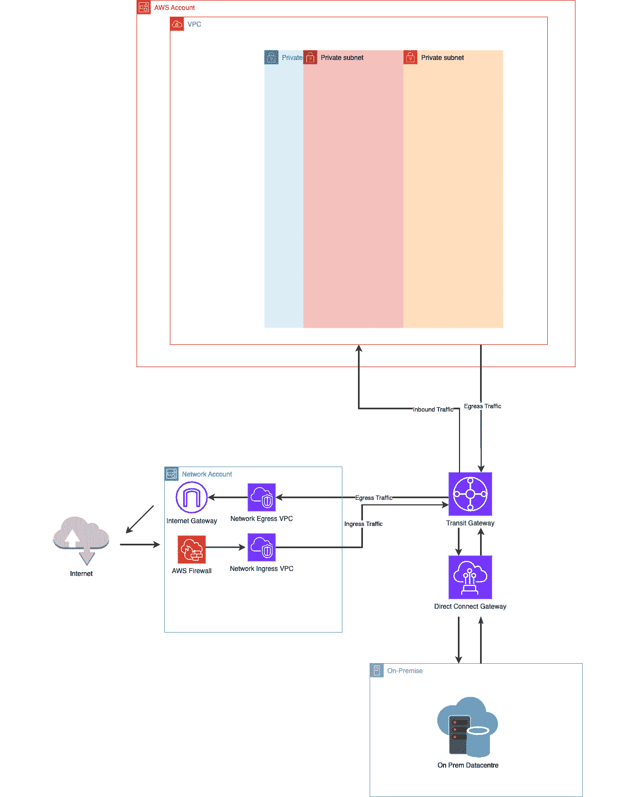
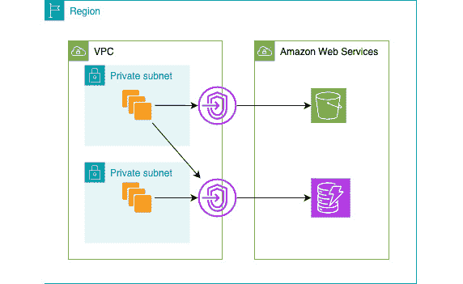
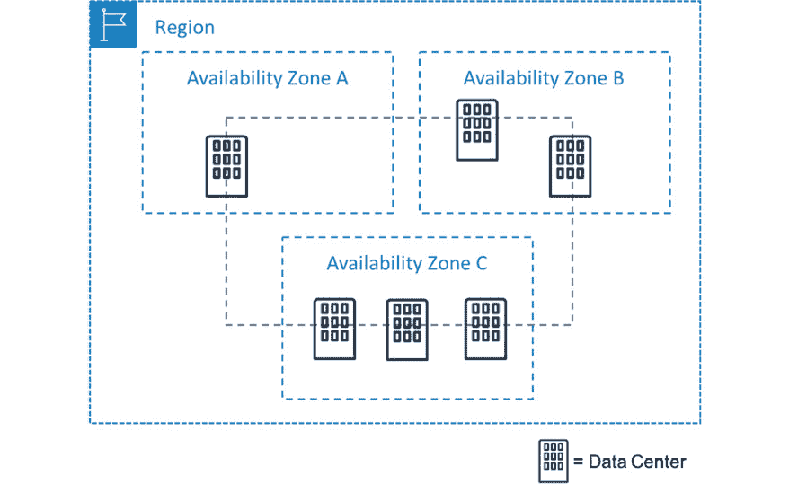
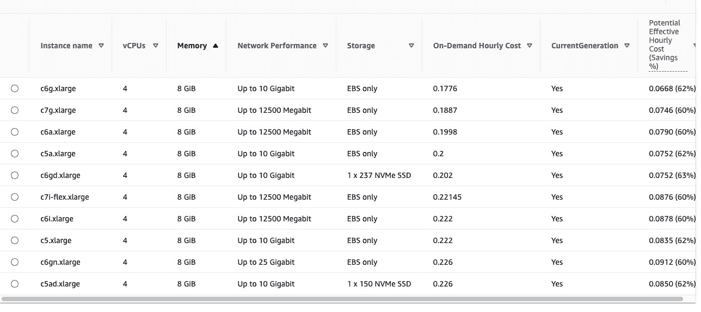
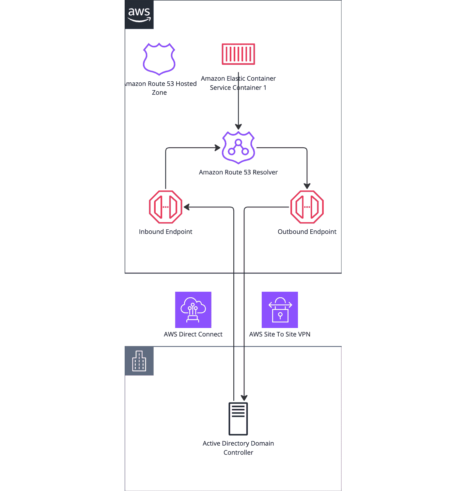
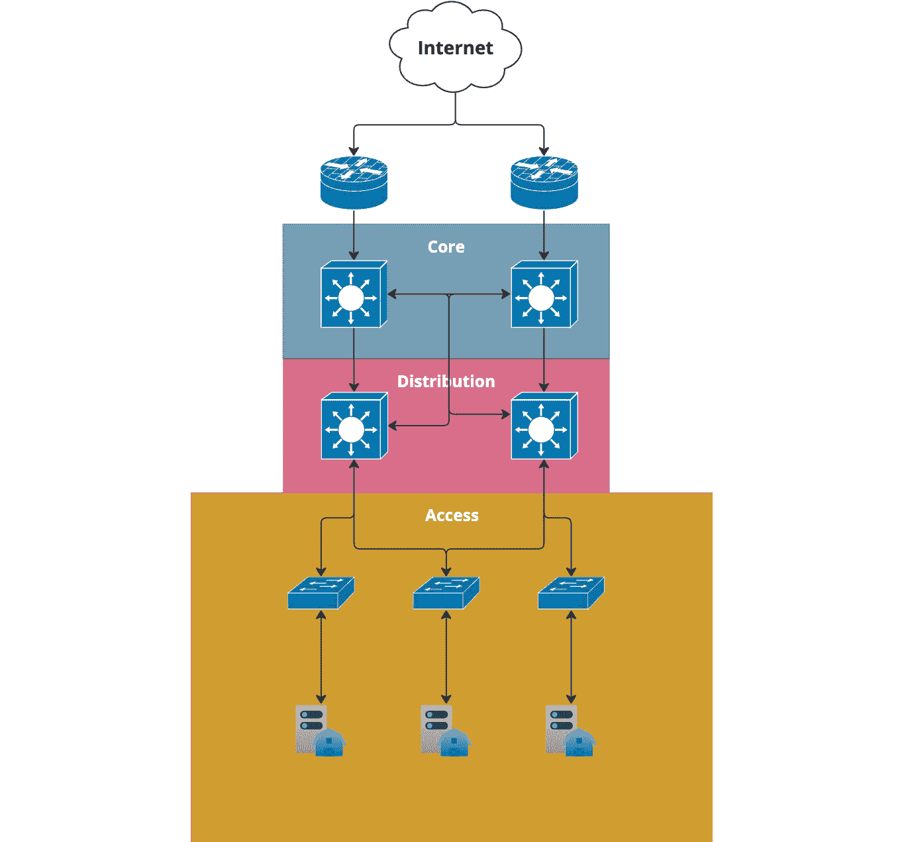
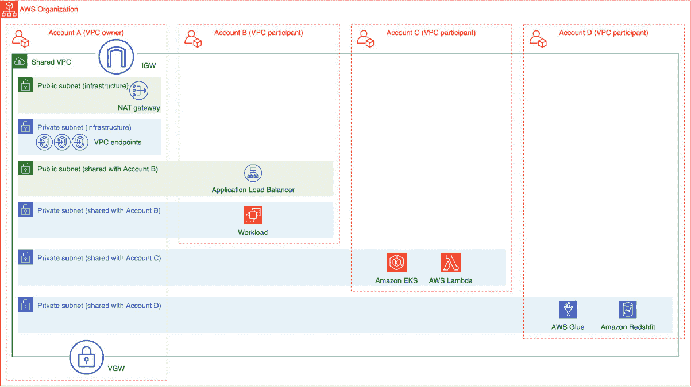
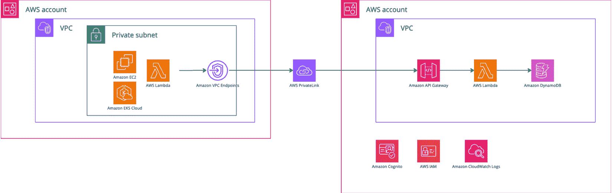

# 9

# 连接一切

在云原生环境中，网络在确保应用程序的性能、可扩展性和安全性方面起着关键作用。然而，随着组织接纳云计算，它们常常遇到源自不对称战略和过时实践的挑战。这些挑战表现为反模式——反复出现的问题，破坏了云原生解决方案的有效性。

本章深入探讨了最常见的云原生网络反模式，分析它们的影响，并提供切实可行的见解，以避免它们。通过理解并解决这些问题，组织可以设计出适用于云环境的韧性强、高效且安全的网络架构。

本章涵盖的反模式包括以下内容：

+   忽视延迟和带宽

+   缺乏 DNS 策略

+   单体连接性

+   忽视云原生网络功能

+   零信任应用模式

本章通过探讨这些话题，使您具备识别和减轻这些反模式的知识，从而促进健壮的云原生网络实践。

# 忽视延迟和带宽

当组织迁移到云端时，网络的角色发生了重大变化。在传统的本地部署中，网络工程师和管理员管理物理硬件、交换机、路由器，以及确保低延迟、冗余和安全所需的精细规划。这种精心编排对于优化性能至关重要。然而，随着公司迁移到云端，网络的焦点从物理基础设施管理转向虚拟化基础设施。这种转变可能导致人们误以为网络变成了次要问题，但实际上，它在云原生环境中仍然至关重要，只是形式不同。这正是忽视延迟和带宽的常见云原生反模式的根源。

焦点从物理硬件转向虚拟化基础设施，要求工程师管理组件，如**虚拟专用云**（**VPCs**）、子网、安全组、负载均衡器和服务间通信。尽管物理限制有所减少，但管理跨分布式系统的高效、安全和冗余通信的复杂性依然存在。延迟和带宽问题可能加剧，尤其是在由多个微服务构建的应用程序中，这些服务必须在分布式环境中无缝通信。

在接下来的部分中，我们将探讨如何有效地规划和管理对互联网、本地系统以及第三方服务的连接。这将包括设计稳健、安全的网络架构的见解，以促进无缝集成和可靠通信，无论是将云资源连接到遗留基础设施、外部合作伙伴还是更广泛的公共互联网。

## 云原生延迟

在 Azure、AWS 和 **Google Cloud Platform**（**GCP**）等云环境中，网络延迟指的是数据请求从一个点到另一个点所需的时间。

例如，假设托管在 AWS 上的应用需要从 S3 存储桶中检索数据，那么网络延迟就是请求穿越网络、被处理并返回响应时所产生的延迟。类似地，在 Azure 中，如果你的服务跨越多个区域，例如从东美国到西欧，网络延迟将影响数据在这些区域之间传输所需的时间。让我们以 S3 示例为主，因这是我们最近在一个项目中遇到的延迟问题。我们将以下图示作为该场景的参考：

图 9.1 - AWS 网络架构图

### 云原生延迟与服务

在一次咨询项目中，一家中型电商公司最近将大量业务迁移到了云端。作为其架构的一部分，他们将大量产品图片、用户生成的内容和交易数据存储在 Amazon S3 中。然而，他们并没有使用 S3 网关端点直接在 VPC 内访问存储，而是将所有 S3 流量通过托管在另一个账户中的出口 VPC 路由。S3 网关端点是 VPC 内的私有连接，允许直接、安全地访问 Amazon S3，而无需经过公共互联网，从而减少延迟并提高安全性。

最初，一切运行良好。网络团队熟悉从本地部署时期的出口 VPC，其中通过特定网络出口路由流量可以实现集中控制和监控。他们认为在云端采用类似的设置也会有所帮助，从而确保对互联网流量有更严格的控制。然而，随着时间的推移，他们开始注意到性能下降。以下是详细描述这些问题的清单：

+   延迟问题变得显而易见，特别是在高峰流量时段

+   用户在浏览大量产品图片时体验到延迟

+   大量数据上传进一步加剧了响应时间问题

+   客户面临图片加载缓慢和事务处理延迟的问题

+   团队没有考虑到应用 VPC 和出口 VPC 之间额外网络跳数的成本

+   每次向 S3 的请求都必须穿越两个 VPC 之间的网络，增加了不必要的延迟

+   数据在到达 S3 之前通过多个网络层路由，增加了延迟

+   由于缺乏网关选项，向 AWS 服务（如 S3）发出的 API 调用被定向到互联网

如果没有 S3 网关端点，它本应允许在 VPC 内部直接与 S3 进行高速连接，那么每次请求都需要绕远路。解决方案简单但有效。通过在其应用程序 VPC 内启用 S3 网关端点，他们可以建立一条直接通向 S3 的路径，消除跨 VPC 流量，且流量将保持在 AWS 账户内，而不是通过互联网。这几乎立刻降低了延迟，性能问题也随之消失。客户体验变得更加流畅和快速，而工程团队也从中学到了云原生网络的复杂性。下图展示了网关端点的使用情况：

图 9.2 - S3 网关端点与 DynamoDB

这是一个代价高昂的疏忽，如果他们考虑到云环境中可用的原生工具，本可以避免。相反，他们无意中引入了一种反模式，依赖于过时的本地网络实践。

### 跨可用区延迟

向云原生迁移的典型模式出现在连接跨多个云环境或同一云提供商内的**可用区**（**AZs**）的资源时，例如 AWS、Azure 区域或 GCP 区。虽然云平台提供分布式基础设施并承诺高可用性，但组织往往低估了当资源在地理上分布时，所面临的延迟和带宽挑战。请注意，地理分布也意味着跨区域内的多个可用区。

以 AWS 中的典型区域为例。你可能有 3-5 个不同的 AZ（可用区），每个 AZ 都是跨不同位置的数据中心的组合。这提高了容错性，但这些区域之间的延迟比同一区域内的服务/应用之间的延迟要高。

此外，当服务跨区域或可用区进行通信时，数据传输成本可能迅速上升，导致意外的财务负担。这个反模式反映了云原生架构中的一个根本性疏忽，即组织在关注多可用区冗余或跨云集成时，没有考虑到网络的性能和成本影响。

图 9.3 - AWS 可用区示例

在设计跨多个可用区或区域的架构时，考虑带宽限制并优化低延迟交互至关重要。区域内网络已经逻辑上进行了优化，以确保效率和性能，但由于地理分布支持本地化的高可用性，它始终面临固有的物理限制。你可以采取以下措施来解决此问题：

+   在相同的冗余平面上构建你的私有、数据和公共网络层。如果数据资源位于 AZ A，那么与其交互的其他层也应位于同一可用区。

+   在构建时考虑到**高可用性**（**HA**）时，要考虑跨可用区的延迟。

+   考虑高性能计算的延迟权衡，因为 *高可用性* 并不意味着高性能。

## 云原生带宽

在云原生环境中，带宽限制可能会显著影响应用程序的性能，尤其是当服务扩展或分布在多个区域时。尽管云服务对基础设施进行了抽象化，但带宽限制仍然存在。忽视这些限制可能会导致性能瓶颈，尤其是在高流量或数据密集型场景中。

带宽限制在扩展应用程序或管理大量数据时必须谨慎处理。例如，在三大云服务提供商（AWS、GCP 和 Azure）中，像 EC2 和 RDS 这样的服务根据实例类型存在带宽限制。较小的 EC2 实例，如 `t2.micro` 或 `t3.small`，相比于较大的实例如 `m6a.large` 或 `c6a.xlarge`，提供的网络带宽显著较低。跨区域或甚至跨 AZ 的数据传输可能会加剧延迟并引入额外的带宽瓶颈。

在 Azure 和 GCP 中也存在类似的带宽限制。

### 模糊性 - 导致延迟和带宽问题的原因

正如我们之前探讨的那样，在云环境中选择实例类型比传统的本地环境更为关键。云中可用的灵活性和种类繁多的选项既是福祉也是挑战。例如，选择 AWS 上适用于 Kubernetes 节点的实例类型，该节点需要四个核心和八个 gigabytes 的内存。乍一看，似乎我们有太多的选择。

快速查看 AWS 定价计算器可以看到至少有 10 种潜在的实例类型，每种实例提供不同的网络速度、内存分配和定价组合。以下是其中的一个示例：

图 9.4 - 来自 AWS 定价计算器的摘录

然而，真正的挑战在于确定哪个实例最适合您的具体使用案例。是选择 `c6g.xlarge`，它成本效益高并且仍能提供最多 10 Gbps 的网络吞吐量？还是选择更强大的 `c7g.xlarge`？这不仅仅是衡量性能与成本的问题。更深层次的考虑是您的应用程序是否能够在 ARM 处理器上运行，后者都采用了 AWS 的 Graviton ARM 芯片，尽管它们提供了令人印象深刻的性能提升，但可能并不适用于所有工作负载。

除了处理器兼容性，其他技术规格，如网络带宽和 CPU 架构，也需要深思熟虑。这些细节不仅仅是抽象的数字，它们直接影响应用程序的性能和可扩展性。

随着我们从本地基础设施迁移到云端，选择合适实例类型的艺术变得至关重要，这种计算选择也扩展到其他云服务。

### 超越虚拟机 - 容器和无服务器的带宽限制

必须认识到，带宽限制不仅仅局限于虚拟机。容器化服务和无服务器架构也可能遭遇带宽瓶颈，严重影响云原生环境中的应用程序性能。尽管基础设施管理被抽象化，像 AWS Fargate 和 Google Cloud Run 这样的服务仍然会对网络带宽施加限制，开发人员在设计可扩展的分布式系统时必须考虑这一点。

例如，AWS Lambda 是一个无服务器计算服务，也面临着可能影响应用程序的带宽限制。虽然 Lambda 抽象了服务器基础设施，但它的网络仍然面临吞吐量限制，尤其是在处理像 S3、DynamoDB 或外部 API 之间的大量数据传输时。如果忽略这些限制，可能会导致无服务器应用程序的性能下降，这类应用程序高度依赖服务之间快速、无缝的通信。以下是一些需要考虑的具体要点：

+   **Lambda 中的 VPC 网络**：当 Lambda 函数配置为在 VPC 内运行时，由于 VPC 的网络配置和吞吐量限制，它可能会面临增加的延迟和带宽限制。Lambda 的独特之处在于，内存分配越高，后台 CPU 的数量和网络带宽也越高。具体而言，CPU 越多，可用的弹性网络接口的完整带宽也越大。

+   **冷启动延迟**：尽管冷启动与带宽直接无关，但 Lambda 冷启动可能间接影响应用程序处理请求的速度，尤其是在高负载下，可能会加剧初次调用时的带宽瓶颈。

+   **S3 和 Lambda 的数据传输**：S3 和 Lambda 之间的大规模数据传输可能会遇到带宽限制，尤其是在处理大文件或高并发时，可能导致执行时间变慢或限制。还需要注意 Lambda 的无服务器限制，包括 6MB 的同步限制和 20MB 的响应大小限制。

+   **外部 API 的出站带宽**：当 Lambda 函数与 AWS 生态系统外的外部 API 或服务进行交互时，如果数据传输速率超过限制，带宽约束可能会增加响应时间，甚至导致超时。

随着云原生架构变得越来越复杂和分布式，带宽问题不能被忽视。从虚拟机到容器再到无服务器函数，云基础设施的所有层级都面临带宽限制，这些限制可能会引发意想不到的瓶颈。忽视这些限制是一个常见的反模式，可能会显著降低性能，并导致无法预见的成本，特别是在高流量环境或处理大量数据的应用程序中。通过主动解决带宽约束，并在设计架构时考虑这些限制，组织可以确保其云原生解决方案在性能和可扩展性方面得到优化。

在三大云服务提供商中，未考虑这些限制条件设计的应用可能会面临高延迟、数据瓶颈和成本增加的问题。云原生架构必须考虑这些因素，以避免与带宽和延迟相关的常见反模式。接下来的部分将向我们展示如何避免忽视延迟和带宽的陷阱。我们的下一节将深入探讨缺乏 DNS 策略的问题。

# 缺乏 DNS 策略

“*问题不在于 DNS，*

*绝对不是 DNS 问题，*

*问题的根源是 DNS*。”

这首现在非常著名的俳句完美地捕捉了现代网络中最被忽视的一个方面的沮丧与讽刺：DNS。DNS 常被视为一项简单的服务，但它是那些在出问题时才引起关注的关键组件之一。在云原生环境中，服务、系统和应用依赖动态和分布式架构，DNS 问题很快会演变成重大的停机、性能瓶颈或安全漏洞。然而，许多组织将 DNS 视为事后的考虑。

不一致的 DNS 管理反模式是一种无声的破坏者。向云原生架构转型的组织，往往会继承一种碎片化的 DNS 处理方式。由于存在遗留系统、混合环境和第三方服务，DNS 策略变得支离破碎，难以协调。这导致了不可预测的问题：解析时间慢、延迟增加、以及系统在不同基础设施间连接时产生的间歇性故障。

在云原生领域，这是一种灾难性的设计。不论服务是托管在本地还是云中，缺乏统一的 DNS 策略都可能使即便是设计良好的应用程序也变得不稳定。问题会在涉及外部服务时变得更加复杂，形成一张错综复杂的 DNS 解析路径网络，可能会延迟通信、引入安全风险，或导致服务故障。

本节将探讨缺乏 DNS 策略的原因及其后果，并提供制定统一且具弹性的 DNS 策略的指南。我们将讨论以下内容：

+   云原生 DNS 管理

+   混合环境

+   第三方集成

+   削弱流量隔离（QoS）

+   为高性能主链路配置低性能备份链路：备份链路上 QoS 的考虑

## 云原生 DNS 管理

在云原生架构中，DNS 不再仅仅是将域名映射到 IP 地址，它变得至关重要，关系到服务如何发现彼此、流量如何高效路由，以及如何在网络中构建弹性。然而，云原生环境的复杂性以及快速部署新服务的便利，如果管理不当，DNS 很快就会变成一团乱麻。

在云原生环境中，诸如 Amazon Route 53、Azure DNS 和 GCP Cloud DNS 等服务提供了专为云原生用例设计的高可扩展性 DNS 服务。这些服务使得 VM 实例、负载均衡器、API 网关和外部端点的路由更加快速、可靠。当管理得当时，它们能够确保服务的低延迟访问、无缝故障转移以及跨区域的冗余。然而，当 DNS 配置出现碎片化时，即使在云原生环境中，也可能导致严重的性能和连接问题。这些问题及其最终解决方案将在以下示例中讨论。

### 云原生和本地 DNS

我们在与一位金融科技客户合作时遇到了类似的情况，该客户使用 Amazon Route 53 来管理他们的云原生微服务的 DNS。最初，一切运作顺利，但随着他们的基础设施扩展，他们开始整合需要协调云环境和本地系统之间的服务。这家金融科技公司为管理内部域名实施了独立的 DNS 区域，Route 53 负责云原生服务，**Active Directory** (**AD**) DNS 管理他们的本地资源。然而，未能制定统一的 DNS 策略，导致两者系统之间的 DNS 记录不一致。

随着流量的增加，这些冲突的 DNS 配置成为了问题。服务开始失败，不是因为应用程序问题，而是因为冲突的 DNS 设置无法处理云环境和本地环境之间的正确流量路由。缺乏集中化的 DNS 策略导致了解决内部服务时的延迟，造成超时并降低了用户体验。碎片化的 DNS 管理方法导致了流量错误路由和不必要的延迟，影响了关键的金融操作。

在 AD 和 Route 53 之间的碎片化 DNS 管理导致了查询延迟、不一致的路由和连接中断。服务变慢，造成延迟峰值和中断，且需要花费大量时间进行故障排除。问题的根源？环境中的 DNS 设置不稳定且缺乏协调。

### 克服冲突的 DNS

最终，组织通过使用 **Route 53 Resolver** 解决了这个问题，这是一项旨在弥合本地和云原生 DNS 环境之间的服务。Route 53 Resolver 使他们能够将 DNS 查询从 AWS 环境转发到他们的本地 AD DNS 服务器。DNS 转发规则创建了一个无缝的 DNS 查询流，使得云服务可以解析本地域名，反之亦然。这种方法消除了需要并行 DNS 系统的需求，将 DNS 解析集中在一个统一的架构下。

Route 53 Resolver 的引入将他们的 DNS 设置转变为一个统一的系统，利用了适当的混合模型。内部应用现在可以解析云原生和本地域名，而不再受到管理分散带来的延迟或冲突的影响。通过整合 DNS 策略、将 AWS 目录服务与 Route 53 集成，并利用 Route 53 Resolver，他们确保了 DNS 解析在所有环境中都是一致、快速和可靠的。解决方案的简化版如下所示：

图 9.5 - 混合 DNS 解析器

下一部分将扩展讨论这一点，重点关注混合环境和 QoS。

## 基于应用/数据关键性的流量隔离（QoS）被削弱

云原生架构中一个被忽视的重要方面是根据应用和数据的关键性进行流量隔离。并非系统中的所有流量都是相同的；有些工作负载需要高优先级、低延迟的通信，而其他则可以容忍较慢的处理时间。这个概念是**服务质量**（**QoS**）的基础，它根据流量对业务操作的重要性来进行优先级排序。不幸的是，在云原生部署中，一个常见的反模式就是没有实施足够的流量隔离，导致性能下降、未能满足**服务水平协议**（**SLA**）以及不必要的资源消耗。

在传统网络中，QoS 策略通常根据流量的类型和重要性进行优先级排序。例如，关键应用（如实时金融交易、视频会议或数据库复制）会被优先处理。与此同时，非关键任务（如备份、大批量文件传输或常规更新）则被分配较低的优先级。然而，在云原生环境中，这种做法常常被忽视。如果没有适当的 QoS 实施，所有流量将被视为平等，这会导致当高优先级服务必须与低优先级服务争夺带宽和计算资源时，出现严重问题。

### 忽视流量隔离的成本——一个金融科技案例研究

在与一家大型金融科技公司进行咨询时，我们遇到了一个典型的例子，展示了在云环境中未能实施适当流量隔离的陷阱。该公司将实时交易处理和夜间数据备份一起运行，且都使用相同的共享云基础设施。最初，一切似乎运转正常，但随着交易量的增加，网络压力也随之增大。

缺乏结构化流量优先级策略意味着他们的备份操作（安排在高峰时段）消耗了大量可用带宽。这种干扰导致实时财务交易的延迟，导致未能达成服务水平协议（SLA），并引发客户不满。在此情境下，强有力的 QoS 策略的必要性变得显而易见。通过适当的流量隔离和优先级排序，我们确保了关键服务，例如实时交易处理，总是优先于不那么紧急的任务（如夜间备份）。通过隔离带宽占用大的操作，并根据服务的关键性分配资源，我们帮助他们完全避免了这些延迟。

### 未能根据关键性隔离流量的风险

当忽视基于应用或数据关键性进行流量隔离时，组织面临多个风险，包括以下几点：

+   **关键应用的性能下降**：业务关键型应用，如实时财务交易或敏感数据传输，如果不得不与非关键流量争夺带宽，可能会遇到延迟或性能问题。

+   **错失 SLA**：在以正常运行时间、速度和可靠性为关键绩效指标的环境中，未能隔离流量可能导致错失 SLA，从而导致处罚或声誉损害。

+   **资源争用**：对所有流量进行平等处理可能导致资源争用，关键进程可能因带宽或计算能力不足而无法获得足够的资源，而不重要的任务却占用不必要的资源。

+   **安全风险**：某些数据流，如涉及敏感财务或个人信息的流量，不仅因为性能原因需要隔离，也为了安全考虑。未能隔离这些流量可能会使关键数据暴露于漏洞之中。

### 最佳实践：流量隔离和 QoS

为避免削弱流量隔离的反模式，组织应实施适合其云原生基础设施的结构化 QoS 策略：

| **最佳实践** | **描述** |
| --- | --- |
| 根据关键性优先处理流量 | 根据流量对业务运营的重要性进行定义和分类。对延迟敏感或关键任务的流量应优先于不紧急的进程。 |
| 使用网络分段 | 实施虚拟网络分段（例如，VPC 或子网）以按优先级隔离流量，确保高优先级流量不与低优先级流量争用带宽。 |
| 利用云原生 QoS 工具 | 使用云服务提供商的工具，如亚马逊流量镜像、带宽控制、Azure 流量管理器和谷歌云网络服务层，来管理和优化流量流动。 |
| 监控并调整 QoS 策略 | 定期监控 QoS 策略的性能，并根据工作负载变化进行调整，以保持最佳性能。 |
| 考虑多云和混合架构 | 确保在多云或混合环境中实施一致的 QoS 策略，以防止瓶颈并保持本地和云基础设施之间的性能。 |

表 9.1 - QoS 最佳实践

云原生架构中的一个常见反模式是依赖低性能的备份链路来支持高性能的主链路，而没有考虑在故障切换过程中 QoS（服务质量）如何运行。许多设置中备份链路作为一种节省成本的措施实施，通常设计时带有较低的带宽和减少的功能。

然而，如果主高性能链路出现故障，关键应用和数据流将被迫切换到这些较慢的链路上，这可能导致严重的性能下降、延迟增加和服务中断。如果没有为这些备份链路配置适当的 QoS 策略，问题可能会加剧，因为在故障切换期间，关键流量可能不会被优先处理，进一步降低用户体验。

### 备份链路 QoS 的关键考虑因素

为了减轻这些风险，至关重要的是像主链路一样仔细规划备份链路，确保它们在发生故障切换时能够处理最关键的流量。适当配置的 QoS 可以确保在容量减少的情况下，重要服务保持优先级，并以最小的干扰运行。为了确保一致性，定期检查和通过备份链路进行测试的应用程序至关重要。未经测试的备份链路应视为不活动，直到经过某种周期性的测试。以下几点强调了如何处理备份链路：

+   **在故障切换期间优先处理关键流量**：实施 QoS 策略，确保高优先级流量（如事务数据或实时服务）在备份链路上优先于不太关键的流量。

+   **定期测试备份链路的容量**：定期测试备份链路的性能，确保它们能够在故障切换场景中处理关键流量负载而不会出现显著的性能下降。

+   **根据需求扩展备份链路**：确保备份链路可以适当扩展，以处理最关键的工作负载，即使它们无法与主链路的完整容量匹配。

+   **监控链路性能**：持续监控主链路和备份链路，确保 QoS 策略按预期工作，并在故障切换事件期间高效地路由流量。

+   **评估成本与性能的权衡**：在节省成本与关键应用性能要求之间找到平衡。备份链路配置不足可能会减少成本，但在停机期间可能会对业务连续性造成不可接受的风险。

通过适当规划和仔细配置备份链路及其 QoS 策略，可以帮助确保故障切换时的平稳过渡，保持关键应用的性能，并维持业务连续性。

在云原生环境中，未能根据应用和数据的关键性实现流量隔离是一种严重的反模式，可能会削弱系统性能、增加延迟，并危及关键服务的可靠性。通过建立强健的 QoS 策略，优先考虑高价值工作负载，组织可以确保其云原生应用具有弹性、响应能力，并能够满足最苛刻的业务需求。

## 单体式连接

我们简要讨论了网络工程师和系统管理员在管理本地硬件（如交换机、路由器等）方面的角色；伴随这种思维模式而来的是传统数据中心的网络规划方式。个别硬件组件成为整个网络的单点故障，如果核心交换机发生故障，整个网络堆栈也会崩溃。云原生模型的网络设置与传统组织数据中心的网络设置有很大不同；传统数据中心模型可能会在以下几方面设置其子网和网络层：

+   **核心**：网络的主干部分，负责核心交换机

+   **分发层**：位于核心层之间，负责处理网络策略/安全性

+   **接入层**：服务器、存储阵列以及从管理员视角看见的典型网络

附图提供了更详细的说明，帮助更清楚地理解这一概念。

图 9.6 - 三层传统网络

子网划分在三个网络层中管理方式不同，以下表格详细说明了这一点：

| **网络层** | **子网划分方法** | **功能** **和焦点** |
| --- | --- | --- |
| 核心层 | 最小子网划分 | 作为其他层之间的高速互联，优先考虑性能而非分段 |
| 分发层 | 大规模子网划分以支持多样化需求 | 处理光纤通道、防火墙和层间流量监控，需要灵活性和控制 |
| 接入层 | 传统子网划分方法 | 支持日常网络设置，根据用户和设备定制子网划分 |

表 9.2 - 跨网络层的子网划分

### 单体式云原生摩擦

虽然核心层依然专注于高速互联，但它可能会利用虚拟化网络解决方案，减少对物理基础设施的依赖，使得子网划分更加简化和灵活。在云原生环境下，分发层变得高度动态，子网划分用于管理 VPC、安防组和服务网格，控制跨多个区域或可用区之间的服务、存储和防火墙流量。同时，接入层则转向整合可扩展的资源，如容器化工作负载，传统的子网划分方法被自动化的、软件定义的网络解决方案所取代，能够根据工作负载需求动态调整。

在理想的情况下，过渡到云原生环境的组织应该摒弃老旧数据中心的限制。然而，实际上，常常发生的情况是，传统的网络模型仅仅是被直接迁移到云中。这就导致了一个常见的反模式，即将过时的做法应用于现代架构。结果就是，系统受限于这些限制，无法释放云原生基础设施的真正潜力。

本节将探讨云原生环境如何从单体连接模式过渡到 OSI 层级的分层故障转移策略。我们将重点关注同步流量与异步流量的挑战、减少单点故障以及配置数据包检查，以满足云原生架构的独特需求。

## 从单体到分层网络

**单体连接**，是遗留系统中的一个常见反模式，依赖于紧密耦合的单层网络设计，在这种设计中，所有应用组件都在内部进行通信，通常没有清晰的分离或隔离。虽然这种模型可能适用于较小的自包含应用程序，但它难以满足现代云原生环境的需求，这些环境优先考虑扩展性、灵活性和弹性。

过渡到云原生架构的组织采用分层网络模型，将服务和组件分开。这种方法与微服务密切对接，其中每个服务独立运行并通过明确定义的网络层进行通信。通过摆脱单体连接，转向更模块化、分层的结构，组织能够解决常见问题，如扩展性不足、故障隔离困难以及安全漏洞等。*图 9.1* 展示了一个完美的模块化分层网络结构示例，多个私有子网在 VPC 内被隔离开来。

### 分层网络

云原生环境中的分层网络引入了不同的层级，每个层级都有特定的目的。这种分层增强了控制力，根据功能、优先级或安全需求将服务隔离。例如，前端服务可以放置在一个网络层中，而后端服务（如数据库或内部 API）则位于另一个层级中。通过这种分层方法，可以通过限制对关键服务的直接访问来提高扩展性和安全性。通过应用网络策略，组织可以确保只有授权的服务可以跨层进行通信，从而减少在安全漏洞发生时横向移动的风险。

此外，分层网络支持服务的独立扩展。在单体架构中，扩展通常意味着复制整个应用程序，这可能会消耗大量资源并且效率低下。相比之下，分层架构允许根据流量和性能需求独立扩展各个服务。这种灵活性确保了资源的有效利用，并允许组织迅速适应不断变化的工作负载。以下表格详细描述了分层网络方法的好处：

| **方面** | **单体连接性** | **分层网络（**云原生）** |
| --- | --- | --- |
| **可伸缩性** | 扩展需要复制整个单体应用 | 独立服务可以单独扩展，减少资源使用 |
| **安全性** | 所有组件在同一网络层内自由通信，存在潜在的安全风险 | 服务有明确的分离，有助于更好的安全策略和隔离 |
| **弹性** | 一个系统部分的失败可能会导致整个应用崩溃 | 隔离的服务减少了故障的影响范围，增强了弹性 |
| **灵活性** | 很难修改或添加服务而不影响整个系统 | 可以添加、修改或替换服务，而不影响整体架构 |
| **网络流量控制** | 没有明确的流量分割；所有流量在组件之间自由流动 | 基于服务层次进行流量分割，有助于更好地管理和监控流量 |
| **开发速度** | 更改需要完整的应用程序测试和部署 | 可以独立更新和部署各个服务 |

表 9.3 - 分层网络的好处

### 单体到微服务 - 以网络为重点的示例

在与政府客户的咨询中，我们被委托解决他们从单体架构向云原生环境过渡的重要网络挑战。公司的原始网络设计缺乏分割，所有服务、前端应用程序、数据库和内部 API 都驻留在一个单一的扁平网络中。这种设置导致了许多问题，包括流量流动效率低下、安全漏洞以及由于子网范围有限而产生的 IP 分配挑战。

他们的单体网络架构使得基于功能或安全需求隔离服务变得困难。所有流量都通过同一网络流动，暴露了关键的后端服务（如数据库）面临不必要的风险。没有适当的网络分割，系统中的任何漏洞都可能迅速横向扩散，可能会危及敏感数据。此外，随着对其平台的流量增加，扩展需要复制整个系统，包括不需要扩展的组件。这种方法既消耗资源又低效。

### 方法 - 三层网络

我们在 AWS 上引入了分层网络模型，遵循三层能力，以规范和控制其云原生基础设施。该模型的部署如下：

1.  **展示** **层（前端）**：

    +   **目的**：处理用户请求和公共流量，主要涉及面向用户的组件，如 Web 服务器或 API。

    +   **实施**：将前端服务放置在 AWS VPC 的公共子网中，可以从互联网访问。

    +   **安全性**：使用安全组和**Web 应用防火墙**（**WAFs**）保护系统免受外部威胁，同时允许进入的 Web 流量或负载均衡器流量。

1.  **应用层（**业务逻辑**）**：

    +   **目的**：处理业务逻辑，前端与后端之间的通信。此层托管内部服务、API 或微服务。

    +   **实施**：将应用服务部署在私有子网中，将其与互联网直接访问隔离，同时允许它们与前端和后端层进行通信。

    +   **安全性**：使用安全组控制哪些前端服务可以与应用层通信，确保只有授权流量在这些层之间流动。通过安全组引用限制了 Kubernetes Pod 之间的访问，消除了 IP 欺骗作为攻击向量。

1.  **数据** **层（后端）**：

    +   **目的**：存储和管理数据，如数据库和内部 API，这些数据必须安全并且隔离。

    +   **实施**：将数据库和其他后端服务放置在一个独立的私有子网中，并实施严格的访问控制，确保只有应用层可以访问它。

    +   **安全性**：实施 VPC 网关端点来限制访问，并配置**网络访问控制列表**（**NACLs**）进一步限制来自其他子网的未经授权访问。

在这里的三层架构基础上，我们将所有三层分布到多个可用区（AZ）；这一架构显著提高了系统的韧性和可扩展性，使得即使某个区域完全离线，应用也能继续运行。当创建一个 AZ 时，应用会扩展到其他区域，流量会自动导向新的节点。可用区（AZs）是 AWS 区域内独立的地理位置，每个区域都有独立的电力、网络和冷却系统。与传统的两个数据中心相比，它们提供了更高的韧性，因为它们地理位置分离但紧密互联；这还包括完全冗余的专用光纤线路。这确保了即使某个区域因局部问题发生故障，其他区域也能继续运行，不会影响性能。在解决同步和异步流量时，这种多 AZ 设计的优势得到了最佳发挥。

## 同步与异步流量

云原生架构从根本上改变了服务之间的流量和通信处理方式。传统环境中的一个重大挑战是管理同步与异步流量，随着系统复杂度和需求的增长，这可能会成为瓶颈。传统组织的服务通常依赖于同步通信，意味着一个服务必须等待另一个服务的响应才能继续。这种方法可能导致低效、高延迟以及潜在的故障点，尤其是在分布式环境中，网络问题或服务延迟可能会导致整个流程停止。

相比之下，云原生架构设计上更倾向于采用异步通信。这一转变解决了传统架构中常见的反模式，即系统紧密耦合并依赖于实时的同步响应。这些传统系统在高负载或服务出现延迟时容易发生故障，导致超时、失败和弹性下降。让我们来看看云原生环境中异步流量的好处。

### 云原生中的异步流量关键优势

以下优势突出了异步流量对云原生应用至关重要的原因：

+   **增强的弹性**：即使系统的某个部分发生延迟或不可用，服务仍然可以继续运行。

+   **改进的可扩展性**：异步系统可以承载更高的负载，因为它们不要求立即响应，从而减少了高峰流量期间对服务的压力。

+   **解耦服务**：云原生系统提倡松耦合，使得服务可以独立运行，从而降低级联故障的风险。

+   **容错性**：通过使用队列和事件驱动模型，系统可以自动重试失败的操作，而不阻塞其他进程。

### 从强一致性到最终一致性

这一转变的一个关键方面是从*强一致性*到*最终一致性*系统的过渡，这使得云原生应用能够优先考虑可用性和容错性，而非即时一致性。通过采用最终一致性，云原生系统可以更有效地处理大规模的分布式工作负载，因为它们不再依赖于整个系统的完美同步。这种方法提高了可扩展性和弹性，即使组件暂时不同步，系统也能平稳运行——这是在高流量、全球分布环境中不可或缺的权衡。

云原生架构通过利用异步通信模型，如消息队列、事件驱动架构和无服务器组件来解决这一挑战。在这些系统中，服务发布事件或发送消息时不等待即时响应。例如，当用户在电子商务平台下订单时，订单可能通过消息队列（例如 Amazon SQS 或 Kafka）异步处理，从而允许前端继续与用户交互，同时后台处理订单。这种解耦提高了应用的韧性，因为一个服务的失败或延迟不会影响整个系统对用户响应或继续运行的能力。

### 解决单体连接问题

在传统系统中，依赖同步通信会产生紧密耦合的反模式，服务之间过度依赖彼此，必须实时可用才能保证系统正常运行。这引入了脆弱性，因为任何一个组件的延迟或故障都可能影响整个系统。

云原生架构通过推广异步通信来解决这一问题，在这种方式下，服务之间的交互不需要等待即时响应。通过这种方式，反模式被打破，系统变得更加弹性、可扩展，并且能够适应变化。随着组织向云原生迁移，它们能够享受独立扩展单个服务、优雅处理故障以及更高效地处理大量流量的灵活性。这一转变不仅提高了系统的整体性能，还为更加敏捷、适应性强的基础设施奠定了基础，能够随着业务需求的发展而进化。

从单体连接到分层网络的转变中，云原生架构显著提升了可扩展性、安全性和韧性。通过采用分层模型，组织可以摆脱紧密耦合、容易发生单点故障的同步系统。相反，服务被隔离并具备可扩展性，从而提供了更大的灵活性和控制力。通过适当的分段，即使是最复杂的基础设施也能保持高可用性，并且在安全漏洞发生时，横向移动的风险被最小化。这些优势使得云原生方法远远优于传统模型，确保它们在应用扩展时依然保持强健和高效。

接下来，我们将探讨另一个被严重忽视的反模式：忽视云原生网络特性。我们将分析忽视利用内置云功能如何限制性能和安全性，以及如何正确使用这些功能来最大化云原生基础设施的优势。

# 忽视云原生网络特性

在向云原生架构过渡时，一个最常见的陷阱就是忽视了云平台内置的强大网络功能。在传统的本地环境中，网络通常是以硬件为中心，依赖于物理交换机、路由器和防火墙。这导致在处理更加动态、由软件驱动的云原生网络时，出现了误解和不对称的期望。

本节将探讨在云中未能充分采用**软件定义网络**（**SDN**）如何导致性能和弹性问题。我们还将强调通过**基础设施即代码**（**IaC**）将网络配置视为代码的重要性，这是成功实施云原生网络的关键实践。还将讨论与不充分的网络边界防护相关的风险，特别是在管理生产环境与非生产环境之间的访问时。

这些领域每个都带来独特的挑战，如果未能妥善应对，可能会限制云原生基础设施的潜力，使组织面临安全漏洞和运营效率低下的风险。

## 云中的 SDN —— 来自本地环境的风险

SDN 并非仅限于云原生环境；这个概念已经存在一段时间。可以说，像 VMware 这样的公司通过其 VMware NSX 产品将这一概念普及开来，该产品于 2013 年发布，是 SDN 的早期实例，允许对网络基础设施进行虚拟化，从而通过软件而非传统硬件创建、管理和自动化复杂的网络。与从头开始搭建整个服务器机架的硬件不同，像 VMware NSX 这样的 SDN 工具为管理员提供了一个更快的方式，将其网络部署并扩展到新硬件上；云服务商采用这一概念来实现相同目标，而无需硬件组件。传统环境中的 SDN 仍然需要硬件来部署；它只是使模板化变得更加容易。

SDN 在云中蓬勃发展，将控制权从物理硬件转移到基于软件的解决方案。这一转变使得 AWS、Azure 和 GCP 等云提供商能够提供灵活、可扩展且动态的网络解决方案，以适应现代应用程序的需求。以下是 SDN 如何在这些平台上应用的一些关键示例：

+   **AWS**：Amazon VPC 使得隔离网络成为可能，并提供对路由、防火墙和访问的控制。

+   **Azure**：Azure VNet 使用 SDN，配合 NSG 和 Azure 防火墙等工具进行流量分段和网络策略自动化。

+   **GCP**：Google Cloud VPC 使用 SDN 实现可自定义的 IP 范围、防火墙规则和路由，配合 Cloud Armor 和 VPC 对等连接等工具提供安全性和连接性。

在所有三个平台中，SDN 提供了灵活性，可以以编程方式扩展、自动化和管理网络基础设施，使用户能够构建安全、优化的云环境，而无需传统硬件的限制。

### 云原生网络思维的变化

最常见的云原生反模式之一是，缺乏对云环境中 SDN 的理解，相较于传统的本地硬件设置。对这一点的理解差距常常导致对性能、弹性和整体网络行为的非现实期望，从而导致配置错误，影响系统的可靠性和可扩展性。

在云服务供应商中，常见的误解是，用户期待云网络像传统的硬件基础设施那样运行，其中专用的物理设备决定网络性能和容量。在本地环境中，网络的可靠性直接与硬件的稳健性相关，比如交换机和路由器。然而，AWS 网络，如 Amazon VPC，是完全虚拟化的。性能和弹性取决于子网、安全组和多可用区设置的配置质量。在这个虚拟环境中，配置错误可能导致较差的容错性和性能瓶颈，这与物理硬件环境的期望截然不同。

### 传统遗留网络迁移到云原生网络——一个案例研究

我们在与银行客户的网络提升合作中遇到了一个典型的配置不当的 AWS 网络设置。然而，当我们提到“配置不当”时，需要认识到，曾经被认为是最佳实践的方案，随着时间的推移和技术的进步，可能会演变成一个次优的解决方案。这个客户在 3-4 年内从本地基础设施迁移到 AWS。最初，他们的网络架构师认为三层 AWS 网络设计过于简单，并认为它为跨域通信和变更管理引入了过多的开销。

与其为每个环境或工作负载设计单独的 VPC，架构师们实现了一种将网络集中到一个共享 VPC 的设计，该 VPC 跨多个账户共享。在这个设计中，子网在不同账户之间共享，从传统网络的角度来看，这似乎是合理的。它类似于集中式核心网络在多个 AWS 账户之间共享访问层的概念。然而，这种方法并没有解决开销问题，反而引入了巨大的复杂性。当需要进行更改或灵活性调整时，任何对 VPC 结构或路由表规则的修改都会影响共享网络中的所有账户。与其构建一个容错、分层的云网络，他们无意中创建了一个伪装成简易的单点故障。这个设计类似于以下内容：

图 9.7 - 共享 VPC 设计

在像银行这样的风险厌恶行业中，这一设计缺陷被加剧了，因为即便是微小的变更也会在变更咨询委员会会议中受到严格审查。结果是一个僵化且脆弱的网络架构，限制了敏捷性并带来了相当大的风险。

我们的解决方案是将共享子网过渡到为每个账户分配独立的 VPC，通过 AWS Transit Gateway 互联。为了保留共享子网设置的优势，我们重新设计了网络，如*图 9.1*所示。所有外部流量，如互联网和第三方请求，都通过出口 VPC 进行路由，在那里一个安全设备（如 FortiGate 防火墙）会扫描所有外部流量。这消除了使用多个 NAT 网关或实例的需要。每个 VPC 都配置了特定的子网，根据用例启用或限制云原生功能。例如，数据/私有子网仅限于访问 DynamoDB 网关端点，从而确保更严格的安全性，减少不必要的服务访问。

这个重新架构的解决方案的附加好处是更具弹性和分布式的网络设计。现在的变更是账户特定的，显著减少了任何失败修改的影响范围。这个模块化设计确保了任何影响都仅限于单一环境，从而增强了敏捷性和容错性。

正如我们已经提到的变更，这引出了下一节关于网络访问审查不充分和缺失边界保护措施的问题。

## 网络访问审查不充分和缺失边界保护措施

与传统数据中心不同，传统数据中心的物理边界自然限制了访问，而云基础设施则是动态的，允许更容易的甚至潜在危险的访问升级。如果没有定期和彻底的访问权限审查，用户或系统可能会从非生产或开发系统获得意外访问关键生产环境的权限。这种缺乏监督的情况使得组织容易受到未授权的横向移动攻击，暴露敏感数据和核心系统，带来重大威胁。

缺乏坚实的网络边界防护措施进一步加剧了这些风险。像安全组、防火墙规则和路由表策略等防护措施，对于保持访问在预期环境内至关重要。如果没有这些控制，网络将变得扁平化，允许在各个环境之间无限制地流动，从而增加了数据泄露和不符合行业规定的风险。为了有效地保护云原生环境，组织必须实施严格的访问审查，并执行严格的边界控制，以防止未经授权的访问和权限提升。一种常识性的方法是将资源按环境（例如，对于 AWS）在其所属的组内进行隔离，将生产账户仅用于包含生产网络资源，并且通过任何方式与非生产或测试环境没有连接。以下表格列出了通常发现的风险：

| **风险** | **描述** |
| --- | --- |
| 访问升级 | 用户从非生产环境获得对生产系统的未经授权的访问 |
| 安全态势薄弱 | 缺乏边界防护措施导致网络结构扁平化，允许未经授权的环境间流动 |
| 增加的攻击面 | 定义不清的边界会创造漏洞，使攻击者可以在网络内横向移动 |
| 合规性违规 | 控制和监督不足可能导致不符合安全和监管标准 |
| 操作风险 | 重叠或配置错误的访问权限可能导致停机、服务中断，最重要的是，破坏合规措施 |

表 9.4 - 网络访问审查不足和缺失边界防护的关键风险

组织可以通过持续的访问审查和强有力的边界防护措施来更好地保护他们的云基础设施，从而确保安全和合规的操作。为了更好地实现之前提到的 IaC（基础设施即代码）和自动化，这些是关键。

## IaC 和自动化——网络视角

每个云原生组织的核心是 IaC。你选择的具体工具（Terraform、CloudFormation 或 Azure 资源管理器）比你如何设计和实现它更为重要。每个 IaC 工具既有其不足之处，也有其优点，但真正定义成功方法的是其背后的架构和最佳实践。标准化对跨云原生环境高效的基础设施部署至关重要，尤其是在云网络方面，一致性对于管理多个环境（如开发、测试和生产）至关重要。

如果没有适当的标准化和最佳实践，云基础设施很快就会变得混乱。不同的团队可能以各种方式部署相似的资源，导致低效率、不一致和不必要的复杂性。结果就是一个难以管理且容易出错的系统。标准化不仅仅是保持整洁；它是确保每次部署都遵循可预测、高效的模式，且能够重复和扩展。那么，什么是有效的标准化和最佳实践呢？请考虑以下最佳实践：

+   `{environment}-{app}-{resource}-{name}` – 例如，`prod-banking-aks-node` – 帮助保持清晰并避免混淆。

+   **可重复的模式**：对于重复部署，如在多个环境中设置 Azure 中的 VNet，使用可重用的模块（例如 Terraform 模块或 CDK 函数）。这确保了基础设施部署的一致性，使管理变得更加容易。

+   **在部署前进行规划**：特别是在网络资源方面，确保基础设施更改可以在不干扰运行环境的情况下进行。一些更改，比如重命名资源，可能会触发替换，进而在更改窗口期间导致关键系统停机，幂等性可以防范此类风险。

+   **版本控制**：使用 Git 来存储和管理你的 IaC。版本控制可以轻松跟踪更改和回滚，并促进团队间的协作，确保基础设施部署的一致性和可追溯性。

+   **自动化部署管道**：实施 CI/CD 管道进行基础设施部署，而不是依赖手动、局部的流程。这样可以减少人为错误，确保一致性，并能更好地与版本控制系统集成，便于管理。

通过遵守这些原则，组织可以在云部署的复杂性中带来秩序，确保基础设施具有可扩展性、可维护性和高效性。标准化不仅仅是最佳实践，它是云计算长期成功的基础。以下图示展示了在使用 CI/CD 进行部署时，自动化和标准化管道的简单示例：

图 9.8 - 简单的 IaC 更改、检查和部署管道

在一个高度自动化、IaC 驱动的云原生网络中，路由规则或安全策略的更改是通过脚本化、版本控制并统一部署到各个环境的。这确保了每个环境（无论是开发、测试还是生产）都有一致的网络配置，减少了服务间误通信的风险，并确保了严格的安全控制。相反，在手动管理网络的环境中，任何更改都容易受到人为错误的影响，造成环境之间的差异，可能导致停机或数据泄露。

除了配置错误的风险外，忽视网络自动化会减缓组织的扩展能力。云原生环境要求灵活性，如果没有自动化的网络部署，提供新环境或扩展现有环境将变得耗时且容易出错。团队不得不手动复制网络配置，常常引入不一致性，可能导致服务中断。

# 零信任应用模式

随着组织从本地部署环境向云原生架构过渡，**零信任**模型成为他们必须采纳的最关键的安全转变之一。在传统的本地环境中，安全性通常依赖于边界防御；如果你在网络内部，你就被信任。然而，云原生应用程序运行在更为动态、分布式并且可能暴露的环境中。在云中，透明的网络边界不再存在，服务跨越多个区域、多个 VPC，且通常涉及不同的云提供商。正是在这种情况下，零信任作为一个基本的安全框架应运而生，其核心理念是“*永不信任，* *始终验证*”。

从最简单的角度来看，零信任拒绝基于位置或网络所有权的隐式信任概念。相反，它假设每个用户、设备和应用程序在访问资源之前必须持续证明其合法性。零信任的核心原则要求安全性不仅关注外部威胁，还要监控和控制网络内部的访问，防止未经授权的横向移动，并减少攻击面。这在云原生环境中尤其重要，因为工作负载和用户的动态特性需要在每个访问点不断进行验证。

## 云原生环境与本地部署环境中的零信任

在传统的本地部署环境中，应用程序通常依赖于网络分段和防火墙来定义安全区域，这些区域有时被称为 DMZ（隔离区）。如果应用程序或用户位于企业网络内部，他们通常会被授予对资源的广泛访问权限，且很少受到审查。这种方法被称为**隐式信任**，存在着很大的漏洞。一旦攻击者获得网络访问权限，他们可以在系统间横向移动，而不会遇到实质性的障碍。传统的本地安全模型往往侧重于防止外部威胁，而不是审查每一个内部交互。

相比之下，云原生环境将每个组件视为不可信实体，无论它是内部微服务、用户还是外部客户端。对于云原生应用，零信任模型与云服务的分布式特性更为契合，因为云环境没有明确的内外边界。应用程序必须验证每一个请求，无论是内部微服务之间的请求、API 调用还是用户访问。

以 AWS 和其最小特权原则的实施为例。其核心原则与零信任一致，确保用户和服务仅获得完成任务所需的权限，绝不多于此。这意味着使用像 AWS **身份与访问管理** (**IAM**) 这样的服务，精确的策略控制每一项操作。在单个账户或 VPC 中，没有服务或用户是天生可信的。每一项操作都必须经过身份验证和授权，从而最大限度地减少权限提升或滥用的风险。

在 Azure 中，条件访问策略和 **Azure Active Directory** (**AAD**) 扮演类似角色，基于动态条件（如用户位置、设备健康状况和行为分析）验证每个访问请求。只有当这些因素与预定义的安全策略一致时，才会授予访问权限。同时，Azure VNet 和 **网络安全组** (**NSG**) 能够实现流量的细粒度分段，确保应用和服务的隔离，并基于严格定义的安全规则控制访问。

在 GCP 中，BeyondCorp 模型通过完全去除隐性信任来实现零信任。Google Cloud 的 **身份感知代理** (**IAP**) 确保每个请求在访问应用时都经过基于用户和设备身份的身份验证、授权和加密。无论流量来自网络的哪个部分，都不假定其可信。

| **原则** | **描述** | **云原生应用示例** |
| --- | --- | --- |
| 永不信任，总是验证 | 每个请求必须进行身份验证、授权和加密，无论来源如何。网络的任何部分都不默认可信，且访问会持续验证。 | 使用 AWS IAM 策略和 AWS Secrets Manager 验证 API 请求、用户登录和服务间通信，确保安全通信 |
| 最小特权 | 强制实施最小访问权限，只授予用户和服务完成任务所需的权限，不多也不少。这限制了被攻破账户或服务可能带来的潜在损害。 | Azure **基于角色的访问控制** (**RBAC**) 确保云原生应用的最小特权访问，保持内部系统的隔离 |
| 微分段 | 将网络划分为安全的分段，以限制横向移动。在云原生环境中，这通过虚拟网络构件实现，默认情况下会隔离工作负载。 | AWS VPC、Azure VNet 和 Google Cloud VPC 隔离资源，而安全组和 NSG 控制授权流量 |
| 持续监控与审计 | 实时监控和审计环境中的所有交互，检测异常并响应威胁 | AWS CloudTrail、Azure Monitor 和 Google Cloud Operations Suite 提供关于访问模式的实时洞察 |

表 9.5 - 零信任的关键原则

## 零信任实践 - 一个云原生示例

在与一家金融服务公司进行咨询合作时，我们的任务是为一款部署在多个 AWS 可用区（AZ）上的云原生微服务应用实施零信任架构。每个微服务都作为 AWS Lambda 函数进行部署，API Gateway 作为服务之间的通信层。为了确保强有力的安全性，我们为每次服务调用实现了基于 IAM 的授权，并使用 AWS 签名版本 4 签名为 HTTP 请求添加身份验证详细信息。这种方法确保了对每个 API 的访问得到严格控制，仅限于授权的 IAM 角色进行通信。

我们利用 Amazon Cognito 强制实施用户访问身份验证，为特定数据和应用功能的访问应用细粒度权限。此外，通过使用独立的 VPC 隔离生产和预发布环境之间的网络流量，防止在没有明确授权的情况下直接通信。通过 CloudWatch Logs 和 VPC Flow Logs 进行实时监控，使我们能够追踪网络活动，并迅速标记任何未授权的访问尝试。最后，为了确保微分段，我们使用 PrivateLink 和 VPC 网关端点为客户端提供访问权限。这种全面的方法确保了系统内的所有交互都经过身份验证、授权并进行监控，遵循了云原生架构中至关重要的零信任原则。

图 9.9 - AWS 中零信任应用示例

在这个零信任框架中，应用不仅安全，而且具有适应性，能够在不妥协安全性的情况下进行扩展或部署新服务。这种方法与传统的本地网络模型形成鲜明对比，后者通常假设网络内的信任，在攻击者突破外围后便会产生漏洞。

随着云原生架构在复杂性和规模上的增长，采用零信任应用模式不再是可选项，而是必需的。通过确保默认不信任任何用户、服务或设备，并且每次交互都经过身份验证和授权，组织可以保护其云基础设施免受不断变化的威胁。零信任模型由 AWS、Azure 和 GCP 等云原生工具支持，有助于保护现代应用的分布式和动态特性，确保在不妥协云提供的灵活性和创新性的情况下实现安全性。下一部分将超越零信任，探讨在云原生环境中的权衡平衡。

## 深度防御网络与平面网络 – 安全性与可操作性的平衡

网络深度防御与扁平网络的辩论至关重要。当权衡不足时，往往会暴露出架构设计中的反模式。一方面，深度防御（即安全的分层方法）优先保护多个层级的资源，从防火墙、网络分割到访问控制和加密。另一方面，扁平网络提供最少的分割和更简化的连接方式，通过减少复杂性并简化服务间的通信，从而提高可操作性。

深度防御是一种经过验证的安全模型，适用于云原生环境，能够通过多层保护来确保安全。通过在 AWS、Azure **虚拟网络**（**VNets**）或 Google Cloud VPC 中对工作负载进行分割，服务被逻辑上分离，并受到严格的安全组、防火墙和访问控制策略的保护。此模型确保即使攻击者突破了某一层，其他屏障（如 Azure NSG、Google Cloud 防火墙规则或 AWS 安全组）也能防止横向移动和进一步的损害。虽然这种分层方法加强了安全性，但它也增加了操作负担。然而，这一权衡的代价是增加了复杂性。更多的分割意味着更多的配置、潜在的失败点以及在管理不同层的策略时更大的操作开销。

相反，扁平网络通过提供最少的服务间分割，简化了操作负担。在扁平网络中，通信限制较少，使得服务的部署和扩展变得更加容易。连接的简便性减少了开发和部署周期中的摩擦，因为开发人员无需穿越一层又一层的安全防护和访问规则。然而，尽管扁平网络可以提高速度和灵活性，但它牺牲了安全性。由于服务之间的屏障较少，一旦攻击者进入网络的任何一部分，就可能以最小的阻力横向移动，从而可能危及整个系统。

选择网络深度防御与扁平网络之间的关键在于评估组织的具体需求，以及所管理数据和服务的关键性。安全性与可操作性并非一个二元决策，而是一种平衡。关键应用在某些情况下可能需要更严格的安全措施，而对于不那么敏感的服务，则可能容忍更扁平、更加高效的架构。

例如，当我们被要求在一个云原生环境中的 EKS 集群上构建微服务来处理金融交易时，深度防御可能是最好的方法，确保每个处理敏感数据的微服务都得到了严格的安全保障和隔离。除了常规的 AWS 工具外，为了确保每次调用都是安全的，我们还实现了服务网格以支持双向 TLS 和 Open Policy Agent 来细化访问控制策略。同样，安全性与可操作性之间的权衡必须始终被考虑，并且需要理解的是，云原生环境中的灵活性永远不能以牺牲真正重要的安全性为代价。由于任何处理金融交易的公司都需要遵守 PCI-DSS 和其他合规标准，我们确保在实现的每一层面都应用了最佳实践。

# 总结

忽视如延迟和带宽等基本因素可能会导致显著的性能瓶颈，而缺乏 DNS 策略则会引入操作效率低下和服务发现的不一致性。依赖单体连接方式会造成脆弱的网络结构，难以扩展和保护，而忽视云原生网络功能则会忽略为优化和保护现代基础设施而设计的内建能力。最后，未能采纳零信任应用模式会让云环境变得脆弱，因为传统的基于边界的安全措施无法应对云原生系统的动态和分布式特性。为了构建具有弹性、可扩展且安全的云原生应用程序，必须正视这些反模式，确保网络架构是根据云环境的独特需求设计的。

下一章将介绍如何在云原生领域中进行可观察性操作。
