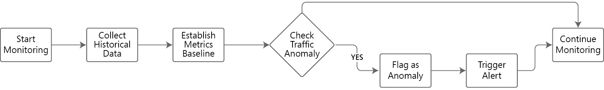
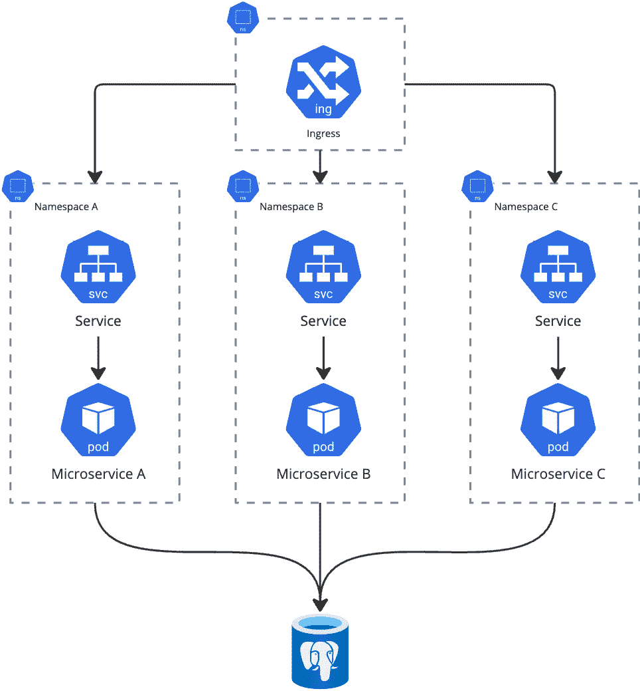

# 10

# 观察我们的架构

在云原生领域，可观测性和事件管理通常被视为次要问题，直到它们变得不再如此。组织常常只有在意外的停机或性能问题使一切停顿时，才意识到正确的监控和响应流程的重要性。到那时，损害通常已经发生：信任受到动摇，财务损失累积，团队则忙于修复系统和声誉。本章深入探讨云原生组织在扩展架构时，忽视可观测性所面临的常见陷阱或反模式。

在今天复杂的生态系统中，仅仅知道哪里出了问题是不够的。我们需要了解问题发生的位置，它如何影响我们的服务，以及可能的下游影响。此外，可观测性不再仅仅是被动响应；随着由机器学习（ML）和人工智能（AI）驱动的先进服务的出现，组织现在可以在事件发生前预测它们，并在问题演变成严重问题之前识别异常。对于那些在混合工作负载、微服务架构和多云环境中航行的组织来说，这种主动方法至关重要。

本章将探讨云原生可观测性和事件管理中的几个反模式，以及可以帮助克服这些挑战的实际补救措施。这些挑战包括：

+   分布式追踪的可观测性覆盖不完整

+   缺乏实时监控

+   忽视开箱即用的机器学习功能

+   未能为分布式追踪实施全面视图

+   未区分影响和诊断指标

在接下来的章节中，我们将详细介绍这些反模式，提供可操作的策略和补救措施，帮助组织建立一个强健的可观测性框架。解决这些常见的陷阱将为您提供保持运营卓越的清晰思路，并避免在即使是最复杂的云原生环境中出现潜在问题。

# 让我们在日志聚合器中捕获所有内容

本节首先探讨分布式追踪的可观测性覆盖不完整的风险，接着是实时监控的关键需求，以确保及时检测和响应。对于许多新接触云原生架构的组织来说，首要的本能反应是收集尽可能多的数据。

“*让我们记录一切*，”他们说，好像日志的庞大数量能神奇地让一切变得清晰。然而，不幸的是，这种思维方式通常会导致操作混乱，而非清晰。在捕获日志时，日志聚合工具可以是强大的助手，但前提是要有目的地使用它们。将每个系统、服务和应用的每一条日志都捕获到一个统一的、全面的聚合器中，听起来可能是理想的，但很快就会变得难以管理。最初为增强可视性而进行的高尚尝试，最终却演变成一堆无关紧要的数据，在一山无实际价值的日志下埋藏了需要解决问题的关键信号。

以 fluentbit 或 fluentd 为例，这些都是很棒的日志捕获工具，但如果不对日志进行过滤，那么成千上万甚至百万条日志将变得难以理解。

## 为什么不加区分的日志记录会失败

**不加区分的日志记录**假设所有数据都同等重要，但并非所有日志都是平等的。有些数据对诊断系统健康或调试问题至关重要，而其他日志则只是噪音。在服务的每次心跳都记录下来似乎有帮助，但在问题诊断过程中要浏览成千上万的心跳日志却适得其反。

以在应用中记录 OK 状态与 WARN/FAIL 状态为例。大量的 OK 状态对于某些人来说可能被视为噪音，它在云存储上的成本可能超过其实际价值。这种做法抬高了运营成本，因为云存储和处理不是免费的，记录一切很快就会成为财务负担。更多的数据意味着需要更多的处理能力来分析它，导致成本上升并且回报递减。

## 智能日志记录：一种更有效的方法

组织需要有意识地决定记录哪些内容，而不是捕获一切。日志保留应该是重中之重；然而，关键是专注于与业务关键操作相关的、具有实际价值的可操作数据日志，或者提供系统健康状况的见解。适当设置日志级别（如 DEBUG、INFO、WARN、ERROR）有助于过滤掉不必要的数据，确保仅捕获有意义的信息。

上下文同样至关重要：日志应当结构化，以便追踪不同服务和环境中的问题。捕获请求 ID、用户会话或事务 ID 等元数据有助于将日志串联成一条连贯的叙事线。像 AWS CloudWatch Logs Insights 或 Datadog 这样的工具可以用于集中日志管理和可视化，减少噪音并优先处理关键问题。这使得组织能够保持运营效率并快速解决事件。

### 智能日志记录：一个例子

假设有一个托管在 AWS 上的云原生电商应用。系统由多个微服务组成：一个用于处理认证的用户服务，一个用于管理库存的产品服务，一个用于处理交易的支付服务，以及一个配送服务。该应用每天处理数百万个请求，因此有效的日志记录对保持性能和快速排查问题至关重要。以下是如何应用智能日志记录：

1.  `DEBUG`：在开发过程中，工程团队启用`DEBUG`日志以捕获用户认证的详细信息，例如调用 AWS Cognito 的 API。在生产环境中，`DEBUG`日志被禁用，以避免不必要的杂乱信息。

1.  `INFO`：在产品服务中，`INFO`日志记录诸如用户将商品添加到购物车或完成订单等成功操作。例如：

    ```
         ```

    WARN: 当出现临时问题时，例如在向 AWS RDS 发起支付请求时发生超时，将生成 WARN 日志：

    ```
    ERROR: If the payment service encounters a failure due to insufficient funds, an ERROR log is recorded, triggering an alert:

    ```

    user_id`, `session_id`, `transaction_id`, 和 `request_id`。例如，支付服务的日志可能包括：

    ```
    session_id` and `transaction_id`, engineers can trace a user’s actions across different microservices, from logging in, adding items to the cart, processing the payment, and arranging delivery.For example, if a delivery fails, the error logs from the delivery service can be correlated with the initial payment logs using the ``transaction_id``:

    ```

    ERROR: 投递失败 - transaction_id=txn001, delivery_id=delv789, error_code=DELIV_ERRORte,

    ```

    ```

    ```

    ```

    ```

In this scenario, smart logging helps reduce unnecessary noise by focusing on logs that provide actionable insights (e.g., `ERROR` logs for failed transactions). Each log entry includes context that enables tracing of user actions across services, allowing engineers to quickly diagnose and resolve issues.

Additionally, centralized log aggregation ensures that logs are easily accessible for analysis, providing a clear, end-to-end view of system behavior without overwhelming the team with irrelevant data. While smart logging helps streamline observability, it’s important to recognize that logs alone may not be enough. Without full visibility across all system layers, particularly in hybrid environments, blind spots can emerge. Next, we will explore how incomplete observability creates these gaps and what can be done to overcome them.

## The Blind Spots of Incomplete Observability and the Importance of End-to-End Distributed Tracing

Observability in cloud native environments is more than just collecting logs; it’s about understanding your systems comprehensively by correlating metrics, traces, and logs across services. Many organizations fall into the trap of incomplete observability by focusing solely on specific layers, such as applications or infrastructure, while neglecting other critical components like data pipelines. This selective approach creates blind spots that obscure the true source of issues, making troubleshooting time-consuming and frustrating. For instance, a smoothly running application may actually be suffering from bottlenecks in its data pipeline. Still, if observability is focused only on the application layer, the problem may go unnoticed until it visibly impacts performance or availability.

To address these blind spots, organizations need to adopt comprehensive end-to-end distributed tracing. **Distributed tracing** follows the flow of requests across different services, applications, and hybrid environments, providing a detailed view of how systems interact and where potential bottlenecks or failures occur. This is especially crucial in microservices architectures, where a single user request may touch dozens of services before completion. Distributed tracing becomes even more critical for organizations running hybrid workloads, where cloud and on-premises systems must work together. Without it, latency issues, transaction failures, or inconsistencies between cloud native and legacy systems can go undetected until they cause significant disruptions.

Each of the major cloud providers offers unique tools to implement end-to-end distributed tracing:

| **Cloud** **Provider** | **Distributed** **Tracing Tool** | **Key Features** |
| **AWS** | AWS X-Ray | Trace requests across AWS services likeLambda, API Gateway, and DynamoDB.Provides detailed visibility into system performance and failures. Supports hybrid workloads by tracing requests across on-premises and cloud-based systems. |
| **GCP** | Cloud Trace (Google Cloud Operations Suite) | Tracks latency and performance across services such as Google Kubernetes Engine(GKE), Cloud Run and Cloud Functions.Identifies bottlenecks and supports hybrid workloads with OpenTelemetry integration for tracing requests between cloud and on-premises environments. |
| **Azure** | Azure Monitor (Application Insights) | Tracks request flows across services likeAzure App Services, Azure Functions, and Azure Kubernetes Service (AKS) offer deep visibility into microservice interactions and integrate with on-premises environments through SDKs and Azure Hybrid Cloud services for end-to-end traceability. |

Table 10.1 - Cloud providers and tracing tools

By leveraging these tools, organizations can gain a holistic view of how their systems perform, tracing errors and latency across multiple services and addressing issues before they cause significant disruptions. End-to-end distributed tracing is essential for diagnosing problems in complex cloud-native architectures. Nonetheless, it is crucial in optimizing performance and ensuring seamless interaction across hybrid environments.

The ability to trace requests across all layers of your infrastructure provides deep insights into where failures may occur, allowing for proactive adjustments. This enhances system reliability, reduces downtime, and improves user experiences across increasingly complex architectures.

### Hybrid Workload Integration and Unified Observability

To ensure complete observability, organizations must adopt tools that handle hybrid workloads, providing visibility across boundaries between cloud native and on-premises environments. A unified approach to observability brings together logs, metrics, and traces into a cohesive framework, offering comprehensive insights across the entire infrastructure. The key components of hybrid observability include:

*   **Cross-Environment Tracing**: Tools like OpenTelemetry standardize tracing across cloud and on-premises systems, following requests across boundaries for a complete view.
*   **Unified Metrics Collection**: Metrics should be consistently collected across environments using tools like AWS CloudWatch or Prometheus and centralized for real-time analysis.
*   **Log Aggregation and Correlation**: Logs from cloud and on-premises systems must be aggregated into a single repository (e.g., Splunk, Datadog) for analysis and event correlation.
*   **Unified Monitoring Dashboards**: A single dashboard (e.g., Datadog, Grafana) should provide real-time insights across cloud native and on-premises systems, simplifying management.
*   **Alerting and Incident Management**: Alerts must trigger real-time notifications across both environments, ensuring consistent incident response with tools like PagerDuty or Opsgenie.

While hybrid workloads provide flexibility and scalability, they also introduce challenges like inconsistent data formats, latency, and monitoring gaps, which can lead to data silos. However, adopting a unified observability approach improves visibility, speeds up troubleshooting, and enhances system reliability across hybrid environments.

### Real-Time Monitoring: A Necessity for Transactional Systems

In industries like financial services, where real-time transactions are crucial, monitoring must be as close to real-time as possible. Delays of even a few minutes can have severe consequences, including financial losses, compliance failures, and damage to customer trust. Take for example SaaS providers, these organizations have Terms And Conditions with their API responses to meet specific customer requirements. In the case of Payment providers, response time needs to be within a specific period of time, otherwise, payments drop. Event-based alerting systems that trigger notifications when critical events occur (e.g., transaction failures, latency spikes, or security breaches) allow teams to respond swiftly, preventing minor issues from escalating into more significant incidents.

However, the effectiveness of real-time alerting is often diminished by alert fatigue, a common challenge in cloud native environments. **Alert fatigue** occurs when operations teams are overwhelmed by the sheer volume of alerts generated by monitoring systems, often leading to desensitization and missed critical signals. As teams struggle to keep up, they may begin ignoring or dismissing notifications, increasing the risk of missing real threats. To combat this, smarter alerting strategies are essential, such as leveraging AI to prioritize critical issues, reduce noise, and ensure that alerts are both meaningful and actionable.

Real-time monitoring is also essential for security. It allows teams to detect anomalies (e.g., unauthorized access attempts or unusual transaction behavior) and respond proactively. When paired with real-time logging, event-based alerts help teams maintain system performance and security without being overwhelmed by unnecessary notifications. The table below details which cloud native services from the big three cloud providers can help execute a proper real-time monitoring setup.

| **Category** | **AWS** | **Azure** | **Google Cloud** **Platform (GCP)** |
| **Real-Time** **Metrics** | CloudWatch: Monitors transaction latency, error rates, and throughput in real-time.Detects spikes in failed transactions instantly. | Azure Monitor: Tracks real-time metrics across microservices, including transaction completion times and error rates. | Cloud Monitoring: Observes latency, error rates, and transaction metrics in real-time.Flags abnormal spikes for investigation. |
| **Instant** **Alerts** | SNS: Triggers notifications via SMS, email, or Slack when alarms are raised. | Azure Action Groups: Sends notifications through email, SMS, push notifications, or Microsoft Teams. | Pub/Sub: Triggers alerts, notifying teams via email, SMS, or Google Chat. |
| **Automated** **Responses** | Lambda: Automatically reroutes traffic to backup services during failures. | Azure Functions: Automates responses like scaling instances or handling increased load. | Cloud Functions: Automates failover responses, redirecting traffic to alternate regions for high availability. |
| **Security** **Monitoring** | CloudTrail: Tracks and analyzes API activity for suspicious behavior. | Azure Security Center: Monitors and analyzes API activities for unauthorized access attempts. | Security Command Center: Tracks and analyzes suspicious API activities and logs. |
| **Anomaly** **Detection** | CloudWatch Anomaly Detection: Identifies unusual patterns in transactions, triggering alerts. | Azure Monitor: Uses ML-based anomaly detection for irregular transaction patterns. | Cloud Monitoring: Leverages anomaly detection to flag abnormal transaction behavior. |
| **Automated Security** **Protocols** | AWS Systems Manager: Automates security responses like disabling accounts. | Azure Logic Apps: Automates responses to security threats, such as flagging suspicious transactions. | Cloud Automation: Automatically triggers actions like quarantining suspicious transactions or disabling accounts. |
| **Real-Time Logging for Deep** **Visibility** | CloudWatch Logs: Collects real-time logs from allmicroservices and infrastructure components for deep analysis. | Azure Monitor Logs: Collects real-time logs from all services, offering detailed visibility into vstem events. | Cloud Logging: Provides realtime logging across services, enabling forensic analysis and event tracing. |

Table 10.2 - Cloud Vendors and monitoring services

### Implementation Checkpoints and Guardrails for a Corporate Strategy

A solid corporate strategy backed by crucial implementation checkpoints is needed for cloud native observability to be effective. These should ensure observability practices are applied consistently across the organization. Key elements include:

*   **Defining Critical Events**: Identify which events (e.g., transaction failures, security incidents) are most critical to the business and prioritize them in monitoring and alerting systems.
*   **Regular Audits of Observability Gaps**: Conduct audits to identify and address gaps in observability, especially as new services and architecture changes are introduced.
*   **Automated Guardrails for Enforcement**: Automated guardrails enforce consistent logging, tracing, and monitoring standards across all systems, ensuring every deployment adheres to best practices.

Automating these best practices reduces human error, ensures consistency across the organization, and reduces operational overhead. Instead of manually configuring observability for every new service or deployment, guardrails take care of this automatically, freeing engineers to focus on higher-level work.

For instance, when deploying new applications through a CI/CD pipeline with integrated guardrails, these guardrails actively enforce compliance by blocking any deployment that fails to meet the established requirements.

Cloud native observability is critical for maintaining control over increasingly complex systems. By avoiding the pitfalls of overlogging and incomplete observability, adopting real-time monitoring, and enforcing consistency through automated guardrails, organizations can gain the visibility they need to prevent disruptions and improve their operational resilience. Success in cloud native environments depends not on capturing everything but on capturing the right insights at the right time and ensuring that these insights drive actionable outcomes. However, beyond traditional observability methods, organizations can unlock even greater potential by leveraging the built-in machine learning (ML) and artificial intelligence (AI) capabilities offered by modern observability platforms to proactively detect anomalies and predict incidents before they escalate. The prior will be discussed in the next section, Ignoring ML and AI capabilities.

# Ignoring ML and AI capabilities

In the previous section, *Let’s Capture Everything in the Log Aggregator*; we explored the common cloud native anti-pattern of overwhelming logging systems by collecting every possible data point without a strategic approach to filtering or prioritizing valuable insights. This scattershot method often results in data overload, making it difficult to extract actionable information when it’s most needed.

Building on that concept, another critical oversight in cloud native architectures is the tendency to ignore the out-of-the-box machine learning (ML) and artificial intelligence (AI) capabilities offered by leading cloud providers like AWS, Azure, and GCP. These platforms provide potent tools such as AWS’s Anomaly Detection in CloudWatch, GuardDuty, Azure Monitor’s AI-powered insights, and GCP’s Cloud Operations suite, which includes advanced log analysis and anomaly detection features.

This section will go over:

*   Leveraging Cloud AI/ML for Anomaly Detection
*   Improving Log Aggregation with AI Insights
*   Centralized Monitoring with Automated Intelligence
*   Reducing Operational Complexity through ML Automation

## Leveraging Cloud AI/ML for Anomaly Detection

While real-time alerting and monitoring have become essential components of cloud native operations, they are no longer enough to keep pace with the growing complexity of modern systems. Traditional monitoring techniques often rely on static thresholds and manual rule-setting, which can result in missed critical events or unnecessary noise from false positives. In an environment where applications are increasingly distributed and dynamic, organizations need more intelligent solutions to detect subtle issues before they become full-blown problems. This is where *anomaly detection*, powered by AI and machine learning, becomes indispensable. Anomaly detection provides proactive insights that allow teams to address issues early, often before users even notice a degradation in service, shifting from reactive monitoring to intelligent, predictive observability.

Cloud providers like AWS, Azure, and GCP offer advanced AI/ML capabilities that transform traditional monitoring and observability. In AWS CloudWatch, for example, Anomaly Detection uses machine learning models to detect deviations from expected performance patterns automatically. Azure Monitor incorporates AI-driven insights to predict issues before they arise, while GCP’s Cloud Operations provides anomaly detection to pinpoint unusual behavior across logs and metrics. By utilizing these capabilities, organizations can gain a proactive edge in detecting potential issues before they become full-blown incidents, enabling teams to address problems in real-time.

However, despite the availability of these tools mentioned prior, many organizations fail to adopt them fully, sticking to manual monitoring methods that often fall short. Ignoring AI/ML-powered anomaly detection means missing out on a layer of protection that traditional rule-based alerting simply cannot provide. The power of machine learning lies in its ability to identify subtle patterns in massive data streams, patterns that may be missed by even the most experienced operators. By leveraging these cloud native AI/ML tools, organizations can enhance their monitoring efforts, reducing downtime and improving system resilience. The following example of Leveraging Cloud AI/ML for Anomaly Detection provides strong context on why its a tool that should not be ignored.

### Anomaly Detection: An example

An example of AI/ML anomaly detection can be found in AWS CloudWatch Anomaly Detection. This feature uses machine learning to automatically establish a metrics baseline and detect deviations from this expected behavior.

For instance, in a web application, CloudWatch Anomaly Detection could monitor the number of requests to the server and establish an expected pattern based on historical data. Suppose the traffic suddenly spikes or drops outside the expected range, such as a sudden flood of requests indicative of a DDoS attack or a sudden drop in traffic suggesting a failure. In that case, it flags this as an anomaly and triggers an alert. The image below illustrates what that would look like:



Figure 10.1 - Typical Flow of Anomaly detection (Redraw please)

This flowchart outlines a monitoring process that begins with data collection and baseline establishment, continuously checks for traffic anomalies, flags and triggers alerts for anomalies detected, and loops back to ongoing monitoring if no anomalies are found.

As we progress, we must understand that effective monitoring doesn’t stop at anomaly detection. The next layer of observability involves Improving Log Aggregation with AI Insights, where machine learning continues to enhance how we filter and interpret vast amounts of log data.

## Improving Log Aggregation with AI Insights

Log aggregation is critical to any observability strategy but is not enough to collect data. The true challenge lies in filtering through the immense volume of logs to extract actionable insights. AI and ML capabilities embedded in cloud platforms like AWS, Azure, and GCP are invaluable here. These tools offer smart filtering and categorization, enabling organizations to focus on the most relevant data.

For instance, AWS CloudWatch Logs Insights and Azure Log Analytics use machine learning to identify patterns and anomalies, helping teams make sense of vast amounts of log data more efficiently.

While many organizations are content to rely on manual searches and predefined queries, these methods often result in information overload or missed signals. AI-enhanced log aggregation helps reduce noise, highlights critical issues, and predicts future system behavior. By integrating these capabilities into the log aggregation pipeline, companies can improve their troubleshooting efficiency and prevent potential incidents by acting on predictive insights. This approach brings a level of sophistication to logging that manual methods simply cannot match. By integrating AI and ML capabilities into log aggregation, cloud native environments can significantly improve how logs are processed, analyzed, and acted upon. Below are some key ways in which AI enhances log aggregation:

*   **Smart Filtering and Categorization**: AI models automatically sort logs based on relevance, reducing the time spent manually filtering through non-essential data.
*   **Pattern Recognition in Large Data Sets**: Machine learning identifies patterns in logs that would be too subtle or complex for manual detection, enabling teams to uncover hidden issues or trends.
*   **Anomaly Detection in Log Data**: AI detects anomalies within logs that indicate potential failures, security threats, or performance bottlenecks, allowing teams to act before problems escalate.
*   **Predictive Insights for Future Behavior**: Machine learning analyzes historical log data to predict future behavior, offering teams proactive recommendations for avoiding incidents or optimizing system performance.
*   **Noise Reduction**: AI-enhanced log aggregation reduces the noise by filtering out irrelevant or duplicate entries, making it easier to focus on critical log events and streamline incident response.
*   **Automated Insights and Recommendations**: AI tools directly provide actionable insights and recommendations from log data, helping teams prioritize their efforts and resolve issues faster with data-backed guidance.

Looking ahead, it becomes clear that centralized monitoring is the backbone of enhanced observability, bringing together vast data streams for intelligent analysis at scale. In the next section, Centralized Monitoring with Automated Intelligence, we’ll uncover how AI and ML are the catalysts that elevate this approach from routine oversight to predictive power.

## Centralized Monitoring with Automated Intelligence

**Centralized monitoring** has become the foundation of modern observability, allowing organizations to manage complex systems more easily. However, with the advent of AI and ML, centralized monitoring has evolved beyond merely consolidating data into dashboards.

Today, cloud providers like AWS, Azure, and GCP offer sophisticated monitoring platforms that do more than aggregate metrics; they:

*   Analyze data in real time to deliver intelligent alerts and recommendations powered by machine learning.
*   Visualize the performance of distributed systems to simplify the management of cloud native workloads.
*   Centralize logging across all resources, enhancing visibility and enabling more efficient monitoring.

These platforms, such as AWS CloudWatch, Azure Monitor, and GCP Cloud Operations, allow teams to visualize the performance of distributed systems and reduce the complexity of managing cloud-native workloads, making monitoring more efficient and actionable.

In addition to performance metrics, all major cloud vendors now offer solutions to centralize logging across all resources, further enhancing observability. For instance, AWS provides AWS CloudWatch Logs and AWS Organizations, which enable centralized log aggregation and policy management across multiple accounts. This ensures that data from various services and resources, whether distributed or complex, is collected and accessible in one unified location.

Similarly, Azure Log Analytics and Google Cloud’s Logging offer comparable capabilities, aggregating logs from across regions and services while incorporating AI/ML-driven analytics to highlight significant trends, anomalies, and potential issues before they escalate.

### Centralized Monitoring: An AI Example

These AI and ML-driven tools go beyond traditional monitoring by moving from reactive to proactive observability. Instead of simply responding to events as they occur, these platforms provide predictive insights that help teams identify issues before they manifest.

For example, AWS GuardDuty integrates with AWS Organizations and uses anomaly detection powered by machine learning to flag suspicious activity, such as unusual network traffic or unauthorized access attempts. Similarly, machine learning models across these cloud platforms can detect emerging patterns that indicate impending resource constraints or application bottlenecks, enabling operators to take preemptive action. The result is a more intelligent, responsive monitoring system that lightens the load on operations teams while ensuring better performance, security, and overall reliability of cloud workloads.

## Reducing Operational Complexity through ML Automation

In cloud native environments, operational complexity can quickly spiral out of control. The sheer scale of data, distributed architectures, and dynamic infrastructure create monitoring challenges that are difficult to manage manually.

Fortunately, machine learning automation offers a solution by simplifying tasks like anomaly detection, alerting, and capacity planning. Cloud platforms like AWS, Azure, and GCP provide ML automation tools to handle these repetitive and time-consuming tasks, allowing operations teams to focus on higher-value activities.

For example, Azure offers a suite of machine learning automation tools specifically designed to streamline operational complexity. Azure Monitor’s Autoscale feature dynamically adjusts resources based on real-time demand, automatically increasing or decreasing capacity without manual intervention. With Azure Machine Learning’s anomaly detection capabilities, organizations can proactively address potential performance bottlenecks and resource constraints before they impact the end-user experience. Azure Automation, another powerful tool, automates routine operational tasks such as patch management, compliance checks, and system backups. These automated processes ensure that operations teams are no longer bogged down by repetitive tasks, allowing them to focus on strategic initiatives that drive business value.

### ML Automation: Working Example

In a recent consulting engagement, clients facing growing operational complexity are often overwhelmed by the sheer volume of alerts and manual tasks that consume their team’s time. In these situations, leveraging Azure’s ML-driven automation tools can significantly transform their operations. For example, during a recent engagement, we worked with a client struggling with frequent scaling issues due to their fluctuating user base. By implementing Azure Monitor’s Autoscale and integrating predictive analytics from Azure Machine Learning, the client was able to reduce manual oversight, optimize resource allocation, and prevent costly downtime. The shift to ML automation enabled their team to reclaim time spent on firefighting and instead focus on innovation and growth.

By embracing ML automation, organizations can reduce the need for constant manual intervention, ensuring faster response times and more reliable systems. Automation increases efficiency and reduces the potential for human error, often the source of operational failures. In this way, AI and ML-driven automation act as a force multiplier, enabling operations teams to do more with less effort while maintaining robust system performance. As cloud native architectures evolve, ML automation will only grow in importance, becoming an essential component of successful observability strategies.

To get to the point where a traditional organization can utilize ML automation when moving to cloud-native, the table below provides a set of considerations:

| **Step** | **Description** |
| Assess Your Current Operational Processes | Identify repetitive, time-consuming tasks that can benefit from automation (e.g., anomaly detection, scaling, system maintenance). |
| Set Clear Objectives | Define specific goals for ML automation, such as reducing manual intervention, improving response times, or enhancing resource optimization. |
| Evaluate Existing Cloud Automation Tools | Review ML automation features in your cloud platform (e.g., AWS GuardDuty, Azure Monitor, and GCP Operations) for potential integration. |
| Prioritize Use Cases | Select the most impactful areas to automate first, like auto-scaling during peak loads or automating patch management. |
| Integrate Machine Learning Models | Implement cloud native or custom ML models for anomaly detection, predictive analytics, and resource optimization. |
| Develop Automation Pipelines | Build pipelines that integrate ML models with operations, triggering actions like resource scaling or issue resolution based on ML insights. |
| Test and Monitor Automation | Run simulations and monitor performance to ensure ML automation meets objectives, refining models and workflows as needed. |
| Scale Automation Across Operations | Expand ML automation to additional processes once initial use cases are successful, incorporating more complex workflows and models. |
| Implement Feedback Loops | Continuously gather data from automated processes to improve models and automation strategies, ensuring continual learning and refinement. |
| Train Your Teams | Ensure teams receive effective training to manage and optimize ML automation, maintaining performance and adaptability. |

Table 10.3 - ML Automation Considerations

As we’ve seen, AI/ML-driven anomaly detection in cloud native environments is not just an enhancement to observability; it’s a critical tool for maintaining system resilience. Whether it’s identifying unusual traffic spikes, unexpected performance drops, or subtle patterns that could indicate emerging issues, these capabilities give organizations a proactive edge in managing complex, distributed systems. By failing to leverage the intelligent, automated insights provided by AWS, Azure, and GCP, many companies are unnecessarily exposing themselves to more significant operational risks and inefficiencies. Embracing these tools is not just about reducing downtime; and it’s about building a more intelligent, adaptive infrastructure.

Yet anomaly detection is only one piece of the observability puzzle. As systems grow more distributed, tracking issues across multiple services and microservices becomes even more challenging. This is where distributed tracing is a critical technique for following a request’s journey across different components and identifying performance bottlenecks or errors in complex, interconnected systems.

In the next section, we’ll explore how *Neglecting Distributed Tracing* can leave gaps in your observability strategy, making it harder to diagnose issues and optimize performance in cloud native architectures.

# Neglecting Distributed Tracing

**Neglecting distributed tracing** is a classic cloud native anti-pattern. It undermines one of the core principles of cloud native architecture: *end-to-end observability*. When tracing is overlooked, it disrupts the flow of visibility across distributed systems, leading to hidden performance bottlenecks, misdiagnosed issues, and a loss of accountability in critical pathways. This anti-pattern breaks the promise of transparency and agility that cloud native environments are supposed to deliver, leaving teams scrambling to diagnose issues without the whole picture.

This section will explore the importance of cloud native log aggregation within a security data lake and highlight how failing to integrate logs across distributed systems compromises security insights and operational awareness. Additionally, we will explain why splitting impact metrics from diagnostic metrics is not just a best practice but a necessity for precise, actionable insights.

Here’s what to expect:

*   **The Fragmentation Problem**: How overlooking distributed tracing leaves gaps in visibility across microservices.
*   **Metrics that Matter**: The importance of distinguishing impact metrics from diagnostic metrics for better incident response.
*   **Real-World Consequences**: Case studies of what can go wrong when distributed tracing is neglected.
*   **Best Practices for End-to-End Tracing**: A guide to implementing comprehensive tracing across complex systems

## The Fragmentation Problem

Cloud native architectures thrive on the promise of agility, resilience, and scalability. By decoupling applications into independently deployable microservices, businesses gain flexibility and speed. However, as these systems grow in scale, so does the complexity of managing them effectively. When distributed tracing, the key to visibility within microservices, is neglected or improperly implemented, a dangerous anti-pattern known as fragmentation emerges.

**Fragmentation** occurs when tracing is applied inconsistently or only in parts of the system, leaving critical gaps in visibility. Instead of a clear, end-to-end view of transactions, teams are left with a disjointed mess, akin to navigating through a fog of partial data.

Distributed tracing exists to provide transparency throughout a system, capturing the full journey of requests as they flow between microservices, databases, and third-party APIs. When applied correctly, it offers a holistic view, enabling teams to pinpoint bottlenecks, identify errors, and optimize performance. However, when tracing is not implemented consistently across the entire architecture, teams are forced to rely on fragmented data, piecing together logs from disparate services without seeing the whole picture. This lack of cohesion doesn’t just compromise visibility, it introduces significant operational risks.

### Fragmentation: An Example

Consider the case of an e-commerce retailer grappling with slow checkout times during high-traffic sales events. Their logs from individual microservices appeared normal without a unified tracing system, suggesting everything was running smoothly. Yet the customer experience told a different story: lagging transactions and failed checkouts, causing customer frustration and lost revenue. The real culprit, a third-party payment processor throttling requests, remained hidden from view, only uncovered after hours of expensive investigation. Had comprehensive distributed tracing been in place, the issue could have been identified in minutes, preventing financial loss and safeguarding customer trust.

Fragmentation as a cloud native anti-pattern breaks one of the core tenets of microservices: the ability to maintain observability across the entire system while still managing services independently. The tension between autonomy and operational oversight becomes unsustainable without distributed tracing. The solution is straightforward:

*   **Treat Distributed Tracing as a Foundational Element**: Integrate distributed tracing into the architecture from the outset, ensuring it is a core part of the design rather than an afterthought.
*   **Implement End-to-End Tracing**: To avoid blind spots, ensure every transaction is fully traced across all microservices, third-party APIs, databases, and other system components.
*   **Avoid Fragmented Visibility**: Consistently apply tracing across the entire system to prevent teams from compiling incomplete data from isolated logs.
*   **Monitor All Critical Paths**: Focus on critical user journeys, such as checkout processes or key transactions, to immediately detect and resolve bottlenecks, errors, or latency.
*   **Foster a Proactive Approach**: Address potential risks before they become problems by continuously monitoring and tracing critical services, ensuring the system remains resilient under pressure.
*   **Enhance Observability**: Integrate tracing with logging and metrics to provide a comprehensive observability stack, enabling faster diagnostics and incident response.

This approach builds a more reliable, agile, and resilient system that can scale effectively while maintaining operational visibility.

## Metrics that Matter

Not all metrics are created equal in effective distributed tracing. To ensure a robust incident response and maintain a high-performing cloud native system, it is crucial to distinguish between impact metrics and diagnostic metrics. This distinction allows operations teams to prioritize alerts based on an issue’s severity while offering deeper insights for troubleshooting and resolution. The table below goes into further detail as to what the metrics types are:

| **Metric Type** | **Description** | **Examples** | **Purpose** |
| **Impact** **Metrics** | Focus on user experience and overall system health. Measure the direct impact on customers or business outcomes. | **Latency, Error Rates,** **Request Failures** | Quickly detect and address issues that affect end users,such as slow response times or failed transactions. |
| **Diagnostic** **Metrics** | Dive deeper into system internals to uncover the root cause of issues. Provide detailed technical information for troubleshooting. | **CPU Usage, Memory Consumption, Network Traffic, Database** **Query Performance** | Diagnose and resolve issues identified by impact metrics by analyzing system performance and resource |

Table 10.4 - Metric split

It is one thing to know the metrics types, but to utilize them is another. In the example below, we use OpenTelemtry to pull useful metrics from an application here using the OpenTelemtry SDK, directly tying to the code itself, instead of relying on an agent:

```

from opentelemetry import metrics

from opentelemetry.sdk.metrics import MeterProvider

from opentelemetry.sdk.metrics.export import ConsoleMetricExporter, PeriodicExportingMetricReader

# 设置 MeterProvider 和 Metric Exporter

provider = MeterProvider()

metrics.set_meter_provider(provider)

exporter = ConsoleMetricExporter()

reader = PeriodicExportingMetricReader(exporter)

provider.add_metric_reader(reader)

# 创建用于记录指标的计量器

meter = metrics.get_meter(__name__)

# 定义指标：影响和诊断

impact_latency = meter.create_histogram("impact_latency", unit="ms", description="请求延迟")

diagnostic_cpu_usage = meter.create_observable_gauge("diagnostic_cpu_usage", description="CPU 使用率")

# 模拟记录影响指标的函数

def record_impact_metrics(latency_value):

impact_latency.record(latency_value)

print(f"记录的影响延迟: {latency_value}ms")

# 观察诊断指标的函数

def observe_diagnostic_metrics():

import psutil

return psutil.cpu_percent(interval=None)

# 注册诊断指标回调

meter.create_observable_gauge("diagnostic_cpu_usage", callbacks=[observe_diagnostic_metrics])

# 模拟指标记录

record_impact_metrics(120)  # 模拟 120ms 的延迟

```

代码中需要观察的关键点有：

+   `impact_latency histogram` 追踪请求的时长，这是用户体验的一个关键指标。在这个例子中，我们记录了 120ms 的延迟。

+   `diagnostic_cpu_usage` 可观察计量器监控 CPU 使用率。我们使用``psutil``库来收集 CPU 统计信息，这是一种在事故发生时了解系统资源使用情况的适当诊断指标。

通过收集和分析影响和诊断指标，团队可以迅速检测性能问题，并收集必要的信息以诊断和解决根本原因。这种综合方法确保了云原生系统在高压下仍能保持弹性和性能。

正确的指标决定了结果的相关性；下一部分将进入一个真实场景，讨论当我们忽视分布式追踪时会发生什么。

## 真实世界的后果

在与一家领先的电子商务零售商进行的最近一次合作中，我们受邀解决在高流量促销期间出现的重大性能问题。该零售商的微服务架构管理着库存管理和支付处理等关键操作，但其可观察性是碎片化的。仅依赖单个服务的日志和指标，他们无法追踪端到端的事务，导致在结账时间开始因负载增加而变慢时，无法迅速识别延迟的来源。事故发生几个小时后，我们实施了分布式追踪，立即揭示了一个第三方支付 API 作为导致延迟的瓶颈。

引入分布式追踪为零售商提供了实时的整个事务流的可视化，跨所有微服务。此追踪的集成使得运营团队能够更快地定位并解决问题，避免了本可以在几分钟内识别出来的长期停机。我们的干预减少了停机时间，并通过确保未来的高峰流量期间能更好地进行性能监控和更快的响应时间，恢复了客户的信任。下图展示了一个简单的 Kubernetes 微服务，后面列出了我们发现的问题。



图 10.2 - 简单的 Kubernetes 微服务

我们识别出的关键问题包括：

+   **缺乏端到端的事务可视化**：系统无法追踪客户在微服务中的整个旅程。

+   **日志和指标孤立**：指标仅限于单个服务，无法洞察它们在事务中如何交互。

+   **未监控的第三方依赖**：导致延迟的第三方 API 没有得到充分监控，直到实施了分布式追踪才被发现。

+   **慢响应的事故处理时间**：没有分布式追踪，团队依赖手动排查故障，延长了关键问题的解决时间。

**为了解决这些挑战，组织需要一个全面的可观察性策略，整合分布式追踪、集中日志记录和强大的监控，涵盖所有系统组件。以下列表提供了** **更多的背景信息：**

+   **实施分布式追踪**：我们部署了 OpenTelemetry 作为我们的追踪解决方案，为微服务架构中的事务提供了端到端的可视化。这使团队能够立即检测到瓶颈，包括导致结账延迟的第三方 API。保持一致性的关键是将 OpenTelemetry SDK（在此案例中为 Python）与所有代码打包在一起。

+   **增强日志聚合**：我们将追踪系统与 CloudWatch 集成，进行集中式日志聚合，确保来自不同微服务的所有日志都能集中收集并进行检索。这提高了团队将日志与追踪数据关联的能力，使得事故检测和诊断更快速、更准确。

+   **实时监控与警报**：我们使用 Prometheus 和 Grafana 设置了监控仪表板和实时警报，配置它们以显示系统健康状况、性能指标和追踪信息。这为运维团队提供了系统性能的主动洞察，减少了他们在高流量事件中对被动故障排除的依赖。

+   **第三方依赖监控**：我们为第三方 API 建立了特定的监控系统，包括设置延迟阈值和故障率警报。这确保了外部依赖持续被监控，以防它们在未来默默成为瓶颈。

通过利用这些工具和策略，我们提高了零售商系统的可视化，并减少了他们对关键事件响应的时间。这些解决方案可以通过主要云服务提供商的等效服务复制，例如 AWS XRay + CloudWatch、Azure Application Insights 和 Google Cloud Operations Suite。

接下来，我们将讨论最佳实践以及在构建分布式追踪时需要考虑的因素，以便将我们迄今所学的知识结合起来。

## 解决追踪忽视的最佳实践

忽视分布式追踪就像在没有完整地图的情况下尝试在复杂的城市中导航；最终，你会迷路。端到端追踪就像你的 GPS，连接微服务之间的点，识别瓶颈，并照亮那些可能隐藏在分散日志阴影中的路径。分布式追踪必须作为基础实践，而不是事后的思考，以确保云原生系统保持敏捷、可扩展和响应迅速。

在应用构建追踪时，请考虑以下因素：

+   **尽早开始并保持一致性**：最关键的最佳实践之一是从一开始就实施追踪。事后为现有架构添加追踪就像为一艘正在下沉的船打补丁；效率低下且容易留下漏洞。一致性至关重要；每个微服务、依赖项和请求在系统中路径的每个环节都应覆盖追踪。这确保系统的任何部分都不会置于黑暗中。

+   **跟踪整个过程**：成功的跟踪不仅仅停留在表面。它需要覆盖整个请求生命周期，从面向用户的前端到后台服务，再到外部依赖，如第三方 API。这种全面的可见性确保了任何延迟或故障都可以追溯到根本原因，无论它是发生在系统内部还是外部。结果是更快的诊断、更快的解决方案，以及在事件发生时更少的头疼。

+   **与指标和日志集成**：跟踪功能强大，但与指标和日志结合时，它的作用更为显著。使用影响指标来识别用户体验何时下降，使用诊断指标来找出原因。将可观察性的三大支柱——跟踪、指标和日志进行整合，可以创建一个全面的系统视图，使团队能够获得他们所需的洞察，保持主动而非被动。

+   **自动化并设置保护措施**：手动为每个服务进行跟踪仪器化可能令人望而生畏，尤其是在动态的云原生环境中。像 OpenTelemetry 这样的自动化工具和框架简化了这个过程，确保每个新的微服务或部署默认都内置了跟踪功能。设置自动化保护措施，如延迟阈值、错误率和关键服务性能，可以在事件失控之前触发警报。

+   **监控最重要的内容**：并非每个跟踪、日志或指标都需要同等对待。优先跟踪系统中的关键路径，例如用户交易、支付流程，或任何直接影响客户体验的服务。这种聚焦确保团队的注意力集中在最重要的内容上，同时仍然关注整个系统的健康状况。

遵循这些最佳实践可以帮助传统组织在向云原生转型时，将分布式跟踪从一个反应式工具转变为一个主动的资产。当跟踪是全面且集成时，结果是一个云原生架构，它具有弹性、透明性，并能够满足现代应用的需求。虽然跟踪是一个运作良好的云原生系统的支柱，但真正的弹性考验在于组织在问题发生时的应对能力。即使采用最佳的跟踪实践，系统的恢复能力和维持稳定性也会受到影响，如果没有成熟的警报和事件处理流程。

本章的最后一节，我们将探讨警报和事件处理流程不成熟如何破坏即使是最强大的架构，以及如何解决这些不足是维持云原生环境中运营卓越的关键。

# 警报和事件处理流程不成熟

虽然提供了灵活性和可扩展性，但云原生组织在处理警报和事件时往往会遭遇不成熟的流程。在管理数千个微服务的环境中，冗余警报、观察性设置不完整以及无效的事件响应协议所带来的噪声可能会让团队不堪重负。当组织现代化其基础设施时，他们往往会忽略一个基本真理：**警报和事件管理的关键不在于收集所有可用的指标，而是专注于正确的指标，响应正确的信号，并确保这些过程在所有环境中顺畅运行，而不仅仅是在生产环境中**。

许多云原生失败的核心问题是“*收集一切*”的心态，收集所有可能的指标，并为每一个异常发送警报。这种做法通常会导致混乱，使工程和运维团队淹没在没有可操作洞察的数据中。问题不是指标的缺乏，而是缺乏有目的且良好对齐的指标和警报。通过理解指标倾倒的危险，我们可以变得更加谨慎和警觉，确保每个警报都有明确的目的，每个收集的指标都应该解决一个与业务和技术目标相关的具体用例。

本节将指导如何构建一个成熟、有效的警报和事件响应系统，重点介绍常见的陷阱以及克服这些陷阱的策略。

本节将涵盖：

+   目标驱动的指标和警报

+   指标倾倒的陷阱

+   在可观察性上向左移动

+   警报疲劳

+   事件响应成熟度

这些主题将帮助我们培养一种韧性强、主动的警报和事件管理方法，使团队在挑战出现时能够迅速且智能地响应。

## 目标驱动的指标和警报

可用的指标数量庞大，可能令人不知所措。然而，并不是每个指标都是有用的，收集所有数据而没有明确目标，会导致噪声、警报疲劳和低效。目标驱动的指标专注于收集与特定业务或技术目标直接相关的数据，确保每个指标都有实际目的。

指标应该根据它们提供可操作洞察的能力来选择，而不仅仅是因为它们易于收集。例如，除了收集所有实例的 CPU 使用率外，考虑：*“我们通过监控这个想要实现什么目标？我们是在了解负载下的性能吗？预测基础设施扩展需求吗？优化资源利用吗？*” 一旦目标明确，我们可以设计与之对齐的指标和警报。

### 目标驱动的指标和警报：一个示例

例如，假设我们考虑一个基于微服务的电子商务平台。一个关键的业务目标是确保顺畅的客户结账体验。在这种情况下，目标驱动的指标可能包括：

+   **结账服务的延迟**：这个指标跟踪完成结账过程所需的时间，直接影响用户体验。业务目标是确保客户不会因性能问题而放弃购物车。相关警报可能会在延迟超过定义的阈值时触发，提醒工程师在影响大量用户之前调查性能下降问题。

+   **支付处理中的错误率**：监控这个指标有助于确保支付失败的交易不会干扰销售。不是针对每一笔失败的交易都发送警报，而是当错误率在特定时间窗口内超过某个百分比时，触发警报，让团队能够区分小的波动和真正的问题。

+   **库存更新延迟**：如果销售后库存更新延迟，可能会导致超卖，影响收入和客户满意度。围绕订单完成后库存同步所需时间的目标指标，服务于业务目标的运营准确性。如果这些延迟超过可接受的限制，则触发警报。

通过定义像这样的指标，我们并不是仅仅为了收集数据而收集数据。相反，我们确保每个指标都有一个明确的目的，使团队能够专注于对业务真正重要的事项。现在我们已经看到了目标驱动的指标的价值，我们必须避免相反的方法，这就是我们所说的“指标倾倒”陷阱。

接下来，我们将探讨指标倾倒的陷阱，以及它是如何破坏即便是最有意图的云原生监控策略的。

## 指标倾倒的陷阱

在急于采用监控工具和收集洞察的过程中，许多组织陷入了指标倾倒的陷阱。这种情况发生在收集所有可能的指标时，没有考虑其价值或目的。表面上看，这似乎是一种确保完全可视化的方法。然而，这会导致数据过载、警报疲劳和系统性能下降，使得团队更难及时应对关键问题。**指标倾倒**是指收集所有可用的指标，无论是 CPU 使用率、内存、网络延迟还是磁盘 I/O，都没有考虑这些指标将如何使用，或者它们是否有助于实现业务目标。团队可能认为，收集更多的数据能给他们更多的控制权和洞察力。

### 指标倾倒：一个例子

例如，假设一个组织监控每个实例的 CPU 使用率，跨越数百个微服务，无论 CPU 使用率是否与服务性能相关。他们以非常精细的粒度（每秒）收集这些数据，即使该服务没有历史的与 CPU 相关的性能问题。随着时间的推移，这种方法会产生大量的数据，堵塞仪表板，增加存储成本，并创建一个警报系统，持续触发无关紧要的警告。这是典型的指标倾倒，收集了超出必要或可操作的数据。

指标倾倒会带来两个显著的问题，导致操作变慢：操作低效性和警报疲劳。以下是这些问题的体现方式：

+   **操作低效性**：

    +   不必要的指标洪流减慢了监控系统，因为每个指标都必须被处理、存储和分析。

    +   这会导致庞大的数据管道，消耗超过所需的资源。

    +   工程师和运维团队必须从无关的数据中筛选信息，这使得找到重要见解变得更加困难。

    +   关键警报可能会被延迟、淹没或遗漏，从而可能导致问题升级为停机故障。

+   **警报疲劳**：

    +   监控过多的指标会导致过多的警报，压倒团队，造成非关键通知的流入。

    +   随着时间的推移，团队变得麻木，增加了错过或忽略真正重要警报的风险。

    +   这降低了团队的效率，增加了系统停机、恢复时间延长以及对客户体验产生负面影响的可能性。

以下是如何摆脱指标倾倒，朝着更专注、更高效的监控策略转变的方法：

| **行动** | **描述** |
| --- | --- |
| **定义明确的业务和** **技术目标** | 确保每个指标都有明确的目的。首先要问：“我们要解决的业务或操作问题是什么？”收集支持这些目标的指标。 |
| **优先关注** **可操作指标** | 聚焦于那些能提供可操作见解的指标。避免仅仅因为数据可用就收集它。确保这些指标能帮助团队做出决策或采取行动。 |
| **定期审查和** **修剪指标** | 定期审计正在收集的指标。淘汰那些不再相关的指标，减少噪声，保持监控系统的高效性。 |
| **创建** **基于阈值的警报** | 设计仅在关键阈值被突破时触发的警报。这减少了不必要的警报，帮助团队专注于最重要的问题。 |
| **使用** **聚合指标** | 聚合指标以获得高层次的视图，避免过度细化。监控时间段内的平均值，以识别有意义的模式并减少噪声。 |
| **专注于关键绩效** **指标 (KPI)** | 将指标与衡量关键系统健康状况和性能的 KPI 对齐，如用户体验、交易成功率和服务延迟。 |

表 10.5 - 指标倾倒解决表

通过遵循这些步骤，你可以消除指标倾倒的低效，创建一个简化的监控系统，提供清晰、可操作的洞察力。这将改善响应时间，减少警报疲劳，并使团队能够集中精力处理云原生环境中最关键的方面。接下来的部分将通过讨论*在可观察性中向左转*来深入探讨。

## 在可观察性中向左转

云原生可观察性中最常被忽视的一个方面是未能将监控和警报延伸到软件开发生命周期（SDLC）的早期阶段。这种忽视导致了一种反模式，将完整的可观察性仅视为生产环境的关注点。在云原生环境中，微服务分布广泛且部署速度快，等到生产环境才发现问题就像是让炸弹的引线慢慢燃烧一样。这就是“向左转”实践的关键所在。

在可观察性中向左转意味着将监控、警报和诊断嵌入到开发、测试和**UAT**（**用户验收测试**）等早期环境中，而不是等到代码达到生产环境才进行监控。通过这种方式，组织可以更早发现性能瓶颈、扩展问题或配置错误，远在它们破坏生产服务或更糟的情况——影响客户之前。

想象一个场景，一个云原生电商应用正在部署。在生产环境中，公司使用像 Prometheus 和 Grafana 这样的强大可观察性平台来监控和警报系统健康。然而，在预生产环境中，如临时环境或 UAT，只有基本的设置：可能只有一些日志或简单的正常运行时间监控。

这意味着虽然应用程序经历了各种测试阶段，但像 API 延迟或资源饱和度等关键性能指标并没有被监控。开发团队不知道，在负载下，某个特定的微服务在特定数量的并发用户下会开始表现出高延迟。这个问题只在应用程序上线后在生产环境中暴露出来，延迟的激增影响了真实用户，导致在实际事件压力下急忙处理问题。

如果可观察性向左转，这个问题本可以更早地被识别出来。通过正确的指标，开发人员会发现，在负载测试阶段，随着负载的增加，API 延迟逐渐增加，这使得他们能够在生产部署前解决该问题。

在可观察性中向左转的关键是意识到监控在所有环境中都至关重要，而不仅仅是生产环境。以下是如何开始的方法：

| **行动** | **描述** | **向左转的好处** |
| --- | --- | --- |
| **提前部署监控** | 从一开始就加入监控和追踪，确保每个功能或服务在开发过程中（开发、CI、预发布）都有可观察性。 | - 早期问题检测 - 提升开发者责任感 |
| **监控** **负载测试** | 将预生产环境的负载测试视作生产环境一样对待。使用像 Grafana 或 New Relic 这样的工具监控 API 性能、内存和吞吐量，以便尽早发现瓶颈。 | - 早期问题检测 - 降低失败成本 |
| **在** **低环境中设置警报** | 在测试阶段实施关键问题的警报（例如：错误率上升、延迟异常），以便在问题进入生产之前解决它们。 | - 更快的解决时间 - 降低失败成本 |
| **使用** **分布式追踪** | 在非生产环境中应用分布式追踪，以识别低效路径和瓶颈，为开发者提供修复问题的见解，防止问题升级。 | - 更快的解决时间 - 提升开发者责任感 |

表 10.6 - 从监控开始

总结来说，将可观察性向左推进，将其从一种被动、以生产为中心的实践转变为一种主动、全面的方式，保护整个云原生应用生命周期。通过提前投资于可观察性，你可以显著减少生产环境中出现意外情况的可能性，确保你的云原生架构能够在任何条件下可靠地扩展和运行。

## 警报疲劳与事件响应成熟度

在云原生环境中，警报疲劳是潜在的敌人，当团队被源源不断的通知淹没时，这种情况悄然发生，其中许多警报只是小问题或虚假警报。持续的噪声让即使是最警觉的工程师也会产生麻木感，导致关键警报被忽视或延迟。在最糟糕的情况下，团队可能会对低优先级的警报习以为常，以至于错过了最重要的警报。另一方面，事件响应成熟度则是解药，反映了团队高效管理警报、有效分类并精准迅速解决问题的能力。

但如何避免淹没在无休止的警报中呢？更重要的是，如何将警报混乱转化为一个精简且成熟的事件响应过程？

### 如何应对警报疲劳

+   **优先处理关键警报**：只关注真正重要的警报，即那些直接影响系统性能和用户体验的警报。如果某个警报不需要立即处理，那它只是噪声。保持信号的清晰。

+   **设定合理阈值**：警报应该只在超过关键阈值时触发。CPU 使用的小幅波动不应该让你的团队陷入慌乱。设计触发规则时，应该捕捉到显著变化，并过滤掉微小波动。

+   **关联警报**：当多个警报触发同一个潜在问题时，很容易让人感到不知所措。通过将相关警报组合成一个可操作的通知，你可以减少杂乱无章的干扰，为团队提供更清晰的问题概貌。

+   **调整和再调整**：警报规则不是“一劳永逸”的。定期回顾并调整它们，以跟上系统行为的变化。六个月前重要的事情，现在可能已经不再相关。去除无效的部分。

+   **自动化重复性工作**：对于已知的、重复出现的问题，进行自动化解决。如果问题可以通过脚本修复，就没有必要在凌晨三点把人叫醒。自动化可以减少警报量，并让团队专注于真正重要的事项。

+   **事后回顾**：事件发生后，分析哪些警报有帮助，哪些警报增加了噪音。利用这些经验教训进一步优化你的系统，确保下一次警报更加精准和高效。

通过聚焦于真正重要的事情，并持续优化警报流程，你可以从反应式的应急处理转变为主动且深思熟虑的事件管理。这是事件响应成熟度的路径：每个警报都有其目的，每次响应都迅速，系统也变得更加韧性。当警报疲劳逐渐消失时，剩下的是一台精细调优的机器，它平稳、高效地运行，并且在发生问题时，你能够及时了解并知道如何修复。

# 摘要

在本章中，我们剖析了常见的云原生反模式——无差别地记录所有日志、忽视机器学习和人工智能的潜力、忽略分布式追踪的重要性，以及在不成熟的警报和事件响应流程中磕磕绊绊。每一个这些错误都会削弱云原生架构的稳定性和效率，使团队在噪音、盲点和不必要的火灾救援中挣扎。然而，通过优化我们的做法——使用有针对性的日志聚合、利用人工智能驱动的洞察、拥抱分布式追踪以提高可视性，并且完善我们的事件响应流程——我们为更具韧性和灵活性的系统奠定了基础。通过规避这些反模式，我们从反应式的危机管理过渡到主动的运营卓越。

现在我们已经解决了潜在的隐患，是时候确保系统在压力下运行平稳了。在下一章中，我们将深入探讨随着云原生工作负载的扩展和演变，如何保持稳定性和性能。
