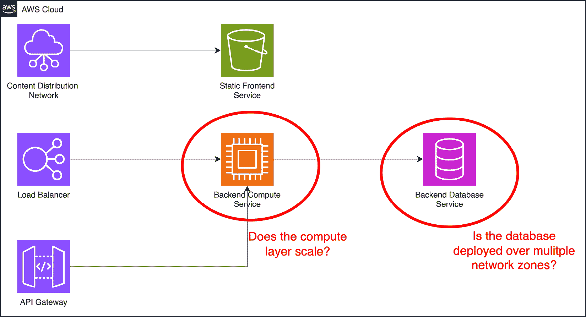

# 11

# 在不破坏它的情况下运行

在本章中，我们将探讨管理云环境所带来的操作挑战，以及如何保持系统平稳运行，不论发生什么。我们将涵盖从理解云服务商 SLA 到通过多区域部署、故障切换架构和自动化扩展构建弹性等各个方面。我们将深入讨论主动规划、冗余和自动化的重要性，以最小化停机时间并确保业务连续性。无论是准备应对云服务商的故障、更新运行手册和文档，还是适应成功云操作所需的文化转变，本章将为我们提供必要的策略和工具，帮助我们保持云基础设施的稳定与可靠。

我们将在以下主题中讨论这一点：

+   假设云计算只是“日常业务”

+   不足的灾难恢复和备份计划

+   过时的运行手册和文档

+   忽视文化转变

+   围绕 CSP SLA 进行开发

# 假设云计算只是“日常业务”

当企业迁移到云端时，常常忽视了随之而来的复杂性和陡峭的学习曲线。云操作需要与传统 IT 截然不同的技能组合，如果没有合适的规划，团队很容易陷入困境。

在本节中，我们将深入了解云计算采纳所带来的复杂性，并学习如何为即将到来的挑战做好团队准备。我们将深入探讨云基础设施、自动化、扩展性和成本管理的方方面面，以便进行规划并避免常见的陷阱。

## 理解云计算的复杂性

当我们做出迁移到云端的决策时，通常都有一个非常充分的理由。我们希望：

+   避免替换昂贵的本地遗留硬件

+   使我们的产品现代化，使用更先进的技术

+   利用不同技术中的灵活性

+   无限扩展我们的存储解决方案

+   拥有离线备份

这个清单既不全面也不局限，但无论出于何种原因决定迁移到云端，我们都可以预期将会有一个学习曲线。

当企业迁移到云端时，通常认为这只是一次常规的 IT 升级。但事实是，这完全是另一个全新的领域。我们来分析一些容易让团队措手不及的事情。

+   **基础设施即代码（IaC）**：在传统 IT 中，设置基础设施可能涉及到物理安装服务器或通过 UI 点击来配置资源。 在云中，我们可能要处理的是基础设施即代码（IaC）。 这意味着我们编写脚本——使用像 AWS CloudFormation、Terraform 或 Azure ARM 模板这样的工具——来定义整个环境。 如果我们的团队不习惯将基础设施视为可以像软件一样进行版本控制和管理的内容，那么我们就已经落后了。 IaC 提供的灵活性非常强大，但也要求开发人员和运维团队在同一页面上，理解每一行影响环境的代码。

+   **自动化和 CI/CD 流水线**：另一个经常被低估的领域是自动化和持续集成/持续部署（CI/CD）流水线的作用。 在云中，手动部署是不可扩展的。 我们需要能够自动构建、测试和部署应用程序的流水线。 没有自动化工作流经验的团队很快就会发现自己被手动流程淹没，面临延迟，并且在不同环境之间存在不一致的风险。 看似快速的部署，如果是手动操作，最终可能变成一个故障排除马拉松。

+   **多区域冗余和可扩展性**：云环境使我们能够在多个区域运行应用程序，即使一个位置发生故障也能确保正常运行。 但设置这一点并不像按一下开关那么简单。 它需要精心规划，并深刻理解我们的应用程序和数据如何在各个区域之间进行复制。 如果我们的团队没有经验或没有正确考虑设计问题，我们可能会在停机期间处于脆弱状态，数据不一致或难以恢复。

+   **成本管理**：云服务是按需付费的，这可能是双刃剑。 虽然我们不需要为硬件预先付款，但糟糕的资源管理可能迅速导致意外成本失控。 不习惯考虑成本优化的团队——比如在不需要时缩减非核心服务——可能会在月底时收到巨额账单。 这不仅仅是关于构建一个解决方案；而是要从一开始就构建一个具有成本效益的解决方案。

简而言之，云操作与传统 IT 相比是完全不同的。 如果我们的团队没有能力应对这种复杂性，我们就会陷入困境。 适当的规划、培训以及对可用工具的深刻理解不仅仅是“*锦上添花*”——如果我们想在云环境中取得成功，它们是至关重要的。

## 培训与技能提升

当一个企业计划迁移到云时，这并不像按一下开关那么简单。 我们需要一个覆盖所有内容的可靠计划，从技术层面到让整个组织都参与进来。 这是我们的做法：

1.  **从云准备性检查开始**：在我们深入实施之前，必须弄清楚我们目前的情况。云准备性检查的核心是了解当前的配置——哪些可以轻松迁移，哪些可能需要一些工作，潜在的成本和风险是什么。而且，不仅仅是 IT 部门应该参与。业务领导者需要理解这一举措如何影响他们的部门——运营、预算，一切。

    *示例*：当我们进行云准备性检查时，发现一些旧系统需要大幅重构，才能考虑迁移到云中。但另一方面，我们的数据库？它们几乎迫切需要提升和迁移，这从一开始就为我们节省了时间和金钱。

1.  **面向所有人的教育与培训**：在云计算方面，技能差距是一个现实问题。我们的 IT 员工确实需要获得云认证，但不要仅仅停留在此。财务、市场营销、风险团队，甚至法律团队都需要理解云计算对他们意味着什么——成本结构、合规性、安全性等等。投资工作坊、培训项目和外部顾问，确保每个人都在同一页面上。

    *示例*：我们不仅仅对 IT 进行了培训。财务部门学习了云计费的真正运作方式，并设置了警报，以避免月底的“意外惊喜”。同时，市场营销部门也接受了云合规性的速成课程，确保他们在我们的全新环境中不会因数据隐私问题而犯错。

1.  **设定明确、可衡量的目标**：我们需要知道为什么要做这个决策。是为了减少资本支出吗？提高可扩展性吗？改善灾难恢复计划吗？无论我们的目标是什么，都要确保它们是可衡量的，并与我们的业务优先事项对齐。这样，我们就能知道是否按计划进行，并且我们的团队也有了明确的目标。

    *示例*：我们的一个大目标？在一年内将基础设施成本减少 30%。我们确保它与业务相关，并且每个季度跟踪进展，确保云计算能有效地发挥作用。

1.  **构建一个稳固的迁移策略**：一旦我们确定了目标，就需要一个策略来规划如何实现这些目标。采取什么方法——提升迁移、重新平台化，还是其他什么？谁负责什么？我们选择单一云、多云还是混合云模型？这些都是决定迁移方式的关键。确保我们的策略考虑到供应商锁定、互操作性和安全性等因素。

    *示例*：我们的迁移策略并不是“一刀切”。我们从分阶段的方法开始，先将非关键应用进行提升和迁移，同时将核心服务重新平台化，以便利用云原生特性，如自动扩展。我们还通过规划多云策略来避免供应商锁定，保持对未来的关注。

1.  **沟通至关重要**：这不仅仅是一个 IT 项目——它是整个业务的转变。我们需要让每个人都了解情况。解释我们为什么要迁移到云端以及它将如何惠及业务。定期更新有助于避免抵制，并确保每个人都知道接下来会发生什么，以及它将如何影响他们。

    *例如*：每两周，我们都会进行公司范围的更新，解释迁移的进展以及接下来会发生什么。这种开放的对话有助于减少抵抗，并让每个人保持同步，避免惊讶，只有进展。

1.  **早期建立治理和合规性**：云端为我们提供了灵活性，但如果没有正确的治理，事情可能会失控。从一开始就设立政策，定义谁可以访问资源，数据如何处理，以及如何进行监控。尽早让我们的法律、合规和安全团队参与进来，以确保一切符合规定。

    *例如*：我们早早让法律团队参与进来，与 IT 团队并肩工作，制定访问政策，并确保数据处理符合客户要求的标准。定期的审计被纳入流程中，从而在扩展过程中将合规性内建。

1.  **测试一切**：在我们切换之前，确保我们已经测试了所有内容——性能、安全性、备份和恢复流程。运行试点或概念验证项目，在全面迁移前解决任何问题。这是我们发现潜在问题的机会，千万不要跳过。

    *例如*：在我们决定迁移面向客户的应用之前，我们将其与本地系统并行运行了一个月。这段时间让我们有机会解决一些延迟问题，并确保一切稳定后再切换用户。

1.  **迁移后的支持**：我们迁移了数据或应用后，工作并没有结束。我们需要为持续支持做好规划——监控、成本优化和故障排除。确保我们有团队或合作伙伴准备好处理日常的云管理工作，并保持一切顺利运行。

    *例如*：迁移后，我们有一支云运营团队准备就绪，负责监控和故障排除。自动化的成本预警系统被设置，以便捕捉到任何成本激增，且每周的回顾帮助我们保持检查，确保环境保持优化。

简而言之，迁移到云端不仅仅需要技术规划。更重要的是让整个业务都参与进来，设定明确的目标，并制定坚实的战略。如果我们全面覆盖各个方面，迁移将会顺利进行，避免未来的意外。

## 协作学习至关重要

总结来说，鼓励协作是弥合技能差距并保持团队敏锐的关键。组织内部培训，投资云认证，确保文档易于访问并且是最新的。当每个人共享知识并合作时，我们将避免由于孤立作业而产生的瓶颈和困惑。确保整个团队在同一理解下前进——这在长期来看将大有裨益。

在接下来的章节中，我们将讨论你的团队应该如何共同合作，制定适当的灾难恢复计划，并确保你的数据安全备份。

# 不足的灾难恢复和备份计划

**灾难恢复**（**DR**）通常在云操作中被推到次要位置，许多企业认为他们的云提供商会处理所有问题。但这是一个危险的假设。虽然云提供商提供了一些内建冗余，但灾难恢复的责任在于你。没有一个经过定期测试的可靠灾难恢复计划，我们就等于打开了大规模停机和潜在数据丢失的大门。我们不能只是希望云设置在故障后会自动恢复，我们需要一个清晰、经过测试的策略。

我们将讲解构建全面的灾难恢复和备份计划的关键组成部分，**恢复点目标**（**RPO**）与**恢复时间目标**（**RTO**）之间的关键区别，以及应对数据丢失、实例故障和可用区故障的策略。目标是确保我们的系统即使在出现问题时，也能更快地恢复并继续运行。

## 构建全面的备份计划

我们的灾难恢复（DR）策略不仅仅是一个可有可无的选项；它对于确保我们的业务在出现问题时继续运行至关重要。我们需要超越基本的备份，开始在多个区域构建冗余。使用像 AWS Elastic Disaster Recovery、Azure Site Recovery 或 GCP Backup & Restore 这样的云原生工具，确保如果一个区域发生故障，我们的服务能够无缝切换到另一个区域。考虑故障转移机制、自动扩展，以及我们如何尽快将关键系统恢复上线。

制定全面备份计划时需要考虑的因素有很多。

## RPO 与 RTO

首先，让我们从两个术语的定义开始：

+   **恢复点目标（RPO）**：这是在发生某种故障时我们能够承受的最大数据丢失量。问问自己：“*我的业务能承受多少数据丢失？*”。

    零售商店可能能够承受较高的 RPO。也就是说，在发生故障时，它们可以支持数据丢失回溯到前一天的营业结束时。

    另一方面，金融机构不能承受数据丢失，需要将 RPO 保持在尽可能低的水平，甚至在某些情况下为零。

+   **恢复时间目标（RTO）**：这是在恢复环境时所能容忍的最长时间。

    问问自己：“在发生故障时，我愿意失去多少业务？”实际上，我们并不希望失去任何业务，但在故障发生时，时间是一个关键因素。

    回顾我们上面的两个例子，一个零售商店可能在周一至周五，早上 9 点到下午 5 点营业，可能能够承受 24 到 48 小时（大约 2 天）的恢复时间目标（RTO）。毕竟，系统故障总是在周五下午发生，对吧？就在我们准备去度过一个轻松的周末时发生？开个玩笑，在我们的零售例子中，较大的 RTO 是可以接受的。

    另一方面，我们的金融机构需要一个非常低的 RTO，在某些情况下，甚至低于一小时。

我们可以通过许多方式来完善我们的 RPO 和 RTO 策略：

+   客户**服务水平协议**（**SLA**）/**服务水平目标**（**SLO**）

+   技术目标和约束

+   行业级别的合规性和监管要求

然而，仅仅根据这些因素之一来决定我们的灾难恢复计划并不可取。确保这三大因素都在协作的框架下进行考虑非常重要。

+   客户的 SLA / SLO 是由高层决定的，并由高管和销售代表写入合同。然而，如果技术目标没有对齐，这些协议就无法得到履行。

+   技术团队可以制定灾难恢复计划并配置备份计划，然而，没有明确的目标，这些措施是无法有效的。也许有些技术约束会限制技术团队交付正确结果的能力。

+   技术团队和高层管理团队还需要了解行业级别的要求，以防止遭受商业处罚或失去某些认证。

协作是构建全面、清晰、简明灾难恢复计划的关键。

## 灾难恢复策略

拥有灾难恢复（DR）计划只是战斗的一半，测试它才是实际工作的开始。我们不能仅仅设置好然后就忘记它。需要定期进行灾难恢复演练，模拟停机情况，看看我们的团队和基础设施如何响应。测试我们的备份，进行故障切换场景演练，确保一切按预期工作。现在发现问题总比在真正的灾难发生时才知道要好。如果我们的备份过时或损坏，那么当我们最需要它们时，将会迎来一个可怕的惊喜。

确保我们已经针对一些最常见的场景进行了计划和演练是非常重要的。测试灾难恢复策略对于确保我们的工作负载在出现问题时能够恢复至关重要。这不仅仅是拥有一个计划——它还关乎减少停机时间，并在问题发生时更快地恢复正常。请考虑以下三种主要场景，并在制定策略时，问问自己这个反问句：“*我该如何从中恢复？*”：

### 意外数据丢失

如果有人在数据库中删除了错误的表或生产环境中的客户记录损坏了，我们如何恢复数据？数据丢失不仅限于数据库。考虑亚马逊 S3、Azure BLOB 存储或 Google Cloud 存储中的对象存储。以及像亚马逊 EBS、Azure 磁盘存储或 Google 持久磁盘这样的服务器附加卷上的文件存储。

对于数据库，我们需要考虑一定程度的**时间点恢复**（**PITR**）。这可以帮助防止数据库上的意外、删除或写入，使我们能够恢复到特定时间点，精确到分钟级。PITR 使用数据库技术中的事务日志等数据库特性来实现这一点。

在我们的数据库上启用 PITR 可以将我们的 RPO 降低到尽可能小的范围，范围为 0 - 15 分钟，具体取决于数据库引擎的选择。

对于对象存储，防止数据的意外删除或写入具有简单而强大的设置。在对象存储上启用版本控制，并在删除对象时启用多因素身份验证，只是保护数据的两种方法。如果有人意外覆盖了我们对象的副本，我们可以恢复到之前的版本。这与数据库的 PITR 具有非常相似的效果，将我们对象存储的 RPO 降低到几乎为零。

块存储比对象或数据库更难保护。因为它是基于时间快照的块系统，我们只能使用最后一个时间快照中可用的内容。因此，建议将持久数据转移到托管共享数据服务，例如亚马逊 EFS 或 FSX、Azure Files 或 Google Cloud 文件存储。这些服务类似于附加到我们服务器的 NAS 设备，可以使用更精细的备份策略单独进行备份。块存储应仅用于短暂的应用程序。

### 实例丢失

在您的架构中，您可能有多个计算或数据库实例。本节适用于以下任何实例，但不限于：

+   亚马逊网络服务

    +   EC2 实例

    +   ECS 容器

    +   EKS 节点

    +   Lambda 函数

    +   RDS 实例

+   Microsoft Azure

    +   虚拟机

    +   Kubernetes 服务（AKS）

    +   容器实例（ACI）

    +   Azure 函数

    +   Azure 数据库

+   Google 云平台

    +   计算引擎实例

    +   Kubernetes 引擎（GKE）节点

    +   Cloud Run 容器

    +   云函数

    +   Google 云 SQL

考虑在我们的架构中，当这些项目中的任何一个关闭时会发生什么。

始终详细规划是个好主意。在图表中绘制架构，并开始考虑如果我们取出单一资源会发生什么。我们的架构会受到什么影响？我们是否有单一故障点？

图 11.1 - 检查单点故障的架构

对于大多数计算级服务，有几种简单而有效的方法可以防止实例丢失。

+   **负载均衡**: 通过在工作负载前面放置负载均衡器，我们可以利用许多功能来帮助保护我们的工作负载。

    +   将负载分配到多个实例上。

    +   SSL 卸载

    +   边缘级网络保护（WAF、DDoS 保护等）

    即使在单实例情况下，通过使用负载均衡器，我们也能将实例与直接的互联网流量隔离，应用层次化的保护。

+   **自动扩展组**: 如果我们的服务设计上是短暂的，那么将其放入自动扩展组可以大大帮助我们的灾难恢复工作。一个自动扩展组（由 Amazon EC2 自动扩展、Azure 虚拟机规模集、Google 计算引擎自动扩展器提供）可以在我们的实例负载过重时按需添加额外实例。它还可以在实例启动时监控其健康状况，并在认为实例不健康时，用新的实例替换它，提供一定的自动修复功能。

    像负载均衡器一样，即使在单实例环境中，使用自动扩展组也能提供必要的保护。

将这两项服务结合起来，可以提供一种策略，将我们的工作负载跨多个网络子网或可用区进行分配。

对于数据库实例，这应该不会太复杂。大多数托管数据库实例都可以进行保护：

+   **AWS RDS**: 使用多可用区（multi-AZ）配置，将我们的数据库自动复制到多个可用区，以实现高可用性和自动故障转移。

+   **Azure SQL 数据库**: 提供跨可用区的数据复制的区冗余配置，以确保弹性和高可用性。对于更复杂的配置，我们提供了地理复制和故障转移组功能，适用于 Azure SQL 托管实例以及 Azure MySQL/PostgreSQL 数据库。

+   **Google Cloud SQL**: 通过将我们的数据库跨区域内的多个可用区进行复制，提供高可用性配置。如果某个可用区出现故障，故障转移将自动启动。对于分布式工作负载，Cloud Spanner 和 Bigtable 提供了内建的跨可用区，甚至跨区域的复制，以实现全球弹性。

每个云服务提供商在多可用区和多区域设置方面有不同的方案，但目标是一样的：*即使遇到问题也能保持数据库运行*。

### 可用区故障

需要考虑的第三种也是最后一种情况是没有本地数据中心或提供商的重大故障。

全球云基础设施解读

**Amazon Web Services (AWS)**: AWS 有多个区域（Regions），这些区域是地理上独立的，每个区域都有多个可用区（AZ）。这些 AZ 是独立的数据中心，能为我们提供高可用性和冗余性。

**Google Cloud (GCP)**: GCP 采用与 AWS 类似的架构，拥有地理上独立的区域（Regions），在这些区域内部，我们有多个可用区（Zones），其作用与 AWS 的 AZ 相似。每个可用区都是一个独立的故障转移和冗余位置。

**Microsoft Azure**：Azure 与 AWS 和 GCP 一样，也有区域（Regions）和可用区（Availability Zones，AZs），以确保我们的工作负载保持弹性。但 Azure 还增加了称为可用性集（Availability Sets）的功能。这些功能帮助我们将虚拟机（VM）分布在数据中心内的不同硬件集群上，为我们提供额外的保护，以防局部故障。

在构建我们的架构时，我们需要考虑如何在不同位置之间分配工作负载。确保我们至少能够切换到另一个可用区（Zone / AZ）是非常重要的，某些服务在其功能集中已考虑到了这一点。

数据库服务允许进行多可用区（Multi-AZ）或冗余区配置。这意味着，如果某个可用区出现故障，我们的数据库将在最短的时间内进行故障转移。这是一个可选配置，通常会有成本影响，但成本是用来覆盖后台配置的额外实例，并且实时进行数据复制。在大多数情况下，这是一种透明的配置，一旦选择了该选项，它就会自动发生，通常我们容易理所当然地认为它是默认开启的，甚至可能会考虑禁用以节省成本。这就是我们不知道需要但有时会被充分利用的保险政策，因为有很多理由使用多可用区配置。

+   可用区的自动故障转移

+   通过先将配置应用于备用实例，再进行切换，减少配置更改期间的停机时间

+   通过从备用实例进行备份，避免对主节点性能的影响

其他可考虑的数据库选项可能是使用只读副本实例。这是我们有意配置并作为只读数据源使用的实例，适用于商业智能报告、备份，甚至可能是客户访问。这些副本实例在故障发生时可以提升为主节点，因此也有必要将我们的只读副本部署在另一个可用区。

对于计算实例类型，实例丢失中讨论的方法通常与可用区（AZ）/区域（Zone）故障时相同。只需确保我们将负载均衡器和扩展组配置为跨 2 个或更多可用区，这样可以确保它们高度可用，并且不会形成单点故障。

## 总结灾难恢复与备份

简而言之，灾难恢复是我们不能忽视的内容，它不能没有计划或未经过测试。这不仅仅是关于数据备份，还确保当发生故障时，我们的服务能够迅速且无缝地恢复。通过专注于覆盖 RPO、RTO 和多区域冗余的全面策略，我们将能够更好地应对任何突发灾难。

虽然灾难恢复计划很重要，但同样重要的是确保你在合适的时间为团队提供最新的运行手册和文档。我们将在下一节中详细讨论这一点。

# 过时的运行手册和文档

云环境以惊人的速度发展。基础设施发生变化，新增服务，实时扩展，安全更新频繁推出。在如此多的变动中，文档和操作手册容易过时。一旦发生这种情况，我们就会打开通向运营低效、沟通不畅和关键时刻发生错误的大门。过时的文档会导致团队在故障排除时走错路，浪费时间，甚至可能造成更大的问题。保持操作手册和文档的更新，对于维持顺畅的运营至关重要，确保在问题出现时每个人都能达成共识。

通过这一部分，我们将回顾一些最佳实践，以确保通过关注我们的文档和操作手册来保持最大运营效率。我们将回顾这一概念，并提出一些实际步骤，帮助我们保持文档的完整。

## 维护更新的文档

文档不是我们写完就忘记的东西，它是一个需要定期维护的活文档。随着基础设施的变化，无论是新部署、扩展，还是架构变化，我们的操作手册和文档应立即反映这些更新。当文档与当前环境不同步时，团队更容易遵循过时的程序，这可能导致响应时间缓慢，或者更糟，发生操作失败。

管理此过程的最佳方法之一是建立文档审查计划，直接与关键操作事件挂钩。在每次重大基础设施更新后，团队应审查相关的操作手册和技术文档，确保它们与当前的设置一致。这个审查过程可以融入变更管理程序，确保我们的基础设施更新自动触发文档审查。这是关于建立持续审查和对齐的习惯，以避免将来出现混乱。

另一种更具互动性的方法是通过“游戏日”来确保文档的质量。这可以被视为一种桌面演习，甚至是通过虚拟场景在安全的环境中进行的模拟。*第八章*对此有更详细的描述。

重要说明

实施 ISO 9001 可以极大地提高在云环境中保持操作手册、标准操作程序（SOP）和文档最新的过程。通过关注文档控制、定期审查和通过计划-执行-检查-行动（PDCA）循环进行持续改进，ISO 9001 确保了一致性和问责制。它强调基于风险的思维和审计，有助于减少过时文档的风险，并与 AWS CloudFormation 和 Azure ARM 模板等自动化工具协同工作，以简化更新并保持准确性。

ISO 9001 是质量管理体系（QMS）的国际标准。它为组织提供了一个框架，确保其流程始终符合客户和监管要求。ISO 9001 侧重于提高效率和保持高质量标准，强调客户导向、领导力、基于风险的思维、持续改进和文档控制等原则，使其成为确保各行业可靠、可重复结果的宝贵工具。

## 自动化文档

手动更新文档？那是通往灾难的快速通道。在快速变化的云环境中，手动更新根本无法满足需求。当有人来处理一个紧急事件时，他们需要在修复可能让问题更糟的地方之前，了解当前架构为何处于这种状态。这时，自动化工具发挥了作用。像 AWS CloudFormation、Azure ARM 模板和 GCP 部署管理器等工具可以自动将我们的文档与基础设施变更保持同步，减少人为错误，确保我们始终在使用最新的信息。

以 AWS CloudFormation 为例。当我们使用 CloudFormation 模板管理基础设施时，这些模板本身就作为文档的一种形式，准确展示了我们的资源配置情况。同样，Azure ARM 模板和 GCP 部署管理器也具有相同的功能。这些工具生成实时的基础设施更新，通过使用它们，我们确保文档永远不会滞后。

自动化文档也减少了手动更新时出现的人为错误。随着我们的云基础设施日益复杂，手动跟踪每个变更变得难以管理。自动化工具帮助我们简化这个过程，确保文档准确、最新，并与当前基础设施保持一致。

## 标准操作程序（SOP）

我们的**标准操作程序**（**SOP**）对于保持云环境高效运行至关重要，但它们只有在保持相关性时才有价值。像运行手册一样，SOP 不应该一写了之，而是需要随基础设施和工作流程的变化不断演进。在云环境中，架构或服务的快速变化可能使旧有的程序变得过时，这一点尤其重要。

定期审查标准操作程序（SOP）至关重要。每当我们的云架构发生变化，无论是部署新服务还是进行扩展调整，我们都应该重新审视 SOP，以确保它们仍然适用。当我们管理较小的基础设施时有效的程序，在扩展后可能不再适用。定期审查和更新 SOP 能确保我们的团队始终使用最当前的信息，快速高效地执行任务。

此外，在更新 SOP 时，务必包含从事故或停机事件中学到的任何经验教训。如果因程序缺口或疏忽导致故障发生，请更新我们的 SOP 以防止类似问题的再次发生。SOP 不仅仅是处理日常操作，它们反映了我们组织持续改进的过程。

重要提示

AWS Well-Architected 框架源自一次大规模停机事件的经验教训，当时早期的云计算采用者在设计具有弹性和可扩展架构时面临重大挑战。

AWS Well-Architected 框架由一系列文档化的最佳实践（或 SOP）构成，帮助我们最大化云架构的效益。

让我们更实际地看待这个问题。

## 实际操作中的文档和操作手册

所以，我们讨论了关于文档和 SOP 的常见原则，但我们可以采取哪些实际步骤来确保遵循文档最佳实践？我们可以遵循哪些技术指南？

+   实现基础设施即代码（IaC）

    +   **工具**：使用 AWS CloudFormation、Azure ARM 模板和 Google Cloud 部署管理器等工具，将我们的基础设施定义和管理为代码。这些工具会自动创建模板，作为我们环境的实时文档。

    +   **版本控制**：将这些模板存储在 Git 等版本控制系统中，以跟踪所有基础设施更改，便于必要时进行回滚，并提供准确的变更记录。

    +   **好处**：基础设施即代码确保我们的文档与当前的基础设施状态保持一致，避免了手动更新的需求。

+   自动化文档更新

    +   **工具**：集成 Terraform Cloud 或 CloudFormation Drift Detection 等工具，自动检测基础设施的变化并实时更新文档。

    +   **脚本**：设置自动化脚本，从基础设施中提取更改并在 Confluence 或 SharePoint 等平台上更新文档。

    +   **好处**：自动化确保我们的文档始终保持最新，而无需依赖手动流程，减少过时信息导致错误的可能性。

+   使用监控和警报系统

    +   **工具**：利用 AWS CloudWatch、Azure Monitor 或 Google Cloud Operations Suite 来监控基础设施的健康状况和变化。

    +   **自动化**：当基础设施发生变化或检测到警报时，自动触发文档审核。这可以与我们的 IT 服务管理（ITSM）工具（如 ServiceNow 或 Jira）集成。

    +   **好处**：持续监控确保团队及时了解基础设施中的关键变化，提供主动更新文档或标准操作程序（SOP）的机会。

+   集中式知识管理

    +   **工具**：实施集中式文档工具，如 Confluence、Notion 或 Azure DevOps Wiki，将所有操作手册、SOP 和技术文档存储并组织在一个地方。

    +   **可搜索的数据库**：确保所有文档都易于搜索并且团队能够轻松访问。

    +   **好处**：集中管理文档确保所有团队都能参考相同的最新信息，这样可以减少操作中的混乱和沟通不畅。

+   将文档嵌入到变更管理中

    +   **变更管理**：确保每次基础设施变更都包含相关文档的审查，这样更新成为变更过程的一部分。这也有助于确保没有偏离原始设计的意图。

    +   **责任划分**：指定具体团队成员负责文档更新，以形成问责制。

    +   **好处**：将文档嵌入到变更管理中，确保每次变更都伴随必要的运行手册和 SOP 更新，从而避免基础设施和文档之间的不同步。

保持运行手册、文档和标准操作程序（SOP）最新，不仅仅是遵循最佳实践。这关乎避免代价高昂的错误、减少停机时间，并确保我们的团队在问题发生时能够有效地实时响应。在云环境中，随着变化迅速，过时的文档就像一颗定时炸弹，可能导致响应缓慢、混乱，甚至无法解决关键问题。

通过定期审查并自动化更新我们的文档，我们不仅在提高运营效率，还确保我们的团队在最需要的时候能够快速访问正确的信息。这是对韧性、敏捷性和长期云成功的投资。

随着向云端转型，运行手册和文档应当成为你文化的一部分，忽视这一点可能会对你的云采纳工作造成毁灭性影响。我们将在下一节讨论文化转型的问题。

# 忽视文化转型

在云端运营不仅仅是采纳闪亮的新技术——更是让团队以全新的方式共同工作。许多组织匆忙投入云项目，认为一切都围绕工具，但真正的挑战在于改变团队协作的方式。如果我们没有鼓励跨职能的团队合作，我们的云战略很快就会碰壁。云成功不仅依赖于基础设施，还依赖于团队如何互动、共享知识以及将他们的努力对准共同目标。

在本节中，我们将清晰地理解为什么协作对于云的成功至关重要。我们将了解如何打破信息孤岛，促使开发、运维和安全团队合作，从而避免错误并加快工作进度。我们还将深入探讨为什么跨职能团队和 DevSecOps 思维对提高效率和安全性至关重要。此外，我们还将讨论知识共享的重要性，以及在云环境逐步发展的过程中，如何确保每个人都保持同步。最后，我们将探讨如何管理对变革的抵制，确保我们向云转型的过程顺利而有效。

## 鼓励协作

云环境在团队之间沟通时能够蓬勃发展。在传统 IT 设置中，开发、运维和安全常常各自为政。开发人员推动代码，运维负责基础设施，安全团队则关注漏洞——每个团队都处在自己的“气泡”中。但在云环境中，我们不能承受这种分隔。开发、运维和安全必须始终保持同步。要打通沟通渠道，确保这些团队从一开始就紧密合作。

为什么这如此重要？云环境是动态的，变化迅速。代码部署更快，资源扩展或收缩，安全威胁不断演化。如果我们的团队没有协作，一个团队的变动可能会无意中对另一个团队造成问题。开发人员可能会引入新代码，从而无意中削弱安全性。运维团队可能在不知情的情况下推出变更，导致整体基础设施受到影响。当团队之间相互孤立时，这些变更可能会漏网，导致效率低下、停机，甚至更严重的安全漏洞。

协作不仅仅是“锦上添花”。它是有效云操作的支柱。团队需要打破障碍，作为一个整体围绕共同目标工作。促进这种协作的最有效方式之一是定期检查、跨团队会议和协作式问题解决会话。通过建立这些开放的沟通渠道，我们为团队提供了早期讨论问题、分享知识、并在问题成为大麻烦之前发现它们的空间。

## 打破信息孤岛

组织内部的信息孤岛是协作的主要障碍。在传统的 IT 环境中，团队通常有着严格定义的角色和职责。开发团队专注于编写代码，运维团队负责基础设施的部署和维护，安全团队则监控威胁和漏洞。虽然这种劳动分工在传统本地基础设施时代是合理的，但它与云环境的灵活性和速度并不匹配。

在云环境中，我们需要每个人在项目的整个生命周期中通力合作。开发团队不能仅仅把代码丢给运维然后就走开。安全团队不能等到最后才参与进来。云环境需要持续的协调。云所提供的灵活性和规模是很棒的，但它们也增加了复杂性——而复杂性带来了风险。孤立的部门只会加剧这些风险，因为它们导致了沟通不畅、工作流程割裂以及重复劳动。

那么，如何打破这些孤岛呢？从培养 DevSecOps 文化开始，让开发、安全和运维从第一天起就共同协作。这里的关键是共享责任。每个团队都应该理解他们的工作如何影响更广泛的系统，并且如何为共同目标作出贡献。我们还可以实施更正式的流程，例如集成的项目管理系统和定期的跨职能团队会议。打破孤岛需要时间，但一旦团队开始更紧密地协作，我们将看到更少的瓶颈、更快的问题解决，以及更加顺畅的云操作。

回顾一下 - 康威定律

在我们深入打破孤岛并推动团队间更多合作的同时，值得时刻记住康威定律（我们在第一章中已经讨论过）。这个观点提醒我们，团队间的沟通方式将直接影响系统的最终结果。如果我们没有作为一个整体协同工作，那么我们的云架构就会反映出这些沟通上的漏洞。因此，让开发、运维和安全团队保持一致，不仅仅是锦上添花，而是构建真正具有弹性系统的必要条件。

## 跨职能团队

创建跨职能团队是推动云操作中合作的最有效方式之一。这些团队将开发、运维和安全的成员聚集在一起，确保项目从一开始就涵盖所有方面。再也不需要等到最后一刻才让安全团队介入漏洞评估，或者等运维团队搞清楚如何扩展新的部署。从第一天起，每个人都参与其中，这促使了更好的对齐、更快的决策制定，以及更少的意外情况。

跨职能团队不仅仅是为了更快地完成任务——它们更重要的是提升工作质量。每个团队成员都带来了他们独特的专业知识，通过共同合作，他们能够更全面地解决挑战。例如，开发人员了解代码，但他们可能不了解基础设施的限制；运维人员知道如何扩展，但他们可能不了解某些配置的安全影响；安全人员了解漏洞，但可能不了解最新的开发框架。通过将这些不同的视角结合起来，我们可以打造一个更加弹性和全面的云操作。

这种方法还培养了 DevSecOps 思维，这是云成功的关键。DevSecOps 注重持续集成和持续交付（CI/CD），开发与运维携手合作，自动化并简化部署过程。这种思维方式消除了开发与部署之间的摩擦，使更新发布变得更加轻松，并减少了停机时间。安全性需要从一开始就融入到这个过程中，因此，DevSecOps 方法—将安全性融入开发和运维—对于保护我们的云环境至关重要。

## 知识共享

云技术始终在发展，要跟上变化，感觉像是一场永无止境的竞赛。如果我们的团队不共享知识，我们很快就会落后。每一个新工具、每一次基础设施的更新和每一个安全威胁，都需要所有相关人员了解。这就是知识共享的意义所在。

仅靠一个人或一个团队成为专家是不够的。信息需要在团队之间自由流动，以确保每个人都能及时了解发生了什么。这可以通过正式渠道如培训课程来实现，但更有效的方法是创建一种非正式知识共享的文化。定期的团队会议，可以让人们讨论他们面临的挑战、发现的新工具或他们学到的经验教训，这些都非常宝贵。

云计算是复杂的，没人能知道所有的事情。但通过鼓励团队分享所知道的，我们可以建立更强大、更有凝聚力的运作。当一个团队学到新知识时，确保他们将这些知识传递给其他团队。这不仅有助于团队的成长，还能确保知识孤岛的形成。我们团队分享得越多，云运作就会变得越具韧性。

## 推广 DevSecOps 思维

DevSecOps 思维注重打破开发和运维之间的障碍。在传统的 IT 架构中，这两个团队往往孤立工作，这可能导致延迟、沟通不畅和效率低下。然而，在云环境中，开发和运维需要持续合作。这种方法促进了协作，提高了效率，并且允许更快速、更可靠的部署。

在 DevSecOps 的世界里，开发人员不仅仅是编写代码并交给运维—他们还负责代码在生产环境中的表现。运维人员也不只是维持基础设施—他们参与开发过程，确保一旦部署，系统能够平稳运行。这种共同的责任有助于及早发现问题，并确保整个团队在项目目标上达成一致。

自动化在这里发挥着巨大的作用。通过自动化重复性任务——如测试、部署和监控——我们可以解放我们的团队，使其能够专注于更高层次的问题。自动化还减少了人为错误的风险，这在快速变化的云环境中至关重要。当一切都被自动化时，我们可以更快地行动，更频繁地部署更新，而不必担心遗漏任何细节。

## 克服对变革的抵制

即使我们知道协作至关重要，实施起来也并不总是容易的。习惯于孤立工作的团队可能会抵制转向协作。他们可能觉得这会增加工作量，或者他们的专业知识得不到尊重。这种抵制是自然的，但如果我们的云战略要成功，就需要解决这个问题。

要克服对变革的抵制，我们需要的不仅仅是空话——我们需要实时展示变革的好处。做到这一点的最有效方式之一就是推出一个试点项目。试点项目让我们在较小的范围内测试水域，同时向大家展示跨职能团队如何推动实际结果。通过选择一个关键项目，我们从第一天起就将开发、运营和安全团队聚集在一起，打破孤岛，展示协作如何带来更快的部署和更少的麻烦。

随着我们看到问题解决速度的提升和操作的顺畅，获得组织其他成员的支持变得更加容易。试点项目的魅力在于它具有低风险但高影响——为我们提供了所需的证据，证明协作不仅更高效，而且对于构建韧性系统至关重要。一旦试点成功，我们就可以将这种方法扩展到更多团队，使协作成为新的标准。

领导力在这里也扮演着关键角色。领导者需要为协作定下基调，表明它不仅仅是一个短暂的趋势，而是组织运作的一个重要部分。他们需要鼓励开放的沟通，提供必要的工具和支持，并在团队适应新的工作方式时保持耐心。文化转型不是一蹴而就的，但通过正确的方法，它可以改变我们团队的工作方式。

忽视文化转型是迁移到云端时组织可能犯下的最大错误之一。仅仅拥有合适的工具是不够的，我们需要我们的团队无缝协作，才能在云端取得成功。协作、跨职能团队、持续学习和 DevSecOps 思维方式对于构建韧性的云端运营至关重要。打破孤岛，促进沟通，并确保每个人在相同目标上保持一致。只有这样，我们才能释放云计算的真正潜力，确保长期成功。

当我们接近本章的结束时，我们最后要看看云服务提供商的服务水平协议的陷阱和误解，以及为什么它们不应该成为我们依赖的首要工具。

# 围绕 CSP SLA 进行开发

**云服务提供商**（**CSP**）的 SLA 可能承诺高可用性，但仅仅依赖这些保证可能让我们变得脆弱。开发超越 SLA 提供的弹性架构对于维持正常运行时间和确保业务连续性至关重要。

本节将深入探讨为什么仅仅依赖云服务提供商 SLA 对于实现真正的韧性是不够的。我们将分析如何通过多区域部署、故障转移系统和负载均衡来构建冗余，以保持一切平稳运行，即使提供商遇到问题。我们将学习如何通过多云策略、第三方冗余和异地备份来保护我们的系统，确保数据安全并保持业务运转。最后，我们将探讨如何通过自动化故障转移、负载均衡和自动扩展来提高效率，减少停机时间，并在不依赖人工修复的情况下保持基础设施的响应能力。

什么是 CSP SLA？

**云服务提供商**（**CSP**）SLA 本质上是我们与云服务提供商之间的合同，列出了我们可以期待其服务在性能、可用性和正常运行时间方面的表现。这是提供商告诉我们：“这是我们保证的内容”，但合同中通常包含大量细则。这些协议通常涵盖正常运行时间保证，比如 99.9%的可用性，并界定了提供商的责任范围。理解 SLA 中的具体内容非常重要，因为任何超出这些范围的部分将由我们来负责，而不是他们。因此，如果出现问题，我们需要知道它们的责任与我们需要承担的责任之间的界限。

## 超越 SLA 构建冗余

仅仅依赖我们的云服务提供商（CSP）SLA 是不够的，如果我们想要真正的韧性。没错，他们承诺高可用性，但即便是 99.9%的正常运行时间保证，实际上每年依然可能会有超过八小时的停机时间。对于关键任务系统，我们不能只依赖这个。我们需要在云服务提供商的保证基础上，构建我们自己的冗余层。这意味着我们需要准备备份计划，以应对那些不可避免的问题，因为问题不是发生与否，而是何时发生。冗余确保我们的系统保持运行，即便云服务提供商的服务没有达到他们的承诺。

以下是我们如何构建真正的冗余并确保我们的系统保持运行，即使在云服务提供商的 SLA 未能兑现时：

+   **跨多个可用区部署**：首先将我们的资源分布在同一区域内的多个可用区。这可以保护我们免受区域级故障的影响，比如硬件问题或局部停机。

+   **跨多个区域部署**：更进一步，通过跨多个区域进行部署。如果某个区域出现故障，我们的服务可以自动故障转移到另一个区域，确保我们的全球业务平稳运行。

+   **设置故障转移架构**：实现像热备或冷备的故障转移系统。这些系统在发生故障时会自动启动，从而避免我们浪费宝贵的时间手动修复问题。

+   **使用负载均衡器**：通过负载均衡器将流量分配到多个实例上，避免任何单个服务器超负荷。如果某个实例出现故障，负载均衡器会将流量转移到健康的实例上，保持服务的可用性。

+   **实施自动扩展**：使用自动扩展确保我们始终拥有足够的资源。当需求激增或系统发生故障时，自动扩展机制会自动增加实例或资源，确保系统稳定运行。

+   **利用备份保护关键数据**：定期备份数据，并将备份存储在不同的区域。如果主存储发生故障或数据损坏，我们可以迅速从其他位置恢复数据，而不会丢失重要信息。

+   **主动监控与告警**：使用像 CloudWatch 或 Azure Monitor 这样的工具来监控系统。设置告警以便在问题发生时立刻通知我们，从而提高响应速度。

+   **测试故障转移和冗余计划**：定期测试故障转移和冗余设置。不要等到实际停机发生时才验证系统是否有效，进行演练确保在故障发生时一切如预期工作。

在构建可靠的云系统时，我们不能仅仅依赖服务提供商的 SLA 并期望一切顺利。真正的弹性意味着我们要加设自己的冗余，部署多个可用区，设置故障转移系统，并确保我们的基础设施能够应对故障而不间断运行。通过采取这些实际措施，例如负载均衡、自动扩展、多区域部署等，我们不仅仅是在应对问题，而是在主动构建一个能够承受问题的架构。关键在于预测故障，并在故障发生前做好准备。这就是我们如何确保云环境始终平稳运行的方式，无论发生什么。

## 准备应对服务提供商停机

即使是最大的云服务提供商，也难免会遇到停机问题，而当这种情况发生时，我们不想被措手不及。准备停机并不是等待问题发生，而是构建一种能够应对故障并持续运行的架构。这就是多云架构、第三方冗余和异地备份发挥作用的地方。这些策略有助于确保，当我们的服务提供商遇到停机时，我们的业务不会受到影响。

### 多云架构

仅依赖一个云服务提供商虽然方便，但在需要高可用性条件的情况下，有时会被视为风险。采用多云架构时，我们将资源分布在多个云服务提供商之间，比如 AWS、Azure 和 GCP。如果一个供应商出现故障，其他供应商可以接管，保持我们的服务在线。关键在于不仅仅是将一切复制到不同的云中，而是要设计云无关的应用程序，这样它们就可以在任何可用平台上平稳运行。这并不是“一刀切”的方法，但对于关键任务服务来说，这是我们无法忽视的保障。

多云技术

在考虑采用多云架构时，我们需要考虑构建在不会被供应商锁定的框架和技术上，比如：

计算：Terraform/OpenToFu，Docker，Kubernetes

监控：Grafana，Prometheus，ELK Stack

Devops：Github actions，Gitlab，Jenkins

身份认证：Auth0，Okta

大多数数据库技术在云提供商之间是可迁移的，尤其是那些使用更开放标准的数据库，如 MySQL 和 PostgreSQL，这些数据库不受许可证限制。

### 第三方冗余

保护免受供应商停机的另一种方式是集成第三方冗余。这意味着使用外部服务或供应商来备份关键功能。例如，如果我们的主要云服务提供商管理数据库，可以考虑使用第三方服务来处理备份或关键基础设施部分。这样，即使供应商发生故障，数据仍然可以安全访问。目标是减少对任何单一供应商的依赖，以便从多个角度保障所有关键操作。

### 异地备份于其他云 / 混合解决方案

为了获得最终的安心，超越仅依赖一个云服务供应商，评估在另一个云或混合解决方案中实施异地备份的可行性。这是最后一道防线，将数据或重要资源存储在完全不同的环境中。通过将备份保存在不同的云提供商或甚至本地设施中，我们确保如果主要供应商发生重大故障或丢失，我们的数据和系统仍然可以从其他位置恢复。混合解决方案也可以在这里发挥作用，提供本地和云资源的混合使用。

关键要点是什么？永远不要依赖一个供应商来维持一切运行。通过实施多云策略，集成第三方冗余，并保持异地备份，我们正在为云可用性中不可避免的波动做准备。这样，当供应商出现停机时，我们的系统就不会受到影响。

### 权衡取舍

与任何解决方案或策略一样，运行高可用的多云架构也有一些优缺点：

| **优点** | **缺点** |
| --- | --- |
| 提高弹性和可用性通过利用多个云供应商，我们降低了停机的风险，因为一个供应商的故障可以通过另一个供应商的资源来缓解。 | 增加的复杂性跨多个供应商管理工作负载增加了复杂性，尤其是在架构、监控和安全方面。 |
| 避免供应商锁定使用多个云平台可以防止我们过度依赖单一供应商，从而提供更多灵活性以切换服务或谈判定价。 | 更高的学习曲线团队需要熟练掌握多个云平台，这意味着需要额外的培训和专业知识。 |
| 优化性能我们可以根据每个平台的优势选择最适合特定任务的供应商，优化速度、延迟或其他性能指标。 | 挑战性集成集成不同平台之间的服务并确保无缝通信可能是困难的，尤其是在使用不兼容的云原生工具时。 |
| 成本管理不同的供应商可能会提供针对特定服务的更具竞争力的定价，使我们能够通过根据定价模型分配工作负载来优化成本。 | 更高的运营成本虽然多云可以在某些领域减少成本，但增加的复杂性会提高运营开销，要求更多的工具、人员和管理。 |
| 合规性和地理灵活性多云使我们能够通过在多个地理位置和供应商之间分配数据和服务，满足区域合规要求。 | 延迟和性能波动在多个云中运行应用程序可能会引入延迟或性能问题，尤其是当来自不同供应商的服务需要实时通信时。 |

表 11.1 - 高可用多云架构的优缺点

真实案例

例如，一家受严格监管的澳大利亚金融机构尝试将其架构平衡在两个云供应商之间，结果成本是单一云环境的 10.4 倍，并且还造成了延迟问题，影响了其 RPO 和 RTO。

在这些情况下，评估权衡是非常重要的。

## 弹性自动化

云中的弹性不仅仅是为最坏的情况做准备，它还包括自动化关键流程，以便我们的系统能够预防潜在问题。通过将故障切换、负载均衡和自动伸缩集成到我们的架构中，我们确保服务在无需人工干预的情况下持续运行。以下是我们如何将自动化与智能架构选择结合起来，以构建一个真正有弹性的云环境。

### 自动化故障切换

当服务或实例出现故障时，我们最不想做的就是慌乱寻找解决办法。自动化故障切换可以让流量无缝重定向，最小化停机时间并保持系统平稳运行。

+   **健康检查用于主动监控**：AWS Route 53 健康检查、Azure Traffic Manager 和 Google Cloud Load Balancer 等服务持续监控关键端点的健康状态。

    这些工具能检测服务是否宕机，并自动将流量重定向到健康实例。这种即时故障切换意味着服务不会中断，而人工干预是无法保证这一点的。

    我们应该为所有关键任务服务设置健康检查。例如，在 AWS 中配置 Route 53，当主实例失败时将流量重定向到备份实例。定期测试这些检查可以确保它们按预期工作。

+   **自动化 DNS 故障切换**：利用 DNS 故障切换可以确保在出现问题时，流量会自动切换到备份区域或资源。

    自动故障切换确保即使整个区域离线，流量仍然能够流动。与其在故障期间手动切换 DNS 记录，自动化可以立即重定向流量。

    设置 DNS 故障切换策略，当需要时将流量切换到备份资源。在 AWS 中，我们可以配置 Route 53 中的加权路由策略，将流量均匀分配到主资源和次要资源之间。

### 负载均衡与自动扩展

自动平衡流量和自动扩展资源对于防止过载并在需求激增时维持性能至关重要。让我们逐一分析每个选项：

+   **负载均衡用于无缝流量分配**：负载均衡器，如 AWS 中的 Elastic Load Balancing (ELB)、Azure Load Balancer 和 Google Cloud Load Balancer，将流量分配到多个实例，确保没有单个实例被压垮。

    通过分配流量，负载均衡器即使在高流量时期也能确保系统平稳运行。它们防止瓶颈，确保通过将请求路由到健康实例来提高可用性。

    我们应该在云架构中实现负载均衡器。例如，在 AWS 中配置 ELB 将流量分配到多个可用区。这样，如果某个实例宕机，流量会自动路由到另一个实例。

+   **自动扩展用于动态资源管理**：自动扩展确保资源根据需求进行调整，在流量高峰时扩展，安静时缩减。

    自动扩展优化了性能和成本效益。当需求增加时，它会自动添加资源以处理负载。当需求减少时，它会缩减以避免不必要的成本。

    根据流量或资源阈值设置自动扩展规则。在 AWS 中，当 CPU 使用率超过某个百分比时，配置 Auto Scaling Groups 来增加实例。定期审查这些阈值确保它们与我们的实际需求相符。

### 为什么自动化对弹性至关重要

自动化为我们提供了前瞻性优势。通过提前设置故障切换和自动扩展，我们确保系统能够立即响应问题，最大程度地减少停机时间。

自动化系统能够检测问题并立即重新分配流量或扩展资源。这不仅减少了人为错误的风险，还确保响应时间比任何人工修复都要快。

自动扩展通过只使用所需资源来帮助管理成本，而负载均衡通过均匀分配流量来防止性能问题。

通过自动化故障转移、负载均衡和自动扩展，我们构建了一个具有弹性的云架构，能够实时应对挑战。主动监控、自动流量分配和动态资源管理的结合，确保我们的系统无论发生什么，都能保持响应和高效。

# 总结

在本章中，我们深入探讨了管理云环境的操作挑战，学习了如何在压力下保持系统平稳运行。我们涵盖了从拆解云服务提供商的服务水平协议（SLA）到通过多区域部署、故障转移设置和自动扩展来构建弹性的一切内容。我们还讨论了主动规划、冗余和自动化在减少停机时间和保持业务运转方面的价值。过程中，我们探索了如何应对服务提供商的故障、保持文档更新以及适应云操作所需的文化变革。现在，我们已经具备了保持云基础设施弹性和可靠性的策略和工具。

在下一章，我们将探讨从本地架构迁移到云端的策略，甚至是从一个云服务提供商迁移到另一个云服务提供商的过程，以及未以云原生方式处理云安全所带来的风险。
