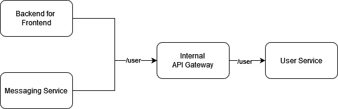
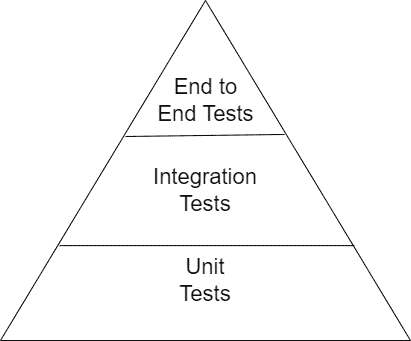
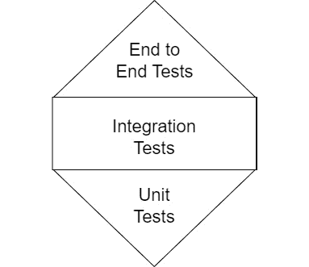
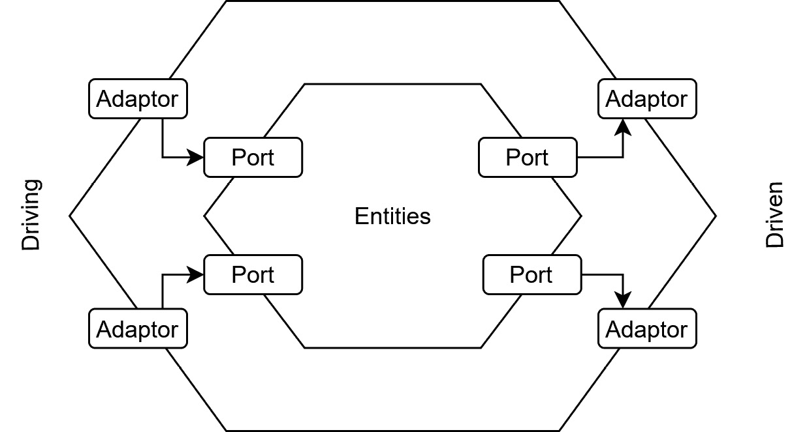

# 第十三章：你怎么知道一切都能正常工作？

测试我们的代码是确保我们的更改既符合预期功能，又不会回归已有功能的方式。在云原生环境中，我们的复杂性越来越多地存在于超出我们代码范围的区域，因此以有意义的方式测试我们的应用程序变得复杂。让我们探讨如何以既高效又有意义的方式测试云原生代码，同时避免一些常见的反模式。

在本章中，我们将讨论以下主要内容：

+   常见的测试反模式

+   缺乏契约测试

+   手动测试

+   试图重现云环境

+   结构不良的代码

# 常见的测试反模式

在我们探讨云原生应用程序中常用的测试类型之前，我们首先需要了解一些我们必须避免的常见测试反模式。这些反模式通常是由于应用程序的测试策略在迁移到云端时演变而来。虽然大多数这些反模式适用于单元测试，但在测试其他模式时，也需要注意它们。

首先，我们将看看一些测试反模式，以及它们如何在云原生环境中显现。我们将探讨的具体反模式如下：

+   从未失败的测试

+   覆盖率徽章测试

+   测试实现细节

+   间歇性失败的测试

+   具有副作用的测试或耦合测试

+   多阶段测试

## 从未失败的测试

当我们考虑测试时，可能会认为从未失败的测试是好的。这意味着我们的代码和更改一直符合我们的预期行为，对吧？如果没有失败的测试，我们怎么能确保当合同被违反时，测试会失败呢？

为了说明这种情况，我将用我在之前角色中与一些团队的经验。那些团队刚刚完成了功能的编写，并且正在编写测试。他们在一个基于 Node.js 的异步代码库中工作，而 Node.js 中异步编程的一个特点是，当调用一个异步函数并且其中包含异步代码时，如果在测试中的函数调用上没有顶层的 `await`，测试将在异步代码执行之前退出。这意味着异步代码中的任何断言都只会在测试后抛出错误，因为在测试执行过程中没有抛出断言，所以测试通过。从一个未经训练的角度看，测试似乎验证了预期的功能。然而，实际上，测试是无效的。毫不奇怪，当我们加入了一些 `async` 和 `await` 的语法糖后，许多测试开始失败。

在这个例子中，缺乏对异步编程原则的理解导致了功能上无用的测试，这些测试给人一种一切正常的假象。

这种反模式在云计算中很容易陷入。随着系统变得异步、解耦并最终一致，我们的测试策略必须与系统的复杂性相匹配。你会注意到，如果团队遵循了**测试驱动开发**（**TDD**），整个情况是可以避免的。我喜欢使用的常见 TDD 方法是*红色*、*绿色*和*重构*：

+   **红色**：首先，创建支持你测试所需的最小结构。这可能是一个空的函数块、方法或对象。其次，编写你认为能够测试期望行为的测试（或多个测试）。当你运行测试时，它们应该失败，显示为红色。

+   **绿色**：用逻辑填充你的空占位符，使你的测试通过，显示为绿色。

+   **重构**：创建新的测试和功能来处理边缘情况。在这些情况下，最好创建正面和负面测试用例，并故意打破测试几次，以确保它按预期行为。

在云原生世界中，这些测试通常是我们自动化集成管道的一部分，例如 AWS CodePipeline、GCP Cloud Build 或 Azure DevOps Pipelines。

## 覆盖率徽章测试

另一个常见的反模式是，`200` 状态码可能给你带来很好的测试覆盖率，但这算是一个好的测试吗？数据的语义结构呢？输出是否与预期输入匹配？在这种情况下，端点的行为完全没有经过测试。我们没有确保任何未来的更改不会导致意外的行为，只保证它们会返回 `200` 状态码。

激励孤立的代码覆盖率并不会增加你对应用程序突现行为的确定性。相反，你必须激励编写经过同行评审的适当测试，以描述系统的预期行为。一个简单的测试标准是，测试是否确保系统的突现行为与我们对系统的心理模型更为一致。

## 测试实现细节

要求开发人员达到过高的代码覆盖率阈值，也可能导致另一个反模式：测试实现细节。在云原生领域，这种反模式尤其隐蔽，因为我们更关注结果和系统的突现行为，而不是实现这些行为的方法。随着我们利用新的架构和技术模式，实施细节可能非常流动。例如，如果我们需要对一个数组进行排序，我们可能首先检查输入是否为数字数组，如果是，则调用冒泡排序函数。假设我们在这里编写了两个测试：

+   检查当数组不是数字数组时，冒泡排序函数不会被调用，并且结果是一个错误

+   检查当数组是数字数组时，冒泡排序函数会被调用，并且结果是一个排序后的数组

后来，有人移除了最初的检查，来判断数组是否为数字数组，并将冒泡排序替换为已经内建类型检查的归并排序函数。我们的测试发生了如下变化：

+   我们的第一个测试通过了，尽管我们现在在每次执行时都会调用排序函数，因为我们的归并排序函数与冒泡排序函数不同

+   我们的第二个测试失败了，因为我们没有调用冒泡排序函数

在这种情况下，我们并没有改变系统的突现行为；我们只是更改了实现细节。相反，我们可以将测试设计成如下方式：

+   检查我们是否会在除数字数组以外的任何情况中出现错误

+   检查我们是否正确地对数字数组进行排序

这些测试仅检查所展示的行为，而不是我们是如何实现的。在这个新的测试框架下，当我们进行重构时，两个测试都会通过。

## 间歇性失败的测试

我常常询问客户有关失败的测试管道，结果常常得到这样的回答：“*是的，它有时会这样。只要重新运行就行了。*” 间歇性失败的测试会引发模糊性。

当测试管道失败时，我们的第一反应是重新运行它。这种模糊性意味着，我们识别管道失败的平均时间急剧增加，因为我们不知道问题是出在一个失败的测试，还是管道本身出了问题。我们不仅要对通过的测试充满信心，对失败的测试同样也要有信心。

让我们假设有一系列间歇性失败的测试。这些测试将阻碍生产部署、PR 审查和本地测试。它总是通过下次运行自行修复，每年只发生几次，且它是一个更新不频繁的微前端，那么为什么还要费力去修复呢？

在对问题进行初步诊断后，我们很快找到了罪魁祸首：有人在测试中断言当前的 UTC 分钟数小于 59，而不是小于或等于 59。这个符合概率的更改已经被成功推送并合并。这个期望深藏在一个代码块中，阻止了初步检查从测试输出中诊断出问题。这也为冗长且格式良好的测试输出提供了有力的论据。正如你可以想象的那样，有人在本地运行正常的情况下，某个管道失败了；他们决定重新运行，结果通过了。大家知道这个特定的管道是易出问题的，我们可以通过重新运行来修复它。你觉得这对开发人员有什么影响？

当我在工作中遇到这种情况时，我们发现，由于对基础管道失败的信心不足，失败的重新运行次数大大超过了*不稳定*的实际运行次数。云原生交付使我们能够快速推送代码库的增量更改。这一过程意味着，高效的团队每天会多次运行这些管道。

因此，在云原生环境中，对你的管道保持信任，无论成功或失败，都是至关重要的。测试变得不稳定的另一种常见方式是依赖于测试副作用或耦合测试。

## 具有副作用或耦合的测试

依赖副作用或耦合测试是一个容易陷入的陷阱，特别是在我们重构代码并添加现有测试时，因为其他测试可能已经引起副作用，而我们的新测试可能会不知不觉地依赖于这些副作用。

为了举例说明，让我们考虑确保用户行为的测试。我们有两个端点：一个用于创建用户，另一个用于删除用户。我们有一个测试，它生成一个随机的电子邮件，使用该电子邮件创建一个用户，并将其作为全局变量保存在测试文件中。然后，另一个测试读取该全局变量并删除该用户，检查用户是否正确删除。我们在这里违反了两个规则。我们不仅通过修改全局状态产生了副作用，而且还通过这个副作用耦合了两个测试。理解我们在这里失去了什么是至关重要的：

+   **隔离测试**：由于耦合问题，如果我们只想运行*用户删除*测试，它总是会失败，因为它需要与*用户创建*测试一起运行。现在我们只能运行整个测试文件。

+   **重构能力**：如果我们将测试移动到不同的文件或改变其执行顺序，它们将失败。这使得重构变得更加困难，因为我们现在需要理解它的耦合测试，以便重构我们感兴趣的功能的测试。

+   **并行执行**：随着我们的测试基础逐渐增长，优化管道执行变得愈加明显。人们通常首先会选择并行执行工具。当我们耦合测试时，并行执行可能导致失去测试套件的确定性执行。这种缺乏确定性意味着测试可能会间歇性地失败，从而导致管道变得“不稳定”，因为测试可能会或可能不会按照正确的顺序执行。

我们如何去除示例中的耦合和副作用？对于单个测试，一个简单的指示器是将测试单独运行，并检查它是否仍然通过。这个检查确保我们的测试没有上游耦合；它不会测试副作用或下游耦合。

下一步是重构我们的测试文件。理想情况下，应该没有全局变量。这个概念可能会引起争议，因为许多测试实现会在全局变量中有静态数据。然而，严格控制的生成数据总是比静态数据更好。

其背后的驱动因素很简单：生成数据意味着你在更大程度上测试了系统的边界。这可能会导致测试管道间歇性地失败，但如果你遇到间歇性失败，请将其视为一种祝福，而非诅咒。出现间歇性失败意味着你生成的数据与预期的生产数据不符！如果你使用静态数据，就永远无法在生产环境之前发现这个边缘案例。

使用静态数据的另一个问题是团队往往会变得懒惰。常见的罪魁祸首是 UUID。我见过生产系统崩溃的案例，原因是有人用了相同的 UUID 去索引两个不同的值，并在代码中创建了一个在生产数据中并不存在的关联。问题在于，开发者并没有生成一个新的 UUID，而是看到另一个实体的 UUID 已经生成，决定复制这个已经合规的 UUID，从而节省了大约 20 秒的开发时间。正如你所想，节省这 20 秒的时间远不及最终停机带来的影响。

大多数测试库都提供了预测试和后测试的钩子，用于设置数据和应用组件。通常也会提供一定的粒度，你可以在*所有*测试之前和之后运行，或者在*每个*测试之前和之后运行。决定何时使用它们的因素通常取决于应用组件。

如果组件有一个由测试修改的内部状态，那么该组件应在每个测试之前和之后创建和销毁。例如，局部缓存和持久化层。如果组件没有内部状态，通常可以通过为所有测试设置一次并在所有测试完成后销毁来进行优化。

示例可能包括认证层（除非你在该层存储会话！）、请求路由层或实用组件。当我们考虑避免副作用和测试顺序时，我们可能会想到将整个流程放入一个单一的测试中。这样，我们就没有打破测试之间的边界！然而，这会引出下一个非功能性反模式：多阶段测试。

## 多阶段测试

**多阶段测试**往往是因为我们将动作视为相关的。然而，我们需要记住，测试的目的是通常是测试一个行为单元，即使在集成测试中，我们也有一个更广泛的行为单元定义。为了理解为什么这是一个反模式，我们需要看看我们的失败模式。当我们有许多原子测试时，我们可以轻松看到哪个功能被破坏了。通过更少的多阶段测试，我们可能覆盖了相同的行为，但我们失去了报告的精确性。

多阶段测试中的早期错误也可能导致测试提前失败，从而掩盖后期多阶段测试中的错误。这可能是一个逻辑谬误，但如果我们用一个大型的多阶段测试替代所有的测试，我们就只能得到整个系统的通过或失败，这样一旦失败，问题的范围就非常广泛。在另一个极端情况下，如果我们将测试做到尽可能原子化，就能获得极高的精度，准确知道哪个行为单元出现了问题。这个领域中的一个模式是使用**安排、操作和** **断言**（**AAA**）：

+   **安排**：设置测试运行所需的所有内容（数据、认证、应用实例等）。

+   **操作**：执行待测试的行为。这一操作可能是调用某个端点或方法，或者执行集成流程。

+   **断言**：检查行为的结果是否符合预期。

关键在于，这个模式在一个测试中应该只出现一次。例如，未遵循这个模式的测试可能是这样：安排、操作、断言、操作、断言、操作、断言。后续断言的失败会掩盖第一次断言之后的所有操作。因此，我们的测试应该具有正确的原子性，以提供尽可能多的细节。

到目前为止，我们主要关注了单元测试，但我们不应当仅仅进行单元测试，忽略其他所有测试。接下来，我们将讨论另一个关键的测试类型，来确保语义正确性：契约测试。

# 缺少契约测试

在云原生环境中，我们通常会看到组件之间的松耦合，功能通过 API 和事件的组合进行暴露，并由其他微服务、用户界面、第三方及各种组合和排列来消费。在开发系统组件时，单单关注应用程序的即时需求已经不够了。我们需要为服务之间的通信提供信心。这就是契约测试发挥作用的地方。

## 契约测试

**契约测试**的核心概念是契约。**契约**是一种规范，明确解释数据如何在服务之间共享及其格式，甚至可能对非功能性需求做出一些保证。这个契约可以以 OpenAPI 规范、JSON Schema、Protobuf 定义、Smithy 接口或任何类似的**接口定义语言**（**IDL**）的形式存在。

数据契约的另一部分是它应该传达被传输数据的语义含义。关键在于为消费者提供清晰的定义，告诉他们预期会得到什么。现在我们已经有了契约，可以检查应用程序的输出，并确保它与已发布的架构一致。换句话说，我们是根据契约来测试我们的应用程序。

我们现在可以解耦应用程序的不同部分开发。通过提前定义我们的通信模式，并定义测试来检查我们是否遵守该模式，我们可以在达成合同一致的前提下，构建应用程序的多个部分。随着团队的扩展以及功能开发超出单个开发者的范围，这类测试变得越来越重要。如果一个开发者在处理应用功能的垂直切片时，可能会根据进度逐步设计组件间的通信模式。这允许敏捷开发；然而，当该开发者需要与其他方协作时，问题就出现了。他们在头脑中保持的迭代变化，突然成为系统整体进展的障碍，因为这些频繁的变化需要进行沟通。

尽管提前定义通信模式可能听起来有些像瀑布式开发，但需要注意的是，前期规划的程度是最小的。我们在这里操作的是功能的最小单元，一次处理一两个 API 端点，而不是系统的整体定义。提前投入时间建立共享的通信模型理解，将在未来带来回报，因为与其进行数据交换模型的迭代性快速变更，我们现在只会根据双方的功能需求和协议对模型进行必要的修改。

## 超越初步合同

当我们为数据交换方法构建这些合同时，我们可以开始发布这些文档供其他方使用。通过合同测试确保我们始终遵循数据合同，我们确保当前和未来的消费者可以继续享受其依赖项的稳定运行。新用户可以轻松地作为系统的消费者加入，因为系统已经有了文档说明。

那么问题来了，当我们需要更改合同时，会发生什么？这时，另外两种反模式就会出现。第一个反模式是没有维护服务依赖图。服务依赖图准确地告诉我们哪些服务从我们构建的服务中消费功能，并遵循合同规范。

这使我们能够评估我们正在对其进行合同更改的服务的影响范围，并确保我们对合同所做的任何更改与其他使用该服务的服务兼容。许多云服务提供商通过内置的可观察工具提供分布式事务追踪，或者我们可以通过任何提供类似服务的第三方工具来构建一个。如果没有服务依赖图，我们就无法了解我们计划做出的更改的影响范围。让我们来看一个简单的服务图示例。

图 13.1 - 一个简单的用户服务示例，通过 API 网关暴露，并被两个上游服务调用

在这个例子中，我们有一个用户端点，同时被消息服务和前端后端服务调用。

从前面的例子中，我们可以看到，用户服务的`/user`契约的更改将影响到两个上游服务，它们可能也需要更新，以确保服务的连续性。当我们定义新的契约时，可以用它来测试上游服务，如果它们都通过了，就可以安全地进行更改。那么，当我们更改契约时，如何避免破坏上游服务呢？

这引出了我们的第二个反模式，它直接操作现有的数据契约。我们可以扩展数据契约来包括新的功能，而不是修改现有字段或功能的语义含义。考虑一个由前述消息服务使用的对象，该对象从`/user`端点返回一个`name`字段。我们的数据契约规定该字段表示人的名字，例如`Alice`。消息服务可能还想提供一个称呼，例如`Ms. Alice`。在不修改消息服务的情况下，我们可以改变`/user`端点数据契约的语义，使得*name*现在表示*称呼加名字*。然而，这可能会对服务的其他消费者产生意想不到的影响。假设**前端后端**（**BFF**）服务获取多个用户的信息并按字母顺序排序他们的名字。现在，我们按称呼排序，而不是按名字排序。通过改变语义含义，我们无意中修改了行为。

这个牵强的例子看起来似乎很容易避免；然而，即使是对数据契约的小变动，也可能会带来意想不到的后果。这里有两种选择：要么我们修改数据契约并处理后果（通常很难预测、发现和修复），要么我们扩展数据契约。当我们扩展数据契约时，我们依赖那些未参与变更的服务忽略这些扩展。例如，我们可以不改变`name`字段的语义含义，而是新增一个叫做`salutation`的字段。消息服务可以使用这个字段来提供所需的功能，而 BFF 服务则可以继续使用`name`字段，忽略`salutation`字段。

如果我们真的必须改变数据契约的底层语义，我们仍然可以遵循不修改其他系统期望行为的原则。这可能看起来不符合直觉。然而，通过利用 API 版本控制，我们可以通过增加 API 的 v2 版本，根本性地改变数据契约的结构和语义。这保留了我们旧系统之间的数据契约，同时允许我们做出显著更改以支持新功能。我们可以通过契约测试使依赖服务与新数据契约对齐，从而追溯更新它们。最终，我们可以在没有实质性影响的情况下废弃原始端点，这样我们就基本上将数据契约的修改与新数据契约的采用解耦，从而将一个高度同步的部署过程和可能的停机时间，转变为一个可以根据业务需求异步进行的过程。

## 契约执行

定义我们在服务之间使用的数据契约是好的，但下一步是契约执行。仅仅定义我们服务之间传递的契约是不够的。理想情况下，在两个端点，我们应该检查我们传输的数据是否与我们对契约的理解一致。这里的一个重要方面是验证我们知道的内容并丢弃我们不知道的内容；这给我们提供了扩展契约的选项，正如我们之前讨论的那样。运行时的契约验证可以帮助我们避免意外的数据行为，并提醒我们契约之间的匹配问题。

一个好的实践是将我们的契约测试与模糊测试结合，注入损坏或无效的数据，以确保我们的应用程序能够拒绝这些数据。在云环境中，拒绝错误的数据与接受正确的数据同样重要！

为了提供良好的用户体验，在将数据发送到我们的服务之前，在应用层强制执行数据契约通常是有用的。这样不仅能为用户提供更快的反馈，而且每个我们在应用程序中捕获的错误，都是我们不需要处理的请求，从而减少了底层资源的负载。你能用的最便宜的计算机通常是离用户最近的边缘设备。

然而，另一方面，我们希望在接收到数据时进行验证，以确保其正确性和安全性。任何人都可以向我们的端点发送任何数据，我们有责任处理它。如果我们在后端和前端都执行契约，我们的数据契约就需要是可移植的。

## 可移植性

在这些场景中，不言而喻，数据契约的格式应尽量保持技术中立。框架和语言特定的库往往具有有价值的功能。然而，将我们锁定在某个框架中可能会使得跨技术操作变得困难。在类似的执行环境中，比如前端使用 React，后端使用 Node.js，它们都在底层运行 JavaScript，因此可能会有诱惑去使用专门的解决方案。但是，如果你的公司收购了一个代码库为 C# 的产品呢？他们将如何访问契约并确保数据完整性？因此，前面章节提到的所有格式的可移植性要求应始终牢记于心。

一个成熟的标准（如果你使用 JSON，这几乎是事实上的云原生标准，除了 GCP 中的 Protobuf！）是 JSON Schema。它由**互联网工程任务组**（**IETF**）维护，通过简单的网络搜索，你会发现他们是我们今天理所当然接受的许多标准的管理者。你通常可以找到非常成熟的库来生成、验证和测试 JSON 架构，支持你选择的语言和框架。它还允许通过标准如 OpenAPI 或 AsyncAPI，明确区分用于测试的数据架构（JSON Schema）和接口定义。如果架构是数据的定义，接口定义则是定义我们架构与服务端点之间关系的元结构。

## 代码生成

如果我们已经预定义了架构和接口定义，那么有多个开源项目可以利用这些信息来生成代码。通常，这种代码生成包括三个独立的组件：

+   **类型生成**：从我们的架构中生成类型，以供代码中使用。这种生成通常是其他两种类型的先决条件。

+   **客户端生成**：根据我们的接口定义和生成的类型，我们可以自动构建 SDK 来与我们的服务进行交互，无需担心需要进行 API 请求、编组和解组数据等问题。

+   **服务器存根生成**：根据我们的接口定义，我们可以生成服务器存根，使我们能够遵循接口定义，只需要构建业务逻辑。

当我们看三大云服务提供商时，他们使用这种方法来维护他们为各种语言提供的 SDK。AWS 使用 Smithy IDL 2.0，这是专门为 AWS 定义接口和代码生成而定制的，但它是开源的。Azure 使用 OpenAPI 规范，这是我们已经深入讨论过的内容。最后，GCP 使用 Protobuf 定义其所有服务，可以以 JSON 或自定义的紧凑二进制格式进行编码。通过使用代码生成，他们可以对底层契约进行更改，并通过重新生成所有后续客户端 SDK 来应用这些更改。

所以，契约测试确保我们不会破坏上游服务的功能和语义，并确保我们在调用下游服务时有信心。但我们如何确保用户界面的连续性呢？这就是一个反模式如此普遍，以至于值得单独开一节来讲解：手动测试。

# 手动测试

在开始这一部分时，一个出处争议的名言浮现在脑海：“*我没有时间给你写一封简短的信，所以我写了封长信。*” 虽然这看起来有些反直觉，但人们通常对手动测试持有相同的心态。他们常常沉迷于手动测试的过程，以至于没有停下来考虑自动化的可能性。这种反模式通常深深根植于组织结构中，直到团队层级。本部分将探讨在云原生环境中转向测试自动化的理由，以及你可以使用的实践，将手动测试流程迁移到自动化测试。

## 典型的公司测试类型

通常，公司会确信单元测试能够提供实际的好处，并同意这些测试可以自动化。如果你是一个手动执行单元测试的公司，那么你的工程师必须具备无限的耐心。

集成测试处于中间地带，公司对此有不同的处理方式。有些公司认为，如果他们编写足够的单元测试，那么集成测试是可选的（下一部分会详细讨论这个问题）。有些公司进行一些集成测试，但这些测试并不成为部署流水线的一部分，或者只是偶尔手动运行一次。

最后，我们有那些已经进行集成测试、将其自动化并将其纳入部署流水线的公司。还有其他的处理方法和成熟度层次，但这些是我们常见的集成测试类型。在最后的层级，我们有端到端测试，这些测试可能是自动化的，并成为部署过程的一部分；如果你的公司就是这种情况，那么这一部分可能已经是在对合唱团宣讲。然而，这些测试更有可能以专门的质量保证（QA）职能的形式存在，点击用户界面，按照电子表格或文档中的步骤操作，然后反馈结果，无论是在部署前还是部署后。

所以，关键在于，我们在观察三种不同类型的测试：

+   **单元测试**：测试单个服务或组件中的原子功能单元

+   **集成测试**：测试组件之间的交互

+   **端到端测试**：从最终用户的角度测试系统的功能

## 测试自动化的理由

在考虑这三种测试形式时，我还想回顾一下你工作记忆中的 DORA 指标：

+   部署频率

+   变更的交付时间

+   变更失败率

+   恢复服务时间

测试涉及优化一个指标：*变更失败率*。我们在部署变更之前进行的测试越多，变更失败率就越低。需要注意的是，这消除了我们在本小节早些时候讨论过的所有测试类型。

如果你的测试没有在部署路径上进行，那么你就没有保护你的变更失败率！虽然通过部署后测试，你可能会更早发现错误或其来源，从而可能有更快的恢复服务时间，但这实际上属于完全不同的专业领域（请参见第十章，关于观察已部署架构的内容）。因此，我们已经设定了一个要求：为了让测试对软件团队的性能产生有意义的影响，测试必须是部署到生产环境的关键路径上的一部分。

当我们使用手动流程时，我们最终会将变更批量处理，以便跟上代码库中的变更节奏。这有助于保护变更失败率。然而，实际上，将变更批量处理会增加我们的变更失败率，因为我们将这些变更合并在一起的情况下，任何单一变更对应用程序产生重大负面影响的概率比我们单独部署这些变更时要大得多。

假设我们在单独部署 100 个变更时，5 个变更失败。那么，我们的变更失败率是 5%。如果我们将这些变更分成 10 组，每组 10 个，进行 10 次部署，可能会运气好，把那 5 个失败分布在 100 个变更中，并且都集中在 1 个组内，但这仍然是 10%的变更失败率。更有可能的是，这 5 个失败分散在 10 个组中，导致多达一半的组失败，变更失败率高达 50%。如果我们只做一次重大变更，那么最终结果就是每个变更都会失败。这只不过是规模的问题，因此，即使测试在我们的关键路径上，批量处理变更仍然可能导致变更失败率的问题。

所以，我们已经确定批量操作对我们的变更失败率有不良影响。现在让我们看看其他指标：我们的部署频率和变更的交付时间。这两个功能都依赖于我们整个流水线的时间。向流水线中引入手动阶段会显著增加完成所需的时间。较长的流水线周期意味着开发人员不太可能部署小的增量变更；相反，他们更有可能将变更批量处理，导致我们之前讨论的将变更批量测试的问题。这会影响我们的部署频率。

我们的另一个指标，变更交付时间，是指在变更部署到生产环境之前，必须完成的所有线性步骤的总和。通过增加流水线时间，即使我们保持变更原子化并频繁部署，变更交付时间仍然会变得更长，因为其中某个环节需要较长时间才能完成。所以，手动测试对我们的变更失败率有破坏性，也影响我们的其他指标，变更交付时间和部署频率。我们在本书早些时候讨论过，部署路径中引入具有长周期时间的阶段或增加部署时间，意味着我们不太可能在服务受到严重影响时执行相同的检查，因此那些紧急修复或旨在解决生产中紧急问题的变更，通常没有像最初导致问题的代码那样经过严格测试。

所以，如果我们严格按照流程操作，我们会发现恢复服务的时间也会受到负面影响。我们只能通过变通方法和标准操作程序之外的途径来改善恢复服务的时间。这也抵消了通过在生产环境中测试或在关键部署路径之外早期发现问题所可能带来的任何好处。

一旦我们将人类引入我们的流程中，就会引入变数。人类非常擅长处理未知的问题，运用他们的知识和启发式方法，解决他们之前没有遇到过的问题。测试恰恰与这个过程相反。我们知道我们要测试的问题以及如何进行测试。因此，人类并不适合从事手动测试工作。通过自动化，我们可以显著加速这个过程。一旦我们将人类从方程式中移除，并引入自动化而非手动流程，我们能够进行多少测试的问题就不再是*人力*资源的问题，而是*计算*资源的问题。随着云计算的出现，可以根据需要快速配置和释放按需计算资源来执行测试。这个过程加速了我们的反馈周期，不仅使我们有信心确保所做的更改不会导致失败，还使所有开发人员能够在将代码推送到生产环境时，充分测试所有代码。

现在，这听起来好像人类在测试过程中没有任何价值；然而，我想提出一个假设：人类在定义和构想测试套件方面可以提供独特的价值，而不仅仅是执行这些测试套件。测试套件的定义和创建是一项独特的技能；它们是可变且微妙的，而人类在这方面非常擅长。一个很棒的笑话是这样的：一位开发者走进酒吧点了一杯啤酒；一位测试人员走进酒吧点了一杯啤酒、10,000 杯啤酒、负 1 杯啤酒、一张沙发，等等。尽管如此，我们重视的测试部分是创造性方面，理解问题空间，并提出独特的边界情况来确保行为一致性。实际上，执行这些测试是测试人员不应承担的任务。本节内容并不会告诉你让整个测试团队冗余。本节的目的是通过允许测试团队发挥创造力，最大限度地发挥他们的作用。

## 迁移手动测试流程

如前所述，手动测试流程通常存在于端到端的过程中。手动集成测试的迁移过程将其置于关键路径上，因为它们可能已经作为代码驱动的测试存在。如果没有，它们可以利用开发团队现有的技能集来创建集成测试。另一方面，手动端到端测试可能看起来是一个更加艰巨的迁移任务。我们的测试团队可能没有编码技能。然而，这并不意味着我们必须重构整个测试部门。相反，我们可以采取三个关键行动：

+   倚赖我们的开发职能

+   利用工具加速迁移

+   提升我们测试团队的技能

正如我之前所说，人类能够应对变化。我们的开发团队可能并非恶意地利用这一点，而是无意中依赖视觉提示来引导进行手动测试。当我们迁移到自动化测试时，通常必须依赖用户界面中对测试人员不可见但对测试框架可见的属性。例如，当我们将界面中的按钮改为超链接但保持相同的样式时，测试人员不太可能察觉到变化。然而，对于一个寻找按钮元素的自动化测试套件来说，这却是一个重大的变化。

因此，我们的开发团队需要改进工作方法，以确保其产生的工件是可测试的。在 Web 世界中，这可能表现为利用 ARIA 标签为特定元素提供意义。通过这种方式，共享 ARIA 标签的超链接和按钮可以被类似对待。关于 ARIA 标签，不仅测试人员会感谢你让 UI 更具可测试性，适当的 ARIA 标签还会使你的网站更具可访问性。因此，这是你应该做的事情。我们的开发团队已经很熟练地将测试集成到生产流程中。所以，我们可以依赖开发团队帮助将这套新的测试套件集成到生产路径中，从而免去测试团队对这项能力的需求。

我们仍然需要帮助编写测试。然而，开发团队不太可能愿意逐一查看过去手动测试团队所产生的所有文档，并将其转换为自动化测试。这也无法适应未来；我们想要添加的任何新测试都将依赖于开发团队。这时我们可以利用工具来加速迁移。许多用于端到端测试的测试套件都包括允许我们直接从浏览器录制测试的功能。使用这个功能，我们可以最后一次手动执行测试，录制下来，然后保存到我们的自动化测试框架中使用。

我们的真实依据不再是大量的文档，而是没有歧义的编码化测试。这个过程使我们大大接近于实现无需开发团队参与的自动化端到端测试。对于这次初始迁移，可能需要与开发团队进行接口对接，帮助项目启动。然而，从长远来看，测试团队必须独立完成这一过程。

我们必须提升测试团队在创建测试时使用的框架技能。这并不意味着每个测试员都需要成为开发人员。然而，每个测试员都需要具备独立定义、记录和将测试集成到测试套件中的能力。这个过程要求较小，但通过利用工具并依赖开发功能，我们可以避免改变团队结构。我推荐唯一改变团队结构的情况是朝着书中早些时候提到的结构转型，使团队能够自给自足。

如果你的测试功能是你业务中的独立单元，考虑将它们融入到交付团队中，使其能够完全自主。这不仅会打破独立测试功能和开发功能之间的对立关系，还会让团队能够完全拥有交付结果的端到端责任。这种更紧密的对齐意味着测试员可以依赖他们团队中的开发资源，在提升技能以实现完全自给自足的过程中获得支持。

# 尝试重建云环境

在上一节中，我们讨论了通过过度使用单元测试来弥补集成测试的缺乏。良好的编码实践能推动良好的测试。我们的业务逻辑，即驱动价值的代码部分，应该进行单元测试。然而，对这部分代码进行单元测试时，不应涉及过多模拟其运行环境。我们在这一领域中常见的反模式是，人们尝试通过第三方工具、广泛模拟或其他方法在本地环境中重建云环境。

为了剖析这种反模式，我们将审视传统的测试范式、云原生世界中的测试样式，以及我们如何最好地利用云服务来测试我们的代码。之前，我们集中讨论了端到端测试、契约测试和单元测试，因此这一节将重点讨论集成测试。

## 传统的测试范式

传统的测试范式通常包含大量的单元测试，因为它们成本低，少量集成测试，因为它们编写起来稍微有点难度，执行起来也有些难度，只有少数几个端到端测试，因为如前所述，这通常是一个手动功能。这通常为我们提供了一个被称为测试金字塔的模式。

图 13.2 - 测试金字塔

在本节的初始前提中，我提到我们的单元测试应该专注于测试那些与我们业务相关的代码部分：我们的业务逻辑。在云端环境中，资源便宜，许多以前存在于应用程序中的复杂性现在可以委托给云服务提供商本身。这就提出了一个有趣的问题：如果我们的逻辑被推送到云服务提供商，那么通过单元测试能够测试的功能将越来越少。通常情况下，我们看到开发者在这种情况下开始依赖大量的模拟。进入客户的代码库时，看到为测试一段业务逻辑而模拟了八个或更多云服务并不罕见。第三方工具也应运而生，并承诺在你的测试流水线或本地环境中提供类似云的功能。

如果我们继续以传统的单元测试优先思维方式，这些看起来都是很有吸引力的提议。当我们看到测试金字塔时，可能会觉得依赖集成测试是开发者的失败：“*我没有足够好，无法为此编写单元测试*。”我们可能认为集成测试仅仅用于非常复杂的跨服务行为，但这会将我们带入集成测试的领域，而非集成测试的领域。就像一部受欢迎的自然纪录片的制作人一样，我们希望观察系统在其自然栖息地中的行为。在我们的例子中，它的自然栖息地恰好是云端。

## 测试蜂巢模型

*Spotify 研发*在 2018 年发布了一篇优秀的文章，探讨了测试的蜂巢模型（[`engineering.atspotify.com/2018/01/testing-of-microservices/`](https://engineering.atspotify.com/2018/01/testing-of-microservices/)）。在这个蜂巢模型中，我们减少了对单元测试的过度依赖，作为测试的基础层，转而依赖集成测试或服务测试。Spotify 特别提到了集成测试的移除，即跨多个服务的测试。然而，我们认为，即使跨越多个服务，端到端的测试仍然可以产生价值。它们不应该作为单个服务健康状况的指示，而应该作为部署前的整体系统健康检查。

图 13.3 - 测试蜂巢模型

使用集成测试，我们比单元测试更准确地代表了实际部署环境。我们不是对云的模拟进行测试，而是将我们的服务部署到云端，然后在它们的自然栖息地中进行测试。在传统模型中，这种方式是可行的，因为我们的功能大部分存在于应用程序的上下文中。

然而，正如我们所说，我们应用程序中越来越多的常见部分正被外包到云端托管服务中。因此，很容易在云服务和我们想要测试的逻辑之间产生紧密耦合。在接下来的部分中，我们将更详细地讨论如何构建我们的代码，但现在，让我们专注于集成测试。

## 在云中测试与为云测试

在本书的早些章节中，我们讨论了在短暂环境中的开发。相同的概念可以用于我们的测试管道。利用测试蜂窝的结构，我们有许多集成测试来指定我们的应用程序如何与云环境交互。这些测试可以在临时的云环境中运行。这使我们能够在云中测试代码，使用真实的云服务而不是模拟它们。当我们模拟云服务时，我们是在将代码与我们脑海中对云的模型进行测试。而当我们使用实际的云服务时，代码不需要通过任何过渡的心智模型来进行测试。

有一些核心概念，我们需要实现这些概念才能在短暂环境中测试我们的代码：

+   我们必须拥有坚实的**基础设施即代码**（**IaC**）基础，以便根据需要快速启动和销毁环境。

+   我们需要了解我们基础设施中哪些部分需要更长时间来配置，并为测试目的提供预配置资源，以保持较低的周期时间。

+   我们的测试管道必须能够访问云环境。

在讨论坚实的 IaC 基础时，我们指的是在实现 IaC 时遵循良好的实践。为了有效地测试我们的应用程序，我们只需启动测试所需的基础设施部分，而不是整个应用程序。通常，我们需要在不同应用领域之间设置明确的域边界，以便有效地在与其他应用组件隔离的云中测试我们的系统。有关提供应用组件之间坚实边界以及应用组件内部强凝聚力的更多信息，我们建议查阅*紧密耦合，低* *内聚性*部分。

IaC（基础设施即代码）中另一个通常通过这一实践暴露出的有趣部分是具体 IaC 属性的固化和编码。当我们需要部署多个副本来运行测试时，有时需要同时运行多个副本，我们可以迅速发现基础设施中那些围绕单一部署固化的区域。因此，这种测试方式还可以突出我们弹性计划中的漏洞，以及我们启动新应用实例的能力。

一些基础设施即代码（IaC）配置的某些部分可以非常快速地进行配置。例如，无服务器函数或 API 网关可以在最短的时间内进行配置。另一方面，更传统的资源，如关系型数据库实例或虚拟机，可能需要更多的时间来创建。通常，我们可以在测试环境之间使用共享资源，并通过命名空间或任何其他支持的分区方法进行划分。例如，假设我们有一个关系型数据库服务。在这种情况下，每个测试环境可能使用相同的数据库实例，这需要较长的时间来配置。然而，可以在该实例内创建一个单独的数据库来执行测试，然后在完成后将其删除。内存中的键存储可能使用一个实例，并且每个键的前缀使用测试套件执行时独特的命名空间。这个过程确保我们保持较低的周期时间，能够为开发人员提供快速反馈，同时还允许我们维持高频率的部署和较短的更改前置时间。

所有这些的基础是，我们的测试环境需要是真实的云环境。这个要求可能意味着将我们的测试管道与云凭证、基础设施管道和 CI/CD 流程连接起来。这增加了复杂性；然而，它的好处是增加了部署的确定性。将书中描述的其他最佳云实践应用到用于测试的云环境中也是至关重要的。我们仍然可以应用良好的云治理、FinOps、DevSecOps 和平台工程的实践，使这个云环境在我们的云资产中成为一等公民。通过在这个云环境中保持良好的操作习惯，我们不仅能让需要在该环境中运行测试的开发人员更加轻松，也能提高我们所运行测试的确定性，避免管道不稳定、长时间管道运行和较长的更改前置时间等问题。

## 测试非功能性需求

现在我们在真实的云环境中进行测试，并且已经拥有成熟的集成测试，我们还可以测试以前无法测试的属性。在这个领域中，以下是一些非常重要的测试属性：

+   **延迟**：这确保我们的请求能够在合理的时间内完成

+   **一致性**：许多云系统遵循最终一致性的原则，但我们可能对一致性时间有非功能性需求

+   **可扩展性**：我们可能希望进行负载测试，以确保我们的服务能够处理预期的流量模式

+   **弹性**：假设我们已经有了弹性策略，我们将根据书中早期讨论的原因进行测试

在这一点上，你需要发挥自己的判断力。之前我们讨论过，测试需要在关键路径上进行，才有意义。对非功能性需求进行测试并不总是能在关键路径上进行，通常这类测试涉及到我们应用程序的缓慢变化特性。因此，出于其复杂性，定期执行这类测试有时可能会更好。通常，这些测试用于检查先前执行中的回归。我们也可以将同样的严谨性应用于检查其他测试中的非功能性需求回归。

我们当然可以检查关键路径上的回归测试执行时间。在最近的一例中，一次手动发现的回归揭示了 XZ（一个流行的压缩工具）中的一个漏洞。一位开发人员注意到 SSH 执行时间的回归，随后通过调查发现了一个持续了多年的复杂阴谋，旨在为该工具留下后门。整个故事听起来像是一部间谍电影，任何感兴趣的读者都值得进一步研究。

尽管这些回归是手动发现的，但如果没有被发现，它们可能会对许多基于这些工具构建的项目造成灾难性的影响。

# 结构不良的代码

我们在编写云原生软件时常见的一个关键反模式是将 100%代码覆盖率与代码质量等同起来。重要的是要记住，高质量的代码和良好的编码实践应当自然地产生足够的代码覆盖率，以保证我们想要测试的行为。作为专业人士，我们必须确保遵循这些实践。编写良好测试的主要障碍之一是结构不良的代码，换句话说，就是低质量的代码。因此，在本节中，我们将探讨在编写云原生软件时可能出现的一些常见反模式，以及它们如何影响我们进行测试的能力。

## 关键术语

在讨论代码结构之前，我们需要定义一些关键术语，以便理解当前话题：

+   **业务逻辑**是指我们应用程序中将用户与持久化层之间的信息进行转换的所有操作。业务逻辑可能包括评估自定义规则，以确定客户是否有资格购买某个产品，或者将库存分配给刚刚进入采购系统的新订单。从根本上说，业务逻辑是我们应用程序中呈现我们独特商业主张的部分。如果我们将用户直接连接到持久化层，那么我们为客户增加了什么价值呢？公司中的其他非业务逻辑领域仍然通过提供良好的用户体验、可靠性和履行等内容而产生价值。但从软件的角度看，通过业务逻辑对过程进行编码和重复性的执行，通常是我们获得价值的核心元素之一。

+   **副作用**是指我们的应用程序执行的任何影响系统其他部分并依赖于定义函数之外行为的操作。例如，副作用可能是创建数据库中的新记录或向用户的手机发送通知。任何我们的函数执行的操作，除了根据其参数返回一个值，都是副作用。副作用本身并不是错误的。相反，它们是我们应用程序的一个重要组成部分，使我们能够执行诸如持久化、演变和事件处理等操作。

## 单体架构

仅仅因为我们通过微服务或无服务器函数逃离了单体应用程序，并不意味着我们在代码中已经逃离了单体的概念。我定义了前面两个术语，因为它们代表了应用程序必须执行的两个重要但非常不同的操作。关键的区别是，纯函数通常可以代表我们的业务逻辑。这个函数没有副作用，仅仅依赖其参数来生成返回值。为了保持这个函数的结果，我们必须依赖副作用与系统的其他部分进行通信，例如我们的数据库。

这就是我们再次可能陷入单体陷阱的地方。将业务逻辑与副作用交织在一起以满足需求是很有诱惑力的。从逻辑角度来看，这似乎很合理，在构建代码时，我们在需要的地方添加副作用。但这将导致高耦合和低内聚性，正如我们在单体结构中曾经遇到的那样。相反，我们应该做的是将关注点从业务逻辑中分离出来。定义我们如何操作的规则应该写成纯函数。它们不应有任何副作用，使得我们公司的独特价值主张可以直接进行测试。

当我们开始将副作用直接与业务逻辑放在一起时，我们突然需要提供模拟这些副作用的功能，仅仅为了测试我们运行业务的规则。这可能将测试业务逻辑的过程从一个测试纯函数的 10 分钟练习，变成一个多小时的练习，其中大部分时间都用来设置环境，模拟副作用以便运行测试。回想上一节的测试蜂巢，我们可以通过另一种类型的测试来测试副作用。在这种情况下，我们应该使用集成测试，在云中测试我们的代码，而不是大量的模拟和单元测试。这一逻辑的延伸是将业务逻辑编写为纯函数，并只测试业务逻辑，以确保其符合我们的业务规则和期望。然后，当我们想测试系统的副作用时，我们可以开始对已部署的服务进行集成测试。

所以，现在我们已经成功地将业务逻辑与实现其有用性的副作用分离开来。尽管如此，仍然有许多功能性代码将业务逻辑与副作用绑定在一起。虽然这可以通过集成测试进行验证，但其他替代方案使我们能够在不在单元测试中复制云环境的情况下提高代码覆盖率。这是有利的，因为单元测试的复杂度较低，执行速度更快，反馈周期也比集成测试更短。

## 六边形架构

2005 年，阿里斯泰尔·科克本（Alistair Cockburn）提出了六边形架构的概念。广义上来说，六边形架构为我们提供了一种方法论，用于将副作用的实现与其使用解耦。我将提供一张六边形架构的示意图，之后我们可以更详细地讨论。

图 13.4 - 六边形架构模型的概念图

在我们应用的核心中，我们有将副作用和业务逻辑结合在一起的应用代码；这个组合就是我们的实体。副作用通过标准接口暴露，这些接口被称为**端口**。例如，我们可能有持久化端口或通知端口。重要的是，实体对这些端口的实现是透明的。它只知道通过何种接口暴露这些功能。适配器实现这些接口或端口。适配器包含与外部系统交互所需的所有知识。例如，我们的数据库端口可能连接到一个提供 PostgreSQL 兼容服务的适配器。我们的实体并不知道 Postgres；它可以是 DynamoDB、SQL Server、MySQL 或任何其他数据库引擎。重要的是，它暴露了实体所期望的功能，并且这些功能在端口中有定义。同样，我们的通知端口可以使用 SMS、电子邮件推送通知或信鸽；这对实体来说并不重要。

类似地，我们有由外部适配器驱动的端口，用于接收来自外部的流量。无论我们的实体是由事件队列中的事件触发，还是由直接的 HTTP 请求触发，我们都有端口代表请求的接口，然后通过适配器将这些端口连接到我们的实体。这是一个至关重要的区别：我们有驱动端口，它们是作用于实体的外部力量；还有被驱动端口，这是我们的实体用于作用于外部系统的端口。

这可能看起来与测试无关；然而，这种架构模式的一个关键好处是，它使我们的实体和应用代码与运行环境无关。与实际服务进行交互的复杂性被隐藏在适配器中。通过我们端口提供的简化接口，模拟副作用变得更加容易，因为我们可以创建一个新的适配器来实现预期的行为，而不是尝试模拟云原生服务。这也防止了我们将单元测试和应用代码与特定的库或 SDK 绑定，因为所有这些都在适配器中处理，并最终通过我们的集成测试进行测试。

因此，在这里，我们不仅能获得代码可测试性的好处，还能在需要更改与外部系统的集成时获得代码的可移植性；这只是编写一个新的适配器来匹配现有端口的接口问题。这样就消除了反对编写云原生软件的一个关键论点：它会导致供应商锁定。通过利用六边形架构，我们可以确保我们编写的代码与运行环境无关，从而增加了如果我们决定迁移云提供商时代码库中可用的部分。

## 从第一天开始就正确构建你的代码结构

我们在本章的几个部分已经涵盖了测试驱动开发（TDD），但我想从不同的角度来讨论它。当我们谈论如何构建可测试的代码以及良好的结构时，TDD 可以帮助我们实现这个目标。如果我们在代码库中为新功能编写的第一件事是一个测试，那么，默认情况下，我们为实现这个测试而编写的代码将会是隐式可测试的。

我将使用 Java 来描述可测试代码与不可测试代码的区别，因为它有一些隐蔽的反模式。假设我们正在测试一些业务逻辑，并且我们有一个类，其中包含了运行我们功能所需的一切。我们可能会被诱导将业务逻辑实现为这个类中的一个私有方法，并从对外公开的应用逻辑的公共方法中调用它。如果我们已经遵循了本节中的一些实践，我们可能还会将我们的私有业务逻辑方法标记为静态，以表示它不依赖于该类的内部状态。

现在，到了测试我们的代码的时候；当然，我们想要测试的主要功能是我们的业务逻辑，以确保我们在代码中固化的业务规则得到了正确实现。然而，由于我们类的结构，这部分代码是最难测试的，因为它是私有的，只能在类的内部暴露。

在这种情况下，开发人员可能会被诱导去做以下事情之一：

+   使方法成为公共方法

+   以一种测试所有业务逻辑边界的方式测试应用代码

第一个方法不太可取，因为我们为了测试目的而改变了类内部的可见性。其他依赖该业务逻辑的人可能会直接从这个类中调用它，而这并不是它的主要目的，从而违反了单一职责原则。

第二个方法也不太可取，因为我们通过代理测试代码，这使得测试对应用程序的变更非常脆弱。它还增加了测试方面的工作量，因为我们必须模拟应用程序代码运行所需的所有内容。

现在，考虑一下如果我们编写了一个测试，期望某个方法能够实现我们的业务逻辑，那么在这种情况下我们的代码可能会是什么样的呢？我们摆脱了应用程序的约束，因此不太可能通过应用程序代码来测试它。我们可以创建一个公共方法，但也很可能我们的应用程序代码还不存在，因为我们希望完善业务逻辑。所以，我们不将它添加到应用程序代码中的类里，而是创建一个仅实现我们业务逻辑的静态类，该类是直接可测试的，具有单一责任，并且可以在应用程序代码中使用。

因此，TDD 不仅仅是编写高效测试的工具，它还帮助我们推动代码的良好结构化。这并不意味着你需要在开始编写代码之前编写每个测试，而是提前定义你希望实现的核心行为。

# 摘要

测试是我们在云原生工具箱中最强大的工具之一。它防止回归，确保兼容性，并让我们更有信心地认为系统的行为与我们心中的模型一致。希望你已经获得了一些关于如何在不拖延开发进度的情况下构建有意义测试的技巧。良好的测试实践对于扩展云原生应用至关重要，通过避免本章中的反模式，你将能更快、更有信心地部署应用。到目前为止，我们已经覆盖了很多内容。接下来，我们将探讨如何开始你的云原生之旅。
