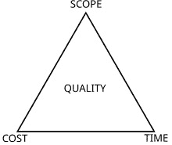

# 14

# 如何开始你的云原生改进之旅

到现在为止，你已经吸收了很多信息。我们已经讨论了许多反模式和关注领域。在接下来的两个章节中，我们希望帮助你准备好开始你的云端改进之旅，并过渡到最佳实践。

在本章节中，我们将专注于第一部分：开始你的云原生改进之旅。我们将涵盖以下领域：

+   如何识别反模式

+   定义目标状态

+   进行差距分析

+   结构化商业案例

看起来我们又有一个信息量很大的章节要面对，接下来让我们开始识别反模式吧。

# 识别反模式

在之前的章节中，我们已经详细讨论了识别反模式的过程。现在，我们希望从更高层次进行，识别出需要警惕的行为。我们将按照领域对反模式进行分类，这将帮助我们保持专注，而不会迷失在细节中。

一旦我们知道什么行为或观察可能是一个警示信号，我们就可以回到各个章节，查找关于反模式识别的详细信息、它带来的风险以及如何修复它。让我们来看看如何识别反模式，我们将依照问题领域进行分类。

## 一般性指标

识别反模式有一些普遍的迹象。以下错误通常会影响多个领域：

+   我们遇到困难的一个非常明显的迹象是，如果我们必须为了赶上截止日期而偷工减料。我们将会生产出平均水平或低于平均水平的质量，并积累技术债务。如果之后没有时间去修复这些技术债务，我们将会陷入运营复杂性的困境。

+   低估云原生和 DevSecOps 转型的文化影响及学习曲线，也是一个可能影响所有领域的陷阱，从战略到安全、合规、数据质量、运营复杂性等。一个常见的迹象是缺乏培训预算和分配的培训时间。缺乏与外部顾问的合作也表明知识没有在组织中深入嵌入。

+   构建模块和操作流程的标准化缺失是一个容易发现的红旗。缺乏一致性将增加技术债务和运营复杂性，降低弹性，并妨碍自助服务体验，从而影响我们实现快速发布周期的目标。此反模式的迹象包括缺乏服务目录或偏向的 CI/CD 管道、小变动却需要大量时间，以及从未达成一致、过时或没有明确界限的运营模型。

+   如果我们在软件开发生命周期（SDLC）中跳过某些阶段，我们的结果将会存在缺陷。例如，如果我们不先确定需求而直接开始设计，那么我们的解决方案中就会缺少需求。通常，这些需求包括操作、安保、弹性、测试、数据一致性以及非功能性需求。如果我们在没有设计的情况下直接开始实施，也是一样的情况。这并不妨碍我们使用敏捷实践，我们只需要考虑整个 SDLC 的全局视角。

在概述了这些通用指标后，我们将开始深入探讨特定的问题领域，首先是与文化和自动化相关的反模式。

## DevSecOps 文化与自动化

我们将在这里检查几个关键指标，并引用详细描述这些指标的章节：

+   如果开发人员不小心删除实例、容器或数据库，或者手动创建证书或密钥，这表明我们拥有一个不成熟的 CI/CD 管道，且没有足够的防护措施。这也意味着我们没有强制执行最小权限原则，必须设置所需的权限扫描，以相应地缩减权限。我们在*第五章*和*第六章*中讨论了这些内容。

+   如果我们在上线前过度依赖渗透测试，并且在审核中发现严重问题，那么我们缺乏一个持续保障的过程，我们在*第六章*中讨论了这一点。

+   如果我们没有良好的测试覆盖率，我们要么会出现停机，要么在试图实现快速发布周期时，测试人员将成为瓶颈。为了充分利用云的所有优势，我们需要在我们的管道中嵌入功能性和非功能性的测试。这包括契约测试、性能测试以及安全性测试，如密钥扫描和漏洞扫描。我们在*第十三章*中探讨了这些测试类型。

我们可以看到，某些描述的反模式，例如采取捷径，可能与一些通用指标相关联。接下来，我们将总结与战略和云采纳相关的指标。

## 与战略和云采纳相关的反模式

这一组反模式似乎尤其难以被集中式架构团队的成员发现，而且其后果对我们的转型之旅会产生长期的负面影响。我们现在来深入探讨这些问题：

+   如果我们的云战略已经超过一年没有更新，或者我们的行动与战略中阐明的目标不一致，那么我们就有问题了。这意味着我们要么朝着错误的方向前进，要么甚至不知道我们的组织应该朝哪个方向前进。如果在冲刺过程中优先级经常变化，那也是反应性行为的信号，我们在*第二章*中探讨了这种反模式的修正方法。

+   如果我们依赖一个非常分散的治理模型，无法为团队提供足够的自主权，我们将无法充分扩展我们的业务，可能难以满足客户需求。另一方面，如果我们没有任何治理措施，我们将面临合规性、可靠性、自助体验和其他挑战。如果我们的实施没有反映安全政策和合规要求，这是一个警示信号。我们需要在防护框架、文化转型和培训之间找到正确的平衡，正如我们在*第三章*中探讨的那样。

+   如果我们缺乏成本责任感，且没有建立成熟的费用返还模式，那么产品团队将没有动力优化他们的云价值。结果将是资源的低效利用、缺乏与成本相关的架构决策以及经常性的云超支。我们在*第四章*中讨论了这一点。

+   当我们进行云迁移，却没有重新平台化或重构应用程序以充分利用云原生的好处时，我们将面临增加的运维复杂性和安全程序。最小的利益相关者承诺以及缺乏迁移计划是显现的因素，我们在*第十二章*中调查了这一点。

当然，这些反模式会对其他问题领域产生连锁反应。其中之一就是运维和可观察性，我们将接下来探讨这个问题。

## 运维和可观察性反模式

这一类问题将影响我们应用程序的可靠性，并可能导致团队的挫败感和潜在的 SLA 处罚：

+   如果用户报告了一个事件，但事件团队没有收到任何警报，我们就知道我们的日志记录和监控覆盖范围不如预期。日志记录和监控必须覆盖整个技术栈，从网络到操作系统、应用程序逻辑和数据库，正如在*第十章*中讨论的那样。

+   如果我们收到过多的警报，就会导致警报疲劳。结果是会有警报出现，但没人会回应，因为这些警报不断发生。我们必须确保使用正确的日志严重性级别，而不是在高环境中使用信息或调试级别，正如我们在*第十章*中讨论的那样。

+   如果我们因响应时间过慢而违反了性能服务水平协议（SLA），我们需要找出瓶颈所在。如果没有追踪和跨度，我们将无法获得改进架构的洞察力，正如我们在*第十章*中探讨的那样。

+   如果我们没有灾难恢复（DR）策略，并且长时间没有进行恢复测试，那么我们知道在实际恢复场景下，我们的准备工作不足。仅仅进行备份并不意味着我们能恢复。备份可能已损坏，部署可能不像我们想象的那样自动化，运行手册也可能过时。我们在*第十一章*中讨论了这一点。

现在，我们已经总结了操作和可观察性指标，准备进入最后一组：技术指标。

## 技术反模式

在与技术相关的指标中，我们将重点关注应用、数据和网络领域：

+   有状态的应用通常表明我们已经背负了一段时间的技术债务，并且没有刷新架构。这可能是由于**定制现成**(**COTS**)产品的技术限制，或者因为我们没有持续为改进架构分配足够的时间。有状态的应用在采用云原生功能（如 FaaS、蓝绿部署和自动扩展）时会拖慢进度。我们在*第七章*中探讨了这一点。

+   当我们在应用中使用紧耦合时，会导致长时间的等待，并且由于增加的 CPU、内存或函数调用时间，也会消耗大量计算和数据开销。像异步调用和使用队列这样的机制可以帮助我们解耦架构，提升扩展效率。我们在*第七章*中讨论了这一点。

+   如果我们为每一个用例都只使用关系型数据库，那我们很可能走错了方向。专用数据库，如 NoSQL 或时序数据库，是有其存在的理由的。它们为特定用例提供快速查找，同时也提供关系型数据库所没有的功能，比如事件流或基于时间的分析，这些我们在*第八章*中进行了探讨。

+   如果我们没有使用主动-主动或故障切换路由，我们的网络链接就是单点故障。我们在*第九章*中讨论的云原生网络构造可以避免这种情况，并增强系统的弹性。

反模式可能出现在多个领域，从文化到 CI/CD、战略、云采用、操作和可观察性等方面。识别这些反模式并不总是容易的，尤其是当我们已经使用它们一段时间后。内化反模式后，就该开始定义我们想要达到的目标，并识别当前状态与目标状态之间的差距。

# 定义最佳结果并识别差距

一旦我们识别出在云原生采纳过程中遇到的痛点，我们必须找出根本原因。在整本书中，我们深入研究了这些原因，并对可能的问题领域有了很好的了解，例如文化方面、缺乏战略或运营卓越等。到目前为止，我们也知道一些修复措施可能需要重大努力。通常，存在依赖关系，这意味着我们需要先解决其他问题，才能处理我们希望解决的问题。例如，如果我们想改进 CI/CD 管道以建立更好的安全性姿态并加快上市时间，我们可能首先需要建立成熟的 DevSecOps 文化。在本章中，我们将频繁使用“当前状态”、“目标状态”和“差距”这几个术语。我们的定义与 TOGAF 有所偏离，更加贴合云原生的背景。

定义 – 当前状态、目标状态和差距

**当前状态**是我们目前的情况。它可以指我们的当前架构、工作方式、运营模式、安全性或合规性姿态。一些架构框架假设这是已经正式批准的规范，但根据我们的经验，这不一定反映现实。

**目标状态**是我们所追求的情况或架构的描述。由于我们处理的是项目管理三角形中描述的约束，它不一定与所有最佳实践完全一致。

**差距**是“*两个状态之间差异的陈述。它用于差距分析的背景，其中识别了当前状态与目标状态之间的差异。*” [来源：TOGAF – [`www.opengroup.org/togaf`](https://www.opengroup.org/togaf)]。

现在我们将探讨我们的当前状态，以及目标状态应该是什么样子。

## 定义当前状态

我们希望建立一个关于我们应处理的所有事务的整体视图，以便在合理利用时间和预算的同时，获得全貌。这并不意味着我们可以处理所有事务，因为我们将面临约束，因此我们必须做出权衡决策。约束条件在下面的项目管理三角形图中有所展示。

图 14.1 – 项目管理三角形（来源：[`en.wikipedia.org/wiki/Project_management_triangle`](https://en.wikipedia.org/wiki/Project_management_triangle)）

三角形代表了影响项目成功的关键因素：**范围**、**时间**和**成本**。它表明，一个约束的变化将会影响其他约束。例如，增加项目的范围可能会需要更多的时间和资金。我们必须平衡这些约束，以在保持质量的同时实现项目目标。这个三角形强调了同时优化这三个方面的挑战，这也就需要做出权衡。这些步骤将帮助我们阐明整体视图：

1.  **定义** **重点领域**：

    研究每一个我们能够快速解决的问题，最终会变得让人不知所措。因此，我们需要选择一些重点领域来开始。这将有助于我们在后续阶段限制范围，以应对成本和时间的约束。内部和外部因素可以驱动我们重点领域的优先级。内部因素的例子包括不可靠的环境或不成熟的 DevSecOps 实践。外部因素可能是我们必须应对的新法规框架，或是最近的数据泄露。根据驱动因素的严重程度，我们需要选择我们的重点领域。我们可能还需要在战略提升和快速见效之间找到平衡，以此获得动力。

1.  **评估** **现有文档**：

    我们将拥有能够帮助我们更清晰了解当前状态的文档。理论上这听起来很不错，但实际上，文档往往不完整或过时。过时的文档可能具有误导性，因为它不能反映实际的当前状态。因此，验证文档的准确性与关键利益相关者一起将是一个很好的做法，这也将引导我们进入下一步。假设我们很难找到相应的文档，因为它们分散在 Google Drive 和多个 Confluence 空间中，包括个人空间。那么，我们可能会将文档标准化纳入我们的目标状态。

1.  **识别利益相关者**：

    我们需要从各个业务单元中识别我们的利益相关者，例如客户互动、战略、运营、安全、开发和测试等。利益相关者是**主题专家**（**SMEs**）。产品或服务负责人会知道应用程序的功能及其所需的增强，以便在市场上更具竞争力。参与运营的人能够告诉我们运营中的不足之处，例如不稳定的运行时、缺乏补丁或可观察性，这使得事件管理变得具有挑战性。利益相关者矩阵有不同的变体，其中一些展示了利益相关者的权力和兴趣。至少，我们希望创建一个清单，展示业务单元、职位功能和代表的姓名。

1.  **规划** **我们的研讨会**：

    与已识别的利益相关者开展研讨会将帮助我们提供有关问题领域的更多细节。此时，我们要考虑到利益相关者宝贵的时间。我们没有资金来推动我们的变革计划，而利益相关者必须完成他们的工作。因此，我们需要在谁需要参与什么对话上保持谨慎。最好有一个简短的启动会议，这样每个人都能听到关于我们想要实现的目标的相同信息。假设我们想要提高网络可靠性。那么，我们必须让网络、安全和云平台的主题专家参与其中。我们可以组织两场 1.5 小时的研讨会，第一场将探讨当前状态：

1.  **当前状态** **发现研讨会**：

    第一个研讨会将捕获当前状态及其所面临的所有挑战。我们需要确保创建一个安全的环境，让每个人都能提出自己的观点和问题。我们还应该带上相关的文档，因为这将帮助我们开始讨论。记录以往的事件非常有助于洞察问题所在。

    例如，在之前的一个事件中，由于我们的主动-被动拓扑无法工作，我们无法进行故障转移，或者我们无法进行故障排除，因为日志记录没有捕获我们所需的所有信息。理想情况下，这是一个高度互动的环节，结果可能是高层次的网络和数据流图、当前的响应服务水平协议（SLA）和吞吐量要求。我们还希望涵盖领域专家提出的任何修复建议。我们必须记录所有信息并详细记笔记。此外，在每个人同意后，我们还应录制会议，以便在后续分析发现时查阅细节。

我们现在已经收集了关于当前状态的所有信息。我们现在可以分析这些发现，并准备目标状态提案，这将是我们接下来要讨论的内容。

## 定义目标状态

拥有一个全面且经过验证的当前状态图像以及所有痛点将帮助我们明确目标状态和差距。这是我们如何开始的：

1.  **目标状态草案**：

    在当前状态发现研讨会后，我们需要分析我们的发现。我们记录了很好的会议笔记。对于每个发现，我们应该记录问题陈述、影响、差距、修复步骤或选项、业务收益和优先推荐。

    修复选项是简短的陈述，说明可以采取哪些措施来弥合差距，并将我们从当前状态带到目标状态。如果我们识别出依赖关系，需要明确指出。在此阶段，我们只需要高层次的陈述。根据我们在研讨会期间覆盖的领域数量，我们可能会在多个问题领域中发现问题。如果是这种情况，将这些发现进行分组是值得的。这样，我们可以更好地结构化后续的研讨会，这将有助于我们后续定义工作包。

1.  **目标状态** **发现研讨会**：

    我们需要为这个研讨会准备一份简短而精炼的视觉展示。可以是电子表格、幻灯片或在绘图软件中（如 Lucidchart 或 Miro）制作的图表。

    例如，可以使用电子表格记录事实，并结合图表来展示解决方案建议。保持研讨会的结构化非常重要，收集每个人的反馈，并根据需要提供澄清。在研讨会结束时，我们应该验证我们的提案。这包括识别的差距以及对提出的解决方案和优先事项达成一致。由于工作量估算是我们的下一步，因此我们必须为每个修复分配合适的 SME。到目前为止，应该很明显谁是每个修复的合适 SME。必须提醒 SME 两件事：

    +   首先，不要假设他们不一定是执行更改的个人。如果这个人是最有经验的，估算的时间会相对较短，但他们可能无法执行更改。

    +   第二个重点考虑了组织的复杂性，尤其是对于受监管行业。现在我们已为每个修复分配了两个估算人员，我们准备开始活动了。

1.  `任务` 列描述了所需的操作，后面跟着说明注释列。我们可能希望将操作与我们所涉及的收益或风险类别对齐，这是我们在下一个列中所做的。剩下的四列记录了第一轮工作量估算（`EE-1`）和第一轮信心度（`CL-1`），然后是第二位 SME 的相同估算。

| **ID** | **任务** | **备注** | **收益** | **风险** | **EE-1** | **CL-1** | **EE-2** | **CL-2** |
| --- | --- | --- | --- | --- | --- | --- | --- | --- |
| S-01 | 移除测试、UAT 和生产环境的人为访问 | 更新 IAM 角色和/或服务控制策略 | 提升安全性和合规性，推动自动化最佳实践 | CI/CD 知识差距可能会延迟开发者，CI/CD 流水线需要为遗留应用创建，可能需要培训 | 7 | 80% | 5 | 90% |
| S-02 | 强制启用静态加密 | 更新服务控制策略 | 提升安全性和合规性 | 对某些加密密钥的额外成本，延迟开销 | 15 | 90% | 12 | 80% |
| S-03 | 为第三方集成启用数据包检查 | 在所有账户中部署网络防火墙并更新路由 | 提升安全性 | 增加新的监控和警报范围，增加新功能的成本 | 120 | 60% | 100 | 50% |
| T-01 | 启用自助式 DNS 创建 | 为业务单元启用子域创建 | 改进用户体验和市场反应时间 | 除非建立保护措施，否则 DNS 记录可能与内部标准不一致 | 20 | 80% | 15 | 60% |

表 14.1 – 修复行动和工作量估算

1.  **确定时间估算**：

    接下来，我们将每个修复项的两个单独努力估算值取平均值。然后，我们会查看置信度水平。根据置信度水平，我们将向平均时间估算中添加适当的应急百分比。对于高置信度水平（超过 90%），我们将添加 5%；对于低置信度水平（50%），我们可以添加 25%，置信度越低，添加的百分比就越高。当然，这些数字是可以调整的；最重要的是保持一致性。我们可以按项目逐项估算应急，或者按整体百分比估算。

1.  **准备好** **商业案例**：

    作为下一步，我们需要与之前两个工作坊中参与的主题专家（SMEs）验证努力估算。主题专家不会质疑自己的努力估算，但如果我们能将每个人带入整体图景，这将有助于增强他们的认同感。这是一个极好的机会，展示我们作为团队共同努力的成果。我们知道，对于个人来说，变革是具有挑战性的，特别是当它影响工作方式并需要采用新技能或放弃职责时。这是一个感谢每个人的奉献、投入和开放心态的好时机，感谢他们帮助我们将组织提升到更好的状态。

现在，我们已经对当前状态、目标状态、差距以及弥补这些差距所需的修复措施有了清晰的认识。我们还为修复措施分配了优先级，并按问题领域将它们分组。我们处于一个知识丰富的位置。 “*知识就是力量*”是一个众所周知的名言，在这种情况下，它使我们处于一个坚实的位置，可以启动一个能够改善我们组织的商业案例。让我们现在深入探讨。

# 定义最佳结果并识别差距

到目前为止，我们已经创建了一个坚实的框架，帮助我们阐明我们想要提议的倡议的高层设计、收益和粗略的努力估算。但在我们可以启动商业案例并使其具备信心以获得批准之前，还有几个步骤需要完成。我们还需要为不同的目标群体提供不同的视角，更重要的是，我们需要补充更多有关商业收益的细节。在本章的最后部分，我们将重点关注以下几个领域：

+   在整个组织中传播我们的计划倡议

+   进入更详细的层次

+   创建工作分解结构

+   制作商业案例文档

+   在组织中进行导航以获取支持

对于这些领域中的每一项，我们将解释它为何至关重要，以及我们必须考虑哪些因素，以确保顺利开始我们的最佳实践之旅。让我们从吸引更广泛的团队开始。

## 与更广泛的团队分享高层次的计划

我们知道人类对变化有抗拒心理。因此，我们需要尽早提供可见性，并让他们了解我们想要达成的目标。这样，其他人可以更长时间地思考可能影响他们的变化。这为他们提供了更多的思考时间，他们甚至可能提供有价值的反馈，从而导致更好的结果。不断与更广泛的群体互动还将帮助我们赢得信任。我们不仅需要这一信任来获得商业案例的批准，还需要它来推动实施。当别人相信我们的行动时，他们会准备好提供帮助。这些是我们在此阶段需要采取的行动：

| 1 | 持续与核心利益相关者的互动： |
| --- | --- |
|  |

+   保持与我们之前两次工作坊中涉及的利益相关者的持续对话，以便与不断变化的需求保持一致。

+   使用现有的节奏会议来进行更新，或者根据利益相关者的个性安排定期的一对一会议。有些人在群体面前不愿表达关切。

+   我们需要解决所有的洞察，以将我们的提案转化为成功。

|

| 2 | 确定更广泛的利益相关者群体： |
| --- | --- |
|  |

+   使用现有的治理论坛来支持新的提案。

+   例如，架构工作组、工程工作组、架构审查委员会、变更批准委员会、技术审查委员会和战略治理论坛等。

+   大型组织通常有层级结构。例如，架构适配可能需要先经过一个论坛的批准，才能由另一个论坛支持其成本和风险。

|

| 3 | 与更广泛的利益相关者群体互动： |
| --- | --- |
|  |

+   我们希望首先将我们的提案提交给所需的论坛，并且需要确保它们拥有适当的目标群体代表。

+   治理结构因公司而异。

+   如果我们是新加入某个组织，我们需要有人帮助我们导航治理流程，例如我们的经理或同事。

+   当我们展示我们的提案时，我们需要关注两个方面：

    +   并非每个人都具备我们长期关注的领域的深度知识。因此，我们必须调整语言，并考虑目标群体，使用可视化工具，如架构图。

    +   我们必须关注肢体语言的语气，并积极倾听反馈。观察房间的动态将帮助我们识别关切，并与个别利益相关者安排后续跟进。

|

表 14.2 – 社交化高层计划

我们刚刚探讨的活动将帮助我们进入下一个更详细的层次，接下来我们将讨论这一点。

## 添加组织特定的细节

我们希望进入下一个更详细的层次，并将从多个角度来解决这个问题。我们将从影响成本和时间表的内部因素开始。我们需要多详细将取决于组织的性质，接下来我们将讨论这一点：

+   **合适的详细程度**：

    启动新项目对于刚获得种子资金的初创公司通常更容易。对于受监管行业和政府组织，我们必须证明一个强有力的尽职调查过程，概述其优缺点，并提供一个中立的供应商选择过程。

    后者可能需要**询价请求**（**RFQ**）或**提案请求**（**RFP**），采购部门可以提供模板和指南。如果多个业务单元争夺预算，我们必须做好准备。这包括良好的视觉效果、支持我们提案的可靠数据、实际的实施估算、持续的许可证费用以及其他运营费用。所需的详细程度将根据组织的具体情况而有所不同，我们需要将其纳入我们创建的文档中。

+   **创建新视图**：

    我们必须为不同的利益相关者创建不同的视图，例如架构视图、流程流或 RACI 矩阵。我们将为企业架构师提供高层次的视图，并描述好处、机会、风险、可靠性等内容。我们还需要为网络团队提供详细的网络图，说明数据流动和网络路由。

    安全团队将希望看到我们实施的安全控制措施，例如流量检查、网络访问控制列表、DDoS 防护、密钥管理等。风险团队可能需要一个风险矩阵。根据我们之前讨论的组织背景，清单将会变得更长。

+   **识别技能差距**：

    由于我们已经进行了更详细的工作量估算，现在对所需技能有了更清晰的了解。如果存在技能差距，我们需要在成本和时间估算中解决这些差距。提升技能通常是通过多种渠道进行的。这些渠道可以是课堂课程，只要团队成员不频繁查看电子邮件、Slack 或 Teams 频道，就能减少他们被临时请求分散注意力的可能性。

    课堂课程提供更多灵活性，因为它们可以随时随地进行。除了课程外，我们还应使用团队扩展的方法。通过这种方式，我们引入来自咨询公司的专家，与我们的团队一起完成工作。但最重要的是，我们必须确保知识传递到我们的团队。我们需要在时间估算中考虑这一点。我们会记录所有与培训相关的费用，因为这些费用对我们的商业案例至关重要。

+   **识别文化和变革管理差距**：

    如果我们的提案涉及文化转型，我们需要解决这个问题。我们可能需要雇佣一名变革经理，并与**人力资源**（**HR**）部门进行对话，更新职位描述。

    我们还需要考虑在过渡阶段生产力较低的问题，这段时间我们的团队需要适应新的工作方式，并投入时间进行培训。改变组织文化所需的时间通常被低估。在此阶段，与人力资源部门进行对话将非常有帮助。如果公司内有变更经理，他们可以提供高层次的估算。人力资源和变更管理部门可以提供更多有关组织特定活动的见解，以及我们需要在路线图中考虑的通知期。

+   **运营模式**：

    我们当前的运营模式是否支持新计划的各个方面？我们是否引入了任何新的组件或第三方解决方案？如果有新的供应商需要我们引入，谁将负责此事？谁将管理许可证并监控许可证的使用限制？是否需要新的维护活动，例如打补丁或创建需要频繁推出的新容器镜像？如果存在空白，我们需要定义谁对这些空白负责，谁是相关责任人，谁需要被告知或咨询。如果我们已有 RACI 矩阵，可以将这些新活动添加进去。如果没有，我们应当开始创建一个，并邀请相关方参与，以完善当前的运营模式。

既然我们已经探讨了组织背景及其综合影响，我们可以继续讨论外部因素和技术影响。

## 处理外部因素和技术影响

外部因素将取决于我们所处的行业、市场、技能市场和经济周期。架构变化或规模增加将推动技术影响，我们将首先研究这一类别：

+   **架构和规模** **增加影响**：

    当我们修改架构时，需要考虑是否需要扩大任何下游系统。如果我们扩展到多区域部署，我们的应用将生成更多日志，如审计日志。我们需要处理这些日志，可能会涉及许可证问题，或者我们可能需要升级存储。日志的成本通常被低估，因此值得调查当前的日志量。多区域部署还会产生跨区域的数据传输费用，这需要我们加以考虑。我们还将需要更多的 TLS 证书。如果我们从第三方获取证书，费用将会增加。如果我们的新解决方案成功，它可能会导致流量增加，我们的基础设施需要进一步扩展。这将导致数据传输费用增加以及我们基础设施资源的额外成本，这些我们在*第四章*中有讨论。

+   **现有技术债务和** **战略提升**：

    总是存在技术债务，它会拖慢我们的进度。作为新计划的一部分，我们需要考虑可以修复哪些问题以实现更好的结果。我们需要考虑我们 CI/CD 环境中的空白。我们是否已实现代码扫描和自动化测试？我们是否为我们的 CI/CD 工具链和云平台设置了所有的保护措施？我们的*Landing Zone*是否需要改进，因为它在安全性或合规性隔离方面考虑得不够？这些空白会阻碍我们前进，它们要么会拖慢交付进度，要么会增加整体风险。因此，我们应该修复这些问题，正如我们在*第四章*中讨论的那样，我们还需要对本地应用程序进行重新架构，以便进行云迁移，关于这一点我们在*第十二章*中进行了探讨。

+   **监管考量**：

    如果我们的新解决方案需要满足监管要求，我们需要确保将其纳入复杂性、交付时间表和所涉及的工作量中。我们必须实施所需的控制措施并进行验证。我们还必须考虑由于监管要求所带来的审计工作量。像 PCI 这样的合规框架要求对最小权限执行、数据保护、加密、防火墙规则、关键事件日志记录、访问日志记录、漏洞扫描等进行彻底的证据收集。这个工作将需要几个月的时间，我们必须为这些审计分配资源。我们在*第三章*中讨论了监管要求。

+   **市场变化和** **技术趋势**：

    市场趋势的变化可能会影响我们的解决方案思路。消费者网站提供更多的照片，有时还有产品的 3D 渲染图和视频，我们需要考虑这些变化，以保持竞争力。技术也在不断变化。越来越多的服务产品变得商品化，FaaS 和无服务器存储解决方案就是其中的例子。我们希望确保利用这些商品化服务，以减少我们的操作工作量。我们在*第二章*中讨论了 Wardley Mapping。

+   **技术** **和合作伙伴关系**：

    新的技术趋势和标准也需要考虑。如果一个新标准，例如 OpenTelemetry，有助于减少供应商锁定，我们应该考虑它并评估其影响。如果我们正在选择新的软件，例如部署工具，那么我们应该评估生态系统，例如我们所在地区的用户组和合作伙伴，并看看如果我们建立良好的合作伙伴关系是否能够获得免费的培训。我们在*第二章*中详细讨论了这一点。

+   **其他** **外部因素**：

    其他因素包括法律和合同方面的考虑。我们将审查相关的服务水平协议（SLA），包括恢复时间目标（RTO）和恢复点目标（RPO），并确保我们的架构和流程与之对齐。地缘政治因素，如贸易限制和地区政治稳定性，可能会影响我们计划的成功，尤其是当我们在全球范围内运营时。我们在*第九章*讨论了与网络相关的方面，在*第八章*讨论了 RPO 和 RTO。

在这个阶段，我们对我们的组织背景以及需要考虑的内部和外部因素有了清晰的理解。凭借这些知识，我们已经准备好重新审视我们的工作量估算，并构建我们的路线图。

## 构建路线图并保持利益相关者的知情

在这个阶段，我们将参考敏捷术语，这些术语将用于构建我们的路线图。为此，请使用敏捷联盟的定义（[`www.agilealliance.org/agile101/agile-glossary/`](https://www.agilealliance.org/agile101/agile-glossary/)）。

定义 – 敏捷术语

**史诗**：史诗是一个大型用户故事，无法在单个迭代内完成，或其规模足够大，可以拆分成更小的用户故事。

**用户故事**：在与客户或产品负责人协商后，团队将要完成的工作分解为称为“用户故事”的功能增量。

**产品待办事项**：产品待办事项是一个列出新特性、现有特性的变更、错误修复、基础设施变更或其他活动的列表，这些是团队为实现特定目标而可能交付的。

**产品负责人**：产品负责人是产品开发团队中的一个角色，负责管理产品待办事项，以实现产品开发团队希望完成的目标。

上述术语经常使用，但由于存在不同的敏捷交付框架，我们在使用这些术语时指的是相同的内容。

我们之前做出了一个高层次的工作量估算。在评估了内部和外部因素之后，是时候验证这些估算并推进到下一个更详细的层次：

1.  **评估之前的** **工作量估算**：

    根据获得的见解，我们必须验证之前捕捉到的工作量估算是否涵盖了所有必要的活动。如果有遗漏的步骤，我们需要将其添加进去。最好保留初步估算的版本，以便以后进行比较。我们可以请提供初步估算的相同领域专家重新验证工作量估算。我们可以通过一个会议开始这次重新验证，会上我们会提供所有相关背景。这将是对该计划的简短回顾，包括以前的估算和自最初工作量估算以来的新发现。我们将需要花一些时间讨论这些发现，因为任何新的内部或外部发现都可能影响工作量估算。团队随后可以返回初步估算并将其补充完整。现在是时候在初步时间估算中添加一列，记录应该执行某项任务的职位职能。这将帮助我们验证是否具备所有必要的技能和资源。最终结果将是更新后的时间估算和新增的责任。

1.  **创建** **待办事项列表**：

    基于更新后的时间估算，我们将创建一个待办事项列表。理想情况下，这可以在敏捷管理解决方案中完成，如 Jira 或 Wrike。如果我们没有许可证，我们可以使用如 Trello 之类的免费层级工具，但我们需要确保我们的组织认可该软件，以避免出现影子 IT。商业解决方案具有有用的规划功能，例如管理任务之间的依赖关系、创建总体史诗、将故事映射到史诗中，并将其分组到冲刺中。一旦这个结构创建完成，我们就可以生成一个路线图。

    以下截图展示了 Atlassian 公司在 Jira 中的路线图示例。Jira 使用*issues*而不是*stories*，使用*timeline*而不是*roadmap*，但概念是相同的，正如我们所见：

图 14.2 – Jira 中的路线图（来源：https://www.atlassian.com/software/jira/guides/basic-roadmaps/tutorials#filter-and-view-settings）

1.  **保持** **利益相关者的参与**：

    在我们进行规划活动的同时，必须保持利益相关者的知情。我们之前已经提供了可见性，并在架构和工程论坛上做了展示。我们获得了新的见解，范围或方法可能已经发生了变化，自我们最初的高层次提案以来。现在我们可以再次向这些论坛展示，并提供更多细节。保持每个人的知情将减少抵触情绪，因为大家都已经被纳入讨论，并有机会提出关切。

到目前为止，我们已经收集了许多数据点，并保持了与利益相关者的沟通。我们有许多输入可以在商业案例中重复使用，接下来我们可以开始记录这些输入。

## 商业案例文档

我们需要了解目标受众，以确保文档使用正确的术语。CSP 特定的术语，如 Lambda、Apigee 或 Azure Blob Storage，可能对需要批准商业案例的利益相关者没有意义。因此，我们应避免使用技术术语，如果必须使用技术术语，则需要解释它们及其带来的好处。如果我们为一个较大的组织工作，我们可能会有一个可供使用的商业案例模板。

通常，战略和架构团队会维护此部分。如果我们没有模板，也没关系，因为我们将使用一种可以采用的结构：

| **#** | **章节标题 &** **描述** |
| --- | --- |
| 1 | 执行摘要 |
|  | 本节将简要概述云转型计划。到目前为止，我们已经制作了不同的视图，我们可以在本节中利用其中一个高层次的视图。我们需要解释战略目标和预期的商业成果。我们还将记录一个高层次的成本摘要、收益以及我们之前制作的路线图的高层次视图。 |
| 2 | 商业驱动因素与战略对齐 |
|  | 在这里，我们可以描述当前的业务和技术挑战。我们将指出痛点和现有的低效之处。我们还可以参考与我们组织相关的市场、行业和技术趋势。我们需要概述我们的计划如何与公司战略对齐，以及我们的解决方案如何帮助获得竞争优势，例如更快的产品发布周期。 |
| 3 | 愿景与目标 |
|  | 在本节中，我们将描述我们云计划的长期愿景，并捕捉关键目标和指标，如 KPI 和成功标准。例子包括提升市场上市时间、提高安全性或合规性以降低整体风险，或者提升韧性，减少停机次数。 |
| 4 | 当前状态 |
|  | 我们将在此处提供当前挑战的概述，包括基础设施、应用程序、数据、挑战和限制，包括技术债务、性能、可扩展性和安全性挑战。我们必须解决所有差距领域，包括技能、资源、文化、运营、治理、安全、合规性、变更管理、CI/CD、缺乏护栏以及技术债务，这些应在之前的工作坊中已有记录。 |
| 5 | 目标状态 |
|  | 本节将描述提议的计划。我们将涵盖与当前状态相同的领域，并指出目标状态与之的不同之处。如果我们保持与前一节相同的结构，利益相关者将更容易看到差异。工作坊文档应该提供我们在此处所需的所有输入。 |
| 6 | 财务分析 |
|  | 在这里，我们将提供成本明细，展示初始投资、迁移成本和运营费用。我们还将涵盖所需的额外人员或外部顾问。如果我们从本地部署迁移到云端，将会从资本支出（CapEx）转向运营支出（OpEx）。我们计划这个倡议是因为我们的组织将从中受益，我们需要在投资回报率（ROI）计算中展示这一点。我们将说明预期的 ROI、回报周期和长期节省。收益包括减少运营工作量、加快新解决方案交付速度和减少服务水平协议（SLA）违约，从而减少罚款支付。除非我们已经 100%使用云端，否则我们将解释云定价模式（例如按需付费）和承诺支出计划。 |
| 7 | 价值主张与收益 |
|  | 在这里，我们将描述定量的收益，例如成本节约和提高的业务敏捷性，并概述定性的收益，如提升的创新能力、客户满意度、员工体验和竞争优势。 |
| 8 | 风险评估与缓解 |
|  | 本节在受监管行业中尤其重要。我们将描述涉及运营、技术、交付和财务义务的关键风险。我们还将概述风险缓解策略和应急计划，例如分阶段部署、小规模变更增量、员工技能提升、实施保护措施、管理超支等。 |
| 9 | 实施计划 |
|  | 在这里，我们将提供之前制作的路线图。我们需要概述关键的里程碑、阶段和时间表。本节还将包括一份资源计划，显示内部团队、顾问和来自我们云服务提供商（CSP）的专家。我们还将描述我们的利益相关者，包括变更管理和治理。此信息将在即将进行的利益相关者对话中使用，包括共享业务案例文档。 |
| 10 | 组织影响 |
|  | 在本节中，我们将描述技能和劳动力转型，包括培训、招聘和技能提升的需求。我们还将描述流程变化，例如从手动测试转向自动化测试，以及文化方面的内容，例如建立 DevSecOps 文化并向跨职能团队方法转型。 |
| 11 | 合作伙伴与供应商策略 |
|  | 如果我们购买新的 SaaS 解决方案，我们将概述它如何与我们当前的生态系统集成，并描述我们的合作伙伴策略。SaaS 供应商是否能够指定关键客户经理和专家？他们是否能够提供针对我们组织的定制培训？ |
| 12 | 合规性、安全性和法律考虑 |
|  | 在这里，我们将描述第三方是否满足所有合规要求，如 SOC-2、HIPAA 或 PCI。我们还需要描述供应商是否符合数据保护和隐私要求。我们还将描述服务水平协议（SLA），包括可用性和性能 SLA，供应商是否能够提供这些信息。 |
| 13 | 摘要与建议 |
|  | 在本节中，我们将总结主要发现和结论，提出最终建议，并概述所需的行动。此节概述了文档内容。有些利益相关者只会阅读文档的第一部分、最后一部分，以及他们直接相关的部分，如法律部分或财务分析部分。因此，我们需要在文档的第一部分和最后一部分使用清晰的商业语言。 |

表 14.3 – 商业案例文档

文档必须由各个团队成员和参与研讨会的利益相关者进行评审。如果时间有限，我们可以在利益相关者之间分配评审任务。如果我们犯了明显的错误，例如财务计算错误，我们将失去可信度，而我们要尽力避免这种情况。

我们需要为文档找到正确的平衡，以便提供足够的信息传达必要的内容，而不会进入不必要的细节，导致难以阅读。文档评审将有助于找到这一平衡。在编写文档的过程中，我们会继续与更广泛的利益相关者群体进行互动，并沟通下一步的时间安排，我们将在接下来讨论。

## 下一步与其他考虑事项

我们正在接近商业案例过程的尾声。唯一缺少的“微小”环节就是在转向最佳实践之前获得批准。那么，如何实现这一最后一步，这对启动实施至关重要且必要呢？让我们来看看我们需要考虑的一些方面以及需要采取的行动：

+   **完美的时机来** **申请预算**：

    是否有一个完美的时机来申请预算？大型组织有财务周期，预算申请必须在新财年开始前的几个月提交。对于这一请求，我们不需要最终确认和批准的商业案例，但至少需要高层次的利益。大多数时候，云架构师可以通过与关键利益相关者或供应商联系，获取一些成本信息。如果我们刚刚经历了一个事件，比如数据泄露，获取安全提升的资金将不成问题，甚至可以超出财务周期，除非泄露事件让我们无法继续运营。

+   **完美的时机来提出** **商业案例**：

    商业案例是否有完美的时机？如果我们之前已经请求了预算，我们必须确保商业案例的批准时间与我们计划的实施启动时间一致。我们需要考虑到一些未计划的延迟，例如利益相关者无法参与或紧急项目优先，导致我们在下次治理会议中无法立即安排展示。有些公司会进行季度或半年一次的优先级评估。如果是这种情况，那么准备好商业案例将非常有帮助，特别是我们能提出有力的观点，让组织处于更好的状态。关于是否存在完美时机的问题，简短的回答是取决于情况，但最好的做法是做好准备，并与利益相关者保持良好的联系。

+   **审批流程**：

    审批流程非常依赖于组织的具体情况。如果我们之前没有提出过商业案例，并且对流程不完全了解，我们需要与经理或曾经做过此事的同事联系。他们可以提供一些指导，并引导我们找到负责治理论坛并批准商业案例的人员。我们必须询问他们需要注意哪些事项，以及获得批准的关键领域。可能是安全、合规性或采购，这取决于行业和组织。我们还需要准备一个总结我们商业案例的展示，接下来我们将讨论这个问题。

+   **展示**：

    我们需要一个展示，使用合适的工具为治理论坛中的利益相关者提供支持我们的解决方案。根据组织的规模，我们可能需要在多个论坛上获得批准。例如，一个论坛会挑战所有架构和工程方面的问题。一旦我们获得支持，就可以在一个挑战风险并提供组织效益的论坛上展示。在这种情况下，我们需要准备两场展示：一场技术性展示和一场专注于业务和风险的展示。我们花在准备这些展示上的时间，和我们花在实际商业文件上的时间一样宝贵。展示就像是我们认为将成为成功故事的产品的销售宣传册。

在这一点上，我们祝你在展示中好运，并总结本章的关键要点。

# 摘要

我们首先探讨了如何识别反模式以及我们需要留意的迹象。这包括了一般性指标和具体的关注领域，如文化、自动化、战略、运营、可观察性和技术。接着，我们开始定义当前状态和目标状态，并探讨了我们需要弥补的差距，以及保持利益相关者参与的重要性。我们还探讨了如何加入组织背景，考虑可能影响我们解决方案的内部和外部因素。我们探索了如何制定路线图、商业案例文档，以及支持我们商业案例的演示文稿，同时保持利益相关者的参与。到目前为止，我们应该已经得到了认可的商业案例，并准备开始我们的转型，接下来我们将在最后一章中讨论这一过程。
