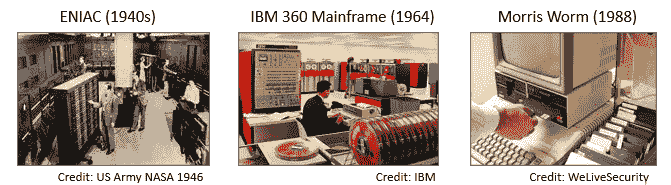
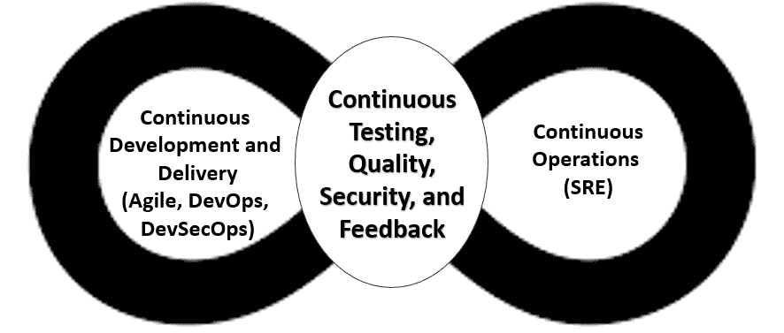
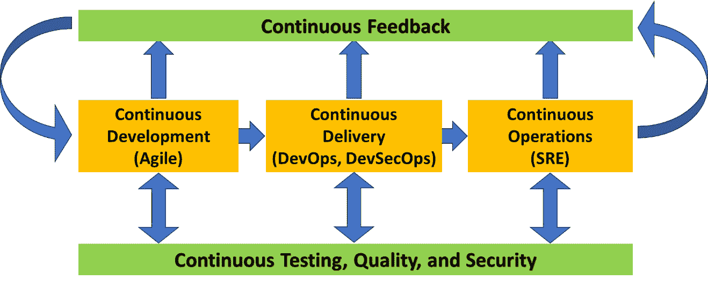
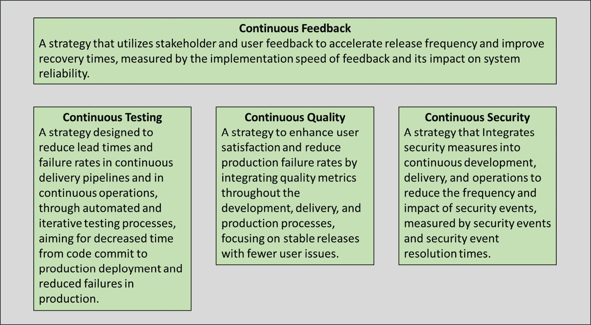
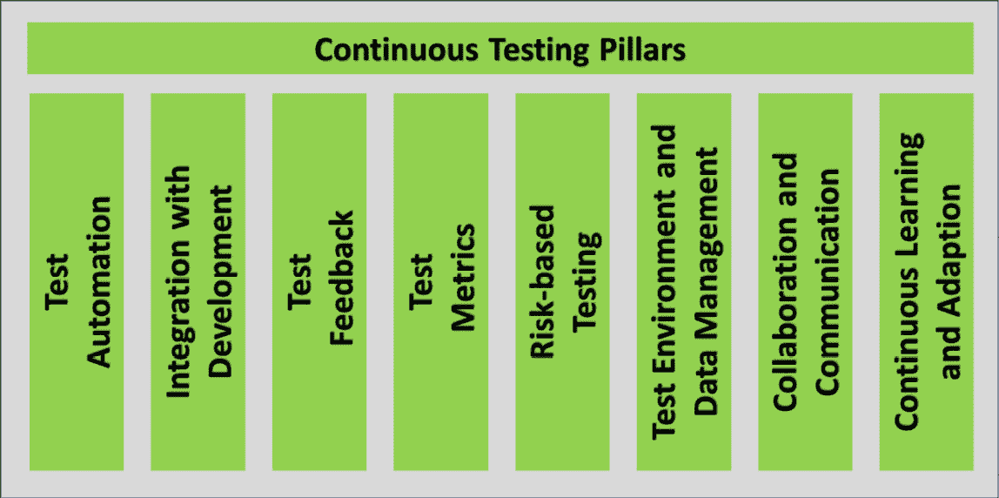
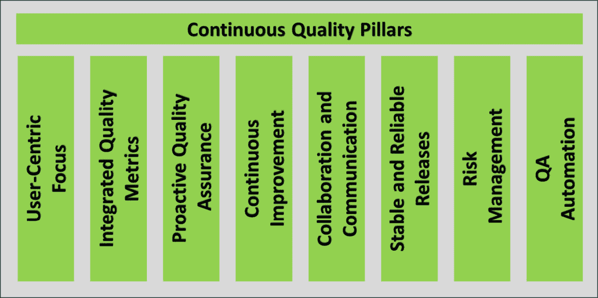
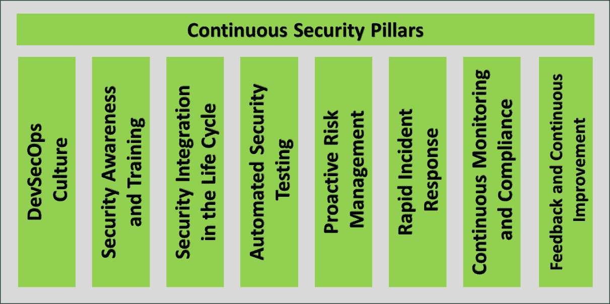
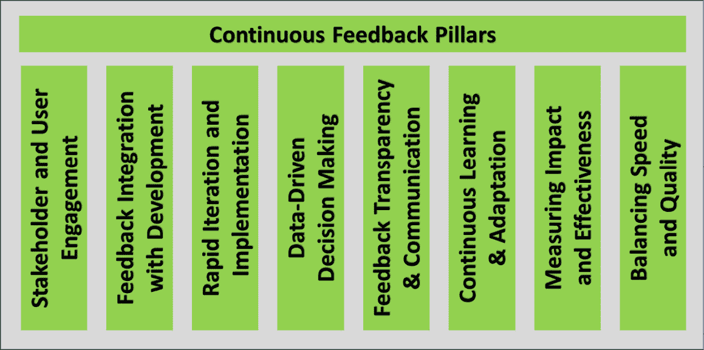

# 第一章：持续测试、质量、安全性和反馈的原则

本章解释了持续战略对于利用持续开发实践（即敏捷）、持续交付实践（即 DevOps 和 DevSecOps）以及持续运维实践（即 站点可靠性工程（**SRE**））的数字化转型至关重要。

在本章中，我们将涵盖以下 主要内容：

+   引入持续测试、持续质量、持续安全性和 持续反馈

+   定义持续测试、质量、安全性、 和反馈

+   持续测试的指导原则和支柱 持续测试的指导原则和支柱

+   持续质量的指导原则和支柱 持续质量的指导原则和支柱

+   持续安全的指导原则和支柱 持续安全的指导原则和支柱

+   持续反馈的指导原则和支柱 持续反馈的指导原则和支柱

让我们 开始吧！

# 引入持续测试、质量、安全性和反馈

本节介绍 现代持续测试、质量、安全性和反馈策略的关键基础概念 及历史背景。 它还解释了为什么 DevOps、DevSecOps 和 SRE 实践推动了持续测试、质量、安全性 和反馈的需求。

## 测试、质量、安全性和反馈的基础

测试、质量、安全性和 反馈一直是软件 开发、交付和 运维的核心组成部分，自 软件诞生以来便如此。 *图 1**.1* 及接下来的段落展示了一些历史实例， 突显了这一点。

图 1.1 – 测试、质量、安全性和反馈的早期示例

+   **测试与质量 – ENIAC（1940 年代）**：即便是第一台通用电子计算机 ENIAC，测试和调试也至关重要。 这台机器必须为每个新任务进行精心编程和测试，这一过程常常需要数天时间。 这一早期的示例强调了测试在软件质量保证中的重要性 。

+   **安全性 – 莫里斯蠕虫（1988 年）**：莫里斯蠕虫是影响世界初期互联网基础设施的首批已知蠕虫之一，突显了在软件设计中关注安全性的必要性。 它利用了已知的漏洞，强调了在网络和 软件开发中考虑安全性的重要性。

+   **反馈 – IBM 早期的软件开发（1950 年代–1960 年代）**：在商业软件的早期，像 IBM 这样的机构和公司意识到用户反馈在软件开发中的重要性。 用户的反馈帮助塑造了软件产品的演变，使其更加符合用户需求，并与 业务需求对接。

然而，传统方法也存在一些缺点。 接下来，我们来看一下 这些缺点。

### 传统的测试、质量、安全性和反馈策略的弱点

ENIAC、莫里斯蠕虫以及 IBM 早期的软件开发 的历史案例凸显了传统方法在测试、质量、安全性和 反馈方面的关键弱点：

+   **测试与质量 – ENIAC（1940 年代）**：在 ENIAC 时代，测试和调试是手工完成的，且耗时繁琐。 每项新任务都需要精细的编程和测试，展示了面对复杂任务时传统测试方法的低效。 缺乏自动化测试工具和集成测试实践意味着确保质量是一个劳动密集型的过程，显著拖慢了开发 和部署的速度。

+   **安全性 – 莫里斯蠕虫（1988 年）**：传统方法通常将安全性视为事后考虑。 莫里斯蠕虫利用已知的漏洞，突显了反应性安全措施的不足，相比之下，前瞻性安全实践显得尤为重要。 安全性并未纳入软件开发生命周期。 这一事件强调了在开发的每个阶段都要考虑安全性的重要性， 从设计到部署。

+   **反馈 – IBM 早期的软件开发（1950 年代–1960 年代）**：传统软件开发常常受到延迟反馈循环的困扰。 反馈通常是在发布后收集的，这限制了在开发阶段进行以用户为中心的改进的能力。 在开发过程中缺乏与 用户的持续互动。 反馈未能系统地融入到开发周期中，导致产品可能无法完全符合用户需求 或期望。

这些历史实例展示了传统方法的关键弱点：

+   **测试和质量**：手动、耗时的测试方法，缺乏自动化，以及未能将测试集成到开发 生命周期中。

+   **安全**：一种对安全的反应式方法，将其视为事后的思考，而非开发过程中的一个重要组成部分。 开发过程。

+   **反馈**：反馈机制的延迟以及缺乏持续的用户参与，导致软件开发与 用户需求之间的脱节。

现在，让我们来看一下，随着软件框架变得更加持续，测试、质量、安全和反馈是如何演变的。

### 测试、质量、安全和反馈的演变，朝着持续战略发展

软件开发、交付和运营向持续开发、交付和运营方法（如敏捷、DevOps、DevSecOps 和 SRE）演变的过程，受到多个关键因素和 行业趋势的推动：

+   **对速度和敏捷性需求的增加**：随着市场和技术的快速发展，企业面临着更大的压力，需要更快地交付产品和服务。 这种对速度的需求导致了敏捷方法论的采纳，敏捷方法注重迭代开发、灵活性和软件的快速交付。 软件。

+   **从项目思维向产品思维的转变**：传统的软件开发通常是基于项目的，有明确的开始和结束。 然而，行业逐渐转向产品思维，即软件持续开发、改进和维护。 软件产品的持续性要求采用敏捷 和 DevOps 等方法论。

+   **现代软件系统的复杂性**：随着软件系统复杂性的增加，分布式架构（如微服务）要求采用更多协作和集成的方法。 DevOps 作为一种回应应运而生，强调开发 **（Dev）** 、 **质量** （QA） **、安全** （Sec） **和运维** （Ops）团队之间的协作。

+   **对更快发布周期的需求**：随着竞争加剧和技术进步，快速发布更新和功能的能力变成了一项竞争优势。 这导致了 对 **持续集成**/**持续交付** （**CI/CD**）实践在 DevOps 框架中的应用。

+   **云计算和自动化的兴起**：云计算的出现以及自动化工具的日益普及，使得软件开发、交付和运维过程更加高效和可扩展。 这些技术是 DevOps、DevSecOps 和 SRE 实践的基础。

+   **安全性日益重要**：随着网络威胁和安全漏洞的增加，将安全性集成到软件开发生命周期中变得至关重要。 DevSecOps 通过在开发项目一开始就将安全（Sec）作为关键组成部分，演变自 DevOps。 开发项目。

+   **关注可靠性与用户体验**：随着用户对可靠性和性能的期望不断增加，关注点转向确保软件不仅能够快速交付，而且还要可靠。 这促使了 SRE 的出现，它将软件工程和 IT 运维的各个方面融合在一起，创建可扩展且高度可靠的 软件系统。

+   **反馈与持续改进**：从用户获取持续反馈并迅速适应这些反馈的需求变得至关重要。 敏捷、DevOps 和 SRE 方法论都强调持续监控、反馈和改进，以使软件产品更紧密地与用户需求和 业务目标对齐。

+   **文化和组织的转变**：这些方法论还代表了组织对软件开发、交付和运营的看法的文化转变。 它们推动了协作型跨职能团队的形成，倡导快速失败的思维方式，并强调持续学习 和改进。

向敏捷、DevOps、DevSecOps 和 SRE 的演变，源于在快速变化的技术环境中对更快、更高效、更可靠的软件交付的需求。 这些方法论应对了软件系统日益复杂化、对速度和可靠性的需求、将安全性集成到开发过程中的要求，以及持续反馈 和改进的重要性。

本节中展示的历史实例表明，从计算机的早期阶段开始，测试、质量、安全性和反馈策略一直是软件开发、交付和运营的关键组成部分。 这些策略随着技术的发展而演变，但始终是可靠、安全、以用户为中心的软件开发、交付和维护的不可或缺的一部分。

传统的测试、质量、安全性和反馈策略的不足，促使了更为集成、自动化和以用户为中心的软件开发方法的演变，如敏捷、DevOps 和 DevSecOps，它们通过将测试、质量保证、安全性和反馈深度 并持续地嵌入到软件 生命周期中来解决这些不足。

接下来的章节将解释最初的测试、质量、安全性和反馈策略是如何演变的，以跟上现代持续开发、交付、 以及运营的步伐。

## 向持续测试、质量、安全性和反馈的演变

敏捷、DevOps、DevSecOps 和 SRE 实践的出现，迫使测试、质量、安全性和反馈策略经历了重大的演变。 这种演变，如 *图 1**.2*所示，受到技术、业务需求和软件开发、交付、 以及运营的持续性方法驱动。

图 1.2 – 持续测试、质量、安全性和反馈

让我们来探讨那些需要演变成“持续性”的测试、质量、安全性和反馈策略的具体属性：

+   **在 Agile、DevOps、DevSecOps 和 SRE 背景下的测试**  

    +   **更快的发布周期**：传统的 测试方法对于 DevOps 中快速部署的周期来说过于缓慢。 CI/CD 管道要求自动化、更频繁和更复杂的测试策略，以确保新功能和更新能够快速部署，而不 影响质量。

    +   **Shift-left 测试**：DevOps 倡导在 *软件开发生命周期中向左转移* ，意味着测试从一开始就早早开始。 这种转变确保了缺陷能够尽早被发现并解决，从而减少成本 和市场投入时间。

    +   **可靠性和可用性**：在 SRE 中，重点是服务的可靠性、可用性和性能。 这里的测试不仅包括功能测试，还包括负载、性能和弹性测试，以确保系统能够处理 现实世界的场景。

+   **在 Agile、DevOps、DevSecOps 和 SRE 时代的质量**  

    +   **以用户为中心的焦点**：DevOps 的快速和迭代性特点要求采用以用户为中心的质量管理方式。 功能和更新不断推出，这些增量的质量直接影响到 用户体验。

    +   **监控和性能指标**：SRE 强调使用实时监控和性能指标 以维护和提升服务质量。 这些指标对于基于数据的决策至关重要， 尤其是在系统改进方面。

+   **在 Agile、DevOps、DevSecOps 和 SRE 背景下的安全性**

    +   **持续的安全性**：在快速变化的 DevOps 环境中，传统的在软件开发生命周期结束时处理安全性的模式已不再可行。 DevSecOps 将安全集成到开发过程的每个阶段，而 SecOps 在产品中集成安全保护；二者共同确保 持续的安全性。

    +   **自动化安全测试**：安全测试中的自动化对于 DevSecOps 和 SecOps 至关重要。 自动扫描原始代码和第三方代码中的漏洞的工具被集成到 CI/CD 流水线中，允许你立即发现并修复安全问题。 还包括渗透测试的自动化，以及监控和保护生产中操作软件的工具，以识别和缓解安全入侵，从而增强对已部署软件系统的防护。 在生产中。

    +   **合规性即代码**：在 DevSecOps 中，合规性要求被编码化，以便可以在整个开发和运营生命周期中自动且一致地执行。

+   **敏捷、DevOps、DevSecOps 中的反馈** **以及 SRE**：

    +   **持续反馈循环**：DevOps、DevSecOps 和 SRE 实践依赖于开发、运营和用户之间的持续反馈循环 。 这种反馈对于软件交付和部署到生产运营的快速迭代至关重要。

    +   **无责事后分析**：SRE 实践 如在事件后进行无责事后分析，促进了学习和改进的文化。 这种方法使团队能够理解发生了什么问题，以及如何在未来避免，而不是聚焦于 个人的错误。

    +   **跨职能协作**：这些方法中的反馈不仅仅是用户输入，还包括 跨职能团队的协作。 在开发、运营、安全性及其他利益相关者之间共享见解和知识是改善流程 和结果的关键。

*图 1**.3* 展示了持续测试、质量、安全性和反馈相对于持续开发（敏捷）、持续交付（DevOps 和 DevSecOps）以及持续运营（SRE）之间的关系。 该图显示，持续测试、质量和安全性在开发、交付和运营阶段是活跃的。 它还显示，来自每个阶段的结果，这些策略所带来的结果，提供了持续的反馈数据，这些数据影响着每个阶段的持续迭代。

图 1.3 – 持续测试、质量、安全性和反馈关系

在 DevOps、DevSecOps 和 SRE 背景下，测试、质量、安全性和反馈的演变反映了软件开发和运维的更广泛转变。 这一转变是朝着更持续、集成、自动化和以用户为中心的实践方向发展，旨在以更快的速度和更高的可靠性交付高质量、安全的软件。

# 定义持续测试、质量、安全性和反馈

本节解释了定义持续测试、质量、安全性和反馈的重要性以及与此相关的挑战，随后提供了持续测试、质量、安全性、 和反馈的实际定义。

## 对测试、质量、安全性和反馈的定义需求

对于持续测试、质量、安全性和 反馈，并没有标准定义，就像对于 DevOps、DevOps 或 SRE 也没有标准定义一样。 然而，在组织向成熟的 DevOps、DevSecOps 和 SRE 实践转型的背景下，定义持续测试、质量、安全性和 反馈是至关重要的，原因有很多。 定义为衡量和评估数字化转型中人员、流程和技术维度的表现和进展提供了基础。 本节解释了拥有（或没有）这些清晰定义的重要性、潜在好处和后果。

### 定义的重要性

让我们 理解 为什么 定义 是 重要的：

+   **衡量的基础**：清晰的定义使组织能够建立具体、可衡量的标准来评估其实践的有效性。 这是 持续改进的基础。

+   **共同理解**：定义确保所有参与者对期望的内容有共同的理解，减少跨团队之间的模糊性和不一致。

+   **目标对齐**：明确的概念有助于对齐各个团队（开发、运维和安全）的目标，以统一的目标为方向，这对于像 DevOps 和 DevSecOps 这样的协作环境至关重要。

### 清晰定义的好处

让我们 来看一看 定义的 好处：

+   **性能跟踪**：通过明确的定义，组织可以跟踪其 DevOps、DevSecOps 或 SRE 项目的绩效，识别成功的领域和需要改进的地方。 

+   **改进的协作**：定义有助于促进团队之间的更好沟通与协作，因为每个人都基于共同理解的关键概念进行工作。

+   **聚焦的培训和发展**：定义有助于有针对性地进行培训和发展，专注于通过这些定义和指标识别出的特定领域。

+   **增强的流程优化**：组织能够更有效地识别并实施流程优化，从而提高效率，降低成本， 并产生更高质量的产出。

### 缺乏明确定义的后果

接下来，我们将了解当目标没有明确界定时会发生什么： 

+   **测量挑战**：没有明确的定义，就很难衡量和评估 DevOps、DevSecOps 和 SRE 实践的有效性，这可能导致效率低下和 未解决的问题。

+   **目标不一致**：模糊的定义可能导致团队之间目标和期望不一致，从而引发冲突和 降低协同效应。 

+   **资源分配无效**：模糊的定义使得难以识别应将资源分配到哪里以获得最大影响，可能导致浪费的努力 和投资。

+   **责任减少**：在没有明确成功标准的情况下，很难追究团队和个人在其角色和职责中的责任。 这会导致责任不清。

清晰且明确的持续测试、质量、安全和反馈的定义为设定和衡量绩效指标提供了必要的基础，确保每个人都朝着共同的目标一致，促进持续改进。 缺乏这些定义可能会阻碍在这些领域实践成熟的进展。

## 定义持续测试、质量、安全和反馈的挑战

标准化连续测试、质量、安全性和反馈的定义对于任何组织来说都是一项具有挑战性的任务，因为软件开发和部署环境的动态性和多样性。 虽然这些过程可以被广泛定义，但它们的实施和影响并没有绝对的特征。 毕竟，根本没有所谓的 100%的测试、质量、安全性或反馈。 这些方面总是相对于特定的目标和背景。 以下是 这些挑战：

+   **定义** **连续测试**的挑战：

    +   **多样化的测试需求**：软件测试的范围和方法差异很大，取决于软件类型、预期用途、用户群体以及采用的开发方法论。 例如，航空软件等安全关键系统的测试与消费者 移动应用的测试有很大的不同。

    +   **不断发展的技术**：随着技术的进步，测试方法也在不断发展。 新的范式，如人工智能和物联网，带来了新的测试挑战，而这些挑战在传统 的测试框架中并未被考虑到。

+   **定义** **连续质量**的挑战：

    +   **主观性**：质量本质上是主观的，不同的利益相关者可能有不同的看法。 对于开发人员来说，质量可能意味着代码的可读性和可维护性，而对于最终用户来说，质量关乎可用性 和性能。

    +   **依赖于上下文**：快速开发的原型的质量标准可能与成熟的、面向客户的产品的质量标准不同。 开发和部署的背景在决定什么构成质量方面起着至关重要的作用。

+   **定义** **连续安全性**的挑战：

    +   **不断变化的威胁环境**：网络安全威胁的环境在不断发展变化。 今天被认为安全的东西，明天可能就不再安全，因此无法实现 绝对的安全性。

    +   **风险管理**：安全性通常是关于管理风险，而非消除风险。 不同的应用程序根据其面临的威胁和处理的数据敏感性，需要不同级别的安全性。 它们所处理的数据的敏感性决定了所需的安全性。

+   **定义持续反馈的挑战** **：**持续反馈的挑战：

    +   **多样化的来源和解释**：反馈 可以来自不同的来源（用户、利益相关者和自动化系统），并且可以有多种解释。 在某种情境下有价值的反馈，在另一个情境中可能是无关的。 。

    +   **持续适应**：反馈机制必须适应用户和市场需求与期望的变化。 这意味着收集和实施反馈的过程永远不会完成，并且始终处于变化之中。 不断变化。

虽然可以定义持续交付和持续运营的测试、质量、安全和反馈流程，但它们并不具有绝对的特性。 它们高度依赖于具体的背景，并且必须与特定的目标、技术环境和用户期望对齐。 这种固有的变动性和不断适应的需求，使得在所有软件开发和 运营场景中标准化这些概念变得具有挑战性。

## 持续测试、质量、安全和反馈的定义

在动态变化的软件工程领域，特别是在持续交付（DevOps 和 DevSecOps）实践和持续运营（SRE）实践中，关键是关注结果，而不仅仅是过程行为。 许多现有的定义过于侧重于过程方面，忽视了与业务结果对齐的重要性。 一种更实用且有用的方法是，定义持续测试、持续质量、持续安全和持续反馈的策略，强调可衡量的业务成果。 这些结果，特别是与 DevOps 研究协会的 **DORA** (**DORA**)指标对齐，对评估软件开发实践的效率和成功至关重要。 考虑到这些因素，以下定义可以在 本文件中使用：

+   **持续测试定义**：持续测试是一种旨在减少持续交付管道和持续运营中的前置时间和故障率的策略，通过自动化和迭代测试过程，目标是减少从代码提交到生产部署的时间，并减少生产中的故障 ：

    +   *指标*：

        +   从代码提交到 生产部署的测试任务时间。

        +   逃逸到生产环境的缺陷百分比。

    +   *原理*：

        +   该定义将测试整合到开发、交付和运维的每个阶段，确保问题能够早期并持续地被发现和解决，这对于快速且可靠的软件交付 和运营至关重要。

+   **持续质量定义**：持续质量是一种战略，旨在通过在开发、交付和生产过程中整合质量指标，增强用户满意度并减少生产故障率，专注于稳定的发布和减少 用户问题：

    +   *指标*：

        +   批准发布的 部署率

        +   客户报告的每次发布问题 数量

        +   可用性级别 目标（SLOs）

    +   *原理*：

        +   通过在开发和运营的每个阶段优先考虑质量，这一战略确保交付稳定和可靠的软件，满足用户 期望和 业务需求。

+   **持续安全定义**：持续安全是一种战略，将安全措施整合到持续的开发、交付和运营中，以减少安全事件的频率和影响，通过安全事件及其 解决时间来衡量：

    +   *指标*：

        +   （发布前和发布后） 安全事件的数量

        +   检测、响应和解决 安全事件的平均时间

    +   *原理*：

        +   这一战略强调主动的安全实践，将安全考虑因素嵌入整个软件生命周期，对于维护软件完整性 和信任至关重要。

+   **持续反馈定义**：持续反馈是一种策略，利用利益相关者和用户的反馈来加速发布频率并改善恢复时间，通过反馈的实施速度及其对 系统可靠性的影响来衡量：

    +   *指标*：

        +   实施反馈的时间（来源 到解决器）

        +   批准发布的 部署率

        +   客户报告的每次发布问题 数量

        +   可用性级别 目标 (SLOs)

    +   *理由*：

        +   系统化 的反馈收集和实施确保软件不断响应用户需求和市场变化，推动 持续改进。

*图 1**.4* 提供了用于本文件中的持续测试、质量、安全和反馈的实际定义。

图 1.4 – 持续测试、质量、安全和反馈定义

采用这些战略性聚焦的定义来界定持续测试、质量、安全和反馈，使组织能够将其持续开发、交付和运营实践与可衡量的业务结果对齐。 这种方法不仅为持续改进提供了明确的方向，还确保了这些方法论根据它们对关键绩效指标的影响进行评估和调整。 在软件开发不断发展的环境中，这种以结果为导向的战略对于实现效率、可靠性和数字化转型中的成功至关重要。

# 持续测试的指导原则和支柱

本 节描述了支持有效持续测试策略的重要指导原则和实践支柱。 它们对于确保持续测试有效缩短从代码提交到生产部署的时间，并减少生产环境中的故障 至关重要。

*图 1**.5* 展示了持续测试的支柱。

图 1.5 – 持续测试支柱

让我们详细看看它们：

+   **测试自动化**：

    +   *原则*：自动化 是实现 持续测试所需的速度和一致性的关键。 自动化测试可以频繁且一致地运行，确保对 软件健康状况的快速反馈。

    +   *支柱*：开发并维护一套自动化测试，涵盖多个方面，包括单元测试、集成测试、回归测试、性能测试、安全测试、系统测试和用户 验收测试。

+   **与开发** **生命周期的集成**：

    +   *原则*: 测试应该从一开始就融入开发过程，而不是在 最后才加上。

    +   *支柱*: 实施左移策略，在开发周期早期开始进行测试。 这 包括诸如 **测试驱动开发** (**TDD**) 和 **行为驱动开发** **BDD**(**BDD**)。

+   **测试反馈**:

    +   *原则*: 测试的持续反馈对于及时发现和解决 问题至关重要。

    +   *支柱*: 建立实时报告和分析测试结果的机制，确保在发现问题时能立即采取行动。 例如，bug 和漏洞问题报告可以 自动化。

+   **测试指标**:

    +   *原则*: 指标 和测量是了解测试效果以及指导 持续改进的必要手段。

    +   *支柱*: 使用一套全面的质量指标，如缺陷密度、测试覆盖率和平均解决时间，来跟踪和改进 测试过程。

+   **基于风险的测试**:

    +   *原则*: 根据 风险评估，集中测试资源在应用程序的最关键部分。

    +   *支柱*: 优先分配测试资源到风险或影响最大的领域，如关键功能、性能瓶颈和 安全漏洞。

+   **测试环境和测试** **数据管理**:

    +   *原则*: 可靠和一致的测试环境 及数据对于 准确测试是必要的。

    +   *支柱*: 确保测试环境的稳定性、可扩展性和类生产环境的可用性，以及适当的测试数据 管理策略。

+   **协作** **与沟通**:

    +   *原则*：开发人员、测试人员和运营团队之间的有效协作与沟通对 持续测试的成功至关重要。

    +   *支柱*：培养一种协作文化，在这种文化下，团队紧密合作并共同承担 质量责任。

+   **持续学习** **与适应**：

    +   *原则*：持续测试是一个 不断发展的实践，应适应变化的技术和 项目需求。

    +   *支柱*：定期回顾并调整测试策略、工具和流程，以满足软件和 业务的不断发展需求。

这些指导原则和实践支柱构成了强大持续测试策略的基础。 它们有助于确保测试的高效、有效，并与降低交付时间、最小化生产中的故障、最终及时交付高质量 软件的总体目标保持一致。

# 持续质量的指导原则和支柱

本 节描述了支持有效持续质量策略的重要指导原则和实践支柱。

*图 1**.6* 展示了持续质量的支柱。

图 1.6 – 持续质量支柱

让我们来看看它们：

+   **以用户为中心的聚焦**：

    +   *原则*：用户 满意度是衡量质量的关键指标。

    +   *支柱*：定期收集和分析用户反馈、可用性测试结果、客户满意度指标以及满意度调查的结果，以指导 质量改进。

+   **集成的** **质量指标**：

    +   *原则*：质量 应可衡量，并应集成到软件 生命周期的每个阶段。

    +   *支柱*：在开发、交付和生产阶段实施并持续优化一组质量指标（如缺陷率、正常运行时间和性能基准）。

+   **主动** **质量保证**：

    +   *原则*：质量不仅仅是修复缺陷；它还涉及预防缺陷。

    +   *支柱*：采用积极的质量保证实践，如静态代码分析、设计审查和架构评估，以便在生命周期的早期识别和解决潜在问题。

+   **持续改进**：

    +   *原则*：质量是一个不断发展的目标，需要持续改进。

    +   *支柱*：通过定期的回顾和过程、工具及实践的评审，培养持续改进的文化，以识别可提升的领域。

+   **协作与沟通**：

    +   *原则*：质量是一个集体责任，要求团队之间的协作。

    +   *支柱*：鼓励开发人员、QA、运营和业务利益相关者之间的跨职能合作，确保质量的统一方法。

+   **稳定且可靠的发布**：

    +   *原则*：发布的稳定性和可靠性至关重要。

    +   *支柱*：实施强大的发布管理和部署实践，确保稳定可靠的软件发布，并进行全面的测试和验证。

+   **风险管理**：

    +   *原则*：识别和管理风险对于维护质量至关重要。

    +   *支柱*：进行定期的风险评估，并根据对用户满意度和系统稳定性的潜在影响来优先安排工作。

+   **质量保证（QA）自动化**：

    +   *原则*：自动化是扩展质量保证实践的关键。

    +   *支柱*：利用自动化测试和质量保证工具提高覆盖面和效率，同时释放资源专注于复杂的质量挑战。

这些指导原则和实践支柱定义了一个全面的持续质量方法。 通过专注于集成质量度量，强调用户满意度，推动积极的质量保证，并促进持续改进，组织可以有效提升其软件产品的整体质量，从而减少生产故障并提高 用户满意度。

# 持续安全的指导原则和支柱

本节 描述了支持有效持续 安全战略的指导原则和实践支柱。

*图 1**.7* 展示了持续安全的支柱。

图 1.7 – 持续安全支柱

我们简要地来看一下它们：

+   **DevSecOps 文化**：

    +   *原则*：开发、 安全和运维之间的合作有助于提升 安全结果。

    +   *支柱*：推广 DevSecOps 文化，将安全作为共享责任，融入 DevOps 实践中，鼓励跨团队的合作与沟通。

+   **安全意识** **与培训**：

    +   *原则*：安全是共享的责任，所有层级都需要具备安全意识。

    +   *支柱*：为所有团队成员提供定期的安全培训和意识提升项目，以培养安全意识文化。 例如，针对 诸如 **开放全球应用安全项目（OWASP）** 培训、 安全编码和 API 安全的培训可能 非常重要。

+   **安全集成在** **生命周期中的**：

    +   *原则*：安全是整个软件生命周期的 一个不可或缺的部分，而不是一个 孤立的阶段。

    +   *支柱*：将安全实践和工具嵌入到开发、交付和运营流程中，确保从开始到部署 和维护的整个过程都考虑到安全因素。

+   **自动化** **安全测试**：

    +   *原则*：自动化是 维持持续 安全警觉性的关键。

    +   *支柱*：利用自动化安全测试工具（如静态和动态分析工具以及漏洞扫描器）定期扫描并识别在 开发过程的各个阶段中存在的安全威胁。

+   **主动** **风险管理**：

    +   *原则*：主动识别和 缓解风险比 被动应对措施更为有效。

    +   *支柱*：定期进行安全风险评估和威胁建模，主动识别并解决潜在的 安全漏洞。

+   **快速** **事件响应**：

    +   *原则*：快速且 有效地响应安全事件能够最小化 其影响。

    +   *支柱*：建立一个明确的事件响应计划，包括快速检测、调查和修复 安全事件的程序。

+   **持续监控** **与合规性**：

    +   *原则*：持续监控和遵守合规标准对于 保持安全至关重要。

    +   *支柱*：实施持续监控解决方案，检测和警告可疑活动，并进行定期的合规检查，确保遵守相关的安全标准 和法规。

+   **反馈与** **持续改进**：

    +   *原则*：反馈 对安全实践的发展和改进至关重要。

    +   *支柱*：实施反馈机制，从安全事件中学习，并根据经验教训和不断变化的 威胁 持续改进安全措施。

这些指导原则和支柱建立了一个强大的框架，确保持续的安全性。 它们确保安全是一个持续、集成的过程，强调主动的风险管理、快速的事件响应和持续的监控，同时促进安全意识和合作文化的形成。 通过遵循这些原则，组织可以有效地减少安全事件的发生频率和影响，从而增强整体的 安全态势。

# 持续反馈的指导原则和支柱

本节描述了有效的持续反馈策略所需的指导原则和实践支柱。

*图 1.8* 说明了持续反馈的支柱。

图 1.8 – 持续反馈支柱

让我们接下来讨论这些支柱：

+   **利益相关者** **和用户互动**：

    +   *原则*：与利益相关者和用户的积极互动对于获得相关和可操作的反馈至关重要。

    +   *支柱*：建立常规渠道收集来自所有利益相关者的反馈，包括客户、最终用户、团队成员和商业伙伴。

+   **反馈与开发的整合**：

    +   *原则*：反馈应无缝地融入开发过程。

    +   *支柱*：开发机制，迅速将反馈整合进开发流程，确保其直接影响开发优先级和决策。

+   **快速迭代** **和实施**：

    +   *原则*：反馈的价值在于迅速和有效地实施。

    +   *支柱*：专注于缩短从接收反馈到实施变更的周期时间，从而加速迭代和改进。

+   **数据驱动** **决策制定**：

    +   *原则*：决策应基于从反馈中得出的数据，而不仅仅是直觉或假设。

    +   *支柱*：利用工具和技术对反馈进行定量和定性分析，确保决策基于实际用户和利益相关者的洞察。

+   **反馈透明度** **和沟通**：

    +   *原则*：关于反馈的开放沟通能够促进信任并保持持续的互动。

    +   *支柱*: 与利益相关者透明沟通收到的反馈、采取的措施及决策背后的 理由。

+   **持续学习** **和适应**:

    +   *原则*: 反馈 是持续学习 和适应的关键驱动力。

    +   *支柱*: 鼓励一种将反馈视为学习和改进机会的文化，基于 反馈见解调整流程和实践。

+   **衡量影响** **与有效性**:

    +   *原则*: 反馈实施的有效性应该 持续进行衡量。

    +   *支柱*: 跟踪和评估反馈对发布频率、恢复时间和系统可靠性的影响，以衡量反馈实施的 有效性。

+   **平衡速度** **与质量**:

    +   *原则*: 尽管 快速实施反馈非常重要，但保持质量同样是 至关重要的。

    +   *支柱*: 确保以平衡速度和维护或提高系统质量与可靠性的需求的方式实施反馈。

这些指导原则和支柱形成了一个全面的持续反馈框架，强调了利益相关者和用户参与的重要性、将反馈快速集成到开发中的必要性，以及基于数据的决策。 通过遵循这些原则，组织可以有效利用反馈推动更快的发布、改善恢复时间并增强系统的整体可靠性，从而与现代软件 开发方法的目标紧密对接。

# 总结

在快速发展的 DevOps、DevSecOps 和 SRE 领域，持续测试、质量、安全和反馈的策略已成为引导数字化转型成功实现持续开发、交付和运营的关键因素。 本章深入探讨了这些策略的核心，提供了实际的定义和支撑它们的指导原则。

旅程始于 *介绍持续测试、质量、安全和反馈*，为全面探讨铺平了道路。 本节奠定了基础，阐明了为何这些概念在现代软件开发中是不可或缺的。 这是一个邀请，通过优先考虑持续改进和适应来审视软件开发、交付和运营的镜头。 *定义持续测试、质量、安全和反馈*的随后部分提供了每个概念的明确、以结果为中心的定义。 这种清晰度至关重要，因为它为专业人士在实施这些策略的复杂性中提供了一盏明灯，这对数字转型至关重要。 。

本章的核心在于详细阐述了每个概念的指导原则和支柱。 *持续测试的指导原则和支柱* 解释了将测试整合到软件开发生命周期的每个阶段中，确保质量和功能不是事后的考虑，而是过程中固有的。 关于持续质量的部分强调了积极主动的方法来保持高标准，确保产品不仅符合而且超出用户的期望。 当涉及持续安全性时，本章强调了需要采取一种整合的、警觉的方法来应对不断演变的威胁。

在专门讨论持续反馈的部分中，本章强调了利益相关者和用户输入在塑造和优化软件产品中的重要性。 这种反馈循环被描绘为开发过程中的一个动态、不可或缺的组成部分，推动改进并促进用户满意度。 最后，本章为你提供了宝贵的技能——理解持续测试、质量、安全和反馈的本质，并学会有效实施它们的指导原则。 这些知识不仅仅是理论，它们是在现代软件开发领域蓬勃发展的工具。 开发。

总之，本章是一个实用指南，也是变革的催化剂。 它鼓励您采纳这些持续策略，确保数字转型是有弹性、以用户为中心和安全的。 无论您是经验丰富的专业人士还是刚刚开始，本章都提供了宝贵的见解和技能，将提升您对持续软件开发、交付和运营的方法。 和操作。

下一章解释了为什么持续测试、质量、安全性和反馈对于 DevOps、DevSecOps 和 SRE 至关重要。
