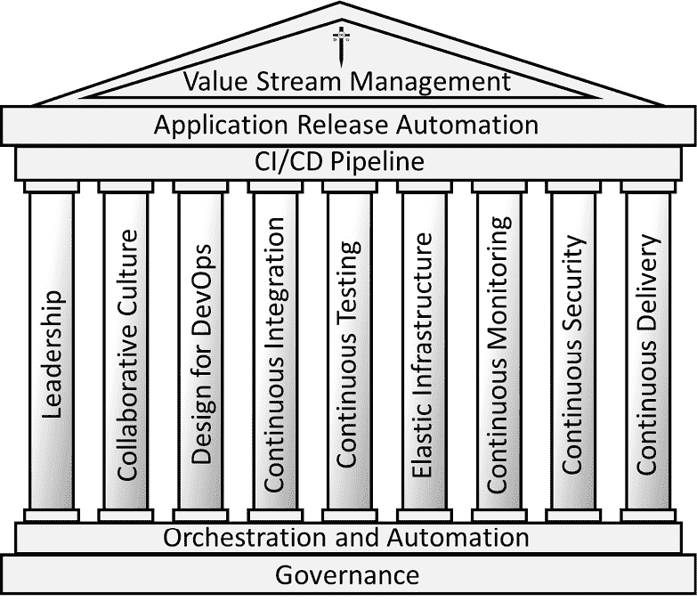
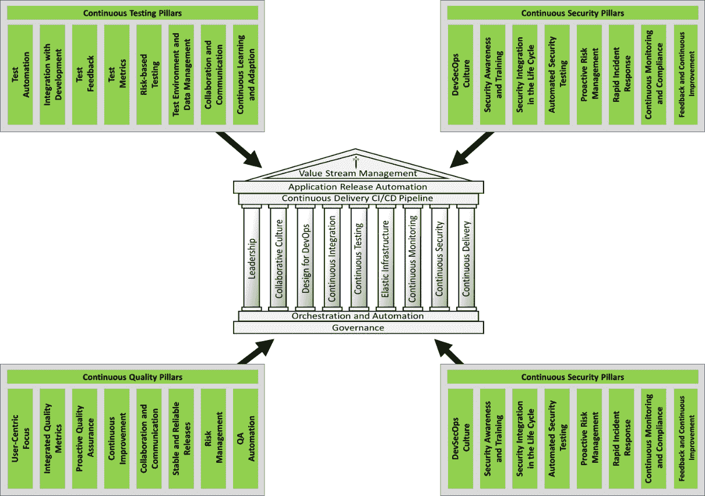
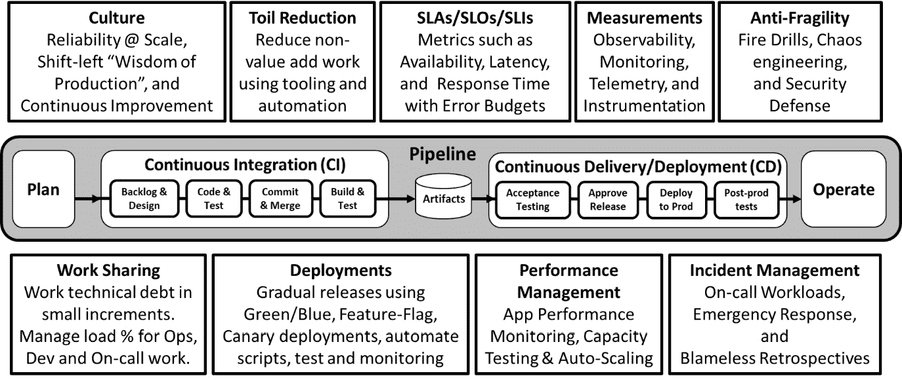
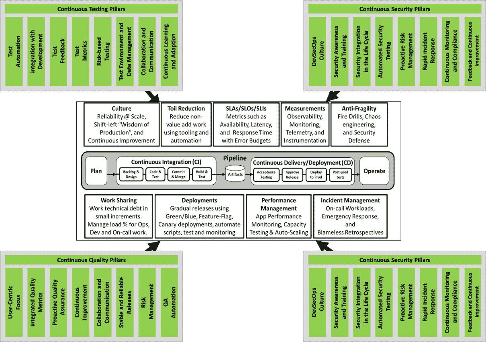

# <st c="0">2</st>

# <st c="2">持续测试、质量、安全和反馈的重要性</st>

<st c="71">本</st> <st c="76">章节</st> <st c="85">解释了</st> <st c="94">为什么</st> **<st c="98">持续测试</st>**<st c="116">、</st> **<st c="118">质量</st>**<st c="125">、</st> **<st c="127">安全</st>**<st c="135">和</st> **<st c="141">反馈</st>** <st c="149">策略对</st> <st c="165">**DevOps**</st> <st c="179">、</st> **<st c="187">DevSecOps</st>**<st c="196">和</st> **<st c="202">站点可靠性工程（SRE）</st>** <st c="230">(</st>**<st c="232">SRE</st>**<st c="235">)</st> <st c="239">至关重要。</st> <st c="242">为了理解这一点，首先需要了解</st> <st c="295">DevOps、DevSecOps 和 SRE 的原则和支柱如何依赖于持续测试、质量、安全和反馈的原则与支柱。</st> <st c="442">这一点在某种程度上得到了简化，因为</st> <st c="498">DevOps 和 DevSecOps 等</st> **<st c="506">持续交付</st>** <st c="525">(</st>**<st c="527">CD</st>**<st c="529">) 策略的支柱是相似的，因此可以将其组合在一起进行比较。</st> <st c="653">持续运营的原则和支柱等同于 SRE，因此它们会在一个</st> <st c="747">单独的章节中进行比较。</st>

<st c="764">本章分为</st> <st c="795">三个部分：</st>

+   <st c="810">为什么持续策略对 DevOps</st> <st c="862">和 DevSecOps 很重要</st>

+   <st c="875">为什么持续策略对 SRE 很重要</st> <st c="916">对于 SRE</st>

+   <st c="923">没有正确实施持续实践的情况下实施 DevOps、DevSecOps 和 SRE 的后果</st> <st c="1010">持续实践</st>

<st c="1030">让我们</st> <st c="1037">开始</st><st c="1042">吧！</st>

# <st c="1050">为什么持续策略对 DevOps 和 DevSecOps 很重要</st>

<st c="1115">本</st> <st c="1120">部分</st> <st c="1129">介绍</st> <st c="1140">DevOps 和 DevSecOps CD 策略的原则与支柱。</st> <st c="1216">这一部分解释了这些实践的原则和支柱为何依赖于持续测试、质量、安全和</st> <st c="1380">反馈策略的原则和支柱。</st>

## <st c="1400">DevOps 和 DevSecOps 的原则与支柱</st>

<st c="1448">DevOps 和 DevSecOps 是相关的策略，它们都促进了 CD，尽管它们强调软件开发和</st> <st c="1590">交付过程的不同方面。</st>

### <st c="1607">DevOps 实践的九大支柱</st>

<st c="1644">DevOps 主要关注</st><st c="1668">改善软件</st> **<st c="1715">开发</st>** <st c="1727">(</st>**<st c="1728">Dev</st>**<st c="1731">)与</st> **<st c="1738">运维</st>** <st c="1748">(</st>**<st c="1750">Ops</st>**<st c="1753">)团队之间的协作。</st> <st c="1763">其目标是简化开发</st> <st c="1805">流水线，实施</st> <st c="1825">自动化，并实现更快速、更高效的软件交付。</st> <st c="1883">软件交付。</st>

<st c="1895">正如 Marc Hornbeek 在</st> *<st c="1927">《工程化 DevOps》</st>* <st c="1945">(2019 年与 Bookbaby 出版)中定义的那样，DevOps 的九大支柱代表了成功实施 DevOps 所必需的基本原则和实践。</st> <st c="2143">每个支柱在支持和增强 DevOps 哲学中都扮演着独特的角色，DevOps 哲学专注于改善协作、自动化和软件开发及交付的整体效率。</st> <st c="2345">以下是每个支柱的解释：</st> <st c="2379">这些支柱：</st>

+   **<st c="2393">领导力</st>**<st c="2404">：有效的领导力</st> <st c="2427">对于推动 DevOps 所需的文化和组织变革至关重要。</st> <st c="2511">领导者必须倡导 DevOps 原则，促进部门间的协作，并确保团队配备必要的工具和培训。</st> <st c="2675">他们在打破部门壁垒和营造支持持续改进</st> <st c="2752">与创新的环境中发挥着关键作用。</st>

+   **<st c="2800">协作文化</st>**<st c="2822">：DevOps 强调软件开发人员、IT 运维人员及软件交付过程中其他相关方之间的协作和沟通文化。</st> <st c="2888">协作文化涉及共享责任、透明度和开放的沟通，这对于快速高效地进行软件开发、测试和部署至关重要。</st> <st c="2989">这些文化元素是推动软件开发和交付顺利进行的基础。</st>

+   **<st c="3178">为 DevOps 设计</st>**<st c="3196">：这涉及到</st> <st c="3213">以支持 DevOps 实践的方式设计软件和系统。</st> <st c="3285">它包括模块化、可扩展性和可维护性等方面的考虑。</st> <st c="3366">设计应便于快速更新、快速部署和高效操作，符合自动化</st> <st c="3496">和持续交付（CD）原则。</st>

+   **<st c="3503">持续集成（CI）</st>**<st c="3531">：CI 是</st> <st c="3539">将代码更改频繁集成到共享代码库中的实践。</st> <st c="3556">每次集成都通过自动构建和测试过程进行验证，以尽可能快速地检测集成错误，从而减少集成问题并提高</st> <st c="3794">软件质量。</st>

+   **<st c="3811">持续测试</st>**<st c="3830">: 持续测试</st> <st c="3851">包括作为软件交付管道一部分执行自动化测试。</st> <st c="3865">这确保了软件质量在整个开发过程中得到保持，使团队能够及早识别和解决问题，从而实现更快和更可靠的</st> <st c="4113">软件发布。</st>

+   **<st c="4131">弹性基础设施</st>**<st c="4154">: 弹性基础设施</st> <st c="4179">指的是根据需求动态调整资源的能力。</st> <st c="4261">在 DevOps 的背景下，这意味着使用虚拟化和基于云的服务</st> <st c="4336">以及</st> **<st c="4340">基础设施即服务</st>** <st c="4367">技术，这些技术</st> <st c="4387">支持计算资源的灵活分配，促进应用程序的快速和高效部署与运行。</st>

+   **<st c="4522">持续安全</st>**<st c="4542">: 持续安全，或 DevSecOps，将安全实践融入到每一个软件</st> <st c="4642">开发</st> <st c="4653">和部署过程中。</st> <st c="4678">它包括对安全威胁的持续监控、定期的漏洞评估，并将安全控制集成到</st> <st c="4819">CI/CD 管道中。</st>

+   **<st c="4834">持续交付（CD）</st>**<st c="4859">: CD 是</st> <st c="4868">一种软件工程</st> <st c="4891">方法，团队通过短周期地生产软件，确保随时可以可靠地发布。</st> <st c="5001">其目标是以更快的速度和频率构建、测试和发布软件，从而降低交付变更的成本、时间和风险。</st>

+   **<st c="5136">持续监控</st>**<st c="5158">: 持续监控</st> <st c="5182">包括持续收集、处理和分析来自软件应用程序和基础设施的数据（性能指标、日志等）。</st> <st c="5330">这一实践有助于主动识别和解决问题，了解系统性能，并确保系统可靠</st> <st c="5481">且高效地运行。</st>

<st c="5497">这九大支柱共同构成了一个全面的框架，用于实施和优化 DevOps 实践。</st> <st c="5608">它们鼓励采取一种整体方法来进行软件开发和交付，侧重于协作、自动化、持续改进和高度</st> <st c="5754">的运营效率。</st> <st c="5789">通过整合这些实践，DevOps 旨在缩短开发周期，提高软件质量，并增加发布频率，从而更快速地响应市场需求和</st> <st c="5987">用户需求。</st>

### <st c="5998">DevSecOps 实践的九大支柱</st>

<st c="6038">DevSecOps 扩展了</st> <st c="6057">DevOps 模型，通过将安全实践融入所有 DevOps 支柱中。</st> <st c="6133">这一策略强调安全不应是事后的考虑，而应是开发过程中的核心组成部分。</st> <st c="6250">DevSecOps 致力于在 CI/CD 流水线中嵌入自动化的安全检查和平衡机制，确保安全性持续被考虑，并且不会影响</st> <st c="6431">交付过程。</st>

<st c="6448">正如 Marc Hornbeek 在</st> *<st c="6480">《工程化 DevOps》</st>*<st c="6498">中定义的那样，DevOps 的九大支柱同样适用于 DevSecOps。</st> <st c="6552">虽然这些支柱相同，但每个支柱下的具体实践是互为补充的。</st> <st c="6656">DevSecOps 的九大支柱确保安全性不是一个独立的元素，而是无缝地嵌入到软件开发和交付流程的每一个阶段。</st> <st c="6830">以下是对 DevSecOps 每个支柱的解释：</st>

+   **<st c="6891">领导力</st>**<st c="6902">：强有力的领导力</st> <st c="6922">在推动将安全性成功融入 DevOps 实践所需的文化转变中至关重要。</st> <st c="7040">领导者必须将安全性作为核心价值观，确保在组织的各个层级都将其优先考虑，并确保团队拥有实现</st> <st c="7219">DevSecOps 的资源和支持。</st>

+   **<st c="7241">协作文化</st>**<st c="7263">：在 DevSecOps 中，协作文化至关重要，开发、运维和安全团队需要紧密合作。</st> <st c="7279">这种协作确保了对安全的共同理解和责任，能够更快速、更有效地识别和解决</st> <st c="7393">安全问题。</st> <st c="7544">安全问题。</st>

+   **<st c="7560">为 DevOps 设计</st>**<st c="7578">：这意味着在设计系统和应用程序时，要同时考虑 DevOps 和</st> <st c="7651">安全性因素。</st> <st c="7684">这包括从一开始就以模块化、可扩展性和安全性为目标进行构建，确保系统既具有敏捷性</st> <st c="7801">又是安全的。</st>

+   **<st c="7812">持续集成（CI）：</st>** <st c="7841">在 DevSecOps 中，CI</st> <st c="7859">包括频繁地集成代码更改，并且</st> <st c="7908">确保每个更改都会自动进行安全性测试。</st> <st c="7974">这种方法有助于在</st> <st c="8062">开发过程中及早识别和解决安全漏洞。</st>

+   **<st c="8082">持续测试</st>**<st c="8101">：在 DevSecOps 中，持续测试不仅仅是功能性和</st> <st c="8169">性能的测试，</st> <st c="8180">还包括定期的自动化安全测试。</st> <st c="8229">这确保了在软件开发的每个阶段，安全性都在持续验证。</st> <st c="8325">生命周期中。</st>

+   **<st c="8336">弹性基础设施</st>**<st c="8359">：在 DevSecOps 中，弹性基础设施强调根据不同需求迅速扩展资源的能力，同时保持安全性。</st> <st c="8384">它涉及使用云服务和虚拟化，配合版本控制和灵活的配置控制，以支持操作灵活性和</st> <st c="8655">安全要求。</st>

+   **<st c="8677">持续安全</st>**<st c="8697">：持续安全</st> <st c="8719">是 DevSecOps 的核心。</st> <st c="8729">它涉及将安全实践融入软件开发和部署过程的每个阶段，从最初的设计到操作，确保持续的监控</st> <st c="8932">和合规性。</st>

+   **<st c="8947">持续交付（CD）</st>**<st c="8972">：在 DevSecOps 的背景下，CD 是指一个过程，其中代码变更会自动</st> <st c="8993">构建、测试（包括安全测试），并为发布到生产环境做准备，确保软件能够随时以</st> <st c="9202">高度安全性进行部署。</st>

+   **<st c="9216">持续监控</st>**<st c="9238">：这</st> <st c="9245">涉及不断</st> <st c="9265">监控已部署的软件和基础设施中的安全威胁。</st> <st c="9351">持续监控使得能够快速检测并响应安全事件、漏洞</st> <st c="9450">和异常情况。</st>

<st c="9464">这些支柱中的每一项都在将安全嵌入 DevOps 流水线中发挥着至关重要的作用，确保安全考量成为开发和</st> <st c="9648">部署过程中的一个不可或缺且持续的部分。</st> <st c="9668">它们共同构成了一个全面的框架，旨在有效实施 DevSecOps，使安全与现代</st> <st c="9819">软件开发的快速和敏捷特性相契合。</st>

### <st c="9840">DevOps 与 DevSecOps 的对齐</st>

<st c="9874">DevOps 和</st> <st c="9887">DevSecOps</st> <st c="9900">都共享促进 CD 的共同目标，但它们的重点不同：DevOps 优先考虑效率和速度，而 DevSecOps 在快速的环境中更注重安全性。</st> <st c="10073">这一点是其主要区别。</st>

<st c="10096">尽管实现 DevOps 而不实施 DevSecOps 是可行的（不幸的是，行业中有很多这样的例子），但这样做存在一些问题：</st>

+   **<st c="10247">安全作为事后考虑</st>**<st c="10275">：在纯 DevOps 方法中，过于关注速度和效率可能导致安全被忽视，或者在开发过程的最后才被补充进来。</st> <st c="10431">这可能导致软件中出现漏洞，若漏洞在管道的后期被发现，则需要进行修复、集成，</st> <st c="10633">并验证。</st>

+   **<st c="10646">被动而非主动的安全</st>**<st c="10686">：如果没有将安全整合到 CD 管道中，组织可能会发现自己在部署后才开始应对安全事件，这可能会导致高昂的成本并损害组织的</st> <st c="10862">声誉。</st>

+   **<st c="10888">合规风险</st>**<st c="10905">：对安全的忽视可能导致不符合行业法规和标准，尤其是在数据保护和隐私</st> <st c="11065">至关重要的领域。</st>

+   **<st c="11077">增加对网络威胁的脆弱性</st>**<st c="11118">：没有持续安全的 CD 可能会使软件产品更容易受到新兴网络威胁的攻击，因为安全措施可能无法跟上更新和</st> <st c="11302">新功能快速部署的步伐。</st>

+   **<st c="11315">碎片化的风险管理方法</st>**<st c="11356">：将开发与安全工作分开，可能会导致风险管理方法的碎片化，在开发过程中，安全考虑因素无法充分融入决策过程中</st> <st c="11550">。</st>

<st c="11569">总之，尽管 DevOps 和 DevSecOps 都旨在促进持续交付，但从一开始就将安全融入其中——正如 DevSecOps 所强调的——对确保 DevOps 的速度和效率提升不妥协软件的安全性和完整性至关重要。</st> <st c="11668">因此，结合 DevOps 和 DevSecOps 的原则，采用九大支柱的共同框架来实现平衡、高效和安全的软件交付管道，是至关重要的。</st> <st c="12057">。</st>

*<st c="12075">图 2</st>**<st c="12084">.1</st>* <st c="12086">来自</st> *<st c="12092">《工程化 DevOps》</st>* <st c="12110">展示了 DevOps 和 DevSecOps 的九大支柱。</st> <st c="12165">如图所示，九大支柱模型展示了所有支柱如何共享一个共同的基础，即编排、自动化和治理，并且有一个共同的“屋顶”，即 CI/CD 管道、应用发布自动化和价值</st> <st c="12397">流管理。</st>

<st c="12724">图 2.1 – DevOps 和 DevSecOps 的九大支柱</st>

<st c="12777">下一个</st> <st c="12787">子部分</st> <st c="12798">将解释 DevOps 和 DevSecOps 的九大支柱如何依赖于持续测试、质量、安全和反馈。</st>

## <st c="12914">DevOps 和 DevSecOps 对持续测试、质量、安全和反馈的依赖</st>

<st c="13003">DevOps</st> <st c="13021">和</st> <st c="13031">DevSecOps</st> <st c="13035">的九大支柱以各种方式与持续测试、持续质量、持续安全和持续反馈的支柱相交织并相互支持。</st> <st c="13198">每一组支柱都相互补充并强化对方，形成了一个全面的软件开发与运维方法。</st> <st c="13331">它们是这样相互关联的：</st> 

+   **<st c="13366">领导力</st>**<st c="13377">：通过为测试、质量、安全和反馈倡议提供战略方向、资源和支持，领导力支持所有支柱。</st>

+   **<st c="13521">协作文化</st>**<st c="13543">：这与持续测试、质量和安全中的协作与沟通，以及在持续反馈中的利益相关者和用户参与相一致，促进了对这些方面的共同责任。</st>

+   **<st c="13760">为 DevOps 设计</st>**<st c="13778">：这依赖于主动的质量保证、基于风险的测试以及生命周期中的安全集成，确保系统的设计有助于这些实践。</st>

+   **<st c="13949">持续集成（CI）</st>**<st c="13977">：这直接得到了测试自动化、与开发的集成以及自动化安全测试的支持，使得变更能够频繁且可靠地集成。</st>

+   **<st c="14143">持续测试</st>**<st c="14162">：这体现了持续测试支柱的原则，确保测试是自动化、集成的，并且不断改进。</st>

+   **<st c="14306">弹性基础设施</st>**<st c="14329">：这通过持续测试中的测试环境和测试数据管理，以及持续安全中的持续监控和合规性得到支持，确保基础设施在保持质量和安全标准的同时能够适应变化。</st>

+   **<st c="14573">持续安全</st>**<st c="14593">：这包括了持续安全的支柱，在 DevOps 流水线的每个步骤中都融入了安全实践。</st>

+   **<st c="14717">持续交付（CD）</st>**<st c="14742">：这依赖于持续质量的稳定和可靠的发布，以及与开发的反馈集成和持续安全的快速事件响应，确保软件能够快速</st> <st c="14965">且安全地发布。</st>

+   **<st c="14978">持续监控</st>**<st c="15000">：这通过持续安全中的持续监控和合规性支持，并通过持续反馈中的影响和效果度量，提供有关</st> <st c="15213">系统性能、质量和安全性的洞察。</st>

<st c="15224">这些</st> <st c="15231">相互依赖性</st> <st c="15249">表明</st> <st c="15254">九大 DevOps 和 DevSecOps 支柱并不是孤立的元素，而是与持续测试、质量、安全性</st> <st c="15428">和反馈的基础方面紧密相连。</st>

<st c="16641">图 2.2 – DevOps 和 DevSecOps 对持续测试、质量、安全性和反馈的依赖</st>

<st c="16742">每一组支柱相互增强和强化，形成一种整体且集成的软件开发与交付方法。</st> <st c="16882">这种协同作用对于实现 DevOps 和 DevSecOps 的目标至关重要：快速、可靠、安全和高质量的</st> <st c="16996">软件</st> <st c="17005">交付</st> <st c="17014">满足用户需求和</st> <st c="17040">业务目标。</st>

<st c="17060">为什么持续策略对于 SRE</st> <st c="17101">至关重要</st>

<st c="17108">本节</st> <st c="17121">介绍了</st> <st c="17133">针对持续运营 SRE 策略的实践原则和支柱。</st> <st c="17210">本节解释了这些实践原则和支柱如何依赖于持续测试、质量、安全性和</st> <st c="17374">反馈策略的原则和支柱。</st>

## <st c="17394">SRE 的原则和支柱</st>

<st c="17424">SRE 是一门</st> <st c="17433">融合了软件工程方面的学科，并将其应用于基础设施和运营问题。</st> <st c="17555">目标是创建可扩展且高度可靠的</st> <st c="17606">软件系统。</st>

<st c="18580">图 2.3 – SRE 的原则和支柱</st>

<st c="18622">以下是</st> <st c="18632">在*<st c="18690">图 2</st>**<st c="18698">.3</st>*<st c="18700">中说明的 SRE 九大支柱的解释：</st>

+   **文化 – 向左转的生产智慧**：这一支柱强调在软件开发生命周期的早期阶段融入运营知识的重要性。*向左转*意味着从开发过程一开始就考虑可靠性、可扩展性和运营方面的问题，而不仅仅是在结束或部署之后才考虑。这有助于形成一种文化，让生产经验能够影响开发决策。

+   **减少繁琐工作和自动化**：繁琐工作指的是可以自动化的重复性、手动且非战略性的工作。通过自动化减少繁琐工作，使 SRE（站点可靠性工程师）能够专注于更有影响力的工作，从而提高系统的可靠性和效率。这一支柱强调识别并自动化日常任务的重要性。

+   **SLAs / SLOs / SLIs 和错误预算**：**服务级别协议**（**SLAs**）、**服务级别目标**（**SLOs**）和**服务级别指标**（**SLIs**）对于衡量服务的可靠性至关重要。SLAs 是对客户的承诺，SLOs 是服务级别的目标，SLIs 是用于衡量这些级别的指标。错误预算定义了可接受的错误阈值，并帮助平衡可靠性需求与创新进程。

+   **度量与可观测性**：这一支柱关注的是能够衡量和观察系统及基础设施的内部状态。有效的可观测性对于理解系统的性能和行为至关重要，进而为可靠性和效率的决策提供依据。

+   **反脆弱性、演习、混沌工程与安全防御**：反脆弱性不仅仅是抗压能力，它通过应对压力源和挑战来提升系统的韧性。像演习和混沌工程（故意注入故障以测试系统）这样的实践用于使系统更加稳健。该支柱还强调主动的安全防御措施的重要性。

+   **<st c="20564">工作共享和渐进的技术债务</st>**<st c="20608">：这一支柱倡导开发和运维团队之间的协作工作共享</st> <st c="20663">以便传播知识和责任。</st> <st c="20706">它还强调了渐进管理技术债务的重要性</st> <st c="20804">，防止其积累到</st> <st c="20855">无法管理的程度。</st>

+   **<st c="20875">使用蓝绿部署、A/B 测试和金丝雀发布</st>**<st c="20921">：这些部署策略用于</st> <st c="20964">降低发布新版本软件时的风险。</st> <st c="21032">蓝绿部署、A/B 测试和金丝雀发布允许对新变化进行受控曝光，支持在生产环境中测试，并在必要时进行快速回滚。</st> <st c="21195">。</st>

+   **<st c="21208">应用和基础设施的性能管理</st>**<st c="21258">：这涉及监控和优化</st> <st c="21304">应用程序及其底层基础设施的性能。</st> <st c="21364">这意味着确保软件和其运行的硬件都经过优化，以提高效率、可扩展性和可靠性。</st> <st c="21495">这一支柱包括容量规划，SRE 会确定系统是否能承受峰值负载，并实施应对需求激增的缓解策略</st> <st c="21660">。</st>

+   **<st c="21670">事件管理、值班、紧急情况和事后回顾</st>**<st c="21732">：有效的事件管理</st> <st c="21764">和在紧急情况下拥有结构化的值班响应对于 SRE 至关重要。</st> <st c="21842">这一支柱还强调了在事件发生后进行回顾的重要性，以便学习和改进。</st> <st c="21952">这关乎于创建一个应对、学习和预防</st> <st c="21981">未来事件的过程。</st> <st c="22031">。</st>

<st c="22048">这些 SRE 支柱为构建和维护可靠的系统提供了框架。</st> <st c="22137">它们强调主动和预防性措施、持续改进以及在创新与稳定之间保持平衡的方法。</st> <st c="22249">。</st>

## <st c="22263">SRE 依赖于持续测试、质量、安全性和反馈</st>

<st c="22335">SRE 的九大支柱</st> <st c="22352">与持续测试、持续质量、持续安全和</st> <st c="22484">持续反馈的原则和支柱紧密相连。</st>

<st c="24215">图 2.4 – SRE 对持续测试、质量、安全性和反馈的依赖</st>

*<st c="24299">图 2</st>**<st c="24308">.4</st>* <st c="24310">和</st> <st c="24315">以下</st> <st c="24319">解释</st> <st c="24328">展示了它们是如何相互关联的：</st>

+   **<st c="24374">文化 – 向左迁移的智慧</st>** **<st c="24403">生产</st>**<st c="24416">：</st>

    +   **<st c="24418">持续测试</st>**<st c="24436">：与开发和持续学习适应的集成对于左移至关重要。</st>

    +   **<st c="24539">持续质量</st>**<st c="24558">：主动的质量保证确保质量考虑在早期就已提出。</st>

    +   **<st c="24640">持续安全</st>**<st c="24660">：生命周期中的安全集成与开发过程中的安全考虑向左迁移保持一致。</st>

+   **<st c="24779">减少繁重工作</st>** **<st c="24795">和自动化</st>**<st c="24809">：</st>

    +   **<st c="24811">持续测试</st>**<st c="24829">：测试自动化是减少人工测试工作量的关键。</st>

    +   **<st c="24890">持续质量</st>**<st c="24909">：质量保证自动化有助于自动化质量检查。</st>

    +   **<st c="24976">持续安全</st>**<st c="24996">：自动化安全测试减少了人工安全检查。</st>

+   **<st c="25057">服务级别协议（SLA）/ 服务级别目标（SLO）/ 服务级别指标（SLI）和</st>** **<st c="25081">错误预算</st>**<st c="25094">：</st>

    +   **<st c="25096">持续反馈</st>**<st c="25115">：数据驱动的决策和衡量影响与效果的度量与定义和监控 SLA、SLO 以及 SLI 保持一致。</st>

    +   **<st c="25241">持续质量</st>**<st c="25260">：集成质量度量支持有效 SLO 的建立。</st>

+   **<st c="25334">度量</st>** **<st c="25348">和可观察性</st>**<st c="25365">：</st>

    +   **<st c="25367">持续测试</st>**<st c="25385">：测试度量提供了可观察性所需的关键信息。</st>

    +   **<st c="25441">持续质量</st>**<st c="25460">：持续改进依赖于有效的度量。</st>

    +   **<st c="25519">持续安全</st>**<st c="25539">：持续监控和合规性是可观察性的核心组成部分。</st>

+   **<st c="25609">反脆弱性、应急演练、混沌工程和</st>** **<st c="25662">安全防护</st>**<st c="25678">：</st>

    +   **<st c="25680">持续测试</st>**<st c="25698">：基于风险的测试与为最坏情况做好准备相一致。</st>

    +   **<st c="25767">持续安全</st>**<st c="25787">：主动的风险管理和快速的事件响应在这里至关重要。</st>

    +   **<st c="25861">持续反馈</st>**<st c="25881">：持续学习和适应对于从</st> <st c="25951">这些活动中发展至关重要。</st>

+   **<st c="25968">工作共享与增量</st>** **<st c="25998">技术债务</st>**<st c="26012">：</st>

    +   **<st c="26014">持续测试</st>**<st c="26032">：协作和沟通促进了</st> <st c="26078">工作共享。</st>

    +   **<st c="26091">持续质量</st>**<st c="26110">：管理技术债务是持续改进和</st> <st c="26175">风险管理的一部分。</st>

+   **<st c="26191">蓝绿部署、A/B 测试</st>** **<st c="26227">和金丝雀部署</st>**<st c="26237">：</st>

    +   **<st c="26239">持续测试</st>**<st c="26257">：测试环境和测试数据管理支持这些</st> <st c="26316">部署策略。</st>

    +   **<st c="26338">持续质量</st>**<st c="26357">：稳定</st> <st c="26366">和可靠的发布对于成功的</st> <st c="26416">蓝绿部署、A/B 测试和</st> <st c="26437">金丝雀部署至关重要。</st>

+   **<st c="26456">应用与基础设施的性能管理</st>** **<st c="26488">：</st>**<st c="26506">：</st>

    +   **<st c="26508">持续测试</st>**<st c="26526">：测试自动化和测试指标有助于</st> <st c="26576">性能管理。</st>

    +   **<st c="26599">持续质量</st>**<st c="26618">：以用户为中心的焦点和集成的质量指标对于确保性能与</st> <st c="26720">用户期望一致至关重要。</st>

+   **<st c="26738">事件管理、值班、紧急情况</st>** **<st c="26783">和回顾</st>**<st c="26801">：</st>

    +   **<st c="26803">持续反馈</st>**<st c="26822">：反馈的透明度和沟通，以及持续学习和适应，对于有效的事件管理和从</st> <st c="26973">回顾中学习至关重要。</st>

    +   **<st c="26993">持续安全</st>**<st c="27013">：快速响应事件、持续监控和合规性是</st> <st c="27101">这一支柱的基础。</st>

<st c="27113">这些</st> <st c="27119">相互依赖关系</st> <st c="27138">表明</st> <st c="27149">SRE 的</st> <st c="27159">支柱并不是独立的元素，而是与持续测试、质量、安全性和反馈深度关联。</st> <st c="27277">每组支柱都相互补充，形成了可靠、安全和高效软件开发</st> <st c="27411">与运维的全面方法。</st>

# <st c="27426">实施 DevOps、DevSecOps 和 SRE 时，如果没有正确实施持续实践，将带来哪些后果</st>

<st c="27533">如果在实施 DevOps、DevSecOps 和 SRE 时未正确整合持续测试、质量、安全和反馈的支柱，可能会导致一系列负面后果。</st> <st c="27716">这些方法论旨在与持续实践协同工作，忽视任何一个方面都可能削弱其效果。</st> <st c="27867">以下是每种方法论可能出现的后果示例：</st>

+   **<st c="27932">没有适当的 DevOps</st>** **<st c="27955">持续实践</st>**<st c="27975">：</st>

    +   **<st c="27977">测试不足</st>**<st c="27995">：如果在 DevOps 中未正确实施持续测试，可能会导致频繁的生产故障，原因是漏洞和性能问题，从而破坏了快速可靠的软件交付目标。</st>

    +   **<st c="28200">质量差</st>**<st c="28213">：忽视持续的质量保障可能导致软件未能满足用户期望或可用性差，从而降低客户满意度并可能导致信任丧失。</st>

    +   **<st c="28401">安全漏洞</st>**<st c="28426">：没有持续的安全保障，DevOps 可能会加速部署不安全的软件，从而增加数据泄露和网络攻击的风险。</st>

    +   **<st c="28573">与用户需求不匹配</st>**<st c="28602">：缺乏持续的反馈会导致开发出的产品与用户实际需求之间存在脱节，从而导致产品未能有效满足市场需求。</st>

+   **<st c="28784">没有适当的 DevSecOps</st>** **<st c="28810">持续实践</st>**<st c="28830">：</st>

    +   **<st c="28832">安全漏洞</st>**<st c="28845">：如果在 DevSecOps 中未有效实施持续的安全实践，可能会导致漏洞未被检查，暴露组织面临安全风险和合规性问题。</st>

    +   **<st c="29024">对安全事件的响应延迟</st>**<st c="29063">：没有持续的反馈和监控，可能导致对安全事件的响应较慢，从而加剧泄漏事件的影响。</st>

    +   **<st c="29200">忽视质量与测试</st>**<st c="29231">：如果未将持续测试和质量集成，即使是以安全为重点的流水线也可能部署存在功能缺陷或性能问题的软件，影响用户满意度和系统可靠性。</st>

+   **<st c="29439">没有适当的 SRE</st>** **<st c="29459">持续实践</st>**<st c="29479">：</st>

    +   **<st c="29481">系统不稳定</st>**<st c="29499">：未将持续测试和质量集成到 SRE 中，可能导致系统不够健壮或可扩展，从而导致频繁的停机或性能下降。</st>

    +   **<st c="29671">运营效率低下</st>**<st c="29694">：没有持续反馈和通过自动化减少劳累，SRE 团队可能会花费过多时间应对运营火灾，而不是进行战略性改进，导致精疲力竭</st> <st c="29894">和低效。</st>

    +   **<st c="29911">安全措施不足</st>**<st c="29940">：忽视 SRE 实践中的持续安全，可能会使系统易受安全威胁，危及系统的可靠性和</st> <st c="30086">用户信任。</st>

    +   **<st c="30097">事故管理不当</st>**<st c="30122">：缺乏持续反馈机制会阻碍有效的事故管理，导致系统停机时间延长和</st> <st c="30249">恢复速度减慢</st> <st c="30266">从故障中恢复。</st>

<st c="30280">总之，缺乏强有力的持续测试、质量、安全和反馈实践，可能会显著削弱 DevOps、DevSecOps 和 SRE 的实施效果。</st> <st c="30469">这可能导致部署不可靠、不安全且质量低劣的软件，增加运营挑战，并无法有效满足用户和业务需求。</st> <st c="30643">因此，全面集成这些持续实践是实现 DevOps、DevSecOps 和</st> <st c="30770">SRE 方法论最大效益的关键。</st>

# <st c="30788">总结</st>

<st c="30796">本章阐明了 DevOps、DevSecOps、SRE 与持续测试、质量、安全和反馈实践之间的内在联系，展示了它们在实现高效、安全、可靠的软件交付中的相互依赖性。</st> <st c="31037">软件交付。</st>

<st c="31055">DevOps 通过协作和自动化来桥接开发和运维，天然依赖于持续集成（CI）来进行测试和质量保证，以确保软件的快速高效交付。</st> <st c="31271">在 DevOps 工作流中集成持续测试和质量实践，使组织能够在加速开发周期的同时，保持高标准的软件性能和可靠性。</st> <st c="31475">开发周期。</st>

<st c="31494">DevSecOps 通过将安全性融入 DevOps 实践的核心，扩展了这一模型。</st> <st c="31581">持续安全的原则，如主动风险管理和自动化安全测试，是 DevSecOps 的关键，确保在追求速度和效率的过程中不妥协安全措施。</st> <st c="31807">持续安全为在软件开发生命周期的每个阶段嵌入安全提供了框架，使其成为 DevOps 实践的基本组成部分，而不是</st> <st c="31985">事后的补充。</st>

<st c="32001">SRE 专注于软件系统的可靠性和可扩展性，广泛利用持续实践来实现其目标。</st> <st c="32136">持续测试和质量在设定和维持系统性能和稳定性的高标准方面至关重要。</st> <st c="32259">此外，SRE 通过自动化减少机械工作，并通过持续反馈实践强调性能管理。</st> <st c="32418">这些实践确保 SRE 不仅仅是维持现状，而且不断学习和适应新的挑战和用户需求。</st> <st c="32564">用户需求。</st>

<st c="32575">本章强调，尽管 DevOps、DevSecOps 和 SRE 有各自不同的关注点和方法论，但它们的成功基本上取决于持续实践的整合。</st> <st c="32768">持续测试、质量、安全性和反馈并非孤立的策略，而是纳入了软件开发和运营生命周期中这些方法的重要组成部分。</st> <st c="32950">它们为组织提供了开发和维护软件所需的工具、流程和文化心态，这些软件不仅快速高效，而且健壮、安全，并与用户期望保持一致。</st> <st c="33145">用户期望。</st>

<st c="33163">总之，本章明确指出，软件开发和运营的未来在于将 DevOps、DevSecOps 和 SRE 与持续测试、质量、安全性和反馈和谐整合起来。</st> <st c="33385">这些策略和实践一旦共同实施，将形成强大的协同效应，推动创新，增强运营效率，并确保交付高质量、可靠和安全的软件产品。</st> <st c="33607">它们代表了现代软件工程的综合方法，具有适应性、韧性，并且以用户为中心。</st>

<st c="33730">下一章将解释我个人对持续测试、质量、安全性和反馈策略的终身经验和陷阱。</st> <st c="33857">反馈策略。</st>
