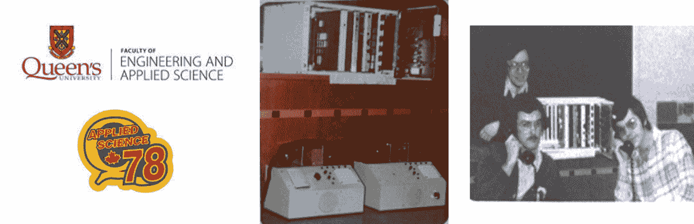

# 持续测试、质量、安全和反馈的经验与陷阱。

回顾我超过 48 年的职业生涯，我认为我注定要专注于现在被称为的**持续测试**、**DevOps**、**DevSecOps**、**SRE**，但这些标签直到最近才出现。 在这段时间里，我主要专注于为软件开发、交付和运营设计、开发和实施测试、质量、安全和反馈策略，以及自动化平台和工具。 在这段时间里，我的职业发展与从软件瀑布模型到持续交付和运营方法论的演变相一致。 我能够使用并贡献于这些策略、平台和工具的发展，最终因为我的终身工作而被 IEEE 授予 2016 年 IEEE 6 区杰出工程师奖。 在自动化方面的贡献。

本章通过我一生的经验、案例、经验教训和需要避免的陷阱，解释了如何避免这些陷阱的策略。

本章的前几节按照时间顺序组织，解释了我的学习路径。 后面的部分总结了我在职业生涯中学到的实践和陷阱，这些将对正在经历数字化转型的其他人有用。

在本章中，我们将讨论以下 主要内容：

+   一生致力于测试、质量、安全和反馈的研究，专注于 DevOps、DevSecOps， 和 SRE。

+   Bell-Northern – 世界一流的大学

+   作为 商业企业的测试

+   咨询 和教学

+   经验教训、陷阱和克服陷阱的策略

让我们 开始吧！

# 一生致力于测试、质量、安全和反馈的研究，专注于 DevOps、DevSecOps 和 SRE。

回到 1960 年代，我是一个在加拿大安大略省金斯顿的工人家庭中长大的小男孩。 我们并不富裕，但我们有彼此。 我的父母都很努力工作，为我和我的两个姐妹提供食物和房子。 我是家里的小宝贝，我和我两个姐姐相差七岁。 基本上，我有三个妈妈，因为我的姐妹从一开始就把我看作“婴儿马克”，这个昵称一直伴随我到成年。 我也一直带着这个名字。

这种情况给了我大量的时间来玩耍和弄坏东西。 这个事实为我提供了实验的机会，因为我被宠坏了，而这也很好，因为我天生有些懒散——这是一个一直持续到今天的特质，也是我终身对 自动化 感兴趣的原因。

我喜欢拆解机械物品和家用电器，尝试理解它们是如何工作的。 这些早期的经验教会了我很多关于测试、质量、安全和反馈的重要性，因为我拆解的一些物品让我和我的猫 Puff 都受了轻伤和电击。 (那只猫有时是我的实验助手。）我还学到了遵循质量过程的重要性，因为我很少能在没有爸爸帮助的情况下把东西重新装好。 从爸爸那里得到帮助。

也许是因为我在家里弄坏了很多东西，我的父母给我买了一系列的 MECCANO 模型套件，这些套件是由机械金属零件组成的自制工具包——螺母、螺栓、预先打孔的支架和金属片、齿轮、轮子、皮带和滑轮，你可以用它们来创造各种东西。 *图 3**.1* 展示了它的样子。

图 3.1 – MECCANO

我特别有兴趣的是用 MECCANO 的上链马达，后来是 MECCANO 电动马达，来自动化我所做的玩具。 我记得我做了一个能自动行驶的装载机。 它会撞到家具上，因为它有运动功能，但没有传感器或反馈系统。 我对这个结果不满意，因为它与真正的装载机相比，实用性非常有限。 由于 MECCANO 没有传感器，所以我决心寻找另一些可以 实验的东西。

离我家几条街远有一家“神奇”的商店，名为*爱好商店*，里面有低价的玩具模型和许多吸引我的东西。 在我每周的小额零花钱支持下，我可以买到微型塑料比例模型飞机，这些飞机不仅能飞，而且还有控制元件，可以在用橡皮筋发射后操控飞机的飞行。 这种控制能力非常粗糙，因为发射后无法调整——这一点也导致了许多意外事故，但我可以根据之前飞行的反馈，在测试飞行之间调整飞行路径。 模型车赛道也在模型商店里提供。 这更加令人满意，因为我可以用手控调整速度，但从视觉角度来看，反馈非常有限，因此车子经常会被过度加速，跳出赛道并发生撞车。 这些早期的经历让我明白，及时的反馈是正确调整控制所必需的，反馈与控制的结合影响着即使是简单系统的结果质量和安全性。 简单系统也是如此。

虽然建造和操作模型很有趣，但这并没有满足我对更好控制系统的兴趣，而且它们没有日常实用性。 我的第一辆自行车让我更为满足，因为我可以同时控制和监控我的方向和速度，并用它去某个地方，尽管它需要花费很多力气踩踏板。 在青少年时期，我开始建造和操作摩托车、电动自行车和汽车，其中一些如图 3**.2*所示。由于资金紧张，我会花很少的钱买一辆不工作的自行车或汽车，然后与爸爸和机械师朋友一起修理，使其能够上路。 在这个过程中，我学到了很多关于机械和电气系统的知识，也了解了仪表盘指示器的重要性。 每一次转变都让我接触到越来越复杂的系统，这些系统需要多重控制和反馈机制才能可靠 且安全地运行。

图 3.2 - 摩托车和汽车

我注意到许多控制和反馈功能中都使用了电子元件。 对我来说，这些都是黑匣子。 于是，我决定在高中学习电子学，了解电子学是什么以及它是如何工作的。

我在 10 年级电子学课上的第一个项目是制作一个多用电表，用来测量电流、电压和电阻。 虽然它是一个粗糙的电表，但它足够准确，可以作为一些早期电气和电子项目的反馈电表，直到我有足够的钱购买一台专业的福禄克（Fluke）多用电表。 通过暑期工作赚的钱，以及卖掉我的摩托车和汽车的利润，我能够购买 *Heathkits*，这是一种用于复杂电子系统的自组装套件。 按照套件的说明，我制作了电子工具，包括可调电源、频率计、示波器和面包板，如 *图 3**.3*所示。这些工具足够可靠和准确，可以在我的工程学院岁月中以及之后使用。 (我仍然保留着那台多用电表和电源——它依然在工作，50 年后依然有效)。

图 3.3 – 电子工具和 Heathkits

我意识到，尽管电子技术可以执行许多功能，用于复杂系统的感应和控制，但无论是人类还是自动化都需要操作它们，以完成有用的任务。 这时，我对计算机和 编程产生了兴趣。

我第一次编程的经历是在高中 10 年级。 我们可以访问一个远程的共享主机计算机，用来执行用 **A 编程语言** (**APL**) 编写的数学公式。 输入（控制）和输出（反馈）以电子终端的形式出现，看起来像一台打字机，如 *图 3**.4*所示。我喜欢终端的快速互动响应，但我了解到 APL 仅限于计算，并不适合一般用途的计算应用。 我们还可以本地访问一台大学的主机计算机，该计算机配有卡片读取器，可以接受以穿孔卡堆栈形式的 Fortran 程序。 共享的 IBM360 主机会按批处理作业顺序运行每个程序，输出（反馈）会通过行式打印机生成。 由于读取、运行和输出的序列是串行的并且具有变动性，反馈可能会根据程序的大小和排队的批处理作业数量而延迟数小时。 从程序创建到反馈的时间是令人沮丧的 且缓慢。

图 3.4 – 早期计算机与编程

几年前，我购买了一台 Radio Shack TRS-80 个人电脑和一台 Commodore 64，这台电脑直接通过键盘以 Basic 语言进行编程。 微处理器专门用于一个单一应用程序。 磁带提供了“大容量数据”存储和检索功能，因为内存电路非常昂贵且容量有限。 字符模式显示器可以实时输出字符，这对于实时反馈非常有用，但输出格式有限，尤其是在图表方面。 和图表。

这些个人电脑还配有声耦合器，可以连接到电话听筒进行数据传输，连接到其他远程计算机，这样我就可以实验 TRS80 和 Commodore 之间的数据通信。 这是我第一次体验自动化远程控制和实时远程反馈。 这为许多新应用开辟了可能性，如远程控制机器和互动视频游戏等的互动远程控制和反馈。 但通信速度受到调制解调器限制，只有 300 波特。 我很快意识到，精确的实时控制和反馈只有通过特殊的硬件和固件才能实现，这些硬件和固件可以构建更精确的机器级定时，以满足实时控制应用的需求。 我购买了一些微处理器评估工具包，并学习了汇编语言和集成电路逻辑设计，了解实时传输控制和 反馈方法。

在我的 *皇后大学工程专业* 学习期间，我学到了更多关于测试、质量、安全性和反馈对于 系统设计的重要性。

在我做的一个暑期工作中，我在 多伦多的一家 **埃索石油** 公司数据中心的输入/输出部门工作，那里有一台大型的 IBM360 大型计算机，用于加拿大范围内的石油物流计算。 输入是打孔卡片，输出是一个“高速”线路打印机，生成连续的多份复印纸，并由碳纸分隔。 打印生成后，碳纸和打印副本必须通过“分解器”机器分开，然后使用“爆破器”机器将各个页面分开并堆叠。 然后，分开的副本用金属针装订成书籍形式，便于分析人员阅读，他们每天早上都会在指定的邮箱槽中收到自己的副本。 每早。

从卡片输入到输出（印刷书籍）的反馈时间通常超过 16 小时，所有当天所需的输出都需要这么长时间。 如果分析员发现问题，问题就必须排队等到第二天才能重新测试。 物流问题意味着一些石油交货会因为每天的操作调度而迟到。 多次，尤其是在系统升级错误时，整个一天的测试运行失败，导致整个数据中心的物流操作中断。 这再次让我明白，加速测试、质量保证、安全性和反馈对于 确保操作至关重要。

在我大三的 暑假，我有幸在电信制造商 **北方电信** (**NT**)工作，他们把我安排到 贝尔-北方研究院 **Bell-Northern Research** (**BNR**)，因为他们需要一种方法来测试 BNR 正在研究和开发的新一代分组交换系统。 在 BNR，我在专家科学家的指导下，开发了用于测试新分组交换机的干线卡的特殊电路、纳米代码、微代码和高级软件。 这将测试时间从几天缩短到了几分钟，大大提高了制造技术人员的质量检验精度，并减少了调试时间。 这是一个让我深刻认识到自动化在改善反馈方面具有改变游戏规则的力量的教训。

我的皇后大学 工程论文项目，名为 **Intellicom**，是我与两位工程专业同学的合作成果。 我们设计并构建了第一批空间交换式多功能私人办公室电话系统之一，如 *图 3**.5*所示。最终，这一项目 在一次区域大学工程活动中获得了认可。  

图 3.5 – Intellicom 工程论文项目

我们构建了中央控制器，包含一个使用微处理器板的开关控制器、内存卡和带有混合模拟-数字转换器的电话线路卡，所有部件通过电线包裹的背板互联。 中央控制器和线路卡具有 LED 显示屏，用于提供实时操作反馈。 我们还设计并制造了四个多功能手持终端，配有用于输入数字和控制的按钮，以及用于终端用户反馈的 LED。 中央办公单元和手持终端之间的控制和反馈信息通过与语音线分开的控制线传输。 回顾起来，这是电话系统中常用信道信号的一个特别早期实现，这一信号技术后来成为电话系统发展的方向！ 鉴于学生预算非常有限，我们四处寻找零件，比如借自宿舍的手持终端，我的暑期学生老板也慷慨地从 BNR 的废料堆中捐赠了一些零件。 我们不得不使用 256 字节的 eROM 存储引导程序，和 1 Kbyte 的 2,102 RAM 来存储整个用 68 K 汇编语言编写的操作软件。 这要求我们进行一些 创意编程。

这是一个具有挑战性的项目，考虑到它必须在毕业前完成，尽管课程负担非常重！ 我们从一开始就意识到，按时完成的唯一希望是确保我们的进度始终朝前推进。 如果出现重大错误，恢复的时间不多。 因此，我们采用了增量设计、构建、测试、锁定的方法——这后来被称为**敏捷**和**DevOps**。 随着越来越多的部分被锁定，测试阶段的复杂性和时间大幅增加，因此我们自动化了测试。 这为我们节省了大量时间，并极大地提高了信心和质量。 通过破坏性测试，我们发现并解决了潜在的安全问题，例如串音和未经授权的监听。 最令人满意的时刻是，当我们的教授看到所有功能都正常工作，并且无法让我们的系统在最终的“演示日”崩溃时。

# BNR——世界级大学

1978 年毕业后，我被 NT 聘用，位于加拿大安大略省贝尔维尔，并最初被 NT 指派到**贝尔北方研究院（BNR）**，位于加拿大安大略省渥太华。 我的任务是继续我之前暑期工作的项目，即将实验性的 SL-10 分组交换系统技术从 BNR 实验室转移到 NT 制造部门。

在 1970 年代末，BNR 是一个完美的学习环境。 它汇聚了通信行业中的顶尖人才。 整个组织充满了创意、活力、创新和合作精神。 它的文化以电信系统的研究与开发为核心。 BNR 拥有真正令人惊叹的实验室能力，且许多项目都能轻松获得资金支持。 在这里工作提供了许多机会， 可以与三大公司——NT（后来更名为 NorTel）、BNR 和运营公司**贝尔加拿大**的优秀科学家和工程师合作。

我被分配到 BNR 分组交换组的系统测试团队，而我的 NT 角色是确保 SL-10 为 NT 制造做准备，负责在工厂中构建和测试 SL-10 节点和组件。 这个角色还包括开发一套切换驻留的测试程序，以验证各种系统组件，称为**在线下测试（ISLOT）**，这一独特的职责让我学习到研究、技术开发和业务制造操作。 由于我是组织中为数不多的拥有这样系统级角色的人，我也有机会参与客户演示和互动。

SL-10 在现场实验中的早期成功获得了认可，NT 接到了来自德国**德意志联邦邮政**的订单，项目名称为**柏林分组实验** [一个名为**柏林分组实验**](https://de.wikipedia.org/wiki/Deutsche_Bundespost)。

我被派往柏林安装交换机，如 *图 3**.6*所示。由于 NT 和 BNR 在德国没有支持办事处，我必须准备好处理所有问题，借助远程通话指导 BNR 的科学家和工程师，他们位于加拿大渥太华。 我工作的质量和向 BNR 提供的反馈对项目的成功至关重要，业务期望非常高。 如果柏林节点表现良好，客户将为德国的数据包网络购买大量 SL-10 节点，这对 NT 来说具有战略意义，他们希望扩展他们的业务 到欧洲。

我预料到会遇到一些问题，但事实证明这是一次真正的“磨炼”。在柏林现场，我们发现了许多 SL-10 节点的问题。 我们发现并解决了电源问题，连接器和电缆不匹配，软件性能问题，电源恢复程序，系统命令问题以控制系统配置，状态和故障指示器以及协议 通信问题。

此外，我们发现了关于传达失败信息、上传远程修复进行测试以及在现场测试验证修复困难的问题。 历时九周，但最终，交换机运行良好，足以满足实验的现场试验目标。 最终，德国确实继续了额外的订单，这成为了欧洲首个 大型数据包网络，名为 **DatexP**。在这个过程中，我们学到了很多关于如何使 SL-10 节点投入运营的经验，远程支持所需的反馈机制，以及需要改进以加速投入运营过程的内容。 和运营。

从测试的角度来看，使用 BNR 设计的微处理器协议测试仪进行数据协议仿真，以及 NT 设计的数据监控工具 **DataSope** 是最重要的。 这些工具在安装过程中替代了主机和终端，帮助诊断各协议层的连接问题。 测试结果可以打印出来，然后传递给开发人员，以便诊断问题并验证后续的修复。 其他反馈机制包括电路板上的 LED 指示灯和 SL-10 字符模式的视频显示管理终端。 这些工具提供了宝贵的线索。 它们没有互联，需要大量的人工协调，才能形成连贯的事件记录。 我意识到，如果这些工具能设计得与系统以及彼此更紧密集成，测试、诊断、修复和重新测试的周期将大大提高效率。

图 3.6 – SL-10 BERPEX

BERPEX 的成功经验向 BNR 和 NT 表明，SL-10 是一个重要的商业机会。 我们已经有来自比利时银行等客户的网络数据传输新业务前景， 例如**法国巴黎银行**， 他们希望在 1979 年安装一个网络。 但在我们交付之前， 质量需要改进。 我们才能交付。

1979 年初从柏林回来后，我被指派领导一个测试团队，验证 SL-10 的“通用 10 版”，该版本整合了柏林实验中确定的硬件和软件更改。 乐观估计，验证系统更改并达到我们的质量目标，包括客户要求的协议和网络配置，需要八周时间。 然而，测试是手动的，而且有成千上万的测试。 每个协议需要数百次测试来验证每次更新。 我们不断发现严重的问题，导致系统测试过程被重置。 我们发现许多柏林没有测试的协议问题，以及一些多节点测试拓扑问题，这些问题超出了柏林项目的范围。 实际上，我们达到 SL-10 通用 10 版质量目标的时间是八个月，比原计划多了 6 个月！ 最终，我们有了一个满足客户质量目标的交换机， 可以交付给 SGB。

我被指派到现场负责调试最初的三台 SL-10 节点——布鲁塞尔的主节点，以及安特卫普和根特的两个节点。 在 SL-10 通用 10 测试和质量改进上的投资获得了回报。 节点的安装比在柏林时快得多。 我能够在几天内完成每个节点和协议接口的调试，比在德国的 9 周大大缩短了时间。 节点之间的连接确实花了更长时间，但这并不是 NT 或 SL-10 的错。 比利时电话公司的干线连接延迟交付。 一旦干线连接可用，SL-10 分组网络在几天内便启动并正常运行。 SGB 成为 NT 的一个重要客户，SL-10 也成为全球许多其他客户的首选分组系统。 我将现场成功的一部分归功于我之前开发的自动化 ISOLT 测试软件和干线测试系统。

然而，回顾起来，有一件事并不好。 6 个月的“过度估计”是个问题。 虽然大家普遍称赞结果的质量，但管理层对于 验证发布所需的时间并不满意。 我接到了一个任务，要找出如何将 SL-10 的质量验证时间从 8 个月缩短到 2 个月。

答案显而易见——自动化那些费时的测试，并建立一个可配置的测试实验室，以适应不同客户所需的各种系统拓扑结构。 我被赋予了创建一个新团队来开发测试工具的角色。 考虑到之前的经验，我知道测试系统必须强大、可扩展，并且功能丰富。 它必须是开发人员、测试人员和现场工作人员都能轻松使用的工具，以便他们能够高效地沟通测试和测试结果。 它必须具备足够的容量和性能，能够测试高性能、高可扩展性的分组网络，支持多种协议、线路和 干线接口。

在几年内，我的团队 开发了一套名为 **网络测试环境** (**NTE**). 我的论文， *集成化 SL-10 分组网络测试中心*，于 1985 年发表在 ACM 期刊中，解释了它是如何运作的。 *图 3**.7* 展示了该工具集中的主要工具架构的部分插图。

图 3.7 – 网络测试环境

共有四种类型 的工具：

+   **交互式协议测试仪 (IPT)**：它模拟通信协议， 可以通过 CLI 进行交互操作或远程控制。

+   **网络负载测试系统 (NLTS)**：它 生成并测量 网络流量。

+   **网络过程监控器 (NPM)**：它 可以生成内部流量，并执行 网络监控。

+   **网络测试系统 (NTS)**：这是一种通用的自动化测试控制器 ，可以通过我们开发的测试语言 （**测试语言** ，简称 **TLAN**）自动化执行操作并监控网络中其他工具和管理界面的结果。

除了 NTS 外，所有这些工具都在产品硬件上运行，这使得它们能够扩展到大型配置，同时也可以扩展到产品本身，并提供与现场节点集成的用例。 这种方法还确保了工具共享相同的管理和更新流程。 NTS 在一款基于 Unix 的商用微型计算机上运行，该计算机从微型计算机到大型机都有，能够根据测试需求进行扩展，并由供应商进行维护。 由于 NTS 计算机与 SL-10 数据控制中心使用的是相同的品牌，它可以按照与产品相同的程序进行集成和维护。

通过这些工具的配备，我们拥有了一整套完全整合的测试工具，能够自动化实验室、现场试验和本地测试中的所有测试。 与 竞争对手相比，这是一个重大优势。 这为 SL-10 以及下一代 **数据包网络** (**DPN**)的实现做出了贡献，使其在 1980 年代和 90 年代初，成为全球连接导向包交换行业中效率、质量和销售水平最高的技术。

NTE 工具获得了业界认可，持续升级，并成为 全球电信网络 从电路交换向 **信令系统 7** (**SS7**) 和 **综合业务数字网** **（ISDN）** (**ISDN**)。

在此过程中，我对全球 **国际标准化组织** (**ISO**)的标准化协议合规性测试的倡议作出了领导性贡献，并提出了一个名为 **树形和表格组合符号** **表示法** (**TTCN**) 的平台。

由于这一成功，我在网络测试技术方面的职业方向得到了巩固，并通过在 BNR、ECI Telecom 和 vPacket Communications 等一系列项目中得到提升，如 *图 3**.8*。

图 3.8 – 集成网络测试技术

在 BNR，我被提升为全球测试技术总监，负责为 所有 BNR 和 NT 网络及终端产品创建测试系统。 从 80 年代中期到 1991 年，我的团队为所有交换部门的产品以及为我司产品配套的第三方终端设备开发了一系列测试系统。 这些包括 **测试与流量仿真** (**TATS**) 自动化平台，用于网络产品系统和回归测试，配有标准化测试套件的远程合规性测试平台用于第三方资格认证，以及用于测量 测试覆盖率的工具。

我们开发的一个 更为重要的工具平台，名为 **测试执行管理器** (**TEAM**)，大大减少了设置和运行网络测试用例的时间，使得每季度节省了超过九千万美元——这一成果持续了多年！ 它是我们公司在开发、集成和系统测试过程中的关键平台。 TEAM 通过开发人员的 Unix 工作站窗口操作，并提供控制和反馈。 它确保每个用户会话都安全，并协调了成千上万的开发人员和实验室系统之间的测试环境预订，这些都是网络开发和 系统测试所必需的。

后来在 ECI Telecom 和 vPacket，我负责指导开发灵活的远程访问产品，这些产品提供了许多配置选项，需要进行测试。 为了减少测试时间，我们构建了可以快速重新配置的灵活测试设置，同时运行自动化测试用例，并设计了内建测试能力来监控网络产品的系统性能。 将测试能力无缝集成到产品和流程中这一想法，提供了快速的变更资格认证，并在开发、集成、 和生产过程中改进了协作。

# 作为商业企业的测试

由于我在职业生涯中花费了大量时间开发测试技术，因此参与测试系统作为商业业务对我来说是合乎逻辑的。 如*图 3.9*所示，在 1990 年代和 2000 年代初，我在**Tekelec**、**VIEW Engineering** 和 **Spirent Communications**等公司，担任过多个高级工程和商业职位，负责商业测试产品平台的开发。

图 3.9 – 商业测试产品

在这段时间里，我创办了一家名为*EdenTree Technologies*的公司，专注于为网络实验室开发智能测试自动化平台。这使我接触到了全球数百个客户在网络、企业、运营公司和政府机构中的测试和质量保证环境。我发现，测试是发布流程的瓶颈，并且对大多数行业实现质量构成了障碍。我清楚地看到，我在职业生涯中之前学到的许多关于测试、质量、反馈和安全的经验，能够帮助全球的许多组织。

# 咨询与教学

从 2008 年开始，我的职业生涯越来越多地集中在为客户的测试、质量、反馈和安全流程提供高级咨询专业知识，以支持他们的 DevOps、DevSecOps 和 SRE 数字化转型项目。

作为 Spirent Communications 的高级解决方案架构师，我为客户提供关于将测试工具和自动化与 DevOps 测试环境和流程整合的建议。我还为开发一个强大的测试环境自动化平台提供了建议，名为**Velocity**。

在**Trace3**，我帮助建立了一个名为*Total DevOps*的咨询实践，强调为企业客户自动化**持续集成和持续交付**（**CI/CD**）流程。

2019 年，我创办了一家精品咨询公司，名为*Engineering DevOps Consulting*，根据我的书籍*Engineering DevOps*（2019 年由*Book Baby*自费出版），提供关于 DevOps、DevSecOps 和 SRE 转型的规范化实践。

图 3.10 – 合作伙伴与客户

如图所示，今天我通过与其他咨询、培训和媒体公司（如 DevOps Institute、DevOps.com、Xellentro、Learning Tree International 和 Opus Technologies）合作，提供 DevOps、DevSecOps 和 SRE 咨询服务，服务对象涵盖了许多企业、制造商、服务提供商和机构。

# 经验教训、陷阱和克服陷阱的策略

回顾我职业生涯中的经验，本章前面已有描述，我确定了克服这些陷阱的常见策略。 以下章节重点介绍了从质量、测试、测试自动化、标准化、安全性 和反馈角度的一些经验教训。

## 质量的重要性

我对质量的主要体会是，太多组织对如何定义、衡量和实现适合其使命的质量水平有着过于狭隘的理解。 爱德华·戴明博士，一位著名的质量管理专家，将质量定义为一个连续的过程，而不是静态属性。 他强调，质量不仅仅是满足规格要求或拥有无缺陷的产品，而是要满足客户的需求并超越 他们的期望。

追求“零缺陷”并不是一个适当的目标，这样做是浪费的。 相反，需要定义对组织使命的所有客户和利益相关者重要的用例。 当这些用例完全满足时，就达到了足够好的质量。

建立持续质量评估和改进流程比实现任何一个质量里程碑更重要，因为利益相关者的需求会随产品或 服务的成熟而发展。

持续测试是实现成功的持续质量程序的关键部分，因为测试提供了符合利益相关者用例的证据。 然而，单靠测试还不够。 其他因素，如对支持请求的响应速度、易用性、集成、成本效益和创新的产品路线图，对满足客户质量期望同样重要，需要监测，以便组织能够持续 成功。

## 将测试工具集成到系统中

我了解到，测试是每个过程、产品和服务中必不可少且重要的一部分。 测试 活动包括测试规划、测试创建、测试环境搭建、协调、测试执行、结果报告、结果分析、故障报告和修复后重测。 测试通常占据价值流总成本和时间的 50%以上。 成功的产品和服务认识到这一点，并在其产品和流程中建立了测试和监控能力。 通过这种方式，测试能力在需要时可以随时使用，并能随着产品的规模扩展而扩展。 这也确保了测试数据和结果能够以所有利益相关者能够立即使用的形式反馈，从而促进协作， 减少浪费。

## 测试自动化提升效率和竞争力

在大多数情况下，最好完全自动化所有类型的测试。 测试需要在产品价值流的每个阶段和每次迭代中频繁重复。 如果没有自动化，每个阶段都将因为等待有人执行测试而被延迟。 此外，手动测试容易受到人为错误的影响，导致浪费、假阳性和假阴性结果。

最具竞争力的产品优先考虑测试自动化，因为自动化测试带来的时间效率和质量效益使得组织在竞争对手面前拥有战略优势 ，而那些没有进行自动化的竞争对手则处于劣势。

然而，必须小心确保测试自动化有强有力的标准，否则测试维护和结果分析会成为瓶颈， 导致过度返工。

AI/ML 的进展有助于提高测试自动化和维护各个方面的质量和速度。

## 标准加速了协作

没有 强有力的测试文档标准，自动化测试可能会失控，变得浪费。 标准有助于工具和团队成员之间的协作。 为质量、测试策略、测试计划、测试用例、测试脚本、测试环境、测试执行、测试结果、测试分析和 反馈报告制定标准是非常重要的。

此外， 定义 **服务水平目标** (**SLOs**)也非常重要，它们决定了测试失败如何在组织中被优先处理，否则过程可能会导致 组织内部的摩擦。

理想的做法是 提供一个通用的测试工程平台，作为服务提供给开发、测试和运维团队，以促进测试文档的沟通，并确保组织中的每个人都能共享一个统一的“真理源” 来进行测试。

## 安全需要一种综合性的方法

随着系统变得更加分布式、通过多个管道交付并部署在分布式的短暂 基础设施上，网络安全问题持续演变和升级。 除非将安全控制措施内建到端到端 价值流中，否则安全问题会成为开发、集成、交付和生产过程中的主要瓶颈。

持续的安全思维模式和安全实践的实施需要结合 DevSecOps 实践和生产中的 SecOps 实践，以确保在生产部署前后最小化安全问题。 整个开发团队需要进行安全编码培训，并且安全实践需要通过针对每个应用程序的威胁建模来主导。 集成和交付过程中，代码、第三方库和镜像扫描器需要根据最 可能的威胁进行调整。

渗透测试和混沌安全工程需要作为交付过程的一部分，在发布到生产环境之前进行自动化处理。 所有的过程和资产都需要通过基于身份的零信任技术和防火墙进行保护，因为安全威胁可能来自组织的内部或外部。 部署最好使用不可变 技术，如 **基础设施即代码** (**IaC**)，容器和容器编排工具，这些工具能够使基础设施快速响应变化的威胁条件。 安全事件和指标的监控需要在每个价值流中从构思阶段 一直延伸到生产阶段。

## 没有反馈，你就像是在盲目前进

反馈以质量指标、测试指标和安全性指标的组合形式进行，对于监控和管理开发、集成、交付和部署中的变化流动效率至关重要。 可以将阈值和目标定义为 SLO，并持续使用 **服务级别指标** (**SLIs**)进行测量。 错误预算和错误预算政策是 SRE 实践中的概念，有助于管理这些活动，确保组织遵守这些指标。 组织。

# 总结

本章回顾了我的职业经验，提炼出关于质量、测试、安全性和反馈方面的常见陷阱和有效策略的见解。 它首先强调了质量的多维性质，呼应了德明的观点——质量不是静态的属性，而是一个持续的过程，需要与客户需求对齐，并超越他们的期望。 追求“零缺陷”被认为是浪费，强调了识别关键用例的重要性，并通过满足这些用例来实现令人满意的质量。 强调了持续评估和改进，认识到利益相关者需求的不断变化。 利益相关者的需求。

测试被视为一个关键方面，占用了价值流中大量的资源。 成功的产品将测试能力集成到产品本身，确保可扩展性，并且能够即时提供测试数据，以便利益相关者之间进行合作，从而 减少浪费。

测试自动化被突出为提升效率和竞争力的驱动力。 本章倡导全面自动化，以避免手动测试中固有的延迟和错误，但强调了强有力的标准对于维持测试维护和 结果分析的效率的必要性。

标准的建立被强调为在测试实践中实现协作和控制的关键。 从质量到反馈报告，标准被认为至关重要。 倡导建立一个通用的测试工程平台，它提升了沟通效率，并在整个组织内建立了共同的事实基础。 整个组织。

针对安全问题，本章强调了在整个价值流中采用全面方法的必要性。 从 DevSecOps 实践到生产中的 SecOps 实践，安全措施的整合得到了强调。 建议采用威胁建模、自动化安全测试和零信任方法，以应对内部和外部的安全威胁。 安全威胁。

最后，强调了反馈机制的重要性，结合了质量、测试和安全指标。 SLOs、SLIs 和错误预算政策被突出了作为持续监控和管理的实用工具，确保组织与已定义的指标保持一致。 已定义的指标。

下一章将解释一种工程方法，指导转型活动朝着成功的方向发展。 朝着成功发展。

# 第二部分：确定解决方案优先级

*第二部分* 聚焦于有效实施组织持续实践所需的战略规划和优先排序。 它从探索一种系统的工程方法开始，用于规划持续测试、质量、安全和反馈的解决方案。 这为组织提供了一个有纪律的框架，确保它们的转型努力既结构化又有效。 并且有效。

本节通过讨论如何确定符合不同组织、产品和服务具体需求的转型目标来推进。 它介绍了帮助设定这些目标的工具和方法，提供了一个清晰的路线图，供企业遵循。 此外，本节还讲解了通过发现和基准测试来了解组织当前能力状态的重要性，这对于识别需要改进的领域至关重要。 本节还讨论了如何选择合适的工具平台以及集成 AI 和 ML 技术，这些都能增强持续实践并促进持续改进和韧性文化的培育。 本书的这一部分对于那些希望通过持续实践战略性地优先考虑和简化数字转型方法的人来说至关重要。 持续实践。

本部分包括以下章节： 章节：

+   *第四章**, 持续测试、质量、安全和反馈的工程方法*

+   *第五章**, 确定转型目标*

+   *第六章**，发现与基准测试*

+   *第七章**，选择工具平台和工具*

+   *第八章**，将 AL/ML 应用于持续测试、质量、安全性和反馈*
