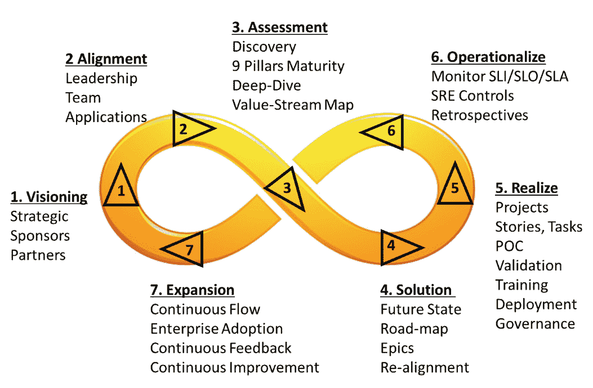
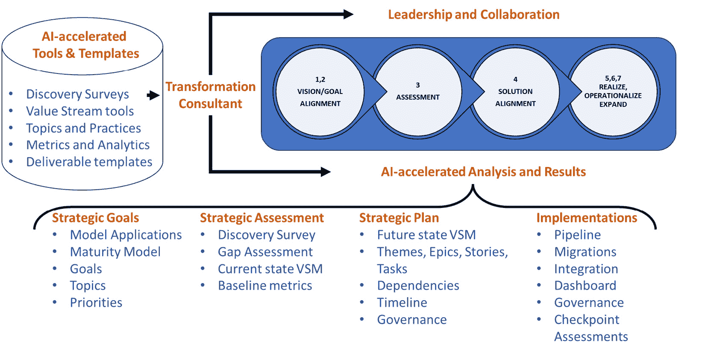
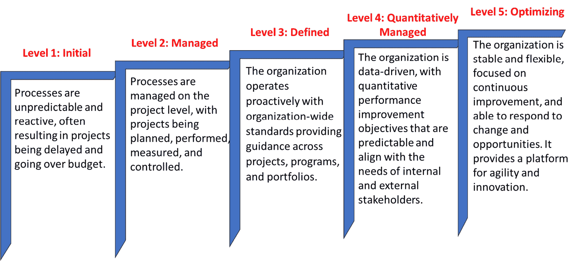
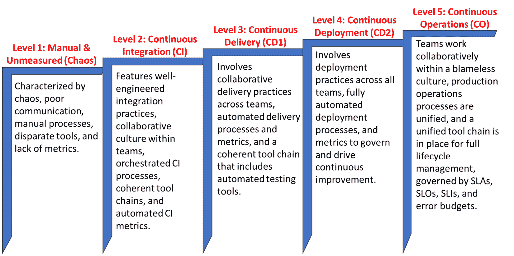
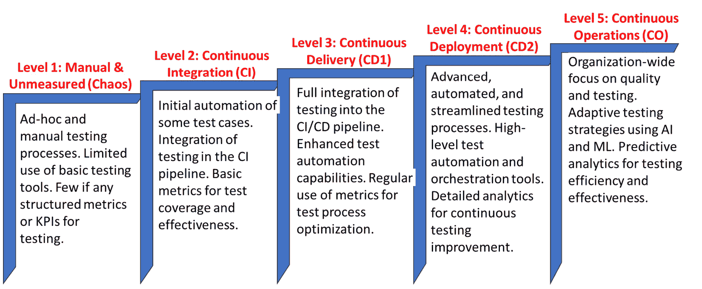
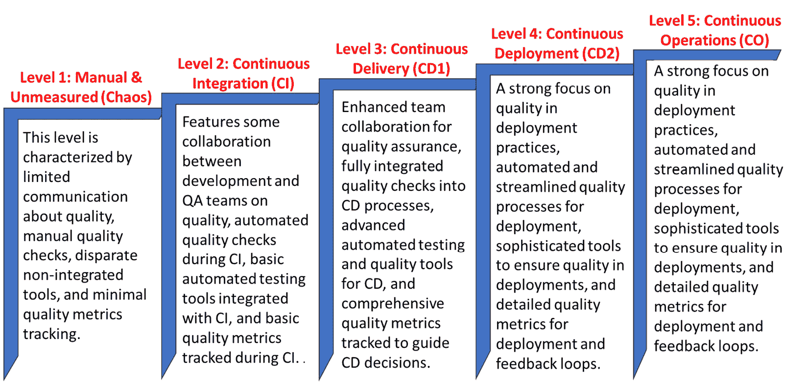
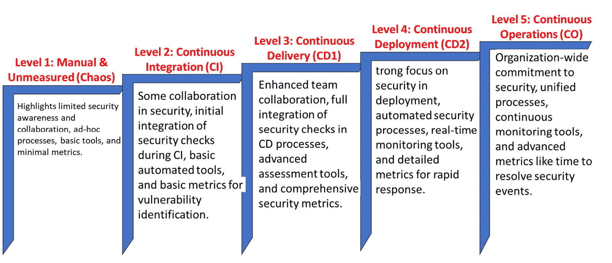
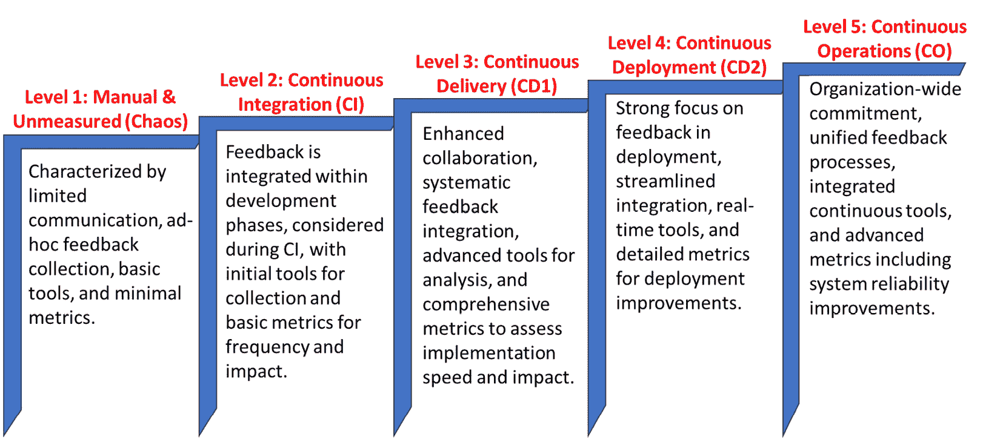

# 持续测试、质量、安全性和反馈的工程方法

本章解释了一种系统化、规范化的工程方法，用于规划持续测试、质量、安全性和反馈解决方案。 这种方法是多年来根据前一章中描述的经验而发展出来的。 它包括七步转型工程蓝图，解释了专家转型顾问的重要性以及使用 AI 工具加速工作，并解释了**能力成熟度模型** (**CMMs**)以及持续测试、质量、安全性、 反馈的能力成熟度等级。

在本章中，我们将涵盖以下 主要话题：

+   为什么需要工程 方法？

+   七步转型 工程蓝图

+   能力成熟度模型 指导转型

+   能力成熟度等级 – 持续测试

+   能力成熟度等级 – 持续质量

+   能力成熟度等级 – 持续安全性

+   能力成熟度等级 – 持续反馈

让我们 开始吧！

# 为什么需要工程方法？

实施持续测试、质量、安全性和反馈需要一个精心设计的数字化转型方法，因为这不仅仅是采用新工具，而是从根本上改变组织的运作方式、交付方式和衡量价值的方式。 这涉及到重新定义流程、文化和思维方式，将这些元素无缝地整合到软件开发生命周期中。 这是一种全面的变化，需要在实践和部门间的协作上进行转变，并将这些努力与更广泛的商业目标对齐。 这种转型确保质量和安全性不再是事后考虑的因素，而是开发过程中的核心组成部分，是不断监控和持续改进的方面。 开发过程。

组织的数字化转型不仅影响技术，还会影响战略、运营和客户互动。 目标是提高效率、管理风险并发现新的 变现机会。

组织在数字化转型中常常面临挑战，原因在于以下几个 关键陷阱： 陷阱：

+   **缺乏清晰的愿景和战略**：如果没有明确的方向和对数字化转型内容的理解，组织可能会在有效地协调 各项努力上遇到困难。

+   **抗拒变革**：组织内的文化抗拒，特别是来自那些习惯于传统工作方式的员工，可能会阻碍新技术 和流程的采用。

+   **领导承诺不足**：转型需要强有力的领导来推动变革、克服抗拒并分配 必要的资源。

+   **规划与执行不力**：缺乏足够的规划、不切实际的时间表和不足的资源可能导致 实施失败。

+   **技术挑战**：过度依赖技术而忽视必要的流程和文化变革可能导致 不理想的结果。

+   **扩展失败**：将成功的试点项目扩展到更广泛的组织中存在困难，可能会妨碍 转型努力。

+   **技能与专业知识不足**：员工缺乏适应新数字工具和流程所需的技能，可能成为一个 重大障碍。

+   **缺乏衡量标准**：没有度量标准来监控进展、绩效和 **投资回报率** (**ROI**)，可能 导致各项努力失去方向，无法准确衡量成功或 失败。

+   **服务不足与可持续性**：未能确保数字化解决方案能够在时间推移中保持可维护性和可持续性，可能导致系统在长期内无法持续，破坏 整个 转型努力。

对于成功的数字化转型来说，工程化方法至关重要，因为它为通常复杂而多方面的过程带来了结构化、纪律性的方法论。 这种方法确保数字化转型不仅仅是采用新技术，而是重新设计流程、工作流程和组织结构。 它有助于有条不紊地解决转型过程中的技术、流程和文化方面的问题，降低风险，提高效率，并增加实现期望结果的可能性。 通过应用工程原则，组织可以系统地规划、实施、衡量和迭代其转型工作，将其与业务目标对齐，并确保可持续、长期的成功。

# 理解七步转型工程蓝图

在 **工程化 DevOps** 中描述的 *图 4**.1* 中展示的 七步转型工程蓝图 *。该蓝图规定了一个无限循环的七步骤，用于有条不紊地实现您的转型目标，无论您当前的目标或成熟度水平如何。 相同的七个步骤适用于希望将其测试、质量、安全和反馈流程转型为 连续流程的组织。

图 4.1 – 七步转型工程蓝图

从一个成熟度级别转型到下一个更高级别，需要通过每个改进周期的七个步骤进行过渡，以实现在人员、流程和技术三个转型维度及持续测试、质量、安全和反馈实践支柱上的平衡，正如 *第二章*中所述。当维度和支柱失衡时，将会产生摩擦，影响流水线的高效运行和目标的实现。 对维度和支柱的变更必须逐步引入，并在连续的 改进循环中进行系统测试。

七步转型工程蓝图 **包括以下** 七个步骤：

1.  **愿景制定**：定义组织的战略需求，并确定在战略层面上主导转型的赞助人，以及需要与转型战略对齐的关键合作伙伴组织。

1.  **对齐**：对每个转型周期至关重要的领导者和关键利益相关者就选定应用的具体目标达成一致。

1.  **评估**：对于选定应用的当前状态，发现和评估成熟度，针对特定主题进行深入评估，并创建相对于组织目标的当前状态价值流图。

1.  **解决方案**：一个专家团队对评估数据进行分析，并制定未来状态的价值流路线图，包括主题、史诗和用户故事，并与关键利益相关者达成一致。

1.  **实现**：定义实施项目，包括用户故事和任务，进行**概念验证**（**PoC**）试验以验证解决方案选择，解决方案在选定的应用和用例中得到验证，随着解决方案部署到生产环境，进行培训，并启动新解决方案的治理实践。

1.  **运营化**：已部署的改进通过**站点可靠性工程**（**SRE**）实践进行监控和控制，监测 SLI、SLO 和 SLA 指标。进行回顾性评审，创建可操作的优先级排序的经验教训，以便**持续改进**。

1.  **扩展**：一旦为选定的应用实现解决方案，组织可以安全地将解决方案扩展到组织中的其他应用。进一步的转型周期将为每个应用带来更高的成熟度。

该工程蓝图对于旨在提升实践到更高能力成熟度的组织至关重要，确保对**转型**采取平衡、系统化和渐进的方式。

如果企业未能遵循这一转型蓝图，可能会出现若干风险和后果，削弱转型的效率、效果和整体成功。 以下是未遵循 蓝图步骤的风险和后果：

1.  **愿景**：

    +   **风险**：如果没有明确的愿景和完善的转型战略需求文档，组织可能在转型过程中缺乏方向和目标。 这可能导致目标不对齐， 资源浪费。

    +   **后果**：缺乏强有力的支持和与关键合作伙伴的战略对齐可能导致对变革的抵制、团队的低采纳率，并未能实现 转型的全部收益。

1.  **对齐**：

    +   **风险**：未能就转型目标达成一致，可能导致不同团队和部门之间在期望和交付物上的不一致。 这将影响整体协调。

    +   **后果**：这种不对齐可能导致团队之间的摩擦、低效的工作流程和缺乏协作，所有这些都可能拖延或破坏 转型计划。

1.  **评估**：

    +   **风险**：跳过对当前状态和能力成熟度的评估可能会导致在理解从何处进行改进的基准时出现空白。 这会留下理解上的漏洞。

    +   **后果**：没有明确的评估，进展很难衡量，也难以识别需要改进的领域，导致资源的低效使用，并可能错过关键问题，从而阻碍 转型 的成功。

1.  **解决方案**：

    +   **风险**：未能利用专家分析来制定未来状态的路线图，可能导致解决方案选择不当，且转型过程缺乏清晰性和方向。 转型旅程可能因此受阻。

    +   **后果**：组织可能实施与其具体需求不匹配的解决方案，导致无效的做法和成本增加，并可能未能实现 预期结果。

1.  **实现**：

    +   **风险**：忽视实现阶段，包括 POC 试验和验证，可能导致部署的解决方案未经过充分测试 或理解。

    +   **后果**：这可能导致运营中断、用户体验下降、生产力降低，以及团队成员对实践缺乏信心。

1.  **操作化**：

    +   **风险**：忽视对已部署改进的监控和控制可能导致无法看到实践的表现和效果。

    +   **后果**：没有适当的监控和回顾，组织错失了持续改进的机会，可能导致运营停滞和低效。

1.  **扩展**：

    +   **风险**：未能在组织内推广成功的实践可能会将转型的影响限制在少数特定的应用或团队中。

    +   **后果**：这一有限的范围可能会阻碍组织实现更广泛的运营效率，降低转型努力的整体投资回报率。

总结来说，未遵循七步转型工程蓝图会显著阻碍组织成功实施并从实践中受益的能力。这些风险凸显了转型过程需要结构化、战略性方法的重要性，强调需要明确的愿景、对齐、评估、解决方案开发、实现、操作化和扩展，以确保成功融入企业。

下一部分将解释如何加速七步转型过程。

## 专家和人工智能加速转型

如*图 4.2*所示，建议由经验丰富的转型专家顾问，或由人工智能工具支持的小型专家团队，引导转型过程，充当“专家转型顾问”，可以是个人，也可以是集体形式。

*图 4**.2* 说明了转型顾问作为转型过程的编排者的核心角色。 转型顾问提供工具和模板，帮助加速转型过程的每个步骤。 在转型过程的每个步骤中，这些工具和模板可以根据组织的需求、成熟度水平和偏好进行定制。 利用 AI 工具在每个步骤加速此过程，以根据 前几步骤的结果为每个步骤的模板建议定制。

图 4.2 – AI 加速转型过程

专家顾问在编排七步转型工程蓝图中的角色至关重要，以确保组织转型工作的成功。 这些顾问带来了专业的知识、经验和技能，指导和促进转型过程的每一步，确保战略目标高效 和有效地实现。

在专家顾问的指导下，AI 工具能显著提升转型过程中每个步骤的效率、速度和质量。 。

以下概述了专家顾问的需求和角色，以及在蓝图的每个步骤中使用 AI 工具：

1.  **愿景**:

    +   **需求**: 为 转型建立清晰而战略性的方向。

    +   **顾问角色**: 专家顾问帮助定义组织转型的愿景，确保其与整体战略目标对齐。 他们与领导者合作，确定转型赞助商并对齐关键合作伙伴组织，利用其经验预见和减轻 潜在挑战。

    +   **AI 的角色**: AI 能分析来自各种来源的数据，识别可能并不明显的趋势、机会和威胁。 这些分析可以指导转型的战略方向。

    +   **顾问的指导**: 顾问们 可以解读 AI 生成的见解，将其与组织的战略目标对齐，确保转型愿景既雄心勃勃 又可实现。

1.  **对齐**:

    +   **需求**: 确保 所有利益相关者朝着 共同目标努力。

    +   **顾问角色**: 顾问通过促成领导者和关键团队成员之间的对齐会议，利用其专业知识弥合不同愿景和目标之间的差距。 他们帮助定义可实现的具体目标，确保每个人都致力于 相同的结果。

    +   **AI 的角色**: AI 驱动的工具可以通过提供协作、设定目标和追踪的平台，促进利益相关者之间的对齐。 **自然语言处理** (**NLP**)可以 分析沟通模式，以识别利益相关者之间的错位或混淆区域 。

    +   **顾问的指导**: 顾问可以利用这些洞察来调解讨论，澄清目标，并确保各方朝着 共同的目标前进。

1.  **评估**:

    +   **需求**: 了解 当前状态并识别出改进的领域。

    +   **顾问角色**: 通过评估，顾问诊断组织当前流程和技术的成熟度。 他们深入分析特定主题，并创建价值流图，提供对现状的详细理解，并识别出转型的关键领域 。

    +   **AI 的角色**: AI 可以通过分析代码库、基础设施配置和工作流模式来自动评估当前系统和流程，从而识别瓶颈 或低效之处。

    +   **顾问的指导**: 顾问随后可以解读这些发现，优先考虑改进的领域，并调整转型策略，以首先解决 最关键 的差距。

1.  **解决方案**:

    +   **需求**: 设计一份 与组织目标对齐的未来状态路线图。

    +   **顾问角色**: 专家顾问分析评估数据，制定全面的未来状态路线图，涵盖主题、史诗和用户故事。 他们确保利益相关者对齐，并根据组织的独特需求完善计划，凭借经验提出 有效的解决方案。

    +   **AI 的角色**：使用 AI，咨询顾问可以模拟不同的转型场景，以预测结果、识别潜在风险并优化转型路线图。

    +   **咨询顾问的指导**：这使得咨询顾问能够提出数据驱动的未来状态路线图，确保解决方案既具有创新性，又与组织的目标保持一致。

1.  **实现**：

    +   **需求**：有效地实施转型，并确保其与战略目标保持一致。

    +   **咨询顾问的角色**：咨询顾问监督实施项目的定义，进行 POC 试验，并验证解决方案选择。他们确保解决方案得到有效部署、进行培训并建立治理实践，运用专业知识预测并解决挑战。

    +   **AI 的角色**：AI 工具可以通过自动化日常任务、优化资源分配以及预测变更的影响，简化转型项目的实施。

    +   **咨询顾问的指导**：咨询顾问可以利用 AI 确保解决方案的部署高效、有效且得到密切监控，主动解决任何问题。

1.  **操作化**：

    +   **需求**：确保改进是可持续的，并对其进行监控以实现持续优化。

    +   **咨询顾问的角色**：通过实施 SRE 实践，咨询顾问帮助监控关键绩效指标（SLIs、SLOs 和 SLAs），确保所部署的改进能够交付预期的价值。他们促进回顾总结，从中提取经验教训，并将其优先考虑，以便进行持续改进。

    +   **AI 的角色**：AI 可以通过建议可观测性和高级监控能力、预测系统行为的分析以及自动化的事件响应来增强 SRE 实践。

    +   **咨询顾问的指导**：咨询顾问可以利用 AI 的洞察力来微调绩效指标，确保改进是可持续的，并且组织在不断优化其运营。

1.  **扩展**：

    +   **需求**：在组织中扩大转型规模，以最大化其影响力。

    +   **顾问角色**：专家顾问通过帮助组织将成功的实践扩展到其他应用或团队，指导组织完成这一过程。 他们帮助规划和执行进一步的转型周期，确保每个周期都能实现更高的成熟度 和效率。

    +   **AI 的作用**：通过分析不同应用程序和团队的绩效数据，AI 可以帮助识别哪些实践最有效并且准备好进行扩展。 和团队。

    +   **顾问的指导**：顾问可以通过使用 AI 来指导成功实践的战略扩展，确保决策是基于数据驱动的，并且 组织为更广泛的转型做好准备。 广泛转型。

专家顾问在转型蓝图的每个步骤中都发挥着关键作用，提供必要的指导、专业知识和支持，以确保转型具有战略性、对齐性、有效实施并且可持续。 他们的参与帮助组织应对转型中的复杂性，避免常见的陷阱，并更高效 且有效地实现预期结果。

转型顾问可以使用 AI 工具加速创建来自每个转型步骤的精心定制的分析和文档。 转型过程。

在每一步中，AI 工具与专家顾问的结合创造了强大的协同效应。 AI 提供了基于数据的洞察和自动化能力，能够简化和提升决策过程，而顾问则带来战略监督、行业知识和必要的人类判断力，以解读 AI 的输出并有效引导转型过程。 这种协作方法确保转型不仅与组织目标对齐，而且还利用最新的技术进展来实现 卓越的成果。

# 能力成熟度模型引导转型

CMM 是一个框架 帮助组织评估其业务流程的有效性和成熟度。 组织转型需要成熟度模型，因为它提供了一个结构化的路径来指导改进。 CMM 帮助识别当前的流程成熟度水平，并指导组织通过更高的纪律性和质量水平。 这种结构化的方法确保变革是可持续的，流程是高效的，组织能够更好地实现目标并适应 新的挑战。

**能力成熟度模型集成** (**CMMI**) 来源于原始的 CMM，该模型最初于 1980 年代末由 **软件工程研究所** (**SEI**) 在卡内基梅隆大学开发。 CMM 最初专注于 软件开发过程。 随着时间的推移，对于更为集成的方案需求变得显而易见，最终促成了 2000 年代初期 CMMI 的发展。 CMMI 扩展了其范围，不仅包括软件领域，还涵盖了产品生命周期管理和服务交付等其他领域，提供了一个更为详细和灵活的框架。 这种更广泛的适用性和集成方法使 CMMI 区别于 原始的 CMM。

*图 4**.3* 展示了 CMMI 的五个成熟度等级。

图 4.3 – CMMI 成熟度等级

这些 等级如下：

+   **第 1 级：初始** – 过程不可预测且反应性强，常常导致项目延期并超出预算。

+   **第 2 级：管理** – 过程在项目级别上得到管理，项目被规划、执行、测量 并控制。

+   **第 3 级：定义** – 组织采取主动方式运作，使用全组织范围的标准，为各项目、程序 和投资组合提供指导。

+   **第 4 级：量化管理** – 组织以数据为驱动，拥有可预测的量化绩效改进目标，并与内部及 外部利益相关者的需求保持一致。

+   **第 5 级：优化** – 组织稳定且灵活，专注于持续改进，能够应对变化和抓住机会。 它为敏捷性 和创新提供了平台。

修改后的 CMM 是软件交付能力所必需的，因为 CMMI 主要是为更可预测和稳定的环境设计的，而这些环境并不能完全应对现代软件开发的动态和迭代特性。 如今的软件交付需要快速 适应， **持续集成** (**CI**)和交付，以及快速响应市场需求变化的能力。 一个修改过的模型融入了这些方面，强调敏捷性、自动化、DevOps 持续交付实践和持续学习，涵盖了人员、流程和技术维度，这对于当前的软件交付格局至关重要。

*图 4**.4* 概述了一个软件 交付 CMM，其中包含 五个级别：

+   **一级：手动与未测量（混乱）** – 特征是混乱、沟通不畅、手动流程、工具不一致和缺乏 度量：

    +   **人员**: 团队成员之间沟通不畅。 指责文化。

    +   **过程**: 集成和交付过程的编排 是手动的。

    +   **技术**: 不同团队使用不同的工具。 没有 集成的工具链。

    +   **度量**: 很少，甚至没有，度量是自动化的。 发布不可预测且 容易出错。

+   **二级：持续集成（CI）** – 具有良好工程化的集成实践、团队内部的协作文化、编排的 CI 流程、一致的工具链和自动化的 CI 度量：

    +   **人员**: 开发和 QA 团队之间的集成实践已良好工程化。 CI 培训已到位。 团队内部有协作文化。

    +   **过程**: CI 流程已经编排和自动化。 代码在 CI 过程中被合并并测试到公共主干分支。

    +   **技术**: 为 CI 版本管理、构建和测试提供一致的工具链。 发布候选项托管在一个 构件仓库中。

    +   **度量**: CI 度量是自动化的，并用于管理 CI 活动。 开发人员每天提交 代码。

+   **第 3 级：持续交付（CD1）** – 涉及跨团队的协作交付实践、自动化交付流程和指标，以及包含自动化 测试工具的统一工具链：

    +   **人员**：已为开发、QA 和发布团队建立交付实践。 团队之间的协作文化 。

    +   **流程**：交付流程被协调并自动化。 回归测试、系统性能和用户验收 是自动化的。

    +   **技术**：已建立一致的工具链用于 CD，包括自动化工具 用于测试。

    +   **指标**：交付指标被自动化，并用于管理交付和发布 验收活动。

+   **第 4 级：持续部署（CD2）** – 涉及跨所有团队的部署实践，完全 自动化部署流程，并通过指标管理和推动 持续改进：

    +   **人员**：已为开发、QA、发布和运维团队建立了部署实践。 团队之间的协作文化 。

    +   **流程**：生产流程的部署由自动化协调 和自动化。

    +   **技术**：已建立一致的工具链用于部署，包括自动化工具来进行基础设施编排、生产环境监控及自动回滚 （必要时）。

    +   **指标**：部署指标被自动化，并用于管理生产环境中的部署并推动 持续改进。

+   **第 5 级：持续运营（CO）** – 团队在无责文化下协作工作，生产运营流程统一，且已建立统一的工具链用于完整生命周期管理，受 SLA、SLO、SLI 和 错误预算的管理：

    +   **人员**：开发、QA、发布和运维团队在无责文化中协作工作，确保产品质量和可靠性满足 利益相关者的要求。

    +   **流程**：生产运营流程在运营 和开发之间统一。

    +   **技术**：已建立统一的工具链，用于测试和监控应用程序、基础设施和 发布部署。

    +   **指标**：SLOs、SLIs、错误 预算和错误预算政策管理开发、交付、部署、和运营。

图 4.4 – 软件交付 CMM

没有标准的软件交付 CMM，但建议每个组织确定适合衡量该组织成熟度的模型。 该组织。

本章的以下部分提供了针对持续测试、质量、安全性和反馈的成熟度模型示例。 虽然没有标准模型，本章中呈现的模型与 *第一章* 中提供的定义以及 *图 4**.4*中说明的模型结构一致。

# 能力成熟度级别 – 持续测试

持续测试 CMM 在 *图 4**.5* 中概述了持续测试实践的五个成熟度级别：

+   **级别 1：手动与未测量（混乱）** – 临时和手动的测试过程。 基础测试工具的使用有限。 几乎没有任何结构化的测试指标或 KPI：

    +   **人员**：团队成员之间沟通不畅。 指责文化。

    +   **流程**：集成和交付过程的编排是手动的。

    +   **技术**：不同团队使用的工具各不相同。 没有 集成的工具链。

    +   **指标**：很少，甚至没有自动化的指标。 发布不可预测且 容易出错。

+   **级别 2：持续集成（CI）** – 初步自动化一些测试用例。 在 CI 流水线中集成测试。 测试覆盖率和有效性的基本指标：

    +   **人员**：开发人员与 QA 测试人员之间的初步合作开始。

    +   **流程**：测试流程已定义并自动化 用于 CI。

    +   **技术**：引入自动化测试工具用于 CI 测试用例。

    +   **指标**：基本的测试覆盖率和缺陷指标至少在 CI 过程中被跟踪。

+   **级别 3：持续交付（CD1）** – 测试完全集成到 CI/CD 流水线中。 增强的测试自动化能力。 定期使用指标进行测试 流程优化：

    +   **人员**：为持续测试实践建立了明确的角色。

    +   **流程**：根据需要，测试完全融入到开发生命周期中，以测试一个 发布候选版本。

    +   **技术**：使用一套一致的工具进行 测试自动化。

    +   **指标**：定期使用指标来改进测试流程和覆盖范围，以 发布候选版本。

+   **级别 4：持续部署（CD2）** – 高级、自动化且简化的测试流程。 高级的测试自动化和编排工具。 用于持续 测试改进的详细分析：

    +   **人员**：所有团队成员在测试中的高度协作。

    +   **流程**：标准化的先进自动化测试流程，包括用于部署的自动化测试 到生产环境。

    +   **技术**：已部署复杂的测试自动化和编排工具。

    +   **指标**：用于持续改进的详细指标和关键绩效指标（KPI）用于 部署验证。

+   **级别 5：持续运营（CO）** – 组织范围内聚焦质量和测试。 利用人工智能（AI）和机器学习（ML）进行自适应测试策略。 通过预测分析提高测试效率 和有效性：

    +   **人员**：全组织承诺于质量和 持续测试。

    +   **流程**：通过 AI 和 机器学习实现的自适应测试流程。

    +   **技术**：完全自动化、自学习的 测试系统。

    +   **指标**：使用预测分析 进行持续优化 测试。

该模型帮助组织评估并改进其持续测试实践，使其与软件交付和运营卓越的更广泛目标对齐。 每个级别提供了测试过程、技术和指标方面的具体关注领域，指导组织朝着持续 测试成熟度的方向发展。

图 4.5 – 持续测试 CMM

该模型对于组织评估并改进其持续测试实践非常有用。 它为每个级别定义了明确的标准，使组织能够识别在过程成熟度和技术集成方面所处的位置。 通过根据这些标准进行评估，组织可以 pinpoint（识别）具体的改进领域，并制定战略，朝着更高级别的测试成熟度进步，这对于实现更高效率、更高质量和更快的 软件交付至关重要。

# 能力成熟度等级 – 持续质量

该模型 在 *图 4**.6* 中展示了一个持续质量 CMM，包含 五个级别：

+   **第 1 级：手动与未测量（混乱）** – 这一层级的特点是关于质量的沟通有限，手动质量检查，分散的非集成工具，以及最小的质量 指标跟踪：

    +   **人员**: 关于质量的沟通有限。 反应式方法。

    +   **过程**: 手动质量检查。 没有集成到开发 生命周期中。

    +   **技术**: 分散的、非集成的 质量工具。

    +   **指标**: 很少，甚至没有质量指标。 最少的跟踪。

+   **第 2 级：持续集成（CI）** – 开发和 QA 团队在质量方面有一些协作，CI 期间进行自动化质量检查，基本的自动化测试工具与 CI 集成，并跟踪基本的质量指标 在 CI 过程中：

    +   **人员**: 开发和 QA 团队在质量方面有一定的协作 。

    +   **过程**: 自动化质量检查与 CI 集成 。

    +   **技术**: 基本的自动化测试工具与 CI 集成 。

    +   **指标**: 在 CI 过程中跟踪基本的质量指标 。

+   **第 3 级：持续交付（CD1）** – 增强团队协作以确保质量，将质量检查完全整合到 CD 流程中，先进的自动化测试和质量工具用于 CD，以及全面的质量度量指标，用于指导 CD 决策：

    +   **人员**：增强所有团队之间的协作，以确保 质量保障。

    +   **过程**：质量检查完全整合到 CD 流程中。

    +   **技术**：用于 CD 的先进自动化测试和质量工具。

    +   **度量**：跟踪全面的质量度量指标，指导 CD 决策。

+   **第 4 级：持续部署（CD2）** – 强调部署实践中的质量，自动化和简化的部署质量流程，确保部署质量的先进工具，以及详细的部署质量度量和 反馈循环：

    +   **人员**：强烈关注 部署实践中的质量。

    +   **过程**：自动化和简化的部署质量流程。

    +   **技术**：确保部署质量的先进工具。

    +   **度量**：详细的部署质量度量和 反馈循环。

+   **第 5 级：持续运营（CO）** – 全组织承诺于运维中的质量，开发与运维之间统一的质量流程，集成的监控和质量维护工具，以及先进的度量指标，包括 SLA、SLO、SLI 和错误预算，用于 管理质量：

    +   **人员**：全组织承诺于运维中的质量 。

    +   **过程**：开发与运维之间统一的质量流程。

    +   **技术**：集成的工具用于监控和 维护质量。

    +   **度量**：先进的度量指标，包括 SLO 和 SLI，用于 管理质量。

此模型对于描述组织的持续质量实践的成熟度级别非常有用，能够与软件交付和运营卓越的更广泛目标对齐。 每个级别定义了推进质量过程、技术和度量的特定关注领域，为组织在持续质量改进之路上提供指导。 通过根据模型的标准评估当前状态，组织可以识别需要开发或增强的特定实践，以达到下一个 成熟度级别。

图 4.6 – 持续质量 CMM

虽然没有标准的持续质量 CMM，但每个组织应该定义一个适合本组织的模型。 在 *图 4**.6* 中提供的模型可以作为创建特定于 该组织的模型的基础。

# 能力成熟度级别 – 持续安全性

*图 4**.7* 展示了一个具有五个级别的持续安全性 CMM，每个级别都涉及人员、过程、技术 和度量方面：

+   **等级 1: 手动与未衡量（混乱）** – 突出显示了有限的安全意识和协作，临时的过程，基本工具，以及 最小的度量：

    +   **人员**: 有限的质量沟通。 反应性方法。

    +   **过程**: 手动质量检查。 没有集成到开发 生命周期。

    +   **技术**: 不同、非集成的 质量工具。

    +   **度量**: 很少，甚至没有质量度量。 最小跟踪。

+   **等级 2: 持续集成 (CI)** – 安全性的某些协作，CI 过程中初步集成的安全检查，基本自动化工具，以及用于 漏洞识别的基本度量：

    +   **人员**: 开发和质量保证团队之间在质量方面的某些协作。 。

    +   **过程**: 自动化质量检查集成 到 CI 中。

    +   **技术**: 基本的自动化测试工具已集成 到 CI 中。

    +   **度量**: 在 CI 过程中跟踪的基本质量度量。

+   **Level 3: 持续交付 (CD1)** – 加强团队协作，全面整合安全检查到 CD 流程中，先进的评估工具，以及全面的 安全指标：

    +   **人员**: 跨团队增强协作，确保 质量保障。

    +   **流程**: 完全整合到 CD 流程中的质量检查。

    +   **技术**: 用于 CD 的先进自动化测试和质量工具。

    +   **指标**: 跟踪全面的质量指标，引导 CD 决策。

+   **Level 4: 持续部署 (CD2)** – 强调部署中的安全，自动化安全流程，实时监控工具，以及用于 快速响应的详细指标：

    +   **人员**: 强调部署实践中的质量。

    +   **流程**: 自动化和简化的质量流程 用于部署。

    +   **技术**: 确保部署质量的复杂工具。

    +   **指标**: 部署的详细质量指标和 反馈循环。

+   **Level 5: 持续运营 (CO)** – 全组织承诺于安全，统一的流程，持续监控工具，以及先进的指标，如解决 安全事件的时间：

    +   **人员**: 全组织承诺于运营中的质量 保证。

    +   **流程**: 开发与运维之间的统一质量流程。

    +   **技术**: 集成的工具用于监控和 维持质量。

    +   **指标**: 先进的 指标，包括 SLO 和 SLI，用于 管理质量。

持续安全 CMM 帮助组织评估和发展其持续安全实践，确保安全在整个软件交付生命周期中无缝集成。 每个级别定义了推进安全流程、技术和指标的具体关注领域，指导组织朝着更具前瞻性和响应性的安全态势发展。 组织可以通过评估其实践与每个阶段的标准进行对比，从而确定当前的成熟度级别，识别改进领域并制定推进到更高成熟度级别的策略。

图 4.7 – 连续安全 CMM

虽然没有标准的连续安全 CMM，每个组织应定义一个适合自身的模型。 如 *图 4**.7* 所示的模型可以作为创建适用于 该组织的模型的基础。

# 能力成熟度级别 – 持续反馈

模型如 *图 4**.8* 展示了一个连续反馈 CMM，跨越五个级别：

+   **第 1 级：手动与未测量** – 特点是有限的沟通、临时反馈收集、基本工具和 最小化的度量：

    +   **人员**: 有限的沟通和对反馈价值的理解。

    +   **过程**: 临时反馈收集，未有 正式流程。

    +   **技术**: 基本工具（如果有的话）用于 反馈收集。

    +   **度量**: 很少，甚至没有，用于衡量反馈实施 或影响的度量。

+   **第 2 级：持续集成** – 在开发阶段内集成反馈，在持续集成过程中加以考虑，使用初步工具进行收集，并为频率 和影响设置基本度量：

    +   **人员**: 反馈已集成到开发和 集成阶段。

    +   **过程**: 在持续集成（CI）中考虑反馈。

    +   **技术**: 用于反馈收集的初步工具，已集成 到持续集成中。

    +   **度量**: 用于反馈频率和初步影响的基本度量作为持续集成的一部分，帮助决策过程。

+   **第 3 级：持续交付** – 增强的协作、系统化的反馈集成、用于分析的高级工具和综合度量，用于评估实施 速度 和影响：

    +   **人员**: 增强的协作以集成 反馈。

    +   **过程**: 反馈系统化集成到 持续交付流程中。

    +   **技术**: 用于收集和 分析反馈的高级工具。

    +   **度量指标**：用于评估反馈实施速度和影响的全面度量指标，用于决定 交付决策。

+   **第 4 级：持续部署** – 在部署中强烈关注反馈，简化整合，实时工具和详细的部署改进度量指标：

    +   **人员**：在部署策略中强烈关注反馈。

    +   **过程**：简化的反馈整合，以便快速 进行部署调整。

    +   **技术**：用于部署阶段的实时反馈工具。

    +   **度量指标**：用于反馈驱动的 部署改进的详细度量指标。

+   **第 5 级：持续运营** – 全组织的承诺，统一的反馈流程，集成的持续工具和先进的度量指标，包括系统 可靠性改进：

    +   **人员**：全组织致力于 利用反馈。

    +   **过程**：跨开发和运营的统一反馈流程。

    +   **技术**：集成工具用于持续的反馈收集 和分析。

    +   **度量指标**：先进的 度量指标，包括因反馈导致的系统可靠性改进。

该模型有助于描述组织持续反馈实践的成熟度级别，并将其与提升用户满意度和降低生产故障率的更广泛目标对齐。 每个级别定义了推进反馈流程、技术和度量指标的具体领域，指导组织实现更有效和高效的反馈整合。 通过评估该模型，组织可以识别其在反馈成熟度方面的位置，并规划 战略性进步。

图 4.8 – 持续反馈 CMM

虽然没有标准的持续反馈 CMM，但每个组织应定义一个适合自身的模型。 提供的模型可以作为创建适用于 *图 4**.8* 的基础。 该模型可以作为创建适合组织的模型的基础。

# 总结

本章提供了一种系统和有纪律的工程方法，用于规划和实施持续测试、质量、安全和反馈。 本章强调了在数字转型中工程方法的必要性，将技术与流程和文化变革相结合。 其中包括七步转型工程蓝图，解释其在持续实践中的应用。 持续实践。

AI 工具与转型顾问的专业知识相结合，在转型过程的每个步骤中提供动态协同效应。 AI 为简化决策提供数据驱动的洞察力和自动化，而顾问则应用战略监督、行业知识和对 AI 数据的关键解读，有效指导转型。 这种协作方法确保组织转型不仅目标对齐，还利用尖端技术来增强成果。 增强成果。

本章还详细介绍了持续测试、质量、安全和反馈的 CMMs，展示了这些模型如何指导转型。 本内容对理解如何将实践提升到更高能力成熟度水平至关重要，确保在现代数字领域中实现平衡、系统化和增量化的转型方法。 数字领域。

在下一章中，我们将探讨转型目标设定的策略，以及如何使组织对目标达成一致。 目标。
