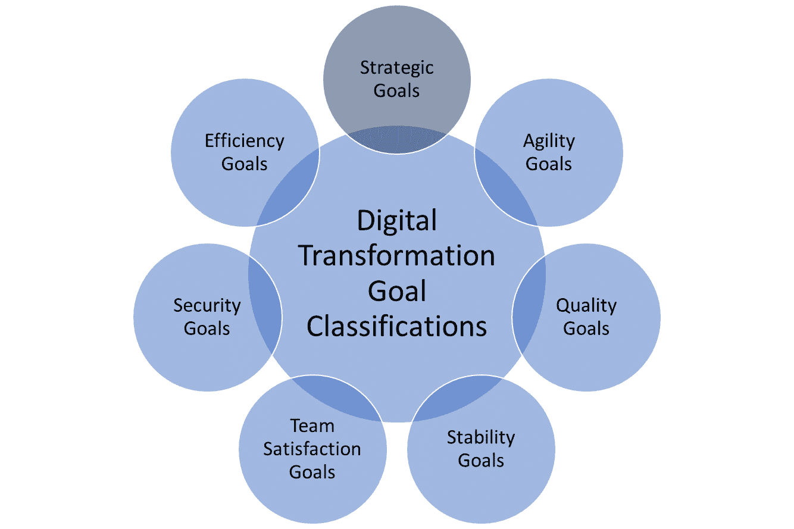
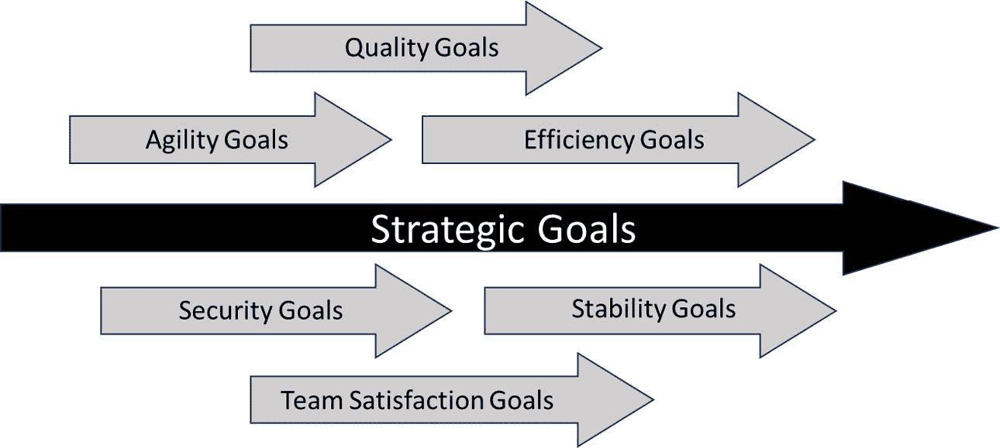
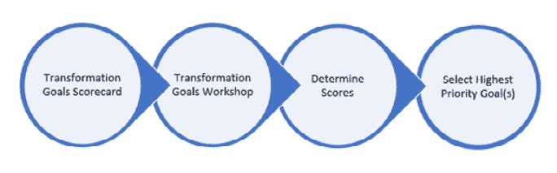
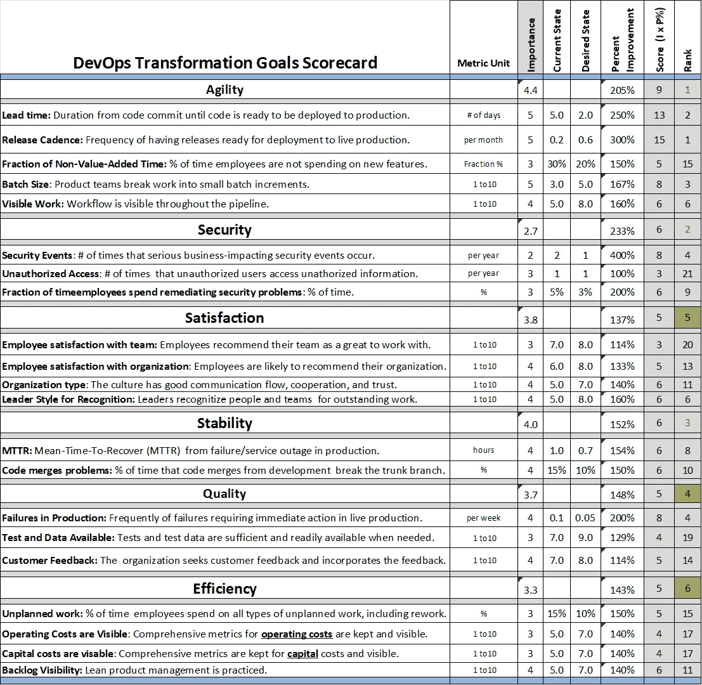
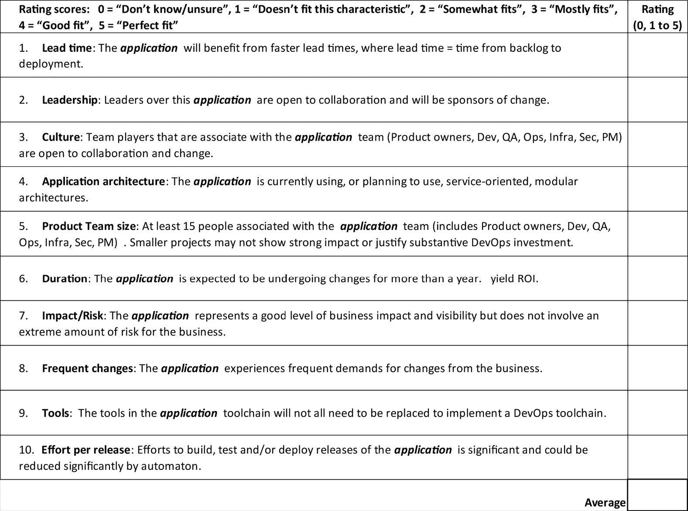
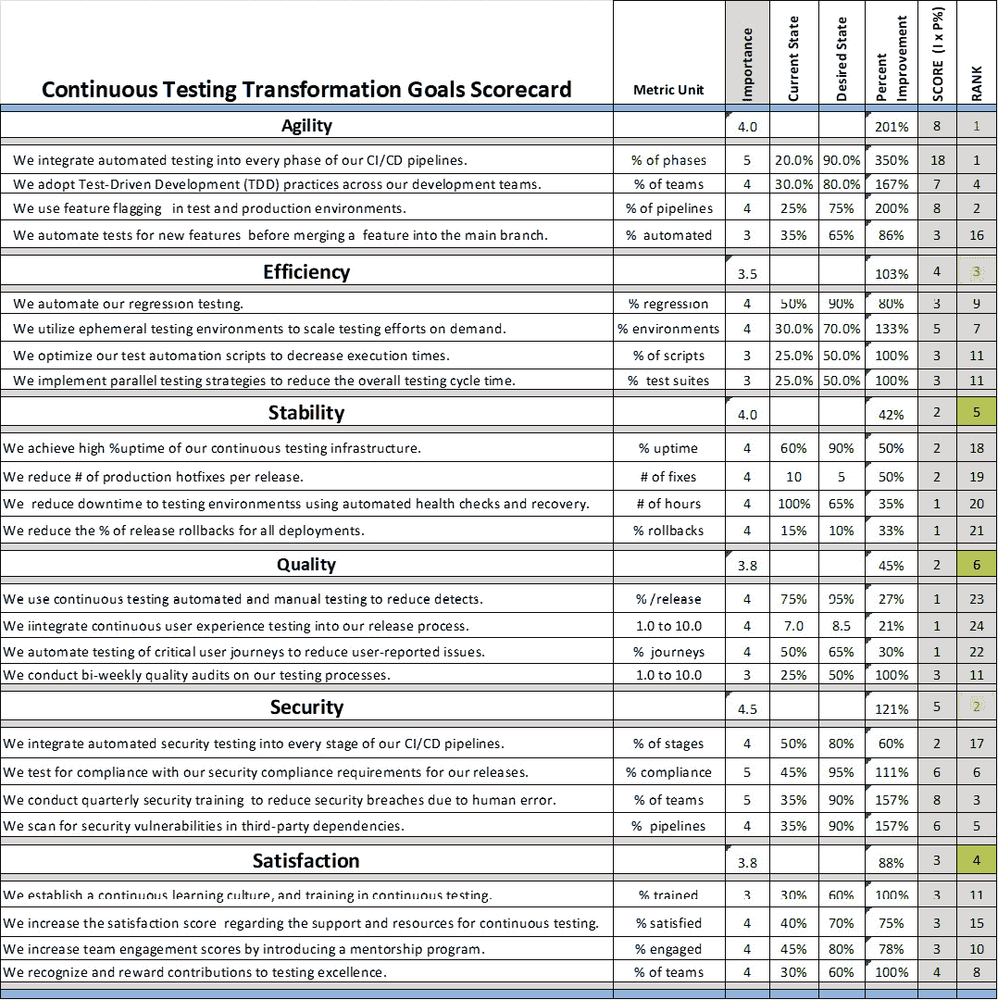
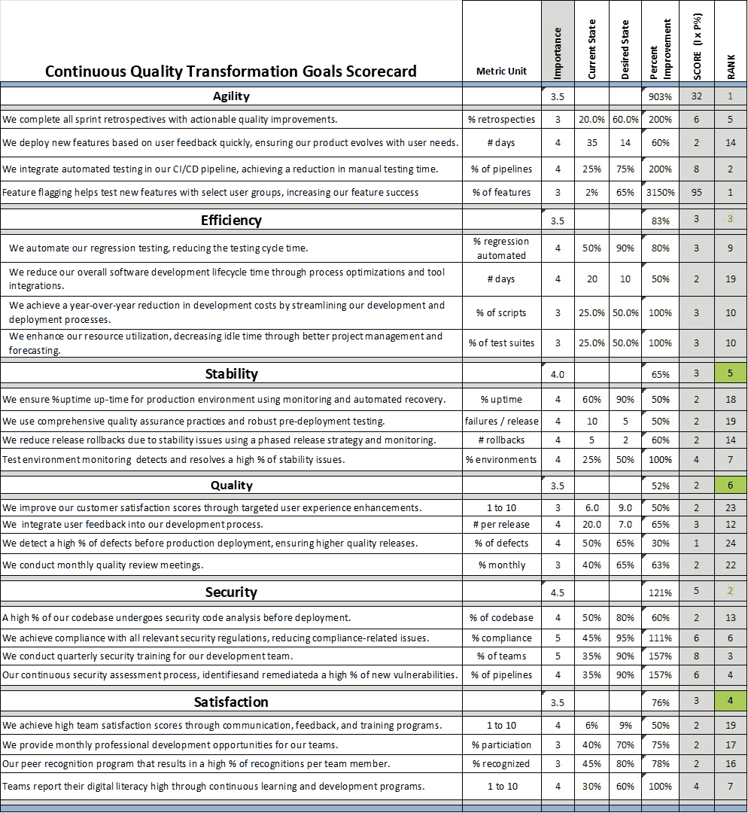
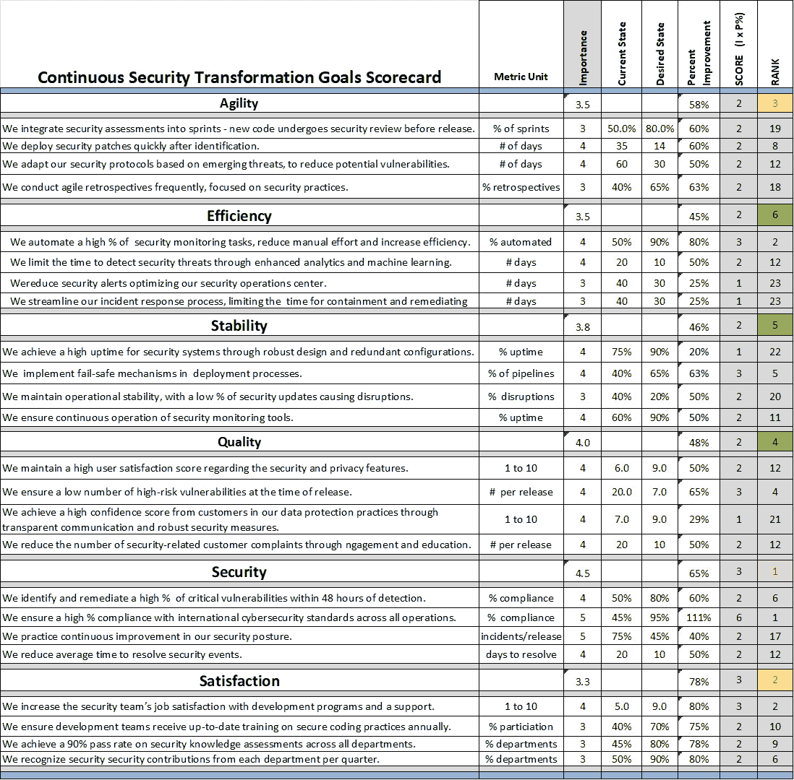
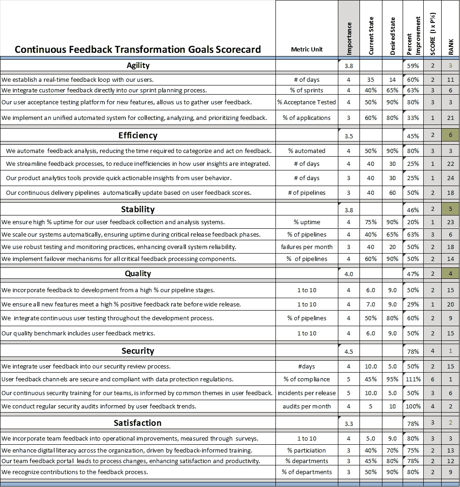

# 第五章：确定转型目标

本章解释了一种规定性的方法，用于确定适合特定组织、产品和服务的持续测试、质量、安全性和反馈转型的目标。 帮助确定目标的工具已在本章中描述。 本章建立在上一章中描述的数字转型工程方法的基础上。 它还提供了如何为转型确定模型应用的指导。

在本章结束时，你将理解转型目标对齐的重要性，如何为转型确定模型应用，以及如何为持续测试、质量、安全性 和反馈设定目标。

本章分为以下 几个部分：

+   转型 目标分类

+   转型目标对齐的重要性 目标对齐的重要性

+   确定转型的具体目标

+   确定 模型应用

+   确定 持续测试的目标

+   确定 持续质量的目标

+   确定 持续安全的目标

+   确定 持续反馈的目标

让我们 开始吧！

注意

本章中讨论的计分卡示例可以通过 GitHub 上的 Excel 文件访问，该文件为 本书提供。

# 转型目标分类

为了使数字化转型成功，必须以一种支持清晰方向、可衡量结果，并与组织的整体战略愿景和目标对齐的方式来设定目标。 数字化转型的目标可以分为以下 七大类：

+   **战略目标**：每个 转型都需要一个或多个总体战略目标，旨在将数字转型工作与组织的宏观愿景和目标对齐，以确保竞争优势和市场领导地位。 所有其他目标必须支持 战略目标。

    *示例*：在接下来的 18 个月内，将数字销售渠道的收入提高 30%，以确保在 我们行业中占据前三的市场地位。

+   **敏捷性目标**：旨在通过采用敏捷方法和灵活的 技术解决方案，提高组织对市场变化和客户需求的响应能力。

    *示例*：通过在 12 个月内在所有团队中实施敏捷开发实践，将产品开发周期时间缩短 40%。

+   **效率目标**：旨在通过数字解决方案改进运营流程和资源利用，以 降低成本并提高 生产力。

    *示例*：在接下来的六个月内，自动化 50%的人工数据录入过程，以实现 20%的 运营成本降低。

+   **稳定性目标**：确保 组织的数字基础设施健壮可靠，支持持续运营并 最大限度地减少停机时间。

    *示例*：通过基础设施的增强和全面的 灾难 恢复计划的实施，在下一个财年内实现所有关键数字服务的 99.9%正常运行时间。

+   **质量目标**：专注于通过战略性地使用 数字技术提升客户 互动、服务和产品的质量。

    *示例*：通过部署一个个性化的客户服务平台，利用人工智能提升 客户互动，在一年内将客户满意度提升 25%。

+   **安全目标**：专注于加强网络安全 措施，并确保遵守相关法规以保护组织和 客户数据。

    *示例*：在接下来的六个月内消除组织数字基础设施中所有已识别的漏洞，并实现对行业 安全标准的全面合规。

+   **团队满意度目标**：优先提升 团队参与度、满意度和数字素养，通过有针对性的培训计划并培养支持性的 数字文化。

    *示例*：在接下来的九个月内，通过实施全面的数字素养计划并建立基于反馈的持续改进文化，将员工参与度提高 20%。

这些目标必须符合 SMART 标准，即具体、可衡量、可实现、相关且具有时间限制，为数字化转型工作提供明确方向。 专注于这七个领域可以确保组织采取全面的转型方法，既涵盖技术因素也考虑人力因素，从而推动数字时代的成功。 这不仅支持更有结构和更有焦点的转型努力，还帮助将举措与组织的更广泛 战略目标对齐。

*图 5**.1* 展示了 对于数字化转型最有用的目标分类。 每个圆圈代表一个不同的目标类别。

图 5.1 – 数字化转型目标分类

这些类别涵盖了组织在数字化转型过程中通常关注的广泛领域，突显了实现全面数字变革所需的多方位方法。

# 转型目标一致性的重要性

获得 组织与技术层面的目标对齐，涵盖数字化转型的七个目标分类，对于以下原因至关重要：

+   **方向一致性**：对齐确保所有努力共同推动组织的更广泛愿景和使命。 如果没有对齐，努力可能适得其反或无方向，导致资源的分配散漫且低效。

+   **协同效应与效率**：当 各团队之间的目标对齐时，不同的举措可以相互支持和增强，产生协同效应，从而提高整体效率。 目标不对齐可能导致重复努力或相互矛盾的举措。

+   **风险缓解**：组织内部目标的一致性有助于全面识别和管理风险。 如果目标不一致，可能会忽视风险或管理不当，最终导致失败 或违规。

+   **资源优化利用**：对齐确保组织的资源能够最优地用于共同的目标。 目标不对齐可能导致时间、金钱和 人力资本的浪费。

+   **变革管理**：目标一致有助于更顺利的变革管理，因为利益相关者了解转型努力的方向和目的。 目标不一致可能导致员工和 其他利益相关者的困惑与抵触。

+   **衡量与适应**：目标一致有助于制定一致的指标和关键绩效指标（KPI），使得追踪进展和进行有效调整变得更加容易。 目标不一致会使得衡量成功并有效调整 战略变得困难。

+   **统一文化**：共同的目标集有助于培养支持数字化转型的统一组织文化。 目标不一致可能导致文化碎片化，造成对 转型努力的接受和支持程度不一。

*图 5**.2* 展示了将转型目标与 战略目标对齐的概念。

图 5.2 – 转型目标对齐

在我的 咨询工作中，我看到许多组织在没有澄清目标，或者至少没有澄清一些关键目标的情况下，直接进入实施阶段。

## 每个分类中目标不一致的负面后果

如果我们未能对齐目标，正如 在 *图 5**.2*中所示，可能会导致以下不利后果：

+   **战略目标**：如果战略目标未能与其他转型目标对齐，可能会导致 IT 资源的错误分配，从而出现无法支持增加市场份额或收入的战略目标的项目，最终影响 竞争地位。

+   **敏捷性目标**：如果目标未对齐，组织可能无法快速响应市场变化，导致错失机会，无法满足客户期望，从而降低 市场相关性。

+   **效率目标**：目标不一致可能导致投资于与现有流程不兼容的技术，从而降低运营效率，未能实现预期的 成本节约。

+   **稳定性目标**：如果稳定性目标未对齐，可能会面临系统故障和停机的风险，从而导致重大运营中断和 客户信任的丧失。

+   **质量目标**：缺乏一致性可能导致由于技术使用不当或不足，造成糟糕的客户体验，从而导致客户满意度 和忠诚度降低。

+   **安全目标**：安全目标与技术基础设施之间的脱节可能导致漏洞和数据泄露，进而造成重大法律、财务及 声誉损害。

+   **团队满意度目标**：如果没有一致性，团队可能无法获得增强数字素养和参与感所需的支持或资源，这可能导致士气低落、高员工流失率，并且劳动力对于数字未来准备不足。    

总之，各类转型目标的一致性确保组织朝着协调一致的方向前进，充分利用资源，管理风险，建立支持在数字时代持续成功的文化。 不一致性可能导致低效、风险增加、资源浪费以及无法实现预期的 转型成果。

# 确定转型的具体目标

每个类别中都有许多 目标。 如果一个组织的目标过多，可能会导致团队之间的混乱。 选择一套简明的最高优先级转型目标对于组织转型至关重要。 确定最佳目标集需要战略性和有条理的方法。 以下是有效引导此 过程的指南。

*图 5**.3* 展示了一个顺序过程，涉及四个阶段，旨在为组织转型设定和优先排序目标。

图 5.3 – 转型目标设定过程

四个阶段如下： ：

1.  **转型目标评分卡**：评分卡方法用于评估和分类转型目标。 评分卡的内容和结构需要根据转型的战略目标，与目标类别和目标进行相应安排。 转型目标评分卡应该围绕组织的战略目标量身定制。 转型目标评分卡应根据组织的战略目标进行定制。 如图*5**.4*所示，DevOps 转型目标评分卡是我用作 DevOps 转型基准的评分卡示例，适合用作持续测试、质量、安全和反馈等领域的评分卡基准。

    在评分卡中，每个目标分类下都描述了示例目标：敏捷性、安全性、满意度、质量、效率和稳定性。 在准备*步骤 2*时，需要选择并告知转型团队有关工作坊的过程。

1.  **转型目标工作坊**：第二阶段是协作方法，涉及利益相关者在一个或多个工作坊中参与，理解并为评分卡中的目标提供评分建议。 该工作坊应包括领导层以及来自架构开发、质量保证、运营、工具、基础设施、安全职能、发布管理、项目管理、DevOps 和 SRE 职能的相关利益相关者。 此时，应为目标设定一个时间框架。 一种好的做法是设置六个月的时间框架。 这个时间足够展示显著的进展，但又不会过长，导致设定目标的团队已经转向其他角色。

1.  **确定评分**：在工作坊结束时，下一步是根据评分卡中确立的标准和在工作坊期间获得的见解，对目标进行量化或打分。

1.  **选择最高优先级的目标**：流程的最后一步是根据前一步确定的排名分数，选择最关键的目标，集中精力在转型的最高优先级上。 选择排名前三的目标来专注于转型的任何阶段。 如果选择太多，团队将会迷茫，资源会分散，且转型的主要目标失败的风险将增加。 选择排名前三的目标。

这一四步目标设定过程是一个循环过程，上一阶段的结果可能会反过来影响未来迭代中的计分卡。 整体流程从概念化和分类，到协作、评估，最后到优先级排序。

通过以下步骤，组织可以选择一组简洁的高优先级、具体的转型目标，这些目标与其战略愿景、市场定位、利益相关者需求和运营能力相一致，为成功的 数字化转型 奠定基础。

*图 5**.4* 是我为 DevOps 使用的计分卡示例。 该计分卡旨在为优先事项生成排名数字。 每个目标的单位值必须选择以匹配 组织的状态。

图 5.4 – DevOps 转型目标计分卡

在研讨会期间，团队成员将从 1 到 5 选择一个“重要性评分”值（I），以表示每个目标对实现战略转型目标的重要性。 然后，团队确定当前状态和期望的未来状态。 计算当前状态与期望未来状态之间的期望改进百分比（%），作为值 P。 然后，通过计算 I x P，得出每个目标的总体评分。 最后，将得分从 1 排名至 *n* ，以确定最高优先级的目标。

## 使用 AI 聊天机器人帮助确定转型目标

AI 聊天机器人 可以通过多种创新方式，在推动数字转型目标设定方面发挥重要作用。 它们的能力可以被用来收集洞察、自动化任务和增强决策过程。 以下是 AI 聊天机器人 的一些帮助方式：

+   **数据收集** **与分析**：

    +   **调查与反馈**：AI 聊天机器人可以进行调查并收集内部利益相关者和客户关于痛点、需求和数字转型期望的反馈。 这些数据对于设定相关且 有影响力的目标至关重要。

    +   **市场洞察**：聊天机器人可以用来收集和分析市场趋势以及竞争对手信息，帮助组织设定目标，确保它们保持竞争力 并且与时俱进。

+   **增强** **利益相关者参与度**：

    +   **利益相关者沟通**：它们可以通过提供更新、收集反馈并回答关于数字化转型过程的疑问，促进与利益相关者的持续沟通。 这保持了利益相关者的参与，并使他们的期望与 转型目标保持一致。

+   **促进协作**：

    +   **跨职能协作**：通过与协作工具的整合，AI 聊天机器人可以 促进跨不同部门和团队的无缝 沟通，确保每个人都保持一致，朝着相同的数字化转型 目标共同努力。

+   **支持决策**：

    +   **数据驱动的洞察**：通过访问大量数据，AI 聊天机器人可以提供基于数据分析的实时洞察和建议。 这有助于决策者设定以数据为依据的目标，从而提高成功的机会。

    +   **目标优先级**：聊天机器人可以通过分析每个目标的潜在影响和可行性，使用如投资回报率（ROI）、客户影响和与 战略目标的对齐等标准，帮助确定数字化转型目标的优先级。

+   **跟踪进展** **与反馈**：

    +   **进度监控**：它们可以追踪各项计划与设定目标的进展，并向相关利益相关者提供定期更新，确保任何偏差都能 及时得到解决。

    +   **持续反馈循环**：聊天机器人可以创建一个持续的反馈循环，收集关于什么有效、什么无效的见解。 这使得目标可以根据实际表现和反馈动态调整。

+   **培训** **与支持**：

    +   **数字素养**：AI 聊天机器人可以为员工提供个性化的学习体验和支持，提升他们的数字技能和素养。 这支持了一个更能适应变化的文化，对于成功的 数字化转型至关重要。

    +   **变更管理**：通过互动指南和常见问题解答，聊天机器人可以解决关于数字化转型的疑虑和问题，帮助管理变更抗拒，培养对新技术 和流程的积极态度。

+   **创新** **与实验**：

    +   **创意生成**：通过分析趋势和数据，聊天机器人可以为数字产品、服务或流程提出创新的想法，鼓励实验 和创新文化。

总之，AI 聊天机器人 可以显著简化 设置和实现数字化转型目标的过程，通过自动化和增强与数据收集、利益相关者互动、决策制定和进度跟踪相关的任务。 通过利用 AI 聊天机器人的能力，组织可以确保其数字化转型目标是信息充分的、战略对齐的，并且能够适应 变化。

## 确定每次转型多少个应用程序

一个组织是否应该逐个应用程序地进行数字化转型，还是同时处理多个应用程序，取决于多个因素，包括组织的规模、复杂性、资源可用性、战略目标和风险容忍度。 这两种方法各有优缺点，最佳策略通常是采取平衡且量身定制的方法。 以下是一些要考虑的细分点 。

### 一次处理一个应用程序

以下是 这种方法的 优点：

+   **聚焦资源**：集中处理一个应用程序可以更专注地分配资源，包括预算、人员和 管理注意力。

+   **风险管理**：由于范围仅限于一个应用程序，风险管理变得更加容易，从而简化了问题的监控和解决。 它们出现时，可以更迅速地处理。

+   **学习与适应**：从每次转型中获得的经验可以应用于后续的项目，随着时间的推移，可能提高效率和效果 。

+   **更容易的变更管理**：较小的范围使得管理用户和利益相关者之间的变更变得更加容易，有助于更顺利地采用，且 扰动更小。

以下是 其缺点：

+   **整体转型较慢**：这种方法可能会延长完成整个组织数字化转型所需的总时间。

+   **回报延迟**：数字化转型的收益可能需要更长的时间才能在整个组织中显现，因为改进是按顺序实施的。

### 同时进行多个应用

以下是这种方法的优点：

+   **加速转型**：使组织能够更快地实现转型目标，从而可能更快速地达成战略目标。

+   **同时创新**：允许组织同时创新和转型业务的各个方面，可能会释放不同应用之间的协同效应。

+   **竞争优势**：快速转型可以为快速变化的市场提供竞争优势，使组织能够更快适应市场变化和客户需求。

以下是缺点：

+   **资源压力**：可能会对资源（包括人员、预算和管理带宽）造成显著需求，进而可能导致员工倦怠和执行不佳。

+   **增加的复杂性和风险**：同时管理多个转型可能会显著增加复杂性和风险，包括失败或业务运营中断的风险。

+   **变革管理挑战**：更广泛的范围和更快的变革速度可能会让利益相关者更难以适应，可能导致抗拒或较低的采纳率。

### 定制化方法

实际上，最佳方法通常涉及一种定制化的策略，考虑到组织的特定背景和能力。平衡方法的一些考虑因素包括以下内容：

+   **战略优先级排序**：从最关键的应用开始，优先考虑那些对实现战略目标至关重要或回报率最高的应用。

+   **能力评估**：评估组织管理多个项目的能力，包括技术人员的可用性和财务资源。

+   **风险承受度**：考虑组织对风险和潜在操作中断的容忍度。

+   **增量扩展**：从单一应用开始，积累经验和能力，然后随着信心和 能力的提升逐步扩大转型范围。

根据所提供的背景，定制化数字转型方法提供了若干显著优势，能够极大地帮助寻求现代化运营和提升竞争力的组织。 以下是一些 关键优势：

+   **战略优先级划分**：定制化方法的主要优势之一在于它强调战略优先级划分。 通过关注对实现战略目标最为关键的应用 或那些提供最高 **投资回报率** (**ROI**)，组织可以确保其资源得到高效分配。 这种优先级划分有助于将转型努力与整体商业目标对齐，进而提高这些举措直接促进 组织成功的可能性。

+   **能力评估**：另一个优势是定制化方法所倡导的深入能力评估。 这一评估通过考虑熟练人才和财务资源的可用性来评估组织管理多个项目的能力。 通过了解自身能力，组织可以将其转型战略量身定制，以匹配实际能力，从而降低过度扩展的风险，并确保转型努力在 长期内可持续。

+   **风险承受度**：这一点至关重要，因为数字转型可能涉及重大变化，可能会扰乱现有的流程。 由于定制化方法还考虑了组织对风险的容忍度和潜在操作中断，并将组织的风险承受度融入转型战略，方法帮助有效管理和减轻潜在风险。 这确保了组织不会进行可能危及其 运营稳定性的项目。

+   **渐进式扩展**：最后，量身定制的方法提倡渐进式扩展，这是有效管理变革的一个重要优势。 从单一应用程序开始，组织可以逐步积累经验和能力。 这种方法有助于在可控环境中发现潜在问题并从中学习，再逐步扩展。 渐进式扩展还有助于在利益相关者中建立信心，并减少对变革的抵触，因为转型的好处会逐渐显现并可靠。 地体现出来。

总之， 量身定制的方法提供了一种战略性、风险管理、能力导向且具有渐进扩展性的数字化转型方法。 这种方法不仅与组织的具体需求和条件相契合，还能最大化成功实施的机会，并促进 可持续增长。

选择一次转型一个应用程序还是多个应用程序，应与组织的战略目标、运营能力以及其在数字化转型过程中面临的具体挑战和机遇相一致。 转型之旅。

## 模型应用程序

选择一个应用程序作为 其他应用程序转型的模型，是一种为正在进行数字化转型的组织提供多个战略优势的方法。 这种方法可以有效地简化转型过程，降低风险，并提高整个组织成功的可能性。 以下是 主要优势：

+   **概念验证** **：**

    +   **展示价值**：将一个单独的应用程序作为模型，可以让组织展示数字化转型的实际好处和价值，这有助于获得全体利益相关者的支持。 董事会的支持。

    +   **测试与学习**：它提供了一个机会，在全面推广到整个组织之前，可以先在较小规模上测试新技术、流程和战略，根据 现实世界的反馈进行调整和优化。

+   **风险管理**：

    +   **可控环境**：一次转型一个应用程序能够提供一个更加可控的环境，用于管理风险并解决挑战，而不会使资源过载或对业务 运营造成重大干扰。

    +   **降低失败风险**：从任何问题或失败中获得的教训可以应用于后续转型，减少类似问题再次发生的可能性。

+   **资源优化**：

    +   **聚焦投资**：当资源集中在一个单一应用上时，可以更有效地进行资源分配和管理，确保财务、人力和技术资源得到高效利用。

    +   **建立专业知识**：专注于一个应用有助于在团队内部建立深厚的专业知识和能力，这些能力可以在后续的转型中得到充分利用。

+   **增强的** **变革管理**：

    +   **更顺畅的采纳**：成功的模型应用可以作为案例研究，展示转型带来的积极影响，从而缓解用户和利益相关者的担忧与抵触。

    +   **文化转变**：早期的成功可以帮助培养创新文化和对变革的开放态度，为未来转型创造一个更加积极的环境。

+   **简化实施**：

    +   **流程标准化**：从模型应用转型中获得的经验可以帮助标准化流程、方法论以及数字化转型的最佳实践，在整个组织中推广。

    +   **可扩展策略**：从模型应用中获得的洞察可以指导可扩展的策略，这些策略可以调整并应用到其他应用中，可能加速转型过程。

+   **战略对齐**：

    +   **与业务目标对齐**：通过精心选择与战略业务目标紧密对接的应用，组织可以确保转型为业务绩效和客户满意度带来有意义的改进。

    +   **反馈回路**：初步的转型可以作为一个反馈回路，提供关于数字化转型如何影响业务各个方面的宝贵洞察，并且如何与整体业务战略对齐。

通过聚焦于单一应用作为模型，组织可以创建一个成功的蓝图，并将其复制到其他应用中，从而减少大规模数字转型所涉及的时间、成本和风险。 这种方法不仅促进了更可管理的转型过程，还帮助在组织内为数字化项目建立了动力和支持。

# 确定模型应用

仔细选择 模型应用至关重要。 本节描述了我帮助组织选择应用程序的的方法论。

*图 5**.5* 展示了一个详细的应用转型记分卡。 以下列表展示了如何利用记分卡选择符合给定标准的转型模型应用：

图 5.5 – 模型应用转型记分卡

某些 应用程序比其他应用程序更容易从 DevOps 中受益。 推荐的平均评分为 3 分或更高。

1.  **定义评估标准**：记分卡包括用于评估每个应用程序是否适合 DevOps 或 DevSecOps 转型的具体标准。

1.  **分配权重**：根据每个标准对实现组织 DevOps 转型目标的重要性，为每个标准分配权重。 这可能会根据组织的具体目标有所不同，例如缩短市场时间、提高运营效率或 降低风险。

1.  **评估每个应用**：根据提供的尺度对每个应用进行评分（例如，0 表示“不知道/不确定”，5 表示“非常高”）。 评分应基于当前评估、数据和 利益相关者的反馈。

1.  **计算得分**：对于每个应用，按照每个标准的评分乘以权重（如果权重的分配方式不同于简单的 1 到 5 的评分尺度），并将这些值相加以得到总得分。 该得分反映了应用程序在 DevOps 转型中的整体适用性。

1.  **比较与选择**：比较所有评估应用程序的总得分。得分最高的应用程序是最适合作为 DevOps 转型模型的候选者。该应用程序很可能在交付时间上有显著的提升潜力，支持创新文化，并与领导层目标保持一致，因此成为展示 DevOps 实践在组织中益处的理想候选者。

这种结构化的方法使我们能够客观评估每个应用程序的转型潜力，确保资源集中在具有最高影响力并与转型目标高度一致的领域。

# 确定持续测试的目标

考虑一个希望向持续测试转型的组织（持续测试在*第一章*中已定义），本章中提到的六个类别的转型目标示例如下：

+   **敏捷性**：

    +   我们将自动化测试集成到我们 CI/CD 管道的每个阶段。

    +   我们在开发团队中全面采用**测试驱动开发（TDD）**实践。

    +   我们实施了特性标记系统，允许我们在测试和生产环境中，针对特定用户群体测试新功能。

    +   我们在合并到主分支之前，增加了开发功能中具有自动化测试的比例，从而增强了我们的测试覆盖率。

+   **效率**：

    +   我们自动化了回归测试。

    +   我们利用临时测试环境，根据需求扩展测试工作量，从而减少环境配置时间。

    +   我们优化了测试自动化脚本，以减少执行时间，从而在接下来的八个月中不增加额外资源成本的情况下提高测试频率。

    +   我们实施并行测试策略，以减少整体测试周期时间。

+   **稳定性**：

    +   我们实现了持续测试基础设施的高百分比正常运行时间，确保测试操作不受中断。

    +   我们通过在测试阶段提前检测问题，减少了生产环境中的热修复，预计明年可见成效。

    +   我们通过实施自动化健康检查和恢复流程，确保因测试环境问题导致的停机时间降到最低。

    +   我们确保所有部署的回滚率保持在低水平。

+   **质量**：

    +   我们通过自动化与手动测试的协同作用，增加在代码到达生产环境之前的缺陷检测率。

    +   我们通过将持续的用户体验测试整合到发布流程中，提高用户满意度评分。

    +   覆盖关键用户旅程的自动化测试减少了用户报告的问题。

    +   我们每两周进行一次质量审计，旨在持续改进我们的内部质量指标，逐季提升。

+   **安全**：

    +   我们将自动化安全测试集成到每个 CI/CD 流水线的阶段中。

    +   我们进行安全合规性测试，确保发布符合我们的安全要求，从而减少与安全相关的事件。

    +   我们每季度为开发和 QA 团队进行安全培训，旨在减少因人为错误导致的安全漏洞。

    +   我们实施对第三方依赖项安全漏洞的持续监控，减少风险暴露时间。

+   **团队满意度**：

    +   我们建立了一个持续学习的文化，团队将在明年获得自动化测试工具的认证。

    +   我们提高了开发和 QA 团队在持续测试方面的支持和资源满意度。

    +   我们通过引入导师计划，将初级与高级专业人士配对，提升团队参与度评分。

    +   我们每月表彰和奖励在测试卓越方面的贡献，推动团队采纳创新的测试实践。

这些目标为一个强有力的持续测试策略奠定了基础，强调在敏捷性、效率、稳定性、质量、安全性和团队满意度方面的可衡量改进。*图 5.6* 是适用于目标设定研讨会的持续测试转型目标记分卡示例。

图 5.6 – 持续测试目标评分卡示例

在示例中，如 *图 5**.6*所示，持续测试转型的前三个最高排名目标是 以下内容： 

+   我们将自动化测试集成到 CI/CD 管道的每个阶段。 从 20%到 90%的 管道阶段。

+   我们实现了一个功能标记系统，使我们能够在测试和生产环境中使用特定用户组测试新功能。 从 25%到 75%的 新功能。

+   我们实现了功能标记系统，使我们能够在测试和生产环境中使用特定用户组测试新功能。 从 35%到 90% 的团队。

通过在研讨会环境中将目标简化为一个短列表，团队成员会比没有参与的情况下更有承诺感。 他们的参与让目标更加明确。

# 确定持续质量的目标

考虑一个希望向持续质量转型的组织（在 *第一章*中定义），这里描述了本章中之前定义的六个类别的转型目标示例：

+   **敏捷性**：

    +   我们 在每次冲刺回顾中完成可执行的质量改进，从而提升了我们冲刺的 质量指标。

    +   在收到用户反馈后，我们快速部署新功能，确保我们的产品与 用户需求保持一致。

    +   我们将自动化测试集成到我们的 CI/CD 管道中，从而减少手动 测试时间。

    +   我们实现了功能标记，用以在特定用户组中测试新功能，提高了功能的 成功率。

+   **效率**：

    +   我们自动化了回归测试，减少了测试 周期时间。

    +   通过流程优化和工具集成，我们缩短了整体软件开发生命周期。

    +   通过简化开发和 部署流程，我们实现了年度开发成本的降低。

    +   我们通过更好的项目管理和预测，提升了资源利用率，减少了闲置时间。 和预测。

+   **稳定性**：

    +   我们通过实施主动监控和自动恢复过程，确保了生产环境的高可用性。

    +   我们通过全面的质量保障实践和强有力的预部署测试，减少了关键生产故障的发生。

    +   我们通过采用分阶段发布策略和增强的监控，减少了因稳定性问题导致的发布回滚。

    +   我们建立了一个持续监控框架，在问题影响用户之前，检测并解决了大部分潜在的稳定性问题。

+   **质量**：

    +   我们通过有针对性的质量改进和用户体验提升，提升了客户满意度评分。

    +   我们通过将用户反馈融入开发过程，减少了每次新版本发布后的用户报告问题。

    +   我们在生产部署前检测到大部分缺陷，从而确保了更高质量的发布。

    +   我们每月召开质量评审会议，导致我们内部质量指标逐季度的提升。

+   **安全性**：

    +   我们确保大部分代码库在部署前经过安全代码分析，从而减少了安全漏洞。

    +   我们确保符合所有相关安全法规，将合规性相关问题减少到 0。

    +   我们为开发团队提供季度安全培训，旨在减少因人为错误导致的安全事件。

    +   我们实施了一个持续的安全评估过程，在 72 小时内识别并修复了大部分新发现的漏洞。

+   **团队满意度**：

    +   我们通过增强的沟通、反馈机制和有针对性的培训计划，在下一年度实现了高团队满意度评分。

    +   我们为团队提供每月的职业发展机会，旨在实现高参与率。

    +   我们实施了一个同行认可计划，使每个团队成员每季度获得较高比例的认可，促进了积极的工作文化。

    +   我们确保团队通过持续的学习和发展计划，将数字素养报告为高水平。

*图 5**.7* 是持续质量转型目标评分卡的一个示例：

图 5.7 – 持续质量目标评分卡示例

在 下图示例中，持续质量转型的前三个最高排名目标如下： *图 5**.7*： 如以下所示：

+   我们实施功能标记来测试新功能，选择特定用户群体进行测试，从而提高了我们功能的成功率。

+   我们将自动化测试集成到我们的 CI/CD 管道中，实现了手动测试时间的减少。

+   我们为开发团队提供季度安全培训，旨在减少由人为错误引起的安全事件。

通过在工作坊中将目标缩短为一个简短的清单，不同的团队成员会比没有他们参与的情况下更致力于这些目标。

# 确定持续安全目标

考虑一个希望实现持续安全转型的组织（该转型在 *第一章*中有所定义），以下是本章中定义的六个类别中每个类别的转型目标示例：

+   **敏捷性**：

    +   我们将 安全评估融入冲刺，确保大量新代码在发布前经过安全审查 。

    +   我们在识别安全漏洞后快速部署安全补丁，保持对所有系统的快速响应承诺。

    +   我们根据新兴威胁快速调整安全协议，保持领先于潜在的漏洞。

    +   我们经常进行敏捷回顾，专注于安全实践，根据最新的洞察不断优化我们的做法。

+   **效率**：

    +   我们将大部分常规安全监控任务自动化，减少了人工工作量，提升了我们的 运营效率。

    +   通过增强的分析和机器学习工具，我们缩短了检测安全威胁的时间。

    +   我们减少了非关键安全警报的响应时间，优化了我们的安全运营 中心的效能。

    +   我们简化了 事件响应流程，在控制和 修复行动的速度上取得了改善。

+   **稳定性**：

    +   通过强有力的设计和 冗余配置，我们确保了关键安全系统的高可用性。

    +   通过在我们的 部署过程中实施故障保护机制，我们确保零安全引发的停机时间。

    +   我们保持运营稳定，安全更新对系统性能造成的干扰比例较低。

    +   我们确保安全监控工具的持续运行，未计划的停机时间保持在较低水平。

+   **质量**：

    +   我们保持 关于服务安全性和隐私功能的用户满意度高分。

    +   我们确保所有面向客户的应用在发布时都存在较少的高风险漏洞。

    +   通过透明沟通和强有力的 安全措施，我们赢得了客户对数据保护实践的高度信任。

    +   通过积极的互动和 教育努力，我们减少了与安全相关的客户投诉数量。

+   **安全性**：

    +   我们在 48 小时内识别并 修复大部分关键漏洞。

    +   我们确保所有运营均符合国际网络安全标准的高比例。

    +   通过持续改善我们的 安全态势，我们减少了安全事件的发生频率。

    +   我们实现了年均缩短解决安全事件的平均时间，展示了我们在 事件管理中的效率不断提高。

+   **团队满意度**：

    +   通过有针对性的开发计划和支持性的 工作环境，我们提高了安全团队的工作满意度。

    +   我们确保开发团队每年接受最新的安全编码 实践培训。

    +   我们倡导安全意识文化，使得所有部门的安全知识评估通过率达到了 90%。

    +   我们实施了安全最佳实践的表彰计划，使得每个部门每季度至少有一项贡献被认可。

*图 5**.8* 是持续安全转型的目标评分卡示例：

图 5.8 – 持续安全目标评分卡示例

在 图示例中，*图 5**.8*中，持续安全转型的前三个最高排名目标如下：

+   我们确保所有操作都符合国际网络安全标准的高比例合规性。

+   我们自动化了大部分常规安全监控任务，减少了人工工作量，并提高了我们的 运营效率。

+   我们通过有针对性的开发 程序和支持性 的工作环境，提高了安全团队的工作满意度评分。

通过在研讨会设置中将目标简化为一个简短的清单，不同团队成员会比单纯宣告目标时更加致力于这些目标。

# 确定持续反馈的目标

考虑到一个希望转向持续反馈的组织（这在 *第十章*中定义），以下是本章所述六个类别中每个转型目标的示例：

+   **敏捷性**：

    +   我们与用户建立了一个 实时反馈循环，将从收到反馈到功能增强的周期时间减少。

    +   我们将客户反馈直接整合到我们的冲刺计划过程中，确保每个冲刺的工作都直接受到 用户洞察的影响。

    +   我们部署了一个用户验收测试平台，用于新功能，允许我们在首次发布后快速收集用户反馈并进行改进迭代。 初步发布。

    +   我们实施了一个自动化系统，用于收集、分析和 优先排序反馈。

+   **效率**：

    +   我们自动化了 反馈分析过程，减少了分类和处理反馈所需的时间。 。

    +   我们通过简化反馈驱动的开发过程来降低运营成本，消除在集成用户洞察时的低效。

    +   我们增强了产品分析工具，提供来自用户行为的可操作性洞察，提升了 反馈实施的速度。

    +   我们实施了持续交付管道，基于用户反馈评分自动更新，优化了资源使用并减少了手动 部署工作。

+   **稳定性**：

    +   我们确保用户反馈收集与分析系统的高可用性 ，支持不中断的 反馈循环。

    +   我们在高峰反馈期通过自动扩展基础设施来保持系统稳定，确保在关键发布 反馈阶段没有停机时间。

    +   通过强有力的测试和监控措施，我们减少了与反馈相关的系统故障发生率，提升了整体的 系统可靠性。

    +   我们为所有关键的反馈处理组件实施了故障转移机制，确保持续运作，避免任何单点 故障。

+   **质量**：

    +   通过将反馈融入开发过程，我们提升了整体产品质量，确保我们的管道阶段高效运行，从而提高客户 满意度评分。

    +   我们确保所有新功能在广泛发布之前，能够达到高百分比的正面反馈率，展示了我们基于 用户洞察力对质量的承诺。

    +   通过在整个开发过程中整合持续的用户测试，我们减少了发布后质量问题的数量。

    +   我们建立了一个包含用户反馈指标的质量 基准，旨在每个季度提升这些基准 。

+   **安全**：

    +   我们将用户反馈纳入我们的安全 审查流程，旨在快速识别并修复安全组织和用户提出的大部分安全问题。

    +   我们确保所有用户反馈渠道都是安全的，并符合数据保护法规，保护 用户数据。

    +   通过为团队提供持续的安全培训，结合用户反馈中的常见主题，我们减少了用户报告的安全事件。

    +   我们根据用户反馈趋势定期进行安全审计，旨在不断强化我们的网络安全 措施。

+   **团队满意度**：

    +   我们通过将团队反馈纳入运营改进，增加团队 参与度和满意度，通过 季度调查进行衡量。

    +   我们在整个组织中提升数字素养，推动这一进程的是基于反馈的培训课程。

    +   我们建立了一个团队反馈门户，推动流程变更，直接提升团队满意度 和生产力。

    +   我们识别并奖励对反馈过程的贡献，旨在提高团队士气和参与持续 反馈计划。

*图 5**.9* 是持续反馈转型的目标评分卡示例：

图 5.9 – 持续反馈目标评分卡示例

在示例中 显示在 *图 5**.9*中，持续反馈转型的前三个最高排名目标如下：

+   我们确保所有用户反馈渠道的安全性，并遵守数据保护法规，保护 用户数据。

+   我们确保所有用户反馈渠道的安全性，并遵守数据保护法规，保护 用户数据。

+   我们为新功能部署了用户接受测试平台，允许我们收集用户反馈，并在初始 发布 后迅速进行改进迭代。

通过在研讨会环境中将目标缩短为一个简短清单，不同的团队成员会比在没有他们参与的情况下更加投入于这些目标。

# 总结

本章为任何想要在今天快节奏的世界中应对变化的挑战的人提供了基石。 它详细阐述了将组织愿景与可操作且可衡量的目标对齐的重要性，涵盖了敏捷性、效率、稳定性、质量、安全性和团队满意度等多个领域。 本叙述鼓励领导者战略性地思考他们希望创造的未来，以及实现这一愿景所需的步骤。 实现。

这一章节将复杂的概念拆解为易于理解和可操作的见解，使其成为各级决策者不可或缺的资源。 通过一系列示例和最佳实践，它揭示了在转型背景下设定目标的过程，强调了持续反馈和适应性调整的重要性。 这种方法促使创新和持续改进的文化，确保转型工作扎根于运营能力和市场需求的现实之中。 聚焦于 SMART 目标为组织提供了一个指引，帮助它们朝着既雄心勃勃 又可实现的结果前进。

本章节呼吁那些希望主动迎接变革的组织采取行动。 它突出了清晰定义目标的变革力量及其对组织各方面产生的积极连锁效应。 从提升客户满意度到加强安全措施，再到促进团队间支持文化的建设，本章节勾画了一套可持续增长和韧性的整体框架。 这不仅仅是鼓励遵循最佳实践，更是激励组织在看待和应对变革时的根本转变。 本章节赋予并装备了领导者，将今天的挑战转化为 明日的成功。

接下来的章节将解释组织如何进行当前状态的发现，以便为 转型做好准备。
