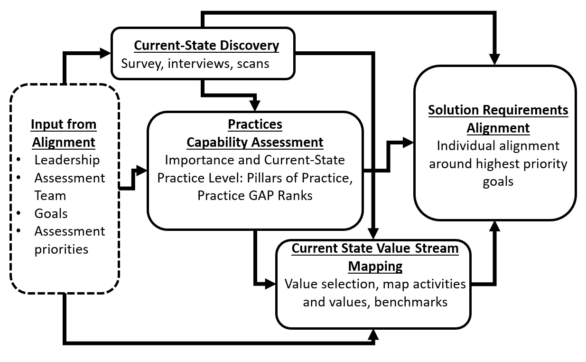
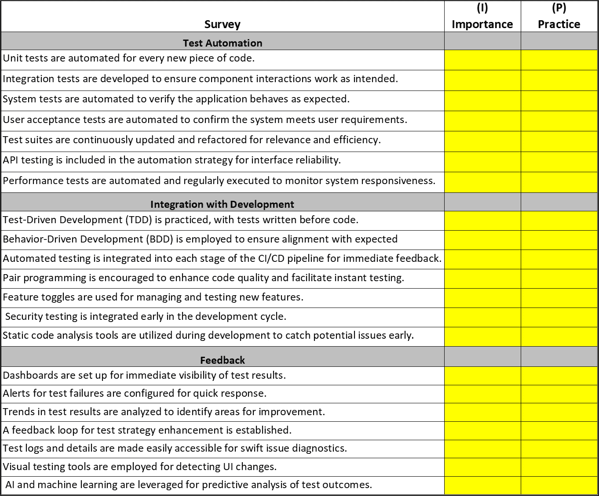
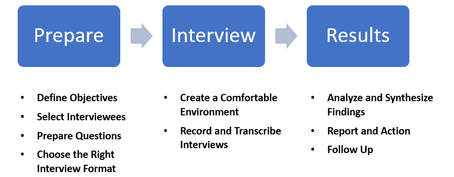
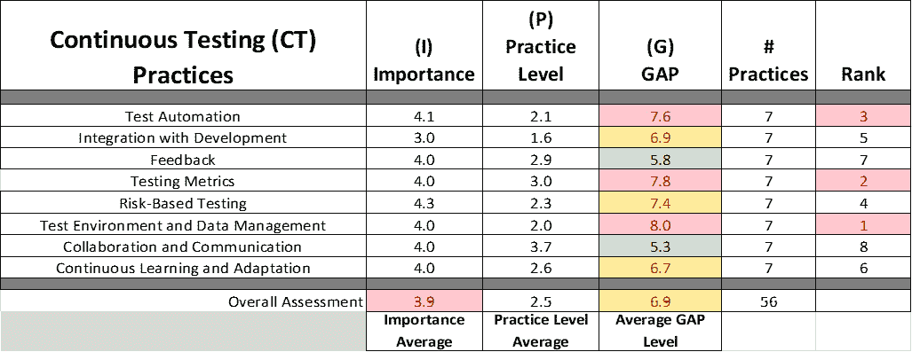
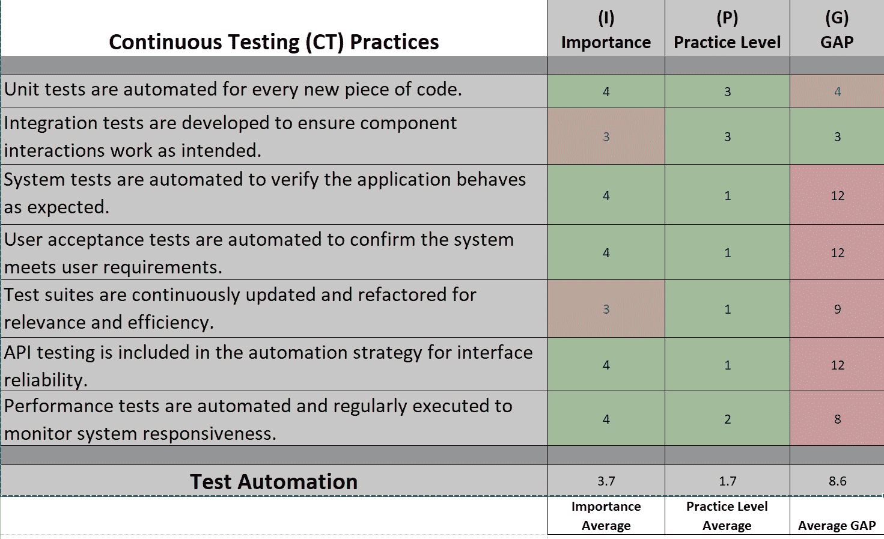
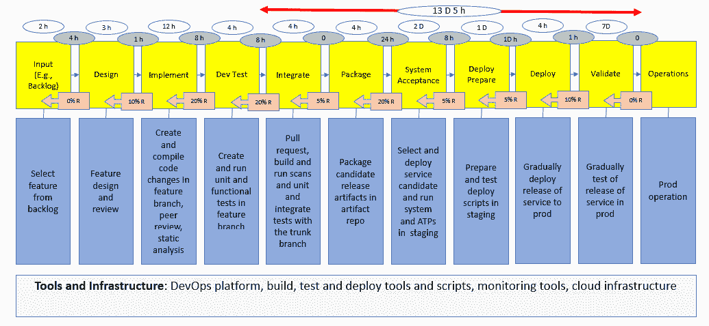

# 发现和基准测试

本章解释了发现组织当前状态的方法论和工具，涵盖与持续测试、质量、安全性和反馈转型相关的人员、流程和技术。 这一点对于制定转型的基准起点和优先事项至关重要。 本章中描述的方法论 和工具 包括调查、访谈、研讨会、 **差距评估**和 **价值流映射**。

本章结束时，您将理解发现和基准测试的方法论，以及差距评估和价值流映射的发现工具。 我们将通过讨论如何将发现和基准测试应用于持续测试、质量、安全性、 和反馈来结束本章。

本章根据以下标题进行组织： 以下是章节标题：

+   发现和基准测试的方法论 和基准测试

+   理解 当前状态发现

+   理解 差距评估

+   理解 CSVSM

+   生成型人工智能如何加速发现 和基准测试

让我们 开始吧！

# 技术要求

本书中提到的工具的可执行版本可以在与本书相关的资源页面找到： 书籍链接： [https://github.com/PacktPublishing/Continuous-Testing-Quality-Security-and-Feedback](https://github.com/PacktPublishing/Continuous-Testing-Quality-Security-and-Feedback)。

# 发现和基准测试的方法论

*第四章* 概述了 我建议用于指导数字化转型的七步转型工程蓝图。 *第四步* 转型的步骤，称为 *评估*，是包含发现和基准测试的步骤。 进行发现和基准测试有四个组成部分，如 *图 6**.1*所示。

图 6.1 – 发现和基准测试的方法论

发现和基准测试的方法论与我在我的书中为 DevOps 所描述的方法相同，该书名为 *《工程化 DevOps》*。

四个组成部分如下： 如下所示：

+   **当前状态发现**：利用 在七步转型过程中前述步骤确定的目标输出，进行调查、访谈以及对当前环境和实践的扫描，涉及持续测试、质量、安全 和反馈。

+   **实践能力评估**：利用 *当前状态发现* 组件的输出，确定 每个实践在实践支柱中的重要性、当前状态以及存在的差距 ，这些支柱涉及持续测试、质量、安全 和反馈。

+   **CSVSM**：利用 实践能力评估 *组件的输出*，选择价值，映射当前状态，并确定 价值流的当前状态基准。 价值流。

+   **解决方案需求分析：** 利用 当前状态发现 *、 *实践能力评估*和 *CSVSM* 组件的输出，确定解决方案与组织转型目标对齐的优先级。

前述步骤所描述的发现方法确保组织充分考虑相关数据和 当前状态。

# 理解当前状态发现

在数字化转型的 *评估* 阶段使用调查和访谈，对于收集全面且细致的洞察至关重要，这些洞察为战略提供依据，吸引利益相关者，管理风险，并指导持续改进。 这些工具帮助确保转型努力与组织的现实相契合，从而提高实现有意义且 可持续变革的可能性。

## 调查

**调查** 是一种 强有力的工具，旨在通过全面评估方法发现组织人员、流程和技术的当前状态。 它们通过提供可以分析的定量见解，补充了访谈和其他数据收集方法，从而帮助识别趋势、模式和改进领域。

### 为何进行调查？

以下是调查的重要性及其执行方式：

+   **广泛的覆盖面和可扩展性**：调查可以覆盖组织内各个层级和部门的大量受访者，从而提供对当前状态的全面视角。 当前状态。

+   **可量化数据**：调查可以生成可量化的数据，这些数据便于分析，识别趋势、比较子群体，以及与基准或 随时间的变化进行衡量。

+   **匿名性和诚实性**：调查可以提供匿名性，这可能鼓励更诚实的回答，特别是在 敏感话题上。

+   **标准化**：调查确保从所有受访者那里收集相同的信息，使得比较和分析回应变得更容易。 分析回应。

+   **效率**：调查比进行个别访谈更具时间和成本效益，尤其适用于 大规模的组织。

### 如何进行调查

步骤如下： 定义 如下：

1.  **定义目标**：清晰定义你希望从调查中学到的内容。 这将指导你问题的设计和数据分析。

1.  **设计调查**：设计清晰、简明并直接相关的问卷。 确保问题不带偏见，不引导受访者做出特定回答。

1.  **选择合适的平台**：选择一个所有参与者都能访问并提供所需功能的调查平台（例如，匿名选项、数据分析工具）。

1.  **分发调查**：将调查发送给精心挑选的样本或目标人群。 确保传达调查的目的、数据的使用方式以及参与的奖励。

1.  **最大化响应率**：使用提醒和跟进来鼓励参与。 考虑时间安排，确保调查既不太长也不 过于复杂。

1.  **分析数据**：使用统计方法分析数据。 寻找显著的趋势、相关性和群体之间的差异。 群体之间的差异。

1.  **报告结果**：以清晰、可操作的方式呈现结果。 突出关键洞察、潜在的改进领域，以及基于数据的建议。

1.  **采取行动并跟进**：利用调查结果来指导战略决策和改进计划。 同样，向参与者反馈 因其反馈而采取的变更或行动也至关重要。

### 最佳实践

以下是我们可以 实施的一些措施，以确保从 这个过程获得最佳效果：

+   **确保匿名性和保密性**：明确说明你将如何保护受访者的隐私以及数据将如何使用。 这鼓励了参与 和诚实。

+   **保持相关性**：确保每个问题都能为你的目标做出贡献。 不必要的问题可能会降低完成率，并削弱 有价值的见解。

+   **注意偏见**：避免引导性问题或可能影响回答的措辞。 中立语言有助于获取更多 准确的数据。

+   **考虑时间和频率**：选择一个合适的时间来分发调查问卷，避免过度调查，因为过度调查可能导致 调查疲劳。

让我们通过一个例子来理解这一点。

## 示例调查

*图 6**.2* 展示了一个 关于持续测试实践的示例调查。 对于调查中的每一个实践陈述，用户输入一个重要性得分、当前实践水平得分以及任何 澄清评论。

图 6.2 – 持续测试的示例调查

进行调查是一种 有效的方式，可以收集关于组织的人、流程和技术的宝贵数据。 如果操作得当，调查可以提供推动战略改进和实现 组织目标所需的见解。

## 访谈

进行访谈 以发现一个组织的人、流程和技术的现状是总体评估方法中至关重要的一部分。 这些访谈有助于理解现有状况、识别差距并发现 改进的机会。

### 为什么进行访谈？

这就是为什么 访谈很重要以及它们应该如何进行的原因：

+   **获取定性见解**：访谈提供了深入的定性见解，帮助了解组织成员在其人员、流程 和技术方面的经验、看法和意见。

+   **识别优点和缺点**：通过对话，可以识别出组织当前设置中的优点和缺点，这些可能无法通过诸如问卷调查等定量方法显现出来。

+   **促进利益相关者参与**：直接让利益相关者参与其中，让他们感到被重视和听到，这有助于提高对任何由评估结果推动的变革计划的支持。

+   **制定定制化解决方案**：理解特定的挑战和背景有助于制定量身定制的解决方案，这些解决方案更有可能 取得成功。

+   **揭示隐藏问题**：访谈可以揭示出一些未被记录或在正式流程中未得到充分关注的问题和瓶颈。

### 如何进行访谈

*图 6**.3* 展示了进行访谈的 建议步骤。

图 6.3 – 示例访谈过程

这些步骤如下 所定义 ：

1.  **定义目标**：清晰地概述你希望从关于组织的人员、流程 和技术的访谈中学到的内容。

1.  **选择受访者**：从组织内不同层级和部门选择多样化的参与者，以获得 全面的视角。

1.  **准备问题**：设计开放性问题，鼓励受访者提供详细的回答。 确保问题覆盖所有感兴趣的领域，但也要保持灵活，以便在访谈过程中探讨新出现的见解。

1.  **选择合适的访谈形式**：根据参与者的可用性以及是否需要视觉线索或演示，决定访谈是面对面、电话还是通过视频会议进行。

1.  **创造一个舒适的环境**：确保受访者感到舒适，并理解访谈的目的是为了改进，而非评判 或责备。

1.  **记录并转录访谈**：在得到同意后，录制访谈以确保准确捕捉信息，并将其转录 用于分析。

1.  **分析并综合发现**：寻找回答中的模式、趋势和差异。 识别常见问题、独特见解和潜在改进领域。

1.  **报告与行动**：编写报告，总结发现、见解和建议。 将此报告作为规划和 实施变更的基础。

1.  **后续跟进**：实施变更后，跟进参与者，评估这些变更的影响和效果。 这也有助于保持参与度，并对 他们的意见表示感谢。

### 最佳实践

以下是我们 可以实施的一些措施，以确保我们从 这一过程中获得最佳效果：

+   **确保保密性**：向参与者保证，他们的回答将被保密。 这可以鼓励开放 和诚实。

+   **保持客观和非评判性**：以开放的心态进行每次访谈，避免根据回答做出评判。 根据回应做出判断。

+   **使用熟练的访谈员**：访谈员应具备强大的人际交往能力，善于倾听，并能够深入探讨而不引导 受访者。

作为整体评估方法的一部分，进行访谈对深入了解一个组织的当前状况至关重要。 它有助于识别可以指导战略规划和 运营改进的可行洞察。

## 示例访谈问题

以下问题是一些示例 ，旨在揭示现有流程、工具、挑战以及团队对转型为持续测试的准备情况。 类似的问题可以用于持续质量、安全 和反馈：

+   您能描述一下您团队/组织当前的软件测试流程吗？

    +   *目的*：这个开放性问题旨在收集关于现有测试流程的全面信息，包括手动和自动化测试实践、测试在开发生命周期中的集成以及涉及的角色 等方面。

+   当前使用了哪些工具和技术进行测试，它们的效果如何？

    +   *目的*：这个问题旨在了解现有的工具集，包括任何测试自动化工具、测试管理软件和开发环境。 它还引发了关于这些工具的有效性、潜在的不足以及遇到的任何 限制的讨论。

+   你目前如何 处理测试数据管理和测试 环境配置？

    +   *目的*：测试数据管理和测试环境配置是持续测试的关键组成部分。 这个问题旨在揭示有关测试数据和环境的创建、维护和使用的实践，识别需要改进 或自动化的领域。

+   你能分享一下在当前的 测试过程中遇到的挑战或瓶颈吗？

    +   *目的*：识别现有的挑战和瓶颈对于规划成功的持续测试转型至关重要。 这个问题鼓励面试者讨论在效率、质量、覆盖面或团队协作中遇到的障碍。

+   在你看来，哪些关键领域需要改进，以支持向 持续测试的转型？

    +   *目的*：这个问题直接引导面试者识别潜在的改进领域，并将目标与持续测试的转型对齐。 它可以揭示团队的准备情况、技能差距以及 对新工具 或流程的需求。

这些问题旨在帮助全面理解当前的测试环境、面临的挑战以及通过持续测试转型提升测试实践的机会。 回答将为制定量身定制、有效的持续测试实施策略提供宝贵的见解。

# 了解差距评估

**差距评估** 在数字化转型中扮演着关键角色，作为一种战略工具，用于将组织当前的流程、技术和能力与其期望的未来状态或行业基准和最佳实践进行比较。 差距评估的主要目标是识别组织当前与实现数字化转型目标所需状态之间的差异（即差距）。 这些评估至关重要，原因有很多，它们的进行和结果的利用遵循一种 结构化的方法。

*图 6**.4* 展示了差距评估摘要的一个示例。 根据重要性和 **差距得分** 对实践领域的当前实践水平进行评分。 所有实践领域的得分将被排序，以确定各实践领域的 优先级。

图 6.4 – 差距评估示例

## 为什么差距评估很重要

以下是 差距评估为何重要以及如何 进行的原因：

+   **识别不足与机会**：差距评估有助于找出组织在数字化转型目标或行业标准方面的具体不足，清晰地展示出改进 或投资的领域。

+   **优先安排行动**：通过突显最显著的差距，组织可以优先推进那些对实现数字化转型目标具有最大影响的举措，确保资源的高效分配。

+   **定制化战略制定**：通过差距评估获得的洞察力使得组织能够制定量身定制的战略，解决其独特的挑战并利用其特定的优势，而不是采用 一刀切的方法。

+   **风险管理**：了解差距有助于识别转型过程中可能面临的风险和障碍，从而为制定 缓解策略提供依据。

+   **衡量进展**：通过建立当前状态的基准，差距评估使得组织能够随着时间推移衡量进展，提供了一种定量的方式来跟踪其数字化转型努力的有效性。

## 差距评估如何进行

步骤如下： 定义 如下：

1.  **定义目标和范围**：清晰列出数字化转型的目标，并定义差距评估的范围，包括需评估的流程、技术和能力。

1.  **评估当前状态**：收集有关组织技术、流程和人员的当前状态数据。 这可以通过调查、访谈、研讨会和现有文档的审查来完成。

1.  **定义期望的未来状态**：阐明组织在数字化转型后的未来状态愿景，包括新技术的采用、流程改进和能力提升。

1.  **识别差距**：将当前状态与期望的未来状态进行对比，以识别差距。 这包括分析能力、流程和技术方面的差异。

1.  **优先排序差距**：根据差距对组织目标的影响及其紧迫性评估已识别的差距。 这有助于优先处理最需要解决的差距。

1.  **制定行动计划**：为每个优先级差距制定详细的行动计划，明确解决差距所需的步骤，包括资源分配、时间表和责任方。

## 差距评估结果的应用

差距评估的结果用于确定战略规划、资源分配、实施路线图以及转型过程中的进展和绩效衡量标准：

+   **战略规划**：差距评估结果输入战略规划过程中，有助于通过集中解决最关键的差距来塑造数字化转型战略。

+   **资源分配**：评估中的洞察指导资源（预算、人员、时间）分配，优先支持解决最重要差距并提供最大投资回报的举措。

+   **实施路线图开发**：调查结果有助于制定详细的数字化转型路线图，概述关闭已识别差距所需采取的各项措施。

+   **性能监控**：初步的差距评估提供了一个基准，用于衡量数字化转型的进展。 后续评估可以用来监控进展并根据 需要 调整策略。

差距评估是成功数字化转型的基础元素，它提供了量身定制战略、优先事项管理、风险控制以及最终引导组织走向期望未来状态所需的洞察，以一种 结构化的 和 知情的方式。

## 已知的持续测试良好实践

以下是已知良好实践的示例，这些实践对应于 *持续测试实践支柱* 中的 *第一章*。这些实践可用于 基准评估组织当前的持续 测试实践：

+   **支柱 1：** **测试自动化**：

    +   单元测试针对每一段 代码实现自动化。

    +   集成测试用于确保组件之间的交互按 预期工作。

    +   系统测试实现自动化，以验证应用程序的行为 是否符合预期。

    +   用户验收测试实现自动化，以确认系统是否满足 用户需求。

    +   测试套件持续更新和重构，以确保相关性 和效率。

    +   API 测试包含在自动化策略中，以确保 接口的可靠性。

    +   性能测试被自动化并定期执行，以监控 系统的响应性。

+   **支柱 2：与开发的整合** **：**

    +   **测试驱动开发** (**TDD**) 被实践，测试在 编写代码之前编写。

    +   **行为驱动开发** (**BDD**) 被采用 以确保与 预期行为的一致性。

    +   自动化测试被集成到 CI/CD 管道的每个阶段，以便 即时反馈。

    +   鼓励使用结对编程或启用 Copilot 的结对编程，以提升代码质量并促进 即时测试。

    +   功能开关用于管理和测试 新特性。

    +   安全测试在 开发周期的早期进行集成。

    +   在开发过程中使用静态代码分析工具来提前捕获潜在的 问题。

+   **支柱 3：** **测试反馈**：

    +   仪表板 被设置为即时 查看 测试结果。

    +   为测试失败配置警报，以便于 快速响应。

    +   测试结果的趋势被分析，以识别需要改进的 领域。

    +   已建立反馈机制以增强测试策略 。

    +   测试日志和详细信息被轻松获取，以便快速 诊断问题。

    +   视觉测试工具被用来检测 UI 变化。

    +   利用人工智能和机器学习进行预测分析 测试结果。

+   **支柱 4：** **测试指标**：

    +   缺陷 密度被测量，以跟踪每个 代码单元中的问题数量。

    +   测试覆盖率被计算，以确保 全面的测试。

    +   **平均修复时间** (**MTTR**) 被监控，以评估问题 的解决效率。

    +   测试通过/失败率被跟踪，以衡量 整体质量。

    +   测试执行频率被分析，以优化测试 套件。

    +   测试效率被评估，以评估 测试工作的生产力。

    +   缺陷逃逸率被记录下来，以衡量问题 达到生产环境的发生率。

+   **支柱 5：** **基于风险的测试**：

    +   测试工作 根据关键 业务功能的优先级进行排序。

    +   安全漏洞的优先级是通过威胁建模识别的，高优先级的漏洞测试被分配为 高优先级。

    +   高流量功能经过集中的 性能测试。

    +   测试资源根据组件的复杂性和风险 进行分配。

    +   关键系统路径会进行 压力测试。

    +   基于用户 行为分析对高风险用户场景进行测试。

    +   有频繁问题历史的区域被优先考虑 进行测试。

+   **支柱 6：测试环境与测试** **数据管理**：

    +   测试环境会自动设置并 销毁。

    +   在测试环境中通过容器化复制生产环境的条件 。

    +   通过数据掩码 和匿名化来确保测试数据的隐私。

    +   测试环境的版本控制得以保持 以确保一致性。

    +   服务虚拟化用于模拟不可用的 系统组件。

    +   测试数据具有多样性和全面性，以便进行 准确的测试。

    +   测试环境会定期更新，以匹配 生产设置。

+   **支柱 7：协作** **与沟通**：

    +   质量保证 协调通过定期的跨职能 团队会议得到促进。

    +   通过共享工具，支持透明的测试进度 进行追踪。

    +   团队成员之间保持实时通信 。

    +   通过无责文化，促进开放地讨论失败 和学习。

    +   成功的测试策略和经验在 团队之间共享。

    +   通过配对测试，开发人员与测试人员之间的知识差距得以弥合 。

    +   测试知识和见解被记录并通过 协作平台共享。

+   **支柱 8：持续学习** **与适应**：

    +   测试工具和流程定期进行评审 并改进。

    +   通过参与工作坊 和会议，跟随最新的测试趋势。

    +   鼓励尝试新的测试方法 。

    +   测试策略根据来自 生产问题的反馈进行调整。

    +   每个发布周期的学习通过回顾会议得以促进 。

    +   通过认证 和培训支持测试团队的发展。

    +   测试流程持续被 通过分析不断优化 以改进。

## 已知的持续质量管理良好实践

以下是对应 已知良好实践的示例 ，这些实践对应于 *持续质量实践支柱* ，见 *第一章*。这些实践可用于基准测试当前组织的持续质量实践状况：

+   **支柱 1:** **以用户为中心的关注**：

    +   定期收集并分析用户反馈，以指导 质量改进。

    +   一致性地进行可用性测试，以确保用户界面的直观性 和效率。

    +   定期部署客户满意度调查，并利用结果来指导 开发优先级。

    +   用户体验指标持续被监控，以评估并 提升满意度。

    +   与用户建立反馈回路，以快速识别并解决 可用性问题。

+   **支柱 2: 集成的** **质量指标**：

    +   缺陷率在软件开发 生命周期的各个阶段进行追踪。

    +   系统正常运行时间指标被监控，以确保可靠性 和可用性。

    +   性能基准已设定并进行测量，以保持应用程序的最佳 速度。

    +   质量指标已集成到 CI/CD 管道中，以提供 实时可视化。

    +   定期进行代码质量评估，以 保持标准。

+   **支柱 3: 积极的** **质量保证**：

    +   静态代码分析早期并且频繁进行，以检测 潜在问题。

    +   在开发周期开始时进行设计评审，以确保 架构的合理性。

    +   定期进行架构评估，以防止可扩展性和 性能问题。

    +   代码评审对于所有新的提交是强制性的，以保持 高质量标准。

    +   通过自动扫描积极识别并修复 安全漏洞。

+   **支柱 4:** **持续改进**：

    +   定期 进行回顾，反思 流程并识别 改进机会。

    +   鼓励团队成员持续学习，以采用 最佳实践。

    +   流程和工具的有效性会持续进行审查 以优化。

    +   质量改进目标在开发过程中设定并跟踪。

    +   通过促进质量实践的创新，保持领先于 新兴挑战。

+   **支柱 5：协作** **与沟通**：

    +   跨职能团队紧密合作，以确保统一的 质量方法。

    +   质量目标和指标在各个部门之间透明沟通。

    +   定期举行同步会议，讨论质量问题 和解决方案。

    +   一个通用平台用于跟踪和管理 与质量相关的活动。

    +   利益相关者在开发过程中早期参与，以对齐 质量期望。

+   **支柱 6：稳定和** **可靠的发布**：

    +   在每次发布前进行全面的 测试，以确保稳定性。

    +   发布流程已标准化并自动化，以最小化 人为错误。

    +   部署实践包括金丝雀发布和蓝绿部署，以 确保可靠性。

    +   发布后 监控已实施，以快速发现并解决 任何问题。

    +   回滚程序已建立并测试，以供 紧急使用。

+   **支柱 7：** **风险管理**：

    +   项目生命周期内定期进行风险评估 。

    +   工作重点根据对用户满意度和 系统稳定性的潜在影响进行优先排序。

    +   维护并更新风险登记册，以跟踪和管理 已识别的风险。

    +   为高风险场景制定应急计划，以减轻 潜在影响。

    +   利益相关者定期收到有关风险状态和 缓解策略的更新。

+   **支柱 8：** **QA 自动化**：

    +   利用自动化测试工具高效地增加测试 覆盖率。

    +   **持续集成** (**CI**)流程 包括自动化的 质量检查。

    +   将自动化性能测试集成到 开发周期中。

    +   回归测试自动化，以确保新更改不会破坏 现有功能。

    +   自动化 脚本定期审查和更新，以适应新的 测试 需求。

这些实践确认了在开发、交付和生产过程中整合质量的承诺，专注于提升用户满意度，并实现更稳定、可靠的发布，减少 用户问题。

## 持续安全的已知良好实践

以下是与*持续安全实践支柱*相关的已知良好 实践示例 ，这些实践对应于 *第一章*。这些实践可以用来基准当前组织的持续安全实践状态：

+   **支柱 1:** **DevSecOps 文化**:

    +   安全责任由所有团队成员共同承担，而非局限于 某一小组。

    +   DevOps 实践与安全原则从 一开始就被整合。

    +   针对安全实践的跨职能培训提供给所有 团队成员。

    +   鼓励跨开发、运维和 安全团队进行定期的安全沟通。

    +   安全目标与整体项目目标 和度量标准保持一致。

+   **支柱 2: 安全意识** **与培训**:

    +   定期为所有 团队成员开展安全培训课程。

    +   开发了意识提升项目，确保每个参与者都始终关注安全。

    +   安全最佳实践已集成到新员工的入职流程中。

    +   提供持续的安全学习机会，以保持 技能的更新。

    +   网络钓鱼模拟和其他安全演练用于评估 团队的准备情况。

+   **支柱 3: 安全集成于** **生命周期中**:

    +   安全 需求在 每个项目开始时定义。

    +   安全工具和实践被嵌入到 CI/CD 流水线中。

    +   代码审查包括安全分析，以便尽早发现 漏洞。

    +   在每个 软件生命周期阶段都设立了安全检查点。

    +   使用协作工具将安全洞察整合进 开发工作流程中。

+   **支柱 4：自动化** **安全测试**：

    +   **软件组成分析** (**SCA**) 和 **静态应用安全测试** (**SAST**) 会 自动执行 在所有 代码提交时。

    +   **动态应用安全测试** (**DAST**) 会在 开发 过程中定期进行。

    +   自动化漏洞扫描集成到 构建过程中。

    +   安全依赖项通过 自动化工具检查其漏洞。

    +   容器和编排镜像会自动扫描，查找配置错误 和漏洞。

+   **支柱 5：主动** **风险管理**：

    +   安全风险评估会定期进行。

    +   针对新功能和 重大变更进行威胁建模。

    +   潜在的安全漏洞会在部署前被识别并减轻 风险。

    +   安全控制措施会根据最新的 威胁情报进行审查和更新。

    +   利益相关者会被告知潜在风险和 缓解策略。

+   **支柱 6：快速** **事件响应**：

    +   已建立 应急响应计划 并 定期更新。

    +   定期进行事件响应演练以确保 团队的准备就绪。

    +   安全事件通过 持续监控迅速被识别。

    +   自动化工具用于协助快速遏制 安全漏洞。

    +   事后分析会进行，以便从安全事件中学习并 改进响应措施。

+   **支柱 7：持续监控** **与合规性**：

    +   持续监控解决方案被部署以实时检测安全威胁。

    +   安全警报会根据严重性和 潜在影响进行优先级排序。

    +   始终如一地验证遵守安全标准和法规。 。

    +   定期进行安全审计，以评估并改进 安全态势。

    +   合规文档被维护并 定期更新。

+   **支柱 8：反馈与** **持续改进**：

    +   已经建立反馈机制，以便收集来自 安全事件的洞察。

    +   从事件中汲取的经验教训被共享给各团队，以 防止再次发生。

    +   安全实践根据反馈定期审查和更新。 。

    +   不断变化的安全威胁被监控，以便相应地调整安全 策略。

    +   持续 改进周期应用于 安全流程 和工具。

这些实践积极概述了在持续安全框架下，针对安全事件减少及其 解决时间的主动、集成和持续的安全方法。

## 已知的持续反馈良好实践

以下是对应于 《持续反馈实践支柱》的已知良好实践示例， *该支柱适用于持续反馈的实践* 在 *第一章*。这些 实践可用于基准测试组织当前的持续反馈实践状态：

+   **支柱 1：利益相关者和** **用户参与**：

    +   定期举行与利益相关者和用户的反馈会议，以便 收集见解。

    +   调查和反馈表单频繁部署，以便捕捉 用户体验。

    +   建立了一个反馈门户，供利益相关者随时提交他们的 意见。

    +   社交媒体和论坛的反馈被积极监控 并收集。

    +   组织利益相关者和用户工作坊，以深入分析 反馈。

+   **支柱 2：反馈整合在** **开发过程中的应用**：

    +   反馈直接与开发积压任务相关联，以便优先排序。 。

    +   已建立一个快速反馈分类和整合到开发周期中的过程。 。

    +   开发团队定期召开会议，审查并处理 反馈。

    +   自动化工具被用于简化反馈集成到 开发流程中。

    +   反馈指标会被跟踪，以通知开发的优先级 和决策。

+   **支柱 3：快速迭代** **和实施**：

    +   开发周期被缩短，以便更快地 实施反馈。

    +   持续 部署实践被 采用，以加速 发布周期。

    +   A/B 测试用于基于 用户反馈快速迭代。

    +   反馈实施的有效性会在 冲刺回顾中进行审查。

    +   原型设计和最小可行产品（MVP）用于根据反馈测试和完善想法。

+   **支柱 4：数据驱动** **决策**：

    +   反馈通过定量分析，以识别趋势 和优先事项。

    +   用户行为分析工具用于理解 反馈背景。

    +   决策过程围绕反馈 分析结果进行结构化。

    +   维护一个反馈仪表盘，用于可视化反馈数据，以便做出 明智决策。

    +   情感分析应用于定性反馈，以获得 更深刻的见解。

+   **支柱 5：反馈透明性** **和沟通**：

    +   反馈 的行动和决策会定期反馈给 利益相关者。

    +   维护一个公开的路线图，展示反馈 如何影响开发。

    +   论坛和社区渠道用于讨论反馈和 相关行动。

    +   关于反馈实施进度的定期更新 会被提供。

    +   从反馈中获得的挑战和经验教训会公开分享 给利益相关者。

+   **支柱 6：持续学习** **和适应**：

    +   反馈见解被纳入持续 改进过程。

    +   鼓励团队基于反馈进行实验，以找到 最佳解决方案。

    +   从反馈中学到的东西会在团队之间分享，以促进 组织增长。

    +   反馈循环不断优化，以提高效率 和效果。

    +   过程和实践的调整基于持续的 反馈分析。

+   **支柱 7：衡量影响** **和效果**：

    +   与反馈实施速度相关的度量指标被跟踪 并优化。

    +   反馈对系统可靠性的影响是 持续监控的。

    +   用户满意度调查被分析以衡量 反馈效果。

    +   由于反馈导致的发布频率和恢复时间的变化 会被评估。

    +   通过定期审计 和评估来审查反馈循环的有效性。

+   **支柱 8：平衡速度** **和质量**：

    +   质量 保证过程 与快速反馈 实施策略相结合。

    +   根据对系统质量 和可靠性的潜在影响，反馈被优先处理。

    +   自动化测试被扩大，以在快速实施 反馈的同时保持质量。

    +   同行评审和结对编程用于在 反馈实施中平衡速度与质量。

    +   发布门控被建立以确保反馈实施符合 质量标准。

这些实践 确认了一种战略性 方法，用于利用利益相关者和用户反馈来提升系统可靠性，加快发布频率，并改善恢复时间，同时始终强调 维护质量的重要性。

*图 6**.5* 展示了一个连续测试的差距评估工具示例，该工具可以获取调查的输出并为每个 实践计算差距得分。

图 6.5 – 差距评估工具

当输入重要性和实践水平的值时，工具会生成一个差距得分的总结，并以总结格式显示在 *图 6**.4*中。该工具还可以用于确定连续测试、质量、安全性和反馈的差距，当每个主题的实践加载到 工具中时。

# 理解 CSVSM

**当前状态价值流图** (**CSVSM**)在 数字化转型的评估、发现和基准测试阶段中的背景下，特别是涉及持续测试、质量、安全性和反馈时，是一种战略性和分析性工具，用于可视化和理解将信息和流程传递给客户所需的流动。

*图 6**.6* 是一个 CSVSM 的示例：

图 6.6 – CSVSM 示例

在数字化转型领域，特别是聚焦于持续测试、质量、安全性和反馈方面，CSVSM 在识别现有流程和系统中的低效、瓶颈和改进空间方面发挥着关键作用。 以下是 CSVSM 在 这些领域中的应用：

+   **评估**:

    +   **识别当前流程**：CSVSM 有助于详细绘制现有的测试、质量保证、安全性和反馈收集流程。 此步骤对于理解当前任务的执行方式、任务的顺序以及不同角色之间的互动 和技术的关系至关重要。

    +   **识别低效**：通过可视化当前状态，冗余流程、延迟以及可能影响质量或安全的区域会变得显而易见。 这种可视性对于 改进目标至关重要。

+   **发现**:

    +   **突出改进领域**：发现阶段涉及分析 CSVSM，识别可以引入或优化数字工具和方法的领域。 这包括整合自动化测试、增强安全协议、改进质量检查和优化 反馈机制。

    +   **利益相关者参与**：CSVSM 通过提供清晰的当前流程描述并突出数字化改进领域，促进利益相关者之间的讨论。 这有助于将转型目标与业务目标 和用户需求对齐。

+   **基准测试**:

    +   **建立绩效指标**：CSVSM 作为衡量数字化转型举措有效性的基准。 通过建立与测试速度、质量水平、安全标准和反馈循环效率相关的 **关键绩效指标** (**KPI**)，组织可以随时间监测进展 。

    +   **与最佳实践进行对比**：组织可以使用 CSVSM 将当前状态与行业最佳实践或标准进行对比。 这种对比有助于识别差距和可以采用新技术 或方法的领域，从而带来 显著的收益。

+   **数字化转型到** **持续战略**：

    +   **持续测试**：CSVSM 识别测试过程中的瓶颈，这些瓶颈可以通过自动化解决，从而实现更快速、更频繁的 测试周期。

    +   **质量**：通过突出缺陷或问题出现的领域，CSVSM 有助于实施质量改进措施，如更严格的测试协议或在开发过程中更早阶段的质量检查。 开发过程。

    +   **安全性**：通过 CSVSM 可以定位安全漏洞，从而在整个开发 生命周期中采用增强的安全实践和工具。

    +   **反馈**：CSVSM 能够揭示在收集和响应反馈方面的延迟或低效，指导实施更有效的反馈循环，从而促进 持续改进。

总之，CSVSM 是数字化转型旅程中的基础工具，特别是在关注持续测试、质量、安全性和反馈的领域。 它提供了现有流程的全面视图，促进了针对性改进、利益相关者的参与，并有效地衡量朝着 数字成熟度的进展。

## 创建 CSVSM 的步骤

创建一个 用于持续测试的 CSVSM 涉及多个步骤，旨在理解和可视化现有的测试流程，识别低效之处，并突显实施持续测试实践的机会。 以下是相关步骤的简要指南：

1.  **定义范围** **和目标**：

    +   **范围**：确定要映射的流程边界，重点关注软件开发生命周期中的测试活动。 。

    +   **目标**：清晰地说明通过持续测试你希望实现的目标，例如缩短上市时间、提高测试覆盖率或 提升质量。

1.  **组建一个** **跨职能团队**：

    +   组建一个包括测试过程中不同领域成员的团队，如开发人员、测试人员、质量保障经理和运营人员。 这能确保从多个角度全面了解流程。 。

1.  **映射当前流程** **：**。

    +   **数据收集**：收集当前测试流程的数据，包括使用的工具、活动顺序、每项活动所需时间以及团队之间的交接。 。

    +   **可视化表示**：使用价值流映射工具，或者仅用笔和纸创建当前测试流程的可视化表示。 标出流程中的每个步骤，并附上如持续时间、等待时间和测试频率等指标。

1.  **识别并标出增值和** **非增值步骤**：

    +   分析 每个步骤，确定它是否从客户的角度为最终产品增加价值。 标出没有增加价值的步骤（浪费），例如延迟、不必要的交接，或 冗余的测试。

1.  **识别瓶颈和延迟区域** **：**。

    +   寻找流程中出现延迟、工作积压或瓶颈限制工作流的步骤。 这些是影响效率的关键领域 ，对测试过程有重大影响。

1.  **收集反馈**：

    +   与团队及其他利益相关者互动，收集对当前测试流程的见解和反馈。 这可以提供有价值的背景信息，并帮助识别初步映射中未显现的改进领域。 。

1.  **分析地图** **寻找机会**：

    +   在清晰展示当前状态后，识别引入持续测试实践的机会。 这包括自动化重复任务、改进测试数据管理、将测试更早集成到开发过程中（向左移），以及增强开发人员 与测试人员之间的协作。

1.  **未来状态的规划** **：**

    +   根据分析，绘制一个未来状态的价值流图，融入旨在解决已识别的低效问题并实现 目标的持续测试实践。 *第一步*。

创建一个持续测试的 CSVSM 是转向更高效、更有效、持续测试流程的关键步骤。 它帮助组织可视化当前实践，识别低效问题，并规划有针对性的改进，以提高质量和 缩短上市时间。

## 需要克服的价值流映射挑战

CSVSM 是理解和优化流程的重要工具，它通过可视化信息、材料和工作流在系统中的流动来实现。 然而，在复杂环境中实施 CSVSM，尤其是数字化转型朝着持续测试、质量、安全和反馈的方向发展，面临着一系列挑战和障碍。 认识到这些挑战是制定有效策略以 克服它们的第一步。

### 挑战和障碍

让我们了解一下 CSVSM 中的挑战：

+   **流程的复杂性**：许多 组织的流程非常复杂、交织在一起，有时甚至没有文档记录，这使得准确绘制 当前状态变得困难。

+   **利益相关者的参与**：确保所有相关利益相关者的参与和合作可能会面临挑战，特别是在大型或部门割裂的组织中，不同部门可能有 相互竞争的优先事项。

+   **数据过载**：与流程、延迟和低效相关的数据量庞大，可能会让人不知所措，从而难以识别需要解决的最关键问题。 问题。

+   **对变革的抵制**：员工和管理层可能会抵制价值流映射过程中提出的变革，尤其是在他们对现状感到满意或害怕变革的影响时。 的影响。

+   **缺乏专业知识**：有效开展 CSVSM 练习需要一定的专业知识和经验，这可能在组织内部不存在。 组织内部可能缺乏这种专业知识。

### 克服障碍的建议

以下是一些克服 CSVSM 挑战 的方法：

+   **简化并优先排序**：将复杂的过程分解为较小、易管理的部分，并根据它们对整体价值流的影响来进行优先排序。 这样可以让映射更加可管理 并且更具焦点。

+   **参与和沟通**：通过从一开始就积极吸引利益相关者，培养透明和包容的文化。 清晰地传达 CSVSM 的好处，以及它如何积极影响 他们的工作。

+   **利用技术**：使用能够有效管理和分析数据的软件工具和平台。 例如，生成式人工智能可以自动化部分数据收集和分析过程，突出关键领域 的重点。

+   **主动应对抗拒**：实施变更管理策略，正面应对恐惧和抗拒情绪。 包括培训、研讨会以及清晰的沟通，向组织及其员工说明变更及其带来的好处。

+   **寻求外部专业知识**：如果缺乏内部专业知识，可以考虑聘请专门从事 CSVSM 的外部顾问，帮助组织完成这一过程。 这也有助于将知识和技能传递给 内部团队。

+   **迭代方法**：将 CSVSM 视为一个迭代过程，而非一次性项目。 持续改进应是目标，随着更多信息的收集和数字化转型的推进，可以进行调整和完善。 数字化转型的进程。

+   **庆祝成功**：承认并庆祝通过 CSVSM 取得的改进和成功。 这能够提升士气，并展示接受变革的切实好处。

通过承认这些挑战并有策略地应对，组织可以有效利用 CSVSM 促进数字化转型，提升持续测试、质量、安全性和反馈机制。 这一方法不仅能简化流程，还能培养持续改进 和创新的文化。

# 生成式 AI 如何加速发现和基准测试

生成式 AI 可以显著 提高当前状态发现、基准测试差距评估和 CSVSM 创建的效率和质量，具体表现为以下几种 有影响力的方式：

+   **自动化数据收集** **和分析**：

    +   **效率**：生成式 AI 可以自动化收集当前状态流程中使用的各种系统和工具的数据。 通过解析日志、项目管理工具和开发环境，AI 可以快速收集必要的信息，从而减少人工工作量 和时间。

    +   **质量**：AI 算法比人工方法更准确、一致地分析这些数据，识别出人类分析师可能无法察觉的模式、瓶颈和低效。

+   **增强的价值流可视化**：

    +   **效率**：AI 可以根据收集到的数据自动生成价值流的可视化表示。 这种自动化加速了 CSVSM 的创建，使团队可以将精力集中在分析和改进策略上，而不是手工绘制 地图。

    +   **质量**：生成式 AI 可以生成更详细和动态的可视化，将实时数据和分析直接集成到价值流图中。 这提供了对过程流、变化 和低效的更深入理解。

+   **预测分析用于基准测试和** **差距评估**：

    +   **效率**：通过 机器学习模型，AI 可以根据当前流程预测结果，并将其与行业基准或期望的性能水平进行比较。 这加速了基准测试和差距评估阶段，通过提供关于差距存在位置及其 潜在影响的即时洞察。

    +   **质量**：AI 的预测能力使得能够更准确地预测改进的效果及其预期收益。 通过模拟价值流图中的变化，组织可以优先考虑那些提供最高投资回报的干预措施 。

+   **自然语言处理（NLP）用于** **增强发现**：

    +   **效率**：自然语言处理（NLP）可以分析来自访谈、开放式调查反馈和文档中的定性数据，从中提取关于当前状态的洞察，这些洞察可能通过单纯的定量方法无法捕捉。 方法。

    +   **质量**：这种深度分析可以揭示潜在的问题、利益相关者的看法以及隐藏的改进机会，这对全面理解当前状态以及制定有针对性的 改进策略至关重要。

+   **持续改进** **反馈循环**：

    +   **效率**：生成式人工智能可以促进基于 CSVSM 分析实施的过程变更的持续监控。 通过持续分析性能数据，人工智能可以实时建议对过程进行调整，确保价值流 保持优化。

    +   **质量**：这种持续优化有助于保持高质量标准，并迅速适应业务环境或 技术领域的变化。

+   **协作与** **利益相关者参与**：

    +   **效率**：基于人工智能的平台可以通过提供一个集中式、互动的环境来增强团队成员之间的协作，用于分析和讨论价值流图。 这提高了利益相关者会议的效率和 决策过程。

    +   **质量**：改进的协作确保在分析过程中考虑到多元化的观点，从而制定出更加全面和有效的 改进 策略。

总之，生成式人工智能为自动化和增强当前状态发现、基准评估、差距评估以及 CSVSM 创建的过程提供了强大的工具。 通过利用人工智能的能力，组织可以实现对其当前状态的更准确、更详细、更高效的分析，从而在其 价值流中实现有针对性且有效的改进。

# 总结

在迈向持续测试、质量、安全性和反馈领域数字环境卓越的转型过程中，全面评估的关键作用不可过分强调。 本章将深入探讨访谈、调查、差距评估和价值流映射的细致方法论，作为发现和基准测试的基础工具。 通过富有互动性的访谈和精心设计的调查，组织可以捕捉到利益相关者的细致见解，这些利益相关者涵盖了从前线开发人员到高级管理层的各个层级。 这些工具不仅能揭示当前实践和流程的状态，还能促进包容性和开放沟通的文化，为 有针对性的改进铺平道路。

差距评估作为一个关键的分析工具，能够清晰地界定数字实践的当前状态与期望的未来状态。 通过系统地识别改进领域，组织可以优先考虑那些对质量、安全性和反馈机制产生最大影响的举措。 与此相辅相成，价值流映射提供了信息流和过程流的可视化表现，突显出阻碍进展的低效和瓶颈。 这种全面的方法确保在追求 数字卓越的过程中没有遗漏任何关键环节。

生成性人工智能的出现标志着在提升这些评估的效率和质量方面迈出了重要的一步。 通过自动化数据收集、分析，甚至生成价值流图，人工智能技术解放了宝贵的人力资源，使其能够专注于战略决策和实施。 此外，人工智能的预测分析能力为潜在的未来状态提供了前所未有的洞察，使得组织能够以更大的信心做出数据驱动的决策。 人类专业知识与人工智能计算能力的协同作用加速了数字化转型的步伐，确保组织在不断变化的 竞争格局中保持竞争力。

随着我们向前迈进，下一章将深入探讨支撑持续测试、质量、安全性和反馈的技术骨架。 我们将探索各种正在重塑 数字领域的技术框架和工具。
