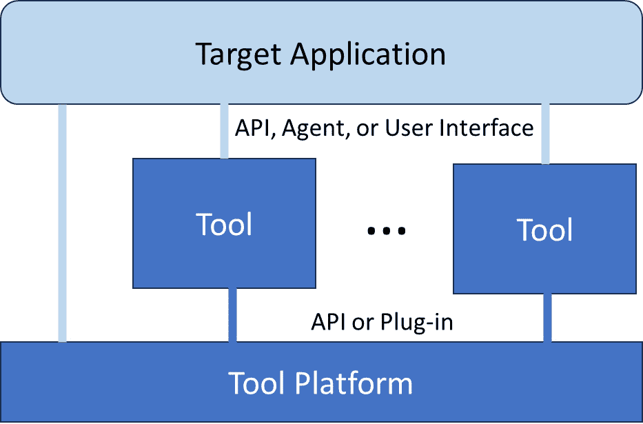
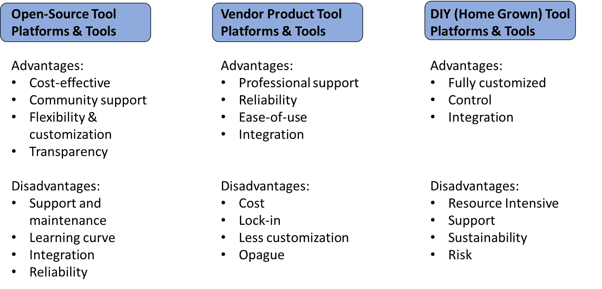
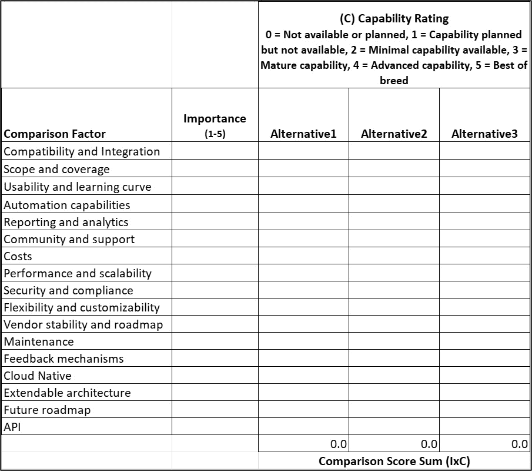
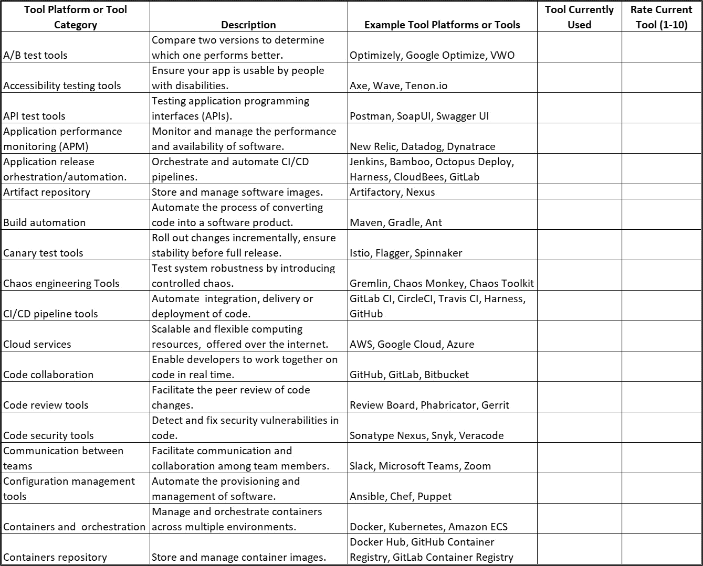
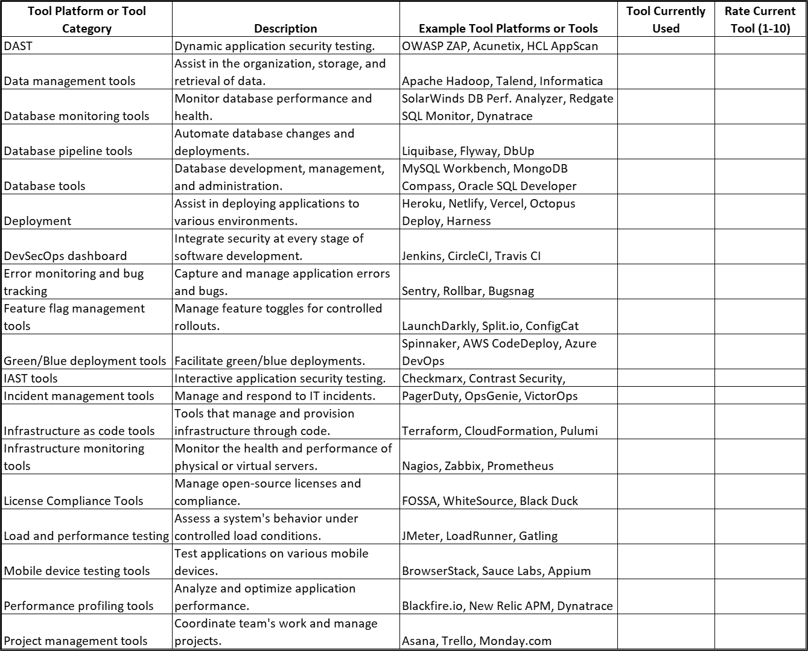
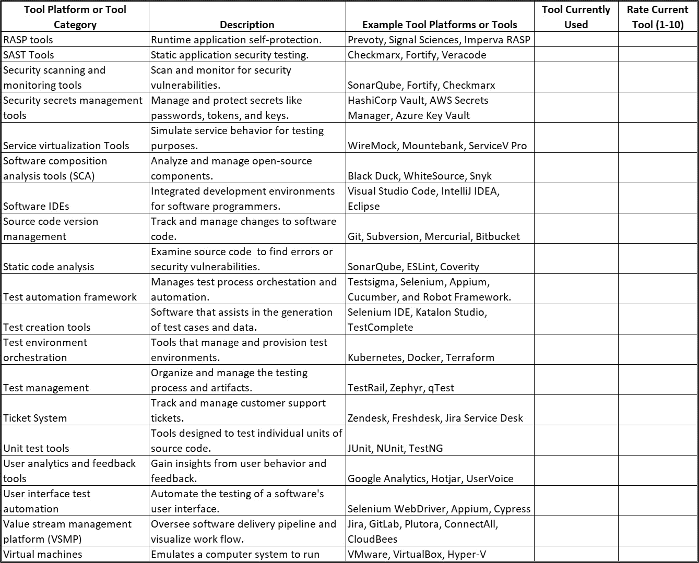
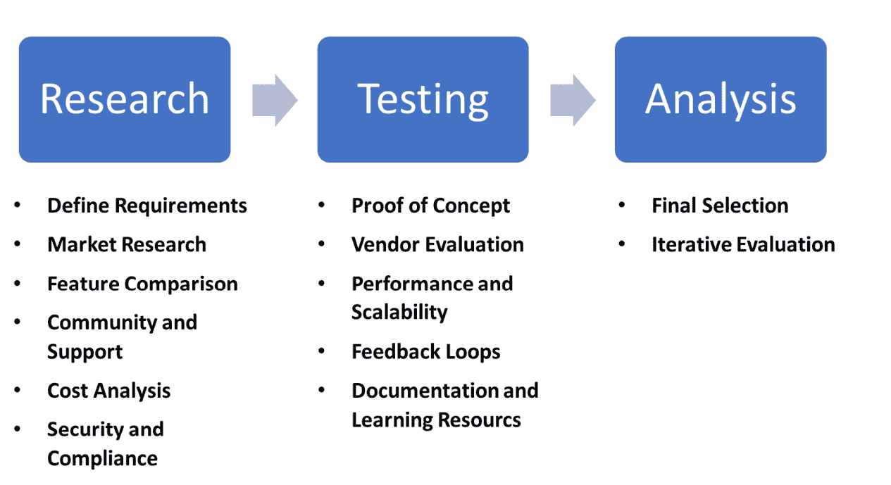

# 第七章：选择工具平台和工具

在软件开发的快速变化环境中，持续改进在测试、质量、安全性和反馈方面的强调从未如此重要。 本章作为一本全面指南，帮助您理解那些能够通过自动化和高效实践维持卓越的工具平台和工具。 本章解开了工具平台和工具的神秘面纱，深入探讨它们的核心定义、功能和它们在简化 软件工作流程中的关键作用。

本章为您提供了深入理解每个平台和工具如何被利用，以在不断变化的 技术挑战面前，培养持续改进和韧性文化的方式。

选择合适的工具平台和工具是一个至关重要的决策，它可能会显著影响开发过程和流程的效率和效果。 本章描述了一种方法论和工具，帮助您在选择工具平台和工具时做出明智的决策。 这种方法旨在引导您评估您的具体需求、不同选项的优缺点，并使您的选择与您的 战略目标相一致。

到本章结束时，您将全面理解软件开发中工具平台和工具的基本概念。 我们还将讨论用于持续测试、质量保证、安全性、 和反馈的各种工具平台和工具。

最后，我们将了解选择最适合您项目的平台和工具的战略方法，确保它们与您的目标对齐，并提升您的开发 生命周期。

本章按以下 标题组织：

+   工具平台和 工具概念

+   持续测试、质量、安全性、 和反馈的工具平台和工具

+   平台的来源 和工具

+   比较工具平台 和工具的因素

+   选择工具平台 和工具的方法

让我们 开始吧！

# 工具平台和工具概念

工具平台 和工具 是软件开发生态系统中密切相关但又各自独立的概念，它们通过协调、自动化和集成能力在简化和增强各个流程中发挥着至关重要的作用。 它们之间的关系如下： 。

## 工具平台

这些是 全面的、结构化的环境，为开发、测试、部署和管理软件应用程序提供了基础。 平台通过提供一套指导方针、编码标准、库和辅助工具，定义了构建和部署应用程序的标准化方式。 它们旨在通过减少重复操作、促进代码重用、并提供一套共同的实践和惯例来简化开发过程。 一个合法的工具平台应该支持与其他工具的集成能力。 平台不仅包括开发工具，还包括运行时环境、服务和 API，应用程序和其他工具可以使用它们。 一个平台可以承载其他工具，并提供数据服务、API、分析等，促进在统一环境中运行和管理工具应用程序。 。

让我们来看看 这些特性：

+   **可扩展性**：平台被设计为能够扩展并与各种应用程序和服务集成。 它们提供一组工具和服务，应用程序 可以利用。

+   **生态系统**：这通常包括一个市场或社区，第三方服务和集成可以添加到其中，以 增强功能。

+   **灵活性**：虽然 平台提供了许多工具和服务，但通常在应用程序的开发、部署 和管理上提供更多的灵活性。

## 工具

在软件开发的背景下，工具 是执行特定任务或功能的特定软件或应用程序。 这些工具可以是编译器、调试器和代码编辑器，也可以是用于版本控制、项目管理、持续集成和测试的更专业的工具。 工具通常被设计为集成到更大的开发工作流中，它们可以是独立的、是更大生态系统的一部分，或与 工具平台集成。

## 工具平台与工具之间的关系

*图 7**.1* 展示了工具平台、工具和 目标应用程序之间的关系。

图 7.1 – 工具平台、工具和应用程序之间的关系

工具平台、工具和应用程序之间的关系可以通过查看基础集成、标准化和效率的能力来解释，了解它们如何互补、如何增强彼此的功能，如 下文所述。

+   **基础和集成**: 工具平台 作为工具运行的基础或生态系统。 它们通常内置工具，或以允许无缝集成外部工具的方式设计。 例如，Web 开发平台可能包含内置的模板引擎和数据库迁移工具，但也允许集成外部的测试工具或 开发环境。

+   **标准化与效率**: 平台提供工具遵循的指南和标准，确保开发实践的一致性和效率。 当工具在这些平台中使用时，有助于自动化重复任务、提高生产力，并确保开发实践符合 平台设定的标准。

+   **互补性**: 工具 通过提供平台可能无法直接覆盖的特定功能来补充平台。 例如，虽然平台可能规定应用程序的结构并提供构建应用程序的基本组件，但版本控制系统、持续集成流水线和测试工具等工具，通过为团队协作、代码集成和 质量保证提供功能，补充了平台。

+   **增强**: 工具可以通过添加新功能、提升性能或使开发工作流程更加灵活高效，来增强平台的能力。 开发者通常选择那些与他们选择的平台兼容的工具，以确保顺利的 开发过程。

工具平台和工具是相互依赖的，平台为开发提供结构化环境和标准，而工具则提供在这些平台中高效执行开发任务所需的特定功能。 这种关系使得软件应用的开发更加高效、可维护 并且可扩展。

# 持续测试、质量、安全性和反馈的平台与工具

持续测试、质量、安全性和反馈的平台与工具，尽管在其主要关注点上有所不同，但它们相互关联，并且在实践中常常重叠。 以下部分将解释它们如何区分以及如何相互补充。

## 持续测试平台和工具

**持续测试** 的特点是专注于自动化测试，以验证软件是否满足每个测试用例的通过标准，在开发和交付过程中。 它是迭代的，并且集成到 开发管道中。

+   **工具和工具平台**：这包括覆盖所有类型测试的自动化测试工具，包括单元测试、集成测试、系统测试和 性能测试。

+   **补充**：它通过早期识别缺陷，确保新功能和变更不会引入回归问题。 通过将用户和利益相关者的反馈纳入测试中，持续反馈得以融入，以确保开发的内容与期望保持一致。

许多工具可以被归类为工具平台 和持续测试工具。 以下是一些示例：

+   **工具平台**：

    +   **Jenkins**：尽管它通常被归类为 持续集成和持续部署 **（CI/CD）**工具，但由于其广泛的插件生态系统，Jenkins 也可以看作是一个持续测试平台，它能够与各种测试工具集成，使得自动化测试成为构建和 部署过程的一部分。

    +   **TestRail**：此工具提供全面的测试用例管理，帮助组织、管理和追踪测试过程。 它与许多问题跟踪和 自动化工具集成，增强了 持续 测试的工作流程。

+   **工具**：

    +   **Selenium**：一种自动化 测试工具 ，用于 Web 应用程序，可以集成到各种开发 环境和平台中进行 端到端自动化。

    +   **Postman**：虽然主要是一个用于 API 测试的工具，Postman 可以集成到工具平台中进行自动化 API 测试，促进持续的 测试工作。

## 持续质量平台和工具

持续质量 的特点在于强调在所有流程中整合质量指标。 这不仅仅是发现缺陷，而是通过从一开始就纳入质量标准来预防缺陷。 从一开始就注重质量。

+   **工具和平台**：这些包括质量管理系统、代码质量指标工具，如 SonarQube，以及监控工具，能够跟踪质量指标 随着时间的推移。

+   **补充工具**：得益于提供即时反馈的持续测试工具，能够评估代码质量。 持续反馈机制是理解用户对质量期望的关键。 持续安全是质量的一个子集，因此确保安全的工具也对整体质量有所贡献。

许多工具可以被归类为持续质量的工具平台和工具。 以下是一些例子：

+   **工具平台**：

    +   **SonarQube**：作为一个质量框架，它能够与开发 环境、CI/CD 流水线和版本控制系统集成，持续检查代码质量和 安全漏洞。

    +   **Codacy**：一个 平台，通过静态代码分析自动 识别问题。 它与 GitHub、GitLab 和 Bitbucket 集成，支持协作和集成的代码质量 方法。

+   **工具**：

    +   **Coverity**：一个 静态分析工具，能够识别软件漏洞和 质量问题，并可以 集成到 CI/CD 流水线中进行 持续分析。

    +   **ESLint**：作为一个工具，它专注于 JavaScript 代码的 Lint 检查和修复问题，但 它可以集成到各种开发工作流中进行持续的代码 质量检查。

## 持续安全平台和工具

持续安全的特点在于它将安全性因素融入到开发的各个阶段。 它是主动的，旨在在 安全问题发生之前 预防它们。

+   **工具和平台**：这些包括 **静态应用程序安全测试（SAST）**， **动态应用程序安全测试（DAST）**，以及用于管理凭证 和秘密的工具，如 HashiCorp Vault。

+   **补充**：安全性是质量的一部分；因此，持续的安全工具对于持续的质量至关重要。 它们还受益于用于自动化安全测试的持续测试工具。 持续反馈可以为安全问题提供洞察， 来自用户 和利益相关者。

许多工具可以归类为持续安全的工具平台和工具。 以下是一些示例：

+   **工具平台**：

    +   **OWASP Zed Attack Proxy (ZAP)**：它可以 集成到 CI/CD 流水线中进行 自动化 安全测试，使其成为更广泛 安全框架的一部分。

    +   **Metasploit Framework**：除了 作为一个利用工具，它与各种渗透测试工具和环境集成，促进了全面的安全测试和 验证框架。

+   **工具**：

    +   **Nmap**：虽然 Nmap 是一个用于网络探索和安全审计的工具，但它通常被集成到安全框架中，作为自动化网络扫描 和监控的一部分。

    +   **Burp Suite**：主要是一个 用于 Web 应用程序安全测试的工具，它通过其 API 和集成提供扩展性，使其成为更大安全 评估框架的一部分。

## 持续反馈平台和工具

持续反馈 的特点在于它涉及收集并将利益相关者和用户的反馈纳入开发周期中，以不断改进 产品。

+   **工具和平台**：这些包括用户反馈平台、功能标记工具，如 **LaunchDarkly**，以及 可以提供有关用户如何与 应用程序互动的监控工具。

+   **补充工具**：反馈可以通过突出需要额外覆盖的领域，推动持续测试的改进。 它通过强调用户最关心的内容，直接支持持续质量改进。 对于持续的安全性，用户反馈可能揭示出感知的或实际的安全问题，从而 得到解决。

许多工具可以被分类为工具平台和用于持续反馈的工具。 以下是一些示例：

+   **工具平台**：

    +   **Salesforce Service Cloud**：除了作为一个 流行的 **客户关系管理（CRM）** 工具外，它还提供一个 平台，整合了各种 反馈和支持工具，使得 能够全面管理客户反馈 跨渠道的互动。

    +   **Zendesk**：提供一个 客户服务和互动平台， 它与多个反馈、支持和分析工具集成，创建了一个统一的系统来收集并响应 客户见解。

+   **工具**：

    +   **Typeform**：一个 创建互动式调查和表单的工具，可以集成到网站或平台中进行直接 反馈收集。

    +   **Hotjar**：提供通过热力图、会话录制和 调查收集反馈的工具。 虽然主要是一个工具，但它支持集成，使其能够融入更广泛的反馈和 分析框架。

## 重叠与集成

许多工具服务于多重目的。 例如，一个综合性的持续测试工具可能包括安全测试功能，从而也能满足持续 安全需求。

类似地，支持持续反馈的项目管理工具可能会集成质量和 测试仪表板。

像 GitLab 或 Jenkins 这样的 DevOps 平台可以协调一个包含持续测试、质量、安全和 收集反馈的管道。

总之，虽然工具和平台可以根据其主要功能进行分类，但最有效的开发和交付管道将整合这些类别，认识到它们不是孤立的，而是一个紧密结合的整体。 目标是开发不仅功能完善，而且高质量、安全，并与用户需求 和期望高度一致的软件。

# 平台和工具的来源

选择平台和工具时，最关键的决策之一是决定每个平台和工具的来源。 *图 7**.2* 显示了开源工具、供应商产品工具与 **自制** (**DIY**) 工具在持续测试、质量、安全 和反馈方面的优缺点。

图 7.2 – 工具平台和工具的来源

让我们详细探讨一下这些工具。  

## 开源工具

在接下来的 段落中，我们将探讨用于持续测试、质量、安全 和反馈的开源工具。

### 开源持续测试工具

开源持续测试 工具使团队能够无缝地将测试集成到软件开发和部署过程中，而不受专有软件的成本限制。 这些工具可以在开发的每个阶段进行自动化测试，确保尽早发现错误并及时解决，以维护 软件质量。

*示例*：Selenium 是一款广泛使用的开源工具，用于自动化 web 浏览器，允许开发者编写测试用例，模拟用户在各种浏览器 和平台上的交互。

### 开源质量工具

开源 质量工具为保持软件开发中的高标准提供了一种具有成本效益的解决方案。 它们允许进行静态代码分析、监控代码复杂性和遵循编码标准，帮助保持干净高效的 代码库。

*示例*：SonarQube 是一个开源平台，持续检查代码质量，使用静态分析自动审查代码并检测 bug、代码异味和安全漏洞。

### 开源安全工具

开源安全工具提供了诸如渗透测试和漏洞扫描等基本的安全功能，无需付费，从而帮助组织有效地增强其应用程序的安全态势。

*示例*：OWASP ZAP 是一个领先的开源安全工具，由网络安全领域最具声誉的组织之一 OWASP 开发，旨在在开发和测试阶段找出 web 应用中的安全漏洞。

### 开源反馈工具

开源反馈工具帮助组织高效地收集和管理用户或利益相关者的反馈，促进产品开发中的持续改进。这些工具能够融入开发工作流，使团队能够直接收集并回应用户的见解和期望。

*示例*：MantisBT 是一个开源问题跟踪器，提供一个简单却强大的平台来跟踪用户反馈和问题，帮助组织根据真实的用户体验改进和增强产品。

### 开源工具的优势

+   **成本效益**：开源工具通常是免费的，可以显著降低成本。

+   **社区支持**：通常有一个庞大的社区提供支持和开发，这有助于排除故障并改进工具。

+   **灵活性与定制化**：开源允许根据特定需求进行定制。

+   **透明性**：开源性质意味着你可以检查和修改代码，这对安全审计非常有利。

### 开源工具的缺点

+   **支持与维护**：缺乏正式的支持可能是一个挑战，通常需要依赖社区支持，但社区支持的质量可能不稳定。

+   **学习曲线**：这些工具可能有较陡的学习曲线，特别是对于那些不熟悉相关技术的团队。

+   **集成**：与现有系统的集成可能需要更多的努力，特别是当这些系统 是专有时。

+   **可靠性**：一些开源项目可能没有商业产品那样可靠的维护。

## 供应商产品工具

供应商产品工具 用于持续测试，提供支持自动化测试的先进集成解决方案，贯穿软件开发和部署过程。 这些商业工具通常提供增强的支持、可扩展性和量身定制的附加功能，满足企业需求，确保全面的测试和 质量保证。

*示例*：TestComplete 是一个商业化的自动化测试平台，使团队能够创建、管理并运行跨桌面、网页和移动应用程序的测试。 TestComplete 提供丰富的功能集，包括 GUI 测试、脚本或无脚本的测试创建，以及与 DevOps 流水线中其他工具的集成。

### 质量产品工具

商业质量工具 提供稳健的解决方案，用于维持软件代码质量的高标准。 这些工具通常提供全面的分析、与开发环境的广泛集成和专业支持，帮助团队遵循最佳实践并改善 代码健康。

*示例*：Coverity 是 一款静态代码分析工具，帮助开发人员通过在问题进入生产环境之前检测并解决代码库中的缺陷和漏洞，从而编写更安全、更可靠的代码。 生产环境。

### 安全产品工具

供应商产品安全工具 提供复杂的安全解决方案，包括自动化威胁检测、实时保护和事件响应能力等高级功能。 这些工具由专业支持和持续更新提供支持，以应对不断变化的 安全威胁。

*示例*：Veracode 是一个可扩展的、基于政策的应用程序安全平台，提供自动化的基于云的服务，用于在软件 开发生命周期中保护网页、移动和第三方企业应用程序。

### 反馈产品工具

商业反馈工具旨在高效地捕捉和管理来自多个渠道的用户反馈。 这些工具通常提供全面的分析功能，能够与 CRM 系统集成，并提供与用户直接互动的工具，从而增强根据用户反馈推动 产品开发的能力。

*示例*: UserVoice 是一款产品反馈管理软件，帮助企业收集和分析客户反馈，优先考虑功能需求，以更好地使产品开发与 用户需求对接。

### 供应商产品工具的优点

+   **专业支持**: 这些 工具通常提供专业支持 和培训。

+   **可靠性**: 供应商有商业利益来维护和更新 他们的产品。

+   **易用性**: 它们通常设计得非常注重用户友好性，通常提供更顺畅的 入职流程。

+   **集成性**: 它们可能提供更好的与其他工具和服务的集成，特别是在 同一生态系统内。

### 供应商产品工具的缺点

+   **成本**: 这些工具可能非常昂贵，特别是持续的 许可费用。

+   **厂商锁定**: 可能会存在厂商锁定的风险，使得切换到其他工具 或厂商变得困难。

+   **定制化程度较低**: 它们的定制化程度可能不如 开源选项。

+   **不透明性**: 闭源的性质意味着你不能检查或修改代码，这可能对 对安全要求较高的环境构成隐患。

## 自助开发或自制工具

自助开发或 自制工具，如果组织没有预算购买供应商产品工具，又不想使用 开源工具，可能是一个有吸引力的选择。

### 自制的持续测试工具

自制的持续 测试工具是根据特定项目或组织需求定制开发的解决方案。 这些自制工具允许团队将独特的测试流程和自动化框架直接集成到他们的开发环境中，从而完全控制测试功能和 集成能力。

*示例*：自定义自动化框架是一个使用开源库（如 Selenium 或 Appium）构建的定制化测试框架，经过修改和扩展，结合自定义脚本和插件，以满足组织软件项目的特定测试需求。

### DIY 质量工具

DIY 质量 工具是在内部开发的，用于维护符合组织开发实践的代码标准和质量。 这些工具可以专门设计，与现有工作流程集成，提供针对代码质量的深入见解和分析。

*示例*：内部代码审查工具是一个内部开发的工具，能够与版本控制系统集成，自动化代码审查和质量检查，专门用于执行组织的编码标准 和实践。

### DIY 安全工具

自建 安全工具是为了满足特定的安全需求而构建，并能与组织现有的 IT 基础设施无缝集成。 这些工具可以进行定制，提供专业的安全监控、威胁检测和事件响应，专门针对公司独特的环境和安全政策进行调整。

*示例*：自定义安全仪表板是一个自主开发的综合仪表板，能够汇总组织内部来自各个来源的安全警报、日志和数据，并配备自定义算法，根据 历史数据 检测异常和潜在威胁。

### DIY 反馈工具

DIY 反馈工具 允许组织在其产品生态系统内直接创建定制化的用户反馈收集和管理系统。 这些工具可以根据需要进行定制，以捕获特定类型的用户输入，并与产品功能深度集成，从而提供 可操作的见解。

*示例*：内部反馈门户是一个定制化开发的内部门户，旨在收集产品互动各个阶段的用户反馈，并与组织的产品管理和问题跟踪系统集成，以促进直接的用户参与和更快的 响应时间。

### DIY 工具的优势

+   **完全定制化**：这一点 可以完全根据组织的特定需求进行定制。

+   **控制**：对开发、部署和 维护过程拥有完全控制权。

+   **集成性**：可以设计为与现有基础设施无缝集成。

### DIY 工具的缺点

+   **资源密集型**：开发和维护定制工具需要大量的时间和专业知识。

+   **支持**：没有外部支持；组织负责解决任何问题。

+   **可持续性**：随着技术发展和内部资源变化，可能无法在长期内持续。

+   **风险**：如果内部团队缺乏必要的专业知识，则风险较高。

每种类型的工具都有其适用的地方，这取决于组织的需求、资源和目标。企业通常会使用这些工具的组合，以平衡每种工具的优缺点。对于持续的测试、质量、安全性和反馈，正确的选择将取决于定制化的重要性、可用预算、对支持的需求以及对工具和流程的控制程度。

# 比较工具平台和工具的因素

以下是选择工具平台和工具进行持续测试、质量、安全性和反馈时需要考虑的因素：

+   **兼容性和集成性**：工具应能够轻松与现有工作流程、正在使用的其他工具以及整体 IT 基础设施集成。无缝集成有助于自动化管道并减少摩擦。

+   **范围和覆盖面**：确定工具或平台提供的测试、质量、安全性和反馈的范围。覆盖面越广，随着项目的演变，它更有可能满足各种需求。

+   **可用性和学习曲线**：考虑工具的易用性以及培训员工所需的时间。易于使用且易于学习的工具可以更快地被采纳。

+   **自动化能力**：对于持续的流程，自动化是关键。评估工具在自动化重复任务和集成到 CI/CD 管道中的能力。

+   **报告与分析**：生成有洞察力的报告和分析的能力对于持续改进至关重要。 工具应提供全面的报告功能，用于跟踪进展并做出 数据驱动的决策。

+   **社区与支持**：考虑开源工具周围的社区或供应商提供的支持。 强大的社区或良好的支持对解决问题和 最佳实践非常宝贵。

+   **成本**：评估总体拥有成本，而不仅仅是初始价格。 这包括许可费用、维护、支持和供应商产品的培训成本，以及 自主研发解决方案的开发和维护成本。

+   **性能与可扩展性**：所选择的工具应能在预期的负载下良好运行，并且 具备可扩展性，以满足不断增长的需求 ，而不会导致成本 或复杂性的显著增加。

+   **安全性与合规性**：确保工具或平台不会引入安全漏洞，并且符合相关行业标准 和法规。

+   **灵活性与可定制性**：能够根据特定项目需求定制工具是一个重要优势，尤其适用于 复杂项目。

+   **供应商稳定性与路线图**：选择供应商工具时，要考虑供应商的稳定性、声誉以及产品路线图，确保它能够继续满足你未来的需求。

+   **更新频率与维护**：了解工具的更新频率。 频繁的更新可能表明活跃的开发状态，但也要考虑跟进 这些更新所需的努力。

+   **反馈机制**：对于专注于反馈的工具，评估它们如何收集、分析和管理反馈。 该工具应能够提供可操作的洞察，以改善 开发过程。

+   **云原生**：这指的是工具是否为云环境设计并能原生集成，这对可扩展性、韧性和 远程访问性非常重要。

+   **可扩展架构**：具有可扩展或插件架构的工具可以更容易地根据特定需求进行定制，支持与其他工具的集成，并能随着 需求变化而演变。

+   **可用的未来发展路线图**：了解工具的未来发展路线图可以为工具的长期使用和未来能力提供洞察，并与长期 战略目标相一致。

+   **可用的 API**：拥有一个强大且文档完善的 API 对于自动化、与其他工具的集成以及自定义 开发工作至关重要。

*图 7**.3* 提供了一个比较表，方便对比不同的替代平台 和工具。

图 7.3 – 平台和工具的比较

请记住，这些因素的重要性会根据你组织的具体背景和需求有所不同。 在做出最终决定之前，试用工具通常是有益的，以确保它符合你的期望 和要求。

## 示例工具平台和工具

*图 7.4*, *7.5*, 和 *7.6* 提供了一个分类和示例工具平台及工具的列表 ，这些可以用于持续测试、质量、安全和反馈的应用。 有许多分类和示例可以 选择。

下图列出了以字母 A 到 C 开头的工具。

图 7.4 – 示例工具平台和工具（A-C）

下图 列出了以字母 D 到 P 开头的工具。

图 7.5 – 示例工具平台和工具（D-P）

下图 列出了以字母 Q 到 Z 开头的工具。

图 7.6 – 示例工具平台和工具（Q-Z）

本节 解释了在选择用于持续测试、质量、安全和反馈的工具平台和工具时需要考虑的重要因素。 它提供了一个有用的比较表，用于比较替代平台和工具，并对持续测试、质量、安全和反馈的应用进行了分类。 下一节将描述选择工具平台 和工具的方法论。

# 选择工具平台和工具的方法论

*图 7**.7* 展示了 基于行业最佳实践的普遍推荐方法，用于选择持续测试、质量、安全 和反馈的工具。 。

图 7.7 – 工具平台和工具选择方法论

以下是每个步骤的 选择过程中的 活动 ：

1.  **定义你的需求**：首先了解你组织的具体需求。 这包括运营规模、项目复杂性、团队技能以及你希望通过持续测试、质量、安全 和反馈实现的具体目标。

1.  **市场调研**：进行调研，识别市场上满足你需求的工具。 这应包括开源和商业选项。 *图 7**.2* 展示了选择源选项时需要考虑的因素。

1.  **功能比较**：根据你的需求比较不同工具的功能。 特别注意云原生能力、可扩展架构、未来可用路线图以及可用的 API 等方面。 *图 7**.3* 展示了一个比较图的示例，可以用来组织 比较内容。

1.  **社区与支持**：评估开源工具的社区支持和商业产品的客户服务。 强大的社区或良好的客户支持对解决可能出现的问题至关重要。

1.  **成本分析**：考虑总拥有成本，包括供应商产品的许可费用、开源工具的运营成本，以及自制解决方案的开发和维护成本。 自制解决方案。

1.  **安全性和合规性**：确保工具符合您的组织所需遵守的相关安全性和数据保护法规。 法规。

1.  **概念验证**：对入围工具实施概念验证，看看它们在您的环境中的表现。 这还将帮助评估学习曲线及与现有系统的集成难易程度。

1.  **供应商评估**：如果 考虑使用供应商工具，评估供应商的稳定性、声誉，以及他们 产品路线图的稳健性。

1.  **性能和可扩展性**：确保工具在预期负载下表现良好，并能够根据您的 业务需求进行扩展。

1.  **集成能力**：工具应能够与您现有的 CI/CD 管道以及 其他工具无缝集成。

1.  **反馈循环**：工具应促进快速的反馈循环。 专注于反馈的工具应允许轻松收集、分析和实施用户及 利益相关者的反馈。

1.  **文档和学习资源**：确保提供全面的文档和学习资源，使您的团队能够快速 上手。

1.  **最终选择**：使用评分系统评估每个工具如何与您的标准对比。 让关键利益相关者参与最终决策，以 确保获得支持。

1.  **迭代评估**：工具 应定期评估 以确保它们在组织发展和演变的过程中继续满足需求。 需求。

请记住，工具的选择是一个战略决策，可能会对您组织高效、安全地交付高质量软件的能力产生长期影响。 因此，投入必要的时间和资源来做出 明智的决策至关重要。

## 确定足够工具的数量

选择正确的 连续测试、质量、安全和反馈工具平台及工具数量，在企业内部受到多个关键因素的影响。 目标是在不引起工具泛滥或不必要复杂性的情况下，实现全面覆盖和集成能力的平衡。 通常确定足够工具的因素如下：

+   **项目范围**：企业承担的项目的规模、数量和复杂性决定了所需工具的范围。 更大规模且架构更复杂的项目可能需要针对不同测试和安全层面的专门工具。

+   **技术栈**：企业应用中使用的技术栈的多样性可能需要不同的工具。 每个层面（前端、后端、数据库等）和技术（语言、框架）可能都需要专门的工具来进行最佳测试和安全性保障。

+   **集成能力**：工具应与现有的工作流程、CI/CD 流水线和其他工具无缝集成。 所需的集成程度可以限制或扩展有效利用的工具数量，而不会导致信息孤岛或集成困难。

+   **合规性和法规要求**：根据行业不同，企业可能需要遵守特定的法规标准（例如 GDPR、HIPAA、PCI-DSS），这些法规要求特定的安全、质量和反馈机制，从而影响工具的选择和数量。

+   **团队技能**：开发、质量保证和安全团队在某些工具或类型的工具上的专业知识和经验可能会影响选择。 选择团队能够有效使用和管理的工具至关重要。

+   **预算限制**：工具的成本，包括许可证、培训和维护，发挥了重要作用。 关键在于找到在可用预算范围内提供所需功能的工具组合。

+   **整体战略和目标**：企业关于市场速度、质量基准、安全姿态和客户满意度目标的战略将极大地影响工具需求的全面性。

+   **反馈和持续改进**：工具在提供可操作反馈和支持持续改进方面的有效性至关重要。 那些 能够提供全面洞察且不会让团队感到压倒性的工具 更受欢迎。

## 平衡之道

适当数量的工具 能够全面覆盖测试、质量、安全性和反馈，而不会产生功能重叠，从而浪费资源或造成混乱。 关键在于实现平衡，使每个工具都能提供独特的价值，能够与其他工具良好集成，并支持企业的整体目标，而不会形成笨重的工具链，从而拖慢流程或 复杂化工作流。

定期评估工具链的有效性，并根据项目的发展、技术的变化以及企业的成长进行调整，是维持 这一平衡的关键。

# 总结

本章概述了工具平台和工具在通过持续的测试、质量、安全性和反馈来增强软件开发中的重要性。 它详细阐述了这些工具和平台在自动化、集成和简化开发流程中所发挥的独特而又互相关联的作用。 选择的关键在于了解每个工具的功能和集成能力，并将其与战略目标对齐。 本章还详细介绍了选择合适工具的方法论，强调了兼容性、自动化和成本等因素，确保它们能够补充开发生命周期并支持 持续改进。

在下一章中，我将探讨 **人工智能/机器学习** (**AI/ML**) 在持续测试、质量、安全性 和反馈中的应用。
