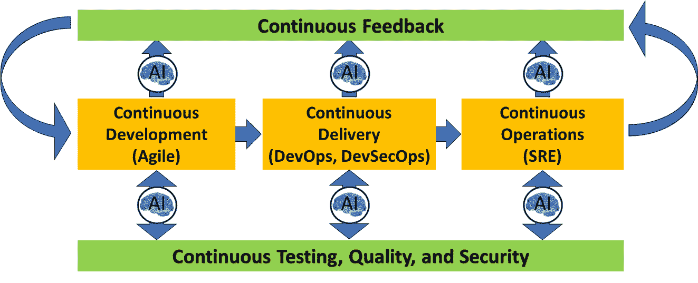
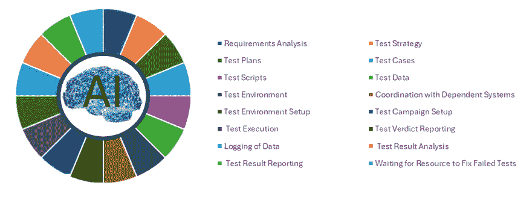
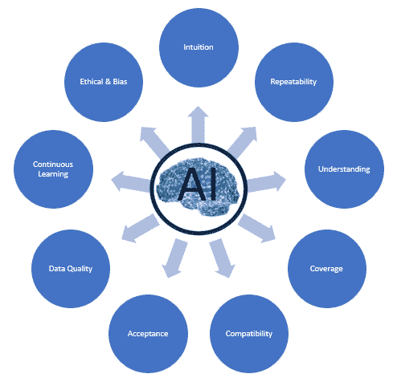
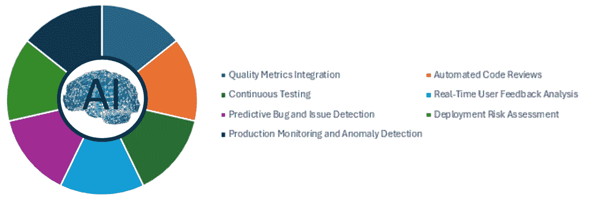
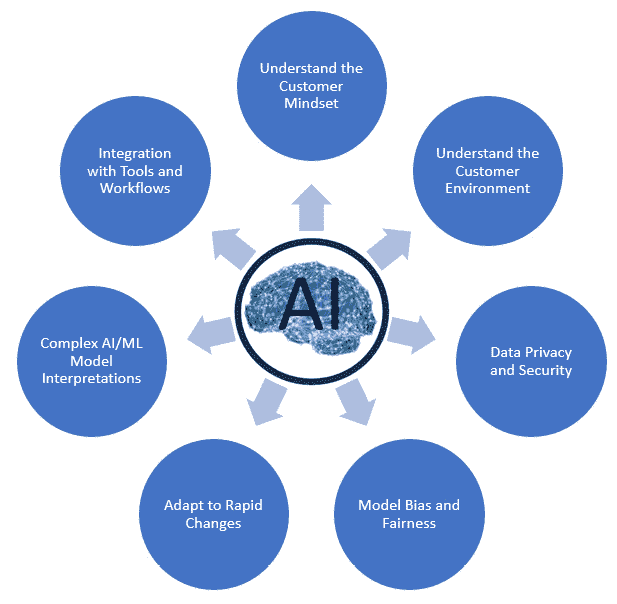
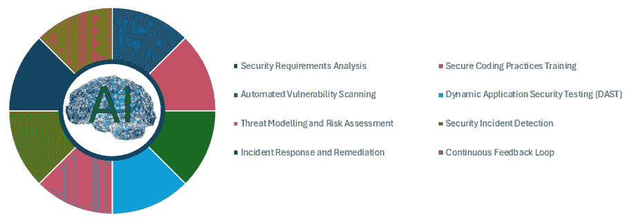
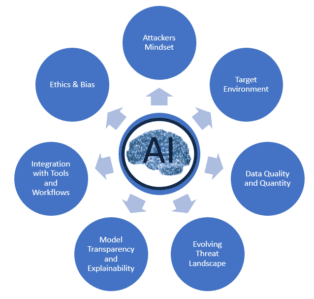
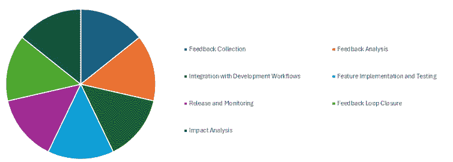
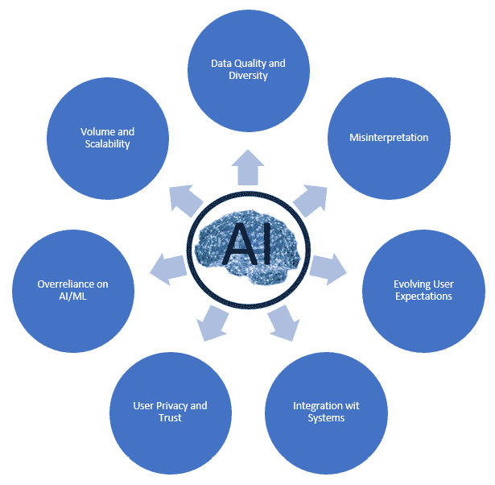
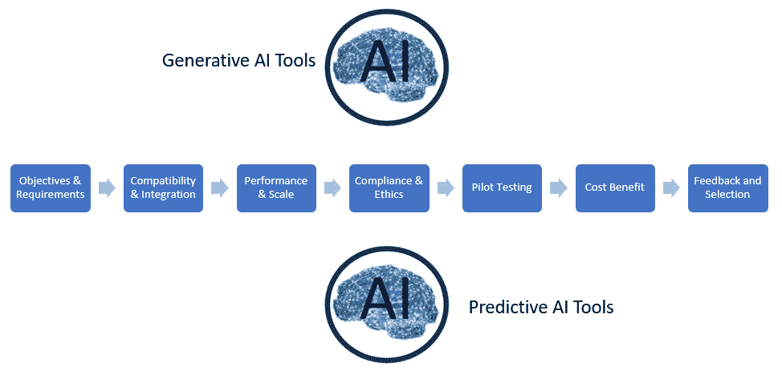

# 第八章：将 AI/ML 应用于持续测试、质量、安全和反馈

本章深入探讨了 **人工智能** (**AI**) 和 **机器学习** (**ML**) 在软件开发生命周期中的变革性作用，特别关注 如何提升持续测试、质量、安全和 反馈实践。

本章开始时概述了 AI/ML 的应用。 它解释了这些技术如何重新塑造持续测试、质量、安全和反馈的领域。 每个部分深入探讨了旨在自动化和优化流程的 AI/ML 策略，从早期的代码测试到部署后的监控。 这些都是为了促进无缝、持续集成和交付管道的实现，借助 AI 驱动的工具链。

本章为选择能在您的持续测试、质量、安全和反馈转型项目中有效整合的 AI/ML 工具提供了方法论。 的建议。

通过本章的学习，您将全面了解适用于持续测试、质量、安全和反馈的 AI/ML 工具。 您还将学会一种系统的方法来选择 AI/ML 工具。

在本章中，我们将涵盖以下 主要主题：

+   AI/ML 应用

+   用于 持续测试的 AI/ML

+   用于 持续质量的 AI/ML

+   用于 持续安全的 AI/ML

+   用于 持续反馈的 AI/ML

+   选择 AI/ML 工具的方法

让我们 开始吧！

# AI/ML 应用

在快速发展的 软件开发和运维领域，AI 和 ML 正在改变组织如何看待持续测试、质量、安全、 以及反馈。

如 *图 8**.1*所示，这些技术已经成为帮助组织应对数字化转型复杂性的重要工具，尤其是在 DevOps、DevSecOps 和 SRE 等框架下。 通过利用 AI/ML 的力量，企业不仅加速了开发周期，还以前所未有的方式增强了其应用的稳健性和安全性。 。

图 8.1 – AI/ML 在持续测试、质量、安全性和反馈中的应用

近年来，AI/ML 技术取得了显著进展，达到了能够有效 集成到持续集成/持续部署 **（CI/CD）** 流水线的复杂程度，在这些流水线中，速度和效率的需求必须与质量和安全的要求相平衡。 AI/ML 通过自动化复杂任务、预测潜在问题并提供可操作的见解，从而减少人工工作，促进了人力资源的更战略性使用。 人力资源。

AI/ML 的应用 包括从数据中学习、适应新信息并随着时间推移不断改进的能力。 这一能力在识别模式、预见潜在漏洞和优化测试策略方面具有无价的价值。 在质量保证中，AI 驱动的工具可以预测最可能出现故障的区域，并相应地定制测试工作。 在安全性方面，ML 算法可以检测到表明潜在威胁的异常情况，而在操作中，AI 可以增强反馈机制，进而使系统更加稳健和 响应迅速。

本章后续部分将深入探讨 AI/ML 在持续测试、质量、安全性和反馈领域中的具体应用案例。 这些例子将展示 AI/ML 如何不仅简化流程，还提升软件开发和维护的标准。 本章提供了 AI/ML 对致力于卓越的数字化转型组织的变革潜力的全面概述。 转型之旅。

# AI/ML 在持续测试中的应用

将 AI 和 ML 集成到 软件的持续测试活动中，可以显著简化流程，解决每个活动中可能出现的瓶颈，正如在 *图 8**.2*中所示。

图 8.2 – AI/ML 在持续测试活动中的应用

以下是这些技术在各种 测试活动中的应用：

1.  **需求分析**：

    +   *解释*：确保 测试场景与业务需求以及 用户需求一致。

    +   *瓶颈*: 错误的解读或不完整的分析可能导致不足的 测试覆盖率。

    +   *AI/ML 解决方案*: NLP 可以自动提取和解释需求，确保全面且准确的 测试覆盖率。

1.  **测试策略**:

    +   *解释*: 概述 测试方法、目标 和资源。

    +   *瓶颈*: 不清晰的策略可能导致测试工作效率低下和 资源分配不当。

    +   *AI/ML 解决方案*: AI 可以分析历史数据，建议最有效的测试策略，并预测 资源需求。

1.  **测试 计划**:

    +   *解释*: 指导测试过程、时间表 和责任的详细文档。

    +   *瓶颈*: 不灵活的计划可能难以适应项目变化， 导致延迟。

    +   *AI/ML 解决方案*: ML 算法可以根据项目的持续发展和 过去的结果建议调整测试计划。

1.  **测试用例**:

    +   *解释*: 执行测试的 特定条件。

    +   *瓶颈*: 开发耗时且维护 测试用例的工作量巨大。

    +   *AI/ML 解决方案*: AI 可以从需求 文档中自动生成测试用例，提高效率 和覆盖率。

1.  **测试脚本**:

    +   *解释*: 自动化 脚本执行 测试用例。

    +   *瓶颈*: 脚本开发和维护可能 消耗大量资源。

    +   *AI/ML 解决方案*: AI 可以根据应用或测试用例的变化生成并更新测试脚本，减少 维护工作量。

1.  **测试数据**:

    +   *解释*: 测试中使用的数据集，用于模拟 现实世界场景。

    +   *瓶颈*: 创建、管理和维护准确的测试数据 是一个挑战。

    +   *AI/ML 解决方案*: AI 可以自动生成和管理测试数据，确保其相关性 和多样性。

1.  **测试环境**:

    +   *解释*: 测试进行的设置，尽可能地模拟生产环境。

    +   *瓶颈*: 测试环境的配置和维护 非常复杂。

    +   *AI/ML 解决方案*: AI 可以根据测试需求预测并配置最优的测试环境，减少 设置时间。

1.  **与** **依赖系统的协调**:

    +   *解释*: 确保被测试系统与数据库和 其他应用程序正确交互。

    +   *瓶颈*: 依赖管理可能会 导致延迟。

    +   *AI/ML 解决方案*: AI 可以自动检测并解决集成问题，提升 协调效率。

1.  **测试** **活动设置**:

    +   *解释*: 组织并安排一系列 测试执行。

    +   *瓶颈*: 需要精心规划，并可能受限于 资源限制。

    +   *AI/ML 解决方案*: AI 可以根据风险和 影响分析帮助安排和优先考虑测试活动。

1.  **测试执行**:

    +   *解释*: 运行测试用例和脚本的过程，包括自动化 和手动。

    +   *瓶颈*: 耗时较长，尤其是对于 手动测试。

    +   *AI/ML 解决方案*: AI 可以优先执行测试并识别不稳定的测试，简化 过程。

1.  **测试判定报告** **:**

    +   *解释*: 确定并报告 测试执行的结果。

    +   *瓶颈*: 手动判定结果可能 很慢。

    +   *AI/ML 解决方案*: AI 可以自动解读测试结果，加速 报告。

1.  **数据日志记录** **:**

    +   *解释*: 记录与测试相关的数据，以便 进一步分析。

    +   *瓶颈*: 广泛的数据收集可能会 压垮资源。

    +   *AI/ML 解决方案*：AI 可以智能地过滤并记录相关数据， 减少噪声。

1.  **测试** **结果分析**：

    +   *解释*：分析 测试结果以识别缺陷 和问题。

    +   *瓶颈*：需要大量时间 和专业知识。

    +   *AI/ML 解决方案*：ML 算法可以快速识别测试结果中的模式和异常，突出 潜在问题。

1.  **测试** **结果报告**：

    +   *解释*：向利益相关者 传达发现 的结果。

    +   *瓶颈*：编写报告 非常耗时。

    +   *AI/ML 解决方案*：由 AI 驱动的自动化报告工具可以快速生成有洞察力和全面的 报告。

1.  **等待资源修复** **失败的测试**：

    +   *解释*：等待修复 已识别问题时的停机时间。

    +   *瓶颈：* 阻碍 测试进展。

    +   *AI/ML 解决方案：* AI 可以 预测可能失败的领域，并提出 潜在的修复方案。

将 AI/ML 应用于软件测试活动 带来了许多优势，但也引入了一些挑战，正如 *图 8**.3*所示。解决这些问题需要技术解决方案、流程调整和 文化变革的结合。

图 8.3 – AI/ML 持续测试挑战

在这里，我们讨论一些 常见问题及其克服策略：

+   **缺乏对正在测试应用程序的直观理解** **：**

    +   *问题*：AI/ML 模型可能无法完全理解应用程序的上下文或其功能的细微差别，从而导致测试场景的有效性降低。

    +   *解决方案*：通过更丰富的上下文数据增强 AI 模型，并引入反馈循环，允许测试人员细化和调整 AI 生成的测试用例。 采用强化学习等技术还可以帮助 AI 模型随着时间推移更好地理解应用程序的上下文。

+   **测试会话之间的** **重复性和一致性**：

    +   *问题*：AI 驱动的测试可能会为相同的输入在不同的会话中生成不同的输出，从而使测试一致性 和可追溯性变得复杂。

    +   *解决方案*：为 AI 模型及其训练数据实施版本控制，确保测试会话的一致性。 采用确定性方法与 AI 结合，保持核心稳定、 可重复的测试。

+   **对** **生成的测试的理解缺乏**：

    +   *问题*：测试人员可能会发现理解或信任 AI 生成的测试用例的合理性具有挑战性，这会影响他们有效评估测试 结果的能力。

    +   *解决方案*：将可解释性功能纳入 AI/ML 模型，以提供对其决策过程的洞察。 通过教育和透明度培养信任和理解文化，说明 AI 模型的操作方式。

+   **测试覆盖率**：

    +   *问题*：AI/ML 可能无法充分覆盖所有测试场景，可能漏掉 关键缺陷。

    +   *解决方案*：将 AI/ML 与传统的测试方法相结合，以确保全面覆盖。 定期审查并调整 AI/ML 模型生成测试用例时使用的标准，确保它们与不断变化的应用功能 和风险保持一致。

+   **与不同** **测试工具**的兼容性**：

    +   *问题*：AI/ML 模型可能无法与现有的测试工具和框架无缝集成，从而限制其 实用性。

    +   *解决方案*：开发或使用具有广泛 API 支持和集成功能的 AI/ML 解决方案。 与工具供应商合作或贡献开源项目，以 提高兼容性。

+   **团队的接受度** **：**：

    +   *问题*：测试人员 和开发人员可能会对 AI 驱动的测试持怀疑或抵触态度，担心职位替代或不信任 AI 的有效性。

    +   *解决方案*：教育 并让团队参与 AI/ML 测试策略的开发和实施。 展示 AI/ML 在增强他们角色而非取代它们方面的价值，重点将 AI 作为应对日常任务的工具，让团队能够专注于更复杂且 更有成就感的工作。

+   **数据质量** **和可用性**：

    +   *问题*：AI/ML 模型需要大量高质量数据进行训练。 不充分或低质量的数据可能导致 无效的测试。

    +   *解决方案*：投资于数据策划和生成策略，例如合成数据创建，确保模型得到 良好的训练。

+   **持续学习** **和适应性**：

    +   *问题*：随着应用的不断发展，AI/ML 模型可能会变得过时。

    +   *解决方案*：建立持续学习机制，使模型定期通过新数据和反馈进行更新，确保它们始终保持相关性 和有效性。

+   **伦理与** **偏见考量**：

    +   *问题*：AI/ML 测试模型可能会继承或放大其训练数据中的偏见，导致不公平或 歧视性结果。

    +   *解决方案*：实施 伦理准则和偏见检测方法，用于 AI/ML 模型的开发和使用。 定期审计模型以发现偏见，并根据需要进行修正。

通过这些深思熟虑的策略来应对挑战，组织可以最大限度地发挥 AI/ML 在测试活动中的优势，同时减轻潜在的负面影响，从而实现更高效、更有效和更值得信赖的 测试流程。

## AI/ML 辅助的持续测试在实际应用中的案例

一个实际应用案例是 在使用如 **Applitools**这样的工具时，该工具利用视觉 AI 来自动化并简化多个网页和移动应用程序中 **用户界面** (**UI**)的验证工作。 这种 AI 驱动的方法使团队能够通过将当前版本的应用 UI 与先前捕获并验证为正确的基准图像进行比较，来检测不一致或视觉回归 问题。

这种方法通过自动检测布局问题、颜色不匹配或 UI 元素的意外变化等视觉问题，极大地减少了手动测试所需的时间和精力。 AI 组件随着时间推移会适应 UI 的变化，从而保持其有效性，即使应用程序发生变化。 通过将此类工具集成到开发管道中，组织可以确保更准确、高效和可扩展的测试过程，最终实现更快速的部署周期和更高质量的 软件产品。

# AI/ML 用于持续质量

在开发、交付和生产生命周期中实施持续质量涉及若干活动，旨在确保稳定的发布并提升用户满意度，如 *图 8**.4*所示。

图 8.4 – 用于持续质量活动的 AI/ML

以下是此方法所需的活动列表，列出了潜在的瓶颈以及 AI/ML 如何解决 这些挑战：

1.  **质量** **指标集成**：

    +   *描述*：将 质量指标嵌入到软件开发生命周期的每个阶段，以持续监控和改进 质量。

    +   *瓶颈*：手动收集和分析质量指标可能会耗时且容易出错，可能会拖慢 开发过程。

    +   *AI/ML 应用*：AI 可以自动化从各种工具和平台中提取、监控和分析质量指标，提供实时洞察和预测，以防止 质量问题。

1.  **自动化** **代码审查**：

    +   *描述*：利用 工具自动审查代码中的潜在问题、遵循编码标准和安全漏洞，代码一旦 提交，就会立即进行检查。

    +   *瓶颈*：自动化代码审查工具中的高误报率可能会导致开发人员疲劳，并减缓 审查过程。

    +   *AI/ML 应用*：机器学习模型可以从历史代码审查数据中学习，以减少误报并突出最相关的问题，从而简化 审查过程。

1.  **持续测试**：

    +   *描述*：在 CI/CD 流水线中运行自动化测试，以尽早识别缺陷 尽可能早。

    +   *瓶颈*：创建和维护覆盖应用各个方面的综合测试套件可能会消耗大量资源，并可能导致发布速度变慢。

    +   *AI/ML 应用*：AI 可以根据代码库的变化和用户行为生成测试用例，确保相关且高效的 测试覆盖。

1.  **实时用户** **反馈分析**：

    +   *描述*：实时收集和分析来自多个渠道的用户反馈，以识别问题和改进领域。

    +   *瓶颈*：手动分析来自多个来源的用户反馈可能会不堪重负，并延迟识别 关键问题。

    +   *AI/ML 应用*：NLP 和情感分析算法可以自动对用户反馈进行分类和优先级排序，从而加快对关键问题 和趋势的响应。

1.  **预测漏洞与** **问题检测**：

    +   *描述*：基于历史数据和代码变更模式预测潜在的漏洞和问题。

    +   *瓶颈*：在没有历史背景的情况下识别潜在问题可能是具有挑战性的，可能导致问题在发布后未被注意到 直到发布后。

    +   *AI/ML 应用*：ML 模型可以分析代码变更、提交历史和问题跟踪器，预测最可能引入缺陷的代码区域，从而采取 预防措施。

1.  **部署** **风险评估**：

    +   *描述*：根据质量指标、测试结果和历史 部署数据评估新发布的风险。

    +   *瓶颈*：手动风险评估可能具有主观性和不一致性，可能导致不必要的延迟或 被忽视的问题。

    +   *AI/ML 应用*：AI 算法可以通过分析大量数据集提供客观的风险评估，帮助团队做出明智的决策 关于发布。

1.  **生产监控与** **异常检测**：

    +   *描述*：监控生产环境中的意外行为、性能问题和 安全威胁。

    +   *瓶颈*：筛选大量监控数据以识别异常可能会延迟问题的检测和解决 。

    +   *AI/ML 应用*：机器学习模型可以持续分析监控数据，实时检测异常，减少检测时间并提高 响应 效率。

通过将这些活动整合到开发、交付和生产生命周期中，组织可以显著增强其持续质量策略。 AI/ML 应用在克服与这些活动相关的瓶颈方面起着至关重要的作用，使发布更加稳定，并提高 用户满意度。

将 AI/ML 应用于 持续质量活动带来了显著的优势，但也带来了可能妨碍其有效性的挑战，正如在 *图 8**.5*中所示。

图 8.5 – AI/ML 在持续质量中的挑战

识别这些问题对于制定应对策略至关重要。 以下是将 AI/ML 融入持续质量工作中的一些常见问题，以及 建议的解决方案：

+   **缺乏对** **客户心态的直观理解**：

    +   *问题*：AI/ML 模型可能无法自然地理解客户期望的细微差异或用户与应用程序的交互方式，这可能导致质量改进不一致。

    +   *策略*：为了弥合这一差距，将 AI/ML 洞察与直接的客户反馈机制和用户行为分析相结合。 利用自然语言处理（NLP）分析客户评论和反馈，可以提供有助于模型训练和调整的定性见解，使 AI 驱动的质量改进与 用户期望保持一致。

+   **关于** **客户环境的不确定性**：

    +   *问题*：AI/ML 模型可能难以预测和测试各种用户环境（设备、操作系统和网络条件），可能会忽略关键的 质量问题。

    +   *策略*: 实施合成数据生成和仿真技术可以帮助创建多样化的场景，模拟各种客户环境。 结合真实世界的使用数据，可以训练 AI/ML 模型更好地预测并解决特定环境中的 质量问题。

+   **数据隐私和** **安全问题**:

    +   *问题*: 收集和使用 AI/ML 的数据，尤其是用户反馈和行为数据，引发了关于隐私和 数据安全的担忧。

    +   *策略*: 使用隐私保护的数据分析技术，如差分隐私和联邦学习，训练模型而不泄露用户个人数据。 通过采用数据治理框架，确保符合数据保护法规，优先考虑用户同意和 数据最小化。

+   **模型偏差** **与公平性**:

    +   *问题*: AI/ML 模型可能会无意中 学习到训练数据中的偏差，从而导致质量改进中的不公平或歧视性结果。

    +   *策略*: 定期审查 AI/ML 模型的偏差，并实施公平意识的机器学习实践。 这包括多样化训练数据、应用去偏差技术，并设定公平性标准来评估 模型输出。

+   **适应性** **对快速变化的响应**:

    +   *问题*: 基于历史数据训练的 AI/ML 模型可能无法迅速适应用户行为、市场趋势或新特性引入的快速变化。

    +   *策略*: 将持续学习机制融入 AI/ML 模型中，允许根据新数据进行频繁的再训练和更新。 采用在线学习等技术可以使模型实时适应 变化。

+   **AI/ML 模型的复杂性** **及其可解释性**:

    +   *问题*: 一些 AI/ML 模型的“黑箱”性质使得团队难以理解和信任其预测和推荐，尤其是在 质量改进方面。

    +   *策略*：专注于开发和 应用 **可解释的 AI** (**XAI**)方法，提供对 AI 模型决策过程的洞察。 通过提供培训和资源，促进透明文化，帮助团队成员理解 AI/ML 模型如何促进 质量成果。

+   **与现有工具** **和工作流的集成**：

    +   *问题*：将 AI/ML 解决方案无缝集成到现有的持续质量流程和工具中可能会遇到挑战，可能导致中断 和低效。

    +   *策略*：采用提供广泛 API 支持、插件和与现有质量保证及开发平台集成能力的 AI/ML 工具。 考虑逐步集成策略，允许渐进式适应 和学习。

解决这些 挑战需要一种深思熟虑的方法 ，结合技术解决方案、流程调整和持续学习。 通过认识并战略性地解决这些问题，组织可以充分利用 AI/ML 的潜力，提升持续质量的倡议，从而提高用户满意度并降低生产 失败率。

## AI/ML 辅助的持续质量的实际应用场景

一个实际的 使用 AI/ML 辅助工具维护软件开发中持续质量的例子可以在 **SonarQube**中看到，SonarQube 是一个开源平台，利用 ML 增强代码质量分析。 SonarQube 通过使用静态分析方法并结合 ML 算法扫描代码库中的漏洞、缺陷和代码异味。 这些算法通过学习大量的代码数据集，能够更好地识别传统方法可能遗漏的复杂编码问题。 可能错过的复杂编码问题。

这一 ML 能力使 SonarQube 能够随着时间的推移自适应地提高其分析准确性，从各种代码库中的模式和修正中进行学习。 通过将 SonarQube 集成到 CI/CD 管道中，开发人员可以实时获得代码质量反馈，确保质量检查成为开发过程的一个核心部分，而不是事后的补充。 这种持续的自动化审查有助于保持高标准的编码规范，减少技术债务和生产环境中缺陷的可能性。 生产环境中的缺陷。

# AI/ML 在持续安全中的应用

实施持续的 安全性涉及在开发、交付和运维生命周期中无缝集成主动和被动的安全措施。 这种方法旨在最大限度减少安全事件的频率和影响。 *图 8**.6* 展示了实现 持续安全所需的关键活动。

图 8.6 – 用于持续安全活动的 AI/ML

以下解释了潜在的瓶颈以及 AI/ML 如何缓解 这些挑战：

1.  **安全性** **需求分析**：

    +   *描述*：定义 并理解特定于应用程序及其运行环境的安全需求。

    +   *瓶颈*：耗时的分析以及可能忽略 关键需求。

    +   *AI/ML 应用*：AI 驱动的工具可以分析项目文档和代码，自动识别适用于项目的安全需求和规范，加快过程并 减少遗漏。

1.  **安全编码** **实践培训**：

    +   *描述*：培训 开发团队掌握安全编码实践，防止 引入漏洞。

    +   *瓶颈*：保持培训材料的更新，并确保所有开发人员都掌握最新知识可能 具有挑战性。

    +   *AI/ML 应用*：ML 算法可以根据代码库中最常见的安全错误定制个性化的培训内容，确保相关且 及时的培训。

1.  **自动化** **漏洞扫描**：

    +   *描述*：定期使用 自动化工具扫描代码库及依赖项，查找已知漏洞。

    +   *瓶颈*：高误报率可能会压倒开发人员，且扫描可能会拖慢 CI/CD 流水线。

    +   *AI/ML 应用*：AI 模型可以根据历史数据优先处理漏洞，减少误报的干扰，并将精力集中在最 关键的问题上。

1.  **动态应用安全** **测试** （**DAST**）：

    +   *描述*：对正在运行的应用程序进行自动化安全测试，以识别 运行时漏洞。

    +   *瓶颈*：DAST 可能资源密集且速度较慢，可能会 延迟部署。

    +   *AI/ML 应用*：AI 可以通过关注近期更改或已知漏洞的区域来优化测试运行，提高速度 和效率。

1.  **威胁建模与** **风险评估**：

    +   *描述*：分析 潜在威胁并评估风险，以优先考虑 安全工作。

    +   *瓶颈*：手动威胁建模费时，且可能无法捕捉到不断变化的 威胁格局。

    +   *AI/ML 应用*：AI 算法可以通过分析代码更改和外部威胁情报来自动化威胁建模，提供实时 风险评估。

1.  **安全** **事件检测**：

    +   *描述*：使用 自动化工具监控应用程序和基础设施中的安全事件。

    +   *瓶颈*：警报量可能会让安全团队不堪重负，从而导致威胁被遗漏或 忽视。

    +   *AI/ML 应用*：机器学习（ML）可以增强异常检测，区分正常行为和潜在安全事件，减少误报和 警报疲劳。

1.  **事件响应** **与修复**：

    +   *描述*：快速响应并减轻安全事件的影响， 高效进行。

    +   *瓶颈*：手动响应过程可能较慢，从而延长 解决时间。

    +   *AI/ML 应用*：AI 驱动的自动化可以为常见事件触发预定义响应动作，加快解决时间，并释放资源用于更 复杂的分析。

1.  **持续** **反馈循环**：

    +   *描述*：将安全运营中的反馈纳入开发中，以防止 未来的事件。

    +   *瓶颈*：孤立的团队和流程可能妨碍有效的反馈沟通。

    +   *AI/ML 应用*：AI 工具可以分析事件报告和反馈，以识别模式并建议改进开发实践，推动持续改进的文化。

通过利用 AI/ML 应用程序支持每项活动，组织可以显著提升其持续的安全态势，确保安全措施与开发实践和新兴威胁同步演进。

将 AI/ML 应用于持续安全活动提供了显著的好处，例如自动化重复任务和增强检测能力。然而，这种整合也伴随一些挑战，如图 *8.7* 所示。

图 8.7 – AI/ML 持续安全挑战

解决这些问题对于在持续安全框架中有效利用 AI/ML 至关重要。以下是常见问题及应对策略：

+   **攻击者心态缺乏直观理解**：

    +   *问题*：AI/ML 模型可能未能充分捕捉人类攻击者的创造力和适应性，可能错过新颖或复杂的攻击路径。

    +   *策略*：结合对抗性 AI 技术和红队演练，训练 AI/ML 模型应对更广泛的攻击场景，包括需要类人直觉和创造力的情境。通过持续学习实践，AI/ML 系统定期更新，融入来自最新威胁情报和现实世界攻击模式的洞察。

+   **关于目标环境的不确定性**：

    +   *问题*：AI/ML 系统可能没有完全掌握目标环境的知识，导致威胁建模和漏洞评估不准确。

    +   *策略*：将 AI/ML 与动态发现工具结合使用，持续更新系统对环境的理解。实施混合模型，将 ML 洞察与安全专家输入结合，确保全面覆盖环境变量。

+   **数据质量** **和数量**：

    +   *问题*：AI/ML 模型需要大量高质量的数据才能有效训练。不充分或低质量的数据可能导致预测不准确和模型不稳定。

    +   *策略*：利用合成数据生成技术来增强训练数据集，确保 AI/ML 模型能够访问多样化和全面的数据。与可信实体建立合作伙伴关系和数据共享协议，进一步丰富数据集。

+   **不断发展的** **威胁环境**：

    +   *问题*：网络威胁环境的快速变化可能会超过 AI/ML 模型的学习能力，导致其随着时间推移变得不那么有效。

    +   *策略*：实施持续学习机制，使 AI/ML 模型能够实时适应新威胁。这包括集成自动化威胁情报流和使用无监督学习技术来检测新型模式。

+   **模型透明度** **和可解释性**：

    +   *问题*：某些 AI/ML 模型的“黑箱”特性使得安全团队难以理解某些决策背后的推理，从而影响信任和责任。

    +   *策略*：专注于开发和应用 XAI 技术，以提供对模型决策过程的洞察。这包括使用本身提供更多透明度的模型，或采用可以解释模型输出的工具。

+   **与现有安全工具** **和工作流的集成**：

    +   *问题*：将 AI/ML 无缝集成到现有的安全工具和工作流中可能面临挑战，可能导致操作效率低下。

    +   *策略*：优先考虑提供强大 API 支持并兼容标准安全工具和平台的 AI/ML 解决方案。采用分阶段集成方法，允许逐步调整和优化工作流。

+   **伦理考量** **和偏见**：

    +   *问题*：AI/ML 模型可能会继承其训练数据中的偏见，可能导致不道德的结果或在安全操作中产生歧视性行为。

    +   *策略*：定期审计 AI/ML 模型，以识别和缓解偏见。 在训练阶段融入多样化的数据集，并让跨学科团队参与开发过程，确保优先考虑伦理问题。

通过识别并战略性地解决这些挑战，组织可以更有效地利用 AI/ML 在持续安全工作中的力量，从而增强检测能力、改善响应时间，并提升 安全态势的韧性。

## AI/ML 辅助的持续安全实际应用案例

AI/ML 辅助工具在持续安全中的一个显著的实际应用是通过 **Darktrace**，这是一个 由 AI 驱动的网络安全平台。 Darktrace 利用机器学习算法学习组织网络的正常行为，从而实时检测和响应威胁。 通过持续监控网络流量，并使用无监督学习来构建组织内每个设备、用户和网络的“自我”理解，Darktrace 能够识别出可能表明 网络攻击的异常行为。

这种主动的方法使系统能够自主地迅速响应正在进行的网络威胁，通常在风险升级为严重漏洞之前就能进行有效的缓解。 例如，如果 Darktrace 检测到一个未知设备试图进行异常的数据传输，它可以自动中断这些可能的恶意活动，从而有效保护敏感数据。 这种增强了 AI 的监控和响应能力，较传统的基于规则的安全系统有了显著进展，使组织能够动态适应不断变化的安全 环境。

# AI/ML 用于持续反馈

实施持续反馈 涉及在开发、交付和生产生命周期中系统性地收集、分析并根据用户和利益相关者的反馈进行行动。 这一过程旨在提升软件的可靠性以及团队对变化的响应能力。 *图 8**.8* 展示了持续反馈所需的关键活动。

图 8.8 – AI/ML 用于持续反馈活动

潜在的瓶颈以及 AI/ML 解决方案来应对这些挑战，详见下述清单：

1.  **反馈收集**：

    +   *描述*：收集来自各种来源的反馈，包括用户调查、支持票据和社交媒体。

    +   *瓶颈*：反馈的数量和种类可能会让手动处理工作不堪重负，导致响应时间变慢。

    +   *AI/ML 应用*：自然语言处理和情感分析可以自动分类和优先排序反馈，帮助团队迅速识别和解决最关键的问题。

1.  **反馈分析**：

    +   *描述*：分析收集到的反馈，以识别共同的主题、用户痛点和潜在的改进点。

    +   *瓶颈*：手动分析耗时且可能无法准确捕捉到用户情感的全貌。

    +   *AI/ML 应用*：AI 驱动的文本分析和模式识别可以从大量反馈数据中揭示洞察，突出那些可能并不显而易见的改进领域。

1.  **集成到** **开发工作流程中**：

    +   *描述*：将可操作的反馈整合到开发积压工作中，并在冲刺中优先处理。

    +   *瓶颈*：将反馈整合到现有的开发工作流程中可能会打乱计划中的时间表和资源分配。

    +   *AI/ML 应用*：机器学习算法可以评估实施反馈的影响和工作量，自动建议优先级和调整开发路线图。

1.  **功能实现** **和测试**：

    +   *描述*：根据用户反馈开发和测试新功能或修复。

    +   *瓶颈*：根据反馈迅速实施和测试变更可能会加大资源压力，并可能引入新的问题。

    +   *AI/ML 应用*：由 AI 驱动的自动化测试工具可以快速验证新功能和修复，确保它们符合质量标准，同时不会显著拖慢开发进度。

1.  **发布** **和监控**：

    +   *描述*：将更新部署给用户，并监控变更对系统可靠性和用户满意度的影响。

    +   *瓶颈*：持续部署变更可能会导致生产环境不稳定，进而影响 系统可靠性。

    +   *AI/ML 应用*：基于 AI 的监控工具可以实时检测异常和回退情况，从而进行快速恢复操作，最大限度减少对 用户的负面影响。

1.  **反馈** **闭环**：

    +   *描述*：通知 利益相关者和用户关于他们反馈的响应措施，完成反馈 闭环。

    +   *瓶颈*：有效地将反馈实施情况传达给大量用户可能是一个挑战， 且需要大量资源。

    +   *AI/ML 应用*：自动化沟通工具，如聊天机器人或个性化电子邮件，可以通知用户关于他们反馈的状态，从而增强透明度 和信任。

1.  **影响分析**：

    +   *描述*：通过分析与用户满意度和 系统可靠性相关的指标，评估响应反馈所做变更的有效性。

    +   *瓶颈*：手动将反馈驱动的变更与系统性能和用户满意度的结果进行关联可能非常复杂 且不准确。

    +   *AI/ML 应用：* 高级分析和 ML 模型可以衡量特定变更对关键绩效指标的影响，为反馈实施的价值提供清晰的见解。

通过整合这些活动并利用 AI/ML 应用，组织可以显著提升其持续反馈流程。 这种方法不仅加快了宝贵反馈的实施，还确保了变更对系统可靠性和 用户满意度的正面影响。

将 AI/ML 应用到持续 反馈流程中，可以改变组织收集、分析和处理反馈的方式。 然而，正如 *图 8**.9*所示，将这些技术集成进来也面临着一系列挑战。 理解这些问题对于制定有效的策略以 减少它们至关重要。

图 8.9 – AI/ML 在持续反馈中的挑战

以下是与利用 AI/ML 进行持续反馈活动相关的常见问题及 提出的解决方案：

+   **数据质量** **和多样性**：

    +   *问题*：AI/ML 模型需要高质量且多样化的数据才能准确分析反馈。 低质量或有偏的数据可能导致不准确的洞察和 误导性的决策。

    +   *策略*：实施强大的数据收集和预处理方法，以确保数据的质量和代表性。 定期审查和更新数据收集策略，以减少偏差并提高 反馈数据的多样性。

+   **误解** **反馈**：

    +   *问题*：AI/ML 模型，特别是基于自然语言处理（NLP）的模型，可能会误解用户反馈的细微差别和上下文，进而导致错误的优先级排序或对 用户需求的误解。

    +   *策略*：将 AI/ML 分析与人工审查相结合，尤其是对于复杂或在决策中具有重大影响的反馈。 采用混合方法可以确保 AI 驱动的洞察通过 人工专业知识得到验证。

+   **适应不断变化的** **用户期望**：

    +   *问题*：用户期望和反馈的背景可能会迅速变化，这使得静态的 AI/ML 模型难以保持长期的准确性。 随着时间推移，这种挑战更加明显。

    +   *策略*：采用持续学习的方法，使 AI/ML 模型能够定期更新数据。 这可以涉及在线学习等技术，使模型能够实时适应反馈趋势 和模式的变化。

+   **与** **现有系统的集成**：

    +   *问题*：将 AI/ML 无缝集成到现有的反馈和开发工作流程中可能在技术上具有挑战性，可能会导致 反馈循环的中断。

    +   *策略*：关注那些提供灵活集成能力的 AI/ML 解决方案，以便与现有工具和平台兼容。 采用分阶段实施的方法，逐步引入 AI/ML 功能，根据 初步结果进行调整和优化。

+   **确保用户隐私** **和信任**：

    +   *问题*：利用 AI/ML 分析用户反馈会引发关于用户隐私和数据安全的担忧，可能会削弱 用户信任。

    +   *策略*：采用并 明确传达严格的数据隐私政策，确保用户反馈在符合相关法规（例如 GDPR）的情况下进行分析。 采用隐私保护的 AI/ML 技术，如联邦学习或差分隐私，分析数据而不侵犯 个人隐私。

+   **过度依赖** **AI/ML 洞察**：

    +   *问题*：可能会过度依赖 AI/ML 进行决策，忽视了人类直觉和理解在 解读反馈中的重要性。

    +   *策略*：制定指导方针，鼓励在决策中采取平衡的方式，将 AI/ML 生成的洞察与人工判断相结合。 培养一种文化，重视技术与人类专业知识在提升产品和 服务质量中的互补作用。

+   **反馈量** **与可扩展性**：

    +   *问题*：反馈量庞大可能会压倒 AI/ML 系统，尤其是在需要快速扩展的场景中。

    +   *策略*：设计具有可扩展性的 AI/ML 系统，利用基于云的解决方案和分布式计算技术有效处理大规模数据集。 定期评估系统性能和可扩展性，必要时对基础设施进行调整，以 满足需求。

通过积极解决这些挑战，组织可以有效地在持续反馈过程中利用 AI/ML，确保准确收集、分析并采取行动，推动持续改进 和创新。

## AI/ML 辅助的持续反馈的实际应用案例

使用 AI/ML 辅助工具进行持续反馈的实际示例由 **Medallia**展示， 这是一个利用 AI 实时分析来自多个渠道的客户反馈的平台。 Medallia 的 AI 组件，称为 Medallia Athena，利用 **自然语言处理** (**NLP**) 和机器学习理解、分类并优先处理 来自调查、社交媒体和直接客户互动等渠道的客户情感、意见和行为。

这项技术使企业能够自动检测新兴趋势、情感变化以及客户体验中潜在的问题，并在其发生时作出响应，从而让公司迅速解决问题并利用反馈。 例如，如果某些地区或群体的客户满意度出现负面趋势，Medallia 可以立即警告经理，帮助他们迅速采取行动解决问题，提升服务质量，并持续提高客户满意度。 这种实时反馈处理和响应机制对希望在动态市场中保持高水平客户参与和满意度的企业至关重要。

# 选择 AI/ML 工具的方法论

为 持续测试、质量、安全性和反馈选择合适的 AI/ML 工具，需要一个全面的方法论，确保所选工具与组织目标一致，能够与现有系统无缝集成，并有效应对这些领域中的具体挑战。 在区分生成性 AI 工具（生成新数据或内容）与预测性 AI 工具（根据输入数据预测结果）时，选择过程必须考虑到与这些技术的功能、应用和潜在影响相关的独特因素。

*图 8**.10* 展示了一个结构化的方法论，用于选择 AI/ML 工具，强调了选择生成性 AI 工具与预测性 AI 工具之间的差异。

图 8.10 – 选择 AI/ML 工具的方法论

每个步骤在 以下列表中 进行了描述：

1.  **定义目标** **和需求**：

    +   *对于两者*：明确指出您希望通过将 AI/ML 工具集成到持续测试、质量、安全性和反馈流程中所要实现的目标。 识别具体的挑战和需求，例如减少安全警报中的误报或加速 反馈循环。

    +   *差异*：对于生成型 AI 工具，重点关注创意、内容生成能力以及工具生成多样化输出的能力。 对于预测型 AI 工具，优先考虑准确性、可靠性，以及工具处理庞大数据集并提供 可操作性洞察的能力。

1.  **评估兼容性** **与集成性**：

    +   *对于两者*：评估 AI/ML 工具与您现有的开发、测试和部署环境的集成效果。 考虑与当前工作流程、数据格式 和平台的兼容性。

    +   *差异*：生成型 AI 工具可能需要更强大的创意输入和输出处理能力，而预测型 AI 工具则通常需要强大的数据处理和分析功能，能够无缝集成您的数据源和 分析平台。

1.  **评估性能** **与可扩展性**：

    +   *对于两者*：根据与目标相关的基准测试工具的性能，包括处理速度、准确性和可扩展性，以应对不断增长的数据量 和复杂性。

    +   *差异*：对于生成型 AI 工具，评估生成内容的质量和相关性。 对于预测型 AI 工具，关注预测的准确性、数据处理的速度以及模型在 不同条件下的表现。

1.  **审查合规性和** **伦理考量**：

    +   *对于两者*：确保工具符合数据隐私、安全法规和伦理指南。 考虑 AI/ML 模型的透明度以及 它们的决策。

    +   *差异*：生成型 AI 工具可能需要额外审查生成内容的原创性和版权问题。 预测型 AI 工具可能需要更深入地审视预测中的潜在偏差和 决策过程。

1.  **进行** **试点测试**：

    +   *对于两者*：实施一个试点项目，在受控环境中测试选定的 AI/ML 工具。 监测其对工作流效率、质量改进和 用户满意度的影响。

    +   *差异*：对于 生成式 AI 工具，试点测试应重点评估生成输出的创新性、种类和适用性。 对于预测式 AI 工具，应强调预测的准确性、时效性和与 实际场景的相关性。

1.  **分析** **成本效益**：

    +   *对于两者*：评估实施、培训和维护的成本与预期收益之间的关系，例如提高效率、增强安全性或加速产品 开发周期。

    +   *差异*：生成式 AI 工具可能涉及与创造力和内容生成能力相关的成本，这可能会带来新的产品特性或内容策略。 预测式 AI 工具通常需要在数据处理和分析能力上进行投资，从而显著改善 决策过程。

1.  **收集反馈并** **优化选择**：

    +   *对于两者*：收集试点用户和利益相关者的反馈，以优化工具选择。 考虑易用性、结果的满意度以及任何意外的 挑战。

    +   *差异*：生成式 AI 工具的反馈可能集中在生成内容的创造力和实用性上。 对于预测式 AI 工具，反馈可能侧重于预测的准确性、实用性和 可操作性。

通过遵循这一方法论，并意识到选择生成式和预测式 AI 工具之间的细微差别，组织可以做出符合其战略目标的明智决策，推动持续的测试、质量、安全性和 反馈计划。

# 总结

本章描述了在持续测试、质量、安全性和反馈实践中集成的 AI 和 ML 启用工具。 它解释了 AI/ML 技术如何大大提高开发和交付过程的效率、安全性和响应能力。 讨论提供了一个实用的框架，用于通过 AI/ML 启用工具自动化和增强任务。

选择合适的 AI/ML 工具是有效整合这些技术的关键步骤。 生成性和预测性 AI 工具的区别强调了在工具选择中采取深思熟虑的方法的重要性，确保所选解决方案与组织目标一致，并应对持续过程中的挑战。 本章识别了应用 AI/ML 所伴随的挑战和考虑因素。 诸如数据质量、隐私问题以及在自动化与人工监管之间保持平衡的需求，都是战略实施 AI/ML 的基础。 AI/ML 的战略实施。

展望未来，下章将展示持续测试、质量、安全和反馈在推动 DevOps、DevSecOps 和 SRE 实践的组织中的应用案例。 通过实际示例和深入分析，它将展示 AI/ML 如何不仅简化操作，还提升软件开发和维护的标准，标志着向更敏捷、更具韧性和高效的数字化转型之旅迈出重要的一步。 转型之旅。

# 第三部分：深入探讨路线图、实施模式和衡量标准

*第三部分* 本书的这一部分将重点转向在 DevOps、DevSecOps 和 SRE 领域中应用持续测试、质量、安全和反馈的实际方面。 本部分的结构旨在为读者提供如何在其组织内实现这些持续战略的全面理解。 他们的组织。

从真实世界的应用案例开始，展示了这些实践在不同操作环境中的变革性力量，提供了实现更高运营成熟度的见解。 随后，书中引导读者通过制定符合其组织目标的战略路线图的过程，确保数字化转型之旅的良好对接。 接下来，它探讨了各种实施模式，提供了结构化的方法，这些方法已被证明能提高这些战略路线图的成功率。 最后，本部分通过强调衡量进展和结果的重要性来结束，向读者提供了跟踪和评估其持续实践有效性的工具和框架。 本书的这一部分对于任何希望在数字化转型过程中实际实施并受益于持续测试、质量、安全和反馈的读者来说都至关重要。 转型工作。

本部分包括以下章节：

+   *第九章**，与 DevOps、DevSecOps 和 SRE 的集成用例*

+   *第十章**，制定实施路线图*

+   *第十一章**，理解转型实施模式*

+   *第十二章**，衡量进展和结果*
