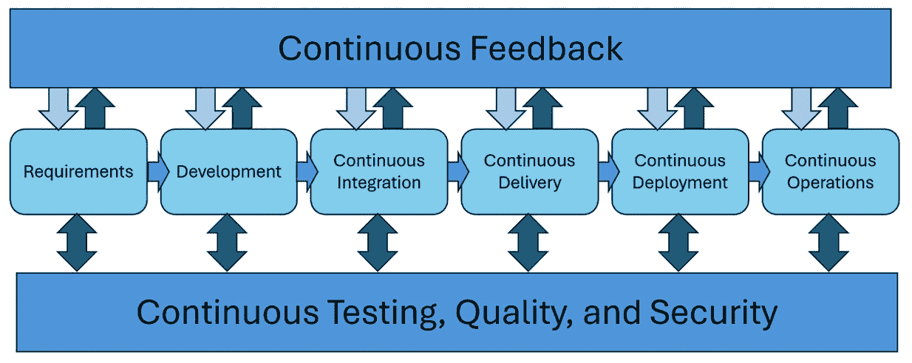
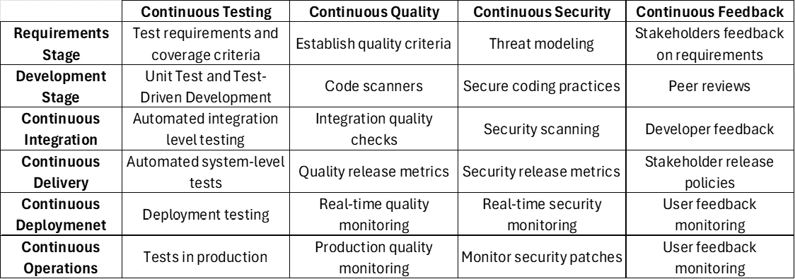
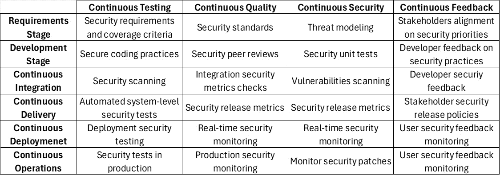
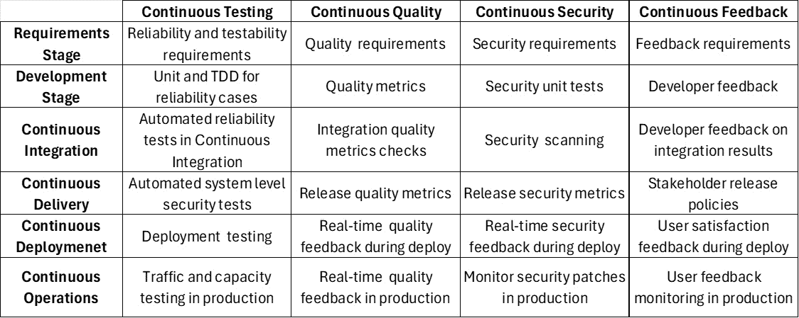
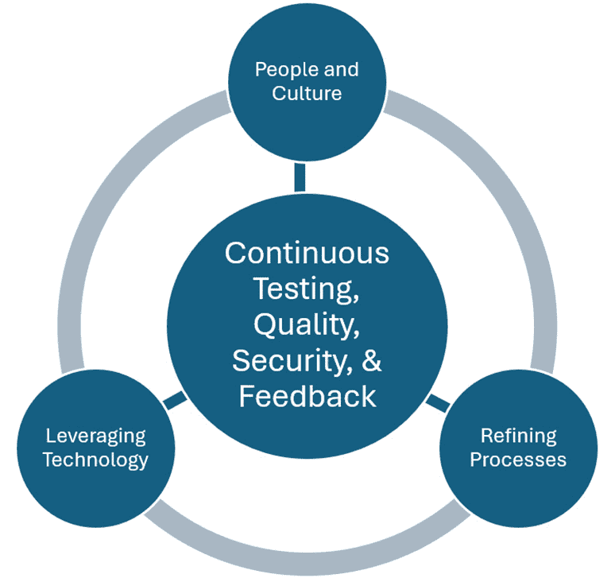

# 与 DevOps、DevSecOps 和 SRE 集成的使用案例

正如在 *图 9**.1*中所示，本章描述了在 DevOps、DevSecOps 和 SRE 框架下，如何实际应用持续测试、持续质量、持续安全性和持续反馈。 这些使用案例展示了组织如何转变为更高水平的 运营成熟度。

图 9.1 – DevOps、DevSecOps 和 SRE 的使用案例

本章分为几个关键部分。 第一部分， *DevOps、DevSecOps 和 SRE 的使用案例*，解释了这些实践如何帮助创建强大、韧性和响应迅速的 IT 生态系统。 接下来的部分，*DevOps 的使用案例*，*DevSecOps 的使用案例*，和*SRE 的使用案例* 解释了每种持续 方法的应用如何运作。

本章还解释了如何在 DevOps、DevSecOps 和 SRE 实践中有效地集成持续测试、质量、安全性和反馈。

其中，*持续集成* 部分提供了一个前瞻性的视角，讨论了如何随着时间的推移维护和发展这些集成，确保组织能够应对新兴挑战，同时保持其 操作实践的完整性和有效性。

在本章结束时，您不仅将探索各种不同的使用案例，还将掌握实施和维持这些集成所需的技能，能够在您的组织中推动这些集成的实施与持续发展。 无论您是经验丰富的实践者，还是刚接触 DevOps、DevSecOps 和 SRE 的新手，本章将为您提供必要的知识和见解，帮助您驾驭现代软件交付和运营的复杂性，推动您组织各个方面的持续改进。 技术生态。

在本章中，我们将讨论以下 主要内容：

+   DevOps 的使用案例 使用案例

+   DevSecOps 的使用案例

+   SRE 的 使用案例

+   持续集成

让我们 开始吧！

# DevOps 的使用案例

DevOps 哲学强调开发与运维的无缝集成，以提升软件交付的敏捷性、速度和质量。 实现这种集成的关键是将持续实践—测试、质量、安全性和反馈—贯穿整个软件开发生命周期，如 *图 9**.2*所示。

图 9.2 – DevOps 的使用案例

本节概述了如何将这些持续实践应用于 DevOps 各阶段，确保构建和维护强大软件系统的整体方法。

## 需求阶段

软件价值流的 *需求阶段* 指的是定义和记录软件产品必要规格和预期的初始阶段。 在这一阶段，包括业务分析师、产品经理和客户在内的利益相关者合作，阐明软件应具备的功能需求和非功能需求（如性能），并制定清晰且可操作的要求，指导整个开发过程。 这一阶段对于确定项目范围、优先排序特性以及确保最终产品符合用户需求和 商业目标至关重要。

+   **持续测试使用案例 –** **需求验证**:

    +   *解释*: 在开发开始前，自动化测试需求以验证其清晰性、一致性和可测试性。

    +   *重要性*: 防止需求中的误解或模糊性，避免导致 昂贵的返工。

    +   *挑战*: 开发一个能够自动化测试需求的框架可能 会很复杂。

    +   *策略*: 利用 **行为驱动开发** (**BDD**)框架创建基于需求的可测试 规格。

+   **持续质量使用案例 – 质量** **标准定义**:

    +   *解释*: 建立与客户期望和 商业目标一致的清晰质量标准。

    +   *重要性*: 为质量设定基准，指导开发和 测试工作。

    +   *挑战*：平衡全面的质量标准与现实的项目范围 和时间表。

    +   *策略*：与利益相关者合作定义关键质量属性，并结合反馈循环进行 持续优化。

+   **持续安全用例 –** **威胁建模**：

    +   *解释*：在生命周期的早期识别潜在的安全威胁和漏洞，以指导项目的安全态势。

    +   *重要性*：确保安全考虑从一开始就整合，减少 后期漏洞的风险。

    +   *挑战*：进行彻底的威胁建模需要专业知识，且可能非常耗时；在设计阶段之前进行威胁建模可能对某些设计不够充分，可能需要等到设计 完成后才行。

    +   *策略*：利用自动化威胁建模工具并定期进行培训，增强团队内部的安全专业知识。

+   **持续反馈用例 – 利益相关者反馈** **关于需求**：

    +   *解释*：收集并整合利益相关者对定义需求和 质量标准的反馈。

    +   *重要性*：确保项目与利益相关者期望和 商业目标保持一致。

    +   *挑战*：管理和优先处理来自 不同利益相关者的反馈。

    +   *策略*：实施结构化的反馈流程并使用优先级矩阵有效处理 反馈。

## 开发阶段

软件价值流的 *开发阶段* 是实际编码 和软件创建的阶段。 在这一阶段，开发人员通过编码和初步单元测试将定义的需求转化为功能性软件。 这是一个关键阶段，软件的基础和核心功能在此阶段被构建，为后续的集成和测试活动奠定基础，这些活动将在 价值流中继续进行。

+   **持续测试用例 –** **单元测试**：

    +   *解释*：开发者在代码开发的同时编写并执行单元测试，以验证单独的功能或组件。

    +   *重要性*：尽早发现缺陷，提高代码质量并减少后续测试工作量。

    +   *挑战*：确保全面的覆盖率，并在代码演进时维护测试。

    +   *策略*：采用**测试驱动开发**（**TDD**）实践，并利用自动化工具跟踪覆盖率并标记遗漏的测试。

+   **持续质量用例 – 代码质量分析**：

    +   *解释*：使用静态代码分析工具自动分析代码质量，强制执行编码标准并识别潜在问题。

    +   *重要性*：保持高代码质量、可读性和可维护性。

    +   *挑战*：配置分析工具，提供有意义的见解，同时避免让开发者被虚假警报淹没。

    +   *策略*：根据项目需求定制工具配置，并根据反馈定期审查阈值。

+   **持续安全用例 – 安全编码实践**：

    +   *解释*：将安全最佳实践和指南整合到开发过程中，以防止常见的安全漏洞。

    +   *重要性*：减少软件中的漏洞，增强整体安全态势。

    +   *挑战*：保持开发团队更新不断发展的安全实践，并在不影响生产力的情况下整合安全措施。

    +   *策略*：提供定期的安全培训，并将安全检查工具集成到开发环境中。

+   **持续反馈用例 – 同行代码评审**：

    +   *解释*：定期进行同行代码评审，提供有关代码质量、设计和安全性的建设性反馈。

    +   *重要性*：促进知识共享，提高代码质量，并培养协作文化。

    +   *挑战*：确保及时有效的评审，同时不拖慢开发进程。

    +   *策略*：实施轻量级审查流程，并利用 工具自动化 日常检查。

## 持续集成阶段

该 *持续集成阶段* 涉及将不同团队成员开发的单独代码片段合并成一个完整的软件系统，并进行全面的测试，以确保所有组件能够无缝协作。 这是一个关键的检查点，在这个阶段，可以识别并解决集成组件之间的冲突和错误，确保软件的功能性和稳定性，之后才能进入交付阶段，交付阶段是为产品发布做准备，但不包括部署。

+   **持续测试用例 –** **集成测试**：

    +   *解释*：自动化测试不同组件或系统的集成，以验证它们是否按预期协同工作。 。

    +   *重要性*：识别由集成组件或系统之间的相互作用引起的问题。 。

    +   *挑战*：设计和维护一套全面的集成测试，覆盖所有关键的相互作用。 。

    +   *策略*：使用合同测试验证交互，模拟外部依赖关系，以进行更可靠且更快速的测试。 。

+   **持续质量用例 – 构建** **质量检查**：

    +   *解释*：将质量检查集成到持续集成管道中，自动评估并强制执行每个构建的质量标准。 。

    +   *重要性*：确保每次构建在继续推进之前符合预定义的质量标准。 管道中的质量检查。

    +   *挑战*：定义并维护相关的、现实的质量指标，准确反映项目的质量目标。 。

    +   *策略*：根据项目进展和质量分析工具的反馈，定期审查并调整质量指标。 。

+   **持续安全用例 – 自动化** **安全扫描**：

    +   *解释*：将自动化安全扫描工具纳入持续集成过程，以检测代码及其依赖项中的漏洞和安全问题。 。

    +   *重要性*：在 开发过程的早期识别并减轻安全风险。

    +   *挑战*：在不显著减慢 CI 管道的情况下，集成全面的安全扫描。

    +   *策略*：实施增量扫描，并根据代码变化和已知的 风险区域优先进行扫描。

+   **持续反馈用例 – 构建** **反馈循环**

    +   *解释*：为开发人员提供关于集成尝试成功或失败的即时反馈，包括质量、安全性和 测试结果的详细信息。

    +   *重要性*：使开发人员能够快速解决问题并从 集成失败中学习。

    +   *挑战*：将来自各种工具和流程的反馈聚合为 可操作的见解。

    +   *策略*：使用 仪表板和通知系统整合反馈，并根据严重性 和影响优先处理 问题。

## 持续交付阶段

在 *持续交付阶段* 的 软件价值流中，每一次通过集成阶段自动化测试的变更都会自动准备发布到生产环境。 这涉及到对软件进行打包，进行进一步的自动化测试以验证发布，并确保软件始终可部署。 此阶段对于保持稳定的更新流至关重要，使得新的功能和修复能够快速高效地交付给用户。 。

+   **持续测试用例 –** **预发布测试**：

    +   *解释*：在一个镜像生产环境的暂存环境中执行一整套自动化测试，以验证 发布。

    +   *重要性*：确保发布候选版本在一个与生产环境高度相似的环境中进行全面测试。 。

    +   *挑战*：维护一个最新且准确的暂存环境，其中包括所有必要的数据 和配置。

    +   *策略*：使用**基础设施即代码** （**IaC**）来 管理和复制与生产环境相似的环境，并实施蓝绿部署以 最小化差异。

+   **持续质量使用案例 – 发布** **质量关卡**：

    +   *说明*：定义和执行发布前必须通过的质量关卡，基于测试结果、质量指标和 安全扫描。

    +   *重要性*：保证只有符合所有质量和安全标准的发布才会部署，从而减少 生产环境中的问题风险。

    +   *挑战*：平衡严格的质量标准与快速交付的需求，避免在 发布过程中出现瓶颈。

    +   *策略*：持续评估和调整质量关卡，以确保与不断变化的项目需求和风险容忍度保持一致。

+   **持续安全使用案例 – 安全审查** **和审批**：

    +   *说明*：在发布部署到生产环境之前，进行最后的安全审查并获得安全团队的批准。

    +   *重要性*：确保所有安全问题已得到解决，并且发布符合组织的 安全政策。

    +   *挑战*：在开发、安全和运维团队之间进行协调，以确保及时评审而不 延迟发布。

    +   *策略*：将自动化的安全检查和风险评估集成到交付过程中，以简化 安全审查。

+   **持续反馈使用案例 – 利益相关者审查** **和签字确认**：

    +   *说明*：根据发布是否符合要求、质量标准和 安全政策，收集利益相关者的最终批准。

    +   *重要性*：确保发布与业务目标和利益相关者期望一致，最大限度减少 部署后问题的风险。

    +   *挑战*：管理与多方利益相关者的期望和沟通，以获得 及时的签字确认。

    +   *策略*：使用自动化发布说明和仪表盘提供关于发布状态的透明更新 并便于更轻松的 利益相关者审查。

## 持续部署阶段

软件价值流的 *持续部署阶段* 涉及将每一个成功通过持续交付过程的变更自动部署到生产环境，确保更新能够频繁且可预测地发布。 在这一阶段，部署测试至关重要，用于验证发布在实际环境中的正确性。 如果这些测试失败，系统会自动回滚到先前的稳定版本，以保持服务的连续性并尽量减少中断。 这个自动化过程通过确保持续不断的改进和修复流动，提升了对市场和用户需求的响应能力。 并修复问题。

+   **持续测试用例 –** **金丝雀测试**：

    +   *解释*：逐步将变更推送给小部分用户，以监控性能并在全面发布前发现问题。 全量发布前。

    +   *重要性*：允许以可控的方式检测并缓解潜在问题，减少对广泛 用户群体的影响。

    +   *挑战*：设计有效的金丝雀测试，提供有意义的反馈而不影响 用户体验。

    +   *策略*：利用功能标志和自动化监控工具来管理和分析 金丝雀部署。

+   **持续质量用例 – 持续监控** **质量指标**：

    +   *解释*：在生产环境中实施实时质量指标监控，以确保持续符合 质量标准。

    +   *重要性*：提供关于生产环境中应用质量的持续洞察，使得可以迅速响应 任何性能下降。

    +   *挑战*：选择有意义的质量指标并设置合适的阈值 用于警报。

    +   *策略*：定期基于历史性能数据和反馈 回顾并调整质量指标和阈值。

+   **持续安全用例 – 持续** **合规监控**：

    +   *解释*：实时监控安全政策和法规的合规性，确保 持续遵守。

    +   *重要性*：保持应用程序的合规性状态，降低安全漏洞和 合规性问题的风险。

    +   *挑战*：实施全面的合规监控，涵盖所有相关的法规和政策，同时避免给团队带来 误报。

    +   *策略*：使用专门的合规监控工具，定期更新合规规则以反映 法规的变化。

+   **持续反馈用例 – 用户** **行为分析**：

    +   *解释*：收集和分析用户行为数据，以收集已部署功能的反馈，并识别需要 改进的领域。

    +   *重要性*：提供关于用户如何与应用程序互动的直接洞察，突出潜在的提升 或调整领域。

    +   *挑战*：在收集和分析 行为数据时确保用户隐私和数据安全。

    +   *策略*：实施明确的数据收集政策，使用匿名化技术，并在必要时 获得用户同意。

## 持续运营阶段

持续 *运营阶段* 持续 直到下一个版本的软件被 部署。 在此阶段，软件会持续监控和维护，以确保其表现最佳。 如持续测试、质量保证、安全监控和收集反馈等实践对于此阶段至关重要。 它们有助于及时发现并解决任何操作问题，保持安全标准，并将用户反馈纳入未来的更新。 这一持续循环帮助软件在提供一致的性能和安全性的同时，适应不断变化的用户需求，直到 下一次部署。

+   **持续测试用例 – ** **部署后测试**：

    +   *解释*：在部署后，在生产环境中进行自动化测试，以验证应用程序在 实际条件下的表现。

    +   *重要性*：确认部署的成功与应用程序的操作稳定性。

    +   *挑战*：实施不干扰的测试，这些测试可以在生产环境中运行而不影响 用户体验。

    +   *策略*：使用合成监控和影子流量模拟真实用户交互，而不影响 实际用户。

+   **持续质量使用案例 – 持续** **质量改进**：

    +   *解释*：利用从生产环境收集的反馈和数据，持续改进 应用程序的质量。

    +   *重要性*：确保应用程序根据用户需求和反馈不断发展，保持高质量 标准。

    +   *挑战*：在持续开发和 运营任务中优先处理质量改进措施。

    +   *策略*：实施结构化流程，审查反馈、进行根本原因分析，并将质量改进融入 开发积压任务中。

+   **持续安全使用案例 – 持续** **安全补丁**：

    +   *解释*：实施自动化流程，向应用程序及其依赖项应用安全补丁和更新。

    +   *重要性*：确保应用程序免受已知漏洞的攻击，从而降低被利用的风险 。

    +   *挑战*：确保补丁不会引入新问题或降低 应用程序性能。

    +   *策略*：使用自动化测试和金丝雀发布来验证补丁的安全性，确保其在 广泛发布前没有问题。

+   **持续反馈使用案例 – 实时用户** **反馈收集**：

    +   *解释*：利用工具和流程实时收集并分析用户反馈，能够立即对问题 和建议采取行动。

    +   *重要性*：使组织能够迅速响应用户需求，提升 用户体验。

    +   *挑战*：管理和优先处理来自 不同来源的大量实时反馈。

    +   *策略*：实施 反馈管理系统，以汇总并优先处理反馈，并将反馈分析融入常规的 开发周期。

将持续测试、质量、安全性和反馈整合到 DevOps 生命周期的每个阶段，对于开发和维护高质量、安全性强且以用户为中心的软件至关重要。 尽管在实施这些持续实践时会遇到挑战，但所提出的策略提供了克服这些难题的框架，确保 DevOps 方法的好处能够得到充分实现。 通过采纳这些实践，组织可以增强敏捷性、提高软件质量、加强安全措施，并更有效地响应用户需求，在今天竞争激烈且快速发展的 数字环境中取得成功。

## DevOps 的真实案例

一个成功整合持续测试、质量、安全性和反馈实践到 DevOps 流程中的真实案例，可以在一家金融服务公司中看到，该公司旨在提高其软件部署频率和可靠性。 在这个场景中，公司利用 Jenkins 作为其 DevOps 流程的核心部分，自动化并管理持续集成和交付过程。 Jenkins 协调一系列阶段，包括构建代码、运行自动化测试和部署到 暂存环境。

通过使用 Selenium 进行自动回归和功能测试，实施持续测试，确保每个新版本在不破坏现有功能的情况下按预期运行。 为确保质量，集成了 SonarQube 进行静态代码分析，识别潜在的 bug 和漏洞，以保持高代码 质量标准。

在安全性方面，使用 OWASP ZAP 工具 在 CI/CD 过程中进行自动化安全扫描，确保在部署前识别和修复漏洞。 此外，通过集成功能标记工具如 LaunchDarkly，增强了反馈机制，允许在生产环境中实时获取新功能的用户反馈，而不影响所有用户。 这种集成不仅加快了反馈循环，还允许更安全、逐步的 发布，并根据 用户反馈快速调整。

这种工具与实践的结合确保了公司软件发布的安全性、可靠性，并与用户期望对接，从而显著提升了整体软件交付 生命周期。

# DevSecOps 用例

采用 DevSecOps 在当今的软件开发和部署实践中至关重要，强调在整个 DevOps 生命周期中无缝集成安全措施，如 *图 9**.3*所示。

图 9.3 – DevSecOps 用例

这种方法不仅加速了交付时间，还确保了安全性成为基础组成部分，而不是事后补充。 本节深入探讨了持续测试、持续质量、持续安全和持续反馈在 DevSecOps 生命周期每个阶段的应用：需求、开发、持续集成、持续交付、持续部署和持续运营。 对于每个阶段，我们探讨了不同的用例、其重要性、相关挑战以及应对这些 挑战的策略。

## 需求阶段

+   **持续测试用例 – 安全性** **需求验证**：

    +   *解释*：自动化安全需求的验证，确保 它们是可测试的，并与安全政策 和标准保持一致。

    +   *重要性*：为项目设定清晰的安全基准，指导后续的开发和 测试工作。

    +   *挑战*：开发能够有效验证细致的 安全需求的自动化工具或脚本。

    +   *策略*：利用 BDD 技术定义可测试格式的安全需求。

+   **持续质量用例 – 质量和安全** **标准定义**：

    +   *解释*：建立全面的质量和安全标准，确保项目在其 生命周期中遵守。

    +   *重要性*：为评估软件的质量和安全性提供一套明确的标准，确保一致性 和合规性。

    +   *挑战*：在严格的质量和安全标准与实际开发和 部署时间表之间取得平衡。

    +   *策略*：制定逐步发展的标准，随着项目的进展不断演化，允许灵活性而不妥协于 核心原则。

+   **持续安全用例 - 威胁建模和** **风险评估**:

    +   *解释*: 进行威胁建模和风险评估，早期识别潜在安全威胁和漏洞 生命周期。

    +   *重要性*: 通过突出需要额外安全措施的领域，指导设计和开发过程。 安全措施。

    +   *挑战*: 需要深入的安全专业知识和对 项目相关的潜在攻击向量的理解。

    +   *策略*: 利用自动化威胁建模工具，并结合外部安全专家进行 综合评估。

+   **持续反馈用例 - 利益相关者安全** **期望对齐**:

    +   *解释*: 参与 与利益相关者对齐期望，关于 安全姿态 和优先级。

    +   *重要性*: 确保项目的安全措施符合或超出利益相关者的期望，避免 后期误解。

    +   *挑战*: 促进技术团队和具有不同安全知识水平的利益相关者之间的有效沟通。 。

    +   *策略*: 使用清晰、非技术性语言描述安全措施及其对 项目结果的影响。

## 开发阶段

+   **持续测试用例 - 安全** **编码实践**:

    +   *解释*: 实施安全编码实践涉及利用静态和动态分析工具在编码过程中检测漏洞。 写。

    +   *重要性*: 减少代码库中的漏洞数量，增强 应用程序的整体安全姿态。

    +   *挑战*: 将这些工具集成到开发工作流中，而不影响 开发者的生产力。

    +   *策略*: 将安全工具集成到 IDE 中，并为开发人员提供即时反馈，以便在编码时纠正问题。 他们编码。

+   **持续质量用例 - 代码审查和分析** **质量保证**:

    +   *解释*: 进行自动化和手动代码审查，确保遵循质量和 安全标准。

    +   *重要性*: 通过促进同行监督和利用自动化工具来检测问题，推动高代码质量和安全性。

    +   *挑战*: 管理彻底代码审查所需的额外时间和资源。

    +   *策略*: 使用静态分析工具自动化常规检查，并优先对复杂或关键部分的代码库进行手动审查。

+   **持续安全用例 – 安全** **单元测试**:

    +   *解释*: 开发 并执行专门设计用于验证应用程序中安全功能和控制的单元测试。

    +   *重要性*: 确保安全机制按预期工作，防止已知漏洞和 攻击向量。

    +   *挑战*: 创建涵盖广泛安全场景的全面测试用例。

    +   *策略*: 结合手动安全专业知识和自动化工具，生成并执行以安全为重点的单元测试。

+   **持续反馈用例 – 开发者对** **安全实践的反馈**:

    +   *解释*: 收集并根据开发者对已实施安全实践的有效性和效率的反馈进行调整。

    +   *重要性*: 通过根据实际开发经验改进实践，提升应用程序的安全姿态。

    +   *挑战*: 鼓励开发人员提供开放和建设性的反馈，尤其是那些可能不是 安全专家的开发者。

    +   *策略*: 建立开放沟通和持续学习的文化，强调安全在 开发过程中的价值。

## 持续集成阶段

+   **持续测试用例 – 自动化** **安全扫描**:

    +   *解释*: 将自动化安全扫描工具集成到 CI 流水线中，以检测漏洞和配置错误，当新代码 被集成时。

    +   *重要性*：在开发过程中及早识别和解决安全问题，减少漏洞进入 生产环境的风险。

    +   *挑战*：在扫描的彻底性与维持快速 CI 管道的需求之间保持平衡。

    +   *策略*：实施增量扫描，并根据代码库的变化和已知的 高风险区域优先扫描。

+   **持续质量使用案例 – 构建** **质量保证**：

    +   *解释*：通过将质量检查集成到 持续集成（CI）流程中，确保每次构建都符合预定义的质量标准。

    +   *重要性*：在整个开发过程中保持一致的质量水平，防止质量随时间 下降。

    +   *挑战*：定义并强制执行既全面又现实的质量标准。

    +   *策略*：使用自动化工具来衡量和报告质量指标，并根据历史数据和 项目演变调整标准。

+   **持续安全使用案例 –** **依赖扫描**：

    +   *解释*：作为持续集成（CI）流程的一部分，自动扫描依赖项中的已知漏洞。

    +   *重要性*：防止通过第三方库和框架引入漏洞，这是一种常见的 攻击途径。

    +   *挑战*：跟上最新的漏洞数据库，并管理 误报。

    +   *策略*：将实时漏洞信息流集成到扫描工具中，并建立一个过程来审查并处理 扫描结果。

+   **持续反馈使用案例 – CI 管道的安全** **和质量反馈**：

    +   *解释*：在 CI 过程中立即向开发人员提供有关安全性和质量问题的反馈。

    +   *重要性*：能够迅速解决问题，促进持续改进的文化。

    +   *挑战*：将来自多个工具的反馈汇总成可操作的见解， 供开发人员参考。

    +   *策略*：使用仪表板和集成开发工具来整合并 优先处理反馈，突出关键问题以便 立即行动。

## 持续交付阶段

+   **持续测试用例 - 安全性和** **质量网关**：

    +   *解释*：将安全性和质量网关作为 CD 流程的一部分，确保只有符合严格标准的代码才能被推进到 后续阶段。

    +   *重要性*：作为最后的检查，防止不安全或低质量的代码被部署 到生产环境。

    +   *挑战*：定义适当的通过网关的门槛，而不妨碍 交付过程。

    +   *策略*：为网关建立明确、可衡量的标准，并根据项目结果和 利益相关者反馈定期审查。

+   **持续质量用例 - 发布** **候选测试**：

    +   *解释*：对发布候选进行全面的安全性测试，以验证其功能和是否符合 安全标准。

    +   *重要性*：确保发布在功能上完整，并且符合项目的 质量基准。

    +   *挑战*：高效地执行一系列测试，而不延迟 发布过程。

    +   *策略*：尽可能自动化测试过程，并根据风险和 影响评估优先进行测试。

+   **持续安全用例 - 部署前** **安全审查**：

    +   *解释*：在部署前执行最终的安全审查和批准流程，以验证符合 安全政策。

    +   *重要性*：确保发布符合所有组织和监管的 安全要求。

    +   *挑战*：及时进行全面审查，以避免 延迟部署。

    +   *策略*：通过自动化和预定义的检查表简化审查过程，并确保安全人员被整合进 DevSecOps 团队。

+   **持续反馈用例 - 发布** **反馈收集**：

    +   *说明*：收集利益相关者对发布过程的反馈，包括安全性和质量方面，以推动 未来的改进。

    +   *重要性*：识别流程改进和提升的领域，推动交付实践的持续改进。

    +   *挑战*：有效地收集和处理来自不同利益相关者的反馈。

    +   *策略*：实施结构化反馈机制和定期回顾会议，讨论 反馈并 规划行动。

## 持续部署阶段

+   **持续测试用例 –** **部署后验证**：

    +   *说明*：自动验证 部署上线后在生产环境中的完整性和安全性。

    +   *重要性*：确认应用程序的成功部署及其操作的 安全状态。

    +   *挑战*：在不影响实时环境或 用户体验的情况下进行全面验证。

    +   *策略*：利用金丝雀部署和合成事务以受控方式验证部署。

+   **持续质量用例 – 生产环境** **监控**：

    +   *说明*：持续监控生产环境，以确保其符合质量和 性能标准。

    +   *重要性*：通过主动识别和解决质量问题，保持高水平的用户满意度和系统可靠性。

    +   *挑战*：在大量监控数据中筛选出 可操作的洞察。

    +   *策略*：实施智能监控解决方案，利用机器学习根据严重性 和影响来优先处理问题。

+   **持续安全用例 – 实时** **威胁检测**：

    +   *说明*：采用实时监控和威胁检测工具，识别并应对生产环境中的安全事件。

    +   *重要性*：通过快速检测和响应，最小化安全漏洞的潜在影响。

    +   *挑战*：平衡灵敏度和特异性，最小化假阳性，同时确保不忽视任何重大威胁。

    +   *策略*：根据历史事件数据微调检测算法，并定期更新威胁情报来源。

+   **持续反馈使用案例 – 用户** **体验监控**：

    +   *解释*：收集并分析用户反馈和使用数据，以了解应用程序的真实世界体验。

    +   *重要性*：提供有关用户如何与应用程序互动的见解，并指出可以改进的地方以提高满意度。

    +   *挑战*：整合来自多个渠道的反馈，并将其转化为可操作的改进措施。

    +   *策略*：实施全面的用户分析和反馈工具，并建立跨职能团队，以敏捷方式处理反馈。

## 持续运营阶段

+   **持续测试使用案例 – 操作** **准备性测试**：

    +   *解释*：进行持续测试，确保系统随时准备处理操作需求，包括负载测试和灾难恢复模拟。

    +   *重要性*：确保系统在不同操作条件下的韧性和可靠性。

    +   *挑战*：在不影响生产系统或用户体验的情况下，模拟现实的操作场景。

    +   *策略*：利用影子流量和模拟工具，在受控环境中模拟真实用户行为和操作条件。

+   **持续质量使用案例 – 质量** **改进举措**：

    +   *解释*：根据反馈和监控数据实施持续质量改进举措，以提高系统性能和用户满意度。

    +   *重要性*：确保应用程序随着时间的发展，满足用户需求和质量预期。

    +   *挑战*：优先考虑并实施改进，平衡新功能开发与质量提升。

    +   *策略*：采用数据驱动的方法，识别质量改进机会，并将其整合到产品路线图中。

+   **持续安全用例 – 持续合规性和安全** **态势管理**：

    +   *解释*：持续监控和调整应用程序的安全状态，以确保符合不断变化的安全政策和标准。

    +   *重要性*：保持应用程序的安全完整性，适应新威胁和合规要求。

    +   *挑战*：跟上安全标准和监管要求的变化，并在不干扰运营的情况下实施变更。

    +   *策略*：利用自动化合规性监控工具，并建立专门的团队来监督安全态势管理。

+   **持续反馈用例 – 运营** **反馈循环**：

    +   *解释*：与运营团队建立反馈循环，根据实际经验和事件持续改进运营实践。

    +   *重要性*：通过从前线汲取经验教训，提高运营效率和可靠性。

    +   *挑战*：有效地捕获并将来自运营的反馈整合到持续改进的过程中。

    +   *策略*：在事件发生后实施定期的回顾和总结，并将运营反馈整合到开发和安全实践中。

在 DevSecOps 生命周期中融入持续测试、质量、安全性和反馈代表了一种全面的软件开发和部署方法，确保在每个阶段都将安全性集成进来。 虽然在实施过程中存在挑战，但战略性的方法（从自动化和工具集成到利益相关者参与和持续学习）可以有效解决这些障碍。 通过拥抱这些持续的实践，组织不仅能够提升其安全态势，还能够提高整体软件质量和运作效率，从而在竞争激烈的软件开发领域中稳步前行，展现出信心 和韧性。

## DevSecOps 的真实使用案例

一个真实的使用案例 涉及将持续测试、质量、安全性和反馈实践集成到 DevSecOps 管道中的应用可以在一个旨在确保其患者数据管理系统的安全性和高效性的医疗软件提供商中看到。 在这种情况下，该公司利用 GitHub Actions 自动化工作流程，从而有助于简化开发和运维过程，所有工作都在一个 平台上进行。

持续测试通过 Cypress 进行，这是一种 端到端的测试框架，用于自动测试每次代码提交和拉取请求中的功能和集成问题。 在质量方面，该公司在开发环境中集成了 ESLint，用于维持高标准的代码并捕捉语法错误及其 JavaScript 代码中的问题模式。

安全性是一个至关重要的问题，因为健康数据的敏感性。 该公司在管道中集成了 Aqua Security，用于扫描容器镜像中的漏洞，并在整个开发生命周期中强制执行安全策略。 反馈通过如 Jira 这样的工具持续收集，在这些工具中，生产环境中的错误和用户反馈被记录并直接关联到开发任务。 这有助于快速响应问题，并根据 用户影响优先安排开发工作。

通过将这些工具和实践集成到其 DevSecOps 管道中，医疗软件提供商提高了交付安全、高质量软件的能力，同时确保遵守严格的 行业规范。

# SRE 的使用案例

**站点可靠性工程** (**SRE**) 是一个学科，运用软件工程的各个方面解决基础设施和运营中的问题，专注于系统的可靠性、可扩展性和可维护性。 SRE 将持续测试、持续质量、持续安全和持续反馈整合到系统开发和运营的生命周期中，如 *图 9**.4*所示。

图 9.4 – SRE 用例

本节 探讨了在 SRE 生命周期的每个阶段实施这些持续实践：需求、开发、持续集成、持续交付、持续部署和持续运营。 每个阶段都有独特的用例，突出了它们的重要性、涉及的挑战以及克服 这些挑战的策略。

## 需求阶段

+   **持续测试用例 – 可靠性** **需求验证**：

    +   *解释*：确保 可靠性需求 被清晰地定义、可衡量，并能够通过 自动化测试进行验证。

    +   *重要性*：为整个系统生命周期中的可靠性工程奠定了坚实的基础。

    +   *挑战*：量化和创建自动化测试以满足可靠性需求可能 非常复杂。

    +   *策略*：利用 **服务级目标** (**SLOs**) 和 错误预算作为可靠性的可衡量指标，并将其融入自动化 测试框架。

+   **持续质量用例 – 质量** **属性规格**：

    +   *解释*：定义与可靠性、可维护性 和可扩展性相关的具体质量属性。

    +   *重要性*：引导设计和开发过程，构建一个满足用户和 业务需求的高质量系统。

    +   *挑战*：在不妥协功能性的情况下，平衡各种质量属性。

    +   *策略*：根据利益相关者的反馈和对系统可靠性 及性能的潜在影响来优先考虑质量属性。

+   **持续安全用例 – 安全** **需求规划**：

    +   *解释*：根据系统的 威胁模型识别并整合安全要求和控制措施。

    +   *重要性*：确保从一开始就将安全考虑融入系统， 最小化漏洞。

    +   *挑战*：跟上不断变化的安全威胁并确保 全面覆盖。

    +   *策略*：定期进行威胁建模会议，并根据新出现的威胁 和漏洞更新安全需求。

+   **持续反馈用例 – 需求** **反馈循环**：

    +   *解释*：建立收集并整合利益相关者和 最终用户需求反馈的机制。

    +   *重要性*：确保系统的需求与用户需求和 业务目标保持一致。

    +   *挑战*：高效管理和优先处理大量反馈。

    +   *策略*：实施结构化的反馈收集流程并定期审查更新需求， 以便根据反馈进行调整。

## 开发阶段

+   **持续测试用例 – 单元和集成测试** **以确保可靠性**：

    +   *解释*：开发专注于系统可靠性方面的单元和集成测试，例如容错和 优雅降级。

    +   *重要性*：在 开发阶段及早识别并解决可靠性问题。

    +   *挑战*：创建能够真实反映 生产环境的测试场景。

    +   *策略*：利用混沌工程原理模拟现实条件，将韧性测试融入 开发过程。

+   **持续质量用例 – 代码** **质量标准**：

    +   *解释*：通过自动化的 linting、代码审查和静态 分析工具强制执行代码质量标准。

    +   *重要性*：保持高代码质量，提高系统的可维护性 和可靠性。

    +   *挑战*：确保遵守质量标准，而不妨碍 开发速度。

    +   *策略*：在可能的情况下自动化质量检查，并将其集成到开发者的工作流中，以提供 即时反馈。

+   **持续安全使用案例 – 安全** **开发实践**：

    +   *解释*：将安全编码实践和工具纳入开发过程，以便及早识别和修复安全 问题。

    +   *重要性*：减少在开发过程中引入安全漏洞的风险。

    +   *挑战*：保持开发团队了解最新的安全实践，并将其无缝集成到 开发过程。

    +   *策略*：提供持续的安全培训，并将安全工具直接集成到 开发环境中。

+   **持续反馈使用案例 – 开发者** **体验反馈**：

    +   *解释*：收集开发团队对工具、实践和流程的反馈，识别改进 的领域。

    +   *重要性*：增强开发过程和工具，提高生产力和 工作满意度。

    +   *挑战*：建立一种文化，在这种文化中，反馈是定期给出的并且 得到采取行动。

    +   *策略*：实施定期回顾和匿名反馈工具，以 鼓励 开放沟通。

## 持续集成阶段

+   **持续测试使用案例 – 自动化可靠性测试** **在 CI 中**：

    +   *解释*：将自动化可靠性测试集成到 CI 流水线中，包括负载测试和 混沌实验。

    +   *重要性*：确保每次更改在合并前都经过审查，评估其对系统可靠性的影响。

    +   *挑战*: 设计并维护一套高效的可靠性测试，确保可以快速运行并提供 有意义的反馈。

    +   *策略*: 聚焦增量测试，并根据历史问题和 高风险区域优先测试。

+   **持续质量用例 – 持续代码** **质量监控**:

    +   *解释*: 利用 CI 管道中的工具，持续监控并报告代码 质量指标。

    +   *重要性*: 保持代码质量的一致性，提高维护的便捷性 和可扩展性。

    +   *挑战*: 定义准确反映代码库健康状况的有意义质量指标。

    +   *策略*: 使用静态代码分析、代码复杂度指标和代码覆盖率报告的结合来 监控质量。

+   **持续安全用例 – CI** **安全扫描**:

    +   *解释*: 在 CI 过程中进行安全扫描和分析，以便尽早识别 漏洞。

    +   *重要性*: 最小化将不安全代码部署到后续阶段或生产环境的风险。

    +   *挑战*: 在不显著拖慢 CI 过程的情况下，集成全面的安全扫描。

    +   *策略*: 使用增量和差异扫描技术，聚焦于新引入的变更和已知的 高风险区域。

+   **持续反馈用例 – CI 反馈** **用于改进**:

    +   *解释*: 向开发人员提供 CI 过程的即时反馈，包括测试失败、安全扫描结果和 质量指标。

    +   *重要性*: 使开发人员能够快速解决问题，改善代码库的整体健康状况和 安全性。

    +   *挑战*: 将来自多个来源的反馈聚合成 可操作的见解。

    +   *策略*: 使用集成的仪表盘和通知系统来整合反馈，并根据严重性 和影响优先排序。

## 持续交付阶段

+   **持续测试用例 –** **部署前测试**：

    +   *解释*：在与生产环境相似的预发布环境中进行全面测试，以验证变更 在部署前的有效性。

    +   *重要性*：在受控环境中识别任何问题，减少生产事故的风险。

    +   *挑战*：确保预发布环境在数据、规模 和配置方面准确反映生产环境。

    +   *策略*：使用基础设施即代码（IaC）管理环境配置，并保持预发布与生产环境 同步。

+   **持续质量用例 – 发布** **质量保证**：

    +   *解释*：验证每次发布是否符合已设定的质量基准 在部署前。

    +   *重要性*：确保仅部署高质量的变更，保持生产环境的完整性和可靠性。

    +   *挑战*：定义并执行既现实又严格的质量基准，以确保 高标准的维护。

    +   *策略*：自动化质量检查，并基于质量指标对部署进行门控，结合人工审查流程以应对 关键发布。

+   **持续安全用例 – 安全审查和** **合规检查**：

    +   *解释*：在部署前进行最终的安全审查和合规检查，以确保发布符合所有安全要求 和法规。

    +   *重要性*：防止安全漏洞和合规违规，保护组织及其 用户。

    +   *挑战*：快速进行彻底的审查，以避免 延迟部署。

    +   *策略*：尽可能自动化合规性和安全审查过程，使用代码政策来强制执行 安全标准。

+   **持续反馈用例 – 部署前** **利益相关者反馈**：

    +   *解释*：收集利益相关者对即将变更和发布的反馈，以确保其与业务目标和 用户期望一致。

    +   *重要性*：使开发工作与业务目标和用户需求保持一致，从而提高 交付更改的价值。

    +   *挑战*：高效地收集和整合来自广泛利益相关者的反馈 。

    +   *策略*：使用功能标志和金丝雀发布，在完全部署前以受控方式收集变更的反馈。

## 持续部署阶段

+   **持续测试用例 - 自动化** **部署测试**：

    +   *解释*：自动 测试部署过程和应用部署后的状态，以验证部署是否成功并确保 操作状态正常。

    +   *重要性*：确保部署过程的可靠性，并且应用在部署后仍然保持功能性 。

    +   *挑战*：创建能够准确验证部署成功和应用在生产环境中操作状态的测试 。

    +   *策略*：使用冒烟测试和合成事务验证关键 功能在部署后的有效性。

+   **持续质量用例 - 持续监控** **质量指标**：

    +   *解释*：持续监控生产中的应用和基础设施质量指标，确保其符合 预定义标准。

    +   *重要性*：提供实时的洞察力，了解部署对应用质量和 用户体验的影响。

    +   *挑战*：确定哪些质量指标最能反映用户体验和 系统性能。

    +   *策略*：实施全面的监控解决方案，跟踪各种指标，利用机器学习识别异常 和趋势。

+   **持续安全用例 - 持续** **安全监控**：

    +   *解释*：实施持续监控以检测 生产环境中的安全威胁和漏洞。

    +   *重要性*：能够实时检测和响应安全事件，最大限度地减少 潜在的损害。

    +   *挑战*：过滤和优先处理警报，以有效管理安全数据的量，同时不遗漏 关键威胁。

    +   *策略*：利用 先进的 **安全信息和事件管理** (**SIEM**) 系统，并集成自动化 响应机制。

+   **持续反馈用例 – 实时用户** **反馈收集**：

    +   *解释*：实时收集和分析用户反馈，以评估部署对用户满意度 和体验的影响。

    +   *重要性*：提供关于变化如何影响用户的即时见解，便于在必要时迅速进行调整。

    +   *挑战*：将反馈收集机制融入用户体验中，且不 干扰用户。

    +   *策略*：实施不干扰的反馈工具，如应用内调查和使用分析，直接 收集用户的见解。

## 持续运营阶段

+   **持续测试用例 – 生产流量和** **负载测试**：

    +   *解释*：模拟 生产流量和负载，以测试系统在 现实世界条件下的 容量和可扩展性。

    +   *重要性*：确保系统能够处理预期负载和峰值负载，防止停机和 性能下降。

    +   *挑战*：在不影响 实际用户的情况下，模拟真实的流量模式和流量量。

    +   *策略*：使用模拟真实用户行为和 流量模式的影子流量和负载测试工具。

+   **持续质量用例 – 持续** **质量改进**：

    +   *解释*：利用持续的反馈和监控数据来推动系统的持续质量改进。

    +   *重要性*：确保系统持续演进，以满足用户需求和质量标准，提升满意度 和可靠性。

    +   *挑战*：在新功能开发和 运营任务中优先考虑质量改进。

    +   *策略*：采用结构化的质量改进过程，将反馈和监控见解整合到 产品路线图中。

+   **持续安全使用案例 – 持续** **漏洞管理**：

    +   *解释*：在 生产环境中实施持续识别、评估和缓解漏洞的过程。

    +   *重要性*：通过确保及时解决漏洞，保护免受不断演变的安全威胁。 。

    +   *挑战*：跟上新漏洞，并有效地管理 补救过程。

    +   *策略*：利用自动化漏洞扫描工具，并将补丁管理集成到 运营工作流程中。

+   **持续反馈使用案例 – 运营反馈和** **事件分析**：

    +   *解释*：分析 运营反馈和事件，以识别根本原因并实施 预防措施。

    +   *重要性*：通过从运营经验中学习和事件，提高系统的可靠性和运营效率。 。

    +   *挑战*：系统地捕捉和分析反馈和事件，以推导出补救措施和未来 缓解行动。

    +   *策略*：利用无责任的事后分析来确定 未来的缓解措施。

持续测试、持续质量、持续安全和持续反馈的整合进入 SRE 生命周期，体现了构建和维护可靠、安全和高质量系统的整体方法。 尽管每个阶段都面临着独特的挑战，但这些持续实践的战略应用使组织能够提升其运营效率、安全姿态和用户满意度。 通过培养持续改进和学习的文化，SRE 团队可以推动技术和运营的卓越性，确保其系统具有弹性、可扩展性，并与用户需求和 业务目标对齐。

## SRE 的实际应用案例

一个真实的用例 将持续测试、质量、安全和反馈实践融入 SRE 实践中，可以在一家电子商务公司中看到，该公司旨在优化其在线购物平台的可靠性和用户体验。 该公司使用 Prometheus 和 Grafana 进行监控和警报，这在 SRE 中发挥着至关重要的作用，通过提供系统健康状况 和性能的实时洞察。

在这种情况下，持续测试使用 Google 的开源框架 Spinnaker 来处理，该框架支持高级部署策略，如金丝雀发布和蓝绿部署。 这使得 SRE 团队能够在实时环境中逐步测试新版本，从而最小化干扰并减少将有缺陷的软件部署到 所有用户的风险。

为了维护质量和安全，公司集成了 SonarQube 进行静态代码分析，以维持高代码标准并在开发过程中早期发现安全缺陷。 此外，使用如 HashiCorp Vault 等工具来增强安全性，该工具管理机密并保护跨应用程序 和基础设施的敏感数据。

反馈机制通过使用如 **Elasticsearch, Logstash 和 Kibana** (**ELK**) 堆栈 来聚合日志并促进用户交互和系统错误的详细分析。 这些数据对于 SRE 团队基于实际用户体验和 系统行为不断提升系统稳定性和性能至关重要。

通过将这些工具集成到其 SRE 实践中，电子商务公司确保其平台保持可靠、安全和高效，从而直接促进了更好的客户体验和更高的 业务连续性。

# 持续集成

有许多用于 DevOps、DevSecOps 和 SRE 的持续测试、持续质量、持续安全和持续反馈的用例。 实现和达到这些用例的有效解决方案需要大量投资，以便改进人（包括文化）、流程和技术的实践，正如在 *图 9**.5*中所示。

图 9.5 – 持续集成

然而，在成功的 转型之后，如果不实施可持续的实践以支持每个用例的人员、流程和工具，实践可能会逐渐消退，收益可能会受到影响。 本节描述了将维持收益与持续改进实践相结合的推荐实践。

通过将 DevOps、DevSecOps 和 SRE 实践转化为测试、质量、安全和反馈的持续方法论，持续维护通过转型获得的收益需要对培养人才、优化流程和有效利用技术做出持续承诺。 为了确保这些收益不仅能够维持而且还能随时间增强，组织必须采取促进持续改进、适应性和韧性文化的实践。 以下推荐措施旨在维持和进一步发展通过实施 这些实践所取得的成功：

+   **培养人才** **和文化**:

    +   **培养持续学习和改进的文化**: 鼓励一种将失败视为成长机会的学习环境。 提供定期培训、研讨会和资源，使团队了解最新的实践、工具和 技术。

    +   **提升所有权和责任感**: 通过促进团队对工作的所有权感来赋能团队。 这包括对其开发和维护的系统的质量、安全性和可靠性负责。

    +   **鼓励协作和跨职能团队**: 打破开发、运营、安全等部门之间的壁垒，促进系统开发和维护的整体化方法。 利用跨职能团队培养一种重视不同视角的文化 并加以利用。

    +   **认可和奖励贡献**: 实施认可计划，以表彰个人和团队对持续改进工作的贡献。 这激励了持续参与和 实践。

+   **优化流程**:

    +   **实施持续反馈循环**：建立收集、分析和反馈所有利益相关者意见的机制，包括最终用户、开发团队、运营和安全部门。 这一机制应成为生命周期所有阶段的一个重要组成部分，从需求收集 到运营。

    +   **定期审查和更新实践**：定期审查实践和流程，以识别改进领域。 使用指标和 KPI 来衡量实践的有效性，并基于数据做出决策以 精炼它们。

    +   **标准化并记录最佳实践**：开发并维护最佳实践、指南和经验教训的资料库。 确保这些资源对所有团队成员易于访问，以促进跨项目的一致性和效率。

    +   **规划适应性**：设计灵活的流程，能够轻松适应技术、市场需求和组织目标的变化。 这包括采纳敏捷方法论，并在必要时调整实践 以应对变化。

+   **利用技术**：

    +   **投资于合适的工具**：选择与组织目标和实践相匹配的工具。 确保这些工具能与现有系统良好集成，并能够扩展以满足 未来的需求。

    +   **尽可能实现自动化**：自动化重复的手动任务，以提高效率并减少人为错误的可能性。 这包括测试、部署、监控和反馈收集等方面。 自动化使组织能够将资源集中在其他 高价值任务上。

    +   **确保工具的兼容性和集成性**：工具的选择不仅要基于 其独立功能，还要考虑它们如何与组织内其他工具和系统集成。 这有助于优化工作流程，提升跨团队的协作 效率。

    +   **定期评估和更新工具**：作为持续改进的一部分，定期评估工具和技术的有效性。 准备在更好的选项出现或组织需求变化时，替换或升级工具。 随着需求变化进行相应调整。

在 DevOps、DevSecOps 和 SRE 中实施持续测试、质量、安全和反馈实践后，保持这些成果需要采取积极的措施来管理人员、流程和技术。通过培育持续学习、协作和改进的文化，精炼可适应且高效的流程，精心选择和管理技术工具，组织不仅可以维持最初的成功，还能随着时间的推移持续改进其实践。持续的承诺确保组织即使在发展和适应新挑战与机会时，依然保持韧性、竞争力，并与其战略目标保持一致。

# 摘要

本章描述了 DevOps、DevSecOps 和 SRE 实践中持续测试、持续质量、持续安全和持续反馈的一系列综合用例。它解释了如何将这些持续实践整合进来，从而提升持续开发、交付和运营的效率、安全性和可靠性。通过深入探讨 DevOps、DevSecOps 和 SRE 流程每个阶段的具体用例，本章为这些方法论的实际应用、它们在实现卓越运营中的重要性以及组织在实施过程中可能面临的挑战提供了洞察。

本章解释了克服实施挑战的战略方法。讨论了像培育持续学习文化、鼓励跨职能协作、利用自动化和先进工具等策略，作为成功将这些实践嵌入组织工作流的关键推动力。

通过阐明每个用例中的实际好处和潜在陷阱，本章为从业者提供了必要的知识和工具，帮助他们应对将持续实践整合到运营中的复杂性。

随着组织从理解持续测试、质量、安全和反馈的用例过渡到实际实施，下一章提供了为此目的量身定制的战略路线图。
