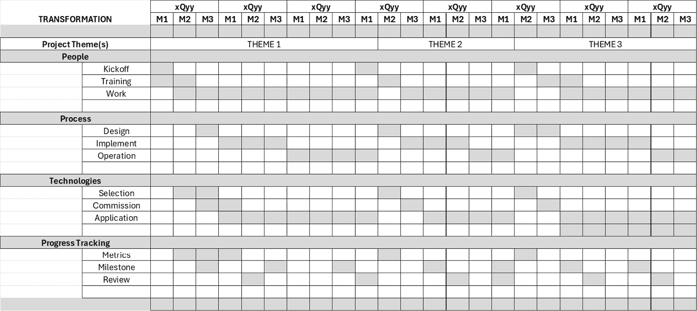
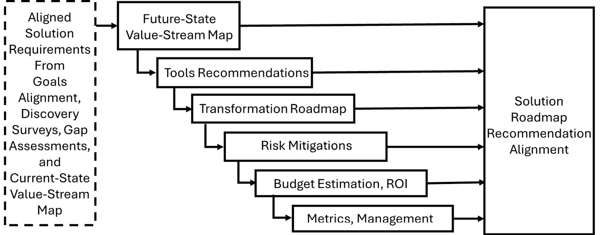
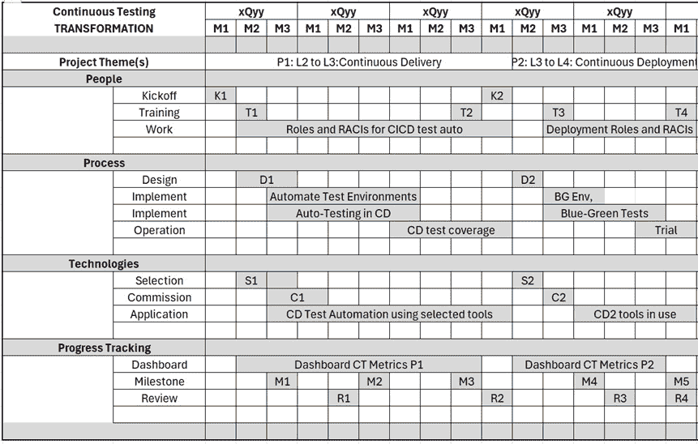
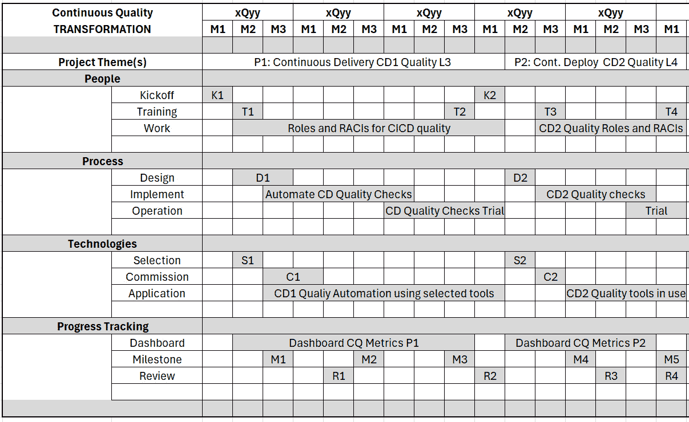
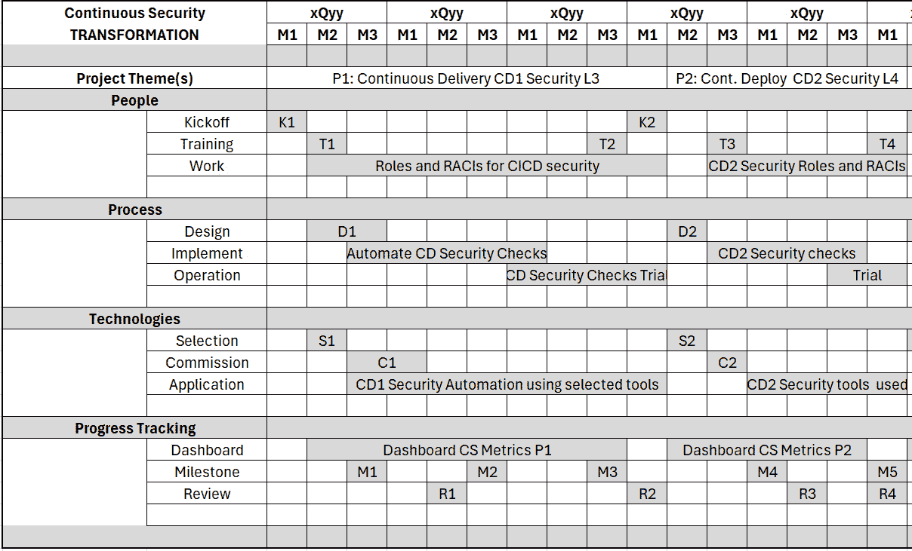
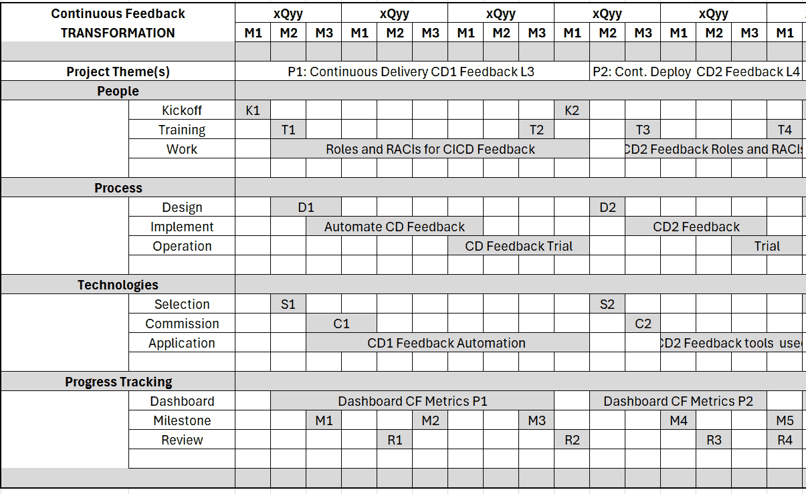
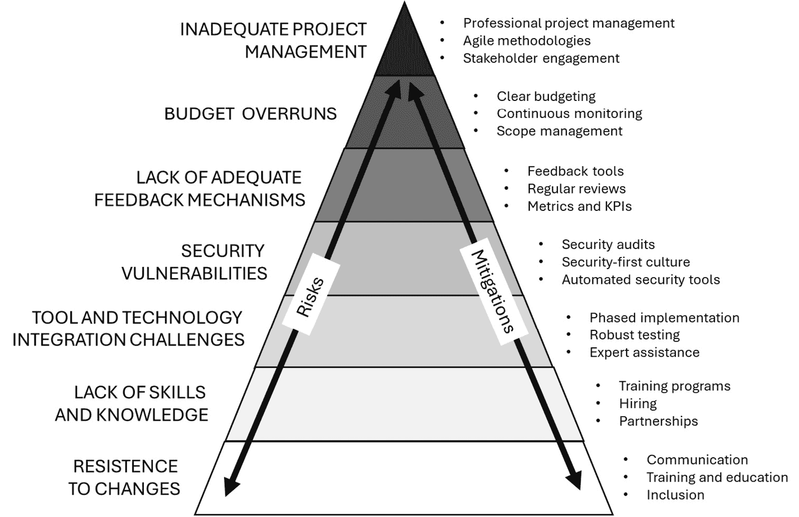

# <st c="0">10</st>

# <st c="2">构建实施路线图</st>

<st c="39">在本章中，我们解释如何为在您的组织内实施连续测试、质量、安全和反馈创建有效的路线图。</st> <st c="196">本章指导您完成定义量身定制的路线图所必需的基础步骤，确保您的数字转型旅程既具有战略性又与</st> <st c="375">组织目标保持一致。</st>

<st c="396">通过本章结束时，您将获得宝贵的技能，包括如何精确定义适合组织独特挑战和目标的实施路线图；专注于连续测试、质量、安全和反馈的专用路线图策略——这些对于开发强大、可靠和用户中心的产品至关重要——以及实现路线图对齐的技术，确保每个团队成员都致力于愿景，并共同努力实现</st> <st c="945">共享目标。</st>

<st c="958">本章不仅仅是学习如何创建文档；它还描绘了一个未来的愿景，即持续改进已融入到您组织的文化中。</st> <st c="1135">通过实用见解和可操作的建议，它使您能够自信</st> <st c="1253">和清晰地带领团队迈向卓越。</st>

<st c="1265">在本章中，我们将涵盖以下</st> <st c="1309">主要主题:</st>

+   <st c="1321">战略路线图</st> <st c="1338">简介</st>

+   <st c="1356">创建</st> <st c="1366">一份路线图</st>

+   <st c="1375">创建未来状态价值</st> <st c="1406">流程图</st>

+   <st c="1416">连续测试</st> <st c="1429">路线图</st>

+   <st c="1447">连续质量</st> <st c="1460">路线图</st>

+   <st c="1478">连续安全</st> <st c="1491">路线图</st>

+   <st c="1510">连续反馈</st> <st c="1523">路线图</st>

+   <st c="1542">在</st> <st c="1564">路线图上达成一致</st>

<st c="1575">让我们</st> <st c="1582">开始吧！</st>

# <st c="1594">战略路线图简介</st>

<st c="1629">在组织内掌握连续测试、质量、安全和反馈需要战略规划。</st> <st c="1742">这一旅程标志着向更具敏捷性、响应性和以质量为中心的开发实践的转变，需要的不仅仅是愿景，还有战略路线图和计划，每一个都在组织</st> <st c="1976">转型旅程中发挥着独特但互补的作用。</st>

## <st c="1999">路线图与计划的区别</st>

<st c="2043">在其核心，路线图</st> <st c="2066">是一个高层次的、视觉化的表示，概述了组织打算采取的主要步骤，以实现其战略目标，如与连续测试、质量、安全相关的目标，</st> <st c="2264">以及反馈。</st>

<st c="2277">与详细计划不同，路线图提供了一个关于人员、流程和技术活动的全景视图，并且展示了实现转型目标的关键里程碑。</st> <st c="2445">路线图具有灵活性，允许在环境变化时进行调整。</st> <st c="2527">战略路线图提供了宏观视角，基于此可以</st> <st c="2600">制定详细计划。</st>

<st c="2614">相比之下，计划</st> <st c="2634">是一个详细的文档，概述了实现路线图中所识别的目标所需的具体行动、资源分配、时间表和职责，包括人员、流程和技术。</st> <st c="2852">它深入探讨了操作层面，提供了执行的逐步指南。</st> <st c="2937">计划是战术性的和详细的，为日常活动和</st> <st c="3027">短期目标提供了清晰的蓝图。</st>

## <st c="3049">路线图的好处</st>

<st c="3074">实施战略</st> <st c="3099">路线图为正在转型的组织带来了多个好处：</st> 

+   **<st c="3175">对齐</st>**<st c="3185">：首先，它通过清晰传达推动愿景、目标和战略优先事项的活动，确保组织各层级之间的对齐。</st> <st c="3351">这种对齐对于争取支持并促进共同的</st> <st c="3426">目标感至关重要。</st>

+   **<st c="3437">灵活性</st>**<st c="3449">：第二，路线图提供灵活性，帮助组织灵活应对技术进步和市场变化的不确定性。</st> <st c="3608">它们作为指路明灯，保持组织专注于长期目标，同时适应</st> <st c="3722">战略的调整。</st>

+   **<st c="3734">资源分配</st>**<st c="3754">：第三，路线图通过突出优先领域，帮助更好地分配资源，确保时间、人员和技术的投资</st> <st c="3910">明智地投入并服务于</st> <st c="3944">整体目标。</st>

## <st c="3962">路线图的重要性</st>

<st c="3990">路线图至关重要，原因有几个：</st>

+   **<st c="4032">清晰性与方向</st>**<st c="4054">：它提供了清晰的愿景和方向，使各方利益相关者保持一致，并确保每个人都理解目标及</st> <st c="4178">前进的路径。</st>

+   **<st c="4191">资源分配</st>**<st c="4211">：它有助于资源的高效分配，确保时间、金钱和精力的投资能够集中在</st> <st c="4338">战略优先事项上。</st>

+   **<st c="4359">风险管理</st>**<st c="4375">：它使组织能够预见风险并制定缓解策略，从而减少</st> <st c="4484">项目失败的可能性。</st>

+   **<st c="4501">变革管理</st>**<st c="4519">：它通过概述对流程、人员和技术的影响，支持有效的变革管理，并为组织</st> <st c="4655">做好转型准备。</st>

+   **<st c="4674">绩效跟踪</st>**<st c="4695">：它使得</st> <st c="4713">能够跟踪与目标的进展，并</st> **<st c="4757">关键绩效指标</st>** <st c="4783">(</st>**<st c="4785">KPI</st>**<st c="4789">)，并允许根据需要进行调整</st> <st c="4812">修正</st> <st c="4825">。</st>

## <st c="4835">没有路线图的风险</st>

<st c="4878">没有战略路线图，</st> <st c="4911">向持续测试和相关实践转型可能会带来重大风险。</st> <st c="5003">没有明确的路线图，组织可能会发现自己没有连贯的战略方向，导致努力错位和资源浪费。</st> <st c="5154">缺乏指导性战略愿景可能导致一些举措未能有效地促进整体目标，进而导致低效和潜在的挫折。</st> <st c="5332">此外，缺少路线图可能会妨碍组织适应变化和挑战的能力，因为缺乏战略框架来指导决策</st> <st c="5514">和调整。</st>

<st c="5530">没有路线图，组织可能会面临几个</st> <st c="5583">负面后果：</st>

+   **<st c="5605">缺乏一致性</st>**<st c="5623">：没有明确的计划，组织的不同部门可能会追求相互冲突的优先事项，从而导致低效和</st> <st c="5749">资源浪费。</st>

+   **<st c="5766">资源错误配置</st>**<st c="5789">：没有优先级排序和规划，资源可能会被过度分配或投入到</st> <st c="5879">低影响的举措中。</st>

+   **<st c="5902">增加的风险</st>**<st c="5918">：缺乏风险管理计划可能使组织在面对无法预见的挑战时变得脆弱，可能导致</st> <st c="6045">转型的失败。</st>

+   **<st c="6064">抗拒变革</st>**<st c="6085">：没有变革管理策略，组织可能会遇到员工和其他利益相关者的强烈抵制，阻碍新技术</st> <st c="6262">和流程的采用。</st>

+   **<st c="6276">无法衡量成功</st>**<st c="6305">：没有明确的 KPI 和衡量标准，就很难衡量进展并展示数字化转型努力的价值。</st> <st c="6420">转型的成果。</st>

<st c="6443">总之，虽然路线图和计划在转型过程中都扮演着至关重要的角色，但它们的目的各不相同。</st> <st c="6564">路线图提供了战略概述和灵活性，指导组织朝着其长期愿景迈进，推动持续的测试、质量、安全性和反馈。</st> <st c="6731">与此相比，计划则提供了实施所需的战术细节。</st> <st c="6813">它们共同构成了组织转型的全面方法，路线图确保战略一致性和适应性，而计划则详细说明了执行路径。</st> <st c="6998">采用战略路线图的好处不可过分强调，忽视路线图的风险同样不容忽视。</st> <st c="7110">当组织在转型的复杂过程中航行时，战略路线图是一个不可或缺的工具</st> <st c="7226">，它确保成功。</st>

## <st c="7238">表示路线图的最佳格式</st>

<st c="7276">表示数字化转型路线图的最佳格式可能会根据组织的需求和偏好有所不同。</st> <st c="7296">然而，视觉表现形式，如甘特图、仪表板或信息图，通常是有效的。</st> <st c="7403">这些格式可以帮助利益相关者快速了解时间表、依赖关系和进展。</st> <st c="7505">工具如微软 Excel、Project、Trello 或专业的路线图软件可以促进路线图的创建、更新和共享。</st> <st c="7726">路线图。</st>

*<st c="7738">图 10</st>**<st c="7748">.1</st>* <st c="7750">是一个作为甘特图表示的示例路线图。</st> <st c="7803">这种格式的优点在于，通过简单地添加水平线来表示</st> *<st c="7908">史诗</st>* <st c="7913">，以及垂直线来表示</st> *<st c="7946">时间框架</st>* <st c="7957">和</st> *<st c="7962">主题</st>*<st c="7968">，可以随时添加任何详细信息。</st>

<st c="8182">图 10.1 – 转型路线图模板</st>

<st c="8227">总之，一个结构良好的路线图对于引导大型组织通过复杂的数字化转型过程至关重要。</st> <st c="8367">它确保了资源的高效利用、风险的减轻以及衡量成功的能力，从而提高了实现</st> <st c="8521">预期成果的可能性。</st>

# <st c="8538">创建路线图</st>

创建数字化转型路线图涉及一系列结构化步骤，如*图 10.2*所示。它需要来自组织各个部门的各类利益相关者的参与。这个过程至关重要，确保转型能够成功解决三个关键领域：人员/文化、流程和技术（包括产品、工具和基础设施要素）。

图 10.2 – 定义实施路线图

让我们分解这些步骤，确定所需的参与者，讨论如何评估备选方案，并确定何时路线图是可接受的。

## 创建路线图的步骤

以下是步骤清单：

1.  **定义愿景和目标**：如在*第五章*中所述，建立清晰的数字化转型愿景和具体目标。这应与组织的战略目标对齐。例如，建立能力成熟度模型，如在*第四章*中所述，可以帮助确定能够识别当前水平和目标水平的能力水平。

1.  **进行当前状态评估和差距分析**：如在*第六章*中所述，评估人员（文化和能力）、流程和技术的当前状态。了解当前价值流的成熟度、能力和差距。通过当前状态调查、差距评估和**当前状态价值流图（CSVSM）**来完成此任务。识别当前状态与期望未来状态之间的差距。此分析应涵盖技能、技术、流程和文化方面。

1.  **<st c="10442">识别优先领域和工具</st>**<st c="10476">：确定数字化转型的关键领域。</st> <st c="10533">优先排序对先解决高影响领域至关重要。</st> <st c="10594">在此步骤中，建议进行</st> **<st c="10640">未来状态价值流图</st>** <st c="10669">(</st>**<st c="10671">FSVSM</st>**<st c="10676">)，如本章后面所述。</st> <st c="10715">对于每个优先领域，概述具体的计划或项目，包括目标、所需资源和预期成果。</st> <st c="10846">建议使用本章中描述的选择工具平台和工具的方法论</st> *<st c="10939">第七章</st>*<st c="10948">。</st>

1.  **<st c="10949">规划时间线和里程碑</st>**<st c="10978">：创建一个分阶段的时间线，并明确里程碑。</st> <st c="11029">这应包括短期胜利、长期转型目标和能力成熟度模型，详见</st> *<st c="11149">第四章</st>* <st c="11159">和</st> *<st c="11164">第五章</st>*<st c="11165">。</st>

1.  **<st c="11166">识别风险和缓解策略</st>**<st c="11207">：预见潜在风险并制定相应的应对策略。</st> <st c="11263">解决这些问题。</st>

1.  **<st c="11276">分配预算和资源</st>**<st c="11306">：估算所需的投资，包括技术采购、培训和招聘的预算。</st> <st c="11411">根据需要估算</st> **<st c="11424">投资回报率</st>** <st c="11444">(</st>**<st c="11446">ROI</st>**<st c="11449">)，以便为投资提供合理依据。</st>

1.  **<st c="11488">定义成功指标和变更管理计划</st>**<st c="11540">：制定管理组织变革的策略，重点关注沟通、培训和支持系统。</st> <st c="11656">建立如何衡量成功，使用具体、可衡量的里程碑和 KPI。</st> <st c="11744">参考</st> *<st c="11753">第十二章</st>* <st c="11763">了解建立指标的方法。</st>

## <st c="11807">谁应当参与</st>

<st c="11830">以下利益相关者应当</st> <st c="11868">参与并贡献于</st> <st c="11895">路线图的制定：</st>

+   **<st c="11907">高层领导</st>**<st c="11928">：提供愿景和支持，并确保与</st> <st c="11990">组织战略的一致性。</st>

+   **<st c="12014">产品开发和质量保证领导</st>**<st c="12049">：从产品开发和质量保证的角度提供见解。</st> <st c="12108">保证的视角。</st>

+   **<st c="12130">IT 部门</st>**<st c="12144">：提供当前技术基础设施和能力的见解。</st> <st c="12200">与能力。</st>

+   **<st c="12217">人力资源</st>**<st c="12233">：促进人员和文化的转型，包括培训</st> <st c="12308">和发展。</st>

+   **<st c="12324">运营领导者</st>**<st c="12344">：提供当前流程的洞察，并帮助设计</st> <st c="12403">未来状态的流程。</st>

+   **<st c="12426">数字化转型办公室或团队（如有）</st>**<st c="12479">：负责领导和协调</st> <st c="12508">转型工作。</st>

+   **<st c="12531">财务部门</st>**<st c="12550">：协助预算编制和</st> <st c="12580">财务规划。</st>

+   **<st c="12599">外部顾问（可选）</st>**<st c="12631">：提供数字化转型的专业知识和外部视角。</st>

## <st c="12703">评估路线图备选方案</st>

<st c="12735">在创建路线图时，考虑备选解决方案是</st> <st c="12767">正常的，通常会在最终决定之前进行考虑。</st> <st c="12832">以下是从一组备选方案中选择路线图时的考虑因素：</st>

+   **<st c="12915">与战略目标的一致性</st>**<st c="12946">：确保路线图与更广泛的</st> <st c="12992">组织目标一致。</st>

+   **<st c="13018">可行性和风险</st>**<st c="13039">：评估每个备选方案的可行性及其</st> <st c="13093">相关风险。</st>

+   **<st c="13110">成本效益分析</st>**<st c="13132">：评估预期收益与所需成本和</st> <st c="13188">资源之间的对比。</st>

+   **<st c="13207">利益相关者的影响</st>**<st c="13226">：考虑对员工、客户和其他</st> <st c="13284">关键利益相关者的影响。</st>

+   **<st c="13301">灵活性</st>**<st c="13313">：确保</st> <st c="13323">路线图能够适应变化的环境</st> <st c="13374">和技术。</st>

## <st c="13391">确定可接受的路线图</st>

<st c="13425">一个可接受的</st> <st c="13439">路线图是</st> <st c="13451">如下所示：</st>

+   **<st c="13474">与战略目标对齐</st>**<st c="13507">：明确支持组织的战略目标</st> <st c="13562">和愿景。</st>

+   **<st c="13577">现实可行</st>**<st c="13603">：可以在给定的时间、预算</st> <st c="13685">和资源限制下现实地实施。</st>

+   **<st c="13699">获得利益相关者的支持</st>**<st c="13722">：得到组织内关键利益相关者的支持。</st>

+   **<st c="13782">涵盖人员、流程和技术</st>**<st c="13826">：在所有三个领域提供全面的转型。</st>

+   **<st c="13894">包括明确的成功指标</st>**<st c="13929">：具有明确的关键绩效指标（KPI），可以跟踪进度并</st> <st c="13996">衡量成功。</st>

<st c="14014">一旦你拥有符合这些标准并已获得关键利益相关者审查和批准的路线图，你可以认为它是可接受的，并开始实施。</st> <st c="14178">随着转型的推进，可能需要定期进行审查和调整，以确保路线图始终与组织目标保持一致，并适应外部环境或</st> <st c="14389">组织优先事项的任何变化。</st>

# <st c="14415">创建未来状态价值流图（FSVSM）</st>

<st c="14464">FSVSM 是一种</st> <st c="14479">在精益管理中使用的视觉工具，概述了组织内部流程的理想未来状态，专注于从开始到结束的价值交付。</st> <st c="14640">与传统的价值流图不同，传统的价值流图记录的是当前流程、低效和浪费，而 FSVSM 则描绘了在实施改进后，流程应该如何理想地运作。</st> <st c="14848">它旨在简化操作，提升生产力，消除非增值活动，从而确保流程中的每一步都能直接贡献于最终</st> <st c="15028">产出的价值。</st>

## <st c="15043">FSVSM 在建立转型路线图中的重要性</st>

<st c="15108">以下是解释</st> <st c="15146">为什么 FSVSM 对于建立转型路线图非常重要的原因：</st>

+   **<st c="15210">愿景澄清</st>**<st c="15231">：FSVSM 有助于阐明一个清晰且共享的理想未来运营状态的愿景。</st> <st c="15326">通过可视化最终目标，组织可以确保所有利益相关者对</st> <st c="15439">相同的目标达成一致并保持积极性。</st>

+   **<st c="15455">差距识别</st>**<st c="15474">：映射未来状态使组织能够识别当前流程与最佳未来操作之间的差距。</st> <st c="15605">理解这些差距对于制定有针对性的策略以弥补差距至关重要，从而使转型路线图</st> <st c="15734">更加有效。</st>

+   **<st c="15749">优先级排序</st>**<st c="15779">：FSVSMs 有助于识别需要改进的高影响领域。</st> <st c="15857">组织可以利用这些信息来优先安排举措，合理配置资源，并专注于那些在价值交付和</st> <st c="16048">减少浪费方面带来最大益处的变革。</st>

+   **<st c="16064">增强的协作与沟通</st>**<st c="16105">：FSVSM 的视觉化和协作性质促进了团队成员、部门和利益相关者之间更好的沟通。</st> <st c="16234">这种改善的沟通对于协调努力、分享最佳实践并确保转型全面</st> <st c="16379">且有凝聚力至关重要。</st>

+   **<st c="16392">持续改进文化</st>**<st c="16423">：通过定期更新 FSVSM 以反映已实现的改进并设定新目标，组织可以促进持续改进的文化。</st> <st c="16578">这一迭代过程鼓励不断的评估和适应，在当今快速变化的商业环境中至关重要。</st> <st c="16703">商业环境。</st>

+   **<st c="16724">战略规划支持</st>**<st c="16751">：FSVSM 通过概述实现所需未来状态的必要步骤，为战略规划提供了一种结构化的方法。</st> <st c="16883">它们作为制定详细行动计划、设定现实时间表和</st> <st c="16980">衡量变革目标进展的基础。</st> <st c="17011">变革目标。</st>

<st c="17032">总之，FSVSM（价值流映射）是组织变革规划和执行中不可或缺的工具。</st> <st c="17144">它们提供了一种战略视野，指导有效的变革路线图的制定，确保工作重点明确、方向一致，并且以价值为驱动。</st> <st c="17305">通过利用 FSVSM，组织能够以清晰和精准的方式应对变革的复杂性，最终实现提高效率、质量和</st> <st c="17479">客户满意度的目标。</st>

## <st c="17501">FSVSM 工作坊</st>

<st c="17516">创建 FSVSM 进行数字化</st> <st c="17549">转型需要几个关键步骤和准备工作，以确保映射过程既高效又有效。</st> <st c="17678">以下是该过程的简要概述以及各个方面的重要性：</st>

1.  **<st c="17754">为价值流设定具体目标</st>**<st c="17795">：设定具体目标至关重要，因为它与数字化转型工作的重点保持一致。</st> <st c="17905">它有助于识别需要改进的过程，并确保未来状态图的设计具备明确的目标，例如减少浪费、改善流程流动或提升</st> <st c="18104">客户满意度。</st>

1.  **<st c="18126">提前准备参与者</st>**<st c="18158">：在进行 FSVSM 工作坊之前，必须提前准备参与者。</st> <st c="18243">这包括选择一个跨职能团队，并为他们提供有关价值流映射、工作坊目标以及他们可能需要的任何预读材料或数据的背景信息。</st> <st c="18450">充分准备确保参与者能够带着充分的信息参与并为映射过程作出有意义的贡献。</st> <st c="18546">贡献。</st>

1.  **<st c="18562">审查当前状态映射</st>**<st c="18595">：首先审查价值流的当前状态，以了解现有的流程、信息流和痛点。</st> <st c="18729">这一步骤包括记录步骤、延迟和低效，从而为改进奠定基准</st> <st c="18815">。</st>

1.  **<st c="18831">识别价值流中的瓶颈</st>**<st c="18876">：通过当前状态映射，识别瓶颈和浪费的区域。</st> <st c="18955">瓶颈至关重要，因为它们会减缓流程流动，并可能显著影响整体绩效。</st> <st c="19070">识别这些瓶颈可以为未来状态设计中的有针对性的干预提供依据。</st> <st c="19129">。</st>

1.  **<st c="19149">设计未来状态图</st>**<st c="19177">：通过利用当前状态分析的洞察力，并牢记具体目标，设计价值流的未来状态。</st> <st c="19316">这涉及到</st> <st c="19329">用数字技术重新构思流程，消除非增值步骤，并解决已识别的瓶颈，从而创建一个更高效、更有效的</st> <st c="19492">价值流。</st>

1.  **<st c="19505">制定实施路线图</st>**<st c="19539">：制定一条路线图，以便从当前状态过渡到未来状态。</st> <st c="19618">该路线图应包括具体的项目或倡议、所需资源、时间表和衡量成功的指标。</st> <st c="19745">路线图应包括实现转型目标所需的人员、流程和技术方面的战略性变革。</st> <st c="19852">。</st>

1.  **<st c="19873">总结研讨会的输出结果</st>**<st c="19911">：主要输出包括详细的 FSVSM、全面的实施路线图、确定的即时改进领域，以及待采用的潜在数字技术或解决方案列表。</st> <st c="20117">此外，应有一套明确的绩效指标，用于跟踪向</st> <st c="20210">未来状态的进展。</st>

<st c="20224">为数字化转型创建 FSVSM 的过程对于确保努力集中在最具影响力的领域至关重要。</st> <st c="20371">通过设定具体目标、准备参与者、识别瓶颈并充分规划实施，组织可以显著提升其运营，增强客户价值，并在</st> <st c="20617">数字时代获得竞争优势。</st>

<st c="20629">接下来，让我们将重点转向将持续测试融入软件开发</st> <st c="20739">生命周期的具体内容。</st>

# <st c="20750">持续测试的路线图</st>

<st c="20781">本节</st> <st c="20794">概述了确保测试成为一个</st> <st c="20847">持续进行的过程的策略，使得问题能够早期被发现，并确保质量从一开始就融入到产品中。</st>

<st c="20970">制定有效的持续测试路线图需要仔细考虑发现调查、能力成熟度评估、差距评估、工具评估和 CSVSM 的结果，如</st> <st c="21192">前面的章节所述。</st>

<st c="21210">没有标准的路线图，因为每个组织和应用程序在持续测试的当前状态和未来状态的优先事项上都具有独特性。</st>

*<st c="21359">图 10</st>**<st c="21369">.3</st>* <st c="21371">是持续测试路线图的示例。</st> <st c="21423">在这个示例中，组织的持续测试当前状态被评估为能力水平 2（即持续集成），而该组织的目标是转变为 4 级（即</st> <st c="21640">持续部署）。</st>

<st c="22352">图 10.3 – 持续测试路线图（示例）</st>

<st c="22406">路线图</st> <st c="22419">有两个</st> <st c="22426">项目主题：</st>

+   **<st c="22442">P1 主题</st>**<st c="22451">，将持续测试实践从 2 级（持续集成）转变为 3 级，</st> <st c="22545">持续交付。</st>

+   **<st c="22565">P2 主题</st>**<st c="22574">，将从 3 级转变为 4 级，</st> <st c="22614">持续部署。</st>

<st c="22636">P1 主题的路线图包括以下 Epics，旨在转变人员、流程、技术和</st> <st c="22741">进度跟踪：</st>

+   **<st c="22759">人员</st>**<st c="22766">：召开启动会议，以确保团队对实施、培训以及 CI/CD 测试自动化的角色和责任矩阵（即 RACI）达成一致。</st>

+   **<st c="22918">流程</st>**<st c="22928">：设计活动、测试环境自动化、持续交付的测试自动化以及持续交付（CD）测试覆盖率的验证。</st>

+   **<st c="23065">技术</st>**<st c="23078">：工具选择、新工具的调试和所选工具在 CD 自动化中的使用。</st>

+   **<st c="23174">进度跟踪</st>**<st c="23192">：定义仪表盘指标和里程碑，并审查持续测试的检查点。</st>

<st c="23286">P2 主题的路线图包括以下 Epics，旨在转变人员、流程、技术和</st> <st c="23391">进度跟踪：</st>

+   **<st c="23409">人员</st>**<st c="23416">：召开启动会议，以确保团队对实施、培训以及 CI/CD 测试自动化的角色和 RACI 的更新达成一致。</st>

+   **<st c="23542">流程</st>**<st c="23552">：流程设计活动、蓝绿环境流程自动化及验证</st> <st c="23642">和试运行。</st>

+   **<st c="23652">技术</st>**<st c="23665">：部署工具选择、新工具的启用，以及选择的工具用于</st> <st c="23758">部署自动化。</st>

+   **<st c="23780">进展跟踪</st>**<st c="23798">：更新</st> <st c="23807">仪表板指标和里程碑，并审查</st> <st c="23852">持续测试检查点，用于</st> <st c="23887">部署自动化。</st>

<st c="23909">此路线图是一个高层次的框架，基于此可以制定详细的持续测试实施计划，包括故事</st> <st c="24044">和任务。</st>

# <st c="24054">持续质量路线图</st>

<st c="24085">持续质量</st> <st c="24104">不仅仅是测试，涵盖了产品生命周期的各个方面，以确保卓越。</st> <st c="24199">本节讨论了如何创造一个质量文化，让每个团队成员都成为卓越的倡导者，利用工具、流程和指标来维持</st> <st c="24365">高标准。</st>

<st c="24380">没有标准的路线图，因为每个组织和应用都有独特的当前状态和未来状态的优先事项，以实现</st> <st c="24510">持续质量。</st>

*<st c="24529">图 10</st>**<st c="24539">.4</st>* <st c="24541">是持续质量路线图的一个示例。</st> <st c="24593">在这个示例中，组织的当前持续质量状态被评估为第 2 级能力，持续集成，组织期望的目标是转变为第 4 级，</st> <st c="24800">持续部署。</st>

<st c="25462">图 10.4 – 持续质量路线图（示例）</st>

<st c="25516">该</st> <st c="25520">路线图有两个</st> <st c="25537">项目主题：</st>

+   **<st c="25552">主题 P1</st>**<st c="25561">：将持续质量实践从第 2 级，持续集成，转变为第 3 级，</st> <st c="25655">持续交付。</st>

+   **<st c="25675">主题 P2</st>**<st c="25684">：将持续质量实践从第 3 级转变为第 4 级，</st> <st c="25753">持续部署。</st>

<st c="25775">主题 P1 的路线图包括以下 Epic，以转变人员、流程、技术和</st> <st c="25880">进展跟踪：</st>

+   **<st c="25898">人员</st>**<st c="25905">：启动会议，以使团队对实施、培训、角色以及 CI/CD 质量计划的 RACI 达成一致。</st> <st c="26011">质量计划。</st>

+   **<st c="26024">流程</st>**<st c="26034">：设计活动、持续交付的持续质量检查自动化，以及持续交付质量检查的验证。</st> <st c="26159">质量检查。</st>

+   **<st c="26174">技术</st>**<st c="26187">：选择用于持续交付的质量检查工具，委托新工具的使用，并使用选定的工具进行持续交付</st> <st c="26330">质量自动化。</st>

+   **<st c="26349">进度跟踪</st>**<st c="26367">：定义仪表盘指标和里程碑，审查连续质量的检查点。</st>

<st c="26456">P2 主题的路线图包括以下 Epics，以转变人员、流程、技术和</st> <st c="26561">进度跟踪：</st>

+   **<st c="26579">人员</st>**<st c="26586">：启动会议以便团队就实施、培训以及 CI/CD 质量自动化的角色和 RACI 进行对齐。</st>

+   **<st c="26715">流程</st>**<st c="26725">：流程设计活动，P2 流程自动化、验证，</st> <st c="26792">以及试行。</st>

+   **<st c="26802">技术</st>**<st c="26815">：选择用于部署的质量检查工具，委托新工具的使用，并使用选定的质量检查工具进行</st> <st c="26946">部署自动化。</st>

+   **<st c="26968">进度跟踪</st>**<st c="26986">：更新仪表盘指标和里程碑，并</st> <st c="26996">审查部署的持续质量检查点。</st>

<st c="27090">这份路线图是实现持续质量的高层次方法，基于此可以制定详细的实施计划，包括故事</st> <st c="27226">和任务。</st>

# <st c="27236">持续安全的路线图</st>

<st c="27268">随着</st> <st c="27274">网络安全威胁的增加，本节突出了将安全实践融入每个开发阶段的必要性。</st> <st c="27347">它为主动的安全态势提供了蓝图，确保产品不仅具备功能性，还能抵御</st> <st c="27541">潜在威胁。</st>

<st c="27559">没有标准的路线图，因为每个组织和应用的当前状态及未来优先级都独特，</st> <st c="27689">需要定制持续安全的路线图。</st>

*<st c="27709">图 10</st>**<st c="27719">.5</st>* <st c="27721">是一个</st> <st c="27727">持续安全的路线图示例。</st> <st c="27774">在这个</st> <st c="27781">示例中，组织的当前持续安全状态被评估为 2 级能力，即持续集成，目标是将组织转变为 4 级能力，即</st> <st c="27982">持续部署。</st>

<st c="28626">图 10.5 – 持续安全的路线图（示例）</st>

<st c="28681">路线图有两个</st> <st c="28702">项目主题：</st>

+   **<st c="28717">主题 P1</st>**<st c="28726">，将连续安全实践从第 2 级——持续集成，转变为第 3 级——</st> <st c="28821">持续交付。</st>

+   **<st c="28841">主题 P2</st>**<st c="28850">，将连续安全实践从第 3 级转变为第 4 级——</st> <st c="28920">持续部署。</st>

<st c="28942">主题 P1 的路线图包括以下 Epic 以转变人员、流程、技术和</st> <st c="29047">进度跟踪：</st>

+   **<st c="29065">人员</st>**<st c="29072">：启动会议以使团队就</st> <st c="29077">实施、培训以及 CI/CD 安全策略的角色和 RACI 达成一致。</st>

+   **<st c="29196">流程</st>**<st c="29206">：设计活动，自动化持续质量检查用于持续交付，以及验证持续交付</st> <st c="29331">的安全检查。</st>

+   **<st c="29347">技术</st>**<st c="29360">：选择用于持续交付的质量检查工具，委托新工具的使用，并将选定的工具应用于持续交付的安全自动化。</st>

+   **<st c="29531">进度跟踪</st>**<st c="29549">：定义仪表板指标和里程碑，并审查持续安全的检查点。</st>

<st c="29639">主题 P2 的路线图包括以下 Epic 以转变人员、流程、技术和</st> <st c="29744">进度跟踪：</st>

+   **<st c="29762">人员</st>**<st c="29769">：启动会议以使团队就实施、培训以及安全自动化的更新角色和 RACI 达成一致。</st>

+   **<st c="29893">流程</st>**<st c="29903">：流程设计活动，P2 流程自动化、验证，</st> <st c="29970">以及试验。</st>

+   **<st c="29980">技术</st>**<st c="29993">：选择用于部署的安全检查工具，委托新工具的使用，并将选定的质量检查工具应用于</st> <st c="30125">部署自动化。</st>

+   **<st c="30147">进度跟踪</st>**<st c="30165">：更新仪表板指标和里程碑，审查持续安全的检查点以支持</st> <st c="30235">部署。</st>

<st c="30270">这份路线图是一个高层次的连续安全方法，其上可以构建详细的实施计划，包括故事</st> <st c="30407">和任务。</st>

# <st c="30417">持续反馈的路线图</st>

<st c="30449">这一部分</st> <st c="30459">强调了反馈在迭代开发过程中的价值。</st> <st c="30475">它展示了如何建立从用户和利益相关者处获取持续反馈的渠道，从而便于快速调整和改进，以有效满足他们的</st> <st c="30682">需求。</st>

<st c="30700">没有标准的路线图，因为每个组织和应用程序在当前状态和未来状态上都有独特的优先级，适用于</st> <st c="30830">持续反馈。</st>

*<st c="30850">图 10</st>**<st c="30860">.6</st>* <st c="30862">是持续反馈的路线图示例。</st> <st c="30915">在此示例中，组织当前的持续反馈状态被评估为第 2 级能力，持续集成，组织期望的</st> <st c="31068">目标是转变为</st> <st c="31113">第 4 级，</st> <st c="31123">持续部署。</st>

<st c="31990">图 10.6 – 持续反馈的路线图（示例）</st>

<st c="32045">路线图有两个</st> <st c="32066">项目主题：</st>

+   **<st c="32081">主题 P1</st>**<st c="32090">，将持续反馈实践从第 2 级，持续集成，转变为第 3 级，</st> <st c="32185">持续交付。</st>

+   **<st c="32205">主题 P2</st>**<st c="32214">，将持续反馈实践从第 3 级转变为第 4 级，</st> <st c="32284">持续部署。</st>

<st c="32306">主题 P1 的</st> <st c="32310">路线图包括以下 Epics，以转变</st> <st c="32374">人员、流程、技术和</st> <st c="32411">进度跟踪：</st>

+   **<st c="32429">人员</st>**<st c="32436">：启动会议，帮助团队就实施、培训、角色和 RACI 以及</st> <st c="32532">反馈策略达成一致。</st>

+   **<st c="32550">流程</st>**<st c="32560">：设计活动，持续交付的持续反馈自动化，以及对</st> <st c="32672">持续交付反馈的验证。</st>

+   **<st c="32692">技术</st>**<st c="32705">：为持续交付选择反馈工具，启动新工具的使用，并利用选定的工具进行持续交付的反馈自动化。</st>

+   **<st c="32864">进度跟踪</st>**<st c="32882">：定义仪表盘指标和里程碑，并审查持续反馈的检查点。</st>

<st c="32972">主题 P2 的路线图包括以下 Epics，以便转变人员、流程、技术和</st> <st c="33077">进度跟踪：</st>

+   **<st c="33095">人员</st>**<st c="33102">：启动会议，用于团队对实施、培训以及更新的角色和 RACI 达成一致，以便进行</st> <st c="33206">CI/CD 反馈。</st>

+   **<st c="33221">流程</st>**<st c="33231">：流程设计活动，P2 流程自动化，验证，</st> <st c="33298">和试验。</st>

+   **<st c="33308">技术</st>**<st c="33321">：选择用于部署的反馈工具，启动新工具的使用，并利用选定的反馈工具进行</st> <st c="33436">部署自动化。</st>

+   **<st c="33458">进度跟踪</st>**<st c="33476">：更新仪表盘指标和里程碑，审查部署的持续</st> <st c="33556">反馈</st> <st c="33565">检查点。</st>

<st c="33581">此路线图是一个高层次的持续反馈方法，详细的实施计划可以基于此制定，包括故事</st> <st c="33718">和任务。</st>

# <st c="33728">路线图的一致性</st>

<st c="33753">本节讨论了路线图实施中最关键的方面之一——确保全组织各层级之间的一致性。</st> <st c="33783">它提供了有关如何与相关方进行互动、促进合作，并确保路线图获得所需支持以成功的实用建议。</st>

<st c="34037">建议为持续测试、质量、安全性和反馈分别制定独立的路线图，以确保考虑到每个目标的独特性。</st> <st c="34196">重要的是，确保转型团队就所有主题和史诗达成共识。</st> <st c="34287">一旦达成一致，建议制定一个综合的路线图，以简化整个主题</st> <st c="34420">和史诗的项目跟踪。</st>

## <st c="34430">识别风险与缓解策略</st>

<st c="34474">将一个</st> <st c="34491">组织转型为更成熟的持续测试、质量、安全性和反馈能力，需要在流程、技术和文化方面进行重大变革。</st> <st c="34659">认识到并减轻与这些变革相关的风险，对于成功过渡至关重要，如</st> *<st c="34784">图 10</st>**<st c="34793">.7</st>*<st c="34795">所示：</st>

<st c="35390">图 10.7 – 风险与缓解</st>

<st c="35425">在这里，</st> <st c="35436">风险和缓解</st> <st c="35455">策略</st> <st c="35467">被解释如下：</st>

+   **<st c="35481">抗拒变革</st>**<st c="35502">：员工可能会抵制新方法、新工具，以及日常工作中的变化，尤其是在他们认为这些变化威胁到现有职位</st> <st c="35649">或技能时。</st>

    +   **<st c="35659">缓解策略</st>**<st c="35681">：</st>

        +   **<st c="35683">沟通</st>**<st c="35696">：定期与所有相关方沟通变革的益处和原因。</st>

        +   **<st c="35785">培训与教育</st>**<st c="35808">：提供全面的培训，帮助员工适应新工具</st> <st c="35879">和新实践。</st>

        +   **<st c="35893">包容性</st>**<st c="35903">：通过反馈会议和试点项目让员工参与过渡过程。</st>

+   **<st c="35995">技能和知识不足</st>**<st c="36027">：当前的劳动力可能缺乏有效实施和维护新技术</st> <st c="36129">和实践所需的技能：</st>

    +   **<st c="36151">缓解策略</st>**<st c="36173">：</st>

        +   **<st c="36175">培训计划</st>**<st c="36192">：投资培训计划和工作坊，提升员工</st> <st c="36240">技能。</st>

        +   **<st c="36258">招聘</st>**<st c="36265">：引进具备必要技能或经验的人才，特别是在 DevOps、网络安全和</st> <st c="36372">自动化测试等领域。</st>

        +   **<st c="36390">合作伙伴关系</st>**<st c="36403">：与专注于</st> <st c="36472">数字化转型的外部顾问或公司合作。</st>

+   **<st c="36496">工具和技术整合挑战</st>**<st c="36539">：将新工具与现有系统整合可能复杂且具有破坏性，可能导致停机或数据</st> <st c="36657">完整性问题：</st>

    +   **<st c="36674">缓解策略</st>**<st c="36696">：</st>

        +   **<st c="36698">分阶段实施</st>**<st c="36719">：逐步推出新工具</st> <st c="36727">和流程，以管理</st> <st c="36741">整合的复杂性。</st>

        +   **<st c="36798">强健的测试</st>**<st c="36813">：在受控环境中对新工具进行严格测试，确保其在</st> <st c="36888">全面实施之前可靠。</st>

        +   **<st c="36914">专家协助</st>**<st c="36932">：对于复杂的整合，使用外部专家确保遵循最佳实践</st> <st c="37006">。</st>

+   **<st c="37019">安全漏洞</st>**<st c="37044">：新工具和更频繁的部署可能会引入安全漏洞，特别是如果没有</st> <st c="37145">妥善管理：</st>

    +   **<st c="37162">缓解策略</st>**<st c="37184">：</st>

        +   **<st c="37186">安全审计</st>**<st c="37201">：定期进行安全审计和</st> <st c="37240">漏洞评估。</st>

        +   **<st c="37266">安全优先的文化</st>**<st c="37289">：培养安全意识文化，并确保安全实践从</st> <st c="37410">一开始就融入开发过程。</st>

        +   **<st c="37420">自动化安全工具</st>**<st c="37445">：实施自动化安全测试工具，持续扫描</st> <st c="37512">潜在漏洞。</st>

+   **<st c="37532">缺乏足够的反馈机制</st>**<st c="37569">：没有有效的反馈机制，质量和性能的持续改进</st> <st c="37662">可能会停滞不前：</st>

    +   **<st c="37672">缓解策略</st>**<st c="37694">：</st>

        +   **<st c="37696">反馈工具</st>**<st c="37710">：实施能够促进来自最终用户</st> <st c="37779">和利益相关者实时反馈的工具。</st>

        +   **<st c="37796">定期评审</st>**<st c="37812">：安排定期评审会议，讨论反馈并将其纳入</st> <st c="37892">开发周期。</st>

        +   **<st c="37911">指标和 KPI</st>**<st c="37928">：定义并跟踪 KPI，以衡量反馈对产品质量和</st> <st c="38010">团队绩效的影响。</st>

+   **<st c="38027">预算超支</st>**<st c="38043">：由于不可预见的挑战或</st> <st c="38151">范围蔓延，转型可能比预期更昂贵：</st>

    +   **<st c="38163">缓解策略</st>**<st c="38185">：</st>

        +   **<st c="38187">明确预算</st>**<st c="38202">：为与转型相关的支出建立明确的预算限制和审批流程。</st>

        +   **<st c="38310">持续监控</st>**<st c="38332">：定期监控和审查费用及进展，确保与设定目标的对齐。</st>

        +   **<st c="38424">范围管理</st>**<st c="38441">：明确定义转型的范围和目标，以避免超出</st> <st c="38532">原始意图。</st>

+   **<st c="38552">项目管理不足</st>**<st c="38582">：差的项目管理可能导致目标不一致、错过截止日期和</st> <st c="38661">项目失败：</st>

    +   **<st c="38677">缓解策略</st>**<st c="38699">：</st>

        +   **<st c="38701">专业项目管理</st>**<st c="38732">：雇佣经验丰富、熟悉 IT 转型的项目经理。</st>

        +   **<st c="38812">敏捷方法论</st>**<st c="38832">：使用敏捷方法管理项目，允许灵活性并定期重新评估项目方向</st> <st c="38950">和优先级。</st>

        +   **<st c="38965">利益相关者参与</st>**<st c="38988">：在整个项目生命周期内保持所有利益相关者的参与和知情，确保对齐并及时解决</st> <st c="39100">问题。</st>

<st c="39116">通过仔细规划和解决这些风险，组织可以成功应对持续测试、质量、安全和反馈采纳的复杂性，从而实现更具弹性和高效的</st> <st c="39333">运营模式。</st>

## <st c="39351">分配预算和资源</st>

<st c="39383">确定实施预算并预测在持续测试、质量、安全和反馈方面的转型 ROI 需要一种综合方法。</st> <st c="39555">以下是推荐的步骤，用于制定预算并估算 ROI，包括技术采购、培训、招聘和</st> <st c="39701">流程自动化的考虑：</st>

1.  **<st c="39720">明确范围</st>** **<st c="39739">和目标</st>**<st c="39753">：</st>

    +   **<st c="39755">确定具体目标</st>**<st c="39778">：清晰地定义转型计划的目标，包括质量、速度、安全性等方面的具体改进，以及</st> <st c="39905">反馈机制。</st>

    +   **<st c="39925">需求分析</st>**<st c="39946">：评估当前能力，并识别转型需要解决的差距。</st> <st c="40037">这包括技术、技能、流程和</st> <st c="40086">文化方面。</st>

1.  **<st c="40103">成本估算</st>** **<st c="40113">费用</st>**<st c="40122">：</st>

    +   **<st c="40124">技术采购</st>**<st c="40146">：估算购买新工具并与现有系统集成的成本。</st> <st c="40233">这可能包括软件许可证、硬件和</st> <st c="40285">云服务。</st>

    +   **<st c="40300">培训</st>**<st c="40309">：为当前员工培训新工具、方法论和</st> <st c="40392">最佳实践分配预算。</st>

    +   **<st c="40407">招聘</st>**<st c="40414">：确定招聘具有必要专业知识的新员工的成本，若现有员工无法填补</st> <st c="40532">所有职位。</st>

    +   **<st c="40542">流程自动化</st>**<st c="40561">：评估自动化流程的成本，这可能包括软件开发、购买现成的解决方案或定制</st> <st c="40690">现有工具。</st>

    +   **<st c="40705">基础设施升级</st>**<st c="40729">：包括可能需要升级的基础设施，以支持新技术和</st> <st c="40833">增加的负载。</st>

    +   **<st c="40849">咨询和外部专家</st>**<st c="40884">：如果需要专业知识来实施，预算中应考虑外部顾问的费用。</st> <st c="40956">用于实施。</st>

1.  **<st c="40975">计算</st>** **<st c="40986">ROI</st>**<st c="40993">：</st>

    +   **<st c="40995">量化效益</st>**<st c="41012">：估算</st> <st c="41023">切实的效益，如减少市场推广时间、提高产品质量、减少停机时间和降低安全</st> <st c="41139">事故成本。</st>

    +   **<st c="41154">间接效益</st>**<st c="41172">：考虑间接效益，如提高客户满意度、增强品牌声誉和增加</st> <st c="41283">员工满意度。</st>

    +   **<st c="41305">节省成本</st>**<st c="41318">：计算减少错误率、减少安全漏洞和减少手动测试所带来的成本节省。</st>

    +   **<st c="41433">ROI 公式</st>**<st c="41445">：使用</st> <st c="41452">公式：</st>

        +   <st c="41464">%ROI={(净收益−总成本)/(总成本)}×100%，其中净收益包括收入增长和</st> <st c="41571">成本节省。</st>

1.  **<st c="41584">分配</st>** **<st c="41594">预算</st>**<st c="41602">：</st>

    +   **<st c="41604">基于优先级的资金分配</st>**<st c="41626">：根据范围分析中确定的优先需求分配资金。</st> <st c="41709">应优先考虑那些带来最大投资回报的关键领域。</st>

    +   **<st c="41773">分阶段分配</st>**<st c="41791">：考虑采用分阶段的预算分配方法，在特定里程碑完成时释放资金，以保持项目进度并</st> <st c="41928">确保预算内完成。</st>

    +   **<st c="41942">应急基金</st>**<st c="41959">：将预算的一部分（通常为 5-10%）预留用于转型过程中无法预见的费用或调整。</st>

1.  **<st c="42080">监控</st>** **<st c="42089">和调整</st>**<st c="42099">：</st>

    +   **<st c="42101">绩效指标</st>**<st c="42120">：设立</st> <st c="42133">关键绩效指标（KPI）以监控在不同阶段实施的成功情况。</st>

    +   **<st c="42207">反馈机制</st>**<st c="42222">：整合反馈机制，持续改进并根据需要调整转型战略。</st> <st c="42318">。 </st>

    +   **<st c="42328">预算审查</st>**<st c="42342">：定期审查预算与实际支出，依据项目进展和</st> <st c="42452">外部因素调整预测。</st>

1.  **<st c="42469">报告</st>** **<st c="42477">和沟通</st>**<st c="42492">：</st>

    +   **<st c="42494">利益相关者报告</st>**<st c="42513">：通过定期更新预算使用情况、投资回报率（ROI）预测和</st> <st c="42606">项目状态，保持所有利益相关者的知情。</st>

    +   **<st c="42621">透明沟通</st>**<st c="42647">：确保所有财务决策和调整都透明地传达给相关方，以维护信任</st> <st c="42771">并</st> <st c="42774">确保一致性。</st>

<st c="42785">这种战略方法不仅有助于为转型设定一个切实可行的预算，还能计算出可靠的投资回报率（ROI），以证明投资的合理性。</st> <st c="42958">此外，持续的预算和资源监控与适应性管理将确保转型与组织目标及</st> <st c="43121">市场需求保持一致。</st>

## <st c="43136">定义成功指标和变更管理计划</st>

<st c="43190">为了成功实现向更成熟的持续测试、质量、安全和反馈能力的转型，定义明确的成功指标并建立健全的变更管理计划至关重要。</st> <st c="43405">这将有助于确保转型得到有效管理，并与组织目标保持一致。</st> <st c="43517">以下是</st> <st c="43526">详细计划。</st>

### <st c="43540">成功指标</st>

<st c="43556">最受欢迎的衡量成功的指标是行业标准的</st> <st c="43581">DORA 指标。</st> <st c="43638">以下列表提供了有关这些指标的更多细节，并包含一些附加指标的信息：</st>

+   **<st c="43762">DORA 指标</st>**<st c="43775">：</st>

    +   **<st c="43777">部署频率</st>**<st c="43797">：衡量部署发生的频率。</st> <st c="43837">更高的频率通常表示更成熟的持续测试和</st> <st c="43911">部署实践。</st>

    +   **<st c="43932">变更提前期</st>**<st c="43954">：跟踪从代码提交到代码成功运行在生产环境中的时间。</st> <st c="44042">更短的提前期是</st> <st c="44075">高效流程的标志。</st>

    +   **<st c="44095">变更失败率</st>**<st c="44115">：监控在生产环境中部署失败的百分比。</st> <st c="44189">更低的失败率通常意味着更高的质量和</st> <st c="44246">更好的测试。</st>

    +   **<st c="44261">恢复服务时间</st>**<st c="44285">：衡量从生产环境中的故障中恢复所需的时间。</st> <st c="44355">更快的恢复时间表明更好的事件管理</st> <st c="44416">和可靠性。</st>

+   **<st c="44432">附加指标</st>**<st c="44451">：</st>

    +   **<st c="44453">自动化测试覆盖率</st>**<st c="44476">：自动化测试覆盖的代码百分比，目标是实现高覆盖率，以</st> <st c="44554">确保质量。</st>

    +   **<st c="44569">Bug 检测率</st>**<st c="44588">：在开发阶段检测并修复 Bug 的比率。</st>

    +   **<st c="44663">安全事件率</st>**<st c="44686">：跟踪安全事件的频率和严重性，以评估安全措施的改进。</st> <st c="44769">安全事件的减少表明安全性得到了提高。</st>

    +   **<st c="44787">用户反馈响应时间</st>**<st c="44815">：响应并解决用户反馈所需的时间，反映反馈</st> <st c="44897">循环的有效性。</st>

    +   **<st c="44916">员工满意度</st>**<st c="44938">：衡量员工对新流程和工具的满意度变化，因为这影响到采纳情况</st> <st c="45040">和生产力。</st>

### <st c="45057">变更管理计划</st>

<st c="45080">以下是管理</st> <st c="45126">变革的良好实践：</st>

+   **<st c="45162">沟通计划</st>**<st c="45181">：</st>

    +   **<st c="45183">启动会议</st>**<st c="45199">：通过启动会议概述目标、期望和时间表，正式启动变革，确保所有利益相关者知情。</st>

    +   **<st c="45310">定期更新</st>**<st c="45326">：通过电子邮件、新闻通讯或专门的内联网部分提供持续更新，以保持所有相关方了解进展</st> <st c="45457">和变更。</st>

    +   **<st c="45469">反馈渠道</st>**<st c="45487">：建立开放的渠道（如调查、论坛和会议），供员工表达关切并提供对</st> <st c="45614">转型过程的反馈。</st>

+   **<st c="45637">培训计划</st>**<st c="45651">：</st>

    +   **<st c="45653">初步培训课程</st>**<st c="45678">：在转型开始时，为所有受影响的员工提供关于新工具、流程和最佳实践的全面培训。</st>

    +   **<st c="45818">持续教育</st>**<st c="45836">：通过研讨会、网络研讨会和电子学习课程提供</st> <st c="45844">持续学习机会，以适应不断发展的工具</st> <st c="45958">和方法。</st>

    +   **<st c="45970">跨职能培训</st>**<st c="45996">：促进不同角色和部门之间的理解，以促进协作并全面理解整个</st> <st c="46116">生命周期。</st>

+   **<st c="46127">支持系统</st>**<st c="46143">：</st>

    +   **<st c="46145">服务台与资源中心</st>**<st c="46179">：设立服务台以解决技术问题，并设立资源中心，让员工可以查找文档</st> <st c="46294">和工具包。</st>

    +   **<st c="46307">变革推动者与倡导者</st>**<st c="46335">：识别并赋能团队中的变革倡导者，他们可以提供同行支持，并推动</st> <st c="46446">新实践的好处。</st>

+   **<st c="46460">衡量成功</st>**<st c="46478">：</st>

    +   **<st c="46480">里程碑评审</st>**<st c="46497">：设定具体的里程碑，如“在六个月内将自动化工具部署到所有开发团队”或“在一年内实现 75%的自动化测试覆盖率”。在</st> <st c="46683">里程碑会议中回顾进展。</st>

    +   **<st c="46702">绩效仪表盘</st>**<st c="46725">：使用仪表盘实时监控 KPI 和指标，提供高层次和详细的持续绩效视图。</st>

    +   **<st c="46862">持续改进会议</st>**<st c="46894">：定期安排会议，回顾成功与失败，并根据需要规划调整策略或关注点。</st>

### <st c="47013">建立关键绩效指标（KPI）</st>

<st c="47031">以下是推荐的实践，用于</st> <st c="47075">建立 KPI：</st>

+   **<st c="47090">部署频率</st>**<st c="47111">：目标是实现</st> <st c="47122">每日部署。</st>

+   **<st c="47140">变更前置时间</st>**<st c="47162">：目标是将变更前置时间从几个月缩短至几周，或从几周缩短至几天。</st>

+   **<st c="47221">变更失败率</st>**<st c="47241">：在</st> <st c="47283">第一年内将失败率从基准降低 50%。</st>

+   **<st c="47294">恢复服务时间</st>**<st c="47318">：力争在</st> <st c="47364">第一年内将恢复时间缩短 75%。</st>

+   **<st c="47375">自动化测试覆盖率</st>**<st c="47399">：在前</st> <st c="47440">六个月内提高覆盖率 25%。</st>

+   **<st c="47451">安全事件率</st>**<st c="47474">：在</st> <st c="47483">第一年内将事件减少 50%。</st>

<st c="47523">明确定义的度量标准、全面的变更管理计划以及持续的评估相结合，将引导组织实现成功的实施和</st> <st c="47694">可持续的转型。</st>

# <st c="47721">总结</st>

<st c="47729">本章为希望在数字转型计划中实施持续测试、质量、安全性和反馈的组织提供了关键指南。</st> <st c="47912">本章首先概述了制定清晰、定制化路线图的重要性，强调了路线图与组织战略目标的对齐。</st> <st c="48082">它涵盖了制定可执行计划所需的基础步骤，该计划不仅指导实施，还确保与现有组织结构</st> <st c="48278">和目标的顺利融合。</st>

<st c="48288">本章的中间部分分为四个具体的关注领域：持续测试、持续质量、持续安全和持续反馈。</st> <st c="48453">每个部分提供了将这些元素整合到软件开发生命周期中的详细策略和框架。</st> <st c="48583">这包括关于培养质量和安全文化、利用工具和流程维持高标准，并建立用户和利益相关者的持续反馈渠道，以不断改进</st> <st c="48813">开发过程的建议。</st>

<st c="48833">在本章的结尾，重点讨论了组织内部的一致性，这对于路线图的成功实施至关重要。</st> <st c="49001">这包括关于如何获得利益相关者支持的实际建议，并促进组织各级之间的协作环境。</st> <st c="49148">本章强调了沟通、培训和适当的支持系统的重要性，以帮助员工适应新技术</st> <st c="49291">和方法。</st>

<st c="49309">最后，本章总结了如何通过使用具体的、可衡量的 KPI 和 DORA 指标（如部署频率和变更失败率）来衡量实施的成功。</st> <st c="49509">这些指标有助于跟踪进展，确保转型与预期结果对齐，并提供实时的路线图有效性清晰视图。</st> <st c="49683">这种结构化的方法不仅促进了平稳过渡，还最大化了实现数字</st> <st c="49826">转型目标的机会。</st>

<st c="49849">下一章将探讨组织实施模式，以便向更成熟的持续测试、质量、安全性</st> <st c="50011">和反馈能力转型。</st>
