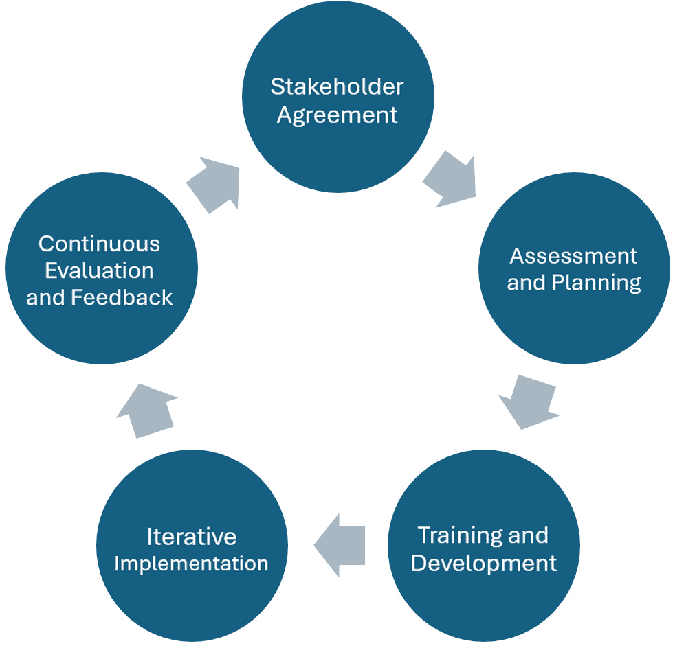
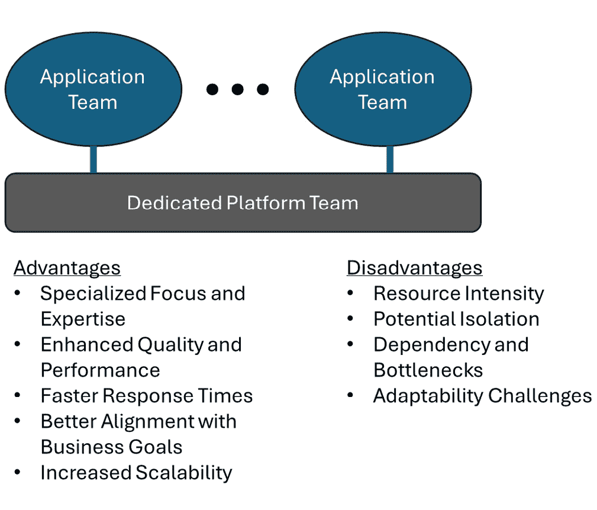
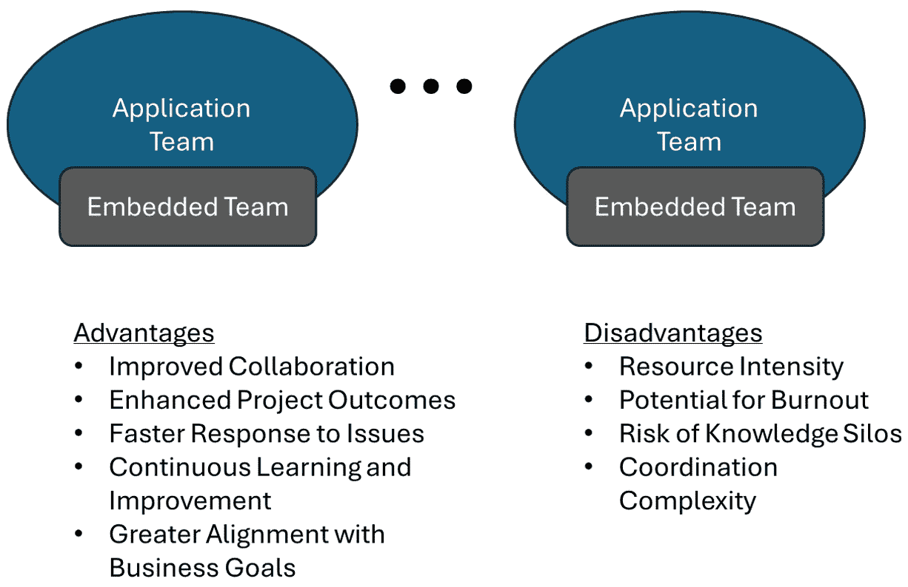
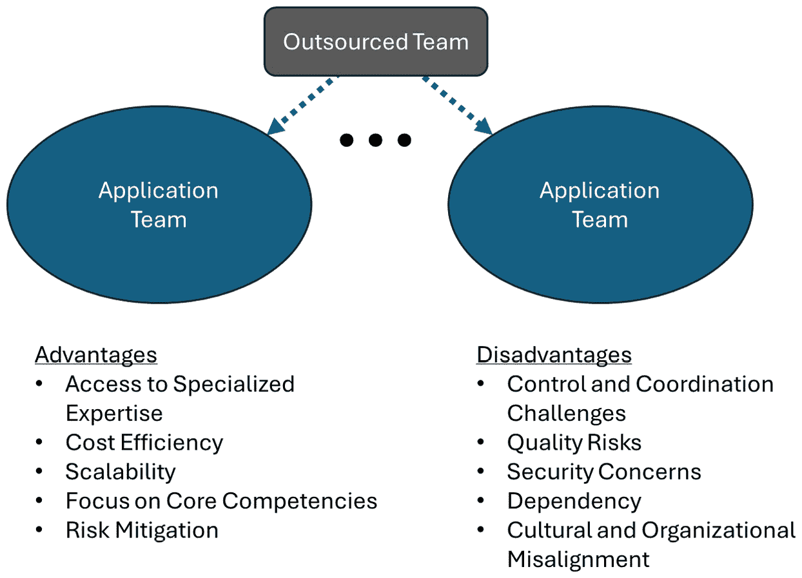
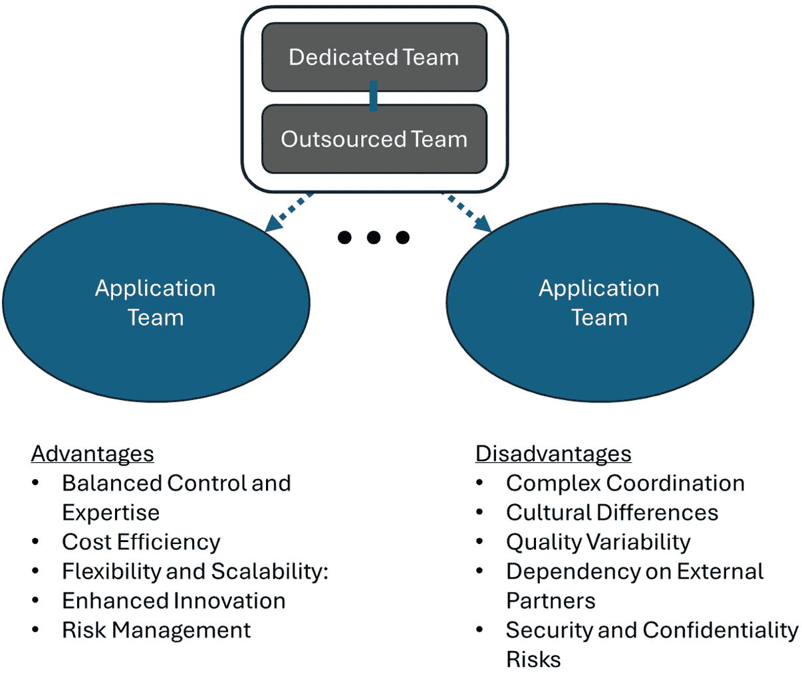
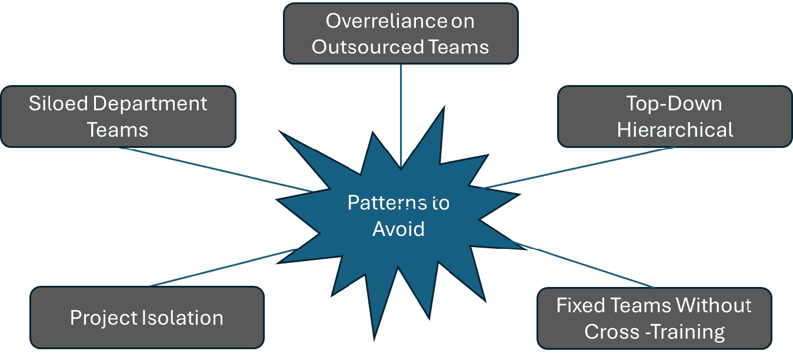
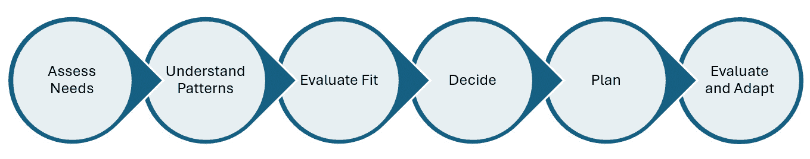

# 第十一章：理解转型实施模式

随着组织寻求精简项目和优化团队结构，选择有效的实施模式变得至关重要。 本章深入探讨了实施模式，它是经过验证的结构化方法，旨在提高战略路线图的部署和成功，特别是对于那些希望提高持续测试、质量、安全性和反馈能力的组织。 理解这些模式使项目经理和团队负责人能够掌握选择最适合其具体目标和挑战的策略的知识。 我们将在本章中探讨什么是实施模式，并详细介绍四种不同且成功的模式。 在深入探讨这些模式时，我们还将讨论哪些策略在历史上未曾成功以及为何这些模式应当避免。 最后，我们将提供有关选择最合适的实施模式的指导，帮助您将实际标准和考虑因素应用于决策过程。

本章结束时，您不仅能够识别和理解各种实施模式，还将具备选择和有效应用这些模式的技能，以确保在组织环境中更强大、更成功的 路线图实施。

在本章中，我们将涵盖以下 主要主题：

+   什么是转型 实施模式？

+   理解转型 实施模式

+   实施过程中需要避免的 模式

+   选择一个 实施模式

让我们 开始吧！

# 什么是转型实施模式？

我们将从 定义实施模式的确切含义以及它为何对成功的项目执行至关重要开始。 实施模式可以视为一种蓝图或公式，遵循它可以显著提高顺利、高效地实现项目目标的可能性。 这一基础知识为深入了解每个模式的具体特点 和优点奠定了基础。

转型实施模式是一种结构化方法，组织用它从当前的操作方法演变到更先进的状态，特别是在持续测试、质量、安全和反馈等领域。 这些模式作为详细的指南或框架，旨在帮助组织系统地改进其流程和工具，从而提高整体效率和性能。 这些模式的目标不仅仅是实施新工具或新实践，而是从根本上改变团队的协作和运作方式，确保持续改进成为 组织文化的核心部分。

转型实施模式的本质在于其结构化的变革方法。 它将转型过程分解为可管理、可执行的步骤，提供了一条清晰的路线图，组织可以按照该路线图进行操作。 这一点在处理复杂领域（如持续测试和安全）时尤为重要，因为这些领域涉及多个变量，包括技术集成、流程更新和人员培训，这些变量必须和谐统一。 通过遵循转型实施模式，组织能够以系统化的方式应对这些挑战，降低风险，避免常见的陷阱，这些陷阱可能会阻碍 他们的进展。

## 有效实施模式的关键组成部分

一种有效的 转型实施模式通常包括几个关键组件，如下所示 *图 11**.1*。

图 11.1 – 转型实施模式的组成部分

让我们来看一看 具体内容： 。

1.  **利益相关者协议**：成功的转型需要获得组织各级的支持。 这一组件专注于与利益相关者进行沟通，解释转型的好处，解决疑虑，并收集反馈。 有效的利益相关者参与确保转型与商业目标对齐，并获得 广泛的支持。

1.  **评估与规划**：此阶段涉及对组织当前的测试、质量、安全和反馈机制进行全面评估。 评估结果将用于制定详细的计划，明确转型的具体目标和实现这些目标所需的步骤。 。

1.  **培训与发展**：随着流程和工具的更新，员工不仅要接受新系统的培训，还要学习持续改进的原则。 这种培训确保团队成员能够有效使用新工具和新方法，并为持续的 流程优化做出贡献。

1.  **迭代实现**：与其一次性尝试全面改革系统，不如采用迭代方法，这也是最佳的实现模式。 这种方法使组织能够在小范围内测试新方法，根据现实反馈进行改进，并逐步将成功的做法扩展到整个 组织。

1.  **持续评估与反馈**：任何实现模式的重要组成部分就是持续评估转型进展情况。 这包括定期检查、指标分析和反馈会议，帮助团队了解哪些措施有效，哪些 需要调整。

虽然所有转型 模式都包含类似的组成部分，如本节所述，但不同的模式适用于不同的组织和产品。 下一节将描述如何选择适合特定组织的最佳模式。

## 选择正确的模式

选择正确的 转型实现模式至关重要，因为每个组织都有独特的挑战、目标和资源。 有些模式可能更侧重于技术集成，而其他模式则可能优先考虑文化变革或流程再造。 选择模式应基于对组织特定需求的深入分析，并考虑该模式在类似环境中的 proven 效果。 有效性。

例如，拥有强大 IT 基础设施但流程纪律薄弱的组织，可能更适合采用强调流程标准化和培训的模式。 相反，一个拥有强大运营流程但技术过时的公司，可能更需要关注 技术转型的模式。

### 选择正确模式的重要性

转型倡议的最终结果可能会因选择的实施模式而有显著差异。 选择正确的模式可以带来更顺畅的转型、更高的团队采纳率，以及测试、质量、安全和反馈机制的更大改善。 另一方面，选择不匹配的模式可能导致资源浪费、士气低落以及有限的改进，可能使组织的状况与之前无异，甚至可能变得更糟。

因此，考虑组织当前的能力、转型的具体目标以及可用模式的验证效果至关重要。 通过谨慎选择和实施，组织可以实现更高水平的运营成熟度，确保它们更好地应对日益复杂和快速发展的 商业环境。

# 理解转型实施模式

本章的后续部分将专门探讨四种有效的 实施模式。

## 专注平台团队

该 **专注平台团队** 结构 强调 拥有一个专注于平台开发和维护的集中的团队所带来的好处。

一个 专注平台团队，如 *图 11**.2*所示，由软件开发、测试、安全和运维领域的专家组成，负责平台基础设施的持续改进。

图 11.2 – 专注平台团队结构

该团队负责新技术的集成、现有流程的优化以及平台的整体维护和提升。 通过专注于平台，团队可以确保平台不仅满足当前组织的需求，而且足够可扩展和强大，能够支持 未来的需求。

团队通常与其他部门密切协调，以收集需求和反馈，确保平台在不断发展的过程中始终与更广泛的组织目标保持一致。 团队的活动可能包括自动化测试过程、加强 数据安全 措施、实施先进的分析以实现更好的反馈循环，并确保平台与各种工具 和技术兼容。

### 优点

+   **专注和专业知识**：拥有一个完全专注于平台的团队确保了高水平的专业知识，这能够带来更具创新性的解决方案和 先进的实施。

+   **提升的质量和性能**：团队专注于平台，可以导致更高的质量和性能，因为持续的改进和优化得以 系统性地实施。

+   **更快的响应时间**：团队的专门性质使得能更快地响应与技术相关的问题，减少停机时间，并提高整体的 运营效率。

+   **与业务目标的更好对齐**：专门的团队可以更有效地将平台开发与战略性业务目标对齐，确保技术在 各个层面支持组织需求。

+   **可扩展性提高**：随着组织的发展，平台能够扩展以适应新的需求，而不会干扰其他流程，这要归功于专门平台团队的集中努力。 平台团队。

### 缺点

+   **资源密集型**：组建和 维持一个专门的团队需要大量资源，包括人员和预算。 小型组织可能会发现 这具有挑战性。

+   **潜在的孤立**：有风险，专门的团队可能会与组织的其他部分脱节，导致理解和 目标不一致。

+   **依赖性和瓶颈**：其他部门可能会过度依赖专门的团队，如果团队因工作量过大或优先事项与即时 业务需求不完全对接，可能会造成瓶颈。

+   **适应性挑战**：平台可能会发展得过于专门化并与当前实践高度契合，以至于它对市场上引入的新技术或流程的适应性变差。 市场。

专门平台团队模式对于需要持续关注和专业知识的组织，尤其是在测试和运营需求复杂的情况下，具有特别的优势。 虽然它确实涉及 大量的投资和协调，但拥有一个强大、维护良好并持续发展的平台，其带来的好处可能远远超过其弊端。 然而，对于考虑采用这种模式的组织来说， 在专门平台团队与其他部门之间实施强有力的沟通渠道至关重要，以避免孤立，并确保平台始终与组织的整体战略目标保持一致。 组织的战略目标。

## 嵌入式团队

**嵌入式团队** 探索 同时运行多个团队的动态 和成果，每个团队负责项目的不同部分，但所有团队都朝着一个 统一的目标 努力。

嵌入式团队转型实施模式，如 *图 11**.3*所示，代表了一种战略方法，旨在将专门的技能和能力直接整合到运营团队中，促进敏捷性、增强协作，并在测试、质量、安全性和反馈流程的持续改进背景下，立即应用专业知识。 这一模式在动态环境中越来越受到青睐，其中快速适应和不同职能之间的紧密合作 至关重要。

图 11.3 – 嵌入式团队转型实施模式

嵌入式团队由专门的专业人员（如质量保证工程师、安全专家和反馈分析师）组成，他们直接融入功能性项目团队，而不是被划分到单独的部门中。 这些专家与开发人员、项目经理和运营人员一起，贯穿整个项目生命周期。 这种安排的主要目标是促进跨学科的项目挑战解决方法，确保测试、质量和安全的专业知识不仅仅是事后考虑，而是持续且不可或缺的 开发过程的一部分。

这种模式在采用敏捷方法论的组织中尤其有效， 因为开发和迭代速度非常快。 嵌入式专家可以立即将其技能应用于当前任务，确保从项目开始时就遵循最佳实践。

### 优势

+   **协作改善**：将专家嵌入团队内部促进了协作和知识共享的文化。 这种设置有助于打破部门之间的壁垒，促进更顺畅的沟通和 更快速的决策。

+   **增强项目成果**：随着质量、安全性和反馈专家的加入，项目从一开始就能享有高标准，减少了昂贵的返工或部署后安全性 漏洞的可能性。

+   **更快速的响应问题**：立即获得专业知识使团队能够迅速识别和解决潜在问题，防止问题升级，从而提升项目管理过程的整体敏捷性。 管理过程。

+   **持续学习和改进**：专家与其他团队成员的持续互动提升了整个团队的学习曲线。 非专家能够更好地理解质量、安全性和反馈方面的考虑，扩展了他们的 技能范围。

+   **与业务目标的更大契合**：由于专家是核心项目团队的一部分，他们更能将战略行动与整体业务目标对齐，确保所有努力直接有助于 组织目标。

### 劣势

+   **资源密集型**：保持每个项目团队内部的高水平专业知识可能需要大量资源。 较小的组织可能会面临缺乏足够专家来覆盖 所有团队的困难。

+   **倦怠的潜在风险**：嵌入多个团队或项目的专家可能面临时间和专业知识的高需求，从而导致倦怠和 效率降低。

+   **知识孤岛的风险**：尽管该模型旨在整合知识，但仍然存在嵌入式专家成为专业知识的守门人而非传播者的风险，这可能导致团队内部出现新的孤岛。 孤岛现象。

+   **协调复杂性**：在多个项目中管理多个嵌入式专家可能会导致协调问题，尤其是在大型组织中，存在众多 进行中的 项目。

嵌入式团队模式为将专业知识直接融入项目团队提供了一个强有力的框架，促进了合作环境的形成，并能立即应用关键技能。 这种模式在重视敏捷性和快速迭代的环境中尤其有效，例如使用敏捷方法的环境。 然而，这种方法需要谨慎管理，以避免资源过度扩展，并确保紧密整合的优势不会转化为新的 挑战。 考虑这种模式的组织应权衡增强合作和项目成果的优势，与资源管理和 专家疲劳的潜在挑战。

## 外包团队

第三种模式 是 **外包团队**，该模式利用外部专业知识和资源来加速 项目完成。

外包团队转型实施模式，如图所示，*图 11**.4*，是一种将某些职能或项目委托给外部组织或团队，而不是内部处理的方法。 这种模式通常在需要特定专业知识或在利用外部资源可能更加具备成本效益的情况下采用。 在增强组织在持续测试、质量、安全性和反馈方面的能力的背景下，外包团队可以通过带来新的见解和专业技能提供战略优势，这些技能在内部可能无法获得。

图 11.4 – 外包团队转型实施模式

外包团队通常由第三方服务提供商或顾问组成，他们被聘请负责管理和执行项目或运营职能中的特定任务。 这可能包括软件测试、网络安全措施、质量保证以及收集和分析用户反馈。 根据组织的需求，这种安排可以设定为临时的项目合同或长期的服务协议。

组织选择这种模式是为了利用供应商的专业知识，这些供应商在各自的领域中处于领先地位，并卸载非核心活动，使内部团队能够专注于战略 目标。 这些 外包团队与内部团队并行工作，通常由项目经理或协调员监督，确保所交付的服务符合组织的标准 和期望。

### 优势

+   **访问专业知识**：外包 让组织能够接触到一群 能够提供高水平技能和知识的专家，这些知识或技能在内部缺乏，或者在经济上不具备开发的可行性。 

+   **成本效益**：外包团队在短期项目或高度专业化任务中，往往比雇佣全职员工或为现有员工投入大量培训更具成本效益。   

+   **可扩展性**：外包团队可以根据业务当前的需求进行扩展或缩减，提供了特别在需求波动的环境中 具有价值的灵活性。

+   **专注于核心竞争力**：通过外包非核心活动，组织可以将资源和精力集中在那些提供最大战略价值和 竞争优势的领域。

+   **风险缓解**：利用经验丰富的外包团队可以帮助缓解风险，尤其是在 IT 安全等复杂领域，因为错误的代价可能 非常高。 

### 劣势

+   **控制和协调挑战**：管理外包团队，特别是那些位于不同的时区或有不同文化背景的团队，可能会导致沟通 和协调方面的挑战。 

+   **质量风险**：根据外包提供商的承诺和能力，可能会存在与工作质量相关的风险，这可能导致额外的监督和 管理成本。

+   **安全问题**：与外包团队共享敏感信息或关键基础设施组件可能带来安全风险，特别是当外包公司没有严格遵守 安全协议时。

+   **依赖性**：过度依赖外包团队可能会导致依赖性问题，如果外包关系突然结束，或者服务提供商的 情况发生变化，可能会带来问题。

+   **文化和组织的不一致性**：雇佣公司与外包服务提供商之间的工作文化和组织目标的差异，可能导致误解和 产出不一致。

外包团队模式为那些希望提升特定领域能力的组织提供了一个实用的方案，无需在内部开发这些能力。 它提供了对专业技能的访问、潜在的成本节省和灵活性。 然而，这种模式的成功在很大程度上取决于外包伙伴的选择，以及合同协议和管理监督的强度。 选择正确的模式需要仔细评估组织的需求、风险和战略目标。 当外包得当时，它可以成为组织转型战略的重要组成部分，特别是在快速高效地扩展操作，如持续测试、质量 和安全性等领域。

## 混合专属/外包团队

第四种也是最后一种 模式， **混合专属/外包团队**结合了 专属内部团队与外包支持的元素，以平衡控制、创新、 以及可扩展性。

混合专属/外包团队转型实施模式，如图 *11**.5*所示，融合了内部专业知识与外部资源的优势，以促进全面的项目管理与执行方法。 该模式在不断测试、质量保证、安全性和客户反馈等复杂领域日益流行，尤其是在那些力求提升能力，同时管理成本并保持对 关键流程控制的组织中。

图 11.5 – 混合专属/外包团队转型实施模式

混合专职/外包团队由核心内部成员组成，他们与外部专家紧密合作，以满足特定项目要求。 内部团队通常由具备关键组织知识和技能的员工组成，并与公司文化和长期目标保持一致。 该团队由外部专家补充，外部专家提供的专业技能、创新技术或成本效益可能是 内部无法获得的。

这一模式使组织能够保持一支强大的专职员工队伍，同时根据需要战略性地利用 外部 资源来提升产能或能力。 它有效地平衡了专职团队的控制和熟悉度，以及 外包服务的可扩展性和专业化。

### 优点

+   **平衡控制和专业知识**：这种模式在通过 专职团队保持对关键流程的控制和通过 外包合作伙伴获取专业技能和新技术之间提供了平衡。

+   **成本效益**：通过外包非核心或高度专业化的任务，组织可以优化成本，而不影响工作质量或内部团队的战略重点。 

+   **灵活性和可扩展性**：混合模型使组织能够根据项目需求灵活地扩大或缩小运营规模，而无需长期承诺雇佣全职员工或承担完全外包 关键职能的风险。

+   **增强创新**：接触外部专家可以带来新的视角和创新的解决方案，这些可能是组织内部无法产生的，从而促进创造力 和问题解决。

+   **风险管理**：将任务分配给专职团队和外包团队有助于降低风险。 如果外包提供商未能交付，内部团队可以介入管理或解决问题，确保持续性 和稳定性。

### 缺点

+   **复杂的协调**：管理一个混合团队需要强有力的协调和沟通策略，以确保内部和外部团队成员达成一致并 协同工作。

+   **文化差异**：将外部资源与内部团队整合可能会导致工作文化上的冲突，这可能会影响团队的动态和项目结果。

+   **质量可变性**：外包可以带来专业技能，但也可能导致质量的可变性，这取决于外部供应商的标准以及内部团队提供的监督。

+   **依赖外部合作伙伴**：过度依赖外部供应商，特别是对于专业技能的依赖，可能会带来风险，特别是在外包关系被中断时。

+   **安全性和保密性风险**：共享敏感信息并授予访问内部系统的权限可能会使组织面临更高的安全性和保密性风险。

混合专用/外包团队模式为那些希望提升运营能力，同时在关键过程中保持战略控制的组织提供了务实的解决方案。它结合了专用团队的深度和外包的广度，提供了灵活性、成本效益以及对专业技能的访问。然而，这种模式的成功在很大程度上取决于有效的整合策略、强有力的管理实践以及谨慎选择外包合作伙伴。

总结来说，虽然某些实施模式比其他模式更为理想，但选择正确模式的重要性不容忽视。它确保了组织的转型不仅高效进行，而且能够有效地与组织的更广泛目标对接并支持这些目标。

# 在实施过程中需要避免的模式

在提升组织能力的过程中，特别是在持续测试、质量、安全性和反馈等领域，如**图 11.6**所示，某些实施模式已被证明持续效果较差，甚至有害。识别并避免这些不利的实施模式，与采纳有效模式同样重要。

图 11.6 – 需要避免的模式

以下是一些常见的模式以及它们的缺点的详细解释：

+   **孤岛式部门团队**：孤岛式的部门团队独立运作，部门间互动和沟通很少。 每个部门仅专注于自己的职能，未将活动与更广泛的组织目标相结合。 其缺点如下：

    +   **沟通不足**：部门之间的孤岛现象会造成沟通障碍，导致各部门目标不一致。 这会妨碍信息流动，影响 有效的决策制定。

    +   **低效**：可能会出现重复工作和重新发明其他部门已经开发过的解决方案，导致低效和 资源浪费。

    +   **响应延迟**：当出现需要跨部门合作的问题时，响应可能会迟缓且繁琐，影响组织整体的敏捷性。

+   **过度依赖外包团队**：这种现象出现在组织过度依赖外部实体处理关键职能和流程，而未保持足够的 内部专业知识。 其缺点如下：

    +   **失去控制**：过度依赖外包团队可能导致对关键业务流程失去控制，进而可能削弱组织做出 敏捷决策的能力。

    +   **知识流失**：组织可能会失去内部的能力和制度化知识。 长期来看，尤其是在外包合约结束时，这可能会带来严重后果。

    +   **安全风险**：将敏感数据和流程委托给第三方提供商会增加数据泄露和 安全漏洞的风险。

+   **自上而下的等级式实施**：这种模式的特点是决策和实施流程自组织高层向下流动，缺乏来自低层员工的充分意见或参与。 其缺点如下：

    +   **抗拒变革**：从上而下强行施行变革而不考虑执行者的参与，往往会遭遇抗拒，进而降低 实施效果。

    +   **缺乏创新**：低层员工通常更接近日常运营，可能会有创新的想法，但因为缺乏向上沟通的机制而被忽视。 在自上而下的组织结构中，可能会存在提出新想法的恐惧。 在自上而下的组织结构中，提出新想法可能会存在恐惧。

    +   **适应性缓慢**：自上而下的方法的僵化可能会阻碍组织迅速适应市场变化或 内部 挑战。

+   **固定团队且无交叉培训**：这种模式下的团队在固定角色中工作，承担特定任务， 几乎没有任何交叉培训成员的努力，尤其是在团队内其他职能或角色的培训方面。 其缺点如下： 缺点如下： 缺点如下：

    +   **脆弱性**：缺乏交叉培训可能导致脆弱性，尤其是当关键团队成员不可用时，其他人无法有效地代替 他们的角色。

    +   **团队灵活性下降**：团队技能的缺乏多样性可能限制团队适应新挑战或项目范围变化的能力。

    +   **技能发展的停滞**：如果员工被限制在单一角色或任务范围内，可能会觉得自己的成长和学习受到压制，从而导致工作满意度下降和 员工流失率上升。

+   **项目孤立**：在这种模式下，项目彼此独立管理，未共享经验、资源或协同效应 。其缺点如下： 缺点如下：

    +   **重复造轮子**：每个项目团队可能最终会解决已经被其他人处理过的问题，浪费时间 和资源。

    +   **错失协同效应机会**：孤立的项目无法利用组织的集体知识和资源，错失潜在的效率提升。 这可能导致瓶颈，限制组织的能力和流动性。 这可能导致瓶颈，限制组织的容量和流动性。

    +   **标准和质量的不一致**：缺乏统一的方法，不同项目可能采用不同的标准和实践，导致组织内 的质量和表现不一致。 导致组织内的质量和绩效不一致。

避免这些不利的实施模式对于构建一个有韧性和适应性的组织至关重要。 通过促进开放的沟通，保持平衡的外包策略，鼓励跨职能团队合作，并推动项目之间的整合，组织可以提高其运营效率，并能更快速地适应新的挑战和机遇。 这些模式突出了战略决策在组织变革中的重要性，强调了需要仔细设计和管理决定团队和项目结构及执行方式的流程。 并加以执行。

# 选择实施模式

选择正确的实施模式对于旨在提高运营能力的组织至关重要，特别是在持续测试、质量、安全性和反馈流程的领域。 该过程如图 *11**.7*所示，涉及对组织需求、现有能力和 战略目标的仔细考虑。

图 11.7 – 选择实施模式

以下是一个详细的推荐过程，旨在指导组织选择与其特定情况和目标相一致的有效实施模式：

1.  **评估组织需求** **和能力**：

    +   **客观评估**：从 对组织当前状态的全面评估开始。 这包括评估现有的流程、资源和 技术。 识别 **优势、劣势、机会和威胁** (**SWOT** 分析) 以了解组织的现状以及它需要改进的地方。

    +   **识别目标**：清晰定义组织在变革过程中希望实现的目标。 目标应当是 **具体、可衡量、可实现、相关且有时限** (**SMART**)。 这可能包括加快发布周期、提高产品质量、增强安全措施或优化 反馈机制。

    +   **技能和资源清单**：列出可用的技能和资源。 这有助于确定组织是否具备所需的内部能力，或是否需要寻求外部支持来填补空白。

1.  **理解不同的** **实施模式**：

    +   **研究模式**：收集关于在类似组织或行业中成功的各种实施模式的详细信息。 这项研究应包括案例研究、最佳实践，甚至是从较少成功的实施中总结的经验教训。

    +   **咨询利益相关者**：与各方利益相关者进行沟通，包括 IT 人员、项目经理、部门负责人，甚至可能包括客户。 他们的见解可以为什么最适合组织提供宝贵的视角。

    +   **专家咨询**：咨询专注于组织转型的外部专家或顾问可能会很有帮助。 他们可以提供公正的建议，并分享来自各种项目的经验。  

1.  **评估适用性** **和契合度**：

    +   **与目标对齐**：将每个实施模式与组织预定义的目标相匹配。 评估每个模式在当前和未来的组织状态下，如何有效地实现这些目标。

    +   **可行性研究**：对每个潜在模式进行可行性研究。 分析实施这些模式的后勤、财务和技术方面。 此研究还应考虑每个模式的潜在风险及其缓解策略。 

    +   **试点测试**：如果可能，为最有前景的模式进行试点测试。 试点测试可以提供关于模式在组织中如何运作的实际见解，并揭示在全面推广前需要进行的调整。

1.  **决策制定**：

    +   **集体决策**：利用一个包含所有相关利益相关方代表的决策机构或委员会。 该小组可以审查可行性研究和试点测试的结果，以做出明智的决策。

    +   **使用决策矩阵**：使用决策支持工具，如决策矩阵，权衡成本、影响、风险及与战略目标的一致性等因素。 这些工具有助于做出 客观决策。

    +   **反馈循环**：在决策过程中建立反馈机制，确保所有问题和见解得到充分考虑 并加以解决。

1.  **计划实施**：

    +   **详细规划**：一旦选定了实施模式，制定详细的实施计划。 该计划应列出所有必要的步骤、时间表、资源分配， 以及责任分工。

    +   **变更管理**：制定变更管理策略以帮助管理过渡。 这应包括沟通计划、培训项目和支持结构，确保所有 相关方的顺利过渡。

    +   **风险管理**：识别与实施相关的潜在风险，并制定应对策略以减少这些风险。 这可能涉及应急计划的制定，并为处理问题设立升级路径， 以应对问题的出现。

1.  **持续监控** **与适应**：

    +   **进度监控**：定期监控实施进度，并与设定的目标和时间表进行对比。 使用 **关键绩效指标** (**KPI**) 来衡量成功并识别需要改进的领域。

    +   **迭代改进**：根据反馈和持续评估的结果，准备进行迭代改进。 这种适应性方法有助于优化实施过程，并使其更好地与 组织需求对接。

选择合适的实施模式需要一种系统化和深入的方式，考虑到组织的独特背景和目标。 通过仔细评估需求，理解现有模式，评估其契合度，并为实施做好周密规划，组织可以显著提高转型成功的机会。 这一结构化的选择过程不仅有助于选择最合适的模式，还能确保其在 组织内部的有效整合与可持续性。

# 总结

*第十一章* 提供了一个全面的实施模式探索，旨在帮助那些希望在持续测试、质量、安全性和反馈方面提升能力的组织。 本章首先定义了什么是实施模式——它本质上是一种蓝图，遵循它可以有效且高效地提高项目目标的实现可能性。 讨论强调了这些模式在确保项目成功执行中的关键作用，并为深入审视各种有效模式及那些应当避免的模式奠定了基础。

本章突出了四种主要的成功实施模式：专门的平台团队、嵌入式团队、外包团队和混合的专门/外包团队。 每种模式都进行了详细描述，提供了它们独特优势的洞见，并说明了它们如何促进组织项目的成功。 例如，本章解释了专门平台团队模式专注于平台开发的集中管理，确保高质量和高性能，而嵌入式团队则促进了项目中不同职能之间的敏捷性和紧密协作。 外包团队带来了外部专业知识和灵活性，而混合团队则结合了内部和外包资源的优势，以优化 项目执行。

本章还讨论了组织应当避免的实施模式，如孤立的部门团队、过度依赖外包团队、自上而下的层级实施、固定团队无跨部门培训以及项目孤立等。 每种模式都分析了其缺点，如低效、风险增加以及在动态商业环境中的挑战。 重点是理解这些模式为什么会妨碍进展，以及它们如何对组织的适应能力和创新能力产生负面影响。

本章提供了关于如何根据组织的具体需求、目标和资源选择最合适的实施模式的实用指导。 这一指导对决策者至关重要，确保所选择的模式能够与战略目标和运营需求良好对接。 下一章将以此为基础，探讨如何有效衡量进展和成果，确保组织能够监控实施模式的成功，并根据需要做出调整，以实现其转型目标。
