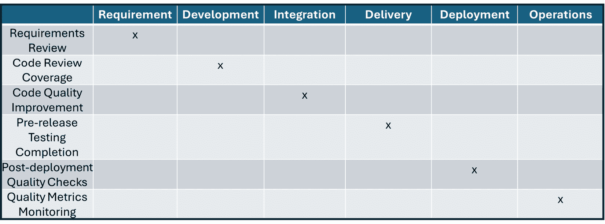

# 衡量进展和结果

本章重点介绍了在组织实施和改进其持续测试、质量、安全性和反馈能力时，测量进展和结果的重要方法和框架。 随着企业和项目变得更加复杂，能够衡量事物进展如何以及预测未来结果变得至关重要。 本章解释了如何创建、选择和使用能够准确显示进展并为管理层和 持续改进提供有用见解的衡量标准。

第一部分概述了持续测试、质量、安全性和反馈的不同类型的衡量标准。 然后，我们将讨论如何选择适用于结果和进展的正确衡量标准。 接下来，我们将进入实施这些衡量标准的部分，并探讨如何设置既能提供信息又能激励行动的指标和仪表盘。 它们不仅仅是告知 —— 它们 激励行动。

我们将通过讨论如何确保这些衡量标准在时间上保持有效，提供更新和维护它们的策略，使其在组织成长和变化时持续提供支持，来结束本章。 本章将帮助你掌握不仅能选择有效的衡量标准，还能应用和维护它们的技巧，持续为 你的工作增值。

在本章中，我们将涵盖以下 主要话题：

+   进展的衡量 和结果

+   选择衡量标准

+   设计衡量标准 和仪表盘的实践

+   持续进展的衡量 和结果

让我们 开始吧！

# 进展和结果的衡量标准

在本节中，我们 将了解什么使得一个衡量标准有效，并且如何使其与组织的目标保持一致。 通过探索不同的衡量标准，你将为后续讨论如何选择和使用 这些指标奠定坚实基础。

经历持续测试、质量、安全性和反馈的转型过程的组织，需要跟踪两种关键的衡量标准 —— *进展* 和 *结果*。这些衡量标准对于理解组织如何适应和改进其过程至关重要，并且有助于确保这些变化能积极地促进其 整体目标的实现。

*图 12**.1* 展示了这两种类型的衡量标准，以 图表形式呈现。

图 12.1 – 进展与结果指标图表

进展指标通常以燃尽图的形式表示，其中下降的趋势是可取的，因为它们表示剩余的项目单位数量。 结果指标通常以趋势线的形式表示，其中上升的趋势是可取的，因为 它们表明绩效的提高。

下一节将解释进展和结果衡量的重要性。 以及成果衡量。

## 为何进展和结果衡量重要

进展和结果衡量之所以重要，有几个原因，包括战略对齐与决策、绩效监控、展示价值以及帮助打造 学习型组织。

+   **战略对齐与决策**：了解转型项目和举措的进展有助于公司做出更好的决策，决定将资源集中在哪里。 这确保了每一项努力都为 组织的更广泛目标做出贡献。

+   **绩效监控**：组织需要定期检查是否走在正确的轨道上，以实现其目标。 进展衡量通过展示 已完成多少工作以及剩余多少工作来提供帮助。 这在更新和改进不断进行的环境中尤为重要，例如软件开发 或网络安全。

+   **展示价值**：结果指标可以告知公司所做的任何变化是否达到了预期效果。 这不仅对内部记录很重要，还能向外部利益相关者（如客户或投资者）展示公司在不断改进，值得 投资。

+   **组织学习**：这两类衡量指标提供了宝贵的反馈。 这些反馈帮助公司从成功与失败中吸取教训，进而进行更好的规划和更有效的风险管理 。

接下来，我们将解释如何将绩效和进展衡量与 组织的能力成熟度挂钩。

## 将衡量标准与能力成熟度联系起来

组织中的能力成熟度概念，如在*第四章*中所述，关系到其持续交付预期结果的能力。进度和结果措施是这一点的重要组成部分，因为它们帮助组织了解当前的成熟度水平，如在*第四章*中所描述，并识别改进领域。例如，随着组织的成熟，它应当看到来自其流程的更可预测和积极的结果，这些结果应在其跟踪的措施中有所体现。随着时间推移跟踪这些措施，可以显示组织能力成熟度的演变。*图 12* **.2** 描述了进度和结果措施的重要因素及利益相关者。

图 12.2 – 测量对利益相关者的重要性

以下内容解释了为什么这些措施对于各方利益相关者至关重要：

+   **业务经理**：这些经理查看结果措施，以了解变革是否对企业的底线产生积极影响。他们使用进度措施来确保战略项目按计划进行。

+   **技术经理和开发人员**：他们依赖进度措施来规划和调整工作负载和时间表。结果措施帮助他们了解技术解决方案是否有效地解决了他们需要解决的问题。

+   **质量保证（QA）工程师**：QA 团队使用这些措施来跟踪和改进测试流程。他们需要知道产品质量是否符合设定标准，而这直接与结果措施相关。

+   **安全运营人员**：对于这些团队，结果措施可能包括减少安全事件的数量等指标。进度措施帮助他们衡量安全协议和培训的实施情况。

+   **DevOps 和 SRE 工程师**：这些工程师使用两种类型的措施来优化软件的部署和运行。进度措施帮助他们监控持续交付管道，而结果措施则评估生产环境中软件的稳定性和性能。

总结来说， 进度和结果的衡量标准提供了一种结构化的方法来跟踪组织实施变更和取得成果的效果。 它们为各种利益相关者提供了至关重要的见解，帮助从业务经理到技术团队的各方做出推动组织前进的明智决策。 有效理解和利用这些衡量标准，可以带来更好的战略对齐、提升的绩效，以及能够交付一致结果的成熟能力。 成熟的交付能力。

## 结果指标示例

结果指标 是软件开发、交付和运维中的重要工具。 它们帮助团队跟踪在构建和维护软件的各个阶段的表现。 这些指标关注测试、质量、安全和反馈等领域，以确保从规划到运维的每个阶段都达到设定标准，并不断改进。 随着时间的推移不断提升。

### 所有阶段通用的结果指标

**DevOps 研究与评估**小组 创建了一套被称为 DORA 的指标，它 是四个关键绩效指标的集合，已成为衡量软件开发和运维团队效果的行业标准。

这些由 DORA 推荐的指标具有广泛适用性，并为开发过程的整体健康和效率提供了深刻见解： 开发过程的健康度：

+   **部署频率（DORA）**：计算软件部署到生产环境的频率。 软件部署频率。

+   **变更周期时间（DORA）**：衡量从代码提交到部署的时间。 代码提交到部署时间。

+   **变更失败率（DORA）**：计算失败的部署占总部署的百分比。 部署失败率。

+   **恢复平均时间（MTTR）（DORA）**：衡量从故障中恢复所需的平均时间。 失败恢复时间。

+   **可用性**：跟踪应用程序在没有问题的情况下的可用时间百分比。 无故障运行时间。

*图 12**.3* 展示了结果指标在价值流的每个阶段都有应用。 每个阶段的价值流。

图 12.3 – 所有阶段通用的结果指标

DORA 指标的重要性 DORA 指标的重要性

DORA 指标 很重要，因为它们 提供了一个客观的结果衡量标准，包括 DevOps 性能指标、改进基准和与业务目标的对接， 如下所示：

+   **DevOps 性能的客观衡量**：DORA 指标提供了定量数据，组织可以用来客观评估其 DevOps 实践的表现。 这些指标在各类组织中得到了验证，并显示出与更高的软件交付表现和 组织表现的相关性。

+   **改进基准**：通过基于这些指标建立基准，组织可以评估当前的表现，并识别需要改进的领域。 这将有助于更有针对性地投资于技术、流程和培训，最终提升开发 和 运营实践的效率与效果。

+   **与业务目标的对接**：在 DORA 指标上表现优秀通常与更高的组织效率、更好的产品质量、更快的市场发布速度以及更高的客户满意度相关。 这些方面对于实现更广泛的业务目标至关重要，如增长、盈利能力和 竞争优势。

DORA 指标在软件价值 流阶段

DORA 指标，经过 一些调整后，可以应用于整个端到端价值流和价值流中的每个阶段， 如下所示：

+   **需求阶段**：虽然 DORA 指标通常与软件开发生命周期中的部署阶段更为对接，但它们通过确保后续流程的流畅和高效，间接影响需求阶段，从而实现更快速、更可靠的需求变更 和部署。

+   **开发和持续集成阶段**：如前所述，DORA 指标通常与软件开发生命周期中的部署阶段更为对接。 通过一些逻辑调整，DORA 指标可以用于衡量开发和持续集成阶段的效果，例如 以下内容：

    +   **变更的提前时间** 反映了开发过程的效率，包括代码更改的集成、测试和准备 发布的速度。

    +   **部署频率** 在这些阶段中可以指示 CI/CD 管道的健康状况，显示持续测试实践的成熟度，以及集成和潜在发布的频率，即使它们仅限于预发布环境而非生产环境。

+   **持续交付与** **部署阶段**：

    +   **部署频率** 直接衡量部署发生的频率，这在这些阶段至关重要。

    +   **变更失败率** 提供了 SDLC（软件开发生命周期）实践和部署过程的成熟度与质量的洞察，表明部署导致需要快速修复的操作中断的频率。

    +   MTTR（平均修复时间）在这里至关重要，因为它显示了团队在代码部署到生产环境或 预发布环境后迅速解决问题的能力。

+   **运营阶段**：

    +   MTTR 在运营阶段表现突出，通过衡量操作弹性和在事件发生后迅速恢复服务的能力。

    +   **变更失败率** 还帮助评估生产环境的稳定性，因为频繁的失败可能表明来自价值流早期阶段的系统性问题。

通过提供这些关键方面的清晰图景，DORA 指标帮助组织不仅衡量结果，还理解价值在整个软件开发生命周期中的流动。 它们使团队能够对实践进行迭代和改进，推动与技术和 业务结果一致的持续改进周期。

### 持续测试结果指标

持续测试确保 软件的每个部分在开发的每个阶段都经过测试，以便尽早发现并修复问题。 这些指标的示例在 *图 12**.4* 中说明，并按以下方式描述：

图 12.4 – 按阶段划分的持续测试结果指标

+   **需求阶段**： *测试用例创建速度* – 衡量为新需求创建测试用例的速度。

+   **开发阶段**： *代码覆盖率* – 计算自动化测试覆盖的代码库百分比。

+   **CI 阶段**： *构建通过率* – 跟踪通过所有测试的构建百分比。

+   **连续交付阶段**： *测试自动化率* – 衡量自动化测试的比例。

+   **连续部署阶段**： *部署健康检查* – 基于自动化的部署后健康检查评估部署的成功。

+   **连续运维阶段**： *部署后测试速度* – 衡量部署后测试的执行速度和结果返回的速度。

如您 从 *图 12**.4*中所见，某些连续测试指标最适合在软件价值流的特定阶段应用。 在下一部分，我们将看到这一点同样适用于连续 质量指标。

### 连续质量结果指标

如 *图 12**.5*所示，连续质量指标专注于在 软件的生命周期中维持高标准。

图 12.5 – 按阶段划分的连续质量结果指标

+   **需求阶段**： *需求清晰度指数* – 评估项目需求的清晰度和可理解性。

+   **开发阶段**： *缺陷发现率* – 跟踪开发过程中发现缺陷的速度。

+   **连续集成阶段**： *集成错误率* – 衡量集成阶段期间错误的发生频率。

+   **连续交付阶段**： *发布质量评分* – 根据预定义标准评估软件发布的质量。

+   **连续部署阶段**： *用户体验评分* – 跟踪部署后影响用户体验的活动。

+   **持续运营阶段**： *系统停机时间* – 衡量由于质量问题导致的系统非操作时间总时长。

正如您所看到的，在每个价值流阶段有一个持续质量指标是一种良好的做法。 持续安全指标同样适用。

### 持续安全结果指标

安全指标，如 *图 12**.6*所示，确保在每个阶段，软件都能抵御威胁。

图 12.6 – 各阶段的持续安全结果指标

+   **需求阶段**： *安全需求完成度* – 跟踪安全需求在 规划阶段的完成情况。

+   **开发阶段**： *每行代码的漏洞数量* – 衡量与代码库规模相关的安全漏洞数量。

+   **持续集成阶段**： *安全扫描通过率* – 衡量在集成过程中常规安全扫描的通过百分比。

+   **持续交付阶段**： *关键安全问题率* – 跟踪交付前发现的关键安全问题的比例。

+   **持续部署阶段**： *安全事件响应时间* – 衡量在部署后处理安全事件的速度。

+   **持续运营阶段**： *持续安全合规率* – 衡量持续符合安全标准 和规定的程度。

如本节所述，推荐在每个 价值流阶段 使用持续安全指标。 下一节将展示这同样适用于持续 反馈指标。

### 持续反馈结果指标

反馈指标，如 *图 12**.7*所示，用于评估组织在整个 开发过程中，收集和实施用户反馈的效果。

图 12.7 – 按阶段划分的持续反馈结果指标

+   **需求阶段**: *反馈整合效果* – 衡量用户反馈在需求中整合的效果。

+   **开发阶段**: *开发者对反馈的响应时间* – 跟踪开发者在开发过程中，如何迅速回应反馈。

+   **持续集成阶段**: *反馈解决率* – 衡量在集成过程中，反馈问题的解决率。

+   **持续交付阶段**: *反馈影响得分* – 评估实施反馈后对软件质量的影响。

+   **持续部署阶段**: *部署后的客户满意度* – 衡量在部署新功能或修复后，客户的满意度水平 。

+   **持续运营阶段**: *长期反馈趋势* – 分析用户反馈在运营阶段的趋势，以指导 未来的改进。

总体而言，结果指标 帮助团队从头到尾监控并提升软件的效率、安全性和质量，确保价值流的每个阶段都能被衡量，并能够优化以满足用户需求和 商业目标。

## 进度指标示例

进度指标 对于跟踪转型和软件开发项目的进展至关重要。 它们 帮助团队在软件生命周期的不同阶段，监控其工作的效率和效果。 这些指标特别设计用于衡量项目在测试、质量、安全性等方面，如何按照计划的时间表、目标和基准进行推进。 以及反馈。

### 所有阶段的常见进度指标

进度指标 在软件开发中扮演着至关重要的角色，为团队提供实时的项目进展和效率洞察。 这些指标帮助跟踪软件生命周期各个阶段的进展，包括测试、质量、安全性和反馈，确保项目能够按时完成并达到 既定的基准。

这些指标，包括关键流程指标（如在 *图 12**.8*中所示），帮助团队监控整体项目健康状况和进展，确保时间表和生产力目标 得到实现。

图 12.8 – 价值流各阶段相关的进度指标

以下是一些有用的进度指标和 可视化工具示例：

+   **冲刺燃尽图**：显示冲刺中的剩余工作与时间的关系，指示团队是否 按计划进行。

+   **发布燃尽图**：衡量与发布计划时间线相比，剩余工作的量。

+   **累积流量图（流程指标）**：可视化不同开发阶段中的工作量，帮助识别瓶颈并理解工作平衡和流动情况。 通过系统实现这一目标。

+   **速度**：评估团队在一次冲刺中完成的工作量，这对于未来的 冲刺规划非常有用。

+   **进行中的工作（WIP）限制（流程指标）**：设置任何时刻可以进行的最大任务数量，帮助团队管理工作负载并 减少瓶颈。

+   **周期时间（流程指标）**：衡量工作从开始到完成所需的时间，提供有关 过程效率的洞察。

流程指标是用来衡量工作项在软件开发生命周期中各个阶段流动的关键指标。 这些指标侧重于软件交付过程的效率、效果和可预测性。

### 流程指标的重要性

流程指标 帮助组织了解工作如何从初步构想到交付阶段进行，以一种可衡量和 可操作的方式：

+   **增强可见性**：流程指标提供了当前工作过程状态的清晰可见性。 通过跟踪工作项的进展，团队可以识别瓶颈或延迟发生的地方，并了解其 根本原因。

+   **提高效率**：通过流程指标获得的洞察，组织可以简化流程、消除低效环节，并优化资源分配。 这将有助于更快速的开发周期和更高效地使用时间 与资源。

+   **提高可预测性**: 流程指标使团队能够根据历史数据预测未来表现。 这种可预测性有助于更好地计划和预测，减少在 交付时间表中的不确定性。

+   **促进持续改进**: 定期测量和分析流程指标，鼓励持续改进的文化。 团队可以根据可量化的数据逐步完善其流程，追求更精益和更 高效的工作流程。

+   **与业务目标的对齐**: 通过提高效率和可预测性，流程指标有助于确保软件交付与更广泛的业务目标对齐，如增加客户满意度、缩短上市时间和提高 产品质量。

### 在软件价值流程各阶段中流程指标的推荐应用的详细信息

以下详细介绍了在 软件 价值流程中每个阶段推荐应用流程指标的细节：

+   **需求阶段**:

    +   **工作项年龄**: 衡量一个需求在被批准之前讨论的时间长短。 这一指标有助于识别价值流程的早期阶段的延迟。

    +   **流程效率**: 活动工作时间与总经过时间的比率。 在这个阶段低效率可能表明需求定义过程中等待时间过长或者决策不明确。

+   **开发阶段**:

    +   **WIP**: 限制同时进行的任务数量，以减少上下文切换，并专注于更快地完成 任务。

    +   **周期时间**: 衡量从开发开始到完成工作所需的时间。 监控周期时间有助于识别减速因素，并提高 开发人员的生产力。

+   **CI/CD 阶段**:

    +   **吞吐量**: 跟踪在给定周期内通过 CI/CD 管道的工作项数量。 高吞吐量表示一个健康的 CI/CD 管道。

    +   **交付时间**: 从工作项启动到交付的时间。 它包括周期时间和所有形式的延迟。 在这个阶段缩短交付时间对于 更快的发布至关重要。

+   **部署与** **运维阶段**：

    +   **发布频率**：衡量新版本发布到生产环境的频率。 频繁的发布可能表明从开发到部署的流程顺畅。

    +   **MTTR**：虽然传统上是 DORA 度量指标，MTTR 在 流程度量的背景下有助于衡量团队从生产环境故障中恢复的速度，反映了 运营灵活性。

在所有阶段，流程度量的应用提供了清晰、数据驱动的视角，帮助了解任务进展、问题出现的地方以及需要改进的方面。 这种深度洞察对任何正在进行转型并致力于持续提升软件交付和运营能力的组织来说都是无价的。 通过衡量和优化软件价值流的每个阶段，组织可以实现价值流向客户的更顺畅、更快速、更可靠。

### 持续测试进度度量

持续测试中的进度度量，如 *图 12**.9*所示，跟踪测试的开发与执行，确保及时的质量评估。

图 12.9 – 持续测试进度度量

+   **需求阶段**： *测试用例准备进度* – 跟踪已准备的测试用例百分比与计划总数之比。

+   **开发阶段**： *测试执行进度* – 衡量已执行测试的百分比与计划测试的总数之比。

+   **持续集成阶段**： *构建集成进度* – 跟踪成功集成的数量与计划集成的比率。

+   **持续交付阶段**： *测试自动化进度* – 监控已自动化测试的百分比与目标的比率。

+   **持续部署阶段**： *部署进度跟踪* – 衡量部署的频率和成功率与计划的比率。

+   **持续运营阶段**： *监控系统实施进展* – 跟踪系统监控工具的实施和微调。

在这里，我们 回顾了连续测试的推荐进展指标。 在下一节中，我们将对连续质量进展指标做同样的分析。

### 连续质量进展指标

连续质量进展指标，如图所示 *图 12**.10*，专注于跟踪确保和提升产品质量的努力进展 ，贯穿产品的整个生命周期。

图 12.10 – 连续质量进展指标

+   **需求阶段**： *需求审查完成度* – 跟踪项目需求的审查和批准百分比。

+   **开发阶段**： *代码审查覆盖率* – 跟踪已审查的新代码百分比。

+   **CI 阶段**： *代码质量提升* – 衡量代码质量指标随时间的改进情况。

+   **持续交付阶段**： *发布前测试完成度* – 跟踪发布前计划测试的完成百分比。

+   **持续部署阶段**： *部署后质量检查* – 跟踪每次部署后的质量检查完成情况。

+   **持续运营阶段**： *质量指标监控* – 跟踪按照计划监控的运营质量指标百分比。

在这里，我们 回顾了跟踪连续质量进展的指标。 接下来，我们将讨论用于展示持续安全进展的指标。

### 连续安全进展指标

连续安全进展指标，如图所示 *图 12**.11*，专注于监控安全措施在整个 开发过程中整合和改进的进展。

图 12.11 – 连续安全进展指标

+   **需求阶段**: *安全计划完成度* – 衡量安全计划的完成程度。

+   **开发阶段**: *安全集成进度* – 跟踪安全功能集成到产品中的进展。

+   **持续集成阶段**: *安全测试执行* – 衡量计划的安全测试已执行的百分比。

+   **持续交付阶段**: *安全审计完成度* – 衡量交付前安全审计的完成情况。

+   **持续部署阶段**: *安全部署检查* – 跟踪部署过程中安全检查的完成情况。

+   **持续运营阶段**: *安全更新实施* – 衡量安全更新和补丁的实施率。

在这里，我们 查看了用于展示持续安全进展的度量标准。 接下来的部分将建议用于展示持续反馈进展的度量标准。

### 持续反馈进度度量

如图所示，持续反馈进度度量，如 *图 12**.12*，评估了在整个开发过程中，反馈收集和处理的效率。

图 12.12 – 持续反馈进度度量

+   **需求阶段**: *反馈收集完成度* – 跟踪计划的反馈收集活动的完成百分比。

+   **开发阶段**: *反馈实施进度* – 衡量将反馈融入 开发过程的进展。

+   **CI 阶段**: *反馈集成率* – 跟踪反馈在集成测试期间的集成速率。

+   **持续交付阶段**: *反馈审查完成度* – 衡量交付前完成的反馈审查任务的百分比。

+   **持续部署阶段**： *客户反馈分析* – 衡量部署后客户反馈分析的完成情况。

+   **持续运营阶段**： *持续反馈监控* – 跟踪用户反馈的持续监控和分析。

这些进展度量标准为团队提供了必要的工具，确保他们有效地朝着项目目标推进，从而在策略和执行上及时做出调整，以实现 预期的成果。

# 选择度量标准

在这里 我们应用所学的知识；你将看到如何区分那些仅提供信息的度量和那些能够真正改变你流程的度量。 我们将专注于确保你选择的度量标准相关、可靠，并能驱动 显著的变化。

在选择和优先排序项目或组织的成果或进展度量标准时，遵循系统化的过程至关重要，以确保所选择的度量标准能够有效衡量成功，并与业务目标保持一致。 *图 12**.13* 展示了一种推荐的方法来 实现这一目标。

图 12.13 – 选择成果和进展度量标准

以下是 选择成果和进展度量标准的推荐过程。

+   **定义业务和项目目标**：首先要清晰地定义业务目标。 理解组织通过其项目或流程希望实现的目标至关重要。 无论是提高客户满意度、增加软件部署频率、增强安全措施，还是降低运营成本，拥有一套清晰的目标将帮助选择 相关的度量标准。

+   **识别指标**：一旦明确了业务或项目目标，识别直接反映成功的关键指标。 这些指标应当具有可操作性，意味着它们能够指导决策并影响结果。 例如，如果目标是提高客户满意度，一个可能的关键绩效指标（KPI）可以是 **净推荐值** （**NPS**）。 本章早些时候描述的指标为你提供了包括结果和进展指标在内的建议，你可以从中进行选择。

+   **确保指标是可衡量和可达成的**：选择那些不仅与业务目标一致，而且也是可衡量和可实现的指标。 每个指标都应当有明确的衡量方法，并且基于可以一致且准确收集的数据。 避免使用模糊不清、容易被不同解读的指标，因为这可能导致结果 和决策的不一致。

+   **根据影响和相关性优先排序指标**：并非所有指标都是平等的。 一些指标对业务成果的影响比其他指标更大。 根据指标对业务目标的潜在影响以及与当前项目或策略的相关性来优先排序指标。 那些能够提供客户行为、产品表现和运营效率的洞察的指标通常优先考虑，因为它们与 业务成功直接相关。

+   **考虑利益相关者的意见**：与组织中不同部门的利益相关者进行沟通，了解他们认为哪些指标最为重要。 这不仅能确保全面的视角，还能促进整个组织的认同。 利益相关者可以提供有关指标跟踪的实际方面的见解，以及一些在 战略层面可能不明显的影响。

+   **定期审查和完善**：结果指标不应当是静态的。 随着业务目标的变化、技术的演进和市场的变动，不同指标的相关性也会有所不同。 定期审查指标，确保它们与业务目标保持一致，并根据需要进行调整。 这可能意味着要完善指标的衡量方式，或用更符合当前 商业环境的指标替换那些不再相关的指标。

通过遵循 这些步骤，组织可以有效地选择和优先考虑结果指标，这些指标不仅提供清晰的性能指示，还能推动与战略目标一致的有意义的改进。 这组指标应该是相关的 且平衡的。

## 选择结果和进展指标的领导和团队

选择 项目的结果和进展指标涉及战略决策，并应包括来自组织内部各角色的意见。 拥有一个平衡的领导团队和成员团队非常重要，以确保所选择的指标与商业目标、项目目标以及实际实施考虑因素保持一致。 以下是关于谁应该主导并参与选择这两类指标的指南： 指标的选择领导和团队

+   **领导层**：

    +   **项目或计划经理** 通常是主导选择结果和进展指标的前沿人物。 他们对项目的目标、范围、时间表和资源有全面的了解，这使他们能够清楚地知道哪些指标最相关，以及如何有效地实施 和跟踪这些指标。

+   **团队** **成员参与**：

    +   **执行赞助人**：他们的参与确保所选指标与组织的战略目标保持一致。 高层管理人员可以提供必要的支持和资源，帮助将这些指标整合进更广泛的业务 绩效评估中。

    +   **商业分析师**：这些专业人员帮助将商业目标转化为可衡量的指标。 他们确保结果和进展指标能够反映项目应为 业务带来的价值和影响。

    +   **技术负责人和架构师**：对于技术驱动的项目，他们的技术专长在确定捕捉特定指标的可行性方面至关重要。 他们可以就跟踪这些 指标所需的工具和系统提供建议。

    +   **质量保证经理**：参与质量保证经理对于定义与产品或服务质量相关的指标至关重要。 他们有助于选择进展指标 来监控持续的质量控制，以及反映最终 质量标准的结果指标。

    +   **财务代表**：他们能够提供项目成果和进展与财务目标对齐的洞察，提供可能与成本效益、 **投资回报率** (**ROI**) 和 预算遵守相关的指标。

    +   **市场营销和销售团队**：对于影响产品供应的项目，涉及这些团队有助于将指标与客户满意度、市场反应和销售业绩对齐。 这确保所选的指标将有助于衡量市场成功和 客户参与度。

    +   **运营经理**：尤其是对于影响运营的项目，这些经理确保指标能够反映运营效率、流程改进和服务 交付标准。

    +   **IT 和数据分析师**：他们的角色在定义和设置数据收集、分析和报告选定指标的系统中至关重要。 他们帮助确保数据驱动的指标准确、及时 且相关。

选择指标的协作方法有助于全面覆盖，从战略对齐到实际测量以及日常影响。 这种多元化的视角确保所选指标是全面的，并能为项目进展及其 最终成果提供有意义的洞察。

# 设计指标和仪表盘的实践

本节将为你提供有关如何有效呈现数据的实用建议，以便所有利益相关者能够快速做出 明智的决策。

为了有效地跟踪和可视化在持续测试、质量、安全性和反馈等领域的结果和进展指标，组织需要在设计这些指标及其显示仪表盘时采用深思熟虑的方法。 *图 12**.14* 展示了推荐的选择指标的过程。

图 12.14 – 设计指标和仪表盘

以下是设计这些指标的过程的详细说明，以及不同仪表盘架构的探索。

## 设计结果和进展指标

以下是 设计指标的 过程：

1.  **定义测量标准**：一旦根据战略目标选择了指标，定义具体的测量标准和标准。 这包括为每个指标设定明确的定义，数据如何收集，以及测量的频率。 例如，如果指标是“检测安全事件的时间”，则需要确定是从事件发生时开始计算，还是从系统 或人员首次注意到时开始。

1.  **建立基准和目标**：对于每个指标，建立一个反映当前绩效的基准，并设定实际的改进目标。 这为衡量进展提供了起点 并设定了一个推动行动的明确目标。 基准可以是历史数据、行业标准 或基准测试。

1.  **选择数据源和收集方法**：确定每个指标的数据收集位置和方法。 对于持续测试，数据可能来自测试工具和 CI/CD 管道；对于安全指标，数据可能来自安全监控和事件 管理系统。

1.  **实施数据收集**：确保自动数据收集所需的基础设施和工具已到位。 这可能涉及配置软件工具、设置 API，并确保数据的准确性 和一致性。

1.  **验证和完善指标**：定期审查指标，确保它们提供有价值的洞察，并根据反馈和变化的目标进行完善。 这可能涉及调整数据源、收集频率，甚至是指标 定义本身。

## 展示指标的仪表板架构

替代 仪表板架构，如在 *图 12**.14*中所示， 如下：

+   **集成开发环境（IDE）嵌入式仪表板**：对于与开发活动相关的指标，如持续测试或代码质量，可以将仪表板直接集成到 IDE 中。 这使得开发人员可以在他们的工作环境中实时查看指标，从而增强了即时性 和相关性。

+   **独立的商业智能（BI）工具**：如 Tableau、Power BI 或定制的仪表盘解决方案等工具，可以将来自多个来源的数据汇集到一个中央仪表盘中。 这些工具提供强大的数据可视化功能，并能够将来自多个领域的数据（如测试、安全性和客户反馈）合并为一个 综合概览。

+   **基于 Web 的仪表盘**：使用 Django（Python）、Flask、Angular 等框架，甚至是 JavaScript 库如 React，实现基于 Web 的仪表盘，能够提供高度可定制和易于访问的仪表盘。 这些仪表盘可以通过任何 Web 浏览器访问，为组织内各利益相关者提供灵活性和集中访问。

+   **实时监控仪表盘**：对于需要实时监控的度量标准，例如安全事件检测或实时反馈收集，可以使用基于 Grafana 或 Kibana 等平台构建的仪表盘。 这些工具可以与数据库和监控系统集成，提供实时更新 和警报。

+   **基于云的仪表盘**：云平台如 Amazon CloudWatch、Google Cloud 的操作套件或 Azure Monitor 提供内置工具，可以创建可扩展并且随时随地可访问的仪表盘。 这些对于采用云优先战略的组织特别有用，提供集成的安全性 和维护。

通过遵循这些过程，并考虑不同的仪表盘架构方法，组织可以确保拥有有效且高效的方式，来监控、分析和应对各个领域的结果和进展度量标准。 这将增强决策制定，提高战略对齐，并推动 运营效率。

# 维持进展和结果的衡量标准

维持 组织内结果和进展的衡量标准是一个持续的过程，需要定期评估和调整，确保度量标准保持相关性和有效性。 以下是一些推荐的方法，用于维护、评估、更新和验证 这些度量标准：

## 评估和淘汰度量标准

+   **定期审查周期**：建立定期的审查间隔（例如每季度或每半年）， 以审查每个度量标准的有效性和相关性。 这些审查应评估度量标准是否 仍与当前的业务目标 和战略保持一致。

+   **绩效分析**: 根据度量标准对决策和业务结果的影响评估其有效性。 如果某个度量标准始终未能提供可操作的见解或推动改进，它可能需要进行修订 或弃用。

+   **利益相关者反馈**: 收集度量标准使用者的反馈，如管理者、团队负责人和分析师，以了解它们的实际效用以及使用中遇到的挑战。 如果发现度量标准混乱、不一致或冗余，考虑修改或 删除它们。

+   **弃用触发事件**: 定义特定的标准或触发事件，以确定何时应弃用某个度量标准。 这可能包括业务流程的重大变化、战略重点的转移，或是新技术的引入，这些变化使得旧的 度量标准过时。

## 引入新度量标准

+   **差距分析**: 定期进行差距分析，以识别现有度量标准未能完全覆盖的关键绩效领域。 这有助于发现 需要 新度量标准。

+   **试点测试**: 在全面实施新度量标准之前，进行试点测试以评估其相关性和有效性。 这可以在组织的一个受控部门进行，以最小化干扰，并收集有关度量标准表现的有价值数据。

+   **利益相关者认同**: 确保利益相关者理解新度量标准的价值，以及它们如何 有助于组织目标的实现。 这包括培训课程、演示和关于这些度量标准如何帮助决策过程的讨论。

## 验证度量标准实施

+   **版本管理**: 将度量标准及其定义视为任何软件资产。 使用版本控制系统来管理随时间变化的更改。 这确保了对度量标准的任何修改都有充分的文档记录 并且可追溯。

+   **回归测试**: 每次更新度量标准或引入新度量标准时，都需要进行回归测试，以确保这些更改不会对其他度量标准的准确性和可靠性，或对数据收集过程本身产生负面影响。 这对保持 数据分析的完整性至关重要。

+   **持续验证**：实施持续验证机制，监控指标的表现。 这可能包括自动化警报，通知利益相关者当数据模式显著偏离历史趋势时，提示指标实施可能出现问题。

+   **文档和透明度**：为每个指标保持全面的文档，包括其定义、目的、计算方法、数据来源以及随时间变化的任何修改。 这种透明度有助于建立对指标的信任，并促进新团队成员的更容易入职和培训。 团队成员。

通过遵循这些方法，组织可以确保其结果和进展指标保持相关性、可靠性，并与战略目标保持一致。 这种动态的指标管理方法帮助组织适应变化的环境，并通过做出明智的、基于数据的决策保持竞争优势。 数据驱动的决策。

# 总结

本章解释了在组织内部衡量进展和结果的关键作用，重点关注持续测试、质量、安全性和反馈。 它首先强调了建立有效的衡量标准以跟踪组织在成长过程中如何表现和适应的必要性。 本章解释了不同类型衡量标准的基础，提供了理解有效指标的构成以及如何使指标与 组织目标相一致的基础。

随着章节的深入，它提供了关于如何选择适当的指标来衡量结果和进展的详细指导。 本节强调了区分单纯提供数据的指标与那些能够真正推动变革的指标的重要性 在流程中的作用。

随后，我们提供了通过设计良好的指标系统和仪表盘来实施这些指标的实际建议。 这包括如何以可操作且易于所有利益相关者获取的方式呈现数据，使他们能够迅速做出明智的 决策。

本章最后讨论了这些衡量标准的可持续性。 它概述了保持这些衡量标准随着时间推移仍然相关且有用的策略，确保它们继续支持组织不断发展的需求。 下一章将在此基础上展开，探讨持续测试、质量、安全性和反馈的新兴趋势，提供关于这些领域可能如何发展以及组织如何适应 这些变化的见解。

# 第四部分：探索未来趋势与持续学习

*第四部分* 深入探讨了软件开发中持续实践的不断演变。 本节首先确定了正在重塑持续测试、质量、安全和反馈如何融入软件开发框架中的新兴趋势。 它提供了最新进展的洞察，以及如何利用这些进展来提升组织的运营成熟度。 。

在讨论新兴趋势后，本书将重点转向持续改进和学习的重要性。 它概述了在测试、质量、安全和反馈领域内促进持续发展和完善的有效策略。 本部分强调了组织需要不断适应和发展，以跟上技术变革的步伐，并保持在各自行业中的竞争优势。 。

本部分包括以下章节： ：

+   *第十三章*, *新兴趋势*

+   *第十四章*, *探索持续学习与改进*
