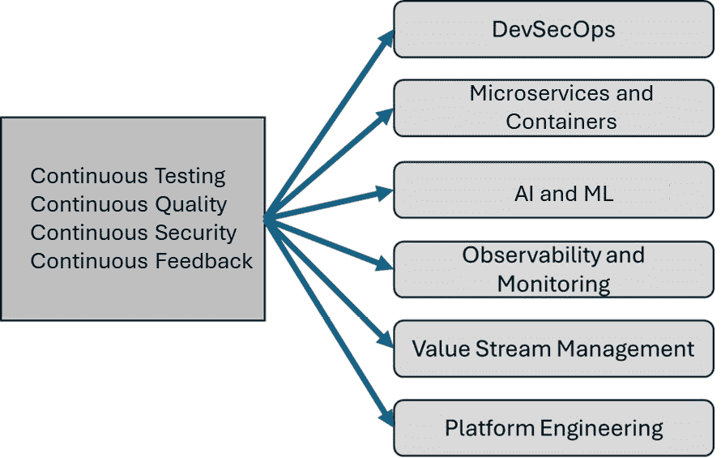

# <st c="0">13</st>

# <st c="3">新兴趋势</st>

<st c="19">本章描述了正在重新塑造软件开发中持续测试、质量、安全性和反馈领域的最新趋势。</st> <st c="180">随着技术的发展和数字化转型步伐的加快，组织面临新的挑战和机会，这些都需要创新的应对方式。</st> <st c="345">本章将探讨采纳率变化、先进框架的整合以及如可观察性、价值流管理、平台工程以及**人工智能**（**AI**）/**机器学习**（**ML**）等新方法的兴起如何影响这些领域。</st> <st c="633">这些趋势不仅重新塑造了工具和流程，还重新定义了团队的协作方式和</st> <st c="735">价值交付。</st>

<st c="749">本章结构旨在提供五个关键领域的全面概述，涵盖 DevOps、DevSecOps 和 SRE 的宏观趋势；可测试性和可观察性；平台工程；价值流管理；以及 AI/ML。</st> <st c="991">每个部分将详细描述这些趋势在现实世界中的体现，提供关于它们实际影响的洞察，并介绍它们带来的好处。</st> <st c="1143">例如，将安全实践整合到 DevOps 中，形成 DevSecOps，可以在不影响开发周期速度的情况下增强安全措施。</st>

<st c="1320">除了理解这些趋势外，本章还旨在为您提供有效准备和适应这些变化的知识。</st> <st c="1468">对于行业专业人士来说，掌握这些趋势的理论方面固然重要，但更重要的是理解如何实施它们，从而提高项目的效率、质量和安全性。</st> <st c="1676">本章将包括关于战略调整、技能提升以及采用与这些新兴趋势相符合的新工具和技术的讨论。</st> <st c="1822">新兴趋势。</st>

<st c="1838">在本章结束时，您将对当前在持续测试、质量、安全性和反馈领域中塑造重要趋势有一个扎实的理解。</st> <st c="2015">您将学习如何利用这些趋势，在快速发展的技术领域中保持领先，确保您的技能和方法与时俱进，并有效应对当前和未来在软件开发中的挑战。</st> <st c="2254">这些知识对于您提升能力和调整策略，以适应现代软件交付实践的需求，将是至关重要的。</st> <st c="2392">交付实践。</st>

<st c="2411">在本章中，我们将讨论以下主题：</st> <st c="2447">以下内容：</st>

+   <st c="2464">DevOps、DevSecOps 和 SRE 的宏观趋势</st> <st c="2500">及其在 SRE 中的作用</st>

+   <st c="2507">可测试性和</st> <st c="2524">可观察性趋势</st>

+   <st c="2544">平台</st> <st c="2554">工程趋势</st>

+   <st c="2572">价值流</st> <st c="2586">管理趋势</st>

+   <st c="2603">AI/ML 趋势</st>

<st c="2616">开始吧！</st> <st c="2623">让我们</st>

# <st c="2635">DevOps、DevSecOps 和 SRE 的宏观趋势</st>

<st c="2678">软件开发</st> <st c="2704">和运营的格局</st> <st c="2716">在不断演变，受到技术进步、市场需求变化以及对更快速、更安全交付周期需求的影响。</st> <st c="2745">当我们展望 DevOps、DevSecOps 和</st> **<st c="3007">站点可靠性工程</st>** <st c="3035">(</st>**<st c="3037">SRE</st>**<st c="3040">) 框架内持续测试、质量、安全性和反馈的未来时，几个宏观趋势突出，如</st> *<st c="3094">图 13</st>**<st c="3103">.1</st>*<st c="3105">所示。</st>

<st c="3307">图 13.1 – 持续测试、质量、安全性和反馈的最新趋势</st>

<st c="3392">以下解释了这些趋势如何与持续测试、质量、安全性和反馈的演变相关：</st>

+   **<st c="3525">向 DevSecOps 转变</st>**<st c="3550">：将安全实践集成到 DevOps 流水线中 – 被称为 DevSecOps – 正成为一个重要趋势。</st> <st c="3580">随着网络威胁日益复杂，组织认识到将安全性早期并贯穿整个软件开发生命周期的重要性，而不是将其视为事后考虑。</st> <st c="3678">这一趋势强调自动化安全扫描工具、安全编码实践和持续合规性监控，旨在减少漏洞而不降低开发速度。</st> <st c="3892">这一趋势推动了自动化安全扫描工具、安全编码实践和持续合规监控的采用，旨在在不拖慢开发进度的情况下减少漏洞。</st>

+   **<st c="4083">微服务和容器化的日益普及</st>**<st c="4144">：微服务架构和容器化促进了大规模复杂应用程序的快速、可靠交付。</st> <st c="4267">这一趋势影响了持续测试、质量和反馈，要求工具和实践能够应对更加动态、分布式和可扩展的环境。</st> <st c="4435">像 Docker 和 Kubernetes 这样的工具已经成为标准，推动了可以在大规模和实时环境中运行的测试框架的发展，以确保微服务环境中的质量和性能。</st>

+   **<st c="4643">AI 和 ML 的增长</st>**<st c="4667">: AI 和 ML 被越来越多地应用于增强 DevOps 各个方面，特别是持续测试和反馈机制。</st> <st c="4808">AI 驱动的预测分析可以预测潜在的瓶颈和故障，而 ML 算法则用于优化测试流程、自动化错误诊断和完善反馈循环。</st> <st c="5019">这些技术使团队能够预防性地解决问题，提升交付速度和质量</st> <st c="5119">。</st>

+   **<st c="5135">强调可观察性和监控</st>**<st c="5179">: 随着系统复杂性的增加，对复杂监控和可观察性的需求也在增加。</st> <st c="5224">这一趋势</st> <st c="5258">涉及从传统监控向更全面的可观察性方法的转变，重点在于通过分析外部输出来理解系统的内部状态。</st> <st c="5486">这在持续反馈和运营弹性中尤为重要，使 SRE 团队能够预测和缓解影响服务质量的干扰。</st>

+   **<st c="5654">价值流管理的兴起</st>**<st c="5690">:</st> **<st c="5693">价值流管理</st>** <st c="5716">(</st>**<st c="5718">VSM</st>**<st c="5721">) 正在获得组织的认可，他们致力于优化端到端的软件交付流程，以实现最大价值的交付。</st> <st c="5849">VSM 工具和实践帮助绘制整个软件交付生命周期，识别低效，并衡量改进的影响。</st> <st c="5992">这种整体视角支持持续测试、质量保证、安全实践和反馈周期中更好的决策，确保工作与</st> <st c="6165">业务目标保持一致。</st>

+   **<st c="6180">平台工程</st>**<st c="6201">: 针对微服务和云原生技术管理复杂性的回应，平台工程趋势日益增长。</st> <st c="6347">这种方法包括为开发人员创建自助服务平台，抽象出大部分基础设施管理的复杂性。</st> <st c="6489">这使开发人员可以更专注于编码，同时依赖平台处理测试、安全性和操作等方面。</st>

<st c="6622">这些趋势突显了软件开发和运营的动态特性，指向一个未来，在这个未来中，适应性、安全性和效率比以往任何时候都更加紧密地相互关联。</st> <st c="6806">对于组织</st> <st c="6823">和 DevOps、DevSecOps 以及 SRE 专业人士来说，跟上这些趋势</st> <st c="6880">对于保持竞争优势和确保交付高质量、安全的</st> <st c="7004">软件产品至关重要。</st>

# <st c="7022">可测试性和可观察性趋势</st>

<st c="7059">对改进可测试性</st> <st c="7100">和可观察性需求的上升正在改变 DevOps、DevSecOps 和 SRE 领域中的持续测试、质量、安全性和反馈实践。</st> <st c="7148">这两个方面对于创建更具韧性、高效且安全的应用和系统至关重要。</st> <st c="7253">以下是它们日益重要的影响：</st>

+   **<st c="7433">对持续测试</st>** **<st c="7467">和质量的影响</st>**<st c="7478">：</st>

    +   **<st c="7480">增强的测试覆盖率和效率</st>**<st c="7517">：改进的可测试性意味着系统从一开始就进行了设计，更容易进行测试。</st> <st c="7616">这可能涉及有利于模块化设计的架构决策，或是集成促进自动化测试的工具。</st> <st c="7749">因此，测试可以更加彻底、节省时间并且更深入地融入开发过程，从而提高整体</st> <st c="7885">软件质量。</st>

    +   **<st c="7902">更快的</st>** **<st c="7910">反馈循环</st>**<st c="7924">：可观察性提供了对软件在生产环境中行为的更深层次洞察，这些信息反馈到测试阶段。</st> <st c="8048">通过通过度量、日志和追踪更好地理解系统的内部状态，团队可以识别出不仅仅是发生了什么问题，还能了解原因。</st> <st c="8191">这使得调试更快，测试更精确，迭代更迅速，所有这些都增强了</st> <st c="8313">开发周期的速度和效果。</st>

+   **<st c="8332">对 DevSecOps 中</st>** **<st c="8356">安全性的影响</st>**<st c="8368">：</st>

    +   **<st c="8370">主动安全措施</st>**<st c="8397">：可观察性工具允许实时监控</st> <st c="8453">安全威胁，使团队能够在问题发生时立即发现并响应，而不是事后处理。</st> <st c="8557">从反应式安全到主动安全的转变在维护系统的完整性和安全性方面至关重要，尤其是在日益复杂的</st> <st c="8711">网络威胁环境中。</st>

    +   **<st c="8725">安全是共同责任</st>**<st c="8761">：随着可测试性的提高，安全测试可以更加融入常规测试流程，模糊开发人员、测试人员和安全专家之间的界限。</st> <st c="8940">这种集成有助于培养“安全即代码”的文化，使安全措施从一开始就被融入软件开发</st> <st c="9067">生命周期。</st>

+   **<st c="9097">对 SRE 的影响</st>** **<st c="9109">：</st>**

    +   **<st c="9117">提高的可靠性和</st>** **<st c="9142">正常运行时间</st>**<st c="9148">：可观察性是 SRE 的基石，因为它提供了实现可靠性目标所需的数据，</st> <st c="9213">以及**<st c="9256">服务水平目标</st>** <st c="9280">（SLOs）</st>。</st> <st c="9290">增强的可观察性意味着更好的操作可见性，这有助于预先解决潜在的停机和故障，从而提高系统的可靠性</st> <st c="9457">和正常运行时间。</st>

    +   **<st c="9468">数据驱动的运维</st>**<st c="9491">：通过更好的可观察性工具，SRE（站点可靠性工程师）可以利用大量数据集自动化处理常见场景，预测系统在不同条件下的行为，并优化资源使用。</st> <st c="9686">这不仅减少了手动监督的负担，还使 SRE 能够将精力集中在更具战略意义的工作上，</st> <st c="9804">从而创造价值。</st>

+   **<st c="9814">对 DevOps、DevSecOps 和 SRE 的更广泛影响</st>** **<st c="9859">：</st>**

    +   **<st c="9868">向数据驱动决策文化的转变</st>**<st c="9919">：随着可观察性和可测试性的提升，组织可以转向一种重视数据驱动决策的文化。</st> <st c="10045">这种转变不仅改善了技术流程，还增强了战略规划和</st> <st c="10126">资源分配。</st>

    +   **<st c="10146">AI 和 ML 的更广泛应用</st>** **<st c="10157">：</st>**<st c="10178">通过 AI 和 ML，利用改进的可测试性和可观察性所生成的大量数据，可以进一步自动化测试、威胁检测、异常检测和问题解决过程。</st> <st c="10387">这可以显著加速开发周期，提高</st> <st c="10446">安全态势，并</st> <st c="10469">增强</st> <st c="10478">系统的韧性。</st>

<st c="10496">总之，专注于提高可测试性和可观察性，对于应对现代软件开发和运维的复杂性至关重要。</st> <st c="10652">随着这些趋势的不断发展，它们可能会在测试、质量保证、安全性和运维可靠性方面带来显著提升，从根本上改变团队对待 DevOps、DevSecOps 和</st> <st c="10879">SRE 实践的方式。</st>

# <st c="10893">平台工程趋势</st>

<st c="10921">平台工程解决方案日益增长的需求</st> <st c="10972">从根本上改变了 DevOps、DevSecOps 和 SRE 的格局，通过提供强大、可扩展和高效的基础设施，支持持续测试、质量保证、安全性和反馈机制。</st> <st c="11189">平台工程专注于为开发人员和运维人员创建共享的、自服务的平台，抽象掉底层基础设施的复杂性，使团队能够更多地专注于应用程序开发，减少对操作细节的关注。</st> <st c="11449">以下是这一转变可能对关键领域的影响：</st> <st c="11491">关键领域：</st>

+   **<st c="11501">持续测试</st>** **<st c="11521">和质量</st>**<st c="11532">：</st>

    +   **<st c="11534">简化的测试流程</st>**<st c="11563">：平台工程</st> <st c="11586">解决方案通常集成并标准化测试工具和环境，这可以大大简化测试过程。</st> <st c="11720">通过提供预配置的环境和自动化流水线，这些平台能够实现一致的测试流程，减少设置时间，并消除“在我的机器上可以运行”的问题，从而提升</st> <st c="11925">软件质量</st> <st c="11938">。</st>

    +   **<st c="11950">增强的测试自动化</st>**<st c="11975">：借助平台工程，组织可以实施更复杂的测试自动化策略，这些策略在各种开发项目中具有可扩展性和可重复性。</st> <st c="12149">这不仅加快了测试周期，还提高了测试的覆盖率和可靠性，从而提高了</st> <st c="12267">软件质量</st> <st c="12267">。</st>

+   **<st c="12284">DevSecOps 中的安全性</st>** **<st c="12294">：</st>**<st c="12306">：</st>

    +   **<st c="12308">集成的</st>** **<st c="12319">安全实践</st>**<st c="12337">：平台工程促进了</st> <st c="12369">将安全工具直接集成到开发和部署流水线中。</st> <st c="12460">通过将安全性作为平台的核心组件，它确保在整个软件开发生命周期中自动应用安全检查和控制，从而提高安全性而不会增加开发人员的负担。</st> <st c="12693">开发人员的负担。</st>

    +   **<st c="12708">一致性和合规性</st>**<st c="12735">：由于平台工程标准化了开发和部署工作流，它也标准化了安全实践。</st> <st c="12861">这种一致性对于维护所有应用程序和服务的安全合规性至关重要，尤其是在监管行业中，安全实施的一致性可以简化</st> <st c="13059">合规审计</st> <st c="13059">。</st>

+   **<st c="13077">SRE 团队</st>**<st c="13087">：</st>

    +   **<st c="13089">提高操作效率</st>**<st c="13120">：平台工程通过自动化与部署、监控和扩展相关的许多操作任务，赋能</st> <st c="13152">SRE 团队。</st> <st c="13248">这种自动化解放了 SRE，使其能够专注于更高价值的活动，如改善系统架构和优化性能，而不是陷入日常</st> <st c="13424">操作问题的困扰。</st>

    +   **<st c="13443">主动监控和</st>** **<st c="13469">可靠性</st>**<st c="13480">：考虑到可观察性设计的工程平台为 SRE 团队提供了主动监控应用程序和基础设施的工具。</st> <st c="13620">这种能力使得问题能在影响用户之前被更快地检测和解决，从而提高了服务的整体可靠性</st> <st c="13761">和运行时间</st> <st c="13773">。</st>

+   **<st c="13785">反馈机制</st>**<st c="13805">：</st>

    +   **<st c="13807">更快的反馈循环</st>**<st c="13828">：通过标准化和自动化</st> <st c="13862">收集和分析来自用户及内部监控工具的反馈，平台工程解决方案可以显著缩短反馈循环。</st> <st c="14026">这种快速反馈对迭代开发和持续改进实践至关重要</st> <st c="14120">，尤其是在 DevOps 中。</st>

    +   **<st c="14130">数据驱动的决策制定</st>**<st c="14158">：平台工程解决方案的集中化特性使得在整个软件生命周期内进行更全面的数据收集成为可能。</st> <st c="14302">这一数据的丰富性使得决策更为明智，帮助团队根据真实的用户反馈和系统</st> <st c="14450">性能数据优先考虑变更和改进。</st>

+   **<st c="14467">更广泛的影响</st>**<st c="14488">：</st>

    +   **<st c="14490">向自动化和自助服务的文化转变</st>**<st c="14534">：平台工程鼓励</st> <st c="14542">向自动化和自助服务能力的转变。</st> <st c="14576">这种转变不仅减少了开发人员和运维人员的认知负担，还通过使新想法能够以可控且</st> <st c="14634">可重复的方式进行测试，促进了创新和实验的文化。</st>

    +   **<st c="14846">增强的协作</st>**<st c="14869">：通过减少与开发和操作过程相关的摩擦，平台工程可以促进开发、运维和安全团队之间的更好协作。</st> <st c="15059">这种增强的协作是 DevOps 理念的核心，并对快速交付</st> <st c="15153">高质量软件至关重要。</st>

<st c="15179">总之，平台工程解决方案日益增长的需求可能会在 DevOps、DevSecOps 和 SRE 中带来显著的效率、质量、安全性和操作可靠性方面的好处。</st> <st c="15394">随着这些平台变得越来越复杂，它们将继续推动软件开发和运营实践的演进，使其变得更加灵活、安全，</st> <st c="15564">并以用户为中心。</st>

# <st c="15581">VSM 趋势</st>

<st c="15592">VSM 解决方案需求的增长正在对 DevOps、DevSecOps 和 SRE 框架中的持续测试、质量、安全性和反馈产生重大影响。</st> <st c="15608">VSM 着眼于从构想到交付的价值流可视化和优化，提供了一种系统化的方法，以提高整个软件开发生命周期的效率和效果。</st> <st c="15766">以下是 VSM 如何增强</st> <st c="15968">这些领域：</st>

+   **<st c="16016">持续测试</st>**<st c="16035">：</st>

    +   **<st c="16037">增强的测试阶段可见性</st>**<st c="16076">：VSM 提供了开发过程每个阶段的清晰可视化，包括所有测试阶段。</st> <st c="16099">通过绘制出测试在价值流中的何时以及如何发生，团队可以识别测试过程中的瓶颈或低效。</st> <st c="16186">这种可见性使得可以有针对性地进行改进，比如在关键点集成自动化测试工具，以加快工作流程，同时不</st> <st c="16480">牺牲质量。</st>

    +   **<st c="16500">优化资源分配</st>**<st c="16512">：通过对 VSM 的测试过程有更好的理解，组织可以更有效地分配资源——包括人力和技术资源——以确保测试不会成为瓶颈。</st> <st c="16734">这可以带来任务分配的更均衡，减少测试环境或</st> <st c="16810">必要审批的等待时间。</st>

+   **<st c="16856">质量</st>**<st c="16864">：</st>

    +   **<st c="16866">质量保证的改进反馈</st>**<st c="16905">：VSM 工具通常集成</st> <st c="16933">可以跟踪整个软件生命周期质量指标的反馈机制。</st> <st c="17025">这种集成允许对质量问题提供即时反馈，这些问题可以更快速、更精确地得到解决。</st> <st c="17155">实时数据促进了质量的持续改进，有助于不断优化</st> <st c="17254">过程。</st>

    +   **<st c="17276">价值流中的一致性</st>**<st c="17312">：VSM 鼓励流程的标准化，从而有助于在整个流中保持一致的质量水平。</st> <st c="17445">通过了解流中某一部分的变化如何影响下游结果，团队可以在战略节点实施质量检查，以确保最终产品符合</st> <st c="17626">预期的标准。</st>

+   **<st c="17644">DevSecOps 中的</st>** **<st c="17654">安全性</st>**<st c="17666">：</st>

    +   **<st c="17668">主动的</st>** **<st c="17679">安全集成</st>**<st c="17699">：VSM 提供了一个框架</st> <st c="17726">用于在整个开发生命周期中集成安全实践，而不仅仅是在最后阶段。</st> <st c="17822">通过将安全作为价值流的一部分，它成为产品开发的一个不可或缺的组成部分，确保安全考虑在早期和频繁地进行。</st> <st c="18000">这种早期集成有助于更早发现漏洞，并减少修复的成本和复杂性</st> <st c="18103">。</st>

    +   **<st c="18112">增强的可追溯性</st>**<st c="18134">：VSM 解决方案提高了整个价值流的可追溯性。</st> <st c="18197">这一能力对安全性至关重要，因为它使团队能够快速识别安全问题的来源，并了解其对整个流的影响。</st> <st c="18361">有效的可追溯性支持更好的风险管理和合规性跟踪，这些都是安全</st> <st c="18469">软件交付的关键方面。</st>

+   **<st c="18487">反馈</st>**<st c="18496">：</st>

    +   **<st c="18498">加速的反馈循环</st>**<st c="18524">：VSM 工具简化了来自开发过程各个阶段的反馈的收集</st> <st c="18559">和利用。</st> <st c="18636">通过将反馈直接与价值流中的特定阶段联系起来，团队可以更快、更准确地进行调整，从而提高产品对用户的价值。</st> <st c="18801">这种反馈的快速集成对于敏捷开发实践至关重要，并有助于确保最终产品与用户需求</st> <st c="18942">和期望保持一致。</st>

    +   **<st c="18959">数据驱动的改进</st>**<st c="18984">：VSM 的分析能力使组织能够从价值流中收集数据，并利用这些数据做出关于改进需求的明智决策。</st> <st c="19160">这种数据驱动的反馈管理方法有助于根据影响的大小来优先考虑工作，确保资源</st> <st c="19273">集中在能够带来最大效益的领域。</st>

<st c="19333">总之，VSM（价值流管理）解决方案的实施正在彻底改变组织应对持续测试、质量、安全和反馈的方式。</st> <st c="19488">通过提供对价值创造过程的整体视角，VSM 使得战略决策更加高效，提升了运营效率，并改善了软件产品的整体质量和安全性。</st> <st c="19693">对于 DevOps、DevSecOps 和 SRE 团队来说，拥抱 VSM 能够显著提高生产力、安全性和</st> <st c="19806">客户满意度。</st>

# <st c="19828">人工智能/机器学习趋势</st>

<st c="19841">人工智能与机器学习的融合</st> <st c="19870">正在迅速改变团队如何应对持续测试、质量、安全和反馈的方式。</st> <st c="20009">对人工智能/机器学习解决方案需求的增加，源于系统复杂性提升、数据量激增以及对更快、更高效交付周期的需求。</st> <st c="20185">以下是人工智能/机器学习可能对这些关键领域产生的影响：</st> 

+   **<st c="20242">持续测试</st>**<st c="20261">:</st>

    +   **<st c="20263">自动化测试创建与优化</st>**<st c="20303">：人工智能/机器学习能够分析</st> <st c="20323">应用数据和用户交互，自动生成和优化测试用例，从而减少测试创建中的人工工作量。</st> <st c="20468">这将带来更广泛的测试覆盖面和更高效的测试流程，确保所有相关的应用场景都被</st> <st c="20595">考虑在内。</st>

    +   **<st c="20609">用于缺陷检测的预测分析</st>**<st c="20649">：机器学习算法可以基于历史数据预测潜在的缺陷，从而使团队能够在缺陷显现之前，集中测试工作于最需要的地方。</st> <st c="20819">这种主动的方法不仅节省了</st> <st c="20857">时间，还减少了与后期</st> <st c="20916">修复漏洞相关的成本。</st>

+   **<st c="20926">质量</st>**<st c="20934">:</st>

    +   **<st c="20936">增强的错误检测</st>**<st c="20960">：人工智能算法擅长</st> <st c="20982">识别模式和异常。</st> <st c="21022">在质量保证中，这些能力可以用于检测与预期结果的偏差或识别可能指示潜在质量问题的异常系统行为。</st> <st c="21207">这种早期检测有助于在</st> <st c="21274">整个开发周期中保持高质量。</st>

    +   **<st c="21292">动态适应变化</st>**<st c="21322">：人工智能驱动的系统可以根据代码库和操作环境的持续变化动态调整测试和质量保证过程。</st> <st c="21476">这种响应性确保了即使项目不断发展，质量检查仍然保持相关性和有效性。</st>

+   **<st c="21580">DevSecOps 中的安全性</st>** **<st c="21590">:</st>**<st c="21602"></st>

    +   **<st c="21604">智能威胁</st>** **<st c="21623">检测与响应</st>**<st c="21645">：AI/ML 模型可以实时分析</st> <st c="21672">大量安全数据，以识别传统安全工具可能忽略的潜在威胁。</st> <st c="21798">这些模型从新数据中学习，不断提高其检测能力。</st> <st c="21885">此外，AI 还可以自动响应常见威胁，从而加速缓解过程，减少</st> <st c="22000">安全团队的工作负担。</st>

    +   **<st c="22015">安全即代码</st>**<st c="22032">：AI 增强了安全即代码的概念，其中安全策略和检查被集成到开发流程中。</st> <st c="22161">AI 可以通过学习系统行为和威胁模式来帮助微调这些策略，确保随威胁变化而进化的强大</st> <st c="22266">安全协议。</st>

+   **<st c="22315">反馈</st>**<st c="22324">：</st>

    +   **<st c="22326">实时反馈分析</st>**<st c="22353">：AI/ML 可以实时处理和分析</st> <st c="22385">来自用户和系统的反馈，更快地提供可操作的洞察。</st> <st c="22476">这一能力使开发团队能够快速做出明智决策，并以一种紧密贴合用户需求</st> <st c="22624">和期望的方式迭代产品。</st>

    +   **<st c="22641">情感分析和用户</st>** **<st c="22670">体验</st>**<st c="22680">：ML 模型可以对用户反馈进行情感分析，以评估情感基调，提供对用户满意度和潜在痛点的更深入见解。</st> <st c="22846">这种分析有助于根据对</st> <st c="22923">用户体验的影响来优先安排开发工作。</st>

+   **<st c="22939">对 DevOps、DevSecOps</st>** **<st c="22981">和 SRE 的整体影响</st>**<st c="22988">：</st>

    +   **<st c="22990">自动化决策</st>**<st c="23015">：AI 通过在软件开发生命周期的各个阶段提供数据驱动的洞察，增强了决策过程。</st> <st c="23045">这一能力支持在测试、部署、运营和</st> <st c="23256">资源分配方面做出更准确、更快速的决策。</st>

    +   **<st c="23276">提升效率和创新</st>**<st c="23311">：通过自动化日常任务和分析，AI/ML 释放了人力资源，使其可以专注于更复杂和富有创新性的工作。</st> <st c="23433">这种转变不仅提高了效率，还促进了团队内的创造力，推动了更具创新性的解决方案</st> <st c="23550">和进展。</st>

    +   **<st c="23567">可扩展性与处理复杂性</st>**<st c="23603">：AI/ML 解决方案本身具有可扩展性，能够应对现代软件环境日益增加的复杂性。</st> <st c="23728">这种可扩展性对于在系统增长</st> <st c="23795">和演变的过程中，保持性能和质量至关重要。</st> <st c="23812">。</st>

<st c="23823">总之，AI/ML 在 DevOps、DevSecOps 和 SRE 中的崛起将深刻影响持续测试、质量保证、安全实践和反馈机制。</st> <st c="24002">随着这些技术越来越多地融入日常实践，它们有望提升软件开发和运营的速度、效率和效果，最终带来更强大、更安全、以及更符合用户需求的产品。</st>

# <st c="24246">总结</st>

<st c="24254">本章探讨了影响 DevOps、DevSecOps 和 SRE 领域内持续测试、质量、安全性和反馈的最新趋势。</st> <st c="24408">本章首先详细介绍了宏观趋势，例如向 DevSecOps 的转变、微服务和容器化的采用、AI 和 ML 的增长、对可观察性和监控的重视，以及 VSM 的崛起。</st> <st c="24633">每个趋势都从其对软件开发过程的影响进行分析，强调这些进展如何促进更快、更安全的交付周期，帮助组织更好地满足现代</st> <st c="24847">数字化环境的需求。</st>

<st c="24866">接下来，讨论深入探讨了这些趋势影响的具体领域，包括可测试性和可观察性、VSM、平台工程以及 AI/ML 的集成。</st> <st c="25031">本章解释了如何通过提高可测试性和可观察性，增强持续测试和反馈机制的效率和效果，从而加快迭代速度，并提供更可靠的软件输出。</st> <st c="25252">它还介绍了平台工程如何通过创建稳健、可扩展的基础设施来重塑团队处理现代软件开发复杂性的方式，从而实现自动化并</st> <st c="25438">简化操作。</st>

<st c="25460">此外，本章还讨论了 AI 和 ML 技术的融合，这些技术正在改变测试、质量保证和安全协议。</st> <st c="25614">AI/ML 可以实现缺陷检测的预测分析、自动化测试用例生成以及增强的实时监控和反馈分析。</st> <st c="25758">这些能力使得开发环境变得更加智能和主动，其中持续改进已深深融入</st> <st c="25886">工作流程中。</st>

<st c="25899">总之，本章为你提供了理解和实施这些新兴趋势的知识，从而帮助你适应不断发展的技术环境。</st> <st c="26086">下一章将基于此，重点介绍持续学习如何支持持续测试、质量、安全性和反馈，适用于 DevOps、DevSecOps 和 SRE，旨在进一步提升在这些</st> <st c="26309">动态领域中取得成功所必需的技能。</st>
