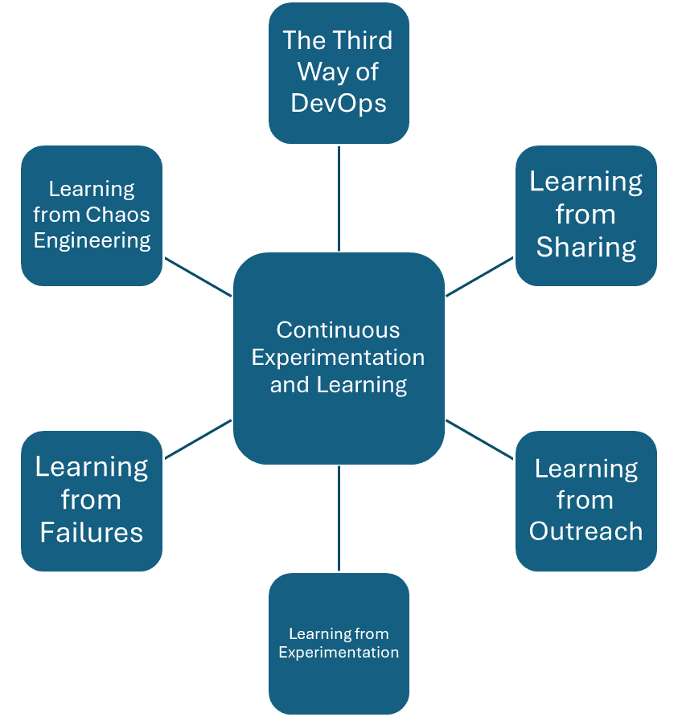

# 探索持续学习与改进

如图所示， *图 14**.1*，本章专注于如何在 DevOps、DevSecOps 和 SRE 中参与的团队能够不断改进和学习，这对于快速变化的技术环境至关重要。 本章探讨了在软件开发和运维中至关重要的持续学习和改进的有效策略。 目标是帮助团队不仅跟上技术变化的步伐，还能将其作为 进步的机会。

图 14.1 – 持续实验与学习

本章围绕*DevOps 的第三种方式*这一原则展开，该原则通过实验促进持续学习。 它讨论了团队可以通过共享、外展、实验、处理失败以及应用混沌工程等方式进行学习。 每个部分都涵盖了学习的不同方面，提供了如何将这些实践整合到日常工作中的实用建议。 工作常规中。

通过涵盖这些主题，本章旨在为你提供进行实验和应用混沌工程的技能 以进行测试。

在本章中，我们将讨论以下 主要主题：

+   DevOps 的第三种方式 之一

+   从 共享中学习

+   从 外展中学习

+   从 实验中学习

+   从 失败中学习

+   从 混沌工程中学习

让我们 开始吧！

# DevOps 的第三种方式

DevOps 的第三种方式 侧重于持续实验和学习的原则，以增强软件开发和运维中的工作流。 这种方法不仅鼓励创新，还强调从成功和失败中学习的重要性。 它在持续测试、质量、安全和反馈等领域尤为重要，因为技术的快速发展和变化要求适应性和持续的 技能提升。

## DevOps 中的持续改进

持续改进 在 DevOps 中意味着定期评估和改进软件开发与部署过程中使用的流程、工具和方法。 这种做法确保团队不会保持现状，而是积极寻找提高效率、效果和安全性的方式。 关键方面包括 以下内容：

+   **迭代过程改进**：鼓励 DevOps 团队不断寻找工作流程中的小而渐进的变化，这些变化随着时间的推移可能带来显著的改进。 这可能是自动化日常手动流程、优化现有脚本，或者采用能够加速部署的新工具。

+   **反馈循环**：创建快速有效的反馈循环在 DevOps 中至关重要。 这些反馈循环帮助团队实时了解其变更的结果 并据此进行调整，而不需要等待漫长项目周期的结束。 反馈可以来自自动化系统、同行评审或实时监控工具，且应直接影响 未来的改进。

## 在 DevOps 中的学习

在 DevOps 中的学习不仅仅是获取新知识；它还涉及如何将这些知识实际应用并与整个团队共享。 第三种方式的这一方面对于培养集体智慧的文化至关重要，在这种文化中，每个人的成长都能惠及 整个团队。

+   **从失败中**：DevOps 文化不回避失败，而是将其视为学习的机会。 当部署失败或发现新 Bug 时，团队会进行无责事后复盘，了解出错原因，并探讨如何在未来避免类似问题。 记录这些经验教训并与团队共享，确保同样的错误不会 重复发生。

+   **从成功中**：同样地，分析哪些做得好以及为什么做得好可以提供宝贵的见解。 成功案例应当以与失败相同的严格性进行剖析，以便在 未来项目中复制这些成功的做法。

## 持续测试、质量和安全

第三种方式在持续测试、质量和安全中的应用涉及 若干实践：

+   **持续测试**：自动化测试是 DevOps 的基石，提供有关变更影响的即时反馈。 通过从开发过程初期开始持续测试软件，团队可以更早发现和解决问题，从而降低成本并加快 交付时间。

+   **质量保证**：质量 不是事后考虑的，而是贯穿于整个开发过程中的。 团队利用过去项目中的洞察来不断提升质量检查点和 标准。

+   **安全集成**：将 安全性从一开始就集成到 DevOps 流程中，即 DevSecOps，确保安全考虑是内建的，而不是附加的。 从过去的安全事件中学习有助于增强未来项目对 类似漏洞的防范能力。

DevOps 的第三条方法提倡一种文化，在这种文化中，持续改进和学习是日常工作的一部分。 通过采纳这种方法，DevOps 团队增强了在持续测试、质量、安全和反馈方面的能力。 这不仅能带来更强大和更有韧性的软体解决方案，还能确保团队保持技术创新的前沿，随时准备应对出现的新挑战。 通过整合这些实践，组织能够在软件 开发工作中保持长期增长和持续改进。

# 共享中的学习

共享中的学习 是 DevOps 中的一个基本概念，强调团队之间及团队内部知识交流的好处。 在持续改进和学习的背景下，持续测试、质量、安全和反馈，分享成为提升团队能力和加速开发周期的关键驱动力。 本节探讨了如何通过结构化的共享实践促进一个合作的环境，在这个环境中 创新蓬勃发展。

## 建立开放沟通的文化

对于 DevOps 团队来说，创建一个安全文化，让成员感到舒适地分享见解、成功和失败至关重要。 这种文化促进了透明度和信任，这是 有效协作的基础。

+   **定期知识共享会议**：实施定期会议，如每日站立会议、每周回顾或每月回顾会议，让团队成员讨论他们的工作内容、遇到的挑战以及所学到的经验教训，可以显著提升集体的理解能力和 问题解决能力。

+   **文档管理**：维护一个包含流程、事件和解决方案详细文档的知识库，不仅作为参考，还帮助新加入的团队成员迅速上手。 Wiki、共享驱动器和内部博客是实现这一目的的有效工具。

## 分享最佳实践和工具

DevOps 团队 通常在快速变化的环境中工作，新工具和新实践不断出现。 在团队或组织内部分享最佳实践和工具可以提高工作流程的效率和 效果：

+   **工具演示**：定期展示团队成员发现有用的新工具或功能的会议，可以促进工具在团队中的广泛采用和标准化。 。

+   **最佳实践研讨会**：专注于持续测试、质量和安全的最佳实践研讨会有助于标准化团队内部的方法，减少变异性并提高结果的可靠性 。

## 跨团队合作与外部参与

将分享文化 扩展到其他部门，甚至组织外部，可以引入新的视角和解决方案，这些是内部团队可能忽视的。

+   **跨部门会议**：鼓励团队举办跨部门会议有助于打破信息孤岛，分享可能对多个领域有益的见解，从开发到运营 再到安全。

+   **社区参与**：参与外部论坛、会议和研讨会不仅能让团队成员从行业领导者那里获得见解，还能分享自己的经验和解决方案，在更广泛的 社区中建立影响力。

## 利用反馈推动持续改进

反馈机制 是软件过程的核心，跨团队分享反馈对持续改进至关重要。 结构化的反馈可以促进更好的实践，并突出需要关注的领域：

+   **反馈循环**：将反馈循环融入共享过程确保所有团队成员都能了解他们行动的结果，并据此调整他们的实践。 这些循环应当及时且具有建设性，关注哪些做得好以及哪些可以 改进。

+   **可操作的见解**：反馈应当是可操作的。 团队需要讨论可以采取的实际步骤，以实现通过共享获得的见解。 这可能涉及调整测试协议、更新安全措施或改进质量 保证流程。

在 DevOps 中，共享学习不仅仅是信息的传递，更是在创造一个生态系统，使得持续学习和改进成为日常过程的一部分。 通过促进开放、沟通和协作的文化，团队可以显著提高在持续测试、质量、安全性和反馈方面的有效性和效率。 这不仅提升了项目成果，还促进了 一个更加参与和创新的团队环境。 随着团队在共享和应用集体知识方面变得更加熟练，他们为持续增长和在其 DevOps 实践中的持续进步奠定了基础。

# 通过外联学习

DevOps 中的外联 涉及与外部社区和行业团体互动，带入新的想法和实践，以增强内部流程。 本节探讨了如何通过外联学习显著促进 DevOps、DevSecOps 和 SRE 框架中的持续改进，特别是在持续测试、质量、安全性和反馈方面。

## 外部互动在持续改进中的作用

外部互动 使团队能够超越其当前组织环境的局限，从更广泛的行业中学习。 这可以包括参与行业会议、贡献开源项目或参与专业 网络群体：

+   **参加会议和工作坊**：参加行业会议和工作坊为团队提供了接触前沿实践和技术的机会。 这些活动对于学习新工具、方法和在类似环境中有效的策略非常有价值。 团队可以将这些见解带回，并评估它们对自己 流程的适用性。

+   **与在线社区互动**：GitHub、Stack Overflow 或特定的 DevOps 论坛等在线社区是解决问题和创新的丰富资源。 通过积极参与这些社区，团队成员可以提问、获取对自己方法的反馈，并从面临类似挑战的其他人经验中学习。

## 行业合作的好处

与 行业同行的合作带来了若干优势，直接转化为测试、质量、安全和 反馈机制的改进：

+   **跨行业学习**：通过与来自不同行业的专业人士互动，DevOps 团队可以了解在不同背景下是如何解决各种挑战的。 这种跨行业学习能够激发创新的解决方案，团队可能之前没有考虑过的 方案。

+   **与行业标准对标**：外展活动使团队能够将其流程和表现与行业标准和最佳实践进行对比。 这一对标可以突出改进的领域，并为未来的 发展努力提供清晰的目标。

## 在 DevOps 实践中实施外展学习

为了有效地 将外展活动中的学习融入工作，团队需要遵循一种结构化的吸收 和应用方法。

+   **结构化汇报会议**：在参与外部活动或接触后，团队成员应举行汇报会议，与同事分享关键的学习经验。 这些会议应专注于新信息的潜在应用以及确定可执行的步骤 以便实施。

+   **试点项目**：通过小规模的试点项目实施新想法，团队可以在不危及更大系统稳定性的情况下评估其有效性。 这些项目作为新概念的实际测试，并允许在更广泛推广之前进行迭代优化。

外部学习是 DevOps 环境中持续改进的重要组成部分。 通过积极与外部知识源进行互动，并将这些见解带入组织，团队可以增强在持续测试、质量、安全性和反馈方面的能力。 这不仅使团队能够了解最新的行业发展，还促进了学习文化和开放接受变革的氛围。 因此，DevOps 团队更有能力应对新挑战，并持续优化实践，以在 项目中实现更高的效率和效果。

# 从实验中学习

实验 是 DevOps 哲学的核心元素，倡导一种鼓励尝试新方法的环境，以发现更高效、更有效的工作方式。 本节内容重点介绍了实验如何推动 DevOps、DevSecOps、 和 SRE 中持续测试、质量、安全性和反馈过程的持续改进。

## 实验在 DevOps 中的重要性

实验 使团队能够在真实场景中测试假设，提供宝贵的见解，从而推动软件开发和运营过程中的重要改进。 在 DevOps 中，实验不仅仅是技术创新，还涉及找到改善团队动态、工作流程和 整体效率的新方法：

+   **迭代测试**：在持续测试中，实验可能包括尝试新的自动化测试工具或技术，以查看它们是否能提高测试的速度和准确性。 例如，团队可能会尝试不同类型的自动化回归测试，以确定哪一种在速度 和全面性之间提供最佳平衡。

+   **质量改进试验**：质量保障可以通过尝试新的质量指标或收集和分析质量数据的新方法来受益。 通过在项目的小部分上测试这些不同的方法，团队可以收集有关它们有效性的数据，而不会影响整个项目。

## 在 DevOps 中进行安全实验

为了 确保实验能够带来学习而非干扰，至关重要的是以受控且 可衡量的方式进行实验：

+   **特性开关的使用**：实施特性开关可以让团队在生产环境中以最低风险测试新功能或更改。 特性开关可以仅对少部分用户发布更改，从而收集反馈和性能数据，而不影响 所有用户。

+   **金丝雀发布**：类似于特性开关，金丝雀发布涉及在全面发布前，将新功能或更改仅发布给少数用户。 这种方法特别适用于在生产环境中进行测试，并能提供有价值的反馈，了解更改在 实际环境中的表现。

## 从实验结果中学习

成功实验的关键 不仅仅是进行实验，还要从中学习，无论实验是成功 还是失败：

+   **分析结果**：每个实验之后都应进行详细的结果分析。 这包括回顾性能指标、用户反馈和任何其他相关数据，以判断实验是否成功 或失败。

+   **分享学习成果**：从每次实验中获得的洞察应被记录并与整个团队分享。 这一做法有助于传播知识，确保所有团队成员都能从实验中学习，即使他们没有直接参与 其中。

+   **将反馈融入过程**：实验周期的最后一步是利用反馈和学习来改进现有流程或开发新流程。 这可能涉及调整测试协议、更新质量标准或修改 安全措施。

从实验中学习是 DevOps 中持续改进的强大工具。 通过营造鼓励实验并安全管理的环境，团队可以不断演化其实践和流程。 这种持续的改进带来了 更高的效率、更好的质量、增强的安全性和更有效的反馈机制，确保组织在面对变化的技术和 市场环境时，保持适应性和创新力。

# 从失败中学习

在 DevOps 中，从失败中学习 是推动软件开发和运维各个阶段持续改进的关键实践。 这一理念源于这样一种信念：失败提供了宝贵的教训，经过正确的分析和理解，可以带来在过程中的显著改进，包括持续测试、质量、安全和 反馈机制。

## 拥抱无责文化

从失败中学习的一个关键元素是建立无责文化。 这种环境鼓励团队成员公开讨论错误和失败，而无需担心报复 或批评：

+   **无责事后分析**：在失败发生后，进行无责事后分析至关重要。 其目的是理解发生了什么，为什么会发生，以及如何防止未来再次发生，而不指责任何个人。 这种方法有助于识别系统层面的改进，而不是专注于 个体错误。

+   **透明度**：鼓励团队成员记录并分享关于失败及其根本原因的详细信息。 这种透明度不仅促进学习，还帮助建立团队内部的信任与合作。

## 分析失败的实际步骤

有效地分析失败 需要一种结构化的方法来揭示根本原因并理解其对 持续改进的广泛影响：

+   **根本原因分析 (RCA)**：如“五个为什么”（[https://www.mindtools.com/a3mi00v/5-whys](https://www.mindtools.com/a3mi00v/5-whys)）或鱼骨图（[https://www.techtarget.com/whatis/definition/fishbone-diagram](https://www.techtarget.com/whatis/definition/fishbone-diagram)）等技术可以用于 深入挖掘导致失败的根本原因。 目标是超越表面答案，理解需要解决的系统性问题。

+   **可操作的教训**：每次分析应得出可操作的结论，这些结论可以付诸实践以改善流程。 无论是调整测试协议、优化部署实践，还是改进监控工具，关键是将洞察转化为 切实的改进。

## 将失败融入持续改进周期

从失败中学习应该是 DevOps 实践中持续改进周期的一个重要组成部分：

+   **基于反馈的迭代**：失败的洞察应直接反馈到 DevOps 生命周期中。 这可能意味着对代码的更改、对安全措施的更新，或是在持续测试 和运营过程中改进监控策略。

+   **定期评审会议**：应定期举行评审会议，评估近期的失败以及基于之前失败实施的变更的状态。 这确保了教训不仅被学习，而且 得到了有效应用。

## 从失败中学习的好处

从 失败中学习具有多重好处，直接影响到 DevOps 实践的效果和效率：

+   **提高韧性和可靠性**：通过不断从过去的失败中学习，团队可以构建更加坚韧和可靠的系统。 每一次失败都为加强系统防范 未来问题提供了独特的机会。

+   **增强创新**：一个不畏惧失败的文化是鼓励创新的文化。 当团队知道失败被视为学习机会而非挫折时，他们会更愿意尝试新的想法。

从失败中学习是 DevOps 持续改进的基石，直接影响持续测试、质量、安全性和反馈流程。 通过培养将失败视为学习和改进机会的文化，组织可以提升其运营流程，并更迅速地适应新的挑战。 这种方法不仅能最小化类似失败的再发生，还能推动在持续发展的 技术环境中创新和提高效率。

# 从混沌工程中学习

混沌工程 是一种有纪律的方法，通过在问题变成故障之前识别出潜在的失败。 通过故意向系统注入故障，DevOps 团队可以观察系统在压力下的表现，并学习如何构建更强大的系统。 这种前瞻性的方法对于持续测试、提升质量、增强安全性以及改进软件开发 和运营中的反馈机制至关重要。

## 实施混沌工程

混沌工程的实践 包括几个计划的步骤，以确保它能够增加价值而不对 生产服务造成不必要的干扰：

1.  **定义明确的目标**: 在启动混沌实验之前，定义明确的目标非常重要。 无论是测试系统如何从数据库故障中恢复，还是 了解流量突然增加的影响，定义这些目标有助于有效地定制 实验。

1.  **从受控环境开始**: 最初在暂存环境中进行混沌实验，帮助团队学习和迭代他们的过程，而不影响实时用户。 这种受控环境让你可以调整变量并理解结果，而无需担心立即的 业务影响。

1.  **渐进式升级**: 一旦在受控环境中建立了信心，逐步将混沌实验扩展到生产环境中，确保系统在实际条件下具有韧性。 这种循序渐进的方法有助于减少风险，同时仍能获得 宝贵的洞察。

## 从混沌工程中学习与改进

混沌工程 提供了关键的学习，这些学习可以直接影响 DevOps 流程的各个方面：

+   **增强的系统韧性**: 通过故意破坏系统，团队可以在问题影响用户之前识别并修复问题。 这种主动的故障查找有助于提高系统的韧性，减少停机时间，这对于维持高质量的 用户体验至关重要。

+   **改进的恢复过程**: 混沌实验通常揭示系统在故障后恢复得如何（或如何不恢复）。 通过从这些结果中学习，团队可以简化并加强其恢复程序，例如改进自动回滚或增强 警报机制。

+   **安全态势评估**: 引入与安全相关的混沌实验，例如测试对模拟攻击的响应，可以帮助揭示安全态势中的漏洞。 这些洞察推动了安全协议和 防御策略的改进。

## 将混沌工程整合到持续反馈循环中

要充分 利用混沌工程的好处，必须将这些发现整合到 DevOps 实践的持续反馈循环中：

+   **文档和分析**：每次混沌实验后，记录发现并进行详细分析以提取可操作的见解至关重要。 这些文档应该对所有团队成员可访问，以确保每个人都能从 实验中学习。

+   **反馈机制**：将混沌工程的发现整合到现有的反馈机制中，有助于让所有利益相关者了解系统中潜在和现有的弱点。 这种持续的沟通对于 持续改进至关重要。

+   **常规实践**：将混沌工程作为开发生命周期的常规部分，有助于将从失败中学习的实践常态化。 定期安排混沌实验可以确保持续学习和系统强化，这对适应新挑战 和技术至关重要。

混沌工程是 DevOps、DevSecOps 和 SRE 工具包中的一种强大工具，提供了一种独特的方式来主动测试和改进系统。 通过故意引入故障，团队可以确保他们的软件和基础设施能够承受意外的中断。 这种学习方法不仅增强了系统的可靠性和安全性，还在组织内部培养了应对能力和准备文化。 随着团队越来越习惯于混沌实验，他们可以不断突破系统的承载极限，从而在软件交付 和运营的各个方面实现持续改进。

# 总结

本书的最后一章探讨了在 DevOps、DevSecOps 和 SRE 的背景下，持续学习和改进的关键实践。 这一章节强调了拥抱持续学习文化的重要性，强调了它如何支撑在快速发展的技术环境中取得成功。 叙述围绕几种关键方法论展开，促进了这一持续改进，包括 DevOps 的第三种方式，该方法提倡反馈文化、从实验中学习以及从失败中恢复的关键角色。 从失败中恢复。

我们深入探讨了促进学习和改进的具体策略，从 DevOps 的第三种方法开始。 该方法在促进鼓励实验和从成功与失败中学习的环境的背景下进行了讨论。 它提出了将这种理念在团队中实施的具体步骤，确保学习被嵌入到日常工作流程中，并直接促成 操作成功。

章节的后续部分集中讨论了通过不同视角进行学习——分享、外展、实验、失败和混沌工程。 每个部分提供了具体的示例，展示了如何将这些元素融入到 DevOps 实践中，以提升成果。 例如，从分享中学习强调了团队内部和与外部社区之间知识交流的重要性，而从失败和混沌工程中学习则强调了系统性和有意的测试以及破坏系统来提高其稳健性 和安全性的价值。

此外，还强调了外展和实验的重要性，展示了如何通过与更广泛的社区互动和积极的实验，能带来流程和系统的显著改进。 这些部分共同描绘了一个全面的画面，说明了持续学习和适应不仅有益，而且对于在技术和 市场需求变化面前保持相关性和效率是必不可少的。

感谢您花时间通过本书探索 DevOps、DevSecOps 和 SRE 的持续测试、质量、安全性和反馈。 我们希望各章节中呈现的讨论和方法论，能为您提供有价值的见解和实践知识，帮助您提升自己的实践。 您的参与和学习承诺是推动该领域改进和创新的动力。 我们感谢您在提升理解和技能方面的投入，并祝愿您在未来的持续学习和改进旅程中取得成功。

# 术语表和参考资料

# 术语表

这里是一个扩展的相关术语表，重点关注持续测试、质量、安全性和反馈， 按字母顺序组织：

## A

**验收测试**：验证系统在开发过程结束时并在发布之前，是否符合商定的要求。

**自动化构建**：将软件代码编译和构建为可执行软件的自动化过程。

## B

**行为驱动开发（BDD）**：一种软件开发和测试的协作方法，通过使用共享的工具 和流程，将业务需求与技术解决方案对齐。

**无责事后分析**：一种在 DevOps 中用于分析和学习失败的方式，重点关注过程和 系统改进，而非个人责任。

## C

**变更管理**：通过流程、工具和技术管理变更的人员方面，以实现所需的 业务成果。

**配置管理（CM）**：涉及工作范围的创建、维护、控制变更和质量控制的技术和行政活动。 。

**持续交付（CD）**：一种软件工程方法，团队以短周期生产软件，确保软件可以在任何时刻可靠地发布。

**持续部署**：将软件发布到生产环境的实践，前提是它已经通过了 自动化测试。

**持续改进**：不断努力改善产品、服务或流程。 这些努力可以追求“渐进性”改进，也可以追求“突破性”改进， 一次性实现。

**持续集成（CI）**：一种开发实践，开发人员将代码频繁地集成到共享代码库中，每次提交都通过自动化构建进行验证，从而让团队能及早发现 问题。

**持续安全**：将安全实践和工具集成到开发和部署管道中，持续识别和缓解 风险。

**持续测试**：作为软件交付管道的一部分，执行自动化测试的过程，目的是及时获得关于软件发布候选版本的业务风险反馈。

## D

**DevOps**：一组结合了软件 **开发** （**Dev**）和 IT **运维** （**Ops**）的实践，旨在缩短系统开发生命周期并提供具有高 软件质量的持续交付（CD）。

**DevSecOps**：DevOps 的扩展，集成了安全实践和原则，融入到 DevOps 流程中。

## F

**反馈回路**：一种系统，其中输出被反馈并作为输入使用，是持续开发、交付和 改进过程的核心。

## I

**事件管理**：管理所有事件生命周期的过程，确保尽快恢复正常服务操作并将业务影响 降到最低。

## M

**监控**：观察和检查系统及其组件行为和输出的活动，持续一段时间。

**突变测试**：一种软件测试方法，通过小幅修改程序的源代码或字节码，来测试现有测试无法发现的代码部分。

## P

**性能测试**：测试系统在特定工作负载下的响应性和稳定性表现。

**事后分析**：事件或项目完成后的过程，调查并为未来改进总结经验教训。

## 问

**质量保证（QA）**：确保软件产品在发布到生产环境之前满足所需的质量标准。

**质量控制（QC）**：质量管理的一部分，专注于满足质量要求的操作技术和活动。

## R

**回归测试**：一种软件测试，验证在修改或与其他软件接口之后，先前开发和测试的软 件是否仍能正确执行。

**风险管理**：对金融风险的预测与评估，并识别避免或最小化其影响的程序。

## S

**安全信息与事件管理（SIEM）**：一种安全管理方法，旨在提供对组织信息安全的整体视图。

**软件测试**：执行程序或应用程序的过程，目的是发现软件缺陷。

## T

**测试自动化**：使用特殊软件控制测试执行并将实际结果与预测结果进行比较。

**威胁建模**：一种通过识别目标和漏洞，进而定义对策来防止或缓解威胁对系统影响的网络安全优化程序。

## U

**可用性测试**：通过在用户上进行测试，直接观察他们如何与产品互动，从而评估产品的测试方法。

## V

**漏洞评估**：识别、量化并优先处理系统中的漏洞的过程。

# 书籍参考

+   *加速：精益软件与 DevOps 的科学：构建和扩展高性能技术组织* 作者：Nicole Forsgren、Jez Humble 和 Gene Kim。 本书提供了实证研究，支持 DevOps 实践的有效性，以及文化和自动化在实现技术组织高性能中的重要性，支持本章关于 DevOps、DevSecOps 中持续实践的讨论， **站点可靠性** **工程** (**SRE**)。

+   *人工智能：思考型人类的指南* 作者：Melanie Mitchell。 本书深入探讨了当前 AI 技术的能力和局限性，包括它们在软件开发等各个领域的应用。 它提供了一个基础性的理解，帮助了解如何利用 AI 和机器学习进行持续测试、质量保证、安全性和反馈，这与本书第八章中讨论的主题非常契合。 *第八章*。

+   *持续交付：通过构建、测试和部署自动化实现可靠的软件发布* 作者：Jez Humble 和 David Farley。 本书重点讲解了 CD（持续交付）的原则，这些原则与本书第三章中讨论的持续测试和反馈机制紧密相关。 *第三章*提供了一个框架，支持本章强调从过去经验中学习，以改进未来实践。

+   *持续安全测试：将保护措施集成到 DevOps 中* 作者：Kualitatem。 这篇博客文章探讨了将持续安全措施集成到 DevOps 管道中的方法，支持本章关于 DevSecOps 中持续安全实践的讨论。

+   *《商业数据科学：你需要了解的数据挖掘和数据分析思维》* 作者：Foster Provost 和 Tom Fawcett。 本书深入探讨了如何将数据驱动的方法应用于商业挑战，包括软件开发和运维。 它涵盖了数据科学的基础原则，这些原则对理解如何有效地在持续过程中实施 AI/ML 至关重要。

+   *《DevOps 入门指南》* 作者：Emily Freeman。 本书面向 DevOps 的初学者和早期采用者，描述了 DevOps 作为一种协作、责任和学习的工程文化，支持本章强调的 DevOps 实践中的持续改进。

+   *《工程化 DevOps：从混乱到持续改进》* 作者：Marc Hornbeek。 这本书是任何希望实施或改进 DevOps 实践的人的优秀参考指南。 它涵盖了实现持续改进及更高水平所需的工程实践，使其与本书所附章节关于持续学习和改进的重点高度相关。

+   *《精益分析：用数据更快地构建更好的初创公司》* 作者：Alistair Croll 和 Benjamin Yoskovitz。 本书提供了关于如何有效利用数据来衡量和推动商业成功的全面指南。 它与*第十二章*中的主题高度契合，特别是在衡量组织转型中的进展和结果时。

+   *《机器学习的渴望》* 作者：Andrew Ng。 作为该领域的先驱之一，本书专注于如何构建**机器学习**（**ML**）项目。 Andrew Ng 提供了关于如何将机器学习应用于复杂系统的实际见解，这些见解可以直接应用于增强软件开发流程，如本书所述。

+   *《从项目到产品：如何在数字化变革时代借助 Flow 框架生存与发展》* 作者：Mik Kersten。 Kersten 的这本书介绍了 Flow 框架，这是一种为创新构建基础设施的新方法，专注于组织到客户之间的价值流动。 该框架与实施持续实践的战略规划和路线图开发高度契合，如本书第*10 章*所讨论的那样。

+   *《站点可靠性工程：谷歌如何运行生产系统》* 作者：尼尔·理查德·墨菲、贝琪·贝耶、克里斯·琼斯、詹妮弗·佩托夫。 本书介绍了 SRE 的原则和实践，深入探讨了谷歌如何确保其系统的可靠性和可扩展性，与章节中聚焦的持续运营实践 SRE 相辅相成。

+   *《DevOps 手册：如何在技术组织中创造世界级的敏捷性、可靠性和安全性》* 作者：吉恩·金、帕特里克·德博伊斯、约翰·威利斯、杰兹·汉布尔。 本书深入探讨了如何将持续测试、安全性和反馈融入到 DevOps 实践中，这与第*3 章* 中关于这些概念演变和实际应用的经验和教训相契合。

+   *《持续反馈在软件测试中的重要性》* 作者：GeeksforGeeks。 本文强调了持续反馈在软件测试中的作用，与本章对敏捷、DevOps 和 SRE 方法中持续反馈机制的重视相一致。

+   *《持续测试在软件开发中的重要性》* 作者：Synopsys。 本文讨论了在 DevOps 中战略性地实施持续测试，符合本章在数字化转型中将持续测试作为软件开发的一部分的重点。

+   *《精益创业：当今的企业家如何利用持续创新创建具有革命性成功的企业》* 作者：埃里克·里斯。 埃里克·里斯介绍了诸如构建-测量-学习反馈循环等概念，这对于衡量任何创新过程中的进展和成果至关重要，包括涉及持续测试、质量、安全和反馈的过程。

+   *《凤凰项目：关于 IT、DevOps 和帮助你的企业获胜的小说* 作者：吉恩·金、凯文·贝尔、乔治·斯帕福德。 这本小说提供了对 DevOps 理念的深入了解，并展示了它在改善业务成果方面的影响。 它强调了协作、自动化以及从失败中学习的重要性，与附带章节的主题相契合。

+   *如何衡量一切：在商业中找到“无形资产”的价值* 由道格拉斯·W.  哈伯德。 本书挑战了某些事物不可度量的观念，并提供了量化商业背景中不同类型风险和价值的方法和最佳实践，直接支持章节中讨论的衡量策略。 *第十二章*。

# 互联网参考资料

+   *通俗的 AI 解释* *英语*： [https://medium.com/ai-in-plain-english](https://medium.com/ai-in-plain-english) 这篇 Medium 文章将复杂的 AI 概念分解成易于理解的文章，通常侧重于实际应用。 它包括讨论 AI 如何通过自动化任务、提高质量和增强 安全措施来改变各行各业，包括软件开发。

+   *DevOps.com 上的博客文章，作者：* *马克·霍恩比克* 马克·霍恩比克定期向 [DevOps.com](http://DevOps.com)贡献文章，讨论 DevOps 实践的各个方面，包括持续测试、质量、安全性和反馈。 这些文章提供了实际的见解，并补充了本书中的讨论。

+   *云原生计算基金会 (CNCF)* *博客*： [https://www.cncf.io/blog/](https://www.cncf.io/blog/) 这些关于云原生技术和实践的见解与更新，支持数字技术在业务流程中的整合，如数字化转型战略章节中所述。

+   *比较 SRE 与 DevOps：它们有什么* *不同之处？* StrongDM。 本文详细比较了 SRE 和 DevOps，突出了它们的起源、原则和实践。 它支持附录章节中关于团队如何通过实验、处理失败和应用 混沌工程等方式学习和改进的讨论。

+   *持续反馈使用案例：利益相关者对需求的反馈* *需求收集* 从利益相关者收集和整合对定义需求和质量标准的反馈。 确保项目与利益相关者的期望和 业务目标保持一致。

+   *持续安全测试：将保护集成到* *DevOps*. Kualitatem. 这篇博客文章探讨了将持续安全措施集成到 DevOps 流水线中的方法，支持本章关于 DevSecOps 中持续安全实践的讨论。 在 DevSecOps 中的持续安全实践。

+   *DevOps* *Institute*: [https://devopsinstitute.com/](https://devopsinstitute.com/) DevOps Institute 提供有关 DevOps 实践的资源、认证和教育材料，包括持续测试、质量、安全性和反馈。 它是了解 DevOps 最新趋势和进展、以及寻找有效实施这些实践策略的宝贵资源。

+   *DevOps.com*: [https://devops.com/](https://devops.com/) 一个领先的 DevOps 相关文章、新闻和分析来源，涵盖了持续测试、安全性和反馈等主题。 该网站提供了与本章讨论的概念相关的实践见解和案例研究。 *第四章*。

+   *DZone*: [https://dzone.com/](https://dzone.com/) DZone 提供了广泛的关于软件开发和 DevOps 各个方面的文章和教程，包括持续测试和安全性。 它是理解转型目标在 实际场景中应用的宝贵资源。

+   *Google AI* *Blog*: [https://ai.googleblog.com/](https://ai.googleblog.com/) 这个博客提供了来自 Google AI 研究和项目的最新动态和见解。 它是一个很好的资源，帮助你随时了解 AI 和机器学习技术的最新进展，包括它们在软件工程和 DevOps 实践中的应用。

+   *Google* *Analytics*: [https://analytics.google.com](https://analytics.google.com) Google Analytics 提供了用于衡量网站和活动表现的工具，可以类比为衡量项目结果和进展。 它提供了有关如何有效追踪和解释用户数据的见解，这对于数字化转型的相关业务至关重要。 业务转型。

+   *InfoQ*: [https://www.infoq.com/](https://www.infoq.com/) InfoQ 提供有关软件开发领域的最新趋势和创新的更新与深入分析，包括持续交付和 DevOps 实践。 它帮助读者了解影响转型目标的最新策略和技术。

+   *将安全性整合进 DevOps：弥合速度与安全之间的差距*。 Security Boulevard。 本文探讨了在 DevOps 工作流中整合安全实践，支持本章节讨论 DevSecOps 发展的内容，以及在整个开发 生命周期中嵌入安全性的实际挑战。

+   *CloudNativeNow.com 上的访谈* *与 Marc Hornbeek* 在访谈中，Marc Hornbeek 经常讨论他在 DevOps 和持续实践中的经验和见解，提供了支持本书内容的实际例子和策略。

+   *Kissmetrics* *博客*: [https://blog.kissmetrics.com/](https://blog.kissmetrics.com/) 这个博客提供有关分析、营销和测试的文章，提供了关于数据如何驱动决策并改善业务流程的有价值的见解，这与本书第*12 章*中持续改进和衡量的主题相一致。

+   *从生产中学习：实时监控和反馈如何提升软件* *开发*. DevOps.com。 本文讨论了实时监控和反馈在软件开发中的重要性，这与本章节着重从实际经验中学习以优化测试和 安全实践的主题相契合。

+   *Security* *Boulevard*: [https://securityboulevard.com/](https://securityboulevard.com/) 专注于 IT 领域的安全性，提供符合本章节中能力成熟度模型持续安全方面的文章和专家意见。 。 

+   *SRE 与 DevOps：有什么* *不同？* TechTarget。 本文探讨了 SRE 和 DevOps 之间的区别，强调通过适当的监控工具和实践实现持续改进。 它与附加章节强调的在软件开发和运维中的持续学习和改进相一致。

+   *Tableau*： [https://www.tableau.com/](https://www.tableau.com/) Tableau 提供强大的数据可视化工具，帮助组织将海量数据转化为可操作的洞察。 这对于可视化进度和结果度量尤其有用，正如 *第十二章*中讨论的那样。

+   *软件* *测试中持续反馈的重要性*。GeeksforGeeks。 本文强调了持续反馈在软件测试中的作用，与章节中对持续反馈机制在敏捷、DevOps 和 SRE 方法论中的应用强调相符。

+   *新* *技术堆栈*： [https://thenewstack.io/](https://thenewstack.io/) 该网站聚焦于软件开发中的趋势分析，包括 DevOps 和云原生技术。 The New Stack 提供了文章，探索新兴趋势如何在 行业中得到应用。

+   *敏捷开发中反馈的重要性：持续反馈如何推动改进*。 敏捷联盟。 本文强调了持续反馈在敏捷开发过程中的作用，与章节中强调的使用反馈来提升软件项目的质量和安全性相辅相成。 。

+   *走向数据* *科学*： [https://towardsdatascience.com/](https://towardsdatascience.com/) 这是一个平台，数据科学专业人士和爱好者分享见解和教程，涵盖 AI 和 ML 在各行各业的应用。 该网站上的文章经常探讨将 AI/ML 创新性地应用于软件开发的方法，使其成为理解类似于 *第八章*中讨论的实际应用的宝贵资源。

+   *将您的 DevOps、DevSecOps 和 SRE 转向云原生* *原生*。CloudNativeNow.com。 本文讨论了在 DevOps、DevSecOps 和 SRE 实践中采用云原生原则的战略举措。 它突出了提升敏捷性、可扩展性和韧性的好处，支持附加章节的重点，即将技术变革视为进步的机会。 。

+   *网络研讨会邀请* *Marc Hornbeek* Marc Hornbeek 参与了多个专注于 DevOps、持续测试和安全的网络研讨会。 这些网络研讨会通常 有主题安排。

+   *什么是 DevOps 中的持续测试？ (策略 +* *工具)*. TestRail. 本文讨论了在 DevOps 中战略性地实施持续测试，与本章聚焦于作为数字化转型一部分的软件开发中的持续测试相一致。
