# <st c="0">1</st>

# <st c="2">敏捷、DevOps 与 Azure 概览</st>

<st c="35">DevOps 是一种现代的应用程序开发和交付方法，帮助组织将高质量的软件更快速地发布到生产环境中，并减少缺陷！</st> <st c="200">然而，采用 DevOps 方法的好处并非单独实现。</st> <st c="283">它们最好与其他概念结合使用，如敏捷规划和</st> <st c="368">云计算。</st>

<st c="384">本书的大部分内容集中在 DevSecOps，但在本章中，我们将为那些不熟悉这一概念的读者介绍 DevOps。</st> <st c="530">我们将介绍 DevOps 的工作定义，并将在本书的其余部分中使用该定义。</st> <st c="626">我们将讨论 DevOps 工作流中的阶段和五个核心的 DevOps 实施实践。</st> <st c="725">我们还将解释敏捷、DevOps 和云计算之间的关系，实施 DevOps 的安全挑战，以及组织如何开始解决这些挑战。</st>

<st c="915">在本章结束时，你将对以下内容有清晰的理解：</st> <st c="982">以下内容：</st>

+   <st c="996">什么是</st> <st c="1002">DevOps</st>

+   <st c="1011">DevOps 的五个核心实践</st> <st c="1036">核心实践</st>

+   <st c="1045">DevOps 工作流中的阶段</st> <st c="1062">DevOps 工作流</st>

+   <st c="1077">DevOps 中协作文化的重要性</st> <st c="1120">在 DevOps 中的协作文化</st>

+   <st c="1129">需要注意的 DevOps 反模式</st> <st c="1161">反模式</st>

+   <st c="1168">DevOps 工具链（Azure DevOps, GitHub Actions，</st> <st c="1221">和 GitLab）</st>

+   <st c="1232">DevOps 的缘由</st> <st c="1241">DevOps 的必要性</st>

+   <st c="1250">敏捷、DevOps 和</st> <st c="1295">云计算之间的关系</st>

<st c="1310">这些主题将为你提供理解和 contextualize 本书其余部分讨论的必要基础知识。</st> <st c="1478">现在，让我们开始吧，开启我们的旅程！</st>

# <st c="1519">技术要求</st>

<st c="1542">要跟随本章的指引，你需要</st> <st c="1612">以下内容：</st>

+   <st c="1626">一台具备</st> <st c="1640">互联网连接的 PC</st>

+   <st c="1659">有效的</st> <st c="1668">电子邮件地址</st>

# <st c="1681">定义 DevOps——理解其概念和实践</st>

<st c="1740">如果你问 10 个人</st> <st c="1762">DevOps 是什么，你可能会得到 10 个不同的答案，这取决于这些人的背景以及他们阅读的书籍。</st> <st c="1901">因此，我们必须为本书接下来的内容建立一个工作定义，以此定义 DevOps。</st> <st c="2024">微软对 DevOps 的官方定义由 Donavan Brown 于 2018 年在一个会议上提出。</st> <st c="2119">你仍然可以在 YouTube 上找到该视频：</st> [<st c="2160">https://www.youtube.com/watch?v=cbFzojQOjyA</st>](https://www.youtube.com/watch?v=cbFzojQOjyA)<st c="2203">。以下是</st> <st c="2213">该定义：</st>

<st c="2228">DevOps 是人员、过程和产品的结合，以实现持续向最终用户交付价值。</st>

<st c="2338">从这个定义中，我们想强调几个关键点。</st> <st c="2406">首先，必须理解 DevOps 不是</st> *<st c="2466">一个工具</st>* <st c="2469">、一个产品，或者一个职位名称。</st> <st c="2505">相反，它是一种协作式的软件开发方法。</st> <st c="2570">它是一种工作/思维方式，最重要的是，它是文化的变革（稍后我们会详细讨论）。</st> <st c="2668">另一个关键点是，DevOps 的主要目标是确保功能性软件能够快速且频繁地交付给最终用户。</st> <st c="2812">如果实施的结果没有达到这一目标，那么它很可能就不是 DevOps，或者它并没有得到恰当的实施（我们将在本章的</st> *<st c="2982">远离 DevOps 反模式</st>* <st c="3016">部分详细讨论这一点）。</st> <st c="3043">最后，我们想强调的是，DevOps 有三个方面。</st> <st c="3130">它有一个</st> **<st c="3141">人员</st>** <st c="3147">方面，一个</st> **<st c="3158">过程</st>** <st c="3165">方面，和一个</st> **<st c="3180">产品</st>** <st c="3187">方面。</st> <st c="3196">在接下来的部分中，我们将首先讨论过程方面，但在此之前，让我们讨论一下为什么组织正在快速转向 DevOps 方法来进行软件开发</st> <st c="3389">和交付。</st>

## <st c="3402">DevOps 的“为什么”——创新、速度和效率</st>

<st c="3454">虽然我们已经</st> <st c="3469">花费了</st> <st c="3478">大量时间讨论 DevOps 的</st> <st c="3513">过程、人员和产品方面，但同样重要的是要理解推动公司采用 DevOps 的因素，以及近年来它日益重要的原因。</st> <st c="3720">DevOps 为公司提供了其他软件交付方法无法比拟的独特优势。</st> <st c="3821">以下是一些与</st> <st c="3883">采用 DevOps 相关的好处：</st>

+   **<st c="3899">加速市场推出时间</st>**<st c="3927">：这指的是将新产品更快推向市场的能力。</st> <st c="3942">根据 Puppet 进行的研究，采纳 DevOps 文化和实践的公司在代码部署频率上比未采用的公司高出 46 倍。</st>

+   **<st c="4166">适应市场和竞争</st>**<st c="4205">：这意味着能够适应市场和竞争的变化。</st> <st c="4281">例如，Etsy 是一个在线手工艺品和复古商品市场，采用 DevOps 实践，每天部署 50 次代码变更。</st> <st c="4417">这使公司能够迅速测试和发布新功能，回应用户反馈，并保持领先于</st> <st c="4523">竞争对手。</st>

+   **<st c="4538">维护系统的稳定性和可靠性</st>**<st c="4583">：DevOps 实践可以通过改善开发和运维团队之间的沟通与合作，帮助组织保持系统的稳定性和可靠性。</st> <st c="4755">例如，Netflix 采用 DevOps 方法，确保其流媒体服务始终保持可用和响应迅速。</st> <st c="4883">该公司通过自动化基础设施部署并使用“混沌猴子”工具故意在系统中引入故障，从而在问题发生之前识别并解决系统中的弱点。</st> <st c="5093">这有助于防止问题的出现。</st>

+   **<st c="5108">提高平均恢复时间</st>**<st c="5140">：通过采纳 DevOps 实践，组织可以提高从事件和故障中恢复的效率。</st> <st c="5269">例如，美国领先零售公司 Target 在实施 DevOps 实践后，将其</st> <st c="5338">整体</st> **<st c="5347">平均恢复时间（MTTR）</st>** <st c="5375">缩短了 90%。</st> <st c="5420">这使得公司能够将停机的影响降到最低，并保持高水平的</st> <st c="5507">客户满意度。</st>

<st c="5529">在基础知识</st> <st c="5545">得到覆盖后，接下来我们深入探讨 DevOps 中用于创建</st> <st c="5601">工作流的过程。</st>

# <st c="5619">理解 DevOps 过程方面</st>

<st c="5662">每当讨论 DevOps 时，</st> <st c="5682">人们往往会把技术或工具作为焦点。</st> <st c="5754">然而，如果没有明确定义的流程，采用 DevOps 所带来的任何好处或结果最多也只是有限的，甚至可能带来额外的挑战</st> <st c="5928">和复杂性！</st>

<st c="5945">在 DevOps 方法论中，过程方面指的是创建一个高效、简化的软件开发、测试和部署工作流程。</st> <st c="6107">目标是优化开发过程，确保软件能够快速且可靠地交付给最终用户，同时保持较高的质量水平。</st> <st c="6257">的质量。</st>

<st c="6268">这涉及到敏捷开发方法学的使用，以及</st> **<st c="6330">持续集成和持续交付（CI/CD）</st>** <st c="6384">实践。</st> <st c="6396">这些实践涉及自动化软件开发生命周期的各个方面，如代码测试、构建和部署。</st> <st c="6534">通常，当一个组织采用 DevOps 方法时，必须实施五个基本实践：</st> **<st c="6636">敏捷规划</st>**<st c="6650">，</st> **<st c="6652">版本控制</st>**<st c="6667">，</st> **<st c="6669">持续集成</st>** <st c="6691">(</st>**<st c="6693">CI</st>**<st c="6695">)，</st> **<st c="6699">持续交付</st>** <st c="6718">(</st>**<st c="6720">CD</st>**<st c="6722">)，和</st> **<st c="6730">持续监控</st>** <st c="6751">(见</st> *<st c="6757">图 1</st>**<st c="6765">.1</st>*<st c="6767">)：</st>

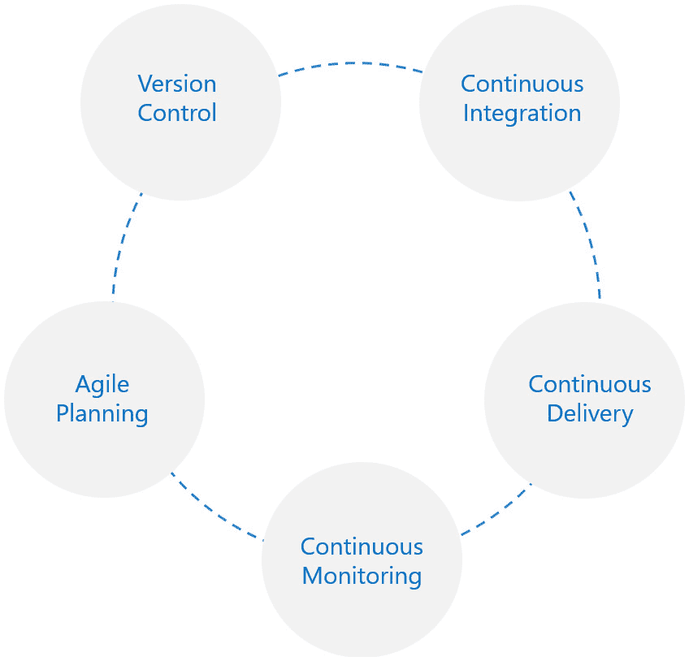

<st c="6908">图 1.1 – DevOps 的五个基本实践</st>

<st c="6959">值得注意的是，这些并不是 DevOps 中唯一的实践，但它们被认为是至关重要的实践。</st> <st c="7072">在接下来的章节中，我们将更详细地描述这五个核心实践。</st> <st c="7139">更多</st> <st c="7144">细节。</st>

<st c="7151">重要说明</st>

<st c="7166">对于那些希望探索</st> <st c="7194">与 DevOps 相关的其他定义和模型的人，DevOps</st> **<st c="7254">能力模型</st>** <st c="7270">由</st> <st c="7274">DevOps 敏捷技能协会</st> **<st c="7278">（DASA）</st>** <st c="7309">(</st>**<st c="7311">DASA</st>**<st c="7315">) 是一个有价值的资源。</st> <st c="7342">你可以在这里找到更多相关信息：</st> [<st c="7387">https://www.dasa.org/products/guidance-products/team-competence-model/</st>](https://www.dasa.org/products/guidance-products/team-competence-model/)<st c="7457">。</st>

## <st c="7458">理解 DevOps 的五个核心实践</st>

<st c="7506">在本节中，我们将首先从</st> <st c="7543">敏捷规划开始，探讨 DevOps 的五个基本实践。</st> <st c="7597">敏捷规划。</st>

**<st c="7612">敏捷规划</st>** <st c="7627">是广泛</st> <st c="7639">指用于计划和跟踪我们在 DevOps 中软件项目的技术。</st> <st c="7719">它是一种项目管理方法，涉及将一个项目分解为小的、可管理的部分，并以迭代方式进行工作。</st> <st c="7856">敏捷方法论于 2001 年通过《敏捷宣言》正式发布，涵盖了敏捷项目管理的主要原则。</st> <st c="7995">要获取更多关于《敏捷宣言》的信息，您可以访问</st> <st c="8054">以下链接</st> [<st c="8057">https://agilemanifesto.org/</st>](https://agilemanifesto.org/)<st c="8084">。</st>

<st c="8085">目标是逐步和持续地交付一个可用的产品，同时获取</st> <st c="8188">利益相关者的反馈。</st>

<st c="8205">一个简单的敏捷规划示例可以在移动应用开发中看到。</st> <st c="8289">假设某公司希望开发一个可以从本地餐馆订餐的移动应用。</st> <st c="8402">开发团队首先会确定应用应该具备的关键功能，例如菜单、订餐系统、支付系统和用户资料。</st> <st c="8555">掌握这些需求后，他们会设计应用的架构。</st> <st c="8640">接下来，团队会将这些功能分解为更小、更可管理的任务，例如设计用户界面、创建存储订单的数据库和集成支付系统。</st> <st c="8845">然后，团队会根据任务所带来的业务价值和完成这些任务所需的努力程度，优先处理这些任务。</st> <st c="8976">任务优先级确定后，团队会估算完成每个任务所需的时间，并制定冲刺计划。</st> <st c="9098">冲刺是一个短期的、有时间限制的工作周期（通常为 1-2 周），在此期间团队会集中处理一组</st> <st c="9194">任务。</st>

<st c="9203">在每个冲刺期间，团队会按优先级顺序处理任务，完成任务，并从利益相关者那里获得反馈。</st> <st c="9327">然后，反馈将用于调整</st> <st c="9385">产品和下一次冲刺的计划。</st> <st c="9428">这种将任务分解、优先排序、时间估算并在反馈中迭代工作的过程是</st> <st c="9554">敏捷规划的核心。</st>

<st c="9569">重要提示</st>

<st c="9584">要了解敏捷开发的指导价值观，我们建议查看以下链接中突出的敏捷开发的十二条原则：</st> [<st c="9733">https://www.agilealliance.org/agile101/12-principles-behind-the-agile-manifesto/</st>](https://www.agilealliance.org/agile101/12-principles-behind-the-agile-manifesto/)<st c="9813">。</st>

<st c="9814">第二个实践，</st> **<st c="9836">版本控制</st>**<st c="9851">，允许开发人员高效地管理代码更改，进行有效的协作，并跟踪对代码所做的所有更改。</st> *<st c="9983">图 1</st>**<st c="9991">.2</st>* <st c="9993">展示了版本控制在 DevOps 中如何工作的一个简单示例。</st> <st c="10057">假设一组开发人员正在开发一个软件应用程序。</st> <st c="10124">他们使用</st> <st c="10189">一个</st> **<st c="10192">版本控制系统</st>** <st c="10214">(</st>**<st c="10216">VCS</st>**<st c="10219">)，例如 Git，创建了一个仓库（存储代码的中央位置）。</st> <st c="10235">每个开发人员可以将仓库克隆到他们的本地计算机，或者他们也可以直接在一个受控的开发环境中工作，从而避免将代码复制到本地 PC。</st> <st c="10418">值得注意的是，一些公司对这种工作流程有严格的政策，不允许代码</st> <st c="10530">在本地克隆。</st>

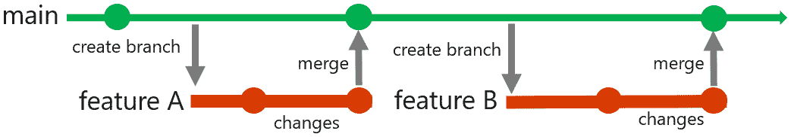

<st c="10648">图 1.2 – 版本控制和分支示例</st>

<st c="10698">假设开发人员 A 被分配来处理功能 A；他们在仓库中创建了一个新的分支，名为</st> **<st c="10805">功能 A</st>** <st c="10814">并开始对代码进行更改。</st> <st c="10853">与此同时，开发人员 B 正在开发应用程序中的另一个功能。</st> <st c="10930">他们创建了一个名为</st> **<st c="10962">功能 B</st>** <st c="10971">的新分支，并开始对代码进行更改。</st> <st c="11010">两个开发人员可以独立工作，彼此的工作不会互相影响。</st> <st c="11104">一旦他们完成了各自的更改，他们可以将分支合并回主分支（也叫做</st> **<st c="11217">主干</st>** <st c="11222">分支）中，</st> <st c="11233">并提交到仓库。</st>

<st c="11249">如果两个开发人员所做的更改之间存在任何冲突，</st> <st c="11277">版本控制系统将突出显示这些冲突，开发人员可以在合并分支之前解决它们。</st> <st c="11419">版本控制系统还会记录对代码所做的所有更改，包括谁做的更改、何时做的更改以及为什么做的更改。</st> <st c="11550">如果新代码出现问题，团队可以使用版本控制系统快速回滚到代码的先前版本。</st> <st c="11672">这种回滚功能在引入 bug 或新更改导致</st> <st c="11769">意外问题时非常有用。</st>

<st c="11789">第三</st> <st c="11800">种实践，</st> **<st c="11810">持续集成</st>** <st c="11832">(</st>**<st c="11834">CI</st>**<st c="11836">)，指的是开发人员每次提交或修改代码时，持续验证代码质量的过程。</st> <st c="11936">假设一个开发团队正在进行一个软件项目；每当开发人员完成代码更改并将其提交到共享代码库时，CI 服务器（如 Jenkins 或 Travis CI）会触发一个自动过程，构建软件、运行单元测试，并使用各种工具检查代码质量问题。</st> <st c="12285">如果构建和测试都成功通过，CI 服务器将通知团队，表示这些更改已准备好进行审查和集成。</st> <st c="12417">如果发现任何错误或问题，CI 服务器将提醒团队，团队可以共同解决问题，然后再将代码合并到共享代码库中。</st> <st c="12592">这使得团队能够在开发早期发现并修复问题，从而减少最终产品中出现 bug 和错误的风险：</st>

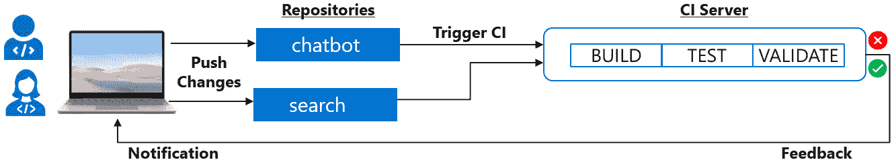

<st c="12833">图 1.3 – 示例 CI 流程</st>

<st c="12860">第四</st> <st c="12882">种实践，</st> **<st c="12882">持续交付</st>** <st c="12901">(</st>**<st c="12903">CD</st>**<st c="12905">)，指的是通过自动化过程持续进行已验证软件的测试和部署。</st> <st c="12957">它允许团队快速发布新特性和修复 bug，采用连续的流程进行。</st> <st c="13004">CD 的目标是使开发团队能够快速且有信心地将软件更改交付到生产环境，同时保持高水平的质量</st> <st c="13252">和可靠性。</st>

<st c="13268">假设一个开发团队正在开发一个 web 应用程序；当团队为一个新特性编写代码时，代码会被提交到版本控制系统，并通过一系列自动化测试进行测试，包括单元测试、集成测试和验收测试。</st> <st c="13543">一旦代码通过所有测试，它会被自动部署到预发布环境，在那里进行额外的测试和产品负责人审核。</st> <st c="13703">如果一切正常，代码将被自动部署到生产环境，并提供给</st> <st c="13813">所有用户。</st>

<st c="13823">第五项实践</st> <st c="13843">是</st> **<st c="13846">持续监控</st>** <st c="13867">包括收集</st> <st c="13886">来自用户的反馈和实时运行应用程序的遥测数据。</st> <st c="13977">目标是确保软件系统满足用户需求并为组织提供价值。</st> <st c="14094">这需要持续收集软件系统的性能和行为的洞察，并利用这些信息做出基于数据的决策，从而提升整体质量和用户体验。</st> <st c="14301">为了更好地理解这一实践，我们将其分解为</st> <st c="14362">两个组成部分：</st>

+   **<st c="14377">收集用户反馈</st>**<st c="14407">：用户反馈是持续监控的一个重要组成部分，因为它有助于从用户的角度识别软件系统中的问题和改进的空间。</st> <st c="14589">反馈可以通过各种渠道收集，例如调查、用户评论和支持票据。</st> <st c="14693">通过分析这些反馈，开发团队可以识别出反映改进领域的模式和趋势，并根据这些改进对</st> <st c="14872">用户体验的影响优先考虑这些改进。</st>

+   **<st c="14888">收集来自运行中的应用程序的遥测数据</st>**<st c="14940">：遥测数据是指在软件系统实时运行过程中从各种来源收集的广泛信息。</st> <st c="15074">这些来源可以包括应用日志、服务器指标、网络流量、用户互动、错误报告等。</st> <st c="15195">从这些数据中可以得出响应时间、错误率、服务器负载等指标，以及用户行为的洞察。</st> <st c="15329">通过收集和分析遥测数据，开发团队可以全面了解软件的性能和用户互动。</st> <st c="15483">这些数据对在问题升级为</st> <st c="15578">关键问题之前检测异常和潜在问题至关重要。</st>

<st c="15596">通过结合用户反馈和遥测数据，开发团队可以全面了解软件系统的表现以及用户如何使用它。</st> <st c="15769">然后，这些信息可以用来做出基于数据的决策，改进系统</st> <st c="15865">并优先考虑未来的开发工作。</st> <st c="15908">总体而言，持续监控的第五项实践是 DevOps 中至关重要的一部分，帮助确保软件系统满足用户需求，并为</st> <st c="16077">组织提供价值。</st>

## <st c="16094">理解 DevOps 工作流中的各个阶段</st>

<st c="16140">理解</st> <st c="16159">DevOps 的五项基本实践至关重要，但组织如何将它们付诸实践呢？</st> <st c="16251">DevOps 实践的实施涉及一系列阶段，这些阶段有助于软件的持续开发、测试和部署。</st> <st c="16394">这些阶段可能会根据组织和开发的软件类型有所不同，但它们通常遵循如</st> *<st c="16533">图 1</st>**<st c="16541">.4</st>*<st c="16543">所示的模式：</st>

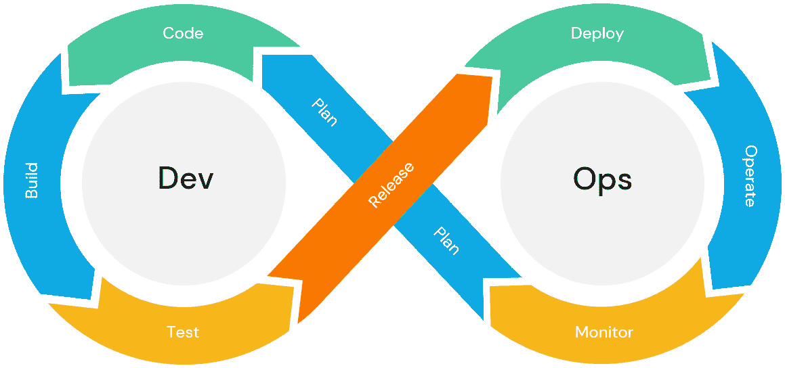

<st c="16553">图 1.4 – DevOps 工作流中的典型阶段</st>

<st c="16601">第一阶段是</st> **<st c="16621">计划</st>**<st c="16625">，在此阶段，敏捷规划实践开始付诸实施。</st> <st c="16681">在这个阶段，团队根据业务或客户需求计划并优先排序需要完成的任务。</st> <st c="16796">这涉及到创建项目计划或路线图，进行调研以了解所需的架构变更，定义工作范围（如功能开发或修复 bug），将计划分解为更小且可分配的任务，估算每个任务所需的时间，并为需要</st> <st c="17135">优先完成的任务设定优先级。</st>

<st c="17151">第二阶段是</st> **<st c="17172">编码</st>**<st c="17176">，这涉及到使用</st> <st c="17248">选定的编程语言、框架和工具进行实际编码和软件开发。</st> <st c="17304">在这一阶段，会实施版本控制实践。</st> <st c="17372">团队协作开发代码并提交更改到版本</st> <st c="17446">控制系统。</st>

<st c="17461">第三阶段是</st> **<st c="17481">构建</st>** <st c="17486">和</st> **<st c="17491">测试</st>**<st c="17495">，在这一阶段，会实施持续集成实践。</st> <st c="17553">在这一阶段，代码被转换为可执行的软件并经过测试，以确保其按预期工作并满足项目要求。</st> <st c="17700">结合使用自动化和手动测试来发现并解决任何错误、bug</st> <st c="17796">或缺陷。</st>

<st c="17807">第四阶段是</st> **<st c="17828">发布</st>** <st c="17835">和</st> **<st c="17840">部署</st>**<st c="17846">，在此阶段，软件被打包并发布到生产环境中。</st> <st c="17925">在这一阶段，会实施持续交付实践。</st> <st c="17986">这一阶段包括设置运行软件所需的基础设施并进行配置，使其能够正常工作，将软件部署到预生产环境中以进行额外的验证，并将经过验证的软件</st> <st c="18213">部署到生产环境。</st>

<st c="18229">第五个阶段是</st> **<st c="18249">操作</st>** <st c="18256">和</st> **<st c="18261">监控</st>**<st c="18268">，在这个阶段，软件会被主动监控和维护。</st> <st c="18327">团队会在部署后监控任何问题或事件，检查应用程序的性能，收集并分析日志，并确保软件符合</st> <st c="18507">已定义的</st> **<st c="18515">服务水平协议</st>** <st c="18539">(</st>**<st c="18541">SLA</st>**<st c="18545">)。</st> <st c="18549">在这一阶段，使用持续监控工具和实践来跟踪应用程序的性能，收集使用遥测和性能指标，并在问题影响用户之前检测潜在问题。</st> <st c="18759">收集到的信息随后用于识别优化的领域或要添加的附加功能。</st> <st c="18868">一种</st> **<st c="18870">自愈</st>** <st c="18883">方法</st> <st c="18891">在这一阶段越来越受到欢迎。</st> <st c="18957">这种方法涉及利用自动化来修正任何故障或错误，无需人工干预，例如终止一个有问题的应用实例并部署替代实例，或在发生意外事件时触发故障转移到备用实例。</st> <st c="19240">实施这种方法显著提高了系统的可用性和可靠性，并能更快速、更高效地从故障中恢复。</st> <st c="19373">故障恢复。</st>

<st c="19387">这些阶段形成了一个持续的循环，使团队能够持续向最终用户交付价值，同时提升软件开发流程。</st> <st c="19543">请记住，速度</st> <st c="19570">对成功的 DevOps 工作流至关重要！</st> <st c="19611">每个阶段都必须快速高效地执行（我们将在谈到</st> <st c="19727">安全集成时重新讨论这一点）。</st>

# <st c="19750">理解 DevOps 中的人文因素</st>

<st c="19792">单纯在持续工作流中实施</st> <st c="19812">DevOps 实践不足以充分释放其潜力；还需要一个文化方面的因素。</st> <st c="19942">在促进沟通、协作和开发与运维团队成员之间共享责任的文化中，实施 DevOps 方法可以取得更好的结果。</st> <st c="20138">然而，对于许多组织（尤其是大型组织），这是拥抱 DevOps 时最困难的方面，因为它涉及到心态和公司文化的变化，这可能会挑战已经取得良好效果的既定政策和流程。</st> <st c="20412">到目前为止。</st>

## <st c="20421">协作文化的重要性</st>

<st c="20463">要实现 DevOps 的全部</st> <st c="20484">潜力，组织必须拥抱协作文化！</st> <st c="20559">我们所说的文化是打破团队孤岛，使开发人员、运维工程师和其他利益相关者能够共同合作，达成持续向客户交付高质量软件的共同目标。</st> <st c="20789">这可以通过创建跨职能团队或</st> <st c="20848">垂直团队来实现。</st>

<st c="20863">传统上，大型组织会根据特定的技能集或职能领域，如开发、测试或运维，采用横向结构来组织团队（如</st> *<st c="21060">图 1</st>**<st c="21068">.5</st>*<st c="21070">所示）</st>。 <st c="21074">每个团队专注于自己的专业领域，仅处理该领域内的任务。</st> <st c="21167">这些团队被一个边界隔开（如</st> *<st c="21224">图 1</st>**<st c="21232">.6 所示</st>*<st c="21235">），并使用不同的绩效指标来评估，这通常会导致冲突。</st>

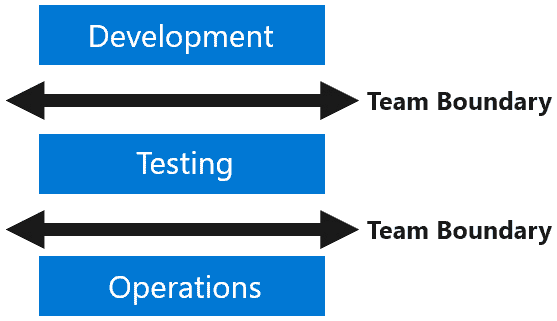

<st c="21373">图 1.5 – 软件开发中的团队边界</st>

<st c="21425">另一方面，DevOps 提倡并在围绕特定产品或服务垂直组织的团队中蓬勃发展，这也被称为跨职能团队。</st> <st c="21598">这种结构将来自不同职能领域的人员聚集在一起，共同合作，目标是交付特定的产品或服务。</st> <st c="21753">每个团队成员具备广泛的技能，并负责为交付该产品或服务作出贡献。</st> <st c="21883">这些团队还通过一套共享的绩效指标进行评估，这鼓励团队成员利用彼此的技能和专业知识来实现共同目标。</st> <st c="22055">例如，一个垂直团队可能由开发人员、测试人员和运维工程师组成，共同合作，交付特定的应用程序或服务，如下图所示：</st>

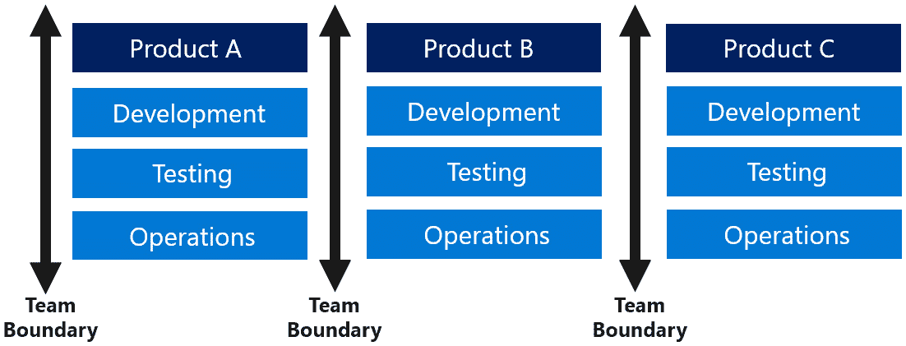

<st c="22315">图 1.6 – 垂直团队边界</st>

<st c="22352">需要特别注意的是，尽管团队的组成至关重要，但一个引导人物的存在，通常是一个仆人式领导者，同样重要。</st> <st c="22506">团队需要清晰的方向和领导力，才能高效运作。</st> <st c="22574">这位领导者确保团队始终与目标保持一致，促进协作，并提供解决挑战所需的支持。</st> <st c="22705">应对挑战。</st>

<st c="22724">DevOps 还有其他文化组成部分，例如培养持续</st> <st c="22813">学习和实验、责任心和问责制的文化。</st> <st c="22875">然而，我们建议阅读</st> *<st c="22905">《凤凰项目》</st>* <st c="22924">由基恩·金（Gene Kim）所著，以便更详细地了解</st> <st c="22974">这些组成部分。</st>

## <st c="22991">避免 DevOps 反类型</st>

<st c="23026">在实施</st> <st c="23046">DevOps 文化时，重要的是要意识到潜在的反模式和反类型。</st> <st c="23134">这些是低效的，有时甚至适得其反的方法，可能会阻碍 DevOps 的成功实施。</st> <st c="23245">的实施。</st>

<st c="23255">例如，在实施 DevOps 时，一位经理或高管可能会创建一个单独的 DevOps 团队，这可能进一步分割开发和运维团队（</st>*<st c="23420">图 1</st>**<st c="23429">.7</st>*<st c="23431">）。</st> <st c="23435">这种分离只有在团队是临时性的，且有明确的任务将团队</st> <st c="23551">紧密结合起来时，才有意义：</st>

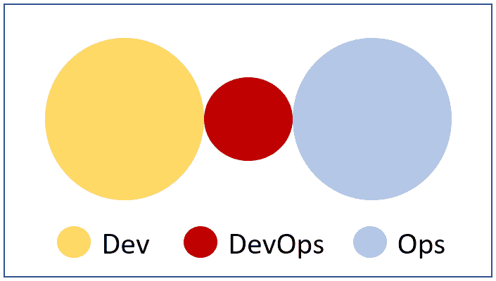

<st c="23589">图 1.7 – 反模式 1</st>

<st c="23621">另一个常见的反类型是当开发人员或开发经理认为他们可以不依赖操作技能和活动时（</st>*<st c="23752">图 1</st>**<st c="23761">.8</st>*<st c="23763">）。</st> <st c="23767">这种误解通常源于对云计算的错误理解，认为云计算的自助服务特性使得操作技能变得过时。</st> <st c="23948">然而，这种观点极大</st> <st c="23982">低估了操作技能的复杂性和重要性，导致可避免的</st> <st c="24078">操作失误：</st>

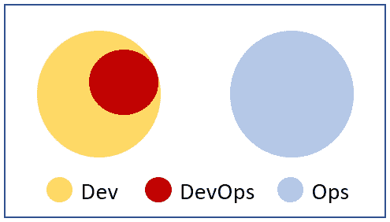

<st c="24121">图 1.8 – 反模式 2</st>

<st c="24153">另一个反模式是组织仅仅将他们的运维团队重新命名为 DevOps 或</st> **<st c="24249">站点可靠性工程</st>** <st c="24277">(</st>**<st c="24279">SRE</st>**<st c="24282">) 团队，而没有对他们的</st> <st c="24330">流程或孤岛做出任何实际改变（参见</st> *<st c="24359">图 1</st>**<st c="24367">.9</st>*<st c="24369">）。</st> <st c="24373">这种方法没有理解或认识到将不同领域的人员汇聚在一起，协同工作以实现</st> <st c="24524">共同目标的重要性：</st>

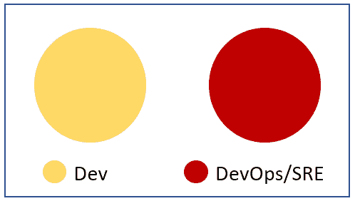

<st c="24555">图 1.9 – 反模式 3</st>

<st c="24587">SRE 是一种将软件工程的理念融入基础设施和运维问题的学科。</st> <st c="24718">SRE 团队的主要目标是创建可扩展且高度可靠的软件系统。</st> <st c="24807">虽然 SRE 与 DevOps 理念高度契合，但仅仅将运维团队更名为 SRE 而没有采纳其原则或实践，可以视为一种反模式。</st> <st c="24982">这不仅仅是一个名称问题，而是要拥抱 DevOps 和 SRE 都提倡的</st> <st c="25037">方法论、实践和文化。</st>

<st c="25113">重要提示</st>

<st c="25128">有关 DevOps 反模式的更详细分析，请参阅 Matthew Skelton 和 Manuel Pais 的著作</st> *<st c="25218">《团队拓扑学》</st>* <st c="25233">。</st>

# <st c="25269">了解 DevOps 的产品层面——工具链</st>

<st c="25328">尽管 DevOps 本身不是</st> <st c="25356">一个工具或产品，但它需要使用工具来有效实施其流程和实践。</st> <st c="25458">可以使用开源和商业工具来支持本章前面讨论的 DevOps 工作流每个阶段所需的流程（计划、编码、构建与测试、发布与部署、以及运维</st> <st c="25679">和监控）。</st>

<st c="25692">常用的工具</st> <st c="25705">包括</st> **<st c="25718">计划阶段</st>** <st c="25732">常用的工具有</st> **<st c="25741">Trello</st>**<st c="25747">、</st> **<st c="25749">JIRA</st>**<st c="25753">、</st> **<st c="25755">Notion</st>**<st c="25761"> 和</st> **<st c="25767">Asana</st>**<st c="25772">。根据最新的 Stack Overflow 开发者调查，专业开发者更倾向于使用 JIRA（49%），而 Trello 则主要被学习编程的人使用（43%）：</st>

<st c="26026">图 1.10 – 计划阶段常用工具</st>

<st c="26079">在</st> <st c="26086">**代码与开发阶段**</st> <st c="26091">, 开发人员使用</st> **<st c="26134">集成开发环境</st>** <st c="26169">(</st>**<st c="26171">IDE</st>**<st c="26175">)，例如</st> **<st c="26187">Visual Studio Code</st>**<st c="26205">、</st> **<st c="26207">Visual Studio</st>**<st c="26220">、</st> **<st c="26222">IntelliJ</st>**<st c="26230">、</st> **<st c="26232">Notepad++</st>** <st c="26242">和</st> **<st c="26247">Eclipse</st>**<st c="26254">，用于</st> <st c="26260">编写代码</st> <st c="26266">和</st> <st c="26276">版本控制工具，例如</st> <st c="26307">**<st c="26311">Git</st>** <st c="26314">(自托管或云托管)，</st> **<st c="26346">Apache Subversion</st>** <st c="26363">(</st>**<st c="26365">SVN</st>**<st c="26368">)，</st> **<st c="26372">Perforce</st>**<st c="26380">和</st> **<st c="26386">Mercurial</st>**<st c="26395">。需要注意的是</st> <st c="26412">，虽然这个列表突出显示了</st> <st c="26420">一些常见工具，但它并非详尽无遗。</st> <st c="26453">市场上还有无数其他工具，每个工具都有其独特的功能和能力。</st> <st c="26514">根据 2022 年 Stack Overflow 开发者调查，专业开发者压倒性地偏爱 Git 作为他们的版本控制</st> <st c="26749">工具（96%）和 Visual Studio Code 作为他们的</st> <st c="26792">IDE（74%）：</st>

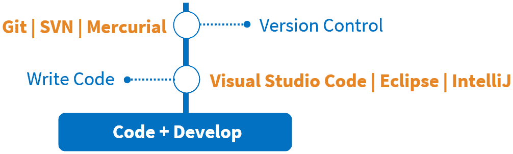

<st c="26922">图 1.11 – 常见的代码和开发工具</st>

<st c="26969">重要提示</st>

<st c="26984">Stack Overflow 开发者调查是由 Stack Overflow 进行的一项年度调查，Stack Overflow 是一个受欢迎的在线开发者社区。</st> <st c="27113">该调查旨在收集开发者社区的偏好、意见和人口统计信息。</st> <st c="27225">2022 年的调查结果可以在</st> <st c="27255">这里找到：</st> [<st c="27261">https://survey.stackoverflow.co/2022</st>](https://survey.stackoverflow.co/2022)<st c="27297">。</st>

<st c="27298">在</st> **<st c="27306">构建与测试阶段</st>**<st c="27326">，如</st> **<st c="27342">Jenkins</st>** <st c="27349">(一个开源自动化服务器)，</st> **<st c="27386">Travis CI</st>**<st c="27395">和</st> **<st c="27401">Circle CI</st>** <st c="27410">广泛用于持续集成以及构建和测试自动化。</st> <st c="27488">根据 Digital.ai 的最新调查，Jenkins 被 56%的 DevOps 团队使用，显示出它在行业中的受欢迎程度。</st> <st c="27612">此外，测试工具如</st> **<st c="27644">Selenium</st>**<st c="27652">，</st> **<st c="27654">Junit</st>** <st c="27659">(一个 Java 单元测试工具)，</st> **<st c="27692">Nunit</st>** <st c="27697">(一个.NET 单元测试工具)，</st> **<st c="27730">PHPUnit</st>** <st c="27737">(一个 PHP 单元测试工具)，以及</st> **<st c="27773">Jmeter</st>** <st c="27779">(一个性能测试负载测试工具)可以与构建自动化服务器集成，以便于测试过程。</st> <st c="27908">容器构建工具如</st> **<st c="27938">Docker Build</st>** <st c="27950">(一个从 Dockerfile 构建容器镜像的工具)，</st> **<st c="28009">Podman Build</st>** <st c="28021">(一个使用 Containerfiles 和 Dockerfiles 构建和管理容器的工具)，</st> **<st c="28106">Buildah</st>** <st c="28113">(一个开源工具，用于创建和修改容器镜像)，以及</st> **<st c="28185">Kaniko</st>** <st c="28191">(一个为 Kubernetes 集群设计的安全容器构建工具)也可以集成进来，以简化容器</st> <st c="28304">镜像构建。</st>

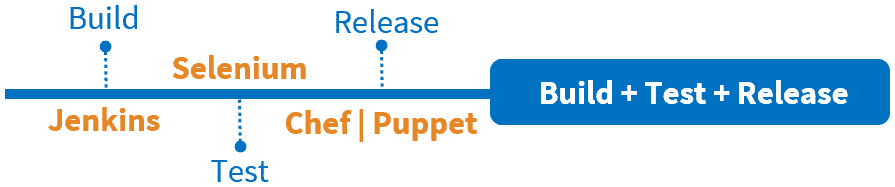

<st c="28395">图 1.12 – 构建与测试阶段常用的工具</st>

<st c="28454">在</st> <st c="28462">**<st c="28466">发布与部署阶段</st>**<st c="28490">，开发者使用各种工具</st> <st c="28521">来自动化部署。</st> <st c="28546">下表展示了一些在发布和</st> <st c="28614">部署阶段使用的工具：</st>

| **<st c="28627">部署</st>** |
| --- |
| **<st c="28638">GoCD</st>** | <st c="28643">一个开源的持续交付工具，自动化</st> <st c="28699">部署流水线</st> |
| **<st c="28719">Octopus Deploy</st>** | <st c="28734">一个部署自动化和发布</st> <st c="28771">管理工具</st> |
| **<st c="28786">TeamCity</st>** | <st c="28795">一个构建管理和持续</st> <st c="28830">集成服务器</st> |
| **<st c="28848">Spinnaker</st>** | <st c="28858">一个开源的、多云的持续</st> <st c="28898">交付平台</st> |
| **<st c="28915">ArgoCD</st>** | <st c="28922">一个声明式持续交付工具</st> <st c="28962">用于 Kubernetes</st> |
| **<st c="28976">基础设施</st>** **<st c="28992">即代码</st>** |
| **<st c="28999">Terraform</st>** | <st c="29009">一个开源的基础设施即代码</st> <st c="29048">软件工具</st> |
| **<st c="29061">Azure</st>** **<st c="29068">ARM 模板</st>** | <st c="29081">一个部署工具，允许定义</st> <st c="29174">Azure 资源</st>的基础设施和配置 |
| **<st c="29189">Azure</st>** **<st c="29196">BICEP 模板</st>** | <st c="29211">一种用于部署</st> <st c="29263">Azure 资源</st>的 ARM 模板语言替代品 |
| **<st c="29278">AWS Cloud</st>** **<st c="29289">Formation 模板</st>** | <st c="29308">一个开源的多云持续</st> <st c="29347">交付平台</st> |
| **<st c="29364">容器部署</st>** |
| **<st c="29385">Helm charts</st>** | <st c="29397">Kubernetes 的包管理器，帮助管理</st> <st c="29449">Kubernetes 应用</st> |
| **<st c="29472">Kubernetes</st>** **<st c="29484">清单文件</st>** | <st c="29498">一个 YAML 或 JSON 文件，定义</st> <st c="29557">Kubernetes 对象</st>的期望状态 |
| **<st c="29575">配置</st>** **<st c="29590">管理工具</st>** |
| **<st c="29606">Ansible</st>** | <st c="29614">一个开源自动化引擎，自动化软件供应、配置管理和</st> <st c="29716">应用部署</st> |
| **<st c="29738">Chef</st>** | <st c="29743">一个配置管理工具，帮助</st> <st c="29787">自动化基础设施</st> |
| **<st c="29810">Puppet</st>** | <st c="29817">一个开源工具，用于管理 Unix、Linux 和 Microsoft</st> <st c="29899">Windows 服务器的配置</st> |
| **<st c="29914">PowerShell Desired State</st>** **<st c="29940">Configuration (DSC)</st>** | <st c="29959">一个 PowerShell 扩展，支持配置</st> <st c="30017">Windows 系统</st> |

<st c="30032">表 1.1 – 发布和部署阶段使用的工具</st>

<st c="30087">在</st> **<st c="30099">运营和监控阶段</st>**<st c="30124">，可以使用多个工具。</st> <st c="30153">其中一些在</st> <st c="30173">下表中突出显示：</st>

| **<st c="30197">OpenTelemetry</st>** | <st c="30211">一个开源的可观测性框架，用于生成和收集来自应用</st> <st c="30314">和基础设施</st>的遥测数据 |
| --- | --- |
| **<st c="30332">Jaeger</st>** | <st c="30339">一个开源的分布式追踪系统，用于监控和排查</st> <st c="30418">基于微服务的应用</st> |
| **<st c="30450">Zipkin</st>** | <st c="30457">一个开源的分布式追踪系统，用于收集、分析和可视化跨</st> <st c="30571">微服务架构的请求追踪</st> |
| **<st c="30597">Prometheus</st>** | <st c="30608">一个开源监控系统和时间序列数据库，用于收集和查询应用程序</st> <st c="30721">及基础设施的指标</st> |

<st c="30739">表 1.2 – 在操作和监控阶段使用的工具</st>

<st c="30795">类似</st> **<st c="30811">Prometheus</st>** <st c="30821">的工具可以用于对应用程序代码进行仪表化，并生成诸如指标、日志和追踪等遥测数据。</st> <st c="30928">Prometheus、</st> **<st c="30940">Grafana</st>**<st c="30947">和</st> **<st c="30953">ELK 堆栈</st>** <st c="30962">(Elasticsearch、Logstash 或 Kibana)可以用于监控应用程序和基础设施的性能</st> <st c="31043">和</st> <st c="31046">可用性，提供潜在问题的洞察并实现</st> <st c="31150">主动修复。</st>

<st c="31172">协作和通信工具</st> <st c="31210">如</st> **<st c="31219">Slack</st>**<st c="31224">、</st> **<st c="31226">Microsoft Teams</st>**<st c="31241">、</st> **<st c="31243">Azure Boards</st>**<st c="31255">和</st> **<st c="31261">Atlassian Confluence</st>** <st c="31281">可用于促进</st> <st c="31307">团队间的沟通</st> <st c="31321">和协作，帮助简化工作流程并</st> <st c="31391">提高生产力。</st>

<st c="31412">开发人员可以访问各种工具，涵盖每个阶段，超出了我们已提及的工具范围。</st> <st c="31526">为了理解可用的丰富工具选项，我们建议参考由</st> **<st c="31655">Cloud Native Computing Foundation</st>** <st c="31688">(</st>**<st c="31690">CNCF</st>**<st c="31694">)</st> <st c="31694">提供的云原生生态图，网址为</st> [<st c="31700">https://landscape.cncf.io/</st>](https://landscape.cncf.io/)<st c="31726">。该图（</st>*<st c="31737">图 1</st>**<st c="31746">.13</st>*<st c="31749">）旨在帮助人们浏览云原生领域中的各种工具、技术和平台。</st> <st c="31755">该图展示了多个类别的工具，包括应用开发、持续集成和交付、自动化、</st> <st c="32011">以及配置管理。</st>

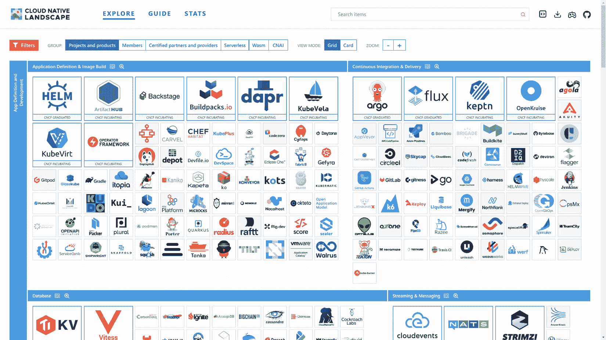

<st c="32898">图 1.13 – CNCF 生态图的截图</st>

<st c="32950">随着团队采纳 DevOps 实践，通常会根据偏好选择多个工具，而非考虑与组织 DevOps 战略的整体兼容性（不幸的是，许多组织并没有明确的 DevOps 战略）。</st> <st c="33212">因此，碎片化的工具链可能是常见的现象，不同的团队和产品单元使用不同的工具，这些工具可能无法很好地集成或协同工作，从而阻碍了软件交付的扩展能力，并带来了治理挑战。</st> <st c="33467">使用多个工具时，很难建立并强制执行与访问控制和数据隐私相关的治理和合规政策。</st> <st c="33619">为了解决这些挑战，平台化工具方法可能是更受欢迎的选择。</st>

## <st c="33696">平台化 DevOps 工具方法</st>

<st c="33736">与其为 DevOps 工作流的每个阶段使用多个不同的工具，一些组织选择了平台战略，提供一个集成平台，配备各个阶段所需的工具。</st> <st c="33934">这种方法可以简化 DevOps 工具的使用场景，使得管理变得更加容易，并减少了不同工具之间手动集成的需求。</st>

<st c="34087">根据行业报告和调查，以下是五个最常用且评价很高的商业 DevOps</st> <st c="34205">平台：</st>

+   **<st c="34224">GitLab</st>**<st c="34231">: 一体化 DevOps 平台，提供一个用于源代码管理、持续集成、测试</st> <st c="34360">与部署的应用程序。</st>

+   **<st c="34375">Azure DevOps</st>**<st c="34388">: 一款微软基于云的平台，提供一整套 DevOps 服务，帮助开发者规划、开发、测试并</st> <st c="34504">部署应用程序。</st>

+   **<st c="34524">GitHub</st>**<st c="34531">: 另一款微软基于云的平台，提供一整套 DevOps 服务，帮助开发者规划、开发、测试并</st> <st c="34653">部署应用程序。</st>

+   **<st c="34673">Atlassian</st>**<st c="34683">: Atlassian 提供一系列 DevOps 工具，包括用于问题跟踪的 Jira、用于源代码管理的 Bitbucket 和用于持续集成</st> <st c="34849">与部署的 Bamboo。</st>

+   **<st c="34864">Amazon Web Services (AWSs) DevOps</st>**<st c="34898">: AWS 提供了一整套用于 DevOps 的工具和服务，包括 AWS CodePipeline、AWS CodeCommit 和</st> <st c="34947">AWS CodeDeploy。</st>

<st c="35018">其中两个平台是微软的</st> <st c="35032">产品，将实现 DevOps 流程所需的工具汇聚在一个地方：Azure DevOps</st> <st c="35160">和 GitHub。</st>

## <st c="35171">Azure DevOps 平台概览</st>

**<st c="35212">Azure DevOps</st>** <st c="35225">是微软的</st> <st c="35241">云平台</st> <st c="35256">，提供帮助团队实施 DevOps 流程的服务。</st> <st c="35314">要使用它，我们需要创建一个 Azure DevOps 组织（</st>*<st c="35373">图 1</st>**<st c="35382">.14</st>*<st c="35385">）。</st> <st c="35389">在该组织内，我们可以为不同的软件项目创建独立的项目，如</st> *<st c="35514">图 1</st>**<st c="35522">.14</st>*<st c="35525"> 所示。在每个项目中，我们可以访问用于实施 DevOps 流程的服务，并且可以组织团队来处理项目的不同部分：</st>

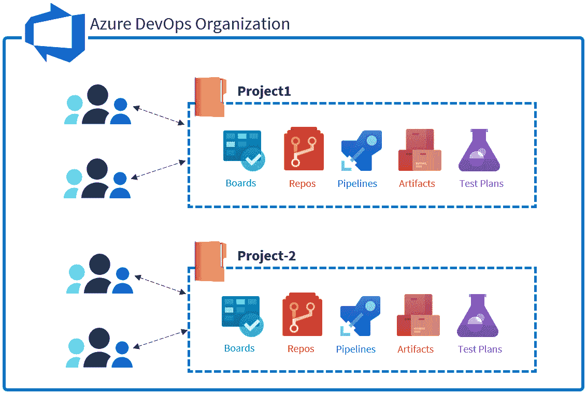

<st c="35918">图 1.14 – Azure DevOps 组织结构</st>

<st c="35967">Azure DevOps 平台有五个核心服务。</st> <st c="36018">这些服务与开发过程中的关键实践相连接，如</st> <st c="36071">计划、控制代码变更和测试。</st> <st c="36097">这五项核心服务是</st> <st c="36152">Azure DevOps</st> 的核心：</st>

+   **<st c="36201">Azure Boards</st>** <st c="36214">用于计划</st>

+   **<st c="36227">Azure Repos</st>** <st c="36239">用于控制</st> <st c="36256">代码变更</st>

+   **<st c="36268">Azure Pipelines</st>** <st c="36284">用于持续集成</st> <st c="36312">和交付</st>

+   **<st c="36324">Azure Artifacts</st>** <st c="36340">用于</st> <st c="36345">包管理</st>

+   **<st c="36363">Azure Test Plans</st>** <st c="36380">用于探索性</st> <st c="36397">测试计划</st>

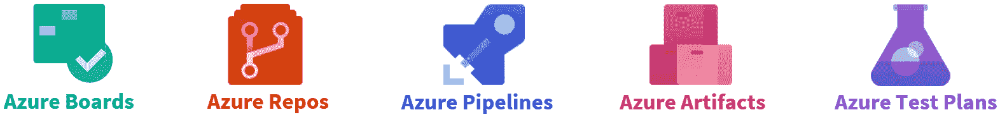

<st c="36492">图 1.15 – Azure DevOps 核心服务</st>

<st c="36532">让我们简要了解这五项服务，从</st> <st c="36590">Azure Boards</st> 开始：

+   **<st c="36603">Azure Boards</st>**<st c="36616">：一个帮助我们规划、跟踪和可视化工作的工具，类似于 JIRA。</st> <st c="36693">它可以与 Scrum 或 Kanban 方法一起使用，并提供四种不同的模板供选择。</st> <st c="36792">它还具有交互式看板和报告工具，帮助我们跟踪</st> <st c="36868">我们的工作。</st>

+   **<st c="36877">Azure Repos</st>**<st c="36889">：用于管理代码变更的源代码管理服务。</st> <st c="36958">它支持两种代码管理方式：Git 和</st> **<st c="37010">团队基础版本控制</st>** <st c="37041">（</st>**<st c="37043">TFVC</st>**<st c="37047">）。</st> <st c="37051">它还与 Azure DevOps 中的其他服务集成</st> <st c="37109">以支持可追溯性。</st>

+   **<st c="37126">Azure Pipelines</st>**<st c="37142">：一个帮助我们自动构建、测试和部署代码的工具。</st> <st c="37213">它可用于实现持续集成和持续交付的过程。</st> <st c="37304">它支持多种不同类型的编程语言和平台，包括 Python、Java、PHP、Ruby、C#和 Go。</st> <st c="37426">我们还可以用它将代码部署到各种目标，包括本地服务器或</st> <st c="37527">云服务。</st>

+   **<st c="37542">Azure Artifacts</st>**<st c="37558">：一个帮助我们存储、管理和组织软件包的工具。</st> <st c="37632">我们可以选择并控制与谁共享包。</st> <st c="37694">它允许我们从上游源下载包。</st> <st c="37751">它支持多种类型的包，如 NuGet、NPM、Maven、Universal、</st> <st c="37832">和 Python。</st>

+   **<st c="37843">Azure Test Plans</st>**<st c="37860">：一个云托管的测试管理解决方案，我们可以用它来计划和跟踪不同类型的测试结果。</st> <st c="37978">我们可以用它来规划和跟踪手动</st> <st c="38017">测试、用户</st> <st c="38028">验收测试、探索性测试，甚至是自动化测试。</st> <st c="38092">我们可以通过任何支持的浏览器访问工具，并通过易于使用的网页门户执行手动测试。</st> <st c="38200">它支持端到端的可追溯性，用于跟踪我们需求和构建的进展与质量，并为我们提供数据和报告，以改进我们的</st> <st c="38358">测试过程。</st>

<st c="38376">关于 Azure DevOps 平台的一件好事是，我们不被强迫使用它的所有服务。</st> <st c="38470">我们可以选择要用于软件项目的服务，并关闭那些我们</st> <st c="38561">不需要的服务（</st>*<st c="38574">图 1</st>**<st c="38583">.16</st>*<st c="38586">）。</st>

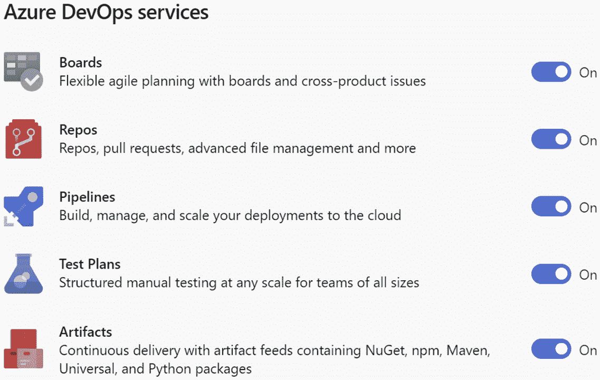

<st c="39020">图 1.16 – 启用/禁用 Azure DevOps 服务</st>

## <st c="39070">GitHub 平台概述</st>

<st c="39105">GitHub 平台</st> <st c="39125">提供多种产品选项，适应不同规模的团队和组织。</st> <st c="39144">这些选项包括</st> <st c="39221">以下内容：</st> 

+   **<st c="39255">GitHub Free</st>**<st c="39267">：这是一个免费的基础版，适合小型个人项目或开源</st> <st c="39349">项目。</st>

+   **<st c="39365">GitHub Pro</st>**<st c="39376">：这是一个付费版本，具有额外功能，如高级保护功能、受保护的分支和代码所有者。</st> <st c="39505">它适合需要更多</st> <st c="39544">高级工具的开发人员。</st>

+   **<st c="39559">GitHub Team</st>**<st c="39571">：此版本包含 GitHub Pro 的所有功能，并具有团队管理工具。</st> <st c="39661">适合需要在项目中进行协作的团队。</st> <st c="39719">如果您的组织有 11 名或更少开发者，请考虑使用</st> <st c="39777">GitHub Team。</st>

+   **<st c="39789">GitHub Enterprise</st>**<st c="39807">：此版本适用于需要更多高级功能（如 SAML</st> **<st c="39896">单点登录</st>** <st c="39910">(</st>**<st c="39912">SSO</st>**<st c="39915">)、数据驻留合规性和高级安全功能）的大型组织。</st> <st c="39982">它适合需要遵循特定安全和监管要求的大型组织。</st> <st c="40083">通常，拥有 12 名或更多开发者的组织最能从 GitHub Enterprise 中获益。</st> <st c="40175">企业版还提供两种选项：企业服务器，托管在客户管理的基础设施上，以及企业云，托管在云端。</st>

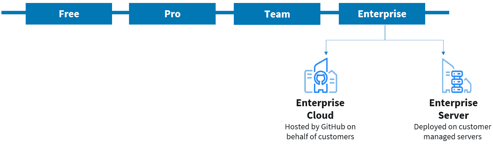

<st c="40493">图 1.17 – GitHub 平台产品选项</st>

<st c="40538">在本书的其余部分，我们的重点</st> <st c="40554">将放在 GitHub Enterprise Cloud 产品上。</st> <st c="40588">为了使用 GitHub Enterprise Cloud，我们需要创建一个 GitHub 组织（</st>*<st c="40725">图 1</st>**<st c="40734">.18</st>*<st c="40737">）。</st> <st c="40741">组织是一个共享的</st> **<st c="40770">私有</st>** <st c="40777">GitHub 账户，企业成员可以在多个项目中进行协作。</st> <st c="40864">在组织内，我们可以创建</st> **<st c="40903">仓库</st>**<st c="40915">，这些仓库类似于 Azure DevOps 中的项目。</st> <st c="40958">为每个组织正在进行的项目创建单独的仓库是一个好主意。</st>

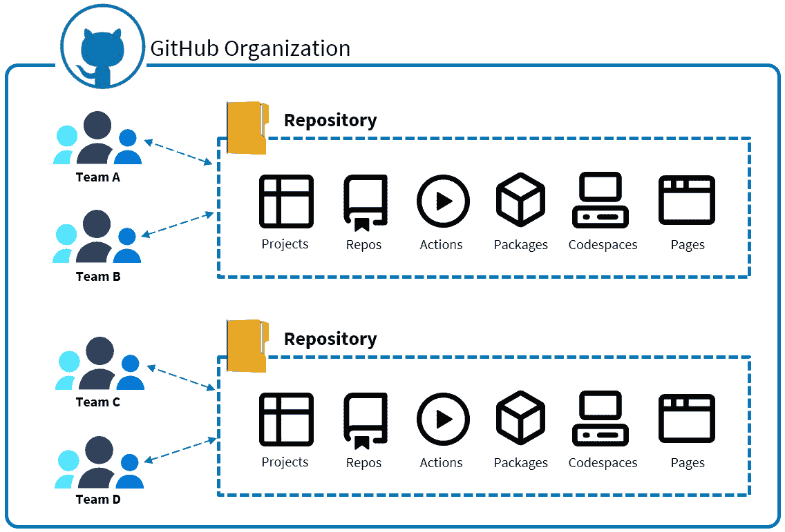

<st c="41330">图 1.18 – GitHub 组织层级结构</st>

<st c="41373">一家公司可以拥有多个 GitHub 组织。</st> <st c="41424">为了简化可见性、管理和计费，建议创建一个企业账户来管理属于贵公司的所有组织（</st>*<st c="41580">图 1</st>**<st c="41589">.19</st>*<st c="41592">）。</st> <st c="41596">创建企业账户是可选的，但它是免费的，并且不会为 GitHub Enterprise Cloud 客户增加任何额外费用。</st> <st c="41734">即使一家公司只有一个组织，创建企业账户仍然是有益的。</st> <st c="41835">通过企业账户，我们可以管理并强制执行</st> <st c="41889">我们公司所有组织的政策。</st> <st c="41924">我们甚至可以选择希望在企业级别强制执行的政策，同时允许组织所有者在</st> <st c="42092">组织级别配置其他政策。</st>

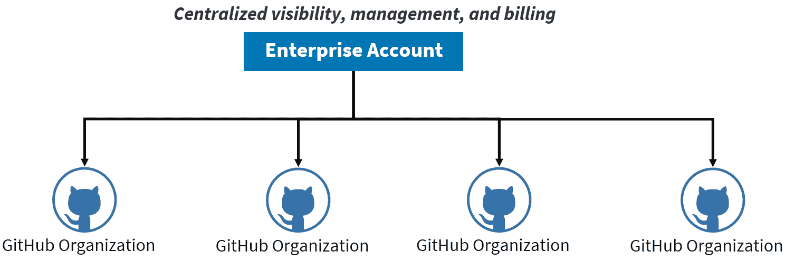

<st c="42259">图 1.19 – GitHub 企业账户</st>

<st c="42298">GitHub Enterprise Cloud 平台提供了一系列服务，我们可以在代码到云的不同阶段使用这些服务。</st> <st c="42430">这些服务包括</st> <st c="42453">以下内容：</st>

+   **<st c="42467">Projects</st>** <st c="42476">用于规划、组织、协作和跟踪软件</st> <st c="42540">开发项目。</st>

+   **<st c="42561">Codespaces</st>** <st c="42572">用于在基于云的</st> <st c="42607">开发环境中编写代码。</st>

+   **<st c="42631">Copilot</st>** <st c="42639">用于机器学习辅助的</st> <st c="42670">代码编写。</st>

+   **<st c="42683">Repos</st>** <st c="42689">用于管理私有和公共</st> <st c="42722">代码库。</st>

+   **<st c="42740">Actions</st>** <st c="42748">用于自动化构建、测试和部署</st> <st c="42798">代码。</st>

+   **<st c="42806">Packages</st>** <st c="42815">用于共享和发现可重用的</st> <st c="42853">代码包。</st>

+   **<st c="42867">Security</st>** <st c="42876">用于扫描和检测代码库中的安全问题。</st>

<st c="42941">下图</st> <st c="42955">展示了</st> <st c="42986">GitHub 服务的布局：</st>

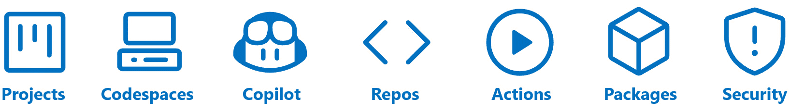

<st c="43075">图 1.20 – GitHub 服务</st>

<st c="43104">让我们简要了解一下这五项服务，从</st> <st c="43162">GitHub 项目开始：</st>

+   **<st c="43178">GitHub 项目</st>**<st c="43194">：我们可以用来规划、组织和跟踪软件项目的工具。</st> <st c="43212">我们可以用它分配任务、与他人协作，并添加额外信息以跟踪进度。</st> <st c="43276">它还具有报告已完成和</st> <st c="43385">未完成工作的能力。</st>

+   **<st c="43456">Codespaces</st>**<st c="43467">：提供一个方便的云开发环境，开发者可以在其中运行、测试、调试和推送代码，无需进行本地机器设置。</st> <st c="43626">创建 Codespace 后，开发者将自动获得一个已经配置好的系统，其中包括多个语言的 SDK 和运行时，如 Python、Node、Docker、Java、Rust、Go 和 C++。</st> <st c="43833">默认镜像可以根据个人或团队的需求进行完全定制，从而加快每个仓库的设置时间。</st>

+   **<st c="43962">GitHub Copilot</st>**<st c="43977">：由 OpenAI Codex 提供支持的人工智能配对编程工具，Codex 是 OpenAI 开发的机器学习模型（OpenAI 是一家知名的人工智能研究和部署公司）。</st> <st c="44125">Copilot 在开发者编写代码时提供代码建议，适用于他们的 IDE。</st> <st c="44199">它还可以解释自然语言注释，并将其转化为代码。</st> <st c="44272">它支持多种编程语言，因为它在所有公开仓库中出现的语言上进行了训练。</st> <st c="44385">Copilot 可以作为扩展插件在支持的 IDE 中使用，例如 Visual Studio Code、Visual Studio、Neovim 和 JetBrains 系列 IDE。</st>

+   **<st c="44523">GitHub 仓库</st>**<st c="44536">：一个源代码管理服务，用于管理代码的变更。</st> <st c="44605">与 Azure DevOps 不同，它</st> *<st c="44629">仅</st>* <st c="44633">支持 Git，这是一种分布式源代码管理工具。</st> <st c="44687">它还与 GitHub 中的其他服务集成</st> <st c="44739">以实现可追溯性。</st>

+   **<st c="44756">GitHub Actions</st>**<st c="44771">：一个帮助我们自动构建、测试和部署代码的工具。</st> <st c="44842">它可以用于实现持续集成和持续交付的过程。</st> <st c="44923">它支持许多不同类型的编程语言和平台，包括 Python、Java、PHP、Ruby、C# 和 Go。</st> <st c="44933">它还可以用于将代码部署到多种目标，包括本地服务器或</st> <st c="45151">云服务。</st>

+   **<st c="45166">GitHub Packages</st>**<st c="45182">：一个帮助我们存储、管理和组织软件包的工具。</st> <st c="45256">我们可以选择并控制希望与谁共享这些软件包。</st> <st c="45318">它允许我们从上游源下载软件包。</st> <st c="45375">它支持多种类型的软件包，如 NuGet、NPM、Maven、Universal、</st> <st c="45456">和 Python。</st>

+   **<st c="45467">GitHub 高级安全</st>**<st c="45492">：它提供了一系列工具来保护我们仓库中的代码。</st> <st c="45562">它扫描易受攻击的依赖项，并允许我们自动发起拉取请求以修复这些问题。</st> <st c="45663">它还会检测新代码或修改过的代码中的安全漏洞和编码错误。</st> <st c="45742">它还可以识别任何意外提交到仓库中的令牌或凭据。</st> <st c="45829">我们将在本书后续章节中详细讨论这一服务。</st> <st c="45880"> </st> <st c="45893"> </st>

<st c="45903">让我们快速了解一下</st> <st c="45916">另一个 DevOps</st> <st c="45946">平台：GitLab。</st>

## <st c="45963">GitLab 平台概述</st>

<st c="45998">GitLab 是一个基于 Web 的</st> <st c="46020">Git 仓库管理</st> <st c="46046">工具，提供端到端的 DevOps 解决方案。</st> <st c="46097">与其他 DevOps 平台类似，GitLab 也拥有支持 DevOps 工作流各个阶段的核心服务。</st> <st c="46214">这些服务包括</st> <st c="46233">以下内容：</st>

+   **<st c="46247">GitLab 问题</st>**<st c="46261">：它是一个敏捷项目管理工具，帮助团队使用 Scrum 或 Kanban 方法规划和组织工作。</st> <st c="46278">通过 GitLab 看板，团队可以轻松地跟踪进度、可视化工作，并与</st> <st c="46396">团队成员协作。</st> <st c="46498"> </st>

+   **<st c="46511">GitLab 代码库</st>**<st c="46529">：GitLab 主要以其版本控制系统而闻名。</st> <st c="46590">它为团队提供了一个集中平台，帮助他们使用 Git 存储、管理和协作开发代码库。</st> <st c="46698">团队可以使用 GitLab 代码库，选择 Git 或 Mercurial，且可以轻松地从</st> <st c="46807">其他代码库导入代码。</st>

+   **<st c="46826">GitLab CI/CD</st>**<st c="46839">：GitLab 的 CI/CD 工具允许团队自动化软件交付过程。</st> <st c="46922">GitLab CI/CD 使团队能够以安全高效的方式在各种环境中构建、测试和部署应用程序。</st> <st c="47039"> </st>

+   **<st c="47056">GitLab 容器注册表</st>**<st c="47082">：GitLab 容器注册表是一个内置的容器注册表，允许团队存储、管理和部署 Docker 镜像。</st> <st c="47213">团队可以使用 GitLab 容器注册表创建和管理镜像，并将其部署到</st> <st c="47317">首选平台。</st>

+   **<st c="47336">GitLab 监控</st>**<st c="47351">：GitLab 监控是一个监控工具，提供应用程序和基础设施性能的实时可视化。</st> <st c="47482">团队可以使用 GitLab 监控工具监控其应用程序和基础设施的健康状况，发现问题并迅速</st> <st c="47602">解决问题。</st>

<st c="47615">GitLab 也具有高度的可配置性和可定制性。</st> <st c="47669">团队可以轻松定制平台以满足他们的需求和偏好。</st> <st c="47745">GitLab 支持多种集成，并拥有一个庞大的第三方扩展</st> <st c="47806">和插件生态系统</st> <st c="47832">，团队可以使用这些扩展来扩展</st> <st c="47874">其功能。</st>

## <st c="47896">Azure 服务在 DevOps 工作流中的应用</st>

<st c="47935">Microsoft Azure</st> <st c="47951">提供了一系列广泛的工具和服务，能够很好地集成到 DevOps 工作流中。</st> <st c="47965">涵盖了秘密管理、配置管理、负载测试、混沌工程和应用托管/部署的广泛工具和服务，并具备全面的监控和</st> <st c="48228">可观察性功能。</st>

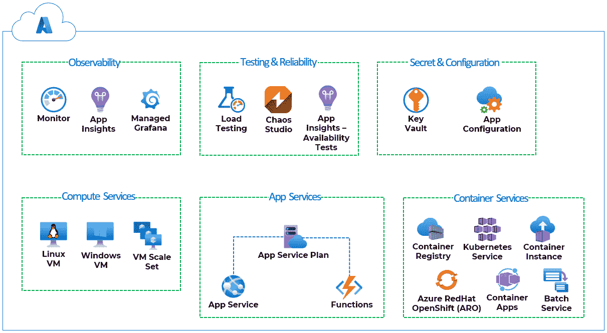

<st c="48702">图 1.21 – Azure 云原生服务用于 DevOps</st>

*<st c="48754">图 1</st>**<st c="48763">.21</st>* <st c="48766">展示了可以在 DevOps 工作流的不同阶段使用的一些工具。</st> <st c="48861">我们来回顾一下这些服务以及它们</st> <st c="48911">如何适应：</st>

<st c="48918">我们有多种服务来托管</st> <st c="48952">我们的应用程序：</st>

1.  **<st c="48969">构建阶段</st>**<st c="48981">:</st>

    +   **<st c="48983">Azure 密钥保管库</st>**<st c="48998">：提供安全的秘密管理，允许开发人员存储和检索敏感信息，如 API 密钥、密码</st> <st c="49132">和证书。</st>

    +   **<st c="49149">Azure 应用配置</st>**<st c="49173">：此服务支持集中配置管理，提供在多个环境中存储和检索应用设置的方法。</st>

1.  **<st c="49315">测试阶段</st>**<st c="49326">:</st>

    +   **<st c="49328">Azure 负载测试</st>**<st c="49346">：通过模拟用户流量并分析系统在负载下的行为，这使得应用程序的压力测试和性能测试成为可能。</st>

    +   **<st c="49492">Azure 混沌工作室</st>**<st c="49511">：通过引入</st> <st c="49576">受控</st> <st c="49587">干扰和故障来测试</st> <st c="49620">系统的弹性。</st>

1.  **<st c="49638">发布阶段</st>**<st c="49652">：Azure 提供了多种应用托管</st> <st c="49710">和部署的计算选项：</st>

    +   **<st c="49725">虚拟机（VM）和虚拟机规模集</st>**<st c="49766">：这些提供了部署和管理虚拟机以托管应用程序的灵活性。</st>

    +   **<st c="49856">应用服务</st>**<st c="49869">：提供一个平台来托管 Web 和 API 应用程序，无需担心</st> <st c="49953">基础设施管理。</st>

    +   **<st c="49979">函数应用</st>**<st c="49993">：这使得可以开发无服务器函数以按需执行代码</st> <st c="50065">。</st>

    +   **<st c="50075">容器服务</st>**<st c="50094">：这支持容器化应用程序的部署，提供如 Azure 容器实例（适用于轻量级工作负载）或 Azure Kubernetes 服务（用于编排和扩展</st> <st c="50280">容器化应用程序）等选项。</st>

1.  **<st c="50307">操作和</st>** **<st c="50320">监控阶段</st>**<st c="50334">：</st>

    +   **<st c="50336">Azure Monitor</st>**<st c="50349">：这为应用程序和基础设施提供全面的监控和诊断，允许团队深入了解系统性能</st> <st c="50498">和健康状况。</st>

    +   **<st c="50509">应用程序洞察</st>**<st c="50530">：这提供了实时应用程序性能监控和日志记录，帮助开发人员快速检测和诊断</st> <st c="50648">问题。</st>

    +   **<st c="50663">用于可观察性的托管 Grafana</st>**<st c="50697">：这将流行的开源可观察性平台 Grafana 与 Azure 服务集成，能够提供先进的数据可视化和分析，用于监控</st> <st c="50857">和故障排除。</st>

<st c="50877">请记住，这里提到的示例只是其中的一部分，我们在后续过程中会遇到更多的服务。</st> <st c="50992">在本书中，我们将探讨支持 DevOps 实践并增强软件开发过程的各种 Azure 服务，特别是那些与安全相关的</st> <st c="51168">用例。</st>

<st c="51178">目前请注意，DevOps 和云计算是相辅相成的，因为两者都旨在加速软件开发和部署。</st> <st c="51322">云提供了可扩展且灵活的基础设施，可以支持现代软件开发的需求，并提供增强该过程的服务，而 DevOps 则提供了一个框架，用于高效地在</st> <st c="51562">云中管理和部署软件。</st>

<st c="51572">现在我们已经</st> <st c="51590">探讨了</st> <st c="51602">敏捷、DevOps 和云计算的基本概念，让我们来看看这三者是如何结合在一起，以支持现代软件</st> <st c="51743">开发实践的。</st>

# <st c="51765">敏捷、DevOps 和云 – 完美的三重奏</st>

<st c="51811">采用 DevOps</st> <st c="51829">方法</st> <st c="51839">并非孤立地产生效益，而是与其他概念相结合，如敏捷规划和云计算。</st> <st c="51967">敏捷是一种项目管理方式，注重灵活性和对变化的响应。</st> <st c="52061">云计算指的是使用基于网络的计算服务，而不是物理服务器和软件。</st> <st c="52164">敏捷、DevOps 和云三者结合，可以帮助组织更高效地工作</st> <st c="52244">并提高效率。</st>

<st c="52260">一些组织可能只使用其中一个或两个概念，但最佳的结果来自于三者的结合。</st> <st c="52375">我们可以在不实践 DevOps 的情况下采用敏捷方法进行软件开发；也可以实施 DevOps 实践，但不涉及云计算，遗憾的是，许多组织在没有实施 DevOps 实践的情况下采用云计算也很常见。</st> <st c="52660">对于云原生应用和新软件，三者的协同—敏捷、DevOps 和云—通常能带来最佳结果，正如下面的</st> <st c="52812">图示所示：</st>

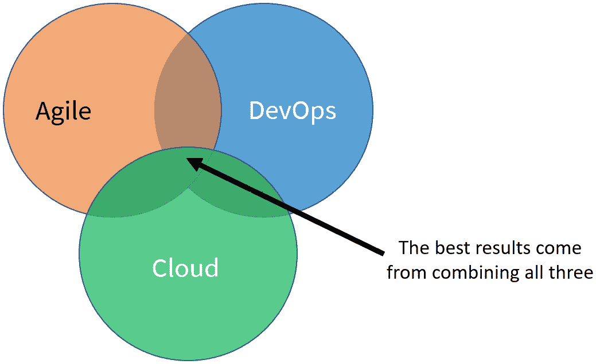

<st c="52878">图 1.22 – 敏捷、DevOps 和云</st>

<st c="52916">我们这样说：敏捷是</st> *<st c="52946">我们应该做的事情</st>*，<st c="52950">DevOps 是</st> *<st c="52981">我们应该如何做</st>*，云计算是</st> *<st c="53027">我们应该在哪里做</st>* <st c="53032">的方式。</st>

<st c="53055">然而，</st> <st c="53071">需要</st> <st c="53080">认识到，这个通用规则有例外。</st> <st c="53142">将</st> <st c="53151">敏捷、DevOps 和云计算结合应用于某些场景时，可能会面临不同的挑战和动态。</st> <st c="53268">虽然这三者的整合对许多应用非常有益，但它并非在每个场景中都能保证成功。</st> <st c="53424">正如俗话所说，**金玉其外，败絮其中**，并不是所有 DevOps 与云的结合都会带来</st> <st c="53539">成功的结果。</st>

<st c="53554">让我们暂时结束讨论。</st> <st c="53600">在接下来的章节中，我们将设置所需的云账户，以便跟随本书余下部分的动手练习。</st> <st c="53742">本书的内容将涵盖这些练习。</st>

# <st c="53752">动手练习 1 – 创建一个 Azure 订阅</st>

<st c="53805">让我们从</st> <st c="53822">创建</st> <st c="53832">订阅开始：</st>

1.  <st c="53847">打开一个网页浏览器并访问</st> <st c="53874">到</st> [<st c="53877">https://signup.azure.com</st>](https://signup.azure.com)<st c="53901">。</st>

1.  <st c="53902">点击</st> **<st c="53912">登录</st>**<st c="53919">。</st>

1.  输入你的个人资料信息，验证你的身份，并同意条款和条件。

1.  点击**下一步**并提供你的信用卡信息（注意，只有在你将订阅从免费试用切换到付费订阅时，信用卡才会被收费）。

1.  点击**注册**。

# 实践练习 2 – 创建一个 Azure DevOps 组织（与您的 Azure AD 租户相关联）

接下来，我们将创建一个新的组织：

1.  打开一个网页浏览器，访问[`portal.azure.com`](https://portal.azure.com)（Azure 门户）。

1.  在 Azure 门户中，在顶部的搜索区域，搜索并选择**Azure DevOps**。

1.  点击**我的 Azure DevOps** **组织**链接。

1.  在弹出的窗口中，配置以下内容：

    +   **名称**：输入你新建的 Azure DevOps 组织的名称。

    +   **项目位置**：选择一个靠近你的位置

接下来，我们来配置我们的新组织的账单：

1.  在 Azure DevOps 控制台中，点击左下角的**组织设置**。

1.  点击**账单**，然后点击**设置账单**。

1.  选择你的 Azure 订阅，然后点击**保存**。

# 实践练习 3 – 创建 GitHub 企业云试用账户

首先，我们来创建一个**GitHub 企业**云组织：

1.  要创建一个 GitHub 组织，请访问[`github.com/pricing`](https://github.com/pricing)，点击**开始免费试用**，然后选择**企业云**：

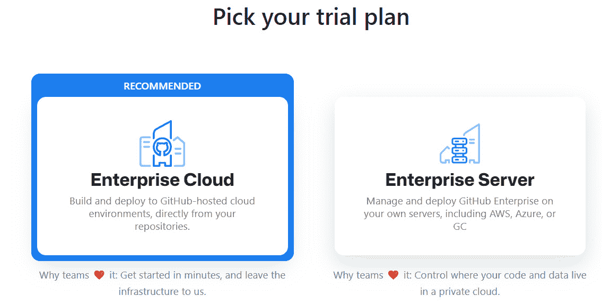

图 1.23 – 创建企业云组织

1.  登录 GitHub 或创建一个账户。

1.  <st c="55721">登录后，你将被引导至</st> **<st c="55768">设置你的企业试用</st>** <st c="55796">页面。</st> <st c="55803">填写所需的详细信息并点击</st> **<st c="55846">创建你的</st>** **<st c="55858">企业</st>** <st c="55868">按钮。</st>

<st c="55876">干得好！</st> <st c="55888">你现在已经</st> <st c="55901">完成了为接下来的实践练习所需的云账户设置。</st> <st c="55986">接下来的章节将继续进行。</st>

# <st c="56004">总结</st>

<st c="56012">本章概述了 DevOps——一种现代应用程序开发和交付方法，帮助组织更快速地将高质量软件交付到生产环境，并减少缺陷！</st> <st c="56214">我们讨论了 DevOps 的五个核心实践、DevOps 工作流中的不同阶段，以及协作文化在 DevOps 成功中的重要性。</st> <st c="56383">我们还强调了需要避免的 DevOps 反模式和反例，并介绍了流行的 DevOps 平台，如 Azure DevOps、GitHub Actions 和 GitLab。</st> <st c="56543">本章所获得的知识为你提供了扎实的基础知识，帮助你理解本书其余部分的讨论。</st>

<st c="56725">在下一章，我们将深入探讨 DevOps 的安全挑战，探索潜在的风险以及组织如何开始应对这些挑战。</st> <st c="56881">敬请期待！</st>

# <st c="56895">进一步阅读</st>

<st c="56911">要了解本章讨论的更多内容，请查看以下资源：</st>

+   *<st c="57017">《加速：精益软件与 DevOps 的科学：构建和扩展高性能技术组织》</st>* <st c="57132">作者：Nicole Forsgren, Jez Humble, 和</st> <st c="57169">Gene Kim。</st>

+   *<st c="57178">《凤凰计划：一本关于 IT、DevOps 以及帮助你的企业成功的小说》</st>* <st c="57255">作者：Gene Kim, Kevin Behr, 和</st> <st c="57285">George Spafford。</st>
