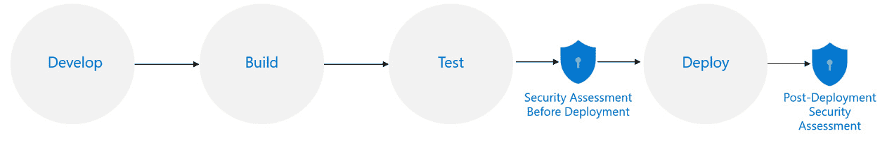
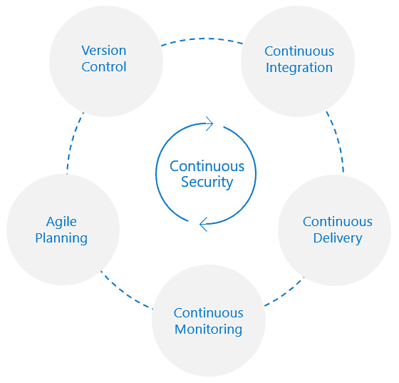
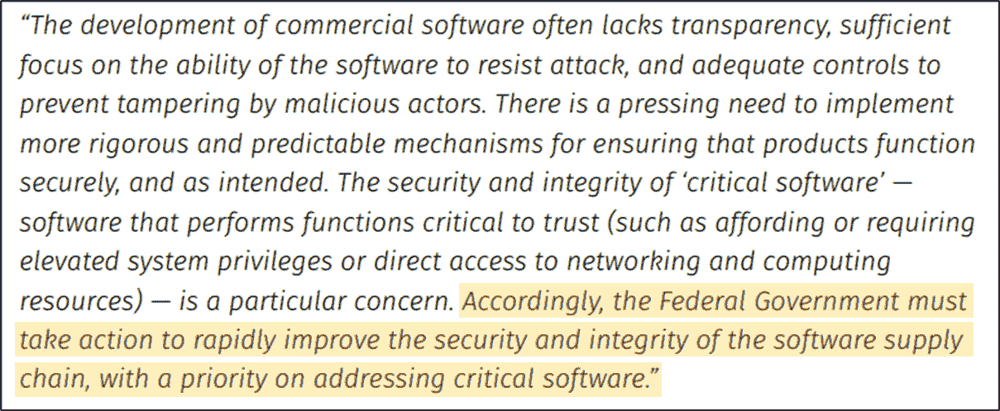

# <st c="0">2</st>

# <st c="2">DevOps 工作流的安全挑战</st>

<st c="44">随着组织采用 DevOps 实践，他们面临着新的安全挑战，这些挑战将要求他们将 DevOps 转变为 DevSecOps。</st> <st c="177">这些挑战源于开发和部署速度的提高、过程的自动化以及开发和运维团队之间的协作。</st> <st c="349">过去服务良好的传统安全方法可能不足以应对这些新兴问题。</st> <st c="487">因此，组织必须调整其安全实践，并培养以安全为重点的文化，以保护其应用程序、系统</st> <st c="635">和数据。</st>

<st c="644">在本章中，我们将探讨实施 DevOps 实践所带来的独特安全风险和威胁。</st> <st c="773">我们将研究组织如何有效地应对这些挑战。</st> <st c="858">在本章结束时，您将对以下</st> <st c="946">关键领域有一个扎实的理解：</st>

+   <st c="956">DevOps 的安全挑战</st> <st c="977">（Security challenges of DevOps）</st>

+   <st c="986">支持 DevSecOps 和</st> <st c="1014">持续安全</st>

+   <st c="1033">持续安全的挑战</st> <st c="1052">（continuous security）</st>

+   <st c="1071">DevSecOps 和供应</st> <st c="1093">链安全</st>

<st c="1107">这些主题将为您提供宝贵的见解，帮助您理解为什么仅依靠 DevOps 不足以应对挑战，以及为何必须采用 DevSecOps。</st> <st c="1245">此外，我们还将强调组织在 DevSecOps 过程中应当注意的陷阱。</st> <st c="1356">准备好导航 DevSecOps 的领域，在这里，安全占据核心地位，现代开发环境的挑战将</st> <st c="1494">迎刃而解。</st>

# <st c="1512">技术要求</st>

<st c="1535">要跟随本章的说明，您需要</st> <st c="1605">以下内容：</st>

+   <st c="1619">一台带有</st> <st c="1633">互联网连接的 PC</st>

+   <st c="1652">一个有效的</st> <st c="1663">Azure 订阅</st>

+   <st c="1681">一个 Azure</st> <st c="1691">DevOps 组织</st>

+   <st c="1710">一个 GitHub</st> <st c="1720">企业组织</st>

# <st c="1743">DevOps 的安全挑战</st>

<st c="1773">随着许多组织的发展</st> <st c="1802">它们的软件交付实践（如前一章所讨论），它们仍然固守传统的安全流程，这些流程难以跟上 DevOps 世界快速发展的步伐。</st> <st c="1993">根据</st> <st c="2002">Dynatrace 2021 年</st> **<st c="2023">首席信息安全官</st>** <st c="2057">（</st>**<st c="2059">CISO</st>**<st c="2063">）的报告，63%的 CISO 认同转向现代交付模型，如 DevOps，已经严重影响了他们检测和管理软件漏洞的能力！</st> <st c="2233">这并不令人惊讶，因为 DevOps 的核心是速度、灵活性和持续改进。</st> <st c="2324">如果不进化我们的安全流程和进行适当的安全集成，就像开着没有刹车的 F1 赛车——迟早会发生碰撞和灾难。</st> <st c="2490">或者早，或者晚。</st>

<st c="2499">注意</st>

<st c="2504">Dynatrace 2021 年 CISO 报告可以通过以下</st> <st c="2561">链接访问：</st> [<st c="2567">https://assets.dynatrace.com/en/docs/report/2021-global-ciso-report.pdf</st>](https://assets.dynatrace.com/en/docs/report/2021-global-ciso-report.pdf)<st c="2638">。</st>

<st c="2639">在本书的接下来的章节中，我们将探讨组织如何调整其安全实践，拥抱自动化，并培养安全意识文化。</st> <st c="2815">然而，在我们开始这段旅程之前，让我们先花点时间看看为什么传统的安全在快速发展的 DevOps 领域中会遇到困难并且受到限制。</st> <st c="2962">。</st>

## <st c="2972">了解传统安全在快速发展的 DevOps 世界中的局限性</st>

<st c="3055">在 DevOps 的世界里，速度</st> <st c="3082">至关重要。</st> <st c="3102">然而，随着速度的提升，也带来了潜在的弊端：漏洞的增加，这些漏洞可能会悄悄溜过。</st> <st c="3241">当组织试图跟上更快发布和更快迭代的需求时，意外引入漏洞的风险也在同步增加。</st> <st c="3392">。</st>

<st c="3402">随着软件开发和部署速度的提高，随之而来的漏洞也在不断增加，并且可能会通过漏洞滑过。</st>

<st c="3539">传统的安全流程难以跟上这种速度，因为它通常采用人工方式。</st> <st c="3636">人工安全检查和评审既耗时，又容易出错，在 DevOps 环境中不可扩展。</st> <st c="3746">例如，考虑像微信这样的一家公司，每天向生产环境部署约 1,000 次；很少有组织能够有足够的人工资源来每天手动评估 1,000 次发布！</st> <st c="3949">此外，执行合规性检查的僵化任务通常由安全团队负责，这有时会让他们在人际关系上显得不太受欢迎</st> <st c="4079">。</st>

<st c="4091">注意</st>

<st c="4096">已实施云原生技术的公司已成功实现了显著的</st> <st c="4187">速度、敏捷性和可扩展性，如下所述：</st> [<st c="4240">https://learn.microsoft.com/en-us/dotnet/architecture/cloud-native/definition</st>](https://learn.microsoft.com/en-us/dotnet/architecture/cloud-native/definition)<st c="4317">。</st>

<st c="4318">此外，传统的安全方法在支持采用 DevOps 软件交付模型的组织常用的现代技术时面临着局限性。</st> <st c="4489">在 DevOps 的世界里，越来越多的开发团队承担起了运营职责。</st> <st c="4575">他们不仅负责编写代码，还负责部署和管理应用程序。</st> <st c="4679">为了促进这一转变，他们采用了云原生技术，如微服务架构，来开发和部署独立的服务，使用容器化技术实现便捷的部署和扩展性，并通过代码管理基础设施。</st> <st c="4930">然而，传统的安全方法并没有能力应对这些现代技术所带来的独特挑战。</st> <st c="5056">保护这些技术需要</st> <st c="5092">在安全方法上的转变，并采用</st> <st c="5149">更新的工具集。</st>

<st c="5164">微服务和容器化</st>

**<st c="5199">微服务架构</st>**<st c="5226">：一种软件开发方法</st> <st c="5264">将应用程序构建为一组小型、独立的服务。</st> <st c="5344">每个服务可以与其他服务协同工作，使得单独管理和更新更加简单。</st> <st c="5432">一个微服务的例子是反馈服务，用于管理用户反馈，可以被其他应用程序重复使用。</st> <st c="5526">其他应用程序</st> <st c="5549">也可以使用该服务。</st>

**<st c="5557">容器化</st>**<st c="5574">：一种软件分发和部署</st> <st c="5616">方法，将应用程序及其必要的设置和依赖项打包成一个</st> *<st c="5719">容器</st>*<st c="5728">，确保在各种</st> <st c="5775">计算环境中一致地运行。</st>

<st c="5798">在 DevOps 世界中，传统安全流程的另一个问题是，安全相关的活动通常被 relegated 到开发生命周期的最后阶段（</st>*<st c="5974">图 2</st>**<st c="5983">.1</st>*<st c="5985">）。</st> <st c="5989">它像一个守门人，站在最后，评估软件在发布前或发布后是否存在安全漏洞。</st> <st c="6149">这种方法将安全视为一个独立的阶段，而不是开发过程的一个不可或缺的部分，如功能性</st> <st c="6292">或性能。</st>

<st c="6425">图 2.1 – 软件开发工作流程中的传统安全集成</st>

<st c="6507">这种“关卡”思维的后果是，当软件进入生产环境时，安全突然成为一个障碍。</st> <st c="6657">有位高级开发人员曾与我分享过他们的经历，说：“</st>*<st c="6723">我们做的每一件事都进展得很快且顺利，直到我们尝试部署到生产环境时，安全就成了问题！</st>*<st c="6847">” 这句话完美地</st> <st c="6874">概括了当传统安全在 DevOps 流程中引入摩擦时，可能会引发的挫败感。</st>

## <st c="6987">了解 DevOps 如何增加攻击面</st>

<st c="7041">采用 DevOps 实践</st> <st c="7067">引入了组织内部的新工具（我们在本书的第一章中讨论了其中的一些工具）。</st> <st c="7180">如果使用得当，这些工具可以大大提高开发人员的生产力。</st> <st c="7256">然而，它们也带来了自身的一些挑战。</st> <st c="7312">如果管理不当，它们可能导致攻击面扩展，并为潜在攻击者创造机会。</st> <st c="7431">这其中涉及到的风险包括访问控制不足、不安全的工具配置、工具本身的漏洞</st> <st c="7536">、凭证管理以及监控和日志记录的不足。</st>

<st c="7629">例如，</st> <st c="7639">一个典型的</st> **<st c="7660">持续集成/持续交付</st>** <st c="7702">(</st>**<st c="7704">CI/CD</st>**<st c="7709">) 系统：</st>

+   <st c="7719">它可以访问组织的源代码，这是其中最</st> <st c="7784">重要的资产之一</st>

+   <st c="7797">它可以生成部署到</st> <st c="7851">多个系统的构建产物</st>

+   <st c="7867">它对</st> <st c="7896">生产环境拥有特权访问权限</st>

+   <st c="7919">它在</st> <st c="7968">构建过程中</st> <st c="7981">拥有对服务凭证的访问权限。</st>

<st c="8052">如果没有适当的安全措施，这种广泛的访问权限可能带来严重风险。</st> <st c="8221">如果攻击者能够利用一个弱点，他们可能会进入软件供应链，注入恶意软件，从而影响更多的受害者，并访问</st> <st c="8221">敏感数据。</st>

<st c="8236">这类针对 DevOps 工具的攻击频率正在增加，我们预计未来几年这一趋势将进一步加剧。</st> <st c="8385">Forrester 在 2021 年的一项研究发现，57%的组织曾遭遇与 DevOps 工具链曝光相关的安全事件。</st> <st c="8524">这表明，随着这些工具在大多数组织的关键开发过程中占据核心地位，它们已成为攻击的主要目标。</st> <st c="8658">。</st>

<st c="8677">Forrester 报告</st>

<st c="8694">Forrester 是一家著名的市场研究公司，提供有关技术现有及潜在影响的建议。</st> <st c="8815">有关前述报告的更多详细信息，请参考</st> <st c="8871">[<st c="8874">https://www.prnewswire.com/news-releases/thycoticcentrify-report-57-of-organizations-suffered-security-incidents-related-to-exposed-secrets-in-devops-301425193.html</st>](https://www.prnewswire.com/news-releases/thycoticcentrify-report-57-of-organizations-suffered-security-incidents-related-to-exposed-secrets-in-devops-301425193.html)<st c="9038">。</st>

<st c="9039">除此之外，这些工具本身也可能包含可被利用的漏洞。</st> <st c="9146">在流行的 DevOps</st> <st c="9203">工具链中，曾出现过显著的漏洞，例如 CVE-2016-0792，一个</st> **<st c="9241">远程代码执行</st>** <st c="9262">(</st>**<st c="9264">RCE</st>**<st c="9267">)缺陷，影响了广泛使用的 CI/CD 服务器 Jenkins。</st> <st c="9326">在公共漏洞数据库中搜索任何 DevOps 工具，都能发现多个可被利用的漏洞，且这些漏洞已经存在很长一段时间了！</st> <st c="9472">然而，这个问题不仅限于主要工具或平台。</st> <st c="9539">这些工具还支持大量的插件和扩展生态系统，这使得安全团队很难确定</st> <st c="9673">合适的安全框架</st> <st c="9703">来应对它们。</st>

<st c="9712">注意</st>

<st c="9717">尽管 DevOps 工具集引入了新的风险，但它们也为我们提供了一系列工具来缓解开发过程中的风险，这是过去很难做到的。</st> <st c="9895">安全评估可以在版本控制中的代码、同行评审时以及通过自动化测试来进行。</st> <st c="10009">这些工具的正确使用可以进一步增强我们开发实践中的安全性。</st> <st c="10098">我们将在接下来的章节中介绍如何实现这一点。</st>

# <st c="10158">DevSecOps 的论点</st>

<st c="10181">如前所述，将安全作为软件开发生命周期中的一个独立阶段来隔离</st> <st c="10216">并不利于 DevOps 的原则，因为 DevOps 强调速度</st> <st c="10357">和敏捷性。</st>

<st c="10369">要在 DevOps 环境中有效地实施安全，必须将其无缝集成到工作流的每个环节中。</st>

<st c="10505">要在 DevOps 环境中有效地实施安全，必须将其无缝集成到工作流的每个环节中。</st> <st c="10642">否则，安全将变得难以管理，且</st> <st c="10698">妨碍扩展性。</st>

<st c="10717">将安全嵌入到每个工作流中意味着从一开始就将安全实践和考虑因素纳入，而不是将其视为一项单独的任务。</st> <st c="10885">这种方法称为</st> **DevSecOps**<st c="10926">。DevSecOps 的主要目标是让构建和交付软件的团队能够尽早识别并解决开发周期中的关键安全问题。</st> <st c="11107">为了实现这一目标，DevSecOps 在软件开发和交付过程中增加了一项新的核心实践——**持续安全**，它被嵌入到每个其他</st> <st c="11284">实践中（</st>*<st c="11295">图 2</st>**<st c="11304">.2</st>*<st c="11306">）。</st>

<st c="11441">图 2.2 – DevSecOps 核心实践</st>

<st c="11478">但要真正理解</st> <st c="11502">如何有效地实施 DevSecOps，达到预期结果，我们需要了解其关键组成部分——**文化**、**流程**和**工具**。让我们深入探讨这三个方面。</st>

## <st c="11722">理解 DevSecOps 的文化层面</st>

<st c="11769">遗憾的是，大多数关于 DevSecOps 的讨论</st> <st c="11807">主要集中在工具的集成，或许还有一些流程。</st> <st c="11884">我们认为，这可能是一些组织未能从其 DevSecOps 计划中获得更好成果的原因。</st>

**DevSecOps 的核心代表了一种文化转变**<st c="12072">。在大多数组织中，开发、运营和安全团队之间有明显的分工。</st> <st c="12178">开发团队负责编写代码和构建应用程序，运营团队负责应用程序的部署和配置，安全团队则负责保护生产环境中的应用程序。</st> <st c="12392">生产中的应用。</st>

<st c="12406">DevSecOps 的文化旨在消除这些传统上独立角色之间的孤岛。</st> <st c="12504">目标是让人们更好地协作，使整个软件开发过程更加安全。</st> <st c="12614">在这一模式中，所有团队都共同负责帮助企业实现其持续为最终用户提供安全且功能完备的软件的目标。</st> <st c="12799">每个团队都贡献其独特的专业知识，通过协作共同努力实现这一目标，远离一种以持续归咎</st> <st c="12956">和回避为特征的文化。</st>

<st c="12970">文化转变</st>

<st c="12984">这是组织在一段时间内在态度、行为、价值观或规范上的重大变化。</st> <st c="13090">它通常涉及领导风格、操作实践或</st> <st c="13165">公司价值观的变革。</st>

<st c="13180">消除孤岛并创建</st> <st c="13211">集体焦点通常需要时间和大量的组织工作，因为它涉及改变根深蒂固的习惯、常规和态度。</st> <st c="13357">这常常会导致团队成员的抵触，尤其是当变革未能有效沟通或被理解时。</st> <st c="13482">要成功实施，必须具备几个关键要素，包括高层领导支持、团队培训和团队结构的调整。</st> <st c="13634">让我们来看一下这些要素：</st>

+   **<st c="13673">高层赞助</st>**<st c="13695">：在组织内部将</st> *<st c="13706">DevSecOps</st>* <st c="13715">付诸实践不是一次性的事件。</st> <st c="13774">这是一个必须从某个地方开始的旅程。</st> <st c="13819">如果我们要提出建议，我们会说从获得高层领导的支持开始。</st> <st c="13909">这是确保与业务目标对齐、获得所需利益相关者的支持、为该举措提供政治保护，并定义和批准所需预算的关键。</st> <st c="14104">大多数成功的安全倡议，能够在整个组织范围内产生影响的，通常都是那些获得</st> <st c="14204">高层支持的倡议。</st>

<st c="14226">Synopsys BSIMM 报告</st>

<st c="14248">Synopsys</st> **<st c="14262">安全构建成熟度模型</st>** <st c="14297">(</st>**<st c="14299">BSIMM</st>**<st c="14304">)系列报告为软件安全倡议提供了一个基准，强调了高层赞助和领导力的重要性。</st> <st c="14455">最新的</st> <st c="14465">报告可以在这里找到：</st> [<st c="14492">https://www.synopsys.com/software-integrity/engage/bsimm/bsimm13</st>](https://www.synopsys.com/software-integrity/engage/bsimm/bsimm13)<st c="14556">。</st>

+   **<st c="14557">审视团队结构与度量指标</st>**<st c="14595">：DevSecOps 文化挑战了传统安全团队如何与开发和运维团队整合，以满足更广泛的业务需求。</st> <st c="14758">我们不再维持一个有着冲突度量标准的孤立团队结构，这种结构会导致一种</st> *<st c="14849">无</st>* <st c="14851">文化的状况，而是拥抱了新的团队结构和协作模式，重点强调安全作为推动力，而非</st> <st c="15000">阻碍。</st>  

    <st c="15010">安全团队与开发和运维团队紧密合作，</st> <st c="15038">以确保开发和发布能够按照业务需求的快速节奏进行，同时保持安全。</st> <st c="15219">这种方法要求安全团队的思维方式发生转变，优先考虑按照业务需求快速交付软件，同时将安全作为促进这一目标的工具。</st> <st c="15405">这通常导致安全团队转向一种新模式，专注于赋能开发者和运维团队，以安全的方式执行他们的任务，最大程度地减少进入生产环境的重大风险。</st> <st c="15628">这种方法与</st> *<st c="15658">向左移动</st>* <st c="15668">哲学一致，在这种哲学中，责任（如安全问题）会在开发或任务生命周期的早期阶段得到解决。</st> <st c="15798">DevOps 中的向左移动意味着从开发的最早阶段就确保应用程序的安全，这是 DevSecOps 的一个关键原则，旨在促进开发、安全和运维团队之间的合作。</st> <st c="16007">这一方法的成功必须以共情为核心——愿意了解每个团队的工作方式，以共同确定整合</st> <st c="16159">安全实践的最佳方式。</st>

+   **<st c="16178">培训与沟通</st>**<st c="16205">：正如我们之前所提到的，培养 DevSecOps 文化需要每个人都树立安全优先的思维方式，每个人都要对交付安全软件的各自责任负责。</st> <st c="16401">实现这一目标只能通过培训和沟通来完成。</st> <st c="16470">我们将在*<st c="16543">第三章</st>*中介绍如何实施有效的安全培训计划，</st> *<st c="16554">在 DevOps 的</st>* *<st c="16583">规划</st>* *<st c="16587">阶段中实施安全</st>*<st c="16603">，因此我们将在那时再详细讨论。</st>  

<st c="16649">在现有组织中接受 DevSecOps 文化</st> <st c="16679">可能会面临挑战，但这是实现安全软件开发的重要步骤。</st> <st c="16796">然而，这种文化转变只是方程式的一部分。</st> <st c="16855">为了帮助个人过渡到这一新文化，必须有结构化的流程来指导团队成员，并提供一个清晰的操作框架</st> <st c="16999">供操作使用。</st>

## <st c="17014">理解 DevSecOps 的过程方面</st>

<st c="17060">DevSecOps 是 DevOps 的演变</st> <st c="17096">因此，基本流程是相同的。</st> <st c="17140">DevSecOps 扩展了我们在本书第一章中介绍的相同的 DevOps 流程，增加了持续安全培训、持续安全验证和持续安全衡量的层次。</st> <st c="17360">这些流程帮助过渡到一个状态，在这个状态下，安全被所有人视为创建和交付软件的一个核心元素，与功能性和稳定性处于同等地位。</st> <st c="17551">让我们讨论一下</st> <st c="17565">这些流程：</st>

+   **<st c="17579">持续的安全培训</st>**<st c="17608">：这一过程为提高</st> *<st c="17686">角色特定的</st>* <st c="17699">安全知识和技能提供了正式和非正式的渠道。</st> <st c="17731">这包括让团队保持对最新的和</st> *<st c="17798">相关的</st>* <st c="17806">安全最佳实践、漏洞和缓解策略的了解。</st> <st c="17876">这可能包括关于安全编码实践、安全基础设施配置的正式和非正式教育，或者提高对相关威胁行为者的意识。</st> <st c="18043">目标是建立一种安全优先的心态，贯穿整个组织，并使安全成为每个角色的核心组成部分。</st> <st c="18162">成功的关键是优先考虑参与度；否则，它可能只是另一个走过场的活动。</st> <st c="18265">这就是为什么需要大量的思考和合作，以确保培训能够持续保持其相关性。</st> <st c="18387">我们将在本书的下一章中进一步探讨这一点。</st>

+   **<st c="18449">持续安全验证</st>**<st c="18480">：这是定义您组织中不同项目类别的安全软件构建和发布应如何进行的过程。</st> <st c="18629">它涉及安全团队与主要利益相关者（如工程和运维）之间的持续合作。</st> <st c="18746">目标是</st> *<st c="18761">共同</st>* <st c="18768">建立一套建议的定期安全评估和必须遵守的关键安全护栏。</st> <st c="18884">这使得安全团队的角色从验证每个独立的发布转变为定期检查发布管道的完整性。</st> <st c="19027">成功的关键在于协作——确保验证过程是</st> *<st c="19104">共同达成的</st>* <st c="19120">，并且所有参与者都理解其重要性。</st> <st c="19180">在定义此过程在您环境中的具体形式时，请勿过分关注工具或测试。</st> <st c="19279">相反，专注于您希望实现的改进成果。</st> <st c="19354">像所有其他 DevOps 流程一样，这是一项持续的活动，需要随着标准的演变和新见解的获取不断调整。</st> <st c="19491">我们将在本书的</st> *<st c="19530">第四章</st>* <st c="19540">到</st> *<st c="19544">第七章</st>* <st c="19545">深入探讨这一主题。</st>

+   **<st c="19559">持续安全测量</st>**<st c="19591">：最后，持续安全测量侧重于与利益相关者达成一致，确定用于评估进展和成果的度量标准。</st> <st c="19738">该过程的目标是提供对安全实践有效性的持续可见性，并为持续改进提供见解。</st> <st c="19888">这可能涉及跟踪关键指标，如进入工作流后期阶段的关键漏洞数量，以及整体安全健康状况的改善（以评估持续安全培训的效率）。</st> <st c="20135">在确定这些度量标准时，请记住，DevSecOps 是一段永无止境的旅程。</st> <st c="20223">度量标准和</st> **<st c="20235">关键绩效指标</st>** <st c="20261">(</st>**<st c="20263">KPI</st>**<st c="20267">)不应只盯着结果，而应关注</st> <st c="20316">持续改进和向成熟度发展的趋势。</st> <st c="20354">。</st>

<st c="20370">现在您对定义 DevSecOps 工作流中的额外流程有了一些了解，接下来让我们关注 DevSecOps 的工具方面</st> <st c="20407">。</st> <st c="20521">DevSecOps 的工具链。</st>

## <st c="20534">选择 DevSecOps 工具链的考虑事项</st>

<st c="20588">要实施 DevSecOps 流程，我们需要</st> <st c="20630">正确的工具集。</st> <st c="20655">一个常见的错误是试图将那些没有为 DevOps 工作流设计的安全工具强行融入生态系统中。</st> <st c="20772">并不是所有的安全工具都能很好地集成到 DevOps 工作流中！</st> <st c="20832">DevSecOps 最适合使用</st> *<st c="20861">以开发者为中心</st>* <st c="20876">的安全工具，这些工具是以开发者为核心用户而设计的。</st> <st c="20949">这些工具优先考虑速度和与开发者所使用工具的集成兼容性，而不仅仅关注于</st> <st c="21086">生产环境。</st>

<st c="21110">工具集还应考虑到一些新的云原生技术，如容器化（Docker、Kubernetes 和 Helm charts）、基础设施即代码（Terraform、ARM 模板和 Bicep 模板）、微服务以及云服务，如托管平台计算服务</st> <st c="21407">和无服务器计算。</st>

<st c="21422">在选择工具时，我们需要考虑许多</st> <st c="21462">因素。</st> <st c="21497">一些因素，如支持范围、兼容性和集成，涉及工具的技术能力。</st> <st c="21625">其他因素，如易用性、情境性和成本，则与商业考虑和用户体验相关。</st> <st c="21746">这两组因素都非常重要。</st> <st c="21796">决策应当通过协作方式进行，涉及到将使用这些工具作为日常工作一部分的安全实践者、开发者和运维团队。</st> <st c="21957">他们的意见至关重要。</st>

<st c="21968">以下是选择工具集时需要考虑的一些关键事项：</st> <st c="22038">选择工具集时需要考虑的事项：</st>

+   **<st c="22048">在你的组织中，构建和部署软件使用了哪些工具？</st>** **<st c="22105">你的组织使用了哪些工具？</st>**

    <st c="22123">理解这一点很重要，这有助于确保我们选择的工具与我们环境中正在使用的工件兼容。</st> <st c="22255">在选择工具之前，考虑以下事项。</st> <st c="22308">我们的环境中使用了哪些技术？</st> <st c="22355">有哪些安全工具可以用来评估和解决安全问题？</st> <st c="22433">这些工具的先进程度如何？它们的成熟度如何？</st> <st c="22497">例如，它们是否可定制？</st> <st c="22533">以下是一些需要识别的工件：</st> <st c="22573">需要识别的工件包括：</st>

    +   <st c="22585">了解当前环境中使用的各种应用代码语言和平台，如 C#、Java、Node.js 和 Python。</st> <st c="22729">你的组织是否与特定的技术栈保持一致？这种一致性多大程度上会发生变化？</st> <st c="22830">是否允许在不同项目中选择不同的语言？</st> <st c="22885">项目之间的语言选择是否灵活？</st>

    +   <st c="22904">了解基础设施代码和模板的使用。</st> <st c="22962">哪些模板格式在基础设施</st> <st c="23013">部署中使用？</st> <st c="23027">示例包括</st> **<st c="23044">Azure 资源管理器</st>** <st c="23066">(</st>**<st c="23068">ARM</st>**<st c="23071">) 模板、Terraform 模板以及</st> <st c="23110">Bicep 模板。</st>

    +   <st c="23126">评估</st> *<st c="23146">作为代码的镜像</st>* <st c="23159">技术在贵组织中的作用，例如 Dockerfiles、Packer 模板以及用于 Azure 的共享镜像库，帮助创建一致且</st> <st c="23299">可重复的环境。</st>

    +   <st c="23323">考虑</st> *<st c="23337">作为代码的部署</st>* <st c="23355">方法论，使用 Kubernetes 清单文件和 Helm 图表等技术来自动化您的容器化</st> <st c="23476">解决方案部署。</st>

    +   <st c="23497">检查正在使用的容器镜像，例如 Linux 镜像、Windows 镜像或</st> <st c="23575">无发行版镜像。</st>

    +   <st c="23593">最后，考虑配置</st> <st c="23628">代码和脚本，如 Puppet 清单、Chef 菜谱、Ansible YAML 模板、PowerShell 脚本或 Bash 脚本，这些有助于保持基础设施的一致配置。</st>

+   **<st c="23819">哪些安全问题</st>** **<st c="23842">被检测到？</st>**

    <st c="23855">这个考虑是重要的，但也应由价值驱动。</st> <st c="23924">它涉及决定您希望在开发周期的早期捕捉哪些安全问题，并为开发人员提供更短的反馈循环。</st> <st c="24069">决定这一点将影响您选择的工具。</st> <st c="24120">一些工具通过与</st> **<st c="24190">技术、战术和程序</st>** <st c="24225">(</st>**<st c="24227">TTPs</st>**<st c="24231">) 对齐来提升其检测能力。</st> <st c="24235">这种对齐有助于防御恶意实体采用的特定策略和威胁向量。</st> <st c="24350">逐步解决这一问题是完全可接受的，从对开发人员造成最小干扰但对组织安全态势有意义影响的问题开始。</st> <st c="24542">随着团队信心的增长，我们可以慢慢地加入其他问题检测方法。</st> <st c="24630">在决定您的工具集时，以下是一些需要关注的问题：</st> <st c="24699">工具集：</st>

    +   **<st c="24713">硬编码密钥检测</st>**<st c="24741">：检测硬编码密钥的能力，例如 API 密钥、数据库凭证或嵌入代码中的加密密钥。</st> <st c="24863">如果这些密钥被暴露，可能会带来严重的安全风险，导致未经授权的访问或</st> <st c="24958">数据泄露。</st>

    +   **代码漏洞**：检查应用程序代码中的弱点的能力，这些弱点可能会被利用，从而危及系统安全。漏洞可能涉及应用程序代码中的问题，如缓冲区溢出、注入攻击、不安全的直接对象引用，或者基础设施或部署代码配置错误，如 IaC 模板、Kubernetes 清单文件和 Helm 图表中的错误配置。

    +   **开源软件包漏洞**：检测开源库或软件包中的漏洞的能力。现代应用程序在很大程度上依赖这些库，因此评估它们是否存在已知漏洞至关重要。如果攻击者利用软件包中的漏洞，他们可能会危及整个应用程序。

    +   **开源许可证合规问题**：评估开源软件包的许可证要求的能力，以确保组织不会因未遵守许可证规定而面临法律问题。开源软件包有多种许可证，每种许可证都有自己的一套义务和限制，因此在我们的环境中评估其使用至关重要。

    +   **恶意软件**：扫描和检测可能对应用程序或底层系统造成危害的恶意软件的能力。包括病毒、蠕虫、木马、勒索软件和间谍软件。

    +   **软件材料清单**（**SBOM**）：SBOM 是一个软件组件的全面清单。评估工具会审查 SBOM，确保每个组件都是最新的、安全的，并符合许可证要求。这有助于管理软件供应链风险，并促进有效的**漏洞**管理。

+   **支持哪些集成？**

    DevSecOps 工具可以在软件开发生命周期的各个阶段进行集成。每个集成点都为在漏洞成为严重问题之前捕获并修正安全漏洞提供了机会。了解我们工具集支持的集成点非常重要。以下是一些关键的集成点：

    +   **<st c="26952">集成开发环境</st>** <st c="26987">(</st>**<st c="26989">IDE</st>**<st c="26992">)：这些是开发人员花费大部分时间编写和测试代码的工具。</st> <st c="27032">将安全工具集成到 IDE 中可以对潜在的安全问题提供即时反馈，使开发人员能够立刻修复漏洞。</st> <st c="27084">它还可以帮助开发人员学习并调整编码习惯，从而提高所编写代码的整体质量。</st> <st c="27251">此类集成的例子可能包括代码检查工具或静态代码分析工具，它们能够直接在</st> <st c="27534">IDE 中突出显示并在某些情况下修复潜在问题。</st>

    +   **<st c="27542">源代码控制仓库</st>**<st c="27570">：当代码被提交到一个中央</st> <st c="27608">源代码控制仓库时，比如 GitHub、Azure Repos 或 GitLab 仓库，进行自动化安全检查是非常有益的。</st> <st c="27744">这可以包括我们之前提到的任何功能（如硬编码秘密检测、代码漏洞等）。</st> <st c="27876">如果发现问题，可以提交一个拉取请求来解决它。</st> <st c="27945">这不仅可以早期识别安全风险，还能帮助我们在周期的早期阶段衡量安全集成的有效性。</st> <st c="28110">DevSecOps 是一个持续的过程，展示持续的价值是非常重要的。</st> <st c="28207">将安全工具集成到 IDE 中可以帮助我们进行衡量并</st> <st c="28270">展示这一点。</st>

    +   **<st c="28284">CI/CD</st>**<st c="28290">：CI/CD 流水线是安全工具集成的另一个重要领域。</st> <st c="28369">随着代码的合并并准备进行构建和部署，自动化的安全检查可以确保不会创建或发布有漏洞的构建工件到生产环境。</st> <st c="28537">这可能包括动态安全测试、依赖检查、容器安全扫描或自动合规检查。</st> <st c="28664">这</st> <st c="28668">可能涉及的工具包括</st> **<st c="28697">静态应用安全测试</st>** <st c="28732">(</st>**<st c="28734">SAST</st>**<st c="28738">) 和</st> **<st c="28745">动态应用安全测试</st>** <st c="28781">(</st>**<st c="28783">DAST</st>**<st c="28787">)。</st> <st c="28791">通过在每次代码合并或部署时集成自动化安全测试，我们可以应用防护措施，若发现漏洞，则阻止代码进入下一阶段，作为构建或部署过程的一部分。</st> <st c="29018">我们还可以自动嵌入必要的运行时</st> <st c="29067">安全功能，例如</st> **<st c="29098">运行时应用自我保护</st>** <st c="29133">(</st>**<st c="29135">RASP</st>**<st c="29139">) 代理，确保应用程序在部署到生产环境时的安全覆盖</st> <st c="29215">。</st>

    +   **<st c="29231">运行时</st>**<st c="29239">：部署后，持续监控应用程序及其环境中的潜在安全漏洞或事件至关重要。</st> <st c="29289">这可能包括监控异常行为、审计系统和应用日志，以及定期扫描运行时环境中的漏洞。</st> <st c="29551">集成到这一阶段的工具旨在提供实时告警和自动响应功能，能够最小化发生的任何安全事件的影响。</st> <st c="29741">值得注意的是，现代应用程序运行在各种云计算服务上。</st> <st c="29832">这包括客户管理的虚拟机、托管平台服务（如 Azure App Service），甚至无服务器服务（如 Azure Functions 应用、Azure 容器实例和 Azure 容器应用）。</st> <st c="30046">我们需要考虑运行时安全的价值，并思考如何为不同类型的</st> <st c="30156">运行时环境集成合适的工具。</st>

+   **<st c="30177">成本是多少（购买与自建</st>** **<st c="30213">与采用）？</st>**

    <st c="30227">决定采用开源、购买商业产品或自行构建是选择 DevSecOps 工具集时的重要考虑因素。</st> <st c="30365">这三种选择各有优缺点，应根据组织的具体需求进行评估。</st> <st c="30488">在大多数情况下，组织会根据 DevSecOps 过程的具体需求和成熟度，选择这三种方案的组合。</st> <st c="30643">当商业解决方案提供显著价值并满足组织需求时，组织可能会购买它们。</st> <st c="30750">他们可能会采用开源解决方案来处理组织尚不成熟的领域，并为无法通过其他方式解决的独特挑战定制解决方案。</st> <st c="30921">这种组合使组织能够享受各方面的优势，同时控制成本。</st> <st c="31015">让我们讨论一下</st> <st c="31033">这三种选择：</st>

    +   **<st c="31047">开源</st>**<st c="31059">：使用开源解决方案可能具有成本效益，因为它们不需要直接购买。</st> <st c="31153">我们将在接下来的章节中详细介绍许多优秀的开源工具。</st> <st c="31224">它们通常有活跃的社区贡献并改进软件。</st> <st c="31247">然而，它们通常缺乏自动修复功能，且公司可能需要提供自己的支持和维护。</st> <st c="31327">此外，如果工具缺乏强大的社区支持或项目被遗弃，组织可能会面临没有支持的工具。</st> <st c="31440">开源工具是开始进行安全集成的绝佳方式，许多企业，甚至是大型企业，都依赖一些开源工具来处理其</st> <st c="31578">DevSecOps 工作流的某些方面。</st>

    +   **<st c="31784">商业解决方案</st>**<st c="31795">：商业解决方案通常附带专门的支持和维护团队，并且在某些情况下，提供自动修复功能。</st> <st c="31937">它们也可能更容易与现有系统集成，并且能够提供保修和责任保护。</st> <st c="32049">然而，它们通常伴随更高的成本，企业可能最终为不需要的功能付费。</st> <st c="32157">许多提供多个集成 DevSecOps 工具集的平台解决方案是</st> <st c="32235">仅限商业的选项。</st>

    +   **<st c="32259">内部构建</st>**<st c="32277">：只有当您的组织面临开源或现成解决方案无法有效应对的独特挑战，并且与集成现有解决方案相关的工作量超过创建定制解决方案的成本时，才应考虑构建您自己的工具。</st> <st c="32563">例如，大公司通常会开发定制工具集，以管理由于规模庞大而产生的独特情况。</st> <st c="32679">还应考虑工具的长期可持续性。</st> <st c="32759">关于工具如何进行维护、更新和改进的问题，应提前作出回答。</st>

<st c="32867">用户友好性</st> <st c="32912">和上下文相关性等附加因素也非常重要。</st> <st c="32958">然而，我们将在接下来的章节中探讨具体工具时涵盖这些方面。</st>

# <st c="33047">DevSecOps 和供应链安全</st>

<st c="33083">自从美国行政命令</st> <st c="33117">旨在增强软件供应链安全性和完整性宣布以来（见</st> *<st c="33212">图 2</st>**<st c="33220">.3</st>*<st c="33222">），软件供应链安全性的话题获得了</st> <st c="33281">相当大的关注。</st>

<st c="34066">图 2.3 – 美国关于软件供应链的行政命令</st>

<st c="34122">2021 年 5 月美国提升国家网络安全的行政命令</st>

<st c="34192">访问以下链接以了解更多关于</st> <st c="34237">美国行政命令</st> <st c="34255">的内容：</st> [<st c="34262">https://www.whitehouse.gov/briefing-room/presidential-actions/2021/05/12/executive-order-on-improving-the-nations-cybersecurity/</st>](https://www.whitehouse.gov/briefing-room/presidential-actions/2021/05/12/executive-order-on-improving-the-nations-cybersecurity/)<st c="34390">。</st>

<st c="34391">我（David）最近为微软 TechNet 写了一篇博客，提供了供应链安全的定义，我在这里重新陈述：</st>

<st c="34543">“软件供应链涵盖了创建和交付软件所需的一切，包括集成开发环境（IDEs）、源代码控制系统、构建系统、部署系统、CICD 平台、运行时环境以及各种工件，如应用代码、开源依赖、基础设施代码和部署工件。”</st>

<st c="34870">博客</st>

<st c="34875">这篇</st> *<st c="34880">使用 GitHub 和 Azure 保障代码到云管道安全</st>* <st c="34937">的博客文章可以在</st> <st c="34961">此处找到：</st> [<st c="34967">https://www.microsoft.com/en-gb/industry/blog/technetuk/2023/03/30/securing-the-code-to-cloud-pipeline-with-github-and-azure/?WT.mc_id=AZ-MVP-5003870</st>](https://www.microsoft.com/en-gb/industry/blog/technetuk/2023/03/30/securing-the-code-to-cloud-pipeline-with-github-and-azure/?WT.mc_id=AZ-MVP-5003870)<st c="35116">。</st>

*<st c="35117">DevSecOps</st>* <st c="35127">和</st> *<st c="35132">供应链安全</st>* <st c="35153">是两个不同但相互关联的概念。</st> <st c="35195">DevSecOps 是将安全措施集成到 DevOps 工作流中的方法，而软件供应链安全则超越了这一点，涵盖了创建和交付软件所需的每个组件的安全性！</st> <st c="35411">DevSecOps 的主要目标是帮助组织在开发生命周期的早期快速解决关键的安全问题，防止它们在生产环境中成为漏洞，因为修复这些问题的成本要高得多！</st> <st c="35679">软件供应链安全的主要目标是减少已知风险，防止攻击者利用这些风险劫持我们软件交付过程中的任何环节。</st> <st c="35831">交付过程。</st>

<st c="35848">在现代软件开发和运维中，这两者都至关重要，因为威胁可能源自开发过程中的内部，或来自外部的第三方组件，甚至在分发过程中出现。</st> <st c="36040">它们是相互关联的，安全的开发实践（DevSecOps）对保障软件供应链安全具有重要意义，而安全的供应链则有助于保护通过 DevSecOps 流程交付的软件。</st> <st c="36260">我们在本书后续部分的做法</st> <st c="36297">是将 DevSecOps 作为实施供应链安全的一种方法论来探讨，同时它也是更广泛的供应链安全框架中的一个组成部分。</st>

# <st c="36456">总结</st>

<st c="36464">在本章中，我们讨论了 DevOps 快速节奏所带来的安全挑战，以及其工具集所增加的攻击面。</st> <st c="36603">我们强调了向 DevSecOps 模式过渡的必要性，其中安全措施在开发周期的每个阶段都得到集成。</st> <st c="36752">我们展示了实施 DevSecOps 方法的案例和好处。</st> <st c="36825">我们总结了 DevSecOps 与供应链安全之间的相互关系，以及组织如何通过集成 DevSecOps 流程并优先考虑供应链安全来更好地保护其软件免受威胁。</st> <st c="37069">本章使你对 DevOps 的安全挑战有了全面的理解。</st> <st c="37172">它还为你提供了有关过渡到 DevSecOps 模式的必要性和好处的清晰见解。</st> <st c="37284">在下一章中，我们将开始讨论如何在 DevOps 的所有阶段实施安全性，从计划阶段开始。</st> <st c="37424">期待在</st> <st c="37461">下一章见到你！</st>

# <st c="37474">进一步阅读</st>

<st c="37490">要了解更多关于本章讨论的主题，请参阅以下资源：</st> <st c="37576">：</st>

+   *<st c="37596">DevOps 安全最佳实践</st>* <st c="37627">作者：</st> <st c="37631">Snyk：</st> [<st c="37637">https://snyk.io/learn/devops-security/</st>](https://snyk.io/learn/devops-security/)

+   *<st c="37675">4 个 DevOps 安全挑战及其</st>* *<st c="37709">解决方案</st>*<st c="37718">：</st> [<st c="37721">https://www.techwell.com/techwell-insights/2022/12/4-devops-security-challenges-and-solutions</st>](https://www.techwell.com/techwell-insights/2022/12/4-devops-security-challenges-and-solutions)

+   *<st c="37814">什么是 DevOps 安全性？</st>* <st c="37839">作者：</st> <st c="37843">Hackerone：</st> [<st c="37854">https://www.hackerone.com/knowledge-center/devops-security-challenges-and-6-critical-best-practices</st>](https://www.hackerone.com/knowledge-center/devops-security-challenges-and-6-critical-best-practices)

# <st c="0">第二部分：保障 DevOps 计划和代码阶段的安全</st>

<st c="52">在这一部分，你将学习如何在计划阶段实施 DevSecOps 原则，重点关注开发人员开始编写代码前可以解决的安全挑战。</st> <st c="231">我们还将讨论源代码控制中的安全实现。</st>

<st c="295">这一部分包含以下章节：</st> <st c="319">：</st>

+   *<st c="338">第三章</st>*<st c="348">,</st> *<st c="350">在 DevOps 的计划阶段实施安全性</st>*

+   *<st c="399">第四章</st>*<st c="409">,</st> *<st c="411">实施预提交安全控制</st>*

+   *<st c="452">第五章</st>*<st c="462">,</st> *<st c="464">实施源代码控制安全</st>*
