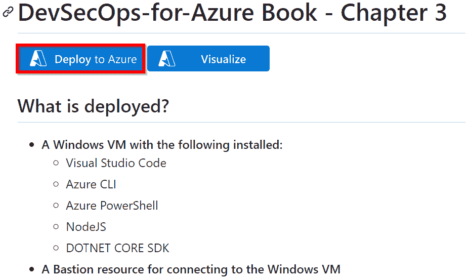

# <st c="0">3</st>

# <st c="2">在 DevOps 计划阶段实施安全性</st>

<st c="51">DevOps 的</st> **<st c="56">计划</st>** <st c="60">阶段侧重于从关键利益相关者和客户那里收集需求和反馈，制定优先考虑关键需求的不断演进的产品路线图，并设计灵活的软件架构。</st> <st c="282">在这一阶段实施 DevSecOps 应该关注能够在开发人员开始编写代码之前解决的安全挑战！</st> <st c="420">此阶段的活动应包括实施敏捷的威胁建模过程，以更早地识别设计级别的安全问题，并为您的团队实施安全培训。</st>

<st c="605">在本章中，我们将介绍在实施持续威胁建模过程时的有效方法。</st> <st c="719">我们还将讨论安全代码到云培训计划的不同成熟度级别。</st> <st c="814">通过本章的学习，您将对以下关键领域有了扎实的理解：</st> <st c="902">重点领域：</st>

+   <st c="912">DevSecOps 中传统威胁建模的挑战</st>

+   <st c="971">如何在</st> <st c="1027">DevSecOps 工作流程中实施敏捷的威胁建模过程</st>

+   <st c="1045">如何使用 Microsoft Threat</st> <st c="1106">Modeling Tool 实施威胁建模</st>

+   <st c="1119">持续安全代码到云培训的成熟级别</st>

<st c="1183">这些主题将为您提供重要的知识和策略，帮助您从 DevOps 生命周期的最开始阶段就优先考虑安全。</st> <st c="1334">让我们</st> <st c="1340">开始吧！</st>

# <st c="1348">技术要求</st>

<st c="1371">要按照本章的说明操作，您需要</st> <st c="1441">以下内容：</st>

+   <st c="1455">一台带有</st> <st c="1469">互联网连接的 PC</st>

+   <st c="1488">一个活跃的</st> <st c="1499">Azure 订阅</st>

# <st c="1517">了解 DevSecOps 在计划阶段的应用</st>

<st c="1563">预防胜于治疗</st>

<st c="1594">我们生活在一个</st> <st c="1613">世界中，许多组织</st> <st c="1638">看重他们的软件甚于他们的物理基础设施。</st> <st c="1701">亚马逊、Netflix、Airbnb 和 Uber 等行业巨头通过创新的软件平台改变了他们的行业，改变了我们阅读、观看电影、旅行和通勤的方式。</st> <st c="1883">对于这些组织和大多数现代公司来说，他们的关键运营不依赖于他们拥有的物理建筑，而是依赖于他们开发的软件，用于向用户提供服务。</st> <st c="2070">。</st>

<st c="2079">尽管软件系统在许多组织中扮演着至关重要的角色，但很多组织在规划时只关注功能性和稳定性。</st> <st c="2215">安全性往往成为一个次要问题，通常是在开发工作开始后很久才考虑到。</st> <st c="2327">正如我们在</st> *<st c="2346">第二章</st>*<st c="2355">中讨论的那样，这种做法在 DevOps 工作流中并不适用。</st> <st c="2413">这种将安全性考虑推迟的做法，部分原因是开发和运维团队缺乏有效评估和优先排序风险的专业知识，进而无法在早期阶段规划风险缓解措施。</st>

<st c="2631">这时，DevSecOps 发挥了作用。</st> <st c="2673">它鼓励开发、运维和安全团队从一开始就进行持续的合作——在规划阶段。</st> <st c="2814">目标是将安全性作为所有软件设计的核心原则！</st> <st c="2903">DevSecOps 提倡在所有参与创建和运行软件的团队中培养一种</st> *<st c="2955">安全设计</st>* <st c="2973">的思维方式。</st> <st c="3051">为了实现这些目标，组织可以实施几种方法。</st> <st c="3123">其中两个常见的方法是威胁建模和持续的</st> <st c="3174">安全培训。</st>

# <st c="3192">理解威胁建模及其好处</st>

<st c="3239">威胁是一个可能的事件</st> <st c="3268">，它可能利用应用程序设计或系统架构中的弱点，从而导致不良后果。</st> <st c="3399">任何与应用程序交互的人，无论是组织内部还是外部，都可能成为这种事件的来源。</st> <st c="3519">随着技术的发展，威胁的数量不断增加。</st> <st c="3572">为了防止威胁利用系统漏洞，威胁建模方法可以在设计阶段应用，以指导</st> <st c="3690">防御措施。</st>

<st c="3709">威胁建模</st> <st c="3725">是一种结构化的方法，用于识别软件和系统设计中的潜在威胁和漏洞。</st> <st c="3836">一旦发现这些威胁，我们可以根据其概率进行优先排序，并制定缓解计划，采取措施阻止或减少这些威胁的影响。</st>

<st c="4001">虽然威胁建模</st> <st c="4023">可以在任何阶段进行，但最好在规划阶段进行，即在编写代码之前，在决定软件架构时进行。</st> <st c="4172">这样，潜在的安全问题可以及早识别和解决，从而减少后期需要进行更加昂贵修复的情况。</st> <st c="4299">在规划阶段实施威胁建模，还有助于培养预防文化，并促进主动的架构决策，从而最小化威胁的数量和影响。</st> <st c="4497">就像土木工程师和汽车工程师在建造建筑物或汽车之前会规划安全功能一样，威胁建模确保我们从一开始就考虑到安全问题</st> <st c="4695">在软件开发过程中。</st>

<st c="4713">一旦我们有了威胁模型，我们可以在软件演变的任何时候进行更新和改进。</st> <st c="4809">这种方法很好，因为它可以帮助我们跟踪软件和系统的变化</st> <st c="4901">如何影响威胁模型。</st>

## <st c="4911">传统的威胁建模框架</st>

<st c="4950">威胁建模不是一个新概念</st> <st c="4987">在软件设计领域。</st> <st c="5021">早在 1990 年代，安全专家就开始关注如何识别和减轻软件系统中的威胁。</st> <st c="5151">威胁建模的概念在 2004 年随着 Frank Swiderski 和 Window Snyder 出版的《</st> *<st c="5244">威胁建模</st>*<st c="5259">》一书而引起了广泛关注。</st> <st c="5307">这本书介绍了威胁建模的概念，并提供了如何将其纳入软件开发</st> <st c="5435">生命周期的指导。</st>

<st c="5446">多年来，威胁建模不断发展和成熟，已经有多个方法论和框架</st> <st c="5545">被开发出来</st> <st c="5561">以协助这一过程。</st> <st c="5588">一些</st> <st c="5592">著名的威胁建模方法包括微软的</st> **<st c="5651">欺骗、篡改、否认、信息泄露、拒绝服务、权限提升</st>** <st c="5750">(</st>**<st c="5752">STRIDE</st>**<st c="5758">) 模型，</st> **<st c="5772">操作关键威胁、资产和漏洞评估</st>** <st c="5838">(</st>**<st c="5840">OCTAVE</st>**<st c="5846">) 框架，以及</st> **<st c="5868">攻击模拟和威胁分析过程</st>** <st c="5917">(</st>**<st c="5919">PASTA</st>**<st c="5924">) 框架。</st>

<st c="5937">没有一种通用的威胁建模方法；组织通常根据其项目的特定需求选择方法。</st> <st c="6081">每个框架都提供了独特的视角和关注点。</st> <st c="6135">有些方法侧重于以人为中心的考虑，而其他方法则侧重于风险识别（以风险为中心）或隐私缓解（以隐私为中心）。</st> <st c="6280">有时，结合这些方法可以提供更全面和平衡的潜在威胁理解。</st> <st c="6396">让我们来回顾一些更为</st> <st c="6426">常见的框架。</st>

<st c="6444">12 种威胁建模方法</st>

<st c="6471">卡内基梅隆大学软件工程研究所的资深成员纳塔莉亚·谢甫琴科（Nataliya Shevchenko）撰写了一篇关于 12 种威胁建模方法的有趣文章。</st> <st c="6635">这是一篇有趣的</st> <st c="6655">文章，您可以在以下网址阅读：</st> [<st c="6684">https://insights.sei.cmu.edu/blog/threat-modeling-12-available-methods/</st>](https://insights.sei.cmu.edu/blog/threat-modeling-12-available-methods/)<st c="6755">。您还可以访问</st> <st c="6800">更详细的白皮书：</st> [<st c="6806">https://resources.sei.cmu.edu/asset_files/WhitePaper/2018_019_001_524597.pdf</st>](https://resources.sei.cmu.edu/asset_files/WhitePaper/2018_019_001_524597.pdf)<st c="6882">。</st>

<st c="6883">我们的目标不是涵盖</st> <st c="6912">传统的威胁建模方法论——对于这个，我们建议参考一本全面的书籍，如</st> *<st c="7004">《威胁建模：设计安全》</st>*<st c="7043">，作者是</st> *<st c="7048">亚当·肖斯塔克</st>* <st c="7061">——我们的主要关注点是从 DevSecOps 的角度进行威胁建模。</st> <st c="7134">不过，在本章后面，我们将使用微软威胁建模工具，该工具使用 STRIDE 框架进行</st> <st c="7258">分析。</st>

## <st c="7271">DevSecOps 中的威胁建模</st>

<st c="7300">传统的威胁</st> <st c="7320">建模框架</st> <st c="7339">例如 STRIDE、PASTA 和 DREAD，在整合到 DevOps 工作流程时，由于其高强度的性质，可能会带来挑战。</st> <st c="7463">它们</st> *<st c="7472">速度较慢</st>*<st c="7476">，</st> *<st c="7478">需要较高技能</st>* <st c="7493">(需要高水平的专业知识)，并且</st> *<st c="7537">时间消耗大</st>* <st c="7551">(需要相当的时间投入)。</st> <st c="7594">花费数天甚至数周时间构建</st> <st c="7649">复杂的威胁模型，使用</st> **<st c="7679">数据流图</st>** <st c="7697">(</st>**<st c="7699">DFD</st>**<st c="7703">)和信息入口点，分类数据，识别相关威胁，及记录</st> <st c="7803">缓解控制措施的过程并不少见。</st>

<st c="7823">然而，在一个软件更新频繁（每日或每周）或定期引入新微服务的动态 DevOps 环境中，传统的威胁模型可能并不是最有效的。</st> <st c="8023">我们最终陷入了一种情况：在试图将安全集成到设计阶段的开始时，我们引入了一个早期瓶颈！</st> <st c="8175">组织内的许多团队已经认为安全会拖慢他们的流程，这只是进一步验证了这种看法。</st> <st c="8306">现实情况是，为每个微服务或软件更新创建一个全面的威胁模型根本</st> <st c="8425">不切实际！</st>

<st c="8439">鉴于 DevOps 工作流的快速节奏，需要将威胁建模转化为一种轻量级、快速且增量化的过程。</st> <st c="8587">这并不是一个新想法，但在我们的实践中，我们看到越来越多的组织开始采用现代敏捷威胁建模方法，这些方法优先考虑灵活性和效率。</st> <st c="8768">这些方法将威胁建模过程分解为更小、更易于管理的</st> <st c="8848">模块，这些模块可以持续进行。</st> <st c="8886">Mozilla 的</st> **<st c="8896">快速风险评估</st>** <st c="8917">（</st>**<st c="8919">RRA</st>**<st c="8922">）和 Slack 的</st> **<st c="8937">goSDL</st>** <st c="8942">模型提供了很好的资源</st> <st c="8971">，以促进一种更轻量级的威胁建模和风险评估方法。</st> <st c="9054">这些框架专注于快速评估软件设计和变更中的数据风险。</st> <st c="9144">它们被设计</st> <st c="9161">为快速进行评估，通常评估在 30 到</st> <st c="9191">60 分钟内完成。</st>

## <st c="9236">理解 Mozilla 的 RRA 过程</st>

<st c="9274">Mozilla 的 RRA</st> <st c="9288">提供了一个 30 分钟的风险评估问卷，您可以在</st> [<st c="9348">https://docs.google.com/document/d/1uD-wofmkXBz5BVq49JQQqC3DnE77vwOPDSbHdWIve9s/edit</st>](https://docs.google.com/document/d/1uD-wofmkXBz5BVq49JQQqC3DnE77vwOPDSbHdWIve9s/edit)<st c="9432">找到它。当团队引入新服务时，他们可以与安全团队合作，利用这个问卷评估服务的威胁场景和风险等级。</st> <st c="9604">RRA 模型有四个不同的阶段，如</st> *<st c="9656">图 3</st>**<st c="9664">.1</st>*<st c="9666">所示：</st>

<st c="9892">Figure 3.1 – Mozilla RRA 的四个阶段</st>

<st c="9937">我们将在本节中涵盖这些阶段。</st> <st c="9964">然而，初步步骤是清晰地定义请求 RRA 会话的流程。</st> <st c="9982">让我们从这一点开始！</st>

### <st c="10090">定义 RRA 请求流程</st>

<st c="10122">为了在组织内引入 RRA</st> <st c="10140">，需要有一个简单且沟通良好的流程，供产品和工程团队遵循。</st> <st c="10275">他们应该能够轻松地请求 RRA，用于新的服务或后续的软件设计更改（例如收集新数据或处理）。</st> <st c="10420">这可以是一个简单的请求表格，方便开发人员在组织中常用的规划工具中访问，无论是 JIRA、Confluence、Azure Boards 还是 GitHub 项目。</st> <st c="10619">与此表格一起，应该有一个最新的可用性日历，用于预订 RRA 会议。</st> <st c="10718">此外，还应该有一份简短的清单，列出参加会议时需要提供的详细信息，包括服务信息、软件架构图、数据流图以及服务</st> <st c="10892">地图图。</st>

<st c="10905">当然，这个过程不应当孤立定义。</st> <st c="10966">协作是至关重要的。</st> <st c="10994">通过让来自工程和安全团队的领导者与成员参与其中，我们可以确保相关视角被考虑在内。</st> <st c="11133">他们的集体洞察力、专业知识和反馈可以确保确定的流程与现有团队的实践相一致，并且能够被良好地接受。</st> *<st c="11286">最终目标是简化团队的 RRA 请求流程</st>*<st c="11347">。这也可以嵌入到标准的组织程序中，用于在 Azure DevOps 或</st> <st c="11483">GitHub 组织内请求新项目或代码库。</st>

<st c="11504">一个好的起点是组建一个专门的安全开发生命周期团队，致力于评估和改善生命周期的现状。</st> <st c="11642">从战略上看，这强制要求相关利益相关者在场，并从一开始就将安全性融入流程中。</st> <st c="11757">这个团队可以由来自不同团队的成员组成</st> <st c="11812">，包括 DevSecOps 负责人，</st> **<st c="11861">安全运营</st>** <st c="11880">(</st>**<st c="11882">SOC</st>**<st c="11885">)、云卓越中心、开发人员（由于该团队所做的所有决策都会影响开发人员，因此他们应当拥有发声权）、安全冠军、基础设施架构师以及管理层。</st> <st c="12076">这将需要高层管理的支持</st> <st c="12111">和赞助。</st>

<st c="12127">重要的是要认识到</st> <st c="12156">采用敏捷威胁建模技术（例如 RRA）并不否定传统威胁建模方法的价值。</st> <st c="12290">平衡的策略应该是为工程团队提供选择的灵活性。</st> <st c="12384">他们可以选择在处理重要软件项目时采用全面的威胁模型，例如即将推出的旗舰产品，或者在处理较小规模任务时选择 RRA，例如构建微服务或修改软件设计，如</st> *<st c="12643">图 3</st>**<st c="12651">.2</st>*<st c="12653">所示：</st>

<st c="12734">图 3.2 – 请求威胁建模会议的示例流程</st>

<st c="12802">注意</st>

<st c="12807">明确定义什么算作</st> *<st c="12863">重要软件项目</st>* <st c="12885">对于避免混淆是有益的。</st> <st c="12929">虽然这个定义可能会随着安全团队对组织的软件交付流程的熟悉而发展，但总是从一个具体的指导原则开始会更好。</st> <st c="13115">从清晰开始，并在必要时进行调整，比在</st> <st c="13202">指导方针中含糊其辞更为有效。</st>

<st c="13218">现在，让我们回顾一下</st> <st c="13241">RRA 阶段。</st>

### <st c="13252">阶段 1 – 信息收集（5 分钟）</st>

<st c="13296">本阶段的目标</st> <st c="13324">是对服务有一个高层次的理解。</st> <st c="13379">此时不需要深入到服务的实现细节；这些细节可以稍后再处理。</st> <st c="13504">在这一阶段，安全团队应该花更多时间倾听和学习，而不是发言。</st> <st c="13602">重点应该放在提出有意义的问题上，以理解产品/工程团队的设计、观点和计划。</st> <st c="13740">团队应该积极参与讨论，做好记录，并收集所有相关的</st> <st c="13833">文档链接。</st>

<st c="13848">重要的是确保创建一个舒适开放的环境，使产品/工程团队能够安全地分享有关服务和其工作设计的信息，而不必担心被评判。</st> <st c="14062">以下是一些面向背景的问题，可以帮助更好地理解</st> <st c="14140">这项服务：</st>

+   **<st c="14152">服务的</st>** **<st c="14166">所有权</st>**<st c="14177">：</st>

    +   <st c="14179">公司内谁负责</st> <st c="14221">这项服务？</st>

    +   <st c="14233">将参与此项工作的开发人员是谁</st> <st c="14278">？</st>

    +   <st c="14284">一旦服务上线，谁将负责监督其运营？</st> <st c="14330"> </st>

    +   <st c="14342">如果发生安全</st> <st c="14389">事件，谁将响应该服务？</st>

+   **<st c="14405">服务的</st>** **<st c="14418">受众</st>**<st c="14429">：</st>

    +   <st c="14431">它是为内部使用设计的，还是对公众或指定的合作伙伴</st> <st c="14515">和供应商开放的？</st>

    +   <st c="14527">公众用户是否会有直接访问权限？</st> <st c="14566">他们将访问服务的哪些部分？</st>

    +   <st c="14618">内部用户是否会有直接访问权限？</st> <st c="14659">他们将访问服务的哪些部分？</st> <st c="14701">他们能访问哪些内容？</st>

    +   <st c="14711">合作伙伴/供应商是否会有直接访问权限？</st> <st c="14754">他们将访问服务的哪些部分？</st>

    +   <st c="14806">每个受众将访问服务的哪些部分？</st> <st c="14869">服务地图和架构图可能有助于快速定义</st> <st c="14934">这一点。</st>

+   **<st c="14947">主要的</st>** **<st c="14953">用户故事</st>**<st c="14965">：</st>

    +   <st c="14967">主要的</st> <st c="14985">用户故事是什么？</st>

    +   <st c="14998">用户将如何使用</st> <st c="15018">该服务？</st>

+   **<st c="15030">该服务将如何</st>** **<st c="15052">构建？</st>**<st c="15061">:</st>

    +   <st c="15063">是否有</st> <st c="15074">设计文档？</st>

    +   <st c="15090">是否有</st> <st c="15101">设计图？</st>

    +   <st c="15117">它将使用哪些服务来</st> <st c="15149">存储数据？</st>

    +   <st c="15162">它将与哪些外部服务</st> <st c="15195">进行通信？</st>

    +   <st c="15212">它将如何与外部服务</st> <st c="15236">进行通信？</st> <st c="15261">是通过直接的 API 调用吗？</st> <st c="15279">还是通过消息队列？</st>

<st c="15294">现在，让我们看看</st> <st c="15314">第二阶段。</st>

### <st c="15322">第二阶段 – 构建数据字典（5-10 分钟）</st>

<st c="15374">这一阶段的重点是检查</st> <st c="15404">该服务将处理的数据。</st> <st c="15444">此阶段的目标是了解该服务将收集、处理或访问的数据。</st> <st c="15549">需要考虑的一些问题包括将收集或访问什么样的数据？以及这些数据将存储在哪里？</st> <st c="15661">随着细节的展开，安全团队必须记录这些信息，并按其各自的</st> *<st c="15764">分类级别</st>*<st c="15785">进行标注。</st>

<st c="15786">谈到数据分类级别时，这需要在公司层面进行定义（而不是每个项目）。</st> <st c="15892">它还需要由高层管理、安保、合规以及</st> <st c="15983">法律团队确定并批准。</st>

<st c="15995">备注</st>

<st c="16000">有关定义全组织数据分类级别的建议和最佳实践，请参考</st> <st c="16113">此</st> <st c="16122">文档：</st> [<st c="16132">https://learn.microsoft.com/en-us/compliance/assurance/assurance-create-data-classification-framework</st>](https://learn.microsoft.com/en-us/compliance/assurance/assurance-create-data-classification-framework)<st c="16233">。</st>

<st c="16234">如</st> *<st c="16259">图 3</st>**<st c="16267">.3</st>*<st c="16269">所示，组织已经定义了四个级别的数据分类：</st>

<st c="16616">图 3.3 – 示例组织级别的数据分类</st>

<st c="16676">示例数据字典</st> <st c="16703">如</st> *<st c="16713">图 3</st>**<st c="16721">.4</st>* <st c="16723">所示，提供了与在线购物平台</st> **<st c="16812">eShopOnWeb</st>**<st c="16822">相关的四种数据类型的概述，以及它们的敏感性或分类级别。</st> <st c="16880">这有助于做出有关数据处理、存储和安全的明智决策。</st> <st c="16964">请注意，这仅仅是一个示例。</st> <st c="17021">你定义数据字典的方法可能有所不同，</st> <st c="17088">这也没问题。</st>

<st c="17328">图 3.4 – 示例数据字典</st>

<st c="17363">接下来，我们将关注</st> <st c="17398">第 3 阶段。</st>

### <st c="17406">阶段 3 – 识别威胁场景（5-10 分钟）</st>

<st c="17460">此阶段的目的是识别</st> <st c="17488">潜在问题，并通过赋予风险评级对其进行排序。</st> <st c="17559">Mozilla RRA 过程使用 CIA 模型，侧重于机密性、完整性</st> <st c="17643">和可用性：</st>

+   **<st c="17660">机密性</st>**<st c="17676">：如果数据字典中突出显示的数据分类边界被破坏，会发生什么情况？</st>

+   **<st c="17773">完整性</st>**<st c="17783">：如果数据未经授权访问和修改</st> <st c="17836">会发生什么情况？</st>

+   **<st c="17858">可用性</st>**<st c="17871">：如果数据被删除、恶意加密，或者服务</st> <st c="17953">被压垮，会发生什么情况？</st>

<st c="17968">对于这些领域，我们应记录四个要素：威胁向量、影响、可能性和风险评级。</st> <st c="18087">让我们来看看</st> <st c="18098">它们：</st>

+   **<st c="18106">威胁向量</st>**<st c="18121">：这些描述了攻击者可能如何危害领域（机密性、完整性和可用性）的方式。</st> <st c="18247">在考虑威胁时，应该想到最严重但现实的情况，而不是极不可能发生的事件。</st> <st c="18359">例如，我们不会担心 Azure 云中所有服务器同时崩溃，因为这是一个高度不可能的场景。</st>

+   **<st c="18496">影响</st>**<st c="18503">：这是评估威胁发生时可能对组织造成的潜在影响。</st> <st c="18602">理想情况下，影响级别应在组织层面进行定义，并涉及相关利益相关者（业务高管、法律团队、合规团队和产品负责人）。</st> <st c="18798">该定义应在 RRA 会议之前提前完成。</st> <st c="18855">确保涉及正确的人员至关重要，因为安全工程师可能倾向于低估企业的风险承受能力。</st> <st c="18975">为了更加谨慎，安全工程师有时会将低影响的威胁评定为高风险甚至是关键威胁。</st> <st c="19098">这可能会稀释真正关键问题的重要性，导致所有问题看起来都很重要，从而降低每个问题的紧迫性。</st> <st c="19261">至少，业务高管应审核并批准影响级别。</st>

    <st c="19339">在确定影响级别时，应该考虑多个因素：对业务收入的影响；对服务用户的影响；对组织公众声誉的影响；以及可能的法律影响。</st> <st c="19551">但是，请记住，并非每个因素都适用于你所遇到的每个威胁场景。</st> <st c="19651">例如，要确定对业务收入的影响，可以先查看过去的收入。</st>

    <st c="19659">例如，要确定对业务收入的影响，可以从查看过去的收入开始。</st> <st c="19696">将任何可能影响 20% 收入的威胁评为</st> *<st c="19821">关键</st>*<st c="19829">。根据业务代表的反馈，这一基准可以进一步细化。</st> <st c="19915">在考虑对用户的影响时，预计用户数量可以是一个有用的指标。</st> *<st c="20008">图 3</st>**<st c="20016">.5</st>* <st c="20018">提供了一个组织影响评级示例，详细说明了每个级别的条件：</st>

<st c="20507">图 3.5 – 组织级别影响示例</st>

+   **<st c="20559">可能性</st>**<st c="20570">：这评估威胁发生所需的努力。</st> <st c="20635">这可能很难评估。</st> <st c="20668">在存在设计缺陷的情况下，如何评估或预测它是否会被利用呢？</st> <st c="20761">此外，威胁可能性的动态变化不断。</st> <st c="20820">今天，*<st c="20835">难以利用</st>* <st c="20855">的缺陷可能会变成明天的</st> *<st c="20886">易于利用</st>* <st c="20901">的缺陷，因为攻击者</st> <st c="20919">的能力在不断提高。</st>

    <st c="20940">有些威胁的可能性较低或非常低，因为它们需要付出巨大的努力才能实现。</st> <st c="21045">这些类型的威胁只能由高度激励的对手，且拥有大量资源的对手（如国家级对手）实现。</st> <st c="21168">这排除了机会主义对手，并减少了它们发生的机会。</st>

+   **<st c="21250">风险评级</st>**<st c="21262">：这涉及通过结合威胁的影响和可能性来量化风险。</st> <st c="21290">风险评级有助于优先处理威胁，以便可以有效地分配资源来管理和缓解最高评级的风险。</st> <st c="21354">具有最高影响和最高可能性的威胁应获得最高的风险评级：</st> *<st c="21609">关键</st>*<st c="21617">。只有少数威胁向量应属于</st> <st c="21676">此类别。</st>

    *<st c="21690">风险评级 =</st>* *<st c="21705">I</st>**<st c="21706">影响 *</st>* *<st c="21714">L</st>**<st c="21715">可能性</st>*

<st c="21763">图 3.6 – 风险评级等级示例</st>

*<st c="21800">图 3</st>**<st c="21809">.7</st>* <st c="21811">显示了这一阶段输出的一个示例。</st> <st c="21842">在这个示例中，识别出了三种威胁情景（每个安全领域各一个）。</st> <st c="21952">第一个威胁的风险评级为中等，因为暴露</st> **<st c="22018">UserAddress</st>** <st c="22029">信息被业务认为是低影响，且发生的可能性高。</st> <st c="22141">第二个威胁的风险评级为严重，因为通过更改我们提供的文件来感染其他用户可能会违反合规性（严重影响）、影响我们大部分用户（严重影响），并造成持续的声誉损害（严重影响）。</st> <st c="22436">此外，发生这种情况的可能性很高，因为我们经常看到这种情况发生在</st> <st c="22512">数据泄露中。</st>

<st c="22784">图 3.7 – 风险评级示例文档</st>

<st c="22824">现在，让我们来看一下</st> <st c="22844">第 4 阶段。</st>

### <st c="22852">阶段 4 – 提出安全建议（5 分钟）</st>

<st c="22906">本阶段旨在提出解决已识别威胁场景的策略。</st> <st c="22944">建议优先处理来自</st> <st c="23057">上一阶段的最高风险。</st>

*<st c="23072">图 3</st>**<st c="23081">.8</st>* <st c="23083">显示了这一阶段的输出示例：</st>

<st c="23545">图 3.8 – 示例风险建议文档</st>

<st c="23593">记住，每个组织天生都会承担一定的风险。</st> <st c="23658">企业并非通过完全避免风险来获取利润。</st> <st c="23719">安全的角色不是阻止组织承担风险，而是识别、评估并提供关于这些风险的见解。</st> <st c="23860">这里的主要角色是教育相关方（产品所有者、开发人员、经理）了解服务设计中存在的风险、潜在的后果和可能的缓解措施。</st> <st c="24046">这确保了企业能够做出充分知情的决策。</st> <st c="24109">虽然安全团队有时可能会感到需要将某些风险级别宣称为不可接受，但这种做法未必总是合理的，尤其是在企业通过抢占市场先机从而获益的场景中。</st> <st c="24327">与其做出决策，目标是启发他人了解</st> <st c="24394">这些风险。</st>

<st c="24404">在本节中，我们介绍了规划阶段的威胁建模及其好处。</st> <st c="24489">理论部分已结束，接下来我们将进入一些动手操作，并从</st> <st c="24599">实践的角度学习威胁建模。</st>

# <st c="24621">动手练习 1 – 配置实验室虚拟机</st>

<st c="24667">为了跟随本章及本书后续部分的练习，我们将在 Azure 中配置一个实验室</st> **<st c="24770">虚拟机</st>** <st c="24785">(</st>**<st c="24787">VM</st>**<st c="24789">) 进行操作。</st> <st c="24815">我们已经为此目的在本书的 GitHub 仓库中准备了一个 Azure ARM 模板。</st> <st c="24905">该模板将在指定的 Azure 区域部署一个虚拟机和一个堡垒资源，如</st> *<st c="25001">图 3</st>**<st c="25009">.9</st>*<st c="25011">所示：</st>

<st c="25104">图 3.9 – 通过提供的 ARM 模板部署的资源</st>

<st c="25165">以下是我们将在</st> <st c="25185">本练习中完成的任务：</st> <st c="25210">该练习的任务：</st>

+   **<st c="25224">任务 1 –</st>**<st c="25233">在 GitHub 中初始化模板部署；完成参数并将模板部署到</st> <st c="25320">Azure</st>

+   **任务 2 – 使用 Azure Bastion 连接到实验室虚拟机**

让我们开始吧！

## 任务 1 – 初始化模板部署到 Azure

步骤如下：

1.  打开一个网页浏览器，访问[`github.com/PacktPublishing/DevSecOps-for-Azure/tree/main/chapter-3`](https://github.com/PacktPublishing/DevSecOps-for-Azure/tree/main/chapter-3)。

    该链接将打开包含用于部署所需资源的 ARM 模板的 GitHub 仓库。

1.  在打开的 GitHub 仓库中，点击**部署到 Azure**：

图 3.10 – 启动模板部署

1.  如果提示您进行身份验证，请使用您的管理用户名和密码登录 Azure 门户。

1.  在`<st c="26342">DevSecOps-Book-RG</st>` | `<st c="26587">azureuser</st>`

1.  **管理员密码**：输入一个复杂的密码。<st c="26640">这是为已部署的虚拟机实例设置的密码。</st> <st c="26665">密码必须至少包含八个字符，并且至少包含一个小写字母，一个数字和一个特殊字符。</st> <st c="26836">请记下这个密码，因为在本章和本书的后续练习中需要用到它。</st>

1.  选择**查看 + 创建**：

图 3.11 – 填写模板参数

1.  验证通过后，点击**创建**。

等待部署<st c="27944">完成</st>后再继续进行<st c="27968">下一个练习。</st> <st c="27994">部署可能需要最多 20 分钟完成，因此在继续之前</st> <st c="28017">可以去喝杯水或咖啡。</st>

## 任务 2 – 使用 Azure Bastion 连接到实验室虚拟机

这个任务的目的是使用 Bastion 服务<st c="28201">建立与实验室虚拟机的连接。</st> <st c="28244">请按照以下步骤操作：</st>

1.  <st c="28306">在 Azure 门户的主页上，在搜索框中输入</st> `<st c="28362">DevSecOps-LabVM</st>` <st c="28377">并选择</st> **<st c="28393">DevSecOps-LabVM</st>** <st c="28408">虚拟机，当</st> <st c="28417">它出现时：</st>

<st c="28660">图 3.12 – 选择 DevSecOps-LabVM 虚拟机</st>

1.  <st c="28706">在</st> **<st c="28714">DevSecOpsLabVM</st>** <st c="28728">窗口中，在</st> **<st c="28744">连接</st>** <st c="28751">部分，点击</st> **<st c="28770">连接</st>**<st c="28777">，然后点击</st> **<st c="28793">转到 Bastion</st>**<st c="28796">：</st>

<st c="29598">图 3.13 – 选择使用 Bastion 连接虚拟机的选项</st>

1.  <st c="29667">在</st> `<st c="29745">azureuser</st>`

1.  **<st c="29754">身份验证</st>** **<st c="29770">类型</st>**<st c="29774">：</st> **<st c="29777">密码</st>**

1.  **<st c="29785">密码</st>**<st c="29794">：输入你在</st> <st c="29815">模板部署期间指定的密码</st> <st c="29846">。</st>

1.  **<st c="29865">在新浏览器中打开</st>** **<st c="29886">标签</st>**<st c="29889">：已选择</st>

<st c="29900">然后，</st> <st c="29907">点击</st> **<st c="29913">连接</st>**<st c="29920">。</st>

<st c="29921">如果提示，请启用弹出窗口以确保连接成功。</st> <st c="29995">此外，如果提示，点击允许剪贴板访问</st> <st c="30033">。</st>

<st c="30218">图 3.14 – 配置虚拟机凭证并启动连接</st>

<st c="30300">现在你</st> <st c="30313">已经获得</st> <st c="30325">访问实验室虚拟机的权限，让我们对一个</st> <st c="30376">示例应用程序进行威胁建模。</st>

# <st c="30395">动手练习 2 – 对电子商务应用程序进行威胁建模</st>

<st c="30473">要完成本次动手操作练习，你需要</st> <st c="30518">先完成本章前面的动手操作练习。</st> <st c="30585">在本次练习中，我们将使用 Microsoft 威胁建模工具进行威胁建模练习，这是 Microsoft</st> <st c="30701">的一个基础</st> **<st c="30729">安全开发生命周期</st>** <st c="30759">(</st>**<st c="30761">SDL</st>**<st c="30764">)</st>。<st c="30768">这种方法包括创建一个应用程序架构图，使用该工具识别可能的威胁，并提供如何缓解这些威胁的信息。</st> <st c="30929">在本次及后续的练习中，我们将使用 eShop 电子商务应用程序。</st> *<st c="31010">图 3</st>**<st c="31018">.15</st>* <st c="31021">显示了该应用程序的参考架构。</st> <st c="31075">该应用程序有两个不同版本：一个是单体版本 eShopOnWeb（可访问</st> [<st c="31176">https://github.com/dotnet-architecture/eShopOnWeb</st>](https://github.com/dotnet-architecture/eShopOnWeb)<st c="31225">），另一个是为容器部署设计的微服务版本 eShopOnContainers（可访问</st> [<st c="31325">https://github.com/dotnet-architecture/eShopOnContainers</st>](https://github.com/dotnet-architecture/eShopOnContainers)<st c="31381">）。</st> <st c="31385">这两种版本将在</st> <st c="31421">本书中提及。</st>

<st c="31967">图 3.15 – eShopOnContainers 参考架构</st>

<st c="32021">以下是我们将在本次练习中完成的任务：</st> <st c="32066">：</st>

+   **<st c="32080">任务 1 –</st>** <st c="32089">下载并安装 Microsoft 威胁建模工具</st>

+   **<st c="32152">任务 2 –</st>** <st c="32160">为 eShop 应用程序创建威胁模型图</st>

+   **<st c="32219">任务 3 –</st>** <st c="32227">对模型进行威胁分析</st>

<st c="32267">让我们开始实际的</st> <st c="32292">威胁建模</st>。

## <st c="32308">任务 1 – 下载并安装 Microsoft 威胁建模工具</st>

1.  <st c="32379">在实验室虚拟机上，打开</st> <st c="32399">一个 web 浏览器</st> <st c="32413">并浏览至</st> [<st c="32428">https://aka.ms/threatmodelingtool</st>](https://aka.ms/threatmodelingtool)<st c="32461">。这将自动将安装程序下载到</st> `<st c="32517">下载</st>` <st c="32526">文件夹。</st>

1.  <st c="32534">打开</st> `<st c="32544">下载</st>` <st c="32553">文件夹并双击</st> `<st c="32582">TMT7</st>` <st c="32586">应用程序：</st>

<st c="32798">图 3.16 – 要安装的 TMT7 应用程序</st>

1.  当提示时，点击**<st c="32866">安装</st>**<st c="32873">以安装</st> <st c="32884">该工具。</st> <st c="32895">如果出现警告要求安装 .NET Framework，请点击</st> **<st c="32949">是</st>** <st c="32952">以安装所需版本：</st>

图 3.17 – 安装该工具

工具安装完成后，转到任务 2。

注意

在本次动手实验中，我们将使用微软威胁建模工具。请注意，还有更新的工具可用，例如 Threats Manager Studio（[`threatsmanager.com`](https://threatsmanager.com)）。

## 任务 2 – 为 eShop 应用程序创建威胁模型图

1.  在实验虚拟机上，点击**<st c="33818">开始</st>**按钮，然后点击**<st c="33843">微软威胁建模工具</st>**<st c="33873">打开它：</st>

图 3.18 – 打开微软威胁建模工具

1.  如果系统提示您接受条款和条件，请点击**<st c="34322">我同意</st>**<st c="34329">。如果系统提示您参与</st> <st c="34364">客户体验</st>，可以随意取消选中</st> <st c="34415">此选项。</st>

1.  在**<st c="34435">微软威胁建模工具</st>**区域的**<st c="34479">新模型模板</st>**部分，确保已选择**<st c="34524">Azure 威胁模型模板</st>**，然后点击**<st c="34576">创建</st>** **<st c="34583">模型</st>**<st c="34590">：</st>

<st c="35006">图 3.19 – 微软威胁建模工具的登录页面</st>

1.  <st c="35067">这为创建新模型打开了窗口。</st> <st c="35116">请查看右侧的可用模板。</st> <st c="35160">根据您在创建模型时选择的模板，模板类型会发生变化。</st> <st c="35249">以下是</st> **<st c="35288">Azure 威胁模型模板</st>** <st c="35315">下提供的模板类别：</st> **<st c="35320">通用数据流</st>**<st c="35337">，</st> **<st c="35339">通用数据存储</st>**<st c="35357">，</st> **<st c="35359">通用外部交互者</st>**<st c="35386">，</st> **<st c="35388">通用进程</st>**<st c="35403">，</st> **<st c="35405">通用信任边界</st>**<st c="35434">，和</st> **<st c="35440">通用信任线边界</st>**<st c="35467">。您可以展开</st> <st c="35484">每个类别：</st>

<st c="35915">图 3.20 – 审查模板类别和模板</st>

<st c="35974">如前所述，我们将在练习中使用 eShop 应用程序。</st> <st c="36055">我们希望从规划阶段开始识别威胁并添加缓解措施。</st> <st c="36128">我们将基于已知的数据流，即</st> <st c="36197">DFD</st> <st c="36197">，来创建模型。</st>

1.  <st c="36205">使用以下模板</st> <st c="36232">绘制两个信任边界</st> <st c="36259">区域，如</st> *<st c="36279">图 3</st>**<st c="36287">.21</st>*<st c="36290">所示。您需要将每个模板拖动到</st> <st c="36336">图表板上：</st>

    +   **<st c="36350">通用信任边界</st>** <st c="36380">|</st> **<st c="36383">远程</st>** **<st c="36390">用户区域</st>**

    +   **<st c="36399">通用信任边界</st>** <st c="36429">|</st> **<st c="36432">Azure</st>** **<st c="36438">信任边界</st>**<st c="36452">：</st>

<st c="37022">图 3.21 – 绘制信任边界</st>

1.  <st c="37064">使用以下模板</st> <st c="37091">将</st> **<st c="37102">浏览器</st>** <st c="37110">和</st> **<st c="37115">移动客户端</st>** <st c="37128">模板添加到</st> <st c="37145">图表板：</st>

    +   **<st c="37159">通用外部交互者</st>** <st c="37187">|</st> **<st c="37190">浏览器</st>**

    +   **<st c="37197">通用外部交互者</st>** <st c="37225">|</st> **<st c="37228">移动客户端</st>**<st c="37241">：</st>

<st c="37692">图 3.22 – 添加浏览器和移动客户端模板</st>

1.  <st c="37751">将以下模板添加到</st> **<st c="37786">Azure 信任边界</st>** <st c="37806">部分的</st> <st c="37822">图表板上：</st>

    +   **<st c="37836">通用进程</st>** <st c="37852">|</st> **<st c="37855">Web 应用程序</st>**

    +   **<st c="37870">通用进程</st>** <st c="37886">|</st> **<st c="37889">Web API</st>**

    +   **<st c="37896">通用数据存储</st>** <st c="37915">|</st> **<st c="37918">Azure</st>** **<st c="37924">SQL 数据库</st>**

    +   **<st c="37936">通用数据存储</st>** <st c="37955">|</st> **<st c="37958">Azure</st>** **<st c="37964">Redis 缓存</st>**<st c="37975">:</st>

<st c="38181">图 3.23 – 添加所需的通用过程和通用数据存储模板</st>

1.  <st c="38260">你也可以右键点击</st> <st c="38285">每个模板，然后点击</st> <st c="38310">选择</st> **<st c="38314">属性</st>** <st c="38324">来重命名它们并设置其他</st> <st c="38354">可配置属性：</st>

<st c="38917">图 3.24 – 重命名模板（可选）</st>

1.  <st c="38963">最后，使用以下模板</st> <st c="38999">定义</st> <st c="39010">连接，如</st> *<st c="39039">图 3</st>**<st c="39047">.25</st>*<st c="39050">所示：</st>

    +   **<st c="39052">通用数据流</st>** <st c="39069">|</st> **<st c="39072">请求</st>**

    +   **<st c="39079">通用数据流</st>** <st c="39097">|</st> **<st c="39100">响应</st>**

    <st c="39108">要创建的连接如下：</st>

    +   <st c="39150">浏览器与</st> <st c="39207">电子商店 Web 应用之间的请求/响应连接</st>

    +   <st c="39219">电子商店 Web 应用与</st> <st c="39281">Web API 之间的请求/响应连接</st>

    +   <st c="39288">移动客户端与</st> <st c="39351">Web API 之间的请求/响应连接</st>

    +   <st c="39358">Web API 与</st> <st c="39415">订购微服务之间的请求/响应连接</st>

    +   <st c="39436">Web API 与</st> <st c="39493">购物车微服务之间的请求/响应连接</st>

    +   <st c="39512">订购微服务与 Azure</st> <st c="39589">SQL 数据库之间的请求/响应连接</st>

    +   <st c="39601">请求/响应连接</st> <st c="39629">在购物车微服务</st> <st c="39661">和 Azure</st> <st c="39676">Redis 缓存之间：</st>

<st c="39911">图 3.25 – 简单的电子商店威胁模型</st>

<st c="39950">此时，我们可以继续进行</st> <st c="39984">任务 3。</st>

## <st c="39991">任务 3 – 对模型进行威胁分析</st>

<st c="40039">按照以下步骤操作：</st>

1.  <st c="40059">要分析模型中的威胁，请导航到</st> **<st c="40109">视图</st>** <st c="40113">顶部，然后选择</st> **<st c="40138">分析视图</st>** <st c="40151">从图标</st> <st c="40166">菜单中选择：</st>

<st c="40518">图 3.26 – 打开分析视图</st>

1.  <st c="40553">基于模型的潜在威胁列表将在图表下方显示。</st> <st c="40638">这些</st> <st c="40644">根据</st> **<st c="40673">STRIDE</st>** <st c="40679">模型进行分类。</st> <st c="40687">列表中的每个威胁都被分配了一个严重性等级，同时还添加了可能的缓解信息。</st> <st c="40801">您可以</st> <st c="40808">点击</st> **<st c="40822">导出 CSV</st>** <st c="40832">按钮以导出</st> <st c="40850">该列表：</st>

<st c="42717">图 3.27 – 威胁列表</st>

1.  <st c="42742">浏览生成的威胁列表及可能的缓解措施。</st> <st c="42810">您可以将每个威胁的状态更新为</st> **<st c="42854">未开始</st>**<st c="42865">，</st> **<st c="42867">需要调查</st>**<st c="42886">，</st> **<st c="42888">不适用</st>**<st c="42902">，</st> <st c="42904">或</st> **<st c="42907">已缓解</st>**<st c="42916">。</st>

1.  <st c="42917">一旦浏览完列表，选择</st> **<st c="42982">报告</st>**<st c="42989">，然后点击</st> **<st c="43002">创建</st>** **<st c="43009">完整报告</st>**<st c="43020">：</st>

<st c="43132">图 3.28 – 创建完整报告</st>

1.  <st c="43168">当系统提示</st> <st c="43182">关于</st> **<st c="43189">自定义威胁属性</st>**<st c="43213">时，保留所有选项并点击</st> **<st c="43252">生成报告</st>**<st c="43267">：</st>

<st c="43405">图 3.29 – 生成完整报告</st>

1.  <st c="43445">在</st> `<st c="43559">eShopApp</st>`<st c="43567">中。</st> <st c="43569">点击</st> **<st c="43575">保存</st>**<st c="43579">：</st>

<st c="43869">图 3.30 – 将报告保存到桌面</st>

1.  <st c="43915">当系统提示您打开文件时，</st> <st c="43955">点击</st> **<st c="43961">确定</st>**<st c="43963">：</st>

<st c="44210">图 3.31 – 打开报告</st>

1.  <st c="44242">查看</st> <st c="44250">报告：</st>

<st c="44493">图 3.32 – 审查生成的报告</st>

<st c="44546">恭喜！</st> <st c="44564">您已成功</st> <st c="44583">使用 Microsoft 威胁建模工具分析了应用模型中的威胁。</st> <st c="44668">接下来，我们将探索安全培训，这是 DevOps</st> <st c="44741">规划阶段的重要组成部分。</st>

# <st c="44756">实施持续的代码到云安全培训</st>

<st c="44812">一个成熟的安全代码到云培训计划应重点解决学员理解上的差距。</st>

<st c="44929">在任何关于安全的对话中</st> <st c="44949">都很容易陷入技术细节和工具的讨论中。</st> <st c="45022">然而，正是人类因素和组织文化，而非任何技术缺陷，构成了对组织安全性最为显著的风险。</st> <st c="45193">根据</st> *<st c="45197">2022 年数据泄露成本报告</st>*<st c="45230">（由 IBM 发布），21%的数据泄露是由于人为错误造成的。</st> <st c="45300">这些错误是员工或承包商的无意失误，证明即使是最复杂的软件安全程序也可能因简单的人为错误而受到威胁。</st> <st c="45479">例如，开发人员可能会将生产凭证提交到代码中，或者在其 IDE 中安装恶意</st> <st c="45570">扩展。</st>

<st c="45594">IBM 2022 年数据泄露成本报告</st>

[<st c="45632">https://www.ibm.com/downloads/cas/3R8N1DZJ</st>](https://www.ibm.com/downloads/cas/3R8N1DZJ)<st c="45675">。</st>

<st c="45676">为了解决 DevSecOps 过程中的这一风险，组织应实施一个具有明确目标和成功衡量标准的持续安全代码到云培训项目。</st> <st c="45847">接受过安全编码培训的软件工程师更不容易引入安全漏洞，更了解支持工具，且倾向于设计优先考虑安全的软件架构。</st>

<st c="46063">然而，许多已实施某种形式安全代码培训的组织，并没有取得成功！</st> <st c="46091">本章的目标不是指导您了解您的培训计划应包括哪些内容（关于这一点有很多文章和文档在讨论）。</st> <st c="46183">相反，我们将重点介绍我们在实践中观察到的风险和挑战，这些通常导致</st> <st c="46448">有限的成功。</st>

<st c="46464">根据我（David）在该领域咨询的经验，我观察到，具有较高成熟度的组织，通常会有清晰的预期成果和明确的战略，通常会取得更好的结果。</st> *<st c="46710">图 3</st>**<st c="46718">.33</st>* <st c="46721">展示了我在各种组织中观察到的五个成熟度级别：</st> <st c="46783">各个组织：</st>

<st c="46862">图 3.33 – 面向安全代码到云的培训项目的五个成熟度级别</st>

<st c="46942">让我们来看看这五个级别及</st> <st c="46979">它们的特点：</st>

+   **<st c="47001">不存在</st>**<st c="47014">：这不是一个成熟的阶段</st> <st c="47048">而是一个组织完全缺乏安全的代码到云培训程序的阶段。</st> <st c="47142">这导致在遵守组织政策或安全</st> <st c="47245">最佳实践方面，结果不一致。</st>

+   **<st c="47260">聚焦合规</st>**<st c="47279">：在这一成熟度水平中，培训主要旨在满足特定的合规或审计要求。</st> <st c="47392">培训课程通常是定期的，通常每年举行一次，主要是为了满足审计基准。</st> <st c="47502">由于没有全面的战略，遵循安全最佳实践和政策可能</st> <st c="47604">会不一致。</st>

+   **<st c="47620">聚焦意识</st>**<st c="47638">：在这一成熟度水平中，存在初步的战略，并已分配资源，但这些仍然是较为通用的。</st> <st c="47762">培训围绕普遍推荐的做法展开，而非针对</st> <st c="47855">组织特定的做法。</st>

+   **<st c="47872">聚焦行为变化</st>**<st c="47896">：在这一成熟度水平中，重点放在度量分析上，以识别特定于组织的主要</st> *<st c="47983">代码到云</st>* <st c="47996">风险。</st> <st c="48033">同时，能够有效缓解这些风险的行为也被识别出来。</st> <st c="48115">然后，培训会根据这些行为进行定制。</st> <st c="48178">该级别的成功通过安全事件的实际减少、员工对安全协议的合规性提高以及在</st> <st c="48367">日常操作中一致应用已培训行为来衡量。</st>

+   **<st c="48389">聚焦文化变革</st>**<st c="48412">：在这一成熟度水平中，组织不仅仅改变了已识别的特定行为，而是重塑了整个过程中，从代码到云的安全态度、认知和信念。</st> <st c="48662">该项目得到了高层领导的坚定支持，并定期向高管更新进展。</st> <st c="48751">项目的成功定期进行审查，至少每年一次，涉及个人和</st> <st c="48853">领导层层面的评估。</st>

<st c="48871">总之，迈向成熟的安全代码到云培训程序的道路标志着组织成熟度的不断演进。</st> <st c="49003">重要的是，应该优先考虑人和文化，而非</st> <st c="49057">单纯的技术细节。</st>

# <st c="49077">总结</st>

<st c="49085">在本章中，我们探讨了在 DevOps 的计划阶段融入安全性的重要实践，重点介绍了敏捷威胁建模和持续的安全代码到云端训练。</st> <st c="49275">我们突出了在 DevSecOps 环境中传统威胁建模面临的挑战。</st> <st c="49364">为了应对这些挑战，我们概述了如何无缝地整合敏捷威胁建模方法，并以 Mozilla 的 RRA 为例。</st> <st c="49505">最后，我们详细说明了与持续的安全代码到云端训练框架相关的成熟度阶段。</st> <st c="49621">本章为你提供了重要的知识和策略，帮助你从 DevOps 生命周期的计划阶段开始优先考虑安全。</st> <st c="49770">接下来，本章将讨论如何在开发工作流的预提交阶段实施安全控制。</st> <st c="49904">加入我们，继续这段</st> <st c="49932">启发性的旅程！</st>

# <st c="49953">进一步阅读</st>

<st c="49969">要了解本章涵盖的主题，请查看以下资源：</st> <st c="50055">以下资源：</st>

+   *<st c="50075">威胁建模：设计安全，由</st>* *<st c="50117">Adam Shostack</st>*

+   *<st c="50130">Mozilla 的快速风险评估</st>* *<st c="50163">文档</st>*<st c="50176">:</st> [<st c="50179">https://infosec.mozilla.org/guidelines/risk/rapid_risk_assessment.html</st>](https://infosec.mozilla.org/guidelines/risk/rapid_risk_assessment.html)

+   *<st c="50249">Slack 的 goSDL GitHub</st>* *<st c="50271">仓库</st>*<st c="50281">:</st> [<st c="50284">https://github.com/slackhq/goSDL</st>](https://github.com/slackhq/goSDL)

+   *<st c="50316">Microsoft 威胁建模工具功能</st>* *<st c="50356">概述</st>*<st c="50364">:</st> [<st c="50367">https://learn.microsoft.com/en-us/azure/security/develop/threat-modeling-tool-feature-overview?source=recommendations</st>](https://learn.microsoft.com/en-us/azure/security/develop/threat-modeling-tool-feature-overview?source=recommendations)

+   *<st c="50484">Microsoft 安全开发</st>* *<st c="50514">生命周期</st>*<st c="50523">:</st> [<st c="50526">https://www.microsoft.com/en-us/securityengineering/sdl</st>](https://www.microsoft.com/en-us/securityengineering/sdl)

+   *<st c="50581">以网络安全为中心的业务</st>* *<st c="50613">文化</st>*<st c="50620">:</st> [<st c="50623">https://www.researchgate.net/publication/371399113_The_Role_of_Organizational_Culture_in_Cybersecurity_Building_a_Security-First_Culture</st>](https://www.researchgate.net/publication/371399113_The_Role_of_Organizational_Culture_in_Cybersecurity_Building_a_Security-First_Culture)
