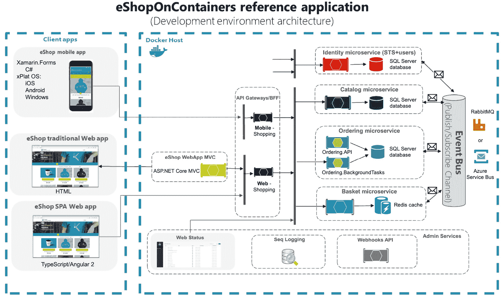

# 第四章：实施预提交安全控制

在初步规划阶段之后，应用程序开发过程转向代码开发阶段，这一阶段开始于开发者的系统或工作空间。 开发者虽然擅长功能开发和使用编程语言，但可能不知道或忽视了安全细节，导致出现错误。 如果这些错误没有早期发现并解决，可能会导致无意的漏洞，从而可能危及软件或它处理的数据 安全。

此外，如果开发环境/工作空间管理不当，可能会导致攻击者注入恶意代码或组件，成为 软件的入口点。

在本章中，我们将重点介绍可以在代码更改提交 到 **版本控制系统** (**VCS**)之前实施的安全措施和检查。 这包括实施安全控制，以减少开发环境的风险，并设置安全保护措施，在代码提交到本地代码仓库之前，识别和修复漏洞及常见错误。 本章结束时，你将全面理解以下 关键领域：

+   保持安全的 开发环境/工作空间

+   防止敏感文件或密钥泄露到代码中的技术 方法

+   在 IDE 中使用安全扩展以获取实时 安全反馈

+   实施预提交检查，以确保在提交到 本地仓库 之前代码的安全性。

这些主题将为你提供必要的知识和技能，以便将安全实践融入到 DevOps 工作流的代码开发阶段。 让我们 深入了解！

# 技术要求

要跟随本章中的指示，你需要 以下内容：

+   一台带有 互联网连接的 PC

+   一个有效的 Azure 订阅

+   一个 Azure DevOps 组织

+   一个 GitHub 企业组织

# DevOps 预提交编码阶段概述

在 *理解 DevOps 工作流中的各个阶段* 这一章节中 *第一章*, *敏捷、DevOps 和 Azure 概述*，我们概述了标准 DevOps 工作流的八个阶段。 尽管这些阶段的实施在不同组织之间可能有所不同，一些阶段甚至可能为了效率而合并，但总体顺序 保持一致。 在规划阶段之后，过程进入代码开发阶段，从开发者环境开始。 为了使本书中的讨论更加清晰和结构化，我们将代码开发阶段分为 两部分：

+   `git add` 操作，表示这些更改已经准备好保存或提交（*步骤 2* 在 *图 4**.1*）。 开发者接着使用 `git commit` 操作将暂存的更改保存到本地代码库（*步骤 3* 在 *图 4**.1*）。 这不仅存储了更改，还记录了修改的日志。 值得注意的是，大多数情况下，暂存和提交作为单一操作完成 以提高效率。

+   `git push` 操作。 这一阶段专注于管理代码在该 中央代码库中的状态：


图 4.1 – DevOps 代码开发阶段

鉴于本章的主要关注点是 *预提交阶段*，理解活动发生的开发者环境非常重要。 开发环境的选择在这一阶段如何实现安全性起着至关重要的作用。 在我们讨论其对安全性的影响之前，先来仔细看看可用的开发环境选项。 以便更好地了解其安全性影响。

注意

我们的目标不是全面介绍开发者环境和工具，而是提供一个可用选项的广泛概述。 我们认为，对于负责 DevOps 实践安全性的人来说，了解这些选项及其相关 安全风险是有益的。

## 理解开发者环境选项

传统上，开发人员 使用本地工作站作为开发环境。 根据组织设备设置过程的不同，这可能包含或不包含编码和参与项目所需的基本工具，如用于源代码管理的 Git、所需语言的 SDK，以及像 Visual Studio 或 Visual Studio Code 这样的 IDE。 此外，许多扩展和工具，包括像 GitHub Copilot 这样的 AI 工具， 通常会被添加。

使用本地工作站进行开发有几个缺点，主要的问题是进入高效状态的延迟。 设置环境并安装所有必需的软件，如 IDE、SDK、扩展和库，可能需要耗费大量时间。 开发人员加入项目后，可能需要数小时、数天，甚至更长时间才能开始高效工作。 举个例子，我（David）最近与一位工程负责人讨论时，他们分享道，开发人员加入项目后通常需要一个月才能提交第一次 PR， 这在他们的组织中是常态！

本地工作站的另一个缺点是，如果系统崩溃或需要更换，整个设置过程通常需要重新开始。 如果有持续的备份，可以避免这种情况，但大多数工作站并没有备份。 另一个挑战是，开发人员需要同时处理多个项目。 在中型到大型组织中，开发人员通常不会仅专注于一个项目。 他们往往需要跨多个项目工作，或者同时为几个项目做贡献。 有时，一个项目所需的工具可能与另一个项目发生冲突，导致开发人员难以顺利从一个项目过渡到另一个项目。 另一个问题是，在处理大型项目时，本地工作站的计算资源有限，例如 像 **机器学习** (**ML**)模型或复杂的 单体应用程序。

从安全角度来看，本地开发工作站通常通过 VPN 或直接连接到公司的内部网络。 如果这些计算机遭到入侵，威胁不仅仅是攻击者获取源代码；它还可能使攻击者能够在网络中横向移动，从而访问其他系统和数据。 这种横向移动可能导致更广泛的泄露和更 严重的损害。

为了解决这些挑战，组织正在探索现代开发环境选项，例如 以下几种：

+   **云端开发工作站**：例如， **平台即服务（PaaS）** (**PaaS**)解决方案，如 **Azure 虚拟桌面** (**AVD**) 或 **软件即服务（SaaS）** (**SaaS**)产品，如 Azure 的 **Dev Box**。Dev Box 是为开发者设计的 云端工作站。 它为开发者提供了快速访问 强大计算机的能力，这些计算机已经准备好用于编码。 这些工作站由开发团队设置，配备了他们需要的工具。 IT 团队可以像管理常规笔记本一样管理这些云端工作站。 他们可以实施安全加固，部署工具，审计，并通过自动化维护环境，最大限度地减少数据丢失的风险。 开发者也喜欢它，因为他们可以在不同的 Dev Box 工作站之间切换，每个工作站都为各自的项目提供了资源，并且他们可以通过将工作站置于低功耗休眠模式来节省成本， 当工作站未使用时。

+   **云端集成开发环境（IDE）**：最近，云端 IDE 已成为代码开发的热门选择。 它们使开发者能够直接从网页浏览器中编写、运行和调试代码，无需本地开发环境。 最常见的云端 IDE 有 GitHub Codespaces、 **亚马逊网络服务（AWS）** Cloud9、Gitpod、Codeanywhere，以及 Eclipse Che。

    云端 IDE 解决了许多本地工作站面临的挑战。 它们显著缩短了 **生产力提升时间** (**TTP**)，让开发者在加入项目后几分钟内就能开始编写代码，而不是等待数小时或数天来安装工具。 对于资源密集型项目，云端 IDE（如 GitHub Codespaces）可以扩展到 32 个 CPU 核心和 64GB 的内存。 这非常强大！ 此外，当开发者在多个项目中工作时，他们可以为每个项目维护一个独立的工作区，从而避免工具 之间的冲突。

    *图 4**.2* 展示了 GitHub Codespace 云 IDE 的架构。 如图所示，codespace 托管在运行 Linux 的容器中 **虚拟机** （**VM**）在 Azure 上。 我们可以选择我们喜欢的编辑器连接到它。 虽然我们可以直接在 Web 浏览器中编码，但也可以选择使用各种桌面 IDE，包括 Visual Studio Code：


图 4.2 – GitHub Codespace 架构

+   `devcontainer.json` 文件。 该文件告诉 Visual Studio Code 或 GitHub Codespaces 如何创建（或访问）一个开发容器，其中包含项目所需的明确定义的工具和运行时堆栈。

    这种设置的主要优势在于消除设置延迟，开发人员可以直接开始编码，无需设置工具和依赖项。 它还具有环境一致性的额外好处。 当多个开发人员共同参与项目时，这确保了每个人都使用 统一的环境。

    在 *图 4**.3*中，我们展示了 Visual Studio Code 中开发容器的工作原理。 基本上，Visual Studio Code 解析 `devcontainer.json` 文件，并创建一个带有 Visual Studio Code 服务器的开发容器。 然后，它会将本地 PC 的工作区文件挂载到容器中，或者将它们克隆到容器中。 在 `devcontainer.json` 文件中定义的任何额外扩展都会被安装到容器内。 这种设置允许开发人员通过简单连接到 另一个项目来轻松切换不同的项目环境：


图 4.3 – Visual Studio Code 中的开发容器架构

在了解了可用的各种开发环境选项之后，还需要了解这个阶段的工作流程。 在本章中，我们主要关注预提交阶段的安全性，所以让我们进一步探讨 这一点。

## 理解预提交阶段中的安全类别

我们将要讨论的 此阶段的两个主要安全类别。 第一个关注开发环境或编码工作空间的有效安全卫生。 第二个旨在减少开发人员在编码过程中常犯的安全错误：


图 4.4 – DevOps 提交前编码阶段的两个主要安全类别

让我们从处理第一个风险类别开始，并采取适当的安全措施。 实施必要的安全措施。

# 确保开发环境的安全

攻击者 越来越多地针对开发者工具和工作空间（集成开发环境、扩展、SDK 等），无论它们是本地运行还是基于云的，旨在干扰提交前阶段的活动。 通过破坏这些工具，攻击者能够在软件开发过程的早期嵌入恶意代码，目的是影响大量的 下游用户。

但为什么要在提交前阶段针对活动进行防护？ 因为这有时可以让它们绕过后续更严格的安全检查。 不幸的是，许多组织往往会在没有进一步审查的情况下信任开发人员提交的代码。 攻击者正是利用这种信任，悄悄地将恶意代码潜入系统。 一个显著的例子是 2019 年的 Solorigate 安全漏洞，黑客在早期阶段悄无声息地加入了 4000 行恶意代码，这使得该代码在提交到 代码库后，得以通过官方批准并数字签名。

Solorigate 漏洞

有关 Solorigate 漏洞的详细 概述和时间线，请参考此 文档： [https://www.microsoft.com/en-us/security/blog/2020/12/18/analyzing-solorigate-the-compromised-dll-file-that-started-a-sophisticated-cyberattack-and-how-microsoft-defender-helps-protect/](https://www.microsoft.com/en-us/security/blog/2020/12/18/analyzing-solorigate-the-compromised-dll-file-that-started-a-sophisticated-cyberattack-and-how-microsoft-defender-helps-protect/)

有些人可能知道这个漏洞作为 Sunburst，这也是被 注入的恶意软件的名称。

这是我们采用 DevOps 工作流时必须发生的思维方式转变之一。 安全措施需要从 软件开发生命周期的早期阶段就开始强大 **（SDLC）** 。**SDLC**）。 仅仅因为代码来自内部源，就信任它是很有风险的。 不应给予隐性信任！ 随着你在将安全性融入 DevOps（DevSecOps）的过程中成熟，你需要确保在验证开发者环境的安全性，并且代码经过严格的 安全审查后，才接收代码。

绝不应该因为代码来自内部源而给予隐性信任！

现在，让我们将注意力转向理解一些攻击者进入开发环境的入口点，并解决 这些风险。

## 风险 1 – IDE 漏洞风险

IDE，就像其他应用程序一样，可能 存在安全漏洞。 一个显著的例子是 **CVE-2022-41034**，这是 Visual Studio Code 中的一个关键漏洞，攻击者可以通过构造的链接或网站利用该漏洞，接管 Visual Studio Code 用户的工作站！ 此漏洞还影响了 GitHub Codespaces、GitHub 的基于 Web 的编辑器（ [https://github.dev](https://github.dev) ），以及 Visual Studio Code for the web（ [https://vscode.dev](https://vscode.dev) ）。

如果你认为这些问题较少见，你会错的。 自 2022 年 1 月以来，Visual Studio Code 已报告至少六个 **远程代码执行** （**RCE**）漏洞！ 这就是为什么保持本地安装的 IDE 更新至关重要。 像 GitHub Codespaces 这样的托管开发平台会自动处理安全更新，从而减少我们的维护任务。 然而，这并不涵盖插件 或扩展。

Visual Studio Code 漏洞查询

要 查看 Visual Studio Code 公布的漏洞列表，请访问以下 链接： [https://www.cvedetails.com/vulnerability-list/vendor_id-26/product_id-50646/Microsoft-Visual-Studio-Code.html](https://www.cvedetails.com/vulnerability-list/vendor_id-26/product_id-50646/Microsoft-Visual-Studio-Code.html)

有关 CVE-2022041034 的更多信息，请参考这个 **国家标准与技术研究院** (**NIST**) 链接： [https://nvd.nist.gov/vuln/detail/CVE-2022-41034](https://nvd.nist.gov/vuln/detail/CVE-2022-41034)

另外，使用如 GitHub Codespaces 等托管开发环境带来的附加好处之一是可以减少横向移动的风险。 通过将每个开发环境隔离在独立的虚拟机和网络中，Codespaces 确保了更严格的安全性。 虽然它并不能完全防范所有威胁，但潜在的安全漏洞在环境内蔓延的风险 大大降低！

## 风险 2 – 恶意和存在漏洞的 IDE 扩展

Visual Studio Code 是一款 轻量级 IDE，具有强大的扩展生态系统，支持可扩展性。 无论你在 Visual Studio Code 中想要完成什么任务，可能都有相应的扩展。 截至 2023 年 9 月， Visual Studio Code 市场（[https://marketplace.visualstudio.com/vscode](https://marketplace.visualstudio.com/vscode)）已拥有超过 51,000 多个扩展！


图 4.5 – Visual Studio Code 市场

对于扩展来说，信任至关重要！ Visual Studio Code 中的扩展以与登录用户相同的权限运行。 对于许多开发人员来说，这就是本地管理员角色。 这意味着恶意扩展有可能安装其他应用程序（可能是恶意的），并在本地或远程修改代码。 安装恶意扩展的影响可能 是巨大的！

为了帮助减轻这一风险，开发人员必须能够评估扩展的可信度，以确保他们只安装 受信任的扩展。

因此，开发人员必须在安装扩展之前，能够评估其可信度。 为此，微软实施了多项措施，以确保市场中扩展的安全性：


图 4.6 – Visual Studio Code 市场扩展安全措施

在发布 之前，扩展会经过病毒扫描，并进行检查以防止名称抢注，检查内容包括 *官方* 发布者名称（*图 4**.6*）。 发布后，扩展会在每次发布者更新时重新进行病毒扫描。 如果社区报告某个扩展为恶意扩展，微软会进行评估。 如果验证通过，扩展将从市场中移除，并添加到 *黑名单*，使得每次安装时，Visual Studio Code 会自动卸载它（*图 4**.6*）。

虽然微软的安全措施值得称赞，但并非万无一失。 许多广泛使用的扩展是由社区贡献者创建的，这些贡献者不包括在官方发布者的名称抢注检查中。 一个真正的风险是仿冒流行扩展，诱使开发人员安装它们。 例如，Aqua Security 团队发布的研究就是一个案例。 他们创建了一个仿冒版本的 Prettier，这是一个受欢迎的 Visual Studio Code 扩展，拥有数百万次安装量，并成功发布到了市场。 他们将自己版本的 URL 命名为 `pretier-vscode` （只有一个 *t*），与正版 `prettier-vscode` （有两个 *t*）微妙不同——见 *图 4**.7*。发布后的 48 小时内，他们的版本就获得了来自多个国家约一千次开发者的安装。 世界各地的开发者纷纷安装！


图 4.7 – 比较市场中正版扩展和仿冒扩展

不幸的是， 大规模检查的执行可能并不容易。 一些组织可能会在其企业防火墙或终端防火墙上阻止不允许的扩展安装，但这也可能在开发人员认为这会影响他们的工作效率时带来摩擦。 此外，使用 Codespaces 可以有一个独立的批准扩展列表。 然而，除非组织中有 Visual Studio Code 扩展的相关政策，否则没有办法防止某人同步或添加其他扩展，这会带来各种 其他问题。

开发者在安装扩展之前需要接受培训，保持谨慎。 他们应该验证发布者的详细信息，阅读扩展的评论和评分，并检查下载次数。 但是，这将把安全责任交给开发者。 一些实践方法，例如工作区信任，可以提供帮助（我们将在下一节中介绍），但一个更好的系统来展示和控制扩展权限将是理想的。 自 2018 年以来，关于这个问题一直在持续讨论！ ([https://github.com/microsoft/vscode/issues/52116](https://github.com/microsoft/vscode/issues/52116))。

Aqua Security 研究

想了解更多 有关 Aqua Security 对 Visual Studio Code 扩展风险的研究，请参考以下 文档： [https://blog.aquasec.com/can-you-trust-your-vscode-extensions](https://blog.aquasec.com/can-you-trust-your-vscode-extensions)

## 风险 3 – 使用不受信任的代码

开发者经常 在其集成开发环境（IDE）中利用来自各种来源的开源代码，包括公共或不受信任的代码库。 例如，在研究新功能或解决问题时，他们可能会寻找解决类似问题的开源项目或代码片段，并将其打开在开发环境中以获得启发。 这种做法虽然有益，但也可能带来安全风险。 从不受信任的来源加载代码可能会使开发者面临恶意代码执行和依赖项被篡改等威胁。 这些威胁可能会窃取开发者环境中的访问密钥和令牌。

Visual Studio Code 及其扩展提供了多种执行代码的方式。 虽然这些方法简化了开发过程，但也可能为利用提供了一个入口点。 一个显著的例子是 `launch.json` 启动配置文件，它位于项目的根文件夹或开发者的工作区设置中。 此文件允许开发者保存调试 设置详细信息：


图 4.8 – 启动配置属性

在 `launch.json`中， `preLaunchTask` 属性定义了在调试开始前执行的任务，而 `postDebugTask` 属性决定了在调试会话结束后运行的任务（*图 4**.8*）。 虽然这些属性旨在增强调试体验，但它们可能被恶意行为者篡改。 攻击者可以修改这些任务，执行任意的潜在 有害代码。

注意

有关启动配置及其属性的更多详细信息，请参阅以下文档： [https://code.visualstudio.com/docs/editor/debugging#_launchjson-attributes](https://code.visualstudio.com/docs/editor/debugging#_launchjson-attributes)

当开发者使用来自不受信任来源的代码，并且这些代码包含一个预设的 `launch.json` 文件时，风险会放大。 此类配置可能包含执行 恶意代码。

为了减轻这一风险，Visual Studio Code 于 2021 年 5 月（版本 1.57）推出了 **工作区信任** 功能。 该功能在处理不受信任的代码时增加了一层额外的安全防护。 当开发者打开这类代码时，工作区信任对话框会提示他们为代码指定信任级别。 如果代码被判定为不可信，Visual Studio Code 将进入 **受限模式**：


图 4.9 – 工作区信任提示

此模式 通过禁用或限制某些功能来防止潜在的有害 操作，包括任务执行、调试、工作区设置修改和特权扩展（*图 4**.9*）。 信任加载代码的责任最终由开发者承担。 因此，开发者必须接受持续的安全培训，确保他们能做出明智的决定，选择信任哪些代码。

要编辑工作区信任设置，我们可以随时通过按 *Ctrl* + *Shift* + *P* 打开命令面板并输入 `Workspaces: Manage` `Workspace Trust`。

要完全禁用工作区信任，我们可以通过以下方式修改 Visual Studio Code 设置 `security.workspace.trust.enabled: false`


图 4.10 – 工作区信任 Visual Studio Code 设置

让我们回顾一下 一个较少见但重大的开发环境风险——被篡改的 IDE 源代码。

## 风险 4 – 被篡改的 IDE 源代码

也存在 IDE 源代码被篡改的风险！ 虽然这种情况不常见，但确实会发生。 想象一下，如果用于软件开发的工具本身被篡改了，会带来什么影响。 这不仅仅是一个假设的风险。 最近的一个现实事件涉及一位名为 **RyotaK**的安全研究员，他发现并利用了 GitHub 上 Visual Studio Code 仓库中的一个漏洞。 这个漏洞是由代码注入缺陷和一个 写错的 **正则表达式（regex）** 以及 **持续集成（CI）** 脚本中的问题所导致的，该脚本位于 Visual Studio Code 官方的 GitHub 仓库。 利用这一漏洞，他获得了写入该仓库源代码的权限。 这意味着他有可能修改全球开发者依赖的代码，影响 他们的工作。

如果 IDE 的源代码被恶意篡改且未被发现，可能导致篡改过的软件工具广泛传播，从而感染大量项目，注入恶意代码或后门。 这不仅会危及单个项目，甚至可能影响整个基础设施，特别是如果广泛采用的工具 受到影响的话。

要了解更多 RyotaK 的发现及其安全漏洞带来的影响，可以查看他的博客文章： [https://blog.ryotak.net/post/vscode-write-access](https://blog.ryotak.net/post/vscode-write-access)。博客是日文的，如果你不熟悉该语言，可能需要借助翻译服务，如 Google 翻译。

## 关于加强开发环境安全性的更多思考

根据我们的经验， 我们发现，某些我们讨论过的安全加固实践是广为人知的，在某些情况下， *常识*，但它们在许多环境中仍未得到实施和监控。 这很难解决。 当人们知道该做什么 *但* 没有付诸实践时，仅仅提供工具或一些通用的安全培训并不能解决问题。 这些问题根深蒂固。 解决这个问题通常需要在组织内进行某种形式的倡导和推广——这是一项艰苦的工作，需要 文化变革。

这些环境硬化实践必须无缝集成，才能得以实施。 集成开发环境（IDE）必须默认配置为自动更新，插件也必须尽可能默认配置为自动更新，或者至少组织应该有明确定义的端点管理流程，包括开发工具和插件。 如果可能的话，应该移除或 强烈不建议调整这些安全默认设置。

这是一项艰巨的任务，因为开发人员有时可能需要为了性能或向后兼容性禁用某些功能。 我们不能采取全有或全无的方法，因为有些开发人员可能出于正当理由反对在其环境中使用这些安全默认设置。 我们应该理解并包容那些有效的例外，并采取适当的缓解措施。 记住，安全措施必须是合作性的，才能在 DevSecOps 文化中有效。

# 解决常见的开发安全问题

现代软件在开发过程中引入风险的方式有很多种。 现代软件应用大多数是由内部开发人员编写的专有代码和第三方组件的*混合*，这些组件可能来自开源仓库、 *开放源代码* ，甚至是商业授权代码，虽然不常见，但确实存在（*图 4**.11*）：


图 4.11 – 现代软件组成

开放源代码软件

源代码可用软件意味着该软件的源代码是公开可供查看的。 然而，它并不一定赋予和 **开源软件** (**OSS**) 相同的自由。 虽然 你可以查看代码，但可能会有关于如何使用、修改或分发它的限制。 可以将其视为一种 *看看但别动手* 的共享软件代码方式。

这些组件中的任何一个都可能给软件带来风险！ 我们的 *内部代码*， *第三方代码和开源包* 也可能存在漏洞，并且还有 *暴露的密钥*，这可能是一个大问题。 识别并解决这些风险应从提交前阶段开始。 如果我们在 DevOps 周期的最后阶段发现安全问题，可能会导致功能发布的延迟， 甚至更糟，变成技术债务，随着时间的推移变得越来越难以修复。 考虑到这一点，我们来分解在提交前阶段需要优先处理的前三大风险类别，从我们 内部代码中的安全问题开始。

## 风险 1 - 解决内部代码漏洞风险

开发者是 人类，在编写代码时可能会犯安全错误。 例如，开发者可能忘记在使用用户输入进行数据库查询之前对其进行清理，从而为 SQL 注入攻击打开了大门。 另一个例子是，开发者可能忽略了实施适当的会话超时，导致应用程序容易受到会话劫持。 在 最近的 **Storm-0558** 微软泄露事件中，发现微软 365 邮件系统的开发者假设他们实现的某些库 已经完全验证了所需的范围，但他们没有添加必要的发行者/范围验证。 这一疏忽放大了当签名密钥 被泄露时事件的影响。

微软安全响应中心（MSRC）对 STORM-0558 泄露事件的分析

要查看 Storm-0558 漏洞的完整分析，请参考以下 文档： [https://msrc.microsoft.com/blog/2023/09/results-of-major-technical-investigations-for-storm-0558-key-acquisition/](https://msrc.microsoft.com/blog/2023/09/results-of-major-technical-investigations-for-storm-0558-key-acquisition/)

内部代码中的漏洞根本原因是多样的，因此没有单一的解决办法。 解决这一挑战需要一个全面的策略，融合文化变革和技术措施。 我们希望确保每次开发人员编写代码时，他们都能拥有所需的知识和工具，以编写最安全的代码。 解决这一风险的基础步骤是为开发人员提供安全编码培训，但尽管经过最佳的培训努力，安全疏忽还是不可避免。 为了 增加额外的缓解层，集成一个 **静态应用程序安全测试** (**SAST**) 解决方案，在 DevOps 的提交前阶段进行测试可能会 带来好处。

### 理解 SAST 工具的工作原理

SAST 工具 分析应用程序源代码、字节码或二进制代码，以在不运行程序的情况下识别漏洞。 因为它们可以自动化操作，所以比传统的手动审查更快。 随着准确性的提高，它们正在成为优于手动代码审查的首选，尤其是在已经采纳 DevOps 模式的组织中。 随着准确性提高，它们正成为比手动代码审查更受青睐的选择，尤其是在已经采用 DevOps 模式的组织中。 SAST 工具使用多种方法来实现这一目标，每种方法都有其优缺点。 和局限性。

一种常见的 方法是 **语法和语义分析**。在此方法中，工具将代码分解以理解其结构和模式。 例如，在用户输入直接添加到 SQL 查询中的情况中，这种方法会将该模式识别为潜在的 SQL 注入漏洞。 它通过解析代码并构建抽象表示来做到这一点，像是 **抽象语法树** (**AST**)，以 识别此类模式。 虽然这种方法可以发现许多漏洞，但它也可能会标记出一些并不是真正问题的内容（假阳性）。 对于大型 代码库，它也可能是资源密集型且运行缓慢的。

另一种方法 是 **数据流分析**，它跟踪数据如何通过程序流动，并分析数据是否被不安全地处理。 它使用启发式方法和预定义规则来追踪数据流动并识别不安全处理；例如，如果一个网页应用接受用户在表单中输入，并在没有首先清理数据的情况下直接在网页上显示。 通过绘制数据从输入点到其在网页上的目的地的旅程，数据流分析可以识别此类行为作为 潜在的 **跨站脚本** (**XSS**) 漏洞并标记它。 这种方法在识别与数据处理相关的漏洞方面非常有效，如 SQL 注入或 XSS。 它不适用于检测与数据流不直接相关的逻辑漏洞，如身份验证绕过。 如果工具未完全理解数据的生命周期，它可能还会产生误报。

**污点分析** 是 数据流分析的一种专业形式。 它跟踪用户控制的输入，以查看是否在没有验证或净化的情况下处理，可能导致漏洞。 例如，在聊天应用中，用户发送的消息如果未经检查或净化即显示给其他用户，污点分析将标记此类行为为潜在的存储型跨站脚本（XSS）漏洞，攻击者的消息可能包含恶意脚本在另一个用户的浏览器上运行。 它对于发现与用户输入相关的漏洞非常有效，比如注入攻击。 如果工具无法识别所有净化方法，则可能产生误报。 它通常使用启发式方法和 基于规则的检查。

SAST 工具采用的另一种方法 是 `true`/`false`。例如，考虑一个电子商务网站，该网站应在处理购买前检查用户是否已登录，这种方法将识别代码中是否存在跳过此检查的方式，从而导致潜在的未经授权访问。 这种方法非常适用于识别诸如身份验证绕过或缺失安全控制等逻辑漏洞。 但它在识别与数据相关的漏洞，如 SQL 注入 或 XSS 时效果较差。

**配置审查** 是 SAST 工具用于分析的另一种方法。 它的工作原理非常直接。 它通过分析配置文件和设置，以确保安全的默认值和设置。 它通过将配置与最佳实践或已知的安全配置进行比较来实现这一点。 例如，如果应用程序配置设置为显示详细的错误信息，配置审查将标记此为信息泄露漏洞，因为攻击者可能通过这些信息获取有价值的线索。 这种方法非常适合捕捉那些在手动审查中可能被忽视的不安全应用设置。 它不会检测到 代码逻辑中的安全问题。

大多数 SAST 工具采用多种方法相结合的方式，提供可能漏洞的全面视角。 它们旨在获得精确的结果，考虑到不同编程语言和框架的特性。 此外，这些工具通常会有预设的规则或查询，用于我们提到的不同分析技术。 有些工具甚至允许开发人员/安全团队创建自定义规则，以便在 代码中发现更独特的不安全编码模式。

### SAST 工具的挑战

SAST 工具有 优点，但也有局限性。 一个大局限性是它们在不运行代码的情况下进行分析，因此 它们无法完全掌握应用程序的行为上下文，这可能导致很多误报。 误报是指工具错误地识别出 安全问题。

以应用程序开发人员编写前端逻辑为例。 他们可能没有在代码中实现用户输入验证和清理，因为这部分工作由后端代码处理，而后端代码可能位于一个单独的代码库中。 分析代码的 SAST 工具无法获取到这个上下文信息，因此它会将缺失的实现标记为 漏洞。

一些 SAST 工具 使用简单的启发式方法或仅仅寻找基本模式来识别漏洞。 像这些工具在分析复杂代码结构时会遇到困难。 仅仅因为一段代码符合一个简单的模式，并不意味着它就有漏洞。 这就是 为什么在使用这些工具之前进行测试非常重要。 有些工具在避免误报方面比其他工具更为优秀。 事实上，有些工具的误报率可能高达 80%！ 这会让开发人员感到沮丧。 这些工具本应帮助简化工作，但开发人员却不得不花时间弄清楚哪些警告是真实的，哪些不是。 这可能会让他们想跳过使用 这些工具。

此外，一些工具仅指出已识别的漏洞，但没有清楚地解释为什么会被标记。 其他工具则更善于提供明确的原因，甚至提供自动修复来纠正 安全问题。

在我们看来，这些挑战并不会削弱 SAST 工具所带来的好处。 我们建议安全专家和开发人员共同合作，微调所选 SAST 工具的配置、查询和模式，并通过集成反馈逐步减少误报。 将其与手动审查相结合也是一个好主意，我们将在 *第五章* 中进一步讲解 这一部分内容。

### 理解 SAST 在预提交阶段的集成点

在 DevOps 的 pre-commit 阶段正确地集成 SAST 可以在应用程序代码中检测到关键的漏洞， 这些漏洞在修复时最为简单且成本最低，尤其是在开发人员仍专注于任务时。 这种集成可以通过 IDE 安全插件或作为 **pre-commit hooks**进行。 每种方法都有其独特的优点。 **IDE 插件集成** 为开发人员提供即时的安全问题反馈， 在他们编写代码时。 一些插件甚至用波浪线突出显示安全问题，类似于语法错误指示，如 *图 4**.12*所示。 这种即时反馈就像是 **及时** （**JIT**）安全编程培训， 能够实时提醒开发人员潜在的安全漏洞。 然而，一个限制是并非所有的 SAST 提供商都提供 这样的插件：


图 4.12 – IDE 扩展（Checkov）在代码编写时标记安全问题的示例

要 理解什么是 pre-commit hooks，我们首先需要了解每个 Git 仓库的 `.git/hooks` 目录。 默认情况下，Git 在此目录中提供示例 hooks，但它们是未激活的（它们的扩展名为 `.``sample` ）。

Git hooks 有多种类型，例如 pre-commit、post-commit、pre-push、post-receive 等等。 每种类型对应 Git 工作流中的不同阶段。 pre-commit hook 是众多 Git hooks 中的一种。 它会在提交记录之前触发，使我们能够对即将提交的代码进行自动化检查（*图 4**.13*）：


图 4.13 – Pre-commit hooks 在提交记录之前被触发

Pre-commit 钩子是多功能的，可以运行各种脚本。 任何可以从命令行执行的脚本都可以用作 pre-commit 钩子。 鉴于大多数 SAST 工具作为命令行工具可用，将它们作为 pre-commit 钩子来进行自动化代码 评估变得非常简单。 如果 pre-commit 钩子脚本以非零状态退出，则会中止提交，给开发者一个在重新尝试提交操作之前修复问题的机会。

Git 默认设置的一个挑战是钩子是每个仓库本地的。 然而，团队通常希望在所有开发者之间共享和强制一致的钩子。 这就是像 pre-commit 框架这样的工具派上用场的地方，它帮助管理共享配置并 确保一致性。

pre-commit 框架与 pre-commit 钩子

术语 *pre-commit 钩子* 有时可能会与一个名为 *pre-commit 框架*的工具混淆。正如我们之前讨论的，pre-commit 钩子是一种特定类型的 Git 钩子，它会在提交记录之前触发。 pre-commit 框架是一个独立的工具，旨在简化设置和管理 pre-commit 钩子的过程。 它不需要手动编写和管理 `.git/hooks` 目录中的脚本，pre-commit 框架使开发者能够利用各种现有钩子，并轻松地将它们集成到仓库中。 使用 pre-commit 框架，我们在 `.pre-commit-config.yaml` 文件中定义所需的钩子，工具会负责将它们安装到适当的 Git 钩子目录中。

尽管 pre-commit 钩子非常宝贵，但有时开发者可能需要绕过它们。 这可能是由于错误的假阳性警告或有充分理由覆盖钩子。 像 `git commit --no-verify` 这样的命令允许绕过这些钩子，但它们应该谨慎使用。

### 与 pre-commit 阶段集成的 SAST 工具

多个 SAST 提供商 在 DevOps 的 pre-commit 阶段提供集成。 其中一些提供商完全是开源的，另一些则是纯商业性质的，少数提供了基础的开源版本，用户可以选择升级到功能齐全的商业版本。 *图 4**.14* 展示了常见的产品概览：


图 4.14 – 流行的 SAST 工具及其在 pre-commit 阶段的集成方式

本章稍后 我们将提供选择合适工具的建议。 现在，本节旨在介绍一些流行的 可用选项。

### 那么，AI 配对编程工具呢？

如 GitHub Copilot、Tabnine 和 Amazon CodeWhisperer 等 AI 工具将 **生成式 AI** （**GenAI**）的力量带入了开发团队。 毫无疑问，它们帮助开发者更快地编写代码，并且让他们对自己的工作感到更加满意。 最近的 GitHub 研究发现，使用这些工具的开发者比未使用工具的开发者工作速度快 55%。

来源 – GitHub Copilot 对开发者生产力影响的研究

若想更深入了解 GitHub 的研究，请查看此 文档： [https://github.blog/2022-09-07-research-quantifying-github-copilots-impact-on-developer-productivity-and-happiness/](https://github.blog/2022-09-07-research-quantifying-github-copilots-impact-on-developer-productivity-and-happiness/)

然而，人们对这些工具生成的代码的安全性表示担忧。 以 GitHub Copilot 为例，它基于一个 OpenAI **大语言模型** （**LLM**）。 这个模型是通过从公开的资源中获取代码进行训练的，包括 GitHub 上的开源代码。 这些代码来源中有些因使用过时的 API 和实施不安全的编码模式而臭名昭著。 因此，AI 可能会建议不安全的 代码片段。

研究 表明，许多开发者认为 AI 生成的代码质量很高，但研究却得出了相反的结论。 最近的一项研究对 ChatGPT（另一个 OpenAI 工具）在 21 个编程任务中的表现进行了评估。 它只生成了 5 个安全的程序，而其他 16 个程序在评估的漏洞方面存在安全问题。 例如，在被要求用 C++创建 FTP 服务器时，ChatGPT 的代码缺乏输入验证，容易受到注入攻击。 然而，在进一步的提示下，ChatGPT 确实修正了它的错误。 这表明，AI 生成代码的质量和安全性取决于开发者如何精确地提供经过精心设计的提示。

我们强烈建议那些希望使用这些工具的公司，应优先培训他们的开发者提供清晰、安全特定的提示。 你可以称之为 *安全代码提示* *工程培训*。

进一步阅读 – ChatGPT 生成的代码有多安全？

有关引用研究的更多详细信息，请查看来自加拿大魁北克大学的研究人员的论文： [https://arxiv.org/pdf/2304.09655v1.pdf](https://arxiv.org/pdf/2304.09655v1.pdf)

## 风险 2 – 开源组件风险

开源软件包 提供 灵活性、成本节约和快速开发的优势。 然而，它们也可能给软件项目引入风险。 这些风险可能来源于 **安全漏洞**、 **软件包被篡改**，或 **混淆攻击**。

当开发者将一个软件包添加到项目中时，他们也承担了该软件包的安全风险。 尽管许多开源项目维护者优先考虑安全性，但许可条款并没有要求他们确保安全——这并非他们必须履行的责任。 让我们讨论一些这些风险，以及如何在预提交阶段应对它们，从 安全漏洞 开始：

### 在预提交阶段解决已知开源软件漏洞风险

**已知漏洞** 是 开源软件代码中的 安全漏洞（可以将其看作是船只使用组件中意外产生的孔洞）。当安全研究人员识别出这些漏洞时，它们会被负责任地披露，并以 **常见漏洞与暴露** (**CVE**)的形式公开记录，如 MITRE 的 CVE 列表（[https://cve.mitre.org](https://cve.mitre.org)）和 **国家漏洞数据库** (**NVD**)（[https://nvd.nist.gov](https://nvd.nist.gov)）。 这些 数据库可以被安全工具搜索，用以识别特定版本的开源软件包中的已知漏洞。 虽然开发人员选择的包中的直接漏洞令人担忧，但还有另一个隐藏的风险：传递性依赖。 这些是作为所选开源软件包的依赖项自动包含的包（*图 4.15**.*）。 Endor Labs 研究团队最近的一项研究发现，95%的安全问题出现在这些 传递性依赖中：


图 4.15 – 开源软件包依赖关系

Endor Labs 的《依赖管理现状》报告

你可以参考此文档访问 报告： [https://www.endorlabs.com/state-of-dependency-management#](https://www.endorlabs.com/state-of-dependency-management#)

在提交前阶段解决 *OSS 已知漏洞* 风险的基础步骤是 *为开发人员提供有关如何为其项目选择安全的开源软件包的知识*。一些公司正在尝试新的方法来帮助开发人员做出这些选择。 例如，一些公司已经开始尝试使用 LLMs 和 GenAI 来简化这个过程。 因此，开发人员不再需要强制阅读关于如何选择安全软件包的长篇指南，他们只需问一些问题，比如 *是否有比 OpenSSL 库更安全的替代品？*，就会得到解释的回答。 一种名为 DroidGPT**的新工具，由 Endor Labs 制作，正试图实现这一目标。 它旨在帮助开发人员更轻松更快速地为其项目选择安全的开源软件包。 但它仍然是新的（并且处于私人预览阶段），我们尚不清楚它在实际情况中的表现如何。

在提交前阶段处理开源软件已知漏洞的另一种常见方法是 集成 **软件组成分析** (**SCA**) 工具，类似于我们描述的 SAST 工具集成。 这些工具检查应用程序中使用的开源组件和第三方库，以识别已知漏洞。 它们通过将这些组件与已知漏洞的数据库进行比较来运作。

#### SCA 工具面临的挑战

我们看到组织常见的一个严重错误是将 DevSecOps 的实施简化为工具采用。 有效实施 DevSecOps 不仅仅是部署 SCA 工具；它需要仔细的规划和对工具功能和限制的深刻理解。 为了理解项目中包含的依赖关系，大多数 SCA 工具会扫描项目的包管理文件，解析文件以提取依赖信息，并基于列出的依赖关系进行漏洞分析。 例如，当处理使用 NuGet 包管理器的 .NET Core 应用程序时，SCA 工具将分析 `.csproj` 文件以提取依赖数据，并根据 这些依赖关系进行漏洞评估。

然而，仅仅依赖包管理器数据来识别依赖关系可能会导致盲点。 包管理文件中声明的依赖项与代码中实际使用的存在时常不匹配。 有些依赖项可能在代码中声明但实际上未被使用，被称为未使用依赖项。 有些依赖项可能在代码中使用但未在包管理器文件中列出，称为虚假依赖项。

这种差异 可能会产生实际影响。 首先，警告未使用依赖项中的漏洞可能会导致大量不必要的警报，增加了开发人员的认知负担，他们本已时间紧迫。 另一方面，忽视扫描虚假依赖项可能会引入显著的安全盲点，这更加危险。

警告未使用软件组件（未使用依赖项）中的漏洞增加了噪音，这增加了已经在紧张进度下工作的开发人员的认知负担。 未能识别和扫描虚假依赖项会导致盲点，这更加危险。

通过识别这些挑战，更成熟的 SCA 工具已经发展。 这些工具不仅仅关注包管理器文件，还将这些数据与直接代码分析结合起来，提供更全面的评估。 我们的目标不是为特定工具进行宣传，而是认为团队需要意识到这些挑战，并将其纳入其 DevSecOps 策略中。

### 在提交前解决开源软件包妥协的风险

`eslint` 包。 然后，插入的代码从调用该包的人们的系统中窃取了 Node Package Manager（npm）凭据。

攻击者不仅可以修改主包，还可以将恶意包添加为依赖项。 在 EventStream 攻击中，恶意包 flatmap-stream 被添加到 event-stream 包中。 该恶意包含有一个加密负载，专门设计用于从 Copay 应用程序中窃取比特币。

ESLint 和 EventStream 攻击

有关 ESLint 攻击的事后分析，请参考这个 链接： [https://eslint.org/blog/2018/07/postmortem-for-malicious-package-publishes/](https://eslint.org/blog/2018/07/postmortem-for-malicious-package-publishes/)

有关 Snyk 对 EventStream 攻击的事后分析，请参考这个 链接： [https://snyk.io/blog/a-post-mortem-of-the-malicious-event-stream-backdoor/](https://snyk.io/blog/a-post-mortem-of-the-malicious-event-stream-backdoor/)

防止 包被篡改需要我们建立一个安全的包管理过程。 这包括确保开发者只能从可信的、知名的源或官方仓库下载包，并通过校验和或类似技术验证这些包的完整性，以确保它们没有被篡改。 保持关注你使用的包的安全警报也是一种防护措施。 像 GitHub 这样的平台经常发布安全公告。 以最小权限运行包可以进一步减少被篡改包可能造成的损害。 我们将在本书的 *第六章* 中进一步讨论安全依赖管理，敬请期待。

### 解决预提交阶段的依赖混淆攻击

**依赖混淆攻击** 是一种欺骗性战术，攻击者将恶意包命名为与真实包类似的名称，并将其上传到公共包仓库。 目标是欺骗开发者下载并集成这些恶意包，认为它们是合法包，从而将漏洞或后门引入他们的软件项目中。 包名称中的一个简单拼写错误可能会导致开发者下载到恶意代码，而这些代码最终会被分发给应用程序用户。 想象一下，你以为你正在绑紧救生衣，实际上却绑上了 一块重物。

在最近的一起事件中，Checkmarx、JFrog 和 Sonatype 的研究人员追踪到一个名为 RED-LILI 的威胁行为者，该行为者通过恶意的 `npm` 包 以攻击 Azure 开发者。该小组发布了恶意的 Azure SDK 包，但将 `@azure` 的作用域替换为 `azure-`，并且在某些情况下，他们完全移除了作用域，仅发布了一个与原名相同的包（*图 4**.16*）：


图 4.16 – RED-LILI 组发布的恶意 npm 软件包

这个组别的独特之处在于他们的复杂性。 他们自动化了整个过程，从 `npm` 帐户创建到恶意软件包发布，甚至绕过了 **一次性密码** （**OTP**）验证。 此外，他们并非使用单一帐户发布多个恶意软件包，而是为每个软件包创建了一个独特的帐户，这使得检测和清理工作更加具有挑战性。 仅在 1 周内，他们发布了大约 800 这样的软件包！

RED-LILI 攻击

[阅读更多](https://github.com/checkmarx/red-lili) 关于供应链威胁行为者 RED-LILI，请参阅此 页面： [https://github.com/checkmarx/red-lili](https://github.com/checkmarx/red-lili)

依赖混淆攻击也可以采取其他形式。 例如，目标可能是组织内使用的私有包，而不是开源软件包。 这里有一个例子 ：

假设有一家公司名为 *TechCorp* ，它为内部应用程序使用一个名为 `SecureLogin` 的私有包。 这个包的版本是 `1.5` ，并且不对公众开放。 有一个攻击者通过某些泄露的文档或内部信息得知 `SecureLogin` 的信息。 他们接着创建了一个恶意包，也命名为 `SecureLogin`，但是给它赋予了一个更高的版本号——例如， `2.0`。这个恶意包包含了当执行时会将敏感用户数据发送到攻击者服务器的代码。 攻击者将这个恶意的 `SecureLogin` 版本 `2.0` 上传到公共包仓库。 现在，当 TechCorp 的开发者获取他们的包更新时，包管理器看到 *更新的* 版本 `2.0` 的 `SecureLogin` ，并可能会自动下载并集成它，认为它是来自自己团队的合法更新（标记为 *图 4* 中的 *3* .17*）。 一旦集成，恶意代码就会激活，危害 公司的应用程序，并将敏感数据发送给 攻击者：


图 4.17 – 依赖混淆攻击目标：私有包

这并不是一种异常攻击。 Alex Birsan 记录了他是如何进行这种类型的依赖混淆攻击，突破苹果和微软等大公司的防线的，详情请见： https://medium.com/@alex.birsan/dependency-confusion-4a5d60fec610

在此次攻击中，他扫描了目标组织的公共仓库，特别寻找诸如 `package.json`这样的包管理文件。通过这些文件，他识别出了组织内部使用的、但未在公共包仓库中提供的私有包名称。 然后，他在公共仓库中创建了相同包名的更高版本，并等待它们被 下载。

为了应对依赖混淆的风险，我们需要一个明确的计划。 首先，开发人员应该接受安全开发培训，重点强调版本锁定的重要性，并教会他们识别依赖混淆的迹象。 工具如 `npm`的 `package-lock.json` 或 Python 的 `Pipfile.lock` 可以帮助确保安装正确的包版本。 如果使用内部包，最好避免从公共源下载。 在考虑新的依赖项时，仔细审查其历史、维护者的可信度、贡献过程以及其 最近的变更 是有益的。 在包选择和相关安全实践方面的谨慎应成为任何安全培训策略的核心组成部分。 所有这些都是全面依赖管理策略的一部分，我们将在本书的 *第六章* 中讨论。

## 风险 3 – 曝露的机密风险

为了增强 功能，现代应用程序常常与各种服务进行交互，如数据库、云存储和第三方 API。 因此，开发人员在编码过程中经常处理诸如认证令牌、密码和 API 密钥等机密，以便启用和测试 这些集成。

一个常见的错误是无意中将这些机密提交到版本控制系统（VCS），例如 Git。 一旦推送，尤其是推送到公共仓库，这些机密就会被恶意行为者访问，可能导致数据泄露或未经授权的访问。 这在私人仓库中也是一个风险，内部威胁的危险性与外部威胁一样大。 请记住，私人仓库未来可能会变为公开。 一个近期的例子是 Microsoft AI 研究人员在其公共 GitHub 仓库中意外泄露了 Azure Storage **共享访问签名** (**SAS**)令牌。 这次泄露导致 38 TB 私人数据泄露。

注意 – Microsoft AI GitHub 仓库泄露分析

要了解更多关于此次数据泄露的信息，请参阅此 文档： [https://www.wiz.io/blog/38-terabytes-of-private-data-accidentally-exposed-by-microsoft-ai-researchers](https://www.wiz.io/blog/38-terabytes-of-private-data-accidentally-exposed-by-microsoft-ai-researchers)

在代码中管理机密的挑战是多方面的。 这不仅仅是避免将它们提交，还包括安全地存储、访问和轮换它们。 需要一种整体的方法来应对这一风险。 应实施清晰的机密管理流程，并且开发团队应接受在 Azure 生态系统中进行机密管理的培训。 我们将在本书后面讨论如何使用 Azure Key Vault 进行 DevOps 过程中的机密管理。 本书后续将详细讲解。

在提交前 阶段，可以集成类似于 SAST 工具的机密扫描工具，以检测代码库中的机密或敏感信息。 它们扫描代码，寻找与常见机密格式匹配的模式，如 Azure 服务密钥或 连接字符串。

这些工具通过使用模式匹配、熵检查，有时还会使用机器学习来识别代码中的潜在机密。 例如，看起来像 Azure 服务密钥的字符串将会被标记出来。 它们可以无缝集成到提交前阶段，类似于 SAST 工具，以便在代码提交到 源代码管理系统之前捕获潜在的泄露。

# 选择合适的以开发者为中心的安全工具

最好的工具能让工程师更轻松地完成工作，或让工作变得更加愉快。

工具在实施 DevSecOps 中扮演着 至关重要的角色。 选择适合提交前阶段的工具应该是一个由所有软件开发过程中的团队共同决定的过程。 为了简化管理并在大规模推广时更为高效，建议采用那些提供平台优先、以开发者为中心的工具。 由于技术栈支持限制或 预算问题，这可能并不总是可行的。

以开发者为中心的安全工具是指那些在软件开发过程中优先考虑开发者需求的安全工具和解决方案。 这些工具类别专注于为开发者提供必要的功能，从一开始就帮助他们开发安全的应用程序，并能与标准的 开发工作流良好集成。

开发者通常倾向于选择能够提升生产力、让工作更轻松愉快的工具。 2020 年 Stack Overflow 和 JetBrains 的调查显示，开发者重视那些易于使用、与环境良好集成，并支持其首选语言和框架的工具。 与他们合作，选择最适合的工具。 *选择不被使用的工具是毫无意义的。* 

除了满足开发者需求外，这一阶段的工具还应促进所有利益相关者之间的协作。 这确保每个人都参与到集体的安全责任中。 例如，工具应允许团队之间轻松共享安全发现 。 如果一个团队创建了一个出色的查询，用于检测易受攻击的编码模式，你的工具应允许轻松将该自定义查询推广到组织中的其他团队。 。

选择工具时应重点考虑那些能提供 *有用* 且 *可操作* 反馈的工具。 许多工具可能会提供信息，但如果信息不可操作，则价值不大。 可操作的反馈至关重要，因为它可以教育开发者了解安全警告背后的原因，并告诉他们如何避免未来的类似问题。

# 动手练习 1 – 在 IDE 上执行代码审查、依赖检查和秘密扫描

要完成 这个动手练习，你需要先完成前一章节中的动手练习（*动手练习 1 – 配置实验室虚拟机*），我们在其中配置了实验室虚拟机。 在这个练习中，我们将进行 代码审查、检查依赖关系漏洞，并扫描代码中的秘密信息。 这是实现安全左移的重要阶段，因为我们可以在提交 代码之前识别并修复许多漏洞。

在这个练习中，我们将使用`eShopOnWeb`应用程序。该应用程序与 eShopOnContainers 应用程序相关，后者专注于容器和微服务。 另一方面，eShopOnWeb 则专注于传统的 Web 应用程序开发。 *图 4**.18* 展示了 eShopOnContainers 应用程序的参考架构：



图 4.18 – eShopOnContainers 参考架构（来源: https://learn.microsoft.com/en-us/dotnet/architecture/cloud-native/introduce-eshoponcontainers-reference-app）

以下是我们将在 本次练习中完成的任务：

+   **任务 1**：使用 Azure Bastion 连接到实验室虚拟机

+   **任务 2**：在 Visual Studio Code 上配置 Snyk

+   `eShopOnWeb` 到你的 Visual Studio Code 工作空间

## 任务 1 – 使用 Azure Bastion 连接到实验室虚拟机

此任务的目标是 使用 Bastion 服务 建立与 实验室虚拟机的连接：

1.  在 Azure 门户主页的搜索框中，输入 `DevSecOps-LabVM` 并在出现时选择 `DevSecOps-LabVM` 虚拟机：


图 4.19 – 选择 DevSecOps-LabVM 虚拟机

1.  在 **DevSecOps-LabVM** 窗口中，在 **连接** 部分，点击 **连接** | **前往 Bastion**：


图 4.20 – 选择使用 Bastion 连接虚拟机的选项

1.  在 `azureuser`

1.  **身份验证** **类型**： **密码**

1.  **密码**：输入你在 模板部署时指定的密码

1.  **在新浏览器中打开** **标签**：已选择

1.  点击 **连接**


图 4.21 – 配置虚拟机凭证并启动连接到虚拟机

1.  如果出现提示，启用 弹出窗口 以确保连接成功。 另外，如果提示，点击允许访问剪贴板 ：

现在你已经可以访问 实验室虚拟机，让我们在 IDE 中进行代码审查、依赖检查、秘密扫描和 **软件物料清单** (**SBOM**) 生成。

## 任务 2 – 在 Visual Studio Code 中配置 Snyk

在本任务中，我们将 在 Visual Studio Code 中设置扫描工具。 我们 将使用 Snyk（[snyk.io](http://snyk.io)）：

1.  在实验室虚拟机的桌面上，你会找到 Visual Studio Code。 这个程序已经为你预先安装好。 请打开 Visual Studio Code。

1.  在 IDE 中，你可以使用多种开源和商业工具进行代码扫描、依赖检查、秘密扫描和 SBOM 生成。 选择源代码分析工具取决于多个因素，包括使用的编程语言、工具是否开源或 商业化、工具的准确性、是否作为扩展支持常用的 IDE 等等。 因此，了解哪些工具适合你的使用场景，并在继续使用某个工具之前进行适当的 **概念验证** (**POC**) 非常重要。 在使用特定工具之前，进行充分验证。 以下是 **全球开源应用程序安全项目** (**OWASP**)（[https://owasp.org/www-community/Source_Code_Analysis_Tools](https://owasp.org/www-community/Source_Code_Analysis_Tools)）列出了市场上可用的一些工具、支持的平台和扫描的编程语言。 对于这个练习，我们将 使用 Snyk，它可以扫描开源安全性、代码安全性以及 **基础设施即代码** (**IaC**) 安全性。

1.  我们通过在搜索栏中输入 `Snyk` 来安装 Snyk Visual Studio Code 扩展。 点击搜索结果中的第一个 Snyk 实例，如下图所示，然后 点击 **安装**：


图 4.22 – 安装 Snyk Visual Studio Code 扩展

1.  接下来，让我们配置 Snyk Visual Studio Code 扩展。 我们从扩展设置开始配置 ，可以通过点击左侧的 Snyk 图标并点击 设置图标来访问，接着选择 **扩展设置**：


图 4.23 – Snyk 扩展设置

1.  现在，让我们按以下步骤配置 Synk 扩展 ：

    +   `--all-projects`

    +   **高级：自动依赖管理** 已选中

    +   **高级自动扫描开源安全** 已选中：


图 4.24 – Snyk 高级扩展设置

1.  勾选 以下 Snyk 特性： **代码质量**、 **代码安全**、 **基础设施即代码**和 **开源安全** ：


图 4.25 – Snyk 特性扩展设置

1.  最后，确保 **Snyk: 扫描模式** 已设置为 **自动** 并且 **Snyk: 严重性** 已选中 用于 **严重**、 **高**、 **中**和 **低**，如下面的截图所示：


图 4.26 – Snyk 扫描和严重性扩展设置

1.  为了让 Synk 扫描你的项目，你必须使用 Snyk API 密钥进行身份验证。 点击 Snyk 图标，然后选择 **信任工作区** **并连接**：


图 4.27 – 设置 Snyk 代码扩展身份验证

1.  点击 **信任工作区并连接** 将带你进入 Snyk 网页应用程序 进行身份验证。 点击 **身份验证**：


图 4.28 – Snyk 网页应用程序身份验证

1.  认证成功后，你将收到如下确认信息。 关闭浏览器并返回 Visual Studio Code：


图 4.29 – Snyk 认证成功

现在我们可以 继续进行 *任务 3* ，在成功配置 Snyk 扩展后。

Visual Studio Code 扩展认证

请注意，如果上述步骤无法成功配置你的 Snyk 扩展，你可能需要手动设置 token，方法是 按照以下步骤操作：

+   [https://docs.snyk.io/scm-ide-and-ci-cd-integrations/snyk-ide-plugins-and-extensions/visual-studio-code-extension/visual-studio-code-extension-authentication](https://docs.snyk.io/scm-ide-and-ci-cd-integrations/snyk-ide-plugins-and-extensions/visual-studio-code-extension/visual-studio-code-extension-authentication)

+   [https://docs.snyk.io/getting-started/how-to-obtain-and-authenticate-with-your-snyk-api-token](https://docs.snyk.io/getting-started/how-to-obtain-and-authenticate-with-your-snyk-api-token)

## 任务 3 – 将 eShopOnWeb 导入到你的 Visual Studio Code 工作区

在此任务中，我们将 导入我们将要使用的应用程序：

1.  我们将 审查 `eShopOnWeb` 应用程序，检查 Visual Studio Code 编辑器中的安全漏洞。 导航到 **EXPLORER** 在 Visual Studio Code 编辑器的左侧窗格中，然后点击 **克隆仓库**：


图 4.30 – 克隆仓库

1.  粘贴 `eShopOnWeb` 仓库（[https://github.com/PacktPublishing/eShopOnWeb_DevSecOps](https://github.com/PacktPublishing/eShopOnWeb_DevSecOps)），然后选择 **从 URL 克隆** **https://github.com/PacktPublishing/eShopOnWeb_DevSecOps** 选项：


图 4.31 – 从 GitHub 克隆

1.  你需要选择一个文件夹作为仓库的目标。 点击 `eShop`，然后点击 **选择为** **仓库目标**：


图 4.32 – 选择文件夹作为仓库目标

1.  一个弹出窗口 将 出现在 Visual Studio Code 的右下角，显示克隆状态。 完成后，你将被要求打开克隆的仓库； 点击 **打开**：


图 4.33 – 打开克隆的仓库

1.  你将被问到是否信任文件夹中的文件作者。 选择 **是，我信任** **作者**：


图 4.34 – 信任文件的作者

1.  Snyk 将 然后 在 Visual Studio Code 的右下角发送一个通知，询问 **信任文件夹并继续** 或 **不信任文件夹**。选择 **信任文件夹并继续** **并继续**。

1.  Snyk 将开始分析文件，并在 Visual Studio Code 编辑器的左下角显示安全问题的数量： 代码编辑器：


图 4.35 – Snyk 显示安全问题的数量

1.  点击问题的数量；这将显示 Snyk 找到的安全漏洞的详细信息： 由 Snyk 提供：


图 4.36 – 在 eShop 上发现的安全问题列表

1.  查看 代码安全性、配置和代码质量问题的列表，以了解发现的一些 问题：


图 4.37 – eShop 上的代码安全性、配置和代码质量

查看生成的代码安全性、配置和代码质量错误列表。 选择一个代码安全错误以了解漏洞的详细信息、易受攻击的代码行以及修复建议 漏洞。

# 实践练习 2 – 在 IDE 上安装和配置 Git 提交前钩子

在本练习中，我们 将安装并配置 Git 预提交钩子。 如前所述，预提交钩子是 Git 钩子的一种类型，它会在提交记录之前被触发。 我们将使用预提交框架（[https://pre-commit.com](https://pre-commit.com)）。 该 框架允许开发者利用各种现有的钩子，并将它们轻松集成到仓库中。 支持的钩子列表可以在此查看： [https://pre-commit.com/hooks.html](https://pre-commit.com/hooks.html)。这些钩子在 `.pre-commit-config.yaml` 文件中定义，工具会将它们安装到适当的 Git 钩子目录中。

以下是我们将在本练习中完成的任务：

+   **任务 1**：在 Visual Studio Code 中安装预提交框架

+   在 Visual Studio Code中配置`detect-private key`和`detect-secrets`预提交钩子

## 任务 1 – 在 Visual Studio Code 中安装预提交框架

在此任务中，我们 将在 Visual Studio Code 中设置一个 预提交框架工具：

1.  使用`pip`安装预提交包管理器。请在 Visual Studio 终端中运行以下命令：

    ```
    pre-commit --version to show what version of pre-commit was installed:
    ```


图 4.38 – 安装的预提交版本

## 任务 2 – 在 Visual Studio Code 中配置 detect-private key 和 detect-secrets 预提交钩子

在此任务中，我们 将配置两个预提交钩子。 查看 支持的钩子列表 在 [https://pre-commit.com/hooks.html](https://pre-commit.com/hooks.html)。你可以在 `.pre-commit-config.yaml` 文件中配置多个钩子。 在本任务中，我们将配置 `detect-private-key` ，该钩子来自 [https://github.com/pre-commit/pre-commit-hooks](https://github.com/pre-commit/pre-commit-hooks) 以及 `detect-secrets` ，该钩子来自 [github.com/Yelp/detect-secrets](http://github.com/Yelp/detect-secrets)：

1.  在`eShoponWeb`应用程序的根目录中创建一个文件，并命名为`.pre-commit-config.yaml`。

1.  在`.pre-commit-config.yaml`文件中添加以下脚本：


图 4.39 – 配置预提交钩子

1.  现在让我们通过运行`pre-commit install`来安装 Git 钩子脚本：


图 4.40 – 安装 Git 钩子脚本

1.  我们现在将针对`eShoponWeb`目录中的所有文件运行钩子：


图 4.41 – 运行 Git 钩子以处理所有文件

我们看到两个预提交钩子都失败了，因为检测到私钥，并且在多个列出的位置发现了秘密。最好的做法是修复错误，然后提交更改。

由于我们已配置了这两个预提交钩子，如果发现任何私钥和秘密，它们将阻止提交。

# 概述

本章中，我们研究了此开发阶段的两个主要安全问题。首先，我们讨论了确保安全的开发环境或工作空间。这意味着确保编码发生的工具和平台，如 IDE，是安全的，免受漏洞的威胁。我们还提到了恶意 IDE 扩展的风险以及处理不受信任的代码时的挑战。我们强调了需要采取措施应对可能的 IDE 漏洞。其次，我们解决了可能导致安全问题的常见编码错误。我们介绍了诸如秘密扫描工具，以检测暴露的敏感数据，SAST 用于查找代码漏洞，SCA 用于检查第三方组件的安全风险等工具。凭借这些知识，你现在更有能力在 DevOps 过程中处理安全挑战。直到目前为止，我们的 DevSecOps 讨论并未聚焦于 Azure。这是因为在预提交阶段之前，Azure 并没有太多特定内容可供讨论。接下来的章节将有所变化，我们将讨论源代码管理中的安全集成，并重点介绍 Azure 工具的使用。到时候见！
